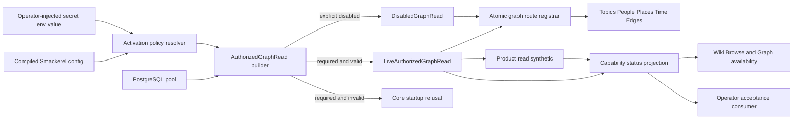

# Bug Fix Design: BUG-080-001 Graph API Fail-Loud Runtime Activation

## Design Brief

### Current State

Smackerel validates the five `KNOWLEDGE_GRAPH_API_*` limit settings and the
cursor-secret indirection name in `internal/config/knowledge_graph_api.go`.
The runtime then loads the same settings a second time in
`internal/api/graphapi/config.go`. `cmd/core/wiring.go` catches a config,
secret-resolution, or codec error, logs a warning, and continues with all five
Graph API handler fields nil. `internal/api/router.go` interprets those nil
fields independently and omits the corresponding routes.

The existing API foundation is otherwise useful: `graphapi.Limits` bounds list,
edge, and time reads; `CursorCodec` signs opaque cursors; every data route is
inside bearer authentication plus `knowledge-graph:read`; and
`CrossLink`/`ResolveReason` provide server-owned relationship explanations.
The activation boundary, not the existence of these primitives, is the defect.

### Target State

Core resolves one explicit Graph API activation policy and constructs one
`AuthorizedGraphRead` capability before building the router. Required mode is
all-or-nothing: config, secret value, cursor codec, PostgreSQL pool, every graph
family, and the route manifest must be valid or core refuses startup. Disabled
mode is explicit and observable; it is never inferred from a missing value.

Wiki Browse, Graph, Outline, Table, Path, product readiness, and the read-only
synthetic consume the same capability state and outcome vocabulary. Static PWA
files, a green database probe, or a subset of mounted routes cannot produce an
`Available` claim.

### Patterns To Follow

- Keep `internal/config/knowledge_graph_api.go` as the boot-time SST owner and
	use its already-loaded `KnowledgeGraphAPIConfig` in runtime wiring.
- Preserve `auth.RequireScope("knowledge-graph:read")` as the single graph read
	authorization boundary in `internal/api/router.go`.
- Preserve bounded reads through `internal/api/graphapi/limits.go` and opaque
	HMAC cursors through `internal/api/graphapi/cursor.go`.
- Preserve server-derived relationship text through
	`internal/api/graphapi/crosslink.go` and `reasons.go`.
- Follow the authenticated topology-redaction pattern in
	`internal/api/health.go`: unauthenticated health remains aggregate-only.

### Patterns To Avoid

- Do not follow the warning-and-nil branch in `cmd/core/wiring.go`; it converts
	required configuration failure into successful process startup.
- Do not follow the per-family nil checks in `internal/api/router.go`; they
	permit an incoherent subset of the graph contract.
- Do not treat `web/pwa/wiki.js` loading successfully as capability readiness;
	that module performs no graph read.
- Do not use the soft-empty cross-link behavior in
	`collectCrossLinks`/`scanTimeline` as explorer completeness proof. A failed
	supporting query and a successful empty query must remain distinguishable.

### Resolved Decisions

- Activation is an explicit closed enum: `required` or `disabled`; there is no
	implicit, optional, or inferred mode.
- One composite graph-read capability owns all family handlers and route
	registration; individual nullable handlers cease to be activation state.
- Required-mode construction returns an error to core startup; it never logs
	and continues.
- Disabled mode exposes a typed capability result and no usable Graph action;
	direct graph reads return a typed unavailable response rather than hidden
	route absence.
- Readiness is based on authorized, contract-valid reads in fixed family order,
	not route presence alone.
- The cursor secret stays an operator-injected value behind a generic env-name
	seam; no target value, path, or hostname enters Smackerel.

- Authorization is one operator-owned global corpus with three identity classes:
	operator (all private content plus operational metadata), grant-holder
	(`knowledge-graph:read` authorized global projection), and ungranted
	authenticated identity (leak-free denial). No tenant or per-user row isolation
	is introduced; the grant, not a row partition, differentiates the projection.

### Open Questions

None block the product design. The operator adapter mapping is an ownership-
routed question recorded in `## Routed Questions`.

## Purpose And Scope

This design repairs activation and readiness for the existing spec-080 Graph
API. It does not redesign the canonical PostgreSQL graph, add a parallel store,
change existing Wiki deep links, or implement the spec-105 visual explorer.
It establishes the one authorized graph-read foundation that spec 105 extends
for Browse, Graph, Outline, Table, and Path.

The product boundary includes:

- boot configuration and secret resolution;
- atomic capability construction and route registration;
- typed HTTP and capability-state outcomes;
- product-owned route manifest and authenticated read synthetic;
- single-global-corpus authorization for operator, grant-holder, and ungranted
	identities without tenant/user row isolation;
- Wiki/Graph availability projection;
- privacy-safe logs, metrics, traces, and status data.

The operator deploy adapter owns encrypted value injection and consumption of
the product-owned synthetic. This design specifies that seam without a concrete
target, secret name value, filesystem location, or host identity.

## Grounded Root Cause Analysis

### Confirmed Control Flow

1. `internal/config/config.go` invokes `loadKnowledgeGraphAPIConfig()` and
	 stores the result in `cfg.KnowledgeGraphAPI`; this validates the indirection
	 name but does not resolve the named secret value.
2. `cmd/core/wiring.go` ignores that loaded config and calls
	 `graphapi.LoadConfig()` again.
3. The same wiring function catches failures from `LoadConfig`,
	 `LoadCursorSecret`, and `NewCursorCodec`, emits `slog.Warn`, and returns no
	 error to the core constructor.
4. On any such failure, `Dependencies.TopicsHandlers`, `PeopleHandlers`,
	 `PlacesHandlers`, `TimeHandlers`, and `EdgesHandlers` remain nil.
5. `internal/api/router.go` checks those fields independently and omits each
	 route family. A client therefore sees ordinary Chi 404 behavior rather than
	 a Graph capability failure.
6. The comments on the handler fields in `internal/api/health.go` explicitly
	 describe nil as an accepted unprovisioned state, but `HealthResponse` has no
	 Graph activation section. General health can consequently remain healthy.

### Root Cause

Graph activation is represented by absence of wiring instead of a typed domain
state. Configuration is loaded twice, requiredness is not explicit, runtime
construction errors are demoted to warnings, and route registration accepts
partial composites. Health and PWA availability have no shared evidence source,
so static surfaces can outlive the API capability they promise.

### Secondary Contract Gaps

- `graphapi.errors.go` has no typed `capability_disabled`,
	`store_unavailable`, `schema_error`, or `route_incomplete` outcome.
- Several detail enrichments use log-and-empty behavior. That is acceptable
	only if the response carries explicit completeness metadata; otherwise an
	unavailable enrichment is indistinguishable from a true empty relation.
- Cursor encode failure is currently ignored when calculating `nextCursor`.
	A page that has more data can silently appear terminal.
- `web/pwa/wiki_lib.js::apiGetJSON` reduces every non-2xx response to a generic
	HTTP-number exception, preventing the UX state vocabulary from being derived
	from the server's typed envelope.

## Architecture Overview



Core creates exactly one `AuthorizedGraphRead` value. The router receives that
value rather than five independently nullable fields. `LiveAuthorizedGraphRead`
registers the complete route manifest. `DisabledGraphRead` registers the same
known graph paths with a typed unavailable responder and reports disabled to
the capability projection, making explicit policy distinguishable from a
missing route. Required-mode construction failure returns to the existing core
boot error path before the server begins accepting traffic.

## Capability Foundation

### Foundation Contract

| Contract | Responsibility | Consumers |
|---|---|---|
| `GraphActivationPolicy` | Closed `required` or `disabled` policy loaded explicitly from SST | Core boot, status, PWA availability |
| `AuthorizedGraphRead` | Non-nil composite for activation state, route registration, family reads, and safe capability metadata | Router, synthetic, spec-105 query service |
| `GraphRouteManifest` | Canonical fixed route/family inventory and required scope | Router, route canary, synthetic, readiness |
| `GraphFamilyReader` | Bounded authorized reads with typed populated, true-empty, partial, and failed outcomes | Browse, Graph, Outline, Table, Path |
| `GraphReadOutcome` | Closed safe state plus completeness, observed time, duration, and evidence reference | PWA, `/api/health`, synthetic output |
| `GraphCursorCodec` | Opaque signed cursor bound to resource and read context | Lists and bounded expansion |

### Extension Points

- A graph family implementation supplies its route descriptors and bounded
	reader but cannot independently decide activation or authorization.
- A projection consumes `GraphReadOutcome` and authorized records; it cannot
	reinterpret 404, auth failure, or store failure as empty.
- Spec 105 may add bounded query/path operations behind the same capability,
	scope gate, cursor codec, outcome vocabulary, and PostgreSQL source.
- The product synthetic consumes the foundation reader directly through HTTP
	behavior and emits value-safe evidence; deploy adapters only consume its
	result contract.

### Foundation-Owned Behavior

- one explicit activation decision per process boot;
- one authorization policy for every family and projection;
- atomic full-manifest route registration;
- server-enforced limits and cursor validation;
- stable node identity and relationship explanation ownership;
- distinction among true empty, partial, disabled, unauthorized, route missing,
	store unavailable, and schema error;
- immediate privacy clearing after session or scope loss;
- content-free observability and deterministic synthetic ordering.

## Concrete Implementations

### Required Live Graph Read

The builder requires all of the following before returning:

- activation policy equals `required`;
- validated `KnowledgeGraphAPIConfig` supplied from central boot config;
- the configured cursor-secret env name resolves to a non-empty value;
- `NewCursorCodec` succeeds;
- PostgreSQL pool is non-nil;
- topics, people, places, time, and edges readers are constructed;
- the route manifest contains every required route exactly once.

Failure returns a typed boot error. No handler reaches `Dependencies`, no
router is built, and no server listener starts.

### Explicit Disabled Graph Read

Disabled mode is valid only when the explicit activation policy equals
`disabled`. It does not resolve cursor-secret material and exposes no graph
records. It supplies value-safe capability metadata and a standard responder
for known Graph API paths:

```json
{
	"error": {
		"code": "capability_disabled",
		"message": "connected knowledge is disabled for this deployment"
	}
}
```

The response status is `503 Service Unavailable`, not 404. UI projections omit
or disable Graph actions with the spec-owned explanation. Browse may remain
available only if its own complete authorized read contract succeeds.

### Existing Resource Readers

The current topics, people, places, time, and edges handlers remain concrete
adapters over PostgreSQL. Their list/detail DTOs remain compatible. Their
outcome adapter adds completeness and safe failure metadata without allowing a
projection to infer state from item count alone.

### Variation Axes

| Axis | Options | Foundation Ownership |
|---|---|---|
| Activation policy | required, disabled | Yes; explicit and closed |
| Read operation | family list/detail, time window, edge neighborhood, later bounded query/path | Yes for auth/outcome/bounds; concrete reader owns SQL |
| Projection | Browse, Graph, Outline, Table, Path, readiness, synthetic | Shared state model; projection owns presentation only |
| Completeness | complete, true-empty, optional-partial, required-failed | Yes; policy cannot be weakened by clients |
| Runtime environment | test/validate or operated deployment | Same product contract; operator supplies only secret value and endpoints |

## Configuration And Secret Contract

### SST Shape

The compiled `knowledge_graph_api` block gains one required field:

```yaml
knowledge_graph_api:
	activation: ${KNOWLEDGE_GRAPH_API_ACTIVATION}
	list_default_limit: ${KNOWLEDGE_GRAPH_API_LIST_DEFAULT_LIMIT}
	list_max_limit: ${KNOWLEDGE_GRAPH_API_LIST_MAX_LIMIT}
	time_window_max_days: ${KNOWLEDGE_GRAPH_API_TIME_WINDOW_MAX_DAYS}
	edges_default_limit: ${KNOWLEDGE_GRAPH_API_EDGES_DEFAULT_LIMIT}
	edges_max_limit: ${KNOWLEDGE_GRAPH_API_EDGES_MAX_LIMIT}
	cursor_secret_env: ${KNOWLEDGE_GRAPH_API_CURSOR_SECRET_ENV}
```

`KNOWLEDGE_GRAPH_API_ACTIVATION` has no fallback. Any value outside
`required|disabled` is `F080-ACTIVATION-INVALID`. In required mode every limit,
the indirection name, and the named secret value are required. In disabled
mode the activation decision is complete without reading secret material; the
remaining fields may stay present for one generated schema, but they cannot
silently reactivate the capability.

### Value-Safe Secret Resolution

The product config names the env variable holding the secret; it never carries
the secret value in committed config. The operator adapter injects that named
value through its encrypted contract. Product diagnostics may report only:

- activation mode;
- config key or indirection env name;
- presence classification `missing|empty|present`;
- closed failure code.

Secret bytes, byte length, hash, prefix, suffix, and cursor bodies are excluded
from logs, traces, metrics, health, synthetic output, and HTTP errors.

### Boot Failure Codes

| Code | Condition | Safe Detail |
|---|---|---|
| `F080-ACTIVATION-MISSING` | Activation setting absent/empty | Config key only |
| `F080-ACTIVATION-INVALID` | Value outside closed enum | Config key and allowed enum |
| `F080-CONFIG-INVALID` | Required limits or cross-field constraints invalid | Offending non-secret key |
| `F080-CURSOR-SECRET-MISSING` | Named env variable absent | Indirection env name only |
| `F080-CURSOR-SECRET-EMPTY` | Named env variable empty | Indirection env name only |
| `F080-CURSOR-CODEC-INVALID` | Codec construction refuses material | Failure code only |
| `F080-GRAPH-STORE-UNAVAILABLE` | Required PostgreSQL graph source cannot initialize | Dependency class only |
| `F080-ROUTE-MANIFEST-INCOMPLETE` | Required family/route missing or duplicated | Family and route template only |

## Atomic Wiring And Route Registration

### Construction Boundary

`wireServices` receives the central config value and invokes one builder. The
builder returns either a complete `AuthorizedGraphRead` or an error. It does not
mutate `Dependencies` incrementally. Only after validation succeeds does core
assign the single capability field.

### Canonical Route Manifest

| Family | Method | Path | Required Scope |
|---|---|---|---|
| Topics | GET | `/api/topics/` | `knowledge-graph:read` |
| Topic detail | GET | `/api/topics/{id}` | `knowledge-graph:read` |
| People | GET | `/api/people/` | `knowledge-graph:read` |
| Person detail | GET | `/api/people/{id}` | `knowledge-graph:read` |
| Places | GET | `/api/places/` | `knowledge-graph:read` |
| Place detail | GET | `/api/places/{id}` | `knowledge-graph:read` |
| Time | GET | `/api/time` | `knowledge-graph:read` |
| Edges | GET | `/api/graph/edges` | `knowledge-graph:read` |

The registrar validates this complete manifest before calling Chi. Required
live mode registers all rows in one group under the existing bearer and scope
middleware. Disabled mode registers all rows against the disabled responder.
There is no per-family `if handler != nil` branch.

### Route Canary

The in-process canary enumerates the same manifest used by registration and
proves every method/path template is present once behind the expected scope.
It detects accidental route omission but is not readiness by itself. The
authenticated synthetic supplies behavioral proof.

## HTTP Outcome And Error Model

### Closed Read Outcomes

| State | HTTP Meaning | Projection Rule |
|---|---|---|
| `populated` | 200, valid schema, one or more authorized records | May contribute to Available |
| `true-empty` | 200, valid schema, zero records after successful read | Empty guidance; not Retry |
| `partial` | 200, valid records plus explicit permitted omission | Degraded with named omission |
| `capability-disabled` | 503 `capability_disabled` | Unavailable; no data action |
| `unauthorized-session` | 401 `unauthenticated` | Clear private state, re-authenticate |
| `unauthorized-scope` | 403 `forbidden` | Clear private state, disclose no graph existence |
| `not-found` | 404 `not_found` for a requested existing route resource only | Resource missing, never activation |
| `route-missing` | Synthetic observes an unregistered required route | Always activation failure |
| `store-unavailable` | 503 `store_unavailable` | Unavailable/degraded; never empty |
| `schema-error` | 500 `schema_error` for internal projection inconsistency | Omit unreadable data; never empty |
| `invalid-request` | 400 typed cursor/window/kind/limit error | Preserve prior valid view |

The existing generic `internal_error` responses are narrowed at the graph
boundary. PostgreSQL connectivity/timeout errors map to `store_unavailable`;
row/schema/reason invariants map to `schema_error`. Neither response exposes SQL,
table names, values, or driver text.

### Completeness Envelope

List responses remain backward compatible and add:

```json
{
	"items": [],
	"nextCursor": "",
	"read": {
		"state": "true-empty",
		"complete": true,
		"observedAt": "2026-07-23T00:00:00Z",
		"omissions": []
	}
}
```

An enrichment query may return `partial` only when policy explicitly marks it
optional and names the omitted family. Required edge/reason or base-row failure
returns a non-2xx typed error. Cursor encode failure is a schema error when
`hasNext` is true; it cannot silently emit an empty cursor.

## Product Read Synthetic And Readiness

### Synthetic Contract

The product-owned synthetic executes against the validate plane with a real
authenticated test user and disposable seeded PostgreSQL state. It performs no
create, update, delete, refresh, sync, or production write. It reads the fixed
families in this order:

1. Topics list and one detail when seeded.
2. People list and one detail when seeded.
3. Places list and one detail when seeded.
4. Time using an explicit bounded UTC window.
5. Edges for an explicit seeded source.

Each row emits only:

```json
{
	"family": "topics",
	"state": "populated",
	"durationMs": 12,
	"code": "OK",
	"evidenceRef": "graph-read/topics"
}
```

The aggregate is `available` only when every required family returns
authorized, schema-valid `populated` or policy-permitted `true-empty`. Any 404,
401, 403, 5xx, invalid schema, unreadable cursor, or missing row makes the
aggregate unavailable. An optional omission produces degraded only when the
manifest names that exact omission.

### Authenticated Health Projection

Authenticated `/api/health` gains a `knowledge_graph` capability section:

```json
{
	"activation": "required",
	"status": "available",
	"observedAt": "2026-07-23T00:00:00Z",
	"families": [
		{"family":"topics","route":"mounted","read":"populated","code":"OK"}
	]
}
```

It contains fixed family names, safe states, observed time, duration, and code.
It never includes labels, counts that reveal another user's data, route IDs,
secret metadata, auth material, or raw errors. Unauthenticated health retains
only the existing aggregate status.

General liveness remains separate. Strict readiness fails when Graph is
required and the latest product synthetic is unavailable. Explicit disabled
mode is a truthful non-ready result for a train that requires Graph and a
policy-valid disabled result only for a manifest that declares it optional.

## PWA And Projection Contract

`wiki_lib.js` gains a typed response decoder that reads the graph error and
completeness envelopes. It does not derive state from HTTP status alone or from
`items.length`. A single activation/read model owns the settled state for Wiki
Browse and Graph. Spec 105 reuses that model for Outline, Table, and Path.

On session or scope failure, the model clears normalized nodes, edges, labels,
counts, focus, path, and renderer pixels before publishing the blocking state.
Retry replaces the failed operation state and cannot stack stale alerts. Prior
verified content may remain only for a still-authorized session and carries its
observed time plus degraded limitation.

## Corpus Ownership And Authorization Model

Spec-080 (revision 2026-07-24) establishes one operator-owned global knowledge
corpus accessed by three authenticated identity classes. This design grounds
requirements GRAPH-ACT-005 and GRAPH-ACT-011 and the spec's "Corpus Ownership
And Private Access" section against the existing PostgreSQL graph and the
`knowledge-graph:read` grant, without introducing tenant or per-user row
isolation.

### Single Global Corpus

Artifacts, topics, people, places, time, edges, Digest, Synthesis, and derived
knowledge form ONE operator-owned corpus. Multiple authenticated identities are
principals with roles and grants against that single corpus; they are not
separate tenants and do not each own a private duplicate graph. No read path
partitions rows by identity, adds an owner/tenant predicate, or claims per-user
row isolation. A granted read returns the authorized projection of the same
global rows every other granted principal would see. Private graph content is
operator-private by default; the grant permits reading the authorized global
projection, it does not assert ownership of individual rows.

### Identity Classes And Grant

`knowledge-graph:read` is the explicit Graph read grant. It is the single
authorization boundary already enforced in `internal/api/router.go`; this design
reframes its meaning under the global-corpus model rather than renaming it.

| Identity class | Read of private graph content | Graph operational metadata | Mutation | Denial disclosure |
|---|---|---|---|---|
| Operator | All private graph content across the global corpus | May read activation/operational metadata | None through this read-only capability | n/a (authorized) |
| Grant-holder (`knowledge-graph:read`) | Authorized global-corpus projection only | Not exposed | None through this read-only capability | n/a (authorized) |
| Ungranted authenticated identity | None | None | None | Access denial only |

- Authentication alone is insufficient: a valid session without the grant is an
	ungranted identity (GRAPH-ACT-011).
- An ungranted read returns `unauthorized-scope` (HTTP 403 `forbidden`) and
	discloses no labels, nodes, edges, counts, route-family existence, source
	titles, or graph-existence hints. To the caller it is indistinguishable from an
	empty or non-existent corpus.
- The operator's broader read (all private content plus operational metadata) is
	a superset of the grant-holder projection; it remains a read-only capability and
	mutates nothing.
- `true-empty` is returned only after a successful authorized query on the global
	corpus, never as a substitute for denial (GRAPH-ACT-005).

### Denial Is Leak-Free And Clears Prior Content

Grant loss or scope denial follows the existing privacy-clear rule: normalized
nodes, edges, labels, counts, focus, path, and rendered pixels are removed
before the blocking state appears (see `## Security And Privacy`). Denial reveals
neither corpus existence nor aggregate counts. No error body, metric label, log
line, trace attribute, or synthetic row lets an ungranted identity distinguish
"denied" from "empty" from "absent".

### SCN-080-001-09 Behavior

One product-wide login serves all three identity classes reading the same Graph
API against the single global corpus:

- The operator and the grant-holder each receive their permitted global-corpus
	projection (operator = full private content plus operational metadata;
	grant-holder = authorized global projection). Both are read-only.
- The ungranted identity receives `unauthorized-scope` (403) with no graph
	content, counts, or existence hints, and no `true-empty` or `not-found`
	masquerade.
- No response, header, metric, log, or synthetic output for any of the three
	identities claims tenant or per-user row isolation; the projection differs by
	grant, not by a per-identity row partition.

## Security And Privacy

- Bearer/cookie authentication and `knowledge-graph:read` scope apply to every
	route and synthetic family read.
- Scope denial returns no node, family count, label, route detail, or evidence
	hint.
- Cursor payloads are opaque, HMAC-signed, resource-bound, validated, and never
	logged. Spec 105 extends binding to query/user context.
- PWA modules do not write graph payload, labels, topology, auth tokens, or
	cursor bodies to localStorage, sessionStorage, IndexedDB, or CacheStorage.
- Service-worker precaching is limited to static shell assets; authenticated
	Graph API responses are network-only and excluded from caches.
- CSP remains same-origin; no external graph, telemetry, or rendering service
	receives graph content.
- Secret diagnostics are presence-class only as defined above.

## Observability And Failure Handling

### Metrics

- `smackerel_graph_activation_total{mode,outcome,code}` increments once per boot.
- `smackerel_graph_read_requests_total{family,outcome}` excludes IDs and labels.
- `smackerel_graph_read_duration_seconds{family,outcome}` records bounded read
	latency.
- `smackerel_graph_synthetic_result{state}` is a one-hot gauge for the latest
	validate/acceptance observation.

### Logs And Traces

Activation logs carry mode, safe code, and config key only. Read spans carry
family, operation, requested limit/window class, returned count, completeness,
and safe outcome. They exclude query values, cursor bodies, node IDs, labels,
person/place names, artifact titles, auth material, and secret metadata.

### Failure Containment

- Required activation failure stops core before listen.
- Disabled policy keeps the product running but Graph explicitly unavailable.
- A failed family read does not erase independently verified data while auth is
	valid; aggregate readiness remains degraded/unavailable as policy dictates.
- Auth loss is the only failure that immediately erases every personal graph
	projection.
- Synthetic evidence is append-only outside the product data store and does
	not mutate graph records.

## Migration And Rollback

### Migration

No data migration or second graph store is introduced. Configuration gains the
explicit activation enum. Runtime dependency shape changes from five nullable
handlers to one non-null capability. Existing API paths and DTO fields remain
compatible; completeness metadata is additive.

The delivery sequence is contract-first: config compiler and activation parser,
composite builder, atomic route registrar, typed outcomes, PWA state decoder,
then synthetic/readiness consumption. The `mvp` train declares `required`.

### Rollback

Rollback is a source/config pointer rollback to the last complete release. It
does not weaken required mode, inject a placeholder secret, or restore warning-
and-nil behavior. If Graph must be removed operationally, the operator applies
an explicitly approved config bundle with `activation: disabled`; readiness and
navigation immediately report Unavailable.

## Testing And Validation Strategy

This section defines contracts for downstream test ownership; it records no
executed test claim.

| Scenario | Test Type | Grounded Surface | Required Assertion |
|---|---|---|---|
| SCN-080-001-01 | Unit + process integration | config loader and core builder | Required empty named secret returns typed boot failure before listener |
| SCN-080-001-02 | Router integration | canonical manifest registrar | All eight routes mount together; removing any descriptor fails construction |
| SCN-080-001-03 | E2E API | real validate stack and PostgreSQL | Authenticated fixed-order family reads return valid data and no writes |
| SCN-080-001-04 | Integration + E2E UI | disabled capability and Wiki | Typed disabled response and Unavailable UI; no ready claim |
| SCN-080-001-05 | E2E API + UI | successful all-empty fixture | Every required read is 200/valid before true-empty renders |
| SCN-080-001-06 | E2E API | expired session, denied scope, stopped store | 401, 403, and 503 remain exclusive and never 404/empty |
| SCN-080-001-07 | Security regression | logs, traces, metrics, synthetic output | Secret/cursor/auth values absent in success and failure |
| SCN-080-001-08 | Playwright | desktop, 320px, 200% zoom, screen reader | Closed states, privacy clear, focus, reflow, and recovery remain perceivable |
| SCN-080-001-09 | E2E API + integration | operator, grant-holder, and ungranted identities on the shared product-wide login against the single global corpus | Operator and grant-holder receive their permitted global-corpus read; the ungranted identity is denied with no content, counts, or existence hints; no outcome claims tenant or per-user row isolation |

Adversarial coverage must reintroduce the current warning-and-nil branch or
remove one manifest route and prove the process/router contract fails. The UI
route-missing scenario must use a real product route state rather than request
interception. The product synthetic must compare graph-table write counts before
and after execution to prove it is read-only.

## Alternatives And Tradeoffs

### Keep Optional Handler Wiring

Rejected. It preserves unrelated service availability but cannot distinguish
intentional disablement from broken required configuration, and it permits
partial Graph contracts.

### Fail Every Deployment When Graph Is Disabled

Rejected. The spec explicitly permits a truthful disabled policy. The safe
model is an explicit enum, not universal requiredness and not inferred
optionality.

### Let The Adapter Probe Every Route Independently

Rejected. That duplicates product semantics in an operator repository and will
drift as families/query operations evolve. The adapter consumes the product-
owned synthetic aggregate and safe evidence rows.

### Use Static Wiki Or General Health As Readiness

Rejected. Static assets prove only packaging; database liveness proves only a
dependency. Neither proves authorization, route registration, schema, cursor,
or graph read behavior.

## Complexity Tracking

| Deviation From Simpler Alternative | Simpler Alternative | Why Rejected |
|---|---|---|
| Composite `AuthorizedGraphRead` plus explicit disabled implementation | Keep five nullable handler fields | Nullable fields are the root ambiguity and permit partial registration |
| Product-owned route manifest and synthetic | Probe only `/api/health` | Health does not execute authorized graph contracts or detect omitted routes |
| Add completeness metadata | Infer empty/partial from arrays and status | Existing enrichment queries can fail soft into empty arrays |

No new datastore, queue, service, provider, or runtime dependency is required.

## Routed Questions

| Owner | Question | Required Contract |
|---|---|---|
| `bubbles.devops` | Which encrypted adapter key populates the generic env variable named by `KNOWLEDGE_GRAPH_API_CURSOR_SECRET_ENV`, and how will strict acceptance invoke the product synthetic? | The adapter supplies a non-empty value without exposing it and consumes the product result without reimplementing family assertions. |
| `bubbles.plan` | How should the design be split into a foundation scope, projection/synthetic scope, and real-stack regression scope while preserving the existing bug packet boundary? | Foundation precedes projections; every spec scenario maps to a concrete test and DoD item. |

## Superseded Design Decisions

The prior placeholder left root cause, construction, contracts, and complexity
unselected. It is superseded in full by the active design above. No prior
runtime or certification claim is preserved.
