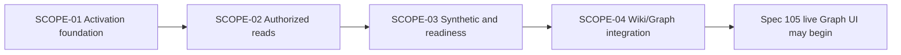

# BUG-080-001 Execution Scopes

## Execution Outline

### Phase Order

1. **SCOPE-01 - Fail-loud Graph activation foundation (`foundation:true`)**: replace warning-and-nil activation with one explicit required/disabled capability, value-safe secret resolution, and atomic route-manifest registration.
2. **SCOPE-02 - Authorized Graph read truth**: make real PostgreSQL family reads distinguish populated, true-empty, unauthorized, unavailable, schema failure, and route failure without changing existing API identity.
3. **SCOPE-03 - Product synthetic and readiness truth**: execute the fixed family manifest through an authenticated read-only validate-plane synthetic and project its value-safe result into readiness and observability.
4. **SCOPE-04 - Wiki/Graph state and recovery integration**: consume the shared activation/read model in the Knowledge shell, including explicit disabled, privacy clearing, responsive accessibility, and persistent live-stack regression coverage.

The graph activation foundation is the only ready scope at plan creation. Each later scope is blocked until its predecessor is Done. This packet must be completed and certified before spec 105 can activate a live Graph projection.

### New Types And Signatures

- `GraphActivationPolicy = required | disabled`
- `AuthorizedGraphRead` composite capability with route registration, family-read, manifest, and safe-status behavior
- `GraphRouteManifest` with Topics, Topic detail, People, Person detail, Places, Place detail, Time, and Edges entries
- `GraphReadOutcome = populated | true-empty | partial | capability-disabled | unauthorized-session | unauthorized-scope | route-missing | store-unavailable | schema-error | invalid-request`
- `GraphFamilyResult { family, state, durationMs, code, evidenceRef }`
- authenticated health projection `knowledge_graph { activation, status, observedAt, families[] }`
- additive response completeness envelope `read { state, complete, observedAt, omissions[] }`

### Validation Checkpoints

- **After SCOPE-01:** unit and process regressions prove required invalid activation cannot listen and removing one manifest route rejects construction.
- **After SCOPE-02:** real-PostgreSQL integration and E2E API tests prove all family reads, the operator/grant-holder/ungranted global-corpus grant matrix, true-empty, typed dependency failures, and read-only behavior.
- **After SCOPE-03:** the product synthetic, authenticated health projection, content-free telemetry, and strict readiness policy agree before any UI readiness claim is implemented.
- **After SCOPE-04:** desktop/mobile Playwright, accessibility, privacy-clear, route-missing, disabled-mode, broad regression, artifact-lint, and traceability guards pass before certification.

## Dependency Graph



## Scope Inventory

| Scope | Outcome | Surfaces | Depends On | Status |
|---|---|---|---|---|
| SCOPE-01 | Required Graph configuration fails loud and routes activate atomically | config, core wiring, router, route manifest | - | Not Started |
| SCOPE-02 | Authorized Graph reads report truthful data and failure states | PostgreSQL readers, HTTP contracts, auth, cursors | SCOPE-01 | Not Started |
| SCOPE-03 | Read-only synthetic and readiness prove actual Graph behavior | validate synthetic, health, metrics, traces, alerts | SCOPE-02 | Not Started |
| SCOPE-04 | Knowledge surfaces render the same honest state accessibly | PWA Knowledge/Wiki, status, responsive UI, Playwright | SCOPE-03 | Not Started |

---

## Scope 1: Fail-Loud Graph Activation Foundation

**Scope ID:** SCOPE-01  
**Status:** Not Started  
**Scope-Kind:** runtime-behavior  
**Foundation:** true  
**Depends On:** -

### Requirements And Scenarios

- GRAPH-ACT-001, GRAPH-ACT-002, GRAPH-ACT-003, GRAPH-ACT-007, GRAPH-ACT-008
- SCN-080-001-01, SCN-080-001-02, SCN-080-001-07

```gherkin
Scenario: SCN-080-001-01 Required empty secret refuses startup
  Given Graph API activation is explicitly required
  And the configured cursor-secret indirection is missing or resolves empty
  When core validates and constructs its dependencies
  Then startup returns the matching closed F080 failure before a listener accepts traffic
  And diagnostics contain only the config key or indirection name, never secret material

Scenario: SCN-080-001-02 Valid configuration mounts the complete route manifest
  Given required activation, valid limits, a non-empty injected secret, and PostgreSQL are available
  When the authorized Graph capability is constructed
  Then all eight required family routes register as one authenticated group
  And removing or duplicating any manifest entry rejects construction rather than mounting a subset

Scenario: SCN-080-001-07 Activation diagnostics are value-safe
  Given secret resolution or cursor-codec construction succeeds or fails
  When startup logs, errors, metrics, and traces are inspected
  Then only activation mode, safe code, and non-secret config identity are present
  And secret bytes, length, hash, cursor body, and authentication material are absent
```

### Implementation Plan

1. Add the required `knowledge_graph_api.activation` SST value and parse the closed `required|disabled` enum without a fallback; consume the already-loaded central `KnowledgeGraphAPIConfig` rather than loading runtime config twice.
2. Introduce one `AuthorizedGraphRead` construction boundary. Build config, secret codec, PostgreSQL readers, and the complete `GraphRouteManifest` into locals before assigning the capability so a failure cannot leave partial dependencies.
3. Replace five nullable activation fields and per-family router checks with one manifest registrar under the existing bearer and `knowledge-graph:read` middleware.
4. In `required` mode, return closed `F080-*` startup errors through the core boot path before listen. In explicit `disabled` mode, register known paths to the typed `503 capability_disabled` responder without resolving secret material.
5. Emit activation telemetry using closed low-cardinality labels and value-safe details only.
6. Preserve generic product configuration seams. Do not add concrete target names, paths, secret values, or deploy-adapter mutations to this repository.

### Change Boundary

**Allowed:** `config/smackerel.yaml`, config compiler/schema and config tests, `internal/config/**`, `internal/api/graphapi/**`, core dependency wiring, router registration, Graph activation metrics/traces, and tests named below.  
**Excluded:** graph query/explorer behavior from spec 105, unrelated API routes, concrete deploy adapters, release-train bundles, stored graph schema, Wiki presentation, and production data.

### Migration And Rollback

- This scope changes configuration and dependency shape but performs no graph-data migration.
- Forward rollout requires an explicit `required` or `disabled` value; missing activation is a refusal.
- Rollback uses the prior source/config pointer. It must not restore warning-and-nil behavior as an operational workaround.
- Operational removal uses an explicitly approved `disabled` config bundle whose readiness/UI contract is completed in later scopes.

### Test Plan

| ID | Test Type | Category | Scenario | File / Expected Test Title | Command | Live System |
|---|---|---|---|---|---|---|
| T080-01-UNIT | Unit | `unit` | SCN-080-001-01 | `internal/config/knowledge_graph_api_test.go` - `TestKnowledgeGraphActivationRequiredRejectsMissingAndEmptySecret` | `./smackerel.sh test unit` | No |
| T080-01-PROC | Integration | `integration` | SCN-080-001-01 | `tests/integration/graphapi/activation_test.go` - `TestRequiredGraphActivationRefusesBeforeListen` | `./smackerel.sh test integration` | Yes |
| T080-02-MANIFEST | Integration | `integration` | SCN-080-001-02 | `tests/integration/graphapi/route_manifest_test.go` - `TestGraphRouteManifestRegistersAllFamiliesAtomically` | `./smackerel.sh test integration` | Yes |
| T080-02-ADVERSARIAL | E2E API regression | `e2e-api` | SCN-080-001-02 | `tests/e2e/graph_api_activation_e2e_test.go` - `Regression: warning-and-nil or omitted manifest route cannot start ready` | `./smackerel.sh test e2e` | Yes |
| T080-07-SECURITY | Security regression | `e2e-api` | SCN-080-001-07 | `tests/e2e/graph_api_activation_e2e_test.go` - `Regression: Graph activation output never contains secret or cursor material` | `./smackerel.sh test e2e` | Yes |
| T080-01-DISABLED | E2E API regression | `e2e-api` | SCN-080-001-01 | `tests/e2e/graph_api_activation_e2e_test.go` - `Regression: explicit disabled mode is typed and never inferred from missing config` | `./smackerel.sh test e2e` | Yes |

### Definition of Done - Tiered Validation

#### Core Outcomes

- [ ] SCN-080-001-01: When activation is required and the configured cursor-secret indirection is missing or resolves empty, core returns the matching closed F080 failure before a listener accepts traffic, and diagnostics name only the config key or indirection name.
- [ ] SCN-080-001-02: With required activation, valid limits, a non-empty injected secret, and PostgreSQL available, all eight required family routes register as one authenticated group, and removing or duplicating any manifest entry rejects construction rather than mounting a subset.
- [ ] SCN-080-001-07: Whether secret resolution or cursor-codec construction succeeds or fails, startup logs, errors, metrics, and traces contain only activation mode, safe code, and non-secret config identity, never secret bytes, length, hash, cursor body, or authentication material.
- [ ] Required Graph activation is one atomic capability; invalid configuration returns a closed F080 refusal before listen, and explicit disabled mode is the only non-live state.
- [ ] Every required route is derived from one canonical manifest and remains behind bearer authentication plus `knowledge-graph:read`.
- [ ] Secret values and sensitive derivatives cannot enter errors, logs, metrics, traces, health, or test output.
- [ ] The generic product/deploy ownership boundary and source/config rollback contract are preserved.

#### Test Evidence - One Item Per Test Plan Row

- [ ] T080-01-UNIT passes with current-session raw evidence in `report.md#t080-01-unit`.
- [ ] T080-01-PROC passes with current-session raw evidence in `report.md#t080-01-proc`.
- [ ] T080-02-MANIFEST passes with current-session raw evidence in `report.md#t080-02-manifest`.
- [ ] T080-02-ADVERSARIAL first fails against warning-and-nil/omitted-route behavior, then passes with the repair; both outputs are recorded in `report.md#t080-02-adversarial`.
- [ ] T080-07-SECURITY passes with value-safe output in `report.md#t080-07-security`.
- [ ] T080-01-DISABLED passes with current-session raw evidence in `report.md#t080-01-disabled`.

#### Build Quality Gate

- [ ] Scope-specific unit/integration/E2E regressions, `./smackerel.sh check`, `./smackerel.sh lint`, `./smackerel.sh format --check`, source-lock/config checks, artifact-lint, traceability guard, documentation alignment, zero warnings, and change-boundary review all pass with executed evidence and no skipped checks.

---

## Scope 2: Authorized Graph Read Truth

**Scope ID:** SCOPE-02  
**Status:** Not Started  
**Scope-Kind:** runtime-behavior  
**Depends On:** SCOPE-01

### Requirements And Scenarios

- GRAPH-ACT-003, GRAPH-ACT-005, GRAPH-ACT-006, GRAPH-ACT-007, GRAPH-ACT-011
- SCN-080-001-03, SCN-080-001-05, SCN-080-001-06, SCN-080-001-09

```gherkin
Scenario: SCN-080-001-03 Authenticated read-only synthetic data is real
  Given an ephemeral stack contains disposable seeded records for every Graph family
  And an authenticated scoped test user is active
  When topics, people, places, time, and edges are read through production HTTP paths
  Then every response is authorized and contract-valid
  And graph-table write counts are unchanged before and after the journey

Scenario: SCN-080-001-05 True empty differs from activation failure
  Given routes are mounted and an authorized user has no records in every required family
  When all required reads complete successfully
  Then each response is a successful explicit true-empty result
  And it differs from disabled, route-missing, unauthorized, unavailable, and schema failure

Scenario: SCN-080-001-06 Authorization and dependency failures remain typed
  Given, separately, an expired session, insufficient scope, and an unavailable PostgreSQL graph dependency
  When a Graph family is read
  Then the results are 401, 403, and typed 503 respectively
  And no result is a 404 activation surrogate or empty success

Scenario: SCN-080-001-09 Explicit grant controls the global graph
  Given an operator identity, a daily identity with the Graph read grant, and a daily identity without that grant
  When each identity uses the same product-wide login and reads the Graph API
  Then the operator and granted identity receive their permitted global-corpus projection
  And the ungranted identity receives access denial with no graph content, counts, or existence hints
  And no outcome claims tenant or per-user row isolation
```

### Implementation Plan

1. Add the additive completeness envelope and closed `GraphReadOutcome` mapping to every family adapter while retaining existing paths and DTO fields.
2. Treat successful zero-row PostgreSQL queries as true-empty only after authorization and schema validation complete.
3. Map PostgreSQL connection/timeout failures to `store_unavailable`; map row, reason, cursor, and projection invariants to `schema_error`; reserve 404 for real resource absence.
4. Make required enrichments fail typed instead of log-and-empty. Permit partial only for an explicitly declared optional omission and name that omission.
5. Ensure cursor encoding failure cannot silently terminate a non-terminal page.
6. Build disposable PostgreSQL fixtures with a scoped test user for populated, all-family empty, denied-scope, expired-session, store-unavailable, and schema-invalid journeys. Compare authoritative write counts before/after read-only journeys.
7. Enforce the single operator-owned global-corpus authorization model over `knowledge-graph:read`: an operator identity reads all private graph content plus operational metadata; a grant-holder reads the authorized global-corpus projection (the same global rows, differentiated by grant rather than by any per-identity or tenant row predicate); an ungranted authenticated identity receives a leak-free `unauthorized-scope` (403) denial that discloses no labels, nodes, edges, counts, route-family existence, source titles, or graph-existence hints. No read path adds an owner/tenant predicate or claims per-user row isolation, and `true-empty` is returned only after a successful authorized global-corpus query, never as a denial substitute.

### Security And Privacy

- Actor identity is context-derived; no request parameter selects another user.
- Scope denial discloses no family count, node label, route evidence, or existence metadata.
- The three identity classes (operator, grant-holder, and ungranted authenticated identity) read one operator-owned global corpus; the `knowledge-graph:read` grant differentiates the authorized projection and no read path partitions rows by identity or claims tenant/per-user row isolation.
- Authenticated responses and cursors use private/no-store semantics and never enter durable browser storage.
- Test state is disposable and isolated; no dev/operate data or telemetry endpoint is mutated.

### Test Plan

| ID | Test Type | Category | Scenario | File / Expected Test Title | Command | Live System |
|---|---|---|---|---|---|---|
| T080-03-PG | Integration | `integration` | SCN-080-001-03 | `tests/integration/graphapi/family_reads_test.go` - `TestGraphFamiliesReadSeededPostgresThroughAuthorizedCapability` | `./smackerel.sh test integration` | Yes |
| T080-03-READONLY | E2E API regression | `e2e-api` | SCN-080-001-03 | `tests/e2e/graph_api_activation_e2e_test.go` - `Regression: authenticated family journey reads real rows without graph writes` | `./smackerel.sh test e2e` | Yes |
| T080-05-EMPTY | E2E API regression | `e2e-api` | SCN-080-001-05 | `tests/e2e/graph_api_activation_e2e_test.go` - `Regression: successful all-family empty is not activation or dependency failure` | `./smackerel.sh test e2e` | Yes |
| T080-06-AUTH | E2E API regression | `e2e-api` | SCN-080-001-06 | `tests/e2e/graph_api_activation_e2e_test.go` - `Regression: expired session and denied scope return exclusive private outcomes` | `./smackerel.sh test e2e` | Yes |
| T080-06-STORE | Integration | `integration` | SCN-080-001-06 | `tests/integration/graphapi/family_failures_test.go` - `TestGraphStoreAndSchemaFailuresAreNeverEmptyOrNotFound` | `./smackerel.sh test integration` | Yes |
| T080-06-CURSOR | Unit | `unit` | SCN-080-001-06 | `internal/api/graphapi/cursor_test.go` - `TestNonTerminalPageCannotLoseCursorEncodeFailure` | `./smackerel.sh test unit` | No |
| T080-09-CORPUS | Integration | `integration` | SCN-080-001-09 | `tests/integration/graphapi/corpus_authorization_test.go` - `TestGlobalCorpusGrantMatrixOperatorGrantedUngrantedNoRowIsolation` | `./smackerel.sh test integration` | Yes |
| T080-09-GRANT | E2E API regression | `e2e-api` | SCN-080-001-09 | `tests/e2e/graph_api_activation_e2e_test.go` - `Regression: shared product-wide login grants global-corpus read only with knowledge-graph:read and denies ungranted leak-free` | `./smackerel.sh test e2e` | Yes |

### Definition of Done - Tiered Validation

#### Core Outcomes

- [ ] SCN-080-001-03: Topics, people, places, time, and edges read through production HTTP paths under an authenticated scoped user return authorized contract-valid data, and graph-table write counts are unchanged before and after the journey.
- [ ] SCN-080-001-05: When every required family read succeeds with zero records, each response is a successful explicit true-empty result distinct from disabled, route-missing, unauthorized, unavailable, and schema failure.
- [ ] SCN-080-001-06: An expired session, insufficient scope, and an unavailable PostgreSQL graph dependency return 401, 403, and typed 503 respectively, never a 404 activation surrogate or empty success.
- [ ] SCN-080-001-09: On the shared product-wide login, the operator and the `knowledge-graph:read` grant-holder each receive their permitted read of the single operator-owned global corpus (operator = all private content plus operational metadata; grant-holder = authorized global projection of the same global rows), the ungranted authenticated identity receives a leak-free `unauthorized-scope` denial with no content, counts, or existence hints, and no outcome claims tenant or per-user row isolation.
- [ ] All family reads share the closed outcome model and preserve the existing authorization boundary and URL contracts.
- [ ] Populated and true-empty outputs are produced by real authorized PostgreSQL reads; store/schema/cursor failures cannot masquerade as empty or route absence.
- [ ] Read-only fixtures are disposable and graph-table writes remain unchanged across the E2E journey.
- [ ] Auth/session failure clears/discloses no graph existence metadata and no sensitive graph material is durably cached.

#### Test Evidence - One Item Per Test Plan Row

- [ ] T080-03-PG passes with current-session raw evidence in `report.md#t080-03-pg`.
- [ ] T080-03-READONLY passes with current-session raw evidence in `report.md#t080-03-readonly`.
- [ ] T080-05-EMPTY passes with current-session raw evidence in `report.md#t080-05-empty`.
- [ ] T080-06-AUTH passes with current-session raw evidence in `report.md#t080-06-auth`.
- [ ] T080-06-STORE passes with current-session raw evidence in `report.md#t080-06-store`.
- [ ] T080-06-CURSOR passes with current-session raw evidence in `report.md#t080-06-cursor`.
- [ ] T080-09-CORPUS passes with current-session raw evidence proving the operator/grant-holder/ungranted authorization matrix and the absence of any per-identity or tenant row predicate in `report.md#t080-09-corpus`.
- [ ] T080-09-GRANT first fails if an ungranted identity can read graph content, counts, or existence hints or if a per-user/tenant row predicate is introduced, then passes with the real-stack shared-login three-identity proof; both outputs are recorded in `report.md#t080-09-grant`.

#### Build Quality Gate

- [ ] Scope-specific unit/integration/E2E regressions, real-PostgreSQL isolation, auth/privacy scans, `./smackerel.sh check`, lint/format, artifact-lint, traceability guard, documentation alignment, zero warnings, and regression baseline all pass with executed evidence.

---

## Scope 3: Product Read Synthetic And Readiness Truth

**Scope ID:** SCOPE-03  
**Status:** Not Started  
**Scope-Kind:** runtime-behavior  
**Depends On:** SCOPE-02

### Requirements And Scenarios

- GRAPH-ACT-004, GRAPH-ACT-007, GRAPH-ACT-008, GRAPH-ACT-009
- SCN-080-001-03, SCN-080-001-04, SCN-080-001-07

```gherkin
Scenario: SCN-080-001-03 Product synthetic proves every family
  Given a real validate-plane stack and scoped disposable user
  When the product-owned synthetic executes its fixed family sequence
  Then it emits one value-safe row per required family and one aggregate result
  And acceptance fails for any 401, 403, 404, 5xx, schema, cursor, or missing-row outcome

Scenario: SCN-080-001-04 Disabled readiness is truthful
  Given Graph is explicitly disabled
  When authenticated health, strict readiness, and capability status are read
  Then Graph is unavailable or policy-disabled as declared
  And neither static Wiki assets nor general liveness report the Graph journey ready

Scenario: SCN-080-001-07 Synthetic and telemetry disclose no content
  Given populated, empty, failed, and disabled synthetic outcomes
  When result artifacts, metrics, logs, traces, and health are inspected
  Then they contain fixed family names, safe state, duration, code, and evidence reference only
  And they contain no labels, IDs, query values, cursor bodies, credentials, secret material, or target details
```

### Implementation Plan

1. Implement the product-owned, fixed-order, read-only synthetic against production HTTP behavior on the validate plane using a real scoped session and disposable PostgreSQL data.
2. Emit one `GraphFamilyResult` per family and an aggregate that can become available only from contract-valid populated/allowed-empty reads.
3. Add authenticated Graph capability detail to health while preserving aggregate-only unauthenticated health.
4. Drive strict Graph readiness from the synthetic result and explicit activation policy, never static files, route presence alone, or general database liveness.
5. Add closed metrics, traces, and logs for activation and family reads; ensure low-cardinality and content-free attributes.
6. Document the generic adapter seam and product result contract. Concrete encrypted injection and target acceptance remain `bubbles.devops` owned and are not edited here.

### Observability Evidence Contract

- Capture validate-plane traces for activation, authorization, each family read, response validation, and aggregation with safe attributes only.
- Assert the product metrics, spans, and logs declared by the design through integration and E2E tests. The repository currently registers only the unrelated `core.health` trace workflow, so this packet must not attach an invented `observabilityWorkflow` or claim a graph-specific G080/G100 contract.
- Query operated telemetry read-only only in a deploy/incident scope; this bug's feature tests emit to `env=test*` validate endpoints only.

### Test Plan

| ID | Test Type | Category | Scenario | File / Expected Test Title | Command | Live System |
|---|---|---|---|---|---|---|
| T080-03-SYNTH | E2E API regression | `e2e-api` | SCN-080-001-03 | `tests/e2e/graph_read_synthetic_e2e_test.go` - `Regression: product synthetic requires every authenticated family read` | `./smackerel.sh test e2e` | Yes |
| T080-04-READY | Integration | `integration` | SCN-080-001-04 | `tests/integration/graphapi/readiness_test.go` - `TestGraphReadinessUsesSyntheticAndExplicitActivation` | `./smackerel.sh test integration` | Yes |
| T080-04-STATIC | E2E API regression | `e2e-api` | SCN-080-001-04 | `tests/e2e/graph_read_synthetic_e2e_test.go` - `Regression: static Wiki and green liveness cannot satisfy Graph readiness` | `./smackerel.sh test e2e` | Yes |
| T080-07-TELEMETRY | E2E API regression | `e2e-api` | SCN-080-001-07 | `tests/e2e/graph_read_synthetic_e2e_test.go` - `Regression: Graph synthetic and telemetry are content-free` | `./smackerel.sh test e2e` | Yes |
| T080-03-TRACE | Observability integration | `integration` | SCN-080-001-03 | `tests/integration/graphapi/observability_test.go` - `TestGraphActivationAndFamilyReadTelemetryUsesClosedContentFreeAttributes` | `./smackerel.sh test integration` | Yes |
| T080-03-STRESS | Stress | `stress` | SCN-080-001-03 | `tests/stress/graph_read_synthetic_stress_test.go` - `Graph read synthetic remains bounded and truthful under concurrent validation reads` | `./smackerel.sh test stress` | Yes |

### Definition of Done - Tiered Validation

#### Core Outcomes

- [ ] SCN-080-001-03: The product-owned synthetic executes its fixed family sequence and emits one value-safe row per required family plus one aggregate result, failing acceptance for any 401, 403, 404, 5xx, schema, cursor, or missing-row outcome.
- [ ] SCN-080-001-04: When Graph is explicitly disabled, authenticated health, strict readiness, and capability status report Graph unavailable or policy-disabled as declared, and neither static Wiki assets nor general liveness report the Graph journey ready.
- [ ] SCN-080-001-07: Across populated, empty, failed, and disabled synthetic outcomes, result artifacts, metrics, logs, traces, and health contain only fixed family names, safe state, duration, code, and evidence reference, with no labels, IDs, query values, cursor bodies, credentials, secret material, or target details.
- [ ] One product-owned synthetic performs real authenticated, read-only, fixed-order family reads and publishes a closed value-safe aggregate.
- [ ] Authenticated health, strict readiness, synthetic output, and activation policy agree; static assets and general liveness cannot create a ready claim.
- [ ] Validate-plane observability distinguishes empty, disabled, auth, route, store, schema, and success outcomes without personal or secret content.
- [ ] Product/operator ownership is explicit and no concrete deploy-adapter artifact is changed.

#### Test Evidence - One Item Per Test Plan Row

- [ ] T080-03-SYNTH passes with current-session raw evidence in `report.md#t080-03-synth`.
- [ ] T080-04-READY passes with current-session raw evidence in `report.md#t080-04-ready`.
- [ ] T080-04-STATIC passes with current-session raw evidence in `report.md#t080-04-static`.
- [ ] T080-07-TELEMETRY passes with value-safe current-session raw evidence in `report.md#t080-07-telemetry`.
- [ ] T080-03-TRACE proves closed content-free graph telemetry in `report.md#t080-03-trace` without misusing `core.health`.
- [ ] T080-03-STRESS proves bounded concurrent synthetic reads in `report.md#t080-03-stress`.

#### Build Quality Gate

- [ ] Synthetic, integration, E2E, stress/SLO, trace contract, environment-pollution, secret-content, check/lint/format, artifact-lint, traceability, docs, and broad regression checks all pass with executed evidence and zero warnings.

---

## Scope 4: Wiki And Graph State Integration

**Scope ID:** SCOPE-04  
**Status:** Not Started  
**Scope-Kind:** runtime-behavior  
**Depends On:** SCOPE-03

### Requirements And Scenarios

- GRAPH-ACT-004, GRAPH-ACT-005, GRAPH-ACT-006, GRAPH-ACT-009, GRAPH-ACT-010
- SCN-080-001-04, SCN-080-001-05, SCN-080-001-06, SCN-080-001-08

```gherkin
Scenario: SCN-080-001-04 Explicit disabled mode is visible and unadvertised as ready
  Given the shared Graph capability is explicitly disabled
  When a user opens Knowledge Graph or an operator opens readiness
  Then the product shell shows the exact unavailable explanation
  And no local navigation, status, or static page claims a working Graph journey

Scenario: SCN-080-001-05 Successful true-empty is actionable and exclusive
  Given every authorized family read succeeds with zero records
  When Knowledge settles
  Then the user sees the true-empty state and permitted capture/source guidance
  And no retry, sample topology, route error, or unavailable claim appears

Scenario: SCN-080-001-06 Authentication, route, schema, and store failures stay distinct
  Given each failure occurs separately through a real stack state
  When Knowledge and readiness render it
  Then the matching exclusive state and safe recovery action appear
  And prior private labels and topology are removed before an auth state paints

Scenario: SCN-080-001-08 Wiki availability is responsive and accessible
  Given a keyboard or screen-reader user at desktop and 320px/200% zoom
  When loading, ready, true-empty, partial, degraded, disabled, unauthorized, route, store, and schema states render
  Then status, family rows, verified content, and recovery actions remain perceivable and operable
  And there is no overlap, horizontal page scroll, pointer-only action, duplicate alert, or leaked prior label
```

### Implementation Plan

1. Add one typed response decoder and activation/read model consumed by Wiki Browse, Graph availability, and readiness; projections must not infer state from HTTP code or `items.length` independently.
2. Render fixed-order family results and the closed UX state vocabulary. Preserve independently verified data only while authorization remains valid and label it with observation time and limitation.
3. On session/scope loss, synchronously clear nodes, edges, labels, counts, focus, topology pixels, and accessibility records before publishing the auth state.
4. Make retry operation-specific, read-only, single-flight, and replacement-based rather than stacking stale alerts.
5. Implement desktop/mobile family composition, semantic status/alert behavior, focus restoration, keyboard activation, 320px/200% zoom reflow, and screen-reader ordering.
6. Add real-stack Playwright fixtures for populated, all-empty, optional partial, required degradation, disabled, route-missing, store-unavailable, schema-invalid, session rejection, and scope denial without request interception.
7. Keep spec 105's connected visual renderer out of this packet; this scope provides only truthful activation/read state and existing Knowledge projections.

### UI Scenario Matrix

| Scenario | Preconditions | User Steps | User-Visible Assertion | Test |
|---|---|---|---|---|
| Explicit disabled | Product config is explicitly disabled | Open Graph local view and readiness | Exact unavailable explanation; no ready claim or generic 404 | T080-04-UI |
| True empty | Every real family read succeeds empty | Open Knowledge | True-empty guidance; no retry/sample/error | T080-05-UI |
| Failure exclusivity | Real route/store/schema/auth fixtures are active separately | Open or retry Knowledge | Exclusive typed copy/action; auth clears prior content | T080-06-UI |
| Responsive accessibility | Scoped test user; desktop and narrow viewport | Traverse views/families/recovery using keyboard and accessibility snapshot | Visual/source order parity, one announcement, no overlap/overflow | T080-08-A11Y |

### Consumer Impact Sweep

- Knowledge local navigation and Graph availability labels
- Wiki Browse/Graph response decoder and state model
- readiness/status family projection
- auth/session recovery and privacy clear
- deep links and safe return targets
- service-worker behavior for static assets versus network-only `/api/*`
- UI tests, docs, and any static readiness claims
- stale-reference scan for nil-handler, route-missing-as-empty, and static-Wiki-ready assumptions

### Test Plan

| ID | Test Type | Category | Scenario | File / Expected Test Title | Command | Live System |
|---|---|---|---|---|---|---|
| T080-04-UI | E2E UI regression | `e2e-ui` | SCN-080-001-04 | `web/pwa/tests/graph-activation.spec.ts` - `Regression: explicit disabled Graph stays in shell and never reports Available` | `./smackerel.sh test e2e-ui` | Yes |
| T080-05-UI | E2E UI regression | `e2e-ui` | SCN-080-001-05 | `web/pwa/tests/graph-activation.spec.ts` - `Regression: all-family true empty is actionable and contains no sample topology` | `./smackerel.sh test e2e-ui` | Yes |
| T080-06-UI | E2E UI regression | `e2e-ui` | SCN-080-001-06 | `web/pwa/tests/graph-activation.spec.ts` - `Regression: auth route store and schema failures are exclusive and private` | `./smackerel.sh test e2e-ui` | Yes |
| T080-08-A11Y | E2E UI | `e2e-ui` | SCN-080-001-08 | `web/pwa/tests/graph-activation.spec.ts` - `Knowledge Graph activation states remain keyboard and screen-reader operable at desktop and 320px 200 percent zoom` | `./smackerel.sh test e2e-ui` | Yes |
| T080-08-UNIT | UI unit | `ui-unit` | SCN-080-001-08 | `web/pwa/tests/graph_activation_state_test.go` - `TestGraphActivationProjectionUsesClosedExclusiveStates` | `./smackerel.sh test unit` | No |
| T080-REGRESSION | Broad E2E regression | `e2e-ui` | SCN-080-001-04..08 | `web/pwa/tests/wiki.spec.ts` and `web/pwa/tests/graph-activation.spec.ts` - `Knowledge and Wiki journeys remain coherent after Graph activation repair` | `./smackerel.sh test e2e-ui` | Yes |

### Definition of Done - Tiered Validation

#### Core Outcomes

- [ ] SCN-080-001-04: When the shared Graph capability is explicitly disabled, the product shell shows the exact unavailable explanation and no local navigation, status, or static page claims a working Graph journey.
- [ ] SCN-080-001-05: When every authorized family read succeeds with zero records, the user sees the true-empty state and permitted capture/source guidance with no retry, sample topology, route error, or unavailable claim.
- [ ] SCN-080-001-06: Authentication, route, schema, and store failures each render the matching exclusive state and safe recovery action, and prior private labels and topology are removed before an auth state paints.
- [ ] SCN-080-001-08: At desktop and 320px/200% zoom, loading, ready, true-empty, partial, degraded, disabled, unauthorized, route, store, and schema states keep status, family rows, verified content, and recovery actions perceivable and operable with no overlap, horizontal page scroll, pointer-only action, duplicate alert, or leaked prior label.
- [ ] Knowledge, Graph availability, and readiness consume one closed activation/read model; disabled, true-empty, partial/degraded, auth, route, store, and schema states cannot collapse into each other.
- [ ] Session/scope loss removes prior personal graph DOM, accessibility records, counts, labels, and pixels before recovery UI paints.
- [ ] Desktop/mobile/keyboard/screen-reader interactions satisfy the spec at 320px and 200% zoom with one state announcement and no overlap or horizontal scroll.
- [ ] The consumer sweep is complete, existing Wiki journeys remain usable, and spec 105 remains blocked until this bug is certified.

#### Test Evidence - One Item Per Test Plan Row

- [ ] T080-04-UI passes with current-session raw evidence and screenshot references in `report.md#t080-04-ui`.
- [ ] T080-05-UI passes with current-session raw evidence and screenshot references in `report.md#t080-05-ui`.
- [ ] T080-06-UI passes with current-session raw evidence, DOM/accessibility/pixel privacy checks, and screenshots in `report.md#t080-06-ui`.
- [ ] T080-08-A11Y passes on desktop and narrow viewport with current-session evidence in `report.md#t080-08-a11y`.
- [ ] T080-08-UNIT passes with current-session raw evidence in `report.md#t080-08-unit`.
- [ ] T080-REGRESSION passes with current-session raw evidence in `report.md#t080-regression`.

#### Build Quality Gate

- [ ] All packet tests and broad Knowledge/Wiki regressions, accessibility checks, privacy scans, check/lint/format/build, artifact-lint, traceability guard, implementation reality scan, documentation alignment, zero warnings, and consumer-impact review pass with executed evidence before validation requests completion.

## Planning Assumptions And Owner Routes

- The concrete operator adapter must inject the generic named secret and consume the product synthetic, but those files are foreign-owned and intentionally untouched. Route that work to `bubbles.devops` after product tests pass.
- Any change to requirements or design discovered during implementation routes to `bubbles.analyst` or `bubbles.design`; execution agents must not weaken this plan.
- Spec 105 cannot pick up its first live-Graph scope until BUG-080-001 is Done and its authenticated synthetic is certified.
- **SCN-080-001-09 coverage (closed 2026-07-24).** `bubbles.design` reconciled design.md on 2026-07-24T18:25Z, adding the `## Corpus Ownership And Authorization Model` section (operator / grant-holder / ungranted three-identity control of the single operator-owned global corpus; leak-free `unauthorized-scope` denial; no tenant/user row isolation; grounds GRAPH-ACT-005 and GRAPH-ACT-011) and extending the Testing And Validation Strategy table through SCN-080-001-09. This follow-up `bubbles.plan` pass then added SCN-080-001-09 to the owning **SCOPE-02 (Authorized Graph Read Truth)**: the verbatim spec Gherkin, GRAPH-ACT-011 in the requirement set, an implementation-plan step for the global-corpus authorization matrix (operator / grant-holder / ungranted, leak-free denial, no per-identity or tenant row predicate), a Security And Privacy bullet, Test Plan rows T080-09-CORPUS (integration) and T080-09-GRANT (e2e-api real-stack regression), one SCN-09 Core Outcome DoD item, and two matching Test Evidence DoD items (SCOPE-02 Test-Plan rows 6->8 == Test-Evidence items 6->8). The plan now covers SCN-080-001-01..09. No tenant/user row isolation is asserted anywhere in this plan. design.md remains `bubbles.design`-owned and was not edited.

## Planning Completion Criteria

- Every SCN-080-001 scenario appears in at least one concrete test row.
- Every test row has exactly one matching unchecked DoD evidence item.
- Every changed behavior has a persistent scenario-specific live regression; the warning-and-nil defect has explicit adversarial red-to-green proof.
- All live tests use the real validate stack, disposable PostgreSQL, real auth, no request interception, and no production/operate writes.
- No scope claims execution or completion at planning time.
