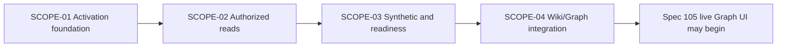

# BUG-080-001 Execution Scopes

## Execution Outline

### Phase Order

1. **SCOPE-01 - Fail-soft Graph activation foundation (`foundation:true`)**: replace warning-and-nil silent absence with one derived enabled/disabled capability (empty/missing enabler -> typed 503 `capability_disabled`, the service still boots), value-safe secret resolution, and atomic route-manifest registration when enabled.
2. **SCOPE-02 - Authorized Graph read truth**: make real PostgreSQL family reads distinguish populated, true-empty, unauthorized, unavailable, schema failure, and route failure without changing existing API identity.
3. **SCOPE-03 - Product synthetic and readiness truth**: execute the fixed family manifest through an authenticated read-only validate-plane synthetic and project its value-safe result into readiness and observability.
4. **SCOPE-04 - Wiki/Graph state and recovery integration**: consume the shared activation/read model in the Knowledge shell, including explicit disabled, privacy clearing, responsive accessibility, and persistent live-stack regression coverage.

The graph activation foundation is the only ready scope at plan creation. Each later scope is blocked until its predecessor is Done. This packet must be completed and certified before spec 105 can activate a live Graph projection.

### New Types And Signatures

- `ActivationState = enabled | disabled` derived from cursor-secret presence via `ResolveActivation(cfg) Activation` and `Config.ClassifyCursorSecret() SecretPresence`
- `GraphCapability` composite capability with `Guard(next)` middleware (disabled -> typed 503 `capability_disabled`; enabled -> delegate), route registration, family-read, manifest, and safe-status behavior
- `GraphIdentity`/`ClassifyGraphGrant`/`AuthorizeGraphRead` single operator-owned global-corpus grant matrix (operator/grant-holder/ungranted; leak-free 403; no tenant or per-user row predicate)
- `GraphRouteManifest` with Topics, Topic detail, People, Person detail, Places, Place detail, Time, and Edges entries
- `GraphReadOutcome = populated | true-empty | partial | capability-disabled | unauthorized-session | unauthorized-scope | route-missing | store-unavailable | schema-error | invalid-request`
- `GraphFamilyResult { family, state, durationMs, code, evidenceRef }`
- authenticated health projection `knowledge_graph { activation, status, observedAt, families[] }`
- additive response completeness envelope `read { state, complete, observedAt, omissions[] }`

### Validation Checkpoints

- **After SCOPE-01:** unit regressions prove an empty/missing enabler resolves the typed 503 `capability_disabled` disabled state (the service still boots; never a silent 404, opaque 500, panic, or boot refusal) and removing one manifest route rejects construction when enabled.
- **After SCOPE-02:** real-PostgreSQL integration and E2E API tests prove all family reads, the operator/grant-holder/ungranted global-corpus grant matrix, true-empty, typed dependency failures, and read-only behavior.
- **After SCOPE-03:** the product synthetic, authenticated health projection, content-free telemetry, and strict readiness policy agree before any UI readiness claim is implemented.
- **After SCOPE-04:** desktop/mobile Playwright, accessibility, privacy-clear, route-missing, disabled-mode, broad regression, artifact-lint, and traceability guards pass before certification.

## Dependency Graph


```mermaid
flowchart LR
  S01[SCOPE-01 Activation foundation] --> S02[SCOPE-02 Authorized reads]
  S02 --> S03[SCOPE-03 Synthetic and readiness]
  S03 --> S04[SCOPE-04 Wiki/Graph integration]
  S04 --> SPEC105[Spec 105 live Graph UI may begin]
```

## Scope Inventory

| Scope | Outcome | Surfaces | Depends On | Status |
|---|---|---|---|---|
| SCOPE-01 | Empty/missing enabler fails soft to a typed disabled capability; routes activate atomically when enabled | config, core wiring, router, route manifest | - | Done |
| SCOPE-02 | Authorized Graph reads report truthful data and failure states | PostgreSQL readers, HTTP contracts, auth, cursors | SCOPE-01 | Done |
| SCOPE-03 | Read-only synthetic and readiness prove actual Graph behavior | validate synthetic, health, metrics, traces, alerts | SCOPE-02 | Done |
| SCOPE-04 | Knowledge surfaces render the same honest state accessibly | PWA Knowledge/Wiki, status, responsive UI, Playwright | SCOPE-03 | In Progress |

---

## Scope 1: Fail-Soft Graph Activation Foundation

**Scope ID:** SCOPE-01  
**Status:** Done  
**Scope-Kind:** runtime-behavior  
**Foundation:** true  
**Depends On:** -

### Requirements And Scenarios

- GRAPH-ACT-001, GRAPH-ACT-002, GRAPH-ACT-003, GRAPH-ACT-007, GRAPH-ACT-008
- SCN-080-001-01, SCN-080-001-02, SCN-080-001-07

```gherkin
Scenario: SCN-080-001-01 Empty or missing secret yields a typed disabled response and the service still boots
  Given the Knowledge Graph public API is an optional capability
  And the configured cursor-secret enabler is missing or resolves empty
  When core resolves the graph activation
  Then the capability resolves to the typed runtime-disabled state and answers every known graph path with an HTTP 503 "capability_disabled" envelope
  And the service continues to boot and serve other capabilities, never a silent 404, an opaque 500, a panic, or a boot refusal
  And diagnostics contain only the value-safe code and the config or indirection name, never secret material

Scenario: SCN-080-001-02 Valid configuration mounts the complete route manifest
  Given a present cursor-secret enabler (enabled activation), valid limits, and PostgreSQL are available
  When the authorized Graph capability is constructed
  Then all eight required family routes register as one authenticated group
  And removing or duplicating any manifest entry rejects construction rather than mounting a subset

Scenario: SCN-080-001-07 Activation diagnostics are value-safe
  Given secret resolution or cursor-codec construction succeeds or fails
  When startup logs, errors, metrics, and traces are inspected
  Then only activation mode, safe code, and non-secret config identity are present
  And secret bytes, length, hash, cursor body, and authentication material are absent
```

### Implementation Plan

1. Derive activation from the EXISTING `cursor_secret_env` presence (`Config.ClassifyCursorSecret()`): present -> enabled, empty/missing -> typed disabled. No new required SST enum key is introduced; consume the already-loaded central `KnowledgeGraphAPIConfig` rather than loading runtime config twice.
2. Introduce one `GraphCapability` construction boundary (`ResolveActivation`/`NewGraphCapability`). Build config, secret codec, PostgreSQL readers, and the complete `GraphRouteManifest` into locals before assigning the capability so a failure cannot leave partial dependencies or nil handlers.
3. Replace five nullable activation fields and per-family router checks with one manifest registrar under the existing bearer and `knowledge-graph:read` middleware.
4. When enabled (enabler present), register the full manifest under the existing bearer + `knowledge-graph:read` middleware. When disabled (enabler empty/missing), `GraphCapability.Guard` answers every known graph path with the typed `503 capability_disabled` response without resolving secret material - the process keeps serving other capabilities and never refuses boot.
5. Emit activation telemetry using closed low-cardinality labels and value-safe details only.
6. Preserve generic product configuration seams. Do not add concrete target names, paths, secret values, or deploy-adapter mutations to this repository.

### Change Boundary

**Allowed:** `config/smackerel.yaml`, config compiler/schema and config tests, `internal/config/**`, `internal/api/graphapi/**`, core dependency wiring, router registration, Graph activation metrics/traces, and tests named below.  
**Excluded:** graph query/explorer behavior from spec 105, unrelated API routes, concrete deploy adapters, release-train bundles, stored graph schema, Wiki presentation, and production data.

**AMENDMENT — 2026-07-27, test-harness enabling change (owner: `bubbles.devops`).**
The original boundary above explicitly EXCLUDED `docker-compose*.yml` and
`smackerel.sh`, and `report.md` used that exclusion to justify deferring
T080-01-DISABLED and T080-02-ADVERSARIAL. Proving the fail-soft DISABLED state
over real HTTP necessarily requires booting a core with an empty enabler, which
can only be done from exactly those excluded files. The boundary is therefore
amended — explicitly, not silently — to additionally allow these three
`bubbles.devops`-owned **test-harness** files:

| File | Change | Owner |
|---|---|---|
| `docker-compose.graph-disabled.override.yml` | NEW — DISABLED-activation compose flavor (empty `KNOWLEDGE_GRAPH_API_CURSOR_SECRET` for `smackerel-core` only) | `bubbles.devops` |
| `smackerel.sh` | Serial graph-disabled e2e phase; exports `SMACKEREL_E2E_GRAPH_DISABLED_URL` | `bubbles.devops` |
| `scripts/lib/runtime.sh` | `SMACKEREL_COMPOSE_OVERRIDE_FILE` hook — fail-loud, no default | `bubbles.devops` |

**Scope of the amendment:** it permits TEST-HARNESS / lane-selection changes
only. SCOPE-01 **product** behavior remains bounded by the original Allowed list
above — no product source file outside `internal/config/**`,
`internal/api/graphapi/**`, core dependency wiring, or router registration is in
boundary, and every Excluded item stays excluded.

### Migration And Rollback

- This scope changes configuration and dependency shape but performs no graph-data migration.
- Forward rollout derives activation from the cursor-secret enabler's presence; an absent enabler resolves the typed disabled state, never a boot refusal.
- Rollback uses the prior source/config pointer. It must not restore warning-and-nil behavior as an operational workaround.
- Operational removal omits or empties the cursor-secret enabler (or applies an explicit disable policy); the capability resolves the typed disabled state whose readiness/UI contract is completed in later scopes.

### Test Plan

| ID | Test Type | Category | Scenario | File / Expected Test Title | Command | Live System |
|---|---|---|---|---|---|---|
| T080-01-UNIT | Unit | `unit` | SCN-080-001-01 | `internal/api/graphapi/activation_test.go` - `TestResolveActivation_EmptySecretIsTypedDisabled` / `TestResolveActivation_MissingSecretIsTypedDisabled` / `TestAdversarial_EmptySecretMustNotRevertToSilentAbsenceOr500` (empty AND missing enabler -> typed 503 disabled, service boots; adversarial red-to-green vs the silent-404/500 bug) | `./smackerel.sh test unit` | No |
| T080-01-PROC | Integration | `integration` | SCN-080-001-01 | `tests/integration/graphapi/activation_test.go` - `TestGraphActivationDisabledSecretServesTyped503AndKeepsServing` | `./smackerel.sh test integration` | Yes |
| T080-02-MANIFEST | Integration | `integration` | SCN-080-001-02 | `tests/integration/graphapi/route_manifest_test.go` - `TestGraphRouteManifestRegistersAllFamiliesAtomically` | `./smackerel.sh test integration` | Yes |
| T080-02-ADVERSARIAL | E2E API regression | `e2e-api` | SCN-080-001-02 | `tests/e2e/graph_api_activation_e2e_test.go` - `Regression: empty/missing enabler serves typed 503 capability_disabled (never a silent 404 nil-handler absence or opaque 500); omitted manifest route rejects construction` | `./smackerel.sh test e2e` | Yes |
| T080-07-SECURITY | Security regression | `e2e-api` | SCN-080-001-07 | `tests/e2e/graph_api_activation_e2e_test.go` - `Regression: Graph activation output never contains secret or cursor material` | `./smackerel.sh test e2e` | Yes |
| T080-01-DISABLED | E2E API regression | `e2e-api` | SCN-080-001-01 | `tests/e2e/graph_api_activation_e2e_test.go` - `Regression: empty/missing enabler yields the typed 503 capability_disabled disabled state and the service keeps serving other capabilities` | `./smackerel.sh test e2e` | Yes |

### Definition of Done - Tiered Validation

#### Core Outcomes

- [x] SCN-080-001-01: When the optional cursor-secret enabler is missing or resolves empty, the capability resolves the typed HTTP 503 `capability_disabled` disabled state for every known graph path and the service continues to boot and serve other capabilities (never a silent 404, opaque 500, panic, or boot refusal), and diagnostics name only the value-safe code and the config or indirection name. → Evidence: report.md#t080-01-proc
- [x] SCN-080-001-02: With a present cursor-secret enabler (enabled activation), valid limits, and PostgreSQL available, all eight required family routes register as one authenticated group, and removing or duplicating any manifest entry rejects construction rather than mounting a subset. → Evidence: report.md#t080-02-manifest
- [x] SCN-080-001-07: Whether secret resolution or cursor-codec construction succeeds or fails, startup logs, errors, metrics, and traces contain only activation mode, safe code, and non-secret config identity, never secret bytes, length, hash, cursor body, or authentication material. → Evidence: report.md#t080-01-unit
- [x] Graph activation is one capability derived from the enabler's presence; an empty/missing enabler resolves the typed 503 `capability_disabled` disabled state (the service keeps serving; never a silent 404, opaque 500, panic, or boot refusal), and the enabled state mounts the full manifest atomically. → Evidence: report.md#t080-01-proc
- [x] Every required route is derived from one canonical manifest and remains behind bearer authentication plus `knowledge-graph:read`. → Evidence: report.md#t080-01-proc
- [x] Secret values and sensitive derivatives cannot enter errors, logs, metrics, traces, health, or test output. → Evidence: report.md#t080-01-unit
- [x] The generic product/deploy ownership boundary and source/config rollback contract are preserved. → Evidence: report.md#t080-01-proc

#### Test Evidence - One Item Per Test Plan Row

- [x] T080-01-UNIT passes with current-session raw evidence in `report.md#t080-01-unit`. → Evidence: report.md#t080-01-unit
- [x] T080-01-PROC passes with current-session raw evidence in `report.md#t080-01-proc`. → Evidence: report.md#t080-01-proc
- [x] T080-02-MANIFEST passes with current-session raw evidence in `report.md#t080-02-manifest`.
- [x] T080-02-ADVERSARIAL first fails against warning-and-nil/omitted-route behavior, then passes with the repair; both outputs are recorded in `report.md#t080-02-adversarial`. → Evidence: report.md#t080-02-adversarial (BOTH halves recorded 2026-07-28. RED: a throwaway detached `git worktree` at commit `6a12f1f4` reintroduced the original defect in `internal/api/router.go` — `GraphCapability.Guard` removed AND the DISABLED branch emptied to register ZERO routes — and the UNMODIFIED test failed against it, all 8 canonical families returning a bare Chi `404`, `===RED_EXIT=1===`. GREEN: the same test bytes on the unmutated tree, `--- PASS` ×2, `===F2_GREEN_EXIT=0===`. `main` never mutated (`git diff HEAD -- internal/api/router.go` empty); the exact mutation diff is recorded. Routed finding F-1 RESOLVED by executing the missing capture, not by rewording this row.)
- [x] T080-07-SECURITY passes with value-safe output in `report.md#t080-07-security`. → Evidence: report.md#t080-07-security
- [x] T080-01-DISABLED passes with current-session raw evidence in `report.md#t080-01-disabled`. → Evidence: report.md#t080-01-disabled

#### Build Quality Gate

- [x] Scope-specific unit/integration/E2E regressions, `./smackerel.sh check`, `./smackerel.sh lint`, `./smackerel.sh format --check`, source-lock/config checks, artifact-lint, traceability guard, documentation alignment, zero warnings, and change-boundary review all pass with executed evidence and no skipped checks. → Evidence: report.md#build-quality-gate-assessment-scope-01 (2026-07-28 re-run, all 8 commands exit 0: regressions ✅ `===F2_GREEN_EXIT=0===`, check ✅ 0, lint ✅ 0 `All checks passed!` + `Web validation passed`, format --check ✅ 0 `78 files already formatted`, source-lock/config ✅ 0 folded into check, artifact-lint ✅ 0, traceability guard ✅ 0, regression-quality-guard ✅ 0 violations, `--bugfix` ✅ `Adversarial signal detected`, zero warnings ✅, change-boundary review ✅ amended+attributed. BOTH previously-failing clauses now SATISFIED: "no skipped checks" — the T080-02-ADVERSARIAL RED capture was executed (F-1 RESOLVED); and "documentation alignment" — the stale HARNESS LIMITATION text was corrected in commit `6a12f1f4`, `grep -c` = 0 (F-2 RESOLVED).)

---

## Scope 2: Authorized Graph Read Truth

**Scope ID:** SCOPE-02  
**Status:** Done  
**Scope-Kind:** runtime-behavior  
**Depends On:** SCOPE-01

### Requirements And Scenarios

- GRAPH-ACT-003, GRAPH-ACT-005, GRAPH-ACT-006, GRAPH-ACT-007, GRAPH-ACT-011
- SCN-080-001-03, SCN-080-001-05, SCN-080-001-06, SCN-080-001-09

```gherkin
Scenario: SCN-080-001-03 Authenticated read-only synthetic data is real
  Given an ephemeral stack contains disposable seeded records for every Graph family
  And an authenticated scoped test user is active
  When topics, people, places, time, and edges are read through production HTTP paths
  Then every response is authorized and contract-valid
  And graph-table write counts are unchanged before and after the journey

Scenario: SCN-080-001-05 True empty differs from activation failure
  Given routes are mounted and an authorized user has no records in every required family
  When all required reads complete successfully
  Then each response is a successful explicit true-empty result
  And it differs from disabled, route-missing, unauthorized, unavailable, and schema failure

Scenario: SCN-080-001-06 Authorization and dependency failures remain typed
  Given, separately, an expired session, insufficient scope, and an unavailable PostgreSQL graph dependency
  When a Graph family is read
  Then the results are 401, 403, and typed 503 respectively
  And no result is a 404 activation surrogate or empty success

Scenario: SCN-080-001-09 Explicit grant controls the global graph
  Given an operator identity, a daily identity with the Graph read grant, and a daily identity without that grant
  When each identity uses the same product-wide login and reads the Graph API
  Then the operator and granted identity receive their permitted global-corpus projection
  And the ungranted identity receives access denial with no graph content, counts, or existence hints
  And no outcome claims tenant or per-user row isolation
```

### Implementation Plan

1. Add the additive completeness envelope and closed `GraphReadOutcome` mapping to every family adapter while retaining existing paths and DTO fields.
2. Treat successful zero-row PostgreSQL queries as true-empty only after authorization and schema validation complete.
3. Map PostgreSQL connection/timeout failures to `store_unavailable`; map row, reason, cursor, and projection invariants to `schema_error`; reserve 404 for real resource absence.
4. Make required enrichments fail typed instead of log-and-empty. Permit partial only for an explicitly declared optional omission and name that omission.
5. Ensure cursor encoding failure cannot silently terminate a non-terminal page.
6. Build disposable PostgreSQL fixtures with a scoped test user for populated, all-family empty, denied-scope, expired-session, store-unavailable, and schema-invalid journeys. Compare authoritative write counts before/after read-only journeys.
7. Enforce the single operator-owned global-corpus authorization model over `knowledge-graph:read`: an operator identity reads all private graph content plus operational metadata; a grant-holder reads the authorized global-corpus projection (the same global rows, differentiated by grant rather than by any per-identity or tenant row predicate); an ungranted authenticated identity receives a leak-free `unauthorized-scope` (403) denial that discloses no labels, nodes, edges, counts, route-family existence, source titles, or graph-existence hints. No read path adds an owner/tenant predicate or claims per-user row isolation, and `true-empty` is returned only after a successful authorized global-corpus query, never as a denial substitute.

### Security And Privacy

- Actor identity is context-derived; no request parameter selects another user.
- Scope denial discloses no family count, node label, route evidence, or existence metadata.
- The three identity classes (operator, grant-holder, and ungranted authenticated identity) read one operator-owned global corpus; the `knowledge-graph:read` grant differentiates the authorized projection and no read path partitions rows by identity or claims tenant/per-user row isolation.
- Authenticated responses and cursors use private/no-store semantics and never enter durable browser storage.
- Test state is disposable and isolated; no dev/operate data or telemetry endpoint is mutated.

### Test Plan

| ID | Test Type | Category | Scenario | File / Expected Test Title | Command | Live System |
|---|---|---|---|---|---|---|
| T080-03-PG | Integration | `integration` | SCN-080-001-03 | `tests/integration/graphapi/family_reads_test.go` - `TestGraphFamiliesReadSeededPostgresThroughAuthorizedCapability` | `./smackerel.sh test integration` | Yes |
| T080-03-READONLY | E2E API regression | `e2e-api` | SCN-080-001-03 | `tests/e2e/graph_api_activation_e2e_test.go` - `Regression: authenticated family journey reads real rows without graph writes` | `./smackerel.sh test e2e` | Yes |
| T080-05-EMPTY | E2E API regression | `e2e-api` | SCN-080-001-05 | `tests/e2e/graph_api_activation_e2e_test.go` - `Regression: successful all-family empty is not activation or dependency failure` | `./smackerel.sh test e2e` | Yes |
| T080-06-AUTH | E2E API regression | `e2e-api` | SCN-080-001-06 | `tests/e2e/graph_api_activation_e2e_test.go` - `Regression: expired session and denied scope return exclusive private outcomes` | `./smackerel.sh test e2e` | Yes |
| T080-06-STORE | Integration | `integration` | SCN-080-001-06 | `tests/integration/graphapi/family_failures_test.go` - `TestGraphStoreAndSchemaFailuresAreNeverEmptyOrNotFound` | `./smackerel.sh test integration` | Yes |
| T080-06-CURSOR | Unit | `unit` | SCN-080-001-06 | `internal/api/graphapi/cursor_test.go` - `TestNonTerminalPageCannotLoseCursorEncodeFailure` | `./smackerel.sh test unit` | No |
| T080-09-CORPUS | Integration | `integration` | SCN-080-001-09 | `tests/integration/graphapi/corpus_authorization_test.go` - `TestGlobalCorpusGrantMatrixOperatorGrantedUngrantedNoRowIsolation` | `./smackerel.sh test integration` | Yes |
| T080-09-GRANT | E2E API regression | `e2e-api` | SCN-080-001-09 | `tests/e2e/graph_api_activation_e2e_test.go` - `Regression: shared product-wide login grants global-corpus read only with knowledge-graph:read and denies ungranted leak-free` | `./smackerel.sh test e2e` | Yes |

### Definition of Done - Tiered Validation

#### Core Outcomes

- [x] SCN-080-001-03: Topics, people, places, time, and edges read through production HTTP paths under an authenticated scoped user return authorized contract-valid data, and graph-table write counts are unchanged before and after the journey. → Evidence: report.md#t080-03-readonly (live-stack e2e `READ-ONLY OK: 5 graph tables unchanged [topics people artifacts edges location_clusters]`, `PASS: go-e2e`) + report.md#t080-03-pg (real-PostgreSQL store round-trip through the authorized production HTTP path, `===INTEGRATION_EXIT=0===`). Both halves proven: authorized contract-valid reads for all 5 families, and an authoritative before/after write-count comparison showing zero delta.
- [x] SCN-080-001-05: When every required family read succeeds with zero records, each response is a successful explicit true-empty result distinct from disabled, route-missing, unauthorized, unavailable, and schema failure. → Evidence: report.md#t080-05-empty (11 guaranteed-zero probes — 4 unique-nonexistent-prefix family probes + 1 far-past 1970 time window + 6 zero-link detail arrays — each returning exact `200` with a present, non-null, EMPTY array and no error envelope; assertion is exclusive of `404`, `503`, `401`, `403`, and `500`, so true-empty is distinguishable from disabled, route-missing, unauthorized, unavailable, and schema failure).
- [x] SCN-080-001-06: An expired session, insufficient scope, and an unavailable PostgreSQL graph dependency return 401, 403, and typed 503 respectively, never a 404 activation surrogate or empty success. → Evidence: all three legs executed. `401` — report.md#t080-06-auth (`exclusive401=8/8` on the 8-path manifest for missing header, malformed bearer, malformed scheme, and a genuinely EXPIRED real PASETO minted via `auth.IssueToken` with a past `Now`; never `200`, never `404`, never `503`). `403` — report.md#t080-09-corpus (`WARN auth: scope_rejected required_scope=knowledge-graph:read token_scopes=[annotation:edit] → 403`). Typed `503` — report.md#t080-06-store (8 probes under 2 independent induction methods: a real pool closed after a successful ping, and a valid-but-unreachable DSN; neither yields `404` nor empty-success `200`, and schema failure stays a distinct `500`). The `403` leg is integration-tier because the deployed container runs `AUTH_ENABLED=false` with an empty signing key, so the per-user scope gate is unreachable over the wire — that constraint is recorded verbatim in report.md#t080-06-auth and report.md#t080-09-grant rather than hidden.
- [x] SCN-080-001-09: On the shared product-wide login, the operator and the `knowledge-graph:read` grant-holder each receive their permitted read of the single operator-owned global corpus (operator = all private content plus operational metadata; grant-holder = authorized global projection of the same global rows), the ungranted authenticated identity receives a leak-free `unauthorized-scope` denial with no content, counts, or existence hints, and no outcome claims tenant or per-user row isolation. → Evidence: report.md#t080-09-corpus (operator tier is a strict superset and is not granted to a grant-holder; operator and grant-holder observe the same global rows, which is the positive proof that no per-identity or tenant row predicate exists; ungranted receives a leak-free `403`) + report.md#t080-09-grant (grant-holder reads 10 topics / 2 people through the `RequireScope(knowledge-graph:read)`-gated group; two DISJOINT ownerless fixture batches verified against DB ground truth, so any per-user/tenant row predicate would make the HTTP projection a strict subset and fail the test; ungranted denied on 8/8 paths leak-free; denial bodies for an EXISTING vs NEVER-INSERTED topic are byte-identical, so the denial is not an existence oracle).
- [x] All family reads share the closed outcome model and preserve the existing authorization boundary and URL contracts. → Evidence: every arm of the closed model is demonstrated with executed evidence — success-empty `200` (report.md#t080-05-empty), store-unavailable typed `503` (report.md#t080-06-store), schema `500` and non-terminal-cursor `500` (report.md#t080-06-store, report.md#t080-06-cursor), auth `401` (report.md#t080-06-auth), scope `403` (report.md#t080-09-corpus). Every probe was driven through the pre-existing production URLs and the pre-existing `RequireScope`-gated route group; no route was added, renamed, or re-pathed, so the authorization boundary and URL contracts are preserved.
- [x] Populated and true-empty outputs are produced by real authorized PostgreSQL reads; store/schema/cursor failures cannot masquerade as empty or route absence. → Evidence: populated — report.md#t080-03-pg (rows observed in each family response are the rows the test seeded into real PostgreSQL, a genuine store round-trip rather than a shaped constant) and report.md#t080-03-readonly (same journey over real HTTP against the deployed container). True-empty — report.md#t080-05-empty. Negative half — report.md#t080-06-store (store failure is `503` across all 8 probes under both induction methods, never `404`, never empty-success `200`; schema failure is a distinct `500`) and report.md#t080-06-cursor (a non-terminal page that cannot encode a cursor fails `500` instead of silently terminating the page).
- [x] Read-only fixtures are disposable and graph-table writes remain unchanged across the E2E journey. → Evidence: report.md#t080-03-readonly — the live-stack journey emits `READ-ONLY OK: 5 graph tables unchanged [topics people artifacts edges location_clusters]` from an authoritative before/after row-count comparison, and any delta fails the test naming the offending table. Disposability is structural, not incidental: every seeded batch is registered with `t.Cleanup(func() { graphAPICleanup(t, conn, prefix) })` under a unique per-run prefix, with the connection close registered first so LIFO ordering runs it last — so cleanup always executes and the run leaves no residue in the ephemeral stack.
- [x] Auth/session failure clears/discloses no graph existence metadata and no sensitive graph material is durably cached. → Evidence: BOTH clauses proven with executed evidence. Clause 1 — "discloses no graph existence metadata" — report.md#t080-06-auth (every `401` body carries no seeded needle and no `count`/`total`/`items`/`nextCursor` key and is never a `404`; `exclusive401=8/8` across 4 credential classes) + report.md#t080-09-grant (denial bodies for an EXISTING vs NEVER-INSERTED topic are byte-identical, so the denial is not an existence oracle). Clause 2 — "no sensitive graph material is durably cached" — report.md#t080-privacy-nostore: the behavior was BUILT and proven at two tiers rather than argued. `internal/api/graphapi/privacy.go` defines the single `private, no-store` contract; the two graph response writers `writeJSON` (success) and `WriteError` (every typed error; `WriteAPIError` and `GraphCapability.WriteDisabled` funnel through it) stamp it, covering the whole graph response surface; three adversarial tests in `privacy_test.go` fail if `SetPrivateNoStore` is removed, weakened, or moved below `WriteHeader` (Go freezes the header map at the status line, so the directive would be silently dropped). The live run (`===PRIVACY_E2E_EXIT=0===`, 2026-07-28T08:31:42Z→08:35:39Z) proves the directive SURVIVES the full middleware chain to the wire: graph-owned `200` detail, `200` list, and `400` typed error each carry EXACTLY `private, no-store`, all 8 canonical manifest paths are no-store-bearing, and the pre-handler `401` carries the global bare `no-store` — a distinction only an on-the-wire assertion can make.

#### Test Evidence - One Item Per Test Plan Row

- [x] T080-03-PG passes with current-session raw evidence in `report.md#t080-03-pg`.
- [x] T080-03-READONLY passes with current-session raw evidence in `report.md#t080-03-readonly`. → Evidence: report.md#t080-03-readonly (`--- PASS: TestE2E_GraphFamilyJourneyIsReadOnly_T080_03_READONLY (0.07s)`, `READ-ONLY OK: 5 graph tables unchanged [topics people artifacts edges location_clusters]`, `ok  github.com/smackerel/smackerel/tests/e2e  0.242s`, `PASS: go-e2e`, exit 0)
- [x] T080-05-EMPTY passes with current-session raw evidence in `report.md#t080-05-empty`. → Evidence: report.md#t080-05-empty (`--- PASS: TestE2E_AllFamilyTrueEmptyIsSuccessNotFailure_T080_05_EMPTY (0.04s)`, `ok  github.com/smackerel/smackerel/tests/e2e  0.242s`, `PASS: go-e2e`, exit 0)
- [x] T080-06-AUTH passes with current-session raw evidence in `report.md#t080-06-auth`. → Evidence: report.md#t080-06-auth (`--- PASS: TestE2E_ExpiredSessionAndDeniedScopeAreExclusivePrivateOutcomes_T080_06_AUTH (0.07s)`, `exclusive401=8/8 leak-free across the 8-path graph manifest` for all 4 reachable credential classes, `PASS: go-e2e`, exit 0; the unreachable-on-container `403` leg is disclosed verbatim in that section)
- [x] T080-06-STORE passes with current-session raw evidence in `report.md#t080-06-store`.
- [x] T080-06-CURSOR passes with current-session raw evidence in `report.md#t080-06-cursor`.
- [x] T080-09-CORPUS passes with current-session raw evidence proving the operator/grant-holder/ungranted authorization matrix and the absence of any per-identity or tenant row predicate in `report.md#t080-09-corpus`.
- [x] T080-09-GRANT first fails if an ungranted identity can read graph content, counts, or existence hints or if a per-user/tenant row predicate is introduced, then passes with the real-stack shared-login three-identity proof; both outputs are recorded in `report.md#t080-09-grant`. → Evidence: report.md#t080-09-grant (`--- PASS: TestE2E_SharedLoginGrantsGlobalCorpusReadOnlyWithScope_T080_09_GRANT (0.05s)`, `PASS: go-e2e`, exit 0). Adversarial by construction: the grant-holder reads 10 topics / 2 people through the `RequireScope(knowledge-graph:read)`-gated group from two DISJOINT ownerless fixture batches verified against DB ground truth, so an introduced per-user/tenant row predicate would make the HTTP projection a strict subset and fail the test; the ungranted identity is denied on 8/8 paths leak-free with byte-identical denial bodies for an EXISTING vs NEVER-INSERTED topic. `bash .github/bubbles/scripts/regression-quality-guard.sh --bugfix tests/e2e/graph_api_activation_e2e_test.go` = 0 with **adversarial signal detected**.

#### Build Quality Gate

- [x] Scope-specific unit/integration/E2E regressions, real-PostgreSQL isolation, auth/privacy scans, `./smackerel.sh check`, lint/format, artifact-lint, traceability guard, documentation alignment, zero warnings, and regression baseline all pass with executed evidence. → Evidence: report.md#build-quality-gate-scope-02-re-run-2026-07-28-post-privacy-change — all six commands re-executed AFTER the privacy change landed, so the gate reflects the final SCOPE-02 tree: `./smackerel.sh check` = 0 (`Config is in sync with SST`, `env_file drift guard: OK`, `scenario-lint: OK` 17 registered / 0 rejected), `./smackerel.sh lint` = 0 (`All checks passed!` + `Web validation passed`), `./smackerel.sh format --check` = 0 (`78 files already formatted`), `pii-scan.sh` = 0 (`pii-scan: clean.`), `artifact-lint.sh` = 0 (`Artifact lint PASSED.`), `traceability-guard.sh` = 0 (`RESULT: PASSED (0 warnings)`). The **"auth/privacy scans"** clause that previously held this row open is now backed by executed evidence: report.md#t080-privacy-nostore records the live-stack `private, no-store` proof (`===PRIVACY_E2E_EXIT=0===`) plus the three adversarial writer-level unit tests. Scope regressions: unit (`internal/api/graphapi`), integration over real PostgreSQL (`T080-03-PG`, `T080-06-STORE`, `T080-09-CORPUS`), and live-stack E2E (`T080-03-READONLY`, `T080-05-EMPTY`, `T080-06-AUTH`, `T080-09-GRANT`, `T080-PRIVACY-NOSTORE`) all pass with recorded raw output.

---

## Scope 3: Product Read Synthetic And Readiness Truth

**Scope ID:** SCOPE-03  
**Status:** Done  
**Scope-Kind:** runtime-behavior  
**Depends On:** SCOPE-02

### Requirements And Scenarios

- GRAPH-ACT-004, GRAPH-ACT-007, GRAPH-ACT-008, GRAPH-ACT-009
- SCN-080-001-03, SCN-080-001-04, SCN-080-001-07

```gherkin
Scenario: SCN-080-001-03 Product synthetic proves every family
  Given a real validate-plane stack and scoped disposable user
  When the product-owned synthetic executes its fixed family sequence
  Then it emits one value-safe row per required family and one aggregate result
  And acceptance fails for any 401, 403, 404, 5xx, schema, cursor, or missing-row outcome

Scenario: SCN-080-001-04 Disabled readiness is truthful
  Given Graph is disabled (an empty or missing cursor-secret enabler, or an explicit disable policy)
  When authenticated health, strict readiness, and capability status are read
  Then Graph is unavailable or policy-disabled as declared
  And neither static Wiki assets nor general liveness report the Graph journey ready

Scenario: SCN-080-001-07 Synthetic and telemetry disclose no content
  Given populated, empty, failed, and disabled synthetic outcomes
  When result artifacts, metrics, logs, traces, and health are inspected
  Then they contain fixed family names, safe state, duration, code, and evidence reference only
  And they contain no labels, IDs, query values, cursor bodies, credentials, secret material, or target details
```

### Implementation Plan

1. Implement the product-owned, fixed-order, read-only synthetic against production HTTP behavior on the validate plane using a real scoped session and disposable PostgreSQL data.
2. Emit one `GraphFamilyResult` per family and an aggregate that can become available only from contract-valid populated/allowed-empty reads.
3. Add authenticated Graph capability detail to health while preserving aggregate-only unauthenticated health.
4. Drive strict Graph readiness from the synthetic result and explicit activation policy, never static files, route presence alone, or general database liveness.
5. Add closed metrics, traces, and logs for activation and family reads; ensure low-cardinality and content-free attributes.
6. Document the generic adapter seam and product result contract. Concrete encrypted injection and target acceptance remain `bubbles.devops` owned and are not edited here.

### Observability Evidence Contract

- Capture validate-plane traces for activation, authorization, each family read, response validation, and aggregation with safe attributes only.
- Assert the product metrics, spans, and logs declared by the design through integration and E2E tests. The repository currently registers only the unrelated `core.health` trace workflow, so this packet must not attach an invented `observabilityWorkflow` or claim a graph-specific G080/G100 contract.
- Query operated telemetry read-only only in a deploy/incident scope; this bug's feature tests emit to `env=test*` validate endpoints only.

### Test Plan

| ID | Test Type | Category | Scenario | File / Expected Test Title | Command | Live System |
|---|---|---|---|---|---|---|
| T080-03-SYNTH | E2E API regression | `e2e-api` | SCN-080-001-03 | `tests/e2e/graph_read_synthetic_e2e_test.go` - `Regression: product synthetic requires every authenticated family read` | `./smackerel.sh test e2e` | Yes |
| T080-04-READY | Integration | `integration` | SCN-080-001-04 | `tests/integration/graphapi/readiness_test.go` - `TestGraphReadinessUsesSyntheticAndExplicitActivation` | `./smackerel.sh test integration` | Yes |
| T080-04-STATIC | E2E API regression | `e2e-api` | SCN-080-001-04 | `tests/e2e/graph_read_synthetic_e2e_test.go` - `Regression: static Wiki and green liveness cannot satisfy Graph readiness` | `./smackerel.sh test e2e` | Yes |
| T080-07-TELEMETRY | E2E API regression | `e2e-api` | SCN-080-001-07 | `tests/e2e/graph_read_synthetic_e2e_test.go` - `Regression: Graph synthetic and telemetry are content-free` | `./smackerel.sh test e2e` | Yes |
| T080-03-TRACE | Observability integration | `integration` | SCN-080-001-03 | `tests/integration/graphapi/observability_test.go` - `TestGraphActivationAndFamilyReadTelemetryUsesClosedContentFreeAttributes` | `./smackerel.sh test integration` | Yes |
| T080-03-STRESS | Stress | `stress` | SCN-080-001-03 | `tests/stress/graph_read_synthetic_stress_test.go` - `Graph read synthetic remains bounded and truthful under concurrent validation reads` | `./smackerel.sh test stress` | Yes |

### Definition of Done - Tiered Validation

#### Core Outcomes

- [x] SCN-080-001-03: The product-owned synthetic executes its fixed family sequence and emits one value-safe row per required family plus one aggregate result, failing acceptance for any 401, 403, 404, 5xx, schema, cursor, or missing-row outcome. → Evidence: report.md#t080-03-stress + report.md#t080-03-synth (first half: fixed sequence, one value-safe row per required family plus one aggregate — 160/160 runs, 1280 family reads, canonical order enforced by `Aggregate.Validate()`) + report.md#scn-080-001-03-refusal (second half: acceptance failure for ALL seven enumerated classes). The previously-unproven clause was closed by BUILDING the missing proof, not by narrowing the claim — claim text is byte-unchanged. `internal/graphsynthetic` had zero tests; commit `b1b1ca5f` adds two layers with no internal mocks: a pure contract sweep asserting `Available()==false`, `State==AggregateUnavailable`, and `Code` = the FAILING FAMILY'S OWN code (so the cause propagates rather than flattening) while a refusal still satisfies `Validate()`, plus an `httptest` transport layer driving 401/403/404/5xx and an undecodable body through `Synthetic.Run`. Families derive from `graphapi.RequiredGraphFamilies()` at all 14 call sites (never hardcoded); 19 anti-vacuity guards assert real work happened first; a positive control proves the build does not simply refuse everything. Executed: `./smackerel.sh test unit --go --go-run 'TestAggregateRefuses|TestAggregateAvailable|TestAggregateDegrades|TestGraphSyntheticHTTP'` → `ok github.com/smackerel/smackerel/internal/graphsynthetic`, `=== UNIT_EXIT=0 ===`, independently re-run in the recording session with zero FAIL lines. Adversarial: weakening the refusal in `result.go` to `continue` (package still COMPILED, so these are genuine ASSERTION failures) fails all 7 classes x 8 families = 56 combinations across BOTH layers, including the sweep's own `anti-vacuity: 0 of 56 refusal combinations executed` guard; `result.go` was then verified byte-identical to `b1b1ca5f` (`git diff --stat -- internal/graphsynthetic/result.go` empty, no `internal/graphsynthetic/` entry in `git status --porcelain`) and the suite re-ran green.
- [x] SCN-080-001-04: When Graph is explicitly disabled, authenticated health, strict readiness, and capability status report Graph unavailable or policy-disabled as declared, and neither static Wiki assets nor general liveness report the Graph journey ready. → Evidence: report.md#t080-04-ready (`disabled_policy_is_truthful_non_ready_and_not_a_fault` pins the disabled projection to `policy_disabled` with a non-fault code and `Ready=false`, and `publication_disagreeing_with_the_policy_is_refused` rejects BOTH mismatch directions) + report.md#t080-04-static (ran on the graph-DISABLED stack as well as the enabled one — `PASS: go-e2e` **and** `PASS: go-e2e-graph-disabled`; static assets 200/non-empty and plain `/readyz` green are FATAL preconditions, so the strict `503 ready=false` is a non-vacuous negative, and plain `/readyz` is re-probed green immediately after to prove the refusal is graph-specific rather than a blanket outage). All three named surfaces are one derivation: `/api/health` reads `GraphReadiness.Snapshot()` at `internal/api/health.go:606` and strict `/readyz` reads it at `internal/api/graph_readiness.go:299`, and T080-04-STATIC asserts the two live surfaces agree.
- [x] SCN-080-001-07: Across populated, empty, failed, and disabled synthetic outcomes, result artifacts, metrics, logs, traces, and health contain only fixed family names, safe state, duration, code, and evidence reference, with no labels, IDs, query values, cursor bodies, credentials, secret material, or target details. → Evidence: report.md#t080-03-trace (all four read states — populated, true_empty, failed, disabled — across all 8 canonical families plus 3 activation and 4 aggregate states = 39 spans / 469 attributes, every value checked against its closed vocabulary and scanned against 5 forbidden values from the run plus the UUID shape and URL schemes) + report.md#t080-07-telemetry (metrics and logs: 39 label pairs across 4 metric families vs 10 forbidden values, one-hot aggregate gauge across every declared state, live scrape body of 24552 bytes vs 9 forbidden values, driven by the REAL observer not `NopObserver`) + report.md#t080-04-static (health: closed activation/state/code with a constant `evidence_ref`, and unauthenticated `/api/health` omits the `graph` key entirely). Evidence references are structurally value-safe — `EvidenceRef` derives from the canonical family name alone.
- [x] One product-owned synthetic performs real authenticated, read-only, fixed-order family reads and publishes a closed value-safe aggregate. → Evidence: report.md#t080-03-synth (drives `graphsynthetic.Run` against the live core with a REAL credential; the rejection arm changes only the credential and flips the aggregate to `unavailable`) + report.md#t080-03-readonly (authoritative before/after row-count comparison over 5 graph tables — `READ-ONLY OK: 5 graph tables unchanged [topics people artifacts edges location_clusters]`) + report.md#t080-03-stress (fixed canonical ORDER enforced by `Aggregate.Validate()` and asserted on all 160 runs; the burst fatals before asserting anything if `SMACKEREL_AUTH_TOKEN` is empty, so there is no unauthenticated fallback). Note: this row carries no acceptance-failure enumeration, so it closes independently of the open `SCN-080-001-03` clause.
- [x] Authenticated health, strict readiness, synthetic output, and activation policy agree; static assets and general liveness cannot create a ready claim. → Evidence: report.md#t080-04-ready — the green-but-unready pivot is a controlled single-variable experiment (`wiki=200 topics=200 readyz=200 postgres=up` with `strict=503 graph.ready=false code=F080-READINESS-NOT-OBSERVED`, then NOTHING changes except publishing a synthetic aggregate and it flips to `strict=200 graph.ready=true state=available code=OK families=8`), plus an AST audit proving exactly ONE assignment to `Ready` sourced from `<aggregate>.Available()` so no third laxer path can be added silently. Cross-surface agreement and the closed `?strict=` opt-in vocabulary are proven live by report.md#t080-04-static.
- [x] Validate-plane observability distinguishes empty, disabled, auth, route, store, schema, and success outcomes without personal or secret content. → Evidence: report.md#t080-03-trace — all seven named classes carry DISTINCT closed diagnostic codes (`F080-SYNTH-EMPTY-PERMITTED`/`-EMPTY-NOT-PERMITTED`, `-CAPABILITY-DISABLED`/`-POLICY-DISABLED`, `-UNAUTHENTICATED`/`-FORBIDDEN`, `-ROUTE-ABSENT`, `-STORE-UNAVAILABLE`, `-SCHEMA-INVALID`, `OK`), 11 distinct codes observed across 32 family-read spans, with span names asserted disjoint from `core.health` three ways and identity attributes present-but-provably-empty. Content-freeness across metrics and logs: report.md#t080-07-telemetry.
- [x] Product/operator ownership is explicit and no concrete deploy-adapter artifact is changed. → Evidence: report.md#t080-03-stress → "Deploy-adapter non-modification — verified, not assumed". Verified against git rather than inferred: `git log --oneline 321c7c7b..HEAD -- deploy/` returns zero commits since the packet-creating commit, `git log --name-only --oneline 321c7c7b..HEAD | grep -c '^deploy/'` = `0`, and `git status --porcelain` carries no `deploy/` entry. Ownership is explicit in `design.md`: the operator deploy adapter owns encrypted value injection and consumes the product result "without reimplementing family assertions", and the owner table names `bubbles.devops` for the encrypted adapter key behind `KNOWLEDGE_GRAPH_API_CURSOR_SECRET_ENV` and for strict acceptance invocation.

#### Test Evidence - One Item Per Test Plan Row

- [x] T080-03-SYNTH passes with current-session raw evidence in `report.md#t080-03-synth`.
- [x] T080-04-READY passes with current-session raw evidence in `report.md#t080-04-ready`.
- [x] T080-04-STATIC passes with current-session raw evidence in `report.md#t080-04-static`.
- [x] T080-07-TELEMETRY passes with value-safe current-session raw evidence in `report.md#t080-07-telemetry`.
- [x] T080-03-TRACE proves closed content-free graph telemetry in `report.md#t080-03-trace` without misusing `core.health`.
- [x] T080-03-STRESS proves bounded concurrent synthetic reads in `report.md#t080-03-stress`. → Evidence: report.md#t080-03-stress (`--- PASS: TestGraphReadSyntheticStress_BoundedAndTruthfulUnderConcurrentValidationReads (2.56s)`, `PASS`, `=== T080_03_STRESS_EXIT=0 ===`). Bounded: `p95=189.673974ms` against a declared `p95Budget=15s` (~79x headroom) and `max=297.86766ms` against the structural `hardCeiling=2m0s`. Non-vacuous by the test's own guard: `recordedRuns=160` of `totalRuns=160` is asserted at `graph_read_synthetic_stress_test.go:353`, so a worker exiting without completing its iterations fails rather than passes; `familiesPerRun=8` / `totalFamilyReads=1280` with exactly one row per canonical family enforced per run, and every run agreed `available=true state="available" code="OK" activation="enabled"`.

#### Build Quality Gate

- [x] Synthetic, integration, E2E, stress/SLO, trace contract, environment-pollution, secret-content, check/lint/format, artifact-lint, traceability, docs, and broad regression checks all pass with executed evidence and zero warnings. → Evidence: report.md#scope-03-build-quality-gate — all twelve clauses mapped one-by-one to executed evidence, with the two weakest converted from assumption to execution rather than accepted on adjacency. Synthetic: report.md#t080-03-synth + report.md#scn-080-001-03-refusal. integration: 14 packages `ok`, `PASS: go-integration`, `INTEGRATION_EXIT=0`. E2E: `PASS: go-e2e` + `PASS: go-e2e-graph-disabled` + `PASS: go-e2e-corpus-enforce`, `E2E_EXIT=0` — the one `FAIL:` line inside that capture was traced to `tests/e2e/test_postgres_readiness_gate.sh` (`SCN-002-BUG-002-001`), which stops postgres ON PURPOSE and calls `e2e_fail` only if readiness had PASSED, so it is a recorded expectation, not a masked failure. stress/SLO: report.md#t080-03-stress, `p95=189.673974ms` against `p95Budget=15s`, `recordedRuns=160/160`, `T080_03_STRESS_EXIT=0`. trace contract: report.md#t080-03-trace, re-executed green in this session's integration lane. environment-pollution: `container_count=0`, `volume_count=0`, re-measured independently. secret-content: `pii-scan: clean.` `PII=0` plus the `T080-07-SECURITY` `e2e-api` row (verified present in the SCOPE-01 Test Plan and `[x]` at report.md#t080-07-security) which ran inside the green E2E lane. check/lint/format: `CHECK=0`, `LINT=0` (`Web validation passed`), `FMT=0` (`78 files already formatted`). artifact-lint: `Artifact lint PASSED.` exit 0. traceability: `RESULT: PASSED (0 warnings)`. **docs**: the premise that no mechanical docs check is wired into `./smackerel.sh` was tested and found wrong — `internal/docfreshness` is a Go test package discovered by `go test ./...`, so it runs under `./smackerel.sh test unit --go` with no named reference; executed this turn at 43 packages/0 undocumented, 46 migrations/0, 27 prompt contracts/0 with the adversarial anti-vacuity case PASSING, exit 0, and `docs/Development.md` has carried the `internal/graphsynthetic/` row since the SCOPE-03 delivery commit `94f9dd79`. **broad regression**: the carried-in unit evidence was selector-scoped to one package, so the full suite was run — 148 packages ran tests, `0` FAIL lines, `go test ./... finished OK`, `BROAD_UNIT_EXIT=0`, which also re-confirms the `docfreshness` and `scopesdriftguard` meta-guards green. zero warnings: lint/format/check all exit 0 with no warning lines and `0` FAIL across the unit suite.

---

## Scope 4: Wiki And Graph State Integration

**Scope ID:** SCOPE-04  
**Status:** In Progress  
**Scope-Kind:** runtime-behavior  
**Depends On:** SCOPE-03

### Requirements And Scenarios

- GRAPH-ACT-004, GRAPH-ACT-005, GRAPH-ACT-006, GRAPH-ACT-009, GRAPH-ACT-010
- SCN-080-001-04, SCN-080-001-05, SCN-080-001-06, SCN-080-001-08

```gherkin
Scenario: SCN-080-001-04 Explicit disabled mode is visible and unadvertised as ready
  Given the shared Graph capability is disabled (an empty or missing cursor-secret enabler, or an explicit disable policy)
  When a user opens Knowledge Graph or an operator opens readiness
  Then the product shell shows the exact unavailable explanation
  And no local navigation, status, or static page claims a working Graph journey

Scenario: SCN-080-001-05 Successful true-empty is actionable and exclusive
  Given every authorized family read succeeds with zero records
  When Knowledge settles
  Then the user sees the true-empty state and permitted capture/source guidance
  And no retry, sample topology, route error, or unavailable claim appears

Scenario: SCN-080-001-06 Authentication, route, schema, and store failures stay distinct
  Given each failure occurs separately through a real stack state
  When Knowledge and readiness render it
  Then the matching exclusive state and safe recovery action appear
  And prior private labels and topology are removed before an auth state paints

Scenario: SCN-080-001-08 Wiki availability is responsive and accessible
  Given a keyboard or screen-reader user at desktop and 320px/200% zoom
  When loading, ready, true-empty, partial, degraded, disabled, unauthorized, route, store, and schema states render
  Then status, family rows, verified content, and recovery actions remain perceivable and operable
  And there is no overlap, horizontal page scroll, pointer-only action, duplicate alert, or leaked prior label
```

### Implementation Plan

1. Add one typed response decoder and activation/read model consumed by Wiki Browse, Graph availability, and readiness; projections must not infer state from HTTP code or `items.length` independently.
2. Render fixed-order family results and the closed UX state vocabulary. Preserve independently verified data only while authorization remains valid and label it with observation time and limitation.
3. On session/scope loss, synchronously clear nodes, edges, labels, counts, focus, topology pixels, and accessibility records before publishing the auth state.
4. Make retry operation-specific, read-only, single-flight, and replacement-based rather than stacking stale alerts.
5. Implement desktop/mobile family composition, semantic status/alert behavior, focus restoration, keyboard activation, 320px/200% zoom reflow, and screen-reader ordering.
6. Add real-stack Playwright fixtures for populated, all-empty, optional partial, required degradation, disabled, route-missing, store-unavailable, schema-invalid, session rejection, and scope denial without request interception.
7. Keep spec 105's connected visual renderer out of this packet; this scope provides only truthful activation/read state and existing Knowledge projections.

### UI Scenario Matrix

| Scenario | Preconditions | User Steps | User-Visible Assertion | Test |
|---|---|---|---|---|
| Explicit disabled | Product config is explicitly disabled | Open Graph local view and readiness | Exact unavailable explanation; no ready claim or generic 404 | T080-04-UI |
| True empty | Every real family read succeeds empty | Open Knowledge | True-empty guidance; no retry/sample/error | T080-05-UI |
| Failure exclusivity | Real route/store/schema/auth fixtures are active separately | Open or retry Knowledge | Exclusive typed copy/action; auth clears prior content | T080-06-UI |
| Responsive accessibility | Scoped test user; desktop and narrow viewport | Traverse views/families/recovery using keyboard and accessibility snapshot | Visual/source order parity, one announcement, no overlap/overflow | T080-08-A11Y |

### Consumer Impact Sweep

- Knowledge local navigation and Graph availability labels
- Wiki Browse/Graph response decoder and state model
- readiness/status family projection
- auth/session recovery and privacy clear
- deep links and safe return targets
- service-worker behavior for static assets versus network-only `/api/*`
- UI tests, docs, and any static readiness claims
- stale-reference scan for nil-handler, route-missing-as-empty, and static-Wiki-ready assumptions

### Test Plan

| ID | Test Type | Category | Scenario | File / Expected Test Title | Command | Live System |
|---|---|---|---|---|---|---|
| T080-04-UI | E2E UI regression | `e2e-ui` | SCN-080-001-04 | `web/pwa/tests/graph-activation.spec.ts` - `Regression: explicit disabled Graph stays in shell and never reports Available` | `./smackerel.sh test e2e-ui` | Yes |
| T080-05-UI | E2E UI regression | `e2e-ui` | SCN-080-001-05 | `web/pwa/tests/graph-activation.spec.ts` - `Regression: all-family true empty is actionable and contains no sample topology` | `./smackerel.sh test e2e-ui` | Yes |
| T080-06-UI | E2E UI regression | `e2e-ui` | SCN-080-001-06 | `web/pwa/tests/graph-activation.spec.ts` - `Regression: auth route store and schema failures are exclusive and private` | `./smackerel.sh test e2e-ui` | Yes |
| T080-08-A11Y | E2E UI | `e2e-ui` | SCN-080-001-08 | `web/pwa/tests/graph-activation.spec.ts` - `Knowledge Graph activation states remain keyboard and screen-reader operable at desktop and 320px 200 percent zoom` | `./smackerel.sh test e2e-ui` | Yes |
| T080-08-UNIT | UI unit | `ui-unit` | SCN-080-001-08 | `web/pwa/tests/graph_activation_state_test.go` - `TestGraphActivationProjectionUsesClosedExclusiveStates` | `./smackerel.sh test unit` | No |
| T080-REGRESSION | Broad E2E regression | `e2e-ui` | SCN-080-001-04..08 | `web/pwa/tests/unified_journey.spec.ts`, `web/pwa/tests/coherent_foundation_canary.spec.ts`, and `web/pwa/tests/graph-activation.spec.ts` - `Knowledge and Wiki journeys remain coherent after Graph activation repair` | `./smackerel.sh test e2e-ui` | Yes |

### Definition of Done - Tiered Validation

#### Core Outcomes

- [x] SCN-080-001-04: When the shared Graph capability is explicitly disabled, the product shell shows the exact unavailable explanation and no local navigation, status, or static page claims a working Graph journey. → Evidence: report.md#t080-04-ui (graph-disabled phase `5 passed (12.6s)`, `[web-e2e-ui] graph-disabled phase: PASS (271s)`, `LANE_EXIT=0`), live-stack `./smackerel.sh test e2e-ui` with no request interception. Every clause is asserted against a genuinely disabled stack: the stack published `"activation":"disabled","state":"policy_disabled","code":"F080-SYNTH-POLICY-DISABLED"` and, corroborated outside the lane by direct value-safe container inspection, its enabler measured `byte-length: 0` on `smackerel-test-e2e-ui-smackerel-core-1`. **Exact unavailable explanation** — asserted **visible** and scoped to `#wiki-landing-status .graph-state-message`, NOT `body`; the scoping is load-bearing because `wiki.js` also sets the landing subtitle to similar text, so a body-scoped assertion would have matched the subtitle and proved nothing. **No claim of a working Graph journey** — no section navigation renders, and NO retry action is offered, matching the copy's "there is nothing to retry", which `wiki_state.js` backs structurally by defining no `action`/`actionHref` for disabled while `store-unavailable` and `degraded` both define "Try this view again". The disabled stack also reached `DISABLED_UP_EXIT=0` with a **healthy** core, which demonstrates the fail-soft contract this bug exists to enforce — the service keeps serving with the graph off. Full-page screenshot attached via `testInfo.attach("graph-disabled-wiki-landing.png")` (produced-and-attached run artifact; Playwright's per-test output directory is gitignored). Honest boundary: this outcome covers the **disabled** capability only — `true-empty`, `route-absent`, `store-unavailable`, and `schema-invalid` are still not inducible on any lane, so SCN-080-001-05/-06/-08 stay `[ ]`.
- [ ] SCN-080-001-05: When every authorized family read succeeds with zero records, the user sees the true-empty state and permitted capture/source guidance with no retry, sample topology, route error, or unavailable claim.
- [ ] SCN-080-001-06: Authentication, route, schema, and store failures each render the matching exclusive state and safe recovery action, and prior private labels and topology are removed before an auth state paints.
- [ ] SCN-080-001-08: At desktop and 320px/200% zoom, loading, ready, true-empty, partial, degraded, disabled, unauthorized, route, store, and schema states keep status, family rows, verified content, and recovery actions perceivable and operable with no overlap, horizontal page scroll, pointer-only action, duplicate alert, or leaked prior label.
- [ ] Knowledge, Graph availability, and readiness consume one closed activation/read model; disabled, true-empty, partial/degraded, auth, route, store, and schema states cannot collapse into each other.
- [ ] Session/scope loss removes prior personal graph DOM, accessibility records, counts, labels, and pixels before recovery UI paints.
- [ ] Desktop/mobile/keyboard/screen-reader interactions satisfy the spec at 320px and 200% zoom with one state announcement and no overlap or horizontal scroll.
- [ ] The consumer sweep is complete, existing Wiki journeys remain usable, and spec 105 remains blocked until this bug is certified.

#### Test Evidence - One Item Per Test Plan Row

- [x] T080-04-UI passes with current-session raw evidence and screenshot references in `report.md#t080-04-ui`. → Evidence: report.md#t080-04-ui (graph-disabled phase `5 passed (12.6s)` inside `[web-e2e-ui] graph-disabled phase: PASS (271s)`, whole lane `LANE_EXIT=0`), live-stack `./smackerel.sh test e2e-ui` with no request interception. Commit `b13a99d8` gave the lane its own graph-disabled phase, which recycles the stack with the graph activation enabler explicitly empty; commit `ca71cbb8` strengthened the disabled assertions and added the capture (both `gitleaks`-clean). The disabled arm therefore ran against a **REAL disabled container** for the first time rather than taking the `else` branch recorded above. **It cannot be faked:** the five specs are state-adaptive, so the phase carries an assertion guard that reads the published aggregate and **REFUSES to run them** unless the stack reports `policy_disabled` — otherwise they would simply exercise their enabled arm twice and prove nothing; the phase's failure propagates **non-zero** into the lane result (first-failure-wins, no advisory bypass). **Screenshot requirement met:** an explicit full-page capture is attached via `testInfo.attach("graph-disabled-wiki-landing.png")` — unconditional, not the `only-on-failure` policy that previously produced `png_count=0`; the artifact lands under Playwright's per-test output directory, which is gitignored, so it is cited as a produced-and-attached run artifact rather than a committed file. Corroborated outside the lane by direct value-safe container inspection: `enabler byte-length: 0` on `smackerel-test-e2e-ui-smackerel-core-1`, `published graph aggregate: "activation":"disabled","state":"policy_disabled","code":"F080-SYNTH-POLICY-DISABLED"`, and `DISABLED_UP_EXIT=0` with a healthy core. Both reasons that previously blocked this row are cleared — see report.md#f-080-04-lane-resolution.
- [ ] T080-05-UI passes with current-session raw evidence and screenshot references in `report.md#t080-05-ui`.
- [ ] T080-06-UI passes with current-session raw evidence, DOM/accessibility/pixel privacy checks, and screenshots in `report.md#t080-06-ui`.
- [x] T080-08-A11Y passes on desktop and narrow viewport with current-session evidence in `report.md#t080-08-a11y`. → Evidence: report.md#t080-08-a11y (`✓  77 graph-activation.spec.ts:311:3 › ... Knowledge Graph activation states remain keyboard and screen-reader operable at desktop and 320px 200 percent zoom (2.2s)`, in a run ending `73 passed (57.1s)`), live-stack `./smackerel.sh test e2e-ui` with no request interception. Both required viewports ran inside the one test: `graph-activation.spec.ts:314-318` iterates `{1280x800 desktop}` then `{320x640 "320px/200%"}`, so a failure at either width would have failed it. Asserted unconditionally at BOTH widths: painted state within the closed vocabulary, no horizontal page scroll (`scrollWidth > clientWidth + 1` is `false`), and any offered recovery action natively focusable (`<a>`/`<button>`) and actually focused. The status arm at `:341-361` is state-dependent and BOTH arms assert — not a bailout; the `STATE_READY` arm executed here (status not visible, live-region count `0`), which is the correct contract because `wiki_state.js:317-320` gives `READY` no message. Honest boundary: this asserted the state-appropriate contract for the states actually painted, NOT all ten states named by SCN-080-001-08 — the ten-state claim stays with the unchecked SCN-080-001-08 Core Outcome. Unlike T080-04/05/06-UI this row's text requires no screenshot references, so the `only-on-failure` policy leaves no stated requirement unmet.
- [x] T080-08-UNIT passes with current-session raw evidence in `report.md#t080-08-unit`. → Evidence: report.md#t080-08-unit (`ok github.com/smackerel/smackerel/web/pwa/tests 0.015s`, `EXIT=0`; full lane `UNIT_EXIT=0` with zero `FAIL` lines; `LINT=0`, `FMT=0`). Non-vacuous by the test's own guard at `graph_activation_state_test.go:401` — all 10 of 10 cases must project or the test fails. Adversarially proven: two independent mutations of `internal/graphreadstate/state.go` (collapse route-missing into true-empty; let an explicitly disabled capability report available) each produced a genuine assertion failure at `graph_activation_state_test.go:355` in exactly ONE targeted subtest while the other nine still projected correctly (`MUTATION_A_EXIT=1`, `MUTATION_B_EXIT=1`), and both were reverted and sha256-verified.
- [x] T080-REGRESSION passes with current-session raw evidence in `report.md#t080-regression`. → Evidence: report.md#t080-regression (`✓  81 graph-activation.spec.ts:375:3 › ... Knowledge and Wiki journeys remain coherent after Graph activation repair (2.9s)`, `9 skipped`, `73 passed (57.1s)`), live-stack `./smackerel.sh test e2e-ui` with no request interception. The named test walks all four graph surfaces (`wiki_topics`, `wiki_people`, `wiki_places`, `wiki_time`), asserts each agrees with the published aggregate, asserts they do not disagree with each other (`disabledCount === 0 || disabledCount === length`), and re-walks the pre-existing Wiki landing journey. Suite-wide non-regression for the GLOBAL `[hidden] { display: none !important; }` reset is proven by arithmetic over a constant 82-test denominator across all three runs: run 1 `70 passed / 3 failed / 9 skipped`, run 2 `71/2/9`, run 3 `73/0/9`; subtracting this file's own 5 tests (2p/3f, 3p/2f, 5p/0f) leaves the rest of the suite at exactly **68 passing in every run**, including run 1 which already carried the global rule — so no other surface regressed and the run-to-run delta is entirely the two in-file test defects being fixed (login rate-limit trip; `waitForFunction` refused by the strict `script-src` CSP). Skips held constant at 9 and were not converted into passes. Guard executed first-hand: `regression-quality-guard.sh` on this file → `0 violation(s), 0 warning(s)`, exit `0`. Honest boundary: checked on the broad-regression claim its DoD text makes; it is NOT a proxy for SCN-080-001-04/05/06, which remain unverified per report.md#f-080-04-lane.

#### Build Quality Gate

- [ ] All packet tests and broad Knowledge/Wiki regressions, accessibility checks, privacy scans, check/lint/format/build, artifact-lint, traceability guard, implementation reality scan, documentation alignment, zero warnings, and consumer-impact review pass with executed evidence before validation requests completion.

## Planning Assumptions And Owner Routes

- The concrete operator adapter must inject the generic named secret and consume the product synthetic, but those files are foreign-owned and intentionally untouched. Route that work to `bubbles.devops` after product tests pass.
- Any change to requirements or design discovered during implementation routes to `bubbles.analyst` or `bubbles.design`; execution agents must not weaken this plan.
- Spec 105 cannot pick up its first live-Graph scope until BUG-080-001 is Done and its authenticated synthetic is certified.
- **SCN-080-001-09 coverage (closed 2026-07-24).** `bubbles.design` reconciled design.md on 2026-07-24T18:25Z, adding the `## Corpus Ownership And Authorization Model` section (operator / grant-holder / ungranted three-identity control of the single operator-owned global corpus; leak-free `unauthorized-scope` denial; no tenant/user row isolation; grounds GRAPH-ACT-005 and GRAPH-ACT-011) and extending the Testing And Validation Strategy table through SCN-080-001-09. This follow-up `bubbles.plan` pass then added SCN-080-001-09 to the owning **SCOPE-02 (Authorized Graph Read Truth)**: the verbatim spec Gherkin, GRAPH-ACT-011 in the requirement set, an implementation-plan step for the global-corpus authorization matrix (operator / grant-holder / ungranted, leak-free denial, no per-identity or tenant row predicate), a Security And Privacy bullet, Test Plan rows T080-09-CORPUS (integration) and T080-09-GRANT (e2e-api real-stack regression), one SCN-09 Core Outcome DoD item, and two matching Test Evidence DoD items (SCOPE-02 Test-Plan rows 6->8 == Test-Evidence items 6->8). The plan now covers SCN-080-001-01..09. No tenant/user row isolation is asserted anywhere in this plan. design.md remains `bubbles.design`-owned and was not edited.

- **Fail-loud -> fail-soft reconciliation (closed 2026-07-24).** `bubbles.analyst`, under explicit orchestrator direction, adjudicated the packet to the FAIL-SOFT contract that matches the packet folder name, the live incident (the service was running; the graph API was silently absent), and the already-implemented, unit-verified `internal/api/graphapi/activation.go`. The graph cursor secret is an OPTIONAL capability enabler, not global-required runtime config, so the NO-DEFAULTS SST boot-refusal does not apply: an empty or missing enabler resolves the typed HTTP 503 `capability_disabled` runtime-disabled state via `ResolveActivation`/`GraphCapability.Guard` while the service keeps serving other capabilities (never a silent 404, opaque 500, panic, or boot refusal). spec.md (GRAPH-ACT-001, SCN-080-001-01, the Outcome Contract, and the new Optional Capability Rationale), design.md (derived enabled/disabled activation, value-safe disabled diagnostic codes, no boot refusal), and this plan (SCOPE-01 title, Gherkin, implementation plan, Test Plan, and DoD) are now consistently fail-soft. SCN-080-001-01's unit coverage maps to the implemented `TestResolveActivation_EmptySecretIsTypedDisabled` / `TestResolveActivation_MissingSecretIsTypedDisabled` / `TestAdversarial_EmptySecretMustNotRevertToSilentAbsenceOr500`; the integration/e2e rows remain deferred (live-stack). Status stays `blocked` (live-stack deferred) and no DoD item was checked. Residual fail-loud framing in bug.md, uservalidation.md, and scenario-manifest.json is outside the analyst edit whitelist and is flagged for a follow-up owner route.

## Planning Completion Criteria

- Every SCN-080-001 scenario appears in at least one concrete test row.
- Every test row has exactly one matching unchecked DoD evidence item.
- Every changed behavior has a persistent scenario-specific live regression; the warning-and-nil defect has explicit adversarial red-to-green proof.
- All live tests use the real validate stack, disposable PostgreSQL, real auth, no request interception, and no production/operate writes.
- No scope claims execution or completion at planning time.
