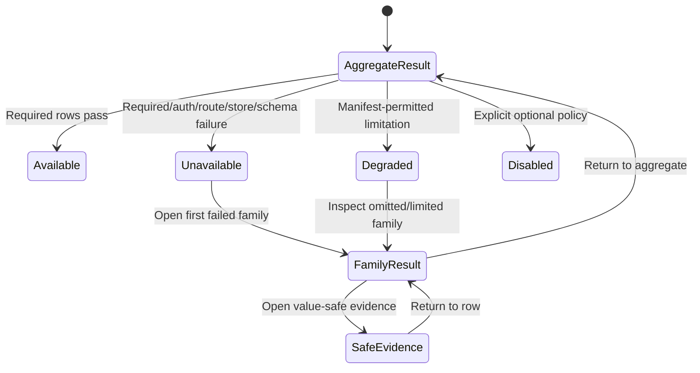

# Expected Behavior: [BUG-080-001] Fail-Loud Graph API Activation

## Problem Statement

A required production API must not disappear through a warning/nil-handler path while static pages and deployment health imply readiness.

## Outcome Contract

**Intent:** Refuse production startup/deploy when required Graph API configuration is missing, and prove route/read readiness when configuration is valid.

**Success Signal:** Required missing/empty config produces a typed refusal before serving; valid secret injection mounts topics, people, places, time, and edges and passes a non-mutating authenticated synthetic.

**Hard Constraints:** No secret output; no product-repo target details; no production-data writes; one operator-owned global knowledge graph with explicit role/grant access and no tenant/user row-isolation claim; explicit capability disablement remains truthful and unadvertised; 404 is reserved for actual resource/route semantics, not hidden activation failure.

**Failure Condition:** Required Graph API can be nil at runtime, static Wiki/Graph implies readiness without data routes, or acceptance checks health but not authenticated reads.

## Requirements

- **GRAPH-ACT-001:** Required production Graph API enablement SHALL reject missing or empty cursor-secret indirection/value before the server accepts traffic.
- **GRAPH-ACT-002:** Configuration errors SHALL expose a closed non-sensitive failure code and SHALL NOT print secret values.
- **GRAPH-ACT-003:** Valid configuration SHALL register topics, people, places, time, edges, and required cursor routes atomically.
- **GRAPH-ACT-004:** Explicit disabled mode SHALL omit/mark dependent UI capability unavailable and SHALL NOT report Graph API ready.
- **GRAPH-ACT-005:** Authenticated reads SHALL enforce the caller's explicit Graph read grant against the single operator-owned global corpus and return a true empty collection only after a successful authorized query. They SHALL NOT claim per-user or tenant row isolation.
- **GRAPH-ACT-006:** Database/dependency failure SHALL be a typed unavailable/degraded response, not route-not-found or empty data.
- **GRAPH-ACT-007:** Product readiness SHALL include a deterministic read-only route canary plus authenticated synthetic using disposable/seeded validation data outside production.
- **GRAPH-ACT-008:** The deployment adapter SHALL inject the required secret through its owned encrypted contract; Smackerel SHALL expose only generic config seams.
- **GRAPH-ACT-009:** Static Wiki/Graph navigation SHALL be advertised ready only when the authenticated data journey passes.
- **GRAPH-ACT-010:** User-visible unavailable/auth/empty/error states SHALL be accessible and responsive.
- **GRAPH-ACT-011:** Operators MAY read all private graph content and operational metadata. Another authenticated identity MAY read private graph content only with an explicit Graph read grant and MAY mutate nothing through this read-only capability. An ungranted identity SHALL receive no labels, nodes, edges, counts, route-family existence, source titles, or graph-existence hints.

## Corpus Ownership And Private Access

- Artifacts, topics, entities, relationships, Digest, Synthesis, and knowledge form one operator-owned/global corpus. Multiple authenticated identities are principals with roles/grants, not separate tenants.
- Private graph content is operator-private by default. An explicit Graph read grant permits a non-operator identity to read the authorized global projection; it does not assert ownership of individual rows or create a private duplicate graph.
- Authentication without the grant is insufficient. Denial clears prior private graph content and reveals neither existence nor aggregate counts.

## User Scenarios

```gherkin
Scenario: SCN-080-001-01 Required empty secret refuses startup
  Given Graph API is required and the configured secret name resolves to an empty value
  When core validates configuration
  Then startup is refused before serving
  And output names only a typed failure code and config key

Scenario: SCN-080-001-02 Valid config mounts every graph route
  Given the adapter injects a non-empty valid cursor secret
  When core starts
  Then topics, people, places, time, and edges routes are registered atomically

Scenario: SCN-080-001-03 Authenticated read-only synthetic proves behavior
  Given an ephemeral validation stack with seeded graph records and an authenticated test user
  When the product synthetic reads each graph family
  Then every route returns authorized contract-valid data without writing production state

Scenario: SCN-080-001-04 Explicit disablement is truthful
  Given Graph API is explicitly unsupported for a deployment
  When readiness and navigation render
  Then the capability is unavailable rather than ready
  And no static page promises a working graph journey

Scenario: SCN-080-001-05 True no-data differs from activation failure
  Given routes are mounted and an authorized user has no graph records
  When each collection is read
  Then a successful true-empty response is returned
  And it differs from missing route, auth, and dependency failure

Scenario: SCN-080-001-06 Auth and dependency failures remain typed
  Given the session is invalid or the graph store is unavailable
  When a graph read occurs
  Then the response is unauthorized or unavailable respectively
  And it is not 404 or empty success

Scenario: SCN-080-001-07 Secret values never leave the config boundary
  Given secret resolution succeeds or fails
  When logs, metrics, traces, errors, and synthetic output are inspected
  Then no cursor-secret value or credential body appears

Scenario: SCN-080-001-08 Wiki availability is accessible and responsive
  Given Graph API is ready, unavailable, or authentication has expired
  When a keyboard or screen-reader user opens Wiki/Graph on a narrow viewport
  Then the state and permitted action are perceivable without overlap or leaked prior labels

Scenario: SCN-080-001-09 Explicit grant controls the global graph
  Given an operator identity, a daily identity with the Graph read grant, and a daily identity without that grant
  When each identity uses the same product-wide login and reads the Graph API
  Then the operator and granted identity receive their permitted global-corpus projection
  And the ungranted identity receives access denial with no graph content, counts, or existence hints
  And no outcome claims tenant or per-user row isolation
```

## Acceptance Criteria

1. Missing/empty required secret fails config/startup before listening and never prints its value.
2. Valid config atomically mounts all graph families.
3. Route canary plus authenticated read-only synthetic fail on the old nil-handler/404 state.
4. True empty, explicit disabled, unauthorized, store unavailable, and route missing are distinct.
5. Smackerel changes remain generic; operator deploy-adapter injection is a separately routed devops responsibility.
6. Role/grant acceptance proves authorized global-corpus reads and leak-free denial for an ungranted identity without asserting tenant/user row isolation.

## Release Train

- Target train: `mvp`.
- Flags introduced: none.
- Graph/Wiki readiness is valid only when the complete route/read contract passes on that train.

## UI Wireframes

### UX Requirements

| ID | Observable Contract |
|---|---|
| UX-080-001-01 | Wiki Browse and Graph use one activation result derived from authenticated reads of topics, people, places, time, and edges; static page presence, a mounted shell, or general health cannot produce `Available`. |
| UX-080-001-02 | The shared state vocabulary is closed: `loading`, `ready`, `true-empty`, `partial`, `degraded`, `explicit-disabled`, `unauthorized-session`, `unauthorized-scope`, `route-missing`, `store-unavailable`, and `schema-error`. |
| UX-080-001-03 | `true-empty` is shown only after every required route returns an authorized contract-valid empty result. A missing route, rejected session, unreadable response, or store failure never uses empty-state copy. |
| UX-080-001-04 | `partial` exposes current verified families and names the omitted optional family or enrichment. `degraded` exposes retained verified data only while authorization remains valid and names the freshness or required-read limitation. Neither state claims complete Graph availability. |
| UX-080-001-05 | A route-level 404 appears as `Graph route unavailable` inside the Knowledge shell and in operator readiness output; it never strands the user on a generic not-found page or silently falls back to Browse as if Graph succeeded. |
| UX-080-001-06 | Session rejection immediately removes prior topic, person, place, time, edge, count, and topology labels from the visual and accessibility trees before re-authentication appears. Scope denial reveals no graph-existence metadata. |
| UX-080-001-07 | The product-owned read synthetic projects one result row per required family plus one aggregate activation result. Every row exposes only journey ID, safe state, duration, and value-safe evidence reference. |
| UX-080-001-08 | Retry repeats only the failed read operation, never creates graph records, and replaces the prior terminal message rather than stacking alerts or presenting stale content as a new success. |

### Screen Inventory

| Screen | Actor(s) | Status | Scenarios Served |
|---|---|---|---|
| Knowledge Browse and Graph view (`/knowledge`) | Daily user, returning user | Existing - Modify | SCN-080-001-02 through SCN-080-001-06, SCN-080-001-08 |
| Wiki/Graph Readiness (`/status` or Settings capability detail) | Operator | Existing capability status - Modify | SCN-080-001-01 through SCN-080-001-08 |

### UI Primitives

| Primitive | Used By Screens | Composition Rule | Accessibility / Responsive Constraint |
|---|---|---|---|
| Knowledge local view switcher | Browse; Graph; Timeline | Graph stays discoverable with its current state label. Activating an unavailable view opens the explanatory state in place instead of issuing navigation to a generic 404. | Uses links or a true tab pattern consistently; current view and availability are exposed as text, not color. |
| Capability state band | Knowledge; Graph; Wiki/Graph Readiness | Uses the product labels `Available`, `Degraded`, or `Unavailable`, followed by the exact state-specific explanation below. `Needs setup` appears only for operator-remediable optional configuration, never for a required empty secret. | One concise status announcement after a settled read; wraps before actions at narrow widths. |
| Graph family result row | Knowledge state detail; Wiki/Graph Readiness; synthetic result | Fixed family order: Topics, People, Places, Time, Edges. Each row has family, safe state, observed time/duration, and action/evidence. | Desktop table becomes labeled records on mobile; no column can be the sole carrier of meaning. |
| Verified-data boundary | Browse; Graph | Only rows/nodes from successful current authorized reads render. Missing families are represented by limitation text, never skeletons, sample rows, or inferred counts. | Partial content precedes limitation in source order; screen reader receives included and omitted family names. |
| Graph privacy clear | Knowledge; Graph; session recovery | Auth loss removes all graph-derived DOM and render pixels before the recovery state is inserted. | Recovery heading receives focus once; no prior label remains discoverable through accessibility APIs. |
| Read-only recovery action | Knowledge; Graph; readiness detail | `Retry read`, `Sign in again`, `Return to Browse`, or `View readiness` is selected by state. No action creates, refreshes, syncs, or mutates knowledge. | Action name includes the failed family when family-scoped; duplicate Retry is disabled while pending. |

### Shared Wiki/Graph State Contract

| State Key | User-Visible Label | Required Visible Meaning | Knowledge/Graph Content Rule | Acceptance Meaning |
|---|---|---|---|---|
| `loading` | `Checking connected knowledge` | The authenticated family reads are still settling. | Stable shell and labeled placeholders only; no sample labels, counts, or topology. | Non-terminal; cannot pass. |
| `ready` | `Available` | Every required family and cursor contract returned authorized, readable current output. | Real rows/topology or family-specific populated results render. | Required journey may pass. |
| `true-empty` | `No connected knowledge yet` | Every required family read succeeded and returned zero authorized records. | Capture and source guidance only; no sample node, fake edge, or Retry. | Passes only when the manifest permits true empty. |
| `partial` | `Degraded - partial graph` | Current verified output exists, but an explicitly optional family or enrichment is omitted. | Verified families remain operable; omitted family and impact are named. | Passes only when the manifest explicitly permits this exact partial state. |
| `degraded` | `Degraded - graph data is incomplete` | Useful authorized data remains, but freshness or a required dependency/read is below the complete contract. | Retained data carries observed time and limitation; Graph cannot show `Available`. | Required complete journey fails unless a declared degraded policy says otherwise. |
| `explicit-disabled` | `Unavailable - Graph is disabled for this deployment` | Compiled policy intentionally excludes Graph. | Browse may remain available from its own successful reads; no Graph setup or Retry promise. | Optional policy state may pass; required Graph fails. |
| `unauthorized-session` | `Your session ended` | No graph read completed under a valid session. | All graph-derived content is removed before the message appears. | Fails authentication journey. |
| `unauthorized-scope` | `You do not have access to connected knowledge` | Session is valid but actor scope is insufficient. | No existence, label, count, route-family, or evidence detail is shown. | Fails for an actor required to have access. |
| `route-missing` | `Graph route unavailable` | A required product route returned not found or was not registered. | No empty copy or sample graph; successful independent Browse content may remain separately labeled. | Always fails required activation. |
| `store-unavailable` | `Graph data is unavailable` | A registered route could not complete its store/dependency read. | No failed family is represented as empty; separately verified families may remain only under `partial`/`degraded`. | Fails unless an exact degraded policy permits remaining behavior. |
| `schema-error` | `Graph response could not be read` | The route responded but its contract was absent, malformed, or unsupported. | Unreadable content and counts are omitted; Retry is available only when safe. | Always fails the affected journey. |

### Screen: Knowledge Browse And Graph Activation

**Actor:** Daily User, Returning User | **Route:** `/knowledge` | **Status:** Modify

**Desktop - ready or degraded composition:**

```text
┌────────────────────────────────────────────────────────────────────────────┐
│ Knowledge                         [Browse | Graph | Timeline] [Available]  │
│ Connected knowledge: [ready / partial / unavailable explanation]          │
├────────────────────────────────────────────────────────────────────────────┤
│ Topics [state/count]  People [state/count]  Places [state/count]          │
│ Time   [state/count]  Edges  [state/count]              [View readiness]  │
├────────────────────────────────────────────────────────────────────────────┤
│ BROWSE / GRAPH                                                             │
│ [authorized current rows or bounded graph projection....................] │
│ [........................................................................] │
│                                                                            │
│ [state-specific limitation, empty explanation, or recovery action]        │
└────────────────────────────────────────────────────────────────────────────┘
```

**Mobile / narrow viewport:**

```text
┌──────────────────────────────┐
│ Knowledge        [Available] │
│ [Browse | Graph | Timeline]  │
├──────────────────────────────┤
│ Connected knowledge          │
│ [state explanation wraps]    │
│ Topics  [state/count]        │
│ People  [state/count]        │
│ Places  [state/count]        │
│ Time    [state/count]        │
│ Edges   [state/count]        │
├──────────────────────────────┤
│ [verified content OR         │
│  true-empty/error treatment] │
│ [full-width recovery action] │
└──────────────────────────────┘
```

**Interactions:**

- Opening Knowledge starts one shared activation read whose family outcomes populate both Browse and Graph state. Changing local view never weakens or recomputes the state independently.
- Activating Graph while `route-missing`, `store-unavailable`, `schema-error`, or `explicit-disabled` renders the matching state in the content track. The URL may identify the requested view, but the user never leaves the product shell for a generic 404.
- `Retry read` starts one new read for the failed family or aggregate activation contract. Verified prior data remains visibly timestamped only while the current session is authorized.
- `Return to Browse` restores the last independently verified Browse context. It does not convert the Graph failure into a Browse success claim.
- A successful true-empty read exposes Capture or source guidance appropriate to the user's permissions. It does not expose Retry because the read itself succeeded.

**Responsive:** Desktop family results use a compact labeled band, not five decorative cards. Tablet wraps families into two rows. Mobile uses one labeled record per family and keeps the state explanation before content. At 320px and 200% zoom there is no horizontal page scroll, clipped state text, or overlapping local navigation.

**Keyboard:** Tab order is product navigation, local view switcher, family detail links, verified content, then the current recovery action. Enter/Space activates the same view/action path as pointer input. Loading does not move focus. A blocking session/scope state focuses its heading once; partial/degraded updates announce without stealing focus.

**Screen reader and visual accessibility:** One polite atomic region announces loading, ready, true-empty, partial, degraded, and retry transitions. Session, scope, route-missing, store, and schema failures use one alert per transition. Family state/count pairs are real label/value relationships. State is text plus icon/shape; no traffic-light color, hidden tooltip, or topology position carries the contract alone.

### Screen: Wiki/Graph Readiness Detail

**Actor:** Operator | **Route:** `/status` or Settings capability detail | **Status:** Modify

```text
┌────────────────────────────────────────────────────────────────────────────┐
│ Wiki / Graph readiness                                      [Unavailable] │
│ Activation [required / optional / disabled]  Observed [time]              │
├────────────────────────────────────────────────────────────────────────────┤
│ Family    Route state      Read state       Duration       Evidence       │
│ Topics    [mounted]        [populated]      [time]         [safe ref]     │
│ People    [mounted]        [true-empty]     [time]         [safe ref]     │
│ Places    [route-missing]  [not run]        [time]         E080-[code]    │
│ Time      [mounted]        [partial]        [time]         [safe ref]     │
│ Edges     [mounted]        [unavailable]    [time]         E080-[code]    │
├────────────────────────────────────────────────────────────────────────────┤
│ Required state [all required reads contract-valid]                        │
│ Observed state [safe closed state]  Owner [product / deployment role]     │
│ [View value-safe synthetic result]                                        │
└────────────────────────────────────────────────────────────────────────────┘
```

**Interactions:** The projection is read-only. Evidence links open only value-safe artifacts. It provides no secret field, copy-secret affordance, configuration mutation, route trigger, or production-data action. Operator setup is linked to the owning generic guidance; concrete adapter work remains outside Smackerel.

**States:** `Checking` preserves labels without invented values. `Available` requires all required family rows to settle ready or manifest-permitted true-empty. `Degraded` names partial/freshness limitations. `Unavailable` leads with the first required route/read/auth/schema failure while preserving every other row's truthful independent state.

**Responsive / accessibility:** The table becomes family records in the same order on mobile. Aggregate state, activation policy, observation time, route state, read state, duration, and evidence remain visible. The heading is announced before the first failed row; opening and returning from evidence restores focus to that row.

### Playwright-Visible Read Synthetic Contract

These are planned real-stack observations for downstream test ownership. They do not claim browser, API, config, secret, store, or deployment execution.

| ID | Real-Stack Setup And Gesture | Required Network / Visible Outcome | Forbidden Outcome |
|---|---|---|---|
| UX-E2E-080-001-01 | Valid configured stack and authenticated user open Knowledge while family reads are pending. | Real family requests are visible; `Checking connected knowledge` appears with no graph labels or fabricated counts. | `Available`, sample topology, or true-empty before all required reads settle. |
| UX-E2E-080-001-02 | Seeded authorized topics, people, places, time records, and edges exist. | Each required family returns contract-valid data; family rows show current counts/states; Knowledge and Graph show `Available` and real labels. | Mounted-route-only success, fixture badge, or missing family silently omitted. |
| UX-E2E-080-001-03 | Authorized user has zero records across every required family after successful reads. | Every family response is successful empty; UI shows `No connected knowledge yet` and allowed Capture/source guidance. | Retry, generic error, sample nodes/edges, or `Graph route unavailable`. |
| UX-E2E-080-001-04 | Manifest permits one optional enrichment/family to be absent while every required family returns current verified data. | UI shows `Degraded - partial graph`, names included and omitted families, and keeps verified rows operable. | Full `Available`, hidden omission, or empty graph. |
| UX-E2E-080-001-05 | Current session remains valid; one required store read fails while separately verified family data exists. | Aggregate state is `Degraded` or `Unavailable` per manifest; failure family and safe cause are visible; only independently verified data remains. | Failed family rendered empty, stale data labeled current, or full readiness. |
| UX-E2E-080-001-06 | Compiled deployment policy explicitly disables optional Graph. | Graph local view opens an `Unavailable - Graph is disabled for this deployment` explanation; Browse remains only if its own reads pass. | 404 navigation, setup fields that cannot work, or Graph `Available`. |
| UX-E2E-080-001-07 | Session expires after personal graph content was visible. | Next real read rejects; prior labels/counts/topology disappear from DOM, accessibility tree, and populated graph pixels before `Your session ended` appears. | True-empty, retained private labels, or scope/secret detail. |
| UX-E2E-080-001-08 | Authenticated user lacks Graph scope. | `You do not have access to connected knowledge` and safe return are visible. | Route/family counts, existence hints, sign-in loop, or prior graph content. |
| UX-E2E-080-001-09 | One required route is not registered and returns a real 404 while general health remains green. | Knowledge shell remains; family row and Graph content show `Graph route unavailable`; readiness result is `Unavailable` with the Graph code. | Generic 404 page, true-empty, or overall acceptance success. |
| UX-E2E-080-001-10 | A required route returns contract-invalid schema and, separately, the store is unavailable. | UI distinguishes `Graph response could not be read` from `Graph data is unavailable`; Retry appears only where safe. | Shared generic empty state, raw payload, database error, or secret value. |
| UX-E2E-080-001-11 | Operator opens readiness output after one failing family synthetic. | Fixed-order Topics/People/Places/Time/Edges rows, aggregate state, observed time, safe code, and evidence reference are visible. | Cursor secret, auth cookie, graph labels/content, target hostname, or missing failed row. |
| UX-E2E-080-001-12 | Keyboard/screen-reader user traverses Knowledge and readiness at 320px and 200% zoom. | View switcher, family states, content/recovery actions, and evidence rows follow visual order; state transitions are announced once; no overlap or horizontal page scroll occurs. | Silently disabled Graph control, color-only state, pointer-only Retry, or clipped failed family. |

### Routed Design Questions

| Owner | Question | UX Constraint That Must Survive Resolution |
|---|---|---|
| `bubbles.design` | What single activation/read model supplies Wiki Browse, Graph, readiness, and the synthetic without each surface interpreting route outcomes independently? | The closed states and fixed family ordering above remain identical across user and operator projections. |
| `bubbles.design` | Which family/enrichment omissions may qualify as manifest-permitted `partial`, and which required failures force `Unavailable`? | `partial` and `degraded` cannot soften a required route, auth, schema, or store failure into `Available`. |
| `bubbles.design` | How are independently verified rows retained during a family failure without serving stale or newly unauthorized graph content? | Retained content remains timestamped and authorized; auth loss clears it immediately. |
| `bubbles.plan` | Which real validate-stack fixtures produce populated, all-family true-empty, optional partial, required degradation, route-missing, store-unavailable, schema-error, session rejection, and scope denial without internal interception? | Playwright observes the real product reads and visible state distinctions; no canned response closes these scenarios. |
| `bubbles.devops` | How does strict acceptance consume the product-owned aggregate without reimplementing the family assertions or exposing secret injection details? | The operator adapter reads the value-safe contract only; this Smackerel packet remains target-agnostic and does not edit the adapter repository. |

## User Flows

### User Flow: Shared Wiki/Graph Activation Truth

```mermaid
stateDiagram-v2
  [*] --> CheckingActivation
  CheckingActivation --> Available: All required reads valid
  CheckingActivation --> TrueEmpty: All required reads succeed empty
  CheckingActivation --> Partial: Optional omission; verified data remains
  CheckingActivation --> Degraded: Required dependency/freshness limitation
  CheckingActivation --> Disabled: Explicit optional policy
  CheckingActivation --> RouteMissing: Required route absent
  CheckingActivation --> StoreUnavailable: Registered read fails
  CheckingActivation --> SchemaError: Response unreadable
  CheckingActivation --> SessionEnded: Session rejected
  CheckingActivation --> AccessDenied: Scope rejected
  Available --> GraphView: Choose Graph
  TrueEmpty --> CaptureOrSources: Choose permitted entry action
  Partial --> GraphView: Continue with named limitation
  Degraded --> Browse: Return to verified Browse context
  Disabled --> Browse: Return to Browse
  RouteMissing --> CheckingActivation: Retry read
  StoreUnavailable --> CheckingActivation: Retry read
  SchemaError --> CheckingActivation: Retry when safe
  SessionEnded --> Reauthenticate: Sign in again
  Reauthenticate --> CheckingActivation: Re-authorize every family
  AccessDenied --> SafeReturn: Return without graph disclosure
```



### User Flow: Operator Reads Product-Owned Synthetic Output


