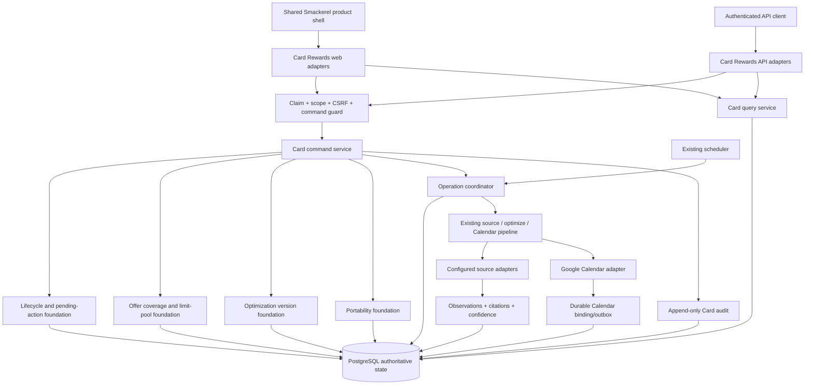

# Technical Design: Card Rewards Parity Runtime Completion

## Design Brief

### Current State

Smackerel already has a native Card Rewards runtime: migration `057_card_rewards.sql`, PostgreSQL store/service code under `internal/cardrewards`, authenticated JSON routes in `internal/api/cardrewards.go`, ten server-rendered routes in `internal/web/cardrewards.go`, source reconciliation, optimizer, scheduler, Google Calendar bridge, one-time CCManager importer, shared product navigation, spec-092 design tokens, and real-stack Playwright coverage under `web/pwa/tests/cardrewards*.spec.ts`.

The remaining drift is behavioral rather than visual. Offers still store one scalar category and the importer expands one CCManager multi-category offer into multiple rows; selections and bonuses lack complete lifecycle/delete/resolve commands; recommendations overwrite one row per period/category; report reads recompute rather than identify an immutable version; `card_runs` covers pipelines but not all user actions; import is a tolerant one-time filesystem operation rather than a versioned dry-run workflow; manual triggers can be present while the capability is disabled; and Card Rewards rows are global even though the enclosing router authenticates per-user PASETO sessions.

Read-only CCManager inspection confirms the useful baseline behaviors across `web/app.py`, `web/templates`, and `data/*.json`: card discovery/custom/edit/note/activate/remove, multi-category shared-limit offers, tiered selections and pending actions, bonus completion/removal, editable/reorderable monthly history, source/image/verify operations, run history, manual and cron operations, full reports, system theme, mobile/ARIA behavior, and visible errors. CCManager's JSON source of truth, Basic Auth, GET mutations, query-string cron secret, fail-soft defaults, GitHub data sync, and unsafe external URL patterns are explicitly not copied.

### Target State

Complete the existing Smackerel capability as a feature-sized, 16-area delivery program that retains `BUG-083-002` lineage. Shared foundations cover claim-bound ownership, optimistic commands, lifecycle/pending actions, multi-category benefit coverage with typed limit pools, immutable optimization versions, source/operation state, append-only audit, and versioned portability. The current PostgreSQL database remains the only business store and the existing service, scheduler, source reconciliation, Calendar, template, app-shell, and authentication patterns remain the owning implementation surfaces.

All 16 parity areas become independently testable through cohesive end-to-end slices, not an 18-step or other single serial chain. Every slice traverses shell/adapter, claim authorization, product Origin/CSRF guard, typed service contract, PostgreSQL state, immutable audit, and representative keyboard/screen-reader/mobile acceptance. Every write derives its owner and actor from the authenticated session, requires an idempotency key and expected version where applicable, commits authoritative PostgreSQL state before success, appends immutable audit evidence, and returns a closed mutation outcome. External source and calendar effects use durable PostgreSQL operation/outbox records, so partial dependency failure is visible and recoverable without fabricating complete success.

### Patterns To Follow

- Extend `internal/cardrewards/{types,store,service,service_insights,optimize,recommend,pipeline,calendar}.go`; do not create a sibling domain runtime.
- Extend migration 057's tables additively and use the existing migration runner; no SQLite, JSON runtime store, Redis business cache, or ORM.
- Reuse `auth.UserIDFromContext`, `auth.SessionFromContext`, `auth.RequireScope`, and the existing `OperatorGate` pattern for claim-bound ownership and operator-only source/config operations.
- Reuse `appShellNav`, the Card Rewards `head`/`cardrewards-nav` templates, spec-092 tokens/components, existing routes, and stable `data-*` hooks.
- Reuse source observations, confidence, citations, `needs_verification`, manual override, stable Calendar UID, and pipeline scheduler paths already present.
- Reuse the repository's append-only ledger and optimistic-version precedents from migrations 062 and 055.

### Patterns To Avoid

- Porting CCManager Flask handlers, JSON files, GitHub sync, Basic Auth, cron secrets, inline JavaScript, or fail-soft defaults.
- Treating authenticated routing as row ownership; every query and mutation must be claim-bound.
- Expanding multi-category offers into duplicate offer rows or summing a shared cap more than once.
- Updating the current recommendation row in place without an immutable version.
- Presenting a redirect or HTTP 200 as mutation success without authoritative read-back.
- Making source/calendar/import files a second source of truth.
- Logging raw source bodies, import records, credentials, card-sensitive values, or database errors.
- A one-scope rewrite of all 16 areas or broad replacement of shared auth/test infrastructure.
- A long serial chain that postpones security, typed errors, audit, mobile, keyboard, or screen-reader acceptance until a final hardening step.
- Treating spec 106 shell composition as evidence that any Card domain parity row is delivered.

### Resolved Decisions

- Catalog and source observations remain global; wallet, categories, offers, selections, bonuses, optimization history, pending actions, imports, exports, and user audit views become owner-scoped.
- Every existing Card route remains valid; two additive pages are `/cards/import-export` and `/cards/audit`.
- Existing ten routes compose into seven local views: Today, Wallet, Benefits, Bonuses, Optimize, Sources, and Audit.
- One offer owns multiple category rows and optionally references one typed limit pool.
- Selection sets, bonuses, offers, and wallet entries use explicit lifecycle state and optimistic row versions.
- Recommendation snapshots are immutable; a current pointer selects the authoritative version per owner and period.
- `card_runs` coordinates scheduled/manual operations; `card_audit_events` is the immutable history of every attempt and state transition.
- Manual and scheduled operations share one PostgreSQL idempotency/lease contract, not only process-local mutexes.
- Portability uses a versioned JSON envelope, dry-run session, transactional apply, explicit conflict decisions, and immutable export artifacts in PostgreSQL.
- Calendar remains an explicitly configured shared operator capability limited to an SST owner allowlist; it is not silently available to every authenticated user.
- `BUG-083-002` owns every domain contract and acceptance result across the 16 areas; spec 106 only composes already-delivered Card routes, deep links, state vocabulary, and theme/navigation inside the product shell.
- Parity means CCManager's useful behavior plus Smackerel's stronger ownership, provenance, lifecycle, PostgreSQL, security, accessibility, and failure-honesty contracts. A visually similar but weaker result is not parity.
- Seven cohesive delivery slices may proceed in dependency waves after their required expand contract exists; no global serial chain is imposed.
- Migration letters below are logical expand-contract groups only. The implementation owner allocates filenames/numbers from the then-current migration inventory and proves collision-free ordering before writing a migration.

### Open Questions

- The operator must supply the existing-row owner subject used by the ownership backfill. Migration refuses to guess `local`, the first user, or an operator account.
- The operator must supply explicit import byte limit, dry-run retention, export retention, operation lease, report freshness, and audit retention policy values in SST. The design defines their semantics but no values.

## Purpose And Change Boundary

This document owns the technical design needed to satisfy all 16 rows in the bug specification. It covers domain contracts, PostgreSQL evolution, APIs, UI composition, security, source/calendar operations, import/export, audit, observability, migration, rollback, and validation strategy.

The design does not modify CCManager and does not introduce any runtime dependency on it. CCManager is only a read-only behavioral benchmark and a supported legacy import format. The design does not change financial boundaries: Card Rewards explains rewards and tracks user-entered benefits; it does not collect PAN/CVV, connect to bank transaction feeds, execute transactions, approve trades, or provide individualized financial advice.

The parity acceptance function is conjunctive for every row: preserve or improve the matching CCManager workflow, preserve the named Smackerel advantage, pass the slice acceptance kernel, and record the authoritative round-trip/adversarial outcome. No aggregate route count, shell screenshot, or cross-area smoke test can substitute for one missing row.

## Confirmed Gap Analysis

| Area | Current Smackerel evidence | Confirmed design gap |
|---|---|---|
| Wallet | `Service.Create/Update/DeleteUserCard`; `/api/cards`; `/cards/wallet` | No claim-bound owner, row version, delete preview, or immutable mutation audit. |
| Offers | `Offer.Category`; `SharedLimitGroup`; optimizer pool helper | One logical multi-category offer is expanded into multiple rows; pool identity is an untyped string. |
| Selections | one row per category/tier; pending is a derived query | No selection-set lifecycle, remove/expire/re-enroll/dismiss command, or persistent cause identity. |
| Bonuses | create/update progress and Calendar recommendation bridge | No complete/remove lifecycle, bonus Calendar binding, or durable partial-delivery state. |
| Optimization | unique `(period_label, category)` rows; overwrite/upsert | No immutable versions, compare, reorder, restore, or current pointer. |
| Sources | observations/reconcile/manual verify exist | No unified source inventory/health/operation projection or safe typed failure API. |
| Audit | `card_runs` records pipeline summaries | User mutations, refusals, conflicts, no-ops, imports/exports, and lifecycle actions are absent; immutability is not enforced. |
| Config | fail-loud loader exists | Wiring still warn-skips or exposes manual triggers when disabled/malformed; operation availability is implicit. |
| Import/export | path-based one-time importer | No schema version, user dry-run, all-or-none apply, conflict resolution, export, or replay receipt. |
| Pending | derived unenrolled selection query | No persisted resolve/dismiss lifecycle or non-recurrence key. |
| Reports | live optimizer report and current recommendation rows | No immutable report version/freshness identity; current/no-data/stale/degraded/failure can conflate. |
| Operations | scheduler mutexes and manual methods | No cross-process lease, durable queued/running state, request identity, or browser-visible operation result. |
| Product shell | `appShellNav` plus Card local nav and tokens | Current ten links are flat; explicit Light/Dark/System preference and one shared state vocabulary are incomplete. |
| Errors | sentinel errors and generic `writeError`; web `http.Error` | Web can render raw service text and blank error pages; no closed command/read state contract. |
| A11y/responsive | spec-092 CSS and existing Playwright coverage | New lifecycle, comparison, import, audit, and operation controls need equivalent coverage. |
| Security | bearer/web auth and CSP | Card rows are global; no Card-specific scope gate or CSRF token; source/export boundaries need explicit SSRF/redaction controls. |

## Architecture Overview



The adapters never query PostgreSQL directly. They derive `ActorContext` from the authenticated session, invoke one command/query service, and render the typed result. Source refresh is operator-global; user optimization and Calendar delivery are owner-scoped. All current business data remains in PostgreSQL.

## Capability Foundation

### Foundation Contracts

| Contract | Responsibility | Existing base |
|---|---|---|
| `ActorContext` | Claim-bound subject, actor kind, scopes, operator status, correlation ID. Never accepted from request bodies. | `auth.Session`, `auth.UserIDFromContext`, `OperatorGate`. |
| `CommandContext` | Actor, idempotency key, expected row version, command source, current time. | Existing service methods plus HTTP request context. |
| `CommandResult[T]` | Closed mutation state and authoritative read-back. | Replaces ad hoc redirect/HTTP-error interpretation. |
| `LifecycleService` | Allowed state transitions, date-driven transitions, cause fingerprints, pending actions. | Existing rotating lifecycle and pending re-enrollment query. |
| `BenefitCoverage` | One offer, many canonical categories, one optional typed limit pool. | Existing offer/optimizer/shared-group logic. |
| `OptimizationVersionService` | Immutable snapshots, compare, manual edit, regeneration, promotion, restore. | Existing optimizer/recommender/current rows. |
| `OperationCoordinator` | Durable claim, lease, dedupe, schedule/manual trigger, retry, safe outcome. | Existing scheduler/pipeline and `card_runs`. |
| `SourceCapability` | Configured source inventory, health, citations, confidence, source-qualified card media, and verify/reject operations. | Existing connector/extractor/reconciler observations and same-origin web serving. |
| `PortabilityService` | Versioned export, dry-run import, conflict plan, transactional apply. | Existing one-time importer transforms. |
| `AuditAppender` | Append-only privacy-safe event for every attempt and transition. | Existing `card_runs` and append-only ledger precedent. |
| `CapabilityAvailability` | Per-operation `available`, `needs_setup`, `degraded`, or `unavailable`. | Existing config and scheduler wiring, made explicit. |

### Claim-Bound Ownership

```go
type ActorContext struct {
		Subject       string
		Kind          ActorKind // user|operator|system
		Scopes        []string
		CorrelationID string
}
```

Production user and operator commands require a non-empty PASETO subject. API and web handlers derive it from `auth.UserIDFromContext`; request bodies, path fields, import payloads, and headers cannot select an owner. Operator privilege is the existing SST allowlist layered over the subject.

Dev/test shared-token sessions use one explicit `CARD_REWARDS_SHARED_OWNER_USER_ID`; when Card Rewards is enabled under shared-token auth and this value is empty, startup or the Card surface fails loud rather than falling back to `local`. Scheduled source operations use a `system` actor and no owner; per-user optimize/report/calendar operations enumerate explicit Card owners from PostgreSQL and retain the owner on every row.

Global data:

- seeded/discovered `card_catalog` rows
- configured source inventory/runtime state
- source observations and reconciled rotating facts for global catalog cards

Owner-scoped data:

- manual catalog cards
- wallet entries, offers, selection sets/entries, bonuses, category preferences
- optimization versions/entries/current pointers
- pending actions, import sessions, export artifacts
- user-facing operation and audit rows

Every owner-scoped store method requires `ownerUserID`; SQL includes it in the predicate. A missing row and a different-owner row both return the same not-found response. Composite unique keys prevent accidental cross-owner association.

### Command And Concurrency Contract

```go
type MutationState string
const (
		MutationPersisted  MutationState = "persisted"
		MutationIdempotent MutationState = "idempotent"
		MutationConflict   MutationState = "conflict"
		MutationRefused    MutationState = "refused"
		MutationFailed     MutationState = "failed"
)

type CommandResult[T any] struct {
		State        MutationState
		Entity       T
		Version      int64
		AuditEventID string
		OperationID  string
		Error        *SafeCardError
}
```

- Create and action commands require an `Idempotency-Key`. Server-rendered forms receive a claim-bound one-use key.
- Updates/deletes require `If-Match` or a hidden `row_version` field.
- The store updates with `WHERE owner_user_id=$owner AND id=$id AND row_version=$expected`; zero rows yields `conflict` or not-found after a claim-bound check.
- Successful command responses contain the row re-read after commit.
- A repeated key with the same request hash returns the original authoritative identity as `idempotent`; the same key with a different hash is `conflict`.
- Multi-row commands execute in one PostgreSQL transaction and append their audit event in that transaction.
- External source/calendar work is never represented as transactionally committed until its own operation/outbox state says so.

`card_command_receipts` owns replay safety; it is not business state and cannot be used as a data source for Card reads.

### Lifecycle Foundation

The foundation owns closed transitions rather than booleans spread through handlers:

| Entity | States | Allowed transitions |
|---|---|---|
| Wallet card | `active`, `inactive`, `deleted` | active/inactive toggle; either to deleted after cascade preview/confirmation. |
| Offer | `draft`, `active`, `inactive`, `expired`, `completed`, `deleted` | Date/activation service derives active/expired; user may activate/deactivate/complete/delete. |
| Selection set | `draft`, `enrolled`, `locked`, `expired`, `pending_reenrollment`, `resolved`, `dismissed`, `deleted` | Enrollment and dates drive locked/expired/pending; resolve creates a new enrolled revision; dismiss closes only the current cause. |
| Bonus | `active`, `met`, `expired`, `deleted` | Progress may atomically move active to met; explicit complete is idempotent; deadline may move active to expired; delete removes current visibility and schedules Calendar removal. |
| Source observation | `current`, `stale`, `degraded`, `verified`, `superseded` | Reconciliation and operator verification append evidence; verified/manual data cannot be silently overwritten. |

`card_pending_actions` persists an action only when a lifecycle rule emits a new `cause_key`. The key is a hash of owner, action kind, entity ID, due period, and source/entity version. Resolving or dismissing a row prevents that same cause from reappearing; a genuinely new period/version creates a new key. This supports selections, bonus deadlines, activation needs, and source verification without a global unread counter.

Delete means a transactional soft cascade for owner data: affected active children become `deleted`, current optimization pointers are marked stale, Calendar removal commands are enqueued, and an audit event lists safe counts. Physical purge is a separate retention operation. PostgreSQL FKs remain in force and protect final purge integrity.

### Multi-Category Offer And Shared-Limit Foundation

One `card_offers` row is the logical offer. `card_offer_categories` holds one or more canonical categories. An optional `card_limit_pools` row owns the cap and period:

```go
type Offer struct {
		ID             string
		OwnerUserID    string
		UserCardID     *string
		Title          string
		Categories     []string
		Rate           float64
		RateType       string
		LimitPool      *LimitPool
		LifecycleState string
		RowVersion     int64
}

type LimitPool struct {
		ID          string
		Name        string
		LimitCents  int
		LimitPeriod string
		Scope       string // shared_categories|single_category
		RowVersion  int64
}
```

The optimizer evaluates one offer per card, matches any category in its set, and references the same pool for every matched category. It never sums the cap across categories or duplicate benefit candidates. Removing one category updates the join set and leaves the pool unchanged; removing the last category is refused until the offer is deleted or another category is supplied. Multiple offers may reference one pool only through an explicit user-selected pool identity; matching string names no longer create accidental sharing.

### Versioned Optimization And Report Foundation

An optimization version is immutable after insertion:

```go
type OptimizationVersion struct {
		ID              string
		OwnerUserID     string
		PeriodLabel     string
		Revision        int64
		ParentVersionID *string
		Kind            string // generated|manual|restored|imported
		Trigger         string // scheduled|manual|import
		SourceRunID     *string
		SnapshotHash    string
		CreatedAt       time.Time
}
```

`card_recommendations` becomes the immutable entry table for a version. `card_optimization_current` points to one current version per owner/period. No recommendation entry is updated in place.

- Manual edit, star, reorder, add, or remove copies the current snapshot, applies the requested change, writes a new immutable version, and atomically advances the pointer.
- Manual regenerate writes a proposed version for comparison; accepting it advances the pointer. It carries manual/starred entries forward unless the user explicitly changes them.
- Scheduled generation writes and promotes a new version while preserving manual choices as explicit copied entries.
- Restore copies a selected historical snapshot into a new `restored` version and advances the pointer; history is never rewound or deleted.
- Compare is a pure diff of two immutable versions with added/removed/changed/reordered fields.
- Report reads a persisted version, not an unversioned live recomputation. It includes recommendation, alternatives, rate type, source, reason, pool/limit, provenance, generated time, source freshness, and version identity.

Report status is a closed enum: `current`, `historical`, `no_cards`, `no_match`, `stale`, `degraded`, `unavailable`, `failed`. A stale/degraded version remains inspectable but cannot claim current complete coverage.

### Source And Operation Foundation

`CapabilityAvailability` evaluates these operations independently:

| Capability | Ready when | Optional behavior |
|---|---|---|
| `core` | PostgreSQL schema and claim-bound service wired | Required when Cards routes are mounted. |
| `source_refresh` | configured sources, connector, extractor, and reconciler ready | `needs_setup`/`degraded`; existing verified facts remain timestamped. |
| `optimization` | core plus category and optimizer service ready | True no-cards/no-match remains a result, not unavailable. |
| `calendar` | explicit calendar enablement, parsed credential, client, Calendar ID, UID prefix, and owner allowlist | `needs_setup`/`unavailable`; no inert trigger. |
| `schedules` | operation coordinator and explicit cron values ready | Manual status remains visible; disabled schedule is not failure. |
| `portability` | schema registry, size/retention config, and PostgreSQL artifact/session tables ready | Import/export controls withheld if unavailable. |

SST adds an explicit non-empty `card_rewards.required_capabilities` list when Card Rewards itself is required. Startup refuses if a required capability is unavailable. Optional capability failure keeps core Cards available but is projected consistently to API, UI, scheduler, status, and audit. Malformed Calendar credentials no longer silently become a nil bridge while a ready trigger remains visible.

`card_runs` evolves into the durable operation record. Scheduled and manual callers calculate the same server-owned operation key from operation type, owner/scope, logical period/window, and input version. A unique operation key prevents duplicate work across processes. Workers claim queued rows with a lease and `FOR UPDATE SKIP LOCKED`; a crashed lease can be recovered after its explicit SST duration. A duplicate attempt appends an `idempotent` audit event referencing the existing run. Explicit retry is permitted only for a typed retryable terminal failure and creates a child operation with a new retry ordinal.

### Versioned Portability Foundation

Canonical export media type: `application/vnd.smackerel.card-rewards+json;version=1`.

```json
{
	"schema": "smackerel.card-rewards",
	"version": 1,
	"export_id": "uuid",
	"generated_at": "RFC3339",
	"scope": ["wallet","benefits","bonuses","optimization_history"],
	"base_revision": "sha256:...",
	"records": {
		"wallet": [],
		"offers": [],
		"selection_sets": [],
		"bonuses": [],
		"category_preferences": [],
		"optimization_versions": []
	},
	"integrity": {"algorithm":"sha256","digest":"sha256:..."}
}
```

Excluded unconditionally: PASETO/session material, API/provider/calendar credentials, PAN/CVV/account numbers, raw source bodies, audit error details, command receipts, other owners' IDs/data, and server topology.

Import phases:

1. Authenticate, authorize scope, enforce body limit before parsing, and reject secret/card-sensitive field names.
2. Select an explicit decoder from the schema registry. Supported inputs are canonical v1 and the operator-only `ccmanager/v0` legacy adapter built from the existing importer transforms. Unknown/newer versions and downgrade-shaped content are refused.
3. Normalize and validate every record without writing Card business rows.
4. Compare against claim-bound current state and persist a dry-run session containing payload hash, base revision, counts, safe conflicts, and normalized command plan. Raw uploaded bytes are not retained.
5. User chooses an explicit resolution for every conflict. `merge` and `replace` are distinct modes; replace names all deletions in the preview.
6. Apply only when payload hash, owner, session expiry, and base revision still match. The complete plan commits in one transaction with command receipt and audit event.
7. Replaying the same payload/mode returns the prior authoritative result without duplicate rows.

Exports are immutable PostgreSQL artifacts with payload hash, version, owner, scope, snapshot revision, expiry, and bytes. They are downloadable only by their owner (or an explicitly authorized operator) and are never read as runtime Card state.

### Immutable Audit Foundation

Every command attempt and operation transition appends `card_audit_events`. Events are insert-only; database triggers reject UPDATE/DELETE and the runtime role receives no update/delete privileges.

Audit fields are bounded: event ID, owner (nullable for global source operations), actor subject/kind, action, entity type/ID, operation ID, outcome, before/after row version, safe error code, counts, source classes, correlation ID, and timestamp. Payload contains changed field names and hashes/counts, not full before/after records, queries, source bodies, credentials, card-sensitive values, or import data.

User audit queries return only owned events. Operator queries may include global source/config events and owner identifiers only where operationally required. Failed, refused, conflict, idempotent/no-op, partial, restored, and rollback attempts remain visible; no edit/delete API exists.

### Foundation-Owned Error Taxonomy

| Code | HTTP | Meaning |
|---|---:|---|
| `CARD_VALIDATION` | 400/422 | Field/schema/lifecycle validation failed. |
| `CARD_UNAUTHENTICATED` | 401 | No valid session. |
| `CARD_FORBIDDEN` | 403 | Missing scope/operator privilege; no target existence disclosure. |
| `CARD_CSRF_INVALID` | 403 | Cookie-authenticated mutation lacked valid same-session token/origin. |
| `CARD_NOT_FOUND` | 404 | Missing or inaccessible entity. |
| `CARD_CONFLICT` | 409 | Expected row/base version is stale or idempotency key hash differs. |
| `CARD_OPERATION_IN_PROGRESS` | 409 | Same logical operation already queued/running. |
| `CARD_RATE_LIMITED` | 429 | Bounded mutation/operation rate exceeded. |
| `CARD_SCHEMA_UNSUPPORTED` | 422 | Import schema/version cannot be read safely. |
| `CARD_IMPORT_CONFLICT` | 409 | Dry-run/apply state changed or conflicts unresolved. |
| `CARD_UNSAFE_SOURCE_URL` | 422 | Source URL violates allowlist/SSRF policy. |
| `CARD_DEPENDENCY_UNAVAILABLE` | 503 | Explicit source/calendar/ML capability unavailable. |
| `CARD_INTERNAL` | 500 | Safe generic server failure with correlation ID. |

Raw `err.Error()` never reaches HTML or JSON for internal/dependency errors. The web adapter maps the taxonomy to the UX-owned read/mutation states and retains safe form fields/current authoritative state.

## Concrete Implementations

### Wallet Lifecycle

Extend current CRUD with owner filters, `row_version`, full catalog/custom metadata read-back, activation lifecycle, and `GET /api/cards/{id}/delete-preview`. The preview reports safe dependent counts for offers, selection sets, bonuses, current optimization entries, pending actions, and Calendar bindings. Delete requires expected version plus a confirmation token bound to that preview hash; the transaction soft-deletes the declared graph and queues Calendar removals.

### Offer Coverage And Limit Pools

Replace scalar `category` writes with category collections and optional pool references. Existing list/editor/report/optimizer views render one offer identity. Legacy `shared_limit_group` URLs/records resolve through a migration identity map but cannot create new string-coupled pools.

### Selection And Pending Lifecycle

`card_selection_sets` owns card/period/enrollment/lock dates and lifecycle; existing `card_selections` become entries under a set. Resolve creates a new enrolled revision and closes the pending cause. Dismiss closes only the current evidence-backed action. Deleting one tier entry leaves sibling entries; deleting a set requires explicit confirmation.

### Bonus And Calendar Lifecycle

Bonus progress/complete/delete commands update lifecycle and enqueue Calendar state in the same PostgreSQL transaction. `card_calendar_bindings` owns stable UID and remote state; `card_delivery_outbox` owns create/update/delete attempts. If Calendar is required, the UI reports `persisted; calendar pending` until delivery settles, then `persisted` or `degraded`; it never reports the complete business action while a required Calendar write failed.

### Source Operations

Operator source UI reads safe `card_source_runtime_state`, source observations, citations, confidence/disagreement, card-media status, last success, and operation IDs. Refresh, verify override, media refresh/verify/reject, and retry run through `OperationCoordinator`. HTTP redirects are revalidated; only HTTPS hosts in explicit SST source declarations are accepted, private/link-local/loopback destinations are rejected, and raw source content stays out of UI/audit.

CCManager's arbitrary Bing image scraper is explicitly superseded rather than ported. Card art may enter Smackerel only from an approved issuer/source declaration and is fetched server-side under the source URL policy. The fetch is bounded by explicit byte, pixel, redirect, and timeout values; validates an allowlisted raster media type by decoding bytes rather than trusting headers; strips metadata; computes a SHA-256 content identity; and stores the normalized bytes plus provenance in PostgreSQL `card_catalog_media`. The browser receives a same-origin immutable content URL and never contacts the remote image host. Media lifecycle is `current|superseded|rejected`; manual verification appends audit evidence and cannot rewrite provenance. Missing/rejected media leaves the textual wallet/card experience complete, while the image operation itself reports `needs_setup`, `degraded`, or `unavailable` truthfully.

### Optimization And History

Current recommendation, history, comparison, manual edit/reorder, proposed regeneration, accept, and restore all operate on immutable versions. Existing `Why`-style explanation fields remain adjacent to each recommendation: source kind/ref, reason, alternatives, limit pool, and freshness evidence.

### Import, Export, Audit, And Operations

These are new views over shared foundations, not new stores or sub-applications. They use the same shell, owner, CSRF, command-state, audit, and operation contracts as wallet/benefit mutations.

### Variation Axes

| Axis | Options | Foundation responsibility |
|---|---|---|
| Ownership | global catalog/source fact; owner-scoped state; operator-global operation | Derive and enforce claim/scope. |
| Lifecycle driver | user command, date transition, source reconciliation, dependency outcome | Validate transition and create pending/audit evidence. |
| Benefit coverage | one category, many categories, shared pool across categories/offers | Normalize once and prevent cap duplication. |
| Mutation shape | single row, transactional aggregate, external outbox, long-running operation | Apply idempotency/read-back/error semantics. |
| Version origin | generated, manual, restored, imported | Preserve immutable snapshot and parent chain. |
| Trigger | scheduled, manual, import, system reconciliation | Share operation key/pipeline and audit. |
| UI archetype | dense list/editor, version comparison, operation status, import conflict review, audit detail | Reuse shell/state/accessibility primitives. |
| Authorization | Card owner read/write, operator source/config, system schedule | Scope and subject gates fail closed. |

## Cohesive Vertical Slice Program

### Slice Acceptance Kernel

Every slice below is accepted only when the same request path includes all of these concerns; they are not delegated to a final security or accessibility slice:

1. claim-bound owner/operator/system authorization with a cross-user or wrong-role denial;
2. `BUG-070-001`'s `MutationTrustGuard` (AUTH-011) — the product-standard same-origin Origin/Referer validation plus session-bound anti-CSRF proof — enforced on every cookie-authenticated mutation, including a forged-request adversary;
3. closed typed read and mutation errors, prior-authoritative-state preservation, and no raw dependency/database output;
4. immutable audit for persisted, idempotent, conflict, refused, failed, partial, and no-op outcomes relevant to the slice;
5. authoritative PostgreSQL read-back for every success and direct proof that refused/failed preconditions did not mutate business state;
6. representative keyboard-only and screen-reader semantics for the slice's primary read and mutation journey;
7. representative 320px/200%-zoom mobile reflow, focus restoration, target sizing, and non-color-only state;
8. validate-plane traces and capability metrics with content-free labels.

### Delivery Slices

| Slice | Cohesive user/operator outcome | Primary parity areas | Parallelism and dependency boundary |
|---|---|---|---|
| Wallet identity and lifecycle | Discover/create custom or catalog card, edit metadata, activate/deactivate, preview cascade, delete, reload, and inspect audit. | 1, 7, 14, 15, 16 | Starts after owner/version/receipt expand shape; independent of offers, Calendar, and portability. |
| Benefits and pending lifecycle | Create one multi-category offer with one shared cap; manage tiered/non-tiered selections; expire, resolve, dismiss, and prove non-recurrence. | 2, 3, 10, 14, 15, 16 | Starts after category/pool/selection-set expand shape; may run alongside Wallet and Operations. |
| Bonus and Calendar lifecycle | Create/update/complete/delete a bonus, cross threshold once, deliver/update/remove one stable Calendar event, and expose partial/retry truth. | 4, 12, 14, 15, 16 | Depends only on owner contract and Calendar binding/outbox expand shape; source refresh is not a dependency. |
| Optimization, history, and reports | Generate, manually edit/reorder, compare, accept, restore, and inspect current/historical/exclusive report states. | 5, 11, 14, 15, 16 | Depends on wallet/benefit read models and optimization-version expand shape; not on portability or source UI completion. |
| Sources, config, and durable operations | Inspect source health/citations/confidence, refresh/verify safely, view schedule, overlap manual/scheduled runs, and recover typed dependency failures. | 6, 8, 12, 14, 15, 16 | Uses operation/audit/source expand shape; can proceed alongside Benefits and Bonus slices. |
| Versioned portability and immutable audit | Dry-run/resolve/apply/replay canonical and legacy imports, export a safe version, and search immutable history for all outcomes. | 7, 9, 14, 15, 16 | Depends on owner-scoped schemas being readable; each domain adapter may be added incrementally without relaxing all-or-none apply. |
| Card-local composition and complete loop | Traverse Today/Wallet/Benefits/Bonuses/Optimize/Sources/Audit through preserved deep links and one Card-local state vocabulary, consuming the other slices' real outcomes. | 13 plus cross-area confirmation of 1-16 | Integrates delivered slice contracts. Spec 106 composes this Card-local surface into the product-wide shell but owns no Card domain row or evidence. |

Shared expand migrations and reusable guards are enabling contracts, not userless completion slices. Planning may order prerequisites, but it must not turn the table into one serial seven-stage chain: slices with satisfied schema/contract prerequisites remain independently eligible, and each exits with its own acceptance kernel complete.

## PostgreSQL Model And Migration Sequencing

The `Migration A` through `Migration E` labels are logical groups, not filenames or allocated sequence numbers. At implementation pickup, the owner reads the live migration inventory, allocates the next collision-free numbers in the owning change, and pins those exact files in migration tests. Logical ordering below is binding; no implementation may combine destructive cutover with unverified backfill.

### Migration A: Ownership, Versions, And Command Receipts

Add nullable `owner_user_id` to `user_cards`, `card_offers`, `card_selections`, `signup_bonuses`, `category_aliases`, `card_recommendations`, and user-specific `card_runs`. Add nullable owner to manual `card_catalog` rows. Add `row_version BIGINT` to mutable owner tables and `deleted_at` where absent.

```sql
CREATE TABLE card_command_receipts (
	id UUID PRIMARY KEY,
	owner_user_id TEXT NOT NULL,
	idempotency_key TEXT NOT NULL,
	command_type TEXT NOT NULL,
	request_hash TEXT NOT NULL,
	outcome TEXT NOT NULL CHECK (outcome IN ('persisted','idempotent','conflict','refused','failed')),
	entity_type TEXT,
	entity_id TEXT,
	entity_version BIGINT,
	safe_error_code TEXT,
	created_at TIMESTAMPTZ NOT NULL,
	UNIQUE (owner_user_id, idempotency_key)
);
```

Backfill is an explicit operation:

1. Migration adds nullable columns and indexes only.
2. Deployment blocks Card mutations and verifies backup/restore readiness.
3. Operator supplies `CARD_REWARDS_LEGACY_OWNER_USER_ID`; the backfill assigns every legacy owner row and writes mapping/count evidence. Empty input or mixed unresolved ownership aborts.
4. Verify no owner orphan and every row version equals one.
5. Add `NOT NULL`, composite owner indexes, and the manual-catalog owner check.
6. Deploy claim-bound readers/writers before re-enabling mutations.

No `local`, first-row, or environment-name fallback is permitted.

### Migration B: Offers, Lifecycle, Pending Actions, Calendar Delivery

```sql
CREATE TABLE card_limit_pools (
	id UUID PRIMARY KEY,
	owner_user_id TEXT NOT NULL,
	name TEXT NOT NULL,
	limit_cents INT NOT NULL CHECK (limit_cents > 0),
	limit_period TEXT NOT NULL,
	scope TEXT NOT NULL CHECK (scope IN ('single_category','shared_categories','shared_offers')),
	row_version BIGINT NOT NULL CHECK (row_version > 0),
	created_at TIMESTAMPTZ NOT NULL,
	updated_at TIMESTAMPTZ NOT NULL,
	deleted_at TIMESTAMPTZ,
	UNIQUE (owner_user_id, id)
);

CREATE TABLE card_offer_categories (
	offer_id UUID NOT NULL REFERENCES card_offers(id) ON DELETE CASCADE,
	category TEXT NOT NULL,
	position INT NOT NULL CHECK (position >= 0),
	PRIMARY KEY (offer_id, category)
);
CREATE UNIQUE INDEX card_offer_categories_casefold_unique
	ON card_offer_categories (offer_id, lower(category));

CREATE TABLE card_selection_sets (
	id UUID PRIMARY KEY,
	owner_user_id TEXT NOT NULL,
	user_card_id UUID NOT NULL REFERENCES user_cards(id),
	period_label TEXT NOT NULL,
	enrollment_opens_at TIMESTAMPTZ,
	locks_at TIMESTAMPTZ,
	effective_start DATE,
	effective_end DATE,
	lifecycle_state TEXT NOT NULL CHECK (lifecycle_state IN
		('draft','enrolled','locked','expired','pending_reenrollment','resolved','dismissed','deleted')),
	lifecycle_reason TEXT NOT NULL,
	row_version BIGINT NOT NULL CHECK (row_version > 0),
	created_at TIMESTAMPTZ NOT NULL,
	updated_at TIMESTAMPTZ NOT NULL,
	deleted_at TIMESTAMPTZ,
	UNIQUE (owner_user_id, id)
);

CREATE TABLE card_pending_actions (
	id UUID PRIMARY KEY,
	owner_user_id TEXT NOT NULL,
	action_kind TEXT NOT NULL CHECK (action_kind IN
		('selection_reenrollment','bonus_deadline','offer_activation','source_verification')),
	entity_type TEXT NOT NULL,
	entity_id TEXT NOT NULL,
	cause_key TEXT NOT NULL,
	reason_code TEXT NOT NULL,
	due_at TIMESTAMPTZ,
	state TEXT NOT NULL CHECK (state IN ('open','resolved','dismissed','expired')),
	resolution_event_id UUID,
	created_at TIMESTAMPTZ NOT NULL,
	resolved_at TIMESTAMPTZ,
	UNIQUE (owner_user_id, cause_key)
);
```

Add `limit_pool_id`, lifecycle state, row version, and deleted timestamp to offers. Add `selection_set_id` to current `card_selections`; after backfill it is required and the old per-row enrollment/window fields become compatibility read fields, then are removed only after all consumers migrate. Add lifecycle state, row version, `met_at`, and `deleted_at` to bonuses.

Calendar tables:

- `card_calendar_bindings(owner_user_id, entity_type, entity_id, event_uid, desired_version, remote_version, state, safe_error_code, updated_at)`
- `card_delivery_outbox(id, owner_user_id, binding_id, command, entity_version, operation_id, state, attempt_count, next_attempt_at, created_at, completed_at)`

Offer backfill converts each legacy row into one category child. Rows sharing a non-empty legacy group merge only when owner, card, title, rate, rate type, limit, period, dates, activation, and notes are identical. Any disagreement aborts the merge report rather than selecting a value. `card_legacy_identity_map` maps every old offer ID to the canonical logical offer so existing deep links can resolve safely during the compatibility window.

### Migration C: Immutable Optimization Versions

```sql
CREATE TABLE card_optimization_versions (
	id UUID PRIMARY KEY,
	owner_user_id TEXT NOT NULL,
	period_label TEXT NOT NULL,
	revision BIGINT NOT NULL CHECK (revision > 0),
	parent_version_id UUID REFERENCES card_optimization_versions(id),
	kind TEXT NOT NULL CHECK (kind IN ('generated','manual','restored','imported')),
	trigger TEXT NOT NULL CHECK (trigger IN ('scheduled','manual','import')),
	source_run_id UUID REFERENCES card_runs(id),
	snapshot_hash TEXT NOT NULL,
	created_at TIMESTAMPTZ NOT NULL,
	UNIQUE (owner_user_id, period_label, revision),
	UNIQUE (owner_user_id, snapshot_hash)
);

CREATE TABLE card_optimization_current (
	owner_user_id TEXT NOT NULL,
	period_label TEXT NOT NULL,
	version_id UUID NOT NULL REFERENCES card_optimization_versions(id),
	updated_at TIMESTAMPTZ NOT NULL,
	PRIMARY KEY (owner_user_id, period_label)
);
```

Alter `card_recommendations` to add `optimization_version_id`, `position`, `source_kind`, `source_ref`, `alternatives JSONB`, `limit_pool_id`, and `evidence JSONB`. With Card writes stopped, create one revision-1 version per existing owner/period, attach each row, calculate snapshot hashes, populate current pointers, drop the old `(period_label, category)` unique constraint, and add `UNIQUE (optimization_version_id, category)`. After verification set `optimization_version_id`, `position`, `source_kind`, `alternatives`, and `evidence` non-null.

Once versioning is active, old application binaries are not rollback-compatible with multi-version rows. Rollback past this boundary requires database snapshot restore plus old binary; no lossy dual-write layer is introduced.

### Migration D: Operations, Sources, And Immutable Audit

Extend `card_runs` with owner, actor, operation key, logical window, retry parent/ordinal, queued/started/heartbeat/lease fields, safe error code, correlation ID, and closed statuses `queued`, `running`, `success`, `partial`, `failed`, `refused`, `noop`. Add a unique operation-key index and lease-ready index.

```sql
CREATE TABLE card_audit_events (
	id UUID PRIMARY KEY,
	owner_user_id TEXT,
	actor_user_id TEXT,
	actor_kind TEXT NOT NULL CHECK (actor_kind IN ('user','operator','system')),
	action TEXT NOT NULL,
	entity_type TEXT,
	entity_id TEXT,
	operation_id UUID REFERENCES card_runs(id),
	outcome TEXT NOT NULL CHECK (outcome IN
		('persisted','idempotent','conflict','refused','failed','partial','noop','restored','rolled_back')),
	before_version BIGINT,
	after_version BIGINT,
	safe_error_code TEXT,
	detail JSONB NOT NULL,
	correlation_id TEXT NOT NULL,
	created_at TIMESTAMPTZ NOT NULL
);
```

Install a trigger that raises on UPDATE or DELETE of `card_audit_events`; revoke runtime UPDATE/DELETE privileges. Add `card_source_runtime_state(source_id PK, configured, state, safe_cause, last_attempt_at, last_success_at, confidence, operation_id, updated_at)` as a current operational projection. Source configuration remains SST, not this table.

Add source-qualified media storage:

```sql
CREATE TABLE card_catalog_media (
	id UUID PRIMARY KEY,
	card_catalog_id TEXT NOT NULL REFERENCES card_catalog(id),
	source_id TEXT NOT NULL,
	source_url TEXT NOT NULL,
	content_sha256 TEXT NOT NULL,
	media_type TEXT NOT NULL,
	width_px INT NOT NULL CHECK (width_px > 0),
	height_px INT NOT NULL CHECK (height_px > 0),
	content BYTEA NOT NULL,
	lifecycle_state TEXT NOT NULL CHECK (lifecycle_state IN ('current','superseded','rejected')),
	verified_by TEXT,
	verified_at TIMESTAMPTZ,
	operation_id UUID NOT NULL REFERENCES card_runs(id),
	observed_at TIMESTAMPTZ NOT NULL,
	created_at TIMESTAMPTZ NOT NULL,
	UNIQUE (card_catalog_id, content_sha256)
);
CREATE UNIQUE INDEX card_catalog_media_one_current
	ON card_catalog_media (card_catalog_id) WHERE lifecycle_state = 'current';
```

Backfill each historical `card_runs` row to an audit event with `actor_kind=system` or explicit legacy owner where proven. Unknown historical details are labeled `legacy_unknown`; they are not invented.

### Migration E: Versioned Portability

```sql
CREATE TABLE card_import_sessions (
	id UUID PRIMARY KEY,
	owner_user_id TEXT NOT NULL,
	schema_name TEXT NOT NULL,
	schema_version INT NOT NULL CHECK (schema_version > 0),
	source_format TEXT NOT NULL CHECK (source_format IN ('smackerel','ccmanager')),
	mode TEXT NOT NULL CHECK (mode IN ('merge','replace')),
	payload_hash TEXT NOT NULL,
	base_revision TEXT NOT NULL,
	status TEXT NOT NULL CHECK (status IN ('validated','conflict','applied','refused','failed','expired')),
	plan JSONB NOT NULL,
	conflict_count INT NOT NULL CHECK (conflict_count >= 0),
	expires_at TIMESTAMPTZ NOT NULL,
	applied_at TIMESTAMPTZ,
	operation_id UUID REFERENCES card_runs(id),
	created_at TIMESTAMPTZ NOT NULL,
	UNIQUE (owner_user_id, payload_hash, mode)
);

CREATE TABLE card_export_artifacts (
	id UUID PRIMARY KEY,
	owner_user_id TEXT NOT NULL,
	schema_version INT NOT NULL CHECK (schema_version > 0),
	scope TEXT[] NOT NULL,
	snapshot_revision TEXT NOT NULL,
	payload_hash TEXT NOT NULL,
	payload BYTEA NOT NULL,
	expires_at TIMESTAMPTZ NOT NULL,
	created_at TIMESTAMPTZ NOT NULL,
	UNIQUE (owner_user_id, payload_hash)
);
```

These tables store immutable transfer artifacts and plans, never live business truth.

## Migration And Rollout Procedure

### Expand-Contract Compatibility

Each logical migration group follows four explicit compatibility phases:

1. **Expand:** add nullable columns, new tables, non-blocking indexes, closed enums/checks that do not reject legacy rows, and compatibility readers. The currently deployed binary must continue to start and serve its prior contract against this shape.
2. **Migrate:** stop only the affected Card writers, run owner-supplied deterministic backfill, record counts/hashes/conflicts, and refuse on ambiguity. Other independent Card slices remain readable where their contracts permit.
3. **Cut over:** deploy claim-bound/versioned readers and the sole new write path, retain existing routes as projections, and maintain only explicitly documented compatibility fields in the same transaction. Immutable optimization truth is projected to legacy reads; old writers are disabled rather than allowed to flatten it.
4. **Contract:** remove legacy fields/constraints only in a later release after consumer tracing proves no old binary, route, importer, scheduler, report, or rollback target depends on them and after a second backup/restore proof. Contract migrations are never allocated or shipped in the same change as their expand migration.

Compatibility is verified per slice with an old-binary/new-schema canary, new-binary/expanded-schema canary, representative legacy-row backfill, route/deep-link projection check, and restore rehearsal. Once an immutable optimization version or multi-category offer is written, rollback uses the documented snapshot boundary; no lossy reverse projection or dual writable truth is introduced.

1. Capture a PostgreSQL backup and prove restore before ownership changes.
2. Land Migration A nullable shape; keep existing application behavior read-only during owner backfill.
3. Run explicit owner backfill, verify counts/FKs/version values, deploy claim-bound readers and writers, then enforce non-null ownership.
4. Land Migration B, run deterministic offer/selection/lifecycle conversion with Card writes blocked, verify no ambiguous merge, then deploy lifecycle/offer commands.
5. Land Migration C and perform optimization backfill in one maintenance window; deploy immutable-version readers/writers before Card writes resume.
6. Land Migration D, switch scheduler/manual triggers to durable operation claims, and switch history views to append-only audit.
7. Land Migration E and expose portability only after schema registry and retention/size values validate.
8. Switch web/API surfaces area by area to the shared command/error/availability contracts; preserve old route paths throughout.
9. Run per-row real-stack regression and one cross-area coherent journey before parity claims change.

No migration deletes legacy columns/tables in the same release that cuts over. Cleanup occurs only after an observed compatibility window and a second backup. Until cleanup, legacy fields are read-only compatibility data, not a second writable truth.

## API Contracts

All routes remain inside bearer authentication. Owner APIs require `cards:read` or `cards:write`; source/config operations require the existing operator gate. Cookie-authenticated web mutations additionally require CSRF validation. JSON remains snake_case to preserve current Smackerel API convention.

### Common Mutation Envelope

```json
{
	"state": "persisted",
	"entity": {},
	"version": 3,
	"audit_event_id": "uuid",
	"operation_id": null,
	"error": null
}
```

Conflict/refusal/failure responses use the same shape with a safe error `{code,message,retryable,correlation_id}` and no raw error.

### Wallet

| Method and path | Behavior |
|---|---|
| `GET /api/cards` | Claim-bound list with filters and true-empty metadata. |
| `POST /api/cards` | Existing catalog/custom create; idempotency key required; returns read-back. |
| `GET /api/cards/{id}` | Owner-scoped card plus metadata/version. |
| `PUT /api/cards/{id}` | Nickname, note, active, mutable custom metadata; `If-Match` required. |
| `GET /api/cards/{id}/delete-preview` | Dependency counts plus preview hash/confirmation token. |
| `DELETE /api/cards/{id}` | Expected version and preview confirmation; atomic soft cascade. |

### Offers And Limit Pools

| Method and path | Behavior |
|---|---|
| `GET/POST /api/cards/{id}/offers` | Existing nested list/create with `categories[]` and optional pool. |
| `GET/PUT/DELETE /api/card-offers/{id}` | Full owner-scoped lifecycle; expected version on writes. |
| `POST /api/card-offers/{id}/activate` / `deactivate` / `complete` | Explicit idempotent transitions. |
| `GET/POST /api/card-limit-pools` | Owner-scoped pool list/create. |
| `PUT/DELETE /api/card-limit-pools/{id}` | Versioned update/delete with dependent-offer preview. |

`GET /api/card-offers/shared/{group}` remains a compatibility lookup during migration and resolves to a canonical pool. New clients use pool IDs.

### Selection Lifecycle And Pending Actions

| Method and path | Behavior |
|---|---|
| `GET/POST /api/cards/{id}/selection-sets` | List/create tiered or non-tiered set. |
| `GET/PUT/DELETE /api/card-selection-sets/{id}` | Aggregate versioned editor and delete. |
| `POST /api/card-selection-sets/{id}/enroll` / `expire` | Explicit lifecycle transitions. |
| `GET /api/card-pending-actions` | Owner-scoped actionable rows; no global unread count. |
| `POST /api/card-pending-actions/{id}/resolve` | Applies typed resolution and closes cause atomically. |
| `POST /api/card-pending-actions/{id}/dismiss` | Dismisses current cause only. |

Existing `/api/cards/{id}/selections` remains a compatibility entry projection.

### Bonuses And Calendar

| Method and path | Behavior |
|---|---|
| `GET/POST /api/cards/{id}/bonuses` | Existing list/create with lifecycle/version. |
| `GET/PUT/DELETE /api/card-bonuses/{id}` | Full owner-scoped editor/delete. |
| `POST /api/card-bonuses/{id}/complete` | Idempotent complete/met transition. |
| `POST /api/card-bonuses/{id}/calendar/retry` | Retry only a typed retryable failed binding operation. |

Responses include `calendar_state` and never imply full completion while a required Calendar command is pending/failed.

### Optimization, Versions, And Reports

| Method and path | Behavior |
|---|---|
| `GET /api/card-optimization/periods` | Retained periods with current version/status/freshness. |
| `GET /api/card-optimization/{period}/versions` | Immutable version history. |
| `GET /api/card-optimization/{period}/versions/{id}` | Entries, alternatives, evidence, ordering. |
| `POST /api/card-optimization/{period}/regenerate` | Creates proposed version; no overwrite. |
| `POST /api/card-optimization/{period}/versions/{id}/accept` | Advances current pointer after expected-current check. |
| `POST /api/card-optimization/{period}/edit` | Copy-on-write manual entry/reorder/add/remove. |
| `POST /api/card-optimization/{period}/versions/{id}/restore` | Creates new restored version and advances pointer. |
| `GET /api/card-reports?period=...&version=...` | Versioned report with exclusive status and provenance. |

Existing `/api/card-recommendations` and `/api/card-optimization-report` become compatibility projections of the current version.

### Sources, Operations, Config, And Audit

| Method and path | Authorization | Behavior |
|---|---|---|
| `GET /api/card-capability` | owner; operator gets expanded view | Value-safe operation availability. |
| `GET /api/card-sources` | operator | Configured/current source state and safe evidence counts. |
| `GET /api/card-sources/{id}` | operator | Citations/confidence/disagreement/last operations. |
| `POST /api/card-sources/{id}/verify` | operator | Versioned manual verification. |
| `POST /api/card-sources/{id}/refresh-media` | operator | Queues approved-source media fetch through the operation coordinator. |
| `POST /api/card-catalog/{id}/media/{media_id}/verify` / `reject` | operator | Appends verification/rejection and atomically changes the current media pointer. |
| `GET /card-media/{media_id}/content` | authenticated owner/operator | Same-origin immutable normalized bytes with strict content type, `nosniff`, and content-addressed cache policy. |
| `GET /api/card-schedules` | operator | Configured/enabled/next/last state. |
| `POST /api/card-operations/{refresh|optimize|calendar_sync}` | operator | Returns 202 queued or idempotent existing operation. |
| `GET /api/card-operations/{id}` | owner/operator by scope | Durable operation status/outcome. |
| `POST /api/card-operations/{id}/retry` | operator | Typed retry only. |
| `GET /api/card-audit` | owner; operator expanded | Searchable immutable history. |
| `GET /api/card-audit/{id}` | owner/operator | Safe definition-list detail. |

### Import And Export

| Method and path | Behavior |
|---|---|
| `POST /api/card-imports/dry-run` | Multipart JSON upload; returns session/version/count/conflicts with no business write. |
| `GET /api/card-imports/{id}` | Claim-bound preview/status. |
| `POST /api/card-imports/{id}/apply` | Requires expected base revision and every conflict resolution; transactional. |
| `POST /api/card-exports` | Creates immutable scoped v1 artifact. |
| `GET /api/card-exports/{id}` | Metadata/status only. |
| `GET /api/card-exports/{id}/download` | Owner-authorized no-store attachment. |

### Authorization Matrix

| Surface | Card owner | Authenticated other user | Operator | System scheduler |
|---|---:|---:|---:|---:|
| Own wallet/benefits/bonuses/optimization/pending/export | read/write by scope | no | only via explicit operator support scope | no |
| Own audit/operations | read | no | expanded safe read | writes scheduled events only |
| Global catalog/source facts | safe read projection | safe read projection | inspect/verify/refresh | refresh/reconcile |
| Source/config/schedule controls | no | no | yes | executes declared schedules |
| Import legacy CCManager format | no | no | yes, into explicitly selected owner after confirmation | no |
| Canonical v1 import | own data | no | support only with explicit owner authorization | no |

## Sixteen-Area Design Ledger

| # | Area | Foundation/implementation decision | Authoritative proof surface |
|---:|---|---|---|
| 1 | Wallet CRUD/metadata | Claim-bound versioned wallet; global/owned catalog split; cascade preview and soft cascade; full metadata read-back. | API + `/cards/wallet` reload + FK/audit checks. |
| 2 | Multi-category/shared-limit offers | One offer parent, category children, typed limit pool; optimizer evaluates cap once. | Offer editor/list/report/Why plus optimizer pool assertions. |
| 3 | Categories/selections lifecycle | Owner category preferences, selection-set aggregate, tier entries, closed lifecycle, persistent causes. | Benefits UI and pending-action lifecycle across time/reload. |
| 4 | Bonuses/calendar | Bonus lifecycle plus transactional outbox/stable binding; complete/delete/retry. | Bonus read-back, one Calendar UID, outbox/audit outcomes. |
| 5 | Editable historical optimization | Immutable versions/current pointer/copy-on-write/compare/restore. | Optimize version UI/API and append-only version chain. |
| 6 | Source operations | Explicit inventory/availability, durable refresh, citations/confidence/disagreement, approved-source card-media refresh, and operator verification/rejection. | Sources view, observations/media provenance, operations, same-origin content, safe failure states. |
| 7 | Audit/history | Insert-only audit events for every command/operation outcome; no mutation routes. | Audit search/detail plus database update/delete refusal. |
| 8 | Safe config | Required capability list and value-safe availability; malformed required dependency refuses startup; optional dependencies disable exact operation. | Config tests, startup wiring, `/api/card-capability`, Sources UI. |
| 9 | Versioned import/export | v1 schema registry, ccmanager/v0 adapter, dry-run, conflict plan, transaction, immutable export, replay receipt. | Import/Export UI/API and equivalent snapshot hash. |
| 10 | Pending selections | Persisted cause-key lifecycle with resolve/dismiss/non-recurrence; no guilt counter. | Today/Benefits UI and PG row transitions. |
| 11 | Reports | Persisted version report with explicit current/historical/no-cards/no-match/stale/degraded/unavailable/failed status. | Report UI/API tied to version hash/evidence. |
| 12 | Schedules/manual triggers | PostgreSQL operation key, queue/lease/recovery, same pipeline, 202 status, retry and audit. | Sources schedule/operations UI and one effective run/event. |
| 13 | Coherent UX | Shared app shell/theme/state vocabulary; seven local views; all current deep links remain. | Unified journey and Cards chrome Playwright. |
| 14 | Explicit errors | Closed error envelope, in-flow read/mutation regions, authoritative prior state retained, no raw errors. | Boundary-specific API/UI failures. |
| 15 | Mobile/a11y/theme | Existing spec-092 components plus lifecycle/version/import/audit patterns; System/Light/Dark continuity. | Desktop/390/320+200%, keyboard, screen reader, reduced motion, forced colors. |
| 16 | Security | Claim-bound ownership/scopes, CSRF, CSP, SSRF controls, rate limits, redaction, safe exports, immutable audit. | Cross-user/CSRF/URL/rate/export/storage/log adversarial suite. |

## UI Composition

### Product Shell And Theme

Cards continues to render `appShellNav` as the primary product navigation and the existing Card token/component system. The product shell receives an explicit `ActiveSurface=cards` and a closed theme preference `system|light|dark`. Theme is non-sensitive UI state stored in a same-site preference cookie and applied server-side as `data-theme`; `system` delegates to `prefers-color-scheme`. Moving between Cards and Assistant/Search/Knowledge/Notifications/Settings preserves the same cookie and never creates a second login or app chrome.

No remote font, inline handler, or CSP relaxation is introduced. Existing spec-092 `data-*` hooks remain stable. New controls use the same button, badge, progress, alert, table/record, focus, and token vocabulary.

### Seven Local Views And Deep-Link Mapping

| Local view | Canonical/current routes | Composition |
|---|---|---|
| Today | `/cards` | Pending actions, current strategy/version, report freshness, schedule status. |
| Wallet | `/cards/wallet` plus existing add/edit children | Wallet list/editor/discovery/cascade preview. |
| Benefits | `/cards/offers`, `/cards/selections`, `/cards/categories` | One local parent label with Offers/Selections/Categories tabs; existing URLs remain canonical deep links. |
| Bonuses | `/cards/bonuses` | Bonus and Calendar lifecycle. |
| Optimize | `/cards/recommendations`, `/cards/rotating`, `/cards/report` | Recommendations/Versions, rotating evidence, reports. |
| Sources | `/cards/admin` | Operator Sources/Schedules/Operations/Configuration tabs; current URL remains. |
| Audit | `/cards/audit` | User-owned history; operator-safe expanded filters. |

`/cards/import-export` is a command workflow reached from Today/Wallet and returns to the originating view. It is not another primary navigation destination.

### Mutation Feedback

Native full-page POST/Redirect/Get remains authoritative because the current Card templates are script-free. Forms include an in-flow `role=status` region plus idempotency/CSRF/version fields and carry a claim-bound server mutation-result ID across the redirect; no sensitive result is stored in browser storage. HTMX may progressively enhance the same forms only after BUG-002-006 delivers the source-locked same-origin shared asset contract; it is not a prerequisite for correct Card mutations and no Card-specific script copy is introduced.

Success renders only after command read-back. Conflict shows current versus attempted safe fields. Failure retains safe input and prior persisted state. Destructive confirmations name the entity and dependency counts; cancel restores focus and performs no command.

### Responsive And Accessibility Contract

- At 320px and 200% zoom, all labels, amounts, periods, provenance, states, and commands reflow without page-level horizontal scrolling.
- Dense tables become labeled records on narrow screens; no required column disappears.
- Reorder always has Move Up/Move Down controls; drag is optional reinforcement.
- Every row action's accessible name includes its entity.
- Availability/read/mutation transitions have one concise live announcement; failures/refusals use an alert exactly once.
- Dialogs trap focus and restore it to their invoker. Removed rows return focus to the list heading.
- Forced colors preserves boundaries/focus/state text. Reduced motion removes shimmer/pulses/reorder animation but not status.
- Light, Dark, and System render equivalent semantics and meet contrast/touch-target requirements.

## CSRF, CSP, URL, And Data Security

### CSRF

Cookie-authenticated Card mutations bind to `BUG-070-001`'s `MutationTrustGuard` (AUTH-011) as the single product-owned same-origin + session-bound anti-CSRF guard; this packet consumes that owning guard rather than adding a parallel one, and the token binding plus `CARD_CSRF_INVALID` mapping below are the Card surface's expression of that guard, not a second guard. Bearer-header API clients are non-ambient and continue to require PASETO. Cookie-authenticated Card mutations require both:

1. same-origin `Origin` or validated `Referer`, and
2. a session-bound HMAC CSRF token in form field/header.

The token binds PASETO token ID, user subject, method, route family, and expiry. Its HMAC key is an explicit secret SST value when cookie-authenticated mutations are enabled. Shared dev/test sessions use an explicit synthetic token ID configured by the test/dev auth surface; production never falls back. Failure returns `CARD_CSRF_INVALID` before service/store access.

### CSP And Client Storage

Retain the existing strict CSP and no-store headers. The baseline Card workflow needs no client script. If the source-locked HTMX repair from BUG-002-006 is available, Card forms may use that one shared same-origin asset; they never add another URL or bundle. No auth, PASETO, CSRF secret, import payload, export payload, Card data, or payment/card-sensitive value is written to localStorage, sessionStorage, IndexedDB, URL fragments, or console output. Theme preference is the only Card-related client preference and contains only `system|light|dark`.

### Source URL Safety

Source URLs originate from explicit SST declarations or an operator verification flow. Require HTTPS, exact/approved host, bounded redirects with revalidation, DNS/IP checks rejecting loopback/private/link-local/metadata ranges, response-size/time limits, and allowed content types. Evidence links render only sanitized canonical URLs. Unsafe URLs fail before fetch and are audited by safe code only.

### Sensitive Card Boundary

Card Rewards accepts card product names, issuer, nickname, annual fee, reward terms, user notes, and benefit progress. It rejects PAN, expiration, CVV/CVC, bank credentials, transaction account identifiers, and secret-like import fields. Export and logs scan the normalized field set, not arbitrary raw maps.

### Rate Limits

Apply bounded per-subject/action limits to discovery, create/update/delete, dry-run/apply/export, source verify/refresh, and manual operations. Labels contain action/outcome only, never subject or entity ID. A rate-limited command makes no business-state mutation but appends a safe refused audit event where feasible.

## Configuration Contract

Extend `card_rewards` SST without fallback values:

| Key | Purpose |
|---|---|
| `required_capabilities` | Explicit list from `core|source_refresh|optimization|calendar|schedules|portability`. |
| `shared_owner_user_id` | Required only when Cards is enabled under shared-token dev/test auth. |
| `legacy_owner_user_id` | Migration-only explicit owner; unavailable at ordinary runtime. |
| `calendar_owner_user_ids` | Explicit owners allowed to write the configured shared Calendar. |
| `operation_timeout_seconds` / `operation_lease_seconds` | Durable operation bounds. |
| `report_freshness_seconds` | When a version becomes stale. |
| `import_max_bytes` / `import_session_retention_seconds` | Upload and dry-run bounds. |
| `export_retention_seconds` | Immutable export expiry. |
| `audit_retention_days` | Operator-approved immutable retention policy; deletion, if allowed, is an audited partition-retention operation, never row editing. |
| `web_csrf_hmac_key` | Secret reference required for cookie-authenticated Card mutations. |

Existing source list, cron, extraction, Calendar, model, tracked-category, and feature values remain authoritative. The config/status projection reports only presence, validity, and safe cause, never values.

## Observability And Failure Handling

### Validate-Plane Trace Contract

Before Card stress, readiness, or 16-area acceptance scopes execute, planning must declare the capability workflow `cards.parity`. The project-owned trace contract maps it only to the ephemeral validate-plane Prometheus/trace adapters. Required spans are `cards.authorize`, `cards.csrf`, `cards.command`, `cards.query`, `cards.pg_tx`, `cards.audit_append`, `cards.operation_claim`, `cards.source_refresh`, `cards.optimize`, `cards.calendar_outbox`, `cards.import_apply`, and `cards.export_create` as applicable to a slice.

Span/metric attributes are closed to action/entity class, actor kind, trigger, typed outcome/error, version transition, bounded counts, and duration. They exclude owner/card/offer/selection/bonus IDs, notes, source URLs/bodies, import/export content, Calendar content, credentials, and other Card-sensitive values. SLO evidence separates interactive command/read latency from long-running operation completion and records refusal/conflict/no-op as typed business outcomes rather than internal errors. Each slice captures validate-plane trace/SLO evidence and passes G080/G100 before its stress/readiness claim; operate-plane telemetry remains read-only.

### Metrics

| Metric | Type | Bounded labels |
|---|---|---|
| `smackerel_card_commands_total` | counter | `entity`, `action`, `outcome` |
| `smackerel_card_command_duration_seconds` | histogram | `entity`, `action` |
| `smackerel_card_capability_state` | gauge | `capability`, `state`, `cause` |
| `smackerel_card_operations_total` | counter | `operation`, `trigger`, `outcome` |
| `smackerel_card_operation_duration_seconds` | histogram | `operation`, `trigger` |
| `smackerel_card_operation_lease_recoveries_total` | counter | `operation` |
| `smackerel_card_source_state` | gauge | `source`, `state` |
| `smackerel_card_imports_total` | counter | `format`, `mode`, `outcome` |
| `smackerel_card_exports_total` | counter | `scope`, `outcome` |
| `smackerel_card_calendar_outbox_age_seconds` | gauge | `command`, `state` |
| `smackerel_card_audit_append_failures_total` | counter | `action` |

No user, card, offer, selection, bonus, run, import, or export identifier appears in metric labels.

### Logs And Traces

Structured logs include correlation ID, safe action/entity class, operation ID, trigger, outcome, counts, version, source class, and safe error code. They exclude request payloads, notes, source bodies, credentials, import records, export bytes, Calendar content, and inaccessible owner data. Traces span command validation, PostgreSQL transaction, operation claim, source fetch, reconcile, optimize, and Calendar delivery with the same redaction.

### Alerts

- Required Card capability unavailable at startup.
- Operation lease repeatedly recovered or queue age exceeds explicit threshold.
- Source refresh all-failure or sustained degraded confidence.
- Calendar outbox required command failed/aged.
- Import transaction failure or repeated unsafe schema probes.
- Audit append failure (business transaction must roll back when its required audit append fails).
- Cross-owner/CSRF/unsafe-URL refusal surge.

## Testing And Validation Strategy

This design records required tests only; it claims no implementation or test execution. Unit tests exercise pure lifecycle, optimizer, version, diff, import, redaction, and error logic. Integration/e2e-api use real ephemeral PostgreSQL and real service/router code. External source, ML-sidecar, and Calendar boundaries may use controlled protocol-compatible test servers; internal stores/services are not mocked. Playwright uses the real validate stack and no request interception.

| Stable scenario | Test types and current location to extend | Required behavioral proof |
|---|---|---|
| SCN-083-002-01 | store/service integration; API; `cardrewards_wallet.spec.ts` | Owner-scoped metadata, versioned edit/toggle, cascade preview/confirm, reload, cross-user/stale refusal. |
| SCN-083-002-02 | optimizer unit; PG integration; `cardrewards_offers_selections.spec.ts` | One offer/two categories/one pool in editor, report, explanation; cap counted once; category removal preserves pool. |
| SCN-083-002-03 | lifecycle unit; PG time integration; offers/selections Playwright | Tiered/non-tiered create/edit/delete/lock/expire/pending/resolve; sibling tier and non-recurrence. |
| SCN-083-002-04 | outbox/Calendar integration; `cardrewards_bonuses.spec.ts` | Threshold idempotency, one UID, explicit pending/degraded, complete/delete/read-back, no resurrected event. |
| SCN-083-002-05 | version/diff integration; `cardrewards_recommendations.spec.ts` | Prior-period edit/reorder/regenerate/compare/accept/restore with manual preservation and append-only versions. |
| SCN-083-002-06 | source/extractor/reconcile/media integration; rotating/admin Playwright | Timeout/shape failure produces degraded partial evidence, citations/confidence, no fabricated agreement/raw body; unsafe URL/wrong MIME/oversize media is rejected and approved media renders same-origin with provenance. |
| SCN-083-002-07 | audit DB immutability test; new `cardrewards_audit.spec.ts` | Success/failure/refused/noop/restore searchable; UPDATE/DELETE rejected; no edit/delete UI. |
| SCN-083-002-08 | config/wiring tests; `cardrewards_admin.spec.ts` | Required missing config refuses startup; optional state is needs setup; values absent; triggers withheld. |
| SCN-083-002-09 | schema/import/export unit+PG; new `cardrewards_portability.spec.ts` | v1 dry-run/conflict/apply/replay/export equivalence; newer/downgrade/partial-invalid writes nothing. |
| SCN-083-002-10 | pending lifecycle integration; dashboard/selections Playwright | Cause/reason/due/resolve/dismiss survive reload; no unread count; same cause does not recur. |
| SCN-083-002-11 | report integration; dashboard/report Playwright | Current/historical/no-cards/no-match/stale/degraded/unavailable/failed exclusive states with version/evidence. |
| SCN-083-002-12 | scheduler/operation PG concurrency; admin Playwright | Scheduled/manual overlap and double click yield one effective operation/event, two truthful audit attempts, visible next/last/result. |
| SCN-083-002-13 | app-shell/template tests; `cardrewards_chrome.spec.ts` and `unified_journey.spec.ts` | Seven local views, all old deep links, one session/theme/state vocabulary, safe return, no CCManager request. |
| SCN-083-002-14 | boundary integration; affected Playwright files | DB/source/calendar/schema/auth/conflict failure maps to exact safe state, prior data retained, no blank/raw/false success. |
| SCN-083-002-15 | template/a11y tests; Card Playwright matrix | Desktop/390/320+200%, keyboard, screen-reader semantics, reduced motion, forced colors, System/Light/Dark parity. |
| SCN-083-002-16 | auth/CSRF/SSRF/export/log integration; new `cardrewards_security.spec.ts` | Cross-user ID, forged CSRF, unsafe URL, rate limit, secret/card-field upload all fail closed with no leak/mutation. |

Additional migration tests must run every staged schema/backfill against representative legacy rows, including inconsistent shared groups and ownerless rows, and prove rollback preconditions. Stress tests target multi-source refresh, large-wallet optimization/version compare, import maximum size, audit pagination, and concurrent scheduled/manual operation claims. Test data is uniquely owner-scoped and ephemeral.

### Disposable No-Interception Fault Profiles

Every live fault profile runs in a uniquely named disposable validate Compose project with ephemeral PostgreSQL, real core/web/API/scheduler code, and protocol-compatible external source/Calendar/ML test servers on the isolated project network. Browser and API clients use normal Smackerel routes. `page.route`, `context.route`, service-worker response replacement, handler injection, internal store/service fakes, and persistent dev/operate stores are forbidden. Teardown removes the project network, tmpfs/volumes, fixture users, and external servers on success or failure.

| Profile | Real boundary manipulation | Required slice observation |
|---|---|---|
| `cards-cross-user-and-csrf` | Two real authenticated fixture users issue cross-owner IDs; a browser/API client sends missing, wrong-session, and cross-origin mutation requests. | Uniform not-found/forbidden and `CARD_CSRF_INVALID`; no business row change; refused audit is content-safe. |
| `cards-pg-conflict` | Two clients submit the same expected row version/idempotency key against real PostgreSQL. | One authoritative result and one typed idempotent/conflict outcome; no duplicate or lost update. |
| `cards-source-timeout-shape` | External source server delays beyond SST deadline, returns schema drift, then a valid partial source response. | Typed timeout/schema failure and degraded provenance; no fabricated agreement or raw body. |
| `cards-calendar-auth-timeout` | Calendar protocol server returns auth rejection, delayed response, duplicate retry, and recovery for one stable UID. | Pending/degraded/failed truth, one remote identity, retry/idempotency, and no false complete success. |
| `cards-operation-overlap` | Real scheduler activation and repeated manual request race for the same operation key. | One effective operation/event, truthful idempotent attempts, visible next/last outcome, immutable audit. |
| `cards-import-adversary` | Upload supported, newer, duplicate, partially invalid, secret-like, stale-base, and maximum-bound files through the real multipart endpoint. | Dry-run/apply separation, all-or-none PG write, explicit conflict/refusal, no raw record or secret in UI/telemetry. |
| `cards-audit-write-denial` | The required audit append is denied inside the real transaction using a disposable DB role/privilege profile. | Business transaction rolls back and returns typed internal failure; no unaudited success. |
| `cards-auth-loss-ui` | Real session is revoked between populated read and mutation/navigation. | Card data clears, re-auth state appears, prior values are absent from DOM/accessibility/console, and no request interception participates. |

## Bounded Scope Seams

The seven entries in `## Cohesive Vertical Slice Program` are the design boundaries for planning. Reusable owner/version/receipt, Origin/CSRF, typed-error, audit, and trace contracts precede only the slices that consume them; they are not separately claimable user outcomes. Each slice owns a bounded table/package/route family and its own acceptance kernel, while independent slices may execute in parallel once their expand shape exists.

The program explicitly excludes unrelated Assistant, graph, model-provider, notification, and deployment surfaces. Shared auth/app-shell changes must be surgical and guarded by their existing independent canary suites before broad Card tests. The final coherent loop detects integration drift but cannot close an unaccepted parity row.

## Rollback Strategy

- **Before owner enforcement:** application rollback is safe while new columns remain nullable and unused; restore the previous binary and retain additive columns.
- **After owner enforcement but before structural offer/version writes:** rollback requires the prior binary plus a compatibility migration that projects the explicit legacy owner. Never drop owner data.
- **After first multi-category offer or immutable optimization version:** old code cannot represent current truth. Rollback is database snapshot restore plus previous binary, with Card writes disabled during restoration. No lossy flattening or dual-write fallback is allowed.
- **External operations:** disabling an optional source/Calendar capability stops new claims but preserves queued/history rows. Outbox commands remain retryable or explicitly refused; they are not deleted.
- **Import:** every apply transaction is all-or-none. Logical rollback creates compensating Card versions/lifecycle commands and audit events; audit history is never rewritten.
- **Route/UI:** existing deep links remain, so UI rollback does not require redirects. New routes may return a typed unavailable page if their backend foundation is not active.

## Alternatives And Tradeoffs

### Reject: Direct CCManager Port

It would import a weaker global JSON model, Flask runtime, Basic Auth, GET mutations, and fail-soft external behavior. Smackerel already has stronger foundations.

### Reject: Keep One Offer Row Per Category

It makes edit/delete/history ambiguous and allows a shared cap to be duplicated or counted twice. A parent plus categories/pool models the business concept once.

### Reject: JSONB Optimization Snapshots Only

One opaque blob simplifies writes but weakens typed query, explanation, FK, and migration guarantees. Immutable headers plus typed entries preserve existing relational strengths; alternatives/evidence alone remain JSONB.

### Reject: Recompute Reports On Every GET

It cannot identify what the user previously saw, compare versions, or prove freshness. Reports must reference immutable persisted versions.

### Reject: Process Mutex As Dedupe

Current mutexes do not coordinate multiple processes or survive restart. PostgreSQL operation keys and leases provide durable single execution.

### Reject: Audit Only In `card_runs`

Pipeline summaries cannot represent every user mutation, conflict, refusal, import/export, or lifecycle transition and do not mechanically prevent history edits.

### Reject: Client-Side Import Plan Or Theme/Auth State

Import plans contain business data and trust decisions; they belong claim-bound in PostgreSQL. Auth and Card data never belong in browser storage. Only the closed non-sensitive theme preference uses a cookie.

## Complexity Tracking

| Deviation from simplest approach | Simpler alternative | Why rejected |
|---|---|---|
| Explicit owner migration and claim-bound stores | Keep global rows behind authentication | Authentication alone permits cross-user IDs and violates parity row 16. |
| Offer parent/categories/typed pool | Keep scalar category rows plus shared string | Duplicates business identity and cannot guarantee one cap. |
| Lifecycle sets and persistent cause keys | Derive pending rows from dates each read | Resolved/dismissed causes would reappear and transitions would be unauditable. |
| Immutable optimization versions/current pointer | Update `(period,category)` rows | Cannot compare, restore, preserve history, or explain prior output. |
| Durable operation queue/lease | Keep in-process mutex and synchronous redirect | Cannot dedupe across processes, recover restart, or expose truthful pending/outcome state. |
| PostgreSQL import sessions/export artifacts | Parse/apply uploaded JSON directly and stream ad hoc exports | Cannot prove dry-run/apply consistency, replay idempotency, conflict closure, or downloadable identity. |
| Append-only audit table | Expand mutable run history only | User actions and failed/refused attempts need immutable evidence independent of current operation state. |
| Calendar outbox/binding | Call Calendar inside the business transaction | External APIs cannot participate in PostgreSQL atomicity; direct calls create false success/partial state. |

## Open Design Decisions

1. **Legacy owner subject, owner: operator.** Provide the exact existing PASETO user subject for migration. The backfill cannot proceed without it.
2. **Operational bounds, owner: operator/config owner.** Choose explicit values for import maximum bytes, import/export retention, operation timeout/lease, report freshness, and audit retention. Missing values fail config validation; implementation must not supply constants or source fallbacks.
3. **Calendar owner allowlist, owner: operator.** Confirm which Card owner subjects may publish to the existing shared Calendar. Empty while Calendar is required refuses startup; non-allowlisted users see Calendar unavailable while core Cards remains usable.

## Superseded Design Decisions

The prior bug design was an ownership-routing stub and did not choose schemas, APIs, migrations, or UI composition. It is superseded by the active contracts above. The parent spec-083 design remains useful historical context for the delivered foundation, but any section that describes current `internal/cardrewards`, migration 057, scheduler, or Card templates as merely proposed is not evidence of present runtime state; this bug design cites the current files directly.
