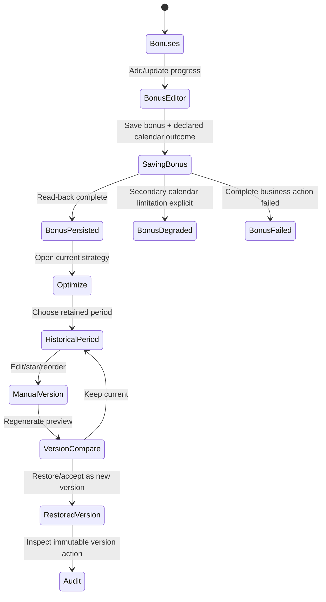
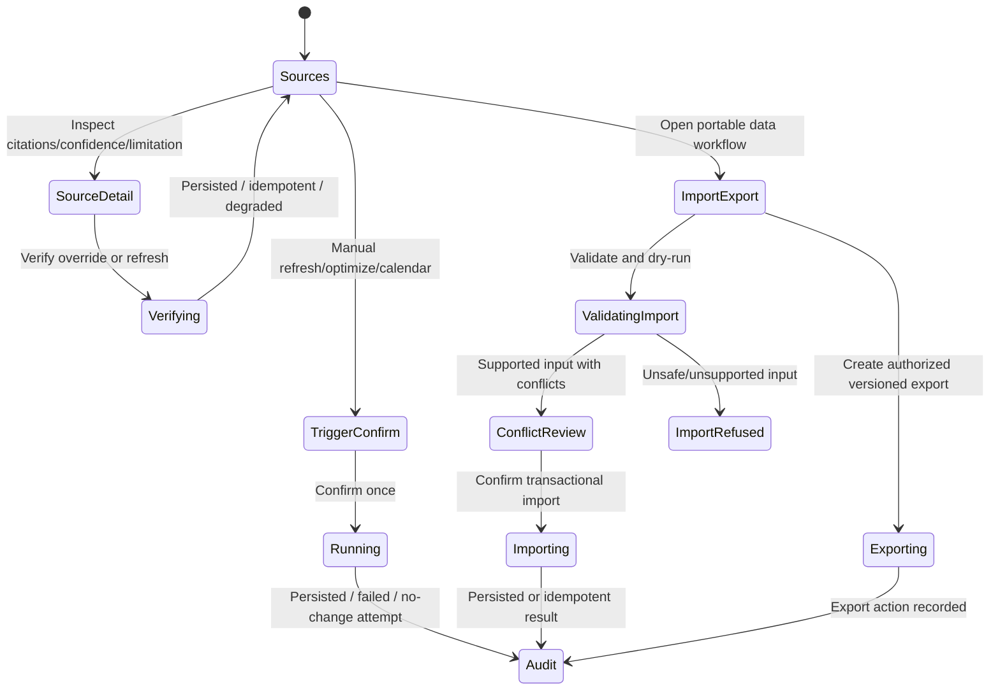
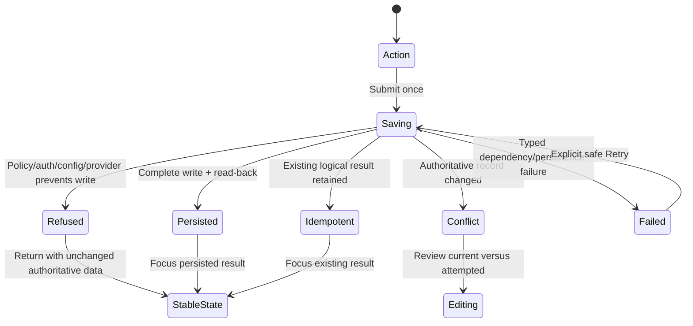

# Expected Behavior: [BUG-083-002] Card Rewards Parity-Or-Better Contract

## Problem Statement

Smackerel's Card Rewards surface cannot be considered complete merely because its core tables, optimizer, scheduler, and ten pages exist. It must provide every useful CCManager workflow at equal or better behavioral quality while preserving Smackerel's stronger product, security, data, provenance, and accessibility contracts.

## Outcome Contract

**Intent:** Deliver a single coherent Card Rewards capability with parity-or-better across 16 independently measurable areas.

**Success Signal:** Each parity row below has a persistent happy-path and adversarial real-stack test, round-trips authoritative PostgreSQL state where applicable, and preserves the named Smackerel advantage.

**Hard Constraints:** PostgreSQL remains authoritative; configuration is fail-loud SST; source/provenance/confidence/lifecycle remain first-class; no runtime file datastore, hidden fallback, fixture data, secret exposure, financial execution/advice, or weakened auth/CSP/CSRF behavior.

**Failure Condition:** A row is missing, only visually approximated, not round-tripped, inaccessible on mobile/assistive technology, or achieved by regressing a listed Smackerel advantage.

## Program Classification And Ownership

`BUG-083-002` retains its bug lineage because the recovery program discovered the parity drift through a defect review, but its delivery magnitude is a feature-sized parity program. It owns all Card Rewards domain delivery needed to close the 16 rows below: domain models, persistence, APIs, lifecycle, operations, imports/exports, errors, security, and per-row browser outcomes. The packet is not complete through a smaller easy subset.

`specs/106-coherent-product-experience` owns only composition of Cards inside the shared shell, navigation, theme, and product-wide state language. Spec 106 SHALL consume Card outcomes and deep links; it SHALL NOT absorb, duplicate, weaken, or become the owner of any of the 16 domain rows.

Cross-cutting concerns are vertical-slice entry criteria, not end-of-program cleanup:

- Every slice that reads or mutates Card data includes claim-bound authorization and cross-user denial.
- Every cookie-authenticated mutation slice includes the product-wide CSRF/Origin contract and a forged-request adversary before the slice can be accepted.
- Every slice exposes typed safe read/mutation errors and preserves prior authoritative state on failure.
- Every slice includes representative keyboard, screen-reader, narrow-viewport, zoom, and theme assertions appropriate to its controls and data; the final matrix broadens that proof but does not introduce it for the first time.

## Cross-Cutting Program Requirements

- **CARD-PROG-001:** All 16 parity rows SHALL remain required and independently accepted; route count, a shared shell, or a final aggregate test SHALL NOT substitute for any row.
- **CARD-PROG-002:** Each domain vertical slice SHALL include its own security, CSRF/Origin, typed-error, and representative accessibility acceptance before a dependent slice begins.
- **CARD-PROG-003:** Spec 106 SHALL compose the completed Card domain routes and outcomes but SHALL NOT produce Card domain evidence or own parity completion.
- **CARD-PROG-004:** The program SHALL retain its `BUG-083-002` identity for traceability while lifecycle metadata classifies delivery as feature-sized.

## Measurable 16-Area Parity Ledger

| # | Area | Read-Only Baseline | Required Parity-Or-Better Outcome | Adversarial Regression | Smackerel Advantage To Preserve |
|---|---|---|---|---|---|
| 1 | Wallet CRUD/metadata | CCManager add/discover/custom/edit note/activate/remove; Smackerel wallet CRUD exists | Full create/read/edit/activate/deactivate/delete, nickname/note/card type/fee/source metadata, cascade confirmation, authoritative reload | Ambiguous catalog match and custom card; delete with dependent rows; stale edit ID | PostgreSQL FKs/cascade, source enum, PASETO auth |
| 2 | Multi-category/shared-limit offers | CCManager stores `categories[]` plus `limit_shared`; Smackerel exposes one category plus shared-limit group | One offer can target multiple categories and one shared cap without duplicating business meaning; full lifecycle/date/activation edits | Two categories sharing one cap must not double-count; one category removal preserves pool | Optimizer explainability, typed shared-limit group, no defaults |
| 3 | Categories/selections lifecycle | CCManager add/remove categories, regular/tiered selections, lock/enrollment dates; Smackerel tier/period/enrolled model exists | Complete create/edit/delete/expire/re-enroll lifecycle for canonical, equivalent, starred, priority, tiered and non-tiered selections | Expired locked selection cannot remain active; deleting one tier cannot erase another | Canonical aliases, lifecycle state, pending re-enrollment |
| 4 | Bonuses/calendar | CCManager add/complete/remove bonus and full calendar updates; Smackerel create/progress plus CalDAV delivery exists | Complete bonus lifecycle, progress/met/deadline, calendar event create/update/delete and recovery | Progress crossing threshold is idempotent; removed bonus/event does not return on rerun | CalDAV stable UID, PostgreSQL, auditable events written |
| 5 | Editable historical optimization | CCManager edits/reorders/adds/removes/confirms prior/future month recommendations; Smackerel period query/upsert/star/regenerate exists | Browse and safely edit any retained period, preserve manual overrides, compare regenerated history, and restore authoritative prior version | Regeneration cannot overwrite starred/manual historical choice; invalid period refused | Source/reason fields, deterministic optimizer, lifecycle/retention |
| 6 | Source operations | CCManager scrape/update/verify/image operations; Smackerel connector/extraction/reconcile/manual verify is stronger | Operator can inspect source health, run refresh, review citations/confidence, verify override, and recover typed failures | One source changes shape or times out; remaining sources cannot fabricate full confidence | Multi-source reconciliation, LLM schema validation, source citations |
| 7 | Audit/history | CCManager run history tracks trigger/result/duration; Smackerel `card_runs` exists | Immutable searchable run/action history for user mutations, refresh, optimize, calendar, import/export, failures | Failed and no-op runs still record truthful outcome; no history rewrite | PostgreSQL audit, typed trigger/status/counts, privacy-safe telemetry |
| 8 | Safe config | CCManager supports config/environment but includes fail-soft/default examples; Smackerel SST is stronger | Every required runtime value explicit, provider/calendar/source capability truthful, missing config fails loud without secret output | Enabled required value empty; unsafe default/fixture attempt must fail | `config/smackerel.yaml` SST, no-defaults, generated env, source locking |
| 9 | Versioned import/export | CCManager JSON/GitHub files provide portable snapshots; Smackerel has one-time importer | Versioned schema-marked import/export with dry-run, validation, conflict report, idempotency, backward compatibility, and no secret fields | Unknown/newer version, duplicate replay, partial invalid record, downgrade attempt | PostgreSQL remains source of truth; provenance and transactional import |
| 10 | Pending selections | CCManager tracks `pending-selections.json`; Smackerel has pending re-enrollment | First-class pending selection/re-enrollment lifecycle with reason, due period, resolve/dismiss rules, and dashboard action | Expired/unresolved item persists across refresh; resolved item cannot reappear without new cause | Reconciliation/lifecycle evidence, no guilt counters |
| 11 | Reports | CCManager latest/full optimization report; Smackerel report page exists | Current and historical report with recommendation, alternatives, rate/source/reason/limits, freshness and export-safe view | No cards/no match/provider failure remain distinct; report cannot claim stale result current | Explainability, source/provenance/confidence, authorized reads |
| 12 | Schedules/manual triggers | CCManager cron + manual scrape/optimize/calendar; Smackerel scheduler/manual triggers exist | Schedule status, next/last run, manual trigger pending/outcome, dedupe/concurrency, and audit | Double click/concurrent scheduler cannot duplicate run/event; disabled trigger visibly unavailable | Internal scheduler, idempotent pipeline, run history |
| 13 | Coherent UX | CCManager is one app; Smackerel Card Rewards has polished but distinct sub-navigation | Card journeys compose with shared product shell/theme/state vocabulary and preserve efficient dense workflows | Deep link/session expiry/navigation mismatch cannot strand user in separate app | Spec 092 elevated UI, design tokens, preserved data hooks |
| 14 | Explicit errors | CCManager uses visible flash/errors; Smackerel handler failures are not proven consistently user-actionable | Every read/mutation shows pending/success/typed error/retry, no partial false success or blank page | DB/CalDAV/provider/schema/auth errors each render distinct safe action | Typed domain errors, observability, no raw stack/secret |
| 15 | Mobile/a11y/theme | CCManager claims touch/ARIA/dark; Smackerel spec 092 has stronger tested design | Complete parity across mobile, keyboard, screen reader, reduced motion, light/dark/system, long labels/errors/tables | 320px viewport, 200% zoom, keyboard-only mutation, forced colors/reduced motion | WCAG-focused hooks, progress semantics, responsive design tokens |
| 16 | Security | CCManager uses Basic Auth/CSRF; Smackerel PASETO/CSP/SST is stronger | Per-user authz, CSRF for mutations, strict CSP, safe external URLs, rate limits, audit, redaction, no sensitive export/storage | Cross-user ID, forged CSRF, unsafe URL, token/log/export leak all fail closed | PASETO, strict CSP, no defaults, PostgreSQL isolation, provenance |

## Existing Smackerel Advantages That Are Non-Regression Requirements

1. PostgreSQL tables, constraints, transactions, and cascade integrity.
2. Source-qualified observations with URL/name/evidence, confidence, disagreement, and manual verification.
3. Date-driven lifecycle and pending re-enrollment semantics.
4. Fail-loud config SST, no hidden providers/defaults, and source locking.
5. Deterministic optimizer explanations and shared-limit modeling.
6. CalDAV delivery with stable event identity and auditable event counts.
7. Strict CSP, per-user auth, and no client-side business-data source.
8. Real-stack E2E and accessible responsive design from specs 083/092.

## User Scenarios

```gherkin
Scenario: SCN-083-002-01 Wallet metadata round-trips and cascades safely
  Given an authenticated user adds a catalog or custom card with metadata
  When the card is edited, toggled, reloaded, and deleted with confirmation
  Then authoritative state round-trips and dependent records follow declared cascade policy

Scenario: SCN-083-002-02 Multi-category shared-limit offer is optimized once
  Given one offer covers two categories under one shared cap
  When both categories are optimized and the offer is edited
  Then the cap is represented once and recommendations explain the shared limit

Scenario: SCN-083-002-03 Selection lifecycle reaches pending and resolution
  Given tiered and non-tiered selections with periods and enrollment locks
  When a period expires and the user resolves re-enrollment
  Then pending state is truthful and the resolved item does not recur without a new cause

Scenario: SCN-083-002-04 Bonus and calendar lifecycle is idempotent
  Given a bonus has progress, deadline, and a calendar representation
  When progress crosses the threshold and calendar sync retries
  Then met state and event update once and removal cleans both safely

Scenario: SCN-083-002-05 Historical optimization remains editable and versioned
  Given a retained prior period has generated and manual recommendations
  When the user edits, reorders, regenerates, and restores it
  Then manual overrides survive and history/audit explain every version

Scenario: SCN-083-002-06 Source degradation preserves provenance truth
  Given one configured source changes shape or times out
  When refresh/reconcile completes
  Then remaining output is explicitly partial with citations/confidence and no fabricated agreement

Scenario: SCN-083-002-07 Audit records success failure and no-op
  Given manual and scheduled operations produce each outcome
  When history is viewed
  Then trigger, status, counts, timing, and safe error class are immutable and searchable

Scenario: SCN-083-002-08 Missing required config fails loud safely
  Given Card Rewards is required and a required value is empty
  When configuration is generated or runtime starts
  Then it refuses before serving without printing the secret

Scenario: SCN-083-002-09 Versioned import/export round-trips safely
  Given an authorized schema-versioned export without secrets
  When it is validated, dry-run, imported twice, and exported again
  Then state is equivalent, duplicate-free, and conflicts are explicit

Scenario: SCN-083-002-10 Pending selections are actionable not guilt-inducing
  Given a selection requires re-enrollment
  When the user opens the dashboard and resolves it
  Then reason/due period/action are clear and no unread backlog counter is introduced

Scenario: SCN-083-002-11 Report distinguishes no-data stale and failure
  Given current, historical, empty, stale, and failed optimization states
  When reports are opened
  Then each state is distinct and sourced recommendations remain explainable

Scenario: SCN-083-002-12 Schedule and manual triggers deduplicate
  Given a scheduled run overlaps a repeated manual trigger
  When both attempt the same logical operation
  Then one effective run/event occurs and both attempts are auditable

Scenario: SCN-083-002-13 Cards compose with one product shell
  Given a user enters Cards from shared navigation or a deep link
  When the user moves across all card workflows and back to another product surface
  Then session, navigation, theme, availability, and state vocabulary remain coherent

Scenario: SCN-083-002-14 Every failure is explicit and recoverable
  Given auth, database, provider, schema, or CalDAV failure
  When a read or mutation fails
  Then no success is announced and a typed safe error/retry/config action is visible

Scenario: SCN-083-002-15 Mobile and assistive journeys reach parity
  Given narrow viewport, keyboard, screen reader, 200 percent zoom, reduced motion, and each theme
  When the user completes wallet, offer, selection, bonus, report, and trigger journeys
  Then controls, tables, errors, focus, and status remain perceivable and operable

Scenario: SCN-083-002-16 Security adversaries fail closed
  Given cross-user IDs, forged CSRF, unsafe source URLs, and export/log leak probes
  When requests are attempted
  Then access is denied, state is unchanged, and sensitive values are absent
```

## Acceptance Criteria

1. All 16 ledger rows have bounded owner-planned scopes and persistent happy/adversarial tests; no subset or aggregate shell claim may close the program.
2. Every data mutation round-trips through authoritative PostgreSQL and explicit user feedback.
3. Existing Smackerel advantages remain tested non-regression requirements.
4. Auth, no-data, stale, partial, unavailable, and error outcomes stay distinct.
5. Card Rewards composes with spec 106 without becoming a separate app, while BUG-083-002 remains the sole domain-delivery and parity-evidence owner.
6. No runtime JSON datastore, fixture provider, default, secret leak, financial action, or internal mock is introduced.
7. Every vertical slice carries security, CSRF/Origin, typed-error, and representative accessibility proof; the final security/accessibility scopes are cumulative hardening, not first coverage.

## Dependencies

- Parent capability: `specs/083-card-rewards-companion`.
- UI foundation: `specs/092-card-rewards-ui-elevation`.
- Product composition: `specs/106-coherent-product-experience`.
- Product-wide login regression: `BUG-070-001-production-credential-session-paseto-split`.

## Release Train

- Target train: `mvp`.
- Flags introduced: none.
- Parity claims are per-journey and cannot be inferred from feature enablement or existing page count.

## UI Wireframes

### UX Requirements

| ID | Observable Contract |
|---|---|
| UX-083-002-01 | All Card Rewards routes compose inside Smackerel's shared Work / Cards shell, preserve the current product session/theme, and expose one active local destination. CCManager remains a read-only benchmark and is never linked, called, modified, or required at runtime. |
| UX-083-002-02 | The 16 parity areas remain independently visible and testable; no combined dashboard, route count, or generic success banner can stand in for a missing row. |
| UX-083-002-03 | Every write follows one closed feedback lifecycle: `editing`, `validating`, `saving`, `persisted`, `idempotent`, `conflict`, `refused`, or `failed`. A success state appears only after authoritative PostgreSQL read-back. |
| UX-083-002-04 | Every read distinguishes `loading`, `populated`, `true-empty`, `filtered-empty`, `stale`, `degraded`, `unavailable`, `unauthorized`, and `read-error`; database, source, provider, schema, or calendar failure never renders as normal empty content. |
| UX-083-002-05 | Destructive or cascading actions name the affected card/offer/selection/bonus and summarize dependent effects before confirmation. Cancel restores focus and changes nothing. |
| UX-083-002-06 | Source, confidence, disagreement, effective period, shared limit, lifecycle reason, and freshness remain adjacent to the decision or record they qualify rather than hidden in an admin-only page. |
| UX-083-002-07 | Pending selections and due bonuses are actionable rows ordered by consequence/date. The product introduces no global unread, missed, or backlog count and no guilt-inducing copy. |
| UX-083-002-08 | Desktop, mobile, keyboard, screen-reader, 200 percent zoom, reduced-motion, forced-colors, and light/dark/system theme modes expose equivalent data and commands. Drag, color, hover, and spatial position are never the sole interaction or meaning. |
| UX-083-002-09 | Auth, authorization, CSRF, unsafe URL, export validation, rate-limit, source, calendar, schema, and persistence failures use fixed safe copy and preserve prior authoritative state. Raw bodies, stack traces, credentials, card-sensitive values, and inaccessible user data never render. |
| UX-083-002-10 | Deep links to the current ten Card Rewards pages remain usable and activate the corresponding coherent local view; UX consolidation cannot strand bookmarks or remove an existing complete workflow. |

### Screen Inventory

| Screen | Actor(s) | Current / Compatible Route | Parity Rows | Status |
|---|---|---|---|---|
| Cards Today / pending inbox | Card Rewards user | `/cards` | 10, 11, 12, 13, 14, 15, 16 | Existing dashboard - Redesign under product shell |
| Wallet and card editor | Card Rewards user | `/cards/wallet` and existing wallet children | 1, 13, 14, 15, 16 | Existing - Augment metadata/lifecycle |
| Benefits - offers, selections, categories | Card Rewards user | `/cards/offers`, `/cards/selections`, `/cards/categories` | 2, 3, 10, 13, 14, 15, 16 | Existing - Consolidate local IA, retain deep links |
| Bonuses and calendar | Card Rewards user | `/cards/bonuses` | 4, 12, 13, 14, 15, 16 | Existing - Augment full lifecycle |
| Optimize - recommendations, rotating categories, report, versions | Card Rewards user | `/cards/recommendations`, `/cards/rotating`, `/cards/report` | 5, 11, 13, 14, 15, 16 | Existing - Augment history/version behavior |
| Sources, configuration, schedules, manual runs | Operator | `/cards/admin` | 6, 8, 12, 13, 14, 15, 16 | Existing admin - Augment |
| Import and export | Card Rewards user, operator | Cards command; canonical route design-owned | 9, 13, 14, 15, 16 | New workflow within Cards |
| Audit history | Card Rewards user, operator | Cards Audit view over existing run history; mapping design-owned | 7, 12, 13, 14, 15, 16 | Existing history - Augment |

### UI Primitives

| Primitive | Used By Screens | Composition Rule | Accessibility / Responsive Constraint |
|---|---|---|---|
| Cards local view switcher | All Card screens | `Today`, `Wallet`, `Benefits`, `Bonuses`, `Optimize`, `Sources`, `Audit`; existing deep links activate the matching local view rather than redirecting to an unrelated landing state. | Desktop uses compact links/tabs; mobile uses a named `Cards views` menu with every destination in source order. |
| Lifecycle row | Wallet, Benefits, Bonuses, pending inbox | Always includes entity name, state, effective period/deadline, reason, and available action. | Converts from table row to visible label/value record without omitting fields. |
| Authoritative mutation footer | Every editor, confirmation, import | Shows pending state beside the initiating command, disables duplicates, and presents success only after read-back. Failure retains safe fields and prior persisted state. | In normal flow or safe sticky position; live status is associated with form/dialog; first invalid field receives focus. |
| Provenance / explanation row | Benefits, Optimize, Sources, Reports | Source, observation time, confidence/limitation, shared limit, reason, and evidence link remain adjacent to the affected result. | Meaning remains complete without color, tooltip, or expanded inspector. |
| Version comparison | Optimize, import/export | Labels `Current`, `Proposed`, and `Restored from [version]`; regeneration/import creates a new auditable version and never silently overwrites manual choices. | Table becomes ordered changed-field list; additions/removals have text labels. |
| Pending action row | Cards Today, Selections, Bonuses, Sources | Explains why action is required now, effective period/deadline, and one primary resolution. No unread/backlog count. | Action label names entity; dismiss/resolve meaning is explicit to assistive technology. |
| Availability / operation band | Today, Sources, Optimize, Reports | Uses `Available`, `Needs setup`, `Degraded`, or `Unavailable` plus exact read/mutation state. | Text and icon/shape accompany color; one announcement per transition. |
| Safe evidence detail | Audit, Sources, report, import | Exposes IDs, counts, timestamps, trigger/outcome, source class, and safe error category; never secrets, raw external payloads, or sensitive card data. | Definition list order is fixed and selectable; copy feedback names only the safe field. |

### Shared Read, Error, And Mutation Vocabulary

| State Key | Visible Label | Required Behavior | Must Not Happen |
|---|---|---|---|
| `loading` | `Loading [records]` | Stable labeled structure; current request is announced. | Blank page, sample data, enabled duplicate action. |
| `populated` | Contextual count/state | Current authoritative records and evidence render. | Data from an earlier user or stale optimistic mutation. |
| `true-empty` | `No [records] yet` | Successful authorized read is named; creation action appears only when permitted. | Generic error, demo row, provider/source failure copy. |
| `filtered-empty` | `No [records] match these filters` | Active filters are named; Clear filters restores loaded records. | First-use onboarding or entire-capability empty claim. |
| `stale` | `Degraded - last verified [age] ago` | Prior verified data stays timestamped; freshness limitation and recovery are explicit. | `Current`, `Available` without qualifier, or silent refresh. |
| `degraded` | `Degraded` | Verified partial output and included/omitted sources are named. | Fabricated agreement, complete-coverage claim, hidden source failure. |
| `unavailable` | `Unavailable` | Safe cause class and permitted operator/user action are visible. | True-empty, no-match, or inert controls. |
| `unauthorized-session` | `Your session ended` | Personal Card Rewards content is removed; Sign in again uses a safe return. | Empty state, stale card names, token cause. |
| `unauthorized-scope` | `You do not have access to this Cards action` | Safe return only; no target-existence disclosure. | Login loop or cross-user details. |
| `read-error` | `[Records] could not be loaded` | Retry preserves filters/period; no current rows are inferred. | `No [records] yet`, raw database/source/calendar error. |
| `editing` | No success status | Safe draft is editable; prior persisted version remains identifiable. | Optimistic persisted label. |
| `validating` | `Checking changes` | Local and authoritative validation progress appears once. | Persistence or success implication. |
| `saving` | `Saving [entity]` | Duplicate submit disabled; affected row remains stable. | Row disappearance or success toast before commit/read-back. |
| `persisted` | `[Entity] saved` | Authoritative read-back fields/version are visible; focus reaches the result heading or stays at the footer according to context. | Partial multi-step success. |
| `idempotent` | `No duplicate change was created` | Existing authoritative identity/outcome is shown. | Second row/event/run or generic success without identity. |
| `conflict` | `This record changed before your save` | Current and attempted values are compared; user chooses Review or Cancel. | Automatic overwrite or lost safe input. |
| `refused` | `[Action] was not performed` | Policy/auth/provider/config reason and allowed next action appear; state is unchanged. | Success language or disabled button with no explanation. |
| `failed` | `[Action] could not be completed` | Typed safe cause, Retry where safe, and prior authoritative state remain. | Raw stack/secret, false success, partial state hidden. |

### Theme, Input, And Assistive Mode Contract

- Card screens consume the same System, Light, and Dark preference as the product shell. Moving between current server-rendered child routes must not flash or reset theme.
- Tables, lifecycle badges, provenance, errors, focus, charts/report values, shared-cap groups, and destructive confirmations meet the same semantic meaning in every theme. Color never distinguishes active/expired/met/failed/shared by itself.
- At 320px and 200 percent zoom, every required field, status, amount/rate, period, source, and action remains in the document flow without horizontal page scrolling. Dense tables become labeled records; they do not silently hide columns.
- Keyboard order follows product navigation, Cards view switcher, page controls, filters, records, and row/editor actions. Reordering has `Move up` and `Move down`; drag is supplementary only.
- Screen readers receive one page heading, named regions/tables, associated field errors, row-specific action names, semantic dates/currency, and concise mutation announcements. Dialogs restore focus to their invoker.
- Reduced motion removes shimmer, animated reordering, progress pulses, and decorative transitions while retaining textual pending and settled states. Forced-colors mode preserves borders, focus, selection, and status through system colors and text.

### Screen: Cards Today And Pending Inbox

**Actor:** Card Rewards User | **Route:** `/cards` | **Status:** Redesign composition

```text
┌────────────────────────────────────────────────────────────────────────────┐
│ Work / Cards   [Today | Wallet | Benefits | Bonuses | Optimize | Sources | Audit]│
│ Period [current v]                                      [Import / Export] │
├────────────────────────────────────────────────────────────────────────────┤
│ ACTIONS DUE                                                                │
│ [Selection] [card] [reason] [effective period]                  [Resolve] │
│ [Bonus]     [card] [progress / deadline]                        [Update]  │
│ [Source]    [name] [verification reason]                        [Review]  │
├────────────────────────────────────────────────────────────────────────────┤
│ CURRENT STRATEGY                                                           │
│ Category     Best card     Rate     Source     Shared limit      Why        │
│ [category]   [card]        [rate]   [source]   [group/amount]    [Open]     │
├────────────────────────────────────────────────────────────────────────────┤
│ REPORT [Current / Stale / Unavailable]  Period [date]       [Open report] │
│ SCHEDULE [state]  Next [time]  Last [outcome]                [View runs]   │
└────────────────────────────────────────────────────────────────────────────┘
```

**Interactions:** Resolve/Open routes to the owning editor and preserves period plus return-row identity. Completing or dismissing a pending selection shows saving then persisted/refused/failed feedback; the row disappears only after read-back proves the lifecycle change. Report and schedule links preserve period. No action count appears in global navigation.

**States:** No wallet, no due actions, current/stale/unavailable strategy, pending selection, source degraded, report true-empty/filtered-empty/stale/error, schedule available/degraded/unavailable, mutation states, and auth states use the shared vocabulary.

**Responsive / keyboard / screen reader:** Mobile shows the Cards views menu, period, actions due, strategy rows, report, then schedule. Each due action includes entity/type in its accessible name. Returning from an editor restores focus to the originating row or the Actions due heading if it no longer exists.

### Screen: Wallet And Card Editor

**Actor:** Card Rewards User | **Route:** `/cards/wallet` and existing wallet children | **Status:** Augment

```text
┌────────────────────────────────────────────────────────────────────────────┐
│ Work / Cards / Wallet                                        [Add card]  │
│ Search [........................]  State [Active v]  Source [All v]        │
├────────────────────────────────────────────────────────────────────────────┤
│ [Card name] [Catalog / Custom] [Active] [annual fee] [source] [Edit]     │
│ Nickname [value]  Note [summary]  Benefits [count]  Updated [time]        │
├────────────────────────────────────────────────────────────────────────────┤
│ EDIT CARD                                                                  │
│ Name [................]  Nickname [............]  Type [..............]  │
│ Annual fee [........]   Note [.........................................]  │
│ Source metadata [read-only provenance]                                    │
│ State [Active / Inactive]                         [Save] [Cancel] [Delete]│
│ [validation / mutation feedback]                                          │
└────────────────────────────────────────────────────────────────────────────┘
```

**Interactions:** Add begins with catalog discovery and makes `Create custom card` a separate explicit path when matching is ambiguous. Save validates and reads the card back before `Card saved`. Activate/deactivate uses the same mutation contract. Delete opens a cascade confirmation naming dependent offers, selections, bonuses, recommendations, and calendar effects according to the authoritative preview.

**States:** Discovery loading/no-match/ambiguous/result/error; wallet true-empty/filtered-empty/read-error; editor editing/validating/saving/persisted/conflict/refused/failed; delete preview/confirming/deleted/failed. A stale or cross-user ID produces not-found/access-denied, never a blank editor.

**Responsive / accessibility:** Desktop may keep list and editor tracks; mobile navigates list to full-page editor with Back preserving filters. Fields have persistent labels and linked errors. Delete confirmation names the card in heading and action; cancel restores focus to Delete.

### Screen: Benefits - Offers And Selections

**Actor:** Card Rewards User | **Route:** `/cards/offers`, `/cards/selections`, `/cards/categories` | **Status:** Consolidate local IA; retain deep links

```text
┌────────────────────────────────────────────────────────────────────────────┐
│ Work / Cards / Benefits        [Offers | Selections | Categories] [New]  │
│ Period [date v]  Card [All v]  State [Active v]              [Clear]     │
├────────────────────────────────────────────────────────────────────────────┤
│ OFFER                                                                      │
│ [card] [offer name] [Active] [start - end]                      [Edit]    │
│ Categories: [Dining] [Travel]   Shared cap: [Group name · amount]         │
│ Source [name/time]  Confidence [state]  Limitation [text]                  │
├────────────────────────────────────────────────────────────────────────────┤
│ SELECTION                                                                  │
│ [card] [tier/category] [Enrolled / Locked / Expired / Pending] [Resolve] │
│ Period [range]  Enrollment [range]  Reason [text]                          │
└────────────────────────────────────────────────────────────────────────────┘
```

**Interactions:** Offer editor uses category multi-select and one named shared-cap group. Removing a category previews the remaining shared pool; Save reads back one offer identity and one cap, not duplicate offers. Selection editor supports tiered/non-tiered lifecycle, explicit period/lock/enrollment dates, and resolve/dismiss semantics. Move Up/Down is available wherever priority/reordering is meaningful.

**States:** Populated/true-empty/filtered-empty/stale/degraded/read-error plus mutation states. Expired/locked/pending/re-enrolled are textual and mutually exclusive. A resolved pending item remains absent after reload until a newly evidenced cause creates another.

**Responsive / accessibility:** Multi-category values become a list, not color chips alone. Shared cap is read immediately after categories. On mobile each offer/selection is a labeled record with Edit/Resolve adjacent. Selection state changes announce the entity and new lifecycle state.

### Screen: Bonuses And Calendar

**Actor:** Card Rewards User | **Route:** `/cards/bonuses` | **Status:** Augment

```text
┌────────────────────────────────────────────────────────────────────────────┐
│ Work / Cards / Bonuses                                      [New bonus]  │
│ State [Active v]  Deadline [range]  Calendar [All v]          [Clear]     │
├────────────────────────────────────────────────────────────────────────────┤
│ [Card] [Bonus name] [Active / Met / Expired]                  [Edit]     │
│ Progress [amount of threshold]  Deadline [date]  Updated [time]           │
│ Calendar [Scheduled / Updated / Degraded / Removed] [View evidence]      │
│ [Update progress] [Complete] [Remove]                                    │
├────────────────────────────────────────────────────────────────────────────┤
│ [calendar mutation / retry / safe failure feedback]                       │
└────────────────────────────────────────────────────────────────────────────┘
```

**Interactions:** Progress update previews threshold crossing and persists bonus plus calendar outcome as one visible business action. Retry with the same logical event identity reports idempotent no-change rather than a duplicate event. Remove confirmation names bonus and calendar effects; success appears only after both declared lifecycle results read back.

**States:** Active/met/expired; calendar pending/scheduled/updated/degraded/removed/failed; conflict and partial business-action failure are explicit. Calendar failure never reports bonus operation fully successful when calendar is contractually required.

**Responsive / accessibility:** Progress is textual in addition to any meter. Dates are semantic and unambiguous. Mobile keeps progress, deadline, calendar state, evidence, then actions. Live feedback names the bonus without rereading the whole list.

### Screen: Optimize, Reports, And Version Comparison

**Actor:** Card Rewards User | **Route:** `/cards/recommendations`, `/cards/rotating`, `/cards/report` | **Status:** Augment

```text
┌────────────────────────────────────────────────────────────────────────────┐
│ Work / Cards / Optimize    Period [month v] [Recommendations | Report]   │
│ Result [Current / Stale / Degraded / Unavailable]        [Regenerate]    │
├────────────────────────────────────────────────────────────────────────────┤
│ Category       Recommendation  Rate   Shared limit  Source        Why      │
│ [category]     [card]          [rate] [group/value] [source/time] [Open]  │
│ Alternative [card/rate/reason]                               [Choose]     │
├────────────────────────────────────────────────────────────────────────────┤
│ VERSION COMPARE                                                            │
│ Current [version/time]   Proposed [version/time]   [Show changed fields]  │
│ Manual/starred choice [Preserved]                    [Restore version]     │
│ [validating / saving / persisted / conflict / failed feedback]            │
└────────────────────────────────────────────────────────────────────────────┘
```

**Interactions:** Period changes request retained current/historical state. Manual choose/star/reorder/edit creates a version and reads it back. Regenerate shows proposed versus current and never overwrites manual/starred history without explicit confirmation. Restore appends a new authoritative version that cites the source version. Export-safe report is a separate command and never includes secrets or inaccessible data.

**States:** Current, historical, true no-card/true no-match, filtered-empty, stale, degraded-source, provider/source unavailable, generation failed, version conflict, and auth states are distinct. `No cards` and healthy `No matching recommendation` differ from optimizer/source failure.

**Responsive / accessibility:** Version comparison becomes an ordered changed-field list. Reorder has Move Up/Down. Rates, source, reason, limits, freshness, and alternative remain visible at 320px. Report headings and tables preserve associations; stale/degraded states are text plus semantics in every theme.

### Screen: Sources, Configuration, Schedules, And Manual Runs

**Actor:** Operator | **Route:** `/cards/admin` | **Status:** Augment

```text
┌────────────────────────────────────────────────────────────────────────────┐
│ Work / Cards / Sources                                    [Available]     │
│ [Sources | Schedule | Runs | Configuration]                               │
├────────────────────────────────────────────────────────────────────────────┤
│ Source       State       Last success   Confidence   Limitation   Action  │
│ [source]     [Degraded]  [time / Never] [value]      [safe text]  [Open]  │
├────────────────────────────────────────────────────────────────────────────┤
│ Schedule [Enabled / Disabled / Unavailable]  Next [time]  Last [outcome] │
│ [Refresh sources] [Run optimize] [Sync calendar]                          │
│ [request identity · pending / idempotent / failed / persisted]            │
├────────────────────────────────────────────────────────────────────────────┤
│ Configuration prerequisites                                                │
│ [value-safe key/category] [Present / Missing / Invalid] [Owner guidance]  │
└────────────────────────────────────────────────────────────────────────────┘
```

**Interactions:** Refresh, optimize, and calendar sync open a confirmation naming scope and do not accept duplicate action while a matching logical run is active. Source verification shows citations, confidence, disagreement, and proposed override before persistence. Configuration displays presence/validity and owner guidance only, never values. Missing required configuration makes the capability Unavailable and removes inert triggers.

**States:** Checking, Available, Needs setup, Degraded, Unavailable; source current/stale/partial/failed; trigger confirming/requested/running/persisted/idempotent/failed; schedule enabled/disabled/unavailable. A scheduled/manual overlap produces one effective run while both attempts remain visible in Audit.

**Responsive / accessibility:** Source table becomes labeled records; trigger buttons remain next to explanatory scope. Confirmation focus is trapped/restored correctly. Run progress is polite; failure is one alert. Operator-only content is omitted for unauthorized users rather than disabled with revealing detail.

### Screen: Versioned Import And Export

**Actor:** Card Rewards User, Operator | **Route:** Cards Import / Export command; mapping design-owned | **Status:** New

```text
┌────────────────────────────────────────────────────────────────────────────┐
│ Work / Cards / Import & Export                                             │
├────────────────────────────────────────────────────────────────────────────┤
│ IMPORT                                                                      │
│ File [Choose supported export]  Detected schema [version / unreadable]     │
│ [Validate and preview]                                                      │
│ Added [n]  Changed [n]  Unchanged [n]  Conflicts [n]  Rejected [n]        │
│ [conflict rows with current / proposed / resolution]                       │
│ [Import changes]                                                           │
├────────────────────────────────────────────────────────────────────────────┤
│ EXPORT                                                                      │
│ Scope [Wallet / Benefits / Bonuses / History]  Version [current]           │
│ Sensitive fields [Excluded]                              [Create export]   │
│ [safe export identity / created time / Download]                            │
└────────────────────────────────────────────────────────────────────────────┘
```

**Interactions:** Choosing a file performs no write. Validate/dry-run reports schema, counts, conflicts, and forbidden fields. Unsupported/newer version, partial-invalid record, duplicate replay, and downgrade are explicit before commit. Import persists transactionally and reads back counts/version; duplicate replay reports idempotent. Export creates an authorized versioned artifact with an explicit sensitive-field exclusion statement.

**States:** No file, validating, valid preview, conflicts, unsupported version, invalid/unsafe, importing, imported, idempotent, failed, export pending/created/failed. Raw file content and secret-like fields never appear in diagnostics.

**Responsive / accessibility:** Preview table becomes changed-record summaries with visible current/proposed/resolution labels. File control, errors, conflicts, and Import action are keyboard reachable. Import confirmation names counts and conflict policy; status does not rely on download starting automatically.

### Screen: Audit History

**Actor:** Card Rewards User, Operator | **Route:** Cards Audit view; mapping design-owned | **Status:** Augment existing run history

```text
┌────────────────────────────────────────────────────────────────────────────┐
│ Work / Cards / Audit                                                       │
│ Time [range] Trigger [All v] Outcome [All v] Action [All v] [Clear]       │
├────────────────────────────────────────────────────────────────────────────┤
│ Observed       Action        Trigger       Outcome       Duration  Detail │
│ [time]         [optimize]     [manual]      [Persisted]   [time]    [Open] │
│ [time]         [calendar]     [schedule]    [No change]   [time]    [Open] │
│ [time]         [import]       [user]        [Failed]      [time]    [Open] │
├────────────────────────────────────────────────────────────────────────────┤
│ DETAIL: [safe run ID, actor class, counts, version, source classes,       │
│          lifecycle outcome, safe error category; no content or secrets]   │
└────────────────────────────────────────────────────────────────────────────┘
```

**Interactions:** Filters affect history only; filtered-empty names filters and Clear. Opening detail preserves row focus on return. Audit entries have no edit/delete command. Success, failure, refused, rolled-back, and idempotent/no-op attempts remain independently visible.

**Responsive / accessibility:** Rows become labeled audit records. Date/time, action, trigger, outcome, duration, and Open remain visible. Detail uses a definition list. Outcome text and icon/shape are theme-safe; immutable history is not communicated by a lock icon alone.

### Stable Playwright-Visible 16-Area Parity Contract

These are planned real-stack outcomes for downstream test ownership. They do not claim Card Rewards, CCManager, database, browser, source, calendar, import/export, security, or test execution. Every write row requires pending feedback, authoritative reload/read-back, and no internal request interception.

| Stable ID | Parity Row / Scenario | Real-Stack User Journey | Required Playwright-Visible Outcome | Adversarial / Exclusivity Assertion |
|---|---|---|---|---|
| UX-E2E-083-002-01 | 1 - SCN-083-002-01 | Add ambiguous catalog choice and custom card; edit metadata; deactivate/reactivate; delete with dependent records. | Discovery distinction, persisted card identity/metadata/state after reload, named cascade preview, and final authoritative absence are visible. | Stale/cross-user ID cannot edit; cancellation changes nothing; no success before read-back. |
| UX-E2E-083-002-02 | 2 - SCN-083-002-02 | Create one two-category offer under one shared cap; optimize both; remove one category. | One offer and one named shared-cap value appear in editor, list, report, and Why explanation after reload. | Cap is not counted twice; remaining category retains the same pool; duplicate offer row is absent. |
| UX-E2E-083-002-03 | 3 - SCN-083-002-03 | Create tiered and non-tiered selections; cross lock/expiry; resolve re-enrollment. | Period, tier, enrollment/lock, Pending reason/action, and resolved state are visible across reload. | Expired locked selection is not Active; deleting one tier leaves sibling tier; resolved item does not recur without new cause. |
| UX-E2E-083-002-04 | 4 - SCN-083-002-04 | Update bonus across threshold; retry calendar sync; remove bonus. | Met state, progress/deadline, one stable calendar outcome, idempotent feedback, and final removal read-back are visible. | No duplicate event/Met transition; required calendar failure does not produce full success; removed event does not return. |
| UX-E2E-083-002-05 | 5 - SCN-083-002-05 | Open prior period; manually choose/star/reorder; regenerate; compare; restore prior version. | Period, current/proposed versions, changed fields, preserved manual/starred choices, reasons, and restored version are visible after reload. | Invalid period is refused; regeneration cannot silently overwrite manual history; restore appends rather than erases versions. |
| UX-E2E-083-002-06 | 6 - SCN-083-002-06 | Refresh sources with one source timeout/shape failure; inspect and manually verify supported evidence. | Degraded state, participating/missing source classes, citations, confidence/disagreement, last success, and verification outcome are visible. | Full confidence/Available is absent; raw source body/secret is absent; remaining source cannot fabricate agreement. |
| UX-E2E-083-002-07 | 7 - SCN-083-002-07 | Filter and inspect manual/scheduled success, failure, refused, rolled-back, and no-op attempts. | Immutable rows expose trigger, action, outcome, time, duration, counts, safe error class, and detail. | No edit/delete exists; failed/no-op rows remain; filtered-empty differs from no history. |
| UX-E2E-083-002-08 | 8 - SCN-083-002-08 | Open product acceptance/capability projection for a validate stack whose required Card config is empty, and separately an optional-unconfigured stack. | Required case exposes Cards `Unavailable` with value-safe prerequisite/code; optional case exposes `Needs setup`; no trigger/action is operable. | No value, default, fixture, `Available`, or ready action appears. Browser projection supplements but does not replace fail-loud startup proof. |
| UX-E2E-083-002-09 | 9 - SCN-083-002-09 | Validate/dry-run supported export; resolve conflict; import twice; export again. | Version, preview counts, conflicts, sensitive-field exclusion, persisted import read-back, idempotent replay, and export identity/download are visible. | Newer/unknown/downgrade/partial-invalid inputs cannot write; no secret/raw invalid record appears; PostgreSQL remains authoritative. |
| UX-E2E-083-002-10 | 10 - SCN-083-002-10 | Open pending re-enrollment; inspect reason/due period; resolve or dismiss; reload. | One actionable row, lifecycle explanation, mutation feedback, and authoritative disappearance/resolution are visible. | No global unread/backlog count or guilt copy; unresolved item survives refresh; resolved item stays absent until new cause. |
| UX-E2E-083-002-11 | 11 - SCN-083-002-11 | Open current and historical reports under populated, no-cards, healthy-no-match, stale, degraded, and failed fixtures. | Recommendation/alternatives/rate/source/reason/limits/freshness or the exact exclusive state appears. | No-cards, no-match, stale, provider/source failure, filtered-empty, and auth are never conflated; stale is not Current. |
| UX-E2E-083-002-12 | 12 - SCN-083-002-12 | Trigger manual refresh while matching scheduled run overlaps; repeat activation. | One logical run identity progresses through requested/running/persisted or idempotent; next/last run and both audit attempts are visible. | No duplicate run/calendar event; disabled/unconfigured trigger is visibly unavailable; double click cannot create a second active action. |
| UX-E2E-083-002-13 | 13 - SCN-083-002-13 | Enter Cards through shared nav and each existing deep link; move across local views; return to Assistant/Search. | Shared shell, active Work/Cards context, session, theme, availability vocabulary, breadcrumbs, and safe return remain coherent. | No separate-app chrome, second login, orphan deep link, or divergent theme; CCManager is never contacted. |
| UX-E2E-083-002-14 | 14 - SCN-083-002-14 | Exercise real DB, source, calendar, schema, auth, and conflict failures on their owned boundaries. | Each read/write shows pending then typed safe error/refusal, retains prior authoritative state/safe input, and exposes only the permitted recovery. | No blank page, flash-only message, raw error/secret, false success, or failure rendered as empty. |
| UX-E2E-083-002-15 | 15 - SCN-083-002-15 | Complete representative wallet, offer, selection, bonus, report, source trigger, and import journeys at desktop, 390px, 320px/200% zoom, keyboard-only, screen reader, reduced motion, forced colors, and each theme. | Same fields/actions/outcomes are visible and operable; focus/status order, 44px coarse-pointer targets, reflow, theme continuity, and announcements are stable. | No hidden required column/action, horizontal page overflow, drag-only reorder, hover/color-only meaning, focus loss, or theme flash. |
| UX-E2E-083-002-16 | 16 - SCN-083-002-16 | Attempt cross-user identifiers, forged CSRF, unsafe source URL, repeated rate-limit action, sensitive export/storage/log probes. | Safe access/refusal state appears; prior state remains; authorized shell contains no inaccessible record detail. | No mutation, unsafe navigation, PAN/CVV/token/secret/raw payload in DOM, URL, storage, console-visible diagnostics, export, or evidence. |

The corresponding coherent-product rows remain `UX-E2E-106-053` through `UX-E2E-106-068`, but those aggregate scenarios consume rather than replace the stable per-row contracts above.

### Routed Design Questions

| Owner | Question | UX Constraint That Must Survive Resolution |
|---|---|---|
| `bubbles.design` | How do the current ten routes map to the seven coherent local views without duplicating state, breaking deep links, or creating a second Card Rewards shell? | Every existing complete route remains compatible and exposes the same active parent/local destination and mutation vocabulary. |
| `bubbles.design` | What domain/version contracts extend offers, selections, bonuses, historical optimization, imports, and run history while keeping PostgreSQL authoritative? | The visible round-trip, version, conflict, provenance, and idempotency semantics above remain stable. |
| `bubbles.design` | Which multi-step writes require one atomic transaction versus a persisted primary result plus explicit degraded secondary result, especially bonus/calendar and source refresh? | UX never announces overall success before the declared complete business outcome; partial/degraded is explicit. |
| `bubbles.design` | What value-safe capability projection can show fail-loud configuration refusal on a running acceptance/status surface without weakening startup validation? | Row 8 remains browser-visible and value-safe, but UI evidence cannot substitute for the startup/config gate. |
| `bubbles.plan` | How are the 16 stable UX rows split into bounded scopes while retaining one per-row real-stack happy/adversarial test and a final coherent loop? | No row disappears into a catch-all scope or aggregate page-count assertion. |
| `bubbles.plan` | Which existing Card Rewards tests can be extended and which stable test files must be added for import/export, audit, configuration projection, and assistive/theme matrices? | Planned paths must match the repo's current Card Rewards test organization and use real internal code paths. |

## User Flows

### User Flow: Manage Wallet And Benefits With Authoritative Feedback

```mermaid
stateDiagram-v2
  [*] --> CardsToday
  CardsToday --> Wallet: Open wallet
  Wallet --> Discovery: Add card
  Discovery --> WalletEditor: Choose catalog or custom
  WalletEditor --> SavingCard: Save once
  SavingCard --> Wallet: Persisted read-back
  SavingCard --> CardConflict: Stale version
  SavingCard --> CardFailure: Typed failure
  Wallet --> Benefits: Open Benefits
  Benefits --> OfferEditor: Create/edit shared-cap offer
  OfferEditor --> SavingOffer: Save once
  SavingOffer --> Benefits: One offer/cap reads back
  Benefits --> SelectionEditor: Create/resolve lifecycle
  SelectionEditor --> SavingSelection: Save once
  SavingSelection --> CardsToday: Pending state resolved; return row
```



### User Flow: Complete Bonus And Historical Optimization Lifecycles



### User Flow: Operate Sources, Schedules, Import, And Audit



### User Flow: Recover Without False Success


