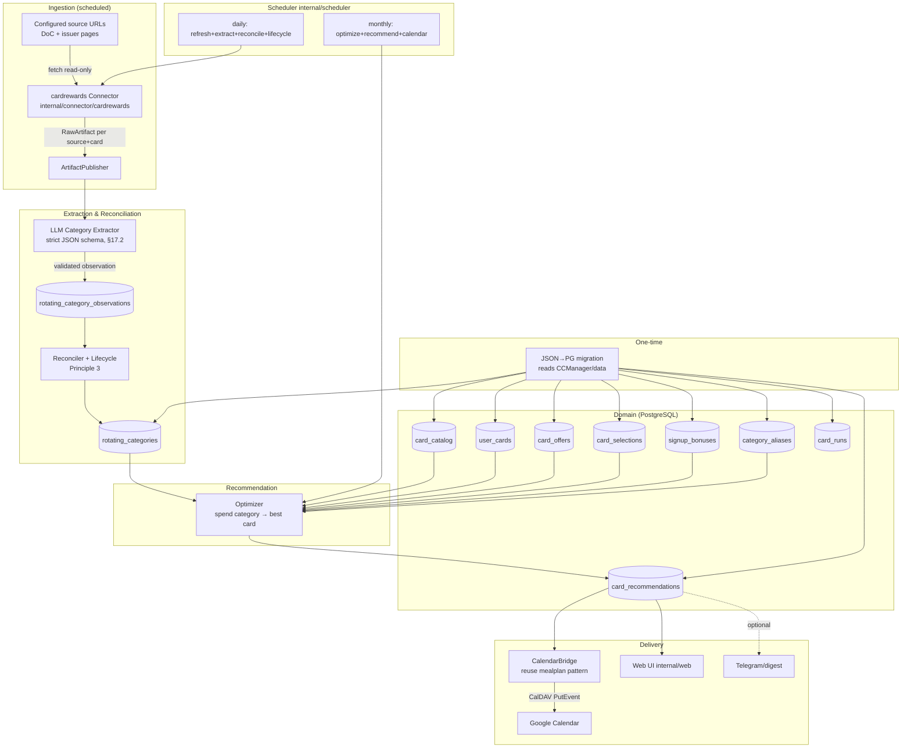

# Design: 083 Card Rewards Companion

Links: [spec.md](spec.md) | [scopes.md](scopes.md) | [uservalidation.md](uservalidation.md)

> **Planning-only.** This design is authored to the `specs_hardened` ceiling.
> Every reused smackerel primitive below is cited by real, verified path.
> File paths under `internal/cardrewards/` and migration `057_card_rewards.sql`
> are PROPOSED (do not yet exist) and are created during delivery.

## Current Truth (verified 2026-06-11)

Smackerel already owns every primitive this feature needs. Verified during
planning:

| Primitive | Verified path | What it gives us |
|-----------|---------------|------------------|
| Connector interface | [`internal/connector/connector.go`](../../internal/connector/connector.go) | `Connector{ ID; Connect(ctx,cfg); Sync(ctx,cursor)→([]RawArtifact,string,error); Health; Close }`, `ConnectorConfig{ SyncSchedule cron; SourceConfig map }`, `RawArtifact{ SourceID,SourceRef,ContentType,Title,RawContent,URL,Metadata,CapturedAt }`, `ArtifactPublisher.PublishRawArtifact`. |
| Existing connectors | `internal/connector/{rss,markets,weather,caldav,qfdecisions,imap,keep,youtube,twitter,maps,photos,bookmarks,discord}` | Pattern to copy for a new `cardrewards` connector. |
| LLM gateway | `config/smackerel.yaml` `llm:` (lines ~80–89; `provider`, `model`, `ollama_url`, `ollama_model`, …) | Local Ollama extraction. On home-lab, point at home-lab host Ollama (`knb/docs/HomeLabServices.md`). |
| Strict-schema LLM contract | [`docs/smackerel.md`](../../docs/smackerel.md) §17.2 | "Strict output schemas for all LLM calls; JSON validation before storage; malformed responses logged and discarded." |
| Scheduler | [`internal/scheduler/`](../../internal/scheduler/) (`jobs.go`, `registration.go`, `scheduler.go`, `lifecycle.go`, `state.go`) | Register the daily-refresh and monthly-recommend cron jobs + manual triggers. |
| CalDAV delivery pattern | [`internal/mealplan/calendar.go`](../../internal/mealplan/calendar.go) | `CalendarBridge` + `CalDAVClient{ PutEvent(...); DeleteEvent(uid) }`, stable UID scheme (`smackerel-meal-<id>`), `X-SMACKEREL-*` extra props. |
| CalDAV connector | `internal/connector/caldav/` | Google Calendar speaks CalDAV; reuse its client/credentials. |
| Storage | PostgreSQL + pgvector; migrations in [`internal/db/migrations/`](../../internal/db/migrations/) (latest `056_twitter_oauth_pkce.sql`). | New migration is `057_card_rewards.sql`. |
| Web UI | [`internal/web/handler.go`](../../internal/web/handler.go) + `templates.go` (chi router, `html/template`, embedded `allTemplates`), `internal/web/admin/` | Server-rendered CRUD pages + admin triggers. |
| Delivery surfaces (bonus) | `internal/telegram`, `internal/whatsapp`, `internal/connector/discord`, `internal/notification` (ntfy) | Optional secondary delivery for recommendations/reminders. |
| Config SST | `config/smackerel.yaml` (`connectors:` ~line 348, `meal_planning:` ~line 630, `recommendations:` ~line 643) + `scripts/commands/config.sh` generator | Model a new `card_rewards:` section + `connectors.card-rewards`. |
| Per-user auth / CSP | spec 044 (PASETO bearer), spec 070 (web login) | Web UI sits behind existing `bearerAuthMiddleware`. |
| Deterministic fetch/clean | [`internal/extract/extract.go`](../../internal/extract/extract.go) (`go-shiori/go-readability` + `net/http`) | HTML→text BEFORE the LLM; reused by the connector — no new HTML parser. |
| ML-sidecar model-gateway contract | [`internal/agent/embedder/sidecar/sidecar.go`](../../internal/agent/embedder/sidecar/sidecar.go) (`POST /embed`, Bearer, timeout); [`internal/digest/generator.go`](../../internal/digest/generator.go); `ml/app/drive_classify.py`, `ml/app/intelligence.py` | The Ollama call lives in the Python sidecar (Constitution C2). New route `ml/app/card_categories.py`; Go orchestrates over the same HTTP contract. |
| Strict-schema validation | `github.com/santhosh-tekuri/jsonschema/v6` (existing `go.mod` dep) | Go-side JSON-schema validation of the sidecar response (§17.2 / NFR-CR-003); no new validation lib. |
| Flexible date parsing | `github.com/araddon/dateparse` (existing `go.mod` dep) | Parse period/announcement dates in extraction + migration; no new date lib. |

CCManager source (to absorb), verified:

| CCManager artifact | Path | Becomes |
|--------------------|------|---------|
| Master card DB (~21 cards) | `CCManager/data/cards-database.json` | `card_catalog` table |
| Held cards | `CCManager/data/user-cards.json` | `user_cards` table |
| Promos/offers | `CCManager/data/user-offers.json` | `card_offers` table |
| Category selections | `CCManager/data/user-selections.json`, `pending-selections.json` | `card_selections` table |
| Rotating categories | `CCManager/data/rotating-categories.json` | `rotating_categories` (+ observations) |
| Categories config | `CCManager/data/config.json` (`categories.{starred,priority,built_in,equivalents}`) | `category_aliases` table |
| Monthly recs + report | `CCManager/data/monthly-recommendations/`, `latest-report.json` | `card_recommendations` table |
| Run history + usage | `CCManager/data/run-history.json`, `usage-stats.json` | `card_runs` table |
| Regex scraper (replaced) | `CCManager/scripts/scraper.py` | `internal/cardrewards/extract` (LLM) |
| Card resolver | `CCManager/scripts/card_resolver.py` | `internal/cardrewards/resolve` |
| Optimizer | `CCManager/scripts/optimizer.py` | `internal/cardrewards/optimize` |
| Calendar sync | `CCManager/scripts/calendar_sync.py` | `internal/cardrewards/calendar` (CalDAV bridge) |
| Flask UI (~22 templates) | `CCManager/web/` | `internal/web` Go-template pages |

---

## 0. Technology Consistency (cross-cutting — NFR-CR-008)

This feature is an **absorption that ADVANCES cross-project tech consistency**:
it retires a Python/Flask/regex outlier and re-expresses it on smackerel's
shared stack. The binding rule: **introduce NO new runtime dependency,
language, or framework** — reuse what smackerel (and the other Go-stack
product, GuestHost) already use.

| Concern | Mandated tech (already in repo) | Forbidden deviation |
|---------|----------------------------------|---------------------|
| Language | Go (Constitution C2) | A second runtime; porting Python line-by-line |
| Model gateway / LLM call | Python ML sidecar `ml/app/` (C2 "model gateway work") | A direct Go→Ollama HTTP client in `internal/cardrewards` |
| DB / access | PostgreSQL + `jackc/pgx` | SQLite/embedded/file store; an ORM |
| HTTP fetch + HTML→text | `net/http` + `go-shiori/go-readability` via `internal/extract` | A new scraper / HTML-parser dependency |
| Strict-schema validation | `santhosh-tekuri/jsonschema/v6` | A new JSON-schema / validation lib |
| Scheduler | `robfig/cron` via `internal/scheduler` | A bespoke ticker / cron |
| Web UI | `go-chi/chi` + `html/template` (`internal/web`) | A JS SPA framework / new templating engine |
| Calendar delivery | `internal/mealplan` CalDAV bridge pattern | A new Google Calendar SDK / REST client |
| Config | `config/smackerel.yaml` SST, fail-loud (Gate G028) | In-source defaults; a parallel config file |

Cross-project note: smackerel and GuestHost are the Go-stack products
(Go + chi + PostgreSQL); QuantitativeFinance and WanderAide are Rust-stack;
Python appears ONLY as an ML sidecar. Folding CCManager into smackerel removes
the lone Python/Flask web app from the portfolio — consistency is the win, not
the cost. Any proposed deviation MUST be recorded with an owner-approved
rationale (NFR-CR-008).

---

## 1. Architecture Overview



**Data flow for the modernized refresh (replaces regex):**
`scheduler daily job → cardrewards connector fetches sources → emits
source-attributed RawArtifacts → LLM extractor (strict schema, validated) →
rotating_category_observations (per source, with confidence + evidence) →
reconciler merges per (card, period) → rotating_categories (lifecycle +
aggregate confidence + needs_verification) → optimizer → card_recommendations →
CalendarBridge → Google Calendar + Web UI.` Every step writes a `card_runs`
audit row.

**Package layout (proposed, created at delivery):**
```
internal/connector/cardrewards/   # source connector: fetch + readability HTML→text (reuse internal/extract); RawArtifact emitter — NO regex, NO LLM
internal/cardrewards/
  types.go        # domain types (Card, UserCard, Offer, Selection, Bonus, RotatingCategory, Recommendation, Run)
  store.go        # PostgreSQL store (pgx) — CRUD for all tables
  resolve.go      # card name → catalog resolution (replaces card_resolver.py)
  extract.go      # ORCHESTRATES the ML-sidecar extraction call + strict-schema validation (santhosh-tekuri/jsonschema) + persistence. NO direct Go→Ollama client — the Python sidecar owns the model call (Constitution C2). Replaces scraper.py.
  reconcile.go    # multi-source merge + lifecycle (Principle 3)
  optimize.go     # spend category → best card (replaces optimizer.py)
  recommend.go    # monthly recommendation generation
  calendar.go     # CalendarBridge over CalDAVClient (reuse mealplan pattern)
  service.go      # service wiring used by web + scheduler + api
ml/app/card_categories.py              # NEW ML-sidecar route: owns the Ollama model-gateway call + strict JSON schema (sibling of drive_classify.py / intelligence.py); POST /extract-card-categories, Bearer auth
internal/web/cardrewards.go            # web pages (handlers + chi routes)
internal/web/cardrewards_templates.go  # embedded html/template strings
internal/scheduler/cardrewards.go      # job registration + manual triggers
internal/db/migrations/057_card_rewards.sql
cmd/cardrewards-import/ OR ./smackerel.sh subcommand   # one-time JSON→PG migration
```

---

## 2. Data Model (PostgreSQL — migration 057_card_rewards.sql)

All tables use `uuid` PKs (except `card_catalog`, which keeps a stable text id
like `discover-it` to match CCManager and enable idempotent reseed). Monetary
amounts are stored as integer cents. `jsonb` is used for nested benefit
structures that mirror CCManager's shapes. Timestamps are `timestamptz`.

### 2.1 `card_catalog` — master card database

| Column | Type | Notes |
|--------|------|-------|
| `id` | text PK | e.g. `discover-it` (stable; matches CCManager id) |
| `name` | text NOT NULL | display name |
| `issuer` | text NOT NULL | Discover, Chase, Citi, … |
| `card_type` | text NOT NULL | CHECK in (`rotating`,`fixed`,`user-selected`) |
| `annual_fee_cents` | int NOT NULL DEFAULT 0 | |
| `requires` | text NULL | e.g. "Amazon Prime membership" |
| `base_benefits` | jsonb NOT NULL | `[{category,rate,rate_type,limit_cents,notes}]` |
| `rotating_benefits` | jsonb NULL | `{type,activation_required,limit_cents,limit_period,activation_url}` |
| `selectable_benefits` | jsonb NULL | `{num_categories,rate,rate_type,limit_cents,limit_period,auto_selects,options[]}` |
| `perks` | jsonb NOT NULL DEFAULT '[]' | text[] of perks |
| `aliases` | text[] NOT NULL DEFAULT '{}' | for resolution |
| `source` | text NOT NULL | CHECK in (`seed`,`discovery`,`manual`) |
| `created_at`/`updated_at` | timestamptz NOT NULL | |

### 2.2 `user_cards` — the wallet

| Column | Type | Notes |
|--------|------|-------|
| `id` | uuid PK | |
| `card_catalog_id` | text NOT NULL REFERENCES card_catalog(id) | |
| `nickname` | text NULL | |
| `note` | text NULL | per-card note |
| `active` | bool NOT NULL DEFAULT true | toggle-activation |
| `added_at` | timestamptz NOT NULL | |
| `created_at`/`updated_at` | timestamptz NOT NULL | |
| | UNIQUE (`card_catalog_id`, `nickname`) | one wallet entry per card/nickname |

### 2.3 `card_offers` — promos

| Column | Type | Notes |
|--------|------|-------|
| `id` | uuid PK | |
| `user_card_id` | uuid NULL REFERENCES user_cards(id) ON DELETE CASCADE | NULL = general offer |
| `title` | text NOT NULL | |
| `category` | text NOT NULL | |
| `rate` | numeric NOT NULL | |
| `rate_type` | text NOT NULL | CHECK in (`percent`,`points`,`multiplier`) |
| `limit_cents` | int NULL | |
| `limit_period` | text NULL | month/quarter/year/promo |
| `shared_limit_group` | text NULL | combined/shared spending limit pool key |
| `starts_on`/`ends_on` | date NULL | date window |
| `activation_required` | bool NOT NULL DEFAULT false | |
| `activated` | bool NOT NULL DEFAULT false | |
| `notes` | text NULL | |
| `created_at`/`updated_at` | timestamptz NOT NULL | |

### 2.4 `card_selections` — selectable-category choices

| Column | Type | Notes |
|--------|------|-------|
| `id` | uuid PK | |
| `user_card_id` | uuid NOT NULL REFERENCES user_cards(id) ON DELETE CASCADE | |
| `category` | text NOT NULL | |
| `tier` | int NULL | for tiered cards (US Bank Cash+) |
| `period_label` | text NOT NULL | e.g. `Q3 2026` or `month` |
| `enrolled` | bool NOT NULL DEFAULT false | |
| `enrolled_at` | timestamptz NULL | |
| `effective_start`/`effective_end` | date NULL | re-enrollment window |
| `created_at`/`updated_at` | timestamptz NOT NULL | |
| | UNIQUE (`user_card_id`, `period_label`, `tier`, `category`) | |

### 2.5 `signup_bonuses`

| Column | Type | Notes |
|--------|------|-------|
| `id` | uuid PK | |
| `user_card_id` | uuid NOT NULL REFERENCES user_cards(id) ON DELETE CASCADE | |
| `bonus_type` | text NOT NULL | CHECK in (`spend`,`first_year_rate`) |
| `description` | text NOT NULL | |
| `spend_required_cents` | int NULL | for spend bonuses |
| `spend_progress_cents` | int NOT NULL DEFAULT 0 | manually entered (no card feed) |
| `reward_description` | text NULL | |
| `deadline` | date NULL | |
| `met` | bool NOT NULL DEFAULT false | |
| `created_at`/`updated_at` | timestamptz NOT NULL | |

### 2.6 `rotating_category_observations` — per-source raw extractions

| Column | Type | Notes |
|--------|------|-------|
| `id` | uuid PK | |
| `card_catalog_id` | text NOT NULL REFERENCES card_catalog(id) | |
| `period_label` | text NOT NULL | e.g. `Q3_2026` |
| `period_start`/`period_end` | date NULL | |
| `categories` | text[] NOT NULL | |
| `limit_cents` | int NULL | |
| `activation_required` | bool NULL | |
| `confidence` | numeric NOT NULL | 0–1 from extractor |
| `source_name` | text NOT NULL | e.g. "Doctor of Credit" |
| `source_url` | text NOT NULL | provenance (Principle 4) |
| `source_evidence` | text NULL | verbatim snippet |
| `extraction_run_id` | uuid NOT NULL REFERENCES card_runs(id) | |
| `observed_at` | timestamptz NOT NULL | |
| | INDEX (`card_catalog_id`,`period_label`) | |

### 2.7 `rotating_categories` — reconciled, lifecycle-aware record

| Column | Type | Notes |
|--------|------|-------|
| `id` | uuid PK | |
| `card_catalog_id` | text NOT NULL REFERENCES card_catalog(id) | |
| `period_label` | text NOT NULL | |
| `period_start`/`period_end` | date NULL | |
| `categories` | text[] NOT NULL | reconciled |
| `limit_cents` | int NULL | |
| `activation_required` | bool NOT NULL DEFAULT false | |
| `lifecycle_state` | text NOT NULL | CHECK in (`upcoming`,`active`,`expired`) (Principle 3) |
| `confidence` | numeric NOT NULL | aggregate |
| `needs_verification` | bool NOT NULL DEFAULT false | low-confidence / conflict / extraction failure |
| `manual_override` | bool NOT NULL DEFAULT false | extraction never overwrites if true |
| `source_count` | int NOT NULL DEFAULT 0 | how many sources agreed |
| `created_at`/`updated_at` | timestamptz NOT NULL | |
| | UNIQUE (`card_catalog_id`, `period_label`) | one record per quarter per card |

### 2.8 `category_aliases` — category names + equivalents

| Column | Type | Notes |
|--------|------|-------|
| `id` | uuid PK | |
| `canonical_category` | text NOT NULL UNIQUE | |
| `equivalents` | text[] NOT NULL DEFAULT '{}' | from CCManager `config.json` equivalents |
| `starred` | bool NOT NULL DEFAULT false | |
| `priority` | int NULL | ordering |
| `built_in` | bool NOT NULL DEFAULT false | |
| `created_at`/`updated_at` | timestamptz NOT NULL | |

### 2.9 `card_recommendations` — monthly recommendations

| Column | Type | Notes |
|--------|------|-------|
| `id` | uuid PK | |
| `period_label` | text NOT NULL | e.g. `2026-06` |
| `category` | text NOT NULL | |
| `recommended_user_card_id` | uuid NULL REFERENCES user_cards(id) ON DELETE SET NULL | |
| `rate` | numeric NOT NULL | |
| `reason` | text NOT NULL | explainability (Principle 8) |
| `starred` | bool NOT NULL DEFAULT false | star/unstar |
| `starred_override` | bool NOT NULL DEFAULT false | manual override beats optimizer |
| `calendar_event_uid` | text NULL | stable CalDAV UID |
| `generated_at` | timestamptz NOT NULL | |
| `created_at`/`updated_at` | timestamptz NOT NULL | |
| | UNIQUE (`period_label`, `category`) | |

### 2.10 `card_runs` — run history / audit (Principle 8)

| Column | Type | Notes |
|--------|------|-------|
| `id` | uuid PK | |
| `run_type` | text NOT NULL | CHECK in (`scrape`,`extract`,`reconcile`,`optimize`,`calendar_sync`,`migration`,`discovery`) |
| `trigger` | text NOT NULL | CHECK in (`scheduled`,`manual`) |
| `status` | text NOT NULL | CHECK in (`success`,`partial`,`failed`) |
| `sources_attempted` | int NOT NULL DEFAULT 0 | |
| `sources_succeeded` | int NOT NULL DEFAULT 0 | |
| `categories_extracted` | int NOT NULL DEFAULT 0 | |
| `events_written` | int NOT NULL DEFAULT 0 | |
| `error_detail` | text NULL | |
| `started_at`/`finished_at` | timestamptz | |
| `created_at` | timestamptz NOT NULL | |
| | INDEX (`run_type`,`started_at`) | |

**Indexes (summary):** `idx_user_cards_active`, `idx_offers_user_card`,
`idx_selections_user_card`, `idx_bonuses_user_card`,
`idx_rotating_card_period` (UNIQUE), `idx_observations_card_period`,
`idx_recommendations_period`, `idx_runs_type_time`.

**One-graph note (Principle 5):** raw source pages are also emitted as
smackerel artifacts via the connector → `ArtifactPublisher`, so they live in
the same knowledge graph (searchable, source-attributed). The relational tables
above are projections of that processed knowledge, exactly as `meal_plans` and
`expense_*` are. There is no second store.

---

## 3. Card-Rewards Source Connector

`internal/connector/cardrewards/` implements the `connector.Connector`
interface verbatim:

- `ID()` → `"card-rewards"`.
- `Connect(ctx, cfg)` → reads `cfg.SourceConfig` (source list, issuer hints,
  fetch timeout) and `cfg.SyncSchedule` (daily cron).
- `Sync(ctx, cursor)` → fetches each configured source URL (read-only HTTP GET
  with timeout), and for each (source, card-hint) emits one `RawArtifact`:
  - `SourceID = "card-rewards"`, `SourceRef = "<source_name>:<card_hint>:<fetch_ts>"`,
  - `ContentType = "text/html"` or extracted text, `URL = source_url`,
  - `RawContent` = the relevant page text,
  - `Metadata = {source_name, issuer_hint, card_hint, fetched_at}` (Principle 4
    provenance preserved on the artifact).
  - cursor = last successful fetch timestamp.
- `Health(ctx)` → uses `connector.HealthFromErrorCount` thresholds like other
  connectors.
- `Close()` → no-op / closes HTTP client.

The connector does **not** parse categories itself (no regex). It only fetches
and emits source-attributed raw observations. Parsing is the LLM extractor's
job (§4). This is the clean separation that replaces `scraper.py`.

Registration follows the existing connector registry
(`internal/connector/registry.go`) and config under `connectors.card-rewards`.

---

## 4. LLM Category Extraction (replaces regex — §17.2 strict schema)

**Architecture boundary (Constitution C2 — the model gateway is Python-sidecar-owned).**
The actual Ollama call lives in a NEW Python ML-sidecar route,
`ml/app/card_categories.py` (sibling of `ml/app/drive_classify.py`,
`ml/app/intelligence.py`, `ml/app/synthesis.py`), because C2 reserves "model
gateway work" for the sidecar. `internal/cardrewards/extract.go` is an
ORCHESTRATOR: it sends the cleaned page text + candidate card/issuer to the
sidecar over the existing Go↔sidecar HTTP contract (the same pattern as
`internal/agent/embedder/sidecar` → `POST /embed` with Bearer auth + timeout;
here `POST /extract-card-categories`), receives the structured JSON, and
validates it against the strict schema with
`github.com/santhosh-tekuri/jsonschema/v6` (already a smackerel dependency) as
Go-side defense-in-depth. NO direct Go→Ollama client is introduced
(NFR-CR-001 / NFR-CR-008). The sidecar route owns the prompt and the model
selection (via the existing `llm:` / agent provider-routing config) and the
first schema pass; the Go side owns validation, persistence, and the
`needs_verification` decision.

The sidecar is given the page text and the candidate card + issuer, and MUST
return exactly:

```json
{
  "card_id": "discover-it",
  "period_label": "Q3_2026",
  "period_start": "2026-07-01",
  "period_end": "2026-09-30",
  "categories": ["Restaurants", "PayPal"],
  "spend_limit": 1500,
  "activation_required": true,
  "confidence": 0.0,
  "source_evidence": "verbatim snippet proving the categories"
}
```

**Validation contract (NFR-CR-003, §17.2):**
1. Response MUST parse as JSON and match the schema (required keys, types,
   `confidence ∈ [0,1]`, dates parseable, `categories` non-empty).
2. If it fails to parse/validate → log + **discard**; do NOT store; do NOT
   overwrite any existing record. Mark the run `partial`. Set/keep
   `needs_verification = true` on the affected `rotating_categories` record.
3. If `confidence < card_rewards.extraction.confidence_threshold` → store the
   observation but the reconciler will flag `needs_verification = true`.
4. If `card_id` is not in `card_catalog` → skip with an audit note; do NOT
   mismap to a known card.
5. Prompt uses a system instruction that treats page content as **data, not
   instructions** (prompt-injection defense, §17.2).

**This directly fixes the CCManager failure mode:** `scraper.py` silently fell
back to last-known JSON or a hardcoded "check the website" placeholder when its
regex missed. Here, an extraction miss produces an explicit
`needs_verification` signal surfaced to the user — never a silent stale value.

**Adversarial test surface (Scope 05 / 06):** malformed JSON, partial JSON,
hallucinated categories with low confidence, source page reshaped, two sources
disagreeing, unknown card id, manual-override-present. Each must behave per the
contract above (verify-flag or skip), never silent-fallback.

---

## 5. Multi-Source Reconciliation & Lifecycle (Principle 3)

`internal/cardrewards/reconcile.go`:

1. For each (`card_catalog_id`, `period_label`) with new observations, gather
   all observations across sources.
2. If a `rotating_categories` row has `manual_override = true` → do NOT change
   categories; only append observations for audit.
3. Else merge: take the category set agreed by the most sources;
   `source_count` = number of agreeing sources; `confidence` = aggregate
   (e.g., max source confidence scaled by agreement). If sources disagree or
   aggregate confidence < threshold → `needs_verification = true`.
4. Lifecycle (`lifecycle_state`) is derived from `period_start`/`period_end` vs
   `now`: future → `upcoming`, current → `active`, past → `expired`. A daily
   pass advances states (Knowledge Breathes). Selectable-card re-enrollment
   windows opening raises a pending action + calendar reminder.
5. Upsert keyed on UNIQUE (`card_catalog_id`,`period_label`).

---

## 6. Optimizer & Recommendation Generation

`internal/cardrewards/optimize.go` (replaces `optimizer.py`): for a given spend
category and the current period, compute the best owned, active card by
effective rate = max over {base_benefit for the category, active
rotating_category match, active offer match (respecting `shared_limit_group`
pools and `limit_cents`), active selection match}. Ties broken by no
spend-limit > higher limit > issuer preference. Reasons are recorded for
explainability (Principle 8).

`internal/cardrewards/recommend.go`: for the configured tracked categories
(from `category_aliases` starred/priority), produce one
`card_recommendations` row per (period, category). `starred_override` rows are
preserved over optimizer output. Category equivalents (`category_aliases.equivalents`)
normalize user/spend categories to canonical ones before matching.

---

## 7. CalDAV Calendar Delivery (reuse mealplan pattern)

`internal/cardrewards/calendar.go` mirrors
[`internal/mealplan/calendar.go`](../../internal/mealplan/calendar.go):

- A `CardCalendarBridge` holds a `mealplan.CalDAVClient`-shaped client
  (`PutEvent`/`DeleteEvent`) — reuse the same interface (or a shared
  `caldav` client) rather than inventing a new one.
- UID scheme: `smackerel-cardrec-<period_label>-<category-slug>` for monthly
  recommendations; `smackerel-cardreenroll-<user_card_id>-<period_label>` for
  re-enrollment reminders. Stable UIDs → updates, not duplicates (UC-005 A3).
- Event summary: `"<Category>: use <Card> (<rate>%)"`. Description: reason +
  spend limit + activation note. Extra props: `X-SMACKEREL-CARDREC-ID`,
  `X-SMACKEREL-PERIOD`. Category tag `smackerel-cardrewards`.
- `card_recommendations.calendar_event_uid` stores the UID so re-sync updates
  the same event; deletes clean up.
- Google Calendar speaks CalDAV; reuse the existing `caldav` connector's
  client + credentials (Open Question 3).

Google Calendar remains the **primary** consumption surface (preserved from
CCManager). Telegram/digest delivery is optional/secondary (`internal/telegram`,
`internal/notification`).

---

## 8. Scheduler Jobs (internal/scheduler)

Register two cron jobs + manual triggers via `internal/scheduler/registration.go`:

| Job | Cron (config) | Steps |
|-----|---------------|-------|
| `card_rewards_refresh` | `card_rewards.scrape_cron` (e.g. daily 06:00) | trigger connector sync → LLM extract per observation → reconcile → advance lifecycle → write `card_runs` |
| `card_rewards_recommend` | `card_rewards.monthly_recommend_cron` (e.g. `0 7 1 * *`) | optimize → write `card_recommendations` → CalDAV sync → write `card_runs` |

Manual triggers ("scrape now", "sync calendar now") from the admin UI call the
SAME code paths (NFR-CR-005). Jobs are idempotent: re-running a refresh upserts
the same records; re-running recommend updates the same CalDAV UIDs.

---

## 9. Web UI — Information Architecture (parity, rationalized)

Server-rendered with `internal/web` (chi router, `html/template`, embedded
templates per `handler.go`), behind the existing bearer/session auth + CSP.
CCManager's ~22 Jinja screens are consolidated into a coherent smackerel-native
IA. **No functionality is lost** — the mapping is explicit:

| smackerel page (route) | Consolidates CCManager templates | Functions |
|------------------------|-----------------------------------|-----------|
| **Dashboard** `/cards` | `dashboard.html`, highlights of `monthly_recommendations.html` | current quarter active categories, this month's recommendations, pending actions (activations needed, re-enrollment alerts, `needs_verification` flags) |
| **My Cards** `/cards/wallet` | `cards.html`, `cards_add.html`, `cards_add_custom.html`, `cards_confirm.html`, `cards_edit.html`, `cards_note.html` | list, add-via-discovery, add-custom, confirm, edit, per-card note, remove, toggle-activation |
| **Offers** `/cards/offers` | `offers.html`, `offers_add.html` | list, add, edit/update, remove, toggle-activation (incl. shared-limit group) |
| **Selections** `/cards/selections` | `selections.html`, `selections_add.html`, `selections_tiered.html` | list, add, edit, tiered-enrollment view, save |
| **Sign-up Bonuses** `/cards/bonuses` | `bonuses.html`, `bonuses_add.html` | list, add, progress, deadline tracking |
| **Categories** `/cards/categories` | `categories.html`, `starred_overrides.html` | manage canonical names/equivalents, starred/priority |
| **Recommendations** `/cards/recommendations` | `monthly_recommendations.html`, `monthly_add_category.html`, `monthly_edit_category.html`, `starred_overrides.html` | view, add-category, edit-category, star/unstar, starred-overrides |
| **Rotating Verify** `/cards/rotating` | `rotating_edit.html` | manual edit/verify of extracted data; confidence + `needs_verification` badges; manual override toggle |
| **Report** `/cards/report` | `report.html` | full optimization report |
| **Run History / Admin** `/cards/admin` (under `internal/web/admin/`) | `admin_history.html` | run log + extraction audit; manual "scrape now" / "sync calendar now" triggers |

`base.html` maps to smackerel's shared web layout. All pages use design tokens /
the existing template funcs (`truncate`, `timeAgo`, `safeURL`). No hardcoded
colors. Forms POST to chi handlers that call `internal/cardrewards/service.go`.

**Optional PWA surface (Open Question 4):** a read-only "this month's card
recommendations" card MAY be added to the mobile/PWA assistant (spec 073/077)
as a stretch within the relevant UI scope. Full CRUD stays in `internal/web`.

---

## 10. Config SST (config/smackerel.yaml) — fail-loud, no defaults

Add a `card_rewards:` section (modeled on `meal_planning:`/`recommendations:`)
and a `connectors.card-rewards` entry. When `enabled: true`, every REQUIRED key
below MUST be present or the service fails loudly at startup (Gate G028,
`smackerel-no-defaults`). Empty-string/empty-list placeholders are dev-only and
the loader MUST reject them when enabled.

```yaml
card_rewards:
  enabled: true
  scrape_cron: "0 6 * * *"              # REQUIRED when enabled — daily refresh
  monthly_recommend_cron: "0 7 1 * *"   # REQUIRED when enabled — 1st of month
  calendar_sync: false                  # opt-in; true on home-lab
  calendar_uid_prefix: "smackerel-cardrec"  # REQUIRED when calendar_sync
  fetch_timeout_seconds: 20             # REQUIRED when enabled
  extraction:
    model: ""                           # REQUIRED when enabled — host Ollama model (e.g. gpt-oss:20b)
    endpoint: ""                        # REQUIRED when enabled — e.g. home-lab host Ollama URL
    confidence_threshold: 0.0           # REQUIRED when enabled — below → needs_verification
    max_sources_per_card: 0             # REQUIRED when enabled
  sources:                              # REQUIRED non-empty when enabled
    - name: ""                          # e.g. "Doctor of Credit"
      url: ""
      issuer_hint: ""
  tracked_categories: []                # REQUIRED non-empty when enabled
```

CalDAV credentials reuse the existing `connectors.caldav` credentials
(infrastructure secret keys); the card-rewards bridge points at the same
calendar with its own UID prefix + event category. The Ollama endpoint may
reuse `llm.ollama_url` or override via `card_rewards.extraction.endpoint` to
target the home-lab host Ollama. The generator (`scripts/commands/config.sh`)
emits `CARD_REWARDS_*` env vars; the Go config struct
(`internal/config/config.go`) parses them with fail-loud validation, exactly as
`MealPlanConfig` does.

**Feature flag:** `card_rewards`, default-ON only in `config/feature-flags.mvp.yaml`,
read via env var with no fallback. (Bundle edits are deferred to delivery and
owned by `bubbles.train`; see spec.md → Release Train.)

---

## 11. Data Migration (JSON → PostgreSQL, one-time, idempotent)

A one-time importer (`cmd/cardrewards-import` or a `./smackerel.sh cardrewards import`
subcommand) reads CCManager JSON from a configured path and seeds the tables:

| CCManager file | Target table | Key (idempotent upsert) |
|----------------|--------------|--------------------------|
| `cards-database.json` | `card_catalog` | `id` (text) |
| `user-cards.json` | `user_cards` | (`card_catalog_id`,`nickname`) |
| `user-offers.json` | `card_offers` | natural key (title+category+user_card) |
| `user-selections.json`, `pending-selections.json` | `card_selections` | (`user_card_id`,`period_label`,`tier`,`category`) |
| `rotating-categories.json` | `rotating_categories` | (`card_catalog_id`,`period_label`); `manual_override=true`, `source='seed'` so the first live extraction does not clobber imported history |
| `config.json` (`categories.*`) | `category_aliases` | `canonical_category` |
| `monthly-recommendations/`, `latest-report.json` | `card_recommendations` | (`period_label`,`category`) |
| `run-history.json`, `usage-stats.json` | `card_runs` | natural key (type+started_at) |

Rules: idempotent (re-run = no duplicates); a missing/partial JSON file imports
what it can and logs what it skipped (UC-007 A2) without aborting the whole
import; writes one `card_runs` row with `run_type='migration'`. Imported
rotating categories are marked `manual_override=true` so the first LLM refresh
augments rather than overwrites historical truth until the user clears the
override.

---

## 12. Security & Trust

- Web UI behind existing per-user bearer/session auth (spec 044/070) and CSP.
- Source fetching is read-only HTTP GET with timeout; page content is treated
  as data, not instructions, in LLM prompts (§17.2 injection defense).
- CalDAV writes use existing credentials from config secrets (never logged).
- Every refresh/extraction/optimize/sync/migration writes a `card_runs` audit
  row (Principle 8). The Rotating Verify and Run History pages surface
  confidence, `needs_verification`, and source citations.
- No bank/brokerage/transaction integration; recommendation-only (§16.8; does
  not cross §1.6 / Principle 10).

---

## 13. Testing Strategy (summary; per-scope detail in scopes.md)

- **Unit:** config fail-loud parsing; card resolution; optimizer rate math
  (base vs rotating vs offer vs selection, shared limits, ties); reconciliation
  merge logic; lifecycle date transitions; LLM response schema validation
  (valid + adversarial malformed/partial/low-confidence/unknown-card).
- **Integration (live PG):** migration 057 creates all tables/constraints/
  indexes; store CRUD; JSON→PG migration idempotency; reconciler upsert.
- **e2e-api:** card CRUD endpoints; recommendation/report endpoints; manual
  trigger endpoints (against the live stack, no mocks; Ollama via the spec-043
  test infrastructure or a schema-fixture seam for deterministic extraction).
- **e2e-ui:** every Web UI page group (add card via discovery, edit offer,
  tiered selection, verify a `needs_verification` rotating category, star/unstar
  a recommendation, trigger scrape-now) — real stack, no request interception.
- **Adversarial (Scope 05/06):** reproduce the CCManager regex failure modes and
  assert verify-flag/skip behavior, NOT silent fallback. Each adversarial test
  uses input that would PASS the old silent-fallback path but MUST now fail-loud
  to verification (non-tautological).
- **Stress (where applicable):** many sources × many cards extraction batch;
  monthly recommend over a large wallet.

All live-stack tests use ephemeral storage (test-environment isolation) and the
home-lab/test Ollama per spec 043. No mocks of internal components.
