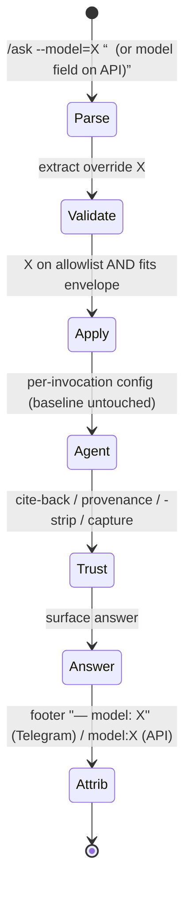
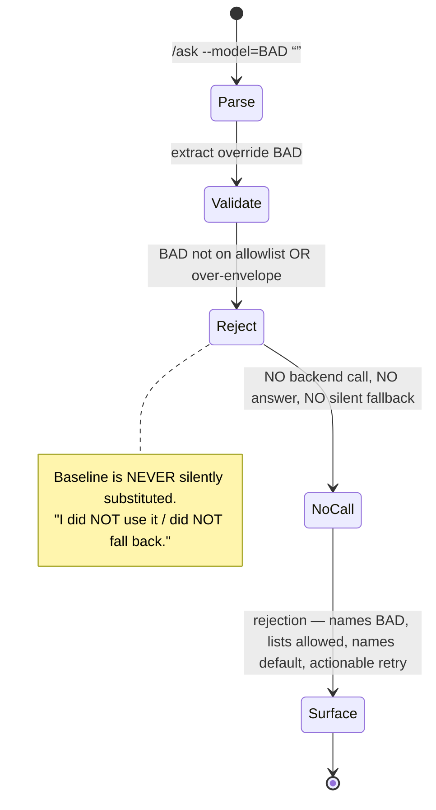
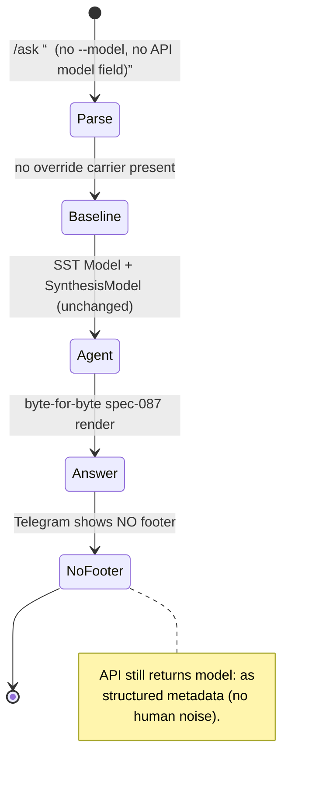
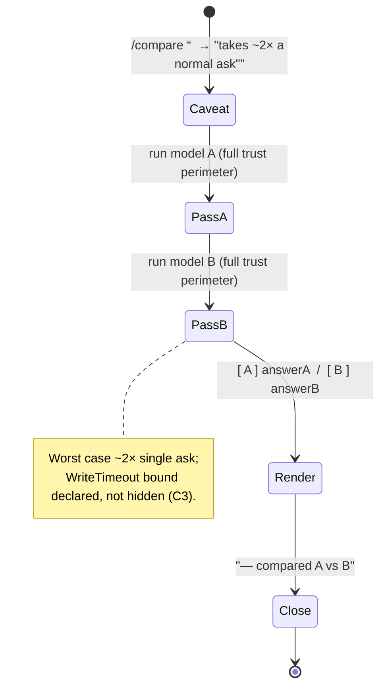

# Spec 088 — Runtime-Switchable Models

**Status:** in_progress (planning bootstrap; ceiling = `done`)
**Workflow Mode:** `full-delivery` (prelude: `analyze-design-plan`)
**Execution Model:** `parent-expanded` — `bubbles.workflow` runs the
analyze → ux → design → plan → … phaseOrder directly because no
specialist sub-agent dispatch (`runSubagent`) is available in this
runtime. `full-delivery` is not a `requiresTopLevelRuntime` mode, so
parent-expansion is permitted (same precedent as specs 084 / 087
`state.json` `executionModel`). **This artifact is the ANALYST phase
output only** — `design.md` / `scopes.md` / `report.md` /
`uservalidation.md` follow in later phases.

**Owner Directive (2026-06-13):** Make the LLM model used by the
open-knowledge `/ask` agent **runtime-switchable across surfaces**, so
the operator can A/B-test models (e.g. `gemma4:26b` vs `deepseek-r1:7b`
on the synthesis turn) WITHOUT redeploying. Owner's words: *"A/B testing
is a plausible option, we always do that. Also maybe we should make
models switchable — e.g., a Telegram command; other surfaces (web/API)
should also have an api/option to do so."*

**Depends On:** spec 087 (open-knowledge genuine synthesis) — which added
the split synthesis model (`okagent.Config.SynthesisModel`, SST key
`assistant.open_knowledge.synthesis_model_id`, home-lab override
`deepseek-r1:7b`) but could NOT prove on dev whether the reasoning-model
swap fixes the live pomegranate-comparison failure (that proof is
GPU/home-lab-dependent). This spec is the enabling primitive that lets
the owner A/B that swap **live**. Transitively builds on the
064 → 084 → 087 chain (the open-knowledge loop, the cite-back verifier,
the provenance gate, the SST config block, the reasoning-prompt rewrite,
the `<think>`-strip + retry-before-salvage).

**Extends, does NOT amend:** this spec ADDS a per-invocation model
override path; it does NOT rewrite spec 087's synthesis logic or reopen
any closed bug. Every spec-064/084/087 trust and synthesis behavior is
**preserved verbatim** and made model-agnostic.

**Out of scope (explicit):** the spec-083 card-rewards WIP
(`internal/cardrewards/`, `ml/app/card_categories.py`, `ml/app/main.py`,
`ml/tests/test_card_categories.py`, `specs/083-card-rewards-companion/`,
`tests/integration/cardrewards_extract_test.go`); the home-lab deploy +
the live `gemma4:26b`-vs-`deepseek-r1:7b` A/B run itself (a separate
`bubbles.devops` dispatch); adding any NEW model to the matrix (the
override selects from the EXISTING `model_memory_profiles` set);
mutating the process-wide SST baseline at runtime (forbidden — see C6).

---

## 1. Problem Statement

The open-knowledge `/ask` agent answers open-ended questions, but **the
model it uses is static** — baked into a process-wide singleton at
wiring time:

- Both surfaces converge on ONE agent instance. Telegram routes
  `case "ask"` (`internal/telegram/bot.go`) → the assistant adapter →
  `Facade.Handle` (`internal/assistant/facade.go`) → BandHigh dispatch →
  `runOpenKnowledgeDirect` → `okagenttool.CurrentAgent().Run(...)`. The
  web/HTTP surface (`internal/api/agent_invoke.go`, `POST
  /v1/agent/invoke`) routes through the substrate router/executor to the
  same `agenttool` Handler, which calls the same singleton
  `agentRef.Load().Run(...)`.
- That singleton is built once in
  `cmd/core/wiring_assistant_openknowledge.go` via `okagent.New(...,
  okagent.Config{ Model: …llm_model_id, SynthesisModel:
  …synthesis_model_id, … })`. The two model fields come from SST
  (`config/smackerel.yaml` `assistant.open_knowledge.llm_model_id` for
  the tool-calling turns; `synthesis_model_id` for the spec-087
  forced-final synthesis turn). **There is no per-request, per-user, or
  runtime override anywhere in the path.**

Spec 087 shipped the split synthesis model so the operator *could* point
the reasoning turn at `deepseek-r1:7b` on home-lab — but it terminated
at **validated-in-repo**: dev has no GPU/Ollama daemon, so whether the
reasoning swap actually fixes the live pomegranate-comparison failure is
unproven and can only be settled by an A/B on the home-lab hardware.
Today, comparing `gemma4:26b` vs `deepseek-r1:7b` on the synthesis turn
requires editing SST, regenerating the config bundle, and
**redeploying** between every arm — too slow and too coarse for the
"we always A/B" workflow the owner wants.

**What is missing:** a way to switch the model at runtime, per
invocation (and/or per user), from BOTH surfaces, so an operator can run
arm A and arm B back-to-back against the live stack and attribute each
answer to the model that produced it — without redeploying, and without
weakening any trust guarantee.

**Two structural gaps this spec must close:**

1. **No override carrier reaches the agent config.** The transport
   carriers exist (`contracts.AssistantMessage.TransportMetadata`,
   `agent.IntentEnvelope.StructuredContext`) but nothing threads a model
   choice from them into a *per-invocation* agent config; the singleton's
   `Model`/`SynthesisModel` are immutable after wiring.
2. **No answer-level model attribution on the open-knowledge fast-path.**
   `agent.InvocationResult.Model` exists and is logged by the facade, but
   `runOpenKnowledgeDirect` never sets it; `okagent.TurnResult` and the
   `agenttool` `outputEnvelope` carry no model field at all. An A/B is
   worthless if the operator cannot tell which model produced which
   answer.

---

## 2. Actors & Personas

| Actor | Description | Goals | Permissions |
|-------|-------------|-------|-------------|
| **Operator / Experimenter** | The single self-hosted owner running live A/B comparisons across the spec 061 transports (Telegram + web/HTTP `/ask`). | Switch the `/ask` model at runtime, run arm A then arm B against the live stack, and read which model produced each answer — without redeploying. | All spec 061 transport permissions; may select only models on the SST allowlist. |
| **Human user (chat owner)** | Same person in the day-to-day (non-experiment) case. | Ask a question and get an answer; when no model is chosen, get exactly today's behavior. | Same as above; the default path requires nothing extra. |
| **Open-Knowledge Agent Loop** (amended) | The spec 064/084/087 bounded planner ↔ tool ↔ observation loop in `okagent.Agent.Run`. Currently a process-wide singleton with static `Model`/`SynthesisModel`. | Run a turn using the model(s) selected for THAT invocation (override) or the SST baseline (no override), with every trust contract intact. | Bounded by SST iteration / token / USD budgets and the HTTP request deadline; uses only allowlisted models. |
| **Model-Override Validator** (new role) | The boundary guard that accepts an untrusted model choice ONLY if it is on the SST-declared allowlist and envelope-consistent, else rejects it explicitly. | Convert an untrusted user-supplied model string into either a validated per-invocation config field or an explicit user-facing rejection — never a silent default, never a backend passthrough. | Pure function over the SST allowlist + the request; no side effects on the SST baseline. |
| **Cite-Back Verifier / Provenance Gate / Capture-as-Fallback** (unchanged) | The spec 064 mechanical, non-LLM trust perimeter + the Facade-level capture fallback. | Reject fabricated citations and zero-source responses; capture unconditionally. | Pure functions over the per-turn trace (verifier/gate) + the Facade (capture). **Preserved verbatim; run identically under ANY selected model.** |
| **Operator-as-Config-Owner** | Owns SST: the model matrix, `model_memory_profiles`, the per-environment `ollama_memory_limit` envelope, and the switchable-model allowlist. | Declare which models are switchable and keep the allowlist envelope-consistent. | Edits `config/smackerel.yaml` `assistant.*` + the per-environment override layer. |

---

## 3. Outcome Contract

**Intent:** The operator can switch the LLM model used by the
open-knowledge `/ask` agent **at runtime, per invocation (and/or per
user), from both the Telegram and the web/HTTP surfaces**, to A/B-test
models live without redeploying — while every answer remains subject to
the identical open-knowledge trust perimeter and is attributed to the
model that produced it.

**Success Signal:**
- **Override is threaded and applied.** A model override supplied on a
  request is carried transport → facade → a *per-invocation* agent
  config and changes the model(s) actually used for that turn — provable
  by the answer's model attribution. The override MAY target the
  tool-calling model and/or the spec-087 synthesis model (exact
  turn-targeting is an open design question — see §8 Fork B).
- **No override ⇒ exact baseline.** When no override is supplied, the
  agent uses exactly today's SST configuration
  (`Model = llm_model_id`, `SynthesisModel = synthesis_model_id`) and
  behaves byte-for-byte as spec 087 ships. Zero behavior change on the
  default path.
- **Allowlist-gated, fail-loud.** An override is accepted ONLY when the
  requested model is on an SST-declared allowlist (derived from
  `assistant.model_memory_profiles` and/or a new explicit
  `assistant.open_knowledge.switchable_models` list — mechanism deferred
  to design; allowlist-gating is mandatory). An off-allowlist,
  un-profiled, or over-envelope choice yields an explicit user-facing
  rejection that lists the allowed set — never a silent default, never a
  silent fall-back to baseline, never an un-validated model reaching the
  inference backend.
- **Both surfaces, one contract.** Telegram and web/HTTP `/ask` expose
  the same switch capability and run the **same** validation.
- **Attributable A/B.** The model(s) that produced an answer are surfaced
  to the operator (in the user-visible response and/or the structured
  envelope), so arm A and arm B are unambiguously distinguishable.
- **Trust perimeter is model-agnostic.** Under ANY selected model, the
  cite-back verifier, the provenance gate (no zero-source), the spec-087
  `<think>`-strip + retry-before-salvage, and the Facade
  capture-as-fallback all run unchanged.

**Failure / Refusal contract:**
- **Off-allowlist / un-profiled / over-envelope override** → explicit
  user-facing rejection naming the allowed set; NO backend call for the
  rejected model; NO silent default; NO silent baseline fall-back.
- **Zero-source response** → canonical refusal-with-capture (provenance
  gate), regardless of the selected model.
- **Fabricated citation** → canonical refusal (cite-back verifier),
  applied to the post-`<think>`-strip text, regardless of the selected
  model.
- **Budget / iteration / tool caps** → typed refusal-with-capture,
  regardless of the selected model.
- **Capture-as-fallback** is performed by the Facade unconditionally,
  regardless of the turn result or the selected model (inviolable).

**Failure Condition (what makes this feature a failure even if all tests
pass):**
- An override string reaches the inference backend (Ollama) **without**
  allowlist validation (arbitrary model passthrough).
- An invalid override is **silently** swapped for the baseline (hiding
  the operator's mistake) instead of being rejected explicitly.
- An A/B answer **cannot be attributed** to the model that produced it.
- ANY trust invariant (cite-back / provenance / capture / `<think>`-strip
  / retry-before-salvage) is weakened, skipped, or bypassed under a
  switched model.
- The **default (no-override) path changes behavior** in any way.
- The process-wide SST baseline is **mutated at runtime** by an override.

---

## 4. Behavioral Scenarios (Gherkin)

> These are business-level acceptance scenarios. They assert the
> REQUIREMENT (override threaded, validated, attributed, trust
> preserved) without presupposing how the §8 design forks resolve. Each
> is intended to receive a stable `SCN-088-*` contract entry in
> `scenario-manifest.json` during the plan phase.

### SCN-088-A01 — A valid allowlisted override is applied and the selected model answers
```gherkin
Feature: A runtime model override changes the model the /ask agent uses
  Scenario: Operator selects an allowlisted model for one invocation
    Given the SST baseline open-knowledge model is the default
    And the operator supplies a model override that is on the switchable-model allowlist
    When the open-knowledge agent runs that /ask invocation
    Then the agent uses the overridden model for that invocation
    And the SST baseline is unchanged for every other invocation
    And the answer is produced under the full trust perimeter
```

### SCN-088-A02 — An off-allowlist override is rejected fail-loud and never reaches the backend
```gherkin
Feature: An un-allowlisted model is refused, not silently defaulted
  Scenario: Operator supplies a model that is not on the allowlist
    Given the operator supplies a model override that is NOT on the switchable-model allowlist
    When the request is validated
    Then the operator receives an explicit rejection that lists the allowed models
    And the rejected model is NEVER sent to the inference backend
    And the agent does NOT silently fall back to the baseline model
    And no answer is fabricated for the rejected request
```

### SCN-088-A03 — No override leaves the baseline behavior byte-for-byte unchanged
```gherkin
Feature: The default path is unaffected by the switch capability
  Scenario: A normal /ask with no model override
    Given the operator supplies no model override
    When the open-knowledge agent runs the /ask invocation
    Then the agent uses exactly the SST baseline model for the tool turns
    And the SST baseline synthesis model for the forced-final synthesis turn
    And the observable behavior is identical to the spec-087 baseline
```

### SCN-088-A04 — The answer is attributed to the model that produced it
```gherkin
Feature: An A/B result names its model
  Scenario: An answer carries the identity of the answering model
    Given an /ask invocation completed (with or without an override)
    When the response is returned to the operator
    Then the response surfaces which model produced the answer
    And two answers produced by two different models are distinguishable by that attribution
```

### SCN-088-A05 — Every trust contract holds under an overridden model
```gherkin
Feature: The trust perimeter is model-agnostic
  Scenario: A fabricated citation from the switched model is still rejected
    Given an allowlisted override is in effect
    And the switched model emits a citation that does not hash-match any tool result
    When the cite-back verifier runs in enforce mode on the post-<think>-strip text
    Then the answer is replaced with the canonical refusal
  Scenario: A zero-source response under the switched model is still refused-with-capture
    Given an allowlisted override is in effect
    And the switched model produced no grounded source
    When the agent finalizes
    Then the provenance gate refuses the response
    And capture-as-fallback still fires unconditionally
  Scenario: The switched reasoning model's <think> never leaks under override
    Given an allowlisted override targets the synthesis turn with a reasoning model
    And that model emits a <think> chain-of-thought
    When the agent finalizes
    Then the <think> content is stripped before citation parsing
    And it never appears in the user body and never becomes a citation
```

### SCN-088-A06 — Telegram and web/HTTP `/ask` validate and apply the override identically
```gherkin
Feature: Transport parity for the model switch
  Scenario: The same allowlisted override behaves the same on both surfaces
    Given the same allowlisted model override
    When it is supplied via the Telegram /ask surface
    And separately via the web/HTTP /ask surface
    Then both surfaces apply the override to the agent invocation identically
    And both surfaces run the same allowlist validation
    And an off-allowlist override is rejected identically on both surfaces
```

### SCN-088-A07 — An untrusted, un-profiled, or over-envelope model never passes through to the backend
```gherkin
Feature: The override is untrusted input, validated against a closed set
  Scenario: An arbitrary model string is treated as untrusted and refused
    Given the operator supplies an arbitrary model string that has no model_memory_profiles entry
    When the request is validated
    Then the model string is rejected before any per-invocation agent config is constructed
    And it is never forwarded to the inference backend
  Scenario: A profiled model that busts the environment memory envelope is refused
    Given the operator supplies a model whose memory profile exceeds the target environment ollama envelope
    When the request is validated
    Then the override is rejected as envelope-inconsistent
    And the operator is told the allowed, envelope-fitting set
```

### SCN-088-A08 — The latency envelope stays honest under a slower switched model
```gherkin
Feature: Switching to a slower model does not silently break the latency contract
  Scenario: A slower reasoning model is selected
    Given an allowlisted override selects a slower model
    When the /ask invocation runs
    Then each turn remains bounded by the per-LLM-roundtrip timeout
    And the worst-case /ask envelope remains the documented WriteTimeout bound
  Scenario: A compare-both affordance (if offered) declares its doubled worst case
    Given a single request runs two models for comparison
    When the worst-case latency is computed
    Then the declared latency envelope reflects the two-pass cost
    And the request stays within (or explicitly updates) the documented timeout bound
```

---

## 5. Functional Requirements

- **FR-1.** An OPTIONAL model override MUST be threadable from a request,
  carried transport → facade → a **per-invocation** open-knowledge agent
  config. The override MAY set the tool-calling model and/or the
  spec-087 synthesis model (exact turn-targeting = §8 Fork B). When NO
  override is supplied, the agent MUST use exactly the SST baseline
  (`Model = llm_model_id`, `SynthesisModel = synthesis_model_id`),
  unchanged.
- **FR-2.** An override MUST be accepted ONLY if the requested model is
  on an SST-declared allowlist. The allowlist source is derived from
  `assistant.model_memory_profiles` and/or a new explicit
  `assistant.open_knowledge.switchable_models` list (exact mechanism =
  design decision); **allowlist-gating itself is mandatory and not a
  design fork.**
- **FR-3.** An off-allowlist, un-profiled, or over-envelope override MUST
  produce an explicit user-facing rejection that lists the allowed set.
  It MUST NOT silently default, MUST NOT silently fall back to the
  baseline, and MUST NOT cause the rejected model to be sent to the
  inference backend.
- **FR-4.** The baseline default MUST remain SST-sourced and fail-loud
  (G028 / `smackerel-no-defaults`): no override mechanism may introduce a
  `${VAR:-default}` or any hidden fallback. If a new
  `switchable_models` SST key is added, it MUST be REQUIRED and
  fail-loud per the SST contract.
- **FR-5.** The Telegram surface MUST expose an affordance to select the
  model for `/ask` (exact shape — slash subcommand, argument, sticky
  preference — = §8 Fork A/C; the REQUIREMENT is that a Telegram
  affordance exists).
- **FR-6.** The web/HTTP `/ask` surface (`POST /v1/agent/invoke`) MUST
  expose the SAME override capability (via the request envelope —
  `structured_context` or a dedicated field, design's choice), validated
  by the SAME allowlist logic as Telegram.
- **FR-7.** The model(s) actually used MUST be attributed in the answer:
  threaded from the agent's turn result → `agent.InvocationResult.Model`
  → the user-visible response and/or the structured envelope. (Today
  `runOpenKnowledgeDirect` does not set `result.Model`; `okagent.TurnResult`
  and the `agenttool` `outputEnvelope` carry no model field — so
  attribution requires new threading.)
- **FR-8.** The override MUST be treated as UNTRUSTED user input and
  validated against the closed allowlist BEFORE any per-invocation agent
  config is constructed; an arbitrary model string MUST NEVER pass
  through to the inference backend.
- **FR-9.** ALL open-knowledge trust invariants MUST run unchanged under
  ANY selected model: the cite-back verifier, the provenance gate (no
  zero-source), the Facade capture-as-fallback (inviolable), and the
  spec-087 `<think>`-strip + retry-before-salvage.
- **FR-10.** Every allowlist entry MUST be envelope-consistent: it MUST
  have a `model_memory_profiles` entry and MUST fit the target
  environment's `ollama_memory_limit`. A model that busts the envelope
  is not a valid allowlist entry and is not switchable in that
  environment.
- **FR-11.** An override MUST NOT mutate the process-wide SST baseline at
  runtime. Overrides are per-invocation (and/or per-user — §8 Fork A)
  ONLY; the SST baseline remains the single source of the default
  (build-once / deploy-many).
- **FR-12.** A slower switched model MUST remain bounded by the per-turn
  `llm_timeout_ms`, and the worst-case `/ask` envelope MUST remain the
  documented `WriteTimeout = (max_iterations + synthesis_retry_budget) ×
  llm_timeout_ms`. If a compare-both affordance is offered (§8 Fork C),
  its two-pass worst case MUST be reflected in the declared latency
  envelope.

---

## 6. Non-Functional Requirements

- **NFR-1 — Security.** The override is untrusted input. Validation is a
  closed-set allowlist check at the surface boundary; there is no
  arbitrary-model passthrough to Ollama, and rejection happens before
  any backend call (OWASP A03/A08 — injection / integrity of an
  untrusted control value).
- **NFR-2 — Latency / Performance.** Per-turn cost stays bounded by
  `llm_timeout_ms`; the no-override path adds zero latency; a compare-
  both affordance must keep the worst case within (or explicitly update)
  the documented `WriteTimeout` envelope.
- **NFR-3 — Observability / Attribution.** The answering model is logged
  (the facade already logs `invocation.Model`) AND surfaced to the
  operator so an A/B is attributable end-to-end.
- **NFR-4 — Backward compatibility.** With no override supplied, behavior
  is byte-for-byte identical to spec 087; existing callers that never
  set an override are unaffected.
- **NFR-5 — Configuration / SST.** All allowlist/config values originate
  from `config/smackerel.yaml`, are REQUIRED, and fail loud; no hidden
  defaults; the override never edits SST at runtime.
- **NFR-6 — Reliability / isolation.** An invalid or failing override
  affects only its own invocation; it never corrupts the singleton
  baseline, another user's invocation, or the trust perimeter.

---

## 7. Constraints (Hard / Blocking)

- **C1 — Trust invariants preserved under any model.** Cite-back
  verifier, provenance gate (no zero-source), capture-as-fallback
  (inviolable), and the spec-087 `<think>`-strip + retry-before-salvage
  MUST hold for EVERY selected model. Non-negotiable.
- **C2 — SST / NO-DEFAULTS / fail-loud (G028).** No `${VAR:-default}`,
  no silent fallback. The baseline stays SST-sourced and fail-loud; any
  new allowlist key is REQUIRED and fail-loud. Allowlist entries MUST be
  memory-envelope / hardware-tier consistent.
- **C3 — Latency invariant (spec 084 F-LAT / 087).** The `/ask`
  fast-path is bounded by HTTP `WriteTimeout = (max_iterations +
  synthesis_retry_budget) × llm_timeout_ms` (today `(6 + 1) × 600s =
  4200s`). A slower switched model and especially a compare-both
  affordance change the worst case and MUST be accounted for, not hidden.
- **C4 — Dependency chain 064 → 084 → 087 → 088.** This spec builds on
  spec 087, which is **uncommitted and validated-in-repo (status
  `blocked`, awaiting its own `bubbles.devops` handoff)**. 088 depends
  directly on 087's `SynthesisModel` split and transitively on the
  064/084 loop + trust perimeter.
- **C5 — Do-not-touch.** `internal/cardrewards/`,
  `ml/app/card_categories.py`, `ml/app/main.py`,
  `ml/tests/test_card_categories.py`, `specs/083-card-rewards-companion/`,
  `tests/integration/cardrewards_extract_test.go` (spec-083 WIP) MUST
  NOT be touched.
- **C6 — No runtime SST mutation.** An override MUST NOT mutate the
  process-wide SST baseline / singleton config at runtime; SST remains
  the only source of the default (build-once / deploy-many).
- **C7 — Terminal posture: validated-in-repo, NO commit/push.** The live
  `gemma4:26b`-vs-`deepseek-r1:7b` A/B is a SEPARATE `bubbles.devops`
  dispatch. This spec produces and validates the switchable-model
  primitive in-repo only.

---

## 8. Open Design Questions (Handed to `bubbles.design` / `bubbles.ux`)

These are deliberately UNRESOLVED at the analyst phase. Each materially
changes architecture or UX and is a design decision, not a requirement.

- **Fork A — Override scope / stickiness.** Per-request (override applies
  to one invocation) vs per-user-sticky (a stored per-user preference;
  note there is NO general per-user preferences store today — only the
  per-user PASETO minter in `internal/telegram/per_user_token.go`) vs
  global runtime default. **Global is almost certainly a non-goal** — it
  conflicts with SST / build-once / deploy-many (C6). Design must choose
  per-request, per-user-sticky, or both, and (if sticky) where the
  preference lives.
- **Fork B — Which turn(s) the override targets.** The tool-calling
  `Model`, the spec-087 forced-final `SynthesisModel`, or both
  independently. The owner's motivating A/B is on the SYNTHESIS turn
  (`gemma4:26b` gather vs `deepseek-r1:7b` synthesize), which argues for
  at least synthesis-turn targeting; design decides whether to also allow
  overriding the tool-calling model.
- **Fork C — First-class A/B compare affordance vs minimal switch.** A
  first-class "compare" affordance (one command runs BOTH models and
  returns both answers, each attributed) vs a minimal switchable model +
  "ask twice" by the operator. Fork C interacts with C3: a compare-both
  affordance runs two full agent passes and ~doubles the worst-case
  latency, which must be bounded or reflected in the declared envelope.

---

## 9. Capability Foundation

### Single-Capability Justification

The runtime model switch is a SELECTION over operational config (an
Ollama model id), not a new code-level provider / strategy / adapter
abstraction. The open-knowledge agent has exactly ONE implementation
(the spec 064/084/087 planner ↔ tool ↔ synthesis loop); a switch changes
only the `Model` / `SynthesisModel` STRING passed to that single loop,
not the loop itself. The models are data, not pluggable code components,
so a full provider-lifecycle Domain Capability Model (multiple concrete
providers, registration, lifecycle states) is not warranted at this
granularity.

Where capability-first DOES bind is the cross-surface override contract:
the override **validation + allowlist gating + per-invocation config
construction + answer attribution** is ONE capability shared by two
surfaces (Telegram and web/HTTP `/ask`). This spec requires that
capability to be defined ONCE in the shared facade/agent layer that both
surfaces already converge on (§1) and consumed by thin per-surface
carriers — NOT re-implemented per surface. FR-1, FR-6, and FR-8 mandate
shared-layer validation; SCN-088-A06 proves the two surfaces apply it
identically; an off-allowlist override is rejected by the same logic on
both. If design's Fork C adds a first-class compare-both affordance, that
compare capability MUST likewise live in the shared layer, not be
duplicated per surface.

---

## 10. Product Principle Alignment

This feature is governed by `docs/Product-Principles.md` (binding since
2026-06-03) and `.github/instructions/product-principles.instructions.md`.

- **Principle 8 — Trust Through Transparency (PRIMARY, new).** The switch
  is explicit and attributable: the answer states which model produced
  it, an A/B is unambiguously traceable to its arm, and an invalid model
  is met with an explicit rejection that lists the allowed set — NEVER a
  silent swap, silent default, or silent baseline fall-back. The trust
  perimeter (cite-back, provenance, capture) is preserved verbatim under
  every model, so switching models can never quietly degrade
  explainability. **Implements.**
- **Principle 6 — Invisible By Default, Felt Not Heard.** The override is
  operator-initiated and does not add unsolicited prompts, badges, or
  status noise; the default (no-override) UX path is unchanged and
  requires nothing extra from an ordinary user. The model switch is a
  deliberate operator affordance, not a new interruption. **Honors (no
  deviation).**
- **Principle 2 — Vague In, Precise Out (inherited / enabling).** The
  whole reason to A/B models is to find the model that turns a vague
  comparison question into a precise synthesized verdict (the spec-087
  goal that dev could not prove). This spec is the primitive that lets
  the operator settle that empirically on real hardware. **Serves.**
- **Principle 4 — Source-Qualified Processing (inherited / preserved).**
  Whichever model is selected, cited evidence is still reconciled and
  cite-back-verified; the switch never relaxes source qualification.
  **Preserves.**

No principle deviation. No financial-action surface is touched
(Principle 10 / QF boundary not engaged).

---

## 11. UI Scenario Matrix

| Scenario | Actor | Entry Point | Steps | Expected Outcome | Surface(s) |
|----------|-------|-------------|-------|------------------|------------|
| Switch model for one ask | Operator | Telegram `/ask` affordance (shape = Fork A/C) | Select an allowlisted model → ask | Answer produced by the selected model, attributed | Telegram |
| Switch model via API | Operator | `POST /v1/agent/invoke` request envelope | Supply the override field → invoke | Answer produced by the selected model, attributed; same validation as Telegram | Web/HTTP |
| Off-allowlist attempt | Operator | Either surface | Supply an un-allowlisted model | Explicit rejection listing the allowed set; no backend call | Telegram + Web/HTTP |
| Normal ask (no switch) | Human user | Either surface | Ask with no override | Exactly the spec-087 baseline behavior | Telegram + Web/HTTP |
| Read which model answered | Operator | Either surface | Read the response/envelope | The answering model is visible for A/B attribution | Telegram + Web/HTTP |
| Compare two models (if Fork C chosen) | Operator | Compare affordance (design TBD) | One request, two models | Two attributed answers; declared two-pass latency | Telegram + Web/HTTP |

---

## 12. Market / Platform Context (Brief)

External competitor web research was intentionally skipped: this is an
internal infra primitive for a self-hosted, single-operator product, and
fabricating a competitor matrix would add no grounded value. The
evidence-based platform rationale is the owner's standing practice —
*"A/B testing … we always do that"* — which runtime model-switching
directly enables. Live, attributable, no-redeploy A/B of inference models
is standard MLOps practice and is the table-stakes capability that lets
spec 087's unproven reasoning-model swap finally be settled on real
hardware. The differentiator here is doing it **without weakening the
open-knowledge trust perimeter** — the switch is observable, allowlist-
gated, and fully attributable.

---

## UI Wireframes

> **Surface note.** Spec 088 has NO graphical screens. Its "UI" is a
> command/affordance surface on two transports: the Telegram chat surface
> and the web/HTTP `/ask` JSON API. These wireframes therefore render
> **chat-message mockups** (Telegram) and **request/response envelope
> mockups** (API) instead of pixel layouts. They are the binding
> user-facing contract the design phase consumes; design resolves the §8
> Forks (A: per-request vs sticky; B: which turn; C: compare-both) but
> MUST NOT change the wording, the fail-loud rejection shape, the
> attribution shape, or the cross-surface parity defined here.
>
> The proposed Telegram command syntax (`--model=`, `/model`, `/compare`)
> and the API `model` field are **UX recommendations**, not pre-decided
> design. Where a Fork is open, both candidate affordances are wireframed
> so design can choose without re-deriving the experience.

### Screen Inventory

| "Screen" (affordance) | Actor | Surface | Status | Scenarios served |
|------------------------|-------|---------|--------|------------------|
| Per-request `/ask` override | Operator | Telegram | New | SCN-088-A01, A04, A06 |
| Sticky model selector `/model <id>` | Operator | Telegram | New (Fork A) | SCN-088-A01, A06 |
| Model list / discovery `/model` (no arg) | Operator | Telegram | New | SCN-088-A02, A07 (discovery of allowed set) |
| Off-allowlist / over-envelope rejection | Operator | Telegram + API | New | SCN-088-A02, A07 |
| Answer + model-attribution footer | Operator | Telegram + API | Modify (footer is new; baseline answer unchanged) | SCN-088-A04 |
| API `/ask` override field | Operator | Web/HTTP | New | SCN-088-A01, A06 |
| API success envelope w/ `model` | Operator | Web/HTTP | Modify (add `model`) | SCN-088-A04 |
| API rejection envelope | Operator | Web/HTTP | New | SCN-088-A02, A06, A07 |
| Compare-both (one ask, two models) | Operator | Telegram + API | New (Fork C — optional) | SCN-088-A08 |
| Bare `/ask <question>` (baseline) | Human user | Telegram + API | **Unchanged** | SCN-088-A03 |

### UI Primitives (UX9 — shared across BOTH surfaces)

The override capability is ONE shared experience consumed by two thin
per-surface carriers (Telegram render + API envelope). These three
primitives MUST be defined once in the shared facade/agent layer (§9
Capability Foundation) and rendered identically — never re-authored per
surface. SCN-088-A06 proves parity.

| Primitive | Definition | Consumed by | Composition / parity rule |
|-----------|------------|-------------|---------------------------|
| **`ModelOverrideCarrier`** | The optional, untrusted model id supplied on a request (Telegram `--model=` / `/model`; API `model` field). | Telegram inbound parse, API request parse | Both carriers feed the SAME validator. A carrier never reaches the backend un-validated (FR-8). Absent carrier ⇒ baseline (FR-1). |
| **`OverrideRejection`** | The fail-loud refusal value when the model is off-allowlist / un-profiled / over-envelope: `{rejected_model, allowed_models[], default_model, reason_code}`. | Telegram rejection render, API 400 envelope | Same data on both surfaces; the Telegram human text and the API `message` are the SAME sentence (parity). NEVER a silent default/fallback (FR-3). |
| **`ModelAttribution`** | The identity of the model that produced the surfaced answer: a single model id (or two ids in compare mode). | Telegram footer line, API `model` field | Truthful + unobtrusive (Principle 8). Human footer shown **only when an override was used or in compare mode**; the API `model` field is **always** present (structured metadata, not chat noise). |

**Status vocabulary (closed set, both surfaces):** `applied` (override
used), `baseline` (no override), `rejected` (off-allowlist /
over-envelope), `compared` (two-model run). These map 1:1 to the
`OverrideRejection.reason_code` values `model_not_allowlisted` /
`model_over_memory_envelope` and to the API `status` field.

### Voice contract (match the existing assistant register)

New wording MUST stay in the repo's open-knowledge voice: sentence-case,
capital "I", em-dash leads, terse, honest, no emoji. Anchors:
honest-salvage prefix *"I searched but couldn't directly answer your
question. Here is the most relevant information I found:"*; refusals end
*"— saved as an idea."*; citations render `[1] Title (your graph)` /
`from the web:`. The only deliberate deviation is the capitalized **NOT**
in the rejection — a fail-loud emphasis so the "your model was not used"
case is impossible to miss (Principle 8 / NO-DEFAULTS).

---

### Screen: Telegram — per-request `/ask` override (happy path)

**Actor:** Operator | **Route:** Telegram `/ask` | **Status:** New | **Fork A: per-request arm**

```
┌──────────────────────────────────────────────────────────────┐
│ you                                                            │
│  /ask --model=deepseek-r1:7b what is a better place to grow    │
│  pomegranate, wa-town-A or wa-town-B, wa?               │
├──────────────────────────────────────────────────────────────┤
│ Smackerel                                                      │
│  wa-town-B is the better choice. It sits in a slightly      │
│  warmer, drier rain-shadow pocket than wa-town-A, whose     │
│  cool maritime summers rarely ripen pomegranates. …            │
│                                                                │
│  from the web:                                                 │
│  [1] WSU Extension — fruit hardiness (your graph)              │
│  [2] OSU climate zones                                         │
│  ... +1 more source                                            │
│  — model: deepseek-r1:7b                                       │
└──────────────────────────────────────────────────────────────┘
```

**Interactions:**
- `--model=<id>` on the `/ask` line → parsed off the front of the
  question, validated against the allowlist → applied to this one
  invocation only (no sticky state, no SST mutation).
- The model flag is stripped from the text BEFORE the question reaches
  the agent (same discipline as the BUG-064-001 `/ask`-prefix strip), so
  the question the model sees is clean.
- Trailing footer `— model: <id>` is the only visible change vs baseline.

**States:**
- Applied (shown above): answer + citations + attribution footer.
- Rejected: see the rejection screen (no answer, no footer).
- Baseline (no `--model=`): byte-for-byte the spec-087 render, **no
  footer** (SCN-088-A03 / NFR-4).

**Responsive (phone-fit, P7):** the footer is one short line; it never
pushes the citations off a phone screen. The answer body length is
unchanged from baseline.

**Accessibility:** the footer is a SEPARATE final line (em-dash lead) so
a screen reader announces it after the answer, never inline — it cannot
be mistaken for the answer body. No color/emoji is load-bearing.

---

### Screen: Telegram — sticky model selector `/model` (Fork A: sticky arm)

**Actor:** Operator | **Route:** Telegram `/model [id]` | **Status:** New | **Fork A: sticky arm**

`/model` with no argument — discovery + current state:

```
┌──────────────────────────────────────────────────────────────┐
│ you                                                            │
│  /model                                                        │
├──────────────────────────────────────────────────────────────┤
│ Smackerel                                                      │
│  Models you can switch /ask to:                                │
│  - gemma4:26b — baseline default, active now                  │
│  - deepseek-r1:7b                                              │
│                                                                │
│  Switch sticky: /model <id>                                    │
│  One-off:       /ask --model=<id> <question>                  │
│  Restore baseline: /model default                              │
└──────────────────────────────────────────────────────────────┘
```

`/model deepseek-r1:7b` — set sticky preference:

```
┌──────────────────────────────────────────────────────────────┐
│ you                                                            │
│  /model deepseek-r1:7b                                         │
├──────────────────────────────────────────────────────────────┤
│ Smackerel                                                      │
│  OK — /ask will use deepseek-r1:7b until you switch back.      │
│  /model default restores the baseline (gemma4:26b).            │
└──────────────────────────────────────────────────────────────┘
```

After a sticky set, `/model` marks the new active model:

```
  Models you can switch /ask to:
  - gemma4:26b — baseline default
  - deepseek-r1:7b — active now
```

**Interactions:**
- `/model` (no arg) → list the allowlist, mark the **default** and the
  **active** model (the active one is the sticky choice, or the default
  when no sticky is set).
- `/model <id>` → validate against the allowlist; on success set the
  per-user sticky preference and confirm; on failure show the rejection
  (parity with `--model=`).
- `/model default` (or `/model reset`) → clear the sticky preference;
  confirm return to the SST baseline.

**States:** no-arg list · set-confirm · reset-confirm · rejection.
**Fork-A note for design:** sticky requires a per-user store that does
NOT exist today (only `per_user_token.go`). If design picks per-request
only, the `/model` screens are dropped and discovery moves to a `/ask`
help line — the per-request override screen alone then satisfies the
feature. The rejection + attribution primitives are identical either way.

---

### Screen: Telegram — off-allowlist / over-envelope rejection (FAIL-LOUD)

**Actor:** Operator | **Route:** Telegram `/ask --model=` or `/model` | **Status:** New

Off-allowlist (unknown / un-profiled model):

```
┌──────────────────────────────────────────────────────────────┐
│ you                                                            │
│  /ask --model=gpt-4o compare these two towns for pomegranates │
├──────────────────────────────────────────────────────────────┤
│ Smackerel                                                      │
│  "gpt-4o" is not a switchable model. I did NOT use it, and I   │
│  did NOT fall back to the default — nothing was sent to the    │
│  model.                                                        │
│  Switchable models: gemma4:26b (default), deepseek-r1:7b.      │
│  Retry e.g. /ask --model=deepseek-r1:7b <your question>        │
└──────────────────────────────────────────────────────────────┘
```

Over-envelope (profiled, but busts the environment memory budget — FR-10 / SCN-088-A07):

```
┌──────────────────────────────────────────────────────────────┐
│ Smackerel                                                      │
│  "deepseek-r1:32b" needs more memory than this environment's   │
│  model budget allows, so it isn't switchable here. I did NOT   │
│  use it and did NOT fall back to the default — nothing was     │
│  sent to the model.                                            │
│  Switchable models that fit: gemma4:26b (default),             │
│  deepseek-r1:7b.                                               │
│  To use a larger model, raise the environment's Ollama memory  │
│  envelope first (operator opt-up).                             │
└──────────────────────────────────────────────────────────────┘
```

**Interactions:** none — the rejection is terminal for the turn. NO
backend call is made for the rejected model; NO answer is produced; NO
capture-as-answer occurs for the rejected request.

**States:** the rejection is itself a state of the `OverrideRejection`
primitive (`reason_code = model_not_allowlisted | model_over_memory_envelope`).

**Why this wording (binding):** it (1) names the rejected model in
quotes, (2) states twice — explicitly — that it was NOT used and there
was NO silent fallback, (3) lists the allowed set, (4) names the default,
(5) gives a copy-paste retry. This is the Principle-8 / NO-DEFAULTS
"impossible to miss" contract; design may not soften the two NOTs.

---

### Screen: Telegram — honest-salvage under an override (attribution must not lie)

**Actor:** Operator | **Status:** New (footer) | **Preserves spec-087 salvage framing**

```
┌──────────────────────────────────────────────────────────────┐
│ Smackerel                                                      │
│  I searched but couldn't directly answer your question. Here   │
│  is the most relevant information I found:                     │
│  • <finding 1 …>                                              │
│  • <finding 2 …>                                              │
│  — model: deepseek-r1:7b                                       │
└──────────────────────────────────────────────────────────────┘
```

**Why `— model:` and NOT `— answered by`:** on the salvage path the body
explicitly says it could *not* answer, so an "answered by" footer would
contradict it. The neutral `— model: <id>` reads as honest metadata
("this salvage came from deepseek-r1:7b") — exactly what an A/B operator
needs to know which model *failed* to synthesize. This keeps ONE
attribution primitive across success + salvage and never breaks the
spec-087 honest-salvage framing (C1). `— answered by <id>` is offered to
design only as a success-path-only alternative (see Recommendations).

---

### Screen: API — `/ask` override request + envelopes (parity surface)

**Actor:** Operator | **Route:** `POST /v1/agent/invoke` | **Status:** New field + envelope `model`

Request (override carried as a top-level `model` field — recommended;
Fork-A note: design may instead nest it under `structured_context`):

```
POST /v1/agent/invoke
Content-Type: application/json

{
  "scenario_id": "open_knowledge",
  "raw_input": "what is a better place to grow pomegranate, wa-town-A or wa-town-B, wa?",
  "model": "deepseek-r1:7b"
}
```

Success — `200 OK` (extends the existing open-knowledge `outputEnvelope`
with a `model` field; `model` is ALWAYS present, even on baseline):

```
HTTP/1.1 200 OK
{
  "status": "success",
  "body": "wa-town-B is the better choice …",
  "termination": "final",
  "model": "deepseek-r1:7b",
  "sources": [ { "kind": "web", "url": "https://…", "title": "WSU Extension" } ]
}
```

Off-allowlist — `400 Bad Request` (a request-value validation failure,
caught before the agent runs — consistent with the existing
"input-schema-violation ⇒ 4xx" rule; the `message` is the SAME sentence
as the Telegram rejection — parity):

```
HTTP/1.1 400 Bad Request
{
  "status": "rejected",
  "error_code": "model_not_allowlisted",
  "rejected_model": "gpt-4o",
  "allowed_models": ["gemma4:26b", "deepseek-r1:7b"],
  "default_model": "gemma4:26b",
  "message": "\"gpt-4o\" is not a switchable model. It was NOT used and the request did NOT fall back to the default — nothing was sent to the model. Switchable models: gemma4:26b (default), deepseek-r1:7b."
}
```

Over-envelope — `400 Bad Request`, `error_code: "model_over_memory_envelope"`,
same envelope shape, message mirroring the Telegram over-envelope text.

**Interactions / States:** `applied` (200, `model` = override) ·
`baseline` (200, `model` = resolved SST default, no override field sent) ·
`rejected` (400, structured `OverrideRejection`). The `error_code` set is
the closed status vocabulary above; clients branch on `status` +
`error_code`.

**Accessibility / machine-readability:** every human sentence has a
structured sibling (`rejected_model`, `allowed_models`, `default_model`)
so an API client can render its own UI without parsing prose. Mirrors the
existing `userreply` malformed-request contract.

---

### Screen: Compare-both (Fork C — optional) — one ask, two labeled answers

**Actor:** Operator | **Route:** Telegram `/compare <question>` or `/ask --compare=a,b <question>`; API `compare_models: [a,b]` | **Status:** New (Fork C)

```
┌──────────────────────────────────────────────────────────────┐
│ you                                                            │
│  /compare what is a better place to grow pomegranate, ocean    │
│  shores or wa-town-B, wa?                                   │
├──────────────────────────────────────────────────────────────┤
│ Smackerel                                                      │
│  Comparing 2 models — this runs both back-to-back, so it       │
│  takes about 2× a normal ask.                                  │
│                                                                │
│  [ gemma4:26b ]                                                │
│  wa-town-B, on balance … [1][2]                            │
│                                                                │
│  [ deepseek-r1:7b ]                                            │
│  wa-town-B is clearly better because … [1][2]              │
│                                                                │
│  — compared gemma4:26b vs deepseek-r1:7b                       │
└──────────────────────────────────────────────────────────────┘
```

**Interactions:** one request runs two FULL agent passes (each under the
complete trust perimeter), returns both answers each labeled with its
model header `[ <id> ]`, and a closing `— compared a vs b` line. API form
returns `{ "status": "compared", "comparisons": [ {model, body, sources}, … ] }`.

**States:** `compared` (both passed) · partial (one arm rejected/failed →
surface the failing arm's `OverrideRejection`/refusal in place of its
answer, never drop it silently).

**Latency caveat (C3 / FR-12 — surfaced to the user):** the worst case is
~2× a single ask. The UX states this up front ("takes about 2× a normal
ask"); design MUST bound or explicitly update the documented
`WriteTimeout` envelope for the two-pass path — the caveat is shown, not
hidden.

**Responsive:** compare output is long by nature (two answers). Design may
split it into two messages on Telegram; the model headers `[ <id> ]` keep
each answer attributable even when split.

---

## User Flows

### Flow (a) — Happy path: per-request override → attributed answer (SCN-088-A01, A04)



### Flow (b) — Off-allowlist / over-envelope → FAIL-LOUD, no backend call (SCN-088-A02, A07)



### Flow (c) — No override → exact spec-087 baseline, zero attribution noise (SCN-088-A03)



### Flow (d) — A/B operator journey: same question, two models, compare (SCN-088-A04)

```mermaid
sequenceDiagram
    actor Op as Operator
    participant S as Smackerel /ask
    Op->>S: /ask --model=gemma4:26b <Q>
    S-->>Op: Answer A  — model: gemma4:26b
    Op->>S: /ask --model=deepseek-r1:7b <Q>   (same Q)
    S-->>Op: Answer B  — model: deepseek-r1:7b
    Note over Op: footers make A vs B unambiguous;<br/>operator compares the two verdicts
```

### Flow (e) — Compare-both affordance (Fork C, optional): one command, two attributed answers



> The concrete affordance wording, the verbatim rejection/attribution
> strings, and the A/B operator journey are also captured as
> operator-checkable acceptance items in
> [uservalidation.md](uservalidation.md).
