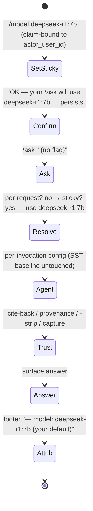
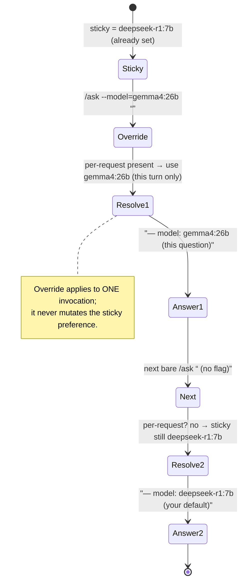
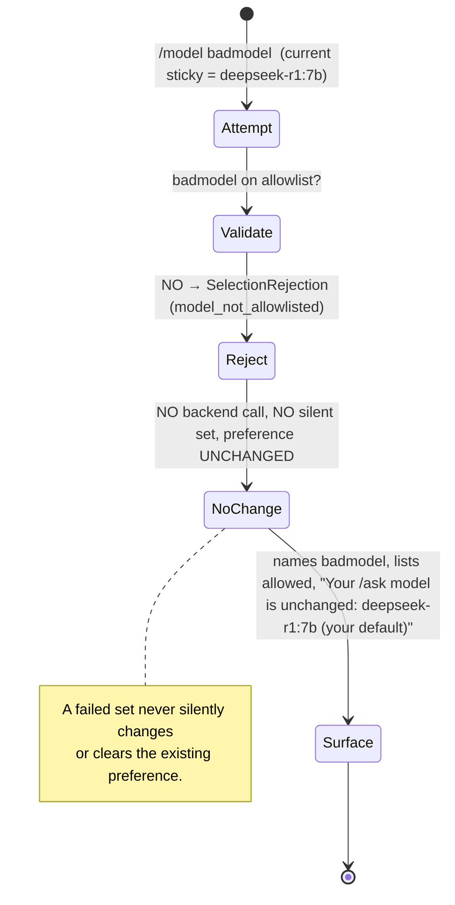
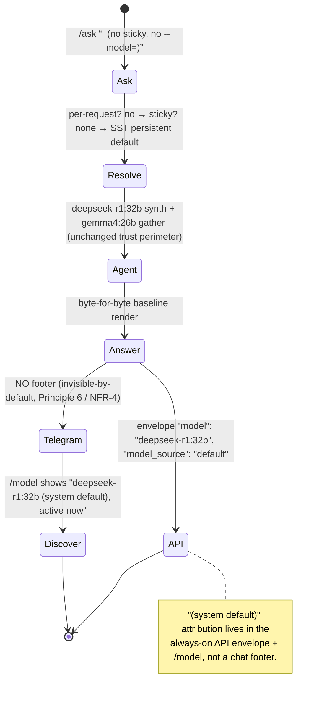

# Spec 089 — Runtime Model Hot-Swap & Persistent Selection

**Status:** in_progress (analyst bootstrap; ceiling = `done`)
**Workflow Mode:** `full-delivery` (prelude: `analyze-design-plan`)
**Execution Model:** `parent-expanded` — `bubbles.workflow` runs the
analyze → ux → design → plan → … phaseOrder directly because no
specialist sub-agent dispatch (`runSubagent`) is available in this
runtime. `full-delivery` is not a `requiresTopLevelRuntime` mode, so
parent-expansion is permitted (same precedent as specs 084 / 087 / 088
`state.json` `executionModel`). **This artifact is the ANALYST phase
output only** — `design.md` / `scopes.md` / `report.md` /
`uservalidation.md` follow in later phases.

**Owner Directive (2026-06-14):** *"We should be able to hot-swap models
in prod via config, and the previously-mentioned commands in telegram,
api, other surfaces too."* Plus, after a live 3-way A/B on self-hosted
hardware, the owner chose *"do c" = BOTH*: (a) wire `deepseek-r1:32b` as
the **persistent default** synthesis model in committed SST (quality
first), keeping `deepseek-r1:7b` switchable for speed, AND (b) build the
**hot-swap** feature — operator + per-user model control for the
open-knowledge `/ask` agent with parity across Telegram + web/HTTP (and
any other transport surface).

**Depends On:** spec 088 (runtime-switchable models) — which shipped the
per-**request** synthesis-model override (`/ask --model=` Telegram +
`model` HTTP field), the shared SST allowlist
`assistant.open_knowledge.switchable_models`, the surface-agnostic
validator `internal/assistant/openknowledge/modelswitch` (`NewAllowlist`
/ `Resolve`), the per-request clone `Agent.WithModelOverride`
(`internal/assistant/openknowledge/agent/agent.go`), and model
attribution. Transitively builds on the 064 → 084 → 087 chain (the
open-knowledge loop, the cite-back verifier, the provenance gate, the
spec-087 split synthesis model + `<think>`-strip + retry-before-salvage).

**Picks up two items spec 088 explicitly DEFERRED:**
- **F-STICKY** — a per-**user** sticky `/model <id>` selector (set my
  default once; persists across turns). Spec 088 noted NO general
  per-user preferences store exists today (only the per-user PASETO
  minter `internal/telegram/per_user_token.go`).
- **F-TOOLMODEL** — a runtime override for the GATHER (tool-calling)
  model, not just the synthesis turn. Today only the spec-087 synthesis
  turn is runtime-overridable (spec 088 Fork B resolved synthesis-only).

**The A/B evidence that drove the owner's decision** is captured verbatim
in [`docs/experiments/open-knowledge-synthesis-model-ab.md`](../../docs/experiments/open-knowledge-synthesis-model-ab.md).
Headline: `deepseek-r1:32b` synthesis decisively FIXED the two failures
that motivated this whole effort — the Q1 comparison false-balance
("depends on priorities" → "Phoenix is better; Minneapolis unsuitable for
citrus without protection") and the Q4 multi-hop **hallucination** (7b
invented a "novel titled *Blade Runner*, author unknown, 1982" → 32b's
correct "*Do Androids Dream of Electric Sheep?*, Philip K. Dick, 1968").
32b quality 5/6 clean. Cost: ~1.9× slower (mean ~565s vs ~298s per
`/ask`; both already multi-minute — a research/recall assistant, not a
chat-latency product). One blemish: 32b's Q6 control came back EMPTY
(forced-final blank, one-off) despite `synthesis_retry_budget=1`.

**Extends, does NOT amend:** this spec ADDS a persistent-default SST
selection + a per-user sticky selection + a gather-turn override; it does
NOT rewrite spec 087's synthesis logic, does NOT reopen spec 088's closed
per-request path, and does NOT weaken any closed trust contract. Every
spec-064/084/087/088 trust and synthesis behavior is **preserved
verbatim** and made model-/selection-agnostic.

**Out of scope (explicit):** the spec-083 card-rewards WIP
(`internal/cardrewards/`, `ml/app/card_categories.py`, `ml/app/main.py`,
`ml/tests/test_card_categories.py`, `specs/083-card-rewards-companion/`,
`tests/integration/cardrewards_extract_test.go`); the self-hosted deploy
itself (persisting the raised envelope + the 32b default + the
pull-on-deploy + the live re-verify) — a separate `bubbles.devops`
dispatch; adding any NEW model not already in `model_memory_profiles`;
mutating the process-wide SST baseline at runtime (forbidden — C6).

---

## 1. Problem Statement

The open-knowledge `/ask` agent answers open-ended questions. After spec
088, the model can be overridden **per request** on the SYNTHESIS turn
(`gemma4:26b` gather vs an allowlisted synthesis model). The live A/B
settled the open question spec 087 could not: a reasoning model on the
synthesis turn produces a genuine reasoned answer, and `deepseek-r1:32b`
specifically fixes the comparison false-balance and the multi-hop
hallucination that 7b commits. The owner has now chosen 32b as the
**standing** synthesis model, not just an occasional per-request opt-up.
That choice exposes four gaps the per-request primitive does not close:

1. **No persistent default selection.** Today the self-hosted synthesis
   default is `deepseek-r1:7b`
   (`environments.self-hosted.assistant_open_knowledge_synthesis_model_id`).
   Making 32b the standing default is a committed-SST change — and 32b
   does NOT fit the current self-hosted `ollama_memory_limit: "28G"`
   envelope co-resident with the gemma4:26b gather model
   (`18432 + 22528 = 40960 MiB > 28672 MiB`), so
   `validateModelEnvelopes` structurally rejects it today (it is the
   `model_over_memory_envelope` opt-up). The envelope MUST be raised
   first — and the **real** footprint headroom verified (see §2 below).

2. **No per-user sticky selection (F-STICKY).** A per-request flag must
   be repeated every turn. The owner wants `/model <id>` to set a
   per-user default that persists across subsequent `/ask` turns until
   changed or reset. There is **no general per-user preferences store**
   today — only the per-user PASETO minter
   (`internal/telegram/per_user_token.go`); a per-user preference is new
   persistent per-user state and must be claim-bound to the
   authenticated user (spec 044), not spoofable.

3. **No gather-turn runtime override (F-TOOLMODEL).** Spec 088 Fork B
   re-points the SYNTHESIS turn ONLY (`WithModelOverride` rewrites
   `cfg.SynthesisModel`). A full model A/B may want to swap the GATHER
   (tool-calling) model too — but the gather model MUST stay
   tool-calling-capable on Ollama (gemma3:4b errors `does not support
   tools`; deepseek-r1 tool-calling is weak), so a naive "swap both"
   would degrade gather.

4. **"Hot-swap in prod via config" is undocumented.** Swapping the
   standing model today means editing the deployed env and recreating
   core — proven during the A/B to take ~15s ("core healthy in 15s",
   `--no-deps`, image digests injected from the running container). There
   is no decided/documented operator procedure, and no decision on
   whether that 15s recreate IS the accepted hot-swap or whether true
   zero-downtime config-hot-reload is in scope.

**Two reliability defects the A/B surfaced** (both visible on the default
path once 32b is the standing model, so they graduate from "nice to fix"
to "default-path hygiene"):

- **Scaffolding leakage.** Raw `<CITATIONS>` / `<think>` contract
  scaffolding leaked into several user-visible 7b bodies (absent on 32b,
  but the parse-hygiene bug is model-independent and must not reach the
  default user answer).
- **Forced-final blank.** 32b's Q6 control came back EMPTY despite
  `synthesis_retry_budget=1`. A blank answer from the **standing default**
  is worse than a blank from an occasional override; the spec-087
  retry-before-salvage must be verified/strengthened against this.

---

## 2. The Critical Engineering Concern (Footprint Headroom — captured as a hard requirement)

The SST envelope validation
(`internal/config/config.go::validateModelEnvelopes`, mirrored at runtime
by `modelswitch.NewAllowlist`) checks **profile** numbers: gather model
resident + candidate ≤ `OllamaMemoryLimitMiB`. The profile for
`deepseek-r1:32b` is **22528 MiB (22 GiB)**. But the **measured**
footprint of 32b is **~64 GB at its full 131072 context** vs ~20 GB at
4096 — the **KV-cache dominates and scales with context**. The
open-knowledge pipeline runs `per_query_token_budget: 128000` and the
synthesis turn re-adds gathered snippets each iteration, so context
cannot be cut arbitrarily without hurting synthesis quality.

**Therefore the profile number UNDERSTATES the real footprint of a large
synthesis model at the pipeline's context.** Making 32b the BLANKET
default for **every** query (not just an occasional per-request override)
raises memory-pressure risk under concurrent load — the same box runs the
live ingestion pipeline on gemma4:26b. The A/B live arm DID fit at a
raised `OLLAMA_MEMORY_LIMIT` of 48G (measured 82 GiB used / 26 GiB free
on the 109 GiB box, "no pressure"), but it fit because the Docker memory
cap CONSTRAINS ollama's context — which is exactly the quality/footprint
tension to resolve deliberately rather than by accident.

**Captured requirement (FR-2 / NFR-3 / C2 / SCN-089-A06):** the
persistent-default footprint headroom MUST be verified safe — the
`ollama_memory_limit` raised to fit gather + the standing synthesis model
co-resident (owner figure: measured ~45824 MiB needs ≥48G), AND the
design MUST decide whether the **profile-based** envelope check is
sufficient or whether a **real-footprint-aware** guard (or an explicit
synthesis `num_ctx` constraint) is required so the standing default
cannot silently OOM the host alongside ingestion.

---

## 3. Actors & Personas

| Actor | Description | Goals | Permissions |
|-------|-------------|-------|-------------|
| **Operator / Config-Owner** | The single self-hosted owner who chooses the standing default model and the switchable set in committed SST and hot-swaps it in prod. | Set the persistent default synthesis model via SST; hot-swap it in prod via a documented procedure; keep the allowlist envelope-consistent and the standing-default footprint headroom verified. | Edits `config/smackerel.yaml` `assistant.*` + the per-environment override layer + the deploy envelope; runs the documented hot-swap procedure. |
| **Operator / Experimenter** | Same person running live A/B comparisons across surfaces. | Switch the `/ask` model (synthesis and/or gather) per request OR set a sticky per-user default; read which model produced each answer; A/B without redeploying. | All spec 061 transport permissions; may select only allowlisted models. |
| **Human user (chat owner)** | The day-to-day (non-experiment) case. | Ask a question and get the best standing-default answer; optionally set a personal sticky model once and have it persist. | Same; the default path requires nothing extra; a sticky preference is personal and claim-bound. |
| **Open-Knowledge Agent Loop** (amended) | The spec 064/084/087/088 bounded planner ↔ tool ↔ synthesis loop in `okagent.Agent.Run`, with the spec-088 per-request `WithModelOverride` clone. | Run a turn using the model(s) selected for THAT invocation by precedence (per-request override > per-user sticky > SST persistent default), with every trust contract intact. | Bounded by SST iteration / token / USD budgets and the HTTP request deadline; uses only allowlisted models. |
| **Model-Selection Resolver** (extended role) | The spec-088 `modelswitch` boundary guard, extended to resolve a per-user sticky preference and (Fork C) a gather-turn selection in addition to the per-request synthesis override. | Convert an (untrusted) per-request and/or (claim-bound) per-user model selection into a validated per-invocation config — or an explicit fail-loud rejection. Never a silent default; never a backend passthrough. | Pure function over the SST allowlist + the request + the authenticated user's stored preference; no SST-baseline mutation. |
| **Per-User Preference Store** (new) | The persistence seam for a user's sticky model choice (store = Fork B). | Persist one model id per authenticated user; return it for that user only; reset on `/model default`. | Keyed on the authenticated `actor_user_id` (spec 044); never settable by a spoofed body field. |
| **Cite-Back Verifier / Provenance Gate / Capture-as-Fallback** (unchanged) | The spec 064 mechanical, non-LLM trust perimeter + the Facade-level capture fallback. | Reject fabricated citations and zero-source responses; capture unconditionally. | Pure functions over the per-turn trace + the Facade. **Preserved verbatim; run identically under ANY selected model.** |

---

## 4. Outcome Contract

**Intent:** The owner can (a) make a chosen model the **persistent
default** synthesis model for the open-knowledge `/ask` agent via
committed SST — and hot-swap it in prod via a documented config
procedure — while (b) any user can switch the model at runtime,
**per-request** or as a **sticky per-user default**, across Telegram +
web/HTTP (and any other transport) with parity, gather and/or synthesis
turn — and every answer remains subject to the identical open-knowledge
trust perimeter and is attributed to the model(s) that produced it.

**Success Signal:**
- **Persistent default applies.** With no per-user sticky and no
  per-request override, `/ask` uses the committed-SST persistent default
  synthesis model (self-hosted → `deepseek-r1:32b`) for every invocation,
  and that default's footprint headroom is verified safe co-resident with
  the gather model and the ingestion pipeline.
- **Sticky persists per user.** `/model <id>` sets the calling user's
  default synthesis model; subsequent `/ask` turns from that user use it
  with no flag, until `/model default` resets it. `/model` with no
  argument shows the current selection + the allowed set. The preference
  is claim-bound to the authenticated user and never leaks across users.
- **Precedence is explicit.** For any invocation the effective model is
  resolved as **per-request override > per-user sticky > SST persistent
  default**, deterministically.
- **Gather override works (F-TOOLMODEL).** The gather/tool-calling model
  is runtime-selectable (per-request and/or sticky; semantics = §9 Fork
  C), and a gather selection that is not tool-calling-capable is rejected
  fail-loud.
- **Allowlist-gated, fail-loud, every surface.** Every selection (sticky,
  per-request, synthesis, gather) is validated by the SAME `modelswitch`
  allowlist on every surface. An off-allowlist / un-profiled /
  over-envelope / non-tool-capable-gather selection yields an explicit
  user-facing rejection listing the allowed set — never a silent default,
  never a silent fall-back, never an un-validated model reaching Ollama.
- **Hot-swap in prod is documented.** Changing the standing default in
  prod follows a decided, documented operator procedure (§9 Fork D).
- **Attributable.** Each answer surfaces the model(s) that produced it AND
  the selection source (default / sticky / per-request), so an A/B is
  unambiguous.
- **Output hygiene + forced-final reliability.** No `<think>` /
  `<CITATIONS>` scaffolding reaches the user body under any model, and a
  blank forced-final synthesis is rescued by retry-before-salvage before
  the honest snippet salvage fires.
- **Trust perimeter is model-/selection-agnostic.** Under ANY selected
  model and ANY selection source, the cite-back verifier, the provenance
  gate, the spec-087 `<think>`-strip + retry-before-salvage, and the
  Facade capture-as-fallback all run unchanged.

**Failure / Refusal contract:**
- **Off-allowlist / un-profiled / over-envelope / non-tool-capable-gather
  selection** → explicit user-facing rejection naming the allowed set; NO
  backend call for the rejected model; NO silent default; NO silent
  fall-back.
- **Zero-source response** → canonical refusal-with-capture (provenance
  gate), regardless of model/selection.
- **Fabricated citation** → canonical refusal (cite-back verifier) on the
  post-`<think>`-strip text, regardless of model/selection.
- **Blank forced-final synthesis** → retry-before-salvage re-issues the
  escalated prompt up to `synthesis_retry_budget` times, THEN the honest
  snippet salvage; never a silently-empty answer.
- **Budget / iteration / tool caps** → typed refusal-with-capture.
- **Capture-as-fallback** is performed by the Facade unconditionally
  (inviolable).

**Failure Condition (what makes this feature a failure even if all tests
pass):**
- The standing-default model OOMs or destabilizes the host under
  concurrent ingestion load because only the profile number (not the real
  KV-cache footprint at the pipeline's context) was checked.
- A selection string reaches Ollama WITHOUT allowlist validation.
- An invalid selection is **silently** swapped for a default instead of
  rejected explicitly.
- A user's sticky preference is settable by, or visible to, another user
  (claim-binding broken).
- An A/B answer cannot be attributed to the model AND the selection source.
- ANY trust invariant (cite-back / provenance / capture / `<think>`-strip
  / retry-before-salvage) is weakened under a switched model or selection
  source.
- The no-selection (default) path changes behavior versus the committed
  SST default.
- The process-wide SST baseline is mutated at runtime.

---

## 5. Behavioral Scenarios (Gherkin)

> Business-level acceptance scenarios. They assert the REQUIREMENT
> (persistent default applied; sticky set/show/reset + persists +
> claim-bound; gather override; fail-loud rejection on every surface;
> footprint-headroom guard; output hygiene; forced-final reliability;
> multi-surface parity; attribution; hot-swap procedure) WITHOUT
> presupposing how the §9 forks resolve. Each receives a stable
> `SCN-089-*` contract entry in `scenario-manifest.json` during plan.

### SCN-089-A01 — The committed-SST persistent default synthesis model is applied to every `/ask` with no selection
```gherkin
Feature: A persistent default model is chosen in committed SST
  Scenario: No per-user sticky and no per-request override
    Given the committed SST persistent default synthesis model is set for the environment
    And the calling user has no sticky model preference
    And the request carries no per-request model override
    When the open-knowledge agent runs the /ask invocation
    Then the agent uses the committed-SST persistent default synthesis model
    And the gather turns use the SST baseline tool model
    And the answer is produced under the full trust perimeter
    And the answer is attributed to the persistent-default model with selection source "default"
```

### SCN-089-A02 — A sticky `/model <id>` set persists across subsequent turns until changed
```gherkin
Feature: A per-user sticky model selection persists
  Scenario: User sets a sticky model then asks twice with no flag
    Given the user issues /model with an allowlisted model id
    When the user later runs two /ask invocations with no per-request override
    Then both invocations use the sticky model for the synthesis turn
    And the user is not required to repeat the selection on each turn
    And the SST persistent default is unchanged for every other user
```

### SCN-089-A03 — `/model` (no arg) shows current + allowed; `/model default` resets to the SST default
```gherkin
Feature: Sticky selection is discoverable and resettable
  Scenario: Discovery
    Given the user has a sticky model selection
    When the user issues /model with no argument
    Then the reply shows the user's current selection and the allowed switchable set and the SST default
  Scenario: Reset
    Given the user has a sticky model selection
    When the user issues /model default
    Then the user's sticky preference is cleared
    And subsequent /ask invocations use the SST persistent default again
```

### SCN-089-A04 — A sticky preference is claim-bound to the authenticated user and never leaks across users
```gherkin
Feature: Sticky preference is per-user state, not spoofable
  Scenario: Two users, two preferences
    Given user A has set a sticky model and user B has not
    When user B runs an /ask invocation
    Then user B's invocation uses the SST persistent default, not user A's sticky model
  Scenario: A spoofed actor id cannot set another user's preference
    Given a request attempts to set a sticky preference for an actor id it is not authenticated as
    When the selection is resolved
    Then the preference is bound to the authenticated user only
    And the spoofed actor id is ignored
```

### SCN-089-A05 — Selection precedence is per-request override > per-user sticky > SST persistent default
```gherkin
Feature: A deterministic selection precedence
  Scenario: A per-request override beats a sticky preference
    Given the user has a sticky model preference
    And the user supplies a different allowlisted per-request override on one /ask
    When that invocation runs
    Then the per-request override wins for that invocation only
    And the user's sticky preference is unchanged for the next invocation
  Scenario: A sticky preference beats the SST default
    Given the user has a sticky model preference and supplies no per-request override
    When the invocation runs
    Then the sticky model is used, not the SST persistent default
```

### SCN-089-A06 — The persistent-default footprint headroom is verified safe (not just the profile number)
```gherkin
Feature: A large standing-default model cannot silently OOM the host
  Scenario: The standing default is envelope- and footprint-checked
    Given the persistent default synthesis model is a large reasoning model
    When the configuration is generated for the target environment
    Then the ollama memory envelope is raised to fit the gather model plus the standing synthesis model co-resident
    And the standing default is rejected fail-loud if it busts the declared envelope
    And the real-footprint headroom at the pipeline's context budget is verified safe co-resident with the ingestion pipeline
  Scenario: An over-envelope standing default is refused at config generation
    Given a persistent default whose co-resident profile exceeds the environment ollama envelope
    When the configuration is generated
    Then config generation fails loud and names the offending model and the envelope
```

### SCN-089-A07 — The gather (tool-calling) model is runtime-selectable and a non-tool-capable gather model is refused
```gherkin
Feature: The gather model is overridable but must stay tool-calling-capable
  Scenario: A valid tool-capable gather model is applied
    Given the user selects an allowlisted, tool-calling-capable gather model
    When the open-knowledge agent runs the gather turns
    Then the gather turns use the selected gather model
    And the synthesis turn still resolves by the normal precedence
  Scenario: A non-tool-capable gather model is rejected
    Given the user selects a gather model that cannot emit tool calls on the backend
    When the selection is resolved
    Then the operator receives an explicit rejection
    And the non-tool-capable model is never used for the gather turns
```

### SCN-089-A08 — An off-allowlist / over-envelope selection is rejected fail-loud, identically on every surface, and never reaches the backend
```gherkin
Feature: Every selection is untrusted and validated against a closed set on every surface
  Scenario: Off-allowlist selection on each surface
    Given an off-allowlist model is supplied as a sticky selection or a per-request override
    When it is supplied via the Telegram surface and separately via the web/HTTP surface
    Then both surfaces reject it with the same fail-loud message listing the allowed set
    And the rejected model is never sent to the inference backend on either surface
    And neither surface silently falls back to a default
  Scenario: Over-envelope selection
    Given a profiled model whose co-resident footprint busts the environment ollama envelope
    When the selection is resolved
    Then it is rejected as envelope-inconsistent and the envelope-fitting allowed set is shown
```

### SCN-089-A09 — No `<think>` / `<CITATIONS>` scaffolding leaks into the user body under any model
```gherkin
Feature: Synthesis-turn output hygiene
  Scenario: A reasoning model emits scaffolding
    Given any selected synthesis model emits <think> reasoning and/or <CITATIONS> contract scaffolding
    When the agent finalizes the answer
    Then the <think> content is stripped before citation parsing
    And no <think> or <CITATIONS> scaffolding appears in the user-visible body
    And the scaffolding never becomes a citation
```

### SCN-089-A10 — A blank forced-final synthesis is rescued by retry-before-salvage before the honest salvage
```gherkin
Feature: Forced-final empty-output reliability (the 32b Q6-blank class)
  Scenario: The forced-final synthesis comes back empty
    Given the persistent default (or selected) synthesis model returns an empty forced-final answer
    When the agent finalizes
    Then the escalated "write the verdict now, no <think>, no preamble" retry is issued up to synthesis_retry_budget times
    And only if every retry is still empty/ungrounded does the honest snippet salvage fire
    And the user never receives a silently-empty answer
```

### SCN-089-A11 — Telegram + web/HTTP (+ any other transport) expose sticky + per-request + gather selection identically
```gherkin
Feature: Multi-surface parity for the full selection capability
  Scenario: The same selection behaves the same on every surface
    Given the same allowlisted sticky selection, per-request override, and gather selection
    When each is exercised on the Telegram surface and on the web/HTTP surface
    Then every surface resolves them through the same modelswitch validator
    And the applied model(s), the rejection shape, and the attribution are identical across surfaces
```

### SCN-089-A12 — Each answer is attributed to the model(s) AND the selection source
```gherkin
Feature: An A/B result names its model and how the model was chosen
  Scenario: Attribution carries model and source
    Given an /ask invocation completed
    When the response is returned
    Then the response surfaces which model produced the answer for each overridable turn
    And the response surfaces the selection source (default, sticky, or per-request)
    And two answers from two different models or sources are distinguishable by that attribution
```

### SCN-089-A13 — The persistent default is hot-swappable in prod via a documented config procedure
```gherkin
Feature: Hot-swap the standing model in prod via config
  Scenario: Operator swaps the standing default
    Given a new standing default synthesis model that is envelope- and footprint-verified for the environment
    When the operator follows the documented hot-swap procedure
    Then the standing default changes for subsequent /ask invocations
    And the trust perimeter and every other behavior are unchanged
    And the procedure's downtime characteristic is the one documented for the chosen mechanism
```

### SCN-089-A14 — `/model` (no arg) shows a NUMBERED list and a reply-with-number selects the sticky model, claim-bound
```gherkin
Feature: A numbered model picker lets the user choose by replying with a number
  Scenario: Show a numbered list and arm a pending selection
    Given the user issues /model with no argument on the Telegram surface
    When the reply is rendered
    Then the switchable models are shown as a 1-indexed numbered list in a stable order
    And the user's current effective model and the system default are marked in the list
    And a per-chat pending selection holding the ordered list shown is armed
  Scenario: A reply with a number selects the corresponding model
    Given the user was shown the numbered model picker and a pending selection is armed
    When the user replies with an in-range number
    Then the model at that position is re-validated against the shared switchable allowlist
    And the user's sticky synthesis preference is set to that model, claim-bound to the authenticated user
    And the confirmation names the model and how to reset, and the pending selection is cleared
  Scenario: A number with no armed picker is not hijacked
    Given the user has no armed model picker for this chat
    When the user sends a bare number
    Then the number is not consumed as a model selection
    And it remains available to the other numeric-reply flows
  Scenario: An out-of-range or off-allowlist pick changes nothing
    Given the user was shown the numbered model picker
    When the user replies with a number outside the shown range, or the armed list is stale and the picked id is off the allowlist
    Then no model is sent to the backend and the sticky preference is unchanged
    And the user is re-prompted (out of range) or sees the fail-loud rejection (off-allowlist)
```


---

## 6. Functional Requirements

- **FR-1 — Persistent default via committed SST.** The persistent default
  synthesis model MUST be selectable in committed `config/smackerel.yaml`
  via the established per-environment override pattern
  (`environments.<env>.assistant_open_knowledge_synthesis_model_id`).
  self-hosted becomes `deepseek-r1:32b`; `deepseek-r1:7b` stays in the
  switchable set for speed. The baseline stays SST-sourced and fail-loud
  (G028): no `${VAR:-default}`, no hidden fallback.
- **FR-2 — Envelope raised + footprint headroom verified.** To make a
  large standing default fit, `environments.<env>.ollama_memory_limit`
  MUST be raised so the gather model + the standing synthesis model are
  co-resident-consistent (owner figure: measured ~45824 MiB needs ≥48G),
  validated fail-loud in `validateModelEnvelopes`. Because the profile
  number understates the real KV-cache footprint at the pipeline's
  `per_query_token_budget` (§2), the standing-default footprint headroom
  MUST be verified safe co-resident with the ingestion pipeline — the
  design decides whether the profile-based check suffices or a
  real-footprint-aware guard / explicit synthesis `num_ctx` bound is
  required.
- **FR-3 — Sticky per-user selection (F-STICKY).** A `/model <id>`
  affordance (Telegram) and an equivalent API affordance MUST set the
  calling user's default synthesis model, persisted, applied to that
  user's subsequent `/ask` invocations until changed or reset. `/model`
  with no argument MUST show the user's current selection + the allowed
  set + the SST default; `/model default` MUST clear the sticky
  preference.
- **FR-4 — Per-user preference store.** The sticky preference MUST be
  persisted per user in a store decided by §9 Fork B (new table/column vs
  reuse an existing per-user store vs lightweight KV). The no-preference
  case MUST resolve to the precedence in FR-6.
- **FR-5 — Claim-bound sticky.** A sticky preference MUST be keyed on the
  authenticated `actor_user_id` (spec 044), derived from the
  session/transport identity (Telegram `Bot.resolveActorUserID` / HTTP
  PASETO bearer), NEVER from a spoofable request body field. One user's
  preference MUST NOT be settable by, or visible to, another user.
- **FR-6 — Deterministic precedence.** The effective synthesis model for
  an invocation MUST be resolved as **per-request override > per-user
  sticky > SST persistent default**. A per-request override applies to
  one invocation only and MUST NOT mutate the sticky preference.
- **FR-7 — Gather-turn runtime override (F-TOOLMODEL).** The
  gather/tool-calling model MUST be runtime-selectable (per-request
  and/or sticky; the carrier/knob semantics = §9 Fork C). When no gather
  selection is supplied, the gather turns MUST use the SST baseline tool
  model unchanged.
- **FR-8 — Gather tool-capability constraint.** A gather selection MUST be
  rejected fail-loud if the model is not tool-calling-capable on the
  backend (gemma3:4b errors `does not support tools`; deepseek-r1
  tool-calling is weak). The constraint MUST be enforced before any
  gather turn runs.
- **FR-9 — One validator, every selection, every surface.** Sticky,
  per-request, synthesis, and gather selections MUST all be validated by
  the SAME `modelswitch` allowlist logic (extended as needed), at the
  shared agent/facade seam both surfaces converge on — NEVER
  re-implemented per surface. An off-allowlist / un-profiled /
  over-envelope / non-tool-capable selection MUST produce an explicit
  user-facing rejection listing the allowed set, with NO backend call and
  NO silent default/fall-back.
- **FR-10 — Multi-surface parity.** Telegram + web/HTTP `/ask` + any other
  transport surface MUST expose the sticky selector, the per-request
  override, and the gather override identically (same allowlist, same
  validator, same rejection wording, same attribution).
- **FR-11 — Attribution with source.** Each answer MUST surface the
  model(s) actually used for each overridable turn AND the selection
  source (default / sticky / per-request), threaded to the user-visible
  response and/or the structured envelope.
- **FR-12 — Hot-swap in prod via config.** The spec MUST decide and
  document the prod hot-swap mechanism (§9 Fork D): the proven ~15s
  core-recreate procedure vs true zero-downtime config-hot-reload. The
  chosen mechanism's downtime characteristic MUST be documented for the
  operator.
- **FR-13 — Synthesis output hygiene.** No `<think>` or `<CITATIONS>`
  contract scaffolding MUST reach the user-visible body under ANY selected
  model; the spec-087 `<think>`-strip MUST run before citation parsing and
  the contract scaffolding MUST be removed from the surfaced answer.
- **FR-14 — Forced-final empty-output reliability.** A blank/ungrounded
  forced-final synthesis MUST be re-issued with the escalated prompt up to
  `synthesis_retry_budget` times BEFORE the honest snippet salvage fires
  (verify/strengthen the spec-087 retry-before-salvage so the 32b
  Q6-blank class never surfaces a silently-empty answer).
- **FR-15 — No runtime SST mutation.** No selection mechanism may mutate
  the process-wide SST baseline/singleton at runtime. The persistent
  default is build-once / deploy-many SST; sticky/per-request selections
  are per-user / per-invocation clones only (extending the spec-088
  `WithModelOverride` immutability contract).
- **FR-16 — Untrusted input validated pre-backend.** Per-request and
  sticky model strings are user-controlled and MUST be allowlist-validated
  BEFORE any per-invocation agent config is built and BEFORE any Ollama
  call; an arbitrary model string MUST NEVER pass through to the backend.
- **FR-17 — Numbered picker for `/model` (Telegram).** `/model` with no
  argument MUST additionally render the switchable set as a 1-indexed
  numbered list (marking the user's current effective model and the system
  default) and arm a per-chat pending selection holding the ordered list
  shown. A subsequent bare-number reply MUST select the model at that
  position — re-validated against the SAME allowlist (FR-9, defense in
  depth) and written through the SAME claim-bound store (FR-5) the
  `/model <id>` path uses. The reply resolver MUST NOT consume a number
  unless THIS chat has an armed, unexpired pending selection (it MUST NOT
  hijack the other numeric-reply flows); an out-of-range number re-prompts
  and an off-allowlist (stale) pick is rejected fail-loud — neither changes
  the stored preference. The pending store is in-memory per-chat runtime
  state, not SST config. The existing `/model <id>` set and
  `/model default`/`reset` behavior is unchanged.

---

## 7. Non-Functional Requirements

- **NFR-1 — Security.** Selection strings are untrusted input; validation
  is a closed-set allowlist check at the shared boundary; sticky
  preferences are claim-bound (spec 044); rejection happens before any
  backend call (OWASP A01 broken-access-control for per-user state, A03
  injection / integrity of an untrusted control value).
- **NFR-2 — Latency.** A slower standing default (32b mean ~565s vs 7b
  ~298s per `/ask`) changes the **baseline** worst case, not just an
  override's. Each turn MUST stay bounded by `llm_timeout_ms` (600000 ms)
  and the worst-case `/ask` envelope MUST remain the documented
  `WriteTimeout = (max_iterations + synthesis_retry_budget) ×
  llm_timeout_ms` (today `(6 + 1) × 600s = 4200s`). A single 32b synthesis
  roundtrip (long `<think>` + answer at ~8.6 tok/s) MUST be verified to
  stay within `llm_timeout_ms`; a gather override to a slower model (up to
  `max_iterations` turns) MUST keep the envelope honest or explicitly
  update it.
- **NFR-3 — Memory / footprint.** The standing default MUST fit the raised
  ollama envelope co-resident with the gather model AND leave verified
  headroom for the concurrent ingestion pipeline at the pipeline's context
  budget; the standing default MUST NOT OOM or destabilize the host
  (the real-footprint concern of §2).
- **NFR-4 — Backward compatibility.** With no sticky and no per-request
  selection, behavior MUST be the committed-SST default behavior;
  existing callers that set nothing are unaffected (the no-selection path
  remains the spec-087/088 baseline shape, now pointing at the new
  standing default).
- **NFR-5 — Configuration / SST.** All allowlist / default / envelope
  values originate from `config/smackerel.yaml`, are REQUIRED, and fail
  loud; no hidden defaults; no runtime SST edit.
- **NFR-6 — Observability / attribution.** The answering model(s) and the
  selection source are logged AND surfaced so an A/B is attributable
  end-to-end.
- **NFR-7 — Reliability / isolation.** A sticky or per-request selection
  affects only its own user / invocation; it never corrupts the singleton
  baseline, another user's preference or invocation, or the trust
  perimeter.

---

## 8. Constraints (Hard / Blocking)

- **C1 — Trust invariants preserved under any model/selection.** Cite-back
  verifier, provenance gate (no zero-source), capture-as-fallback
  (inviolable), and the spec-087 `<think>`-strip + retry-before-salvage
  MUST hold for EVERY selected model and EVERY selection source. Selection
  changes WHICH model runs, NEVER the trust perimeter. Non-negotiable.
- **C2 — SST / NO-DEFAULTS / fail-loud (G028).** No `${VAR:-default}`, no
  silent fallback. The persistent default + the switchable set + the
  envelope are SST-sourced and fail-loud. Envelope/profile consistency
  MUST hold for every selectable model AND the standing default; the
  standing-default footprint headroom MUST be verified (the profile-vs-
  real-KV concern of §2).
- **C3 — Untrusted input + claim-bound sticky.** Per-user/per-request
  model strings are user-controlled — allowlist-validate before any Ollama
  call. The sticky preference is per-user state — claim-bound to the
  authenticated user (spec 044), not spoofable.
- **C4 — Latency invariant (spec 084 F-LAT / 087).** The `/ask` fast-path
  is bounded by `WriteTimeout = (max_iterations + synthesis_retry_budget)
  × llm_timeout_ms`. A slower standing default and a gather override
  change the worst case and MUST be analyzed and kept honest, not hidden.
- **C5 — Deployment-ownership boundary.** Real per-target topology
  (hostnames, IPs, tailnet identity, secrets) stays in the operator
  overlay; generic model tags + abstract per-env config (`environments.<env>.*`)
  stay in committed `smackerel.yaml` — the established, deployment-
  ownership-allowed pattern. No real hostnames/IPs/secrets in this repo.
- **C6 — No runtime SST mutation.** A selection MUST NOT mutate the
  process-wide SST baseline/singleton at runtime; SST remains the only
  source of the default (build-once / deploy-many).
- **C7 — Do-not-touch.** `internal/cardrewards/`,
  `ml/app/card_categories.py`, `ml/app/main.py`,
  `ml/tests/test_card_categories.py`, `specs/083-card-rewards-companion/`,
  `tests/integration/cardrewards_extract_test.go` (spec-083 WIP) MUST NOT
  be touched.
- **C8 — Dependency chain 087 → 088 → 089; no regression.** This spec
  builds on spec 088 (per-request synthesis override) and transitively on
  the 064/084/087 loop + trust perimeter. It MUST NOT regress the 9
  spec-084 + 7 spec-087 agent tests or the spec-088 test suite. `state.json`
  `specDependsOn` MUST be `["specs/088-runtime-switchable-models"]`.
- **C9 — Terminal posture: validated-in-repo, NO commit/push.** The live
  deploy (persist the raised envelope + the 32b default + pull-on-deploy +
  the live re-verify) is a SEPARATE `bubbles.devops` dispatch. This spec
  produces and validates the persistent-selection + hot-swap primitive
  in-repo only.

---

## 9. Open Design Questions (Handed to `bubbles.ux` / `bubbles.design`)

These are deliberately UNRESOLVED at the analyst phase. Each materially
changes architecture or UX and is a design decision, not a requirement.

- **Fork A — Default choice (owner DECIDED 32b; design VERIFIES
  headroom).** `deepseek-r1:32b` as the standing default (owner's stated
  quality-first choice — fixes the Q1 false-balance + Q4 hallucination)
  vs a `deepseek-r1:7b` default + a prominent sticky/per-request 32b
  (safer footprint/latency). **The owner chose 32b.** Design MUST verify
  the §2 footprint headroom (real KV-cache at 128K context co-resident
  with ingestion) and the §NFR-2 latency (a 32b synthesis roundtrip
  within `llm_timeout_ms`; baseline worst case within `WriteTimeout`)
  before the choice is final — and decide whether the profile-based
  envelope check is sufficient or a real-footprint-aware guard / synthesis
  `num_ctx` bound is required.
- **Fork B — Per-user preference store.** A NEW table/column vs reuse of an
  existing per-user store (e.g. the spec-039
  `recommendation_preference_corrections` actor-keyed pattern,
  `internal/db/migrations/022_recommendations.sql`) vs a lightweight KV.
  No GENERAL per-user prefs store exists today (only the per-user PASETO
  minter `internal/telegram/per_user_token.go`). Design must choose the
  store, the schema, and how it is read on the `/ask` hot path without
  adding unacceptable latency.
- **Fork C — Gather-override semantics.** A single `--model=` / sticky
  selection that re-points BOTH the gather and synthesis turns vs a
  separate `--gather-model=` flag / `/gather-model` sticky knob (and the
  matching API field) that targets the gather turn independently. Interacts
  with FR-8 (gather must stay tool-calling-capable) and NFR-2 (a slow
  gather model multiplies across `max_iterations`).
- **Fork D — Hot-swap mechanism.** The documented ~15s core-recreate
  (edit the deployed env + recreate core `--no-deps`, proven in the A/B)
  vs true zero-downtime config-hot-reload (config-watch + in-place
  model-registry reload, no restart). Recommend right-sizing: the 15s
  core-recreate is likely sufficient for a self-hosted single-operator
  product; true zero-downtime reload is a large lift — lean toward
  documenting the recreate procedure + deferring zero-downtime reload
  unless it proves cheap. Design decides.

---

## 10. Capability Foundation

### Single-Capability Justification

Like spec 088, the runtime model selection is a SELECTION over operational
config (an Ollama model id), not a new code-level provider / strategy /
adapter abstraction. The open-knowledge agent has exactly ONE
implementation (the spec 064/084/087 planner ↔ tool ↔ synthesis loop); a
selection changes only the `Model` / `SynthesisModel` STRING passed to
that single loop. The models are data, not pluggable code components, so a
full provider-lifecycle Domain Capability Model is not warranted.

Where capability-first DOES bind is the **model-selection capability**,
which this spec EXTENDS from spec 088's per-request-synthesis-only shape to
a four-axis capability: **(persistent default) × (per-user sticky) ×
(per-request) × (gather + synthesis turn)**. That capability —
validation + allowlist gating + precedence resolution + per-invocation
config construction + answer attribution — MUST remain defined ONCE in the
shared facade/agent seam both surfaces converge on (the spec-088
`modelswitch` validator + `agenttool` singleton + `Agent.WithModelOverride`
clone), consumed by thin per-surface carriers — NOT re-implemented per
surface. FR-9 / FR-10 mandate shared-layer validation + parity;
SCN-089-A08 / A11 prove the surfaces apply it identically. The per-user
preference store (Fork B) is the one NEW persistence seam, and it too MUST
be a single shared capability consumed by both surfaces, keyed on the
authenticated user.

---

## 11. Product Principle Alignment

This feature is governed by [`docs/Product-Principles.md`](../../docs/Product-Principles.md)
(binding since 2026-06-03) and
[`.github/instructions/product-principles.instructions.md`](../../.github/instructions/product-principles.instructions.md).

- **Principle 8 — Trust Through Transparency (PRIMARY).** The selection is
  explicit and attributable: each answer states which model produced it
  AND how the model was chosen (default / sticky / per-request), an A/B is
  unambiguously traceable to its arm, and an invalid selection is met with
  an explicit fail-loud rejection listing the allowed set — NEVER a silent
  swap, silent default, or silent fall-back. The trust perimeter
  (cite-back, provenance, capture, `<think>`-strip, retry-before-salvage)
  is preserved verbatim under every model and every selection source, and
  the output-hygiene + forced-final-reliability requirements (FR-13/FR-14)
  guarantee the surfaced answer never leaks reasoning scaffolding or
  silently blanks. Source: `docs/Product-Principles.md` §"Principle 8 —
  Trust Through Transparency". **Implements.**
- **Principle 2 — Vague In, Precise Out (PRIMARY, enabling).** The entire
  reason to make 32b the standing default is that it turns a vague
  comparison/multi-hop question into a precise, correct synthesized
  verdict — fixing exactly the false-balance ("depends on priorities") and
  hallucination failures the A/B proved 7b commits. Choosing the
  quality-first standing default directly serves the >75%-correct-on-vague
  retrieval contract. Source: `docs/Product-Principles.md` §"Principle 2 —
  Vague In, Precise Out". **Serves.**
- **Principle 6 — Invisible By Default, Felt Not Heard (honors).** The
  selection is user/operator-initiated and adds no unsolicited prompts,
  badges, or status noise; the default (no-selection) path is unchanged
  and requires nothing extra from an ordinary user. A sticky preference is
  a deliberate, set-once affordance, not a new interruption. The
  attribution footer is shown only when a non-default selection was used
  (carrying forward the spec-088 only-on-override UX). **Honors (no
  deviation).**
- **Principle 4 — Source-Qualified Processing (preserved).** Whichever
  model is selected for gather or synthesis, cited evidence is still
  reconciled and cite-back-verified; the selection never relaxes source
  qualification. **Preserves.**

No principle deviation. No financial-action surface is touched (Principle
10 / QF boundary not engaged).

---

## 12. UI Scenario Matrix

| Scenario | Actor | Entry Point | Steps | Expected Outcome | Surface(s) |
|----------|-------|-------------|-------|------------------|------------|
| Ask with the standing default | Human user | `/ask` (no flag) | Ask | Answer from the committed-SST persistent default (32b on self-hosted), attributed source "default" | Telegram + Web/HTTP |
| Set a sticky model | Operator/User | Telegram `/model <id>` / API affordance | Set an allowlisted model | Sticky default set; persists across subsequent `/ask` | Telegram + Web/HTTP |
| Show current + allowed | Operator/User | `/model` (no arg) / API | Query selection | Current selection + allowed set + SST default shown | Telegram + Web/HTTP |
| Reset sticky | Operator/User | `/model default` / API | Reset | Sticky cleared; back to SST default | Telegram + Web/HTTP |
| Per-request override | Operator | `/ask --model=<id>` / API `model` field | Override one ask | Answer from the override for that invocation only; sticky unchanged | Telegram + Web/HTTP |
| Gather-model override (F-TOOLMODEL) | Operator | Fork C carrier/knob | Select gather model | Gather turns use the selected tool-capable model; non-tool-capable rejected | Telegram + Web/HTTP |
| Off-allowlist / over-envelope attempt | Operator | Any surface | Supply an invalid model | Explicit rejection listing the allowed set; no backend call | Telegram + Web/HTTP |
| Read which model + source answered | Operator | Any surface | Read response/envelope | The answering model(s) + selection source visible for A/B attribution | Telegram + Web/HTTP |
| Hot-swap the standing default | Operator | Documented config procedure (Fork D) | Edit SST env + apply | Standing default changes for subsequent asks; trust perimeter unchanged | Deploy/Operate |

---

## 13. Market / Platform Context (Brief)

External competitor web research was intentionally skipped: this is an
internal infra primitive for a self-hosted, single-operator product, and
fabricating a competitor matrix would add no grounded value. The
evidence-based rationale is the owner's standing A/B practice plus the
live self-hosted 3-way A/B
([`docs/experiments/open-knowledge-synthesis-model-ab.md`](../../docs/experiments/open-knowledge-synthesis-model-ab.md)),
which empirically settled the standing-default choice (32b fixes the Q1
false-balance + Q4 hallucination at ~1.9× latency). Persistent-default
selection + sticky-per-user + multi-surface runtime model control is
standard MLOps practice; the differentiator here is doing it **without
weakening the open-knowledge trust perimeter and without silently OOMing
the host** — the selection is observable, allowlist-gated, claim-bound,
fully attributed, and footprint-verified.

---

## UI Wireframes

> **Surface note.** Like spec 088, this spec has NO graphical screens. Its
> "UI" is a command/affordance surface on two transports — the Telegram
> chat surface and the web/HTTP `/ask` JSON API — plus an operator runbook
> surface for the prod hot-swap. These wireframes therefore render
> **chat-message mockups** (Telegram), **request/response envelope
> mockups** (API), and a **runbook snippet** (operate plane) instead of
> pixel layouts. They are the binding user-facing contract the design phase
> consumes; design resolves the §9 Forks (A: footprint guard; B: pref
> store; C: gather-override carrier; D: hot-swap mechanism) but MUST NOT
> change the wording, the fail-loud rejection shape, the attribution +
> source shape, the claim-binding, or the cross-surface parity defined
> here.
>
> The proposed command syntax (`/model <id>`, `--gather-model=`), the API
> `model_source` / `gather_model` envelope fields, and the
> `GET/PUT/DELETE /v1/agent/model` preference routes are **UX
> recommendations**, not pre-decided design. Where a Fork is open, the
> recommended affordance is wireframed so design can choose without
> re-deriving the experience. The verbatim strings, the precedence +
> attribution table, the operator hot-swap runbook, and the per-scenario
> acceptance items live in [uservalidation.md](uservalidation.md).

### Screen Inventory

| "Screen" (affordance) | Actor | Surface | Status | Scenarios served |
|------------------------|-------|---------|--------|------------------|
| Bare `/ask <question>` (system default) | Human user | Telegram + API | **Unchanged behavior, new default model** | SCN-089-A01 |
| Sticky set `/model <id>` | Operator/User | Telegram | New (Fork B) | SCN-089-A02, A05 |
| Sticky show `/model` (no arg) | Operator/User | Telegram | New (Fork B) | SCN-089-A03, A12 |
| Sticky reset `/model default` | Operator/User | Telegram | New (Fork B) | SCN-089-A03 |
| Off-allowlist sticky rejection (pref unchanged) | Operator/User | Telegram + API | New | SCN-089-A08 |
| Per-request synthesis override `/ask --model=` | Operator | Telegram + API | Carried from 088 | SCN-089-A05, A12 |
| Per-request gather override `/ask --gather-model=` | Operator | Telegram + API | New (Fork C) | SCN-089-A07 |
| Non-tool-capable gather rejection | Operator | Telegram + API | New (Fork C) | SCN-089-A07 |
| Answer + model+source attribution footer | Operator | Telegram + API | Modify (source tag + dual gather form) | SCN-089-A12 |
| API sticky-preference route `GET/PUT/DELETE /v1/agent/model` | Operator | Web/HTTP | New (Fork B) | SCN-089-A03, A04, A11 |
| API `/ask` envelope w/ `model_source` + `gather_model` | Operator | Web/HTTP | Modify (extend 088 envelope) | SCN-089-A01, A12 |
| Operator hot-swap runbook | Operator/Config-Owner | Operate plane | New (Fork D) | SCN-089-A06, A13 |

### UI Primitives (UX9 — shared across BOTH surfaces, extends spec 088)

The selection capability is ONE shared experience consumed by thin
per-surface carriers (Telegram render + API envelope/route). These
primitives MUST be defined once in the shared facade/agent seam both
surfaces converge on (§10 Capability Foundation — the spec-088 `modelswitch`
validator + `agenttool` singleton + `Agent.WithModelOverride` clone, plus
the new per-user preference store), and rendered identically — never
re-authored per surface. SCN-089-A11 proves parity.

| Primitive | Definition | Consumed by | Composition / parity rule |
|-----------|------------|-------------|---------------------------|
| **`ModelSelectionCarrier`** | The optional, untrusted model id(s) on a request: per-request synthesis (`--model=` / `model`), per-request gather (`--gather-model=` / `gather_model`), and the claim-bound sticky preference. | Telegram inbound parse, API request parse, sticky store read | All feed the SAME validator + the SAME precedence resolver (FR-6/FR-9). A carrier never reaches the backend un-validated (FR-16). Absent carriers ⇒ resolve `per-request > sticky > SST default`. |
| **`StickyPreference`** (new) | One persisted synthesis-model id per authenticated user, keyed on `actor_user_id` (spec 044); `null` ⇒ inherit the SST default. | Telegram `/model`, API `GET/PUT/DELETE /v1/agent/model` | Claim-bound — set/read only for the authenticated user; a body user id is ignored (FR-5 / SCN-089-A04). A failed set leaves the prior value UNCHANGED. |
| **`SelectionRejection`** (extends 088) | The fail-loud refusal value: `{rejected_model, rejected_turn, allowed_models[], default_model, reason_code, message}`. `reason_code` ∈ `model_not_allowlisted` / `model_over_memory_envelope` / `model_not_tool_capable`. | Telegram rejection render, API 400 envelope | Same data + same human sentence on both surfaces (parity). NEVER a silent default/fallback. For a sticky attempt the reply also states the preference was unchanged. |
| **`ModelAttribution`** (extends 088) | The model(s) that produced the answer AND the selection source per overridable turn: synthesis `{model, source}`, optional gather `{model, source}`; `source` ∈ `default`/`sticky`/`per_request`. | Telegram footer line, API `model`+`model_source`(+`gather_model`+`gather_model_source`) | Truthful + unobtrusive (Principle 8 + 6). Telegram footer shown **only when a non-default selection was used**; dual `gather: … · synth: …` form when a gather override is active. API fields **always** present (structured metadata). |

**Status vocabulary (closed set, both surfaces):** `applied` (sticky or
per-request selection used), `baseline` (system default), `rejected`
(off-allowlist / over-envelope / non-tool-capable), `set` / `reset`
(sticky mutation). These map 1:1 to the API `status` field and the
`reason_code` set.

### Voice contract (match the existing assistant register)

New wording stays in the open-knowledge voice: sentence-case, capital "I",
em-dash leads, terse, honest, no emoji. The deliberate deviation is the
capitalized **NOT** in every rejection — a fail-loud emphasis carried
forward from spec 088 so a "your model was not used / your preference was
not changed" case is impossible to miss (Principle 8 / NO-DEFAULTS). The
verbatim golden strings are in [uservalidation.md](uservalidation.md).

---

### Screen: Telegram — sticky `/model` show / set / reset (Fork B centerpiece)

**Actor:** Operator/User | **Route:** Telegram `/model [id|default]` | **Status:** New | **Fork B**

`/model` with no argument — discovery + the caller's current effective model (self-hosted, un-set user):

```
┌──────────────────────────────────────────────────────────────┐
│ you                                                            │
│  /model                                                        │
├──────────────────────────────────────────────────────────────┤
│ Smackerel                                                      │
│  Your /ask model: deepseek-r1:32b (system default) — you have  │
│  not set a personal model.                                     │
│                                                                │
│  Models you can switch /ask to:                                │
│  - deepseek-r1:32b — system default, active now                │
│  - deepseek-r1:7b — faster, lighter (about half the wait)      │
│  - gemma4:26b — gather model (also selectable for synthesis)   │
│                                                                │
│  Set yours (sticky):   /model <id>                             │
│  One-off (this turn):  /ask --model=<id> <question>            │
│  Restore the default:  /model default                          │
└──────────────────────────────────────────────────────────────┘
```

`/model deepseek-r1:7b` — set sticky preference:

```
┌──────────────────────────────────────────────────────────────┐
│ you                                                            │
│  /model deepseek-r1:7b                                         │
├──────────────────────────────────────────────────────────────┤
│ Smackerel                                                      │
│  OK — your /ask will use deepseek-r1:7b from now on. This is   │
│  your personal default; it persists across questions until you │
│  change it.                                                    │
│  /model default restores the system default (deepseek-r1:32b). │
└──────────────────────────────────────────────────────────────┘
```

After a sticky set, `/model` marks the caller's choice (and notes it is sticky):

```
  Your /ask model: deepseek-r1:7b (your default) — sticky, persists until you change it.
  Models you can switch /ask to:
  - deepseek-r1:32b — system default
  - deepseek-r1:7b — your default, active now
  - gemma4:26b — gather model (also selectable for synthesis)
```

`/model default` — clear sticky preference:

```
  OK — cleared your personal model. Your /ask now uses the system
  default (deepseek-r1:32b) again.
```

**Interactions:**
- `/model` (no arg) → show the caller's effective model + source
  (`system default` vs `your default`), mark the active one, list the full
  switchable set, name the system default.
- `/model <id>` → validate against the allowlist; on success persist the
  per-user sticky preference (claim-bound to `actor_user_id`) and confirm;
  on failure show the rejection AND state the preference is unchanged.
- `/model default` (or `/model reset`) → clear the sticky preference;
  confirm the revert to the system default.

**States:** show (default vs sticky) · set-confirm · reset-confirm ·
rejection (pref unchanged).

**Claim-binding (FR-5 / SCN-089-A04):** the preference is keyed on the
authenticated user resolved by `Bot.resolveActorUserID(chatID)`; one user
can neither see nor set another's preference.

---

### Screen: Telegram — off-allowlist sticky rejection (FAIL-LOUD, pref UNCHANGED)

**Actor:** Operator/User | **Route:** Telegram `/model <bad>` | **Status:** New

```
┌──────────────────────────────────────────────────────────────┐
│ you                                                            │
│  /model badmodel                                               │
├──────────────────────────────────────────────────────────────┤
│ Smackerel                                                      │
│  "badmodel" is not a switchable model. I did NOT set it as     │
│  your default, and I did NOT change your current preference —  │
│  nothing was sent to the model.                                │
│  Switchable models: deepseek-r1:32b (system default),          │
│  deepseek-r1:7b, gemma4:26b.                                   │
│  Your /ask model is unchanged: deepseek-r1:7b (your default).  │
│  Retry e.g. /model deepseek-r1:7b                              │
└──────────────────────────────────────────────────────────────┘
```

**Why this wording (binding):** it (1) names the rejected model in quotes,
(2) states twice — explicitly — that it was NOT set and the existing
preference was NOT changed, (3) lists the allowed set, (4) names the
default, (5) **re-states the caller's current unchanged effective model +
source** so a failed set can never be misread as a silent change, (6)
gives a copy-paste retry. Design may not soften the two NOTs. The
per-request `/ask --model=` rejection reuses spec 088's wording verbatim
(default line updated to the new system default).

---

### Screen: Telegram — per-request gather override + dual attribution (Fork C)

**Actor:** Operator | **Route:** Telegram `/ask --gather-model=<id>` | **Status:** New | **Fork C**

Applied (tool-capable gather model; synthesis still resolves by precedence):

```
┌──────────────────────────────────────────────────────────────┐
│ you                                                            │
│  /ask --gather-model=llama3.1:8b which town is better for      │
│  pomegranates, wa-town-A or wa-town-B, wa?                     │
├──────────────────────────────────────────────────────────────┤
│ Smackerel                                                      │
│  wa-town-B is the better choice. …                             │
│  from the web: [1] WSU Extension (your graph)  [2] OSU zones   │
│  — gather: llama3.1:8b (this question) · synth: deepseek-r1:32b│
│    (system default)                                            │
└──────────────────────────────────────────────────────────────┘
```

Rejected (non-tool-capable gather model):

```
┌──────────────────────────────────────────────────────────────┐
│ Smackerel                                                      │
│  "deepseek-r1:7b" can't be used as the gather model — it       │
│  doesn't reliably make the tool calls /ask needs to search     │
│  your graph and the web. I did NOT use it for gathering, and I │
│  did NOT fall back silently — nothing was sent to the model.   │
│  Tool-capable gather models: gemma4:26b (default), llama3.1:8b.│
│  Your synthesis model is unaffected — set that with            │
│  /ask --model=<id> or /model <id>.                             │
└──────────────────────────────────────────────────────────────┘
```

**Interactions:** `--gather-model=<id>` → validated for allowlist AND
tool-capability (FR-8) before any gather turn runs; on success the gather
turns use it and the dual footer names BOTH turns + sources; on failure the
`model_not_tool_capable` rejection fires and no gather turn runs with it.

**Why a separate flag (UX recommendation, Fork C):** `--model=` keeps its
byte-for-byte spec-088 synthesis-only meaning (no regression); a separate
`--gather-model=` targets the gather turn so a single combined flag can
never silently push a non-tool-capable synthesis model onto the gather turn.

---

### Screen: API — `/ask` envelope (extends 088) + sticky-preference route (parity surface)

**Actor:** Operator | **Route:** `POST /v1/agent/invoke`, `GET/PUT/DELETE /v1/agent/model` | **Status:** New route + extended envelope

`/ask` success — `200 OK` (`model`+`model_source`+`gather_model`+`gather_model_source` ALWAYS present):

```
POST /v1/agent/invoke
{ "scenario_id": "open_knowledge", "raw_input": "<q>", "model": "deepseek-r1:7b", "gather_model": "gemma4:26b" }

HTTP/1.1 200 OK
{
  "status": "success", "body": "…", "termination": "final",
  "model": "deepseek-r1:7b", "model_source": "per_request",
  "gather_model": "gemma4:26b", "gather_model_source": "default",
  "sources": [ … ]
}
```

`/ask` rejection — `400 Bad Request` (same sentence as Telegram; adds `rejected_turn`):

```
HTTP/1.1 400 Bad Request
{
  "status": "rejected",
  "error_code": "model_not_tool_capable",
  "rejected_model": "deepseek-r1:7b", "rejected_turn": "gather",
  "allowed_models": ["gemma4:26b", "llama3.1:8b"],
  "default_model": "deepseek-r1:32b",
  "message": "\"deepseek-r1:7b\" can't be used as the gather model … nothing was sent to the model. Tool-capable gather models: gemma4:26b (default), llama3.1:8b."
}
```

Sticky-preference route (claim-bound to the PASETO bearer — a body user id is ignored):

```
GET    /v1/agent/model  → 200 { effective_model, source, sticky_model|null, system_default, allowed_models[] }
PUT    /v1/agent/model  { "model": "deepseek-r1:7b" }  → 200 { status:"set", sticky_model, source:"sticky", system_default }
                                                        → 400 { …SelectionRejection…; sticky_model UNCHANGED }
DELETE /v1/agent/model  → 200 { status:"reset", sticky_model:null, effective_model, source:"default" }
```

**Accessibility / machine-readability:** every human sentence has a
structured sibling (`rejected_model`, `rejected_turn`, `allowed_models`,
`default_model`, `model_source`) so an API client renders its own UI
without parsing prose. `error_code` ∈ `{model_not_allowlisted,
model_over_memory_envelope, model_not_tool_capable}`; `*_source` ∈
`{default, sticky, per_request}`.

---

### Screen: Operate plane — operator hot-swap runbook (Fork D)

**Actor:** Operator/Config-Owner | **Surface:** committed SST edit + `./smackerel.sh config generate` + operator overlay recreate | **Status:** New | **Fork D**

```
1. Edit committed SST:  environments.self-hosted.assistant_open_knowledge_synthesis_model_id: "deepseek-r1:32b"
   (raise environments.self-hosted.ollama_memory_limit FIRST if needed — config-gen fails loud if the
    co-resident envelope is busted, SCN-089-A06)
2. Regenerate the env bundle (fail-loud SST):   ./smackerel.sh config generate --env self-hosted
3. Host pulls the new model; the operator OVERLAY recreates ONLY core (--no-deps, ~15s, no rebuild).
   The host-specific recreate lives in the overlay, NOT this repo (deployment-ownership boundary / C5).
4. Verify (two checks):
   a. boot log:   open-knowledge subsystem wired … synthesis_model=deepseek-r1:32b switchable_models=[…]
   b. live /ask:  envelope shows  "model": "deepseek-r1:32b", "model_source": "default"
   (sticky users are unaffected — the swap moves only un-sticky users)
```

**Downtime characteristic (documented, Fork D recommended mechanism):** ~15s
for the `/ask` core; the ingestion pipeline is a separate service and is
untouched. True zero-downtime config-hot-reload is deferred unless cheap.

---

## User Flows

### Flow (a) — Set sticky → ask → attributed to the sticky model (SCN-089-A02, A12)



### Flow (b) — Per-request override beats sticky for one turn, then reverts (SCN-089-A05)



### Flow (c) — Off-allowlist sticky attempt → rejected, preference UNCHANGED (SCN-089-A08)



### Flow (d) — New / un-set user → system default, attribution shows "(system default)" (SCN-089-A01, A12)



### Flow (e) — Operator hot-swaps the standing default → all un-sticky users move (SCN-089-A06, A13)

```mermaid
sequenceDiagram
    actor Op as Operator
    participant SST as committed SST + config generate
    participant Core as /ask core
    participant U as un-sticky user
    Op->>SST: set synthesis default = deepseek-r1:32b (raise envelope first)
    SST-->>Op: config-gen OK (fails loud if envelope busted — SCN-089-A06)
    Op->>Core: overlay recreates core --no-deps (~15s)
    Core-->>Op: boot log "synthesis_model=deepseek-r1:32b"
    U->>Core: /ask <q> (no sticky)
    Core-->>U: answer; envelope model=deepseek-r1:32b, source=default
    Note over U: sticky users keep THEIR model;<br/>only un-sticky users move to the new default
```

> The concrete affordance wording, the verbatim rejection/attribution
> strings, the precedence + source table, the operator hot-swap runbook,
> and the A/B operator journey are captured as operator-checkable
> acceptance items in [uservalidation.md](uservalidation.md).
