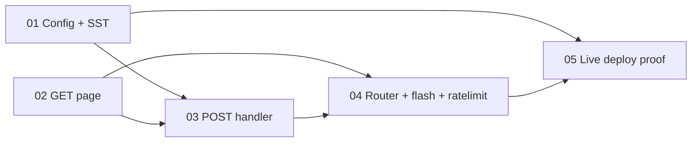

# Scopes — Spec 091 (Web Self-Registration, Invite-Token Gated)

**Spec:** [spec.md](spec.md) · **Design:** [design.md](design.md) · **Evidence:** [report.md](report.md) · **User acceptance:** [uservalidation.md](uservalidation.md)
**Workflow mode:** full-delivery · **Status ceiling:** done · **Layout:** single-file (5 scopes) · **Release train:** `mvp` · **Flags introduced:** none (Decision #3)

---

## Execution Outline

A short, reviewable map of the plan. Read this before the per-scope detail.

### Phase Order (sequential, DAG-gated)

1. **SCOPE-01 — Config + SST wiring for `WEB_REGISTRATION_INVITE_TOKEN`.** The dedicated, OPTIONAL managed secret + its 3-mirror SST contract + `AuthConfig`/`Dependencies` plumbing + the placeholder-leak guard. No HTTP behavior yet. Foundation for the POST gate.
2. **SCOPE-02 — `GET /register` page + template + assets.** The CSP-safe `register.html`/`register.js` + `HandleRegisterPage` + `registerPageData` + `registerTemplate` (parsed from the reused spec-057 `loginUIFS` embed). Renders the identical form regardless of gate config. The template the POST handler re-renders on error.
3. **SCOPE-03 — `POST /v1/web/register` handler (`HandleWebRegister`).** The security-critical control flow: constant-time invite gate FIRST → field/password/username validation → `UpsertPassword(create=true)` → 303 `/login?registered=1` (no cookie). Reuses SCOPE-01's config field + SCOPE-02's template.
4. **SCOPE-04 — Router wiring + `/login` success-flash + rate-limit.** Registers both new routes (GET public, POST inside `LimitByIP(20,1min)`, both outside `bearerAuthMiddleware`) and adds the additive `?registered=1` flash to the spec-057/070 `/login` page. Includes the spec-070 regression sweep.
5. **SCOPE-05 — Live home-lab deploy proof.** End-to-end success signal on the deployed core: `GET /register` renders → register with the real token → log in → `/cards`; wrong token rejected. Operator types the secret value into sops (value-safe); the agent runs the deploy + live e2e.

> **Refinement note (plan authority).** The task's suggested numbering listed the POST handler before the GET page, but the heading directed me to *"refine from design.md §Next Owner; keep dependency order."* design.md §Next Owner orders **GET page (2) before POST handler (3)** — the correct dependency order, because `web_register.go::renderRegisterError` re-renders `registerTemplate`/`registerPageData`, which live in `web_register_page.go` (design.md → Architecture file table). The POST handler cannot compile or have passing error-render tests until that template exists. I therefore set **SCOPE-02 = GET page, SCOPE-03 = POST handler**. The content of each scope is unchanged from the task's intent; only the two ordinals are swapped to honor the true DAG.
>
> **Resolved design open question (plan right-sizing).** design.md left one non-blocking item to the plan phase: whether to implement the un-substituted-placeholder guard (`config.IsPlaceholder → ""`) in the wiring scope or accept it as documented defense-in-depth. **Plan decision: implement it in SCOPE-01** (one line at the trust boundary + a focused unit test) — it closes a concrete open-admin-signup failure mode (a leaked public placeholder constant acting as a valid invite token).

### New Types & Signatures (the "header file" view)

```go
// SCOPE-01 — internal/config/config.go
type AuthConfig struct {
    // …existing fields…
    BootstrapToken             string
    WebRegistrationInviteToken string // NEW: OPTIONAL; empty ⇒ registration disabled; NOT in production authErrors
}
// loadAuthConfig: cfg.Auth.WebRegistrationInviteToken = os.Getenv("WEB_REGISTRATION_INVITE_TOKEN")

// SCOPE-01 — internal/config/secret_keys.go
var secretKeys = []string{ /* …, */ "CARD_REWARDS_GCAL_CREDENTIALS", "WEB_REGISTRATION_INVITE_TOKEN" }

// SCOPE-01 — internal/api/health.go
type Dependencies struct {
    // …existing fields incl. WebCredentials webcreds.Repo …
    WebRegistrationInviteToken string // NEW: empty ⇒ POST /v1/web/register disabled; constant-time compared; never logged
}

// SCOPE-02 — internal/api/web_register_page.go (new)
type registerPageData struct{ Next, Username, Error string } // NOTE: no token field — cannot leak gate state on GET
var registerTemplate = template.Must(template.ParseFS(loginUIFS, "admin_ui_static/register.html"))
func (d *Dependencies) HandleRegisterPage(w http.ResponseWriter, r *http.Request) // GET/HEAD /register

// SCOPE-03 — internal/api/web_register.go (new)
func (d *Dependencies) HandleWebRegister(w http.ResponseWriter, r *http.Request)            // POST /v1/web/register
func renderRegisterError(w http.ResponseWriter, r *http.Request, next, username, msg string, status int)

// SCOPE-04 — internal/api/web_login_page.go (additive)
type loginPageData struct { AuthEnabled bool; Next string; Error string; Registered bool /* NEW */ }

// SCOPE-04 — internal/api/router.go (additive)
//   GET  /register          → d.HandleRegisterPage   (public, OUTSIDE bearerAuthMiddleware)
//   POST /v1/web/register    → d.HandleWebRegister    (INSIDE httprate.LimitByIP(20, 1*time.Minute), OUTSIDE bearerAuthMiddleware)
```

New files: `internal/api/web_register_page.go`, `internal/api/web_register.go`, `internal/api/admin_ui_static/register.html`, `internal/api/admin_ui_static/register.js`.

**Exact error-string catalog (bound by spec.md / design.md — implement verbatim):**

| Trigger | Status | Banner string |
|---------|--------|---------------|
| Wrong / missing / empty-configured token, or `WebCredentials == nil` (SHARED, non-enumerating) | `401` | `Registration is not available or the invite is invalid.` |
| Required field empty | `400` | `All fields are required.` |
| `password != confirm-password` | `400` | `Passwords do not match.` |
| `len(password) < 12` | `400` | `Password must be at least 12 characters.` |
| `ValidateUsername` rejects | `400` | `Username must be 64 characters or fewer and contain no control characters.` |
| `UpsertPassword(create=true)` → `ErrUserExists` | `409` | `That username is taken.` |
| Unexpected error | `500` | `Something went wrong. Please try again.` |
| `/login?registered=1` success flash | `200` | `Account created — sign in.` |

### Validation Checkpoints (where breakage is caught before the next scope)

| After | Gate command(s) | Catches |
|-------|-----------------|---------|
| SCOPE-01 | `./smackerel.sh config generate` + `./smackerel.sh test unit --go` (secret-mirror + bundle-contract + loadAuthConfig + placeholder-guard) | Broken SST 3-mirror parity, missing home-lab placeholder, accidental production-required boot failure, `${VAR:-default}` introduction — before any handler code is written. |
| SCOPE-02 | `./smackerel.sh test unit --go --go-run 'TestRegisterPage'` | A non-CSP-safe or gate-state-leaking GET page — before the POST handler re-renders that template on error. |
| SCOPE-03 | `./smackerel.sh test unit --go --go-run 'TestWebRegister'` | Any break in the non-enumeration / constant-time / no-overwrite / no-cookie invariants — before the route is publicly reachable. |
| SCOPE-04 | `./smackerel.sh test unit --go --go-run 'TestWebRegister_RateLimit|TestLoginPage'` + spec-070 `/login` regression | Rate-limit-group drift, a `/login` regression, or an always-on success flash — before live deploy. |
| SCOPE-05 | live `./smackerel.sh test e2e` against the deployed core | The real-stack register→login→`/cards` success signal + wrong-token rejection. |

---

## Scope Summary & Dependency Graph

| # | Scope | Depends On | Surfaces | Status |
|---|-------|------------|----------|--------|
| 01 | Config + SST wiring for `WEB_REGISTRATION_INVITE_TOKEN` | — | Config, SST, Backend | Done |
| 02 | `GET /register` page + template + assets | — | Backend, UI (server-rendered) | Done |
| 03 | `POST /v1/web/register` handler (`HandleWebRegister`) | 01, 02 | Backend, Security | Done |
| 04 | Router wiring + `/login` success-flash + rate-limit | 02, 03 | Backend, UI (server-rendered) | Done |
| 05 | Live home-lab deploy proof (register → login → `/cards`) | 01, 04 | Deploy, UI (live e2e) | Not Started |

**Roots:** 01 and 02 are independent foundations (the GET page reuses the pre-existing spec-057 `loginUIFS` asset/serving foundation and, per Reconciled AC-5, never reads the gate config, so it does not depend on SCOPE-01). They are executed sequentially `01 → 02`. SCOPE-03 needs both (config field + template); SCOPE-04 needs both handlers; SCOPE-05 needs the secret (01) and the wired routes (04).



---

## DoD Evidence Standard (applies to every scope below)

- **No DoD box is pre-checked.** Every item starts `[ ]`. It is checked `[x]` ONLY by the implement/test phase after the command is actually run.
- **Each `[x]` item requires ≥10 lines of raw terminal output** captured at implement-time, recorded under the matching `report.md` anchor (or inline), with a `**Claim Source:**` tag (`executed` | `interpreted` | `not-run`).
- **Test Plan ↔ DoD parity is enforced:** in every scope the number of Test-Plan rows equals the number of test-related DoD items (the grouped *Build Quality Gate* and pure-implementation items are separate).
- **No internal mocks.** Unit tests drive the real handlers via `httptest` and use the established in-memory `fakeRepo` test double (the spec-070 pattern in [web_login_credential_test.go](../../internal/api/web_login_credential_test.go)), with real argon2id hashing. The `fakeRepo` is a sanctioned `webcreds.Repo` test double, NOT an internal mock of business logic.
- **Live-stack authenticity (SCOPE-05):** `integration`/`e2e` rows MUST hit the real running stack — no `page.route`/`context.route`/`intercept`/`msw`/`nock`. Reclassify any intercepting test out of the live category.
- **Value-safe throughout:** the invite-token value and any password value never appear in evidence, logs, error bodies, redirects, or template output (AC-10). Operator secret entry is typed into a protected terminal / sops; the agent never sees it.

---

## SCOPE-01 — Config + SST wiring for `WEB_REGISTRATION_INVITE_TOKEN`

**Status:** Done
**Depends On:** —
**Surfaces:** Config (`config/smackerel.yaml`), SST (`secret_keys.go`, `config.sh`), Backend (`config.go`, `health.go`, `wiring.go`)

Introduce the dedicated, **OPTIONAL** managed secret `WEB_REGISTRATION_INVITE_TOKEN` (Decision #1) through the full SST 3-mirror + placeholder-emission + config-load + `Dependencies` wiring, plus the un-substituted-placeholder leak guard. No HTTP behavior changes in this scope.

### Gherkin Scenarios

```gherkin
Scenario: SST manifest carries the new optional secret and config generation succeeds
  Given WEB_REGISTRATION_INVITE_TOKEN is registered in all three SST mirrors
    (config/smackerel.yaml secret_keys, internal/config/secret_keys.go, scripts/commands/config.sh)
  When ./smackerel.sh config generate runs for the home-lab target
  Then config generation succeeds
  And the home-lab bundle's app.env emits WEB_REGISTRATION_INVITE_TOKEN=__SECRET_PLACEHOLDER__WEB_REGISTRATION_INVITE_TOKEN__

Scenario: The token loads from the environment as OPTIONAL (empty default, boot never fails)
  Given WEB_REGISTRATION_INVITE_TOKEN is unset
  When loadAuthConfig runs — including with SMACKEREL_ENV=production and auth.enabled=true
  Then cfg.Auth.WebRegistrationInviteToken == ""
  And boot does NOT fail (the key is OPTIONAL — it is NOT appended to the production authErrors block)

Scenario: An un-substituted bundle placeholder is mapped to empty (disabled), never open signup
  Given the wiring boundary receives the literal __SECRET_PLACEHOLDER__WEB_REGISTRATION_INVITE_TOKEN__
    (a publicly-known constant — e.g. a missed knb substitution)
  When deps.WebRegistrationInviteToken is set in cmd/core/wiring.go
  Then config.IsPlaceholder maps it to "" so POST registration is disabled
  And the public placeholder constant can never act as a valid invite token
```

### Implementation Plan

Edit the **11 exact sites enumerated in design.md → Configuration & SST Secret Wiring** (append every ordered-list entry AFTER `CARD_REWARDS_GCAL_CREDENTIALS` to keep byte-for-byte order parity simple):

1. [config/smackerel.yaml](../../config/smackerel.yaml) `infrastructure.secret_keys:` (~L1702-1718) → append `- WEB_REGISTRATION_INVITE_TOKEN` + doc comment (spec 091; OPTIONAL — empty ⇒ registration disabled; read by core `HandleWebRegister`; never logged).
2. [config/smackerel.yaml](../../config/smackerel.yaml) `auth:` block, after `bootstrap_token: ""` (~L829) → add `web_registration_invite_token: ""` (dev/test default empty = registration off locally).
3. [internal/config/secret_keys.go](../../internal/config/secret_keys.go) `var secretKeys` (~L28-46) → append `"WEB_REGISTRATION_INVITE_TOKEN",` + comment.
4. [scripts/commands/config.sh](../../scripts/commands/config.sh) `SHELL_SECRET_KEYS=( … )` (~L382-390) → append `WEB_REGISTRATION_INVITE_TOKEN`.
5. [scripts/commands/config.sh](../../scripts/commands/config.sh) placeholder-emission block (mirror the `AUTH_BOOTSTRAP_TOKEN` block ~L1319-1322) → emit `__SECRET_PLACEHOLDER__WEB_REGISTRATION_INVITE_TOKEN__` for production-class targets, else `yaml_get auth.web_registration_invite_token` (NO `${VAR:-default}` form — smackerel-no-defaults).
6. [scripts/commands/config.sh](../../scripts/commands/config.sh) `app.env` heredoc (mirror `AUTH_BOOTSTRAP_TOKEN=${AUTH_BOOTSTRAP_TOKEN}` ~L2096) → add `WEB_REGISTRATION_INVITE_TOKEN=${WEB_REGISTRATION_INVITE_TOKEN}`.
7. [internal/config/secret_keys_test.go](../../internal/config/secret_keys_test.go) `TestSecretKeysMirror` `want` (~L103-111) → append `"WEB_REGISTRATION_INVITE_TOKEN",`.
8. [internal/config/config.go](../../internal/config/config.go) `AuthConfig` (~L461-523), after `BootstrapToken string` → add `WebRegistrationInviteToken string` + doc comment (OPTIONAL; empty ⇒ disabled).
9. [internal/config/config.go](../../internal/config/config.go) `loadAuthConfig` (~L1520, after the `AUTH_BOOTSTRAP_TOKEN` read) → add `cfg.Auth.WebRegistrationInviteToken = os.Getenv("WEB_REGISTRATION_INVITE_TOKEN")`. **Do NOT add it to the production `authErrors` block (~L1590-1620).**
10. [internal/api/health.go](../../internal/api/health.go) `Dependencies` (near `WebCredentials` L173) → add `WebRegistrationInviteToken string` + doc comment.
11. [cmd/core/wiring.go](../../cmd/core/wiring.go) (near `deps.WebCredentials = webCredsRepo`, ~L422) → set `deps.WebRegistrationInviteToken` from `cfg.Auth.WebRegistrationInviteToken`, applying the placeholder-leak guard: `if config.IsPlaceholder(tok) { tok = "" }`.

> `TestSecretKeys_MirrorsYAMLManifest` and `bundle_secret_contract_test.go` read `config.SecretKeys()` dynamically — they need no edit and will pass once #1/#3/#4 land and #5/#6 emit the placeholder.

**Shared-infrastructure note:** the SST 3-mirror is a shared contract. This is an **append-only additive** change (no rename/removal), and the `bundle_secret_contract_test.go` byte-parity assertion is the canary that proves the three mirrors still agree and that home-lab emits the placeholder. No consumer-impact sweep is required (nothing renamed/removed).

### Test Plan

| # | Test Type | Category | File/Location | Description | Command | Live System |
|---|-----------|----------|---------------|-------------|---------|-------------|
| 1 | unit | unit | `internal/config/secret_keys_test.go` | `TestSecretKeysMirror` + `TestSecretKeys_MirrorsYAMLManifest` pass with the new key appended to all mirrors | `./smackerel.sh test unit --go --go-run 'TestSecretKeys'` | No |
| 2 | unit | unit | `internal/deploy/bundle_secret_contract_test.go` | 3-mirror byte-parity holds AND the home-lab bundle emits the `__SECRET_PLACEHOLDER__WEB_REGISTRATION_INVITE_TOKEN__` line | `./smackerel.sh test unit --go --go-run 'Bundle.*Secret|BundleSecret'` | No |
| 3 | unit | unit | `internal/config/config_test.go` | `loadAuthConfig` sets `WebRegistrationInviteToken` from env; empty when unset; production+auth.enabled with empty token does NOT add an `authErrors` entry (boot succeeds) | `./smackerel.sh test unit --go --go-run 'LoadAuthConfig|AuthConfig'` | No |
| 4 | unit | unit | `internal/config/secret_keys_test.go` (placeholder-guard case) | a placeholder-valued invite token resolves to `""` (disabled) via `config.IsPlaceholder` — the open-signup-via-leaked-constant trap is closed | `./smackerel.sh test unit --go --go-run 'IsPlaceholder|Placeholder'` | No |
| 5 | functional | functional | `scripts/commands/config.sh` (home-lab generate) | `./smackerel.sh config generate` succeeds; generated home-lab `app.env` contains the placeholder line | `./smackerel.sh config generate` | Optional |

### Definition of Done — Tiered Validation

**Core Items**

- [x] All 11 SST/loader/wiring edit sites land exactly per design.md (the dedicated OPTIONAL secret is registered in the 3 mirrors, loaded in `loadAuthConfig`, NOT in the production `authErrors` block, wired into `Dependencies`, and guarded by `config.IsPlaceholder` at the wiring boundary). — Evidence: [report.md#scope-01-impl]. **Claim Source:** executed.
- [x] **(test 1)** `TestSecretKeysMirror` + `TestSecretKeys_MirrorsYAMLManifest` pass with the new key (≥10 lines raw). — Evidence: [report.md#scope-01-secret-mirror].
- [x] **(test 2)** `bundle_secret_contract_test.go` passes — 3-mirror parity + home-lab placeholder emission (≥10 lines raw). — Evidence: [report.md#scope-01-bundle-contract].
- [x] **(test 3)** `loadAuthConfig` optional-load test passes — env→field, empty default, production boot does NOT fail on empty token (≥10 lines raw). — Evidence: [report.md#scope-01-loadauthconfig].
- [x] **(test 4)** placeholder-leak guard test passes — `IsPlaceholder` maps the bundle placeholder to `""` (≥10 lines raw). — Evidence: [report.md#scope-01-placeholder-guard].
- [x] **(test 5)** `./smackerel.sh config generate` succeeds and the home-lab `app.env` emits the `WEB_REGISTRATION_INVITE_TOKEN=__SECRET_PLACEHOLDER__…__` line (≥10 lines raw). — Evidence: [report.md#scope-01-config-generate].

**Build Quality Gate (grouped)**

- [x] Build Quality Gate passes as one block: `./smackerel.sh check` + `./smackerel.sh lint` + `./smackerel.sh format --check` exit 0; **no `${VAR:-default}` fallback introduced** (smackerel-no-defaults SST); `bash .github/bubbles/scripts/artifact-lint.sh specs/091-web-self-registration-invite-gated` exits 0; zero warnings; zero deferrals. — Evidence: [report.md#scope-01-build-gate].

---

## SCOPE-02 — `GET /register` page + template + assets

**Status:** Done
**Depends On:** —
**Surfaces:** Backend (`web_register_page.go`, `web_login_page.go` embed), UI (server-rendered `register.html`/`register.js`)

Build the `GET /register` surface mirroring the spec-057 `/login` GET page. The page renders the **identical** CSP-safe form regardless of gate configuration (Reconciled AC-5), so it structurally cannot leak gate state. The route itself is wired in SCOPE-04; this scope delivers the handler + template + assets, unit-tested by driving `HandleRegisterPage` directly.

### Gherkin Scenarios

```gherkin
Scenario: GET /register renders the canonical CSP-safe form
  Given the register page handler is implemented
  When a browser issues GET /register
  Then a 200 text/html response renders a form with exactly the fields
    username, password, confirm-password, invite-token, plus a hidden sanitized next,
    a single "Create account" submit, and an "Already have an account? Sign in" link to /login
  And the response carries Cache-Control: no-store and X-Content-Type-Options: nosniff
  And there are no inline scripts and no inline event handlers (CSP script-src 'self')

Scenario: GET /register renders the identical form regardless of gate configuration
  Given registerPageData has no invite-token field and the handler never reads the gate config
  When /register is rendered whether the invite token is configured or empty
  Then the rendered form is byte-identical (there is no "registration unavailable" variant)
  And the gate state is not observable from GET (preserves AC-10 non-enumeration)

Scenario: A hostile ?next is sanitized into the hidden field
  Given GET /register?next=//evil/
  When the page renders
  Then the hidden next value is sanitizeNext-sanitized and cannot escape the origin
```

### UI Scenario Matrix

| Scenario | Preconditions | Steps | Expected (user-visible) | Test Type |
|----------|---------------|-------|-------------------------|-----------|
| Canonical form render | Handler wired | GET `/register` | `<h1>Create account</h1>`; 4 labelled inputs; masked `invite-token`; "Create account" button; "Sign in" link | unit (httptest, HTML assert) |
| Identical disabled-vs-enabled render | — | Render with token set vs empty | Byte-identical HTML (no "unavailable" copy) | unit |
| Safe `?next` | — | GET `/register?next=//evil/` | Hidden `next` sanitized | unit |

### Implementation Plan

- **New** [internal/api/web_register_page.go](../../internal/api/web_register_page.go): `HandleRegisterPage` (GET + HEAD short-circuit), `registerPageData{Next, Username, Error}` (no token field), `registerTemplate = template.Must(template.ParseFS(loginUIFS, "admin_ui_static/register.html"))`, the header trio (`Content-Type: text/html; charset=utf-8`, `Cache-Control: no-store`, `X-Content-Type-Options: nosniff`), and `sanitizeNext` on `?next=`. Mirror [web_login_page.go](../../internal/api/web_login_page.go) `HandleLoginPage`.
- **New** [internal/api/admin_ui_static/register.html](../../internal/api/admin_ui_static/register.html): CSP-safe template per the spec.md UX wireframe — `<main>/<h1>Create account</h1>`, `role="alert"` error banner, `<label>`-wrapped `username` (`type=text autocomplete=username`), `password` + `confirm-password` (`type=password autocomplete=new-password`), `invite-token` (`type=password autocomplete=off`), hidden `next`, one `<button type="submit">`, `/login` cross-link. Reuses `login.css`.
- **New** [internal/api/admin_ui_static/register.js](../../internal/api/admin_ui_static/register.js): focus-only progressive enhancement (focus the username field on load). No validation logic. CSP `script-src 'self'`.
- **Modify** [internal/api/web_login_page.go](../../internal/api/web_login_page.go) `//go:embed` directive → include `admin_ui_static/register.html` + `admin_ui_static/register.js` in `loginUIFS` so the existing `/admin_ui_static/*` file server serves `register.js` (+ reused `login.css`) and `register.html` is parseable. **No new router asset route.**

**Foundation reuse (DE4):** the shared asset/serving foundation (the `loginUIFS` embed, the `/admin_ui_static/*` file server, the header trio + CSP discipline, `login.css`, `sanitizeNext`, the embedded-`html/template` GET-page pattern) **pre-exists from spec 057** — `/register` is a *second consumer*, not a new abstraction. No new foundation scope is created.

### Test Plan

| # | Test Type | Category | File/Location | Description | Command | Live System |
|---|-----------|----------|---------------|-------------|---------|-------------|
| 1 | unit | unit | `internal/api/web_register_page_test.go` | `GET /register` → 200; form has all 4 fields + hidden next + submit + `/login` link; header trio set | `./smackerel.sh test unit --go --go-run 'TestRegisterPage_RendersForm'` | No |
| 2 | unit | unit | `internal/api/web_register_page_test.go` | GET render is byte-identical with the invite token configured vs empty (no "unavailable" variant) — Reconciled AC-5 / AC-10 | `./smackerel.sh test unit --go --go-run 'TestRegisterPage_IdenticalForm'` | No |
| 3 | unit | unit | `internal/api/web_register_page_test.go` | `?next=//evil/` → hidden `next` is `sanitizeNext`-sanitized (no origin escape) | `./smackerel.sh test unit --go --go-run 'TestRegisterPage_NextSanitized'` | No |
| 4 | unit | unit | `internal/api/web_register_page_test.go` | CSP compliance — no inline scripts / no inline handlers; assets are same-origin `/admin_ui_static/*` (register.js + login.css) | `./smackerel.sh test unit --go --go-run 'TestRegisterPage_CSPCompliant'` | No |
| 5 | unit | unit | `internal/api/web_register_page_test.go` | `HEAD /register` → 200 with empty body (short-circuit, mirrors login page) | `./smackerel.sh test unit --go --go-run 'TestRegisterPage_HEAD'` | No |

### Definition of Done — Tiered Validation

**Core Items**

- [x] `register.html` + `register.js` + `HandleRegisterPage` + `registerPageData` + `registerTemplate` land and the `loginUIFS` embed is extended to include them (no new router asset route). — Evidence: [report.md#scope-02-impl]. **Claim Source:** executed.
- [x] **(test 1)** GET renders the canonical form with all four fields + header trio (≥10 lines raw). — Evidence: [report.md#scope-02-renders].
- [x] **(test 2)** GET render is byte-identical regardless of gate config — non-enumeration (≥10 lines raw). — Evidence: [report.md#scope-02-identical].
- [x] **(test 3)** `?next` sanitization test passes (≥10 lines raw). — Evidence: [report.md#scope-02-next].
- [x] **(test 4)** CSP-compliance test passes — no inline scripts/handlers (≥10 lines raw). — Evidence: [report.md#scope-02-csp].
- [x] **(test 5)** `HEAD /register` short-circuit test passes (≥10 lines raw). — Evidence: [report.md#scope-02-head].

**Build Quality Gate (grouped)**

- [x] Build Quality Gate passes as one block: `./smackerel.sh check` + `lint` + `format --check` exit 0; `register.html` carries no inline scripts/handlers; artifact-lint exits 0; zero warnings; zero deferrals. — Evidence: [report.md#scope-02-build-gate].

---

## SCOPE-03 — `POST /v1/web/register` handler (`HandleWebRegister`)

**Status:** Done
**Depends On:** 01, 02
**Surfaces:** Backend (`web_register.go`), Security

Implement the security-critical registration intake handler. The control flow is **exactly** design.md → POST Handler Control Flow: **invite-token gate FIRST** (constant-time, value-safe, with the explicit empty-configured guard that prevents the empty-matches-empty open-signup trap), then field/password/username validation, then `UpsertPassword(create=true)`, then `303 → /login?registered=1` with **no cookie**. Reuses SCOPE-01's `deps.WebRegistrationInviteToken` and SCOPE-02's `registerTemplate`/`registerPageData`. Drives the handler directly with the `fakeRepo` double + real argon2id.

> **Scope-size rationale:** this scope intentionally carries the UC-2…UC-5 scenarios together because they are the branches of a *single* handler whose non-enumeration invariant (the shared tokenless `401` is byte-identical across wrong/missing/empty/`nil`) only holds when the whole control flow is implemented and tested as one unit. Splitting it would fragment the security contract.

### Gherkin Scenarios

```gherkin
Scenario: UC-1 Valid invite + new username + matching passwords creates an account (no cookie)
  Given the invite token is configured non-empty and no row exists for "operator2"
  When the operator POSTs /v1/web/register with the correct token, "operator2", and two matching ≥12-char passwords
  Then a web_user_credentials row is created for "operator2" with an argon2id hash
  And the response is 303 to /login?registered=1 with NO Set-Cookie
  And the same valid token still works for a second, distinct registration (not consumed)

Scenario: UC-2/UC-3 Wrong, missing, empty-configured token, or nil store are rejected identically with no row
  Given a registration POST whose invite token is wrong, absent, empty-configured, or the store is nil
  When HandleWebRegister evaluates the invite-token gate FIRST (constant-time)
  Then it returns 401 with the shared banner "Registration is not available or the invite is invalid."
  And no row is created, the responses are byte-identical, and username/password are never evaluated

Scenario: UC-4 Duplicate username is rejected without overwriting the existing hash
  Given a row already exists for "operator" and the token is configured non-empty
  When the operator POSTs the correct token, "operator", and matching passwords
  Then the response is 409 "That username is taken." and the existing hash is unchanged (create=true)

Scenario: UC-5 Field-level validation (token valid) returns the exact catalog string with no row
  Given the token is valid
  When passwords mismatch, or the password is < 12 chars, or a field is empty, or the username is invalid
  Then the response is 400 with the matching exact banner and no row is created

Scenario: AC-10 Non-enumeration / value-safe
  Given a wrong-token request and a disabled-gate request
  Then their status and bodies are byte-identical and the invite token never appears in the body, headers, or Location
  And the value-safe reject log line contains no invite value, no username value, and no password
```

### Implementation Plan

- **New** [internal/api/web_register.go](../../internal/api/web_register.go) — `HandleWebRegister` implementing design.md's 7-step order verbatim:
  1. **Method guard** — non-`POST` → `405`.
  2. **Content-type + parse** — `isFormContentType`; `r.Body = http.MaxBytesReader(w, r.Body, 64*1024)`; `defer r.Body.Close()`; `r.ParseForm()` (error → `500` generic). Read `next`, `invite-token`.
  3. **Invite-token gate FIRST (constant-time, value-safe).** If `d.WebCredentials == nil` **or** `configured == ""` → shared `401`, **STOP** (plain server-constant comparison — closes the empty-matches-empty open-signup trap). Else `subtle.ConstantTimeCompare([]byte(invite), []byte(configured)) != 1` → shared `401`, **STOP**. Wrong-token and disabled responses are byte-identical; the invite value is never logged/echoed/redirected.
  4. **Field presence** (reached only past a valid token) → else `400` `All fields are required.`
  5. **Password rules** — `password != confirm` → `400` `Passwords do not match.`; `len(password) < webcreds.MinPasswordLength` (12) → `400` `Password must be at least 12 characters.`
  6. **Username validity** — `webcreds.ValidateUsername` non-nil → `400` `Username must be 64 characters or fewer and contain no control characters.`
  7. **Create** — `d.WebCredentials.UpsertPassword(ctx, username, password, true)`: `ErrUserExists` → `409` `That username is taken.` (no overwrite); other error → `500` `Something went wrong. Please try again.`; `nil` → `303` `/login?registered=1` (+ sanitized `next`), **no cookie**.
- `renderRegisterError(w, r, next, username, msg, status)` re-renders `register.html` with `registerPageData{Next, Username, Error}`; **`username` echoed (auto-escaped); `password`/`confirm-password`/`invite-token` ALWAYS blank** (secret-preservation invariant; on the shared-token reject the preserved username is blank).
- Value-safe `slog` reject line (mirror spec-070 `web_login_credential_fail`): `kind=web_register_fail`, `remote_addr`, `username_len` (length only), `reason` enum (`gate`|`field`|`duplicate`|`server`) — never the invite token, username value, or password.

### Test Plan

All rows drive `HandleWebRegister` directly with the `fakeRepo` double + real argon2id (no internal mocks), mirroring [web_login_credential_test.go](../../internal/api/web_login_credential_test.go). New file: `internal/api/web_register_test.go`.

| # | Test Type | Category | File/Location | Description | Command | Live System |
|---|-----------|----------|---------------|-------------|---------|-------------|
| 1 | unit | unit | `internal/api/web_register_test.go` | Success + repeatable: valid token + new user → 303 `/login?registered=1`, **NO `Set-Cookie`**, row created; a second distinct user also succeeds (invite not consumed) | `./smackerel.sh test unit --go --go-run 'TestWebRegister_Success'` | No |
| 2 | unit | unit | `internal/api/web_register_test.go` | Invite gate (tokenless): wrong, missing, empty-configured, and `WebCredentials==nil` all → 401 shared banner, no row, byte-identical, no panic | `./smackerel.sh test unit --go --go-run 'TestWebRegister_Gate'` | No |
| 3 | unit | unit | `internal/api/web_register_test.go` | Duplicate username → 409 `That username is taken.`; existing hash unchanged (`create=true` no-overwrite) | `./smackerel.sh test unit --go --go-run 'TestWebRegister_Duplicate'` | No |
| 4 | unit | unit | `internal/api/web_register_test.go` | Field-validation matrix (token valid): mismatch / too-short / missing-field / invalid-username → 400 with the exact catalog string, no row | `./smackerel.sh test unit --go --go-run 'TestWebRegister_FieldValidation'` | No |
| 5 | unit | unit | `internal/api/web_register_test.go` | Non-enumeration / constant-time: wrong-token vs disabled responses are byte-identical (status + body); invite token absent from body, headers, and `Location` | `./smackerel.sh test unit --go --go-run 'TestWebRegister_NonEnumeration'` | No |
| 6 | unit | unit | `internal/api/web_register_test.go` | Value-safe logging: the captured reject `slog` line contains no invite value, no username value, no password (reason enum only) | `./smackerel.sh test unit --go --go-run 'TestWebRegister_ValueSafeLog'` | No |
| 7 | unit | unit | `internal/api/web_register_test.go` | Method guard: a non-`POST` (GET) request → 405 | `./smackerel.sh test unit --go --go-run 'TestWebRegister_MethodGuard'` | No |

### Definition of Done — Tiered Validation

**Core Items**

- [x] `HandleWebRegister` + `renderRegisterError` land implementing design.md's exact 7-step order (gate FIRST, value-safe, no-overwrite, no cookie on success, secret-preserving re-render). — Evidence: [report.md#scope-03-impl]. **Claim Source:** executed.
- [x] **(test 1)** Success + repeatable test passes — 303 `/login?registered=1`, no cookie, row created, second user succeeds (≥10 lines raw). — Evidence: [report.md#scope-03-success].
- [x] **(test 2)** Invite-gate test passes — wrong/missing/empty/nil all 401 shared banner, no row, byte-identical (≥10 lines raw). — Evidence: [report.md#scope-03-gate].
- [x] **(test 3)** Duplicate-username test passes — 409, existing hash unchanged (≥10 lines raw). — Evidence: [report.md#scope-03-duplicate].
- [x] **(test 4)** Field-validation matrix passes — exact catalog strings, no row (≥10 lines raw). — Evidence: [report.md#scope-03-fields].
- [x] **(test 5)** Non-enumeration / constant-time test passes — byte-identical, token absent from body/headers/Location (≥10 lines raw). — Evidence: [report.md#scope-03-nonenum].
- [x] **(test 6)** Value-safe logging test passes — no secret/username/password in the reject log (≥10 lines raw). — Evidence: [report.md#scope-03-log].
- [x] **(test 7)** Method-guard test passes — GET → 405 (≥10 lines raw). — Evidence: [report.md#scope-03-method].

**Build Quality Gate (grouped)**

- [x] Build Quality Gate passes as one block: `./smackerel.sh check` + `lint` + `format --check` exit 0; constant-time compare via `subtle.ConstantTimeCompare`; no invite/password value in any log/redirect/template; artifact-lint exits 0; zero warnings; zero deferrals. — Evidence: [report.md#scope-03-build-gate].

---

## SCOPE-04 — Router wiring + `/login` success-flash + rate-limit

**Status:** Done
**Depends On:** 02, 03
**Surfaces:** Backend (`router.go`, `web_login_page.go`), UI (server-rendered `login.html`/`login.css`)

Register both new routes in `NewRouter` (GET public, POST inside the existing `httprate.LimitByIP(20, 1*time.Minute)` group, both OUTSIDE `bearerAuthMiddleware`) and add the additive `?registered=1` success flash to the spec-057/070 `/login` page. Includes the spec-070 `/login` regression sweep (AC-9).

### Gherkin Scenarios

```gherkin
Scenario: UC-8 Both routes are wired correctly and the register POST is rate-limited per IP
  Given NewRouter registers GET /register (public) and POST /v1/web/register inside LimitByIP(20, 1*time.Minute), both outside bearerAuthMiddleware
  When a single source IP POSTs /v1/web/register more than 20 times within the window
  Then a 429 is observed (the limiter fires)
  And distinct IPs are not collectively throttled (rules out a tautological "everything 429s")

Scenario: UC-1 landing The /login page renders the success flash on ?registered=1
  Given the operator was redirected to /login?registered=1 after registering
  When GET /login?registered=1 renders
  Then "Account created — sign in." appears in a banner-success element with role="status"

Scenario: UC-7 REGRESSION The existing /login paths are byte-identical without ?registered=1
  Given the spec-070 token-form and username/password login paths
  When GET /login (no query) renders AND the existing login POSTs run
  Then the render is byte-identical to pre-091 (the success banner is ABSENT)
  And token-only → cookie set, username+password → cookie set, invalid → the same generic error (no change to status/redirect/cookie semantics)
```

### UI Scenario Matrix

| Scenario | Preconditions | Steps | Expected (user-visible) | Test Type |
|----------|---------------|-------|-------------------------|-----------|
| Success flash shown | — | GET `/login?registered=1` | `Account created — sign in.` banner (`banner-success`, `role="status"`) above the form | unit (httptest, HTML assert) |
| Flash absent (regression) | — | GET `/login` (no query) | Byte-identical to pre-091; **no** success banner | unit (adversarial) |

### Implementation Plan

- **Modify** [internal/api/router.go](../../internal/api/router.go) (~L325-336) → register `GET /register` (public) + `POST /v1/web/register` (inside the `httprate.LimitByIP(20, 1*time.Minute)` group), mirroring the `/login` + `/v1/web/login` block; both OUTSIDE `bearerAuthMiddleware`.
- **Modify (additive)** [internal/api/web_login_page.go](../../internal/api/web_login_page.go) → `loginPageData` gains `Registered bool`; `HandleLoginPage` sets `Registered = r.URL.Query().Get("registered") == "1"`.
- **Modify (additive)** [internal/api/admin_ui_static/login.html](../../internal/api/admin_ui_static/login.html) → render `Account created — sign in.` (`class="banner banner-success"`, `role="status"`) above the form when `.Registered`.
- **Modify (additive)** [internal/api/admin_ui_static/login.css](../../internal/api/admin_ui_static/login.css) → add a `.banner-success` palette (WCAG-AA contrast).

**Consumer / shared-surface sweep:** the `/login` change is **additive only** (a new query-gated banner branch); no existing `/login` behavior, route, or cookie semantics change. The AC-9 regression rows (Test rows 3 + 4) ARE the consumer sweep — they prove the spec-070 `/login` token-form + credential paths are byte-identical and the flash is absent without `?registered=1`. **Adversarial-fidelity note** (verified out-of-band by the implementer, mirroring the spec-070 ratelimit method): temporarily registering `/v1/web/register` OUTSIDE `LimitByIP` makes Test row 1 FAIL; restoring it turns it GREEN — proving the rate-limit test has bite.

### Test Plan

| # | Test Type | Category | File/Location | Description | Command | Live System |
|---|-----------|----------|---------------|-------------|---------|-------------|
| 1 | unit | unit | `internal/api/web_register_ratelimit_test.go` | `POST /v1/web/register` > 20/min from one IP through the real `NewRouter` → a 429 is observed; per-IP isolation companion (distinct IPs not collectively throttled) | `./smackerel.sh test unit --go --go-run 'TestWebRegister_RateLimit'` | No |
| 2 | unit | unit | `internal/api/web_login_page_test.go` | `GET /login?registered=1` renders `Account created — sign in.` (`banner-success`, `role="status"`) | `./smackerel.sh test unit --go --go-run 'TestLoginPage_RegisteredFlash'` | No |
| 3 | unit | unit | `internal/api/web_login_page_test.go` | REGRESSION (adversarial): `GET /login` (no query) is byte-identical to pre-091 and the success banner is ABSENT | `./smackerel.sh test unit --go --go-run 'TestLoginPage_NoFlashWithoutQuery'` | No |
| 4 | regression | unit | `internal/api/web_login_credential_test.go` + `internal/api/web_login_test.go` | Spec-070 `/login` unchanged: token-only → cookie; username+password → cookie; invalid → same generic error; no status/redirect/cookie change | `./smackerel.sh test unit --go --go-run 'TestWebLogin'` | No |

### Definition of Done — Tiered Validation

**Core Items**

- [x] Both routes are registered in `NewRouter` (GET public, POST inside `LimitByIP(20,1min)`, both outside `bearerAuthMiddleware`) and the additive `/login` `?registered=1` flash (template + css + `loginPageData.Registered`) lands. — Evidence: [report.md#scope-04-impl]. **Claim Source:** executed.
- [x] **(test 1)** Rate-limit membership test passes — >20/min → 429 with per-IP isolation companion (≥10 lines raw). — Evidence: [report.md#scope-04-ratelimit].
- [x] **(test 2)** `/login?registered=1` success-flash test passes (≥10 lines raw). — Evidence: [report.md#scope-04-flash].
- [x] **(test 3)** Adversarial regression test passes — no-query `/login` byte-identical, flash ABSENT (≥10 lines raw). — Evidence: [report.md#scope-04-noflash].
- [x] **(test 4)** Spec-070 `/login` regression suite passes unchanged (≥10 lines raw). — Evidence: [report.md#scope-04-login-regression].

**Build Quality Gate (grouped)**

- [x] Build Quality Gate passes as one block: `./smackerel.sh check` + `lint` + `format --check` exit 0; `.banner-success` meets WCAG-AA; AC-9 regression preserved; artifact-lint exits 0; zero warnings; zero deferrals. — Evidence: [report.md#scope-04-build-gate].

---

## SCOPE-05 — Live home-lab deploy proof (register → login → `/cards`)

**Status:** Not Started
**Depends On:** 01, 04
**Surfaces:** Deploy (knb adapter — separate repo), UI (live browser e2e)

Prove the full feature end-to-end on the deployed home-lab core. The knb-side secret wiring is a **separate `<knb-repo>` commit** (named in design.md → knb Deploy Wiring, NOT executed in this repo). The operator types the `WEB_REGISTRATION_INVITE_TOKEN` value into sops in a protected terminal (value-safe — the agent never sees it); the agent runs the build/deploy + the live e2e. The DoD is the captured live success signal in `report.md`.

### Gherkin Scenarios

```gherkin
Scenario: The deployed /register page renders on the live core
  Given the new image is deployed to home-lab with a non-empty WEB_REGISTRATION_INVITE_TOKEN
  When a browser opens https://<deploy-host>.<tailnet-fqdn>/register
  Then the register form renders (200) with the four fields

Scenario: UC-1 + UC-6 Register with the real token, then log in and reach /cards
  Given the deployed core has the real invite token configured
  When the operator submits /register with the correct token, a new username, and matching passwords
  Then the account is created and the browser lands on /login?registered=1 with the success flash
  And logging in with that username + password sets the session cookie and /cards loads

Scenario: UC-2 A wrong token is rejected on the live core with no row
  Given the deployed core
  When a browser submits /register with a wrong invite token
  Then the response is the shared 401 banner and no web_user_credentials row is created
```

### UI Scenario Matrix

| Scenario | Preconditions | Steps | Expected (user-visible) | Test Type |
|----------|---------------|-------|-------------------------|-----------|
| Live register page | Deployed core, token configured | Open `/register` | Form renders, four fields | e2e (live) |
| Live happy path | Deployed core | Register (real token) → `/login?registered=1` → sign in | Success flash; `/cards` loads for the new session | e2e (live) |
| Live wrong-token | Deployed core | Register with a wrong token | Shared 401 banner; no row | e2e (live) |

### Implementation Plan

- **knb-side (separate `<knb-repo>` commit — named, NOT executed here):** sops-encrypt `WEB_REGISTRATION_INVITE_TOKEN` into `<knb-repo>/smackerel/secrets/home-lab.enc.env` (operator types the value — value-safe); add it to the adapter's `apply.sh` drift-check + the `__SECRET_PLACEHOLDER__WEB_REGISTRATION_INVITE_TOKEN__` substitution mapping (mirror `CARD_REWARDS_GCAL_CREDENTIALS`).
- **Build/CI:** the SCOPE-01..04 commit produces a green build → signed core+ml images + the home-lab config bundle.
- **Deploy (agent-executable):** apply via `sudo bash <knb-repo>/smackerel/home-lab/apply.sh --trust-model=ci-keyless …` (mirroring spec 089), then `./smackerel.sh deploy-target home-lab verify`.
- **Live e2e (agent-executable, no interception):** `GET /register` renders → register with the real token → land on `/login?registered=1` → log in → reach `/cards`; a wrong-token run → shared 401 + no row. Use `./smackerel.sh test e2e` against the deployed core; MUST NOT use `page.route`/`context.route`/`intercept`/`msw`/`nock` (live-stack authenticity).

### Test Plan

| # | Test Type | Category | File/Location | Description | Command | Live System |
|---|-----------|----------|---------------|-------------|---------|-------------|
| 1 | e2e | e2e-ui | `tests/e2e/web_register_*` | Live `GET /register` renders on the deployed core (200, four fields), no interception | `./smackerel.sh test e2e` | Yes |
| 2 | e2e | e2e-ui | `tests/e2e/web_register_*` | Live happy path: register (real token) → `/login?registered=1` → sign in → `/cards` loads | `./smackerel.sh test e2e` | Yes |
| 3 | e2e | e2e-ui | `tests/e2e/web_register_*` | Live wrong-token: POST a wrong token → shared 401 banner, no `web_user_credentials` row created | `./smackerel.sh test e2e` | Yes |

### Definition of Done — Tiered Validation

**Core Items**

- [ ] **Operator-gated (acceptance):** the `WEB_REGISTRATION_INVITE_TOKEN` value is typed into sops in a protected terminal and the knb `<knb-repo>` adapter commit (drift-check + substitution) is in place — value-safe, the agent never sees the secret. — Acceptance recorded in [report.md#scope-05-operator-secret]. **Claim Source:** _operator-action_.
- [ ] Build is green for the SCOPE-01..04 commit and the signed images + home-lab bundle publish; `apply.sh --trust-model=ci-keyless` applies and `deploy-target home-lab verify` is OK. — Evidence: [report.md#scope-05-deploy].
- [ ] **(test 1)** Live `GET /register` renders on the deployed core (≥10 lines raw, no interception). — Evidence: [report.md#scope-05-e2e-page].
- [ ] **(test 2)** Live happy path: register → `/login?registered=1` → sign in → `/cards` (≥10 lines raw, no interception). — Evidence: [report.md#scope-05-e2e-happy].
- [ ] **(test 3)** Live wrong-token → shared 401 banner, no row (≥10 lines raw, no interception). — Evidence: [report.md#scope-05-e2e-wrong].

**Build Quality Gate (grouped)**

- [ ] Build Quality Gate passes as one block: the live e2e rows contain no request interception (`grep` clean); value-safe throughout (no secret value in any captured evidence); artifact-lint exits 0; zero warnings; zero deferrals. — Evidence: [report.md#scope-05-build-gate].

---

## Notes & Cross-References

- **Out of this repo:** the knb deploy-adapter wiring (sops-encrypt + `apply.sh` drift-check/substitution) is a separate `<knb-repo>` commit named in design.md → knb Deploy Wiring. It is referenced by SCOPE-05 but is not a scope in this repo.
- **No schema change:** registration reuses migration `044_web_user_credentials.sql` unchanged (design.md → Data Model).
- **No flag:** `flagsIntroduced: []` stays empty (Decision #3 — the secret presence is the rollout control).
- **No stress/load scope:** registration declares no latency SLA; Gate G026 is N/A (design.md → Observability & Failure Modes). Rate-limit behavior is covered by SCOPE-04 Test row 1.
- **Storage policy:** PostgreSQL only via the existing `webcreds` pgx repo — no new store, no embedded DB, no cache as a data source.
