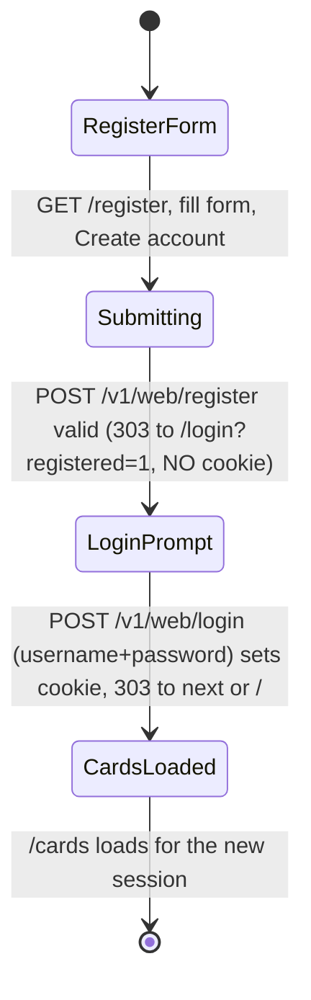
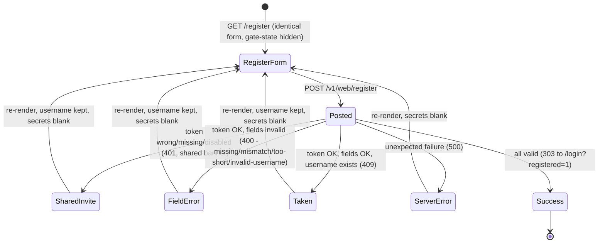

# Spec 091 — Web Self-Registration (Invite-Token Gated)

**Status:** in_progress
**Workflow mode:** full-delivery · **Status ceiling:** done
**Relates to:** [070-web-username-password-login](../070-web-username-password-login/spec.md) (binding security model — extends its credential layer), [057-browser-login-redirect](../057-browser-login-redirect/spec.md) (GET-page + form pattern), [044-per-user-bearer-auth](../044-per-user-bearer-auth/spec.md) (unchanged auth model)

## Problem

Today the **only** way to create a smackerel-core web login account is the
TTY-only CLI from spec 070:

```
docker exec smackerel-<env>-smackerel-core-1 smackerel-core users add <name>
```

That requires SSH into the deploy host and an interactive terminal. The
operator wants to create a username/password account **from the browser** —
open a `/register` page, pick a username + password, then log in at `/login`
and reach `/cards` — with no SSH and no `docker exec`.

The blocker is the trust model. Spec 070 is explicit and binding: a web
credential grants the **same full-admin access as the shared token** — "Web
users SHOULD NOT be granted to non-operators. Same trust band as the shared
token." Because every web account is a full admin, **open (un-gated)
self-registration is unacceptable**: a public `/register` page would let any
visitor mint an admin account.

Therefore registration MUST be gated by a shared **invite token** that only
the operator possesses. Unlike the PASETO `bootstrap` token (a one-shot
credential cleared after first use), the invite token must be **repeatable**:
the operator can create several accounts over time with the same token.

## Goals

1. The operator self-registers an account **in the browser** by supplying an
   invite token + a username + a password (confirmed) on a new `/register`
   page — no SSH, no TTY, no `docker exec`.
2. Registration is **repeatable**: the same valid invite token can create
   multiple accounts over time (it is not consumed on first use).
3. A newly registered account **logs in via the existing `/login`** flow
   (username + password) and reaches `/cards`.
4. **Zero regression**: the existing `/login` token-form path and the existing
   username/password login path continue to behave exactly as in spec 070.

## Non-Goals

- **Per-user roles or permissions.** Every web user is a full admin, identical
  to spec 070's trust band. This spec adds a self-service intake path, not a
  privilege layer.
- **Email / SMS verification** of the registrant.
- **MFA / WebAuthn** (a future spec when needed).
- **Password reset by email.**
- **Replacing PASETO bearer auth** or the shared-token cookie model.
- **Open (un-gated) signup.** Registration without a correct invite token is
  never possible.
- **An admin UI to manage / list / revoke invite tokens.** The invite token is
  a single SST-managed secret; rotation is an operator config action, not an
  in-app surface.

## Outcome Contract

**Intent:** An operator can self-create a username/password web account from
the browser at `/register`, gated by an invite token they already hold, then
log in at `/login` and reach `/cards` — repeatably, without SSH or a TTY,
without weakening spec 070's full-admin trust model.

**Success Signal:** With a non-empty invite token configured, the operator
submits `/register` with the correct token, a new username, and two matching
passwords; a `web_user_credentials` row is created with an argon2id hash; and
that same user then authenticates at `/login` (username + password) and loads
`/cards`. Submitting `/register` with a wrong, missing, or empty-configured
token creates **no** row.

**Hard Constraints:**
- Registration is impossible without the correct invite token.
- An empty / unset invite token **disables registration entirely** (fail-loud
  per the repo NO-DEFAULTS SST policy) — it never falls back to open signup.
- Every registered user receives the **same full-admin trust band** as spec
  070 — no escalation beyond it, no reduction below it.
- No regression to the existing `/login` token-form or username/password paths.
- The invite token is compared in **constant time** and its value is **never
  logged**.
- A duplicate username **never overwrites** an existing password hash.

**Failure Condition:** The feature is a failure if open (un-gated) signup is
possible; if a wrong / missing / empty-configured token can create an account;
if `/register` can overwrite an existing user's password hash; if the invite
token leaks into any log; or if the change breaks an existing `/login` path —
even when every other test passes.

## Actors

| Actor | Description | Trust band after registration |
|-------|-------------|--------------------------------|
| Operator (registrant) | The single human operator who holds the invite token and self-registers an account in the browser. | Full admin — identical to spec 070's shared-token band. |
| Anonymous visitor | Any unauthenticated browser that can reach `/register` but does **not** hold the invite token. | None — cannot create an account. |

There is no non-operator role. Possession of the invite token is the entire
authorization model for creating an account; it is shared only with people the
operator already trusts at the full-admin level.

## Use Cases (Gherkin)

```gherkin
Scenario: UC-1 Valid invite + new username + matching passwords creates an account
  Given the web registration invite token is configured non-empty
  And no web_user_credentials row exists for username "operator2"
  When the operator submits /register with the correct invite token,
    username "operator2", and two matching passwords meeting the minimum length
  Then a web_user_credentials row is created for "operator2" with an argon2id hash
  And the operator is taken to an authenticated state for that account
    (auto-login OR redirect to /login — settled in the design phase)
  And the invite token remains valid for future registrations (not consumed)

Scenario: UC-2 Invalid or missing invite token is rejected with no row created
  Given the web registration invite token is configured non-empty
  When the operator submits /register with a wrong or absent invite token
    and an otherwise-valid username and matching passwords
  Then registration is rejected with a generic error
  And no web_user_credentials row is created
  And the error does not reveal whether the username was available

Scenario: UC-3 Empty configured invite token disables registration entirely
  Given the web registration invite token is configured empty / unset
  When any visitor opens /register or submits the registration form
  Then registration is disabled (fail-loud, not open signup)
  And no web_user_credentials row can be created through this path
  And the page communicates that registration is unavailable

Scenario: UC-4 Duplicate username is rejected without overwriting the existing hash
  Given a web_user_credentials row already exists for username "operator"
  And the invite token is configured non-empty
  When the operator submits /register with the correct invite token,
    username "operator", and matching passwords
  Then registration is rejected
  And the existing password hash for "operator" is unchanged

Scenario: UC-5 Password mismatch or too-short password is rejected with a field error
  Given the invite token is configured non-empty
  When the operator submits /register with the correct invite token and either
    two passwords that differ, or a password below the minimum length
  Then registration is rejected with a field-level error
  And no web_user_credentials row is created

Scenario: UC-6 A newly registered user logs in and reaches /cards
  Given the operator has just registered the account "operator2" via /register
  When the operator opens /login and submits username "operator2"
    with that account's password
  Then login succeeds, the session cookie is set
  And navigating to /cards loads the cards surface for that session

Scenario: UC-7 REGRESSION — existing /login paths are unchanged
  Given the web login page and credential layer from spec 070 are in place
  When a machine client posts only token=<shared-token> to the existing
    login form path
  And separately an existing user posts username + password to the existing
    login form path
  Then both behave exactly as before this spec
    (token verified -> cookie set; valid user+pass -> cookie set;
     invalid -> the same generic error), with no change in status,
     redirect, or cookie semantics

Scenario: UC-8 Registration POST is rate-limited per IP
  Given the invite token is configured non-empty
  When a single source IP submits the registration POST more times than the
    per-IP budget within the window
  Then excess requests are rejected by the same rate-limit policy that guards
    the existing login POST (per-IP budget of 20 per minute)
```

## Acceptance Criteria

- **AC-1** — A new **GET `/register`** page is served, CSP-compliant (no inline
  scripts, no inline event handlers — mirroring the
  `internal/api/admin_ui_static/login.html` template pattern rendered by
  `internal/api/web_login_page.go`). The form exposes exactly these fields:
  `username`, `password`, `confirm-password`, and `invite-token`.
- **AC-2** — A new **POST `/v1/web/register`** endpoint accepts the form fields
  and, on success, creates the account and produces the same authenticated
  outcome chosen in the design phase (auto-login cookie OR 303 to `/login`).
- **AC-3** — Account creation reuses the existing argon2id credential store:
  `internal/auth/webcreds` `UpsertPassword(ctx, username, password, create=true)`
  (the `create` flag is the "must be new" semantic), which returns
  `ErrUserExists` on a duplicate username — the handler MUST surface that as a
  rejection and MUST NOT overwrite the existing hash. Username validity reuses
  `webcreds.ValidateUsername` (≤ 64 bytes, no control chars, trimmed).
- **AC-4** — The invite-token check is a **constant-time compare** against the
  configured secret. A wrong token yields a generic rejection with **no row
  created** (UC-2).
- **AC-5** — `GET /register` renders the **identical** form regardless of
  invite-token configuration (no separate "registration unavailable" GET
  state). The disabled gate is enforced **only** at `POST /v1/web/register`:
  when the configured invite token is **empty / unset**, the POST refuses
  every submission (UC-3) with the **shared, non-enumerating** banner
  `Registration is not available or the invite is invalid.` — byte-identical
  to a wrong-token rejection, so the response never reveals whether the gate is
  configured (preserves AC-10). This is fail-loud-at-POST per the repo
  NO-DEFAULTS SST policy — it MUST NOT degrade to open signup.
  *(Reconciled by bubbles.design — original AC-5 said GET renders an
  "unavailable" state, which contradicted AC-10's non-enumeration property;
  see design.md → Reconciled Requirements.)*
- **AC-6** — Password rules are enforced server-side: `password` must equal
  `confirm-password` and meet a minimum length; violations return a field-level
  error and create no row (UC-5).
- **AC-7** — Both new routes are registered **OUTSIDE** `bearerAuthMiddleware`
  and **INSIDE** the same per-IP rate-limit group as the login routes —
  `httprate.LimitByIP(20, 1*time.Minute)` in `internal/api/router.go`, mirroring
  the `/login` GET (public) + `/v1/web/login` POST (rate-limited) registration
  block (UC-8).
- **AC-8** — On successful registration the new account authenticates through
  the unchanged `/login` flow and reaches `/cards` (UC-6).
- **AC-9** — **No regression:** the existing `/login` token-form path and the
  existing username/password login path behave identically to spec 070 (UC-7),
  proven by a regression scenario.
- **AC-10** — **Value-safe:** the invite-token value never appears in logs,
  error messages, redirects, or template output. Registration failures are
  generic and non-enumerating (do not reveal whether a username was already
  taken vs the token was wrong).

## Security Model

- **Invite token is a managed secret.** It is sourced through the SST secret
  pipeline (same mechanism as other smackerel secrets). Its presence is the
  enable switch; its absence is the disable switch.
- **Constant-time compare.** The submitted invite token is compared to the
  configured value in constant time to avoid a timing side-channel on the
  shared secret.
- **Empty ⇒ disabled, never open.** An empty / unset invite token disables
  registration outright (fail-loud per NO-DEFAULTS SST). There is no
  configuration in which `/register` accepts a submission without a configured,
  matching token.
- **Same full-admin trust band as spec 070.** A registered account's session
  cookie carries the same access as the shared token — full admin. This is
  documented and explicit. Registration is a self-service intake for the
  full-admin band, not a reduced-privilege role. The invite token is shared
  only with people the operator already trusts at that level.
- **Argon2id at rest.** Passwords are stored only as argon2id hashes via the
  existing `webcreds` store; the plaintext is never persisted and never logged.
- **No overwrite on duplicate.** `create=true` (`ErrUserExists`) guarantees a
  duplicate username cannot replace an existing hash.
- **Generic, non-enumerating errors.** Rejections do not reveal whether the
  failure was a bad token, an existing username, or a weak password in a way
  that lets an attacker enumerate accounts.
- **Value-safe logging.** No log line, metric label, error body, or template
  field ever contains the invite token or any password.

## Referenced Existing Surfaces (for later phases — DO NOT re-discover)

Concrete surfaces later phases (ux / design / implement / test) should build on
or mirror, so work can resume without re-investigation:

- `internal/auth/webcreds/repo.go` — `Repo` interface: `UpsertPassword(ctx,
  username, password, create bool)` (returns `ErrUserExists` /
  `ErrUserNotFound`), `VerifyAndTouch`, `List`, `Exists`, `ValidateUsername`,
  `MaxUsernameLength = 64`, `Hash(...)`. Reuse this store verbatim — do not add
  a parallel one.
- `internal/db/migrations/044_web_user_credentials.sql` — the
  `web_user_credentials` table (`username` PK, `password_hash`, `created_at`,
  `last_login_at`). No schema change is anticipated for this spec.
- `internal/api/web_login.go` — `HandleWebLogin` sets the `auth_token`
  (`authCookieName`) cookie whose value is the shared `AuthToken`. The
  auto-login-on-register option (if chosen) reuses this exact cookie shape.
- `internal/api/web_login_page.go` + `internal/api/admin_ui_static/login.html`
  — the embedded-template GET-page pattern (`HandleLoginPage`, CSP headers,
  `Cache-Control: no-store`, `X-Content-Type-Options: nosniff`) that the new
  `/register` GET page MUST mirror.
- `internal/api/router.go` — the public, rate-limited block where `/login`
  (GET, public) and `/v1/web/login` (POST, inside
  `httprate.LimitByIP(20, 1*time.Minute)`) are registered, both OUTSIDE
  `bearerAuthMiddleware`. `/register` + `/v1/web/register` register alongside
  them.
- `cmd/core/wiring.go` (≈ lines 418–422) — where `deps.WebCredentials` is wired
  live; the new register handler obtains the credential store and the
  invite-token config from here.

## Open Design Decisions (HAND TO DESIGN — DO NOT SETTLE HERE)

1. **Invite-token secret identity.** Introduce a **dedicated** secret
   `WEB_REGISTRATION_INVITE_TOKEN`, or reuse the existing `AUTH_BOOTSTRAP_TOKEN`?
   *Analyst recommendation:* a **dedicated** secret. `AUTH_BOOTSTRAP_TOKEN` is a
   one-shot / clear-after-use bootstrap credential; this feature explicitly
   requires a **repeatable** gate, so conflating the two would either break
   bootstrap's one-shot semantics or make registration single-use. Design owns
   the final call and the SST secret-key mirror wiring.
2. **Post-registration landing.** **Auto-login** (set the `auth_token` cookie
   immediately and 303 to `/cards`) vs **redirect to `/login`** (operator logs
   in explicitly). *Analyst note:* both satisfy the goals; auto-login is
   smoother, redirect-to-`/login` keeps the credential-proof step explicit.
   Design + ux settle this; UC-1 is written to accept either.
3. **Whether registration needs a release-train feature flag** (default-off on
   non-owning trains) in addition to the invite-token gate, or whether the
   secret-presence gate alone is sufficient (as spec 070's login layer carried
   no train flag). Design decides; `flagsIntroduced` is left empty by the
   analyst.

## Out-of-Scope Anti-Patterns (DO NOT BUILD)

- A `/register` path that accepts a submission when the invite token is empty /
  unset (open signup).
- Storing or logging the invite token or any password in plaintext / reversible
  form.
- Overwriting an existing user's hash from the register path.
- Returning a hash, the invite token, or any secret in a response body.
- A per-user privilege tier (every web user remains full admin).
- An in-app admin surface to mint / list / revoke invite tokens.

## Dependencies

- **Spec 070** (web username/password login) — binding security model; this
  spec extends its credential layer. Unchanged by this spec.
- **Spec 057** (browser login redirect — GET `/login` page + form) — GET-page +
  form template pattern reused.
- **Spec 044** (per-user PASETO bearer) — unchanged.

## Release Train

Targets the **`mvp`** train (the active home-lab train that carries the core
web UI surface, including the spec 070 login layer this extends). Default-off
behavior on other trains follows the repo release-train model; whether an
explicit train flag is introduced is an open design decision (above).

---

## UX Specification

**Phase:** ux · **Owner:** bubbles.ux · folded into `spec.md` per the single-file
output rule (no separate `ux.md`/`wireframes.md`/`flows.md`).

This section specifies **how the operator interacts** with the new `/register`
surface — the page layout, every render state, the accessibility contract, the
exact error strings, and the security-critical validation ordering. It mirrors
the existing CSP-compliant `/login` GET page (`internal/api/admin_ui_static/login.html`
rendered by `internal/api/web_login_page.go`): a single `<main>` with an `<h1>`,
`<label>`-wrapped inputs, one submit button, and external same-origin assets only
(`/admin_ui_static/*.css` + `/admin_ui_static/*.js`) — **no inline scripts, no
inline event handlers** (CSP `script-src 'self'`).

### What this phase settles vs defers

| Item | Disposition |
|------|-------------|
| **Open Decision #2 — post-registration landing** | **RESOLVED here →** redirect-to-`/login` with a success flash (see below). UC-1's "auto-login OR redirect" is collapsed to redirect. |
| Open Decision #1 — invite-token secret identity (`WEB_REGISTRATION_INVITE_TOKEN` vs `AUTH_BOOTSTRAP_TOKEN`) | **Deferred → bubbles.design.** UX does not settle secret wiring. |
| Open Decision #3 — whether a release-train flag is needed | **Deferred → bubbles.design.** |
| AC-5 wording ("GET renders unavailable") vs the non-enumeration goal | **Reconciliation routed → bubbles.design** (see Reconciliation Notes). UX recommends GET always render the form; UX does not edit analyst-owned AC text. |

### Landing-UX Decision (Open Decision #2 — RESOLVED: redirect-to-`/login`)

**Binding UX outcome:** On a fully-valid registration, `POST /v1/web/register`
returns **`303 See Other` → `Location: /login?registered=1`** (carrying the
sanitized `next` as `/login?registered=1&next=<sanitized>` when a non-default
`next` was supplied). **The register handler sets no session cookie.** The
operator then authenticates through the unchanged `/login` flow (UC-6 / AC-8).
The `/login` page renders a **success banner** — text **"Account created — sign
in."** — when `?registered=1` is present.

**Chosen over auto-login (set `auth_token` + 303 → `/cards`) because, for a
single-operator full-admin home-lab tool:**

1. **One canonical session-establishing path.** The session cookie is set
   **only** by `POST /v1/web/login` (the existing `authCookie` path in
   `internal/api/web_login.go`). Registration stays pure intake — it creates a
   `web_user_credentials` row and grants **no** session. A bug in the register
   handler therefore cannot accidentally mint a full-admin session; the trust
   boundary between "create account" and "establish session" stays clean.
2. **Immediate credential proof.** Logging in right after registering proves the
   stored hash matches what the operator intended — a real round-trip check on
   top of the `confirm-password` field.
3. **Frequency fits the product shape.** Registration is repeatable-but-rare for
   one operator; the extra ~3-second login step optimizes a non-bottleneck.
   Auto-login's smoothness only pays off for high-frequency public signup, which
   this product explicitly is **not** (Non-Goals: open signup).
4. **Reuse, no duplication.** No cookie / `Secure` / `SameSite` logic is copied
   into the register handler. It also matches the existing convention where
   `POST /v1/web/logout` form posts `303 → /login`.
5. **Non-enumerating & value-safe.** `?registered=1` is a fixed literal (no
   reflected user input, no secret); the success banner echoes neither the
   username nor the invite token.

*Design/implement detail (flagged, not settled here):* the `/login` template +
`loginPageData` gain a success-notice rendering driven by `?registered=1`
(distinct `banner-success` style, `role="status"`). This is a small additive
change to the spec-057 login page; it does not alter any existing `/login`
behavior (AC-9 regression preserved).

### Validation Order (security-critical — token gate FIRST)

The non-enumeration contract (AC-10, UC-2) only holds if the **invite-token gate
is evaluated before any username/password logic**, so a request without a valid
token can never produce a username-existence or field-specific signal:

1. **Rate-limit** — `httprate.LimitByIP(20, 1*time.Minute)` (middleware, same
   group as `/login`; UC-8). Excess → `429` (middleware default, no custom page —
   matches existing login behavior).
2. **Method + content-type** guard (`POST` + `application/x-www-form-urlencoded`).
3. **Invite-token gate (constant-time compare vs the configured secret).** Empty/
   unset configured token **or** mismatch → **shared banner**, no row, **STOP**.
   Username/password are never evaluated on this path ⇒ no enumeration leak, and
   the wrong-token and registration-disabled responses are **byte-identical**.
4. **Field presence** (username, password, confirm-password all non-empty) →
   else `missing-field`.
5. **Password rules:** `password == confirm-password` → else `passwords-mismatch`;
   `len(password) ≥ 12` (`webcreds.MinPasswordLength`) → else `password-too-short`.
6. **Username validity:** `webcreds.ValidateUsername` (≤ 64 runes, trimmed, no
   control chars) → else `invalid-username`.
7. **`webcreds.UpsertPassword(ctx, username, password, create=true)`:**
   `ErrUserExists` → `duplicate-username` (no overwrite, AC-3); any other error →
   `generic-server-error`; `nil` → **success** (303 → `/login?registered=1`).

Because steps 4–7 are reachable **only after** a valid token (step 3), the
distinct, helpful messages in steps 4–7 are safe: they are seen exclusively by a
holder of the operator's trusted secret, who is already in the full-admin band.

### Error-Message Catalog (exact strings)

| Key | Exact string (rendered in the error banner) | Trigger | Recommended status | Enumerating? |
|-----|---------------------------------------------|---------|--------------------|--------------|
| `invalid-invite` / `registration-disabled` **(SHARED)** | `Registration is not available or the invite is invalid.` | Wrong token, missing token, **or** empty-configured token (registration disabled) — one identical string for all three | `401` | **No** — deliberately non-enumerating; never reveals whether the gate is configured |
| `missing-field` | `All fields are required.` | Token valid, but username/password/confirm-password empty | `400` | No |
| `passwords-mismatch` | `Passwords do not match.` | Token valid, `password != confirm-password` | `400` | No |
| `password-too-short` | `Password must be at least 12 characters.` | Token valid, `len(password) < 12` (`webcreds.MinPasswordLength`) | `400` | No |
| `invalid-username` | `Username must be 64 characters or fewer and contain no control characters.` | Token valid, `webcreds.ValidateUsername` rejects | `400` | No (format rule is public) |
| `duplicate-username` | `That username is taken.` | Token valid, fields valid, `UpsertPassword(create=true)` → `ErrUserExists` | `409` | Acceptable — only a valid-token holder (trusted) reaches this |
| `generic-server-error` | `Something went wrong. Please try again.` | Unexpected error (e.g. DB failure that is not `ErrUserExists`) | `500` | No |
| `success-flash` (on `/login`) | `Account created — sign in.` | `GET /login?registered=1` after a successful registration | `200` | No |

Constraints binding on every string above: the invite-token value and any
password value **never** appear in a message, log line, redirect, or template
field (AC-10). All dynamic echoes (the preserved username) are emitted through
`html/template` auto-escaping — never string concatenation.

### Accessibility

- **Labels:** each input is wrapped by its `<label>` (implicit association,
  mirroring `login.html`). *Recommended hardening:* add explicit `for`/`id`
  pairs for maximum assistive-tech robustness (wrapping alone is already
  conformant).
- **Focus order** (DOM order = tab order; **no positive `tabindex`**):
  `username → password → confirm-password → invite-token → "Create account" →
  "Already have an account? Sign in"`.
- **Error banner announced:** the `banner-error` paragraph carries
  **`role="alert"`** (assertive) so it is announced when the page re-renders
  after a failed POST. The `/login` success flash carries **`role="status"`**
  (polite).
- **Visible focus ring:** rely on the browser default `:focus-visible`; do **not**
  strip outlines. *Recommended:* add an explicit `:focus-visible` outline in CSS
  for consistent visibility across themes.
- **Works without JavaScript:** the page is a pure HTML form POST. The optional
  `register.js` is **progressive enhancement only** — it focuses the username
  field on load (mirroring `login.js` focusing the token field). All validation
  is server-side; nothing depends on JS.
- **Masking / autocomplete:** `username` → `type=text autocomplete=username`;
  `password` & `confirm-password` → `type=password autocomplete=new-password`
  (password managers offer save/generate, do not autofill an existing password);
  `invite-token` → `type=password autocomplete=off` (masked against
  shoulder-surfing and **never** stored in the browser credential store).
- **Submit semantics:** a real `<button type="submit">` so Enter submits.
- **Contrast:** reuse `login.css` banner palette; add a `banner-success` palette
  meeting WCAG AA contrast for the success flash.

### Disabled-State UX (UC-3 / AC-5) — GET always renders the form

**Recommendation: `GET /register` renders the identical form whether or not the
invite token is configured.** There is **no** separate "registration
unavailable" GET page. The gate is enforced **only at POST**: an empty/unset
configured token makes `POST /v1/web/register` return the **shared** banner
`Registration is not available or the invite is invalid.` — byte-identical to a
wrong-token response.

**Why this is required, not merely preferred:** the security model's entire
point is that the failure text is "identical whether the token is wrong OR
registration is disabled, so it never reveals whether the gate is configured." A
GET page that rendered a distinct "unavailable" state when the token is unset
would let a prober learn the gate is off with a single unauthenticated `GET
/register`, making the carefully-shared POST message pointless. Rendering the
identical form on GET and differentiating **only at POST** is what makes
enabled-vs-disabled indistinguishable end-to-end.

### Reconciliation Notes (routed to bubbles.design)

1. **AC-5 wording vs non-enumeration.** AC-5 currently says the empty-token
   `GET /register` "renders a 'registration unavailable' state." That contradicts
   the Disabled-State UX above and undermines AC-10's non-enumeration goal. UX
   recommends AC-5 be reworded to: *"`GET /register` renders the identical form
   regardless of token configuration; the disabled gate is enforced at
   `POST /v1/web/register`, which returns the shared non-enumerating banner."*
   UX does **not** edit analyst-owned AC text — **design owns the reconciliation**
   (or routes it back to bubbles.analyst). This is an **unresolved finding**.
2. **Login-page success-flash addition.** The redirect-to-`/login` landing
   requires a small additive change to the spec-057 `/login` page (render
   `Account created — sign in.` on `?registered=1`). Design should confirm this
   stays additive and preserves AC-9 (no `/login` regression).
3. **Status codes** in the catalog (`400/401/409/500`) are UX recommendations;
   design finalizes exact codes. The non-enumeration property only requires that
   the **tokenless** path always yields the single shared `401` response.

## UI Wireframes

### Screen Inventory

| Screen / Endpoint | Actor(s) | Status | Scenarios served |
|-------------------|----------|--------|------------------|
| `GET /register` (page) | Operator (registrant), Anonymous visitor | **New** | UC-1…UC-5, UC-8; AC-1, AC-5 |
| `POST /v1/web/register` (endpoint; re-renders `/register` on failure, 303 → `/login` on success) | Operator | **New** | UC-1…UC-5, UC-8; AC-2…AC-7, AC-10 |
| `GET /login` (page) — **success-flash addition** for `?registered=1` | Operator | **Modify (additive)** | UC-1 (landing), UC-6; AC-8, AC-9 |
| `register.js` / `register.css`(or reuse `login.css`) static assets | — | **New / reuse** | AC-1 (CSP `script-src 'self'`) |

### UI Primitives (shared with `/login` — UX9)

`/register` and `/login` share UI behavior across ≥2 screens, so these primitives
are defined once and reused (not re-invented per screen):

| Primitive | Definition | Consumed by | Composition / a11y rule |
|-----------|------------|-------------|-------------------------|
| **Banner** | `<p class="banner banner-{error\|success\|disabled}">…</p>` | `/register` (error), `/login` (error + new success) | Error → `role="alert"`; success → `role="status"`; `banner-success` palette must meet WCAG AA |
| **Form field** | `<label>Text <input …></label>` (label-wrapped, full-width, `box-sizing:border-box`) | both | DOM order = tab order; correct `autocomplete`/`type` per field |
| **Submit button** | single `<button type="submit">` | both | Enter submits; never disabled on the enabled path |
| **Auth cross-link** | `<a href="/login">` ↔ `<a href="/register">` | both | "Already have an account? Sign in" / (login may later link to register) |
| **Shared non-enumerating string** | `Registration is not available or the invite is invalid.` | `/register` POST | One literal for wrong-token AND disabled-gate (content primitive) |
| **Asset/serving contract** | external same-origin `/admin_ui_static/*` via `loginUIFS` embed; headers `Cache-Control: no-store`, `X-Content-Type-Options: nosniff`; CSP `script-src 'self'` | both | No inline scripts/handlers; JS is progressive-enhancement only |

*Composition rule:* `/register` **reuses `login.css`** (the minimal CSP-safe
stylesheet) rather than forking styles; `register.js` is a focus-only sibling of
`login.js`. Final asset filenames are a design/implement detail.

### Screen: `/register` (GET) — canonical form (always rendered)

**Actor:** Operator (registrant) / Anonymous visitor · **Route:** `GET /register`
· **Status:** New · **Posts to:** `POST /v1/web/register`

```
┌──────────────────────────────────────────────────────┐
│ <main>                                                │
│                                                       │
│   Create account                              <h1>    │
│                                                       │
│   ┌─ banner (ONLY on a POST re-render) ────────────┐  │
│   │  [contextual message — see "states" below]     │  │
│   │  role="alert"  ·  class="banner banner-error"   │  │
│   └────────────────────────────────────────────────┘  │
│                                                       │
│   <form method="POST" action="/v1/web/register"       │
│         enctype="application/x-www-form-urlencoded">  │
│     <input type="hidden" name="next" value="{{.Next}}">│
│                                                       │
│   Username                                    <label> │
│   ┌────────────────────────────────────────────────┐ │
│   │ operator2_                                      │ │
│   │ type=text · autocomplete=username · required    │ │
│   └────────────────────────────────────────────────┘ │
│                                                       │
│   Password                                    <label> │
│   ┌────────────────────────────────────────────────┐ │
│   │ ••••••••••••                                    │ │
│   │ type=password · autocomplete=new-password · req │ │
│   └────────────────────────────────────────────────┘ │
│                                                       │
│   Confirm password                            <label> │
│   ┌────────────────────────────────────────────────┐ │
│   │ ••••••••••••                                    │ │
│   │ type=password · autocomplete=new-password · req │ │
│   └────────────────────────────────────────────────┘ │
│                                                       │
│   Invite token                                <label> │
│   ┌────────────────────────────────────────────────┐ │
│   │ ••••••••••                                      │ │
│   │ type=password · autocomplete=off · required     │ │
│   └────────────────────────────────────────────────┘ │
│                                                       │
│   ┌──────────────────┐                                │
│   │  Create account  │   <button type="submit">       │
│   └──────────────────┘                                │
│   </form>                                             │
│                                                       │
│   Already have an account? Sign in    <a href="/login>│
│ </main>                                               │
│ <script src="/admin_ui_static/register.js"></script>  │
│ <link rel="stylesheet" href="/admin_ui_static/login.css">  (in <head>)│
└──────────────────────────────────────────────────────┘
```

**Interactions:**
- "Create account" (submit) → `POST /v1/web/register` (form-encoded) → on
  success `303 → /login?registered=1` (no cookie); on failure re-render this page
  with the matching banner.
- "Sign in" link → `GET /login` (carries no token; standard navigation).
- `?next=` on the GET URL is read once, **sanitized** via `sanitizeNext`, and
  embedded as the hidden `next` so it survives registration → login.

**States (each = what the user sees):**
- **Empty form** (first GET): no banner; all fields blank; username focused (via
  `register.js`, if JS is on).
- **Invalid / missing / disabled invite token** → `banner-error`:
  `Registration is not available or the invite is invalid.` — **identical** for
  wrong token, missing token, and empty-configured (disabled) registration.
  Username **preserved**; password, confirm-password, invite-token **blank**.
- **Missing field** (token valid) → `All fields are required.` Username preserved;
  secrets blank.
- **Passwords don't match** (token valid) → `Passwords do not match.` Username
  preserved; secrets blank.
- **Password too short** (token valid) → `Password must be at least 12
  characters.` Username preserved; secrets blank.
- **Invalid username** (token valid) → `Username must be 64 characters or fewer
  and contain no control characters.` Username preserved; secrets blank.
- **Duplicate username** (token valid, fields valid) → `That username is taken.`
  Existing hash is **unchanged** (AC-3). Username preserved; secrets blank.
- **Server error** → `Something went wrong. Please try again.` Secrets blank.
- **Success** → no banner here; `303 → /login?registered=1` (see landing screen).

> **Secret-preservation invariant (all re-renders):** the `username` value is
> echoed back (the user's own input, auto-escaped by `html/template`);
> `password`, `confirm-password`, and `invite-token` are **always** rendered
> empty. No secret is ever reflected.

**Responsive:** single-column, `max-width: 28rem` centered (inherited from
`login.css`); inputs are full-width (`width:100%; box-sizing:border-box`).
Mobile: identical single-column stack (no layout change needed). Tablet/desktop:
centered column with comfortable margins.

**Accessibility (screen-specific):** see the §Accessibility contract above —
`role="alert"` banner, label-wrapped inputs, logical tab order, no-JS operable,
masked secret fields.

### Screen: `/register` — POST failure re-renders (state variants)

Same layout as the GET form, with the banner populated. Two representative
variants:

```
── Shared invite/disabled (tokenless attacker only ever sees this) ──
┌──────────────────────────────────────────────────────┐
│  Create account                                       │
│  ┌────────────────────────────────────────────────┐  │
│  │ ⚠ Registration is not available or the invite   │  │  role="alert"
│  │   is invalid.                                    │  │  banner-error
│  └────────────────────────────────────────────────┘  │
│  Username [operator2]  ← preserved                    │
│  Password [          ]  ← blank                       │
│  Confirm  [          ]  ← blank                       │
│  Invite   [          ]  ← blank                       │
│  [ Create account ]      Already have an account? Sign in │
└──────────────────────────────────────────────────────┘

── Duplicate username (valid-token holder only) ──
┌──────────────────────────────────────────────────────┐
│  Create account                                       │
│  ┌────────────────────────────────────────────────┐  │
│  │ ⚠ That username is taken.                        │  │  role="alert"
│  └────────────────────────────────────────────────┘  │
│  Username [operator]   ← preserved                    │
│  Password [          ]  Confirm [        ]  Invite [        ]  ← all blank │
│  [ Create account ]      Already have an account? Sign in │
└──────────────────────────────────────────────────────┘
```

### Screen: `/login` (GET) — post-registration success flash (landing)

**Actor:** Operator · **Route:** `GET /login?registered=1[&next=…]` · **Status:**
Modify (additive). This is the existing spec-057 login page with a new success
banner above the form.

```
┌──────────────────────────────────────────────────────┐
│ <main>                                                │
│   Sign in                                     <h1>    │
│   ┌────────────────────────────────────────────────┐  │
│   │ ✓ Account created — sign in.                     │  │ role="status"
│   │   class="banner banner-success"                  │  │ (polite)
│   └────────────────────────────────────────────────┘  │
│                                                       │
│   Username  [                              ]          │
│   Password  [                              ]          │
│   [ Sign in ]                                         │
│   ▸ Machine client login (token)   <details>          │
│ </main>                                               │
└──────────────────────────────────────────────────────┘
```

**Interactions / outcome:** the operator signs in with the just-created
username + password → existing `/login` flow sets the `auth_token` cookie and
`303`s to the sanitized `next` (or `/`) → `/cards` loads (UC-6 / AC-8). No
existing `/login` behavior changes when `?registered=1` is absent (AC-9).

## User Flows

### User Flow: Registration → login → /cards (happy path)



### User Flow: Registration POST failure branches



### Competitor UI Insights

**Intentionally skipped.** This is an internal, single-operator admin
authentication page whose binding reference is the in-repo `/login` page
(`login.html`), not any public-product signup pattern. Competitor research would
add no value over mirroring the existing CSP-compliant login surface, and the
non-enumeration / invite-gate requirements are security-driven rather than
conversion-driven. (No `competitors:` were requested.)
