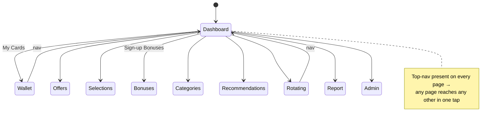
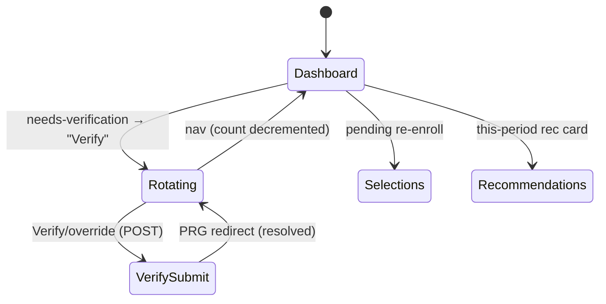
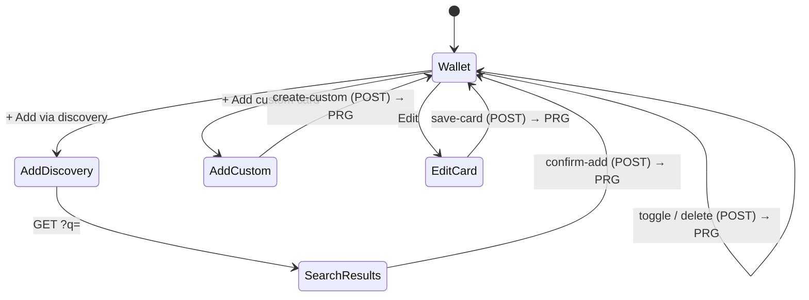
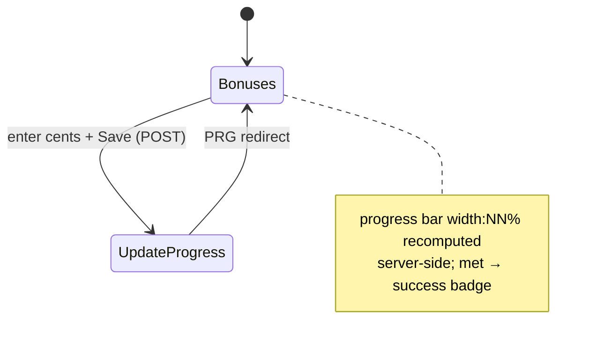
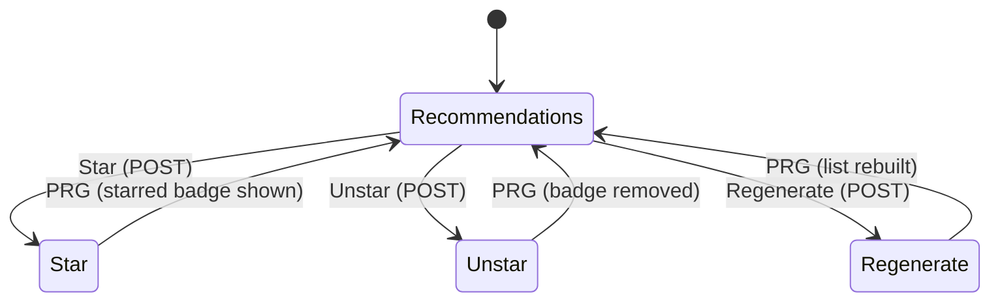

# Spec 092 — Card-Rewards Web UI Elevation (match-or-exceed CCManager)

**Status:** done
**Workflow mode:** full-delivery · **Status ceiling:** done
**Release train:** mvp
**Depends on:** [083-card-rewards-companion](../083-card-rewards-companion/spec.md) (the `/cards` web surface this redesigns — its Scope 10/11 templates, routes, handlers, and view models are the substrate), [077-pwa-browser-test-harness](../077-pwa-browser-test-harness/spec.md) (the automated CSP-violation guard that binds the CSP-clean constraint)
**Relates to:** [070-web-username-password-login](../070-web-username-password-login/spec.md) (the `webAuthMiddleware` login gate in front of every `/cards` route — unchanged)

## Problem

The operator directive, verbatim:

> "ccmanager UI was way better, you need to at least match that UI or make better"

smackerel absorbed the feature-set of the legacy **CCManager** credit-card-rewards
app (cards, offers/promos, sign-up bonuses, rotating categories, monthly
recommendations, optimization report, admin run-history). The **data and the
workflows are at parity** — but the **presentation is not**.

**What smackerel renders today** (the surface this spec replaces):

- [internal/web/cardrewards_templates.go](../../internal/web/cardrewards_templates.go)
  defines the self-contained `head` / `foot` / `cardrewards-nav` chrome plus a
  **minimal monochrome** embedded design system:
  `:root{ --bg:#fafaf8; --fg:#1a1a18; --muted:#6b6b68; --border:#d4d4d0;
  --accent:#2d2d2b; --card-bg:#ffffff; --success:#2d5a2d; --warning:#8b6914;
  --error:#8b1414; --radius:6px; --shadow:0 1px 3px rgba(0,0,0,0.08); }` — a
  single-column, **820 px** max-width body, and a plain **text-link** nav that
  simply wraps. It carries the Scope-10 pages (wallet + add / add-custom / edit,
  offers + edit, selections + edit, bonuses, categories, and the card-select
  partials).
- [internal/web/cardrewards_dashboard_templates.go](../../internal/web/cardrewards_dashboard_templates.go)
  carries the Scope-11 pages: dashboard (`/cards`), recommendations, rotating,
  report, admin.
- [internal/web/cardrewards.go](../../internal/web/cardrewards.go) (≈1140 lines)
  is the handler + the view models (`walletCardRow`, `offerRow`, `selectionRow`,
  `bonusRow`, `recommendationRow`, `rotatingRow`) that already carry every datum
  the richer UI needs.

**What CCManager renders** (the bar to match or beat — the reference lives in the
workspace at `CCManager/web/templates/`):

- `base.html` (≈991 lines) is an **Apple-inspired design system**: Inter
  (Google Fonts), a **full light + dark token palette** via
  `prefers-color-scheme` (`--bg-primary/secondary/tertiary/elevated/glass`,
  `--text-primary/secondary/tertiary`, `--accent/success/warning/danger/info`,
  `--radius-sm/md/lg/xl`, `--shadow-sm/md/lg`, `--nav-bg`), a **glassmorphic
  sticky top nav** (`backdrop-filter: blur`) **plus a fixed bottom tab-bar on
  mobile** (`viewport-fit=cover` + `env(safe-area-inset-*)` — a mobile-first PWA
  pattern), a **stats-grid** (2-col mobile → 4-col desktop), **stat-card** with
  hover-lift, `page-header` / `page-title` / `page-subtitle`, `card` /
  `card-header` / `card-title`, a **badge** system
  (`badge-success/warning/danger/info/secondary`), a **button** hierarchy
  (`btn-sm/primary/warning/success/ghost/danger/secondary/lg/icon`), list groups,
  alerts, toggles, form rows, a 💳 favicon, and breakpoints at 480 / 768 /
  1024 px.
- `dashboard.html` (≈275 lines) is an **action-oriented** home: a ⚡ "Cards
  Needing Action" warning-tinted priority alert with inline activate / done
  buttons; a 🎁 "Sign-Up Bonuses" tracker with **color-coded days-left badges**
  (danger / warning / info) + spend progress; a 🚨 "Promo Action Required"
  danger alert with dismiss; a 📅 "This Month's Card Strategy" with category →
  rate badges color-coded by rate tier; a 4-tile Quick-Actions **stat-grid**
  (My Cards / Active Promos / Sync Calendar / Settings); and a stats footer —
  with emoji iconography throughout.

**The gap is 100 % presentation.** smackerel already surfaces the same underlying
data CCManager does (recommendations with best-card + reason + starred; rotating
with confidence + citations + needs-verification; bonuses with spend-progress %
+ deadline + met; offers with rate + activation + shared-limit; selections
tiered; wallet with type + active + nickname + note; categories canonical +
equivalents + starred + priority; admin run-history). It just renders that data
as flat monochrome text instead of polished stat cards, progress bars,
color-coded urgency badges, action-priority sections, and a responsive nav.

**The constraint that makes this non-trivial:** smackerel's `/cards` pages are
**server-rendered under a strict Content-Security-Policy** and CCManager is not.
CCManager's `base.html` leans on inline `<script>` (auto-dismiss flash,
double-submit prevention, CSRF/cookie helpers) and inline `onclick` / `onsubmit`
event handlers. smackerel's governing CSP forbids exactly those. So this is
"match-or-exceed the **look** and **action-oriented UX**, achieved **without**
the inline JavaScript CCManager relied on."

## Goals

1. **Match or exceed CCManager's visual quality and information density** on
   every `/cards` page: a real design-token system (light + dark), a responsive
   nav, stat cards, badges, buttons, progress bars, and card-based layouts —
   replacing today's flat monochrome single-column text.
2. **Match CCManager's action-oriented UX**: the dashboard leads with what needs
   action (needs-verification, pending re-enrollment, this-period
   recommendations) as visually-distinct priority sections, not an undifferentiated
   list; urgency (low confidence, met / unmet bonus, days-left) is communicated
   with **color-coded badges and progress bars**, not plain text.
3. **Stay strictly CSP-clean**: no new JavaScript, no inline `<script>`, no inline
   event handlers — the richer UI is achieved with a single embedded `<style>`
   design system + restructured **semantic** HTML + CSS-only affordances. Every
   existing interaction stays a Post/Redirect/Get `<form>` submit.
4. **Preserve the `data-*` test contract**: every element a card-rewards
   Playwright spec or Go test addresses by `data-*` attribute keeps that
   attribute on the corresponding restructured element, so the existing
   regression suite stays green. The redesign changes **look**, not the
   test-addressable structure.
5. **Preserve all existing functionality**: every route, handler, form, link,
   and datum behaves exactly as today; only the templates (and, if warranted,
   minimal additive view-model fields) change.

## Non-Goals

- **Changing routes, handlers, or the data model.** No new endpoints, no schema
  changes, no business-logic changes. (One bounded exception is offered as an
  *open decision*: minimal **additive read-only** view-model fields purely to
  feed presentational stat counts — see Open Design Decisions (d).)
- **Adding a client-side JS framework** (React / Vue / htmx-driven partials for
  these pages) or any new JavaScript at all.
- **Touching non-card-rewards pages.** The main knowledge-base web design system
  in [internal/web/templates.go](../../internal/web/templates.go) is a **separate**
  surface and is out of scope.
- **Per-user theming** beyond `prefers-color-scheme` (no stored theme preference,
  no account-level palette).
- **Relaxing or bypassing the CSP** to import CCManager's inline-JS affordances
  (auto-dismiss flash, JS double-submit guard, JS dismiss buttons). Where a
  CCManager affordance depends on JavaScript, this spec drops it or achieves a
  CSS-only / server-side equivalent.
- **New runtime dependencies.** No new Go modules, no bundler, no asset pipeline.

## Outcome Contract

**Intent:** Elevate the server-rendered `/cards` web UI so its visual quality,
information density, and action-oriented UX **match or exceed** the legacy
CCManager app, while keeping the pages strictly CSP-clean (no new JS), preserving
every `data-*` test hook, and changing nothing about the routes, handlers, or
data the pages already serve.

**Success Signal:** Every `/cards` page renders with the new design-token system
(light **and** dark via `prefers-color-scheme`), a responsive nav, and the
component vocabulary (stat cards, badges, buttons, progress bars, card layouts);
the dashboard leads with action-priority sections; urgency is shown via
color-coded badges + progress bars; **and** the existing card-rewards Playwright
suite (`web/pwa/tests/cardrewards_*.spec.ts`) — including its `attachCSPGuard` /
`assertNoCSPViolations` CSP guard — passes unchanged, because every `data-*`
locator it uses is still present and no CSP violation is emitted.

**Hard Constraints:**
- **CSP-clean:** zero inline `<script>`, zero inline event handlers
  (`onclick` / `onsubmit` / …). All interactivity stays `<form>` PRG submits.
  The governing CSP (see Referenced Surfaces) permits inline `<style>` and
  `style=""` (`style-src 'self' 'unsafe-inline'`) but **only** `'self'` + the
  pinned htmx + the one hashed theme script for `script-src`.
- **`data-*` contract preserved:** every `data-*` attribute the regression suite
  addresses survives on the corresponding restructured element (enumerated in
  AC-9).
- **Scope boundary:** changes are confined to
  [internal/web/cardrewards_templates.go](../../internal/web/cardrewards_templates.go)
  and
  [internal/web/cardrewards_dashboard_templates.go](../../internal/web/cardrewards_dashboard_templates.go)
  (plus, only if Open Decision (d) is taken, minimal **additive** view-model
  fields in [internal/web/cardrewards.go](../../internal/web/cardrewards.go)).
  No edits to `internal/web/templates.go` or any non-card-rewards page.
- **Light + dark parity** via `prefers-color-scheme`; colors come from design
  tokens only (no hard-coded literals scattered through markup).
- **No new JS and no new runtime dependency.**

**Failure Condition:** The feature is a failure if any `/cards` page emits a CSP
violation; if any inline `<script>` or inline event handler is introduced; if any
`data-*` attribute the regression suite depends on is removed or renamed (breaking
a Playwright locator); if a route, form, or link stops working; if the redesign
bleeds into a non-card-rewards page; or if the dark-mode rendering is broken —
even when the pages "look nicer."

## Actors

| Actor | Description | What they get from this spec |
|-------|-------------|------------------------------|
| Operator (full-admin web user) | The single human operator, logged in via spec 070, who manages cards / offers / bonuses / rotating / recommendations through the `/cards` pages on desktop and mobile. | A polished, action-oriented, responsive, light+dark `/cards` experience that matches or beats CCManager. |
| Regression suite (automated) | The card-rewards Playwright specs under `web/pwa/tests/` and the Go tests, which address the pages by `data-*` locators and assert no CSP violation. | An unchanged, still-green contract — the redesign keeps every locator and stays CSP-clean. |

There is no new human role and no new authorization surface — every `/cards`
route remains behind the unchanged `webAuthMiddleware` login gate from spec 070.

## Design System Capability Model

Because **ten** `/cards` screens share one presentation surface, the redesign is
specified as a **shared, page-neutral component vocabulary** (a single embedded
design system every page reuses) rather than per-page bespoke styling. This is the
capability foundation the design / UX phases build concrete pages on.

**Component primitives** (provider-neutral, page-neutral; names illustrative —
design phase finalizes):

| Primitive | Purpose | States it must express |
|-----------|---------|------------------------|
| **Design tokens** | Single source of color, radius, shadow, spacing | light + dark (via `prefers-color-scheme`) |
| **Responsive nav** | Move between the 10 `/cards` pages | current-page (active), hover/focus; desktop vs mobile presentation (Open Decision (b)) |
| **Page header** | Title + optional subtitle/period per page | — |
| **Stat card** | A single headline number/label, optionally a link | default, hover-lift, link vs static |
| **Card / surface** | The container for a wallet card, offer, bonus, rotating row, recommendation | default, elevated |
| **Badge** | Compact status / urgency token | success, warning, danger, info, neutral/secondary |
| **Button** | An action (form submit or link styled as action) | primary, secondary, success, warning, danger, ghost; size sm/default |
| **Progress bar** | A 0–100 % completion (bonus spend, confidence) | indeterminate-free, value-labelled, color-by-threshold |
| **List / empty state** | A group of items or the "nothing yet" message | populated, empty |
| **Alert / priority section** | A visually-distinct call-to-action block | info, warning, danger |

**Binding policies every primitive must obey:**
- Colors come **only** from design tokens (no inline hex literals in markup).
- Every primitive renders correctly in **both** light and dark.
- No primitive introduces JavaScript or an inline event handler.
- A primitive that wraps a test-addressed element **carries that element's
  `data-*` attribute through** unchanged.

### Single-Capability Justification

This redesign introduces exactly **one** reusable capability — the shared `/cards` design-system + component vocabulary defined above — and **no** second provider, theme engine, or per-page palette. The single foundation is intentional and required: the Non-Goals forbid per-user theming beyond `prefers-color-scheme` and forbid per-page bespoke palettes, and the Non-Functional Requirements mandate "one shared design-token system + component vocabulary reused across all ten pages." The capability is genuinely reusable rather than a one-off — it is composed by ten distinct `/cards` screens across two template files — so it is modelled as a capability foundation (see design.md §8) even though it has a single implementation. A second concrete design-system provider would violate the spec.

## Use Cases (Gherkin)

```gherkin
Scenario: UC-1 Dashboard leads with action-priority sections and a stat overview
  Given the operator is logged in and opens /cards
  When the dashboard renders
  Then it presents this-period recommendations, active rotating categories, and
    pending actions (needs-verification + pending re-enrollment) as visually
    distinct, prioritized sections
  And it presents an at-a-glance overview using the stat-card / stat-grid
    component vocabulary
  And the element carrying data-dashboard is present and the existing
    data-rec-row / data-active-rotating / data-needs-verification /
    data-pending-reenroll hooks are unchanged

Scenario: UC-2 Sign-up bonuses show a visual progress bar and a color-coded status
  Given the operator opens /cards/bonuses with at least one tracked bonus
  When the page renders a bonus that has a spend requirement and progress
  Then the bonus shows a visual progress bar reflecting the spend-progress
    percentage (today it is rendered only as plain "progress X of Y (Z%)" text)
  And a met bonus shows a success-colored "met" status while an unmet bonus
    shows an in-progress status
  And the data-bonus-id, data-met, data-bonus-progress, and data-bonus-met hooks
    are unchanged

Scenario: UC-3 Rotating categories show confidence and verification urgency visually
  Given the operator opens /cards/rotating with reconciled records
  When a record renders
  Then its confidence is shown as a visual badge (not plain "confidence N%" text)
  And a needs-verification record is visually flagged as urgent (warning/danger),
    while a manually-verified record reads as resolved/success
  And the data-rotating-row, data-rotating-id, data-needs-verification,
    data-manual-override, data-confidence, and data-badge hooks are unchanged

Scenario: UC-4 Wallet renders cards as polished cards with type and active state
  Given the operator opens /cards/wallet with owned cards
  When the wallet renders
  Then each card renders as a polished card surface showing its nickname/name, a
    card-type badge, and a clear active vs inactive visual state
  And the edit / activate-deactivate / remove actions remain working <form>/link
    controls
  And the data-card-id, data-active, data-card-name, data-card-type,
    data-card-status, and data-action hooks are unchanged

Scenario: UC-5 Offers, selections, categories, recommendations, report, admin are elevated
  Given the operator opens each of /cards/offers, /cards/selections,
    /cards/categories, /cards/recommendations, /cards/report, /cards/admin
  When each page renders
  Then it uses the shared component vocabulary (cards, badges, buttons, tables
    styled to the design system) consistently with the rest of /cards
  And every existing data-* hook on each page (e.g. data-offer-id /
    data-offer-status, data-selection-id / data-selection-tier, data-category /
    data-starred, data-rec-card / data-rec-reason, data-report-row /
    data-report-reason, data-run-row / data-run-status / data-events-written) is
    unchanged
  And every add/edit/toggle/delete/verify/progress/star/regenerate/scrape/
    sync-calendar form still submits to the same action and works

Scenario: UC-6 Responsive — usable nav and layout on mobile and desktop
  Given the operator opens /cards on a narrow (mobile) viewport
  Then the navigation is presented in a mobile-appropriate form and the layout
    is single-column and touch-friendly
  When the operator opens /cards on a wide (desktop) viewport
  Then the navigation is presented in a desktop-appropriate form and the layout
    uses the available width (multi-column stat-grid, comfortable spacing)
  And the exact mobile-nav pattern (bottom tab-bar vs responsive top-nav) is
    settled in the design phase (Open Decision (b))

Scenario: UC-7 Dark-mode parity
  Given the operator's environment prefers a dark color scheme
  When any /cards page renders
  Then it renders a correct, legible dark theme via prefers-color-scheme using
    the design tokens (no broken contrast, no light-only literals)
  When the environment prefers light
  Then the same page renders the correct light theme

Scenario: UC-8 REGRESSION — every data-* locator the suite uses still resolves
  Given the existing card-rewards Playwright specs under web/pwa/tests/ and the
    Go tests address elements by their data-* attributes
  When the redesigned templates render
  Then every data-* attribute those tests depend on is present on the
    corresponding restructured element
  And the existing suite passes without any locator change

Scenario: UC-9 CSP-clean — no inline script, no inline handler, no blocked resource
  Given every card-rewards Playwright spec attaches the spec-077 CSP guard
    (attachCSPGuard) and asserts no violation (assertNoCSPViolations)
  When the redesigned pages load
  Then no inline <script> and no inline event handler exists in any /cards
    template
  And the page loads no resource that the governing CSP would block (so the
    securitypolicyviolation guard stays empty)
  And every mutation remains a Post/Redirect/Get <form> submit
```

## Acceptance Criteria

- **AC-1 — Design-token system (light + dark).** The redesigned templates define
  a single embedded design-token system covering background / surface / text /
  accent / success / warning / danger / info colors, radii, and shadows, with a
  `@media (prefers-color-scheme: dark)` block providing a complete dark palette.
  All page colors derive from these tokens (no scattered hex literals in markup).
- **AC-2 — Component vocabulary present.** The pages render using a shared
  component vocabulary that includes at minimum: stat card / stat-grid, badge
  (success / warning / danger / info / neutral), button hierarchy (primary +
  at least secondary/ghost and a danger variant), progress bar, and a card /
  surface container — all token-driven and both-theme correct.
- **AC-3 — Dashboard is action-oriented.** `/cards` leads with prioritized,
  visually-distinct sections for this-period recommendations, active rotating
  categories, and pending actions (needs-verification + pending re-enrollment),
  and presents an at-a-glance overview via the stat-grid. The dashboard's
  data-driven content (and its `data-dashboard`, `data-rec-row`,
  `data-active-rotating`, `data-needs-verification`, `data-pending-reenroll`,
  `data-empty` hooks) is preserved.
- **AC-4 — Bonuses show a visual progress bar + color-coded status.**
  `/cards/bonuses` renders each bonus's spend progress as a visual progress bar
  (driven by the existing progress / required values) and a color-coded met /
  in-progress status, preserving `data-bonus-id`, `data-met`,
  `data-bonus-progress`, `data-bonus-met`.
- **AC-5 — Rotating shows confidence + verification urgency visually.**
  `/cards/rotating` renders confidence as a visual badge and flags
  needs-verification as urgent vs manual-override as resolved, preserving
  `data-rotating-row`, `data-rotating-id`, `data-needs-verification`,
  `data-manual-override`, `data-confidence`, `data-confidence-badge`,
  `data-badge`, `data-rotating-categories`, `data-citation` /
  `data-citation-source` / `data-citation-empty`.
- **AC-6 — Wallet renders polished card surfaces.** `/cards/wallet` renders each
  owned card as a card surface with a card-type badge and a clear active /
  inactive state, preserving `data-card-id`, `data-active`, `data-card-name`,
  `data-card-type`, `data-card-status`, `data-card-note`, `data-action`, and the
  add / add-custom / edit sub-pages' hooks (`data-candidate-id`,
  `data-candidate-name`, `data-card-catalog`).
- **AC-7 — Responsive nav + layout.** The pages render a responsive navigation
  and layout: a mobile-appropriate nav + single-column touch-friendly layout on
  narrow viewports, and a desktop-appropriate nav + width-using layout on wide
  viewports, with sensible breakpoints. (Exact mobile-nav pattern settled in
  design — Open Decision (b).)
- **AC-8 — CSP-clean, no new JS.** No `/cards` template contains an inline
  `<script>` or any inline event handler; no page loads a resource the governing
  CSP blocks; every mutation remains a `<form>` PRG submit. This is enforced by
  the existing `attachCSPGuard` / `assertNoCSPViolations` guard in every
  card-rewards Playwright spec.
- **AC-9 — `data-*` contract preserved (regression).** Every `data-*` attribute
  the regression suite addresses is preserved on the corresponding restructured
  element. Critical hooks (non-exhaustive, enumerated for the implement/test
  phases): `data-dashboard`; `data-rec-row` + `data-rec-category` +
  `data-rec-card` + `data-rec-reason` + `data-rec-starred`; `data-active-rotating`;
  `data-needs-verification`; `data-pending-reenroll`; `data-badge`; `data-empty`;
  `data-card-id` + `data-active` + `data-card-name` + `data-card-type` +
  `data-card-status` + `data-card-note` + `data-action`; `data-candidate-id` +
  `data-candidate-name`; `data-offer-id` + `data-activated` + `data-offer-title`
  + `data-offer-card` + `data-offer-status` + `data-shared-limit-group`;
  `data-selection-id` + `data-tier` + `data-selection-category` +
  `data-selection-card` + `data-selection-tier`; `data-bonus-id` + `data-met` +
  `data-bonus-description` + `data-bonus-card` + `data-bonus-progress` +
  `data-bonus-met`; `data-category` + `data-starred` + `data-category-name` +
  `data-category-equivalents`; `data-rotating-row` + `data-rotating-id` +
  `data-manual-override` + `data-confidence` + `data-confidence-badge` +
  `data-rotating-categories` + `data-citation` + `data-citation-source` +
  `data-citation-empty`; `data-report-row` + `data-report-category` +
  `data-report-card` + `data-report-reason`; `data-run-row` + `data-run-id` +
  `data-run-type` + `data-run-trigger` + `data-run-status` +
  `data-events-written` + `data-events-written-cell`; `data-triggers`.
  The implement/test phases MUST diff the post-redesign `data-*` set against the
  pre-redesign set and prove zero removals/renames.
- **AC-10 — Functional parity.** Every existing route, form action, and link on
  every `/cards` page continues to work unchanged (proven by the existing
  Playwright suite passing). No route / handler / data-model change is required
  for the redesign itself.
- **AC-11 — Scope boundary respected.** The diff is confined to
  `cardrewards_templates.go` + `cardrewards_dashboard_templates.go` (+ optional
  additive view-model fields in `cardrewards.go` only if Open Decision (d) is
  taken). `internal/web/templates.go` and all non-card-rewards pages are
  untouched.

## Open Design Decisions (hand to design/UX — do NOT settle here)

- **(a) Inter web-font (CDN) vs system-font stack.** CCManager loads Inter from
  `fonts.googleapis.com`. smackerel's governing CSP (router.go, see Referenced
  Surfaces) is `…; style-src 'self' 'unsafe-inline'; …` with **no `font-src`
  directive**, so font loads fall back to `default-src 'self'`. Under the
  **current** CSP, a `<link href="https://fonts.googleapis.com/…">` would be
  blocked at `style-src` **and** the font fetch from `fonts.gstatic.com` would be
  blocked at the (defaulted) `font-src` — and the spec-077 CSP guard would **fail
  the e2e suite** on the resulting `securitypolicyviolation`. Design must choose:
  (i) the **system-font stack** with a richer type scale (zero CSP change — the
  safe default), (ii) **self-host / inline** Inter from `'self'` (requires a
  same-origin `@font-face` and possibly a `font-src` amendment), or (iii) **amend
  the router.go CSP** to allow `fonts.googleapis.com` (style-src) +
  `fonts.gstatic.com` (font-src) — an explicit, reviewed CSP change with its own
  cost. **No font CDN may be adopted without resolving this against the real CSP.**
- **(b) Mobile nav: fixed bottom tab-bar vs responsive top-nav only.** CCManager
  uses a glassmorphic sticky top nav **plus** a fixed bottom tab-bar on mobile
  (`env(safe-area-inset)` notch-aware). Design decides whether to adopt the
  bottom tab-bar (richer mobile feel, more CSS, must not occlude content / forms)
  or a single responsive top-nav that collapses gracefully. The current nav is a
  plain wrapping text-link row.
- **(c) Theme control: CSS-only toggle vs `prefers-color-scheme` only.** The
  Hard Constraints require light+dark via `prefers-color-scheme` and forbid new
  JS. If a user-facing theme **toggle** is desired beyond OS preference, design
  must determine whether it can be done CSS-only (e.g. a checkbox-hack) **or** by
  reusing the **existing single hashed inline theme script** referenced by the
  CSP (`script-src … 'sha256-…'`) — and must not introduce any **new** script.
  Default: rely solely on `prefers-color-scheme` (no toggle).
- **(d) Minimal additive view-model fields for stat counts.** CCManager's
  dashboard shows a 4-tile stat-grid (My Cards / Active Promos / Sync Calendar /
  Settings). smackerel's `DashboardPage` today renders `Period`,
  `Recommendations`, `ActiveRotating`, `NeedsVerification`, `PendingReEnroll`
  but **no stat counts**. Design decides whether a stat-grid warrants **minimal,
  additive, read-only** count fields on the dashboard view model in
  `cardrewards.go` (e.g. owned-card count, active-offer count, open-bonus count)
  — derivable from data the handler already loads — or whether the stat overview
  is built purely from the existing collections in-template. Any view-model
  change MUST be additive and read-only (no handler/route/data-model change).

## Referenced Existing Surfaces (for later phases — DO NOT re-discover)

**Templates to redesign (the entire scope boundary):**
- [internal/web/cardrewards_templates.go](../../internal/web/cardrewards_templates.go)
  — `head` / `foot` / `cardrewards-nav` chrome + the minimal monochrome CSS +
  Scope-10 pages (`cardrewards-wallet.html`, `-wallet-add.html`,
  `-wallet-add-custom.html`, `-wallet-edit.html`, `-offers.html`,
  `-offer-edit.html`, `-selections.html`, `-selection-edit.html`,
  `-bonuses.html`, `-categories.html`) + the `cardrewards-card-select` /
  `cardrewards-card-select-required` partials.
- [internal/web/cardrewards_dashboard_templates.go](../../internal/web/cardrewards_dashboard_templates.go)
  — Scope-11 pages (`cardrewards-dashboard.html`, `-recommendations.html`,
  `-rotating.html`, `-report.html`, `-admin.html`).

**Handler + view models (read-only for this redesign unless Open Decision (d) is taken):**
- [internal/web/cardrewards.go](../../internal/web/cardrewards.go) — view models
  `walletCardRow`, `offerRow`, `selectionRow`, `bonusRow`, `recommendationRow`,
  `rotatingRow`; `DashboardPage` renders `Period` / `Recommendations` /
  `ActiveRotating` / `NeedsVerification` / `PendingReEnroll` (no stat counts
  today); `RegisterRoutes` defines every `/cards` route.

**Routes (all behind `webAuthMiddleware` via router.go ≈L433):** `/cards`
(dashboard), `/cards/wallet` (+ `/add`, `/add-custom`, `/{id}/edit`,
`/{id}/toggle`, `/{id}/delete`, `/custom`), `/cards/offers` (+ `/{id}/edit`,
`/{id}/toggle`, `/{id}/delete`), `/cards/selections` (+ `/{id}/edit`),
`/cards/bonuses` (+ `/{id}/progress`), `/cards/categories`,
`/cards/recommendations` (+ `/star`, `/regenerate`), `/cards/rotating`
(+ `/{id}/verify`), `/cards/report`, `/cards/admin` (+ `/scrape`,
`/sync-calendar`).

**Governing CSP (the binding CSP-clean constraint):**
[internal/api/router.go](../../internal/api/router.go) ≈L658 sets, for the web
surface that includes `/cards`:
`default-src 'self'; style-src 'self' 'unsafe-inline'; script-src 'self'
https://unpkg.com/htmx.org@1.9.12/ 'sha256-C7I7zL0TtdR86YSsw1T7pxobSVoQGAOH9Ua4apor8TI=';
img-src 'self' data:; connect-src 'self'`. Implications: inline `<style>` and
`style=""` are allowed; `script-src` permits **only** `'self'` + the pinned htmx
+ the one hashed inline theme script; there is **no `font-src`** (fonts inherit
`default-src 'self'`) and `img-src` allows `data:` but `font-src` does not.

**Regression contract (the binding `data-*` + CSP-clean test surface):**
- Playwright e2e-ui specs:
  `web/pwa/tests/cardrewards_dashboard.spec.ts`,
  `cardrewards_wallet.spec.ts`, `cardrewards_offers_selections.spec.ts`,
  `cardrewards_recommendations.spec.ts`, `cardrewards_rotating_verify.spec.ts`,
  `cardrewards_categories.spec.ts`, `cardrewards_admin.spec.ts`, and the helper
  `web/pwa/tests/_support/cardrewards.ts` — all address elements by `data-*`
  locators against the real `smackerel-test-e2e-ui` stack (no interception).
- CSP guard: `web/pwa/tests/_support/csp.ts` (spec 077) — every card-rewards spec
  calls `attachCSPGuard(page)` and `assertNoCSPViolations(page)`, so any inline
  script/handler or CSP-blocked resource fails the test.
- Go API-level e2e: `tests/e2e/cardrewards_api_test.go` (API surface; unaffected
  by a presentation-only change but part of the green bar).

**Reference UI (the bar — in-workspace, read-only reference, NOT a smackerel surface):**
`CCManager/web/templates/base.html` (design system) and `dashboard.html`
(action-oriented home); richer pattern sources `cards.html`,
`monthly_recommendations.html`, `offers_add.html`. **Note:** CCManager's
`base.html` uses inline `<script>` (auto-dismiss flash, double-submit guard,
CSRF/cookie helpers) and inline `onclick` / `onsubmit` handlers — these are the
exact patterns smackerel's CSP forbids and that this redesign MUST achieve
without (or drop).

## Anti-Patterns (binding — do NOT do these)

- ❌ Any inline `<script>` block or inline event handler (`onclick`, `onsubmit`,
  `onchange`, …) anywhere in a `/cards` template. ✅ `<form>` PRG submits only.
- ❌ Removing, renaming, or relocating-off a `data-*` attribute the regression
  suite addresses. ✅ Carry every `data-*` hook onto the restructured element.
- ❌ A `<link>`/`@import`/font fetch to a third-party origin under the current CSP
  (it fails the CSP guard). ✅ `'self'`-only resources, or a reviewed CSP
  amendment per Open Decision (a).
- ❌ Editing `internal/web/templates.go` or any non-card-rewards page. ✅ Stay in
  the two card-rewards template files (+ optional additive view-model fields).
- ❌ Changing a route, handler signature, form action, or the data model to make
  the UI nicer. ✅ Presentation-only; data unchanged.
- ❌ Hard-coding colors in markup. ✅ Design tokens only, light + dark.

## Non-Functional Requirements

- **Security / CSP:** No weakening of the CSP except, if chosen, a single
  explicit reviewed amendment for fonts (Open Decision (a)); no new script
  origin; value-safe (these pages render no secrets).
- **Accessibility:** Maintain or improve on today's baseline — semantic
  landmarks, `aria-label`s on nav and controls (already present), visible
  focus states (`:focus-visible`), WCAG-AA contrast in **both** themes, and
  touch targets ≥ 44 px on mobile for primary actions.
- **Performance:** Server-rendered, single embedded stylesheet, no new network
  requests beyond what exists today (no font CDN unless Open Decision (a)
  explicitly adopts one); no layout-thrash from JS (there is none).
- **Compatibility:** Works on current mobile + desktop browsers; degrades
  gracefully where `backdrop-filter` is unsupported (glassmorphism is
  progressive enhancement, never required for usability).
- **Maintainability:** One shared design-token system + component vocabulary
  reused across all ten pages (no per-page bespoke palettes).

## UI Scenario Matrix

| Scenario | Actor | Entry Point | Steps | Expected Outcome | Page(s) |
|----------|-------|-------------|-------|------------------|---------|
| Dashboard action-priority + stat overview | Operator | `/cards` | Open dashboard | Prioritized recommendation / active-rotating / pending-action sections + stat-grid; `data-dashboard` + section hooks intact | dashboard |
| Bonus progress bar + status badge | Operator | `/cards/bonuses` | View a bonus with spend progress | Visual progress bar + color-coded met/in-progress; bonus hooks intact | bonuses |
| Rotating confidence + verify urgency | Operator | `/cards/rotating` | View a reconciled record | Confidence badge + urgent needs-verification vs resolved manual-override; rotating hooks intact | rotating |
| Wallet polished card surfaces | Operator | `/cards/wallet` | View owned cards | Card surfaces with type badge + active/inactive state; actions still work; wallet hooks intact | wallet |
| Offers elevated | Operator | `/cards/offers` | View offers | Card surfaces + activation/shared-limit badges; offer hooks intact | offers |
| Selections elevated | Operator | `/cards/selections` | View selections | Card surfaces + tier badges; selection hooks intact | selections |
| Categories elevated | Operator | `/cards/categories` | View aliases | Design-system table + starred badge; category hooks intact | categories |
| Recommendations elevated | Operator | `/cards/recommendations` | View + star | Card surfaces + starred badge + working star/regenerate forms; rec hooks intact | recommendations |
| Report elevated | Operator | `/cards/report` | View report | Design-system table with best-card + reason; report hooks intact | report |
| Admin elevated | Operator | `/cards/admin` | View run history | Design-system table + status badges + working trigger forms; run hooks intact | admin |
| Responsive mobile | Operator | any `/cards` page (narrow) | Resize / mobile | Mobile-appropriate nav + single-column touch-friendly layout | all |
| Responsive desktop | Operator | any `/cards` page (wide) | Resize / desktop | Desktop-appropriate nav + width-using multi-column layout | all |
| Dark-mode parity | Operator | any `/cards` page | Prefer dark | Correct legible dark theme via tokens; light prefers correct light | all |
| CSP-clean load | Regression suite | any `/cards` page | Load under CSP guard | No inline script/handler, no blocked resource, guard buffer empty | all |
| `data-*` locators resolve | Regression suite | any `/cards` page | Run existing specs | Every locator resolves; suite green unchanged | all |

## UX Specification

> Authored by `bubbles.ux` (UX phase of the parent-expanded full-delivery run).
> This section is a **re-skin contract**: it elevates the *look* and
> *action-oriented UX* of the ten server-rendered `/cards` pages to match-or-exceed
> CCManager **without** new JavaScript and **without** moving a single `data-*`
> test hook. It resolves the three UX-owned Open Decisions (a-font, b-nav,
> c-theme) and hands the two design-owned questions (the a-CSP-font-amendment
> sub-option and d-additive-view-model-fields) to `bubbles.design`.

### Binding UX Decisions (resolves Open Decisions a / b / c)

| # | Decision | **Binding UX outcome** | Rationale | Left to design |
|---|----------|------------------------|-----------|----------------|
| **(a)** | Inter-CDN vs system-font stack | **System-font stack** — `font-family: -apple-system, BlinkMacSystemFont, "Segoe UI", Roboto, system-ui, sans-serif;`, tuned with CCManager's *type scale* (see below). **Zero CSP change. No font CDN.** | The governing CSP has **no `font-src`** directive, so a `fonts.googleapis.com` `<link>` is blocked at `style-src` *and* the `fonts.gstatic.com` font fetch is blocked at the defaulted `font-src` → the spec-077 CSP guard would fail the e2e suite on the resulting `securitypolicyviolation`. The system stack is native, fast, zero-network, renders the Apple/Segoe/Roboto faces the CCManager Inter look already approximates, and — paired with CCManager's weight/size/letter-spacing scale — reads as polished as Inter with **no** CDN and **no** CSP risk. | **Sub-option (a-ii/iii):** whether to self-host / inline Inter from `'self'` via `@font-face` **or** to make a reviewed `router.go` CSP `font-src` amendment is a **design** call (heavier; defer unless design wants the exact Inter face). UX default stands at the system stack regardless. |
| **(b)** | Bottom tab-bar vs responsive top-nav (10-item nav) | **Responsive top-nav only — NO fixed bottom tab-bar.** A sticky, glassmorphic top-nav: on **desktop** a full-width wrapping pill row; on **mobile** a single-row **horizontally-scrollable** pill strip (`overflow-x:auto; scroll-snap-type:x proximity`) with a right-edge scroll-shadow fade signalling more items, and the active pill visually distinct. | CCManager's bottom tab-bar carries **5** items — within the ~5-tab thumb-reach + label-legibility budget of a fixed bottom bar. smackerel's nav has **10** destinations; ten do not fit a bottom bar cleanly. A fixed bottom bar would also **occlude the add-forms** that sit at the bottom of `/cards/bonuses`, `/offers`, `/selections`, `/categories`. A top-positioned, horizontally-scrolling nav is **CSS-only**, never occludes page content, scales to N items, keeps every destination one tap away, and the scroll-shadow fade is a well-known "more off-screen" affordance. (Considered + rejected: *primary-5 bottom bar + "More"* — the CSS-only "More" overflow is either a `<details>` popover or a checkbox-hack menu, both clunky and both risk occluding a form near the viewport bottom.) | Exact breakpoint values, pill spacing, and whether the desktop row wraps vs. stays single-line with overflow are **design** tuning details. |
| **(c)** | CSS-only theme toggle vs `prefers-color-scheme` only | **`prefers-color-scheme` only — no toggle.** Both themes ship via the design-token `:root` + `@media (prefers-color-scheme: dark)` block; the page follows the OS/browser preference with **zero JS**. | Matches CCManager's default behavior exactly, satisfies the Hard Constraint (light+dark via `prefers-color-scheme`, no new JS), and adds no script origin. A user-facing toggle is explicitly a Non-Goal of this spec. | If a toggle is ever desired, design may evaluate the existing **single hashed inline theme script** already permitted by the CSP (`script-src … 'sha256-…'`) or a checkbox-hack — but it must introduce **no new** script. UX default = system preference, no toggle. |

**CCManager-derived type scale (applied to the system stack — the "polish" lever):**

| Token | Size (mobile → desktop) | Weight | Letter-spacing | Used by |
|-------|-------------------------|--------|----------------|---------|
| Page title | `2rem` → `2.5rem` | 700 | `-0.02em` | `page-title` |
| Page subtitle | `1rem` | 400 | — | `page-subtitle` (period) |
| Card / section title | `1.125rem` | 600 | — | `card-title`, `<h2>` section heads |
| Stat value | `2rem` → `2.5rem` | 700 | `-0.02em` | `stat-value` |
| Stat label | `0.75rem` → `0.8125rem` | 500 | `0.05em` (UPPERCASE) | `stat-label` |
| Body | `1rem` (16px base) | 400 | — line-height `1.5` | body copy, `.meta` |
| Badge | `0.75rem` | 600 | — | all badges |

### Component Vocabulary (the shared design language — mapped to CCManager)

All ten `/cards` pages reuse **one** embedded design-token system + component set (no per-page bespoke palettes). Each primitive maps to a CCManager equivalent (the bar) and the current smackerel element it elevates.

| Primitive | CCManager equivalent (the bar) | Current smackerel (what it replaces) | Purpose |
|-----------|-------------------------------|--------------------------------------|---------|
| **Design tokens** | `:root` Apple palette + `@media dark` (`--bg-primary/secondary/tertiary/elevated/glass`, `--text-primary/secondary/tertiary`, `--accent/success/warning/danger/info`, `--radius-sm/md/lg/xl`, `--shadow-sm/md/lg`, `--nav-bg`) | minimal 11-var `:root` (`--bg/--fg/--muted/--border/--accent/--card-bg/--success/--warning/--error/--radius/--shadow`) | single SST for color / radius / shadow / spacing, light **and** dark |
| **App shell** | `.app-container` + `.main-content` (`max-width:1200px`, responsive padding) | `body { max-width:820px }` | responsive width frame (wider so desktop uses the viewport) |
| **Responsive nav** | `.nav-bar` glass sticky + `.tab-bar` bottom (mobile) | `nav` plain wrapping text-links | move between the 10 pages; active/hover/focus |
| **Page header** | `.page-header` / `.page-title` / `.page-subtitle` | bare `<h1>` | title + optional period subtitle |
| **Stat card + stats-grid** | `.stat-card` (hover-lift) + `.stats-grid` (2-col → 4-col) | *(none — net new)* | at-a-glance headline number + label, optionally a link |
| **Content card / surface** | `.card` / `.card-header` / `.card-title` | `.card` (flat) | container for a wallet card / offer / bonus / rotating row / rec |
| **Badge** | `.badge` + `-success/-warning/-danger/-info/-secondary` (pill, tinted bg + token text) | `.tag` / `.type-badge` (flat outline) | compact status / urgency token |
| **Badge — "starred" variant** | gold accent pill (CCManager rate badges) | `.tag` with `&starf;` glyph | starred recommendation / starred category |
| **Button hierarchy** | `.btn` + `-primary/-secondary/-success/-warning/-danger/-ghost` + `-sm` / `-lg` / `-icon` | bare `button` (single style) | an action: form submit or link-as-action |
| **Progress bar** | *(CCManager shows spend **text** + a days-left badge — no literal bar)* | plain text `progress X of Y (Z%)` | 0–100% completion — **smackerel EXCEEDS CCManager here** |
| **Tag / chip** | `.action-cat` (rounded pill) | `.tag` | category / equivalent chips |
| **Empty state** | `.text-center` muted block + CTA | `.empty` | the "nothing yet" message |
| **Table (design-system)** | (CCManager favors cards/lists) | bare `<table>` | report / categories / admin run-history rows |
| **Alert / priority section** | `.alert` + `-info/-warning/-danger`, tinted `.card` (⚡/🚨) | flat `<h2>` text sections | a visually-distinct call-to-action block |
| **Form section / row** | `.form-section` / `.form-row` / `.form-control` (focus ring) | `<p><label>…</label></p>` + `.search-box` | grouped, consistently-styled inputs |

**Why no `.toggle` switch primitive:** CCManager's `.toggle` is a live JS-backed switch. smackerel's activate/deactivate is a **PRG `<form>` submit** (`data-action="toggle"`), which is CSP-clean and stays a styled **button**, not a live switch. The visual *state* (active vs inactive) is shown by a status **badge**, not a slider.

### UI Primitives

**UI Primitives Inventory (UX9 — multi-screen reuse).** Because **ten** screens share this surface, the primitives below are page-neutral and reused across all of them. Composition rules are binding on the implement phase.

| Primitive | Consumed by (screens) | Composition rule | A11y / responsive constraint owned here |
|-----------|----------------------|------------------|------------------------------------------|
| Design tokens | **all 10** | every color/radius/shadow comes from a token var; **no hex literal in markup** | both `prefers-color-scheme` themes must hit WCAG-AA contrast |
| Responsive nav | **all 10** | one `cardrewards-nav` partial; active item = current route | ≥44px tap targets on mobile; `:focus-visible` ring; `aria-label` preserved |
| Page header | **all 10** | `page-title` + optional `page-subtitle` (period) | h1 is the single page landmark heading; carries `data-dashboard` on dashboard |
| Stat card + grid | dashboard (and any page wanting a count strip) | grid is `repeat(2,1fr)` → `repeat(4,1fr)` at ≥768px; a stat-card may be a `<a>` (link) or static | link stat-cards keep `:focus-visible`; urgent count (>0 needs-verification) gets warning treatment |
| Content card | wallet, offers, selections, bonuses, rotating, recommendations, dashboard rows | wraps the test-addressed element and **carries its `data-*` through** | hover-lift is progressive enhancement, never required for usability |
| Badge (+ starred) | wallet (type/status), offers (status/shared-limit), selections (tier), bonuses (met), rotating (confidence/needs-verification/manual-override), categories (starred), recommendations (starred), admin (run-status), dashboard (needs-verification) | text label + color (never color-alone); starred variant adds a star glyph | contrast AA in both themes; glyph is decorative (`aria-hidden`), text carries meaning |
| Button | every page with an action/form | `primary` = main CTA, `secondary` = neutral, `ghost` = low-emphasis/cancel, `danger` = destructive (remove/delete), `-sm` for inline row actions | `:focus-visible` ring; ≥44px on mobile; disabled state non-interactive |
| Progress bar | bonuses (spend %), rotating (confidence meter — same primitive) | fill width set via **inline `style="width:NN%"`** (CSP `style-src 'unsafe-inline'` permits the style attribute), value server-computed by existing `pct` / `confpct` helpers | `role="progressbar"` + `aria-valuenow/min/max` + a visible text label; color-by-threshold is a *secondary* signal |
| Tag / chip | categories (equivalents), dashboard/rotating (category lists), offers | chips wrap; comma-joined source data unchanged | wrap on narrow; readable contrast |
| Empty state | every collection page | reuse `.empty`/`data-empty="<name>"` exactly; add an optional CTA link | the `data-empty` hook value is unchanged per page |
| Design-system table | report, categories, admin | restyle the existing `<table>` (zebra/hover/sticky header); **keep every `<tr>`/`<td>` `data-*`** | horizontally scrollable wrapper on mobile so columns aren't crushed |
| Alert / priority section | dashboard (pending-actions = warning, needs-verification = warning/danger) | tinted card + leading glyph; not a dismissible (no JS dismiss) | color + glyph + text; never color-only |

### Interaction States (per element — all CSS-only)

| Element | default | hover | focus (keyboard) | active | disabled | empty | error |
|---------|---------|-------|------------------|--------|----------|-------|-------|
| Nav pill | muted text, transparent bg | tinted bg + primary text | `:focus-visible` 2px accent ring, offset 2px | — | — | — | — |
| Nav pill (current) | accent bg, white text | (stays active) | ring | — | — | — | — |
| Button `primary` | accent bg, white | `accent-hover` + `shadow-md`, `translateY(-1px)` | ring | `translateY(0)` | reduced opacity, `cursor:not-allowed`, no transform | — | — |
| Button `secondary/ghost/danger` | token bg/text per variant | bg darken / tint | ring | press | reduced opacity | — | — |
| Stat-card (link) | elevated surface | `border-strong` + `shadow-md` lift | ring | — | — | shows `0` legibly | — |
| Content card | elevated surface, `shadow-sm` | (static unless it's a link) | — | — | — | — | — |
| Form input `.form-control` | secondary bg, token border | — | border→accent + 3px accent glow (`box-shadow`) | — | dimmed | — | server re-render: invalid field re-shown with submitted value + message (PRG, no JS validation) |
| Badge | tinted bg + token text | — | — | — | — | — | — |
| Progress bar | track + fill at `width:NN%` | — | — | — | — | 0% = empty track + "0%" label | — |
| Collection page | populated cards/rows | — | — | — | — | `.empty` block + `data-empty` + CTA | — |

> **Error handling is server-side / CSS-only:** there is no JS validation. A
> rejected form re-renders the page (PRG) with the field re-shown; `:invalid` /
> `:focus-visible` provide CSS affordances. No inline handler, no toast script.

### Accessibility (maintain-or-improve the baseline)

- **Labels:** every input keeps its existing `aria-label` (already present on all `/cards` inputs); visible `<label>` text is preserved. No label is dropped in the re-skin.
- **Focus:** `a:focus-visible, button:focus-visible, .btn:focus-visible { outline:2px solid var(--accent); outline-offset:2px }` — every interactive element has a **visible keyboard focus ring** in both themes.
- **Color is never the only signal:** badges carry **text + (decorative) glyph + color** (e.g. "needs verification" / ⚠ / warning-tint; "met" / ✓ / success-tint; "tier 2" text). A monochrome or colorblind view still reads the state from the text.
- **Progress bars** expose `role="progressbar"` + `aria-valuenow`/`aria-valuemin`/`aria-valuemax` **and** a visible text label (`progress $X of $Y (Z%)`) — the bar is an *enhancement* over the text, not a replacement.
- **Touch targets:** primary actions and inline row buttons are **≥44px** tall on mobile (`@media (max-width:768px){ .btn-sm{ min-height:44px } }`), matching CCManager.
- **Landmarks:** one `<nav aria-label="Card rewards">` + one `<main>`; one `<h1>` per page; `<h2>` section heads.
- **Works fully without JS:** every mutation is a `<form>` PRG submit; every destination is an `<a href>`. JS-off users get the complete experience (there is no JS).
- **Contrast:** all token pairs target **WCAG-AA** in both `prefers-color-scheme` themes (the dark palette is a full parallel set, not a tint of light).

### `data-*` Preservation Contract (this is a RE-SKIN, not a re-structure)

**Every existing `data-*` attribute stays on the semantically-corresponding
element after the restyle.** The visual restructure (flat `<article>`/`<p>` →
token-driven card/badge/progress/grid) must not drop a single test hook. The
wireframes below annotate the critical hooks inline with a `◀ data-…` marker so
the implement phase can map old → new 1:1, and the implement/test phases MUST
diff the post-redesign `data-*` set against the pre-redesign set and prove
**zero removals/renames** (AC-9).

**Critical hooks that MUST survive, by page (from AC-9 + the current templates):**

| Page | `data-*` hooks that MUST persist |
|------|--------------------------------|
| Dashboard | `data-dashboard`; `data-rec-row` + `data-rec-category` + `data-rec-card` + `data-rec-reason` + `data-rec-starred`; `data-active-rotating` (+`data-catalog`); `data-needs-verification` (+`data-catalog`); `data-pending-reenroll`; `data-badge`; `data-empty` (`recommendations`/`active-rotating`/`pending`) |
| Wallet | `data-card-id` + `data-active` + `data-card-name` + `data-card-type` + `data-card-status` + `data-card-note` + `data-action` (edit/toggle/delete); `data-empty="wallet"`; add: `data-candidate-id` + `data-candidate-name`; edit: `data-card-catalog` |
| Offers | `data-offer-id` + `data-activated` + `data-offer-title` + `data-offer-card` + `data-offer-status` + `data-shared-limit-group` + `data-action`; `data-empty="offers"` |
| Selections | `data-selection-id` + `data-tier` + `data-selection-category` + `data-selection-card` + `data-selection-tier` + `data-action`; `data-empty="selections"` |
| Bonuses | `data-bonus-id` + `data-met` + `data-bonus-description` + `data-bonus-card` + `data-bonus-progress` + `data-bonus-met` + `data-action`; `data-empty="bonuses"` |
| Categories | `data-category` + `data-starred` (on **row** and on the **badge**) + `data-category-name` + `data-category-equivalents`; `data-empty="categories"` |
| Recommendations | `data-rec-row` + `data-rec-category` + `data-rec-starred` + `data-rec-card` + `data-rec-card-id` + `data-rec-reason` + `data-rec-starred-badge` + `data-action`; `data-empty="recommendations"` |
| Rotating | `data-rotating-row` + `data-rotating-id` + `data-needs-verification` + `data-manual-override` + `data-confidence` + `data-rotating-categories` + `data-confidence-badge` + `data-badge` + `data-citation` + `data-citation-source` + `data-citation-empty` + `data-action`; `data-empty="rotating"` |
| Report | `data-report-row` + `data-report-category` + `data-report-card` + `data-report-reason`; `data-empty="report"` |
| Admin | `data-run-row` + `data-run-id` + `data-run-type` + `data-run-trigger` + `data-run-status` + `data-events-written` + `data-events-written-cell` + `data-triggers` + `data-action`; `data-empty="runs"` |

## UI Wireframes

> ASCII wireframes are the machine-readable layout contract (mobile + desktop
> where they differ). `◀ data-…` marks a preserved test hook on the
> semantically-corresponding element. Colors are illustrative; all real colors
> come from tokens. Nothing here introduces JS.

### Screen: Card-Rewards Navigation (responsive top-nav — Decision (b))

**Actor:** Operator | **Surface:** chrome shared by all 10 pages | **Status:** Modify

Desktop (≥768px) — sticky glass top-nav, full-width wrapping pill row:

```text
┌──────────────────────────────────────────────────────────────────────┐
│ 💳 Card Rewards                                              (glass)   │
│ ┌──────────┐ ┌────────┐ ┌──────┐ ┌──────────┐ ┌───────────────────┐  │
│ │•Dashboard│ │My Cards│ │Offers│ │Selections│ │ Sign-up Bonuses   │  │
│ └──────────┘ └────────┘ └──────┘ └──────────┘ └───────────────────┘  │
│ ┌──────────┐ ┌───────────────┐ ┌────────┐ ┌──────┐ ┌──────┐          │
│ │Categories│ │Recommendations│ │Rotating│ │Report│ │Admin │          │
│ └──────────┘ └───────────────┘ └────────┘ └──────┘ └──────┘          │
└──────────────────────────────────────────────────────────────────────┘
  • = active pill (accent bg, white text). Others: muted, tint-on-hover.
```

Mobile (<768px) — single-row **horizontally-scrollable** pill strip, right-edge fade signals more:

```text
┌────────────────────────────────────────────┐
│ 💳 Card Rewards                    (glass)  │
│ ┌──────────┐┌────────┐┌──────┐┌────────┐▓▓ │ ← scroll →
│ │•Dashboard││My Cards││Offers││Selectio│▓▓ │   (fade = more off-screen)
│ └──────────┘└────────┘└──────┘└────────┘▓▓ │
└────────────────────────────────────────────┘
  overflow-x:auto; scroll-snap-type:x proximity; pills min-height 44px.
  NO fixed bottom tab-bar (would occlude page-bottom add-forms).
```

- **Interactions:** pill → navigate (`<a href>`); current route → `.active`. Mobile: swipe/drag to scroll the strip.
- **States:** default (muted) / hover (tint bg) / focus (`:focus-visible` ring) / active (accent bg, white).
- **Responsive:** desktop wrapping row uses full width; mobile single-row h-scroll with scroll-shadow fade.
- **A11y:** `<nav aria-label="Card rewards">`; pills ≥44px on mobile; visible focus ring; existing `aria-label` preserved.
- **`data-*`:** none on nav (links only) — unchanged.

### Screen: /cards Dashboard (the flagship — UC-1 / AC-3)

**Actor:** Operator | **Route:** `/cards` | **Status:** Modify (biggest lift)

Desktop:

```text
┌──────────────────────────────────────────────────────────────────────┐
│ Card Rewards                                            ◀ data-dashboard
│ 2026-Q2                                                  (page-subtitle)│
│                                                                        │
│ ┌────────────┐ ┌────────────┐ ┌────────────┐ ┌──────────────────────┐ │
│ │     4      │ │     2      │ │   ⚠ 1      │ │         0            │ │  stats-grid
│ │RECOMMENDA- │ │  ACTIVE    │ │   NEEDS    │ │     PENDING          │ │  (2→4 col)
│ │  TIONS →   │ │ ROTATING → │ │ VERIFY →   │ │   RE-ENROLL          │ │  link stat-cards
│ └────────────┘ └────────────┘ └────────────┘ └──────────────────────┘ │
│                                                                        │
│ ⚠ PENDING ACTIONS                            (warning-tinted section)  │
│ ┌────────────────────────────────────────────────────────────────┐   │
│ │ Chase Freedom — 2026-Q2          ◀ data-needs-verification       │   │
│ │ [⚠ needs verification] ◀ data-badge   → Verify  (btn-sm warning) │   │
│ ├────────────────────────────────────────────────────────────────┤   │
│ │ Citi Custom Cash — re-enroll     ◀ data-pending-reenroll         │   │
│ │ groceries · 2026-Q2                                              │   │
│ └────────────────────────────────────────────────────────────────┘   │
│                                                                        │
│ THIS MONTH'S RECOMMENDATIONS                                           │
│ ┌─────────────────────────┐ ┌─────────────────────────┐               │
│ │ Groceries  ◀data-rec-row│ │ Dining                  │  card grid     │
│ │   (data-rec-category)   │ │                         │  (desktop 2-up)│
│ │ Best: Amex Gold ★        │ │ Best: Chase Freedom     │               │
│ │   ◀data-rec-card         │ │   ◀data-rec-card        │               │
│ │   [★ starred]            │ │                         │               │
│ │   ◀data-rec-starred      │ │ reason… ◀data-rec-reason│               │
│ └─────────────────────────┘ └─────────────────────────┘               │
│                                                                        │
│ ACTIVE ROTATING CATEGORIES                                            │
│ ┌─────────────────────────┐                                           │
│ │ Discover It — 2026-Q2   │  ◀ data-active-rotating (+data-catalog)    │
│ │ [grocery] [gas] [drug]  │  category chips                            │
│ └─────────────────────────┘                                           │
└──────────────────────────────────────────────────────────────────────┘
```

Mobile (stat-grid 2-col, everything stacks single-column):

```text
┌────────────────────────────┐
│ Card Rewards  ◀data-dashboard
│ 2026-Q2                    │
│ ┌──────────┐ ┌───────────┐ │  stats-grid 2-col
│ │    4     │ │    2      │ │
│ │ RECOMM → │ │ ROTAT →   │ │
│ ├──────────┤ ├───────────┤ │
│ │  ⚠ 1     │ │    0      │ │
│ │ VERIFY → │ │ RE-ENROLL │ │
│ └──────────┘ └───────────┘ │
│ ⚠ PENDING ACTIONS          │
│ ┌────────────────────────┐ │
│ │ Chase Freedom — 2026-Q2│ │ ◀ data-needs-verification
│ │ [⚠ needs verify]→Verify│ │ ◀ data-badge
│ └────────────────────────┘ │
│ THIS MONTH'S RECS          │
│ ┌────────────────────────┐ │ ◀ data-rec-row (stacked)
│ │ Groceries · Amex Gold ★│ │
│ └────────────────────────┘ │
└────────────────────────────┘
```

- **Interactions:** stat-cards link to their page; "Verify" → `/cards/rotating`; rec/rotating cards are read-only summaries; empty collections show `data-empty` blocks (`recommendations` / `active-rotating` / `pending`).
- **States:** stat-card link hover-lift + focus ring; needs-verification count >0 → warning-tinted tile + ⚠ glyph; empty per section.
- **Responsive:** stat-grid 2→4 col; rec cards 1-up mobile → 2-up desktop.
- **A11y:** ⚠ glyph decorative; "needs verification" text carries meaning; focusable stat links.
- **`data-*`:** `data-dashboard`; `data-rec-row`/`-category`/`-card`/`-reason`/`-starred`; `data-active-rotating`(+`data-catalog`); `data-needs-verification`(+`data-catalog`); `data-pending-reenroll`; `data-badge`; `data-empty`.
- **Stat-grid data source (boundary note):** the 4 tiles shown render counts derivable **purely from the existing `DashboardPage` collections** (`len .Recommendations`, `len .ActiveRotating`, `len .NeedsVerification`, `len .PendingReEnroll`) — **no view-model change required for these**. Whether to add an *owned-card* / *active-offer* count tile (which are NOT on `DashboardPage` today) is **Open Decision (d)** — design-owned; UX leaves the tile *set* to design and specifies only the stat-card vocabulary + that an urgent count (needs-verification > 0) gets the warning treatment.

### Screen: /cards/wallet (UC-4 / AC-6)

**Actor:** Operator | **Route:** `/cards/wallet` | **Status:** Modify

```text
┌──────────────────────────────────────────────────────────────┐
│ My Cards                                                      │
│ + Add via discovery  ·  + Add custom card    (btn-sm ghost)  │
│                                                              │
│ ┌──────────────────────────┐ ┌──────────────────────────┐   │  card grid
│ │ Sapphire (my travel)     │ │ Freedom Flex             │   │  1-up mobile
│ │  ◀data-card-name          │ │  ◀data-card-name          │   │  2-up desktop
│ │ [travel] ◀data-card-type  │ │ [rotating]               │   │
│ │ [● Active]◀data-card-stat.│ │ [○ Inactive]             │   │  status badge
│ │ note… ◀data-card-note      │ │                          │   │  (color+glyph+text)
│ │ ┌────┐┌────────┐┌──────┐  │ │ ┌────┐┌────────┐┌──────┐ │   │
│ │ │Edit││Deactiv.││Remove│  │ │ │Edit││Activate││Remove│ │   │  button row
│ │ └────┘└────────┘└──────┘  │ │ └────┘└────────┘└──────┘ │   │  edit=secondary
│ │  ◀data-action edit/toggle/delete                       │   │  toggle=secondary
│ └──────────────────────────┘ └──────────────────────────┘   │  remove=danger
│   data-card-id, data-active on each <article>                │
└──────────────────────────────────────────────────────────────┘
   empty → "No cards yet…" ◀ data-empty="wallet"
```

- **Interactions:** Edit → `/cards/wallet/{id}/edit`; Deactivate/Activate → POST `/toggle` (`data-action="toggle"`); Remove → POST `/delete` (`data-action="delete"`, danger). Add links → discovery / custom sub-pages.
- **States:** active = success badge `● Active`; inactive = neutral badge `○ Inactive`; remove button = danger; row buttons ≥44px mobile.
- **Responsive:** cards 1-up mobile → 2-up desktop; button row wraps on narrow.
- **`data-*`:** `data-card-id`, `data-active`, `data-card-name`, `data-card-type`, `data-card-status`, `data-card-note`, `data-action`, `data-empty="wallet"`. **Add sub-page:** `data-candidate-id`, `data-candidate-name` (candidate cards) + `data-action="confirm-add"`. **Edit sub-page:** `data-card-catalog` + `data-action="save-card"`.

### Screen: /cards/bonuses (UC-2 / AC-4 — progress bar EXCEEDS CCManager)

**Actor:** Operator | **Route:** `/cards/bonuses` | **Status:** Modify

```text
┌──────────────────────────────────────────────────────────────┐
│ Sign-up Bonuses                                              │
│ ┌──────────────────────────────────────────────────────────┐ │
│ │ Spend $4,000 in 90 days   ◀data-bonus-description          │ │
│ │ Sapphire Preferred · spend   ◀data-bonus-card             │ │
│ │                                                          │ │
│ │ ████████████████████░░░░░░░░░  68%   [in progress]       │ │  PROGRESS BAR
│ │  ↑ width:68% (inline style, CSP-ok)                      │ │  role=progressbar
│ │ progress $2,720 of $4,000 (68%) ◀data-bonus-progress      │ │  text label kept
│ │ deadline 2026-08-12                                      │ │
│ │ ┌──────────────────────────────┐ ┌────────────────────┐ │ │
│ │ │ Update progress (cents) [___]│ │ Save progress (btn)│ │ │  inline PRG form
│ │ └──────────────────────────────┘ └────────────────────┘ │ │  ◀data-action
│ │   data-bonus-id, data-met on <article>                   │ │  ="update-progress"
│ └──────────────────────────────────────────────────────────┘ │
│ ┌──────────────────────────────────────────────────────────┐ │
│ │ $300 cash after $3k   · MET   ◀data-bonus-met="true"      │ │  MET variant:
│ │ ██████████████████████████████ 100% [✓ met] (success)    │ │  success badge
│ └──────────────────────────────────────────────────────────┘ │  + full bar
│  Near-deadline (<14d) & unmet → bar/badge shift to warning/danger
│ ── Add bonus ──  (form, design-system .form-row, card-select-required)
└──────────────────────────────────────────────────────────────┘
   empty → "No sign-up bonuses yet." ◀ data-empty="bonuses"
```

- **Interactions:** Update progress → POST `/cards/bonuses/{id}/progress` (`data-action="update-progress"`); Add bonus form at page bottom (top-nav, so not occluded).
- **States:** progress fill `width:{{pct}}%` via inline style; threshold color — `met` → success bar + `✓ met` badge; unmet + near-deadline → warning/danger; otherwise neutral/accent "in progress".
- **A11y:** `role="progressbar"` + `aria-valuenow={{progress%}}` + visible `progress $X of $Y (Z%)` text retained; ✓/⚠ glyphs decorative.
- **`data-*`:** `data-bonus-id`, `data-met`, `data-bonus-description`, `data-bonus-card`, `data-bonus-progress` (on the text label — bar is additive), `data-bonus-met`, `data-action`, `data-empty="bonuses"`.

### Screen: /cards/rotating (UC-3 / AC-5 — confidence meter + verify urgency)

**Actor:** Operator | **Route:** `/cards/rotating` | **Status:** Modify

```text
┌──────────────────────────────────────────────────────────────┐
│ Rotating Categories                                          │
│ ┌──────────────────────────────────────────────────────────┐ │
│ │ Discover It — 2026-Q2                                     │ │ ◀data-rotating-row
│ │ grocery, gas, drugstores   ◀data-rotating-categories      │ │  data-rotating-id
│ │ confidence ███████████░░░ 82%  ◀data-confidence-badge     │ │  CONFIDENCE METER
│ │   (same progress primitive; high=success/mid=warn/low=dgr)│ │  data-confidence
│ │ [⚠ needs verification] ◀data-badge   ← warning/danger     │ │  on <article>
│ │ Sources:  ◀data-citation / data-citation-source           │ │
│ │  • DoC blog · url · grocery,gas · conf 90%                │ │
│ │ ┌────────────────────────────────────┐ ┌───────────────┐ │ │
│ │ │ Verified categories [grocery, gas,…]│ │Verify/override│ │ │  PRG form
│ │ └────────────────────────────────────┘ └───────────────┘ │ │  ◀data-action
│ └──────────────────────────────────────────────────────────┘ │  ="verify"
│ ┌──────────────────────────────────────────────────────────┐ │
│ │ Freedom Flex — 2026-Q2   · [✓ manually verified]         │ │  RESOLVED variant:
│ │ confidence ██████████████ 100%  ◀data-manual-override     │ │  success badge
│ │  (no citations) ◀data-citation-empty                      │ │  data-badge=
│ └──────────────────────────────────────────────────────────┘ │  "manual-override"
└──────────────────────────────────────────────────────────────┘
   empty → "No rotating categories yet." ◀ data-empty="rotating"
```

- **Interactions:** Verify/override → POST `/cards/rotating/{id}/verify` (`data-action="verify"`).
- **States:** needs-verification → warning/danger badge + ⚠ (urgent); manual-override → success badge + ✓ (resolved); confidence meter color by threshold (success/warning/danger); citations list vs `data-citation-empty`.
- **A11y:** confidence meter = `role="progressbar"` + text `confidence N%`; badges text+glyph+color.
- **`data-*`:** `data-rotating-row`, `data-rotating-id`, `data-needs-verification`, `data-manual-override`, `data-confidence`, `data-rotating-categories`, `data-confidence-badge`, `data-badge`, `data-citation`, `data-citation-source`, `data-citation-empty`, `data-action`, `data-empty="rotating"`.

### Screen: /cards/offers (UC-5 / AC-9)

**Actor:** Operator | **Route:** `/cards/offers` | **Status:** Modify

```text
┌──────────────────────────────────────────────────────────────┐
│ Offers                                                       │
│ ┌──────────────────────────────────────────────────────────┐ │
│ │ 10% back at gas    ◀data-offer-title                       │ │ ◀data-offer-id
│ │ BoA Customized · gas · 10.00 percent  ◀data-offer-card    │ │  data-activated
│ │ [shared limit: q2-cap] ◀data-shared-limit-group           │ │
│ │ limit $500 · activation required · [● activated]          │ │  status badge
│ │   ◀data-offer-status                                       │ │  (color+text)
│ │ ┌────┐┌──────────┐┌──────┐                                │ │
│ │ │Edit││Deactivate││Remove│  ◀data-action edit/toggle/del. │ │  button row
│ │ └────┘└──────────┘└──────┘                                │ │
│ └──────────────────────────────────────────────────────────┘ │
│ ── Add offer ──  (card-select + .form-row inputs, btn-primary)│
└──────────────────────────────────────────────────────────────┘
   empty → data-empty="offers"
```

- **States:** activated → success badge `● activated`; not-activated → neutral `○ not activated`; shared-limit → info badge; remove → danger.
- **`data-*`:** `data-offer-id`, `data-activated`, `data-offer-title`, `data-offer-card`, `data-offer-status`, `data-shared-limit-group`, `data-action`, `data-empty="offers"`. (Edit sub-page keeps `data-action="save-offer"`.)

### Screen: /cards/selections (UC-5 / AC-9)

**Actor:** Operator | **Route:** `/cards/selections` | **Status:** Modify

```text
┌──────────────────────────────────────────────────────────────┐
│ Selections                                                   │
│ ┌──────────────────────────────────────────────────────────┐ │
│ │ Groceries           ◀data-selection-category               │ │ ◀data-selection-id
│ │ Citi Custom Cash · period 2026-Q1   ◀data-selection-card  │ │  data-tier
│ │ [tier 2] ◀data-selection-tier · enrolled                   │ │  tier badge
│ │ Edit  ◀data-action="edit"                                  │ │
│ └──────────────────────────────────────────────────────────┘ │
│ ── Save selection ── (card-select + tier-1/tier-2 .form-rows)│
└──────────────────────────────────────────────────────────────┘
   empty → data-empty="selections"
```

- **States:** tier → secondary badge "tier N"; enrolled note inline.
- **`data-*`:** `data-selection-id`, `data-tier`, `data-selection-category`, `data-selection-card`, `data-selection-tier`, `data-action`, `data-empty="selections"`. (Edit keeps `data-action="save-selection"`.)

### Screen: /cards/categories (UC-5 / AC-9 — design-system table)

**Actor:** Operator | **Route:** `/cards/categories` | **Status:** Modify

```text
┌──────────────────────────────────────────────────────────────┐
│ Categories                                                   │
│ ┌──────────┬──────────────────┬──────────┬──────────┐        │  design-system
│ │ Canonical│ Equivalents      │ Starred  │ Priority │ (sticky │  table; mobile =
│ ├──────────┼──────────────────┼──────────┼──────────┤  head) │  h-scroll wrapper
│ │ groceries│ [grocery][food]  │ [★ star] │   10     │ ◀tr data-category
│ │  ◀data-category-name          │ ◀data-starred="true"        │   data-starred
│ │  ◀data-category-equivalents (chips)                          │  (row + badge)
│ │ dining   │ [restaurants]    │   —      │   5      │        │
│ └──────────┴──────────────────┴──────────┴──────────┘        │
│ ── Add / update category ── (.form-row inputs, btn-primary)  │
└──────────────────────────────────────────────────────────────┘
   empty → data-empty="categories"
```

- **States:** starred → starred badge `★`; table zebra rows + hover; sticky header.
- **`data-*`:** `<tr>` keeps `data-category` + `data-starred`; cells keep `data-category-name`, `data-category-equivalents`; starred badge keeps its own `data-starred="true"`; `data-empty="categories"`; form `data-action="save-category"`.

### Screen: /cards/recommendations (UC-5 / AC-9)

**Actor:** Operator | **Route:** `/cards/recommendations` | **Status:** Modify

```text
┌──────────────────────────────────────────────────────────────┐
│ Recommendations — 2026-Q2                                    │
│ [Regenerate from optimizer] ◀data-action="regenerate" (btn)  │
│ ── Add / edit a recommendation ── (.form-row + card select)  │
│ THIS PERIOD                                                  │
│ ┌──────────────────────────────────────────────────────────┐ │
│ │ Groceries          ◀data-rec-row / data-rec-category       │ │  data-rec-starred
│ │ Card: Amex Gold · rate 4.0   ◀data-rec-card(+id)          │ │
│ │ reason…  ◀data-rec-reason                                   │ │
│ │ [★ starred] ◀data-rec-starred-badge   ┌──────┐            │ │  star/unstar
│ │                                       │Unstar│ ◀data-action│ │  PRG form
│ │                                       └──────┘             │ │
│ └──────────────────────────────────────────────────────────┘ │
└──────────────────────────────────────────────────────────────┘
   empty → data-empty="recommendations"
```

- **States:** starred → starred badge + "Unstar" (ghost); unstarred → "Star" (secondary); Regenerate = primary.
- **`data-*`:** `data-rec-row`, `data-rec-category`, `data-rec-starred`, `data-rec-card`, `data-rec-card-id`, `data-rec-reason`, `data-rec-starred-badge`, `data-action` (regenerate/save-recommendation/star/unstar), `data-empty="recommendations"`.

### Screen: /cards/report (UC-5 / AC-9 — design-system table)

**Actor:** Operator | **Route:** `/cards/report` | **Status:** Modify

```text
┌──────────────────────────────────────────────────────────────┐
│ Optimization Report — 2026-Q2                                │
│ ┌──────────┬────────────┬──────────┬────────────────────┐    │  design-system
│ │ Category │ Best card  │ Rate     │ Reason             │    │  table
│ ├──────────┼────────────┼──────────┼────────────────────┤    │  ◀tr data-report-row
│ │ groceries│ Amex Gold  │ 4.0 pts  │ highest effective… │    │   data-report-category
│ │  ◀data-report-category │ ◀data-report-card             │    │   ◀data-report-reason
│ └──────────┴────────────┴──────────┴────────────────────┘    │
└──────────────────────────────────────────────────────────────┘
   empty → data-empty="report"
```

- **States:** zebra rows + hover; "best card" emphasized; mobile h-scroll wrapper.
- **`data-*`:** `data-report-row`, `data-report-category`, `data-report-card`, `data-report-reason`, `data-empty="report"`.

### Screen: /cards/admin (UC-5 / AC-9 — triggers + run-history table)

**Actor:** Operator | **Route:** `/cards/admin` | **Status:** Modify

```text
┌──────────────────────────────────────────────────────────────┐
│ Admin                                                        │
│ MANUAL TRIGGERS                                              │
│ ┌────────────┐ ┌──────────────────┐                          │
│ │ Scrape now │ │ Sync calendar now│  ◀data-action            │  btn-secondary
│ └────────────┘ └──────────────────┘   scrape/sync-calendar   │
│  (or, if disabled → "not configured" ◀data-triggers="disabled")
│ RUN HISTORY                                                 │
│ ┌──────┬───────┬────────┬───────┬─────┬────────┬─────────┐  │  design-system
│ │ Type │Trigger│ Status │Sources│ Cat │Events  │ When    │  │  table
│ ├──────┼───────┼────────┼───────┼─────┼────────┼─────────┤  │  ◀tr data-run-row
│ │scrape│ manual│[✓ ok]  │ 3/3   │ 12  │  48    │ …       │  │   data-run-id/-type
│ │  status badge ◀data-run-status (success/warning/danger)  │  │   /-trigger/-status
│ │  ◀data-events-written + data-events-written-cell          │  │   /-events-written
│ └──────┴───────┴────────┴───────┴─────┴────────┴─────────┘  │
└──────────────────────────────────────────────────────────────┘
   empty → data-empty="runs"
```

- **States:** run status → success/warning/danger badge by `data-run-status`; trigger buttons = secondary; mobile h-scroll wrapper.
- **`data-*`:** `data-triggers`, `data-action` (scrape-now/sync-calendar-now), `data-run-row`, `data-run-id`, `data-run-type`, `data-run-trigger`, `data-run-status`, `data-events-written`, `data-events-written-cell`, `data-empty="runs"`.

## User Flows

> Complementary visualization of the cross-screen journeys. Every transition is
> an `<a href>` navigation or a `<form>` PRG submit (no JS).

### Flow: Card-rewards site map (10-page nav reachability)



### Flow: Dashboard action triage (UC-1 priority sections)



### Flow: Wallet add (discovery + custom)



### Flow: Bonus progress update (UC-2 PRG)



### Flow: Recommendation star / regenerate (UC-5 PRG)



### Competitor UI Insights (CCManager — the in-workspace bar)

| Pattern | CCManager | smackerel approach | Edge |
|---------|-----------|--------------------|------|
| Action-first home | ⚡/🚨 tinted priority alerts with inline activate/done | Warning-tinted "Pending Actions" section (needs-verification + re-enroll) at the top, before recommendations | Match — same priority-surfacing, CSP-clean (links not JS) |
| Stat overview | 4-tile quick-actions stat-grid | 4-tile stat-grid from existing collections (recs/rotating/verify/re-enroll) | Match, zero view-model change |
| Urgency badges | color-coded days-left badges (danger/warning/info) | color-coded confidence/verify/met badges (text+glyph+color) | Match + better a11y (color never alone) |
| Bonus tracking | spend **text** + days-left badge (no bar) | **visual progress bar** + status badge | **Exceed** — CCManager has no literal progress bar |
| Glass nav + bottom tab-bar (5) | sticky glass top-nav + fixed bottom tab-bar | sticky glass top-nav, mobile h-scroll strip (10 items) | Match look; better-scaled nav for 10 destinations |
| Font | Inter via Google Fonts CDN | tuned system-font stack (CCManager type scale) | Match polish, **zero CSP risk / zero network** |
