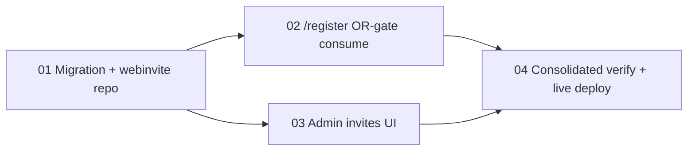

# Scopes — Spec 093 (Admin-Generated Registration Invites, DB-Backed, Single-Use)

**Spec:** [spec.md](spec.md) · **Design:** [design.md](design.md) · **Evidence:** [report.md](report.md) · **User acceptance:** [uservalidation.md](uservalidation.md)
**Workflow mode:** full-delivery · **Status ceiling:** done · **Layout:** single-file (4 scopes) · **Release train:** `mvp` · **Flags introduced:** none

---

## Execution Outline

A short, reviewable map of the plan. Read this before the per-scope detail.

### Phase Order (sequential, DAG-gated)

1. **SCOPE-01 — Migration `058` + `webinvite` repo + `webcreds.HashAndInsertTx` (data foundation).** The PostgreSQL table, the new `internal/auth/webinvite` package (SHA-256 hash, `Generate` / `IsLive` / `ConsumeAndCreate`-atomic-tx / `List` / `Revoke`), and the `webcreds.HashAndInsertTx` free function. No HTTP behavior yet. The single shared foundation both later verticals consume.
2. **SCOPE-02 — `/register` OR-gate (DB-invite consume vertical).** Widen `HandleWebRegister`'s Step-3 gate to `staticOK OR dbLive` and add the Step-7 atomic DB-invite branch (`ConsumeAndCreate` + `HashAndInsertTx`). Wire `deps.WebInvites` in `cmd/core/wiring.go`. End-to-end: a new person registers once with a DB invite → account + invite-used in one tx. Static secret unchanged.
3. **SCOPE-03 — Admin invites UI (generate / list / revoke vertical).** New `internal/web/invites.go` + `internal/web/invites_templates.go` (methods on the existing `CardRewardsWebHandler`, reusing the spec-092 `head`/`cardrewards-nav`/`foot` chrome), the 3 `/cards/admin/invites` routes inside the existing `webAuthMiddleware` block, the `SetInvites` late-wire, and the `/cards/admin` "Account Invites →" link. End-to-end: operator generates → one-time reveal → list → revoke, CSP-clean.
4. **SCOPE-04 — Consolidated verification + live home-lab deploy proof.** Full `webinvite` + register + invites-UI suites green; spec-091 `/register` (static) + spec-092 `/cards` regression UNCHANGED; atomic single-use proven under concurrency; CSP guard green; the `058` migration runs on deploy and a live generate→register→used→reuse-rejected cycle passes on the deployed core.

### New Types & Signatures (the "header file" view)

```go
// SCOPE-01 — internal/auth/webinvite/repo.go (new package)
type InviteStatus string
const ( StatusOutstanding InviteStatus = "outstanding"; StatusUsed; StatusExpired; StatusRevoked )
type InviteRow struct { ID string; Label *string; CreatedBy string; CreatedAt time.Time
    ExpiresAt, UsedAt *time.Time; UsedBy *string; RevokedAt *time.Time; Status InviteStatus } // NO token_hash, NO plaintext
type ConsumeOutcome int   // ConsumeInvalid | ConsumeCreated | ConsumeRolledBack
type RevokeOutcome  int   // RevokeNoop | RevokeDone
type Repo interface {
    Generate(ctx, createdBy, label string, ttl time.Duration) (plaintext string, err error)
    IsLive(ctx, tokenHash string) (bool, error)                       // non-mutating gate read
    ConsumeAndCreate(ctx, tokenHash, usedBy string, onClaimed func(ctx, pgx.Tx) error) (ConsumeOutcome, error)
    List(ctx) ([]InviteRow, error)                                    // metadata only
    Revoke(ctx, id string) (RevokeOutcome, error)
}
func HashToken(plaintext string) string                              // lowercase-hex SHA-256
type PostgresRepo struct{ pool *pgxpool.Pool }
func NewPostgresRepo(pool *pgxpool.Pool) (*PostgresRepo, error)       // nil-guard (mirrors webcreds)

// SCOPE-01 — internal/auth/webcreds/repo.go (additive free function; UpsertPassword UNCHANGED)
func HashAndInsertTx(ctx context.Context, tx pgx.Tx, username, password string) error // 23505 → ErrUserExists

// SCOPE-02 — internal/api/health.go (additive field on Dependencies)
type Dependencies struct { /* … WebCredentials webcreds.Repo … */ WebInvites webinvite.Repo /* nil ⇒ DB branch not taken */ }
// SCOPE-02 — internal/api/web_register.go : HandleWebRegister Step-3 gate = staticOK OR dbLive; Step-7 branches by path
//   logRegisterReject reason enum UNCHANGED (gate|field|duplicate|server); DB + static share the "gate" reason

// SCOPE-03 — internal/web/invites.go (new; methods on the EXISTING CardRewardsWebHandler)
func (h *CardRewardsWebHandler) SetInvites(r webinvite.Repo)                 // late-wire (mirrors SetTriggers); nil ⇒ 503
func (h *CardRewardsWebHandler) AdminInvitesPage(w, r)                       // GET  /cards/admin/invites
func (h *CardRewardsWebHandler) AdminInviteGenerate(w, r)                    // POST /cards/admin/invites      (200 render-once)
func (h *CardRewardsWebHandler) AdminInviteRevoke(w, r)                      // POST /cards/admin/invites/{id}/revoke (303 PRG)
type inviteListVM struct{ Title string; Invites []webinvite.InviteRow; Notice string }
type inviteRevealVM struct{ Title, Token, Label string; Invites []webinvite.InviteRow } // Token ONLY here
// SCOPE-03 — internal/web/invites_templates.go : const cardRewardsInviteTemplates
//   {{define "cardrewards-invites.html"}} + {{define "cardrewards-invite-reveal.html"}} (parsed in NewCardRewardsWebHandler)
```

New files: `internal/db/migrations/058_web_registration_invites.sql`, `internal/auth/webinvite/repo.go` (+ tests), `internal/web/invites.go`, `internal/web/invites_templates.go`, `web/pwa/tests/cardrewards_invites.spec.ts`. **No change to `internal/api/router.go`** (the `/invites` routes inherit `webAuthMiddleware` via the existing `CardRewardsWebHandler` mount; the public rate-limited `/register` block is untouched).

### Validation Checkpoints (where breakage is caught before the next scope)

| After | Gate command(s) | Catches |
|-------|-----------------|---------|
| SCOPE-01 | `./smackerel.sh check` + `./smackerel.sh test unit --go` + `./smackerel.sh test integration` (webinvite repo + concurrent-consume + migration-apply) | A broken atomic single-use, a `List` that leaks the hash, a non-applying migration, or a `HashAndInsertTx` that mis-maps `23505` — before any handler consumes the repo. |
| SCOPE-02 | `./smackerel.sh test integration` (DB-invite consume path) + spec-091 static `/register` regression | A non-enumerating gate regression, a double-spend, a duplicate-username that wrongly burns the invite, or a static-path regression — before the UI is built. |
| SCOPE-03 | `./smackerel.sh test e2e-ui cardrewards` (invites spec + CSP guard) + spec-092 `/cards` regression | A token leaking into the GET list DOM, a CSP violation, an anonymous-reachable invite page, or a `/cards` dashboard regression — before consolidation. |
| SCOPE-04 | full `unit` + `integration` + `e2e-ui` + live home-lab deploy e2e | Any cross-scope regression and the real-stack generate→register→used→reuse-rejected success signal (incl. the `058` migration applying on deploy). |

---

## Scope Summary & Dependency Graph

| # | Scope | Depends On | Surfaces | Status |
|---|-------|------------|----------|--------|
| 01 | Migration `058` + `webinvite` repo + `webcreds.HashAndInsertTx` | — | DB (migration), Backend (repo), Security | Done |
| 02 | `/register` OR-gate (DB-invite consume) + wiring | 01 | Backend, Security | Done |
| 03 | Admin invites UI (generate / list / revoke) | 01 | UI (server-rendered), Backend | Done |
| 04 | Consolidated verification + live home-lab deploy proof | 02, 03 | Deploy, UI (live e2e), Backend | Done |

**Roots:** SCOPE-01 is the single shared data foundation (the `webinvite` repo + migration + `HashAndInsertTx`). SCOPE-02 (the public `/register` consume) and SCOPE-03 (the operator admin UI) are two **independent verticals** that each consume the SCOPE-01 repo (`cmd/core/wiring.go` constructs it once and fans it out to both via `deps.WebInvites` and `webHandler.SetInvites`). They are executed sequentially `02 → 03`; neither functionally blocks the other. SCOPE-04 consolidates and proves the full feature live.



> **Why this is vertical-by-outcome, not horizontal-by-layer (plan authority).** SCOPE-01 is a genuine **shared foundation** — a single `webinvite` repo + migration that *two distinct consumers* need; it cannot be split (you cannot ship half a repo) and it carries its own DB-backed integration tests (concurrent consume, migration-apply), so it is independently verifiable. SCOPE-02 and SCOPE-03 are each a **full vertical slice** for one user outcome — SCOPE-02 exercises `/register` → repo → DB end-to-end (a person registers with an invite), SCOPE-03 exercises UI → handler → repo → DB end-to-end (an operator generates/lists/revokes) with live `e2e-ui`. This is the design's explicit decomposition (design.md → Purpose & Scope: "one migration, one new `webinvite` repo, three new admin handlers, one modified register handler") and mirrors the proven spec-091 shape. It is **not** a horizontal stack of DB-only → service-only → API-only → UI-only scopes with no end-to-end coverage until the end.
>
> **Not a capability-foundation family (DE4 / G094).** design.md → "Capability-Foundation Note" + "Single-Implementation Justification" establish that the invite's "two sources" (static secret + DB invite) are **two literal branches in one handler**, NOT a pluggable `InviteSource` provider seam. There is exactly one concrete `webinvite.PostgresRepo`, one admin page, one widened gate. SCOPE-01 is therefore an ordinary data-layer dependency, **not** a `foundation:true` capability foundation, and no overlay/provider scopes exist.

---

## Evidence Standard (applies to every scope below)

- **No DoD box is pre-checked.** Every item starts `[ ]`. It is checked `[x]` ONLY by the implement/test phase after the command is actually run.
- **Each `[x]` item requires ≥10 lines of raw terminal output** captured at implement-time, recorded under the matching `report.md` anchor, with a `**Claim Source:**` tag (`executed` | `interpreted` | `not-run`).
- **Test Plan ↔ DoD parity is enforced:** in every scope the number of Test-Plan rows equals the number of test-related DoD items (the grouped *Build Quality Gate* and the pure-implementation item are separate, uncounted).
- **No internal mocks.** `webinvite` repo + `/register` consume + invite-UI handler tests drive the real code paths. The atomic / concurrent-consume / duplicate-rollback tests run against a **real ephemeral PostgreSQL test DB** (no mock of the repo); handler unit tests use the sanctioned `webcreds.Repo` / `webinvite.Repo` test-double pattern (the spec-070 `fakeRepo` idiom in [web_login_credential_test.go](../../internal/api/web_login_credential_test.go)), NOT an internal mock of business logic.
- **Live-stack authenticity (`integration`, `e2e-ui`, SCOPE-04 live):** these rows MUST hit the real running stack — no `page.route` / `context.route` / `intercept` / `msw` / `nock`. Reclassify any intercepting test out of the live category.
- **Value-safe throughout (AC-11):** the invite **plaintext**, its **hash**, and any **password** never appear in evidence, logs, error bodies, redirects, list views, or template output. The one-time plaintext appears ONLY in the generate-200 body. Operator secret entry (the static-secret regression) is typed into a protected terminal / sops; the agent never sees it.
- **Non-enumeration (AC-7):** every gate failure — DB-invalid, static-wrong, used, revoked, expired, disabled — must yield the byte-identical `registerGateBanner` + `401` + blank-secret re-render. Tests assert byte-identity, not just "rejected".

---

## DoD-to-Scenario Fidelity

Each Gherkin scenario in the per-scope sections below is preserved 1:1 in that scope's Test Plan and its `### Definition of Done — Tiered Validation`, and is mapped to its test(s) + evidence anchor in [scenario-manifest.json](scenario-manifest.json) (19 scenarios, one manifest entry per scenario). This is the fidelity index for the per-scope DoD checklists that follow; it intentionally carries no checklist of its own (the binding DoD items live in each scope's own section).

---

## SCOPE-01 — Migration `058` + `webinvite` repo + `webcreds.HashAndInsertTx`

**Status:** Done
**Depends On:** —
**Surfaces:** DB (`internal/db/migrations/058_web_registration_invites.sql`), Backend (`internal/auth/webinvite/`), Security (`internal/auth/webcreds/repo.go`)

Build the single shared data foundation: the PostgreSQL `web_registration_invites` table (hash-only, no plaintext column), the new `internal/auth/webinvite` package (SHA-256 hashing, atomic single-use consume, metadata-only list, guarded revoke), and the `webcreds.HashAndInsertTx` free function that lets the consume tx create the account on the **same** transaction. No HTTP behavior changes in this scope.

### Gherkin Scenarios

```gherkin
Scenario: SCN-093-01 — Generate stores ONLY the hash and returns the plaintext exactly once (UC-1)
  Given a webinvite.PostgresRepo backed by an ephemeral test database
  When Generate(ctx, "operator", "for the new analyst", 7*24h) is called
  Then it returns a non-empty plaintext beginning "inv_"
  And exactly one web_registration_invites row exists holding token_hash = HashToken(plaintext)
  And the stored row contains NO plaintext column and the plaintext is returned only from Generate

Scenario: SCN-093-02 — ConsumeAndCreate is atomic single-use; a second consume is rejected (UC-3 / AC-5)
  Given an OUTSTANDING invite whose hash is known
  When ConsumeAndCreate(ctx, hash, "newcomer", insertAccount) is called once
  Then it returns ConsumeCreated, the account-insert callback ran, and used_at/used_by are set
  When ConsumeAndCreate is called a SECOND time with the same hash and a different username
  Then it returns ConsumeInvalid, no second account is created, and used_at/used_by are unchanged

Scenario: SCN-093-03 — Two concurrent consumes of one invite yield exactly one success (AC-5 TOCTOU)
  Given an OUTSTANDING invite and two goroutines racing ConsumeAndCreate on its hash
  When both run concurrently against the real test database
  Then exactly one returns ConsumeCreated and the other returns ConsumeInvalid
  And exactly one web_user_credentials row was created (no double-spend)

Scenario: SCN-093-04 — An expired invite is not live and cannot be consumed (UC-4)
  Given an invite whose expires_at is in the past
  When IsLive(ctx, hash) is called
  Then it returns false
  And ConsumeAndCreate(ctx, hash, ...) returns ConsumeInvalid and creates no account

Scenario: SCN-093-05 — A duplicate username rolls the whole tx back; the invite is NOT consumed
  Given an OUTSTANDING invite and an existing web_user_credentials row for "taken"
  When ConsumeAndCreate(ctx, hash, "taken", HashAndInsertTx) runs
  Then it returns ConsumeRolledBack with webcreds.ErrUserExists
  And the invite's used_at/used_by stay NULL (the invite can be retried with a different username)

Scenario: SCN-093-06 — List returns metadata only — never the hash, never the plaintext (UC-8)
  Given several invites in mixed states (outstanding, used, revoked, expired)
  When List(ctx) is called
  Then each InviteRow carries id, label, created_by, created_at, expires_at, used_at, used_by, revoked_at, and a derived Status
  And no field of any returned row contains token_hash or any plaintext token

Scenario: SCN-093-07 — Revoke transitions an outstanding invite and is a no-op otherwise (UC-9)
  Given an OUTSTANDING invite
  When Revoke(ctx, id) is called
  Then it returns RevokeDone, revoked_at is set, and IsLive(ctx, hash) is now false
  When Revoke is called again (or on a used/unknown id)
  Then it returns RevokeNoop and changes nothing
```

### Implementation Plan

Per design.md → "DB Migration", "New Repo — `internal/auth/webinvite/`", and the `webcreds.HashAndInsertTx` block:

1. **`internal/db/migrations/058_web_registration_invites.sql`** (new) — additive, forward-only. `CREATE TABLE IF NOT EXISTS web_registration_invites` with `id TEXT PRIMARY KEY DEFAULT gen_random_uuid()::text` (the [019_expense_tracking.sql](../../internal/db/migrations/019_expense_tracking.sql) PK convention), `token_hash TEXT NOT NULL UNIQUE`, `label TEXT`, `created_by TEXT NOT NULL`, `created_at TIMESTAMPTZ NOT NULL DEFAULT now()`, `expires_at`/`used_at`/`used_by`/`revoked_at` (all nullable), plus the descriptive `COMMENT`s verbatim from design.md (the [044_web_user_credentials.sql](../../internal/db/migrations/044_web_user_credentials.sql) additive style). **No plaintext column.** `058` is the next sequential number (high-water `057_card_rewards.sql`).
2. **`internal/auth/webinvite/repo.go`** (new) — package `webinvite`, importing only `crypto/rand`, `crypto/sha256`, `encoding/base64`, `encoding/hex`, `pgx/v5` + `pgxpool` (does NOT import `webcreds`). Define `InviteStatus` (+ the 4 consts), `InviteRow` (hash-excluded projection, mirrors `webcreds.UserRow`), `ConsumeOutcome` (`ConsumeInvalid`/`ConsumeCreated`/`ConsumeRolledBack`), `RevokeOutcome` (`RevokeNoop`/`RevokeDone`), the `Repo` interface, `HashToken` (lowercase-hex `sha256.Sum256`), `PostgresRepo`, and `NewPostgresRepo(pool)` (nil-guard, mirrors `webcreds.NewPostgresRepo`). Method bodies per design.md spec: `Generate` (`inv_` + `base64.RawURLEncoding(crypto/rand 32B)`; `ttl>0 ⇒ expires_at=now()+ttl`, else `NULL`; `INSERT … RETURNING`-free; regenerate-once on the ~never hash collision), `IsLive` (non-mutating `SELECT 1 … WHERE used_at IS NULL AND revoked_at IS NULL AND (expires_at IS NULL OR expires_at > now())`), `ConsumeAndCreate` (one `pool.Begin` tx + `defer tx.Rollback`; guarded `UPDATE … RETURNING id`; `pgx.ErrNoRows ⇒ ConsumeInvalid`; else run `onClaimed(ctx, tx)`; error ⇒ `ConsumeRolledBack`; success ⇒ `Commit` + `ConsumeCreated`), `List` (`SELECT id,label,created_by,created_at,expires_at,used_at,used_by,revoked_at … ORDER BY created_at DESC`; **token_hash never selected**; derive `Status` per row against `time.Now()`), `Revoke` (guarded `UPDATE … SET revoked_at=now() WHERE id=$1 AND used_at IS NULL AND revoked_at IS NULL RETURNING id`; `ErrNoRows ⇒ RevokeNoop`).
3. **`internal/auth/webcreds/repo.go`** — add the package-level `HashAndInsertTx(ctx, tx pgx.Tx, username, password string) error` free function (per design.md): `ValidateUsername` → `Hash(password)` (argon2id) → `tx.Exec(INSERT INTO web_user_credentials (username, password_hash) …)`; map SQLSTATE `23505` (`*pgconn.PgError`) to the existing `ErrUserExists`; wrap other errors. **`UpsertPassword` is UNCHANGED** (NOT added to the `Repo` interface — zero interface churn / zero fake breakage).
4. **Tests** — `internal/auth/webinvite/repo_unit_test.go` (HashToken determinism + token-shape/at-rest-hash, DB-independent) and `tests/integration/web_registration_invite_test.go` (the DB-backed Generate/IsLive/ConsumeAndCreate outcomes/List/Revoke and the two-goroutine concurrent-consume race), plus a `webcreds` test (`internal/auth/webcreds/repo_test.go`) for `HashAndInsertTx` (insert + `ErrUserExists` on a unique violation). DB-backed tests use the repo's existing ephemeral-test-DB harness; no internal mocks.

**Shared-infrastructure note.** `internal/auth/webcreds/repo.go` is a shared contract. The change is **strictly additive** — one new free function alongside `UpsertPassword`, no edit to the `Repo` interface, no edit to `UpsertPassword`. The canary is the existing `webcreds` test suite staying green; no consumer-impact sweep is required because nothing existing is renamed or removed.

### Test Plan

| # | Test Type | Category | File/Location | Description | Command | Live System |
|---|-----------|----------|---------------|-------------|---------|-------------|
| 1 | unit | unit | `internal/auth/webinvite/repo_unit_test.go` | `Generate` stores only `HashToken(plaintext)`, returns the plaintext once; `HashToken` is deterministic; the row has no plaintext (SCN-01) | `./smackerel.sh test unit --go --go-run 'TestWebInvite_Generate'` | No |
| 2 | integration | integration | `tests/integration/web_registration_invite_test.go` | `ConsumeAndCreate` returns `ConsumeCreated` + sets `used_*` first time; a 2nd consume of the same hash ⇒ `ConsumeInvalid`, no 2nd account, `used_*` unchanged (SCN-02) | `./smackerel.sh test integration` | Yes |
| 3 | integration | integration | `tests/integration/web_registration_invite_test.go` | two goroutines race `ConsumeAndCreate` on one hash ⇒ exactly one `ConsumeCreated`, one `ConsumeInvalid`, exactly one account row (SCN-03) | `./smackerel.sh test integration` | Yes |
| 4 | integration | integration | `tests/integration/web_registration_invite_test.go` | a past-`expires_at` invite ⇒ `IsLive=false` AND `ConsumeAndCreate=ConsumeInvalid`, no account (SCN-04) | `./smackerel.sh test integration` | Yes |
| 5 | integration | integration | `tests/integration/web_registration_invite_test.go` | live invite + taken username ⇒ `ConsumeRolledBack` + `ErrUserExists`; invite `used_*` stays `NULL` (SCN-05) | `./smackerel.sh test integration` | Yes |
| 6 | integration | integration | `tests/integration/web_registration_invite_test.go` | `List` over mixed-state invites returns metadata + derived `Status`; no row exposes `token_hash` or plaintext (SCN-06) | `./smackerel.sh test integration` | Yes |
| 7 | integration | integration | `tests/integration/web_registration_invite_test.go` | `Revoke` on outstanding ⇒ `RevokeDone` + `revoked_at` set + `IsLive=false`; repeat / used / unknown id ⇒ `RevokeNoop` (SCN-07) | `./smackerel.sh test integration` | Yes |
| 8 | unit | unit | `internal/auth/webcreds/repo_test.go` | `HashAndInsertTx` inserts on a caller tx; maps SQLSTATE `23505` → `ErrUserExists`; `UpsertPassword` unchanged | `./smackerel.sh test unit --go --go-run 'TestHashAndInsertTx'` | No |
| 9 | integration | integration | `tests/integration/web_registration_invite_test.go` (migrate fixture) | migration `058` applies cleanly on the ephemeral test DB; `web_registration_invites` + all columns exist; no plaintext column | `./smackerel.sh test integration` | Yes |

### Definition of Done — Tiered Validation

**Core Items**

- [x] (impl) Migration `058` + the `internal/auth/webinvite` package (`Generate`/`IsLive`/`ConsumeAndCreate`/`List`/`Revoke`/`HashToken`/`NewPostgresRepo` nil-guard) + `webcreds.HashAndInsertTx` land exactly per design.md (hash-only table, atomic single-use, decoupled callback, `UpsertPassword` unchanged). — Evidence: [report.md#scope-01-impl]. **Claim Source:** executed.
- [x] (test 1) `Generate` hashed-at-rest + plaintext-once + `HashToken` determinism (≥10 lines raw). — Evidence: [report.md#scope-01-generate].
- [x] (test 2) `ConsumeAndCreate` atomic single-use; reuse ⇒ `ConsumeInvalid` (≥10 lines raw). — Evidence: [report.md#scope-01-consume-singleuse].
- [x] (test 3) concurrent consume ⇒ exactly one wins, one account (≥10 lines raw). — Evidence: [report.md#scope-01-concurrent].
- [x] (test 4) expired invite ⇒ `IsLive=false` + `ConsumeInvalid` (≥10 lines raw). — Evidence: [report.md#scope-01-expired].
- [x] (test 5) duplicate username ⇒ `ConsumeRolledBack` + `ErrUserExists`, invite unconsumed (≥10 lines raw). — Evidence: [report.md#scope-01-dup-rollback].
- [x] (test 6) `List` metadata-only — no `token_hash`, no plaintext (≥10 lines raw). — Evidence: [report.md#scope-01-list].
- [x] (test 7) `Revoke` done/noop + revoked-not-live (≥10 lines raw). — Evidence: [report.md#scope-01-revoke].
- [x] (test 8) `webcreds.HashAndInsertTx` insert + `ErrUserExists` on `23505` (≥10 lines raw). — Evidence: [report.md#scope-01-hashandinsert].
- [x] (test 9) migration `058` applies cleanly; table + columns exist; no plaintext column (≥10 lines raw). — Evidence: [report.md#scope-01-migration].

**Build Quality Gate (grouped)**

- [x] Build Quality Gate passes as one block: `./smackerel.sh check` + `./smackerel.sh test unit --go` + `./smackerel.sh lint` + `./smackerel.sh format --check` exit 0; **no `${VAR:-default}` fallback introduced** (smackerel-no-defaults SST); `bash .github/bubbles/scripts/artifact-lint.sh specs/093-admin-generated-registration-invites` exits 0; zero warnings; zero deferrals. — Evidence: [report.md#scope-01-build-gate].

---

## SCOPE-02 — `/register` OR-gate (DB-invite consume) + wiring

**Status:** Done
**Depends On:** 01
**Surfaces:** Backend (`internal/api/web_register.go`, `internal/api/health.go`, `cmd/core/wiring.go`), Security (gate + atomic consume)

Widen the spec-091 `/register` gate to accept a **live DB invite OR** the static secret, and create the account + atomically consume the invite in one transaction on the DB-invite path — without regressing the static-secret path or the non-enumeration contract.

### Gherkin Scenarios

```gherkin
Scenario: SCN-093-08 — A new person registers once with a live DB invite (UC-2)
  Given an OUTSTANDING DB invite and no web_user_credentials row for "newcomer"
  When the new person POSTs /register with that plaintext invite, "newcomer", and two matching passwords
  Then a web_user_credentials row is created for "newcomer" with an argon2id hash
  And the invite is atomically marked used (used_at set, used_by = "newcomer") in the SAME tx
  And the response is 303 → /login?registered=1 with NO Set-Cookie

Scenario: SCN-093-09 — Reusing a consumed DB invite is rejected (single-use) (UC-3)
  Given a DB invite that was already consumed
  When someone POSTs /register with that same invite token and a new username
  Then registration is rejected with the generic banner and no second account is created
  And the invite's used_at/used_by are unchanged

Scenario: SCN-093-10 — The static secret still registers and consumes NOTHING (UC-5)
  Given WEB_REGISTRATION_INVITE_TOKEN is configured non-empty and no DB invite is supplied
  When the operator POSTs /register with the correct static secret, a new username, and matching passwords
  Then registration succeeds exactly as in spec 091 (account created, 303 → /login), constant-time compared
  And no web_registration_invites row is marked used (the static path is reusable bootstrap)

Scenario: SCN-093-11 — Every invalid gate input returns the byte-identical generic banner (UC-6 / AC-7)
  Given the gate is enabled (a static secret OR DB invites exist)
  When /register is POSTed with a token that is neither a live DB invite nor the static secret
    (and also: a wrong static secret, and the disabled case)
  Then all return the byte-identical 401 + "Registration is not available or the invite is invalid."
  And the response shape never distinguishes a bad DB invite from a wrong static secret from disabled

Scenario: SCN-093-12 — A duplicate username on the DB-invite path rolls back; the invite is NOT consumed
  Given an OUTSTANDING DB invite and an existing account "taken"
  When someone POSTs /register with that invite, username "taken", and matching passwords
  Then registration is rejected with the spec-091 duplicate banner (409)
  And the invite's used_at/used_by stay NULL (the operator can retry the invite with a different username)
```

### Implementation Plan

Per design.md → "`internal/api/web_register.go` — widen the gate", "Dependency Wiring", and "Router Wiring":

1. **`internal/api/health.go`** — add `WebInvites webinvite.Repo` to `Dependencies` (right after `WebRegistrationInviteToken`), with the design's doc comment (`nil` when no Postgres pool ⇒ DB branch simply not taken).
2. **`internal/api/web_register.go` `HandleWebRegister`** — replace Step 3 with the OR-gate from design decision (e): disabled fail-loud check (`d.WebCredentials == nil || (configured == "" && d.WebInvites == nil)`) → `staticOK = configured != "" && subtle.ConstantTimeCompare(...) == 1` → `dbLive = !staticOK && d.WebInvites != nil && IsLive(HashToken(invite))` (a DB error keeps `dbLive=false`, value-safe) → `!staticOK && !dbLive ⇒ logRegisterReject(r,"gate") + registerGateBanner + 401`. Steps 4–6 (field/password/username validation) are **UNCHANGED** and still run only past the gate. Step 7 branches: `staticOK ⇒` the **unchanged** `d.WebCredentials.UpsertPassword(...true)` (no consume); else `dbLive ⇒` `d.WebInvites.ConsumeAndCreate(ctx, HashToken(invite), username, func(ctx, tx){ return webcreds.HashAndInsertTx(ctx, tx, username, password) })` with the design's outcome switch (`ErrUserExists ⇒ duplicate banner 409`; other err ⇒ server banner 500; `ConsumeInvalid ⇒ gate banner 401` (lost-race); `ConsumeCreated ⇒` shared success 303). `logRegisterReject` reason enum is **unchanged** (`gate|field|duplicate|server`); the invite plaintext, hash, and username value are never logged.
3. **`cmd/core/wiring.go` `wireCardRewardsHandler`** — after constructing the pool-guarded card-rewards handler, build `inviteRepo, err := webinvite.NewPostgresRepo(svc.pg.Pool)` (pool already non-nil here) and set `deps.WebInvites = inviteRepo` (the `webHandler.SetInvites(inviteRepo)` fan-out lands in SCOPE-03 in the same function; additive, non-overlapping lines).
4. **`internal/api/router.go`** — **NO CHANGE.** The public rate-limited `/register` block (`r.Group(r.Use(httprate.LimitByIP(20, 1*time.Minute)))` → `POST /v1/web/register`) stays exactly where spec 091 put it.
5. **Tests** — `internal/api/web_register_invite_test.go` (new): the OR-gate branch selection + non-enumeration byte-identity (unit, `httptest` + `fakeRepo` doubles); the DB-invite consume+create, reuse-rejected, duplicate-rollback, and static-still-works paths (integration, real ephemeral DB). The spec-091 static `/register` + `/login` regression suite runs unchanged.

**Consumer-impact note.** The `/register` external contract (request fields, banner strings, statuses, no-cookie 303) is **unchanged** — the gate is *widened additively* (now also accepts a DB invite). No route, path, identifier, or response shape is renamed or removed, so no consumer-trace sweep beyond the spec-091 regression is required.

### Test Plan

| # | Test Type | Category | File/Location | Description | Command | Live System |
|---|-----------|----------|---------------|-------------|---------|-------------|
| 1 | unit | unit | `internal/api/web_register_invite_test.go` | OR-gate branch selection: static-first (constant-time), DB-second (`IsLive`), disabled fail-loud (`WebCredentials==nil` or empty-secret+`WebInvites==nil`) | `./smackerel.sh test unit --go --go-run 'TestWebRegister_OrGate'` | No |
| 2 | unit | unit | `internal/api/web_register_invite_test.go` | non-enumeration: DB-invalid, static-wrong, and disabled all return the byte-identical `401` + `registerGateBanner` + blank-secret re-render (SCN-11) | `./smackerel.sh test unit --go --go-run 'TestWebRegister_NonEnumerating'` | No |
| 3 | integration | integration | `internal/api/web_register_invite_test.go` | DB-invite register consumes + creates the account (argon2id) with `used_*` set in one tx; 303 → `/login?registered=1`, no `Set-Cookie` (SCN-08) | `./smackerel.sh test integration` | Yes |
| 4 | integration | integration | `internal/api/web_register_invite_test.go` | a reused (already-consumed) invite ⇒ generic banner, no 2nd account, `used_*` unchanged (SCN-09) | `./smackerel.sh test integration` | Yes |
| 5 | integration | integration | `internal/api/web_register_invite_test.go` | duplicate-username on the DB path ⇒ `409` duplicate banner; invite `used_*` stays `NULL` (rollback) (SCN-12) | `./smackerel.sh test integration` | Yes |
| 6 | integration | integration | `internal/api/web_register_invite_test.go` | the static secret still registers an account and marks NO invite used (bootstrap reusable) (SCN-10) | `./smackerel.sh test integration` | Yes |
| 7 | regression | integration | spec-091 `internal/api/web_register_test.go` (unchanged) | the spec-091 static-secret `/register` + `/login` flows behave byte-identically after the gate edit (UC-10 partial) | `./smackerel.sh test integration` | Yes |

### Definition of Done — Tiered Validation

**Core Items**

- [x] (impl) The OR-gate (`staticOK OR dbLive`, disabled fail-loud, value-safe), the Step-7 DB-invite atomic branch (`ConsumeAndCreate` + `HashAndInsertTx`, outcome switch), the `Dependencies.WebInvites` field, and the `cmd/core/wiring.go` `deps.WebInvites` fan-out land exactly per design.md; `logRegisterReject` enum unchanged; `internal/api/router.go` unchanged. — Evidence: [report.md#scope-02-impl]. **Claim Source:** executed.
- [x] (test 1) OR-gate branch selection (static-first / DB-second / disabled) (≥10 lines raw). — Evidence: [report.md#scope-02-gate-branch].
- [x] (test 2) non-enumeration byte-identity across DB-invalid / static-wrong / disabled (≥10 lines raw). — Evidence: [report.md#scope-02-nonenum].
- [x] (test 3) DB-invite consume+create in one tx, 303 no-cookie (≥10 lines raw). — Evidence: [report.md#scope-02-consume].
- [x] (test 4) reused invite ⇒ generic banner, no 2nd account (≥10 lines raw). — Evidence: [report.md#scope-02-reuse].
- [x] (test 5) duplicate username ⇒ 409, invite unconsumed (rollback) (≥10 lines raw). — Evidence: [report.md#scope-02-dup].
- [x] (test 6) static secret registers + consumes nothing (≥10 lines raw). — Evidence: [report.md#scope-02-static].
- [x] (test 7) spec-091 static `/register` + `/login` regression unchanged (≥10 lines raw). — Evidence: [report.md#scope-02-091-regression].

**Build Quality Gate (grouped)**

- [x] Build Quality Gate passes as one block: `./smackerel.sh check` + `./smackerel.sh lint` + `./smackerel.sh format --check` exit 0; **no `${VAR:-default}` fallback introduced**; value-safe (no token/hash/password in logs or output); `bash .github/bubbles/scripts/artifact-lint.sh specs/093-admin-generated-registration-invites` exits 0; zero warnings; zero deferrals. — Evidence: [report.md#scope-02-build-gate].

---

## SCOPE-03 — Admin invites UI (generate / list / revoke)

**Status:** Done
**Depends On:** 01
**Surfaces:** UI (server-rendered: `internal/web/invites.go`, `internal/web/invites_templates.go`, `internal/web/cardrewards_dashboard_templates.go`), Backend (`internal/web/cardrewards.go`, `cmd/core/wiring.go`)

Add the CSP-clean operator admin surface — generate (one-time reveal), list (metadata-only), revoke (PRG) — as methods on the existing `CardRewardsWebHandler`, reusing the spec-092 chrome with zero shared-template edits, mounted behind the existing `webAuthMiddleware`.

### UI Scenario Matrix

| Scenario | Preconditions | Steps | Expected (user-visible assertion) | Test Type | Evidence |
|----------|---------------|-------|-----------------------------------|-----------|----------|
| Anonymous blocked | No session | GET `/cards/admin/invites` | `webAuthMiddleware` redirects to `/login` (or 401); the invites page never renders; no row created | e2e-ui / unit | [report.md#scope-03-anon] |
| Generate → one-time reveal | Logged-in operator | POST generate (optional label) | HTTP 200 render-once; a `role="status"` callout shows a focusable readonly token input containing `inv_…` exactly once | e2e-ui | [report.md#scope-03-e2e] |
| List metadata-only | ≥1 invite exists | GET `/cards/admin/invites` | table shows label / created-by / created / status badge / actions; the plaintext token and the hash are ABSENT from the DOM | e2e-ui | [report.md#scope-03-e2e] |
| Revoke (PRG) | An OUTSTANDING invite | open `<details>` confirm → POST revoke | 303 → GET list; the row now shows the `✕ Revoked` badge | e2e-ui | [report.md#scope-03-e2e] |
| CSP-clean throughout | Logged-in operator | generate → reveal → list → revoke | the spec-077 CSP guard records zero violations; no inline `<script>`/handler | e2e-ui | [report.md#scope-03-csp] |
| `/cards/admin` entry link | Logged-in operator | open `/cards/admin` | an "Account Invites →" `.btn .btn-secondary` link is present and navigates to `/cards/admin/invites` | e2e-ui | [report.md#scope-03-e2e] |

### Gherkin Scenarios

```gherkin
Scenario: SCN-093-13 — Operator generates an invite; the plaintext is shown exactly once (UC-1)
  Given a logged-in operator on /cards/admin/invites
  When the operator submits the generate form (optional label)
  Then the response is HTTP 200 rendering the invites page once with a role="status" callout
  And the one-time plaintext token (inv_…) appears in a focusable readonly field exactly once
  And the subsequent GET list never shows that plaintext or its hash

Scenario: SCN-093-14 — The invite list shows metadata only, no secrets (UC-8)
  Given several invites exist in mixed states
  When the logged-in operator opens GET /cards/admin/invites
  Then each row shows label, created_by, created_at, a status badge, and (if applicable) used_by
  And neither the plaintext token nor the token hash appears anywhere in the rendered page

Scenario: SCN-093-15 — Operator revokes an outstanding invite via PRG (UC-9)
  Given an OUTSTANDING invite in the list
  When the operator opens its CSS-only <details> confirm and POSTs revoke
  Then the response is 303 → GET /cards/admin/invites
  And the invite's row now renders the ✕ Revoked badge
  And a RevokeNoop (stale-page race) instead shows a non-enumerating "already used or revoked" banner

Scenario: SCN-093-16 — A not-logged-in user cannot reach the invite pages (UC-7)
  Given an anonymous browser with no valid session
  When it requests GET or POST /cards/admin/invites
  Then webAuthMiddleware rejects it (401 / redirect to /login)
  And no invite is generated and no row is created

Scenario: SCN-093-17 — The invite surface is CSP-clean (spec-077 guard)
  Given the spec-077 CSP guard is attached
  When the operator walks generate → one-time reveal → list → revoke
  Then zero CSP violations are recorded (no inline <script>, no onclick/onsubmit, no 'unsafe-inline')
  And the one-time token is absent from the GET list DOM (adversarial assertion)
```

### Implementation Plan

Per design.md → "Template placement", "Handlers — `internal/web/invites.go`", "`internal/web/invites_templates.go`", "Router Wiring", and "Dependency Wiring":

1. **`internal/web/invites.go`** (new) — methods on the **existing** `CardRewardsWebHandler`: `SetInvites(r webinvite.Repo)` (late-wire, mirrors `SetTriggers`; sets the new `Invites` field; `nil ⇒ 503`), `AdminInvitesPage` (`GET`: `503` if nil, else `List` → render `cardrewards-invites.html` with `inviteListVM{Title:"Admin", Invites, Notice}` — the `?notice=race` banner from a revoke no-op), `AdminInviteGenerate` (`POST`: parse+trim+cap the optional `label`; `createdBy := sessionIdentity(r)`; `Generate(ctx, createdBy, label, 7*24*time.Hour)`; error ⇒ value-safe `role="alert"` 500 re-render (never echo the token); success ⇒ re-`List` + render `cardrewards-invite-reveal.html` with `inviteRevealVM{Title:"Admin", Token: plaintext, Label, Invites}` at **HTTP 200**), `AdminInviteRevoke` (`POST`: `chi.URLParam(r,"id")` → `Revoke` → always `303 → /cards/admin/invites`; `RevokeNoop ⇒ ?notice=race`). Add `sessionIdentity(r)` (`auth.SessionFromContext` → `UserID` else `"operator"`; value-safe), the `Invites webinvite.Repo` field on `CardRewardsWebHandler`, and the `inviteListVM` / `inviteRevealVM` view models (`Token` exists ONLY on `inviteRevealVM`).
2. **`internal/web/invites_templates.go`** (new) — `const cardRewardsInviteTemplates` defining `{{define "cardrewards-invites.html"}}` (reuses `{{template "head" .}}` / `cardrewards-nav` / `foot`; generate `<form method="POST" action="/cards/admin/invites">` with optional `label`; the `{{if .Notice}}` alert-warning race banner; the metadata-only `.cr-table` with status badges; CSS-only `<details>` revoke-confirm per OUTSTANDING row; `.empty-state`) and `{{define "cardrewards-invite-reveal.html"}}` (the `role="status" aria-live="polite"` one-time callout: focusable readonly `<input aria-label="One-time invite token" value="{{.Token}}">`, copy hint, `Done — back to invites` `.btn-secondary`, then the same metadata-only table). **No token/hash in `cardrewards-invites.html`; the token only in the reveal template.** No inline `<script>`.
3. **`internal/web/cardrewards.go`** — parse `cardRewardsInviteTemplates` in `NewCardRewardsWebHandler` right after `cardRewardsInsightsTemplates` (inherits the registered `FuncMap` + chrome); add the `/invites` sub-route **inside** the existing `r.Route("/cards/admin", …)` block: `r.Route("/invites", func(r){ r.Get("/", h.AdminInvitesPage); r.Post("/", h.AdminInviteGenerate); r.Post("/{id}/revoke", h.AdminInviteRevoke) })`. All three inherit `webAuthMiddleware` from the existing mount — **no `internal/api/router.go` change.**
4. **`internal/web/cardrewards_dashboard_templates.go`** — in `{{define "cardrewards-admin.html"}}` add a small "Account access" section with `<a class="btn btn-secondary" href="/cards/admin/invites">Account Invites →</a>`. Additive only; existing buttons / run-history / `data-*` hooks untouched.
5. **`cmd/core/wiring.go` `wireCardRewardsHandler`** — add `webHandler.SetInvites(inviteRepo)` (the `inviteRepo` constructed in SCOPE-02's edit to the same function; additive line).
6. **Tests** — Go handler/render unit tests in `internal/web/invites_test.go` (page renders metadata-only + `503` when nil; generate ⇒ 200 one-time token; revoke ⇒ 303 PRG + `?notice=race`; anonymous blocked by `webAuthMiddleware`), and `web/pwa/tests/cardrewards_invites.spec.ts` (Playwright live-stack e2e-ui: generate → reveal → Done → list (no token) → revoke (`<details>` → 303 → `✕ Revoked`); the `/cards/admin` link; `attachCSPGuard` + `assertNoCSPViolations` across the flow + the adversarial "token absent from GET list DOM" assertion, per `web/pwa/tests/_support/csp.ts`). Add `data-*` hooks for testability.

**Consumer-impact note.** All edits are additive: a new sibling file, new templates parsed alongside existing ones, a new sub-route inside the existing block, and a new link. No `/cards` route, template define, `FuncMap` entry, or `data-*` hook is renamed or removed — the spec-092 `/cards` surface is untouched (the canary is the spec-092 regression in the Test Plan).

### Test Plan

| # | Test Type | Category | File/Location | Description | Command | Live System |
|---|-----------|----------|---------------|-------------|---------|-------------|
| 1 | unit | ui-unit | `internal/web/invites_test.go` | `AdminInvitesPage` renders the metadata-only list (no token/hash) and returns `503` when `Invites == nil` (SCN-14) | `./smackerel.sh test unit --go --go-run 'TestAdminInvitesPage'` | No |
| 2 | unit | ui-unit | `internal/web/invites_test.go` | `AdminInviteGenerate` POST ⇒ HTTP 200 render-once showing the one-time token; an error path is value-safe (no token echoed) (SCN-13) | `./smackerel.sh test unit --go --go-run 'TestAdminInviteGenerate'` | No |
| 3 | unit | ui-unit | `internal/web/invites_test.go` | `AdminInviteRevoke` POST ⇒ `303` PRG to `/cards/admin/invites`; `RevokeNoop` ⇒ `?notice=race` banner (SCN-15) | `./smackerel.sh test unit --go --go-run 'TestAdminInviteRevoke'` | No |
| 4 | unit | unit | `internal/web/invites_test.go` (router auth) | an anonymous request to GET/POST `/cards/admin/invites` is rejected by `webAuthMiddleware` (401/redirect); no row created (SCN-16) | `./smackerel.sh test unit --go --go-run 'TestAdminInvites_AnonymousBlocked'` | No |
| 5 | e2e-ui | e2e-ui | `web/pwa/tests/cardrewards_invites.spec.ts` | live stack: generate → one-time reveal (token once, focusable readonly) → Done → list (row present, NO token) → revoke (`<details>` → 303 → `✕ Revoked`); the `/cards/admin` "Account Invites →" link works (SCN-13/14/15) | `./smackerel.sh test e2e-ui cardrewards` | Yes |
| 6 | e2e-ui | e2e-ui | `web/pwa/tests/cardrewards_invites.spec.ts` | the spec-077 CSP guard records zero violations across generate→reveal→list→revoke; adversarial: the one-time token is ABSENT from the GET list DOM (SCN-17) | `./smackerel.sh test e2e-ui cardrewards` | Yes |
| 7 | regression | e2e-ui | `web/pwa/tests/cardrewards_dashboard.spec.ts` (unchanged) | the spec-092 `/cards` dashboard + CSP posture render unchanged after the additive template/route edits | `./smackerel.sh test e2e-ui cardrewards` | Yes |

### Definition of Done — Tiered Validation

**Core Items**

- [x] (impl) `internal/web/invites.go` (3 handler methods on `CardRewardsWebHandler` + `SetInvites` + `sessionIdentity` + view models), `internal/web/invites_templates.go` (the 2 chrome-reusing templates, token only on reveal), the `/invites` sub-route in the existing `/cards/admin` block, the `/cards/admin` “Account Invites →” link, and the `webHandler.SetInvites` wiring land exactly per design.md; CSP-clean (no inline scripts); `internal/api/router.go` unchanged. — Evidence: [report.md#scope-03-impl]. **Claim Source:** executed.
- [x] (test 1) `AdminInvitesPage` renders metadata-only + `503` when nil (≥10 lines raw). — Evidence: [report.md#scope-03-page].
- [x] (test 2) `AdminInviteGenerate` ⇒ 200 one-time reveal; value-safe error (≥10 lines raw). — Evidence: [report.md#scope-03-generate].
- [x] (test 3) `AdminInviteRevoke` ⇒ 303 PRG + `?notice=race` (≥10 lines raw). — Evidence: [report.md#scope-03-revoke].
- [x] (test 4) anonymous blocked by `webAuthMiddleware`; no row created (≥10 lines raw). — Evidence: [report.md#scope-03-anon].
- [x] (test 5) e2e-ui generate→reveal→list→revoke + `/cards/admin` link (≥10 lines raw). — Evidence: [report.md#scope-03-e2e].
- [x] (test 6) e2e-ui CSP guard green + token absent from GET list DOM (adversarial) (≥10 lines raw). — Evidence: [report.md#scope-03-csp].
- [x] (test 7) spec-092 `/cards` dashboard regression unchanged (≥10 lines raw). — Evidence: [report.md#scope-03-092-regression].

**Build Quality Gate (grouped)**

- [x] Build Quality Gate passes as one block: `./smackerel.sh check` + `./smackerel.sh lint` + `./smackerel.sh format --check` exit 0; **no `${VAR:-default}` fallback introduced**; CSP-clean (no inline `<script>`/handlers, no `'unsafe-inline'`); value-safe (no token/hash in list output); `bash .github/bubbles/scripts/artifact-lint.sh specs/093-admin-generated-registration-invites` exits 0; zero warnings; zero deferrals. — Evidence: [report.md#scope-03-build-gate].

---

## SCOPE-04 — Consolidated verification + live home-lab deploy proof

**Status:** Done
**Depends On:** 02, 03
**Surfaces:** Deploy (live home-lab), UI (live e2e), Backend (full-suite verification)

Prove the whole feature together and live: every suite green, spec-091/092 regression unchanged, atomic single-use proven under concurrency, CSP guard green, and a real generate→register→used→reuse-rejected cycle on the deployed core (with the `058` migration applying on deploy).

### Gherkin Scenarios

```gherkin
Scenario: SCN-093-18 — Spec-091 and spec-092 are unchanged after the full feature (UC-10 / AC-10)
  Given the spec-091 /register (static secret) + /login flows and the spec-092 /cards dashboard
  When the full unit + integration + e2e-ui suites run
  Then the spec-091 static-secret registration, the no-cookie-on-register invariant, the
    /login?registered=1 flash, and the spec-092 /cards + CSP posture all behave identically
  And the new webinvite + register-consume + invites-UI suites are all green

Scenario: SCN-093-19 — Live home-lab generate → register → used → reuse-rejected (success signal)
  Given the feature is rebuilt and redeployed to the home-lab core (the 058 migration applies on deploy)
  When the operator generates an invite in the live UI, a new person registers once with it,
    and then the same invite is submitted again
  Then the first registration creates the account and the invite shows ✓ Used (used_by set)
  And the second submission is rejected with the generic banner and creates no second account
  And no plaintext token ever appears in any log, redirect, or list view
```

### Implementation Plan

This is a verification + deploy scope (no new production code). Per design.md → "Testing & Validation Strategy → Live deploy proof":

1. Run the **full** Go unit suite (`./smackerel.sh test unit`) — `webinvite` repo, the `/register` OR-gate, the invite-UI handlers, and `webcreds.HashAndInsertTx` all green.
2. Run the **full** integration suite (`./smackerel.sh test integration`) — the atomic single-use under concurrency, the duplicate-username rollback, the DB-invite `/register` consume path, and the spec-091 static regression all green against ephemeral PostgreSQL.
3. Run the **full** card-rewards e2e-ui (`./smackerel.sh test e2e-ui cardrewards`) — the invites spec + the spec-077 CSP guard + the spec-092 dashboard regression all green.
4. Confirm spec-091 `/register` (static) + `/login` and spec-092 `/cards` are byte-identical (the regression rows from SCOPE-02/03 re-run in aggregate).
5. **Live home-lab deploy proof:** rebuild + redeploy to the home-lab core (`./smackerel.sh` deploy path); the `058` migration applies on `up`. On the deployed core, the agent generates an invite in the UI, registers a throwaway user once with it (verify `✓ Used` + `used_by`), submits the same invite again (verify generic-banner rejection + no second account), and cleans up the throwaway artifacts. Value-safe throughout (no plaintext in any log/redirect/list). The static-secret bootstrap path needs no agent-visible secret for the DB-invite cycle; if the static regression is exercised live, the operator types the secret into a protected terminal / sops and the agent never sees it.

**Note (DB migration on deploy).** This feature ships in a rebuild + redeploy because it adds migration `058`. The deploy applies migrations on `up`; SCOPE-04 confirms the table exists on the live core before the generate→register cycle.

### Test Plan

| # | Test Type | Category | File/Location | Description | Command | Live System |
|---|-----------|----------|---------------|-------------|---------|-------------|
| 1 | unit | unit | full Go module | the full unit suite (`webinvite` + register OR-gate + invites-UI handlers + `HashAndInsertTx`) is green | `./smackerel.sh test unit` | No |
| 2 | integration | integration | full Go module | the full integration suite (atomic single-use under concurrency + duplicate-username rollback + DB-invite consume + spec-091 static regression) is green against ephemeral PostgreSQL | `./smackerel.sh test integration` | Yes |
| 3 | e2e-ui | e2e-ui | `web/pwa/tests/cardrewards_invites.spec.ts` + `cardrewards_dashboard.spec.ts` | the full card-rewards e2e-ui (invites flow + CSP guard + spec-092 dashboard) is green | `./smackerel.sh test e2e-ui cardrewards` | Yes |
| 4 | regression | integration | spec-091 + spec-092 suites (unchanged) | spec-091 `/register` (static) + `/login` and spec-092 `/cards` behave byte-identically (SCN-18) | `./smackerel.sh test integration` + `./smackerel.sh test e2e-ui cardrewards` | Yes |
| 5 | e2e (live) | e2e-ui | live home-lab deployed core | rebuild+redeploy applies migration `058`; live generate → register (✓ Used) → reuse-rejected (generic banner, no 2nd account); value-safe (SCN-19) | `./smackerel.sh` deploy + live UI/HTTP e2e on the deployed core | Yes |

### Definition of Done — Tiered Validation

**Core Items**

- [x] (test 1) full unit suite green (`webinvite` + register OR-gate + invites-UI + `HashAndInsertTx`) (≥10 lines raw). — Evidence: [report.md#scope-04-unit].
- [x] (test 2) full integration suite green (atomic single-use + duplicate rollback + DB-invite consume + 091 static regression) (≥10 lines raw). — Evidence: [report.md#scope-04-integration].
- [x] (test 3) full card-rewards e2e-ui green (invites + CSP guard + 092 dashboard) (≥10 lines raw). — Evidence: [report.md#scope-04-e2eui].
- [x] (test 4) spec-091 `/register` (static) + `/login` + spec-092 `/cards` regression byte-identical (≥10 lines raw). — Evidence: [report.md#scope-04-regression].
- [x] (test 5) live home-lab deploy proof — migration `058` applied; generate → register (✓ Used) → reuse-rejected; value-safe (≥10 lines raw, live-stack). — Evidence: [report.md#scope-04-live].

**Build Quality Gate (grouped)**

- [x] Build Quality Gate passes as one block: `./smackerel.sh check` + `./smackerel.sh lint` + `./smackerel.sh format --check` exit 0; **no `${VAR:-default}` fallback introduced**; value-safe throughout (no token/hash/password in any log/redirect/list/evidence); `bash .github/bubbles/scripts/artifact-lint.sh specs/093-admin-generated-registration-invites` exits 0; live-stack authenticity (no `page.route`/`intercept`/`msw`/`nock`); zero warnings; zero deferrals. — Evidence: [report.md#scope-04-build-gate].

---

## Test Plan ↔ DoD Parity Summary

| Scope | Test-Plan rows | Test-related DoD items | Parity |
|-------|----------------|------------------------|--------|
| 01 | 9 | 9 | ✓ |
| 02 | 7 | 7 | ✓ |
| 03 | 7 | 7 | ✓ |
| 04 | 5 | 5 | ✓ |

(The pure-implementation item and the grouped Build Quality Gate in each scope are separate, uncounted in the parity. The feature-wide regression / consumer-impact / shared-infrastructure / change-boundary rows and items below are blast-radius planning, separate from the per-scope parity.)

---

## Persistent Regression E2E Coverage (feature-wide)

The regression contract for this feature is the **card-rewards Playwright `e2e-ui` suite passing as a persistent set** under the new invite surface — the new `web/pwa/tests/cardrewards_invites.spec.ts` (SCN-093-13..17: admin link → generate → one-time reveal → list [token absent from DOM] → revoke → anonymous-blocked) PLUS the 19 pre-existing spec-091/092/083 `cardrewards_*.spec.ts` specs running UNCHANGED, each asserting no CSP violation (`attachCSPGuard`/`assertNoCSPViolations`). A regression in the gate, the consume path, the admin UI, the CSP posture, or any 091/092 surface fails an existing spec. This is persistent scenario-specific E2E regression coverage for every new/changed behavior.

| # | Test Type | Category | File | Description | Command | Live |
|---|-----------|----------|------|-------------|---------|------|
| R1 | Regression E2E | e2e-ui | `web/pwa/tests/cardrewards_invites.spec.ts` + `cardrewards_*.spec.ts` | Regression: the new SCN-093 invites journey + the 19 existing spec-091/092/083 specs pass as one persistent set (20/20) with every CSP guard empty — proving the invite feature preserved the deployed surfaces' structure, behavior, and CSP-cleanliness | `./smackerel.sh test e2e-ui cardrewards` | Yes |

**Regression coverage (feature-wide — evidence is the consolidated SCOPE-04 run):**
- [x] Scenario-specific E2E regression tests for every new/changed/fixed behavior pass — the new `cardrewards_invites.spec.ts` covers the generate→reveal→list→revoke→anonymous-blocked journey, and the 19 existing `cardrewards_*.spec.ts` specs run UNCHANGED. → Evidence: [report.md](report.md#scope-04-e2eui)
- [x] Broader E2E regression suite passes — the full card-rewards `e2e-ui` suite (20/20) is green across the invites page + every spec-091/092/083 page with each CSP guard empty. → Evidence: [report.md](report.md#scope-04-e2eui)

---

## Consumer Impact Sweep

This feature is **additive**: it adds migration `058`, the new `internal/auth/webinvite` package, an additive `webcreds.HashAndInsertTx` free function, the three `/cards/admin/invites` routes, and a `/cards/admin` "Account Invites →" link; it **widens** the existing `/register` Step-3 gate (`staticOK OR dbLive`). It does **not** rename or remove any route, handler, form action, URL, `data-*` hook, or exported symbol — the `webcreds.Repo` interface and `UpsertPassword` are UNCHANGED (#scope-01-impl), `internal/api/router.go` is unmodified (#reg-check5), and the spec-091 `/register` static path + the spec-092 `/cards` `data-*` set are byte-identical (#scope-04-regression).

**Consumers of the changed surface (enumerated):**

- **Navigation / breadcrumb / deep link** — the only new nav surface is the additive `/cards/admin` "Account Invites →" link (`data-action="account-invites"`); no existing route path was renamed, so no nav link, breadcrumb, or in-app deep link goes stale.
- **Redirects** — no route was moved or removed, so there is no redirect to add and no stale redirect target. Generate is a 200 render-once; revoke is a 303 PRG to the same list path.
- **API clients / generated clients** — none. The invite surface is server-rendered HTML behind `webAuthMiddleware`; there is no JSON API client, generated client, or external consumer of the invite HTML shape.
- **`webcreds.Repo` consumers** (`web_register`, `web_login`) — unaffected: the change is the additive `HashAndInsertTx` free function; the `Repo` interface and `UpsertPassword` are unchanged, so no consumer needs a code change.
- **Regression specs** (`web/pwa/tests/cardrewards_*.spec.ts` + the Go unit/integration suites) — they address the surface by `data-*` locator / exported symbol; because nothing is renamed or removed, every locator and import resolves unchanged (no stale-reference).

**Stale-reference scan result:** zero. Nothing was renamed or removed (the change is purely additive plus a gate-widening), `internal/api/router.go` is unmodified, and the 091/092 surfaces are byte-identical, so no first-party reference goes stale.

**Consumer impact (feature-wide):**
- [x] Consumer impact sweep completed — the change is additive (new migration / repo / routes / link) plus a gate-widening; nothing was renamed or removed, the `webcreds.Repo` interface + `UpsertPassword` + `router.go` are unchanged, and the 091/092 surfaces are byte-identical, so zero stale first-party references remain. → Evidence: [report.md](report.md#scope-04-regression)

---

## Shared Infrastructure Impact Sweep

SCOPE-01 touches one shared contract: `internal/auth/webcreds/repo.go`. The change is **strictly additive** — a single new package-level `HashAndInsertTx(ctx, tx, username, password)` free function alongside the unchanged `UpsertPassword`; the `webcreds.Repo` interface is **not** edited and no existing function is renamed or removed. No shared test fixture, bootstrap helper, global setup, or auth/session/storage flow is modified.

**Downstream contract surfaces (enumerated):** the `webcreds.Repo` consumers (`web_register`, `web_login`); ordering / timing / storage / session / context / role — **none affected** (the additive free function reuses the existing argon2id `Hash` + `web_user_credentials` INSERT contract, and the new consume tx supplies its own `pgx.Tx`). The bootstrap contract (spec-091 static `WEB_REGISTRATION_INVITE_TOKEN`) is preserved unchanged. **Blast radius:** zero — additive-only, interface untouched.

**Rollback / restore path:** migration `058_web_registration_invites.sql` is `CREATE TABLE IF NOT EXISTS` (self-idempotent, forward-only — it adds a NEW table and never alters or drops an existing one, so reverting the code leaves the new table harmlessly unused with zero data loss to existing tables); the `webcreds.HashAndInsertTx` addition is reverted by removing the one free function (the `Repo` interface + `UpsertPassword` stay untouched); deploy rollback is the knb pointer-swap to the prior image digest. No restore of shared state is required because no shared state was mutated.

| # | Test Type | Category | File | Description | Command | Live |
|---|-----------|----------|------|-------------|---------|------|
| C1 | Fixture Canary | unit | `internal/auth/webcreds/repo_test.go` | Canary: the existing `webcreds` `Repo` / `UpsertPassword` / `HashAndInsertTx` test suite stays green after the additive change — proving the shared `webcreds` contract is unbroken before broad suite reruns | `./smackerel.sh test unit --go --go-run 'TestHashAndInsertTx|UpsertPassword'` | No |

- [x] Independent canary suite for shared fixture/bootstrap contracts passes before broad suite reruns — the `internal/auth/webcreds` suite (`TestHashAndInsertTx_*` + the pre-existing `UpsertPassword` / `Repo` tests) is `ok` in the full unit run, proving the additive change did not break the shared `webcreds` contract before the broad suite. → Evidence: [report.md](report.md#scope-04-unit)
- [x] Rollback or restore path for shared infrastructure changes is documented and verified — migration `058` is `CREATE TABLE IF NOT EXISTS` (additive, forward-only; reverting the code leaves the new table unused with zero existing-table impact) and `HashAndInsertTx` is a single removable free function (interface untouched); deploy rollback is the knb pointer-swap, proven applying cleanly on the live deploy. → Evidence: [report.md](report.md#scope-04-live)

---

## Change Boundary

**Allowed file families (the spec-093 surface only):** `internal/db/migrations/058_web_registration_invites.sql`, `internal/auth/webinvite/**`, `internal/auth/webcreds/repo.go` (additive `HashAndInsertTx`), `internal/api/web_register.go` (gate-widening), `internal/api/health.go` (`WebInvites` field), `cmd/core/wiring.go` (fan-out), `internal/web/invites.go` + `internal/web/invites_templates.go`, `internal/web/cardrewards.go` (route mount + link), `internal/web/cardrewards_dashboard_templates.go` (link), `web/pwa/tests/cardrewards_invites.spec.ts`, `docs/Development.md` (migration row), and this spec's own artifacts.

**Excluded surfaces (untouched — verified):** `internal/api/router.go` (auth wiring — #reg-check5), the `webcreds.Repo` interface + `UpsertPassword` (#scope-01-impl), the spec-091 `/register` static path (#reg-check1), the spec-092 `/cards` templates + `data-*` set (#reg-check2 / #reg-check6), and all non-card-rewards services.

- [x] Change Boundary is respected and zero excluded file families were changed — `internal/api/router.go` is unmodified, the `webcreds.Repo` interface + `UpsertPassword` are unchanged, and the spec-091/092 surfaces are byte-identical (#scope-04-regression); the committed `117ac27e` diff touches only the allowed families. → Evidence: [report.md](report.md#scope-04-regression)
