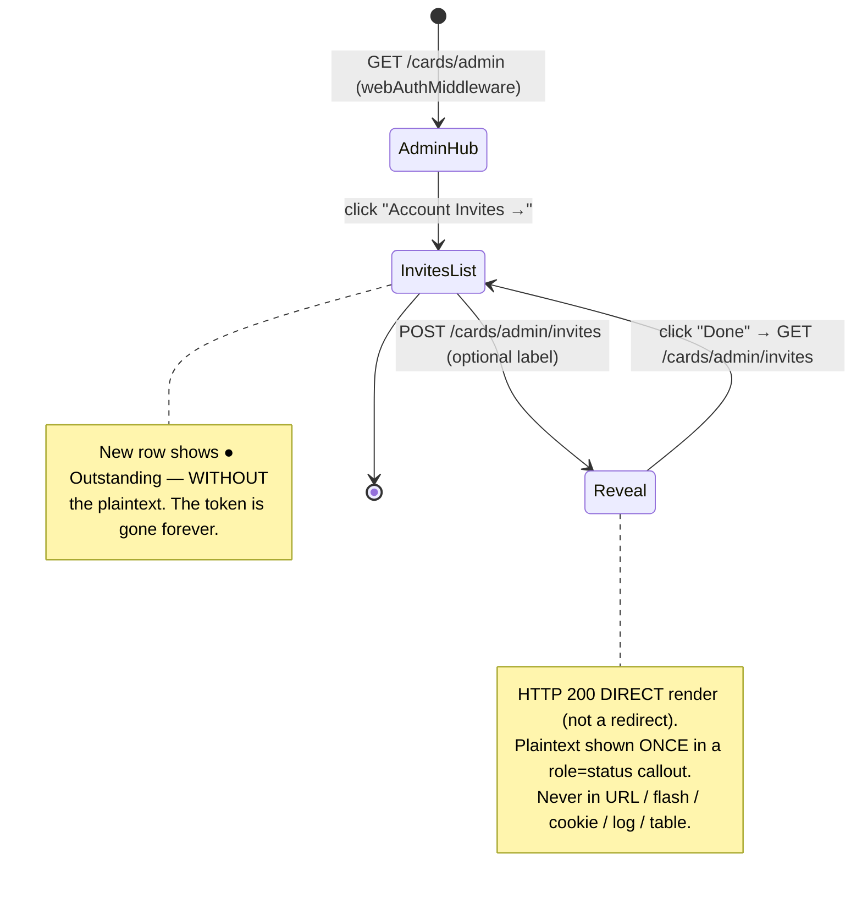
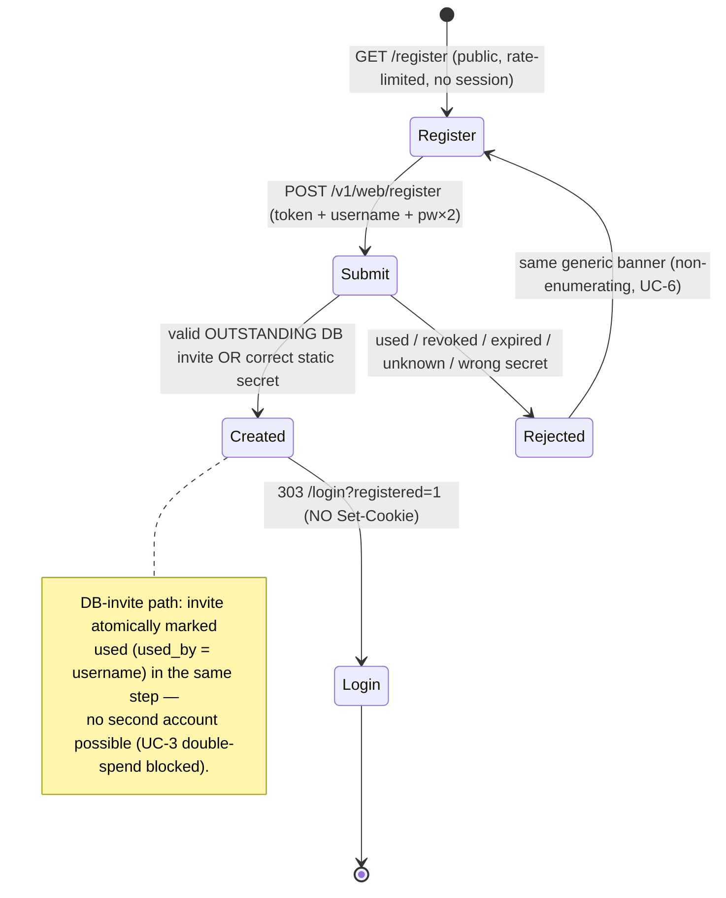
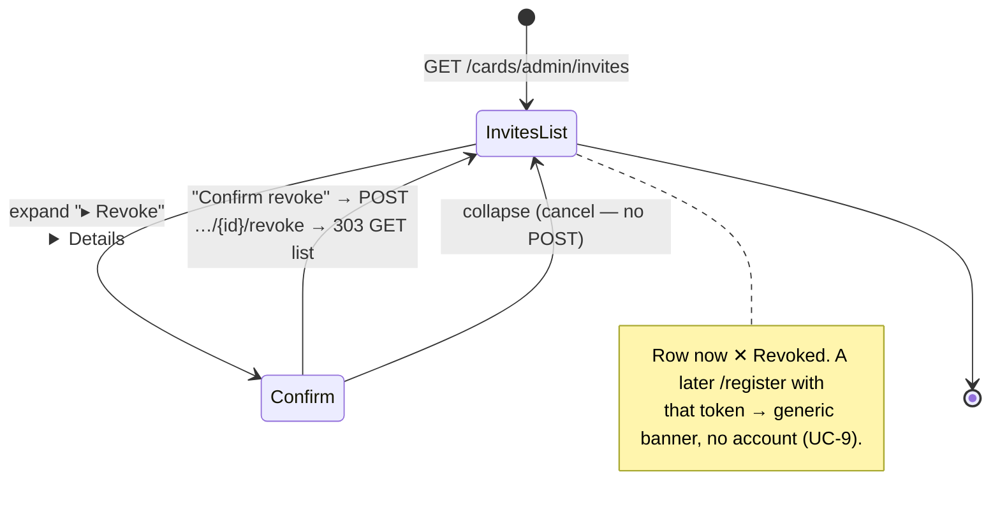
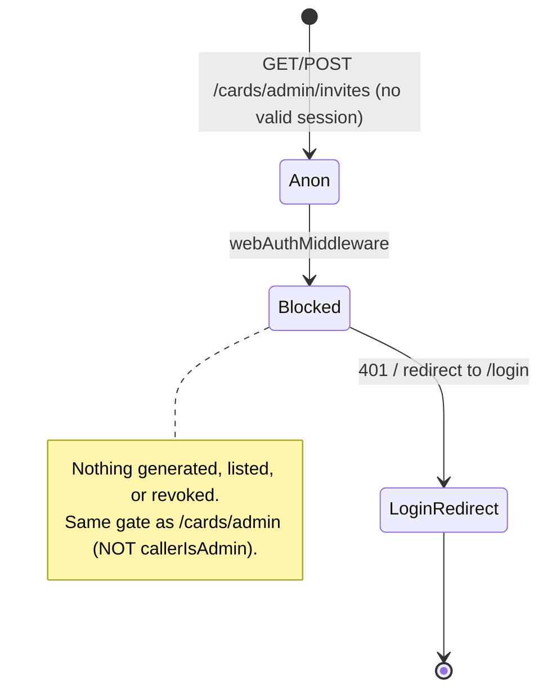

# Spec 093 — Admin-Generated Registration Invites (DB-Backed, Single-Use)

**Status:** in_progress
**Workflow mode:** full-delivery · **Status ceiling:** done
**Release train:** `mvp`
**Builds on:** [091-web-self-registration-invite-gated](../091-web-self-registration-invite-gated/spec.md) (the deployed registration baseline this augments)
**Relates to:** [070-web-username-password-login](../070-web-username-password-login/spec.md) (binding full-admin trust model), [044-per-user-bearer-auth](../044-per-user-bearer-auth/spec.md) (the `callerIsAdmin` gate + the `tokens.html` "admin-generates-tokens-in-UI" precedent), [092-card-rewards-ui-elevation](../092-card-rewards-ui-elevation/spec.md) (the elevated web design system the new admin surface should match)

> **Operator directive (verbatim):** *"token need to be generated by admin in ui"*

---

## Problem

Spec 091 shipped invite-gated web self-registration. Its gate is a **single
static operator secret** — `WEB_REGISTRATION_INVITE_TOKEN`, read from the
environment in [`internal/config/config.go`](../../internal/config/config.go)
(line 524–530, `cfg.Auth.WebRegistrationInviteToken`; `os.Getenv` at line
1533, OPTIONAL, NOT in `authErrors`) and constant-time-compared at
[`internal/api/web_register.go`](../../internal/api/web_register.go) Step 3
(`subtle.ConstantTimeCompare([]byte(invite), []byte(configured))`). One secret
value lets the operator create accounts repeatably.

That single static secret has a real operational cost the operator hit after
deploying spec 091:

- **There is no per-person invite.** Everyone the operator invites uses the
  *same* shared string. The operator cannot hand a one-time invite to one
  specific person.
- **Managing who can register means sops surgery.** Rotating the gate (e.g. to
  cut off a leaked invite) means editing the SST secret, re-rendering the
  bundle, and restarting `smackerel-core` — a deploy-host operation, not a
  point-and-click one.
- **There is no visibility.** The operator cannot see how many people still
  hold a live invite, who used one, or revoke a single outstanding invite
  without rotating the secret for *everyone*.

The operator wants to **generate per-person invite tokens from the web UI** —
log in, click "generate invite", hand the one-time token to the new person,
watch it get consumed, and revoke unused ones — all without touching sops.

This is exactly the shape spec 044 Scope 03 already established for PASETO
bearers at [`internal/api/admin_ui_static/tokens.html`](../../internal/api/admin_ui_static/tokens.html)
("Mint a New User… The wire token is shown **once**; capture it immediately — it
is never displayed again"). Spec 093 brings that same *admin-generates-a-
single-use-secret-in-the-UI* ergonomic to **registration invites**.

---

## Goals

1. **Generate from the UI.** A logged-in operator generates a **single-use**
   registration invite token from the web UI. The **plaintext** token is shown
   **exactly once** at generation time and never again (it is **hashed at
   rest**, never stored or logged in plaintext).
2. **Consume once.** A new person registers at the existing `/register` page
   using a valid, unused admin invite; on success the account is created and
   the invite is **atomically marked used** (`used_at` + `used_by` set) so it
   can never create a second account.
3. **See outstanding/used invites.** The operator views a list of invites with
   metadata only — created-by, created-at, optional label, expiry (if adopted),
   and used-at/used-by — **never the plaintext and never the hash**.
4. **Revoke an unused invite.** The operator revokes an outstanding invite so it
   can no longer be used to register, **without** rotating the static secret.
5. **Zero regression to spec 091.** The static `WEB_REGISTRATION_INVITE_TOKEN`
   keeps working as the operator **bootstrap / break-glass** path; the existing
   `GET /register` + `POST /v1/web/register` + `/login` flows behave exactly as
   spec 091 shipped them, except the `/register` gate now *also* accepts a valid
   DB-backed invite.

---

## Non-Goals

- **Email / SMS delivery of invites.** The operator copies the one-time token
  out of the UI and hands it over out-of-band (same as spec 044's tokens.html).
- **Multi-use invite tokens.** Single-use is the model. There is no "this
  invite can create N accounts" mode.
- **Per-user roles / RBAC beyond the existing trust band.** Every web user is a
  full admin (spec 070's binding model). This spec adds an *intake-token
  management* surface, not a privilege tier.
- **Replacing the static secret entirely.** The static
  `WEB_REGISTRATION_INVITE_TOKEN` is **kept** as the bootstrap / break-glass
  gate (it solves the chicken-and-egg of "no DB invite yet, no account yet"). It
  is augmented, not retired.
- **Changing PASETO / shared-token / cookie auth.** No change to
  `bearerAuthMiddleware`, `webAuthMiddleware`, the `auth_token` cookie shape, or
  the spec-044 `/admin/auth/tokens` surface.
- **An invite-token *for* the static secret** (no recursion): the static secret
  remains a pure SST env value.

---

## Domain Capability Model

Spec 093 extends the single spec-091 capability — *invite-gated web
self-registration* — by giving the **invite** a real lifecycle and an in-app
management surface. The new domain primitive is the **Registration Invite**.

### Primitive: Registration Invite

| Field (conceptual) | Meaning |
|--------------------|---------|
| token (plaintext) | A long, high-entropy random secret. Exists **only** in the operator's clipboard + the new registrant's form submission. **Never** persisted, **never** logged. |
| token hash | The at-rest identifier. The only representation the DB holds. Lookup is **by hash**. |
| created_by | The operator (web session identity) that generated the invite. |
| created_at | Generation time. |
| label (optional) | Operator-facing note, e.g. "for the new analyst". Metadata only. |
| expires_at (optional) | TTL boundary — **adoption is an open design decision** (none vs default expiry). |
| used_at / used_by | Set atomically when the invite is consumed by a successful registration. |
| revoked_at | Set when the operator revokes an outstanding invite. |

### Lifecycle states

```
            generate                 register (atomic consume)
   (none) ───────────▶ OUTSTANDING ──────────────────────────▶ USED  (terminal)
                            │
                            ├── operator revoke ──────────────▶ REVOKED (terminal)
                            │
                            └── expires_at elapses (if TTL) ──▶ EXPIRED (terminal)
```

Only an **OUTSTANDING** invite can be consumed. USED, REVOKED, and EXPIRED are
terminal and all reject registration with the same generic, non-enumerating
banner spec 091 already uses.

### Relationships

- An Invite is **created_by** exactly one operator web session.
- A successful consume **produces** exactly one `web_user_credentials` row (the
  spec-070/091 account) and transitions the Invite to USED in the **same atomic
  step** (no double-spend window).

### Binding business policies (every implementation must obey)

1. **Single-use, atomically enforced.** Consumption MUST be a guarded atomic
   transition (`... WHERE used_at IS NULL AND revoked_at IS NULL AND (expires_at
   IS NULL OR expires_at > now())`), so two concurrent registrations with the
   same invite can never both succeed (no TOCTOU double-spend).
2. **Hashed at rest, shown once.** Only the hash is stored. The plaintext is
   surfaced exactly once at generation and is never recoverable thereafter.
3. **Value-safe.** The plaintext invite (and the static secret) never appears in
   any log line, metric label, error body, redirect, or template field.
4. **Non-enumerating failure.** Any invalid / used / revoked / expired / unknown
   invite — and a wrong static secret — yield the **same** generic banner spec
   091 ships (`Registration is not available or the invite is invalid.`), with
   no signal distinguishing the failure modes.
5. **Coexistence with the static secret.** The `/register` gate accepts **either**
   a valid OUTSTANDING DB invite **or** the static
   `WEB_REGISTRATION_INVITE_TOKEN` (bootstrap). Neither path is open signup.

### Single-Capability Justification (AN5 / G094)

The proportionality trigger fires on incidental vocabulary — the invite now has
two **sources** (static secret, DB-backed) and the words *source* / *single-use*
/ *variant* appear in prose. This is **not** a multi-provider / adapter /
strategy family:

- There is **one** registration capability (no second *kind* of registration).
- The gate has **two concrete checks in one handler** (constant-time static
  compare **OR** a single hashed-lookup-then-atomic-consume), **not** a pluggable
  `InviteSource` provider abstraction. Introducing an adapter seam for exactly
  two hard-coded checks would be speculative generality (YAGNI), and would risk
  the non-enumeration invariant by multiplying response paths.
- The new admin surface **reuses** the existing web admin scaffold
  (`webAuthMiddleware` + the spec-092 design system or the spec-044 static-page
  pattern — settled in design), not a new UI framework.

The genuinely shared foundations are **reused**, not re-invented: the
`web_user_credentials` account store + argon2id layer
([`internal/auth/webcreds`](../../internal/auth/webcreds/repo.go)), the
constant-time gate + non-enumerating banner from
[`internal/api/web_register.go`](../../internal/api/web_register.go), and the
migration pattern from
[`internal/db/migrations/044_web_user_credentials.sql`](../../internal/db/migrations/044_web_user_credentials.sql).

---

## Outcome Contract

**Intent:** A logged-in operator generates a single-use registration invite from
the web UI, hands the one-time token to a specific person, and that person
registers once with it — while the operator can list outstanding/used invites
and revoke unused ones, all without sops surgery, and without weakening spec
070's full-admin trust model or regressing spec 091.

**Success Signal:** A logged-in operator POSTs "generate invite"; the UI shows a
one-time plaintext token and a new `web_registration_invites` row exists holding
only its **hash**. A new person submits `/register` with that plaintext token, a
new username, and two matching passwords; a `web_user_credentials` row is created
(argon2id) **and** the invite row's `used_at`/`used_by` are set in the same
atomic step. Re-submitting the same invite creates **no** second account.
Submitting a revoked/expired/unknown invite creates **no** account and returns
spec 091's generic banner. The static `WEB_REGISTRATION_INVITE_TOKEN` still
registers an account at `/register`.

**Hard Constraints:**
- Invite generation, listing, and revocation are reachable **only** to a
  logged-in operator (behind `webAuthMiddleware`, identical to `/cards/admin`)
  — **never** behind `callerIsAdmin` (which rejects every web-login session on
  the deployed production instance; see Authorization Model).
- A consumed invite can **never** create a second account (atomic single-use).
- The plaintext invite is shown exactly **once** and is **never** stored or
  logged; the DB holds only the hash.
- An invalid / used / revoked / expired / unknown invite is indistinguishable
  from a wrong static secret (same generic banner; no enumeration).
- The static `WEB_REGISTRATION_INVITE_TOKEN` keeps working as bootstrap; spec
  091's `/register` + `/login` behavior is otherwise unchanged.
- PostgreSQL only — the new state lives in a `web_registration_invites` table via
  a forward migration; no embedded/file store.

**Failure Condition:** The feature is a failure if invite-generation is gated by
`callerIsAdmin` (locking out the production operator); if a single invite can
create two accounts (double-spend); if the plaintext token is ever stored or
logged; if a used/revoked/expired/unknown invite is distinguishable from a wrong
token; if the static secret stops working; or if any existing `/register` /
`/login` path regresses — even when every other test passes.

---

## Actors

| Actor | Description | Authorization |
|-------|-------------|---------------|
| Operator (invite generator) | The logged-in human operator who generates, lists, and revokes invites in the web UI. | A live web session (shared `auth_token` cookie / Bearer) — passes `webAuthMiddleware`. Under spec 070's trust model "any web user = full admin". |
| New registrant | A new person the operator trusts, who holds **one** plaintext invite and registers once at `/register`. | No session needed for `/register` (it is public, rate-limited, OUTSIDE `bearerAuthMiddleware`, per spec 091). Possession of a valid OUTSTANDING invite is the authorization to create exactly one account. |
| Anonymous visitor | Any unauthenticated browser. | Cannot reach the invite-generation/list/revoke endpoints (rejected by `webAuthMiddleware`); can reach `/register` but cannot register without a valid invite or the static secret. |

There is no non-operator role. Possession of an invite authorizes creating one
full-admin account; the operator shares invites only with people they already
trust at that level (identical to spec 091's invite-token authorization model).

---

## Authorization Model (BINDING — read before design)

This is the single most important architectural constraint of the spec, and it
is grounded, not assumed.

**Invite generation / list / revoke MUST sit behind `webAuthMiddleware`
(logged-in operator), exactly like `/cards/admin` — and MUST NOT be gated by
`callerIsAdmin`.**

Why `callerIsAdmin` is wrong here (grounded in
[`internal/api/auth_handlers.go`](../../internal/api/auth_handlers.go) lines
274–289):

```go
func (h *AuthAdminHandlers) callerIsAdmin(sess auth.Session) bool {
    switch sess.Source {
    case auth.SessionSourceBootstrap:      return true
    case auth.SessionSourceSharedToken:
        if h.cfg.Environment != "production" { return true }
        return h.cfg.Auth.ProductionSharedTokenFallbackEnabled // false on deploy
    case auth.SessionSourcePerUserToken:    return false        // empty allowlist
    default:                                 return false
    }
}
```

On the **deployed production instance**: per-user PASETO sessions are *always*
`false` (the SST admin allowlist is empty / "future scope"), and shared-token
sessions are `false` because `ProductionSharedTokenFallbackEnabled` defaults to
`false` ([`internal/config/config.go`](../../internal/config/config.go) line
505–509). **Therefore no web-login user is "admin" under `callerIsAdmin` in
production.** Gating invite-generation behind it would lock out *every* web-login
operator — exactly the people who must generate invites. (This is observable in
the spec-044 surface: `/admin/auth/tokens` loads behind `bearerAuthMiddleware`,
but its `/v1/auth/*` XHR mutations return 403 in production because they enforce
`callerIsAdmin`.)

Why `webAuthMiddleware` is correct (grounded in
[`internal/api/router.go`](../../internal/api/router.go) line 721–748 + the
`/cards/admin` mount at line 425–435, and
[`internal/web/cardrewards.go`](../../internal/web/cardrewards.go) line 193–196):

- `webAuthMiddleware` is the "are you logged in" gate: it accepts a Bearer token
  **or** the `auth_token` cookie matching the shared `AuthToken` (and passes
  everything in dev when `AuthToken == ""`).
- The entire operator web UI sits behind it — the KB web routes, the agent admin
  UI (`/admin/agent/*`), the extension-devices admin UI, and crucially
  `/cards/admin` with its `POST /cards/admin/scrape` + `POST
  /cards/admin/sync-calendar` privileged triggers (`AdminPage` /
  `AdminScrapeNow` / `AdminSyncCalendarNow`).
- Per spec 070's documented trust model, **any web user = full admin**.
  Invite-generation is the same trust class as "scrape now" / "sync calendar" —
  so it belongs behind the **same** `webAuthMiddleware`.

The `/register`, `POST /v1/web/register` consume path stays exactly where spec
091 put it: **public, rate-limited (`httprate.LimitByIP(20, 1*time.Minute)`),
OUTSIDE `bearerAuthMiddleware`** — a new registrant has no session yet.

---

## Use Cases (Gherkin)

```gherkin
Scenario: UC-1 Logged-in operator generates a single-use invite; plaintext shown once
  Given an operator with a valid web session (passes webAuthMiddleware)
  When the operator POSTs the "generate invite" action (with an optional label)
  Then a new web_registration_invites row is created holding only the token HASH
  And the PLAINTEXT invite token is displayed exactly once in the response
  And the plaintext token is never persisted, never logged, and never shown again
  And the row records created_by and created_at (and the label if supplied)

Scenario: UC-2 New person registers once with a valid unused admin invite
  Given an OUTSTANDING admin invite exists (unused, not revoked, not expired)
  And no web_user_credentials row exists for username "newcomer"
  When the new person submits /register with that invite's plaintext token,
    username "newcomer", and two matching passwords meeting the minimum length
  Then a web_user_credentials row is created for "newcomer" with an argon2id hash
  And the invite row is atomically marked used (used_at set, used_by = "newcomer")
  And the person is redirected to /login?registered=1 with NO session cookie set
    (registration stays pure intake, per spec 091)

Scenario: UC-3 The same admin invite reused for a SECOND registration is rejected
  Given an admin invite that was already consumed (used_at is set)
  When someone submits /register with that same invite token and a new username
  Then registration is rejected with the generic, non-enumerating banner
  And NO second web_user_credentials row is created
  And the invite's used_at / used_by are unchanged (no re-mark)

Scenario: UC-4 An expired admin invite (if TTL adopted) is rejected
  Given an admin invite whose expires_at is in the past
  When someone submits /register with that invite token
  Then registration is rejected with the same generic banner
  And NO web_user_credentials row is created

Scenario: UC-5 The static sops WEB_REGISTRATION_INVITE_TOKEN still works (bootstrap)
  Given WEB_REGISTRATION_INVITE_TOKEN is configured non-empty
  And no DB invite is supplied
  When the operator submits /register with the correct STATIC secret,
    a new username, and matching passwords
  Then registration succeeds exactly as in spec 091 (account created, 303 to /login)
  And the static secret path is unchanged (constant-time compare, value-safe)

Scenario: UC-6 An invalid / unknown invite token returns spec 091's generic banner
  Given the registration gate is enabled (a static secret OR DB invites exist)
  When someone submits /register with a token that matches neither a live DB
    invite nor the static secret
  Then registration is rejected with the generic banner
    "Registration is not available or the invite is invalid."
  And the response does not reveal whether the username was available, nor
    whether the failure was a bad DB invite vs a bad static secret
  And the DB lookup by hash does not leak invite validity via response shape

Scenario: UC-7 A NOT-logged-in user cannot generate an invite
  Given an anonymous browser with no valid session
  When it requests the invite-generation endpoint
  Then webAuthMiddleware rejects it (401 / redirect to /login)
  And no invite is generated and no row is created

Scenario: UC-8 Operator views the invite list (metadata only, no secrets)
  Given several invites exist in mixed states (outstanding, used, revoked)
  When the logged-in operator opens the invite list
  Then each invite shows created_by, created_at, optional label, expires_at
    (if any), and used_at / used_by / revoked_at as applicable
  And neither the plaintext token nor the token hash appears anywhere in the page

Scenario: UC-9 Operator revokes an unused invite; it can no longer register
  Given an OUTSTANDING (unused, not revoked) invite
  When the logged-in operator revokes it
  Then the invite transitions to REVOKED (revoked_at set)
  And a subsequent /register with that invite token is rejected with the
    generic banner and creates no account

Scenario: UC-10 REGRESSION — existing spec 091 /register + /login are unchanged
  Given spec 091's /register page, /v1/web/register handler, and /login flow
  When the static-secret registration path and the username/password login path
    are exercised exactly as before
  Then they behave identically to spec 091 (same statuses, redirects, banner,
    no Set-Cookie on register, cookie set only by /v1/web/login)
```

---

## Acceptance Criteria

- **AC-1 — New `web_registration_invites` table (PostgreSQL, forward migration).**
  A new migration (next sequential number — `057_card_rewards.sql` is the current
  high-water mark, so `058_*` — exact number is a mechanical design detail)
  creates `web_registration_invites` with at least: `token_hash` (unique / PK),
  `created_by`, `created_at` (`TIMESTAMPTZ NOT NULL DEFAULT now()`), `expires_at`
  (nullable), `used_at` (nullable), `used_by` (nullable), `revoked_at` (nullable),
  and an optional `label`. Mirrors the additive pattern of
  [`044_web_user_credentials.sql`](../../internal/db/migrations/044_web_user_credentials.sql).
  **The plaintext token is NOT a column.**

- **AC-2 — New invite repo (`Generate` / `Consume` / `List` / `Revoke`).** A new
  Postgres-backed repo (mirroring the
  [`internal/auth/webcreds`](../../internal/auth/webcreds/repo.go) `Repo`
  interface + `PostgresRepo` shape) exposes: `Generate` (insert a hashed invite,
  return the **one-time plaintext** to the caller), `Consume` (the atomic
  single-use transition — see AC-5), `List` (metadata projection, **no** hash,
  **no** plaintext — like `webcreds.UserRow` excludes `password_hash`), and
  `Revoke` (set `revoked_at` on an outstanding invite).

- **AC-3 — Invite-generation UI behind `webAuthMiddleware`.** A new admin web
  surface lets a logged-in operator generate an invite (with optional label),
  reveals the plaintext **exactly once**, lists existing invites (metadata only),
  and revokes an unused one. It is mounted behind `webAuthMiddleware` (NOT
  `callerIsAdmin`), consistent with `/cards/admin`. **UI placement and CSP
  approach are open design decisions (see below).**

- **AC-4 — One-time plaintext reveal, hashed at rest.** The generated token is
  high-entropy random; only its hash is persisted; the plaintext is returned to
  the operator exactly once and is never stored, never logged, never re-shown
  (mirrors the spec-044 `tokens.html` "shown once… never displayed again"
  contract).

- **AC-5 — Atomic single-use consume (no double-spend / TOCTOU).** `Consume` is a
  single guarded statement of the form `UPDATE web_registration_invites SET
  used_at = now(), used_by = $1 WHERE token_hash = $2 AND used_at IS NULL AND
  revoked_at IS NULL AND (expires_at IS NULL OR expires_at > now())` (or an
  equivalent `SELECT … FOR UPDATE` + update in one transaction). Zero rows
  affected ⇒ reject (already used / revoked / expired / unknown). Two concurrent
  registrations with the same invite MUST yield exactly one success. (Consult the
  existing internal precedent
  [`032_photo_reveal_tokens_secret_hash_and_toctou.sql`](../../internal/db/migrations/032_photo_reveal_tokens_secret_hash_and_toctou.sql)
  — hashed single-use tokens with explicit TOCTOU handling.)

- **AC-6 — `/register` gate accepts a DB invite OR the static secret.** The
  [`web_register.go`](../../internal/api/web_register.go) Step 3 gate is augmented
  to accept **either** a valid OUTSTANDING DB invite (hash-lookup + atomic
  consume, recording `used_by = <new username>`) **or** the static
  `WEB_REGISTRATION_INVITE_TOKEN` (the existing constant-time compare). Neither is
  open signup. On the DB-invite path, the consume MUST be committed together with
  (or immediately after, with compensation on failure) the
  `webcreds.UpsertPassword(create=true)` account creation so a created account
  always corresponds to a consumed invite and vice-versa (no orphan consume, no
  orphan account — atomicity boundary settled in design).

- **AC-7 — Non-enumerating, value-safe failure (preserves spec 091 AC-5/AC-10).**
  An invalid / used / revoked / expired / unknown DB invite, AND a wrong static
  secret, AND an empty-configured-with-no-invites gate, ALL return the
  byte-identical generic banner `Registration is not available or the invite is
  invalid.` with the same 401, blank-secret re-render. The hash lookup MUST NOT
  leak invite validity through response shape or differential logging (the
  existing `logRegisterReject` coarse-`reason` enum is preserved / extended
  value-safely; the invite token value, the hash, and the username value are
  never logged).

- **AC-8 — Invite-generation / list / revoke reject anonymous callers.** Without
  a valid session, `webAuthMiddleware` returns 401 / redirect; no invite is
  generated, listed, or revoked (UC-7).

- **AC-9 — List exposes metadata only.** The list view/endpoint returns
  `created_by`, `created_at`, `label`, `expires_at`, `used_at`, `used_by`,
  `revoked_at` (derived state), and NEVER the plaintext or the hash.

- **AC-10 — Zero regression to spec 091.** The static-secret registration path,
  the no-Set-Cookie-on-register invariant, the `/login?registered=1` flash, and
  the `/login` username/password + token-form paths behave identically to spec
  091, proven by a regression scenario (UC-10).

- **AC-11 — NO-DEFAULTS SST / value-safe.** No new config value carries a silent
  fallback default; the gate is fail-loud (no DB invite AND empty static secret ⇒
  registration disabled, never open signup). No plaintext token or password is
  ever logged, echoed, redirected, or templated.

---

## Security Model

- **Hashed at rest.** The DB holds only the invite's hash. The plaintext exists
  only transiently (operator clipboard + the registrant's one form POST). (Hash
  algorithm — SHA-256 vs argon2id — is an **open design decision**; the token is
  a long random secret, so a fast cryptographic hash with by-hash lookup is the
  conventional choice, but design owns the call.)
- **Single-use, atomic.** The guarded `Consume` UPDATE (AC-5) makes double-spend
  structurally impossible, even under concurrent submissions.
- **Augments, never weakens, spec 091.** The static secret stays as bootstrap /
  break-glass; the gate is **OR** (DB invite **or** static secret), never open
  signup; empty-everything ⇒ disabled (fail-loud per NO-DEFAULTS SST).
- **Non-enumerating.** All failure modes collapse to one generic banner; the
  DB-invite path must not introduce a new distinguishable response (status, body,
  timing-shape) versus the spec-091 static-secret reject. Constant-time compare is
  retained for the static secret; the DB path looks up by **hash** (the secret is
  never compared in plaintext against stored material).
- **Same full-admin trust band.** Consuming an invite creates a spec-070/091
  full-admin account — no escalation, no reduction. Generating invites is itself a
  full-admin action gated by `webAuthMiddleware`.
- **Value-safe logging.** No log line, metric label, error body, redirect, or
  template field ever contains the invite plaintext, the hash, or any password.
  The `logRegisterReject` reason enum stays coarse and non-enumerating.
- **Authorization (binding).** Generate / list / revoke are behind
  `webAuthMiddleware` (logged-in operator), **not** `callerIsAdmin` (see
  Authorization Model). `/register` consume stays public + rate-limited, OUTSIDE
  `bearerAuthMiddleware`.

---

## Referenced Existing Surfaces (for later phases — DO NOT re-discover)

- [`internal/api/web_register.go`](../../internal/api/web_register.go) —
  `HandleWebRegister`: the spec-091 gate (Step 3 constant-time static compare),
  the shared `registerGateBanner`, the byte-identical reject re-render, the
  no-cookie 303-to-`/login?registered=1` success, and the value-safe
  `logRegisterReject` coarse-reason log. The DB-invite branch is added here.
- [`internal/auth/webcreds/repo.go`](../../internal/auth/webcreds/repo.go) +
  [`hasher.go`](../../internal/auth/webcreds/hasher.go) — the `Repo` interface +
  `PostgresRepo` + `UserRow` (hash-excluded projection) + argon2id pattern to
  mirror for the new invite repo. `UpsertPassword(ctx, username, password,
  create=true)` (→ `ErrUserExists`) is reused verbatim for account creation.
- [`internal/db/migrations/044_web_user_credentials.sql`](../../internal/db/migrations/044_web_user_credentials.sql)
  — the additive auth-table migration pattern (`TIMESTAMPTZ DEFAULT now()`,
  descriptive `COMMENT`s). Migration high-water mark today is
  `057_card_rewards.sql`.
- [`internal/db/migrations/032_photo_reveal_tokens_secret_hash_and_toctou.sql`](../../internal/db/migrations/032_photo_reveal_tokens_secret_hash_and_toctou.sql)
  — internal precedent for **hashed single-use tokens with explicit TOCTOU
  handling**; consult for the atomic-consume shape.
- [`internal/api/admin_ui.go`](../../internal/api/admin_ui.go) +
  [`internal/api/admin_ui_static/tokens.html`](../../internal/api/admin_ui_static/tokens.html)
  — spec 044 Scope 03: the existing "admin generates / lists / revokes a
  one-time secret in the UI" precedent (Mint → show-once → list → revoke). Mirror
  its **shape**; note it uses inline `<script>` + inline `<style>`
  (`'unsafe-inline'`), which the CSP decision below may choose to AVOID.
- [`internal/api/admin_ui_static/register.html`](../../internal/api/admin_ui_static)
  + [`internal/api/web_register_page.go`](../../internal/api/web_register_page.go)
  + the `/login` page — the **CSP-clean** server-rendered form-POST pattern
  (external same-origin assets only, no inline scripts/handlers) — the preferred
  alternative to tokens.html's unsafe-inline approach.
- [`internal/web/cardrewards.go`](../../internal/web/cardrewards.go) (line
  193–196, 927–967) — `/cards/admin` + `AdminPage` + `AdminScrapeNow` /
  `AdminSyncCalendarNow`: the closest **operator admin web surface behind
  `webAuthMiddleware`** with privileged POST triggers; the binding-authorization
  analog and the operator's primary nav hub.
- [`internal/api/router.go`](../../internal/api/router.go) — `webAuthMiddleware`
  (721–748), the `/cards/admin` mount (425–435), and the spec-091 public
  rate-limited `/register` block. New generate/list/revoke routes mount behind
  `webAuthMiddleware`; the `/register` consume stays in the public block.
- [`internal/api/auth_handlers.go`](../../internal/api/auth_handlers.go) (274–289)
  — `callerIsAdmin`: the gate to **avoid** (would lock out prod operators).
- [`internal/config/config.go`](../../internal/config/config.go) (524–530, 1533)
  — `WebRegistrationInviteToken` (the static secret, kept as bootstrap).

---

## Open Design Decisions (HAND TO DESIGN / UX — DO NOT SETTLE HERE)

1. **(a) Hash algorithm for the invite token** — SHA-256 (conventional for a
   high-entropy secret; fast by-hash lookup) vs argon2id (the existing
   `webcreds` password choice). *Analyst note:* argon2id is for **low-entropy**
   passwords; a long random invite is high-entropy, so a fast cryptographic hash
   (SHA-256, possibly HMAC-keyed like the spec-044 `AtRestHashingKey`) is the
   conventional fit and enables an indexed by-hash lookup. **Design owns the
   final call.**
2. **(b) Invite TTL** — no expiry vs a default expiry (e.g. 7 days). UC-4 / the
   `expires_at` column / the `Consume` guard are written to support a TTL **if**
   adopted; the default (or "none") is design-owned.
3. **(c) UI placement** — a dedicated `/admin/invites` page vs a section on the
   existing `/cards/admin` page. *Analyst note:* registration invites are a
   general auth concern (not card-rewards), which argues for a dedicated page;
   but `/cards/admin` is currently the operator's only rich admin nav hub. UX +
   design settle placement + navigation.
4. **(d) CSP approach** — a **CSP-clean server-rendered form-POST** surface (like
   `register.html` / `login.html`, no inline JS) vs the spec-044 `tokens.html`
   **`'unsafe-inline'` fetch()** approach. *Analyst recommendation:* prefer the
   CSP-clean form-POST style to stay consistent with spec 091's `/register` and
   spec 092's strict `script-src 'self'` `/cards` posture; the one-time reveal
   and the list/revoke can be plain PRG server renders. Design + UX own it,
   honoring the spec-077 CSP guard.
5. **(e) Keep the static secret as bootstrap?** *Analyst recommendation: YES* —
   augment, don't replace. Keeping `WEB_REGISTRATION_INVITE_TOKEN` solves the
   chicken-and-egg (the first operator account predates any DB invite) and
   guarantees spec 091 keeps working as break-glass. Design confirms and wires
   the OR-gate.
6. **(f) Atomicity boundary of consume + account-create** — single DB
   transaction wrapping both the `Consume` UPDATE and the
   `UpsertPassword(create=true)` INSERT, vs consume-then-create with compensation
   on create failure. Design settles the exact transaction shape so there is no
   orphan-consume (invite burned, account not created) and no orphan-account
   (account created, invite not burned).

---

## Out-of-Scope Anti-Patterns (DO NOT BUILD)

- Gating invite generation / list / revoke behind `callerIsAdmin` (locks out
  every web-login operator in production — see Authorization Model).
- Storing or logging the invite **plaintext** (or any password) in plaintext /
  reversible form anywhere.
- A **multi-use** invite token (single-use is the model).
- A **non-atomic** consume that allows a double-spend race (two accounts from one
  invite).
- A response path on the DB-invite reject that is distinguishable (status, body,
  shape) from the spec-091 static-secret reject (enumeration leak).
- Returning the invite hash (or plaintext) in any list view / API body.
- Retiring or weakening the static `WEB_REGISTRATION_INVITE_TOKEN` bootstrap path.
- A per-user privilege tier (every web user remains full admin).
- A new client-side JS framework or a CSP relaxation beyond what the chosen
  surface strictly requires.

---

## Dependencies

- **Spec 091** (web self-registration, invite-gated) — the deployed baseline this
  augments; `web_register.go` + the static secret + `webcreds` account creation.
- **Spec 070** (web username/password login) — binding full-admin trust model;
  `web_user_credentials` + argon2id; unchanged.
- **Spec 044** (per-user PASETO bearer) — the `callerIsAdmin` gate to avoid + the
  `tokens.html` admin-generates-tokens-in-UI precedent to mirror in shape.
- **Spec 092** (card-rewards web UI elevation) — the elevated design system the new
  admin surface should match if it lands under `/cards/admin` (CSP-clean).
- **PostgreSQL** via the existing pool — the new `web_registration_invites` table.

---

## Release Train

Targets the **`mvp`** train (the active home-lab train carrying the spec 070/091
web auth surface this extends). Default-off behavior on other trains follows the
repo release-train model; whether an explicit train flag is introduced beyond the
existing gate is left to design (`flagsIntroduced` is empty at the analyst phase).

---

## UI Scenario Matrix

| # | Scenario | Actor | Entry point | Steps | Expected outcome | Surface |
|---|----------|-------|-------------|-------|------------------|---------|
| M1 | Generate an invite | Operator | Invite admin page (behind `webAuthMiddleware`) | Open page → optional label → click "Generate invite" | One-time plaintext token revealed once; new hashed row; list shows a new OUTSTANDING entry | Invite admin page (placement TBD — design decision c) |
| M2 | Copy & hand off the one-time token | Operator | Invite admin page (post-generate) | See the revealed token → copy it | Token is shown exactly once; reloading the page never re-shows it | Invite admin page |
| M3 | Register with the admin invite | New registrant | `GET /register` | Enter the invite token + username + two matching passwords → submit | Account created; invite atomically marked used; 303 → `/login?registered=1` (no cookie) | spec-091 `/register` (unchanged shell) |
| M4 | Reuse the same invite (rejected) | Anyone | `GET /register` | Submit the already-used invite again | Generic banner; no second account; `used_*` unchanged | `/register` |
| M5 | Register with the static secret (bootstrap) | Operator | `GET /register` | Submit the static `WEB_REGISTRATION_INVITE_TOKEN` | Account created exactly as spec 091 (unchanged) | `/register` |
| M6 | View the invite list | Operator | Invite admin page | Open page | Metadata-only rows (created_by/at, label, expires, used/revoked); no plaintext, no hash | Invite admin page |
| M7 | Revoke an unused invite | Operator | Invite admin page | Click "Revoke" on an OUTSTANDING row | Row → REVOKED; later `/register` with it is rejected | Invite admin page |
| M8 | Anonymous hits the invite admin page | Anonymous | Invite admin endpoint | Request without a session | `webAuthMiddleware` 401 / redirect to `/login`; nothing generated | `webAuthMiddleware` |

---

## Non-Functional Requirements

- **Security:** hashed-at-rest invites; atomic single-use; non-enumerating
  failures; value-safe logging; constant-time static-secret compare retained;
  generation behind `webAuthMiddleware`; consume public + rate-limited (reuse the
  spec-091 `httprate.LimitByIP(20, 1*time.Minute)` budget).
- **Storage:** PostgreSQL only; additive forward migration; no embedded/file
  store; no plaintext column.
- **Compatibility:** zero regression to spec 091 `/register` + `/login`; the
  static secret remains a working bootstrap.
- **Accessibility / CSP:** the new admin surface honors the spec-077 CSP guard
  (no inline scripts/handlers if the CSP-clean approach is chosen — decision d);
  `:focus-visible` rings, labelled inputs, color-never-the-only-signal, matching
  the spec-092 design system if mounted under `/cards`.
- **Observability:** the existing value-safe `logRegisterReject` coarse-reason
  pattern is preserved/extended; no new metric leaks invite material.
- **Performance:** by-hash invite lookup is a single indexed query; the consume is
  a single guarded UPDATE — both negligible at the operator-only scale this
  surface targets.

---

*Authored by `bubbles.analyst` (analyze phase). Design, scopes, report, and user
validation are owned by later phases. Next required owner: `bubbles.ux`.*

---

## UX Specification

*Authored by `bubbles.ux` (analyze phase, UX activity). This section + `## UI
Wireframes` + `## User Flows` below are the **only** UX truth source (single
file — no sidecar). It maps every Gherkin use case (UC-1..UC-10) and UI-matrix
row (M1..M8) to a screen flow, resolves the two UX-owned open decisions **(c)
placement** and **(d) CSP/interaction shape**, and leaves the design-owned
decisions (a hash algo, b TTL, e keep-static-secret, f consume/create atomicity)
untouched. Wireframes are the machine-readable contract; the mermaid flows are
complementary visualization. Next required owner: `bubbles.design`.*

### Open Design Decision (c) — UI Placement — RESOLVED (binding)

**Decision: a dedicated page at `GET /cards/admin/invites`, mounted in the SAME
`webAuthMiddleware` group as `/cards/admin`, reachable via an "Account Invites →"
link on the `/cards/admin` page, and rendered with the shared spec-092
`cardrewards-nav` chrome (Admin pill stays `active`, since invites is a child of
Admin).**

Rationale:

- **Separable concern.** Registration invites are a general account-access
  concern, not card-rewards data. A dedicated page keeps generate / list / revoke
  off the run-history admin page (which is about scrape/sync pipeline runs), so
  neither surface is cluttered and the invite surface gets its own bookmarkable
  URL.
- **Stays in the operator's known nav + the same auth group.** `/cards/admin` is
  the operator's only rich admin hub behind `webAuthMiddleware` (per the binding
  Authorization Model). Mounting invites as a sibling sub-route under that same
  group (`r.Route("/cards/admin/invites", …)` inside the existing
  `webAuthMiddleware`-gated block, alongside `/cards/admin`) inherits the correct
  authorization **for free** — generate/list/revoke are the same trust class as
  the existing `/cards/admin/scrape` + `/cards/admin/sync-calendar` privileged
  POST triggers (UC-7 / M8 enforced by `webAuthMiddleware`, never
  `callerIsAdmin`).
- **Discoverable, not buried.** The `/cards/admin` page gains a small "Account
  access" section with an **"Account Invites →"** `.btn .btn-secondary` link to
  `/cards/admin/invites`; the invites page carries a `‹ Back to Admin` crosslink.
  No new top-level nav pill is added (keeps the spec-092 pill row stable); the
  Admin pill remains the way in.

Rejected alternative — *a section embedded on `/cards/admin`*: mixes an
auth/account concern into the pipeline-ops page, grows that page's render model,
and couples invite lifecycle UI to card-rewards run history. The dedicated page
is cleaner and equally reachable.

### Open Design Decision (d) — CSP / Interaction Shape — RESOLVED (binding)

**Decision: a CSP-clean, server-rendered `<form>`-POST surface (the spec-091
`register.html` / spec-092 `/cards` pattern) — NO inline `<script>`, NO
`onclick` / `onsubmit`, NO `'unsafe-inline'`. Every mutation is a plain HTML
form submit; the one-time token reveal is a server-rendered response, NOT a
`fetch()` / JS render.**

Rationale:

- **Consistency + no CSP relaxation.** Spec 091's `/register` and spec 092's
  `/cards` already run under strict `script-src 'self'` (the spec-077 CSP guard).
  A CSP-clean form surface drops straight in under that posture; the spec-044
  `tokens.html` `'unsafe-inline'` `fetch()` approach would force a CSP relaxation
  on this new route and is explicitly the path to avoid.
- **Works without JS, no XSS surface.** All values render server-side with
  `html/template` auto-escaping (like `register.html`). The whole surface —
  generate, reveal, list, revoke — functions with JavaScript fully disabled.

Two interaction shapes, both forms, with one deliberate value-safety nuance:

| Action | Method + route | Response | Why |
|--------|----------------|----------|-----|
| **Revoke** | `POST /cards/admin/invites/{id}/revoke` | **303 → `GET /cards/admin/invites`** (pure Post/Redirect/Get) | No secret in play; PRG-redirect avoids a re-POST on refresh. |
| **Generate** | `POST /cards/admin/invites` | **200, direct one-time render** of the invites page **with** the freshly-minted plaintext in a `role="status"` callout — **NOT a 303 redirect** | The plaintext **must never** travel through a redirect `Location` / query string / flash cookie / log (value-safety). It therefore appears **only** in the immediate POST response body, then is gone forever. |

The "Generate = Post → render-once (200)" deviation from PRG-redirect is the
**single** intentional exception and it is *required* by value-safety, not a
style choice. A browser refresh on that 200 page would re-submit the form (the
standard browser "resubmit?" prompt) and mint an additional OUTSTANDING invite —
harmless and revocable; the exact guard (e.g. accept the resubmit, or a
server-side one-shot nonce that never stores the plaintext) is a **design-owned**
mechanism. UX binds only: *the plaintext is in that one response body and nowhere
else.* The copy affordance is JS-free (a focusable readonly token field; see
Accessibility) — no `'unsafe-inline'`, no external script required for baseline
function.

### Screen Inventory

| Screen | Route | Actor | Status | UCs / Matrix |
|--------|-------|-------|--------|--------------|
| Account Invites (generate + list) | `GET /cards/admin/invites` | Operator | **New** | UC-1, UC-8, UC-9 · M1, M6, M7 |
| Account Invites — one-time reveal | `POST /cards/admin/invites` (200 render) | Operator | **New (state)** | UC-1 · M1, M2 |
| Account Invites — revoke confirm | `<details>` on the list, `POST …/{id}/revoke` | Operator | **New (state)** | UC-9 · M7 |
| Admin hub entry link | `GET /cards/admin` | Operator | **Modify** (add "Account Invites →" link) | M1 entry |
| `/register` | `GET /register` + `POST /v1/web/register` | New registrant | **Unchanged** (same shell + same invite-token field) | UC-2..UC-6, UC-10 · M3, M4, M5 |
| `webAuthMiddleware` gate | invite routes | Anonymous | **Unchanged** (rejects) | UC-7 · M8 |

### Design System Reuse (spec 092 — no new CSS framework)

The Account Invites page reuses the existing spec-092 token system verbatim
(parsed via the shared `{{define "head"}}` chrome in
[`internal/web/cardrewards_templates.go`](../../internal/web/cardrewards_templates.go)) —
**zero hex literals**, all colors via `var(--…)`. Concretely it composes:
`cardrewards-nav` (sticky glass pill nav), `.page-header` / `.page-title` /
`.page-subtitle`, `.card`, `.btn .btn-primary` / `.btn-secondary` / `.btn-ghost`
/ `.btn-danger` (+ `.btn-sm`), `.form-control` / `.form-row` / labelled inputs,
`.table-wrap` › `.cr-table`, the `.badge` family (`badge-info` / `badge-success`
/ `badge-warning` / `badge-danger` / `badge-neutral`), `.alert` /
`.alert-info` / `.alert-warning`, `.empty-state`, and the global `:focus-visible`
rings + `prefers-reduced-motion` + `prefers-color-scheme: dark` already defined
there. No new component classes are required.

### UI Primitives (UX9)

The surface renders the same row/badge/callout vocabulary across two states
(post-generate render and the steady list), so the shared primitives are pinned
here:

**Reused (spec 092 — compose, don't reinvent):** `.cr-table` rows, the `.badge`
status family, `.card`, `.alert` banners, `.btn` hierarchy, `.empty-state`,
`:focus-visible` rings, the responsive `cardrewards-nav`.

**New composition primitives (defined once, used by every invite screen/state):**

1. **Invite status badge** — a metadata-only derived-state chip. **Binding
   mapping** (text + glyph carry meaning; color is reinforcement only, never the
   sole signal):
   | Lifecycle state | Badge class | Glyph + label |
   |-----------------|-------------|---------------|
   | OUTSTANDING | `badge badge-info` | `●  Outstanding` |
   | USED | `badge badge-success` | `✓  Used` (+ `used by <username>`) |
   | EXPIRED *(only if TTL adopted — Decision b)* | `badge badge-warning` | `⚠  Expired` |
   | REVOKED | `badge badge-danger` | `✕  Revoked` |
2. **One-time token reveal callout** — an `.alert` / success `.card` with
   `role="status" aria-live="polite"`, a strong unmistakable "Copy this token now
   — it will NOT be shown again" line, a **focusable readonly token field**
   (`aria-label="One-time invite token"`, monospace), and a `Done` link back to
   the list. Rendered **only** by the generate POST (200), **never** on a GET.
3. **CSS-only revoke-confirm** — a native `<details><summary>` disclosure: the
   `<summary>` is the "Revoke" affordance; expanding it reveals the real
   `POST …/{id}/revoke` `<form>` submit ("Confirm revoke"). Keyboard-operable and
   JS-free. Present **only** on OUTSTANDING rows.

**Composition rules:** the status badge is the single source of per-row state in
both the list and the just-generated row; the reveal callout is mutually
exclusive with the GET list (it exists only in the generate response); the
revoke-confirm primitive is gated on `state == OUTSTANDING`.

### Value-Safety (binding — make "copy now, gone forever" unmistakable)

- The plaintext invite token appears in **exactly one** place: the
  `role="status"` reveal callout in the immediate `POST /cards/admin/invites`
  (200) response. It is **never** in the list, **never** in a row, **never**
  re-fetchable, **never** in a redirect `Location` / query string / flash cookie,
  and **never** logged (AC-4, AC-7, AC-11, Security Model).
- The DB holds only the **hash**; the list view (UC-8 / AC-9) shows **neither**
  the plaintext **nor** the hash — created_by, created_at, label, expires_at,
  used_at/used_by, revoked_at only.
- The reveal callout's copy says, prominently: **"Copy this token now — it will
  not be shown again."** plus the keyboard copy hint. Returning to or refreshing
  `GET /cards/admin/invites` shows the new row as `● Outstanding` with **no**
  token.

### Accessibility & Responsive Contract

- **Labels bound to inputs** — every input has a `<label for=…>`/`id` pairing
  (label field, the readonly token field via `aria-label`).
- **One-time reveal announced** — the reveal callout is `role="status"
  aria-live="polite"` so it is read out on render; error/race banners are
  `role="alert"` (assertive).
- **Copy affordance is keyboard-reachable & JS-free** — the token is a
  **readonly `<input>`** (or `<output>`) styled like `.form-control` (monospace):
  natively tab-focusable, and `Ctrl/⌘-A` then `Ctrl/⌘-C` copies it with **zero
  JavaScript** and **no CSP relaxation**. (Optional progressive-enhancement: a
  same-origin `/admin_ui_static/*.js` copy button stays CSP-clean under
  `script-src 'self'`, but it is **design-deferred and not required** — baseline
  works without it.)
- **Revoke confirmation accessible** — the `<details>`/`<summary>` confirm is
  fully keyboard-operable (Enter/Space toggles the summary) and needs no JS.
- **Visible focus** — every interactive element inherits the spec-092
  `:focus-visible { outline:2px solid var(--accent); outline-offset:2px }`.
- **Color never the only signal** — every status badge pairs a glyph + word with
  its color (mapping above).
- **Works without JS** — generate, reveal-copy, list, and revoke all function
  with JavaScript disabled.
- **Touch targets ≥44px** — reuses the design system's `min-height:44px` on
  `.nav-pill` and the mobile `.btn-sm` rule.
- **Responsive** — `< 768px`: nav collapses to the horizontally-scrollable pill
  rail; the `.cr-table` scrolls inside `.table-wrap` (`overflow-x:auto`); the
  generate form and reveal callout stack full-width. `≥ 768px`: nav wraps, table
  is full width, generate card and list stack vertically.

### States (per interactive element — all CSS-only)

| Element | default | hover | focus (keyboard) | active/pressed | disabled | special |
|---------|---------|-------|------------------|----------------|----------|---------|
| **Generate invite** (`.btn .btn-primary`) | `--accent` fill | `--accent-hover` + `--shadow-md` + `translateY(-1px)` | `2px --accent` ring, offset 2px | `translateY` pressed | n/a (always enabled) | — |
| **Label input** (`.form-control`) | `--bg-secondary`, `--border` | `--border-strong` | `2px --accent` ring | — | — | optional; empty submits fine |
| **Expiry selector** | — | — | — | — | **disabled / not rendered** | **design-deferred (Decision b)** — shown as a stub note only |
| **Token reveal field** (readonly `<input>`, mono) | `--bg-secondary`, mono | — | `2px --accent` ring; selectable | text selected (`Ctrl/⌘-A`) | readonly (not editable) | **one-time-reveal**: exists only in the generate 200 render |
| **Revoke** (`<summary>`, `.btn .btn-danger .btn-sm`) | `--danger` fill | darker danger | native summary focus ring | expands `<details>` | **absent unless `state==OUTSTANDING`** | — |
| **Confirm revoke** (`.btn .btn-danger`) | `--danger` fill | darker danger | ring | submits `POST …/revoke` → 303 | — | — |
| **Back to Admin / Done** (`.btn-ghost` / `.btn-secondary`) | `--text-secondary` | `--bg-tertiary` | ring | — | — | — |
| **Invite row** (`.cr-table tbody tr`) | striped | `--bg-tertiary` | — | — | — | **empty**: `.empty-state` copy when no invites |
| **Status badge** | per-state variant | — | — | — | — | mapping in UI Primitives |
| **Page (post-revoke race)** | — | — | — | — | — | **error**: `.alert .alert-warning role="alert"` "already used or revoked — nothing to do" (non-enumerating) |

---

## UI Wireframes

> ASCII is the machine-readable layout contract. `[brackets]` = dynamic /
> placeholder content. Glyphs annotate the design-system class in play. PII is
> generic (`operator-a`, `newcomer`). No real names.

### Screen: Account Invites — default / list (desktop ≥768px)

**Actor:** Operator | **Route:** `GET /cards/admin/invites` | **Status:** New

```
┌────────────────────────────────────────────────────────────────────────┐
│ 💳 Card Rewards                                        (cr-nav, sticky)  │
│ [Dashboard][My Cards][Offers][Selections][Sign-up Bonuses][Categories]  │
│ [Recommendations][Rotating][Report][ Admin ]◀aria-current=page          │
├────────────────────────────────────────────────────────────────────────┤
│                                                                          │
│  Account Invites                                       (.page-title)     │
│  Single-use registration invites for new operators.   (.page-subtitle)  │
│  ‹ Back to Admin                                 (.btn .btn-ghost → /cards/admin)
│                                                                          │
│  ┌─ Generate a new invite ───────────────────────────────── (.card) ─┐  │
│  │  <form method="POST" action="/cards/admin/invites">               │  │
│  │   ┌ label for="inv-label" ┐                                       │  │
│  │   │ Label (optional)      │                                       │  │
│  │   └───────────────────────┘                                       │  │
│  │   [ invite for…                                  ] (.form-control) │  │
│  │   ⓘ Expiry: design-deferred (Decision b) — not shown yet          │  │
│  │   [ Generate invite ]              (.btn .btn-primary type=submit) │  │
│  │  </form>                                                          │  │
│  └───────────────────────────────────────────────────────────────────┘  │
│                                                                          │
│  Outstanding & past invites                            (h2 .card-title)  │
│  ┌─ .table-wrap › table.cr-table ───────────────────────────────────┐   │
│  │ Label       │ Created by │ Created       │ Status        │ Actions │   │
│  ├─────────────┼───────────┼───────────────┼───────────────┼─────────┤   │
│  │ new analyst │ operator-a│ Jun 14 10:02  │ ● Outstanding │ ▸Revoke │   │
│  │             │           │               │ (badge-info)  │         │   │
│  │ ops cover   │ operator-a│ Jun 12 09:14  │ ✓ Used        │   —     │   │
│  │             │           │  used by newcomer (badge-success)        │   │
│  │ (no label)  │ operator-a│ Jun 10 munch  │ ⚠ Expired*    │   —     │   │
│  │             │           │  *if TTL adopted (badge-warning)         │   │
│  │ leak cutoff │ operator-a│ Jun 09 08:30  │ ✕ Revoked     │   —     │   │
│  │             │           │               │ (badge-danger)│         │   │
│  └───────────────────────────────────────────────────────────────────┘   │
│  (NO plaintext, NO hash anywhere in this table — metadata only · AC-9)   │
└────────────────────────────────────────────────────────────────────────┘
```

**Interactions:**
- `Generate invite` → `POST /cards/admin/invites` → 200 one-time reveal render (see reveal screen).
- `▸ Revoke` (OUTSTANDING rows only) → expands the CSS-only `<details>` confirm (see revoke screen).
- `‹ Back to Admin` → `GET /cards/admin`.

**States:** default (above) · `empty` (no rows → empty-state screen) · `error` (post-revoke race banner screen).

**Responsive (mobile):** see the mobile wireframe below. **Accessibility:** `<th>` headers; status badges carry glyph+word; row actions reachable by Tab.

### Screen: Account Invites — default / list (mobile <768px)

```
┌──────────────────────────────────┐
│ 💳 Card Rewards                   │
│ ‹[Dashboard][My Cards][Offers]…›  │ ← pill rail scrolls →, fade edge
├──────────────────────────────────┤
│ Account Invites      (.page-title)│
│ Single-use registration invites…  │
│ ‹ Back to Admin                   │
│ ┌─ Generate a new invite (.card)─┐│
│ │ Label (optional)               ││
│ │ [ invite for…               ]  ││  full-width .form-control
│ │ ⓘ Expiry: design-deferred (b)  ││
│ │ [ Generate invite ] (btn-prim) ││  ≥44px tall
│ └────────────────────────────────┘│
│ Outstanding & past invites        │
│ ┌ .table-wrap (scrolls →) ───────┐│
│ │ Label │Created│Status │Actions ││  table scrolls
│ │ new…  │Jun14  │●Outst.│▸Revoke ││  horizontally
│ │ ops…  │Jun12  │✓Used  │  —     ││  inside wrap
│ └‹───────── scroll ──────────────›┘│
└──────────────────────────────────┘
```

### Screen: Account Invites — one-time reveal (post-generate, desktop + mobile)

**Actor:** Operator | **Route:** response of `POST /cards/admin/invites` (HTTP **200**, direct render — NOT a redirect) | **Status:** New (state) | **UC-1 / M1 / M2**

```
┌────────────────────────────────────────────────────────────────────────┐
│ 💳 Card Rewards   [ … pills … ][ Admin ]                                 │
├────────────────────────────────────────────────────────────────────────┤
│  Account Invites                                                         │
│  ‹ Back to Admin                                                         │
│                                                                          │
│  ┌─ ✓ Invite created ───────────────────────────────────────────────┐  │
│  │  (.alert .alert-info / success .card · role="status" aria-live=polite)│
│  │                                                                    │  │
│  │   ⚠  Copy this token NOW — it will not be shown again.   (strong)  │  │
│  │                                                                    │  │
│  │   ┌─ readonly <input> aria-label="One-time invite token" (mono) ─┐ │  │
│  │   │ inv_7Qb9KLa0P3…full-plaintext…x4K2mZ                        │ │  │  ← focusable;
│  │   └────────────────────────────────────────────────────────────┘ │  │    Ctrl/⌘-A,C
│  │   Tab to the field, then Ctrl/⌘-A then Ctrl/⌘-C. Works without JS. │  │
│  │   Label: new analyst                                               │  │
│  │                                                                    │  │
│  │   [ Done — back to invites ]   (.btn .btn-secondary → GET …/invites)│ │
│  └────────────────────────────────────────────────────────────────────┘  │
│                                                                          │
│  Outstanding & past invites                                             │
│  ┌─ .cr-table ──────────────────────────────────────────────────────┐  │
│  │ new analyst │ operator-a │ Jun 14 10:02 │ ● Outstanding │ ▸Revoke │  │  ← row exists,
│  │ … (prior rows) …                                                  │  │    NO token here
│  └────────────────────────────────────────────────────────────────────┘  │
│                                                                          │
│  ╳ THE PLAINTEXT IS IN THE CALLOUT ABOVE ONLY. It is never in the table, │
│    never re-fetchable, never logged, never in any redirect. (value-safe) │
└────────────────────────────────────────────────────────────────────────┘
```

**Interactions:** focus the token field → `Ctrl/⌘-A`, `Ctrl/⌘-C` (no JS) · `Done` → `GET /cards/admin/invites` (token now gone forever).
**States:** this *is* the `one-time-token-reveal` state — reachable only as the generate POST response, never on a GET/refresh.

### Screen: Account Invites — empty state

**Route:** `GET /cards/admin/invites` (no rows) | **Status:** New (state) | **UC-8 boundary**

```
│  Outstanding & past invites                                             │
│  ┌────────────────────────────────────────────────────────────────────┐│
│  │                         (.empty-state)                              ││
│  │      No invites yet. Generate one above to invite someone.          ││
│  └────────────────────────────────────────────────────────────────────┘│
```

### Screen: Account Invites — revoke confirm (CSS-only `<details>`)

**Route:** in-row on `GET /cards/admin/invites`; submit → `POST /cards/admin/invites/{id}/revoke` (303 → list) | **Status:** New (state) | **UC-9 / M7**

```
   Status: ● Outstanding         Actions:
                                 <details>
                                   <summary> ▸ Revoke        (.btn .btn-danger .btn-sm)
                                   ───────── expands ↓ (keyboard: Enter/Space) ─────────
                                   ┌ <form method=POST action=/cards/admin/invites/{id}/revoke> ┐
                                   │  Revoke this invite? It can't register an account after.   │
                                   │  [ Confirm revoke ]   (.btn .btn-danger type=submit)        │
                                   └────────────────────────────────────────────────────────────┘
                                 </details>
```

**Interactions:** `▸ Revoke` toggles the disclosure (no JS) → `Confirm revoke` POSTs → 303 back to `GET /cards/admin/invites`; the row is now `✕ Revoked`. Collapsing (cancel) sends no POST.

### Screen: Account Invites — error / race banner

**Route:** `POST …/{id}/revoke` on an already-terminal invite (stale page race) → 303 → list re-render with banner | **Status:** New (state)

```
│  ┌─ ⚠ (.alert .alert-warning · role="alert") ──────────────────────────┐│
│  │  That invite was already used or revoked — nothing to do.           ││  ← friendly,
│  └─────────────────────────────────────────────────────────────────────┘│    non-enumerating
│  Outstanding & past invites  … (list re-renders normally below) …       │
```

### Screen: `/cards/admin` — add "Account Invites →" entry link (Modify)

**Actor:** Operator | **Route:** `GET /cards/admin` | **Status:** Modify (additive — preserves all existing spec-092 `data-*` hooks + run history)

```
┌────────────────────────────────────────────────────────────────────────┐
│ 💳 Card Rewards   [ … pills … ][ Admin ]◀active                          │
├────────────────────────────────────────────────────────────────────────┤
│  Admin                                                                   │
│  Manual pipeline triggers and run history.                              │
│                                                                          │
│  Manual triggers                                                        │
│  [ Scrape now ] [ Sync calendar now ]    (unchanged .btn .btn-secondary) │
│                                                                          │
│  Account access                          ◀── NEW small section          │
│  [ Account Invites → ]   (.btn .btn-secondary, href="/cards/admin/invites")
│                                                                          │
│  Run history                                                            │
│  … unchanged cr-table of runs …                                        │
└────────────────────────────────────────────────────────────────────────┘
```

**Interactions:** `Account Invites →` → `GET /cards/admin/invites`. **Note:** only this single link is added; the run-history page model and all `data-action` hooks are untouched.

### Screen: `/register` — UNCHANGED (documented only)

**Actor:** New registrant | **Route:** `GET /register` + `POST /v1/web/register` | **Status:** Unchanged | **UC-2..UC-6, UC-10 / M3, M4, M5**

Spec 091's [`register.html`](../../internal/api/admin_ui_static/register.html)
already ships the invite-token field. UC-5/UC-6 keep it working with **both** a
DB-backed admin invite **and** the static `WEB_REGISTRATION_INVITE_TOKEN` — the
**same field now accepts either** (the gate, not the page, changed). The
registrant never sees an "admin vs static" distinction (non-enumerating). **No
UX change to this screen** — shown here only to confirm the unchanged shell:

```
┌─────────────────────────────────────┐
│  Create account — Smackerel          │   (spec 091 register.html, unchanged)
│  [banner-error role=alert if reject] │ ← same generic non-enumerating banner
│  <form POST /v1/web/register>         │
│   Username           [            ]   │
│   Password           [            ]   │
│   Confirm password   [            ]   │
│   Invite token       [            ]   │ ← SAME field; now valid with a DB
│   [ Create account ]                  │   invite OR the static secret
│  Already have an account? Sign in     │
└─────────────────────────────────────┘
```

**On success:** account created (argon2id), DB invite atomically marked `used`
(or static-secret path unchanged), **303 → `/login?registered=1` with NO
Set-Cookie** — identical to spec 091.

---

## User Flows

### Flow: Generate → reveal-once → hand off (UC-1 · M1, M2)



### Flow: New person registers with the admin invite (consume) (UC-2..UC-6 · M3, M4, M5)



### Flow: Operator revokes an outstanding invite (UC-9 · M7)



### Flow: Anonymous is blocked by `webAuthMiddleware` (UC-7 · M8)



---

*Authored by `bubbles.ux` (analyze phase, UX activity). Resolved UX-owned open
decisions **(c) dedicated `/cards/admin/invites` page** and **(d) CSP-clean
form-POST surface**. Design-owned decisions (a) hash algo, (b) TTL, (e) keep
static secret, (f) consume/create atomicity remain open. Next required owner:
`bubbles.design`.*
