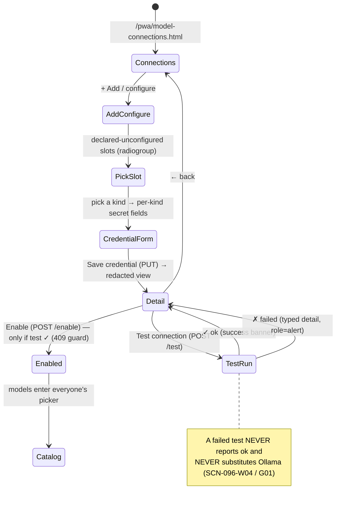
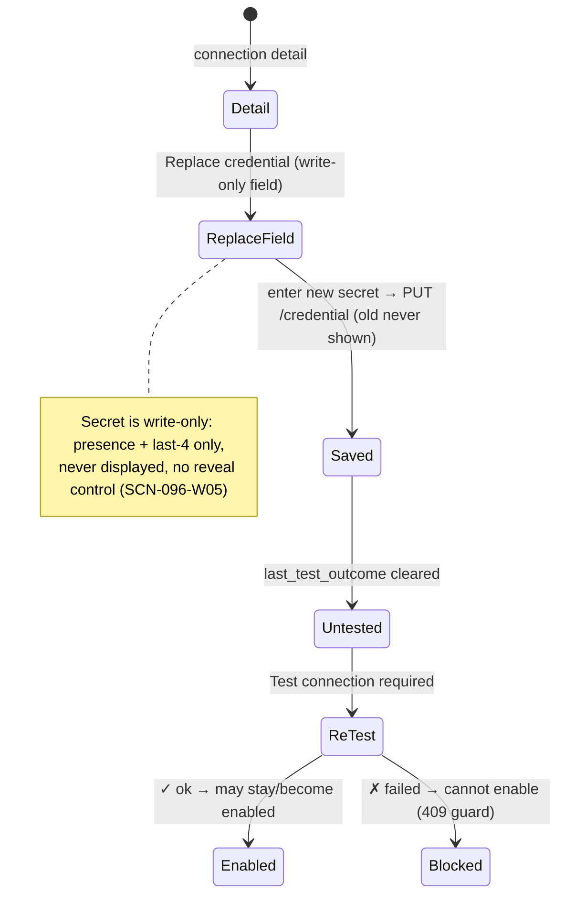
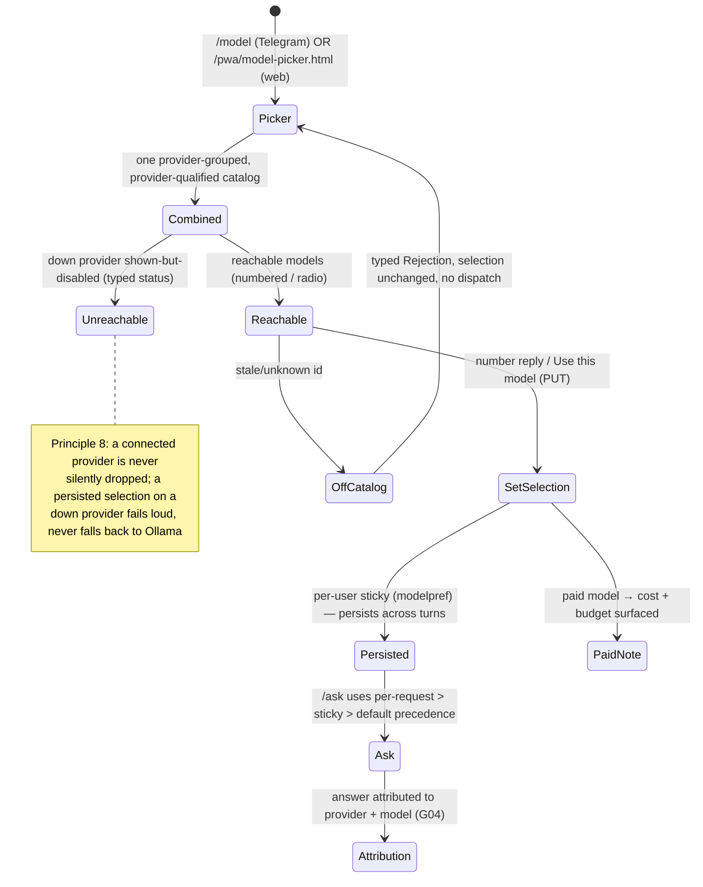
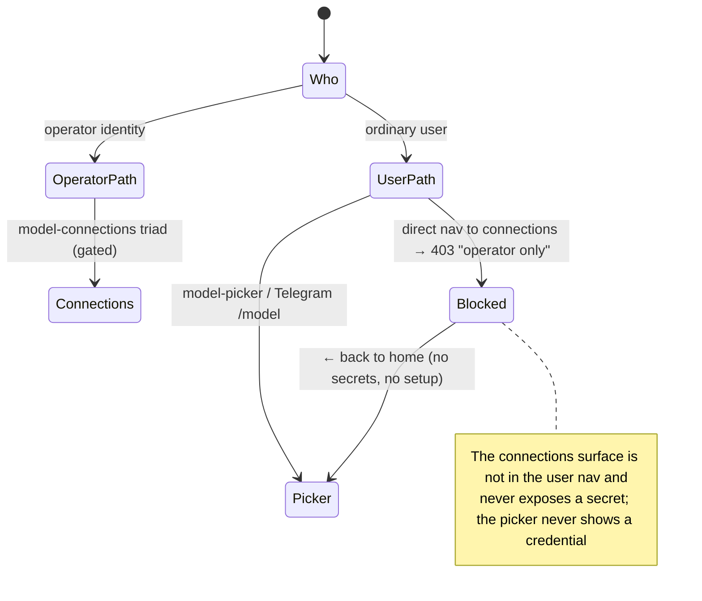

# Feature: 096 Multi-Provider AI Model Connections

**Status:** in_progress — analyst-phase spec authored (bootstrap)
**Workflow Mode:** `full-delivery` (eventual; this run is the analyst bootstrap only — no design/scopes/implementation)
**Release Train:** `next`
**Owner Directive (2026-06-18):**
> Review how backend AI models are set up — we use Ollama, but we need to be able to set external models (Anthropic, OpenAI, Microsoft Foundry, Google, Amazon). A user needs to set up the connection in the web UI, then pick models from the available list (connected hosted providers + Ollama-installed) in frontends, e.g. Telegram.

**Architectural decision confirmed with the owner (2026-06-18):** provider/LLM connections are **operator-global** (set up once by the operator, shared by all users), NOT per-user "bring your own key". This keeps model connections consistent with the existing connector model (operator-global, shared tokens) and the single shared knowledge graph. Per-user BYOK is **explicitly out of scope**.

**Builds On (preserve invariants; do NOT amend):**
- spec 088 (open-knowledge model switching — synthesis-turn override) — `internal/assistant/openknowledge/modelswitch/allowlist.go`
- spec 089 (gather-turn model switching, precedence, attribution, one-validator/one-store parity) — `internal/telegram/model_command.go`, `internal/api/agent_model.go`
- spec 064/084/087 (open-ended knowledge `/ask` agent loop) — `ml/app/routes/chat.py`
- spec 044 (per-user bearer auth — claim-bound `actor_user_id`) — `internal/assistant/openknowledge/modelpref/store.go`

**Integrates With (consumes stable contracts; does not redesign):**
- The single global LLM config — `config/smackerel.yaml` `llm:` block; `internal/config/config.go` (`Validate`)
- The provider-aware synthesis/classify dispatch — `ml/app/synthesis.py`, `ml/app/drive_classify.py`
- The per-user model preference store + per-user USD budgets — `assistant.open_knowledge.per_user_monthly_budget_usd`

**Unblocks:**
- A later full-delivery run (design → plan → implement → test) that builds the three capability layers below. This spec authors ZERO source/test/migration edits.

---

## 1. Problem Statement

Smackerel today can talk to exactly **one** backend LLM provider at a time, and the most important agent path is **hardcoded to Ollama**. The owner wants Smackerel to connect to several hosted providers (Anthropic, OpenAI, Microsoft Foundry/Azure, Google, Amazon Bedrock) *alongside* local Ollama, let the operator wire those connections up from the web UI, and let each user pick which connected model a frontend (Telegram, web, future surfaces) uses.

Five verified current-state gaps make this impossible today:

1. **One global provider.** `config/smackerel.yaml` `llm:` exposes a single `provider` (`ollama` | `openai` | `anthropic`) with one `model`, one `api_key`, one `ollama_url`. Validation in `internal/config/config.go` (`Validate`) is binary: if the provider is Ollama it requires `OLLAMA_URL` / `OLLAMA_MODEL`, otherwise it requires one `LLM_API_KEY`. There is no representation of *several connected providers at once*.

2. **Inconsistent provider-awareness across dispatch paths.** Three code paths reach an LLM and only two are provider-aware:
   - `ml/app/synthesis.py` — provider-aware (branches Ollama vs. pass model + api_key to the model gateway).
   - `ml/app/drive_classify.py` — provider-aware (takes provider/model/api_key).
   - `ml/app/routes/chat.py` (`_dispatch_live`, the open-knowledge `/ask` agent loop) — **hardcoded** to the Ollama chat path and `OLLAMA_URL`, with **no** api_key and **no** provider branch. **This is the primary gap.** The model gateway already natively routes OpenAI, Anthropic, Azure (= Microsoft Foundry), Google Vertex/Gemini, and AWS Bedrock — so the transport is a routing-and-credentials problem, not a rewrite.

3. **Runtime model-switching exists but is Ollama-only.** Specs 088 + 089 already deliver a closed-set validator (`modelswitch/allowlist.go`, a pure leaf package built from SST), a Telegram numbered `/model` picker (`internal/telegram/model_command.go`), and a claim-bound HTTP `/v1/agent/model` surface (`internal/api/agent_model.go`) that share **one validator and one store** with a strict per-request > sticky > default precedence. Those specs **explicitly scoped out** external providers and "adding any new model" — so multi-provider is net-new territory that *builds on* their primitive rather than amending it.

4. **No model discovery.** `switchable_models` is a static SST list. The Ollama "installed models" endpoint (`/api/tags`) is used only in healthchecks and the test-pull script — never to enumerate models for user selection. Nothing aggregates "what models can I actually pick right now" across providers.

5. **No web UI for connection setup, and no runtime secret store.** The web surface only *displays* the provider/model read-only; there is no page to add/test/enable a provider connection. Secrets today are operator-global via SST/env (gitignored `config/generated/`), never entered by a user at runtime, and there is **no reversible encrypted-at-rest secret vault** (the existing credential stores hold one-way hashes or non-secret strings, which cannot be used to *call* a provider).

### Why operator-global (and not per-user BYOK)

Smackerel is **single-tenant with multi-user access** — a shared household/team brain. The knowledge graph (`artifacts`, `topics`, `people`, `edges`) has **no** `user_id` / `owner_user_id` column and retrieval does **no** per-user filtering: there is **one shared graph**. Connectors are already operator-global (configured once in `config/smackerel.yaml`, shared tokens — if the operator connects Gmail, every user sees that knowledge). For model connections to be the lone per-user-secret surface on a backend that shares everything else would be architecturally inconsistent and would force a per-user reversible secret-isolation layer that exists nowhere else. Therefore provider connections are **operator-global**. What stays per-user is only the **selection/preference** layer (each user picks *which* shared model to use — `modelpref`, keyed by `actor_user_id`) and the **per-user USD budget**.

### What is NOT the problem (anti-scope)

This is not a request to partition the graph per user, to build per-user key vaults, or to re-open the closed 088/089 synthesis/gather logic. It is: (A) represent *N* operator-global provider connections; (B) let the operator wire and test them from the web UI; (C) discover and present the combined model list to users in the existing pickers — while preserving every governance and parity invariant.

---

## 2. Outcome Contract

**Intent:** The operator can connect Smackerel to **multiple** AI model providers (local Ollama plus hosted Anthropic, OpenAI, Microsoft Foundry/Azure, Google, and Amazon Bedrock), wire and test each connection from the web UI, and every user can then pick any connected model — local or hosted — from one combined list in any frontend, with the selection persisted per-user and every answer attributed to the model that produced it.

Concretely:
- The operator configures one or more **operator-global** provider connections, each with the connection parameters its provider kind requires, and verifies each with a "test connection" action in the web UI.
- The open-knowledge `/ask` agent path becomes **provider-aware**: it dispatches to the provider of the *selected* model with that provider's credentials, instead of unconditionally targeting Ollama.
- A **discovery** capability aggregates Ollama-installed models and each enabled hosted provider's models into **one** list of **provider-qualified** model identifiers (`ollama/…`, `anthropic/…`, `openai/…`, `azure/…`, `google/…`, `bedrock/…`).
- The **existing** Telegram `/model` picker and HTTP/web model surface present that combined list; a user picks an entry; the selection persists through the **existing per-user preference layer** and respects the existing per-request > sticky > default precedence.
- When nothing is selected (or an Ollama model is selected), behavior is **byte-for-byte** today's Ollama path.

**Success Signal:**
- An operator adds an Anthropic (and an OpenAI, a Microsoft Foundry/Azure, a Google, and an Amazon Bedrock) connection in the web UI, runs "test connection," and sees a truthful pass/fail per connection.
- A user runs the model picker in Telegram, sees Ollama-installed **and** the connected hosted models in one provider-qualified list, picks a hosted model, asks a question, and the answer is produced by that hosted model and attributed to it.
- The identical combined list and selection behavior are available over the HTTP/web model surface, resolved through the **same** validator and **same** store as Telegram.
- With no hosted connection configured, an existing Ollama-only deployment behaves **exactly** as it does today (zero regression), proven by an unchanged no-override path.
- A deliberately misconfigured connection (bad key/endpoint) fails **loud** at startup or test time and is **never** silently substituted by Ollama.
- Selecting a paid hosted model enforces the per-user and global USD budgets before any provider call.

**Hard Constraints:**
1. **Operator-global connections (single-tenant consistency).** Provider connections are shared by all users; there is **no** per-user provider credential. Per-user state is limited to model *selection* and *budget*.
2. **NO-DEFAULTS / fail-loud SST.** Every provider-connection value originates from the single config source and resolves fail-loud; a missing or misconfigured connection aborts startup or the connection test with a named error and **never** silently falls back to Ollama. No fallback-default substitution forms.
3. **Single source of truth.** All connection configuration flows from `config/smackerel.yaml`; generated env files are derived artifacts. Real provider keys/endpoints live in the deploy-overlay/secret manager, never committed — this repo provides abstract substitution points only.
4. **Reversible-at-rest secrets, if runtime-entered.** If operator-entered-via-UI credentials are adopted, they MUST be stored **encrypted-at-rest and reversibly** under an operator-held master key and never returned in plaintext; one-way hashing does not fit a credential that must be *used* to call a provider. (Open design question OQ-1.)
5. **Parity preserved (specs 088/089).** The synthesis-vs-gather turn fork, the per-request > sticky > default precedence, the one-validator/one-store invariant, and the byte-for-byte no-override path are preserved and made **provider-agnostic** without amending specs 088/089.
6. **Transparency (Principle 8).** Every produced answer is attributed to the provider + model that generated it; no silent model substitution.
7. **Budgets become load-bearing.** With local Ollama the USD budgets are slack guardrails; with a paid provider selected they MUST be enforced before any billable call.

**Failure Condition:** A misconfigured connection silently falls back to Ollama (violates fail-loud); OR provider credentials are stored in a form that is readable from a repo/DB leak or returned in plaintext; OR per-user provider keys are introduced (violates the operator-global decision); OR the no-override Ollama path regresses; OR a hosted model can be dispatched without budget enforcement or without attribution; OR specs 088/089 parity invariants are broken.

---

## 3. Goals

- **G1 (Layer A — multi-connection abstraction).** Represent *N* operator-global provider connections (Ollama + Anthropic + OpenAI + Microsoft Foundry/Azure + Google + Amazon Bedrock), each carrying the connection parameters its provider kind requires.
- **G2 (Layer A — provider-aware `/ask`).** Make the open-knowledge agent dispatch route to the selected model's provider with that provider's credentials, replacing the hardcoded Ollama path, while keeping the Ollama path byte-for-byte for the no-override case.
- **G3 (Layer B — web UI setup).** Give the operator a web surface to add, view, test, enable, and disable each provider connection, with a truthful "test connection" affordance.
- **G4 (Layer B — secret storage).** Store connection credentials so they are protected at rest and never exposed in plaintext, consistent with fail-loud SST (mechanism resolved in design — OQ-1).
- **G5 (Layer C — discovery).** Aggregate Ollama-installed and each connected provider's models into one catalog of provider-qualified identifiers with capability metadata.
- **G6 (Layer C — unified selection).** Present the combined catalog in the existing Telegram and HTTP/web pickers; let users pick any entry; persist per-user via the existing preference layer; preserve one-validator/one-store parity and precedence.
- **G7 (cross-cutting governance).** Enforce fail-loud connection config, per-user/global USD budgets for paid models, and end-to-end model attribution.

---

## 4. Non-Goals (out of scope)

- **Per-user BYOK / per-user provider keys.** Operator-global connections only (confirmed architectural decision). No per-user secret isolation layer.
- **Partitioning the knowledge graph per user.** The single shared graph is unchanged; this feature does not add `user_id` ownership to artifacts/topics/people/edges.
- **Amending specs 088/089 synthesis/gather logic or reopening their closed bugs.** This feature *extends* their validator/store/precedence primitive and makes it provider-agnostic; it preserves their invariants verbatim.
- **New connectors or new knowledge-ingestion sources.** This is about *model* connections, not data connectors.
- **The live self-hosted deploy / A-B model evaluation run.** A separate devops/ops dispatch owns running this on real hardware; this spec is product behavior.
- **Replacing the model gateway or re-implementing provider transports.** The existing gateway already routes the named providers; this feature wires routing + credentials + discovery on top.
- **Auto-selecting a "best" model on the user's behalf.** Selection stays explicit and user-driven; the system does not silently switch a user's model.

---

## 5. Actors & Personas

| Actor | Description | Key Goals | Boundary |
|-------|-------------|-----------|----------|
| **Operator** | The single-tenant administrator who owns the deployment, its config, and its secrets. | Connect Smackerel to local + hosted providers; test/enable/disable connections; own credentials and budgets. | Only the operator may view/mutate provider connections and credentials. |
| **User** | A household/team member with a claim-bound identity (Telegram subject or web bearer subject). | See the combined model list; pick a model for their requests; keep that preference; stay within budget. | Never sees or enters provider secrets; never gains per-user provider keys; selection is per-user, knowledge is shared. |
| **Smackerel runtime (system)** | The Go core + ML sidecar that resolves connections, discovers models, dispatches to the selected provider, and enforces governance. | Fail loud on misconfiguration; aggregate discovery; enforce budget + attribution + parity. | Must never silently fall back to Ollama or expose secrets. |

---

## 6. Domain Capability Model

This feature introduces a **capability foundation** — *operator-global multi-provider model connectivity with unified discovery and per-user selection* — with multiple concrete providers and selection surfaces, so the capability-first triggers apply (a second-and-later provider; a provider/adapter/connector pattern; a surface shared across Telegram + web). The model is provider-/surface-neutral.

### 6.1 Domain primitives

| Primitive | Definition | Lifecycle / states |
|-----------|------------|--------------------|
| **ProviderKind** | A closed set of supported provider families: `ollama`, `anthropic`, `openai`, `azure-foundry` (Microsoft Foundry/Azure OpenAI), `google` (Vertex/Gemini), `bedrock` (Amazon). Each kind defines the connection parameters it requires. | fixed vocabulary; extended only by deliberate design change |
| **ProviderConnection** | An **operator-global** configured link to one provider kind: its kind, its connection parameters, and an enabled flag. | `configured → tested(ok/failed) → enabled/disabled` |
| **ModelDescriptor** | One selectable model: a **provider-qualified** identifier plus capability metadata (tool-capable, vision, context window). | discovered per request/refresh; not user-authored |
| **ModelCatalog** | The aggregated, de-duplicated list of `ModelDescriptor`s across Ollama-installed and every enabled connection. | rebuilt on discovery; cached with a freshness bound |
| **ModelSelection** | A user's chosen model on a surface — reuses the existing per-user preference (`actor_user_id`-keyed) with per-request > sticky > default precedence. | per-user sticky; per-request override; resettable |
| **DispatchTarget** | The resolved (provider connection + credentials + model) used to serve one request, plus the turn it applies to (gather vs synthesis, per 088/089). | computed per request; never persisted with secrets |
| **UsageBudget** | The per-user and global USD ceilings that gate paid-provider dispatch. | evaluated before each billable call |

### 6.2 Provider connection parameters (variation axis)

Each provider kind requires its own connection parameters — the operator supplies these once, globally. (Parameter *names* are illustrative of the domain, not an implementation contract; the design owns final shapes.)

| Provider kind | Connection parameters the operator supplies |
|---------------|---------------------------------------------|
| `ollama` | base URL (the existing local/remote Ollama endpoint) |
| `anthropic` | API key |
| `openai` | API key; optional organization; optional base URL |
| `azure-foundry` | API key; endpoint; API version; deployment name |
| `google` | Vertex: project + location + service-account credential **or** Gemini: API key |
| `bedrock` | AWS credentials (key/secret or assumed role) + region |

### 6.3 Capability foundation (variation axes)

The foundation is the **ProviderConnection registry** + the **discovery/catalog** + the **selection resolver**. Variation axes that MUST be expressible without forking the foundation:
1. **Provider kind** — the six kinds above, extensible to future kinds.
2. **Connection parameter shape** — per-kind parameter sets (table 6.2).
3. **Model capability flags** — tool-capable / vision / context window, so a surface can present or filter appropriately and the 088/089 gather-vs-synthesis turn distinction stays honored.
4. **Selection surface** — Telegram numbered picker and HTTP/web endpoint resolve through the **same** validator + **same** store (parity).
5. **Dispatch turn** — gather (tool-calling) vs synthesis (forced-final) turns keep their 088/089 fork, now provider-agnostic.

### 6.3.1 Single-foundation justification

Although multiple selection surfaces and providers exist, there is **one** foundation: the connection registry feeds the catalog, the catalog feeds the one validator/one store, and the resolver feeds the provider-aware dispatch. No per-surface or per-provider parallel registry/validator/store is permitted — that would violate the 088/089 one-validator/one-store invariant and the single-source-of-truth contract.

### 6.4 Invariants

- A provider with no configured connection contributes **zero** models; with only Ollama configured, the catalog and dispatch are byte-for-byte today's behavior.
- A `ModelSelection` is **never** accepted unless its target exists in the current `ModelCatalog` (closed-set validation, mirroring the 088/089 allowlist validator); an unknown/unavailable model is refused with a typed reason, never silently coerced.
- A `DispatchTarget` for a paid provider is **never** executed without first clearing the `UsageBudget`.
- A misconfigured/unreachable `ProviderConnection` **never** degrades into a silent Ollama dispatch; it surfaces a typed failure.
- Provider credentials are **never** returned to a user surface in plaintext and **never** carried in a `ModelSelection`.
- Telegram and HTTP/web resolve selection through the **same** validator instance and the **same** store (one-validator/one-store parity, SCN-089 precedent).

---

## 7. Requirements (technology-agnostic)

### Functional — Layer A (multi-connection provider abstraction)

- **FR-A1.** The system MUST allow the operator to configure one or more **operator-global** provider connections across the supported provider kinds (Ollama, Anthropic, OpenAI, Microsoft Foundry/Azure, Google, Amazon Bedrock), each independent of the others.
- **FR-A2.** Each provider connection MUST declare its provider kind and carry the connection parameters that kind requires (per §6.2).
- **FR-A3.** The open-knowledge agent dispatch path MUST be **provider-aware**: it MUST route a request to the provider of the *selected* model and supply that provider's credentials, instead of unconditionally targeting Ollama.
- **FR-A4.** When no model is selected, or the selected model is an Ollama model, the dispatch path MUST behave **byte-for-byte** as it does today (parity/no-regression).
- **FR-A5.** Provider connections MUST be operator-global; the system MUST NOT accept, store, or require per-user provider credentials.

### Functional — Layer B (connection setup in the web UI)

- **FR-B1.** The operator MUST be able to **add, view, test, enable, and disable** each provider connection from an operator-facing web surface.
- **FR-B2.** The web surface MUST provide a **"test connection"** action that verifies reachability and credential validity and reports a typed pass/fail — a failed connection MUST NOT report success.
- **FR-B3.** Connection credentials MUST be stored **protected at rest** and MUST NOT be returned to any surface in plaintext after entry.
- **FR-B4.** Only the operator identity may view or mutate provider connections and their credentials; ordinary users MUST NOT have access to this surface.
- **FR-B5.** Connection configuration MUST remain consistent with the single-source-of-truth config contract and fail loud when a required value is absent.

### Functional — Layer C (model discovery + unified selection in frontends)

- **FR-C1.** A discovery capability MUST aggregate the Ollama-installed models and every **enabled** provider connection's available models into **one** catalog.
- **FR-C2.** Every catalog entry MUST carry a **provider-qualified** identifier (e.g. `ollama/<model>`, `anthropic/<model>`, `openai/<model>`, `azure/<deployment>`, `google/<model>`, `bedrock/<model>`) and its relevant capabilities (tool-capable, vision, context window).
- **FR-C3.** The existing model-selection surfaces (the Telegram numbered picker and the HTTP/web model surface) MUST present the combined catalog and let a user pick any entry.
- **FR-C4.** A user's selection MUST be validated against the **current catalog** (closed-set) before it is accepted or dispatched; an unknown or unavailable model MUST be refused with a typed reason.
- **FR-C5.** A user's selection MUST persist via the **existing per-user preference layer** (keyed by the claim-bound `actor_user_id`), preserving the per-request > sticky > default precedence.
- **FR-C6.** The Telegram and HTTP/web surfaces MUST resolve selection through the **same** validator and the **same** store (one-validator/one-store parity).

### Cross-cutting — governance (fail-loud, budget, transparency, parity)

- **FR-X1.** Every provider-connection value MUST originate from the single config source and resolve **fail-loud**; a missing or misconfigured connection MUST abort startup or the connection test with a **named** error and MUST NEVER trigger a silent fallback to Ollama.
- **FR-X2.** When a **paid** provider model is selected, the per-user and global USD budgets MUST be enforced **before** any billable provider call; an exhausted budget MUST refuse the request with a typed reason rather than incur cost.
- **FR-X3.** Every produced answer MUST be **attributed** to the provider + model that generated it.
- **FR-X4.** Provider secrets MUST never be exposed to ordinary users through the discovery, selection, or attribution surfaces, and MUST never be echoed in logs or errors.
- **FR-X5.** The feature MUST **preserve specs 088/089 invariants** (synthesis-vs-gather turn fork, per-request > sticky > default precedence, one-validator/one-store parity, byte-for-byte no-override path), extended to be provider-agnostic, **without amending** those specs.

### Non-Functional

- **NFR-1.** Discovery MUST be latency-bounded and cached; a slow or unreachable provider MUST degrade gracefully (its models simply absent from the catalog) without blocking the catalog or any other capability.
- **NFR-2.** Keeping or selecting an Ollama model MUST add zero cost or latency versus today (no regression on the local path).
- **NFR-3.** Fail-loud configuration and connection-test errors MUST name the offending key/connection **without echoing secret values**.
- **NFR-4.** Credentials MUST be protected at rest such that a repository or datastore leak does not reveal usable plaintext provider credentials.

---

## 8. User Scenarios (Gherkin)

> Representative user journeys, not the exhaustive test list. A later plan maps each `SCN-096-*` to concrete tests in `scenario-manifest.json`.

```gherkin
# --- Layer A: Multi-connection provider abstraction ---

Scenario: SCN-096-A01 — Operator configures multiple provider connections
  Given a deployment with only a local Ollama connection
  When the operator adds an Anthropic and an OpenAI connection
  Then each connection is recorded as an independent operator-global provider connection
  And each carries the connection parameters its provider kind requires

Scenario: SCN-096-A02 — The /ask agent dispatches to the selected model's provider
  Given a user has selected a hosted model from a connected provider
  When the open-knowledge agent serves the user's question
  Then the request is dispatched to that model's provider using that provider's credentials
  And the answer is produced by the selected hosted model, not by Ollama

Scenario: SCN-096-A03 — No selection keeps today's Ollama behavior byte-for-byte
  Given a deployment with only the local Ollama connection and no model override
  When the open-knowledge agent serves a question
  Then dispatch follows the existing Ollama path unchanged
  And no provider credential or routing change is observable

Scenario: SCN-096-A04 — A connection carries provider-specific parameters
  Given the operator adds a Microsoft Foundry connection
  When the connection is saved
  Then it records the endpoint, API version, and deployment that the provider kind requires
  And a different provider kind records its own required parameters instead

# --- Layer B: Connection setup in the web UI ---

Scenario: SCN-096-W01 — Operator adds an Anthropic connection and tests it
  Given the operator opens the model-connections page in the web UI
  When the operator enters Anthropic connection details and runs "test connection"
  Then the system reports a truthful pass or fail for that connection
  And on pass the connection becomes available for model discovery

Scenario: SCN-096-W02 — Operator adds OpenAI, Foundry, Google, and Bedrock connections
  Given the operator is on the model-connections page
  When the operator adds an OpenAI, a Microsoft Foundry, a Google, and an Amazon Bedrock connection
  Then each is saved with its provider-specific parameters
  And each can be tested, enabled, and disabled independently

Scenario: SCN-096-W03 — Operator enables and disables a connection
  Given a configured, tested provider connection
  When the operator disables it
  Then its models are removed from the combined catalog
  And re-enabling it restores its models to the catalog

Scenario: SCN-096-W04 — A failed test connection reports a typed, actionable error
  Given the operator enters an invalid key or unreachable endpoint
  When the operator runs "test connection"
  Then the system reports a typed failure naming the connection and the failure reason
  And the system never reports a false success and never substitutes Ollama

Scenario: SCN-096-W05 — Credentials are stored protected and never returned in plaintext
  Given the operator has saved a provider connection with a credential
  When the operator re-opens the connection in the web UI
  Then the credential is shown only as a redacted/managed value, never in plaintext
  And the stored credential is protected at rest

# --- Layer C: Discovery + unified selection in frontends ---

Scenario: SCN-096-D01 — Discovery aggregates local and hosted models into one list
  Given Ollama-installed models and one or more enabled hosted connections
  When the model catalog is built
  Then it contains every Ollama-installed model and every enabled provider's models
  And each entry has a provider-qualified identifier and its capabilities

Scenario: SCN-096-D02 — A user lists the combined models in Telegram and picks a hosted model
  Given a user opens the model picker in Telegram
  When the picker lists the available models
  Then it shows Ollama-installed and connected hosted models in one numbered, provider-qualified list
  And selecting a hosted model sets it as the user's model for subsequent questions

Scenario: SCN-096-D03 — The same list and selection are available over HTTP/web (parity)
  Given the same catalog and the same user identity
  When the user reads and sets their model through the HTTP/web model surface
  Then it returns the same combined catalog and accepts the same selection as Telegram
  And both surfaces resolve through the same validator and the same store

Scenario: SCN-096-D04 — Selecting a model absent from the catalog is refused
  Given a user attempts to select a model not present in the current catalog
  When the selection is submitted on any surface
  Then it is refused with a typed reason
  And no dispatch occurs against an unknown model

Scenario: SCN-096-D05 — A user's selection persists across turns
  Given a user has selected a model
  When the user asks another question later without re-selecting
  Then the system uses the user's persisted selection
  And per-request > sticky > default precedence is honored

# --- Cross-cutting: governance (fail-loud, budget, transparency, parity) ---

Scenario: SCN-096-G01 — A misconfigured connection fails loud and never falls back to Ollama
  Given a provider connection with an invalid or missing required value
  When the runtime starts or the connection is exercised
  Then it fails loud with a named error identifying the connection
  And no request is silently re-routed to Ollama in its place

Scenario: SCN-096-G02 — Missing required connection config aborts startup loudly
  Given the single config source omits a required provider-connection value
  When the runtime starts and config validation runs
  Then startup aborts non-zero with a named missing-config error
  And no fallback-default value is substituted

Scenario: SCN-096-G03 — Selecting a paid model enforces the USD budgets before dispatch
  Given a user has selected a paid hosted model
  And the user's monthly USD budget is exhausted
  When the user asks a question
  Then the request is refused before any billable provider call
  And the refusal states that the budget is exhausted

Scenario: SCN-096-G04 — Every answer is attributed to the model that produced it
  Given a user asks a question answered by a selected hosted model
  When the answer is returned
  Then it is attributed to the provider and model that generated it

Scenario: SCN-096-G05 — Provider secrets never leak to users
  Given a user uses the model picker and reads an attributed answer
  When the user inspects the available surfaces
  Then no provider credential is exposed in the catalog, selection, attribution, or logs

Scenario: SCN-096-G06 — Specs 088/089 fork, precedence, and parity are preserved provider-agnostically
  Given a user switches the gather model and the synthesis model independently
  When the open-knowledge agent runs
  Then the gather-vs-synthesis turn fork, the precedence order, and one-validator/one-store parity behave exactly as specs 088/089 define
  And the only change is that the selected model may now belong to any connected provider
```

---

## 9. Acceptance Criteria

- Each `SCN-096-*` scenario above maps to at least one test in a later `scenario-manifest.json` and is covered by an explicit regression test for the behavior it protects.
- **Layer A:** multiple operator-global connections are representable; the `/ask` dispatch is provider-aware; the no-override Ollama path is byte-for-byte unchanged (SCN-096-A01..A04).
- **Layer B:** the operator can add/test/enable/disable each provider connection in the web UI; failed tests never report success; credentials are protected at rest and never returned in plaintext; only the operator can access the surface (SCN-096-W01..W05).
- **Layer C:** discovery aggregates Ollama + connected providers into one provider-qualified catalog; Telegram and HTTP/web present and persist selection through the same validator/store with precedence intact; unknown models are refused (SCN-096-D01..D05).
- **Governance:** misconfiguration fails loud and never falls back to Ollama; missing config aborts startup; paid-model selection enforces USD budgets before dispatch; every answer is attributed; secrets never leak; 088/089 invariants preserved (SCN-096-G01..G06).
- **Negative/error coverage is mandatory:** at least the bad-credential test (SCN-096-W04), the missing-config abort (SCN-096-G02), the exhausted-budget refusal (SCN-096-G03), and the unknown-model refusal (SCN-096-D04).

---

## 10. Product Principle Alignment

Per [product-principles.instructions.md](../../.github/instructions/product-principles.instructions.md) this section is **binding and blocking** (ratified 2026-06-03). Evidence: [docs/Product-Principles.md](../../docs/Product-Principles.md), [docs/smackerel.md](../../docs/smackerel.md), [.specify/memory/constitution.md](../../.specify/memory/constitution.md).

- **Principle 4 — Source-Qualified Processing.** ([docs/Product-Principles.md §"Principle 4"](../../docs/Product-Principles.md).) Each `ModelDescriptor` is **provider-qualified** — the source provider is part of the model's identity and is preserved end-to-end (catalog → selection → dispatch → attribution). The system never strips the provider qualifier down to a bare model name; the source IS the signal for which connection and credentials to use.
- **Principle 8 — Trust Through Transparency.** ([docs/Product-Principles.md §"Principle 8"](../../docs/Product-Principles.md); constitution Core Principle 4 — Explainable Synthesis.) Every answer is **attributed** to the provider + model that produced it (FR-X3), every connection test reports a truthful typed result (FR-B2), and model switching is never silent. The user can always trace *which model* answered. This continues the spec 088/089 attribution contract, now across providers.
- **Principle 1 — Local-First Knowledge Ownership** (constitution Core Principle 1). Hosted providers are **optional helpers, not the only way to use the product**: the default remains local Ollama, and with no hosted connection configured the system is byte-for-byte the local-first path (FR-A4, SCN-096-A03). This feature *adds* optional cloud reach without making cloud mandatory.
- **Principle 8 / C8 — Single Source Of Truth Configuration & NO-DEFAULTS.** All connection config flows from `config/smackerel.yaml`; missing/misconfigured connections fail loud and never silently fall back (FR-X1, FR-B5, SCN-096-G01/G02). No fallback-default forms.
- **Principle 5 — One Graph, Many Views** (respected, not deviated). This feature touches *model connectivity*, not the knowledge graph; it adds **no** parallel store and keeps the single shared graph and operator-global sharing model intact. The operator-global decision is the architecturally consistent choice precisely because the graph and connectors already share globally.
- **Principle 6 — Invisible By Default, Felt Not Heard** (respected). Model attribution is a lightweight, pull-only disclosure on answers the user already requested; this feature adds **no** new notifications, badges, or status pings.
- **Principle 10 — QF Companion Boundary** (respected, not applicable). This feature initiates **no** financial action and carries **no** QF packet; provider selection is descriptive infrastructure only.

**No principle deviations.** No requirement forces user organization at capture (P1), adds an unsolicited notification (P6), or produces long-form output (P7).

---

## 11. Release Train

**Target train:** `next` (the staging promotion-candidate train — charter "synthesis + multi-source coordination"; see [config/release-trains.yaml](../../config/release-trains.yaml)). The active `mvp` self-hosted train is frozen for **new** specs (the precedent set by spec 095, which is also on `next`), so this net-new feature targets `next`. Multi-provider model connectivity is a natural fit for the `next` "multi-source coordination" charter.

**No new feature flag is introduced.** `state.json.flagsIntroduced` is `[]`. The capability is gated by SST: a deployment with **no** hosted provider connection configured behaves byte-for-byte as today's Ollama-only path (FR-A4). Because no flag is introduced, there is no default-off-on-other-trains toggle — every train derives from the same `config/smackerel.yaml` SST contract, so behavior is determined solely by which provider connections the operator configures, identically on every train. (If the design phase later concludes a controlled-rollout flag is warranted, it MUST be declared in `state.json.flagsIntroduced`, default-ON only in the owning `next` train and default-OFF in every other train per the release-train policy.)

---

## 12. Builds On Specs 088/089 — Parity Invariants Preserved

This feature **extends** the open-knowledge model-switching primitive delivered by specs 088 (synthesis-turn override) and 089 (gather-turn override, precedence, attribution, parity). It does **not** amend those specs or reopen their bugs. The following invariants are preserved verbatim and merely made **provider-agnostic**:

1. **One validator / one store.** Telegram (`internal/telegram/model_command.go`) and HTTP/web (`internal/api/agent_model.go`) resolve through the **same** closed-set validator (`internal/assistant/openknowledge/modelswitch/allowlist.go`) and the **same** per-user store (`internal/assistant/openknowledge/modelpref/store.go`). The catalog this feature adds becomes the validator's source set; the validator and store remain singular (SCN-096-D03, SCN-096-G06).
2. **Synthesis-vs-gather turn fork.** The synthesis (forced-final) and gather (tool-calling) turns keep their independent overrides; this feature only widens the admissible set to multi-provider models (SCN-096-G06).
3. **Per-request > sticky > default precedence.** Unchanged; a per-request override still beats the per-user sticky preference, which still beats the SST default (SCN-096-D05).
4. **Byte-for-byte no-override path.** With no selection and only Ollama configured, behavior is identical to today (SCN-096-A03, FR-A4) — the spec 088 `IsZero()` baseline contract.
5. **Closed-set validation, never a silent default or backend passthrough.** An off-catalog model is a typed rejection, exactly as the 088/089 validator rejects an off-allowlist model (SCN-096-D04).

The net-new surface beyond 088/089 is: representing N provider connections (Layer A), the web UI to wire/test them (Layer B), and the cross-provider discovery that feeds the existing validator (Layer C) — all of which 088/089 explicitly scoped out.

---

## 13. Open Questions

> For resolution by the downstream planning chain (design → ux → plan). The analyst flags these; it does not decide them.

| OQ | Question | Owner | Notes |
|----|----------|-------|-------|
| **OQ-1 (secret storage — KEY)** | Do operator-entered-via-UI credentials require a **net-new reversible encrypted-at-rest store**, or do provider credentials stay **SST/env-only** with the web UI limited to enable/test/select? | bubbles.design | The current posture has **no** reversible secret vault (existing stores hold one-way hashes / non-secret strings). Two candidate paths: **(a)** operator enters credentials in the web UI → requires a reversible store (e.g. authenticated symmetric encryption under an operator-held master key) so credentials can be *used* to call providers and are never plaintext at rest or in transit to a user — net-new pattern; or **(b)** credentials stay in `config/smackerel.yaml` / env (deploy-overlay/secret manager) and the web UI only enables/tests/selects, never accepts a raw secret — preserves today's env-only posture and the no-env-secrets-in-repo rule. Whichever is chosen MUST be fail-loud SST-consistent and MUST satisfy NFR-3/NFR-4. **One-way hashing (argon2id) does NOT fit** a credential that must be replayed to a provider. |
| **OQ-2 (discovery freshness/caching)** | What is the catalog refresh/cache strategy and the per-provider discovery timeout, and how is a slow/unreachable provider surfaced (absent vs. error)? | bubbles.design | Must satisfy NFR-1 (graceful degradation, no catalog-wide block). SST-bounded values, fail-loud. |
| **OQ-3 (paid CostFn wiring)** | How is per-model/per-provider cost computed so the existing per-user/global USD budgets become load-bearing for paid providers (today's CostFn is zero-cost for local Ollama + searxng)? | bubbles.design | FR-X2 requires real budget enforcement before billable calls; the existing budget knobs (`per_user_monthly_budget_usd`, `monthly_budget_usd`) are present but slack until a real CostFn is wired. |
| **OQ-4 (provider-qualified id scheme)** | What is the canonical provider-qualified identifier grammar (prefix per kind, deployment vs model naming for Azure/Bedrock) used uniformly across catalog, selection, persistence, and attribution? | bubbles.design | Must round-trip through the 088/089 validator + store without ambiguity (FR-C2). |
| **OQ-5 (capability surfacing in pickers)** | How much capability metadata (tool-capable, vision, context) does each picker surface or filter on, given the gather-turn requires tool-capable models? | bubbles.ux | Keep the Telegram picker phone-screen-fit (Principle 7); avoid noise (Principle 6). |
| **OQ-6 (web UI scope shape)** | Is the model-connections page a net-new operator settings surface, and what is its minimal flow (list → add → test → enable/disable)? | bubbles.ux / bubbles.design | First operator-facing settings/model page; today the web surface only displays provider/model read-only. |

---

## 14. Routing Note (substrate boundary)

This analyst-phase spec authors **zero** source/test/migration edits. The downstream chain owns:
- **bubbles.design** — resolve OQ-1..OQ-4; define the provider-aware dispatch seam in the `/ask` path (`ml/app/routes/chat.py`), the connection registry + secret-storage mechanism, the discovery/catalog contract, and the budget CostFn wiring — all as additive seams over the existing 088/089 validator/store and the existing synthesis/classify provider-aware patterns.
- **bubbles.ux** — resolve OQ-5/OQ-6 (picker capability surfacing; web UI flow), non-UI behavior/attribution copy.
- **bubbles.plan** — decompose into scopes with DoD, populate `scenario-manifest.json` from the `SCN-096-*` set, and preserve the 088/089 parity invariants as explicit DoD checks.

Any required change to the spec 088/089 substrate, the intent/facade substrate, or the config validation core MUST be routed as a packet to the owning surface at implementation time — never an in-place rewrite under this feature.

---

## UI Scenario Matrix

> Authored by `bubbles.ux` (UX phase, parent-expanded `full-delivery` run). Maps
> each UI journey to its actor, surface, entry point, and the `SCN-096-*`
> acceptance scenario(s) it serves. Two actor lanes — **Operator** (the
> connections-setup surface) and **User** (the model picker) — are never blurred
> (FR-B4, Hard Constraint 1).

| # | Journey | Actor | Surface | Entry point | Steps | Expected outcome | Scenarios |
|---|---------|-------|---------|-------------|-------|------------------|-----------|
| M1 | List connections + per-connection status | Operator | Web (PWA, operator-gated) | `/pwa/model-connections.html` | Open page | Every SST-declared slot listed with kind, enabled/disabled, last-tested pass/fail + when, secret presence + last-4 (never the secret), model count | W01–W05 |
| M2 | Add/configure a connection (per-kind params) | Operator | Web (PWA) | `+ Add / configure` → `model-connection-add.html` | Pick a declared-unconfigured slot → enter that kind's secret fields → Save | Credential stored write-only; redacted view returned; slot ready to test | W01, W02 |
| M3 | Test a connection (truthful pass/fail) | Operator | Web (PWA) | Connection detail → `Test connection` | Run test | Clearly-passed or clearly-failed typed result; a fail looks failed, never a false success, never an Ollama substitute | W01, W04, G01 |
| M4 | Enable / disable a connection | Operator | Web (PWA) | Connection detail → `Enable` / `Disable` | Toggle | Enabled (only if credential present + last test ok) → models enter catalog; disabled → models leave catalog | W03 |
| M5 | Rotate / replace a credential | Operator | Web (PWA) | Connection detail → `Replace credential` | Enter a new secret (old never shown) | New credential stored write-only; last-test reset → re-test required before re-enable | W05 |
| M6 | Operator-only gate is visible | Non-operator user | Web (PWA) | Direct nav to `/pwa/model-connections.html` | Load | 403 → "operator only" notice + link home; no secrets, no setup affordance, page not in user nav | W05 (boundary), FR-B4 |
| P1 | Pick a model from the combined list (Telegram) | User | Telegram | `/model` | Read numbered list → reply with a number | Provider-grouped, provider-qualified, cost-hinted list; numbered reply selects; selection persists | D01, D02, D05 |
| P2 | Pick a model from the combined list (web) | User | Web (PWA) | `/pwa/model-picker.html` | Open → choose a model | Same combined list + same selection semantics as Telegram (one validator/one store) | D01, D03, D05 |
| P3 | Unreachable provider is shown, not dropped | User | Telegram + Web | model picker | A connected provider is currently down | Provider shown with a typed status, its models shown-but-disabled; picker still works; never silently dropped | D01, G01, NFR-1 |
| P4 | Paid model selection is cost-transparent | User | Telegram + Web | model picker | Select a hosted (paid) model | Cost hint + budget surfaced before/at selection; user is not surprised by spend | G03, P-7 |
| P5 | Off-catalog selection is refused | User | Telegram + Web | model picker | Submit a model not in the catalog | Typed rejection (same `modelswitch.Rejection`), no dispatch, prior selection unchanged | D04 |
| P6 | Answer carries model attribution | User | Telegram + Web | `/ask` answer | Read an answer | Answer attributed to the provider + model that produced it | G04 |

---

## UX Specification

> Authored by `bubbles.ux`. This section resolves the two UX-owned open
> questions — **OQ-5** (picker capability surfacing, both surfaces) and **OQ-6**
> (operator web connection-setup flow) — and specifies layout, flow, copy,
> affordances, states, accessibility, and responsive behavior. It **consumes**
> the design-owned data contract (the `/v1/admin/model-connections*` admin
> endpoints in [design.md §6.1](design.md), the `/v1/agent/model` selection view
> in [design.md §6.4](design.md), the discovery `ModelCatalog` +
> `ProviderDiscoveryStatus` shapes in [design.md §6.3](design.md)) and never
> redesigns it. Where the picker needs a field the current contract does not yet
> expose, it is flagged as an **additive enrichment** routed to design/plan (see
> Residual Questions) — not redesigned here.

### Binding UX Decisions (resolves OQ-5 / OQ-6)

| # | Question | **Binding UX outcome** | Rationale | Left to design/plan |
|---|----------|------------------------|-----------|---------------------|
| **OQ-5a** | How are providers/models grouped + labeled in the combined list? | **Group by provider.** Each provider is a labeled group (`— <Provider> · <cost-class> · <reachability> —` on Telegram; a `<section>` with a group header + status pill on web). Within a group, models are listed in catalog order carrying their **provider-qualified id** verbatim (`ollama/gemma3:4b`, `anthropic/claude-3-5-sonnet`, `azure/<deployment>`, …). | Grouping by provider lets a non-technical user reason about *where* a model runs (and whether it costs money) before *which* one. Showing the provider-qualified id verbatim honors Principle 4 (source-qualified) and matches the dispatch/attribution identity 1:1. | Exact provider display names come from the SST registry `display_name`; group ordering (local-first vs config order) is a plan tuning detail (UX default: **Ollama/local group first**, then hosted in registry order). |
| **OQ-5b** | How are "current" + "system default" tagged? | **Preserve the 088/089 tags verbatim.** A model that is the caller's effective selection is tagged `current`; the SST default is tagged `system default`; a model that is both renders `current · system default` (the exact `modelPickerReply` mechanic in [`model_command.go`](../../internal/telegram/model_command.go)). Web shows the same as inline pill tags. | This is a hard parity constraint (Hard Constraint 5 / SCN-096-G06). The picker widens the *set* to multi-provider but the tag vocabulary + selection semantics are unchanged. | None — verbatim reuse. |
| **OQ-5c** | How is an UNREACHABLE provider shown without breaking the picker? | **Shown-but-disabled, never hidden.** A provider whose discovery returned a typed down/slow/auth-failed status ([design.md §6.3](design.md) `ProviderDiscoveryStatus`) is rendered as a **visible group with its typed status** and its models **shown but not selectable** (un-numbered on Telegram; `aria-disabled`, removed from the radio tab order on web). Numbering/selection covers **only reachable** models, so a chosen number/option always maps to a dispatchable model. **Exception:** if the caller's *persisted current* selection belongs to a now-unreachable provider, it stays shown as `current · ⚠ provider unreachable` — the selection is **never silently reset** and a later `/ask` fails loud rather than falling back to Ollama. | Principle 8 (transparency): a connected provider is **never silently dropped** — its outage is surfaced with a typed reason. Truthfulness (the SCN-096-W04 philosophy applied to the picker): never *offer* a selection that cannot be served right now. Persistence (SCN-096-D05): a sticky selection is not silently mutated. Fail-loud (FR-X1 / SCN-096-G01): the down-provider selection fails loud, never a silent Ollama substitution. | The precise typed→copy mapping (`unreachable`/`timeout`/`auth_failed`/`disabled` → user phrasing) is fixed below; whether the picker offers a one-tap "retry discovery" is a plan nicety. |
| **OQ-5d** | How is cost / paid-vs-free hinted? | **Per-group cost class + per-model cost hint + a budget line.** Each provider group carries a cost class: Ollama/local → `free · local`; every hosted provider → `paid`. Selecting a paid model surfaces a **one-time, pull-triggered** cost confirmation (`This model is paid — requests draw on your monthly budget ($X of $Y used). Local models are free.`). The budget figure comes from an additive `/v1/agent/model` enrichment (flagged below). | The user must not be surprised by spend (Outcome Contract success signal; FR-X2 / G03). Principle 6 (invisible by default): the cost notice is a **response to the user's own deliberate selection action**, not a pushed nag, and the free local path shows **no** budget chrome at all. | The exact rate display (e.g. `$3/$15 per 1M tok` vs a plain `paid` chip) and whether to show remaining-budget always vs only-on-paid is a plan call; UX default = **plain `paid` chip + a budget line shown only when ≥1 paid model is in the catalog**. |
| **OQ-5e** | How much capability metadata does each picker surface? | **Surface tool-capability prominently; context window compactly; vision as a small chip.** Telegram appends a compact `🔧 tools` marker to tool-capable entries only; web shows small chips (`🔧 tools · 200k ctx · 👁 vision`). The synthesis picker lists **all** catalog models (synthesis is forced-final); the gather-turn surface (089) continues to honor the `tool_capable_gather_models` set (now provider-qualified, [design.md §7](design.md)). | The 088/089 gather turn requires tool-capable models, so tool-capability is the one capability a user's choice can break; it earns prominence. Context/vision are secondary. Keeping it to one marker on Telegram honors Principle 7 (phone-screen-fit) and Principle 6 (no noise). | Whether the **gather** picker hard-filters non-tool-capable models or shows-but-disables them mirrors OQ-5c; plan confirms against the 089 surface. |
| **OQ-6a** | What is the operator connections-page shape + minimal flow? | **A three-page PWA triad** matching the existing connectors convention ([`connectors.html`](../../web/pwa/connectors.html) → [`connectors-add.html`](../../web/pwa/connectors-add.html) → [`connector-detail.html`](../../web/pwa/connector-detail.html)): **list** (every declared slot + status) → **add/configure** (pick a declared-unconfigured slot → enter that kind's secret fields → Save) → **detail** (status banner, read-only SST params, write-only credential, **Test**, **Enable/Disable**, **Replace credential**). All three consume the `/v1/admin/model-connections*` JSON contract and are **operator-gated**. | Reuses the repo's proven list→add→detail PWA pattern and aria/role conventions, so the operator surface is instantly familiar and the markup contract is already validated by the PWA harness. The triad maps 1:1 onto the six admin endpoints. | The operator-gate mechanism (SST `infrastructure.operator_user_ids` allowlist vs the live `webAuthMiddleware` subject) is a design/plan residual ([design.md §11.4 / §18](design.md)); UX specifies only the *visible* gate behavior. |
| **OQ-6b** | How does "add a connection" reconcile with the two-plane (SST topology + DB credential) model? | **The list shows ALL declared slots; "add/configure" wires a declared-but-unconfigured slot, it does not invent a slot.** The add page's provider picker is scoped to **declared db-mode slots that lack a credential**. Each kind's form shows its **non-secret params read-only** (sourced from the SST registry — Ollama `base_url`; OpenAI `org`/`base_url`; Azure `endpoint`/`api_version`/`deployment`; Vertex `project`/`location`; Bedrock `region`) and provides **write-only inputs only for that kind's secret fields**. An empty-state explains that adding a brand-new provider **kind** is an SST/config edit (deploy overlay), keeping the UI truthful to the two-plane design ([design.md §5.1](design.md)). | Honors the design's two-plane split (topology in SST, credential+activation in DB) without leaking a config-SST violation into the UI, while still giving the operator the full per-kind parameter matrix the directive asks for. | Add-connection runbook ergonomics (the SST-edit-then-wire workflow) is a plan confirmation ([design.md §18](design.md)). |
| **OQ-6c** | How is a credential shown / replaced given it is write-only? | **Presence + last-4 + last-tested only; input is write-only.** No page ever renders a stored secret. The credential appears as `secret: present · ····wxyz · last tested ok 2026-06-18` (or `needs credential`). The input field is empty-on-load, `type="password"`, `autocomplete="off"`, placeholder `Enter to set/replace — never displayed`, and is **never** pre-filled or echoed back from the server. Rotation is just "enter a new value" into the same write-only field. | FR-B3 / FR-X4 / SCN-096-W05: the secret is never returned in plaintext; the UI's view is presence + last-4 + test state. Rotation needs no read of the old value. | None — binding. |

### Operator vs User Boundary (binding)

Two **non-overlapping** surfaces; a user never crosses into operator config.

| | Operator connections surface | User model picker |
|---|------------------------------|-------------------|
| Pages | `model-connections.html`, `model-connection-add.html`, `model-connection-detail.html` | `model-picker.html` (web), Telegram `/model` |
| Who | Operator identity only | Every authenticated user (own selection only) |
| Sees secrets? | **Never plaintext** — presence + last-4 + test state only | **Never** — no credential field at all |
| Data contract | `GET/PUT/POST /v1/admin/model-connections*` (operator-gated) | `GET/PUT/DELETE /v1/agent/model` (own `actor_user_id`) |
| Nav placement | **Not** in the user-facing nav; reached only by the operator | Linked from the assistant/home for all users |
| Non-operator hitting it | 403 → "operator only" notice + link home (no secrets, no setup) | n/a |
| Scenarios | W01–W05, FR-B4 | D01–D05, G03–G05 |

### Write-Only Secret Affordance Contract (binding — appears in every credential wireframe)

1. **Display = presence + last-4 + last-tested.** Rendered from the redacted admin view (`secret_present`, `secret_redaction`, `last_test_outcome`, `last_tested_at`). Never the secret.
2. **Input = write-only.** `type="password"`, `autocomplete="off"`, empty on load, placeholder `Enter to set/replace — never displayed`, no server-side pre-fill, no echo on re-open.
3. **Save = `PUT …/credential` with the cleartext only in the request body** over the same-origin authenticated session; the response is the **redacted** view (no secret echoed).
4. **Rotate = enter a new value** into the same write-only field; the old value is never shown and never needed; saving clears `last_test_outcome` → a re-test is required before re-enable.
5. **No "reveal" control exists anywhere.** There is no show-password toggle, no copy-secret button, no decrypt affordance on any surface (the master key never leaves the Go core — [design.md §11.2](design.md)).

### Component Vocabulary (shared design language — reuses the PWA system)

All five screens reuse the existing PWA design system + aria conventions (the
`card` / `status` / `radio-group[role=radiogroup]` / `btn` / `dl`-field /
`status-pill` / `<template data-field>` vocabulary already in
[`connectors.html`](../../web/pwa/connectors.html),
[`connectors-add.html`](../../web/pwa/connectors-add.html),
[`connector-detail.html`](../../web/pwa/connector-detail.html),
[`assistant.html`](../../web/pwa/assistant.html)). No new palette; no new JS
framework; same strict CSP (`script-src 'self'`).

| Primitive | Existing PWA analog | Purpose here |
|-----------|---------------------|--------------|
| **Section card** | `<section class="card" aria-labelledby aria-busy>` | each connection / each picker group container; `aria-busy="true"` while discovery/list loads |
| **Status line** | `<p class="status status-loading\|status-error\|status-empty" role="status\|alert" aria-live>` | loading / empty / error / "operator only" notices |
| **Status pill** | `<span class="status-pill" data-status><span class="status-pill-text">` | per-connection test outcome + per-provider reachability (text + color + glyph, never color-only) |
| **Radio group** | `<div class="radio-group" role="radiogroup" aria-label>` + `<label class="radio">` | provider-kind picker (add flow) and model picker (selection) |
| **Field list** | `<dl class="...-fields"><div><dt><dd>` | read-only non-secret params + credential presence/last-4/last-tested |
| **Write-only secret input** | `<input type="password" autocomplete="off">` + `<label class="visually-hidden">` | the only credential input; never pre-filled |
| **Button hierarchy** | `<button class="btn btn-primary\|btn-secondary">` | `Test` = primary; `Enable`/`Disable`/`Replace` = secondary; `Save` = primary; destructive `Disable` styled cautionary |
| **Capability chip** | (new, CSS-only span) | `🔧 tools` / `200k ctx` / `👁 vision`; glyph decorative (`aria-hidden`), text carries meaning |
| **Cost chip** | (new, CSS-only span) | `free · local` / `paid`; never color-only |
| **Template card** | `<template id="...-template">` + `data-field` hooks | client-rendered connection rows + model rows (PWA convention) |
| **Footer back-link** | `<p class="footer"><a>← Back…` | return navigation between the triad pages |

### UI Primitives (UX9 — multi-screen reuse)

Five screens share UI behavior, so the primitives below are screen-neutral and
their composition rules are binding on `bubbles.implement`.

| Primitive | Consumed by (screens) | Composition rule | A11y / responsive constraint owned here |
|-----------|----------------------|------------------|------------------------------------------|
| **Provider group** | Telegram picker, Web picker, Connections list | one labeled group per provider; header = `display_name` + cost class + reachability status; **Ollama/local group first** | group header is a real heading (web `<h2>`/`<h3>`); on Telegram a `— … —` text rule; status carries text+glyph, never color-only |
| **Reachability status pill** | Web picker, Connections list, Connection detail | one pill per provider/connection driven by the typed `state` (`ok`/`unreachable`/`timeout`/`auth_failed`/`disabled`); copy mapping fixed below | `data-status` + visible text (`ok`→"connected", `unreachable`→"unreachable", `timeout`→"slow / timed out", `auth_failed`→"auth failed", `disabled`→"disabled"); AA contrast both themes |
| **Model row (selectable)** | Telegram picker, Web picker | provider-qualified id verbatim + tags (`current`/`system default`) + capability chips + cost chip; reachable only | web = `role=radio` in the group's radiogroup, ≥44px tap target; Telegram = a number `N` mapping to `models[N-1]` |
| **Model row (disabled / unreachable)** | Telegram picker, Web picker | shown, never hidden; not selectable; carries the provider's typed status | web `aria-disabled="true"` + out of tab order; Telegram un-numbered under the group's status line |
| **Write-only credential field** | Add/configure, Connection detail | the single secret input; presence/last-4/last-tested shown separately | `type=password`, `autocomplete=off`, `<label class="visually-hidden">`, never pre-filled; describedby a `hint` noting "never displayed" |
| **Read-only SST param list** | Add/configure, Connection detail | per-kind non-secret params from the registry, rendered `<dl>`; **not** editable in the UI | each `<dt>`/`<dd>` labeled; a hint notes params come from config (change = SST edit) |
| **Test-outcome banner** | Connection detail, Add/configure (post-save) | `ok` → success pill + "tested ok <when>"; `failed` → danger pill + typed `detail` (e.g. `auth_failed: invalid API key`); never a false success, never an Ollama mention | `role="status"` for ok, `role="alert"` for failure; text+glyph+color |
| **Cost confirmation notice** | Telegram picker, Web picker | shown only when the *selected* model is paid; pull-triggered by the selection, never pushed | `role="status"`; dismissible by navigating away; absent entirely for free/local selections |
| **Budget line** | Telegram picker, Web picker | compact `month-to-date $X of $Y used`; shown only when ≥1 paid model is in the catalog | informational, not a nag; needs the additive `/v1/agent/model` budget enrichment (residual) |

### Interaction States (per element)

| Element | default | loading | hover | focus (keyboard) | selected / active | disabled | error / fail |
|---------|---------|---------|-------|------------------|-------------------|----------|--------------|
| Connection card (list) | kind + status pill + last-4 + model count | `aria-busy` skeleton | lift | `:focus-visible` ring on the detail link | — | slot with no credential → "needs credential" CTA | list load error → `status-error` `role=alert` |
| Provider-kind radio (add) | unselected | `aria-busy` while slots load | tint | ring | checked → reveals that kind's form | already-configured kinds absent from the group | no declared-unconfigured slot → empty-state explaining SST add |
| Write-only secret input | empty, `••••` placeholder text | — | — | ring | — | disabled until a slot/kind is chosen | submit invalid → server re-render with typed message (no echo of input) |
| `Test connection` button | primary, enabled when credential present | spinner + `aria-busy`, button disabled mid-test | darken | ring | — | disabled if no credential | result rendered in the test-outcome banner (ok vs failed) |
| `Enable` button | secondary | — | — | ring | toggles to `Disable` | **disabled (409 guard) until credential present AND last test = ok** | enabling an untested slot → blocked with a typed notice |
| `Disable` button | secondary (cautionary) | — | — | ring | toggles to `Enable` | — | — |
| `Replace credential` | secondary | — | — | ring | opens the write-only field | — | new value invalid → typed message; on save, last-test cleared → "re-test required" |
| Model row (picker) | provider-qualified id + tags + chips | `aria-busy` while catalog loads | tint | ring | `current` tag + checked radio | unreachable provider's rows `aria-disabled` | off-catalog submit → `modelswitch.Rejection` envelope shown, prior selection intact |
| Paid-model selection | — | — | — | — | selecting → cost confirmation notice | — | budget exhausted at `/ask` → typed "budget exhausted" refusal (not in picker; at dispatch, G03) |
| Reset (`/model default` · web `Reset`) | — | — | — | ring | clears sticky → reverts to system default | — | — |

> **No client-side validation theater.** Every mutation is a real
> `fetch` to the documented endpoint (PWA convention) or a Telegram reply;
> failures surface the server's typed reason in a `role=alert`/`role=status`
> region. There is no inline JS that fakes a success.

### Accessibility

- **Landmarks + headings:** one `<h1>` per page; provider groups are `<h2>`/`<h3>`; the picker radiogroup and the add-flow provider picker are `role="radiogroup"` with an `aria-label` (matching [`connectors-add.html`](../../web/pwa/connectors-add.html)).
- **Status regions:** loading uses `aria-busy="true"` + `role="status" aria-live="polite"`; failures use `role="alert"`; the test-outcome banner announces pass/fail to screen readers (the connectors `status` pattern).
- **Color is never the only signal:** every status pill, cost chip, and capability chip carries **text + (decorative, `aria-hidden`) glyph + color** — an `unreachable` provider, a `failed` test, a `paid` model, and a `🔧 tools` model all read correctly in monochrome / for colorblind users.
- **Focus order:** Add flow — provider radio → secret field(s) → `Save` → `Test`. Detail — `Test` → `Enable`/`Disable` → `Replace credential`. Picker — current-selection summary → group 1 radios → group 2 radios → `Reset`. Disabled (unreachable) model rows are **out of the tab order**.
- **Keyboard operable:** every control is a real `<button>`/`<a>`/`<input>`; radios are arrow-key navigable within a group; no pointer-only affordance.
- **Touch targets:** model rows and buttons are **≥44px** tall on mobile.
- **Phone-screen-fit (Principle 7):** the Telegram picker stays plain text + one capability marker; the web picker collapses capability chips to a single line on mobile; the daily-driver path (pick once, it persists) needs no scrolling past the current selection.
- **Secret hygiene (terminal-discipline + FR-X4):** no secret is ever placed in the DOM, an `aria-live` region, a `title`, or a status message — presence/last-4 only.

---

## UI Wireframes

> ASCII wireframes are the machine-readable layout contract (mobile + desktop
> where they differ). `◀ data-field` marks a PWA client-render hook on the
> semantically-corresponding element (the [`connectors.html`](../../web/pwa/connectors.html)
> `<template data-field>` convention). Colors/glyphs are illustrative; status is
> always text+glyph+color. Nothing here introduces inline JS or relaxes the CSP.
> All credential surfaces obey the Write-Only Secret Affordance Contract above.

### Screen Inventory

| # | Screen | Actor | Surface | Route / trigger | Status | Consumes (design contract) | Scenarios |
|---|--------|-------|---------|-----------------|--------|----------------------------|-----------|
| S1 | Model Connections (list) | Operator | Web PWA (gated) | `/pwa/model-connections.html` | New | `GET /v1/admin/model-connections` | W01–W05, FR-B4 |
| S2 | Add / Configure Connection | Operator | Web PWA (gated) | `/pwa/model-connection-add.html` | New | `GET …/model-connections`, `PUT …/{id}/credential`, `POST …/{id}/test` | W01, W02, W05 |
| S3 | Connection Detail (test/enable/disable/rotate) | Operator | Web PWA (gated) | `/pwa/model-connection-detail.html?id=<id>` | New | `GET …/{id}`, `POST …/{id}/test`, `…/enable`, `…/disable`, `PUT …/{id}/credential` | W01, W03, W04, W05, G01 |
| S4 | Telegram Model Picker (numbered) | User | Telegram | `/model` | Modify (089) | shared `agenttool` validator/store + `ModelCatalog` | D01, D02, D04, D05, G03, G04 |
| S5 | Web Model Picker | User | Web PWA | `/pwa/model-picker.html` | New | `GET/PUT/DELETE /v1/agent/model` | D01, D03, D04, D05, G03, G04 |

---

### Screen: Model Connections (list)

**Actor:** Operator | **Route:** `/pwa/model-connections.html` | **Status:** New | **Scenarios:** W01–W05, FR-B4 (operator gate)

Desktop:

```text
┌──────────────────────────────────────────────────────────────────────┐
│ ⌂  Smackerel                                                           │
│ Model Connections                                                     │
│ Local + hosted AI providers this Smackerel can use   (operator only)  │
│                                                                        │
│ ┌──────────────────────────────────────────────────────────────────┐ │  section card
│ │ Connections                                          (aria-busy)   │ │  role=status:
│ │ Loading connections…                                              │ │  "Loading…"
│ ├──────────────────────────────────────────────────────────────────┤ │
│ │ ● Ollama (local-ollama)            [● enabled]   ◀data-field=status│ │  status-pill
│ │   kind: ollama · local · no credential                            │ │  per connection
│ │   3 models · reachable                            Manage →         │ │  ◀data-field=
│ ├──────────────────────────────────────────────────────────────────┤ │   models / link
│ │ ● Anthropic (anthropic-primary)    [● enabled]                    │ │
│ │   secret: present · ····wxyz   ◀data-field=secret-redaction        │ │  NEVER the secret
│ │   last tested: ✓ ok · 2026-06-18 09:12   ◀data-field=last-tested   │ │  presence+last-4
│ │   1 model                                         Manage →         │ │
│ ├──────────────────────────────────────────────────────────────────┤ │
│ │ ○ OpenAI (openai-primary)          [○ disabled]                   │ │  disabled slot
│ │   secret: present · ····ab12 · last tested: ✗ failed (auth_failed) │ │  failed test
│ │   0 models in catalog (disabled)                  Manage →         │ │  shown truthfully
│ ├──────────────────────────────────────────────────────────────────┤ │
│ │ ⚠ Azure Foundry (azure-primary)    [needs credential]             │ │  unconfigured
│ │   kind: azure-foundry · endpoint set · no credential yet          │ │  declared slot
│ │   Set up →                                        ◀data-field=cta  │ │
│ └──────────────────────────────────────────────────────────────────┘ │
│                                                                        │
│ [ + Add / configure a connection ]      (btn-primary → add page)      │
│ Adding a brand-new provider kind is a config (SST) change — see docs. │  two-plane truth
│                                                                        │
│ ← Back to home                                                        │
└──────────────────────────────────────────────────────────────────────┘
```

Operator-gate state (non-operator hits the page directly — **S1 / FR-B4**):

```text
┌────────────────────────────────────────────┐
│ Model Connections                          │
│ ┌────────────────────────────────────────┐ │
│ │ 🔒 Operator only           (role=alert) │ │  GET …/model-connections
│ │ This area manages shared AI provider    │ │  → 403 → this notice
│ │ connections and is limited to the       │ │  NO secrets, NO setup,
│ │ Smackerel operator.                     │ │  NOT in the user nav
│ │ ← Back to home                          │ │
│ └────────────────────────────────────────┘ │
└────────────────────────────────────────────┘
```

- **Interactions:** each connection → `Manage →` / `Set up →` opens S3 (detail); `+ Add / configure` opens S2; non-operator → operator-only notice + home link.
- **States:** loading (`aria-busy` + "Loading…"); enabled (`● enabled` success pill); disabled (`○ disabled` neutral pill); needs-credential (`⚠` + `Set up` CTA); last-test failed (`✗ failed (<typed>)` danger pill — shown truthfully, never hidden); empty (no declared slots → "No provider connections are declared in this deployment's config.").
- **Responsive:** desktop = comfortable rows; mobile = stacked cards, status pill under the name, `Manage →` full-width.
- **A11y:** `<h1>` page title; one `<section class="card" aria-busy>`; each row's status carries text+glyph+color; `Manage`/`Set up` are real links with `:focus-visible`.
- **`data-field`:** `status` (enabled/disabled), `secret-redaction` (last-4, never secret), `last-tested` (outcome+when), `models` (count), `cta` (set-up/manage), `kind`.

### Screen: Add / Configure Connection

**Actor:** Operator | **Route:** `/pwa/model-connection-add.html` | **Status:** New | **Scenarios:** W01 (Anthropic), W02 (OpenAI/Foundry/Google/Bedrock), W05 (write-only secret)

Step 1 — pick a declared-unconfigured slot (provider radiogroup, mirrors [`connectors-add.html`](../../web/pwa/connectors-add.html)):

```text
┌──────────────────────────────────────────────────────────────┐
│ ⌂  Smackerel                                                  │
│ Add / configure a connection                                 │
│ Wire a provider that config has declared      (operator only)│
│ ┌──────────────────────────────────────────────────────────┐ │
│ │ Provider                                    (aria-busy)   │ │  fieldset+legend
│ │ ┌──────────────────────────────────────────────────────┐ │ │  role=radiogroup
│ │ │ ○ Anthropic (anthropic-primary)                      │ │ │  aria-label=
│ │ │   needs: API key                                     │ │ │  "Provider"
│ │ │ ○ OpenAI (openai-primary)                            │ │ │  scoped to
│ │ │   needs: API key  · org/base URL from config         │ │ │  declared slots
│ │ │ ○ Microsoft Foundry / Azure (azure-primary)          │ │ │  lacking a
│ │ │   needs: API key  · endpoint/api-version/deployment  │ │ │  credential
│ │ │     from config                                      │ │ │
│ │ │ ○ Google (google-vertex)                             │ │ │
│ │ │   needs: service-account JSON  · project/location    │ │ │
│ │ │     from config   (or Gemini API key)                │ │ │
│ │ │ ○ Amazon Bedrock (bedrock-primary)                   │ │ │
│ │ │   needs: AWS key + secret  · region from config      │ │ │
│ │ └──────────────────────────────────────────────────────┘ │ │
│ │ (Ollama needs no credential — manage it from the list.)  │ │
│ │ No slot here? Add a provider kind in config (SST), then  │ │  two-plane truth
│ │ run config generate.                  ◀data-field=empty   │ │  (empty-state)
│ └──────────────────────────────────────────────────────────┘ │
└──────────────────────────────────────────────────────────────┘
```

Step 2 — that kind's credential form (example: **Microsoft Foundry / Azure**, the richest param set — **W02 / SCN-096-A04**):

```text
┌──────────────────────────────────────────────────────────────┐
│ Configure: Microsoft Foundry / Azure  (azure-primary)        │
│ ┌──────────────────────────────────────────────────────────┐ │
│ │ From config (read-only)              ◀data-field=params   │ │  read-only SST
│ │   Endpoint        https://….openai.azure.com             │ │  param list <dl>
│ │   API version     2024-06-01                             │ │  NOT editable here
│ │   Deployment      gpt-4o                                 │ │  (change = SST edit)
│ ├──────────────────────────────────────────────────────────┤ │
│ │ Credential (write-only)              ◀data-field=secret   │ │
│ │   API key  [ ••••••••••••••••••••••••••••• ]              │ │  type=password
│ │            Enter to set — never displayed                │ │  autocomplete=off
│ │            (visually-hidden <label>: "Azure API key")    │ │  never pre-filled
│ ├──────────────────────────────────────────────────────────┤ │
│ │ [ Save credential ]  (btn-primary)                       │ │  PUT …/credential
│ │ p.status role=alert (hidden until error)                 │ │  {secret_fields}
│ └──────────────────────────────────────────────────────────┘ │  → redacted view
│ After saving you'll be able to Test, then Enable.            │
│ ← Back to connections                                        │
└──────────────────────────────────────────────────────────────┘
```

Per-kind credential field matrix (the **write-only** fields each form exposes; non-secret params shown read-only from config):

```text
  ollama          → (no credential)            params: base_url
  anthropic       → API key                    params: —
  openai          → API key                    params: org?, base_url?
  azure-foundry   → API key                    params: endpoint, api_version, deployment
  google (vertex) → service-account JSON        params: project, location
  google (gemini) → API key                    params: —
  bedrock         → AWS access key + secret     params: region
```

- **Interactions:** pick a slot → reveal its form; `Save credential` → `PUT …/{id}/credential` (cleartext only in the request body) → redacted view → routes to S3 (detail) with a "now test it" hint; no declared-unconfigured slot → empty-state pointing at the SST/config path.
- **States:** loading slots (`aria-busy`); selected kind reveals only that kind's fields; missing required secret field → 422 typed message in a `role=alert`; success → redirect to detail.
- **Responsive:** single column both; the read-only param `<dl>` stacks on mobile.
- **A11y:** `<fieldset><legend>Provider`; `role="radiogroup"`; the secret input has a `visually-hidden` `<label>` + a `hint` ("never displayed"); `role="alert"` errors.
- **`data-field`:** `params` (read-only SST), `secret` (write-only input), `empty` (no-slot SST hint), `save`.

### Screen: Connection Detail (test / enable / disable / rotate)

**Actor:** Operator | **Route:** `/pwa/model-connection-detail.html?id=<id>` | **Status:** New | **Scenarios:** W01, W03, W04 (truthful fail), W05 (rotate), G01

```text
┌──────────────────────────────────────────────────────────────┐
│ ⌂  Smackerel                                                  │
│ Anthropic  (anthropic-primary)                (operator only) │
│ ┌──────────────────────────────────────────────────────────┐ │
│ │  [✓ tested ok]  2026-06-18 09:12     ◀data-field=banner   │ │  test-outcome
│ │   role=status                                            │ │  banner (ok)
│ ├──────────────────────────────────────────────────────────┤ │
│ │ Connection                           ◀data-field=fields   │ │  read-only <dl>
│ │   Kind            anthropic                              │ │
│ │   Enabled         ● yes                                  │ │
│ │   Secret          present · ····wxyz   ◀secret-redaction  │ │  NEVER the secret
│ │   Last tested     ✓ ok · 2026-06-18 09:12               │ │  presence+last-4
│ │   Models          1 (anthropic/claude-3-5-sonnet)        │ │
│ ├──────────────────────────────────────────────────────────┤ │
│ │ [ Test connection ]  (btn-primary)   ◀data-field=test     │ │  POST …/test
│ │ [ Disable ]          (btn-secondary) ◀data-field=toggle   │ │  POST …/disable
│ │ ── Replace credential ──             ◀data-field=rotate   │ │  write-only field
│ │   New API key [ •••••••••••••••••• ]  Enter to replace —  │ │  type=password
│ │                                       never displayed     │ │  PUT …/credential
│ │   [ Replace ]  (btn-secondary)                           │ │  → clears last-test
│ └──────────────────────────────────────────────────────────┘ │
│ ← Back to connections                                        │
└──────────────────────────────────────────────────────────────┘
```

Failed-test state (**SCN-096-W04 — a fail looks failed, never a false success, never an Ollama substitute**):

```text
│ ┌──────────────────────────────────────────────────────────┐ │
│ │  [✗ test failed]  role=alert         ◀data-field=banner   │ │  danger pill
│ │   auth_failed: invalid API key for anthropic-primary     │ │  TYPED detail,
│ │   (the connection is NOT usable; not substituted)        │ │  names the conn,
│ ├──────────────────────────────────────────────────────────┤ │  never "ok",
│ │   Enabled         ○ no   ← cannot enable until a test ✓   │ │  never Ollama
│ │ [ Test connection ]   [ Enable ]  ← disabled (409 guard)  │ │  enable blocked
│ └──────────────────────────────────────────────────────────┘ │
```

Disabled-but-credentialed slot (ready to enable):

```text
│  Enabled  ○ no                                                │
│ [ Test connection ]  [ Enable ]  ← enabled only after test ✓  │  POST …/enable
│  Enabling adds this provider's models to everyone's picker.   │
```

- **Interactions:** `Test connection` → `POST …/{id}/test` → banner shows typed `ok`/`failed`; `Enable`/`Disable` → `POST …/{id}/enable|disable` (enable **409-guarded**: credential present AND last test ok); `Replace` → `PUT …/{id}/credential` (new secret, write-only) → clears `last_test_outcome` → re-test required.
- **States:** tested-ok (success banner, `role=status`); tested-failed (danger banner, `role=alert`, typed detail, **Enable disabled**); enabled (`Disable` shown); disabled+credentialed (`Enable` shown, gated on a passing test); credential-replaced ("re-test required" notice).
- **Responsive:** single column; button row wraps on mobile (≥44px).
- **A11y:** banner `role=status` (ok) / `role=alert` (fail); read-only `<dl>`; write-only field has a `visually-hidden` label + "never displayed" hint; no reveal control.
- **`data-field`:** `banner` (test outcome), `fields` (read-only), `secret-redaction` (last-4), `test`, `toggle` (enable/disable), `rotate` (replace), `models`.

### Screen: Telegram Model Picker (numbered reply)

**Actor:** User | **Surface:** Telegram (plain text + numbered replies) | **Status:** Modify (extends 089 [`model_command.go`](../../internal/telegram/model_command.go)) | **Scenarios:** D01, D02, D04, D05, G03, G04

`/model` (no arg) — provider-grouped, provider-qualified, cost-hinted; the **numbered-reply** mechanic + `current`/`system default` tags are preserved verbatim:

```text
Your /ask model: anthropic/claude-3-5-sonnet (your default)
Budget: $2.14 of $10.00 used this month
Choose a model by replying with its number:

— Ollama · local · free —
  1. ollama/gemma3:4b (system default)
  2. ollama/llama3:8b  🔧 tools

— Anthropic · paid —
  3. anthropic/claude-3-5-sonnet (current)  🔧 tools
  4. anthropic/claude-3-5-haiku  🔧 tools

— OpenAI · ⚠ unreachable (auth failed) —
  temporarily unavailable — operator must re-test this connection
  (openai/gpt-4o, openai/gpt-4o-mini hidden from selection until it
   recovers; not silently dropped)

Reply with 1-4, or /model default to reset.
```

Paid-model confirmation (reply after a paid number — **cost transparency, G03 / Principle 6 pull-not-push**):

```text
✓ Your /ask model is set to anthropic/claude-3-5-sonnet (your default).
This is a paid model — each /ask draws on your monthly budget
($2.14 of $10.00 used). Local Ollama models are free.
It applies to every /ask until you change it or run /model default.
```

Off-catalog rejection (**SCN-096-D04** — same `modelswitch.Rejection`, prior selection unchanged):

```text
"anthropic/claude-9-ultra" isn't an available model.
Available: run /model to see the list. Your current selection is unchanged.
```

- **Interactions:** bare-number reply `N` → selects `models[N-1]` (the existing per-chat pending-selection mechanic — only **reachable** models are numbered, so `N` always maps to a dispatchable model); `/model <id>` sets by id; `/model default` resets; `--model=<id>` per-question override (precedence preserved).
- **States:** current/system-default tags verbatim; unreachable provider shown un-numbered with its typed reason (never dropped); paid selection → cost confirmation; off-catalog → typed rejection, no store write; budget line present only when a paid model is in the catalog.
- **Responsive:** plain text, phone-screen-fit (Principle 7) — one capability marker (`🔧 tools`) max per line; groups keep the list scannable.
- **A11y:** linear text, screen-reader friendly; status conveyed in words, not color.
- **Parity:** same catalog + same order + same one-validator/one-store + same precedence as the web picker (SCN-096-D03, G06).

### Screen: Web Model Picker

**Actor:** User | **Route:** `/pwa/model-picker.html` | **Status:** New | **Scenarios:** D01, D03, D04, D05, G03, G04

Desktop:

```text
┌──────────────────────────────────────────────────────────────────────┐
│ ⌂  Smackerel                                                          │
│ Your model                                                           │
│ Currently: anthropic/claude-3-5-sonnet — your default ◀data-field=cur │
│ This month: $2.14 of $10.00 used        ◀data-field=budget            │  only if a paid
│ ┌──────────────────────────────────────────────────────────────────┐ │  model exists
│ │ Choose a model                              (aria-busy)           │ │  role=radiogroup
│ │ ── Ollama · local · free ──   [● connected] ◀data-field=group     │ │  provider group
│ │   ◉ ollama/gemma3:4b   [system default]                          │ │  role=radio
│ │   ○ ollama/llama3:8b   🔧 tools · 8k ctx                          │ │  capability chips
│ │ ── Anthropic · paid ──        [● connected]                       │ │
│ │   ◉ anthropic/claude-3-5-sonnet  [current] 🔧 tools·200k·👁       │ │  current tag
│ │      paid — draws on your budget   ◀data-field=cost-note          │ │  cost note on
│ │   ○ anthropic/claude-3-5-haiku   🔧 tools · 200k ctx              │ │  paid select
│ │ ── OpenAI · paid ──    [⚠ unreachable · auth failed]              │ │  shown, NOT
│ │   ▢ openai/gpt-4o      (unavailable — provider down)  aria-disabled│ │  hidden;
│ │   ▢ openai/gpt-4o-mini (unavailable)                  out of tab   │ │  not selectable
│ └──────────────────────────────────────────────────────────────────┘ │
│ [ Use this model ]  (btn-primary)   [ Reset to default ] (btn-second) │  PUT / DELETE
│ p.status role=alert (hidden until rejection)                         │  /v1/agent/model
│ ← Back to assistant                                                  │
└──────────────────────────────────────────────────────────────────────┘
```

Mobile (single column; chips collapse to one line):

```text
┌────────────────────────────────┐
│ Your model                     │
│ Now: anthropic/claude-3-5-     │ ◀data-field=cur
│   sonnet · your default        │
│ $2.14 / $10.00 this month      │
│ ── Ollama · free ──[●connected]│
│  ◉ ollama/gemma3:4b            │
│     [system default]           │
│ ── Anthropic · paid ──[●conn.] │
│  ◉ anthropic/claude-3-5-sonnet │
│     [current] 🔧 · paid        │
│ ── OpenAI ──[⚠ unreachable]    │ shown-but-disabled
│  ▢ openai/gpt-4o (down)        │ aria-disabled
│ [ Use this model ]             │
│ [ Reset to default ]           │
└────────────────────────────────┘
```

Off-catalog / rejection state (**SCN-096-D04**, e.g. a stale tab submits a now-removed model):

```text
│ ┌────────────────────────────────────────────┐ │
│ │ ✗ "openai/gpt-4o" isn't available right now │ │  role=alert
│ │   (provider disabled). Your selection is    │ │  same Rejection
│ │   unchanged — pick another model.           │ │  shape; no store
│ └────────────────────────────────────────────┘ │  write, no dispatch
```

- **Interactions:** choose a radio → `Use this model` → `PUT /v1/agent/model {model}`; `Reset to default` → `DELETE /v1/agent/model`; selecting a paid radio reveals the inline cost note; off-catalog/unavailable submit → the shared `modelswitch.Rejection` envelope in a `role=alert`, prior selection intact.
- **States:** loading (`aria-busy`); `current` + `system default` tags (verbatim parity); reachable groups selectable; **unreachable group shown-but-disabled** (`aria-disabled`, out of tab order — Principle 8, never dropped); paid selection → cost note; budget line only when a paid model is in the catalog; rejection → typed alert.
- **Responsive:** desktop = grouped radios with full chip line; mobile = single column, chips collapse, ≥44px rows.
- **A11y:** `role="radiogroup"` per the picker with an `aria-label`; group headers are `<h2>`; chips/glyphs decorative (`aria-hidden`) with text labels; disabled rows `aria-disabled` + out of tab order; `role=status`/`role=alert` regions.
- **`data-field`:** `cur` (current selection), `budget` (month-to-date), `group` (provider group + status), `cost-note` (paid), plus per-row model ids.
- **Parity:** identical catalog + selection semantics to Telegram, resolved through the **same** validator + store (SCN-096-D03, G06); answers downstream carry provider-qualified attribution (G04).

---

## User Flows

> Complementary visualization of the cross-screen journeys. Every web transition
> is a same-origin `fetch` to a documented endpoint or an `<a>` navigation; every
> Telegram transition is a message/numbered-reply. No inline JS, no CSP change.

### Flow: Operator wires + tests + enables a connection (W01–W04)



### Flow: Operator rotates a credential (W05)



### Flow: User picks a model (Telegram + web parity, D01–D05)



### Flow: Operator vs User boundary (FR-B4)


