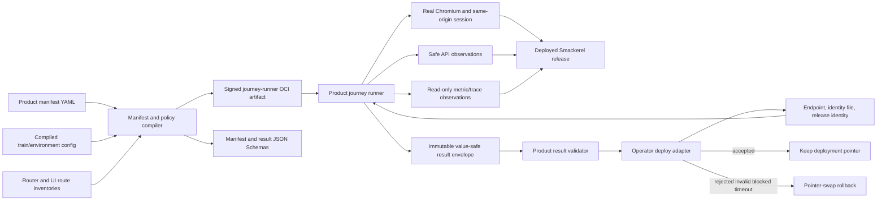

# Bug Fix Design: [BUG-102-001] Product Journey Acceptance Gap

## Design Brief

### Current State

Smackerel's deployment contract proves immutable images, config-bundle identity,
signature/provenance, proxy reachability, container health, and selected route
mounting. It does not publish a product-owned contract that proves an authenticated
user can complete the deployed product journeys. The operator-supplied 2026-07-23 live-target review
therefore observed infrastructure acceptance succeeding while modern auth, Search,
Digest, Assistant, and Wiki/Graph behavior remained broken.

The repository already has a Playwright harness under `web/pwa/`, but
`scripts/runtime/web-e2e-ui.sh` is a disposable test-stack lane. Its test-only
Compose override replaces Ollama with a stub and omits `smackerel-ml`; it cannot be
relabelled as production acceptance. No product-journey manifest, target runner,
or result schema exists outside this bug packet.

### Target State

Smackerel owns one versioned, machine-readable journey capability: manifest,
compiled policy, real-browser runner, API/telemetry observers, privacy filter,
evidence envelope, and fail-closed verdict reducer. The same contract supports a
fixture-seeded disposable validation mode and a production-target read-only mode,
but strict deploy acceptance consumes only the latter.

The deploy adapter owns only orchestration: resolve the exact release-matched
runner artifact, mount the target endpoint and operator-managed test identity,
invoke it, verify the signed result envelope, append adapter audit state, and
trigger pointer-swap rollback on rejection. It does not encode routes, selectors,
expected text, capability policy, or product failure meaning.

### Patterns To Follow

- Reuse `./smackerel.sh test e2e-ui`, `web/pwa/playwright.config.ts`, and the
	source-locked Playwright workspace as the browser-test foundation; add a
	release runner rather than reusing the disposable stack semantics.
- Reuse the current route authorities in `internal/api/router.go`,
	`internal/web/appshell.go`, and `web/pwa/lib/appnav.js`; manifest compilation
	must fail when route consumers drift.
- Reuse the closed outcome and truthful-state designs from BUG-070-001,
	BUG-002-006/007, BUG-073-006, BUG-080-001, BUG-004-004, BUG-039-005,
	BUG-083-002, spec 105, and spec 106.
- Reuse product metrics and traces as corroborating evidence only. DOM and API
	assertions remain the primary behavior proof.
- Preserve Build-Once Deploy-Many: runner, manifest, and schema are immutable
	release artifacts tied to the same source SHA as core and ML images.

### Patterns To Avoid

- Do not promote `/readyz`, `/api/health`, mounted routes, or container state to
	product acceptance. They are prerequisites, not journey proof.
- Do not run the test-only `e2e-ui` Compose override against production or call
	its stubbed/ML-omitted result production evidence.
- Do not let the operator-owned deploy adapter scrape UI text or carry a second
	route/assertion inventory.
- Do not create, update, delete, sync, schedule, trigger, or externally dispatch
	production business data, even with a proposed cleanup step.
- Do not put passwords, tokens, cookies, search text, Assistant prompts, graph
	labels, digest prose, card metadata, provider payloads, host details, or raw
	response bodies in result/evidence artifacts.

### Resolved Decisions

- The canonical manifest is product-owned YAML; its compiled JSON form and JSON
	Schema are embedded in a signed, digest-pinned journey-runner OCI artifact.
- `production-readonly` is the only mode accepted by deployment promotion.
- `seeded-validate` is allowed only against an explicit ephemeral `env=test*`
	target and an agent-owned fixture set; it never supplies deploy evidence.
- POST is not treated as synonymous with mutation. Login, Search, Assistant,
	and Graph query are closed `session-establish` or `read-compute` operations;
	every other non-GET/HEAD operation is denied unless an ephemeral fixture-owned
	scenario explicitly declares it.
- Product evidence is one immutable envelope plus content-free artifact digests.
	A malformed, incomplete, stale, release-mismatched, or unsafe envelope rejects.
- Any rejected, invalid, timed-out, or prerequisite-blocked strict acceptance
	after a new apply triggers adapter-owned pointer-swap rollback.

### Open Questions

No architecture question blocks implementation. Product dependencies listed in
`## Unresolved Dependencies` remain delivery prerequisites and must not be
mistaken for design uncertainty.

## Purpose And Scope

This design defines the product-owned contract required to decide whether a
specific deployed Smackerel release is usable. It covers:

- manifest and compiled-policy schemas;
- exact journey/API/browser/accessibility/telemetry/freshness assertions;
- real same-origin session establishment with an operator-provisioned identity;
- read-only production and fixture-seeded disposable execution modes;
- Playwright execution against the real deployed stack without interception;
- data-minimized evidence and a closed failure-code registry;
- deterministic aggregate reduction and result freshness;
- off-traffic candidate acceptance before any live pointer/routing change, with
	user-data migration expand-contract compatibility or automated write-freeze
	plus proven backup/restore (JOURNEY-014, JOURNEY-015);
- the production-inert, test-only, machine-readable fault-profile registry that
	102-001 owns and journey-owner packets (including BUG-073-006) consume
	(JOURNEY-016);
- connected-graph acceptance with a real connected-component minimum and
	equivalent Graph/Outline/Table projections (JOURNEY-017, JOURNEY-018);
- the one-way evidence ownership flow (JOURNEY-013): domain journey contracts ->
	BUG-102 immutable acceptance evidence -> BUG-032 readiness -> spec 106
	presentation, where neither consumer is a producer dependency of BUG-102;
- release artifact, deploy acceptance, rollback, and audit integration; and
- the hard ownership boundary between Smackerel synthetics and adapter logic.

It does not implement product defects, alter target configuration, create test
users or fixtures on production, replace dependency-owned E2E suites, or change
the deploy adapter in this repository.

## Grounded Findings And Root Cause

### Runtime And Test Findings

1. `internal/api/router.go` mounts authenticated business routes and UI routes,
	 but several optional families are conditional on non-nil wiring. Route
	 presence alone cannot distinguish disabled, broken, unauthorized, true empty,
	 and unavailable.
2. Server and PWA navigation inventories already drift: server navigation has
	 Knowledge while the PWA inventory does not expose Wiki; spec 106 owns their
	 final convergence.
3. Search uses a read-only `POST /search`; Assistant uses read-compute
	 `POST /api/assistant/turn`; future Graph query uses read-compute
	 `POST /api/graph/query`. A method-only read-only guard would reject valid
	 behavior or encourage route-specific bypasses.
4. Existing `./smackerel.sh test e2e-ui` starts a disposable Compose stack and
	 deliberately stubs Ollama/omits ML. It is appropriate for deterministic
	 regression but cannot prove the released target's model-backed journey.
5. Spec 105 has a completed technical design but no implementation or
	 certification. Spec 106 has analyst/UX output but no design, plan,
	 implementation, or certification. Their journeys must be dependency-gated.
6. Spec 104 Scope 8 is implemented/deployed, but its packet remains `blocked`
	 on an operator-only Telegram smoke. Browser Assistant acceptance may consume
	 its implemented self-knowledge contract only after dependency policy records
	 which evidence class is required for this browser journey.

### Root Cause

The product/deployment boundary lacks a single product-owned acceptance
capability. The adapter can prove lower-level deployment mechanics but has no
release-matched behavior contract to invoke. Product assertions consequently
live in scattered tests and planning artifacts, while target acceptance has no
closed way to determine requiredness, distinguish truthful empty/degraded states,
or reject missing journeys.

### Design Invariant

Only Smackerel can define what a successful Smackerel journey means. Only the
operator adapter can bind that generic definition to a real target and decide
whether to keep or roll back a deployment. Neither side may absorb the other's
responsibility.

## Architecture Overview



The runner is a product artifact, not an adapter script. It owns Playwright,
manifest interpretation, expected statuses, schema validation, DOM assertions,
accessibility checks, safe telemetry correlation, evidence minimization, and
verdict reduction. The adapter treats the runner as an immutable executable
contract and treats the envelope as untrusted input until schema, digest,
release identity, freshness, completeness, and signature checks pass.

## Capability Foundation

### Foundation Contract

| Contract | Responsibility | Consumers |
|---|---|---|
| `ProductJourneyManifest` | Declare stable journey groups, steps, routes, side effects, assertions, requiredness, dependencies, time bounds, and failure codes | Compiler, runner, static guards |
| `CompiledAcceptancePolicy` | Resolve train/environment requiredness, allowed outcomes, explicit time/freshness values, and identity roles with no defaults | Runner, result validator |
| `RouteSideEffectRegistry` | Classify each observed request as static, read, read-compute, session-establish, telemetry-read, fixture-write, or forbidden | Compiler, network guard, tests |
| `JourneyExecutor` | Run API and browser steps against one target/session with cancellation and exact observations | Playwright runner |
| `AssertionEvaluator` | Evaluate status, schema, DOM, accessibility, telemetry, and freshness assertions into closed outcomes | Journey executor, reducer |
| `EvidenceSanitizer` | Convert raw observations to closed content-free states and reject unsafe evidence | Runner, result writer |
| `VerdictReducer` | Fail closed over prerequisites, manifest completeness, required journeys, modes, and policy | Result writer, adapter validator |
| `AcceptanceResultValidator` | Validate schema/signature/release/freshness/counts/digests without rerunning product logic | Product CLI and adapter |

### Extension Points

- A journey implementation supplies one browser/API executor and assertion
	adapter for a manifest entry. It cannot define a new outcome or failure code
	outside the registry.
- A new product surface adds a manifest entry plus route-side-effect
	classification, schema assertions, DOM/accessibility assertions, and
	scenario-specific regression coverage.
- A new execution mode must define its environment class, mutation policy,
	identity/fixture requirements, evidence eligibility, and adapter eligibility.
- A new evidence observer must emit only closed states/counts/timing/digests and
	pass the sanitizer. Raw payload persistence is forbidden.

### Foundation-Owned Behavior

- one release identity and one manifest/policy digest per run;
- one isolated browser context and ephemeral cookie jar per identity;
- bounded step and overall deadlines with child cancellation;
- actual request/response observation without `page.route`, `context.route`,
	response fulfillment, service workers added by tests, or injected bearer
	state;
- static and runtime side-effect enforcement;
- closed result, journey, assertion, and failure-code vocabularies;
- prerequisite-before-journey evaluation;
- deterministic manifest-order execution and blocking-first presentation;
- content-free evidence with cryptographic digests; and
- no success when a required row, assertion, or expected telemetry observer is
	missing.

## Concrete Implementations

### Seeded Validate Runner

Runs through `./smackerel.sh test e2e-ui` or a dedicated validation command
against a disposable `env=test*` stack. It may create fixture-owned records only
when all of these are explicit: test identity, fixture set ID, unique ownership
prefix, allowed mutation routes, baseline, teardown, and post-teardown absence
proof. It remains the place for mutations, true-empty setup, fault injection,
and adversarial product regressions. Its result has
`evidenceEligibility: validation-only` and cannot satisfy deploy acceptance.

### Production Read-Only Runner

Runs from the signed journey-runner artifact against the actual deployed
release. It loads an operator-provisioned identity from a read-only secret file,
uses existing authorized records selected by safe structural discovery, and
performs no product-domain writes. Login establishes ephemeral security state;
Search/Assistant/Graph query may perform declared read-compute operations;
ordinary metrics, logs, and traces may be emitted by the runtime but cannot be
used to smuggle business mutations or content into evidence.

### Product Result Projection

The optional Admin / Acceptance projection from `spec.md` reads the immutable
result envelope through a product-owned read API. It cannot invoke a run,
provide credentials, edit policy, deploy, roll back, or trigger a product
operation. The adapter never scrapes this projection.

### Adapter Consumer

The adapter locates the release-matched runner digest, mounts generic target and
identity inputs, invokes one product command, validates the envelope with the
product validator, and maps only the aggregate verdict to deployment control.
It may add adapter orchestration evidence such as manifest pointer and attempt
ID, but it cannot alter the product envelope.

### Variation Axes

| Axis | Options | Foundation Ownership |
|---|---|---|
| Execution environment | disposable validate, deployed production target | Shared mode schema; mode-specific safety policy |
| Assertion plane | HTTP/API, browser DOM, accessibility, telemetry, freshness | Shared closed assertion contract; concrete observer differs |
| Side-effect class | static, read, read-compute, session-establish, telemetry-read, fixture-write, forbidden | Shared registry and runtime guard |
| Requiredness | required, optional, dependency-blocked, not-applicable by explicit policy | Compiled policy and reducer |
| Outcome | passed, allowed-empty, allowed-quiet, allowed-optional, allowed-degraded, failed, blocked, timed-out, not-evaluated | Shared closed enum |
| Consumer | product result projection, deploy adapter, readiness-claims derivation | Same immutable envelope; consumer-specific projection |

## Machine-Readable Journey Manifest

### Canonical Artifacts

The implementation owner should place product-owned sources under a generic
acceptance surface such as:

- `config/acceptance/product-journeys.v1.yaml` - human-reviewable manifest;
- `config/acceptance/product-journeys.schema.json` - manifest schema;
- `config/acceptance/product-acceptance-policy.schema.json` - compiled policy;
- `config/acceptance/product-acceptance-result.schema.json` - result envelope;
- product runner/validator code under an implementation-owned package; and
- `web/pwa/tests/product_journey_acceptance.spec.ts` - persistent real-browser
	regression entrypoint.

Paths are implementation guidance, not permission for this design agent to
create those files. The plan owner may adjust package names while preserving
the contracts below.

### Manifest Root

```yaml
apiVersion: smackerel.io/product-journeys/v1
kind: ProductJourneyManifest
manifestId: smackerel-primary-journeys
manifestRevision: 1
resultSchema: smackerel.io/product-acceptance-result/v1
supportedModes:
	- seeded-validate
	- production-readonly
policyRefs:
	requiredness: acceptance.journeys.requiredness
	timeouts: acceptance.journeys.timeouts
	freshness: acceptance.journeys.freshness
	dataPolicy: acceptance.journeys.data_policy
journeys: []
```

Every `policyRefs` key is required in the compiled config for the selected
train/environment. Missing, empty, duplicate, unknown, or unresolvable policy
fails compilation; there is no in-code fallback.

### Journey Entry Schema

```yaml
id: search.read
group: search
audience: authenticated-user
requirednessRef: acceptance.journeys.requiredness.search
dependencies:
	- packet: specs/002-phase1-foundation/bugs/BUG-002-006-search-htmx-sri-blocks-submit
		evidenceClass: certified-current-journey
dataMode:
	production-readonly: existing-authorized-records
	seeded-validate: fixture-set
steps:
	- id: open-search
		plane: browser
		method: GET
		route: /
		sideEffect: read
		expectedStatus: [200]
	- id: submit-search
		plane: browser-network
		method: POST
		route: /search
		sideEffect: read-compute
		expectedStatus: [200]
assertions:
	status: []
	schema: []
	dom: []
	accessibility: []
	telemetry: []
	freshness: []
timeoutRef: acceptance.journeys.timeouts.search
failureCodes: []
```

### Closed Manifest Vocabularies

| Field | Allowed values |
|---|---|
| `group` | `session`, `search`, `digest`, `assistant`, `wiki`, `graph`, `cards`, `recommendations`, `notifications`, `capability-status`, `photos`, `connectors`, `models`, `synthesis` |
| `audience` | `authenticated-user`, `operator` |
| `plane` | `browser`, `browser-network`, `api`, `telemetry`, `accessibility` |
| `sideEffect` | `static`, `read`, `read-compute`, `session-establish`, `telemetry-read`, `fixture-write`, `forbidden` |
| `requiredness` | `required`, `optional`, `dependency-blocked`, `not-applicable` |
| `dataSelection` | `existing-authorized-records`, `fixture-set`, `none` |
| `outcome` | the nine journey outcomes defined in `spec.md` |

Unknown enum values fail manifest or result validation.

## Execution Modes And Data Safety

### `production-readonly`

This is the default whenever the target policy class is production, self-hosted,
or otherwise non-ephemeral. The mode is valid only when:

1. the adapter supplies a read-only identity file through its secret boundary;
2. the identity maps to an existing active test principal with every required
	 read/operator scope and no value appears in argv, environment output, logs,
	 traces, screenshots, or the envelope;
3. the manifest contains no `fixture-write` step;
4. network observation sees only declared static/read/read-compute/
	 session-establish/telemetry-read requests;
5. no UI control associated with create, save, update, delete, refresh, sync,
	 test-provider, reconnect, replay, snooze, approve, generate, trigger,
	 schedule, upload, reveal, or confirm is activated;
6. browser storage contains no auth/session/payment secret; and
7. the run exits with the cookie jar and decrypted identity material destroyed.

`session-establish` may set an HttpOnly same-origin cookie. `read-compute` may
execute an idempotent query or model inference and may emit bounded operational
telemetry; it may not persist a capture, recommendation, graph view, Assistant
idea, card change, notification action, provider test, or scheduled work.

### `seeded-validate`

This mode is valid only when the compiled environment class matches `test*` and
the runner receives all of:

- `testIdentityRef` naming an agent-owned principal;
- `fixtureSetId` and unique run ownership prefix;
- exact fixture create/read/delete routes and expected row counts;
- baseline snapshot or proof that no shared baseline is touched;
- teardown procedure registered before the first write; and
- post-run absence/restore assertions.

Mutation is denied unless a manifest step says `fixture-write`, names the
fixture owner, and declares cleanup. Cleanup failure makes the result
`rejected`, keeps validation incomplete, and emits a safe fixture-owner code.
This mode can exercise Cards edits, connector tests, provider faults, Graph
saved views, and other mutation scenarios, but those results remain
`validation-only` and cannot satisfy deploy acceptance.

### Static Read-Only Guard

Manifest compilation rejects:

- an unclassified route;
- a production-mode `fixture-write` or `forbidden` step;
- a mutating method without an exact route-side-effect registration;
- a state-changing selector in a production journey;
- `page.route`, `context.route`, `route.fulfill`, request interception, token
	injection, direct database access, or target-specific literals in the runner;
- missing identity/fixture requirements for a mutating validate scenario; and
- a result/evidence field outside the safe schemas.

### Runtime Request Guard

Playwright records every same-origin request method plus normalized route
template and final status. It does not record query values or bodies. Before a
step, the runner arms the expected request set; any undeclared request or
side-effect class rejects immediately with `E102-JOURNEY-CONTRACT-UNSAFE-MUTATION`.
Redirect chains are declared explicitly. Static assets may be summarized by
count/status class; third-party requests are denied unless an existing product
journey explicitly requires an external read and the privacy policy permits it.

## Test-Only Fault-Profile Registry

BUG-102-001 OWNS the shared, production-inert, test-only, machine-readable
fault-profile registry required by JOURNEY-016 and SCN-102-001-12. Per
capability-foundation-design the broadest consumer owns the shared foundation:
102-001 exercises the widest fault surface (every required product journey), so
it owns the registry; BUG-073-006 SCOPE-01 (blank/auth-rejection Assistant
terminal state) is a CONSUMER of the same registry, not a second owner. This
design does not edit BUG-073-006; it publishes the contract that packet consumes.

### Ownership And Production Inertness

- The registry is authored under a generic acceptance surface (for example
	`config/acceptance/fault-profiles.v1.yaml` plus its JSON Schema); the path is
	implementation guidance, not permission for this design pass to create files.
- Fault profiles exist ONLY in disposable `env=test*` validate/e2e stacks. They
	are inert in production builds and config: production routes, requests,
	configuration, and UI expose no fault selector, trigger, or profile control.
	Manifest compilation rejects any production-mode reference to a fault profile,
	consistent with the existing Static Read-Only Guard and Runtime Request Guard.
- The registry is machine-readable so the owner (102-001 seeded-validate runner)
	and every consumer resolve the same profile identity deterministically.

### Required Profile Fields (Closed Schema)

Every profile SHALL declare, with no in-code default:

| Field | Meaning |
|---|---|
| `stableId` | Immutable profile identifier, never reused |
| `journey` | The owning product journey the fault targets |
| `setup` | Deterministic fixture/state setup for the fault in a disposable stack |
| `teardown` | Deterministic teardown restoring the disposable stack |
| `parallelism` | Isolation/parallel-safety declaration for concurrent runs |
| `expectedRequest` | The real first-party request the profile provokes |
| `expectedResponseOrTermination` | The real response or clean termination it must produce |
| `evidence` | The permitted value-safe evidence class for the profile |
| `noFirstPartyInterception` | Explicit assertion that the fault is produced by real stack behavior, never `page.route`/`context.route`/`route.fulfill`/first-party request interception |

The `noFirstPartyInterception` field binds the registry to the existing
real-stack no-interception guarantee (JOURNEY-006, Runtime Request Guard, Static
Read-Only Guard): a profile that could only be produced by intercepting a
first-party request is invalid.

### Consumer Contract (BUG-073-006 And Other Journey Owners)

- A consumer packet references profiles by `stableId` only; it never forks the
	schema, redefines a profile inline, or introduces a production fault control.
- A consumer runs a referenced profile in its own disposable `env=test*` stack
	using the profile's `setup`/`teardown`/`parallelism`, and asserts the profile's
	`expectedRequest` and `expectedResponseOrTermination` through real stack
	behavior with `noFirstPartyInterception` honored.
- BUG-073-006 SCOPE-01 consumes the Assistant-journey fault profile(s) for its
	blank/auth-rejection terminal state from this registry; it does not author a
	parallel registry. Ownership stays with 102-001; the consumer contract is
	one-way (consume, never own).
- Production inertness is a shared invariant: no consumer may expose a profile in
	a production build or config.

This section realizes the packet's `faultProfilePolicy` (`registry = test-only
machine-readable`; `productionExposure = forbidden`; the nine required fields
above).

## Product Journey Inventory

The table defines the minimum manifest. A dependency-gated journey still appears
in every result as `not-evaluated`; it is never omitted or treated as passing.
Selectors are stable semantic/data hooks, headings, labels, and states, never
user content.

| Journey ID | Required routes and statuses | Required DOM and accessibility state | Telemetry and freshness assertion | Principal failure families |
|---|---|---|---|---|
| `session.login-reuse` | `GET /login -> 200`; form `POST /v1/web/login -> 303`; redirected destination `GET -> 200`; authenticated probe `GET /api/digest -> 200` | One `main`, one login heading/form before submit; after login protected content is visible; cookie is HttpOnly/Secure in production/SameSite=Lax/Path `/`; no credential in DOM/storage/URL; expired session produces re-auth, not empty | `smackerel_auth_validation_outcome_total` increases for the safe outcome when observable; observation must be after release activation and inside session freshness policy | `E102-JOURNEY-AUTH-LOGIN`, `-COOKIE`, `-REUSE`, `-EXPIRED`, `-PRIVACY` |
| `search.read` | `GET / -> 200`; one `POST /search -> 200` using an operator-configured safe probe query reference, never query text in evidence | `role=search` form or equivalent accessible label; explicit submit path; loading then exactly one of results/no-match/error; result links are operable; no false empty on 401/403/5xx | `smackerel_search_latency_seconds` sample/correlation observed where telemetry adapter is configured; response completion is current to the run | `E102-JOURNEY-SEARCH-NO-REQUEST`, `-DUPLICATE-REQUEST`, `-HTTP`, `-FALSE-EMPTY`, `-DOM`, `-A11Y` |
| `digest.current-read` | `GET /digest -> 200`; corroborating `GET /api/digest -> 200` | Heading/date/state present; one closed state: current, quiet, stale, first-use empty, selected-date empty, error; stored current digest cannot render no-digest; content itself never enters evidence | Digest `generated_at`/read timestamp is compared with the required compiled freshness threshold; generation/fallback metric is supporting only | `E102-JOURNEY-DIGEST-HTTP`, `-SCHEMA`, `-FALSE-EMPTY`, `-STALE`, `-DOM`, `-A11Y` |
| `assistant.grounded-read` | `GET /assistant -> 302` to `/pwa/assistant.html`; destination `200`; one `POST /api/assistant/turn -> 200` using a safe operator-configured self-knowledge probe reference | Composer label, Send control, polite transcript, user row and paired pending/terminal Assistant row; terminal outcome is answer/clarification/refusal/typed error; never blank or `saved_as_idea`; retry or re-auth appears on failure | `smackerel_assistant_facade_turns_total` and latency/error outcome corroborate the run when available; source/corpus evidence must meet spec 104 freshness; prompt/answer/citations excluded from evidence | `E102-JOURNEY-ASSISTANT-HTTP`, `-BLANK`, `-FALSE-CAPTURE`, `-SCHEMA`, `-NO-RETRY`, `-A11Y`, `-FRESHNESS` |
| `wiki.browse` | `GET /pwa/wiki.html -> 200`; `GET /pwa/wiki_topics.html -> 200`; `GET /api/topics?limit=<policy> -> 200`; selected detail and `/api/graph/edges?... -> 200` only when a safe existing ID is discovered | Wiki heading/sections, loading status then populated or explicit true-empty; cross-link/detail controls keyboard-operable; API/auth/store failure is an alert/unavailable state, never empty | Graph route-manifest/synthetic observation must be current; safe counts only, no labels/IDs in envelope | `E102-JOURNEY-GRAPH-ROUTE`, `-HTTP`, `-FALSE-EMPTY`, `-PARTIAL`, `-DOM`, `-A11Y` |
| `graph.explorer` | Planned spec-105 routes `GET /knowledge/graph -> 200` and read-compute `POST /api/graph/query -> 200`; no execution before spec 105 activation | Bounded nonblank graph for populated data plus equivalent Outline/Table semantics; focus/filters/counts; true empty, partial, unavailable, unauthorized distinct; no labels in evidence | `smackerel_graph_query_total`, duration, bounded node/edge counts, and current graph activation evidence; result age uses compiled graph freshness | `E102-JOURNEY-GRAPH-DEPENDENCY`, `-QUERY`, `-UNBOUNDED`, `-PROJECTION`, `-A11Y`, `-FRESHNESS` |
| `cards.representative-read` | `GET /cards -> 200`; `GET /api/cards/ -> 200`; optional read-only `GET /api/card-optimization-report -> 200` only when capability policy requires it | Cards heading/navigation; wallet populated or explicit owned empty; representative row exposes safe lifecycle/status hooks; no edit/delete/generate action activated; keyboard table/list semantics | Card source/report freshness is evaluated from versioned metadata when the final BUG-083-002 contract is active; card values/names excluded | `E102-JOURNEY-CARDS-DEPENDENCY`, `-HTTP`, `-SCHEMA`, `-FALSE-EMPTY`, `-STALE`, `-DOM`, `-A11Y` |
| `recommendations.readiness` | `GET /recommendations -> 200`; planned `GET /api/recommendations/availability -> 200`; compatibility `GET /api/recommendations/providers -> 200` | Availability is ready/degraded/optional-unconfigured/unavailable from one snapshot; enabled plus zero usable production providers never renders ready; no request/watch trigger | Snapshot `observed_at` is within required health freshness; provider request metrics are not a readiness substitute | `E102-JOURNEY-RECOMMEND-DEPENDENCY`, `-ZERO-PROVIDER`, `-STALE`, `-MISMATCH`, `-DOM` |
| `notifications.read` | `GET /notifications -> 200`; `GET /api/notifications/status -> 200`; safe list read such as `GET /api/notifications/events -> 200` | Heading/status and one truthful ready/empty/degraded state; no replay/reconnect/manual-ingest/snooze/approval action; status/error regions named | Notification status observation is current to compiled freshness; event/action metrics are supporting only; event content excluded | `E102-JOURNEY-NOTIFICATIONS-HTTP`, `-SCHEMA`, `-FALSE-EMPTY`, `-DOM`, `-A11Y`, `-STALE` |
| `capability-status.read` | `GET /settings -> 200`; `GET /status -> 200`; `GET /api/health?strict=true -> 200` only as supporting fact | Capability rows use exact ready/optional-unconfigured/intentionally-unavailable/degraded/broken states; route/flag alone cannot produce ready; Settings remains read-only | Each capability evidence timestamp and source class is within compiled policy; health/container state cannot override failed journeys | `E102-JOURNEY-CONTRACT-CAPABILITY-POLICY`, `-STATUS-MISMATCH`, `-STALE`, `-DOM`, `-A11Y` |
| `photos.status-read` | `GET /pwa/photo-health.html -> 200`; `GET /v1/photos/health -> 200`; optional `GET /v1/photos/connectors -> 200` | `#photo-health-summary` leaves busy state; status or alert is visible; limitation codes have closed `data-limitation-code`; true zero counts differ from endpoint failure; no plan/confirm/upload/reveal action | Photo health observation and provider skip/limit state meet compiled freshness; `smackerel_photos_*` metrics corroborate only; no preview/label/provider payload evidence | `E102-JOURNEY-PHOTOS-HTTP`, `-SCHEMA`, `-FALSE-EMPTY`, `-LIMITATION`, `-DOM`, `-A11Y`, `-STALE` |
| `connectors.status-read` | `GET /pwa/connectors.html -> 200`; `GET /v1/connectors/drive -> 200`; server Settings connector inventory may corroborate | Connector list renders provider-neutral rows or explicit optional-unconfigured empty; error is not empty; no connect/test/sync/reconnect action | Connector health/last-success age uses compiled per-capability policy; `smackerel_connector_sync_total` supports diagnosis only | `E102-JOURNEY-CONNECTORS-HTTP`, `-SCHEMA`, `-FALSE-EMPTY`, `-DOM`, `-A11Y`, `-STALE` |
| `models.status-read` | `GET /pwa/model-connections.html -> 200`; operator `GET /v1/admin/model-connections -> 200` | Operator identity sees declared slots with enabled/disabled, credential-presence redaction, last-test outcome, and model count; non-operator 403 is access-denied, never ready; no credential/test/enable/disable action | Last-test time and current enabled/provider status meet compiled model freshness; secret value/redaction source never enters envelope | `E102-JOURNEY-MODELS-AUTHZ`, `-HTTP`, `-SCHEMA`, `-FALSE-READY`, `-DOM`, `-A11Y`, `-STALE` |
| `synthesis.status-read` | Planned `GET /api/intelligence/synthesis/latest?cadence=daily -> 200` and `/status -> 200` after BUG-004-004; no retry route | Current/quiet/stale/failed-with-prior-output/failed-without-output are exclusive; never-run is not up; durable output identity shown structurally but prose excluded | Persisted attempt/output timestamps evaluated with explicit cadence freshness; digest/synthesis metrics corroborate only | `E102-JOURNEY-SYNTH-DEPENDENCY`, `-NEVER-RUN-UP`, `-NO-DURABLE-OUTPUT`, `-STALE`, `-DOM` |

Exact timeout and freshness durations are required SST/compiled-policy values;
this design intentionally does not invent them.

### Connected-Graph Acceptance (JOURNEY-017 And JOURNEY-018)

The `wiki.browse` and `graph.explorer` journeys are extended by a connected-graph
acceptance contract grounding JOURNEY-017, JOURNEY-018, and SCN-102-001-13:

- A connected overview passes ONLY when the authorized bounded projection
	contains at least one connected component with two real nodes joined by one
	stored edge, within the declared node/edge/hop bounds.
- A corpus containing only isolated nodes produces an honest
	`no-connected-overview` state; it is never rendered as a passing connected
	graph and never as a false empty.
- The projection enforces the declared node/edge/hop bounds, clears private graph
	data on auth loss, and exposes equivalent authorized IDs and relationships
	across Graph, Outline, and Table views (no view leaks private data another view
	hides).
- Scale, security/privacy, and representative accessibility are acceptance
	prerequisites for each connected-graph vertical, evaluated with the vertical,
	not deferred as cleanup after a visual graph is declared ready (JOURNEY-018).
- Failure families extend `E102-JOURNEY-GRAPH-*` (for example an unmet real-edge
	minimum, an unbounded projection, a Graph/Outline/Table parity mismatch, or a
	private-leak on auth loss).

## Assertion Contract

### HTTP And Schema Assertions

Each step records only method, normalized route ID, expected/observed status,
content-type class, schema version, safe state enum, duration, and response-body
digest after sanitizer approval. Redirect location is normalized to a declared
route ID. A status outside the exact set fails even when the browser eventually
renders something plausible.

Schema assertions validate required fields, types, closed enums, mutual
exclusion, bounded counts, and freshness timestamps. They never serialize the
field values that contain personal content.

### DOM Assertions

DOM assertions use stable IDs, `data-*` state hooks, roles, labels, headings,
visibility, count bounds, and absence of contradictory states. They do not
assert user-specific text. A required surface must settle from `aria-busy` or a
loading state into one terminal state before its deadline.

### Accessibility Assertions

Every browser journey includes:

- one logical h1/page name and expected landmarks;
- accessible names for the primary control and terminal state;
- direct keyboard operation with no click-only required control;
- focus order and focus restoration for detail/re-auth flows;
- status/alert/live-region semantics that announce once;
- no state conveyed by color, position, canvas, or motion alone;
- desktop `1440x900`, mobile `390x844`, narrow `320px` at 200 percent zoom,
	reduced-motion, supported themes, and forced-colors checks where applicable;
- no overlap, clipped required action, horizontal page overflow, or hidden
	failure code; and
- a privacy scan over DOM, accessibility snapshot, URL, clipboard, console,
	and saved artifacts.

Graph populated-state validation additionally uses canvas/SVG nonblank pixel
checks and semantic-projection parity from spec 105. A legitimate true-empty
graph is exempt from nonblank pixels but must show its explicit empty state.

### Telemetry Assertions

Telemetry is corroboration, not the success oracle. A journey may require a
bounded metric delta or trace span when the release and target declare that
observer available. The observer records metric/span name, safe labels,
correlation hash, time window, and outcome only. Query text, prompts, content,
IDs, labels, source titles, card facts, provider payloads, and credentials are
forbidden.

If a manifest says telemetry is required, missing or stale telemetry fails the
journey; the runner cannot silently downgrade it. If policy says the observer is
not applicable, the result records the exact rule. The runner never writes to
the production observability plane beyond telemetry naturally emitted by the
real product request.

### Data-Freshness Assertions

Freshness compares source timestamps against explicit compiled thresholds and
the run's trusted observed time. The envelope records age and threshold as
durations, not source content. Missing timestamps, clock skew outside policy,
future timestamps, stale dependency evidence, and a result observed before the
new release activation all fail closed.

Freshness has three independent layers:

1. product datum freshness, such as digest/synthesis/provider observation;
2. dependency evidence freshness, such as Graph activation or spec 104 corpus;
3. acceptance result freshness and release identity.

Passing one layer never substitutes for another.

## Identity And Session Contract

### Identity Input

The adapter supplies a mounted identity document by file descriptor or read-only
file with mode `0400`. It contains a username/password or token form accepted by
the product's real login page, plus a stable role/scope expectation. The path is
generic; the product repo contains no operator name, target, or secret value.

The runner validates file ownership/mode, reads it without echo, creates one
fresh browser context, submits through the actual UI, and never calls
`context.addCookies`, injects bearer headers, or writes credentials to browser
storage. At exit it closes the context and removes only its private temporary
directory. It does not delete or rotate the product identity.

### Required Identity Classes

`production-readonly` requires an existing dedicated acceptance principal. The
compiled policy maps each journey to `authenticated-user` or `operator` and
requires one supplied principal to satisfy the union of required read scopes.
If no such principal exists, the run is `blocked-prerequisite`; it must not use
a normal user's identity or create an account.

Mutating validate scenarios require a distinct test principal and fixture set.
A production acceptance principal is never reused as the owner of mutable test
fixtures.

## Playwright Real-Stack Execution

### Release Runner Artifact

The current PWA package is test-only. Implementation therefore adds a
journey-runner OCI artifact to the immutable build manifest. It contains:

- the lockfile-strict Playwright/TypeScript workspace;
- the compiled manifest/policy and result schemas;
- the product runner and sanitizer;
- the exact Chromium revision pinned by the lockfile; and
- source SHA, manifest digest, runner digest, and schema versions as labels.

The artifact is built, scanned, SBOM-attested, and signed under the same trust
model as the release. The adapter acquires it by digest and verifies provenance
before invocation. A mutable npm install or browser download on the target is
forbidden.

### Execution Rules

1. Base URL is an adapter-provided generic input, not embedded in the manifest
	 or result.
2. Browser requests use the real deployed origin and real same-origin cookie.
3. Internal request interception, fulfillment, canned responses, local token
	 injection, direct DB reads, and service-container exec are forbidden.
4. API assertions observe requests generated by UI gestures; supplemental API
	 probes use the same browser request context/session.
5. Each step uses its required policy timeout; the run uses an independent
	 overall timeout. Timeout cancels child work and closes the browser.
6. Failure traces, screenshots, and videos are disabled for production content
	 by default. A state-safe structural screenshot is allowed only when the
	 manifest marks the surface fixture-safe or the sanitizer proves no forbidden
	 content. Otherwise evidence is DOM/accessibility structure plus digests.
7. The runner emits exactly one result envelope, atomically, after sanitizer
	 and schema validation.

### Relationship To Existing Test Lane

The seeded lane and production runner share assertion modules and manifest IDs,
not environment behavior. The test-only Compose override remains test-only.
Dependency-owned E2E tests remain authoritative regressions; the aggregate
runner invokes or composes their stable behaviors and does not replace them.

## Result And Evidence Envelope

### Result Schema

```json
{
	"schemaVersion": "smackerel.io/product-acceptance-result/v1",
	"manifestId": "smackerel-primary-journeys",
	"manifestRevision": 1,
	"manifestDigest": "sha256:<digest>",
	"policyDigest": "sha256:<digest>",
	"runnerDigest": "sha256:<digest>",
	"release": {
		"sourceSha": "<safe-source-sha>",
		"buildManifestDigest": "sha256:<digest>",
		"train": "mvp"
	},
	"run": {
		"runId": "<random-id>",
		"mode": "production-readonly",
		"startedAt": "<rfc3339>",
		"observedAt": "<rfc3339>",
		"durationMs": 0,
		"evidenceEligibility": "deploy-acceptance"
	},
	"prerequisites": [],
	"journeys": [],
	"aggregate": {
		"verdict": "rejected",
		"requiredTotal": 0,
		"requiredPassed": 0,
		"optionalLimited": 0,
		"failed": 0,
		"blocked": 0,
		"timedOut": 0
	},
	"evidence": {
		"indexDigest": "sha256:<digest>",
		"entries": []
	},
	"signature": {
		"format": "dsse",
		"payloadDigest": "sha256:<digest>"
	}
}
```

The example uses zero values solely to show types; schema validation requires
the actual non-zero counts and durations produced by a run.

### Journey Result

Each manifest journey produces exactly one row containing:

- stable journey ID and manifest ordinal;
- requiredness and exact permitting policy reference;
- outcome and closed error category;
- stable `E102-JOURNEY-*` code or `null` for a clean pass;
- safe observed state and required state enums;
- started/ended time and duration;
- assertion rows for status, schema, DOM, accessibility, telemetry, freshness,
	privacy, and side-effect safety;
- dependency/prerequisite references and owner roles; and
- content-free evidence entry IDs/digests.

An assertion row contains `assertionId`, `plane`, `outcome`, safe expected and
observed enums/status classes, duration, and evidence digest. It never contains
raw body, text, selector-derived user content, or request input.

### Evidence Entry Classes

| Class | Allowed content |
|---|---|
| `http-observation` | method, normalized route ID, status, content-type class, duration, body digest after schema/sanitizer validation |
| `dom-observation` | semantic hook IDs, role/landmark counts, state enum, visibility/overlap/overflow booleans |
| `accessibility-observation` | rule IDs, pass/fail counts, focus sequence IDs, announcement count, privacy-safe snapshot digest |
| `telemetry-observation` | metric/span name, safe bounded labels, delta/outcome, window, content-free correlation hash |
| `freshness-observation` | source class, age, required threshold, current/stale/invalid state |
| `safety-observation` | observed normalized request set, allowed classes, forbidden count, storage/privacy scan result |

### Evidence Privacy Enforcement

The sanitizer applies deny-by-schema and value scanning before any artifact is
written. Forbidden data includes credentials, cookies, authorization headers,
secret names mapped to values, full URLs with queries, host/IP/FQDN, operator
paths, search queries, prompts, responses, digest/synthesis prose, graph IDs or
labels, card facts, notifications, photo metadata/previews, connector/provider
payloads, model credentials, stack traces, and inaccessible record existence.

An unsafe field does not get redacted and accepted; the entire envelope becomes
`contract-invalid` with `E102-JOURNEY-CONTRACT-EVIDENCE-UNSAFE`, while the unsafe
value itself is omitted.

## Closed Failure-Code Registry

Every code maps to one error category and one owning remediation role. Unknown,
duplicate, free-form, or code/category-mismatched values invalidate the result.

| Family | Required closed codes |
|---|---|
| Auth | `E102-JOURNEY-AUTH-LOGIN`, `-COOKIE`, `-REUSE`, `-EXPIRED`, `-AUTHZ`, `-PRIVACY` |
| Search | `E102-JOURNEY-SEARCH-NO-REQUEST`, `-DUPLICATE-REQUEST`, `-HTTP`, `-SCHEMA`, `-FALSE-EMPTY`, `-DOM`, `-A11Y`, `-TIMEOUT` |
| Digest | `E102-JOURNEY-DIGEST-HTTP`, `-SCHEMA`, `-FALSE-EMPTY`, `-STALE`, `-DOM`, `-A11Y`, `-TIMEOUT` |
| Assistant | `E102-JOURNEY-ASSISTANT-DEPENDENCY`, `-HTTP`, `-SCHEMA`, `-BLANK`, `-FALSE-CAPTURE`, `-NO-RETRY`, `-FRESHNESS`, `-A11Y`, `-TIMEOUT` |
| Graph/Wiki | `E102-JOURNEY-GRAPH-DEPENDENCY`, `-ROUTE`, `-HTTP`, `-QUERY`, `-SCHEMA`, `-FALSE-EMPTY`, `-PARTIAL`, `-UNBOUNDED`, `-PROJECTION`, `-FRESHNESS`, `-DOM`, `-A11Y`, `-TIMEOUT` |
| Recommendations | `E102-JOURNEY-RECOMMEND-DEPENDENCY`, `-ZERO-PROVIDER`, `-STALE`, `-MISMATCH`, `-DOM`, `-TIMEOUT` |
| Cards | `E102-JOURNEY-CARDS-DEPENDENCY`, `-HTTP`, `-SCHEMA`, `-FALSE-EMPTY`, `-STALE`, `-DOM`, `-A11Y`, `-TIMEOUT` |
| Notifications | `E102-JOURNEY-NOTIFICATIONS-HTTP`, `-SCHEMA`, `-FALSE-EMPTY`, `-STALE`, `-DOM`, `-A11Y`, `-TIMEOUT` |
| Capability/status | `E102-JOURNEY-CONTRACT-CAPABILITY-POLICY`, `-STATUS-MISMATCH`, `-STALE`, `-DOM`, `-A11Y` |
| Photos | `E102-JOURNEY-PHOTOS-HTTP`, `-SCHEMA`, `-FALSE-EMPTY`, `-LIMITATION`, `-STALE`, `-DOM`, `-A11Y`, `-TIMEOUT` |
| Connectors | `E102-JOURNEY-CONNECTORS-HTTP`, `-SCHEMA`, `-FALSE-EMPTY`, `-STALE`, `-DOM`, `-A11Y`, `-TIMEOUT` |
| Models | `E102-JOURNEY-MODELS-AUTHZ`, `-HTTP`, `-SCHEMA`, `-FALSE-READY`, `-STALE`, `-DOM`, `-A11Y`, `-TIMEOUT` |
| Synthesis | `E102-JOURNEY-SYNTH-DEPENDENCY`, `-NEVER-RUN-UP`, `-NO-DURABLE-OUTPUT`, `-STALE`, `-DOM`, `-TIMEOUT` |
| Contract | `E102-JOURNEY-CONTRACT-MISSING`, `-UNSUPPORTED`, `-MALFORMED`, `-RELEASE-MISMATCH`, `-MANIFEST-MISMATCH`, `-POLICY-MISMATCH`, `-MISSING-JOURNEY`, `-DUPLICATE-JOURNEY`, `-UNKNOWN-ENUM`, `-UNSAFE-MUTATION`, `-EVIDENCE-UNSAFE`, `-IDENTITY-MISSING`, `-FIXTURE-MISSING`, `-STALE-RESULT`, `-STEP-TIMEOUT`, `-OVERALL-TIMEOUT`, `-SIGNATURE` |

## Aggregate Verdict

### Reduction Order

The reducer evaluates in this fixed order:

1. result/schema/signature/release/manifest/policy identity;
2. mode and evidence eligibility;
3. read-only/fixture/privacy safety;
4. required prerequisite/dependency evidence;
5. required journey completeness and outcomes;
6. optional journey outcomes; and
7. count/digest consistency.

### Verdict Rules

| Condition | Verdict |
|---|---|
| Any contract, signature, release, mode, privacy, safety, missing-row, duplicate-row, or count inconsistency | `contract-invalid` |
| A required prerequisite/dependency is not ready/current and no product behavior ran for it | `blocked-prerequisite` |
| Overall deadline expires | `timed-out` |
| Any required journey is `failed` or `timed-out` | `rejected` |
| All required journeys have allowed outcomes; one or more optional journeys have explicit allowed limitation | `accepted-degraded` |
| Every required journey passes/has an explicit allowed required outcome and optional rows are allowed | `accepted` |

Precedence is fail closed: `contract-invalid` dominates all product outcomes;
then safety/privacy; then blocked prerequisite; then timeout/rejection; then
accepted variants. Infrastructure health cannot promote a verdict.

An allowed empty/quiet/degraded result must name the exact policy rule and prove
the underlying authorized read succeeded. No rule means no pass.

## Product Result Storage And Read API

The acceptance envelope is an immutable release artifact, not a mutable
capability flag. The adapter stores the verified envelope in its audit-owned
location and may publish a content-addressed copy for product projection. If the
product provides the Admin / Acceptance screen, it reads through a product-owned
endpoint that returns only schema-validated safe fields and history references.

The result identity is `(sourceSha, buildManifestDigest, runnerDigest,
manifestDigest, policyDigest, mode, observedAt, runId)`. A result is current only
for the running release and within explicit compiled result freshness. A prior
release's accepted result remains history and cannot make the current release
Available.

No new PostgreSQL business table is required for deploy acceptance. If product
history is later persisted for the Admin projection, it must store only the
safe envelope and content digests; raw Playwright output remains outside the
product data plane.

## Adapter Consumption Boundary

### Smackerel Owns

- manifest, policy compiler, route/side-effect registry, runner, schemas;
- journey selectors, gestures, status/schema/DOM/accessibility assertions;
- requiredness and allowed-outcome semantics;
- telemetry/freshness assertions and evidence privacy;
- failure codes, owners, result validation, and aggregate verdict;
- release runner artifact and product-side tests.

### Operator Adapter Owns

- target endpoint resolution and network reachability;
- secret-safe identity file creation/mount/destruction;
- acquisition and trust-model verification of the runner artifact;
- invocation time/resource limits and adapter attempt identity;
- validation of the product envelope using the product validator;
- append-only adapter audit entry;
- keep/rollback deployment-pointer decision; and
- operator-visible structured refusal around orchestration failures.

### Adapter Must Not Own

- journey route or selector lists;
- expected HTTP statuses, DOM text/state, accessibility rules;
- capability requiredness or empty/degraded interpretation;
- product telemetry/freshness semantics;
- E102 code/category mapping; or
- UI scraping, result rewriting, omitted-row tolerance, or success overrides.

### Generic Invocation Contract

The product exposes a generic non-secret command shape through its CLI or
runner entrypoint:

```text
product-journey-acceptance run
	--mode production-readonly
	--base-url-file <mounted-path>
	--identity-file <mounted-path>
	--release-manifest <mounted-path>
	--result <private-output-path>
```

Paths are adapter-owned runtime inputs. Secret values never appear in command
arguments or output. The process exits `0` only for `accepted` and
`accepted-degraded`; every other verdict and every inability to write a valid
envelope exits non-zero. The adapter still validates the envelope and does not
trust exit code alone.

## Deploy Acceptance And Rollback

### Integration Point

Strict deploy acceptance runs against an OFF-TRAFFIC candidate release — one
reachable for acceptance without serving live user traffic — before any live
pointer or routing change (JOURNEY-014, SCN-102-001-10). Infrastructure checks
and pointer swap alone are insufficient: live traffic moves to the candidate
ONLY after one compatible, current, complete, accepted immutable result exists,
and a rejected, blocked, invalid, or timed-out candidate receives no live
traffic. Product journey acceptance is a required phase, not an informational
post-check. This realizes the packet's `candidateAcceptancePolicy`
(`trafficPosture = off-traffic-before-cutover`; `pointerSwapAloneSufficient =
false`).

Sequence:

1. Record prior accepted pointer.
2. Bring up the candidate immutable artifacts off traffic (reachable for acceptance, not serving live user traffic).
3. Verify infrastructure prerequisites.
4. Resolve/verify the candidate-matched journey runner artifact.
5. Run `production-readonly` with the operator identity secret.
6. Validate envelope signature/schema/release/freshness/completeness.
7. Append exactly one adapter acceptance audit record.
8. Keep candidate pointer only on `accepted` or policy-permitted
	 `accepted-degraded`.
9. Otherwise invoke existing pure pointer-swap rollback, verify the prior
	 release, and record rollback outcome.

### Rollback Trigger Matrix

| Product result | Adapter action |
|---|---|
| `accepted` | Mark candidate accepted; no rollback |
| `accepted-degraded` | Keep only when every limitation is optional and policy-permitted; record limitations |
| `blocked-prerequisite` | Reject candidate acceptance and pointer-swap rollback; identity/config remediation remains operator-owned |
| `rejected` | Immediate pointer-swap rollback |
| `contract-invalid` | Immediate pointer-swap rollback and contract-integrity refusal |
| `timed-out` | Cancel runner, pointer-swap rollback |
| Missing envelope / non-zero without valid envelope / validator mismatch | Pointer-swap rollback and adapter orchestration failure |

Rollback never rebuilds, mutates product data, reruns seeded fixtures, or
rewrites the product result. If rollback itself fails, the adapter reports its
existing high-severity rollback failure and preserves both product and adapter
evidence; it cannot claim partial success.

### Dry Run

An adapter dry run may resolve artifacts, validate schemas, and show that
identity inputs are present without reading their values. It cannot run a real
authenticated production journey before a candidate exists, cannot create a
synthetic pass, and cannot produce deploy-eligible evidence.

## Security And Privacy

- The browser session is established through the real UI and remains in an
	isolated ephemeral context. No auth material enters durable client storage.
- Identity files are operator-owned, read-only, never included in the result,
	and destroyed from the runner mount after use by adapter lifecycle.
- The manifest contains generic route templates only; target hostnames/IPs and
	adapter paths never enter product source or evidence.
- The runner follows same-origin CSP and TLS. It does not disable certificate
	validation, browser sandboxing, or web security.
- Production mode cannot click or call mutating product actions. Static and
	runtime request guards are both mandatory.
- Seeded validation mutations are isolated to explicit fixtures and require
	verified teardown. Shared production or development baseline data is never a
	fixture source.
- Evidence minimization applies to screenshots, video, traces, logs, console,
	accessibility snapshots, URLs, clipboard, and result JSON, not just stdout.
- Adapter logs report identity presence/category only, never file contents,
	username, password, token, or cookie.

## Observability And Failure Handling

### Runner Metrics

The runner may expose or write a value-safe local summary consumed by the
adapter:

- `smackerel_product_acceptance_runs_total{mode,verdict}`;
- `smackerel_product_acceptance_journeys_total{journey,outcome,code}`;
- `smackerel_product_acceptance_journey_duration_seconds{journey,outcome}`;
- `smackerel_product_acceptance_assertions_total{plane,outcome}`; and
- `smackerel_product_acceptance_safety_violations_total{class}`.

Labels are closed and bounded. No target, user, route parameter, query, provider,
content, or evidence ID is a label.

### Traces And Logs

One run span contains child journey and assertion spans with run ID,
release/manifest digests, journey ID, closed outcome/code, and durations. It
contains no user/content values. Structured logs use the same fields and a
content-free correlation hash. The evidence sanitizer runs before serialization,
and serialization failure rejects the run.

### Failure Containment

- A journey failure does not stop result accounting for independent rows, but
	no later step runs if continuing would violate auth/privacy/safety.
- Auth loss clears protected DOM before evidence capture and blocks dependent
	journeys.
- A step timeout cancels its requests; an overall timeout closes the browser and
	emits an overall timeout envelope if safe serialization remains possible.
- Missing telemetry cannot rewrite a passed DOM/API assertion; it fails its own
	required assertion or records explicit not-applicable policy.
- Raw Playwright artifacts that cannot satisfy privacy policy are destroyed and
	represented by a safe evidence-policy failure.

## Authorization Matrix

| Journey | Acceptance authenticated user | Acceptance operator | Ordinary authenticated user | Public |
|---|---:|---:|---:|---:|
| Login/session | Yes | Yes | Own login only | Login page only |
| Search/Digest/Assistant | Yes with required scopes | Yes | Own authorized data | No |
| Wiki/Graph | Yes with `knowledge-graph:read` and reader policy | Yes | Policy-dependent | No |
| Cards | Yes with cards read scope and owner isolation | Yes | Own card data | No |
| Recommendations | Yes with read scope | Yes | Own data | No |
| Notifications | Yes with read scope | Yes | Own authorized notifications | No |
| Settings/capability status | Safe user projection | Full safe operator projection | Safe user projection | No |
| Photos/Connectors | Yes with read scopes | Yes | Own provider state | No |
| Models/admin | No unless explicitly operator | Yes | 403 without existence/secret detail | No |
| Synthesis status | Safe user projection where authorized | Yes | Own authorized output | No |

The production acceptance identity must be operator-class because the required
manifest includes model/admin status. This grants no permission to use mutation
routes.

## Technical BDD Scenarios

```gherkin
Scenario: Healthy release produces one accepted envelope
	Given the candidate release, manifest, policy, runner, and identity match
	And every required dependency has current accepted owner evidence
	When the production-readonly runner completes against the real target
	Then every required journey has an allowed outcome
	And the signed aggregate verdict is accepted
	And no production business mutation or sensitive evidence exists

Scenario: Health-green product failure rejects and rolls back
	Given image, config, proxy, readiness, and health prerequisites pass
	And one required journey returns 404, false empty, blank, denied, or broken
	When the adapter validates the product envelope
	Then the envelope identifies the exact journey and closed code
	And the adapter rejects the candidate and pointer-swaps to the prior release

Scenario: Production mode refuses a mutating selector or request
	Given a production-readonly manifest or browser flow contains a create, save,
		update, delete, refresh, sync, test, trigger, schedule, upload, reveal,
		approve, replay, or confirm action
	When static compilation or runtime request observation evaluates it
	Then execution refuses with E102-JOURNEY-CONTRACT-UNSAFE-MUTATION
	And no product-domain write is sent

Scenario: Seeded mutation requires owned identity and fixtures
	Given a seeded-validate scenario declares a fixture-write step
	When identity, fixture ownership, baseline, teardown, or absence proof is missing
	Then the runner refuses before the first write
	And the result is validation-only and never deploy eligible

Scenario: Missing dependency is not a product pass or product failure
	Given spec 105, spec 106, or an owning bug lacks current required evidence
	When the aggregate is evaluated
	Then the affected journey is not-evaluated with dependency-not-ready
	And strict acceptance is blocked-prerequisite
	And no approximation or health proxy is substituted

Scenario: Unsafe evidence invalidates the contract
	Given an observation contains a credential, prompt, response, graph label,
		card fact, provider payload, target detail, or raw body
	When the sanitizer validates the envelope
	Then the unsafe value is omitted
	And the verdict is contract-invalid with E102-JOURNEY-CONTRACT-EVIDENCE-UNSAFE

Scenario: Result mismatch fails closed
	Given the envelope is missing a journey, duplicates a row, uses an unsupported
		enum, is stale, or names a different release/manifest/policy/runner digest
	When product validation and adapter consumption run
	Then acceptance rejects without inspecting UI or guessing compatibility

Scenario: Accessibility is independently accounted
	Given required desktop, mobile, keyboard, screen-reader, zoom, motion, and
		theme assertions
	When any required mode is missing or fails
	Then its assertion row fails and the journey cannot pass by aggregate checkbox
```

## Testing And Validation Strategy

| Scenario / contract | Test category | Product-owned location | Required proof |
|---|---|---|---|
| Manifest/schema/code closure | unit | manifest compiler/result validator tests | Unknown/missing/duplicate route, journey, enum, code, policy, and assertion rejected |
| Read-only static guard | unit/adversarial | runner contract tests | Each forbidden method/route/selector/interception pattern turns a valid manifest red |
| Seeded fixture ownership | integration/e2e-ui | disposable `env=test*` runner | Explicit fixture creation, behavior assertion, teardown, and absence proof; missing component refuses before write |
| Production network guard | e2e-ui | `product_journey_acceptance.spec.ts` | Real browser requests only; no internal interception; undeclared request rejects |
| Session | e2e-ui | dependency-owned auth suite plus aggregate | Real login page, cookie attributes, protected read, expiry/re-auth, privacy |
| Search/Digest/Assistant | e2e-ui + e2e-api | dependency suites plus aggregate | Exact current/false-empty/blank/adversarial behavior and safe telemetry |
| Wiki/Graph | e2e-ui + e2e-api | BUG-080 suite, spec-105 suite, aggregate | Full route manifest, real read, bounded renderer/semantic parity, truthful states |
| Cards/Recommendations | e2e-ui + e2e-api | BUG-083/039 suites, aggregate | Representative owner read, readiness/provider truth, no mutation |
| Notifications/Settings | e2e-ui + e2e-api | notification/status suites, aggregate | Truthful empty/degraded/capability states, read-only controls |
| Photos/Connectors/Models | e2e-ui + e2e-api | existing PWA suites plus aggregate | Real status reads, operator authorization, redaction, freshness |
| Synthesis | integration/e2e-ui | BUG-004 suite plus aggregate | Durable output/attempt truth, never-run and stale behavior |
| Envelope privacy | unit + e2e-ui | sanitizer tests and real result | Sentinel values across every forbidden class cause invalid result and never appear in artifacts |
| Aggregate/adapter contract | integration | product validator plus devops-owned adapter fixture | Every non-accepted/malformed/stale/mismatched envelope triggers rollback path; adapter has zero product assertions |
| Time bounds | stress | runner slow-step fixtures | Step/overall cancellation, exact timeout code, browser teardown, no partial acceptance |

The scenario manifest and Test Plan predate the 2026-07-24 spec revision, which
added SCN-102-001-10..13 (off-traffic candidate, user-data migration
compatibility, production-inert fault profiles, connected-graph acceptance) and
JOURNEY-013..018. `bubbles.plan` MUST reconcile `scenario-manifest.json`,
`test-plan.json`, `scopes.md`, and the `state.json` scope-inventory/scope DoD to
the full SCN-102-001-01..13 set and the expanded journey/fault/graph inventory,
without weakening or deleting the stable scenario IDs. This design pass grounds
those requirements; the plan-owned artifacts remain unedited here.

## Migration, Rollout, And Rollback

### Migration

1. Land manifest schema, result schema, policy compiler, code registry, and
	 static side-effect/privacy guards.
2. Reconcile every dependency-owned journey and expose stable test hooks where
	 required; do not approximate incomplete dependencies.
3. Build the shared assertion library and seeded validate runner.
4. Build and attest the production runner artifact; add it to build-manifest
	 publication and promotion translation.
5. Add product result validator and focused adapter contract fixture.
6. Enable adapter invocation in report-only mode on a non-production validate
	 target; report-only output remains ineligible for acceptance.
7. Enable strict production-readonly acceptance and rollback trigger only after
	 dependency, privacy, no-write, and rollback adversarial tests pass.

### User-Data Migration Compatibility (JOURNEY-015)

Any candidate that changes user-data representation SHALL keep the previously
accepted release able to read the migrated state until candidate acceptance, via
expand-contract compatibility (JOURNEY-015, SCN-102-001-11). If backward-readable
expansion is impossible, deployment SHALL automatically freeze writes before the
migration and SHALL prove a restorable pre-migration backup plus a successful
prior-release restore before acceptance. Pointer swap alone is never rollback
proof: a cutover without readable data or proven restore cannot satisfy rollback.
This realizes the packet's `candidateAcceptancePolicy.migration` (`expand-contract
previous-release-readable or automated write-freeze plus proven backup/restore`).
Acceptance stays blocked-prerequisite until one of the two compatibility
guarantees is demonstrated.

### Backward Compatibility

Existing app routes and dependency-owned E2E tests remain. Result schema
versions are exact allowlists; a new schema requires an additive validator and
adapter upgrade before a runner emits it. There is no permissive unknown-field
or version fallback.

### Rollback

The feature rollback removes the journey phase from future deployment attempts
only by reverting the owning release/config change; it cannot mark untested
deployments accepted. A candidate rejected by the active contract uses the
existing adapter pointer-swap to the prior accepted manifest. No build or data
rollback is performed by the runner.

## Alternatives And Tradeoffs

### Extend `/api/health`

Rejected. Health cannot prove browser session, DOM, accessibility, request
count, truthful empty/error states, or cross-surface behavior. It also invites
handlers to self-report readiness without executing the user path.

### Let The Adapter Own Playwright Tests

Rejected. This duplicates product routes/selectors/semantics in the target
overlay, creates drift, and makes acceptance target-specific. The adapter must
consume a product artifact.

### Run The Existing Disposable E2E-UI Lane On The Target

Rejected. Its Compose override stubs Ollama and omits ML; its success is not a
released-stack proof. Shared assertions are reused, not the test environment.

### Seed Production Data And Clean It Up

Rejected. Cleanup can fail, mutations can trigger schedules/notifications, and
the test would contaminate user data and telemetry. Production acceptance uses
existing read-only data; seeded mutation belongs only to disposable validation.

### Method-Only GET/HEAD Allowlist

Rejected. It would exclude real login, Search, Assistant, and Graph read-compute
contracts. Closed route plus side-effect classification is stricter and more
accurate.

### Screenshots And Raw Traces As Primary Evidence

Rejected. They can persist personal content and secrets. Semantic assertions,
safe state enums, counts, timing, and content digests provide sufficient proof;
screenshots are fixture-safe exceptions only.

## Complexity Tracking

| Deviation | Simpler alternative | Why rejected |
|---|---|---|
| Separate signed production runner artifact | Install npm/Playwright on the target from the source checkout | Mutable target tooling breaks Build-Once Deploy-Many, source locking, provenance, and release identity. |
| Manifest compiler plus runtime request guard | Hand-code Playwright tests only | Static code alone cannot prove the observed request set stayed read-only; runtime observation alone cannot detect unexecuted unsafe branches. Both controls are needed. |
| API + browser + telemetry assertion planes | Browser screenshot only | A screenshot cannot prove request status/schema, actual network execution, freshness, or backend failure classification. |
| Two explicit execution modes | One runner with a `--allow-writes` switch | A generic write switch is a bypass. Seeded writes require environment, identity, fixture, baseline, teardown, and evidence eligibility contracts. |
| Signed immutable evidence envelope | Trust process exit code and log text | Exit codes do not prove journey completeness, release match, privacy, or schema compatibility; logs are not a stable machine contract. |

## Unresolved Dependencies

These are truthful delivery dependencies, not design deferrals or completed
evidence:

| Dependency | Current observed planning state | Acceptance effect | Required owner |
|---|---|---|---|
| BUG-070-001 production credential/session split | `in_progress`, scope not started | Session and every authenticated journey remain dependency-blocked | Owning bug workflow |
| BUG-002-006 Search submit | `in_progress`, scope not started | `search.read` not executable as required | Owning bug workflow |
| BUG-002-007 Digest false empty | `in_progress`, scope not started | `digest.current-read` not executable as required | Owning bug workflow |
| BUG-073-006 blank Assistant error | `in_progress`, scope not started | Assistant terminal-state assertion blocked | Owning bug workflow |
| BUG-080-001 Graph activation | `in_progress`, scope not started | Wiki/Graph route/read acceptance blocked | Owning bug workflow |
| BUG-004-004 synthesis persistence/health | `in_progress`, scope not started | `synthesis.status-read` blocked | Owning bug workflow |
| BUG-039-005 recommendation availability | `in_progress`, scope not started | Provider-backed readiness assertion blocked | Owning bug workflow |
| BUG-083-002 Card parity | `in_progress`, four scopes not started | Final representative Cards contract blocked | Owning bug workflow |
| Spec 104 Scope 8 | Scope done/deployed; packet blocked on operator Telegram smoke | Browser self-knowledge evidence class must be reconciled; do not claim whole packet done | Operator plus product plan/validate |
| Spec 105 Graph Explorer | Design complete; implementation/certification not started | `graph.explorer` row must remain dependency-blocked | Spec 105 workflow |
| Spec 106 Coherent Product Experience | Analyst/UX complete; design/plan/implementation/certification not started | Final navigation, availability, responsive, and journey coherence assertions blocked | Spec 106 design/plan/workflow |
| Operator acceptance identity | No value inspected or provisioned in this design pass | Production run remains blocked until adapter secret boundary supplies an existing scoped identity | Operator / `bubbles.devops` |
| Adapter consumption and rollback tests | Outside Smackerel design ownership and not run | Strict target integration remains unresolved | `bubbles.devops` in operator repo |

`bubbles.plan` must reconcile `scopes.md`, `scenario-manifest.json`, and test
ownership against this design before implementation. This design pass does not
alter those foreign-owned artifacts.

## Superseded Design Decisions

The prior routing stub is fully superseded. Its statements that architecture was
unconfirmed and that design ownership still needed routing are no longer active.
The unsafe approaches it rejected remain rejected by the active contracts above.
