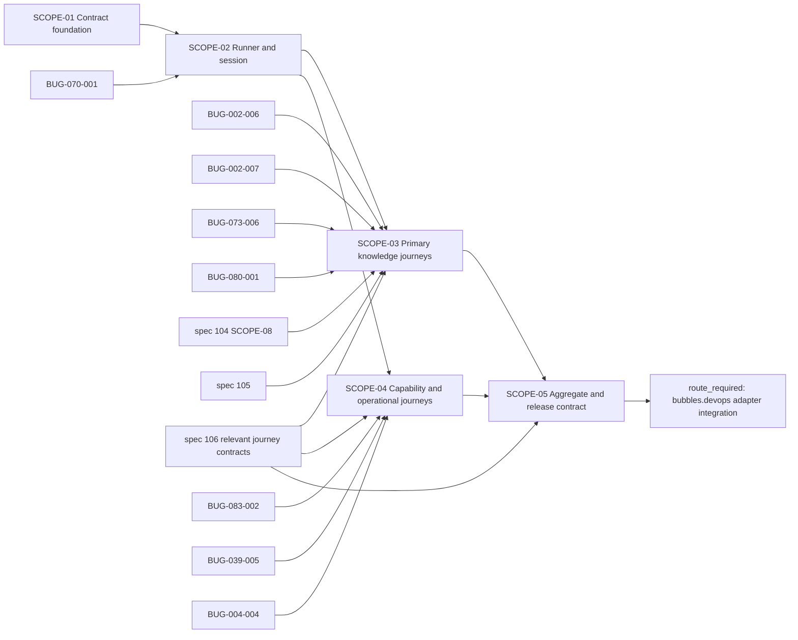

# Scopes: [BUG-102-001] Product Journey Acceptance Gap

Links: [spec.md](spec.md) | [design.md](design.md) | [report.md](report.md) | [uservalidation.md](uservalidation.md)

## Execution Outline

### Phase Order

1. **SCOPE-01 - Product journey contract foundation:** version the manifest, compiled policy, result/evidence schemas, closed outcome/failure registry, route-side-effect registry, the test-only machine-readable fault-profile registry with its production-inert static guard, reducer, and validator before any journey is executable.
2. **SCOPE-02 - Production-readonly runner and real session:** build the release-matched browser/API runner, static/runtime no-write guards, value-safe evidence pipeline, bounded cancellation, and real authentication canary after BUG-070-001 is ready.
3. **SCOPE-03 - Primary knowledge journeys:** add dependency-gated Search, Digest, Assistant, Wiki/Graph, and Knowledge reads (including the connected-graph real-component minimum and equivalent Graph/Outline/Table projections) after their owning repair packets, spec 104 Scope 8, and specs 105/106 provide current owner evidence.
4. **SCOPE-04 - Capability and operational journeys:** add Cards, Recommendations, Notifications, Photos/Drive optional states, model selection, synthesis, and status/health reads after their owning repairs and readiness projection are current.
5. **SCOPE-05 - Aggregate acceptance, projection, release artifact, and adapter handoff:** reduce every required row, validate responsive/accessibility modes, prove off-traffic candidate acceptance before cutover and previous-release-readable-or-write-freeze migration rollback safety, publish the signed runner/result contract, prove the generic adapter keep/rollback matrix, and route actual adapter work to `bubbles.devops`.

### New Types And Signatures

- `ProductJourneyManifest.Compile(config, routeRegistry) (CompiledAcceptancePolicy, error)`
- `JourneyExecutor.Execute(context.Context, CompiledJourney, Session) (JourneyResult, error)`
- `EvidenceSanitizer.Sanitize(RawObservation) (EvidenceEntry, error)`
- `VerdictReducer.Reduce(policy, prerequisites, journeys) AggregateResult`
- `AcceptanceResultValidator.Validate(envelope, expectedRelease) (ValidatedResult, error)`
- `product-journey-acceptance run --mode production-readonly --base-url-file <path> --identity-file <path> --release-manifest <path> --result <path>`
- Manifest: `smackerel.io/product-journeys/v1`
- Result: `smackerel.io/product-acceptance-result/v1`
- Closed verdicts: `accepted`, `accepted-degraded`, `blocked-prerequisite`, `rejected`, `contract-invalid`, `timed-out`
- Closed journey outcomes: `passed`, `allowed-empty`, `allowed-quiet`, `allowed-optional`, `allowed-degraded`, `failed`, `blocked`, `timed-out`, `not-evaluated`
- Closed `E102-JOURNEY-*` families from design.md; unknown or category-mismatched codes invalidate the result.

### Validation Checkpoints

- After SCOPE-01, manifest/result/reducer canaries reject missing journeys, unknown enums/codes, implicit requiredness, unsafe fields, and health-only success; the fault-profile registry rejects any profile missing a required field, and the production-inert static guard rejects any production route/config/request/UI fault selector or trigger.
- After SCOPE-02, a real browser session and actual same-origin requests prove authentication, no interception, no product writes, credential privacy, timeout cleanup, and release identity.
- After SCOPE-03, each primary journey has its own API and Playwright canary and its owning packet's regression evidence remains independently required; the connected-graph journey passes only with at least two real nodes joined by one stored edge within bounds, renders an honest no-connected-overview state for isolated-only data, and exposes equivalent authorized identities/relationships across Graph, Outline, and Table.
- After SCOPE-04, each optional/degraded/capability-state rule is explicit and every operational journey has an independent API/browser canary.
- After SCOPE-05, aggregate/adversarial/accessibility/stress and product-owned adapter-contract tests pass, off-traffic candidate acceptance is proven before any live pointer or routing change, user-data migration is proven previous-release-readable or write-frozen with proven backup/restore, and pointer-swap alone is treated as neither acceptance nor data-rollback proof, before any foreign adapter integration is routed.

## Dependency DAG



| Scope | Primary Outcome | Required External Evidence | Status |
|---|---|---|---|
| SCOPE-01 | Product-owned manifest/result/policy/failure foundation | None | Not Started |
| SCOPE-02 | Production-readonly runner and real session | BUG-070-001 | Not Started |
| SCOPE-03 | Search, Digest, Assistant, Wiki/Graph, Knowledge | BUG-002-006, BUG-002-007, BUG-073-006, BUG-080-001, spec 104 SCOPE-08, specs 105/106 where applicable | Not Started |
| SCOPE-04 | Cards, Recommendations, Notifications, Photos/Drive, Models, Synthesis, Status/Health | BUG-083-002, BUG-039-005, BUG-004-004, spec 106 where applicable | Not Started |
| SCOPE-05 | Aggregate result/UI/release artifact and adapter contract | SCOPE-03, SCOPE-04, final spec-106 coherence | Not Started |

## Global Execution Rules

- Every dependency remains independently owned. This aggregate consumes current owner-produced evidence and shared assertion modules; it never edits, weakens, replaces, or marks complete any owning regression packet.
- One-way producer flow (spec.md JOURNEY-013, state.json `producerDependsOnConsumers:false`): BUG-102-001 is the sole acceptance-evidence producer. BUG-032-004 (readiness derivation) and spec 106 (presentation) consume this packet's immutable result and are NEVER a producer dependency of it. No scope may depend on BUG-032-004's readiness projection; the capability/status journeys observe the product's own Settings/Status/health surfaces (and, where applicable, spec 106's coherent navigation) directly.
- `production-readonly` performs no create/update/delete/trigger/sync/schedule/approve/replay/upload/reveal/test-provider action and uses existing authorized records only.
- POST is allowed only for closed `session-establish` or `read-compute` route templates. Every request is observed and classified without storing query/body values.
- Browser/API execution uses the actual deployed/disposable stack and real same-origin session. `page.route`, `context.route`, `route.fulfill`, internal interception, canned responses, injected cookies/tokens, direct database reads, and service-container exec are forbidden.
- Evidence is value-safe across stdout/stderr, result JSON, logs, metrics, traces, URLs, DOM, accessibility snapshots, screenshots, clipboard, and browser storage.
- Product files contain no concrete target, host, operator, overlay-repo, secret, or runtime path. The adapter supplies generic mounted files.
- Adapter integration and pointer mutation are foreign-owned. Smackerel owns schemas, validator, a generic adapter-consumer fixture, and the keep/rollback decision contract only.

## Scope 01: Product Journey Contract Foundation

**Status:** Not Started  
**Priority:** P0  
**Scope-Kind:** contract-only  
**Foundation:** true  
**Depends On:** None

### Use Cases

```gherkin
Scenario: SCN-102-001-07 Contract mismatch fails closed
	Given a result is missing, malformed, incomplete, duplicated, stale, unsafe, unsupported, or release-mismatched
	When the validator evaluates it
	Then it returns contract-invalid with one closed code
	And no row is ignored or guessed compatible
	And an allowed true-empty, quiet, optional-unconfigured, or degraded outcome is produced only by an exact compiled policy rule; absent or ambiguous policy fails closed

Scenario: SCN-102-001-12 Fault profiles are disposable and production-inert
	Given the test-only machine-readable validate/e2e fault-profile registry
	When each declared profile is compiled with its stable ID, owning journey, setup, teardown, parallelism/isolation, expected request, expected response or termination, permitted evidence, and no-first-party-interception assertion
	Then the registry is accepted only when every required field is present and no first-party interception is declared
	And production routes, configuration, requests, and UI expose no fault selector or trigger
```

### Implementation Plan

1. Define the product-owned YAML manifest, compiled-policy schema, result/evidence schemas, stable journey IDs/groups, prerequisites, assertions, time/freshness references, side-effect classes, requiredness, allowed outcomes, and dependency evidence classes.
2. Close all aggregate/journey/error enums and every `E102-JOURNEY-*` code-to-category/owner mapping from design.md; unknown/duplicate/mismatched values fail compilation or validation.
3. Implement the route-side-effect registry and static scanner for unclassified routes, production writes, state-changing selectors, interception/token injection, direct DB/container access, target literals, and unsafe result fields.
4. Implement deterministic manifest completeness, digest, count, release/mode/evidence-eligibility, dependency/prerequisite, freshness, and aggregate reduction.
5. Compile requiredness from explicit SST for auth, Search, Digest, Assistant, Wiki/Graph/Knowledge, Cards, Recommendations, Notifications, Photos/Drive, Models, Synthesis, and Status/Health. Missing policy has no fallback.
6. Define the test-only machine-readable fault-profile registry (validate/e2e only) whose every profile declares stable ID, owning journey, setup, teardown, parallelism/isolation, expected request, expected response or termination, permitted evidence, and a no-first-party-interception assertion; a profile missing any field or declaring first-party interception fails compilation. Add the production-inert static guard so production route/config/request/UI schemas expose no fault selector or trigger and a production build/profile that can select, inject, or trigger a fault fails compilation. This packet plans its OWN registry per spec.md JOURNEY-016; whether it is the shared owner consumed by BUG-073-006 SCOPE-01 is an unresolved cross-packet foundation-ownership question routed to `bubbles.system-review`/`bubbles.design` (see report.md) and is NOT decided here.

### Change Boundary And Rollback

- **Allowed:** generic acceptance config/schema/compiler, failure registry, test-only fault-profile registry + production-inert static guard, reducer, validator, static guards, focused tests.
- **Excluded:** runner/browser execution, product repairs, owning tests, adapters, targets, secrets, production data, specs 104/105/106, BUG-073-006 fault-registry co-ownership decision.
- **Rollback:** revert additive contract registration before a runner artifact or adapter consumes it.

### Independent Canaries

- Removing one required journey, adding an unknown code, changing an allowed-empty rule, or marking health-only input accepted must independently turn a valid fixture red.
- Adding any mutating selector, unclassified POST, interception API, target literal, or unsafe evidence field must fail static compilation.
- A fault profile missing any required field (stable ID, owning journey, setup, teardown, parallelism/isolation, expected request, expected response or termination, permitted evidence, no-first-party-interception assertion), or declaring first-party interception, or any production route/config/request/UI fault selector or trigger, must independently fail compilation.

### Test Plan

| Test ID | Scenario | Category | File / Exact Test Title | Command | Live System |
|---|---|---|---|---|---|
| TP-102-01-01 | SCN-102-001-07 | `unit` | `internal/acceptance/manifest_test.go` - `TestManifestRequiresEveryDeclaredJourneyDependencyAndAssertion` | `./smackerel.sh test unit --go` | No |
| TP-102-01-02 | SCN-102-001-07 | `unit` | `internal/acceptance/result_validator_test.go` - `TestResultValidatorRejectsMissingDuplicateUnknownAndMismatchedRows` | `./smackerel.sh test unit --go` | No |
| TP-102-01-03 | SCN-102-001-07 | `unit` | `internal/acceptance/verdict_reducer_test.go` - `TestAllowedEmptyQuietOptionalAndDegradedRequireExactPolicy` | `./smackerel.sh test unit --go` | No |
| TP-102-01-04 | SCN-102-001-07 | `unit` | `internal/acceptance/failure_registry_test.go` - `TestEveryFailureCodeHasOneCategoryAndOwner` | `./smackerel.sh test unit --go` | No |
| TP-102-01-05 | SCN-102-001-07 | `unit` | `internal/acceptance/read_only_guard_test.go` - `TestProductionManifestRejectsWritesInterceptionInjectionAndTargetLiterals` | `./smackerel.sh test unit --go` | No |
| TP-102-01-06 | SCN-102-001-07 | `functional` | `internal/acceptance/manifest_coverage_test.go` - `TestManifestCoversAllProductJourneyGroupsAndRouteAuthorities` | `./smackerel.sh check` | No |
| TP-102-01-07 | SCN-102-001-12 | `unit` | `internal/acceptance/fault_profile_registry_test.go` - `TestFaultProfileRegistryRequiresEveryDeclaredFieldAndRejectsFirstPartyInterception` | `./smackerel.sh test unit --go` | No |
| TP-102-01-08 | SCN-102-001-12 | `unit` | `internal/acceptance/fault_profile_production_inert_test.go` - `TestProductionRoutesConfigRequestsAndUIExposeNoFaultSelectorOrTrigger` | `./smackerel.sh test unit --go` | No |

### Definition of Done

#### Core Outcomes

- [ ] `SCN-102-001-07 Contract mismatch fails closed`: missing, malformed, incomplete, duplicated, stale, unsafe, unsupported, or release-mismatched results become `contract-invalid` with one closed code and no tolerated row; an allowed true-empty, quiet, optional-unconfigured, or degraded outcome is produced only by an exact compiled policy rule, and absent or ambiguous policy fails closed.
- [ ] `SCN-102-001-12 Fault profiles are disposable and production-inert`: the test-only machine-readable fault-profile registry is accepted only when every profile declares stable ID, owning journey, setup, teardown, parallelism/isolation, expected request, expected response or termination, permitted evidence, and no-first-party-interception, and production routes, configuration, requests, and UI expose no fault selector or trigger.
- [ ] Versioned manifest/policy/result/evidence contracts cover every required journey and all closed states/codes without defaults.
- [ ] Reducer and validator fail closed on every contract, safety, privacy, dependency, freshness, and count inconsistency.
- [ ] Static guard (including the production-inert fault guard), Change Boundary, independent canaries, and pre-consumer rollback are complete.

#### Test Evidence Parity

- [ ] TP-102-01-01 passes with current-session evidence in report.md.
- [ ] TP-102-01-02 passes with current-session evidence in report.md.
- [ ] TP-102-01-03 passes with current-session evidence in report.md.
- [ ] TP-102-01-04 passes with current-session evidence in report.md.
- [ ] TP-102-01-05 passes with current-session evidence in report.md.
- [ ] TP-102-01-06 passes with current-session evidence in report.md.
- [ ] TP-102-01-07 passes with current-session evidence in report.md.
- [ ] TP-102-01-08 passes with current-session evidence in report.md.

#### Build Quality Gate

- [ ] Scope-owned check/lint/format, schema/registry consistency, artifact lint, traceability, source-locking, target-generic/privacy scans, zero-warning, and zero-deferral checks pass.

## Scope 02: Production-Readonly Runner And Real Session

**Status:** Not Started  
**Priority:** P0  
**Scope-Kind:** runtime-behavior  
**Depends On:** SCOPE-01; BUG-070-001 current accepted owner evidence

### Use Cases

```gherkin
Scenario: SCN-102-001-05 Authentication is real and private
	Given the operator supplies an existing scoped identity through a read-only secret file
	When the runner uses the real login UI and same-origin session
	Then authenticated API/browser reads reuse that session
	And no credential, token, cookie, identity, or personal content enters evidence

Scenario: SCN-102-001-06 Synthetic cannot write production state
	Given a production-readonly manifest and observed request set
	When a write, trigger, sync, schedule, state-changing selector, or undeclared request appears
	Then execution refuses before or at the unsafe operation
	And product state remains unchanged

Scenario: SCN-102-001-08 Timeout identifies the exact journey
	Given a step or aggregate does not finish within compiled bounds
	When cancellation fires
	Then the exact boundary/code is recorded
	And browser, cookie jar, identity material, and child work terminate cleanly
```

### Implementation Plan

1. Add the immutable release runner workspace/artifact entry using the source-locked Playwright/Chromium versions; do not relabel the stubbed disposable E2E stack as production evidence.
2. Load base URL and identity from mode-checked read-only files, validate ownership/mode without outputting values, log in through the actual UI, and keep auth only in an isolated ephemeral browser context.
3. Observe actual same-origin requests, normalized routes, statuses, DOM/accessibility/freshness/telemetry states, storage, and privacy without interception or raw bodies/query values.
4. Enforce static and runtime read-only guards, pre/post structural state canaries, per-step/overall deadlines, child cancellation, and atomic safe-envelope emission.
5. Share assertion modules with seeded validation, but tag seeded output `validation-only`; only production-readonly can be deploy-eligible.

### Shared Harness Impact Sweep And Rollback

- Protect the existing Playwright workspace, auth/session bootstrap, cookie lifecycle, source locks, and disposable test lane with independent current-login, no-interception, no-write, sanitizer, and timeout canaries.
- Existing dependency suites continue to run unchanged. The runner composes shared assertions but never replaces them.
- Rollback removes runner publication/invocation for future releases; it cannot manufacture acceptance for untested releases or alter product data.

### Change Boundary

- **Allowed:** runner workspace/package, generic CLI dispatch, shared safe assertion/sanitizer modules, build-manifest runner artifact declaration, focused tests.
- **Excluded:** BUG-070 implementation/tests, target adapter, secrets, host values, product writes, specs 104/105/106.

### Test Plan

| Test ID | Scenario | Category | File / Exact Test Title | Command | Live System |
|---|---|---|---|---|---|
| TP-102-02-01 | SCN-102-001-05 | `integration` | `internal/acceptance/runner_integration_test.go` - `TestRunnerUsesMountedIdentityAndEmitsOnlyPresenceState` | `./smackerel.sh test integration` | Yes - disposable stack |
| TP-102-02-02 | SCN-102-001-06 | `unit` | `internal/acceptance/evidence_sanitizer_test.go` - `TestSanitizerRejectsEverySensitiveContentAndTargetClass` | `./smackerel.sh test unit --go` | No |
| TP-102-02-03 | SCN-102-001-06 | `integration` | `internal/acceptance/request_guard_integration_test.go` - `TestRuntimeGuardRejectsUndeclaredOrMutatingRequestsBeforeStateChange` | `./smackerel.sh test integration` | Yes - disposable stack |
| TP-102-02-04 | SCN-102-001-05 | `e2e-api` | `tests/e2e/product_journey_acceptance_session_test.go` - `TestProductionRunnerReusesOneRealSessionForProtectedReads` | `./smackerel.sh test e2e` | Yes - real stack/session |
| TP-102-02-05 | SCN-102-001-05 | `e2e-ui` | `web/pwa/tests/product_journey_acceptance.spec.ts` - `production runner establishes and reuses a real private session` | `./smackerel.sh test e2e-ui` | Yes - real browser, no interception |
| TP-102-02-06 | SCN-102-001-06 | `e2e-ui` | `web/pwa/tests/product_journey_acceptance.spec.ts` - `production runner observes no product write or state-changing control` | `./smackerel.sh test e2e-ui` | Yes - real browser, no interception |
| TP-102-02-07 | SCN-102-001-08 | `stress` | `tests/stress/product_journey_acceptance_timeout_test.go` - `TestStepAndOverallTimeoutCancelBrowserAndEmitExactCode` | `./smackerel.sh test stress` | Yes - slow disposable dependency |
| TP-102-02-08 | SCN-102-001-05, SCN-102-001-06 | `functional` | `scripts/lint/product-journey-runner-safety_test.sh` - `runner contains no interception injection mutation or target-specific surface` | `./smackerel.sh lint` | No |

### Definition of Done

#### Core Outcomes

- [ ] `SCN-102-001-05 Authentication is real and private`: the runner establishes and reuses the real same-origin session while credentials, tokens, cookies, identity, and personal content remain absent from every evidence/output surface.
- [ ] `SCN-102-001-06 Synthetic cannot write production state`: any undeclared request, mutation, trigger, sync, schedule, or state-changing control refuses before or at execution and pre/post authoritative state remains unchanged.
- [ ] `SCN-102-001-08 Timeout identifies the exact journey`: step and overall deadlines emit the exact boundary/code and terminate browser, child work, cookie jar, and mounted identity material without partial acceptance.
- [ ] Production runner uses a release-matched artifact, actual login/session/network, bounded cancellation, and atomic safe result emission.
- [ ] Static/runtime guards prove zero production writes and no interception, injection, direct datastore/container access, or target detail.
- [ ] Identity/output privacy, shared-harness canaries, dependency-suite independence, Change Boundary, and non-fabricating rollback are proven.

#### Test Evidence Parity

- [ ] TP-102-02-01 passes with current-session evidence in report.md.
- [ ] TP-102-02-02 passes with current-session evidence in report.md.
- [ ] TP-102-02-03 passes with current-session evidence in report.md.
- [ ] TP-102-02-04 passes with current-session evidence in report.md.
- [ ] TP-102-02-05 passes with current-session evidence in report.md.
- [ ] TP-102-02-06 passes with current-session evidence in report.md.
- [ ] TP-102-02-07 passes with current-session evidence in report.md.
- [ ] TP-102-02-08 passes with current-session evidence in report.md.

#### Build Quality Gate

- [ ] Scope-owned runner build, unit/integration/E2E API/E2E UI/stress, lint/format, source/provenance locks, privacy/no-interception scans, artifact lint, traceability, isolation, zero-warning, and zero-deferral checks pass.

## Scope 03: Primary Knowledge Journeys

**Status:** Not Started  
**Priority:** P0  
**Scope-Kind:** runtime-behavior  
**Depends On:** SCOPE-02; BUG-002-006; BUG-002-007; BUG-073-006; BUG-080-001; spec 104 SCOPE-08; spec 105; applicable spec-106 navigation/state contracts

### Use Cases

```gherkin
Scenario: SCN-102-001-02 Infrastructure health cannot mask product failure
	Given infrastructure prerequisites are green
	And one primary journey (Search, Digest, Assistant, or Wiki/Knowledge) returns auth rejection, zero/duplicate request, false empty, blank, 404, or stale content
	When its API and browser assertions run
	Then that journey fails with its exact closed code
	And no health or route-presence fact promotes it

Scenario: SCN-102-001-04 Degraded required journey fails clearly
	Given a required primary journey returns partial behavior below its contract
	When policy evaluates it
	Then it fails unless the exact useful subset and named limitation are explicitly permitted

Scenario: SCN-102-001-13 Connected graph proves real bounded relationships
	Given the candidate has an authorized graph corpus within declared node/edge/hop bounds
	When connected-graph acceptance runs
	Then a connected overview passes only with at least two real nodes joined by one stored edge
	And isolated-only data produces an honest no-connected-overview result
	And Graph, Outline, and Table expose equivalent authorized identities and relationships without private leakage
```

### Journey And Dependency Contract

| Journey | Exact Owner Dependency | Aggregate Responsibility |
|---|---|---|
| `search.read` | BUG-002-006 | One real `/search` request, status/schema/terminal DOM, no false empty; owner regression remains required. |
| `digest.current-read` | BUG-002-007 | Real page/API read, current/quiet/empty/stale/error distinction; owner regression remains required. |
| `assistant.grounded-read` | BUG-073-006 and spec 104 SCOPE-08 | Real model-backed turn with terminal answer/clarification/refusal/error, never blank/false capture; owner regressions remain required. |
| `wiki.browse` / `knowledge.browse` | BUG-080-001 and applicable spec 106 | Real Wiki/topics/edges read, truthful populated/empty/error/auth states; owner route regressions remain required. |
| `graph.explorer` | BUG-080-001, spec 105, applicable spec 106 | Real bounded query; a connected overview passes only with at least two real nodes joined by one stored edge within declared bounds, isolated-only data yields an honest no-connected-overview state, and Graph/Outline/Table expose equivalent authorized identities/relationships without private leakage; scale, security/privacy, and representative accessibility are acceptance prerequisites, not late cleanup; owner spec-105 regressions remain required. |

### Implementation Plan

1. Add each manifest row only after its dependency register has current accepted owner evidence; otherwise emit one `not-evaluated` row and block prerequisites.
2. Compose owner-provided assertion modules where stable, adding only aggregate manifest/network/result adapters.
3. Assert exact HTTP/status/schema/freshness and visible terminal DOM/accessibility state using actual requests. Record only route IDs, state enums, timings, bounds, and digests.
4. Keep Search query, Digest/Assistant prose, citations, topic/graph IDs/labels, and user content out of evidence.
5. Run every owner packet's required regression plan independently before aggregate certification; no aggregate pass can waive it.

### Change Boundary And Rollback

- **Allowed:** SCOPE-03 journey manifest rows, aggregate assertion adapters, product acceptance tests, safe telemetry correlation.
- **Excluded:** dependency implementation/tests/artifacts, specs 104/105/106, target adapters, production mutations/content capture.
- Rollback disables affected aggregate rows for future publication only by reverting product code; required rows then block rather than silently disappear/pass.

### Independent Canaries

Each journey must independently fail while infrastructure health remains green for its historical defect: Search zero-request, Digest false-empty, Assistant blank/false-capture, Wiki/Graph 404 or false-empty, and Graph unbounded/nonsemantic projection. Connected-graph acceptance must also independently fail when a two-node/one-edge component is claimed connected without a real stored edge, when isolated-only data is rendered as a connected overview instead of an honest no-connected-overview state, or when Graph/Outline/Table expose non-equivalent identities/relationships or leak private data.

### Test Plan

| Test ID | Scenario | Category | File / Exact Test Title | Command | Live System |
|---|---|---|---|---|---|
| TP-102-03-01 | SCN-102-001-02 | `e2e-api` | `tests/e2e/product_journey_acceptance_test.go` - `TestSearchJourneyRequiresOneCompletedRequestAndTruthfulTerminalState` | `./smackerel.sh test e2e` | Yes - real stack/session |
| TP-102-03-02 | SCN-102-001-02 | `e2e-ui` | `web/pwa/tests/product_journey_acceptance.spec.ts` - `search journey uses one real request and never renders transport failure as empty` | `./smackerel.sh test e2e-ui` | Yes - real browser, no interception |
| TP-102-03-03 | SCN-102-001-02 | `e2e-api` | `tests/e2e/product_journey_acceptance_test.go` - `TestDigestJourneyDistinguishesCurrentQuietEmptyStaleAndFailure` | `./smackerel.sh test e2e` | Yes - real stack/session |
| TP-102-03-04 | SCN-102-001-02 | `e2e-ui` | `web/pwa/tests/product_journey_acceptance.spec.ts` - `digest journey exposes the real current read without false empty` | `./smackerel.sh test e2e-ui` | Yes - real browser, no interception |
| TP-102-03-05 | SCN-102-001-02 | `e2e-api` | `tests/e2e/product_journey_acceptance_test.go` - `TestAssistantJourneyRequiresOneNonblankTruthfulTerminalOutcome` | `./smackerel.sh test e2e` | Yes - real model-backed stack |
| TP-102-03-06 | SCN-102-001-02 | `e2e-ui` | `web/pwa/tests/product_journey_acceptance.spec.ts` - `assistant journey never accepts blank false capture or missing retry` | `./smackerel.sh test e2e-ui` | Yes - real browser/model, no interception |
| TP-102-03-07 | SCN-102-001-02 | `e2e-api` | `tests/e2e/product_journey_acceptance_test.go` - `TestWikiAndKnowledgeJourneyDistinguishesPopulatedEmptyUnauthorizedAndFailure` | `./smackerel.sh test e2e` | Yes - real stack/session |
| TP-102-03-08 | SCN-102-001-02 | `e2e-ui` | `web/pwa/tests/product_journey_acceptance.spec.ts` - `wiki and knowledge journey follows real links and never maps route failure to empty` | `./smackerel.sh test e2e-ui` | Yes - real browser, no interception |
| TP-102-03-09 | SCN-102-001-13 | `e2e-api` | `tests/e2e/product_journey_acceptance_test.go` - `TestConnectedGraphJourneyRequiresTwoRealNodesAndOneStoredEdgeWithinBounds` | `./smackerel.sh test e2e` | Yes - real stack/session |
| TP-102-03-10 | SCN-102-001-13 | `e2e-ui` | `web/pwa/tests/product_journey_acceptance.spec.ts` - `connected graph journey exposes equivalent authorized graph outline and table without private leakage` | `./smackerel.sh test e2e-ui` | Yes - real browser, no interception |
| TP-102-03-11 | SCN-102-001-02 | `integration` | `internal/acceptance/dependency_register_integration_test.go` - `TestIncompletePrimaryJourneyDependencyProducesNotEvaluatedAndBlockedPrerequisite` | `./smackerel.sh test integration` | Yes - disposable stack |
| TP-102-03-12 | SCN-102-001-02, SCN-102-001-04 | `functional` | `internal/acceptance/owner_regression_evidence_test.go` - `TestPrimaryAggregateRequiresCurrentIndependentOwnerRegressionEvidence` | `./smackerel.sh check` | No |
| TP-102-03-13 | SCN-102-001-04 | `e2e-api` | `tests/e2e/product_journey_acceptance_test.go` - `TestPrimaryRequiredJourneyPartialOutcomeFailsUnlessExactUsefulSubsetPermitted` | `./smackerel.sh test e2e` | Yes - real stack/session |
| TP-102-03-14 | SCN-102-001-13 | `e2e-ui` | `web/pwa/tests/product_journey_acceptance.spec.ts` - `connected graph journey renders honest no-connected-overview for isolated only data` | `./smackerel.sh test e2e-ui` | Yes - real browser, no interception |

### Definition of Done

#### Core Outcomes

- [ ] `SCN-102-001-02 Infrastructure health cannot mask product failure`: each auth, Search, Digest, Assistant, and Wiki/Knowledge defect fails its own row/code while infrastructure remains green.
- [ ] `SCN-102-001-04 Degraded required journey fails clearly`: partial required primary behavior fails unless the exact useful subset and named limitation are explicitly allowed.
- [ ] `SCN-102-001-13 Connected graph proves real bounded relationships`: a connected overview passes only with at least two real nodes joined by one stored edge within declared bounds, isolated-only data yields an honest no-connected-overview state, and Graph/Outline/Table expose equivalent authorized identities/relationships without private leakage.
- [ ] Search, Digest, Assistant, Wiki/Graph, and Knowledge rows execute exact real behavior only after current dependency evidence exists.
- [ ] Every historical defect has an independent health-green adversarial canary and exact closed failure code.
- [ ] Aggregate assertions remain content-free and do not replace or weaken any owner regression.
- [ ] Change Boundary, dependency blocking, privacy, no-interception/no-write rules, and rollback are complete.

#### Test Evidence Parity

- [ ] TP-102-03-01 passes with current-session evidence in report.md.
- [ ] TP-102-03-02 passes with current-session evidence in report.md.
- [ ] TP-102-03-03 passes with current-session evidence in report.md.
- [ ] TP-102-03-04 passes with current-session evidence in report.md.
- [ ] TP-102-03-05 passes with current-session evidence in report.md.
- [ ] TP-102-03-06 passes with current-session evidence in report.md.
- [ ] TP-102-03-07 passes with current-session evidence in report.md.
- [ ] TP-102-03-08 passes with current-session evidence in report.md.
- [ ] TP-102-03-09 passes with current-session evidence in report.md.
- [ ] TP-102-03-10 passes with current-session evidence in report.md.
- [ ] TP-102-03-11 passes with current-session evidence in report.md.
- [ ] TP-102-03-12 passes with current-session evidence in report.md.
- [ ] TP-102-03-13 passes with current-session evidence in report.md.
- [ ] TP-102-03-14 passes with current-session evidence in report.md.

#### Build Quality Gate

- [ ] Scope-owned integration/E2E API/E2E UI/check, owner-regression evidence gate, lint/format, privacy/no-interception scans, artifact lint, traceability, isolation, zero-warning, and zero-deferral checks pass.

## Scope 04: Capability And Operational Journeys

**Status:** Not Started  
**Priority:** P0  
**Scope-Kind:** runtime-behavior  
**Depends On:** SCOPE-02; BUG-083-002; BUG-039-005; BUG-004-004; applicable spec-106 capability/status contracts

### Use Cases

```gherkin
Scenario: SCN-102-001-03 True empty and optional states follow policy
	Given Cards, Notifications, Photos/Drive, or another capability is empty or optional-unconfigured
	When its real read and compiled policy are evaluated
	Then only a successful authorized read plus exact policy yields an allowed state
	And failure, unauthorized, stale, zero-provider false-ready, or never-run health does not

Scenario: SCN-102-001-04 Degraded required journey fails clearly
	Given a required capability has a stale, partial, false-ready, or missing durable outcome
	When its journey runs
	Then the row fails unless the exact verified useful subset is policy-permitted
	And general status/health cannot promote it
```

### Journey And Dependency Contract

| Journey | Exact Owner Dependency | Aggregate Responsibility |
|---|---|---|
| `cards.representative-read` | BUG-083-002 | Representative owner-isolated read, truthful empty/populated/freshness, no edit/generate; owner regressions remain required. |
| `recommendations.readiness` | BUG-039-005 | One provider-compatible availability snapshot; enabled with zero usable providers never ready; owner regressions remain required. |
| `notifications.read` | Existing notification owner contract | Truthful ready/empty/degraded read with no replay/reconnect/ingest/snooze/approve. |
| `photos.status-read` and `connectors.status-read` (Drive) | Existing Photos/Drive owner contracts | Optional-unconfigured, limitation, true zero, auth, stale, and failure remain distinct; no connect/test/sync/upload/reveal. |
| `models.status-read` | Existing model-connections owner contract | Operator-only enabled/disabled/redacted/fresh status; non-operator 403 never ready; no credential/test/model change. |
| `synthesis.status-read` | BUG-004-004 | Durable current/quiet/stale/failure/never-run states; owner regressions remain required. |
| `capability-status.read` | product Settings/Status/health surface; applicable spec 106 | Settings/Status readiness read from the product's own capability-status surface (never BUG-032-004's derived readiness — one-way producer flow); health/flag/route alone never ready. |

### Implementation Plan

1. Add each manifest row only after exact owner evidence is current; absent dependencies emit `not-evaluated` and block required acceptance.
2. Execute real read-only API/browser paths with stable semantic hooks, closed schema/state/freshness assertions, and zero content capture.
3. Enforce operator authorization for Models/Status and explicit optional policy for Photos/Drive and other optional providers.
4. Correlate safe telemetry only where declared; telemetry supports but never replaces API/DOM behavior.
5. Require every owning packet's independent regressions before aggregate certification.

### Change Boundary, Canaries, And Rollback

- **Allowed:** SCOPE-04 manifest rows, aggregate assertion adapters, safe telemetry, product acceptance tests.
- **Excluded:** owner implementations/tests, specs 106/BUG-032 artifacts, adapters, target data, product mutations/content.
- Independent canaries: Cards parity unavailable, recommendations zero-provider false-ready, notification transport error as empty, Photos/Drive optional vs failure, model non-operator 403, synthesis never-run up, status health-green with broken journey.
- Rollback reverts aggregate rows; required rows block if unavailable and can never be omitted or auto-allowed.

### Test Plan

| Test ID | Scenario | Category | File / Exact Test Title | Command | Live System |
|---|---|---|---|---|---|
| TP-102-04-01 | SCN-102-001-03 | `e2e-api` | `tests/e2e/product_journey_acceptance_test.go` - `TestCardsJourneyPerformsRepresentativeOwnerReadWithoutMutation` | `./smackerel.sh test e2e` | Yes - real stack/session |
| TP-102-04-02 | SCN-102-001-03 | `e2e-ui` | `web/pwa/tests/product_journey_acceptance.spec.ts` - `cards journey distinguishes representative read and owned empty without editing` | `./smackerel.sh test e2e-ui` | Yes - real browser, no interception |
| TP-102-04-03 | SCN-102-001-04 | `e2e-api` | `tests/e2e/product_journey_acceptance_test.go` - `TestRecommendationsJourneyRejectsEnabledWithZeroUsableProviders` | `./smackerel.sh test e2e` | Yes - real stack/session |
| TP-102-04-04 | SCN-102-001-04 | `e2e-ui` | `web/pwa/tests/product_journey_acceptance.spec.ts` - `recommendations journey renders one truthful provider availability snapshot` | `./smackerel.sh test e2e-ui` | Yes - real browser, no interception |
| TP-102-04-05 | SCN-102-001-03 | `e2e-api` | `tests/e2e/product_journey_acceptance_test.go` - `TestNotificationsJourneyDistinguishesEmptyDegradedUnauthorizedAndFailure` | `./smackerel.sh test e2e` | Yes - real stack/session |
| TP-102-04-06 | SCN-102-001-03 | `e2e-ui` | `web/pwa/tests/product_journey_acceptance.spec.ts` - `notifications journey reads truthful state without replay reconnect ingest snooze or approval` | `./smackerel.sh test e2e-ui` | Yes - real browser, no interception |
| TP-102-04-07 | SCN-102-001-03 | `e2e-api` | `tests/e2e/product_journey_acceptance_test.go` - `TestPhotosAndDriveJourneysDistinguishOptionalUnconfiguredZeroLimitedStaleAndFailure` | `./smackerel.sh test e2e` | Yes - real stack/session |
| TP-102-04-08 | SCN-102-001-03 | `e2e-ui` | `web/pwa/tests/product_journey_acceptance.spec.ts` - `photos and drive optional journeys expose exact policy without connect test sync upload or reveal` | `./smackerel.sh test e2e-ui` | Yes - real browser, no interception |
| TP-102-04-09 | SCN-102-001-04 | `e2e-api` | `tests/e2e/product_journey_acceptance_test.go` - `TestModelSelectionJourneyRequiresOperatorAuthorizationRedactionAndFreshStatus` | `./smackerel.sh test e2e` | Yes - real stack/operator session |
| TP-102-04-10 | SCN-102-001-04 | `e2e-ui` | `web/pwa/tests/product_journey_acceptance.spec.ts` - `model selection journey proves redacted status and never changes credentials or models` | `./smackerel.sh test e2e-ui` | Yes - real browser, no interception |
| TP-102-04-11 | SCN-102-001-04 | `e2e-api` | `tests/e2e/product_journey_acceptance_test.go` - `TestSynthesisAndCapabilityStatusRejectNeverRunStaleAndHealthOnlyReadiness` | `./smackerel.sh test e2e` | Yes - real stack/operator session |
| TP-102-04-12 | SCN-102-001-04 | `e2e-ui` | `web/pwa/tests/product_journey_acceptance.spec.ts` - `status health and synthesis journey expose canonical truth without triggering work` | `./smackerel.sh test e2e-ui` | Yes - real browser, no interception |
| TP-102-04-13 | SCN-102-001-03, SCN-102-001-04 | `integration` | `internal/acceptance/dependency_register_integration_test.go` - `TestIncompleteCapabilityDependencyProducesNotEvaluatedAndNeverSoftPasses` | `./smackerel.sh test integration` | Yes - disposable stack |
| TP-102-04-14 | SCN-102-001-03, SCN-102-001-04 | `functional` | `internal/acceptance/owner_regression_evidence_test.go` - `TestCapabilityAggregateRequiresCurrentIndependentOwnerRegressionEvidence` | `./smackerel.sh check` | No |

### Definition of Done

#### Core Outcomes

- [ ] `SCN-102-001-03 True empty and optional states follow policy`: successful authorized empty/quiet/optional outcomes pass only under their exact rule; unauthorized, failure, stale, false-ready, and never-run outcomes do not.
- [ ] `SCN-102-001-04 Degraded required journey fails clearly`: stale, partial, false-ready, or missing durable behavior fails unless the exact verified useful subset is policy-permitted; health cannot promote it.
- [ ] Every listed capability journey performs exact read-only behavior after current owner evidence exists.
- [ ] Optional/empty/degraded/unauthorized/stale/broken states remain distinct and health/flags/routes cannot promote readiness.
- [ ] Every historical defect has an independent canary/code; aggregate coverage does not replace owner regressions.
- [ ] Change Boundary, dependency blocking, privacy, no-interception/no-write rules, and rollback are complete.

#### Test Evidence Parity

- [ ] TP-102-04-01 passes with current-session evidence in report.md.
- [ ] TP-102-04-02 passes with current-session evidence in report.md.
- [ ] TP-102-04-03 passes with current-session evidence in report.md.
- [ ] TP-102-04-04 passes with current-session evidence in report.md.
- [ ] TP-102-04-05 passes with current-session evidence in report.md.
- [ ] TP-102-04-06 passes with current-session evidence in report.md.
- [ ] TP-102-04-07 passes with current-session evidence in report.md.
- [ ] TP-102-04-08 passes with current-session evidence in report.md.
- [ ] TP-102-04-09 passes with current-session evidence in report.md.
- [ ] TP-102-04-10 passes with current-session evidence in report.md.
- [ ] TP-102-04-11 passes with current-session evidence in report.md.
- [ ] TP-102-04-12 passes with current-session evidence in report.md.
- [ ] TP-102-04-13 passes with current-session evidence in report.md.
- [ ] TP-102-04-14 passes with current-session evidence in report.md.

#### Build Quality Gate

- [ ] Scope-owned integration/E2E API/E2E UI/check, owner-regression evidence gate, lint/format, privacy/no-interception scans, artifact lint, traceability, isolation, zero-warning, and zero-deferral checks pass.

## Scope 05: Aggregate Acceptance, Release Artifact, Projection, And Adapter Handoff

**Status:** Not Started  
**Priority:** P0  
**Scope-Kind:** runtime-behavior  
**Depends On:** SCOPE-03, SCOPE-04, final applicable spec-106 coherent navigation/responsive-state evidence

### Use Cases

```gherkin
Scenario: SCN-102-001-01 Healthy required journeys pass one contract
	Given every dependency and required product journey has current accepted evidence for one release
	When production-readonly acceptance completes
	Then one signed value-safe envelope contains every required row
	And the aggregate is accepted only when all required outcomes are allowed

Scenario: SCN-102-001-02 Infrastructure health cannot mask product failure
	Given infrastructure remains green and one required row fails
	When the result is reduced and consumed by the generic adapter fixture
	Then the candidate is rejected with that row's code
	And the contract selects pointer-swap rollback rather than keep

Scenario: SCN-102-001-09 Browser acceptance proves responsive accessibility
	Given desktop, mobile, keyboard, screen-reader, zoom, motion, theme, and forced-color modes
	When the immutable acceptance result and required product journeys render
	Then every required mode has an independent result row
	And no missing/failed mode can be hidden by an aggregate accessibility pass

Scenario: SCN-102-001-10 Off-traffic candidate is accepted before cutover
	Given a candidate release is reachable without serving live user traffic
	When infrastructure checks and all required product journeys run against that candidate
	Then live routing remains on the previously accepted release until one compatible immutable result is accepted
	And a rejected, blocked, invalid, or timed-out candidate receives no live traffic
	And pointer swap alone is never treated as sufficient acceptance

Scenario: SCN-102-001-11 User-data migration remains rollback-capable
	Given a candidate changes user-data representation
	When candidate acceptance begins
	Then the previously accepted release can still read the migrated state through expand-contract compatibility
	Or writes are automatically frozen and a pre-migration backup plus prior-release restore are proven before any cutover
	And pointer swap without readable data or proven restore cannot satisfy rollback
```

### Implementation Plan

1. Assemble prerequisite/dependency register and all journey rows in stable manifest order, execute independent rows after safe failures, and reduce with fixed fail-closed precedence.
2. Emit exactly one atomic signed envelope with release/runner/manifest/policy identity, non-zero counts/timings, content-free evidence digests, and deterministic result validation.
3. Add the read-only Admin/Acceptance projection only as a safe view of an immutable result; it cannot run, retry, configure, deploy, mutate, or accept.
4. Add the runner OCI artifact to immutable build-manifest publication with source locks, scan, SBOM, signature/provenance, and exact source SHA.
5. Provide a product-owned generic adapter-consumer fixture that validates envelope/exit/signature/freshness/completeness and maps verdicts to `keep` or `pointer-swap-rollback`; it contains zero journey assertions or target data.
6. Route actual adapter invocation, identity mount, audit append, keep/rollback pointer mutation, and target execution to `bubbles.devops`; do not edit knb here.
7. Encode the off-traffic candidate contract in the generic adapter-consumer fixture: acceptance runs against a candidate reachable without live traffic, live routing stays on the previously accepted release until one compatible immutable result is accepted, a rejected/blocked/invalid/timed-out candidate receives no live traffic, and pointer swap alone is never treated as acceptance.
8. Encode the user-data migration rollback contract: a candidate that changes user-data representation SHALL keep the previously accepted release able to read the migrated state through expand-contract compatibility, OR automatically freeze writes and prove a restorable pre-migration backup plus successful prior-release restore before cutover; pointer swap without readable data or proven restore SHALL NOT satisfy rollback. Concrete migration/write-freeze/backup-restore mechanism design is `bubbles.design`-owned (see report.md design-staleness residual); this scope plans the contract per spec.md JOURNEY-015.

### Adapter Contract And Rollback Matrix

| Product Result | Product Contract Decision | Foreign Adapter Obligation |
|---|---|---|
| `accepted` | `keep` | Keep candidate and append one audit record. |
| `accepted-degraded` with optional policy only | `keep-with-limitations` | Keep only exact allowed optional limits and record them. |
| `blocked-prerequisite`, `rejected`, `contract-invalid`, `timed-out` | `pointer-swap-rollback` | Reject candidate, restore prior immutable pointer, verify prior release, append outcome. |
| Missing envelope, invalid signature, non-zero without valid envelope, validator disagreement | `pointer-swap-rollback` | Treat as orchestration/contract refusal; never trust exit code alone. |

Rollback never rebuilds, seeds/cleans product data, rewrites the envelope, bypasses verification, or claims partial success. A rollback failure remains a high-severity adapter-owned refusal with both evidence sets preserved.

Candidate acceptance runs off traffic before cutover: live routing stays on the previously accepted release until one compatible immutable result is `accepted`; a `rejected`/`blocked-prerequisite`/`contract-invalid`/`timed-out` candidate receives no live traffic; and pointer swap alone is never acceptance. When a candidate changes user-data representation, cutover is permitted only when the prior release can still read the migrated state (expand-contract) OR writes are automatically frozen and a pre-migration backup plus a proven prior-release restore precede cutover; pointer swap without readable data or proven restore is not data rollback.

### Change Boundary And Independent Canaries

- **Allowed:** aggregate runner/result/projection, runner build artifact, product validator, generic adapter fixture, safe telemetry, focused tests/docs for product contract.
- **Excluded:** adapters/knb, target/identity values, owning repair/spec artifacts, production mutations, managed deployment pointers.
- Canaries independently cover each verdict, missing row/signature, health-green broken journey, timeout cancellation, optional-degraded policy, no-interception/no-write/privacy, release mismatch, and rollback mapping.

### UI Scenario Matrix

| Scenario | Preconditions | Steps | Required Assertion | Exact Playwright Title |
|---|---|---|---|---|
| Accepted aggregate | Current full result | Open Admin / Acceptance | Separate Accepted/Available labels, release/schema/time/counts, every required row | `accepted result exposes every required journey and no run control` |
| Rejected with green health | One required failed row | Open result/detail | Failed row first; code/category/observed/required/owner visible; health cannot promote | `health green required failure remains rejected and selects rollback` |
| Contract/prerequisite/timeout | Each state fixture from real runner | Open result | Closed verdict and affected not-evaluated/timed-out rows; no partial acceptance | `blocked invalid and timeout results remain closed and actionable` |
| Responsive/accessibility/privacy | Required viewports/modes | Traverse header/register/rows/detail/copy | No clipping/overflow/trap; independent mode rows; safe clipboard/DOM/a11y/URL/artifacts | `acceptance result remains accessible responsive and value safe in every required mode` |

### Test Plan

| Test ID | Scenario | Category | File / Exact Test Title | Command | Live System |
|---|---|---|---|---|---|
| TP-102-05-01 | SCN-102-001-01 | `integration` | `internal/acceptance/aggregate_integration_test.go` - `TestAggregateAcceptedRequiresEveryCurrentAllowedRequiredJourney` | `./smackerel.sh test integration` | Yes - disposable stack |
| TP-102-05-02 | SCN-102-001-02 | `integration` | `internal/acceptance/aggregate_integration_test.go` - `TestHealthGreenRequiredFailurePreservesExactRowAndRejects` | `./smackerel.sh test integration` | Yes - disposable stack |
| TP-102-05-03 | SCN-102-001-01 | `e2e-api` | `tests/e2e/product_journey_acceptance_test.go` - `TestFullRequiredJourneyContractEmitsOneAcceptedValueSafeEnvelope` | `./smackerel.sh test e2e` | Yes - real stack/session |
| TP-102-05-04 | SCN-102-001-02 | `e2e-api` | `tests/e2e/product_journey_acceptance_test.go` - `TestEachHistoricalRequiredFailureRejectsWhileInfrastructureIsGreen` | `./smackerel.sh test e2e` | Yes - real stack/session |
| TP-102-05-05 | SCN-102-001-01 | `e2e-ui` | `web/pwa/tests/product_journey_acceptance.spec.ts` - `accepted result exposes every required journey and no run control` | `./smackerel.sh test e2e-ui` | Yes - real browser, no interception |
| TP-102-05-06 | SCN-102-001-02 | `e2e-ui` | `web/pwa/tests/product_journey_acceptance.spec.ts` - `health green required failure remains rejected and selects rollback` | `./smackerel.sh test e2e-ui` | Yes - real browser, no interception |
| TP-102-05-07 | SCN-102-001-07, SCN-102-001-08 | `e2e-ui` | `web/pwa/tests/product_journey_acceptance.spec.ts` - `blocked invalid and timeout results remain closed and actionable` | `./smackerel.sh test e2e-ui` | Yes - real browser, no interception |
| TP-102-05-08 | SCN-102-001-09 | `e2e-ui` | `web/pwa/tests/product_journey_acceptance.spec.ts` - `acceptance result remains accessible responsive and value safe in every required mode` | `./smackerel.sh test e2e-ui` | Yes - real browser, no interception |
| TP-102-05-09 | SCN-102-001-07 | `integration` | `internal/deploy/product_journey_acceptance_adapter_contract_test.go` - `TestAdapterContractRejectsMissingMalformedStaleMismatchedAndUnsignedResults` | `./smackerel.sh test integration` | Yes - generic adapter fixture |
| TP-102-05-10 | SCN-102-001-01, SCN-102-001-02 | `integration` | `internal/deploy/product_journey_acceptance_adapter_contract_test.go` - `TestAdapterContractMapsAcceptedToKeepAndEveryOtherVerdictToPointerSwapRollback` | `./smackerel.sh test integration` | Yes - generic adapter fixture |
| TP-102-05-11 | SCN-102-001-05, SCN-102-001-06 | `functional` | `scripts/lint/product-journey-result-privacy_test.sh` - `result stdout logs dom accessibility url clipboard screenshots and traces are value safe` | `./smackerel.sh lint` | No |
| TP-102-05-12 | SCN-102-001-08 | `stress` | `tests/stress/product_journey_acceptance_timeout_test.go` - `TestAggregateDeadlineCancelsChildrenAndCannotEmitPartialAcceptance` | `./smackerel.sh test stress` | Yes - slow disposable stack |
| TP-102-05-13 | SCN-102-001-01, SCN-102-001-02 | `functional` | `internal/acceptance/owner_regression_evidence_test.go` - `TestAggregateCertificationRequiresEveryOwningRegressionPacketCurrent` | `./smackerel.sh check` | No |
| TP-102-05-14 | SCN-102-001-01 | `functional` | `.github/workflows/build_contract_test.go` - `TestJourneyRunnerArtifactIsSourceLockedSignedScannedAndReleaseMatched` | `./smackerel.sh check` | No |
| TP-102-05-15 | SCN-102-001-10 | `integration` | `internal/deploy/product_journey_acceptance_adapter_contract_test.go` - `TestCandidateAcceptanceRunsOffTrafficAndLiveRoutingHoldsUntilCompatibleResultAccepted` | `./smackerel.sh test integration` | Yes - generic adapter fixture |
| TP-102-05-16 | SCN-102-001-10 | `integration` | `internal/deploy/product_journey_acceptance_adapter_contract_test.go` - `TestRejectedBlockedInvalidOrTimedOutCandidateReceivesNoLiveTrafficAndPointerSwapIsNotAcceptance` | `./smackerel.sh test integration` | Yes - generic adapter fixture |
| TP-102-05-17 | SCN-102-001-11 | `integration` | `internal/deploy/product_journey_acceptance_adapter_contract_test.go` - `TestUserDataMigrationRequiresPreviousReleaseReadableOrWriteFreezePlusProvenRestoreBeforeCutover` | `./smackerel.sh test integration` | Yes - generic adapter fixture |
| TP-102-05-18 | SCN-102-001-11 | `integration` | `internal/deploy/product_journey_acceptance_adapter_contract_test.go` - `TestPointerSwapWithoutReadableDataOrProvenRestoreCannotSatisfyDataRollback` | `./smackerel.sh test integration` | Yes - generic adapter fixture |

### Definition of Done

#### Core Outcomes

- [ ] `SCN-102-001-01 Healthy required journeys pass one contract`: one current signed value-safe envelope includes every required row and accepts only when every required outcome is allowed.
- [ ] `SCN-102-001-02 Infrastructure health cannot mask product failure`: one failed required row preserves its exact code and selects rejection plus pointer-swap rollback despite green infrastructure.
- [ ] `SCN-102-001-09 Browser acceptance proves responsive accessibility`: each required viewport/input/assistive/theme/motion mode has an independent row and a failed/missing mode cannot be hidden by an aggregate checkbox.
- [ ] `SCN-102-001-10 Off-traffic candidate is accepted before cutover`: acceptance completes against an off-traffic candidate, live routing stays on the previously accepted release until one compatible immutable result is accepted, a rejected/blocked/invalid/timed-out candidate receives no live traffic, and pointer swap alone is never treated as acceptance.
- [ ] `SCN-102-001-11 User-data migration remains rollback-capable`: a user-data-representation change keeps the previous release able to read the migrated state through expand-contract, or writes are automatically frozen with a proven pre-migration backup plus prior-release restore before cutover, and pointer swap without readable data or proven restore is not data rollback.
- [ ] One current signed envelope contains every required journey and fails closed on any dependency, row, safety, privacy, freshness, release, signature, count, or code defect.
- [ ] Admin/Acceptance is a read-only projection with exact responsive/accessibility/privacy behavior and no run/config/deploy/mutation control.
- [ ] Runner artifact is immutable, source-locked, scanned, attested, signed, and release-matched.
- [ ] Product adapter contract proves exact keep/rollback mapping without product assertions or target details; actual adapter work is routed to `bubbles.devops`.
- [ ] Every owning regression remains an independent certification prerequisite; aggregate tests cannot replace it.
- [ ] Change Boundary, independent canaries, value-safe output, no interception/no writes, timeout cleanup, and rollback are proven.

#### Test Evidence Parity

- [ ] TP-102-05-01 passes with current-session evidence in report.md.
- [ ] TP-102-05-02 passes with current-session evidence in report.md.
- [ ] TP-102-05-03 passes with current-session evidence in report.md.
- [ ] TP-102-05-04 passes with current-session evidence in report.md.
- [ ] TP-102-05-05 passes with current-session evidence in report.md.
- [ ] TP-102-05-06 passes with current-session evidence in report.md.
- [ ] TP-102-05-07 passes with current-session evidence in report.md.
- [ ] TP-102-05-08 passes with current-session evidence in report.md.
- [ ] TP-102-05-09 passes with current-session evidence in report.md.
- [ ] TP-102-05-10 passes with current-session evidence in report.md.
- [ ] TP-102-05-11 passes with current-session evidence in report.md.
- [ ] TP-102-05-12 passes with current-session evidence in report.md.
- [ ] TP-102-05-13 passes with current-session evidence in report.md.
- [ ] TP-102-05-14 passes with current-session evidence in report.md.
- [ ] TP-102-05-15 passes with current-session evidence in report.md.
- [ ] TP-102-05-16 passes with current-session evidence in report.md.
- [ ] TP-102-05-17 passes with current-session evidence in report.md.
- [ ] TP-102-05-18 passes with current-session evidence in report.md.

#### Build Quality Gate

- [ ] Scope-owned build/integration/E2E API/E2E UI/stress/check, artifact provenance, generic adapter contract, owner-regression gate, lint/format, privacy/no-interception/target-generic scans, artifact lint, traceability, isolation, zero-warning, and zero-deferral checks pass with actual result evidence.

## Routed Follow-Up (Not An Executable Scope)

After SCOPE-05 passes, return `route_required` to `bubbles.devops` with the runner/result schemas, validator invocation, verdict/exit matrix, generic identity/base-URL file contract, artifact digests, and rollback contract. The adapter owner implements and validates target invocation, secret mount/destruction, audit append, and pointer keep/rollback in the operator repository. This packet does not edit or claim that work.

Implementation, owner repairs, tests, validation, adapter integration, specs 104/105/106, spec 079, knb, CCManager, commit, push, and deployment remain outside this planning invocation.
