# Expected Behavior: [BUG-102-001] Authenticated Product Journey Acceptance

## Problem Statement

Container health, image provenance, config validity, TLS/proxy reachability, and mounted routes are necessary but insufficient. Release acceptance must validate behavior a user actually depends on.

## Outcome Contract

**Intent:** Provide one deterministic product-owned, read-only acceptance producer that evaluates an off-traffic candidate and publishes immutable evidence for strict deploy acceptance, readiness derivation, and final presentation without reimplementing Smackerel behavior.

**Success Signal:** The contract runs against an off-traffic candidate with an operator-provisioned test identity, emits one immutable versioned machine-readable result for every required journey, and returns non-zero with a closed code when any required behavior fails. Only an accepted candidate may receive live traffic; BUG-032 and spec 106 consume the evidence afterward.

**Hard Constraints:** Zero journey-driven production writes; no synthetic data creation/deletion; no secret/token values in args/output/logs; no internal request interception; bounded timeouts; clear optional/degraded policy; off-traffic candidate acceptance; expand-contract data compatibility or an automated write freeze plus proven restore; adapter only orchestrates/consumes; test faults exist only in disposable validate/e2e stacks.

**Failure Condition:** Acceptance passes without all required journeys, substitutes route/health checks for behavior, cannot identify the failed journey, or mutates/leaks production state.

## Requirements

- **JOURNEY-001:** Smackerel SHALL publish a versioned product-journey manifest and result schema.
- **JOURNEY-002:** Every journey SHALL declare audience, auth precondition, read-only steps, expected visible/API outcome, timeout, optionality, and closed failure code.
- **JOURNEY-003:** Required journeys SHALL include product-wide session, Search, Digest, Assistant, Wiki/Graph, Recommendations readiness, Card Rewards representative read, and synthesis/capability health where enabled.
- **JOURNEY-004:** The final Assistant journey MAY consume completed evidence from spec 104 Scope 8, but SHALL record spec 104's top-level on-disk status as `blocked` and SHALL NOT claim the spec is done. Evidence from incomplete scopes is ineligible, and any policy requiring terminal full-spec certification remains not evaluated.
- **JOURNEY-005:** The synthetic SHALL use an operator-provisioned identity and existing read-only data; it SHALL create, update, delete, trigger, sync, or schedule nothing on production.
- **JOURNEY-006:** API probes SHALL validate status plus schema/semantic state; browser probes SHALL assert visible DOM and actual network behavior without interception.
- **JOURNEY-007:** True empty/quiet/optional-unconfigured outcomes SHALL pass only where the manifest explicitly permits them; broken/unauthorized/404/blank/false-empty SHALL not.
- **JOURNEY-008:** Each failure SHALL emit one stable code, journey ID, safe observed state, required state, and remediation owner without secret/personal content.
- **JOURNEY-009:** The operator-owned deploy adapter SHALL consume the exact product result and fail strict acceptance on any required failure or schema/version mismatch.
- **JOURNEY-010:** Execution SHALL use bounded per-step and overall timeouts and retain no browser credential beyond the run.
- **JOURNEY-011:** Desktop/mobile/keyboard/screen-reader assertions SHALL cover the final coherent UI journey set where applicable.
- **JOURNEY-012:** The contract SHALL expose no concrete target details in the product repository.
- **JOURNEY-013:** BUG-102-001 SHALL be the sole acceptance-evidence producer. BUG-032 SHALL consume its immutable result to derive readiness, and spec 106 SHALL render/compose journeys and derived readiness. Neither BUG-032 nor spec 106 SHALL be a producer dependency for BUG-102.
- **JOURNEY-014:** Acceptance SHALL run against an off-traffic candidate before any live pointer or routing change. Infrastructure checks and pointer swap alone are insufficient. Live traffic may move only after the candidate result is compatible, current, complete, and accepted.
- **JOURNEY-015:** Any migration that writes user data SHALL follow expand-contract compatibility so the previously accepted release can continue to read the migrated state until candidate acceptance. If backward-readable expansion is impossible, deployment SHALL automatically freeze writes before migration and SHALL prove a restorable pre-migration backup plus successful prior-release restore before acceptance; pointer swap alone is not rollback proof.
- **JOURNEY-016:** Disposable validate/e2e stacks SHALL use a test-only machine-readable fault-profile registry. Every profile SHALL declare stable ID, owning journey, setup, teardown, parallelism/isolation, expected request, expected response or termination, permitted evidence, and a no-first-party-interception assertion. Production config, routes, requests, and UI SHALL expose no fault controls.
- **JOURNEY-017:** Connected-graph acceptance SHALL pass only when the authorized bounded projection contains at least one connected component with two real nodes and one stored edge. A corpus with only isolated nodes SHALL produce an honest no-connected-overview state. The projection SHALL enforce declared node/edge/hop bounds, clear private data on auth loss, and expose equivalent authorized IDs/relationships in Graph, Outline, and Table views.
- **JOURNEY-018:** Scale, security/privacy, and representative accessibility obligations are acceptance prerequisites for each connected-graph vertical, not late cleanup after a visual graph is declared ready.

## Acceptance Evidence Ownership

1. Domain packets define their journey behavior and immutable scenario identity.
2. BUG-102 executes those read-only journeys against the off-traffic candidate and publishes one immutable evidence result.
3. BUG-032 consumes the result and derives freshness-bounded readiness claims.
4. Spec 106 renders/composes the product and derived readiness; it does not produce or approve BUG-102 evidence.

This one-way flow prevents producer loops. Machine dependency repair belongs to planning, but the behavioral contract SHALL remain `domain evidence -> BUG-102 acceptance result -> BUG-032 readiness snapshot -> spec 106 presentation`.

## Closed Initial Failure Code Families

| Journey | Initial Code Family | Examples Of Refusal |
|---|---|---|
| Session | `E102-JOURNEY-AUTH-*` | login rejected, modern cookie malformed, logout/re-auth mismatch |
| Search | `E102-JOURNEY-SEARCH-*` | dependency blocked, zero/duplicate request, false empty/error |
| Digest | `E102-JOURNEY-DIGEST-*` | stored digest hidden, scan/read failure shown empty |
| Assistant | `E102-JOURNEY-ASSISTANT-*` | blank response, false capture/success, no retry |
| Graph | `E102-JOURNEY-GRAPH-*` | required route 404, auth/store error shown empty |
| Recommendations | `E102-JOURNEY-RECOMMEND-*` | enabled zero-provider false ready |
| Cards | `E102-JOURNEY-CARDS-*` | representative read/parity prerequisite unavailable |
| Synthesis/health | `E102-JOURNEY-SYNTH-*` | never-run shown up, no durable output |
| Contract | `E102-JOURNEY-CONTRACT-*` | unsupported schema/version, missing journey, timeout, unsafe mutation attempt |

`bubbles.design` owns final enum closure and schema.

## User Scenarios

```gherkin
Scenario: SCN-102-001-01 Healthy required journeys pass one contract
  Given a deployed release with all required dependencies ready and a provisioned test identity
  When strict product acceptance runs
  Then every required read-only API and browser journey passes
  And one versioned result reports success without secret or personal content

Scenario: SCN-102-001-02 Infrastructure health cannot mask product failure
  Given images, config, proxy, and health pass but one required journey returns 404, blank, false-empty, or auth rejection
  When acceptance evaluates the result
  Then it fails with that journey's closed code

Scenario: SCN-102-001-03 True empty and optional states follow policy
  Given an explicitly permitted true-empty or optional-unconfigured capability
  When its journey runs
  Then acceptance records the allowed state
  And does not confuse it with broken, unauthorized, or unavailable

Scenario: SCN-102-001-04 Degraded required journey fails clearly
  Given a required journey returns only partial/degraded output below its contract
  When acceptance runs
  Then it fails or records the manifest-declared degraded policy with an actionable code

Scenario: SCN-102-001-05 Authentication is real and private
  Given the operator provides the test identity through the owned secret boundary
  When browser/API journeys authenticate
  Then real session behavior is exercised
  And no password, token, cookie, or personal content appears in output

Scenario: SCN-102-001-06 Synthetic cannot write production state
  Given the journey manifest and runner
  When mutation methods, trigger routes, or state-changing selectors are scanned or attempted
  Then the contract refuses before execution
  And production state remains unchanged

Scenario: SCN-102-001-07 Contract mismatch fails closed
  Given the adapter receives a missing, malformed, or unsupported product result version
  When strict acceptance consumes it
  Then acceptance fails with a contract code rather than ignoring the result

Scenario: SCN-102-001-08 Timeout identifies the exact journey
  Given one product read does not complete within its bound
  When the step and overall timeout apply
  Then acceptance fails with the journey ID and timeout code and terminates cleanly

Scenario: SCN-102-001-09 Browser acceptance proves responsive accessibility
  Given supported desktop/mobile viewports and keyboard/screen-reader modes
  When the coherent read-only journey suite runs
  Then required controls, status, focus, and content are visible/operable without overlap

Scenario: SCN-102-001-10 Off-traffic candidate is accepted before cutover
  Given a candidate release is reachable without serving live user traffic
  When infrastructure checks and all required product journeys run against that candidate
  Then live routing remains on the previously accepted release until one compatible immutable result is accepted
  And a rejected, blocked, invalid, or timed-out candidate receives no live traffic

Scenario: SCN-102-001-11 User-data migration remains rollback-capable
  Given a candidate changes user-data representation
  When candidate acceptance begins
  Then the previously accepted release can still read the migrated state through expand-contract compatibility
  Or writes are automatically frozen and a pre-migration backup plus prior-release restore are proven before any cutover
  And pointer swap without readable data or proven restore cannot satisfy rollback

Scenario: SCN-102-001-12 Fault profiles are disposable and production-inert
  Given the machine-readable validate/e2e fault-profile registry
  When declared failure profiles run with their setup, teardown, and parallelism rules
  Then each profile produces the expected real request/response outcome without first-party request interception
  And production routes, configuration, requests, and UI contain no fault selector or trigger

Scenario: SCN-102-001-13 Connected graph proves real bounded relationships
  Given the candidate has an authorized graph corpus
  When connected-graph acceptance runs
  Then a connected overview passes only with at least two real nodes joined by one stored edge within declared bounds
  And isolated-only data produces an honest no-connected-overview result
  And Graph, Outline, and Table expose equivalent authorized identities and relationships without private leakage
```

## Acceptance Criteria

1. Product manifest/result schema is deterministic, versioned, bounded, read-only, and value-safe.
2. Every dependency is represented by an exact journey and failure code.
3. Old health-only success fails adversarially when any required journey is broken.
4. Adapter consumption rejects missing/malformed/failed results and does not duplicate product logic.
5. Playwright and deployment-target runs prove actual network/DOM behavior with no production writes or interception.
6. Candidate acceptance completes off traffic before cutover; pointer swap is never treated as sufficient acceptance or data rollback proof.
7. User-data migrations remain readable by the previous release until acceptance, or automated write freeze plus backup/restore proof blocks cutover.
8. A test-only machine-readable fault-profile registry defines setup, teardown, parallelism, expected request/response, and no-interception proof; production exposes no fault control.
9. Connected graph acceptance enforces the real-edge/component minimum, bounded projection, honest isolated state, privacy clearing, equivalent Graph/Outline/Table facts, and early scale/security/accessibility obligations.
10. Spec 104 is reported top-level blocked while only completed-scope evidence is consumed for bounded journey claims.

## Release Train

- Target train: `mvp`.
- Flags introduced: none.
- The manifest determines train-specific required/optional states from explicit compiled config, never hidden defaults.

## UI Wireframes

### UX Requirements

| ID | Observable Contract |
|---|---|
| UX-102-001-01 | The operator projection is a read-only view of one immutable, versioned product-owned acceptance result. It cannot start a run, trigger product work, edit policy, enter credentials, or mutate deployment/product state. |
| UX-102-001-02 | Infrastructure checks are supporting facts only. The overall product result is accepted only when every required journey row has an allowed current outcome under the same result schema and release identity. |
| UX-102-001-03 | Prerequisite/dependency state is reported before journey verdicts. A missing identity, incomplete owning bug/spec, absent required capability, or unsupported contract version produces a named blocked/invalid result rather than a misleading failed product journey or partial success. |
| UX-102-001-04 | Overall run verdict, per-journey outcome, and error category each use the closed visible vocabularies below. Synonyms such as `green`, `healthy`, `mostly passed`, `warning`, `soft fail`, `unknown success`, and bare `ready` are forbidden. |
| UX-102-001-05 | A failed required journey is sorted before allowed/unevaluated rows and retains its stable journey ID, closed code, safe observed state, required state, prerequisite/dependency references, duration, and remediation owner. Other rows keep their own truthful outcomes. |
| UX-102-001-06 | Evidence output is data-minimized: no password, token, cookie, secret value/name mapping, personal graph label, prompt, digest prose, search query, card metadata, provider payload, target hostname/IP, operator username/path, screenshot of private content, or raw response body appears. |
| UX-102-001-07 | Browser evidence proves visible behavior and actual request completion without internal interception. Screenshots and accessibility snapshots use state-specific test-safe views or redacted structures and cannot become a new store for production content. |
| UX-102-001-08 | Desktop, mobile, keyboard, screen-reader, 200 percent zoom, reduced-motion, and supported theme assertions are first-class result rows, not a single undifferentiated accessibility checkbox. |
| UX-102-001-09 | A true-empty, quiet, optional-unconfigured, or manifest-permitted degraded outcome includes the exact policy rule that permits it. Without that explicit rule the row is failed, blocked, or not evaluated; it never silently passes. |
| UX-102-001-10 | The operator-owned deploy adapter consumes the product result but owns no duplicate user-facing assertion. The Smackerel projection exposes generic product evidence only and contains no `knb` path, host, secret-injection, or adapter implementation detail. |

### Single-Screen Justification

The product contract has one operator-facing Admin / Acceptance result projection over one immutable result. Desktop and mobile are responsive compositions of that same screen, not separate workflows. Deploy adapters consume the result without owning or reproducing this UI. Shared shell, table, theme, and global availability primitives remain owned by spec 106; the acceptance-specific primitives below define result meaning only.

### UI Primitives

| Primitive | Used By | Composition Rule | Accessibility / Responsive Constraint |
|---|---|---|---|
| Acceptance verdict header | Overall result; evidence export | Shows one run verdict, schema version, release/train identity, observed time, result freshness, and required pass count. Product availability appears separately and never substitutes for the run verdict. | Heading and definition list precede journey rows; wraps without hiding version/time/count. |
| Prerequisite/dependency register | Overall result; selected row | Fixed groups: Identity, Contract, Product dependencies, Capability policy, Read-only safety. Every item has state, safe requirement, owner, and reference. | Desktop table becomes labeled records; blocked item is announced before journeys. |
| Journey result row | Journey table; mobile record | Fixed order within a row: Journey, Requiredness, Outcome, Observed state, Required state, Duration, Code/evidence, Action. | Row headers and state are text; mobile retains every field and keeps Open adjacent. |
| Closed-code detail | Selected failure; safe evidence view | Presents code, journey ID, error category, observed/required state, owner, dependency/prerequisite references, and data-safe evidence reference. | Definition list; copying code gives visible `Code copied` feedback and never copies evidence content. |
| Allowed-outcome policy note | True-empty, quiet, optional, allowed degraded rows | Names the exact manifest policy and bounded behavior that made the result acceptable. | Adjacent to outcome; never tooltip-only. |
| Evidence privacy notice | Result header; evidence detail | States what evidence contains and explicitly excludes. Redaction/omission is a contract, not a visual blur. | Readable text linked to evidence action; no sensitive values in accessible descriptions. |
| Mode assertion group | Desktop, mobile, keyboard, screen reader, zoom, motion, theme rows | Each required mode has an independent outcome and safe evidence reference; aggregate accessibility cannot pass while a required mode fails or is absent. | Group has heading and one record per mode; status changes announced once. |

### Closed Operator-Facing Vocabulary

#### Acceptance Run Verdict

| Key | Exact Visible Label | Meaning | Product Availability Projection |
|---|---|---|---|
| `awaiting-result` | `Awaiting acceptance result` | No current compatible result has been loaded. | `Unavailable` for acceptance evidence; no pass/fail inference. |
| `reading-result` | `Reading acceptance result` | Schema and rows are being parsed and checked. | Non-terminal; no availability promotion. |
| `blocked-prerequisite` | `Blocked by prerequisites` | Execution could not validly evaluate all required journeys because an owned identity, dependency, or capability prerequisite is not ready. | `Needs setup` only for operator-remediable configuration; otherwise `Unavailable`. |
| `accepted` | `Accepted` | Every required journey has an allowed outcome in one current compatible result. | `Available` for production acceptance evidence. |
| `accepted-degraded` | `Accepted with declared optional limitations` | Required journeys pass; one or more optional journeys have manifest-permitted limitation. | `Degraded`, with each optional limitation named. |
| `rejected` | `Rejected` | At least one required journey completed with a disallowed outcome. | `Unavailable`. |
| `contract-invalid` | `Acceptance result is invalid` | Result is missing, malformed, incomplete, contradictory, or uses an unsupported schema/version/release identity. | `Unavailable`. |
| `timed-out` | `Acceptance timed out` | A bounded step or overall run did not complete and identifies the exact journey or aggregate boundary. | `Unavailable`. |

#### Journey Outcome

| Key | Exact Visible Label | Meaning |
|---|---|---|
| `not-evaluated` | `Not evaluated` | The row did not run because a named prerequisite, contract, or prior required dependency blocked it. |
| `passed` | `Passed` | The required real API/browser behavior completed with the exact expected state. |
| `allowed-empty` | `Passed - true empty allowed` | A successful authorized read returned true empty and the manifest explicitly permits that outcome. |
| `allowed-quiet` | `Passed - quiet outcome allowed` | A successful current quiet result is valid for this journey under explicit policy. |
| `allowed-optional` | `Optional - not configured` | The capability is explicitly optional and unconfigured; no required product promise depends on it. |
| `allowed-degraded` | `Passed - declared degraded outcome` | Useful verified behavior remains and the manifest explicitly permits the named limitation. |
| `failed` | `Failed` | The journey completed with a disallowed visible/API outcome. |
| `blocked` | `Blocked` | A journey-specific prerequisite was unavailable before behavior could be evaluated. |
| `timed-out` | `Timed out` | The journey exceeded its declared bound and terminated cleanly. |

#### Error Category

| Key | Exact Visible Label | Examples / Boundary |
|---|---|---|
| `prerequisite-missing` | `Prerequisite missing` | Test identity, explicit config category, owning dependency, or required capability state is absent. |
| `dependency-incomplete` | `Dependency not ready` | A named bug/spec/scope contract required by this journey has no current accepted evidence. |
| `authentication-failed` | `Authentication failed` | Real login/session establishment or reuse failed; no credential detail is shown. |
| `authorization-failed` | `Access was denied` | Valid session lacks required scope; no protected existence/content is shown. |
| `journey-outcome-mismatch` | `Product outcome did not match` | 404, blank response, false empty, wrong availability, missing feedback, or other exact behavior mismatch. |
| `contract-missing` | `Acceptance result is missing` | Product result or required journey row absent. |
| `contract-unsupported` | `Acceptance result version is unsupported` | Schema/version/release identity not accepted. |
| `contract-malformed` | `Acceptance result could not be read` | Invalid shape, enum, duplicate/conflicting row, or unsafe field. |
| `unsafe-mutation` | `Read-only safety violation` | Manifest or runtime attempts a mutation, trigger, sync, schedule, state-changing selector, or production write. |
| `evidence-unsafe` | `Evidence privacy violation` | Result/evidence contains or references disallowed sensitive/personal/target content. |
| `step-timeout` | `Journey timed out` | Exact journey/step bound exceeded. |
| `overall-timeout` | `Acceptance run timed out` | Aggregate bound exceeded after clean child cancellation. |

The existing `E102-JOURNEY-*` families remain the stable machine-code namespace. `bubbles.design` owns final code enumeration and maps every code to exactly one visible error category above; no code may render a free-form or secret-bearing heading.

### Screen: Product Journey Acceptance

**Actor:** Operator | **Route:** Settings / Admin / Acceptance | **Status:** New coherent projection

**Desktop:**

```text
┌────────────────────────────────────────────────────────────────────────────────────┐
│ Admin / Production Acceptance                         [Rejected] [Unavailable]     │
│ Result [schema] · Release [safe ID] · Train [id] · Observed [time] · [Current]   │
│ Required [7 passed / 8] · Optional [1 limited / 2] · Duration [time]              │
│ Evidence contains safe states/codes/timings only. [Evidence privacy contract]      │
├────────────────────────────────────────────────────────────────────────────────────┤
│ PREREQUISITES                                                                      │
│ Identity [Ready]  Contract [Ready]  Dependencies [1 not ready]  Safety [Ready]     │
│ [Open prerequisite and dependency register]                                         │
├────────────────────────────────────────────────────────────────────────────────────┤
│ Journey       Required  Outcome       Observed / Required       Duration  Evidence │
│ Session       Yes       Passed        authorized / authorized   [time]    [Open]   │
│ Search        Yes       Failed        zero request / results    [time]    E102-... │
│ Digest        Yes       Passed        current / current         [time]    [Open]   │
│ Assistant     Yes       Not evaluated dependency / answer/error [--]      [Open]   │
│ Graph         Policy    Timed out     loading / terminal read   [bound]   E102-... │
│ Cards         Yes       Passed        populated / populated     [time]    [Open]   │
├────────────────────────────────────────────────────────────────────────────────────┤
│ SELECTED RESULT: Search                                                            │
│ Code [closed code] · Category [Product outcome did not match] · Owner [role]       │
│ Observed [safe state] · Required [contract state] · Dependency [safe references]   │
│ [View value-safe product evidence] [Copy code]                                     │
└────────────────────────────────────────────────────────────────────────────────────┘
```

**Mobile / narrow viewport:**

```text
┌──────────────────────────────┐
│ Production Acceptance       │
│ [Rejected] [Unavailable]    │
│ Schema [version]            │
│ Release [safe ID]           │
│ Observed [time] [Current]   │
│ Required [7 / 8 passed]     │
├──────────────────────────────┤
│ Prerequisites               │
│ Identity     [Ready]        │
│ Contract     [Ready]        │
│ Dependencies [1 not ready]  │
│ Safety       [Ready]        │
│ [Open register]             │
├──────────────────────────────┤
│ Search · Required           │
│ [Failed]                    │
│ Observed [safe state]       │
│ Required [contract state]   │
│ Code [E102-...]  [Open]     │
│ ─────────────────────────── │
│ Digest · Required           │
│ [Passed] [duration] [Open]  │
├──────────────────────────────┤
│ Selected result             │
│ [category / owner / refs]   │
│ [View safe evidence]        │
└──────────────────────────────┘
```

### Prerequisite And Dependency Reporting

| Group | Exact Item Shape | Ready State | Blocking State |
|---|---|---|---|
| Identity | `Test identity · [Ready / Missing / Rejected] · owner [secret boundary]` | Identity can establish the real session; no value shown. | Missing/rejected names only category, owner, and remediation boundary. |
| Contract | `Manifest [version] · Result [version] · Release/train [match state]` | Versions and release/train identity match. | Missing/unsupported/malformed/mismatched with one contract code. |
| Product dependencies | One row per named packet/scope: safe ID, required journey(s), state, owner, evidence freshness. | Dependency has current owner-produced accepted evidence required for this aggregate. | `Dependency not ready`; affected journey is `Not evaluated`, not falsely failed/passed. |
| Capability policy | Journey requiredness and explicitly allowed empty/quiet/optional/degraded outcomes. | Compiled policy exists and maps each non-standard pass exactly. | Missing/ambiguous policy blocks affected journey. |
| Read-only safety | Method/route/action/selector allowlist plus runtime no-write outcome. | No mutation surface is declared or observed. | Any unsafe mutation produces `Read-only safety violation` before/at execution and rejects aggregate. |

Dependency rows must include the owning packet IDs listed in this spec's dependency contract, including spec 104 Scope 8 and applicable specs 105/106, without presenting their planning status as execution proof. A dependency may be `Ready for this journey`, `Not ready`, `Evidence stale`, or `Not applicable by explicit policy`; it may not be silently omitted.

### Overall And Row Composition Rules

| Contract Condition | Run Verdict | Product Availability | Required Detail |
|---|---|---|---|
| All required journeys pass current schema/freshness | `Accepted` | `Available` | Every required row, observation time, and allowed-policy note where applicable. |
| All required journeys pass; optional limitation is explicitly permitted | `Accepted with declared optional limitations` | `Degraded` | Every optional limited journey and exact policy rule. |
| Test identity/config prerequisite absent | `Blocked by prerequisites` | `Needs setup` only when operator-remediable; otherwise `Unavailable` | Missing category, affected journeys, owner, no value. |
| Owning product dependency not ready/current | `Blocked by prerequisites` | `Unavailable` | Dependency IDs, affected journeys, owner/evidence state; those journeys are `Not evaluated`. |
| Any required journey fails, 404s, blanks, false-empties, or auth rejects | `Rejected` | `Unavailable` | Failed rows first, closed codes, safe observed/required states, owners. |
| Result missing/malformed/unsupported/contradictory | `Acceptance result is invalid` | `Unavailable` | Contract category/code, supported version, missing/conflicting rows. |
| Step/overall timeout | `Acceptance timed out` | `Unavailable` | Exact journey/step or aggregate boundary and timeout code. |

**Interactions:**

- Result rows are read-only and sortable only by fixed views: `Blocking first` (default), manifest order, or duration. Sorting cannot alter verdict.
- Selecting a row opens its detail in the same page track; Back/close restores focus to that row. `Copy code` copies only the stable code and shows visible feedback.
- `View value-safe product evidence` opens an artifact or safe in-product evidence projection. Raw browser trace, response body, screenshot, or secret-bearing log is never exposed through this control.
- `Open prerequisite and dependency register` expands the fixed groups above. It offers generic owner guidance, not credential/config entry or a run command.
- The screen exposes no `Run acceptance`, Retry, trigger, refresh-production, configure-secret, deploy, or mutate control. A newer result appears only after the owning external acceptance process publishes one; the UI then announces `New acceptance result available` and preserves the prior result reference as history when policy permits.
- Health/container/proxy facts may appear as supporting evidence but cannot change a failed journey row or overall rejection.

**Responsive:** Desktop keeps verdict/prerequisites stable above a dense journey table and selected detail below. Tablet turns prerequisites into two rows and keeps the table until fields would clip. Mobile renders labeled records in manifest order after blocking-first grouping; Journey, Requiredness, Outcome, Observed, Required, Duration, Code/Evidence, and Open remain visible. At 320px and 200 percent zoom there is no horizontal page scroll or hidden failure field.

**Keyboard:** Tab order is page/header definitions, privacy contract, prerequisite register, sort control, journey rows/actions, selected detail, evidence action. Row selection uses ordinary links/buttons, not click-only table rows. Expanding prerequisites or opening/closing detail returns focus to the invoker. A new result announcement does not move focus. Copy code works with Enter/Space and returns focus to Copy code.

**Screen reader and visual accessibility:** One h1 names Production Acceptance. Verdict and availability are separate labeled values. Table headers and mobile labels preserve associations. Blocking rows are not identified by position or red alone. One polite live region announces result loading/new result/copy feedback; invalid/rejected evidence-load errors use one alert. Dates include timezone; durations name units. Evidence links describe journey and evidence class. Reduced motion removes row/detail transitions; themes and forced colors retain focus, state, and row grouping through borders/text/system colors.

### Evidence Privacy Contract

| Allowed In Projection / Evidence Reference | Forbidden In Projection, DOM, Accessibility Text, URL, Clipboard, Screenshot, Or Linked Evidence |
|---|---|
| Schema/result version, safe release identifier, train, journey ID, stable code, closed state/error category, durations, counts, HTTP status class where policy permits, generic route family, owner role, dependency/spec ID, content-free evidence digest/reference. | Password, token, cookie, secret value, decrypted config, secret-to-variable mapping, operator username/path, host/IP/FQDN, target identifier, raw URL with sensitive query, search query, prompt/transcript, digest/synthesis prose, graph labels/nodes/edges, person/place/source titles, card metadata, provider payload, inaccessible record existence, raw response body, stack trace. |

- Evidence that cannot satisfy this boundary is omitted and represented as `Evidence privacy violation` or an unresolved evidence reference; it is never blurred in a screenshot and still shipped.
- Browser screenshots target state-specific test-safe fixtures on validate stacks or structurally redacted operator projections. Live-target production proof favors semantic state assertions and content-free artifacts over capturing personal page bodies.
- Accessibility snapshots follow the same privacy boundary. Accessible names must not smuggle query, prompt, graph, digest, card, or source content into evidence.
- Identity/session presence may be proven structurally through successful real navigation and safe session classification. Cookie/token values and credential input never appear in evidence.

### Live-Target Playwright Semantics

These are planned browser observations for the product-owned contract and deployment-target acceptance handoff. They do not claim a target run, Playwright execution, dependency readiness, implementation, or adapter validation. Playwright uses the real deployed product, actual browser session, and actual network; it does not call `page.route`, fulfill/intercept internal requests, inject bearer tokens, seed/delete production data, or activate mutations.

| Stable ID | Live-Target Setup / Gesture | Required Visible And Network Outcome | Result Projection / Privacy Assertion |
|---|---|---|---|
| UX-E2E-102-001-01 | Current compatible result is absent, then a structurally valid result becomes available from the owning external process. | UI first shows `Awaiting acceptance result`, then reads the result and settles to a closed verdict without exposing a Run control. | Version/release/train/time/counts appear; no target path/host/operator/credential appears. |
| UX-E2E-102-001-02 | All prerequisites and required product journeys are ready; browser performs real login and read-only journeys. | Actual requests and visible terminal states satisfy Session, Search, Digest, Assistant, Graph, Recommendations, Cards, and Synthesis/health rows. | Verdict `Accepted`, availability `Available`; every required row `Passed` or exact allowed outcome; safe evidence only. |
| UX-E2E-102-001-03 | Infrastructure health remains green while each reported required defect is induced separately on an owned validate/live-safe boundary: auth split, Search zero-request, Digest false-empty, Assistant blank, Graph 404, zero-provider false-ready, no durable synthesis. | Affected UI exhibits the actual disallowed state; aggregate row is `Failed`; no other passing row is rewritten. | Verdict `Rejected`; exact `E102-JOURNEY-*` code/category/observed/required state/owner visible; infrastructure health cannot promote result. |
| UX-E2E-102-001-04 | Test identity or a value-safe required prerequisite is unavailable before login. | No dependent browser journey is attempted; prerequisite register identifies category and owner. | `Blocked by prerequisites`; affected rows `Not evaluated`; no username/password/token/secret name-value appears. |
| UX-E2E-102-001-05 | One named owning bug/spec/scope lacks current accepted dependency evidence, including spec 104 Scope 8 in the Assistant path. | Runner/result does not approximate or skip the dependent journey as pass. | Dependency register says `Dependency not ready`; affected row `Not evaluated`; dependency ID/owner/evidence state visible. |
| UX-E2E-102-001-06 | Manifest explicitly permits a successful true-empty Digest/Graph-like read, quiet synthesis, optional-unconfigured capability, and one bounded degraded optional outcome in separate cases. | Each real product surface renders the exact permitted visible state after a successful authorized read/policy check. | Row uses `Passed - true empty allowed`, `Passed - quiet outcome allowed`, `Optional - not configured`, or `Passed - declared degraded outcome`, with policy note. No generic pass is inferred. |
| UX-E2E-102-001-07 | A required journey returns a degraded/partial state below its contract. | Useful content may remain visibly limited, but required complete behavior is not accepted. | Row `Failed` and verdict `Rejected` unless the manifest contains the exact allowed-degraded rule; no warning/soft-pass wording. |
| UX-E2E-102-001-08 | Product result is missing, omits/duplicates a required row, uses unsupported version, mismatches release/train identity, contains unknown enum, or carries a forbidden evidence field. | Operator screen remains usable and shows the matching contract/privacy error. | `Acceptance result is invalid`; contract/evidence code visible; unsafe field value itself is absent. |
| UX-E2E-102-001-09 | One real journey exceeds its bound; separately, overall bound expires after clean cancellation. | Pending state ends; exact journey or aggregate boundary is named; browser/process does not remain running indefinitely. | `Timed out` row or `Acceptance timed out`; step/overall category and code visible; no partial acceptance. |
| UX-E2E-102-001-10 | Static and runtime guards encounter POST/PUT/PATCH/DELETE, trigger/sync/schedule selectors, or any state-changing action in the product journey contract. | Contract refuses before the unsafe operation; target state is not changed. | `Read-only safety violation`, verdict invalid/rejected per design; no mutation output or cleanup claim. |
| UX-E2E-102-001-11 | Session expires during a required read-only journey and the product offers re-authentication. | Protected personal content is removed; real re-authentication can proceed only according to the journey contract; no credential injection through Playwright APIs. | Auth row fails or follows explicitly allowed recovery; evidence contains only safe session outcome, never cookie/input values or page content. |
| UX-E2E-102-001-12 | Operator opens a result containing state evidence for Search/Digest/Assistant/Graph/Cards on a live target. | Result UI shows codes, closed states, duration, and safe references, not user content. | DOM, accessibility snapshot, URL, clipboard, console-visible diagnostics, and saved screenshot contain none of the forbidden evidence classes above. |
| UX-E2E-102-001-13 | Acceptance projection renders at 1440x900, 390x844, and 320px with 200 percent zoom. | Verdict, prerequisites, all row fields, selected detail, privacy link, and actions remain visible without overlap or horizontal page scroll. | Same row counts/outcomes across viewports; no hidden failed code/requiredness/evidence action. |
| UX-E2E-102-001-14 | Keyboard-only user traverses header, prerequisites, rows, selected detail, evidence, and copy-code flow. | Focus follows visual order, detail/evidence returns to invoker, code copy announces once, and no click-only row exists. | No surprise focus on newest failure or new result; no keyboard trap. |
| UX-E2E-102-001-15 | Screen reader inspects accepted, prerequisite-blocked, rejected, contract-invalid, and timeout results. | Verdict and availability are separately named; prerequisite groups and journey label/value associations are complete; status updates announce once. | No row identified only by color/position; no sensitive content in accessible names/snapshots. |
| UX-E2E-102-001-16 | Result projection is viewed in System/Light/Dark, reduced motion, and forced colors where supported. | State, focus, row grouping, selected detail, and errors retain equivalent text/semantics and contrast; no unreadable flash. | No theme-specific outcome drift or motion-only result change. |

The operator deploy repository is intentionally untouched by these semantics. Its owner must consume the versioned product result and can assert adapter orchestration separately, but it must not scrape this UI or duplicate the product assertions.

### Routed Design Questions

| Owner | Question | UX Constraint That Must Survive Resolution |
|---|---|---|
| `bubbles.design` | What immutable result identity and freshness contract allows the UI to distinguish awaiting, current, stale, mismatched-release, and superseded results? | Header always exposes schema/release/train/observed/freshness; a stale or mismatched result cannot show `Accepted` as current. |
| `bubbles.design` | How do the machine verdict, journey outcomes, and `E102-JOURNEY-*` codes map one-to-one to the closed visible vocabularies above? | No free-form, ambiguous, secret-bearing, warning/soft-pass, or unknown-success presentation is possible. |
| `bubbles.design` | How are prerequisite/dependency states sourced without treating planning status or route presence as execution proof? | A dependency is Ready only from current owner-produced evidence; otherwise affected journeys are Not evaluated. |
| `bubbles.design` | What safe evidence artifact can prove actual request/DOM behavior while excluding production personal content and target/operator details? | Evidence privacy contract applies equally to visual DOM, accessibility snapshots, screenshots, traces, logs, and clipboard. |
| `bubbles.plan` | Which exact dependency-owned scenarios are aggregated versus independently rerun, and which live-target conditions can be exercised without production mutation? | Aggregate coverage never weakens per-bug regressions, writes no production state, and contains no internal interception. |
| `bubbles.devops` | How does the operator adapter invoke and verify this product result, enforce schema/version/verdict, and report its own orchestration failure without scraping UI or duplicating product logic? | Adapter work remains owner-repo-only; Smackerel stays generic and this invocation does not edit `knb`. |

## User Flows

### User Flow: Read Acceptance Result And Dependencies

```mermaid
stateDiagram-v2
  [*] --> AwaitingResult
  AwaitingResult --> ReadingResult: Compatible result appears externally
  ReadingResult --> BlockedPrerequisite: Identity / dependency / policy missing
  ReadingResult --> Accepted: Required journeys allowed
  ReadingResult --> AcceptedDegraded: Required pass; optional limitation allowed
  ReadingResult --> Rejected: Required journey failed
  ReadingResult --> ContractInvalid: Missing / malformed / unsupported / unsafe result
  ReadingResult --> TimedOut: Step / aggregate timeout
  BlockedPrerequisite --> DependencyRegister: Inspect affected journeys and owners
  Rejected --> JourneyDetail: Select failed journey
  AcceptedDegraded --> JourneyDetail: Inspect optional limitation
  ContractInvalid --> ContractDetail: Inspect safe contract category/code
  TimedOut --> JourneyDetail: Inspect exact boundary
  JourneyDetail --> SafeEvidence: Open value-safe evidence
  SafeEvidence --> JourneyDetail: Return focus to row
  DependencyRegister --> BlockedPrerequisite: Return to result
```



### User Flow: Required Journey Cannot Be Soft-Passed

```mermaid
stateDiagram-v2
  [*] --> JourneyEvaluation
  JourneyEvaluation --> Passed: Exact required outcome
  JourneyEvaluation --> AllowedEmpty: Explicit true-empty policy
  JourneyEvaluation --> AllowedQuiet: Explicit quiet policy
  JourneyEvaluation --> AllowedOptional: Explicit optional policy
  JourneyEvaluation --> AllowedDegraded: Exact degraded policy
  JourneyEvaluation --> Failed: Disallowed visible/API outcome
  JourneyEvaluation --> Blocked: Named prerequisite unavailable
  JourneyEvaluation --> TimedOut: Bound exceeded
  Passed --> AggregateAccepted: All required rows allowed
  AllowedEmpty --> AggregateAccepted: Policy attached
  AllowedQuiet --> AggregateAccepted: Policy attached
  AllowedOptional --> AggregateAcceptedDegraded: Optional limitation attached
  AllowedDegraded --> AggregateAcceptedDegraded: Limitation attached
  Failed --> AggregateRejected: Exact code and owner
  Blocked --> AggregateBlocked: Not evaluated; dependency/prerequisite shown
  TimedOut --> AggregateTimedOut: Exact journey or overall boundary
```


