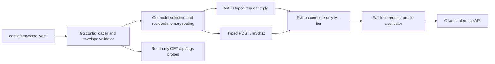

# Design — 102 <deploy-host> Deploy Hardening

## Current Truth (objective research pass, reconciled 2026-07-10)

Recon-confirmed facts from the live tree of both repos (solution-blind). Line
numbers are approximate anchors, not contracts.

### Concern 1 — ML-sidecar env delivery

- [`deploy/compose.deploy.yml`](../../deploy/compose.deploy.yml) `smackerel-ml`
  has `env_file: - ./app.env` — the identical file `smackerel-core` loads. Its
  own `environment:` block only adds `PROMPT_CONTRACTS_DIR`, `HF_HOME`,
  `SENTENCE_TRANSFORMERS_HOME`. So the full secret set arrives via `app.env`.
- [`scripts/commands/config.sh`](../../scripts/commands/config.sh) `SHELL_SECRET_KEYS`
  (≈ L510-521) = `POSTGRES_PASSWORD`, `AUTH_SIGNING_ACTIVE_PRIVATE_KEY`,
  `AUTH_AT_REST_HASHING_KEY`, `AUTH_BOOTSTRAP_TOKEN`, `TELEGRAM_BOT_TOKEN`,
  `KEEP_GOOGLE_APP_PASSWORD`, `CARD_REWARDS_GCAL_CREDENTIALS`,
  `WEB_REGISTRATION_INVITE_TOKEN`, `LLM_PROVIDER_SECRET_MASTER_KEY`.
- The bundle staging (`config.sh` ≈ L2837-2960) writes a single `app.env`
  (`grep -v '^# Generated: ' "$OUTPUT_FILE" > "$STAGE_DIR/app.env"`), lists it in
  `bundle-manifest.yaml` and the `TAR_FILES` argv.
- The sidecar's actual env reads (grep of `ml/app/**`): `OLLAMA_URL`,
  `ML_OLLAMA_KEEP_ALIVE`, `ML_STRUCTURED_EXTRACTION_THINKING`, `NATS_URL`,
  `SMACKEREL_AUTH_TOKEN`, `NATS_CONSUMER_*` (spec 081), the embedding-model name,
  `PROMPT_CONTRACTS_DIR`, `HF_HOME`, `SENTENCE_TRANSFORMERS_HOME`. It reads NO
  `POSTGRES_*`, NO `AUTH_SIGNING_*`, NO `DATABASE_URL`. Code-plane isolation
  already holds; env-delivery does not.
- `deploy/compose.deploy.yml` has NO top-level `networks:` block — every service
  shares the compose default network, so `smackerel-ml` CAN reach `postgres`.
- QF precedent: [`scripts/lint/python-compute-only-guard.sh`](../../../QuantitativeFinance/scripts/lint/python-compute-only-guard.sh)
  - `.allowlist`, wired into `quantitativefinance.sh` `dev lint` (≈ L6310), three
  checks, exit 2 on any `--skip/--force/--ignore/--no-verify`.

### Concern 2 — alert routing

- Bundle stages `prometheus.yml` from `PROM_OUT_FILE` (`config.sh` ≈ L2882),
  rendered by `envsubst` from
  [`config/prometheus/prometheus.yml.tmpl`](../../config/prometheus/prometheus.yml.tmpl)
  (≈ L2796-2825). The rendered file carries scrape configs but NO `alerting:`
  block.
- `deploy/compose.deploy.yml` has a `prometheus` service under
  `profiles: [monitoring]` (read-only root, `user: nobody`, fail-loud
  `PROMETHEUS_*_LIMIT`). There is NO `alertmanager` service.
- The 21 rules live in [`config/prometheus/alerts.yml`](../../config/prometheus/alerts.yml),
  bundled as `alerts.yml`. Product-repo comment: "Receivers … are NOT shipped
  here. Alertmanager routing belongs to the deploy-adapter overlay so the product
  repo stays target-agnostic."
- `<deployment-owner>/<product>/<target>/alertmanager-standup.sh` appends the `alerting:` block
  to the host `prometheus.yml` post-apply and SIGHUP-reloads; its own DRIFT NOTE
  says a later `apply.sh` re-extract drops the block. `<deployment-owner>/<product>/<target>/alertmanager/alertmanager.yml`
  routes a single `webhook_configs` receiver to `http://self-hosted-ntfy:8080/self-hosted-alerts`
  with `send_resolved: true` and a documented "follow-up: a small
  alertmanager->ntfy templating bridge would turn the raw webhook JSON into a
  titled/priority-tagged ntfy message" — templating is the acknowledged gap.

### Concern 3 — model envelopes

- [`config/smackerel.yaml`](../../config/smackerel.yaml)
  `services.ml.model_memory_profiles` is now the KV-aware list
  `{model, weights_mib, kv_mib_per_1k_ctx, num_ctx}`. Every Ollama model named by
  the shipped runtime routes has a profile. `services.ml.ollama_keep_alive`
  owns the per-request residency window; `infrastructure.ollama.keep_alive`,
  `num_parallel`, and `max_loaded_models` own daemon-wide posture. All values are
  explicit SST values; none is a fallback.
- [`internal/config/config.go::validateModelEnvelopes`](../../internal/config/config.go)
  parses the profile table fail-loud and computes `ResidentMiB = weights +
  KV(num_ctx, num_parallel)`. Per-model fit is always required; the working-set
  sum is required only when the explicit `max_loaded_models > 1` posture permits
  co-residency. [`cmd/core/wiring_assistant_openknowledge.go`](../../cmd/core/wiring_assistant_openknowledge.go)
  converts the same profiles to resident-MiB routing constraints; it does not
  construct inference requests.
- The typed Go tier has two compute request paths. [`cmd/core/wiring_agent.go`](../../cmd/core/wiring_agent.go)
  installs `agent.NewNATSLLMDriver`, which publishes typed turns on
  `agent.invoke.request`; [`internal/assistant/openknowledge/llm/client.go`](../../internal/assistant/openknowledge/llm/client.go)
  posts a typed `ChatRequest` to `<ML_SIDECAR_URL>/llm/chat`. Python consumes
  both boundaries and alone translates them into Ollama inference payloads.
- Go's direct Ollama HTTP calls are read-only `GET /api/tags` probes in
  [`internal/api/health.go`](../../internal/api/health.go),
  [`internal/api/model_connections_probe.go`](../../internal/api/model_connections_probe.go),
  and [`internal/assistant/openknowledge/catalog/adapter.go`](../../internal/assistant/openknowledge/catalog/adapter.go).
  They discover health/models, generate no tokens, and are outside
  FR-102-C3-2's inference-request contract.
- The Python compute tier contains 13 Ollama-capable request builders across 12
  files. Three currently apply profile-derived `options.num_ctx`
  (`processor.process_content`, `synthesis.handle_extract`, and
  `routes.chat._dispatch_ollama`); ten do not. There is no intentionally
  unprofiled production Ollama route in the current SST. The complete inventory
  and implementation handoff are in SCOPE-102-03 below.
- [`ml/app/ollama_keepalive.py::resolve_ollama_num_ctx`](../../ml/app/ollama_keepalive.py)
  currently returns `None` for absent, malformed, or unmatched profile data,
  and [`ml/app/main.py::_check_required_config`](../../ml/app/main.py) does not
  validate `ML_MODEL_MEMORY_PROFILES_JSON`. That fail-open pair can silently
  omit the cap and conflicts with no-defaults for configured Ollama routes.
- BUG-026-006 (`specs/026-domain-extraction/bugs/BUG-026-006-llm-malformed-json-drops-capture/state.json`):
  status `partially_fixed_in_repo`, `redeployRequired: true`; the in-repo
  code-resilience half (tolerant JSON + SST-gated graceful degradation in
  `ml/app/processor.py`) is done; the model-quality / 71-95 s latency / output-
  budget root cause is ROUTED to ops. Sibling BUG-026-007 (qwen3 thinking) is the
  latency half already handled by `structured_extraction_thinking: false`.

### Concern 4 — backup adapter (re-read 2026-07-09; edited after the live fixes)

- `<deployment-owner>/<product>/<target>/backup.sh`: F-1 captures the NATS volume via
  `docker run --rm -v "$NATS_VOLUME":/src:ro alpine tar -C /src -cf - . | tar -x`
  into `$DUMP_DIR/nats-data`; on any miss/failure it `rm -rf` the partial and
  sets `backup_degraded=1` + `emit_ledger_meta nats_captured false`. OPS-RDY-01:
  a skipped CRITICAL capture emits `META: status=warning`, never a clean success.
  F-2 manifest capture is a best-effort `cp -a … 2>/dev/null` guarded by `if …`,
  degrading `manifest_captured=false` WITHOUT flipping `backup_degraded`. F-3
  `write_backup_status()` writes the spec-048 status JSON atomically (`tmp`+`mv`,
  `0644`), `last_success` advancing only on `postgres_captured_status==1`.
- `<deployment-owner>/<product>/<target>/apply.sh`: F-2 chown-back at ≈ L1690-1697
  (`chown "$SUDO_USER:$SUDO_USER" "$MANIFEST"; chmod 0644 "$MANIFEST"`). F-3
  `BACKUP_LOCAL_DIR="$INSTALL_ROOT/backups"` derived fail-loud from
  `host.installRoot` (≈ L1252-1282), `chown`ed back to `$SUDO_USER`, bind-mounted
  read-only into `smackerel-core` in `deploy/compose.deploy.yml`.
- `internal/backup.Watcher` polls `BACKUP_STATUS_FILE` and republishes
  `smackerel_backup_last_success_unixtime` (`internal/backup.Status`,
  schema_version 1) for the `SmackerelBackupStale` rule.
- There is currently NO `<deployment-owner>/<product>/<target>/tests/` coverage that
  adversarially proves the F-1 degraded-path or the F-2 root-manifest
  non-fatal-path.

---

## Design Brief

**Current State.** The KV-aware SST profile and three Python `num_ctx` call-site
updates are present, but the original design incorrectly invented a Go direct
Ollama inference client and treated those three Python paths as exhaustive. The
actual Go tier validates/routes over typed NATS and `/llm/chat` boundaries;
Python has 13 Ollama-capable builders, ten of which can still omit a configured
profile's context cap.

**Target State.** Keep Go as the state-owning parser/validator/router and Python
as the sole Ollama inference issuer. Every profiled Python request builder uses
one fail-loud request-profile applicator that places per-model `num_ctx` under
`options`, places the SST per-request `keep_alive` at the protocol top level,
and leaves daemon-wide parallelism/loading controls out of request payloads.
Builder-specific tests prove the emitted payload, while Go tests prove the typed
boundary and KV-aware routing math.

**Patterns to Follow.**

- The bundle staging + fail-loud `${VAR:?}` SST contract in
  [`scripts/commands/config.sh`](../../scripts/commands/config.sh) and
  [`deploy/compose.deploy.yml`](../../deploy/compose.deploy.yml) (spec 045 / 052 /
  082) — the env projection and the alertmanager service extend it, they do not
  fork it.
- The typed NATS driver in [`internal/agent/nats_driver.go`](../../internal/agent/nats_driver.go)
  and typed `/llm/chat` client in
  [`internal/assistant/openknowledge/llm/client.go`](../../internal/assistant/openknowledge/llm/client.go)
  — Go routes model intent without importing Ollama's inference protocol.
- The existing request-level `keep_alive` / `think` placement in
  [`ml/app/synthesis.py`](../../ml/app/synthesis.py) and the profile resolver in
  [`ml/app/ollama_keepalive.py`](../../ml/app/ollama_keepalive.py) — centralize
  their application across all LiteLLM and native-JSON builders.
- The QF `python-compute-only-guard.sh` shape (three checks, `.allowlist`, exit-2
  bypass rejection) — smackerel's guard mirrors it.
- The spec-082 concurrent-envelope guard structure in `validateModelEnvelopes`
  — the KV-aware math extends the same combined-error envelope.
- The OPS-RDY-01 "degraded ≠ success" ledger doctrine already in `backup.sh` —
  the regression tests LOCK it, they do not re-invent it.

**Patterns to Avoid.**

- The `alertmanager-standup.sh` post-apply-injection pattern — it is the exact
  fragility being removed; do NOT keep it as a fallback.
- The host-side `ollama create <tag>` context override — a host-only mutation
  outside SST; do NOT reintroduce it on the deploy path.
- Any Go `/api/chat` or `/api/generate` client — it would bypass the typed
  sidecar boundary and violate the isolated-ML-sidecar invariant. Go may retain
  bounded read-only `/api/tags` probes.
- Per-builder silent omission when profile JSON is missing/malformed — a
  configured Ollama route must fail loud before sending an uncapped request.
- A naive `LLM_*` prefix allowlist — it would leak `LLM_PROVIDER_SECRET_MASTER_KEY`;
  the projection MUST hard-subtract `SHELL_SECRET_KEYS`.
- A single static `memory_mib` ceiling — it is the fiction the validator trusts
  today; replace it with weights + KV rate.

**Resolved Decisions.**

- Per-service env projection ships a filtered `ml.env` in the bundle; compose
  points `smackerel-ml.env_file` at `./ml.env` (not `./app.env`).
- Alertmanager routing/templating structure is PRODUCT-owned (bundle); the ntfy
  ENDPOINT VALUE is ADAPTER-owned (injected via a mounted `url_file` at apply).
- ntfy templating is a small PRODUCT-owned bridge that reuses the already-pinned
  `${SMACKEREL_CORE_IMAGE}` (no new external image to pin/sign).
- `model_memory_profiles` is `{model, weights_mib, kv_mib_per_1k_ctx, num_ctx}`;
  resident = `weights_mib + kv_mib_per_1k_ctx × (num_ctx/1000) × num_parallel`.
- Go never constructs an Ollama inference request. It validates the envelope,
  selects/routes the model, and requests Python compute through NATS or the
  typed sidecar client; only Python applies Ollama protocol fields.
- `num_ctx` is per-model and request-level (`options.num_ctx`); `keep_alive` is
  per-request and top-level; `OLLAMA_KEEP_ALIVE`, `OLLAMA_NUM_PARALLEL`, and
  `OLLAMA_MAX_LOADED_MODELS` are daemon-wide and never request fields.
- Co-residency posture is the explicit SST value `max_loaded_models: 1`
  (on-demand swap) until live co-residency is proven (R-102-D).
- No production Ollama route is intentionally unprofiled. Hosted-provider
  dispatch and read-only `/api/tags` probes are the relevant exclusions.

**Open Questions.** None. The remaining items are implementation gaps with
named paths, not unresolved design choices.

---

## Capability Foundation (DE4)

**Proportionality assessment.** The per-service env projection remains a single-
consumer seam, but corrected FR-102-C3-2 is shared by 13 Python request builders
and two payload shapes. That N≥2 surface requires one request-profile
application foundation; copying profile lookup and protocol placement into
every builder is the drift this reconciliation found.

### Foundation Contract

| Contract | Responsibility | Consumers |
| --- | --- | --- |
| Go model-envelope loader/validator | Parse the SST profile table, require every configured runtime model to be profiled, compute resident MiB with daemon `num_parallel`, and enforce per-model/co-resident fit | Config generation, core model routing, model-switch allowlist |
| Typed compute boundary | Carry model intent and typed messages/tools from Go to Python without Ollama generation fields | `agent.NewNATSLLMDriver`, open-knowledge `llm.Client`, Python NATS and `/llm/chat` handlers |
| Python request-profile applicator | Resolve the selected Ollama model fail-loud; apply `options.num_ctx` and top-level `keep_alive` without clobbering existing `options` or `think` | Every Python Ollama inference builder |
| Probe exemption | Permit bounded read-only `GET /api/tags` health/discovery calls; forbid Go generation endpoints | Core health, connection probe, model catalog |

### Extension Points

- **LiteLLM kwargs adapter:** merge `num_ctx` into existing `options` and put
  `keep_alive` at the top level before `litellm.acompletion`.
- **Native Ollama JSON adapter:** add `options.num_ctx` and top-level
  `keep_alive` to direct `/api/generate` JSON bodies.
- **Future Python builder:** use one of those adapters and add a payload
  assertion before issuing an Ollama inference request.

### Foundation-Owned Behavior

- When the effective provider is Ollama, `ML_MODEL_MEMORY_PROFILES_JSON` is
  required and validated at sidecar startup. Missing/malformed JSON, duplicate
  model entries, a missing selected model, or a non-positive `num_ctx` is a
  named fail-loud error at startup and again at request construction.
- Hosted-provider branches do not receive Ollama fields.
- Existing caller-owned `options` entries and top-level `think` are preserved.
- Daemon controls (`num_parallel`, `max_loaded_models`, daemon
  `OLLAMA_KEEP_ALIVE`) remain configuration/validation inputs and are never
  copied into an inference request.

### Per-Service Env Projection (the one new seam)

A single generator-side helper that, from the full generated `app.env`, projects
a DECLARED per-service allowlist into a `<service>.env` staged in the bundle,
after HARD-SUBTRACTING the managed-secret set.

- **Contract:** `project_service_env(<service>, <app.env>, <out.env>, <allowlist_json>)`
  ([`scripts/commands/config.sh`](../../scripts/commands/config.sh) L604) →
  `{ k=v ∈ app.env : matches(k, allowlist) } \ (SHELL_SECRET_KEYS ∪ POSTGRES_* ∪ DATABASE_URL)`.
- **SST authority:** the allowlist is declared in `config/smackerel.yaml`
  (`services.<svc>.env_allowlist`: exact keys + trailing-glob prefixes),
  reviewable like any other SST config; the generator refuses an allowlist that
  intersects `SHELL_SECRET_KEYS` (fail-loud tripwire, config.sh ≈ L637).
- **Unconditional secret subtraction:** the projection ALWAYS subtracts
  `SHELL_SECRET_KEYS` + `POSTGRES_*` + `DATABASE_URL` regardless of the declared
  allowlist, so a future mis-declaration cannot leak a secret.
- **Bundle integration:** `<service>.env` is added to `STAGE_DIR`, the
  `bundle-manifest.yaml` `files:` list, and the `TAR_FILES` argv (config.sh
  ≈ L3071), so it is a first-class deterministic bundle artifact.

### Single-Implementation Justification

Per DE4 this is a **single-implementation** feature, not an N≥2 capability-
foundation split:

- **Exactly one concrete consumer.** `project_service_env` is called EXACTLY once
  — for `smackerel-ml` ([`scripts/commands/config.sh`](../../scripts/commands/config.sh)
  L3071, driven by `services.ml.env_allowlist` =
  `{NATS_URL, OLLAMA_URL, SMACKEREL_ENV, SMACKEREL_AUTH_TOKEN, PROMPT_CONTRACTS_DIR,
  HF_HOME, SENTENCE_TRANSFORMERS_HOME}` + prefixes `{ML_*, OLLAMA_*}` + the
  embedding-model key(s), minus `SHELL_SECRET_KEYS`). `smackerel-core` is
  deliberately NOT projected: it is the trusted typed tier that legitimately owns
  the datastore and auth secrets and keeps `./app.env`. The stack contains exactly
  one compute-only Python sidecar, so there is exactly one implementation.
- **No dependent overlay.** The four scopes are independent; no later scope
  consumes the projection, so there is no foundation→overlay dependency to model
  and no N≥2 provider set to abstract. SCOPE-102-01 is tagged `foundation:true` in
  [scopes.md](scopes.md) only in the sense that it builds this shared seam — it is
  a single self-contained scope, not the base of a provider split.
- **Parameterized for cheap future reuse, not a live foundation.** The helper
  takes `<service>` + `<allowlist>` as arguments so a future second sidecar (or a
  split of the ML tier) would inherit secret-free delivery and the guard's
  declared-allowlist surface for free — but this spec does NOT claim, build, or
  test a second implementation, and does NOT split the design into foundation +
  overlay scopes.

The other concerns (alert routing and backup durability) harden existing single
adapters and introduce no new capability seam.

## Concrete Implementations

### Compute-Only Env Projection

- Foundation contract used: the per-service env projection described above.
- Concrete consumer: `smackerel-ml` only; the existing single-implementation
  justification remains valid for this seam.

### LiteLLM Ollama Request Adapter

- Consumers: `agent.py`, `card_categories.py`, `domain.py`,
  `drive_classify.py`, `main.py`, both `nats_client.py` builders,
  `processor.py`, `routes/chat.py`, and both `synthesis.py` builders.
- Implementation-specific behavior: merge profile options into completion
  kwargs while retaining the caller's provider prefix, tools, token budget,
  response format, and `think` policy.

### Native Ollama JSON Request Adapter

- Consumers: `intelligence.py::_call_llm` and `ocr.py::extract_text_ollama`.
- Implementation-specific behavior: build Ollama-native `/api/generate` JSON
  with nested `options.num_ctx` and top-level `keep_alive`.

### Typed Go Routing And Read-Only Probes

- Go consumes the SST envelope and produces typed compute intents; it is not an
  Ollama inference adapter.
- Its only direct daemon calls are bounded `GET /api/tags` probes. Adding a Go
  generation endpoint is an architecture violation.

### Variation Axes

| Axis | Options | Owned By Foundation? |
| --- | --- | --- |
| Payload shape | LiteLLM kwargs, native Ollama JSON | Yes: protocol-specific adapter |
| Transport into Python | NATS request/reply, typed `/llm/chat`, sidecar-local handler | No: existing caller boundary |
| Provider class | Ollama, hosted provider | Yes: apply profile only to Ollama |
| Model selection | SST env route, typed request-selected model | Yes: both require fail-loud profile lookup |

---

## Concern designs

### SCOPE-102-01 — ML-sidecar compute-only secret isolation

**Durable design.**

1. **Env projection (product `config.sh`).** Implement `project_service_env`
   (above) in the bundle-staging block (≈ L2878, next to the `app.env` write).
   Stage `ml.env` from the declared `services.ml.env_allowlist`, add it to
   `bundle-manifest.yaml` + `TAR_FILES`, `chmod 0644`. Fail loud if the allowlist
   intersects `SHELL_SECRET_KEYS`.
2. **Compose (product `deploy/compose.deploy.yml`).** Change `smackerel-ml`
   `env_file:` from `- ./app.env` to `- ./ml.env`. Keep its explicit
   `environment:` block. Update
   `internal/deploy/compose_contract_test.go` /
   `internal/deploy/bundle_secret_contract_test.go` to assert `smackerel-ml`
   loads `ml.env`, and that `ml.env` in the generated bundle contains none of
   `SHELL_SECRET_KEYS` / `POSTGRES_*`.
3. **Guard (product `scripts/lint/python-compute-only-guard.sh` + `.allowlist`).**
   Mirror QF spec 089 Scope C — bash 3.2 + POSIX, no bypass flag (`--skip /
   --force / --ignore / --no-verify` ⇒ exit 2). Three checks over `ml/`:
   (a) **forbidden-driver scan** (`psycopg|asyncpg|sqlalchemy|redis|aioredis|kafka|confluent-kafka|pymongo|motor` in dependency-spec position of `ml/pyproject.toml`/`requirements*.txt`);
   (b) **infra-URL-read scan** (`os.environ[...]/os.getenv(...)` of
   `DATABASE_URL|POSTGRES_URL|REDIS_URL|RABBITMQ_URL` in `ml/**/*.py`);
   (c) **env-allowlist/secret-absence assertion** — generate a self-hosted bundle,
   extract `ml.env`, and assert `ml.env ∩ SHELL_SECRET_KEYS = ∅` and the
   compose `smackerel-ml.env_file` is `./ml.env`.
4. **Wiring.** Add the guard to the `test pre-push` arm in
   [`smackerel.sh`](../../smackerel.sh) (≈ L2200, next to the macOS-portability
   guard, "no bypass") and to the CI `lint-and-test` job in
   [`.github/workflows/ci.yml`](../../.github/workflows/ci.yml) (fold into
   `./smackerel.sh lint`, which CI already runs).
5. **Defense-in-depth network (product compose).** Add top-level `networks:`
   `data-tier` + `compute-tier`; `postgres` joins ONLY `data-tier`;
   `smackerel-core` joins BOTH; `smackerel-ml`, `nats`, `ollama` join
   `compute-tier`. `smackerel-ml` thereby has no route to `postgres` even if it
   somehow held a driver+creds. Lock with a compose contract-test assertion.

**Cited locations:** `config.sh` L510-521 (SHELL_SECRET_KEYS), L2878 (app.env
write), L2900-2960 (manifest/tar list); `compose.deploy.yml` `smackerel-ml`
`env_file` + (new) `networks`; `smackerel.sh` L2200 (pre-push); `ci.yml`
`lint-and-test`.

### SCOPE-102-02 — Durable Prometheus → Alertmanager → ntfy routing

**Durable design.**

1. **Alerting block (product `config/prometheus/prometheus.yml.tmpl`).** Append a
   static `alerting: { alertmanagers: [ { static_configs: [ { targets:
   ['alertmanager:9093'] } ] } ] }` block to the template so every `envsubst`
   render (and therefore every bundle) carries it. Harmless when the monitoring
   profile is off (Prometheus is down too).
2. **Alertmanager service (product `deploy/compose.deploy.yml`).** Add an
   `alertmanager` service under `profiles: [monitoring]`, `network-alias`
   `alertmanager`, image pinned by digest in `deploy/contract.yaml`
   `externalImages` (byte-lockstep per `external_images_contract_test.go`),
   read-only root + `/tmp` tmpfs, `cap_drop: [ALL]`, `no-new-privileges`, fail-
   loud `ALERTMANAGER_CPU_LIMIT` / `ALERTMANAGER_MEMORY_LIMIT` from
   `deploy_resources.alertmanager.*`. No host port (reached in-network by
   Prometheus). Mounts `./alertmanager.yml` + the templating `url_file`.
3. **Routing config (product `config/prometheus/alertmanager.yml`, generic).**
   Port the knb overlay routing STRUCTURE (route tree, `group_by`, `inhibit_rules`)
   into the product repo, but replace the operator-private endpoint with a
   `url_file: /etc/alertmanager/ntfy_url` (Alertmanager `webhook_configs`
   supports `url_file`). No ntfy host/topic literal in the product repo → "no
   env-specific content" holds. Staged into the bundle by `config.sh` next to
   `prometheus.yml`/`alerts.yml` and listed in `bundle-manifest.yaml` + `TAR_FILES`.
4. **Templating bridge (product `cmd/alertmanager-ntfy-bridge`, reuses the core
   image).** A tiny stateless HTTP shim built into the EXISTING core binary/image
   (exposed as a `monitoring`-profiled compose service on `${SMACKEREL_CORE_IMAGE}`
   with a bridge command). It receives the Alertmanager webhook JSON and
   republishes to ntfy with `X-Title` / `X-Priority` / `X-Tags` derived from
   alert `severity` label + `summary`/`description` annotations — the TEMPLATING
   the task requires. The ntfy base URL is read fail-loud from an adapter-injected
   env (`ALERTMANAGER_NTFY_URL`). Reuses a shared ntfy-publish helper (candidate:
   the spec-055 notification ntfy adapter) as the templating foundation. The
   Alertmanager `url_file` points at the bridge, the bridge points at ntfy.
  A raw-JSON webhook directly to ntfy is rejected because the task requires
  real title/priority templating.
5. **Adapter side (knb `<deployment-owner>/<product>/<target>`).** `apply.sh` writes the real ntfy
   base URL to the host file bind-mounted at `/etc/alertmanager/ntfy_url` (fail-
   loud; adapter-owned env-specific value), attaches the alertmanager/bridge
   container(s) to the `self-hosted-ntfy` network (idempotent), and the standup is
   gone. RETIRE `<deployment-owner>/<product>/<target>/alertmanager-standup.sh` and its
   `alertmanager/alertmanager.yml` (superseded by the bundled generic config).
6. **Contract test (product).** Extend `internal/deploy/monitoring_*_contract_test.go`
   (or a new `alertmanager_bundle_contract_test.go`) to generate a bundle and
   assert: `prometheus.yml` contains `alertmanager:9093`; `docker-compose.yml`
   declares the `alertmanager` service under `profiles: [monitoring]`; the bundle
   contains `alertmanager.yml` with a `url_file` (no ntfy literal).

**Cited locations:** `config.sh` L2796-2825 (prom render), L2882-2896 (bundle
copies), L2900-2965 (manifest/tar list); `compose.deploy.yml` prometheus service
(the sibling posture the alertmanager service mirrors); `deploy/contract.yaml`
externalImages; knb `alertmanager-standup.sh` + `alertmanager/alertmanager.yml`
(retire/port).

### SCOPE-102-03 — Model-envelope correctness + BUG-026-006

**Architecture boundary.**

Go owns SST parsing, profile/envelope validation, model selection, persistence,
and typed routing. Python owns provider translation and is the sole issuer of
Ollama inference requests. `GET /api/tags` is discovery/health, not inference.

#### Configuration Scope

| Setting | Authority and runtime scope | Request placement | Validation effect |
| --- | --- | --- | --- |
| `model_memory_profiles[].num_ctx` | SST, per model | `options.num_ctx` on every request for that profiled Ollama model | Scales per-model KV footprint |
| `services.ml.ollama_keep_alive` / `ML_OLLAMA_KEEP_ALIVE` | SST, per inference request | top-level `keep_alive` | Overrides the daemon default for that request/model residency |
| `infrastructure.ollama.keep_alive` / `OLLAMA_KEEP_ALIVE` | SST, daemon default | never sent by the request-profile applicator | Used when a request has no override; informs residency validation |
| `infrastructure.ollama.num_parallel` / `OLLAMA_NUM_PARALLEL` | SST, daemon-wide | never a request field | Multiplies each model's KV term |
| `infrastructure.ollama.max_loaded_models` / `OLLAMA_MAX_LOADED_MODELS` | SST, daemon-wide | never a request field | `1` enforces per-model fit only; `>1` also enforces working-set sum |

The product SST remains target-agnostic. The deploy adapter applies daemon-wide
values to the selected daemon (bundled or shared) without a host-local override.
A model tag, daemon default, or implicit LiteLLM default is not an acceptable
substitute for the per-request `num_ctx` contract.

#### Complete Python Ollama Request-Builder Inventory

This inventory covers every production `litellm.acompletion`, direct
`/api/generate`, and injected production `completion_fn` under `ml/app/`. The
current SST profiles every Ollama model source named below.

| Builder | Model source and protocol | Current request posture | FR-102-C3-2 classification |
| --- | --- | --- | --- |
| [`ml/app/agent.py::handle_invoke`](../../ml/app/agent.py) | `AGENT_PROVIDER_*_MODEL`; LiteLLM `/api/chat` | determinism options only; no `num_ctx` or `keep_alive` | **Gap** |
| [`ml/app/card_categories.py::extract_card_categories`](../../ml/app/card_categories.py) | `LLM_MODEL`; LiteLLM `/api/chat` | `think` only; no `num_ctx` or `keep_alive` | **Gap** |
| [`ml/app/domain.py::_do_domain_extract`](../../ml/app/domain.py) | NATS-selected `LLM_MODEL`; LiteLLM `/api/chat` | top-level `keep_alive`; no `num_ctx` | **Gap** |
| [`ml/app/drive_classify.py::classify_drive_file`](../../ml/app/drive_classify.py) | NATS-selected `LLM_MODEL`; LiteLLM `/api/chat` | `think` only; no `num_ctx` or `keep_alive` | **Gap** |
| [`ml/app/intelligence.py::_call_llm`](../../ml/app/intelligence.py) | NATS-selected `LLM_MODEL`; native `/api/generate` used by five intelligence handlers | no `options` or `keep_alive`; forbidden `model or "llama3"` fallback | **Gap** |
| [`ml/app/main.py::_warmup_domain_model`](../../ml/app/main.py) | startup `LLM_MODEL`; LiteLLM `/api/chat` | top-level `keep_alive`; no `num_ctx` | **Gap** |
| [`ml/app/nats_client.py::_handle_search_rerank`](../../ml/app/nats_client.py) | `LLM_MODEL`; LiteLLM `/api/chat` | `think` only; no `num_ctx` or `keep_alive` | **Gap** |
| [`ml/app/nats_client.py::_handle_digest_generate`](../../ml/app/nats_client.py) | `LLM_MODEL`; LiteLLM legacy Ollama route | no `num_ctx` or `keep_alive` | **Gap** |
| [`ml/app/ocr.py::extract_text_ollama`](../../ml/app/ocr.py) | `OLLAMA_VISION_MODEL`; native `/api/generate` | no `options` or `keep_alive` | **Gap** |
| [`ml/app/processor.py::process_content`](../../ml/app/processor.py) | NATS-selected `LLM_MODEL`; LiteLLM `/api/chat` | `options.num_ctx` plus top-level `keep_alive` | **Compliant code; direct payload test missing** |
| [`ml/app/routes/chat.py::_dispatch_ollama`](../../ml/app/routes/chat.py) | typed `ChatRequest.model`; LiteLLM `/api/chat` | `options.num_ctx`; no request `keep_alive` | **Compliant for C3-2; direct payload test missing** |
| [`ml/app/synthesis.py::handle_extract`](../../ml/app/synthesis.py) | NATS-selected `LLM_MODEL`; LiteLLM `/api/chat` | `options.num_ctx` plus top-level `keep_alive` | **Compliant and directly tested** |
| [`ml/app/synthesis.py::handle_crosssource`](../../ml/app/synthesis.py) | NATS-selected `LLM_MODEL`; LiteLLM `/api/chat` | top-level `keep_alive`; no `num_ctx` | **Gap** |

**Intentionally unprofiled or excluded:** none of the production Ollama rows.
Hosted-only `routes/chat.py::_dispatch_hosted`, the OpenAI branch in
`intelligence.py`, local sentence-transformer embeddings, Tesseract OCR, and Go
`GET /api/tags` probes are not Ollama inference requests and must not receive
Ollama profile options.

#### Request And Envelope Contracts

- A single Python request-profile applicator in `ml/app/ollama_keepalive.py`
  validates the profile table, resolves the selected bare model, merges
  `options.num_ctx`, and adds top-level `keep_alive`. LiteLLM and native-JSON
  adapters share lookup/error semantics but own their payload shape.
- `ml/app/main.py::_check_required_config` validates
  `ML_MODEL_MEMORY_PROFILES_JSON` when the effective provider is Ollama. The
  request applicator repeats the selected-model check so a dynamic typed model
  cannot escape startup validation.
- Every LiteLLM Ollama builder uses the `ollama_chat/` route when it needs
  top-level request controls. In particular, digest generation cannot retain a
  legacy route that buries `keep_alive` under `options`.
- The Go config loader rejects malformed and duplicate profile entries, then
  `validateModelEnvelopes` enforces the same profile set used by Python. This
  preserves one unambiguous SST value per model across both tiers.
- Existing `think`, tools, response format, token budgets, determinism options,
  and other caller-owned options survive profile application unchanged.
- The explicit SST posture remains `max_loaded_models: 1` (on-demand swap)
  until operator risk R-102-D proves co-residency on <deploy-host>. Changing that value
  changes Go envelope enforcement and daemon behavior, not request payload
  placement.
- The SST-owned output-token budget and BUG-026-006/007 routing behavior remain
  separate from the memory profile; context capacity and output budget are not
  conflated.

#### Implementation-Owner Handoff

`bubbles.implement` must close the ten **Gap** rows without changing Go into an
Ollama inference client. Exact source paths are:

`ml/app/agent.py`, `ml/app/card_categories.py`, `ml/app/domain.py`,
`ml/app/drive_classify.py`, `ml/app/intelligence.py`, `ml/app/main.py`,
`ml/app/nats_client.py`, `ml/app/ocr.py`, `ml/app/synthesis.py`, plus the shared
fail-loud applicator in `ml/app/ollama_keepalive.py` and startup validation in
`ml/app/main.py`. It must also add direct payload tests for the currently
compliant `ml/app/processor.py` and `ml/app/routes/chat.py` paths.

Required test ownership paths are `ml/tests/test_agent.py`,
`ml/tests/test_card_categories.py`, `ml/tests/test_domain.py`,
`ml/tests/test_drive_classify.py`, `ml/tests/test_intelligence_handlers.py`,
`ml/tests/test_main.py`, `ml/tests/test_nats_client.py`, `ml/tests/test_ocr.py`,
`ml/tests/test_processor.py`, `ml/tests/test_synthesis.py`,
`ml/tests/test_chat_dispatch_parity_spec096.py`, and
`ml/tests/test_ollama_keepalive.py`. A matrix/AST guard may supplement these
tests, but it cannot replace builder-level payload assertions through real
production functions.

#### Plan Sync Required

`bubbles.plan` must reconcile SCOPE-102-03 before implementation resumes:

- replace the stale Gherkin/DoD phrase "Go core or ML sidecar issues an Ollama
  request" with the corrected Go typed-boundary plus Python-only issuance rule;
- expand the SCOPE-102-03 change boundary and ownership table from the prior
  four Python files to every source/test path in the inventory and handoff;
- replace the single `test_synthesis.py` C3-01 row with a 13-builder payload
  coverage matrix, hosted-provider negative assertion, fail-loud missing/
  malformed/unprofiled-profile cases, and a Go no-generation-client contract;
- reopen/reconcile the checked C3-01 completion claim and report wording that
  currently says "all three ollama call sites"; the source inventory proves
  that claim is incomplete. No status/certification change is implied here.

**Adversarial test (SCN-102-C3-02):** a unit test on `validateModelEnvelopes`
with a profile whose `weights_mib + KV` exceeds the envelope MUST fail loud;
removing the KV term (regressing to the static ceiling) makes the test fail —
proving the protection.

**Cited locations:** `config/smackerel.yaml` `services.ml.model_memory_profiles`
and `ollama_keep_alive` plus `infrastructure.ollama.*`; `internal/config/config.go`
`ModelMemoryProfile`, `ResidentMiB`, and `validateModelEnvelopes`;
`cmd/core/wiring_{agent,assistant_openknowledge}.go`; `internal/agent/nats_driver.go`;
`internal/assistant/openknowledge/llm/client.go`; all inventory paths above;
BUG-026-006/007 artifacts.

### SCOPE-102-04 — Backup-adapter durability formalization

**Durable design.** The F-1/F-2/F-3 code already exists in
`<deployment-owner>/<product>/<target>/{backup.sh,apply.sh}` (re-read above). This scope
FORMALIZES it with adversarial regression tests under
`<deployment-owner>/<product>/<target>/tests/` (bash test harness; uses the
`SMACKEREL_DUMP_DIR` / `SMACKEREL_BACKUP_STATUS_FILE` / `NATS_VOLUME_NAME` /
`SMACKEREL_MANIFEST_FILE` test seams already present):

1. **F-1 degraded-path (SCN-102-C4-01).** With `NATS_VOLUME_NAME` pointing at a
   non-existent volume (and a variant where the docker-mediated tar fails), assert
   `backup.sh` (a) rotates out any stale `nats-data`, (b) emits
   `META: status=warning`, and (c) does NOT exit as a clean success —
   `nats_captured false` + degraded. An assertion that the run reports `success`
   with an unreadable NATS volume MUST fail the test.
2. **F-2 root-manifest non-fatal (SCN-102-C4-02).** With a `root:root 0600`
   (simulated unreadable) `SMACKEREL_MANIFEST_FILE`, assert `backup.sh` degrades
   to `manifest_captured false` WITHOUT `backup_degraded` and STILL succeeds on
   the postgres capture. Separately, an `apply.sh` unit assertion that the
   `$SUDO_USER`-gated `chown … + chmod 0644 "$MANIFEST"` runs so the pointer is
   operator-readable.
3. **F-3 status advance/hold (SCN-102-C4-03).** Assert `write_backup_status`
   advances `last_success_unixtime` + `last_status=success` when
   `postgres_captured_status==1`, and HOLDS the prior `last_success` +
   `last_status=failed` when postgres capture is skipped; assert the JSON matches
   `internal/backup.Status` schema_version 1 (a product-side contract test can
   assert the schema parity so the two repos stay in lockstep).

**Cited locations:** knb `backup.sh` (F-1 NATS docker-mediated block; F-2 manifest
best-effort; F-3 `write_backup_status`; OPS-RDY-01 degraded); knb `apply.sh`
L1252-1282 (BACKUP_LOCAL_DIR), L1690-1697 (manifest chown-back); product
`internal/backup` (`Watcher`/`Status`).

---

## Testing & Validation Strategy

Every scope proves behavior with real runs; regression-preventing tests are
adversarial (fail if the protection is removed).

| Scenario | Test type | Location (indicative) | Assertion |
| --- | --- | --- | --- |
| SCN-102-C1-01/02 | integration (bundle) | `internal/deploy/bundle_secret_contract_test.go` | `ml.env` ∩ secrets = ∅; sidecar boot green |
| SCN-102-C1-03/04 | unit (guard) | `scripts/lint/python-compute-only-guard.sh` selftest fixture | re-added secret / driver / infra-URL ⇒ non-zero; no bypass flag |
| SCN-102-C1-05 | contract | `internal/deploy/compose_contract_test.go` | postgres unreachable from `smackerel-ml` network |
| SCN-102-C2-01/02/04 | contract (bundle) | `internal/deploy/alertmanager_bundle_contract_test.go` | alerting block + service present; no ntfy literal |
| SCN-102-C2-03 | unit (bridge) | `internal/.../bridge_test.go` | Alertmanager payload ⇒ titled/priority ntfy request |
| SCN-102-C3-01 | unit (Python builders) | builder-specific modules listed in the SCOPE-102-03 handoff, plus a coverage-matrix guard | all 13 production Ollama builders execute real request construction; each carries its selected profile's `options.num_ctx`; hosted branches carry no Ollama options |
| SCN-102-C3-01 | contract (Go boundary) | `internal/agent/nats_driver_test.go`, `internal/assistant/openknowledge/llm/client_test.go`, and a source contract over Go Ollama endpoints | Go emits typed NATS or `/llm/chat` requests only; direct Go Ollama calls are read-only `/api/tags`; `/api/chat` and `/api/generate` are absent |
| SCN-102-C3-01 | unit (fail-loud profile) | `ml/tests/test_main.py`, `ml/tests/test_ollama_keepalive.py` | missing/malformed/duplicate profile data and an unprofiled selected Ollama model fail before an inference request is sent |
| SCN-102-C3-02/03/04 | unit (validator) | `internal/config/config_test.go` | KV math fails understated/uncapped; posture-gated sum |
| SCN-102-C3-05 | integration (ml) | `ml/tests/test_processor.py` | SST output-budget honored; BUG-026-006 evidence |
| SCN-102-C4-01/02/03 | integration (bash) | `<deployment-owner>/<product>/<target>/tests/backup_*_test.sh` | degraded ≠ success; root-manifest non-fatal; status advance/hold |

Live-host proofs (co-residency `ollama ps`; the re-apply itself) are
operator-gated (R-102-A/D) and captured on <deploy-host>, never faked in-repo.

---

## Security & Compliance

- **Blast-radius reduction (Concern 1)** — removing the secret set from the
  least-trusted Python tier is the primary control; the compute-only guard makes
  it non-regressible; the network segmentation is defense-in-depth. This
  strengthens `bubbles-isolated-ml-sidecar` without weakening the code-plane
  isolation already in place.
- **No secret in the product repo (Concern 2)** — the ntfy endpoint is
  adapter-injected via a mounted file; the product bundle carries only structure
  - templating. No `${VAR:-default}` anywhere.
- **Least privilege (Concern 2)** — the Alertmanager + bridge services keep the
  spec-045 read-only-root / `cap_drop:[ALL]` / `no-new-privileges` posture.
- **Tier boundary (Concern 3)** — Go retains credentials, persistence, model
  validation, and routing; Python remains compute-only and is the only tier that
  speaks Ollama's generation protocol. A Go generation client is a blocking
  architecture regression, while read-only `/api/tags` probes remain allowed.
- **Auditability (Concern 4)** — the OPS-RDY-01 ledger doctrine (degraded ≠
  success) is preserved and adversarially locked; secrets are never written to
  the backup-status file (timestamps + byte count + filename only).

## Observability & Failure Handling

- Concern 2 completes the observability loop: the 21 rules now have a durable
  delivery path; a fired alert becomes a titled ntfy message.
- Concern 3's validator fails LOUD at `./smackerel.sh config generate` before any
  container starts, so an over-envelope model can never reach a silent OOM /
  failed-load at first inference.
- Concern 3's Python startup/profile applicator fails loud before dispatch when
  profile JSON or the selected model is invalid; it never converts that defect
  into an uncapped daemon-default request.
- Concern 4's degraded backups surface as `warning` ledger entries + a held
  `SmackerelBackupStale` gauge, never a masked green.

## Complexity Tracking

| Deviation | Simpler alternative considered | Why rejected |
| --- | --- | --- |
| A dedicated `alertmanager-ntfy-bridge` service for templating | Alertmanager `webhook_configs` posting raw JSON straight to ntfy | The task requires titled/priority messages, not raw JSON; Alertmanager's webhook cannot set ntfy's `X-Title`/`X-Priority` headers per alert. The bridge reuses the already-pinned core image (no new external image), so the added complexity is minimal and isolated. |
| KV-aware `{weights_mib, kv_mib_per_1k_ctx, num_ctx}` profile shape | Keep the single `memory_mib` ceiling and just raise it | The single ceiling is the fiction that let `gemma4` (uncapped) predict 58 GiB and fail to load; only a KV term that scales with `num_ctx × num_parallel` reflects reality and makes the validator honest. |
| A reusable per-service env projection foundation | Hand-edit the `smackerel-ml` compose `environment:` allowlist inline | Inline drifts silently and is not guard-checkable; the SST-declared projection + secret-subtraction is reviewable, testable, and reusable for the next sidecar (DE4). |
| SST `max_loaded_models` posture switch | Hardcode co-resident-sum enforcement | Co-residency is unproven on the contended host (R-102-D); a posture switch lets the operator run the safe on-demand-swap default and flip to co-resident only once `ollama ps` proves the fit. |
| Shared Python request-profile applicator | Add `resolve_ollama_num_ctx` calls independently to ten more builders | Thirteen builders and two payload shapes already drifted after a three-call-site fix. One fail-loud applicator makes `num_ctx`/`keep_alive` placement and hosted-provider exclusion one testable contract. |
| Typed Go-to-Python boundary with Python-only Ollama generation | Add a direct Go Ollama client so Go can attach `num_ctx` itself | This would duplicate provider protocol logic, bypass the compute-only sidecar boundary, and contradict the actual NATS and `/llm/chat` architecture. Go validates/routes; Python constructs inference payloads. |

Otherwise: simplest viable approach used.

## Out-of-Scope Deferrals

- The live <deploy-host> re-apply (R-102-A), the rollback drill (R-102-B), and the knb
  git reconcile/push (R-102-C) are operator-gated deploy governance.
- Live `ollama ps` co-residency proof under ROCm (R-102-D) is an operator-host
  step; the in-repo validator + SST posture are the durable deliverable.
- Grafana provisioning/dashboards are deferred (the alert delivery path is the
  MVP-critical piece).

## Open Questions

None. The bridge image choice, explicit on-demand model posture, and
BUG-026-006/007 advancement path are resolved in the current tree. A fresh
<deploy-host> footprint capture remains operator validation risk R-102-D, not an
architecture question. The request-builder and fail-loud resolver gaps are
routed to `bubbles.implement`; the stale scope/test/DoD wording is routed to
`bubbles.plan`.
