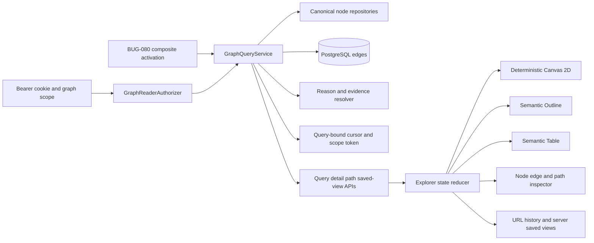

# Design: 105 Connected Knowledge Graph Explorer

## Design Brief

### Current State

Smackerel already stores artifacts, topics, people, synthesized concepts,
knowledge entities, and 622,000 measured relationships in PostgreSQL. The
canonical records live in `artifacts`, `topics`, `people`,
`knowledge_concepts`, `knowledge_entities`, and `edges`; synthesis writes
concept/entity relationships into that same `edges` table. Existing spec-080
handlers expose topics, people, places, time, and one-hop cross-links, while
the PWA Wiki renders independent list/detail pages.

The public edge shape currently loses edge identity, edge type, original
direction, weight, metadata, and evidence references. It excludes concepts and
knowledge entities. The PWA has no production graph-rendering dependency or
build bundle: it uses same-origin static ES modules, a strict same-origin CSP,
an HttpOnly cookie, and a service worker that already excludes `/api/*` from
caching.

### Target State

One authorized `GraphQueryService` extends the repaired spec-080 activation
foundation and serves Browse, Graph, Outline, Table, and Path projections from
the existing PostgreSQL graph. Every query, expansion, and path is bounded,
cursor-scoped, principal-authorized, evidence-bearing, and explicit about
complete, empty, isolated-only, partial, unavailable, and limit-reached
outcomes. The service computes connected components from the returned stored
edges; a connected overview requires at least two authorized real nodes joined
by at least one stored edge.

The browser holds one normalized in-memory exploration state. A deterministic,
first-party Canvas 2D renderer and semantic Outline/Table project that exact
state; they do not fetch or interpret different graph truths. Deep links and
server-side saved views retain only opaque identifiers and preferences, then
re-query and re-authorize current records. The first route-enabled slice must
already prove bounded query plans, grant denial, typed errors, semantic parity,
real nonblank Canvas pixels, privacy clearing, and representative
keyboard/screen-reader/mobile operation.

### Patterns To Follow

- Extend `internal/api/graphapi/` and the composite activation contract defined
  by BUG-080-001; do not create a parallel API or graph service.
- Query the canonical tables and `edges` indexes directly, following
  `pgxTopicsSource`, `pgxEdgesSource`, and `KnowledgeStore` patterns.
- Preserve `auth.RequireScope("knowledge-graph:read")` and bind each request to
  `auth.UserIDFromContext` plus an explicit reader allowlist.
- Preserve same-origin DOM construction from `web/pwa/wiki_lib.js`; no HTML
  interpolation, external renderer, CDN, or client-side graph datastore.
- Preserve server-owned relationship explanations; extend the current
  `ResolveReason` boundary rather than synthesizing reasons in JavaScript.

### Patterns To Avoid

- Do not render the entire store or use a force simulation whose result changes
  by frame, timing, device, or random seed.
- Do not draw SVG, Canvas, or DOM topology that is not backed by authorized
  stored edge IDs. Decorative connectors and fallback sample networks are
  forbidden even in loading, empty, isolated-only, partial, or error states.
- Do not extend the current offset cursor for graph expansion; it is not bound
  to principal, filters, seed, depth, or stable edge ordering.
- Do not flatten explorer edges to `CrossLink`; that contract lacks the facts
  needed for path order, direction, evidence, and stable selection.
- Do not follow Wiki's generic `GET ... HTTP <status>` exception or convert a
  failed read into an empty list.
- Do not cache graph responses, labels, topology, cursors, or auth material in
  localStorage, sessionStorage, IndexedDB, CacheStorage, or the service worker.

### Resolved Decisions

- Canvas 2D is the visual renderer. It adds no production dependency and fits
  the explicitly bounded client graph.
- Layout is deterministic breadth-depth placement, not animated force settling.
- The committed PWA package is a private Playwright/TypeScript test harness and
  has no production graph dependency or production bundling path. The current
  lockfile contains only test tooling. Therefore a new graph library would
  first require a production package-source allowlist, lockfile-strict bundle,
  license review, CSP/static-asset integration, and deterministic headless
  validation. For this bounded 300-node/600-edge contract, the smaller
  source-locked choice is reviewed first-party Canvas/layout ES modules with no
  downloaded or vendored runtime code.
- `GraphQueryService` returns one normalized node/edge contract for every
  projection and delegates legacy Browse adapters to the same repositories.
- Concepts and `knowledge_entity` records become public node kinds `concept`
  and `entity`; the canonical tables and edge rows remain unchanged.
- Path finding is deterministic, server-side, breadth-first, depth/visited/time
  bounded, and preserves each stored edge's original direction.
- Relationship reasons and evidence are resolved from edge type, edge metadata,
  endpoint records, and authorized artifact references only.
- Named saved views are per-user preference rows, not graph records or a second
  graph store.
- Feature activation is impossible until BUG-080-001's required Graph API
  activation and authenticated read synthetic are healthy.
- Overview, neighborhood, and path responses carry computed component truth.
  `connected` requires a component with at least two distinct nodes and one
  stored edge; complete isolated nodes yield `isolated-only`; omissions that
  could hide connectivity yield `unresolved-partial`, never a false isolated or
  connected claim.
- Migration filenames and numbers are allocated only at implementation pickup
  from the then-current migration inventory; this design reserves no number.

### Open Questions

No question blocks the single-operator MVP design. The current global graph
ownership limitation and dynamic relationship taxonomy are routed in
`## Routed Questions`.

## Purpose And Scope

This design delivers the technical foundation for a connected knowledge
explorer at `/knowledge/graph`. It covers:

- authorized bounded overview, search, neighborhood, detail, and path queries;
- normalized node, edge, reason, evidence, cursor, and completeness contracts;
- one in-memory explorer state shared by Graph, Outline, Table, Browse launch
  points, inspector, filters, and path view;
- deterministic Canvas 2D layout, hit testing, keyboard adjacency, responsive
  composition, and semantic parity;
- deep links, browser history, and per-user saved-view preferences;
- explicit activation, privacy clearing, observability, migration, rollout,
  rollback, and real-stack validation.

It does not create or mutate graph records, replace Wiki list/detail pages,
introduce another search index, persist graph payloads in the browser, or add a
second graph database. Graph edits and collaborative cursors remain outside
this capability.

## Grounded Architecture Findings

### Existing Sources Of Truth

| Node Kind | Canonical Source | Existing Useful Fields |
|---|---|---|
| `artifact` | `artifacts` | title, source, timestamps, lifecycle/relevance, detail route |
| `topic` | `topics` | name, state, momentum, capture counts |
| `person` | `people` | name, interaction count, last interaction |
| `place` | `location_clusters` plus `artifacts.location_geo` | canonical `mp:`/`ar:` IDs, label/location |
| `concept` | `knowledge_concepts` | title, summary, source artifact IDs, updated time |
| `entity` | `knowledge_entities` | name, entity type, source types, related concepts |
| relationship | `edges` | ID, source/target kind and ID, edge type, weight, metadata, created time |

`internal/pipeline/synthesis_subscriber.go` already writes
`CONCEPT_REFERENCES`, `ENTITY_MENTIONED_IN`, concept-to-concept relationship
types, `ENTITY_RELATES_TO_CONCEPT`, and `CONTRADICTS` into `edges` in the same
transaction as concept/entity updates. `internal/graph/linker.go` writes
`MENTIONS`, `BELONGS_TO`, `RELATED_TO`, and `SAME_SOURCE` edges. The explorer is
therefore a projection over one graph, not a graph-construction feature.

### Confirmed Gaps In The Current Public Contract

- `allowedSourceKinds` accepts only artifact/topic/person/place.
- `CrossLink` contains only target kind/ID/label/reason.
- `edgesListSQL` selects only destination data and discards edge type, source
  endpoint, weight, metadata, and evidence.
- the current reason mapping is based on target kind rather than stored edge
  semantics;
- list cursors carry an offset and are not bound to principal/query context;
- detail helper queries may log-and-return-empty;
- PWA validators are hand-written for v1 family DTOs and cannot validate a
  topology/path response;
- PWA navigation does not currently expose Knowledge, although the server nav
  does;
- no renderer dependency exists in the source-locked PWA package; its only Node
  dependencies are Playwright and TypeScript for tests.

### Authorization Constraint

The graph tables are operator-global and have no row owner. Per-user PASETO
authentication does not create row-level graph isolation. For the current
single-operator product, Graph queries require both:

1. `knowledge-graph:read` scope; and
2. membership in an explicit SST `knowledge_graph_api.reader_user_ids` list.

Production shared-token and bootstrap sessions cannot read the explorer. Dev
and test may use their declared test principal. A multi-user product cannot
claim private per-user graphs until canonical artifact/edge ownership exists.

## Architecture Overview



The server owns graph truth, authorization, filtering, bounds, path traversal,
reason text, and evidence. The client owns only view composition, normalized
merge/dedup, visibility over already authorized records, deterministic layout,
focus, viewport, and reversible presentation filters.

## Capability Foundation

### Foundation Contract

| Contract | Responsibility | Consumers |
|---|---|---|
| `AuthorizedGraphRead` | Explicit activated/disabled graph capability and route manifest from BUG-080-001 | Every graph endpoint and projection |
| `GraphReaderAuthorizer` | Scope plus explicit principal allowlist, no body-supplied identity | Query, detail, path, saved views, telemetry |
| `GraphNodeRepository` | Normalize canonical node kinds, labels, detail links, lifecycle, timestamps | Browse, query, path, inspector |
| `GraphEdgeRepository` | Deterministic incoming/outgoing bounded edge pages over `edges` | Query, expansion, path |
| `GraphReasonResolver` | Closed edge semantic mapping and evidence extraction | Graph/Outline/Table/Path/inspector |
| `GraphQueryService` | Overview/search/neighborhood projection, filters, limits, cursors, completeness | Browse, Graph, Outline, Table |
| `GraphPathService` | Bounded deterministic path with ordered edge reasons/evidence | Path panel and Outline |
| `GraphComponentAnalyzer` | Deterministic connected-component summaries over the exact authorized bounded node/edge set | Query outcomes, scope summary, Graph/Outline/Table parity |
| `ExplorerState` | One normalized authorized client state and pure reducer | All browser projections |
| `GraphRenderer` | Deterministic layout, Canvas draw, geometry, hit testing | Visual Graph only |
| `SemanticProjection` | Outline/Table DOM from the same state | Keyboard/screen-reader/nonvisual users |

### Extension Points

- A node adapter must provide kind, canonical ID, label, safe metadata, detail
  route, lifecycle/date fields, and authorization behavior.
- An edge reason adapter must declare direction semantics, reason code/text
  derivation, evidence extraction, and behavior when metadata is insufficient.
- A projection may transform layout or ordering but cannot fetch a different
  graph, re-rank server results as truth, or invent reasons.
- A new layout implements the pure deterministic layout contract and consumes
  the same node/edge set; it cannot change filters, focus, or path.

### Foundation-Owned Behavior

- explicit required activation and authenticated graph-reader admission;
- stable public node keys and edge IDs;
- bounded overview, expansion, continuation, and path limits;
- query-bound HMAC cursors and scope tokens;
- one error/completeness vocabulary;
- server-owned reason/evidence semantics;
- normalized deduplication and expansion ownership;
- deterministic projection parity and immediate auth-loss clearing;
- explicit connected/isolated-only/unresolved-partial component truth;
- privacy-safe observability and saved-view persistence.

## Concrete Implementations

### Browse Projection

Existing topics, people, places, time, concept, entity, and artifact details
remain available. Their adapters delegate to the same node/edge repositories
and typed outcome model, so Browse cannot call a missing route empty while Graph
calls it unavailable.

### Graph Projection

Canvas 2D draws the loaded/visible normalized state with deterministic geometry.
It provides pan, zoom, fit, reset, selection, focus, expansion, collapse, and
path highlighting. It does not own accessible relationship text.
It draws only `GraphEdgeV1` records present in `ExplorerState`; there is no SVG
or Canvas fallback topology, decorative connector, synthetic hub, or sample
network.

### Outline Projection

Nested lists and buttons expose focus, adjacency, expand/collapse, reasons,
evidence, filters, and ordered paths. A native nested-list composition is used
unless the complete ARIA tree keyboard contract is implemented; partial tree
semantics are forbidden.

### Table Projection

One semantic table/record list exposes source, relation, target, direction,
lifecycle, evidence, and bounded continuation. Sorting changes presentation
only and never changes server truth or path semantics.

### Path Projection

The server returns an ordered bounded path. Canvas highlights it; Outline and
the path panel render the identical ordered steps and evidence. No-path is
returned only after exhaustive traversal within the declared bounds. A bound,
timeout, omitted edge family, or dependency failure yields `partial`, never
`no_path`.

### Variation Axes

| Axis | Options | Foundation Ownership |
|---|---|---|
| Projection | Browse, Graph, Outline, Table, Path | Shared data/state; concrete presentation differs |
| Node kind | artifact, topic, person, place, concept, entity | Shared public taxonomy; repository adapter differs |
| Query mode | overview, search, neighborhood | Shared auth/bounds/cursor/outcome; SQL differs |
| Layout | neighborhood, radial, layered, timeline | Deterministic contract shared; coordinate function differs |
| Interaction | pointer, touch, keyboard, screen reader | Same commands and state transitions |
| Completeness | complete, true-empty, partial, limit-reached, unavailable | Server-owned and projection-invariant |
| Connectivity | empty, connected, isolated-only, unresolved-partial | Component analyzer computes; every projection reports identically |

## Public Graph Model

### Stable Node Identity

Public node keys use `<kind>:<canonical-id>`. Database kinds normalize as:

| Database Kind | Public Kind |
|---|---|
| `artifact` | `artifact` |
| `topic` | `topic` |
| `person` | `person` |
| derived place IDs | `place` |
| `concept` / `knowledge_concepts` | `concept` |
| `knowledge_entity` / `knowledge_entities` | `entity` |

The client treats the full key as identity. Labels may change without creating a
new node. A node reached through multiple edges merges once.

### `GraphNodeV1`

```json
{
  "key": "topic:01...",
  "kind": "topic",
  "id": "01...",
  "label": "Local inference",
  "detailHref": "/pwa/wiki_topics.html?id=01...",
  "lifecycleState": "active",
  "observedAt": "2026-07-23T12:00:00Z",
  "metadata": {
    "artifactCount": 12,
    "sourceClasses": ["article", "note"]
  }
}
```

`metadata` is a schema-versioned allowlist per kind. It never includes raw
artifact content, person email/phone, precise place coordinates in the overview,
or inaccessible source data. Unknown metadata keys fail response validation.

### `GraphEdgeV1`

```json
{
  "id": "edge-ulid",
  "source": {"key":"artifact:a1","kind":"artifact","id":"a1"},
  "target": {"key":"concept:c1","kind":"concept","id":"c1"},
  "kind": "CONCEPT_REFERENCES",
  "direction": "directed",
  "weight": 1.0,
  "reason": {
    "code": "artifact_supports_concept",
    "text": "This artifact supports Local inference"
  },
  "evidence": {
    "state": "available",
    "totalCount": 1,
    "items": [
      {"artifactId":"a1","title":"Quantization notes","href":"/artifact/a1"}
    ]
  },
  "createdAt": "2026-07-23T12:00:00Z"
}
```

The edge ID is always the stored `edges.id`. `direction` is `directed` for
source-to-target semantics and `undirected` only for the closed symmetric set.
Weight is informational; layout does not reinterpret it as causality.

### `GraphComponentSummaryV1`

```json
{
  "id": "sha256:content-derived-bounded-component",
  "nodeKeys": ["artifact:a1", "concept:c1"],
  "edgeIds": ["edge-ulid"],
  "nodeCount": 2,
  "edgeCount": 1,
  "connected": true
}
```

The component ID is a deterministic hash of the sorted authorized node keys and
stored edge IDs in the bounded response; it is not persisted and never replaces
canonical identity. `connected=true` requires at least two distinct nodes and
one non-fabricated stored edge between nodes in the component. A self-loop,
isolated node, decorative line, or inferred relation cannot satisfy the rule.
Summaries order by edge count descending, node count descending, then ID.

## Relationship Reason And Evidence Contract

### Closed Resolver Registry

| Stored Edge Kind | Direction | Reason Source | Evidence Source |
|---|---|---|---|
| `MENTIONS` | directed | artifact and person labels | source artifact |
| `BELONGS_TO` | directed | artifact and topic labels | source artifact |
| `RELATED_TO` | undirected | stored proximity/date or semantic relation class | both artifact endpoints |
| `SAME_SOURCE` | undirected | authorized shared source class | both artifact endpoints |
| `CONCEPT_REFERENCES` | directed | artifact and concept labels | source artifact |
| `ENTITY_MENTIONED_IN` | directed | artifact and entity labels | source artifact |
| `ENTITY_RELATES_TO_CONCEPT` | directed | non-empty `metadata.description` | bounded `metadata.artifact_ids` |
| `CROSS_SOURCE_CONNECTION` | undirected | stored insight text and concept reference | bounded `metadata.artifact_ids` |
| `CONTRADICTS` | undirected | concept label plus contradiction state; raw claims omitted | the two artifact endpoints |

Other concept relationship types are accepted only when metadata contains a
non-empty `description`, bounded authorized `artifact_ids`, and a declared
direction mapping. Otherwise the edge is omitted and the response is `partial`
with code `unsupported_edge_semantics`; the client never humanizes an arbitrary
edge type into an explanation.

Hospitality-only `guest` and `property` node kinds are excluded from this
feature's public taxonomy. Their edges do not leak through an unsupported node.

### Evidence States

| State | Meaning | UI Rule |
|---|---|---|
| `available` | One or more currently authorized supporting artifacts | Show bounded links and total count |
| `unavailable` | Stored edge is valid but no supporting artifact reference exists | Show `Evidence unavailable`; keep reason if valid |
| `redacted` | Evidence exists but caller cannot read it | Show undisclosing count only; no title or ID |
| `invalid` | Metadata claims evidence that cannot be resolved consistently | Omit edge and mark query partial |

Evidence items are ordered by metadata ordinal, then artifact creation time,
then ID. At most the configured evidence-reference limit appears; total count
remains truthful.

## Bounded Query And Cursor Contracts

### Required SST Configuration

All values are explicit in `config/smackerel.yaml`, emitted by the config
compiler, and validated at startup. No in-code fallback is permitted.

```yaml
knowledge_graph_explorer:
  overview_node_limit: 50
  overview_edge_limit: 100
  expansion_node_limit: 50
  expansion_edge_limit: 100
  client_node_limit: 300
  client_edge_limit: 600
  query_depth_max: 2
  path_depth_max: 6
  path_visited_node_max: 5000
  evidence_reference_limit: 5
  search_result_limit: 25
  query_timeout_ms: 1500
  path_timeout_ms: 1800
  cursor_ttl_seconds: 900
  response_bytes_max: 1048576
  saved_view_name_length_max: 80
```

These are explicit MVP operating limits, not hidden defaults. Values above the
configured maxima are rejected with `limit_exceeded`; they are never silently
clamped.

### Query Cursor V2

The spec-080 codec gains a versioned v2 payload for explorer queries:

```text
version
principalHash
operation
seedKey
filterHash
depth
asOf
lastWeight
lastEdgeID
issuedAt
expiresAt
```

The HMAC secret is the operator-injected generic seam repaired by BUG-080-001.
The cursor is bound to the authenticated principal, operation, seed, filters,
and depth. Continuation uses keyset ordering `(weight DESC, edge_id ASC)` and
`edges.created_at <= asOf`; inserts after the first page do not enter the
continuation. The client deduplicates stored edge IDs defensively. Expired,
cross-user, cross-query, malformed, or tampered cursors return
`invalid_cursor`.

Cursor and scope tokens are never written to logs, telemetry, saved views, or
durable client storage.

### Scope Token

Every successful query returns a signed `scopeToken` containing the principal
hash, normalized filters, as-of time, and allowed node-kind/edge-kind scope.
Path requests use this token so the server resolves the same authorized scope
without trusting client-restated filters. It carries no labels or secret.

## API Contracts

All routes are mounted atomically under the repaired `AuthorizedGraphRead`
capability, bearer middleware, `knowledge-graph:read`, and the explicit reader
allowlist.

### Unified Query

`POST /api/graph/query`

This is read-only despite POST: it accepts structured filters, creates no
record, and requires same-origin JSON. It is rate-limited by principal.

Request for overview:

```json
{
  "schemaVersion": "graph-query/v1",
  "mode": "overview",
  "filters": {
    "nodeKinds": ["topic","artifact","person","place","concept","entity"],
    "edgeKinds": [],
    "sourceClasses": [],
    "lifecycleStates": [],
    "timeRange": null,
    "minimumRelevance": null
  },
  "cursor": ""
}
```

For `neighborhood`, `seed` and `depth` are required. For `search`, `query` is
required and seed/depth are forbidden. Empty filter arrays mean no constraint
for that dimension by explicit contract; they do not select an implicit value.

Response `200`:

```json
{
  "schemaVersion": "graph-query/v1",
  "state": "true-empty",
  "scope": {
    "mode": "overview",
    "depth": 0,
    "nodeLimit": 50,
    "edgeLimit": 100,
    "asOf": "2026-07-23T12:00:00Z",
    "filters": {}
  },
  "nodes": [],
  "edges": [],
  "returnedNodeCount": 0,
  "returnedEdgeCount": 0,
  "connectionState": "empty",
  "componentCount": 0,
  "connectedComponentCount": 0,
  "isolatedNodeCount": 0,
  "components": [],
  "moreAvailable": false,
  "nextCursor": "",
  "scopeToken": "opaque",
  "omissions": []
}
```

States are `complete`, `true-empty`, `partial`, or `limit-reached`.
`limit-reached` means valid additional records exist but the configured client
session cap prevents merge; the UI offers collapse/start-new-view rather than
issuing unbounded work.

`connectionState` is orthogonal: `empty`, `connected`, `isolated-only`, or
`unresolved-partial`. `empty` is valid only with `state=true-empty`, zero nodes,
zero edges, and zero components. A complete non-empty response with no qualifying
component is `isolated-only`. A partial/limit response with no observed
qualifying component is `unresolved-partial`, because omitted edges might alter
the conclusion. A partial response may be `connected` only when at least one
qualifying component is already proven; the limitation remains visible and no
complete-coverage claim is made. Graph, Outline, Table, scope summary, and
telemetry consume these exact fields rather than recounting independently.

### Normalized Node Detail

`GET /api/graph/nodes/{kind}/{id}`

Returns one `GraphNodeV1`, safe kind-specific metadata, relationship summary,
and existing authorized detail link. Unsupported kind is 400; absent authorized
node is 404; caller without access receives 403 without existence detail.

### Bounded Path

`POST /api/graph/path`

Request:

```json
{
  "schemaVersion": "graph-path/v1",
  "from": {"kind":"topic","id":"t1"},
  "to": {"kind":"person","id":"p1"},
  "scopeToken": "opaque",
  "maxDepth": 6
}
```

Response `200`:

```json
{
  "schemaVersion": "graph-path/v1",
  "state": "found",
  "fromKey": "topic:t1",
  "toKey": "person:p1",
  "steps": [
    {"ordinal":1,"fromKey":"topic:t1","edge":{},"toKey":"artifact:a1"}
  ],
  "visitedNodeCount": 42,
  "depth": 2,
  "omissions": []
}
```

States are `found`, `no-path`, and `partial`. `no-path` requires exhaustive
completion inside the signed scope. Depth/visited/time/response limits,
unsupported edge semantics, or store failure return `partial` with a typed
omission. Endpoint identity and scope are re-authorized before traversal.

### Saved Views

- `GET /api/graph/saved-views`
- `POST /api/graph/saved-views`
- `PUT /api/graph/saved-views/{id}`
- `DELETE /api/graph/saved-views/{id}`

Read requires `knowledge-graph:read`; mutations additionally require
`knowledge-graph:views` and browser CSRF protection. The server derives
`actor_user_id`. Create/update accepts name, seed/focus IDs, projection, layout,
filters, and optional path endpoints. It rejects labels, graph payloads,
cursors, scope tokens, viewport coordinates, and credentials. Writes use
optimistic `version`; stale version returns 409.

### Client Observation

`POST /api/graph/client-observations`

Bounded schema:

```json
{
  "schemaVersion":"graph-client-observation/v1",
  "operation":"initial-settle",
  "renderer":"canvas2d",
  "outcome":"complete",
  "durationMs":84,
  "nodeCount":50,
  "edgeCount":82,
  "viewportClass":"desktop"
}
```

Allowed operations/outcomes/viewports are closed enums. No IDs, labels, query,
filters, URL, path, evidence, or user value is accepted or persisted. The
handler updates bounded Prometheus metrics only.

### Error Envelope

The spec-080 error envelope is extended with:

| Code | HTTP | Meaning |
|---|---:|---|
| `capability_disabled` | 503 | Explicit policy disabled |
| `store_unavailable` | 503 | Canonical graph read failed |
| `schema_error` | 500 | Stored/response invariant failed |
| `unsupported_edge_semantics` | 200 partial or 500 when required | Edge cannot produce truthful reason/evidence |
| `limit_exceeded` | 400 | Requested bound above SST maximum |
| `query_timed_out` | 200 partial or 503 before useful data | Bounded query deadline reached |
| `invalid_scope_token` | 400 | Path/query scope absent, expired, mismatched, or tampered |
| `saved_view_conflict` | 409 | Optimistic version mismatch |

Unauthorized remains 401/403; resource not found remains 404. Failed reads are
never successful empty responses.

## Query Algorithms

### Bounded Overview

Overview does not compute degree over all 622,000 edges. It selects a fixed
configured quota of candidate seeds from existing meaningful fields in each
requested node kind:

- topics by momentum/capture count then ID;
- concepts by updated time/source-artifact count then ID;
- entities/people by interaction count then ID;
- artifacts by relevance/updated time then ID;
- places by artifact count then canonical ID.

For each candidate seed, the server loads a bounded incident-edge page through
the same indexed edge repository and admits an edge only with both authorized
real endpoints. The node and edge budgets are consumed together, so the
overview assembles real topology rather than selecting unrelated nodes first
and hoping an internal edge exists. Candidate/edge order is deterministic;
unfilled budget may include real isolated nodes only after qualifying connected
components are retained.

`GraphComponentAnalyzer` then runs deterministic union-find (or equivalent
linear traversal) over the exact bounded node keys and stored edge endpoints.
It emits component summaries, connected-component count, and isolated-node
count in O(V+E). Unsupported, unauthorized, or unresolved endpoints are omitted
before analysis and force `partial`; they are never bridged. Every quota is
derived from the explicit overall limit and requested kind count. No random
sample, fabricated hub, inferred edge, or synthetic connector is allowed.

### Neighborhood Expansion

For each BFS depth, one batched SQL query reads outgoing and incoming edges for
the current frontier using the composite indexes below. Results order by depth,
weight descending, edge ID ascending. Node labels are batch-resolved by kind.
Unsupported or unauthorized endpoints are omitted with explicit completeness.

The client tracks `introducedByExpansion` sets and reference counts. Collapse
removes only nodes/edges introduced solely through that expansion; shared nodes,
focused nodes, and path endpoints remain. A failed expansion changes only its
branch state.

### Path Resolution

The service uses deterministic bidirectional breadth-first search in Go with
one batched edge query per frontier layer. Traversal may move across either end
for discoverability, while each returned step preserves stored direction.
Neighbors sort by edge ID after weight so equal-length path selection is stable.
The algorithm stops on configured depth, visited-node, timeout, response-byte,
or cancellation bounds and returns partial rather than false no-path.

## Data Model And Migration

### No New Graph Store

No node or relationship is copied into another table. Existing graph rows remain
authoritative. One additive logical migration adds only query indexes and
saved-view preferences. Its numeric filename is allocated by the implementation
owner from the then-current migration inventory; this design reserves no
number.

### Query Indexes

```sql
CREATE INDEX IF NOT EXISTS idx_edges_src_query
    ON edges (src_type, src_id, edge_type, weight DESC, id);
CREATE INDEX IF NOT EXISTS idx_edges_dst_query
    ON edges (dst_type, dst_id, edge_type, weight DESC, id);
CREATE INDEX IF NOT EXISTS idx_topics_name_trgm
    ON topics USING gin (name gin_trgm_ops);
CREATE INDEX IF NOT EXISTS idx_people_name_trgm
    ON people USING gin (name gin_trgm_ops);
CREATE INDEX IF NOT EXISTS idx_artifacts_location_name_trgm
    ON artifacts USING gin ((location_geo->>'name') gin_trgm_ops)
    WHERE location_geo IS NOT NULL AND location_geo ? 'name';
```

Concept/entity/artifact title trigram indexes already exist. Query plans must
show index use for representative high-degree expansion/path fixtures before
rollout.

### Saved View Preferences

```sql
CREATE TABLE graph_saved_views (
    id              UUID PRIMARY KEY,
    actor_user_id   TEXT NOT NULL REFERENCES auth_users(user_id) ON DELETE CASCADE,
    name            TEXT NOT NULL,
    state_version   TEXT NOT NULL CHECK (state_version = 'graph-view/v1'),
    seed_kind       TEXT NOT NULL CHECK (seed_kind IN
                    ('artifact','topic','person','place','concept','entity')),
    seed_id         TEXT NOT NULL,
    focus_kind      TEXT,
    focus_id        TEXT,
    projection      TEXT NOT NULL CHECK (projection IN ('graph','outline','table')),
    layout          TEXT NOT NULL CHECK (layout IN
                    ('neighborhood','radial','layered','timeline')),
    filters         JSONB NOT NULL,
    path_start_kind TEXT,
    path_start_id   TEXT,
    path_end_kind   TEXT,
    path_end_id     TEXT,
    version         INTEGER NOT NULL CHECK (version >= 1),
    created_at      TIMESTAMPTZ NOT NULL,
    updated_at      TIMESTAMPTZ NOT NULL,
    UNIQUE (actor_user_id, name),
    CHECK ((focus_kind IS NULL AND focus_id IS NULL)
        OR (focus_kind IS NOT NULL AND focus_id IS NOT NULL)),
    CHECK ((path_start_kind IS NULL AND path_start_id IS NULL
            AND path_end_kind IS NULL AND path_end_id IS NULL)
        OR (path_start_kind IS NOT NULL AND path_start_id IS NOT NULL
            AND path_end_kind IS NOT NULL AND path_end_id IS NOT NULL))
);
CREATE INDEX graph_saved_views_actor_updated_idx
    ON graph_saved_views (actor_user_id, updated_at DESC, id);
```

Application validation enforces allowed kind enums, JSON filter schema, name
length, and path endpoint distinction before insert. Saved rows contain no
labels, graph data, cursor, token, or auth material.

## Client State And Data Flow

### Component Tree

```text
GraphExplorerPage
├── ProductShell / KnowledgeLocalNavigation
├── GraphSearch
├── ExplorerToolbar
│   ├── ProjectionSwitch (Graph / Outline / Table)
│   ├── LayoutControl
│   ├── FilterTrigger / ActiveFilterSummary
│   ├── HistoryControl
│   └── SavedViewControl
├── ScopeSummary / HonestStateBand
├── ProjectionRegion
│   ├── CanvasGraphProjection
│   ├── RelationshipOutlineProjection
│   └── RelationshipTableProjection
├── GraphInspector
│   ├── NodeInspector
│   ├── EdgeReasonAndEvidence
│   └── ExpansionActions
├── PathPanel
├── FilterSheet
└── OperationLiveRegion
```

### `ExplorerState`

```text
authorizationState
activationState
queryState and omissions
nodesByKey
edgesByID
adjacencyByNodeKey
expansionOwnershipByNodeKey
expandedNodeKeys
visibleNodeKeys and visibleEdgeIDs
seedKey, focusTarget
filters
projection, layout
viewport
pathEndpoints, pathResult
historyEntry
operationStates by initial/expansion/path/restore
```

The state exists in memory only. A pure reducer accepts validated server events
and user commands. Graph, Outline, Table, inspector, and path panel subscribe to
the same state object. Projection switches trigger no network read and preserve
seed, focus, filters, path, and authorization.

### Merge And Dedup

- Nodes merge by public node key; edge records merge by stored edge ID.
- A conflicting label/kind/endpoint for the same identity is `schema-error`, not
  last-write-wins.
- Existing geometry remains pinned during expansion.
- Filter changes recompute visibility without deleting loaded records.
- A new seed is an explicit state replacement; search-to-focus does not replace
  the loaded graph unless the user chooses Start new view.

## Deterministic Renderer And Semantic Projection

### Renderer Contract

`CanvasGraphRenderer` is a thin imperative adapter over pure functions:

1. `deriveVisibleGraph(state)` returns sorted visible nodes/edges.
2. `layoutGraph(graph, layout, priorGeometry)` returns finite coordinates.
3. `buildGeometry(...)` returns node bounds, edge paths, labels, and hit regions.
4. `drawGraph(ctx, geometry, theme, dpr)` draws one frame.
5. `hitTest(geometry, x, y)` returns a stable node/edge identity.

No step reads time, randomness, DOM order, network state, or device dimensions
other than the explicit viewport input.

### Stable Ordering And Layout

Nodes sort by BFS depth, public kind rank, normalized label, then key. Edges sort
by source key, target key, kind, then ID.

- `neighborhood`: seed at origin; each depth occupies a ring; stable hash of
  node key selects a slot; deterministic collision resolution advances slots.
- `radial`: focused node at origin; first-hop groups occupy type sectors;
  subsequent nodes use stable slots within their parent sector.
- `layered`: BFS depth is x-layer; kind rank and stable key order determine y.
- `timeline`: timestamp is x; public kind lane is y. It is available only when
  all visible nodes used by the layout carry a meaningful timestamp.

Expansion retains all prior coordinates and places new nodes in deterministic
free slots around the expanded node. A full relayout occurs only from an
explicit layout/reset command. Reduced motion draws settled positions in one
frame; normal mode may interpolate only between known old/new coordinates and
never uses force settling.

### Canvas Sizing And Hit Testing

`ResizeObserver` supplies CSS bounds. Backing dimensions equal CSS dimensions
times `devicePixelRatio`; the transform maps drawing and pointer coordinates
consistently. Geometry is recomputed after resize/DPR change before the settled
marker is emitted. Node hit regions are at least 44 CSS pixels under coarse
pointer input without inflating visual meaning.

The canvas exposes `data-render-state="settled"`, node/edge counts, and a
content-free layout hash after one complete frame. It does not expose labels or
IDs in telemetry attributes. Semantic projections carry the authorized text.

### Semantic Equivalence

Outline and Table derive from `deriveVisibleGraph(state)`. Their node/edge ID
sets, reasons, evidence state, focus, filters, and path must equal Canvas state.
Keyboard adjacency uses `adjacencyByNodeKey`, not geometric arrow direction.
Every Canvas command has an Outline/Table command with identical reducer event.

## Deep Links, History, And Saved Views

Canonical URL:

```text
/knowledge/graph?view=graph&layout=neighborhood&seed=topic:<id>&focus=artifact:<id>&nodeKind=topic&nodeKind=artifact&pathFrom=topic:<id>&pathTo=person:<id>
```

Only public enum values and opaque canonical IDs are allowed. Labels, evidence,
query text, cursors, scope tokens, graph payload, auth material, and viewport
coordinates are excluded. On restore, the browser sends a fresh query; the
server re-authorizes every node/edge. Missing or unauthorized IDs are omitted
without echoing prior labels.

Focus/filter/projection/layout/path changes use `history.pushState`; pan/zoom
uses `replaceState` at a bounded cadence and stores no graph payload. Browser
Back/Forward rebuilds from URL plus fresh authorized reads. Server saved views
round-trip through their API and follow the same restore path.

## Activation, Navigation, And PWA Integration

- `knowledge_graph_explorer.activation` is explicit `required|disabled` SST and
  has no fallback.
- Required activation depends on BUG-080-001 reporting the complete Graph API
  available. Invalid query limits, reader allowlist, cursor secret, route
  manifest, or store initialization fail startup before serving.
- Disabled mode keeps `/knowledge/graph` in the product shell only as an
  explanatory unavailable state when product policy requires discoverability;
  it never renders an inert canvas.
- `/knowledge/graph` is registered behind `webAuthMiddleware` and serves the
  PWA explorer shell without redirecting to a generic not-found page.
- Both `internal/web/appshell.go` and `web/pwa/lib/appnav.js` gain the shared
  `knowledge` destination. Wiki/detail pages gain `Explore connections` links.
- Service-worker static asset inventory includes explorer HTML/CSS/JS modules
  under a new cache version. `/api/*` remains network-only.
- CSP remains `default-src 'self'; script-src 'self'; connect-src 'self';
  object-src 'none'`; no worker, renderer, font, telemetry, or asset origin is
  added. If a same-origin layout worker is later used, `worker-src 'self'` must
  be explicit and source-locked in the same change.

## UI State Composition

| State | Data Rule | Projection Rule | Recovery |
|---|---|---|---|
| `loading` | No unverified records | Stable shell; no sample pixels/labels | Await bounded query |
| `complete` | Authorized valid response | All projections available | Normal actions |
| `true-empty` | Successful complete zero-node response | No canvas topology; Capture/source guidance | No Retry |
| `filtered-empty` | Loaded records exist, visibility is zero | Keep loaded count; name filters | Clear filters |
| `isolated-only` | One or more authorized nodes, zero qualifying stored edges in a complete response | Render real nodes and detail; no connected-overview claim | Change filters/open detail |
| `partial` | Verified subset plus explicit omissions | Render subset and limitation in all projections | Retry omitted operation |
| `limit-reached` | Additional records exist beyond client cap | Keep graph; no hidden expansion | Collapse/start new view |
| `unavailable` | Store/activation/query failure before useful result | No empty claim | Retry/return to Knowledge |
| `render-unavailable` | Data valid, Canvas draw failed | Outline/Table retain same state | Open semantic projection |
| `unauthorized` | Session/scope/allowlist failed | Clear all personal state and pixels first | Sign in/safe return |
| `not-found` | Requested seed absent after authorized lookup | No prior label echo | Choose seed/return |

An expansion failure is branch-local. The existing graph, filters, viewport,
focus, and semantic projections remain operable. Auth loss is the only state
that forcibly clears all loaded personal graph data.

## Privacy Clearing Contract

`clearAuthorizedGraphState()` is one synchronous reducer command invoked before
the unauthorized view is committed. It:

1. aborts query/path/detail controllers;
2. clears node/edge/adjacency/expansion/path maps;
3. clears focus, seed, filter result labels, inspector, history restoration
   payload, and pending announcements;
4. removes Outline/Table/inspector DOM records;
5. resets canvas width/height, clears all pixels, and discards geometry/hit maps;
6. replaces the URL with a safe graph entry lacking IDs;
7. renders the re-authentication/access state and focuses its heading once.

The operation completes in the same task before any unauthorized-state paint.
No prior label, count, reason, topology pixel, accessible node, or saved-view
name remains observable.

## Security And Privacy

- Production graph reads require a per-user PASETO session, graph scope, and
  explicit reader allowlist membership.
- Query/path principals are context-derived; request bodies cannot choose actor.
- Scope/cursor tokens are HMAC-authenticated, short-lived, and principal-bound.
- Saved views contain identifiers/preferences only and are claim-bound.
- API responses set private/no-store caching headers; the service worker never
  handles them.
- Node detail allowlists exclude person contact fields and raw artifact content.
- Evidence links re-check artifact authorization on navigation.
- Search/query strings, labels, graph IDs, people/place names, source titles,
  reasons, and evidence never enter logs, metrics, traces, or client telemetry.
- External URL schemes are rejected; all detail/evidence links are same-origin
  routes constructed by the server.
- Query/path/client-observation endpoints have bounded per-principal rate limits.

## Performance And Scale Design

### First Enabled Slice Gate

`/knowledge/graph` cannot be activated for any user after merely landing an API
or renderer. The first enabled vertical slice includes one real bounded
overview end to end and must prove all of the following together:

- representative `EXPLAIN (ANALYZE, BUFFERS)` plans use the declared edge/node
  indexes for low-degree, high-degree, isolated-only, and connected fixtures;
- hard node/edge/hop/byte/time bounds and continuation are visible and cannot
  be bypassed by request values;
- one allowed reader succeeds while missing scope, absent grant, cross-user
  cursor/scope token, and revoked grant fail without labels/counts/existence;
- complete connected, complete isolated-only, and unresolved-partial outcomes
  are exclusive and derived from computed components;
- Graph, Outline, and Table expose identical IDs, edges, components, counts,
  focus, reasons, and filters from one state;
- keyboard expansion/focus and screen-reader Outline operation complete the
  same user goal as pointer Graph interaction;
- the 320px/200%-zoom composition keeps controls and focused content operable;
- settled Canvas pixels prove a real nonblank component, and auth loss clears
  pixels, semantic DOM, history state, and pending work before denial paints;
- typed store/schema/timeout/render failures preserve or clear state according
  to the contract and never render sample topology.

Later slices broaden path, saved-view, layout, and scale coverage but do not
introduce these obligations for the first time.

### Server Budgets

| Operation | Bound | P95 Budget |
|---|---|---:|
| Initial overview | 50 nodes / 100 edges / 1 MiB | 1.5 s server, interactive within 2 s |
| Expansion page | 50 new nodes / 100 edges | 1.5 s, visible outcome within 2 s |
| Search | 25 typed results | 500 ms |
| Node detail | one normalized record | 200 ms |
| Path | depth 6 / 5,000 visited / 1.8 s | result or typed partial within 2 s |

Every SQL statement uses request cancellation and a deadline no larger than its
operation budget. Response serialization aborts before the configured byte cap
and returns typed partial/limit state rather than truncating JSON.

### Client Budgets

- At most 300 nodes and 600 edges reside in one explorer session.
- Layout and geometry are O(V+E) over the bounded visible graph.
- Focus, selection, filter, pan, zoom, and panel open/close settle within 100 ms
  P95 after data is available.
- Label density may decrease while panning, but focused/path labels remain.
- Off-viewport Canvas geometry may be culled; semantic projections still report
  the complete loaded/visible counts.
- Repeated expansion at the client cap is refused visibly; no memory-growth
  fallback or background full-graph fetch exists.

## Observability And Failure Handling

### Validate-Plane Trace Contract

Before the first enabled, stress, or readiness scope executes, planning must
declare the capability workflow `graph.explorer`. The project-owned trace
contract resolves only to validate-plane Prometheus/trace adapters and covers
`graph.authorize`, `graph.query.plan`, `graph.nodes.fetch`, `graph.edges.fetch`,
`graph.components.compute`, `graph.reasons.resolve`, `graph.path.layer`,
`graph.serialize`, and `graph.client.settle`. Attributes are limited to
operation, outcome/code, declared bounds, returned counts, component counts,
visited depth/count, renderer/projection, viewport class, and duration. IDs,
labels, search text, filters, source names, evidence, cursor/scope tokens, and
principal values are forbidden.

SLO evidence separates server query/path latency from client meaningful-settle
latency and treats true-empty, isolated-only, and exhaustive no-path as valid
business outcomes. Stress/readiness acceptance captures validate-plane trace
and SLO artifacts and passes G080/G100 before claims. Operate-plane telemetry is
read-only and never supplies feature acceptance data.

### Server Metrics

- `smackerel_graph_query_total{operation,outcome,code}`
- `smackerel_graph_query_duration_seconds{operation,outcome}`
- `smackerel_graph_query_result_nodes{operation}`
- `smackerel_graph_query_result_edges{operation}`
- `smackerel_graph_query_partial_total{operation,reason}`
- `smackerel_graph_path_visited_nodes{outcome}`
- `smackerel_graph_cursor_rejections_total{reason}`

Labels are closed low-cardinality enums. IDs, kinds selected by a user, search
text, labels, source names, filters, and evidence do not become metric labels.

### Client Metrics

The observation endpoint records settle duration, bounded counts, renderer,
viewport class, operation, and outcome. It rejects unknown keys. Render errors
increment `smackerel_graph_client_render_total{renderer,outcome}` and preserve
Outline/Table as the operational fallback.

### Logs And Traces

Spans cover authorization, query planning, node/edge fetch, reason/evidence
resolution, path layers, serialization, and client settle receipt. Logs carry
request ID, operation enum, bounds, counts, duration, completeness, and safe
code. They exclude all graph content and tokens.

### Failure Containment

- Initial required read failure yields unavailable, not empty.
- Branch expansion failure retains all prior authorized state.
- Evidence failure omits only the invalid edge and marks partial.
- Path limit/timeout yields partial with endpoints retained for Retry.
- Canvas failure switches to Outline/Table without another graph fetch.
- Authorization failure clears all projections synchronously.

## Authorization Matrix

| Endpoint | Allowed Graph Reader | Operator Reader | Other Authenticated User | Public |
|---|---:|---:|---:|---:|
| `POST /api/graph/query` | Yes | Yes | 403, no existence detail | 401 |
| `GET /api/graph/nodes/{kind}/{id}` | Yes | Yes | 403 | 401 |
| `POST /api/graph/path` | Yes | Yes | 403 | 401 |
| `GET /api/graph/saved-views` | Own rows | Own rows | Own rows only if graph reader | 401 |
| Saved-view mutations | Own rows plus `knowledge-graph:views` | Own rows | 403 without scope | 401 |
| Client observations | Yes, content-free schema | Yes | 403 | 401 |
| `/knowledge/graph` shell | Authenticated allowed reader | Yes | Unavailable/access state | Login |

The current graph is global within the explicit reader allowlist. The matrix
does not claim row-level per-user graph ownership.

## Technical BDD Scenarios

```gherkin
Scenario: SCN-105-001 Open a real bounded graph
  Given BUG-080 activation is required and healthy
  And the authenticated allowlisted reader has stored nodes and edges
  When POST /api/graph/query runs in overview mode
  Then the response contains at most 50 nodes and 100 stored edges
  And every node and edge resolves from the canonical PostgreSQL tables
  And Graph, Outline, and Table contain the same identity sets

Scenario: SCN-105-002 Enter from a topic detail
  Given an authorized topic detail is open
  When Explore connections opens /knowledge/graph with that topic key
  Then a neighborhood query re-authorizes the topic
  And the topic becomes seed and focus
  And browser Back and Forward restore it through a fresh query

Scenario: SCN-105-003 Expand without losing orientation
  Given a settled graph has stored geometry and an expandable focus
  When a depth-1 neighborhood query succeeds
  Then nodes and edges merge by canonical identity without duplicates
  And existing coordinates, focus, filters, and viewport remain unchanged
  And new coordinates are deterministic for the response identity set

Scenario: SCN-105-004 Expansion failure preserves the graph
  Given a useful authorized graph is settled
  When the real expansion dependency returns a typed failure
  Then only that expansion records failure and Retry
  And prior node, edge, geometry, focus, filter, and semantic state remains

Scenario: SCN-105-005 Filtered empty differs from no data
  Given loaded authorized nodes exist
  When a client visibility filter matches zero nodes
  Then loaded count remains nonzero and visible count is zero
  And every projection names the active filters and offers Clear filters

Scenario: SCN-105-006 Explain a multi-step path
  Given two endpoints have a stored bounded path
  When POST /api/graph/path runs with their signed scope token
  Then every ordered step carries stored edge ID, endpoints, direction, reason, and evidence state
  And focusing a step selects the same edge in every projection

Scenario: SCN-105-007 Distinguish no path from partial failure
  Given path traversal exhausts its authorized scope without a match
  When traversal completes inside every bound
  Then state is no-path
  When traversal hits a timeout, visit limit, unsupported edge, or dependency failure
  Then state is partial and no-path is absent

Scenario: SCN-105-008 Keyboard-equivalent exploration
  Given the loaded graph has semantic adjacency
  When a keyboard user focuses a neighbor, expands, filters, fits, and opens detail
  Then reducer outcomes equal pointer outcomes
  And focus never depends on canvas coordinates

Scenario: SCN-105-009 Screen-reader relationship outline
  Given Graph shows a focused node with three edges and a selected path
  When Outline renders from ExplorerState
  Then its node/edge IDs, reasons, evidence, filters, focus, and path equal Graph state
  And all actions are native buttons/links in semantic order

Scenario: SCN-105-010 Mobile controls do not occlude the graph
  Given a 320 CSS pixel coarse-pointer viewport
  When the user pans, zooms, selects, filters, inspects, and closes a sheet
  Then every primary target is at least 44 CSS pixels
  And no sheet overlaps the focused-node visibility region or graph controls
  And closing restores focus and context

Scenario: SCN-105-011 Auth failure is not an empty graph
  Given personal labels and topology are visible
  When the next real read rejects the session or scope
  Then clearAuthorizedGraphState runs before the auth view paints
  And prior labels, semantic rows, geometry, hit maps, and non-background pixels are absent

Scenario: SCN-105-012 First-use empty state is actionable
  Given every required graph read succeeds with zero authorized nodes
  When the explorer settles
  Then state is true-empty with Capture and source guidance
  And no sample node, fake edge, Retry, or unavailable state appears

Scenario: SCN-105-013 Restore only current authorized state
  Given a deep link or saved view names seed, focus, filters, and path endpoints
  When the explorer restores it
  Then the server re-authorizes every identifier through fresh query/path calls
  And removed or unauthorized records are omitted without prior labels

Scenario: SCN-105-014 Connected overview meets a real-edge minimum
  Given the bounded authorized response contains isolated nodes and one stored edge joining two distinct nodes
  When GraphComponentAnalyzer computes components
  Then connectionState is connected and at least one component reports two nodes and one stored edge
  And Graph Outline and Table expose that same component identity set
  And no synthetic or decorative edge exists

Scenario: SCN-105-015 Isolated-only and partial connectivity remain honest
  Given authorized nodes exist without any returned stored edge
  When the complete query settles
  Then connectionState is isolated-only and no connected overview is drawn
  When an omitted or failed edge read could change connectivity
  Then connectionState is unresolved-partial instead
  And isolated-only and connected claims are absent

Scenario: SCN-105-016 Graph Outline and Table are semantically equivalent
  Given one bounded state includes components focus filters and a selected path
  When the user switches projection
  Then every projection exposes identical authorized node IDs edge IDs component summaries directions reasons path order filters and counts
  And Canvas render failure leaves Outline and Table operable without another graph fetch
```

## Scenario-To-Test Mapping

| Scenario | Test Type | Planned Location | Primary Assertion |
|---|---|---|---|
| SCN-105-001 | Integration, E2E API, E2E UI, stress | `tests/integration/graphapi/`, `tests/e2e/graph_explorer_e2e_test.go`, `web/pwa/tests/graph-explorer.spec.ts` | Real bounded IDs and projection parity; P95 initial budget |
| SCN-105-002 | E2E UI | `web/pwa/tests/graph-explorer.spec.ts` | Topic seed/focus and Back/Forward fresh restore |
| SCN-105-003 | Unit, E2E UI | `web/pwa/tests/graph_layout_test.go`, Playwright feature file | Stable geometry and duplicate-free expansion |
| SCN-105-004 | Integration, E2E UI | live validate-stack fault fixture plus Playwright | Branch failure preserves prior state |
| SCN-105-005 | Unit, E2E UI | reducer tests plus Playwright | Loaded/visible distinction across all projections |
| SCN-105-006 | Integration, E2E API/UI | path service tests plus Playwright | Ordered reason/evidence-bearing path |
| SCN-105-007 | Integration, E2E UI | bounded path fixtures | Exhaustive no-path and partial are exclusive |
| SCN-105-008 | E2E UI | Playwright keyboard journey | No pointer use; predictable focus and real state change |
| SCN-105-009 | UI unit, E2E UI | semantic projection tests and accessibility snapshot | Identity/reason/path parity and valid semantics |
| SCN-105-010 | E2E UI | 390x844, 320x568, 820x1180 Playwright projects | Target sizes, no overlap/overflow, focus restoration |
| SCN-105-011 | E2E API/UI, security | real session expiry/scope removal fixture | DOM/accessibility/canvas privacy clear before auth state |
| SCN-105-012 | E2E API/UI | successful empty PostgreSQL fixture | Actionable true-empty and no sample topology |
| SCN-105-013 | Integration, E2E UI | saved-view/deep-link round-trip | Fresh authorization and omitted stale IDs |
| SCN-105-014 | Integration, E2E API/UI, stress | component analyzer, bounded overview, Canvas/semantic projections | At least two real nodes plus one stored edge; computed component and no fabricated topology |
| SCN-105-015 | Integration, E2E API/UI | complete isolated fixture plus edge-read fault profile | Isolated-only is complete-only; possible omitted connectivity is unresolved-partial |
| SCN-105-016 | UI unit, E2E UI | reducer/projection parity and Canvas-failure profile | Exact IDs/components/reasons/path/count parity; semantic views survive Canvas failure |

NFR-105-001 through NFR-105-004 require stress rows because they define latency
and scale SLAs. Tests execute through `./smackerel.sh` via the planning owner's
canonical commands; no direct Go/npm command is prescribed here.

## Playwright And Canvas-Pixel Validation

### Deterministic Settle Gate

Playwright waits for all of:

- API operation terminal state;
- `data-render-state="settled"`;
- semantic node/edge counts matching the response;
- two consecutive animation frames with identical layout hash;
- no pending expansion/path/restore operation.

Screenshots taken before this gate are invalid evidence.

### Nonblank Populated Canvas

For a seeded populated graph, Playwright reads canvas pixels only after settle.
It compares each pixel to the resolved canvas background and requires:

- non-background pixels above 0.5 percent of graph bounds;
- non-background pixels in at least three viewport quadrants;
- at least the seeded node count in the semantic projection;
- known seeded node keys in Outline/Table;
- successful hit tests at coordinates produced by the pure layout function.

A spinner, border, error glyph, or decorative background cannot satisfy all
conditions. A legitimate true-empty state skips nonblank assertion and instead
proves successful zero-node API plus no node/edge pixels.

### Resize And DPR

Desktop/mobile tests resize the viewport and emulate at least two DPR values.
After each change they assert backing dimensions, CSS dimensions, layout hash,
pixel distribution, and hit-target alignment. The graph remains framed and
nonblank without clipped controls.

### Privacy Pixel Clear

After real session expiry, tests assert prior labels/IDs are absent from DOM and
accessibility snapshot, then sample graph bounds and require only the configured
background/auth-state pixels. Geometry and hit tests return no prior identity.

### Projection And Accessibility Matrix

Playwright covers desktop, tablet, 390px, 320px at 200% zoom, keyboard-only,
screen reader snapshot, reduced motion, forced colors where supported, and
light/dark/system themes. Required assertions are direct; no early return,
optional locator, request interception, or URL-only success may satisfy them.

### Disposable No-Interception Fault Profiles

Each profile runs in a uniquely named disposable validate Compose project with
ephemeral PostgreSQL and the real core/web/API/PWA processes. Graph faults are
created through owned database roles, transactions, fixture topology, session
and grant APIs, process/network controls, or a render input/device condition at
the owning boundary. Browser and API clients use normal Smackerel routes;
`page.route`, `context.route`, service-worker response replacement, handler or
repository substitution, and persistent dev/operate data are forbidden.
Teardown removes the project network, tmpfs/volumes, fixture principals, saved
views, and processes on success or failure.

| Profile | Boundary manipulation | Required observation |
|---|---|---|
| `graph-connected-bounded` | Seed at least two authorized real nodes plus one stored edge and additional isolated/high-degree nodes. | Computed connected component, exposed bounds/continuation, deterministic nonblank Canvas pixels, exact Outline/Table parity. |
| `graph-isolated-only` | Seed real authorized nodes and zero stored edges in a successful complete read. | `isolated-only`, real count, no edge pixels/SVG/decorative line, useful detail actions. |
| `graph-edge-read-partial` | Revoke the disposable DB role's permitted edge read or cancel the edge query after node resolution. | `unresolved-partial`, no false isolated/no-data/connected claim, typed Retry, no fabricated line. |
| `graph-expansion-timeout` | Hold a disposable transaction/statement beyond the explicit expansion deadline. | Branch-local timeout; prior pixels, semantic rows, focus, filters, and viewport remain. |
| `graph-grant-revoked` | Revoke the real fixture principal's Graph grant between settled state and the next read. | Synchronous pixel/DOM/history/background-work clear before access denial; no labels/counts remain. |
| `graph-cursor-scope-adversary` | Replay/tamper/cross-principal cursor and scope tokens through the real API. | Typed invalid-token denial with no existence or topology detail. |
| `graph-canvas-render-failure` | Supply a validated browser/device render condition that makes Canvas context/dimensions unusable without altering API data. | `render-unavailable`; Outline/Table preserve identical state and commands; no fake SVG replacement. |
| `graph-query-plan-scale` | Seed disposable low/high-degree and bounded large topology, then capture real plans/traces under stress. | Declared indexes/budgets, bounded memory/response, deterministic continuation, validate-plane SLO/trace evidence. |

## Migration, Rollout, And Rollback

### Migration

1. Land BUG-080-001 activation/readiness repair and certify its authenticated
   family synthetic.
2. Allocate and apply the next collision-free additive migration for indexes and
  the saved-view table. No graph records move and no number is reserved here.
3. Land node/edge/reason/evidence repositories and query/path contracts behind
   required startup validation, with the explorer activation disabled.
4. Land PWA state, semantic projections, Canvas renderer, navigation, static
   cache version, and client observations.
5. Run real-stack API/UI/stress/canvas contracts against representative
   high-degree disposable data.
6. Set explorer activation `required` in the mvp train only when complete
   authenticated acceptance succeeds. No runtime feature flag or hidden
   fallback is introduced.

### Backward Compatibility

Existing Wiki routes, family API paths, artifact/topic/person/place deep links,
and server Knowledge pages remain. Additive v2 query/cursor contracts do not
reinterpret v1 list cursors. Consumer traces must update server nav, PWA nav,
Wiki launch links, service-worker assets, manifest shortcut if exposed, CSP
tests, validators, and Playwright routes together.

### Rollback

Application rollback disables the explorer explicitly and restores the prior
static asset cache version; it never re-enables a broken Graph route. Query
indexes and `graph_saved_views` remain because older binaries ignore them.
The table may be dropped only when empty and before any user view exists;
otherwise preservation is required. No rollback rebuilds or transforms graph
records.

## Alternatives And Tradeoffs

### Cytoscape.js Or Another Graph Library

Rejected for the current bounded MVP after checking the committed PWA package
surface. `web/pwa/package.json` is private test tooling with only pinned
Playwright and TypeScript development dependencies; the lockfile has no graph
or production bundle, and there is no existing source-locked production graph
asset pipeline to consume a library. Adding Cytoscape.js, d3-force, Sigma, or a
similar runtime would therefore require a separate production bundler/source
allowlist/license/CSP contract, not merely an import. Force-based libraries also
conflict with deterministic settle, pixel, focus, and reduced-motion evidence.

The chosen layouts are bounded O(V+E), domain-specific, deterministic pure
functions implemented as reviewed first-party ES modules beside the PWA. They
use no vendored/minified/downloaded runtime code, so the existing package and
lockfile remain test-only and no implicit registry is introduced. The
supply-chain source gate must confirm that invariant. If a source-locked
production JS bundle is established before implementation pickup, design review
must re-evaluate a proven deterministic layout library; implementation may not
silently vendor one.

### SVG Renderer

Rejected as the primary projection because the session bound permits hundreds
of nodes and edges, and incremental DOM geometry would compete with the required
semantic Outline/Table. Canvas keeps visual drawing separate from semantic DOM.

### WebGL Renderer

Rejected because the configured 300-node/600-edge client ceiling does not need
GPU complexity, context-loss handling, or shader assets. Canvas 2D is sufficient
and easier to validate at pixel and high-contrast boundaries.

### Client-Side Path Finding

Rejected. The loaded graph may be incomplete, and a client cannot distinguish
true no-path from unloaded/unauthorized edges. Server traversal owns truth and
bounds.

### Materialized Explorer Graph Or Search Index

Rejected. It creates a second graph truth and migration/synchronization failure
mode. Existing PostgreSQL tables and indexes are sufficient for bounded queries.

### Offset Pagination

Rejected. Expansion and path scope require principal/query binding and stable
keyset continuation. Offset cursors drift under inserts and cannot prevent
cross-query reuse.

## Complexity Tracking

| Deviation From Simpler Alternative | Simpler Alternative | Why Rejected |
|---|---|---|
| Unified query/path service | Add client calls around `/api/graph/edges` | Existing DTO loses edge semantics/evidence and cannot prove path completeness |
| Deterministic Canvas plus semantic projections | Render one SVG/network view | Scale, deterministic pixel evidence, and equivalent nonvisual actions require separate visual and semantic projections over one state |
| Query-bound cursor and scope token | Reuse offset cursor | Offset is not principal/filter/seed bound and cannot preserve bounded query semantics |
| Server saved-view preferences | Put state in localStorage or URL only | UX requires named round-trip views; client storage cannot safely become state authority |
| Explicit reader allowlist | Scope claim alone | Canonical graph is operator-global and has no row owner |

No new datastore, external service, renderer dependency, graph copy, SVG
fallback topology, or client business-data cache is introduced.

## Routed Questions

| Owner | Question | Design Constraint |
|---|---|---|
| `bubbles.analyst` / product owner | Is a later multi-user Smackerel expected to have per-user private graph ownership or an operator-shared graph with grants? | This MVP is global for an explicit reader allowlist; no row-level isolation claim is made. |
| `bubbles.analyst` | Which dynamically generated concept relationship types are product-visible beyond the closed known set? | Unknown types without stored description, direction policy, and artifact evidence remain omitted/partial, never client-humanized. |
| `bubbles.plan` | How should activation dependency, query foundation, reason/evidence, state/projections, saved views, and real-stack scale/accessibility validation be dependency-ordered? | Foundation scopes precede all projection scopes; every SCN/NFR and UX-E2E row retains a concrete test and DoD mapping. |
| `bubbles.devops` | How will mvp acceptance consume BUG-080's Graph read synthetic and the explorer's API/UI/canvas checks without querying operated personal data? | Use the validate plane and disposable seeded data only; operate-plane telemetry is read-only and content-free. |

## Superseded Design Decisions

None. This is the first `design.md` for feature 105.