# Connected Knowledge Graph Explorer - Scope Index

## Execution Outline

### Phase Order

1. **SCOPE-01 - Graph contract and query foundation (`foundation:true`)**: extend the repaired BUG-080 authorized-read capability into one bounded overview contract, a component-analyzer connectedness classification (connected requires >=2 real nodes and >=1 stored edge; otherwise an honest no-connected-overview/isolated-only outcome), and a real semantic first slice.
2. **SCOPE-02 - Bounded projection, cursor, expansion, and path API**: add principal-bound continuation, progressive expansion, truthful path outcomes, and branch-local recovery through the same state model.
3. **SCOPE-03 - Source-locked renderer and assets**: admit the deterministic Canvas renderer, lock every shipped asset, prove nonblank real topology, and forbid hand-rolled force physics.
4. **SCOPE-04 - Desktop explorer interactions**: deliver pan, zoom, fit, focus, filters, expansion, collapse, path focus, inspector, and history behavior over real graph state.
5. **SCOPE-05 - Keyboard, semantic projections, and accessibility**: make Outline and Table operationally equivalent to Graph with predictable focus and announcements.
6. **SCOPE-06 - Entry points, deep links, and restoration**: connect topic, person, place, concept, entity, and artifact surfaces and re-authorize every restored identifier.
7. **SCOPE-07 - Responsive, mobile, reduced-motion, and theming**: preserve complete interaction on desktop, tablet, 390px, and 320px without overlap or motion dependence.
8. **SCOPE-08 - Privacy, security, and honest state handling**: distinguish auth, empty, filtered-empty, partial, degraded, unavailable, loading, and render failure while clearing private state synchronously.
9. **SCOPE-09 - Scale, performance, and observability**: prove bounded behavior against representative high-degree data and the declared latency, load, query-plan, and content-free telemetry budgets.
10. **SCOPE-10 - Real-stack acceptance and deployment handoff**: run the complete no-interception Playwright matrix, migration/rollback canaries, regression suite, and value-safe deployment acceptance contract.

### New Types And Signatures

- `GraphNodeV1`, `GraphEdgeV1`, `GraphEvidenceV1`, and closed graph outcome enums.
- `GraphQueryService.Query(GraphQueryV1) -> GraphQueryResultV1`.
- `GraphPathService.FindPath(GraphPathV1) -> GraphPathResultV1`.
- principal/query-bound `GraphCursorV2` and signed `scopeToken`.
- `ExplorerState` plus pure reducer commands shared by Graph, Outline, Table, inspector, filters, path, and restoration.
- deterministic `GraphRenderer` functions for visible graph derivation, layout, geometry, draw, and hit testing.
- same-origin routes `POST /api/graph/query`, `GET /api/graph/nodes/{kind}/{id}`, `POST /api/graph/path`, saved-view CRUD, and content-free client observations.
- migration `063_connected_knowledge_graph_explorer.sql` for query indexes and per-user saved-view preferences only.

### Validation Checkpoints

- **After SCOPE-01:** bounded canonical PostgreSQL reads, authorization, projection identity parity, and shared-shell/auth canaries must pass before cursor or renderer work.
- **After SCOPE-02:** expansion, cursor, path, deduplication, and branch-local failure contracts must pass against the real disposable stack before visual rendering.
- **After SCOPE-03:** source locking, asset packaging, deterministic geometry, hit testing, device-pixel-ratio sizing, and nonblank real-topology pixels must pass before desktop interaction work.
- **After every UI scope (04-08):** scenario-specific real-stack Playwright runs must use no interception and must retain direct user-visible assertions.
- **After SCOPE-09:** stress/load evidence must meet NFR-105-001 through NFR-105-004 and telemetry must remain content-free before acceptance.
- **At SCOPE-10:** the complete API/UI/accessibility/mobile/privacy/migration/rollback matrix and deployment handoff must pass without making an implementation or deployment claim in this planning packet.

## Dependency Provenance

- External blocker: `specs/080-knowledge-graph-public-api/bugs/BUG-080-001-graph-api-fail-soft-runtime-disable` must be certified `done` before SCOPE-01 pickup.
- Product dependencies retained from `state.json`: specs 080, 073, and 100.
- The dependency packet's `AuthorizedGraphRead`, route manifest, authenticated synthetic, and closed outcome vocabulary are consumed, not redefined.
- Every in-feature scope is sequentially gated; no later scope may start until every predecessor is Done.

## Dependency Graph

```mermaid
flowchart LR
  B080[BUG-080-001 certified Done] --> S01[SCOPE-01 query foundation]
  S01 --> S02[SCOPE-02 bounded expansion API]
  S02 --> S03[SCOPE-03 renderer admission]
  S03 --> S04[SCOPE-04 desktop interactions]
  S04 --> S05[SCOPE-05 keyboard and semantics]
  S05 --> S06[SCOPE-06 entry and deep links]
  S06 --> S07[SCOPE-07 responsive and motion]
  S07 --> S08[SCOPE-08 privacy and honest states]
  S08 --> S09[SCOPE-09 scale and observability]
  S09 --> S10[SCOPE-10 acceptance handoff]
```

## Scope Inventory

| # | Scope | Depends On | Surfaces | Primary Scenarios | Status |
|---|---|---|---|---|---|
| 01 | [Graph contract and query foundation](01-graph-contract-query-foundation/scope.md) | BUG-080-001 | graph API, PostgreSQL, semantic shell, auth | SCN-105-001, 014, 015 | Not Started |
| 02 | [Bounded projection, cursor, expansion, and path API](02-bounded-projection-cursor-expansion-api/scope.md) | SCOPE-01 | graph API, reducer, Outline controls | SCN-105-006 | Not Started |
| 03 | [Source-locked renderer and assets](03-source-locked-renderer-assets/scope.md) | SCOPE-02 | Canvas, geometry, assets, source lock | SCN-105-003 | Not Started |
| 04 | [Desktop explorer interactions](04-desktop-explorer-interactions/scope.md) | SCOPE-03 | desktop Graph, filters, inspector, history | SCN-105-005 | Not Started |
| 05 | [Keyboard, semantic projections, and accessibility](05-keyboard-semantic-accessibility/scope.md) | SCOPE-04 | Graph, Outline, Table, a11y | SCN-105-008, 009, 016 | Not Started |
| 06 | [Entry points, deep links, and restoration](06-entry-deep-links/scope.md) | SCOPE-05 | Wiki/detail routes, navigation, URL/history | SCN-105-002, 013 | Not Started |
| 07 | [Responsive, mobile, reduced-motion, and theming](07-responsive-mobile-motion-theming/scope.md) | SCOPE-06 | desktop/tablet/mobile/themes | SCN-105-010 | Not Started |
| 08 | [Privacy, security, and honest states](08-privacy-security-honest-states/scope.md) | SCOPE-07 | auth, privacy clear, failure/empty states | SCN-105-004, 011 | Not Started |
| 09 | [Scale, performance, and observability](09-scale-performance-observability/scope.md) | SCOPE-08 | query plans, stress/load, metrics/traces | SCN-105-007; NFR-105-001..004 | Not Started |
| 10 | [Real-stack acceptance and deployment handoff](10-real-stack-acceptance-handoff/scope.md) | SCOPE-09 | full stack, Playwright, migration/rollback, handoff | SCN-105-012; acceptance rerun SCN-105-001..013 | Not Started |

## Scenario And Test Contract

Each of the 16 specification scenarios has one concrete `unit`, `integration`,
`e2e-api`, and `e2e-ui` row in its owning scope and in `test-plan.json`.
That produces 64 scenario rows and exactly 64 matching unchecked DoD test
items before supplemental source-lock, canary, security, migration, stress,
load, observability, and acceptance rows are counted.

| Scenario | Owning Scope | Unit | Integration | E2E API | E2E UI |
|---|---|---|---|---|---|
| SCN-105-001 | SCOPE-01 | T105-001-U | T105-001-I | T105-001-A | T105-001-W |
| SCN-105-002 | SCOPE-06 | T105-002-U | T105-002-I | T105-002-A | T105-002-W |
| SCN-105-003 | SCOPE-03 | T105-003-U | T105-003-I | T105-003-A | T105-003-W |
| SCN-105-004 | SCOPE-08 | T105-004-U | T105-004-I | T105-004-A | T105-004-W |
| SCN-105-005 | SCOPE-04 | T105-005-U | T105-005-I | T105-005-A | T105-005-W |
| SCN-105-006 | SCOPE-02 | T105-006-U | T105-006-I | T105-006-A | T105-006-W |
| SCN-105-007 | SCOPE-09 | T105-007-U | T105-007-I | T105-007-A | T105-007-W |
| SCN-105-008 | SCOPE-05 | T105-008-U | T105-008-I | T105-008-A | T105-008-W |
| SCN-105-009 | SCOPE-05 | T105-009-U | T105-009-I | T105-009-A | T105-009-W |
| SCN-105-010 | SCOPE-07 | T105-010-U | T105-010-I | T105-010-A | T105-010-W |
| SCN-105-011 | SCOPE-08 | T105-011-U | T105-011-I | T105-011-A | T105-011-W |
| SCN-105-012 | SCOPE-10 | T105-012-U | T105-012-I | T105-012-A | T105-012-W |
| SCN-105-013 | SCOPE-06 | T105-013-U | T105-013-I | T105-013-A | T105-013-W |
| SCN-105-014 | SCOPE-01 | T105-014-U | T105-014-I | T105-014-A | T105-014-W |
| SCN-105-015 | SCOPE-01 | T105-015-U | T105-015-I | T105-015-A | T105-015-W |
| SCN-105-016 | SCOPE-05 | T105-016-U | T105-016-I | T105-016-A | T105-016-W |

## Global Live-Test Rules

- `e2e-api` and `e2e-ui` use the real disposable Compose stack, seeded PostgreSQL, real authentication, and real product routes.
- Playwright must not call `page.route`, `context.route`, `route.fulfill`, MSW, Nock, or any response interception.
- Populated graph assertions combine known authorized identity sets, semantic counts, renderer settled state, and Canvas/SVG pixel or geometry evidence; element existence alone cannot pass.
- First-use empty skips the nonblank topology assertion only after a successful real zero-node response and proves that no sample node or fake edge is present.
- No test may use conditional early return, optional locator assertion, URL-only success, canned topology, or assertions that merely echo fixture input.
- Every mutation test uses disposable state and verifies write then read. Graph records are read-only; saved-view preference writes are claim-bound and round-trip verified.
- Validate-plane telemetry uses `env=test*`; operate-plane telemetry and personal graph content remain read-only and content-free.

## Impact And Observability Planning

- `.github/bubbles-project.yaml` defines no `testImpact` map, so no G079 path-derived reduction is claimed.
- Observability posture is `wired`, but the only registered workflow is `core.health`. Graph rows therefore test the design's graph metrics/traces directly and do not misuse `observabilityWorkflow: core.health` or fabricate a graph G080/G100 contract.
- Implementation must add a project-owned graph workflow/SLO contract before any graph row is tagged as instrumented; that config change belongs to the implementation/observability owner, not this planning packet.

## Shared Infrastructure Impact Sweep

- Protected surfaces: BUG-080 `AuthorizedGraphRead`, auth/session hydration, graph reader allowlist, cursor-secret boundary, PostgreSQL test bootstrap, PWA shell/navigation, service worker static cache, and disposable E2E harness.
- Independent canaries: Graph family synthetic remains green, non-Graph authenticated shell navigation remains green, session expiry clears graph state, service worker never caches `/api/*`, and existing Wiki detail routes remain usable.
- Rollback: source/config pointer rollback preserves graph records; migration indexes and nonempty saved views are preserved; disabling the explorer is explicit and may not restore warning-and-nil Graph activation.

## Planning Uncertainty Declaration

All scope DoD items remain unchecked because implementation, tests, migration,
browser verification, and deployment acceptance were not executed by the
planning owner. The exact renderer dependency decision is constrained by the
active design: deterministic Canvas uses no force simulation. If implementation
introduces graph physics, it must first use a proven source-locked library and
obtain design reconciliation; hand-rolled force physics is prohibited.