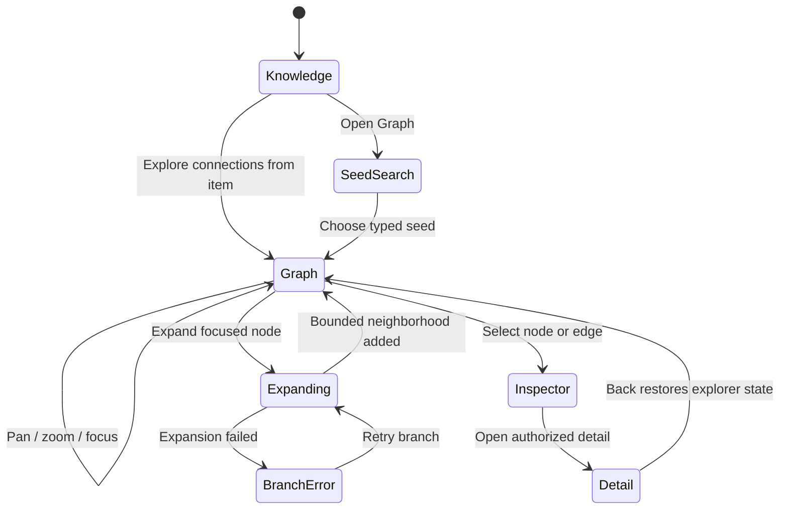
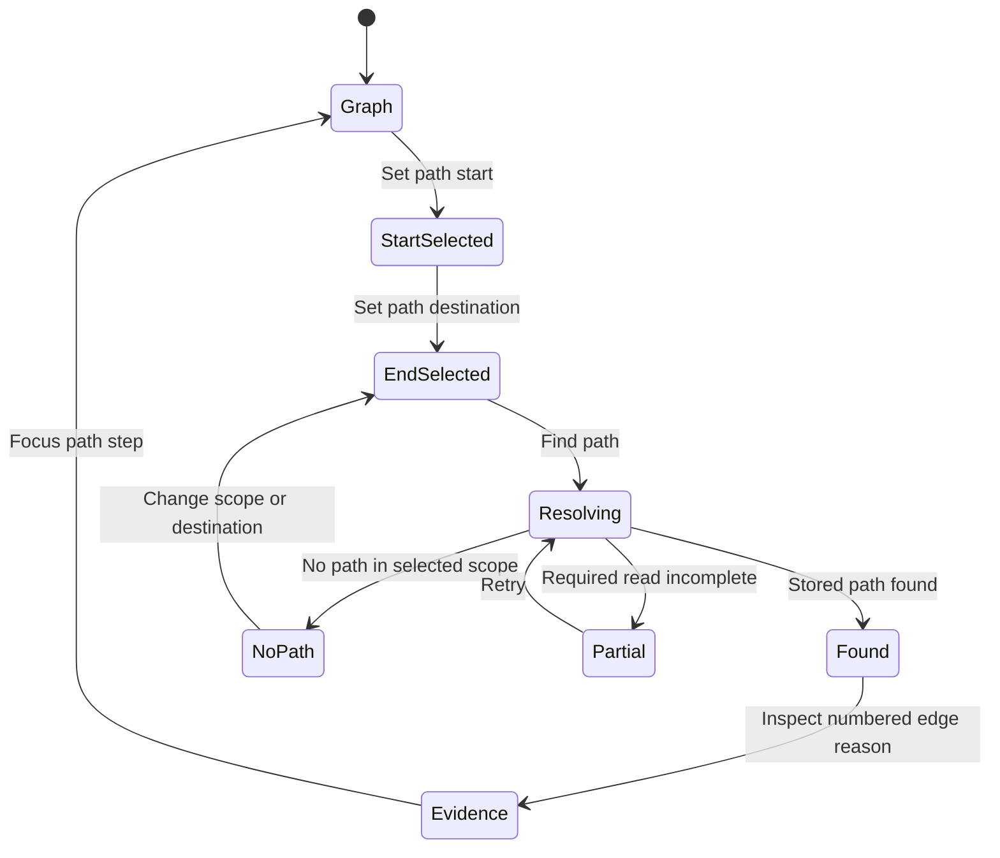
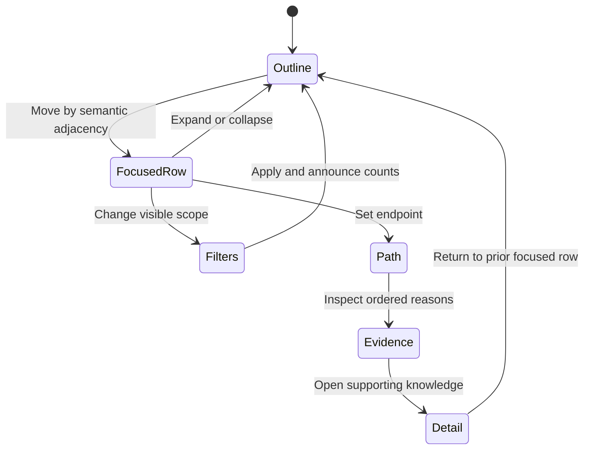
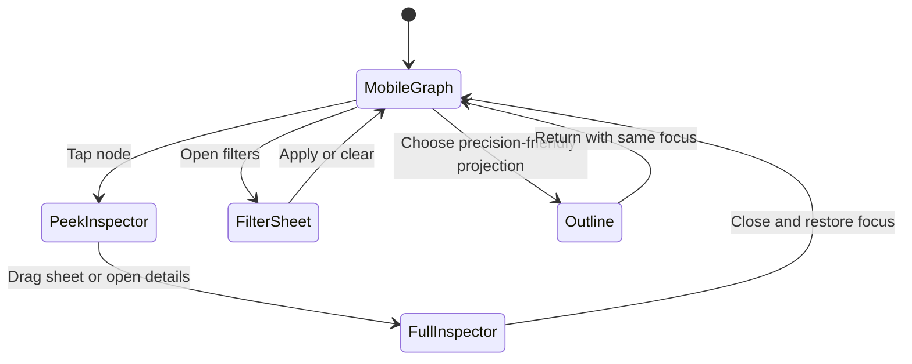

# Feature: 105 Connected Knowledge Graph Explorer

**Status:** Not Started - requirements, UX, design, and planning artifacts are authored; implementation, product testing, certification, and deployment have not run.
**Workflow Mode:** full-delivery
**Release Train:** mvp
**Depends On:**
- `specs/080-knowledge-graph-public-api` for authenticated topic, person, place, time, and relationship reads
- `specs/073-web-mobile-assistant-frontend` for the existing Wiki browse surfaces
- `specs/100-unified-journey-ui-transformation` for shared product navigation
- Runtime activation repair routed as `specs/080-knowledge-graph-public-api/bugs/BUG-080-001-graph-api-fail-soft-runtime-disable`

## Problem Statement

Smackerel has a substantial connected knowledge store, but its user interface
does not let a person see or navigate that connectedness. The 2026-07-23 live
review measured 28,000 artifacts, 312 topics, 622,000 edges, 772 concepts, and
300 entities in the deployed store. The current Wiki pages are list and detail
projections:

- `web/pwa/wiki_topics.js`, `wiki_people.js`, `wiki_places.js`, and
  `wiki_time.js` load index/detail data and render cross-link lists.
- `web/pwa/wiki_artifact.js` renders an artifact and a list of related edges.
- `web/pwa/wiki.js` defines only the four list-oriented sections `topics`,
  `people`, `places`, and `time`.
- No current Wiki page presents connected nodes and edges on an interactive
  canvas or equivalent visual workspace.

As a result, Product Principle 5, One Graph, Many Views, exists in storage but
is not available as a meaningful user experience. A user can inspect one list
or detail page at a time, but cannot answer visual relationship questions such
as "what connects these topics?", "which people and artifacts bridge these
areas?", or "how did this idea evolve over time?".

This feature adds a real connected graph explorer. It is not a decorative
network image and not a node list arranged in two dimensions. The graph must
support purposeful navigation, progressive expansion, focus, filtering, path
finding, and relationship explanation over the authorized operator-owned global knowledge corpus.

## Current Capability Map

| Capability | Grounded Evidence | Current Status | Gap Owned Here |
|---|---|---|---|
| Graph-backed topics, people, places, time, and edges | `internal/api/graphapi/`; routes conditionally registered in `internal/api/router.go` | Implemented contract; deployed activation currently broken | Explorer consumes the repaired read capability; it does not redefine API ownership |
| Wiki list/detail projections | `web/pwa/wiki*.html`, `web/pwa/wiki*.js` | Present | No connected workspace or topology-level navigation |
| Relationship reasons | `internal/api/graphapi/reasons.go`; edge responses used by Wiki detail pages | Present | Reasons are not exposed as an interactive explainability layer |
| Shared navigation | `internal/web/appshell.go`, `web/pwa/lib/appnav.js` | Present but Wiki is absent from current inventories | Explorer and Wiki need first-class discoverability |
| Large connected dataset | 2026-07-23 live review: 28k artifacts, 312 topics, 622k edges, 772 concepts, 300 entities | Present | An unbounded whole-graph render would be unusable; exploration must be bounded and progressive |
| Visual connected graph | Source inventory and live review | Missing | This feature owns the visual and equivalent nonvisual explorer |

## Outcome Contract

**Intent:** A user can open Smackerel's knowledge graph as an interactive,
connected workspace, choose a topic, artifact, person, place, or concept as a
starting point, and follow real relationships to understand how their knowledge
fits together. The explorer supports visual navigation and an equivalent
nonvisual relationship view without inventing nodes, edges, or explanations.

**Success Signal:** From the shared product navigation, an authenticated user
opens the graph, focuses a known topic, expands two relationship hops, filters
to people and artifacts from a chosen time range, selects a bridging node, and
sees a plain-language explanation of each relationship and a path between two
selected nodes. The same graph state can be inspected and navigated with only a
keyboard and through a screen-reader-friendly relationship outline. A mobile
user can pan, zoom, focus, filter, and open details without controls overlapping
the graph.

**Hard Constraints:**
- Every visible node and edge represents stored Smackerel knowledge returned by
  an authorized read. Decorative, fabricated, inferred-without-provenance, or
  randomly connected graph elements are forbidden.
- The initial view is bounded and purposeful. The explorer must never attempt
  to draw the full 622,000-edge store at once.
- A relationship is never just a line. Selecting an edge or traversing a path
  exposes why the relationship exists and links back to supporting knowledge
  when support is available.
- Visual interaction is not the sole access path. Keyboard and nonvisual users
  receive equivalent focus, expansion, filtering, path, and explanation
  outcomes.
- Existing Wiki list/detail views and deep links remain usable. The graph is an
  additional projection of the same knowledge, not a replacement store.
- Smackerel has one operator-owned global corpus, not tenant/user-partitioned
  graph rows. Operators may read all private graph content; another identity
  may read the global projection only with an explicit Graph read grant.
  Authentication alone is insufficient, and no requirement claims tenant or
  per-user row isolation.
- Role/grant and privacy boundaries are identical across Graph, Outline, and
  Table views. No graph data may be cached in sensitive client storage or
  exposed before authorization succeeds.
- Missing or degraded graph data is represented honestly. The explorer never
  substitutes sample topology or reports an empty graph when the read failed.

**Failure Condition:** The feature fails even if it renders a visually
attractive network when the network is decorative, cannot be navigated toward a
user goal, hides why nodes are connected, becomes unusable on the real graph's
scale, excludes keyboard or screen-reader users, exposes unauthorized data, or
silently converts an API/auth failure into an empty graph.

## Goals

1. Make connected knowledge directly explorable from the shared product shell.
2. Let users start from a meaningful seed or bounded overview and progressively
   reveal related knowledge.
3. Support focus, pan, zoom, fit, filter, path, and relationship explanation as
   first-class behaviors.
4. Preserve stable context while the graph expands so users do not lose their
   place.
5. Provide equivalent visual, keyboard, screen-reader, and mobile journeys.
6. Make loading, empty, unavailable, partial, and stale states explicit and
   recoverable.
7. Keep every relationship traceable to real Smackerel knowledge.

## Non-Goals

- Editing or deleting graph records from the explorer.
- Replacing existing Wiki list/detail views.
- Rendering the entire graph in one view.
- Creating a second graph store, search index, or parallel knowledge model.
- Inventing relationship explanations from model output without stored
  supporting evidence.
- Choosing a rendering library, layout algorithm, transport, or cache strategy
  in this requirements artifact. Those decisions belong to `bubbles.design`.
- Adding collaboration, shared cursors, or multi-user graph editing.

## Actors & Personas

| Actor | Description | Key Goals | Permission Boundary |
|---|---|---|---|
| Knowledge Explorer | An authenticated identity granted connected-knowledge read access | Find related knowledge, discover bridges, understand why items connect, open source artifacts | Read the permitted projection of the operator-owned global graph; no mutation and no row-ownership claim |
| Returning User | A user resuming after days or weeks away | Start from what matters now without facing an unread backlog | Same graph access; no guilt-inducing backlog counters |
| Keyboard User | A user who does not use a pointer | Move focus, expand/collapse, select, filter, inspect paths, and open details | Same outcomes as pointer interaction |
| Screen Reader User | A user consuming a semantic relationship outline | Understand nodes, neighbors, edge reasons, current filters, and paths | Same graph facts and actions; visual position is never required context |
| Mobile User | A user exploring on a narrow touch viewport | Pan, zoom, select, focus, filter, and return to context without occlusion | Same authorized data with touch-safe controls |
| Operator | The self-hoster and corpus owner | Explore all private graph content and distinguish no data from auth, loading, partial-read, and service failures | Full graph read plus operational metadata; secret values remain excluded from UI/telemetry |

## Domain Capability Model

### Capability

Connected knowledge exploration: a bounded, stateful projection that lets a
user navigate real relationships without changing the underlying graph.

### Domain Primitives

| Primitive | Purpose | Lifecycle |
|---|---|---|
| Graph Node | A user-visible knowledge object such as a topic, artifact, person, place, or concept | discovered -> visible -> focused -> expanded/collapsed |
| Relationship | A stored connection between two nodes with kind, direction where applicable, strength or confidence where available, and explanation support | loaded -> visible/filtered -> selected |
| Exploration Seed | The node, query result, or bounded hub set from which exploration begins | unset -> selected -> replaced |
| Viewport | The user's current spatial context, scale, and visible neighborhood | initial -> moved/scaled -> fit/reset |
| Focus | The single active node or relationship whose context and actions are exposed | none -> focused -> moved/cleared |
| Filter Set | Active constraints on node kinds, relationship kinds, source, time, and relevance | default -> changed -> cleared |
| Expansion | A request to reveal a bounded neighborhood around a visible node | idle -> loading -> applied/failed |
| Path | An ordered connection between two selected nodes with per-edge reasons | none -> resolving -> found/not-found/failed |
| Explanation | Human-readable, source-linked evidence for why a relationship or path exists | unavailable/available -> inspected |
| Explorer State | Seed, visible graph, focus, filters, viewport, and path selection needed to preserve context | initial -> active -> restored/cleared |
| Access Grant | Explicit authorization for an identity to read the global graph projection | absent -> granted -> revoked/expired |
| Connected Component | Two or more authorized nodes joined by at least one stored relationship within the current bound | unresolved -> connected/isolated-only/partial |
| Projection Bound | Declared maximum nodes, edges, hops, path length, and page/cursor window for one view | configured -> applied -> reached/continued |

### Relationships

- An Exploration Seed defines the first bounded set of Graph Nodes and
  Relationships.
- Expansion adds a bounded neighborhood without discarding the existing
  Explorer State.
- A Filter Set changes visibility, not underlying graph truth.
- A Path is composed only of loaded or resolvable stored Relationships.
- An Explanation belongs to a Relationship and may cite one or more source
  artifacts.
- Focus controls the detail and action surface while Viewport controls spatial
  presentation; changing one must not silently change the other.
- An Access Grant authorizes a projection of the global corpus; it does not
  assign ownership of rows or create a tenant-specific graph.
- Graph, Outline, and Table are equivalent projections of one bounded Explorer
  State and Connected Component set.

### Business Policies

- Truth before aesthetics: layout never changes relationship meaning.
- Bounded by default: every load and expansion has a user-comprehensible limit.
- Context preservation: expansion and filtering do not unexpectedly reset
  focus or viewport.
- Explainability: relationship traversal exposes reason and provenance.
- Equivalent access: every graph action has a keyboard and semantic equivalent.
- Honest absence: not-found, no-path, filtered-empty, unauthorized, unavailable,
  and partial results remain distinct states.
- Connected-overview honesty: a view may claim connected knowledge only when at
  least one component has two authorized real nodes joined by one stored edge.
  Isolated-only data is valid knowledge but not a connected overview.
- Access before projection: every seed, expansion, path, count, and restored
  identifier is re-authorized against explicit grants before any label or
  topology is exposed.
- Cross-cutting acceptance begins with each vertical slice: bounded scale,
  private-data clearing, keyboard/nonvisual parity, responsive layout, and
  typed errors are not postponed until final hardening.

## Use Cases

### UC-105-001: Open a Bounded Graph Overview

- **Actor:** Knowledge Explorer or Returning User
- **Preconditions:** The user is authenticated and graph reads are available.
- **Main Flow:**
  1. The user opens the Graph Explorer from shared navigation or the Wiki.
  2. The system presents a bounded, labeled overview of meaningful hubs and
     explains the current scope.
  3. The user selects a hub and sees its immediate relationships.
- **Alternative Flows:**
  - No graph data exists: show a true first-use state with the actions that can
    create knowledge, not a blank canvas.
  - Real nodes exist but no stored relationship connects any pair in the
    authorized bound: show an honest no-connected-overview state with the
    isolated node count and useful next actions; do not draw decorative edges.
  - The service is unavailable or authorization expired: show a distinct error
    with a retry or re-authentication action; do not show "no connections".
- **Postconditions:** A real node is focused and its bounded neighborhood is
  inspectable.

### UC-105-002: Start From Existing Context

- **Actor:** Knowledge Explorer
- **Preconditions:** The user is viewing or searching for a topic, artifact,
  person, place, or concept.
- **Main Flow:**
  1. The user chooses "Explore connections" from the current item.
  2. The explorer opens with that item as seed and focused node.
  3. The existing item's detail remains reachable without losing graph state.
- **Alternative Flows:**
  - The item has no relationships: show the item as a valid isolated node and
    state that no connections match the current scope.
  - The item was removed or is no longer authorized: show a not-found or
    permission state without revealing prior labels.
- **Postconditions:** The explorer preserves provenance from the entry point.

### UC-105-003: Expand and Refocus

- **Actor:** Knowledge Explorer, Keyboard User, or Mobile User
- **Preconditions:** At least one visible node can be expanded.
- **Main Flow:**
  1. The user expands a node.
  2. The system loads a bounded next neighborhood and announces progress.
  3. Existing nodes remain stable enough to preserve orientation.
  4. The user focuses a newly revealed node and inspects its details.
- **Alternative Flows:**
  - Expansion fails: retain the existing graph and focus, mark only that
    expansion as failed, and offer retry.
  - No additional neighbors exist: mark the node fully expanded rather than
    repeatedly issuing empty work.
- **Postconditions:** The visible graph grows without duplicating nodes or
  losing context.

### UC-105-004: Filter Without Rewriting Truth

- **Actor:** Knowledge Explorer
- **Preconditions:** A graph is visible.
- **Main Flow:**
  1. The user filters by node kind, relationship kind, source, time range, or
     relevance.
  2. The explorer updates visibility and reports the active filter summary and
     visible counts.
  3. The user clears one or all filters and the prior graph becomes visible.
- **Alternative Flows:**
  - Filters hide every node: show a filtered-empty state with a clear reset,
    not a no-data state.
- **Postconditions:** Underlying graph state remains available and unchanged.

### UC-105-005: Find and Explain a Path

- **Actor:** Knowledge Explorer or Screen Reader User
- **Preconditions:** Two distinct authorized nodes are selected.
- **Main Flow:**
  1. The user requests a connection path.
  2. The explorer presents a bounded path or states that none exists in the
     selected scope.
  3. Each step names both endpoints, relationship kind, direction where
     meaningful, and why the connection exists.
  4. The user can focus any step or open supporting knowledge.
- **Alternative Flows:**
  - Path resolution is incomplete because a read failed: mark the result
    partial rather than "no path".
- **Postconditions:** The user can explain the connection without inferring
  meaning from line geometry.

### UC-105-006: Navigate and Inspect Without a Pointer

- **Actor:** Keyboard User or Screen Reader User
- **Preconditions:** The graph has loaded.
- **Main Flow:**
  1. The user enters the explorer and receives the current seed, counts, focus,
     and filter summary.
  2. The user moves between connected nodes and relationships, expands or
     collapses, changes filters, requests a path, and opens details.
  3. Changes are announced without moving focus unpredictably.
- **Postconditions:** The user completes the same exploration goal as a pointer
  user.

### UC-105-007: Explore on Mobile

- **Actor:** Mobile User
- **Preconditions:** A narrow touch viewport.
- **Main Flow:**
  1. The user pans and zooms with touch and uses explicit fit/reset controls.
  2. A tap focuses without accidental navigation; a separate action opens
     details.
  3. Filters and details use non-occluding surfaces that can be dismissed and
     return focus to the graph.
- **Postconditions:** No control, label, panel, or browser safe area obscures
  the primary graph interaction.

### UC-105-008: Resume a Shared Explorer State

- **Actor:** Knowledge Explorer
- **Preconditions:** The user has a non-sensitive explorer deep link or history
  entry.
- **Main Flow:**
  1. The user returns to an explorer state.
  2. The system validates authorization and restores the seed, focus, filters,
     and selected path when still valid.
  3. Removed or newly unauthorized items are omitted honestly.
- **Postconditions:** The restored view contains only current authorized graph
  data.

## User Scenarios (BDD)

```gherkin
Scenario: SCN-105-001 Open a real bounded graph
  Given an authenticated user has connected topics, artifacts, people, places, and concepts
  When the user opens the Graph Explorer
  Then the first view contains at least one authorized component with two real labeled nodes joined by one stored relationship
  And it states the current scope and visible counts
  And it does not attempt to render the complete knowledge store

Scenario: SCN-105-002 Enter from a topic detail
  Given the user is viewing a topic that has related artifacts and people
  When the user chooses to explore its connections
  Then that topic is the focused seed
  And its real immediate relationships are visible
  And the user can return to the topic detail without losing explorer context

Scenario: SCN-105-003 Expand without losing orientation
  Given a focused node has unloaded neighbors
  When the user expands the node
  Then a bounded next neighborhood is added without duplicating existing nodes
  And existing focus and viewport remain stable
  And progress and completion are announced

Scenario: SCN-105-004 Expansion failure preserves the graph
  Given a useful graph is already visible
  When one node expansion fails
  Then the existing graph, focus, and filters remain usable
  And the failed expansion is identified with a retry action
  And the whole graph is not replaced by an empty or generic error screen

Scenario: SCN-105-005 Filtered empty differs from no data
  Given the visible graph contains people and artifacts
  When the user filters to a node kind that has no matches
  Then the explorer says the active filters hide all nodes
  And offers a filter reset
  And does not claim the knowledge graph is empty

Scenario: SCN-105-006 Explain a multi-step path
  Given two visible nodes are connected through stored relationships
  When the user requests a path between them
  Then the explorer presents the ordered path
  And every step names the relationship reason and supporting knowledge when available
  And selecting a step focuses the corresponding nodes and relationship

Scenario: SCN-105-007 Distinguish no path from partial failure
  Given two selected nodes have no path in the current authorized scope
  When path resolution completes successfully
  Then the explorer states that no path exists in the current scope
  When path resolution instead loses a required read
  Then the explorer states that the result is incomplete and offers retry

Scenario: SCN-105-008 Keyboard-equivalent exploration
  Given the graph has loaded and the user uses only a keyboard
  When the user moves to a neighbor, expands it, applies a filter, and opens details
  Then each action succeeds without pointer input
  And focus remains visible and predictable
  And graph changes are announced without reading spatial coordinates as meaning

Scenario: SCN-105-009 Screen-reader relationship outline
  Given the visual graph contains a focused topic with three relationships
  When a screen reader user opens the equivalent relationship view
  Then the focused topic, three neighbors, relationship kinds, directions, and reasons are available in semantic order
  And expansion, filtering, path selection, and detail navigation remain operable

Scenario: SCN-105-010 Mobile controls do not occlude the graph
  Given the explorer is opened on a narrow touch viewport
  When the user pans, zooms, focuses, filters, and opens details
  Then each control has a touch-safe target
  And no panel or safe-area overlap blocks the active node or required controls
  And closing a panel returns the user to the prior graph context

Scenario: SCN-105-011 Auth failure is not an empty graph
  Given the user's session is missing, expired, or invalid
  When the explorer requests graph data
  Then it presents a re-authentication state
  And it renders no prior personal graph labels or topology
  And it does not claim that no knowledge exists

Scenario: SCN-105-012 First-use empty state is actionable
  Given an authenticated user has no graph nodes yet
  When the user opens the explorer
  Then the explorer explains that connected knowledge will appear after capture and processing
  And offers safe entry points to capture or learn about ingestion
  And displays no sample nodes or fake edges

Scenario: SCN-105-013 Restore only current authorized state
  Given a user returns through an explorer deep link containing seed, focus, filters, and a path selection
  When the explorer restores the state
  Then every restored node and relationship is re-authorized and current
  And removed or unauthorized items are omitted without leaking their labels

Scenario: SCN-105-014 Connected overview meets a real-edge minimum
  Given the authorized corpus contains isolated nodes and one stored component of at least two nodes and one edge
  When the bounded overview settles
  Then it may identify connected knowledge only from the real component
  And reports declared node, edge, hop, and continuation bounds
  And never creates a relationship to make isolated nodes look connected

Scenario: SCN-105-015 Isolated-only corpus is honest
  Given authorized graph nodes exist but no stored relationship joins any pair in the current permitted corpus
  When the user opens the explorer
  Then the product shows a no-connected-overview state and the real isolated-node count
  And offers safe detail, capture, or source actions without sample topology
  And does not call the result first-use empty, connected, failed, or unavailable

Scenario: SCN-105-016 Graph Outline and Table are equivalent
  Given one bounded authorized explorer state with active filters, focus, and a selected path
  When the user switches among Graph, Outline, and Table
  Then each view exposes the same authorized node IDs, relationship IDs, directions, reasons, path order, filters, and settled counts
  And a visual render failure leaves Outline and Table usable without changing graph truth
```

## Functional Requirements

| ID | Requirement |
|---|---|
| FR-105-001 | The product SHALL provide a first-class Graph Explorer reachable from shared navigation and relevant Wiki/detail views. |
| FR-105-002 | The explorer SHALL render only authorized, stored nodes and relationships and SHALL NOT fabricate topology or relationship explanations. |
| FR-105-003 | The explorer SHALL start from a user-selected seed or a bounded meaningful overview and SHALL state the active scope. |
| FR-105-004 | The explorer SHALL progressively expand a node by a bounded neighborhood while preserving existing focus, viewport, filters, and loaded graph context. |
| FR-105-005 | The explorer SHALL deduplicate a knowledge object that is reached through multiple relationships. |
| FR-105-006 | The explorer SHALL support pan, zoom, zoom-to-fit, reset, focus, expand, collapse, and detail navigation with pointer, touch, and keyboard input. |
| FR-105-007 | The explorer SHALL support filters for node kind, relationship kind, source, time range, and relevance where those attributes exist. |
| FR-105-008 | The explorer SHALL expose active filters, visible node/edge counts, and a one-action reset. |
| FR-105-009 | The explorer SHALL let a user select two nodes and request a bounded relationship path. |
| FR-105-010 | Every selected relationship and path step SHALL expose a plain-language reason, direction where meaningful, and supporting knowledge references when available. |
| FR-105-011 | Selecting a node SHALL expose its identity, kind, key metadata, relationship summary, and safe navigation to its existing detail surface. |
| FR-105-012 | Graph, Outline, and Table SHALL be equivalent projections of the same authorized bounded state, supporting focus, expansion, filtering, path inspection, reasons, and detail navigation without changing IDs, relationships, or settled counts. |
| FR-105-013 | The explorer SHALL preserve a stable mental map during incremental expansion and SHALL avoid unnecessary full-layout resets. |
| FR-105-014 | The explorer SHALL distinguish first-use empty, no-connected-overview, filtered empty, isolated node, not found, unauthorized, loading, partial, unavailable, stale, and complete states. |
| FR-105-015 | A failed expansion SHALL be retryable without discarding previously loaded graph state. |
| FR-105-016 | The explorer SHALL support non-sensitive deep links or history restoration for seed, focus, filters, and path selection, subject to fresh authorization. |
| FR-105-017 | Existing Wiki list/detail journeys and their deep links SHALL remain available and coherent with the explorer. |
| FR-105-018 | The explorer SHALL honor reduced-motion preferences and SHALL NOT require animation to communicate relationship meaning. |
| FR-105-019 | The explorer SHALL expose user-visible progress for initial load, expansion, path resolution, and state restoration. |
| FR-105-020 | The product SHALL never present a failed or unauthorized graph read as an empty knowledge graph. |
| FR-105-021 | The explorer SHALL read the single operator-owned global graph. Operators MAY read all private graph content; another identity MAY read only with an explicit Graph read grant. Ungranted identities receive no labels, topology, counts, evidence, or existence hints, and no requirement claims tenant/user row isolation. |
| FR-105-022 | A connected overview SHALL require at least one authorized component containing two real nodes joined by one stored edge. Isolated nodes SHALL NOT be connected visually or semantically by fabricated edges. |
| FR-105-023 | When real nodes exist but the connected-overview minimum is not met, the explorer SHALL show `no-connected-overview`, report the real isolated-node count, and provide safe next actions distinct from first-use empty, filtered empty, failure, and unavailability. |
| FR-105-024 | Every initial load, expansion, and path request SHALL apply and expose policy-declared node, edge, hop, path-length, and continuation bounds; reaching a bound SHALL be a truthful continued/limited state, not silent truncation. |
| FR-105-025 | Switching Graph, Outline, or Table SHALL preserve and expose the same authorized node/relationship identities, filters, focus, path order, reasons, and settled counts. |
| FR-105-026 | Authorization loss or grant revocation SHALL clear graph-derived labels, topology pixels, semantic rows, counts, saved/restored state, and background refresh before re-authentication/access denial appears. |
| FR-105-027 | Every delivery slice SHALL include bounded-scale behavior, role/grant denial, typed error recovery, and representative keyboard/nonvisual/narrow-view acceptance before dependent slices proceed; final hardening may broaden but not introduce these obligations. |

## UI Surfaces And States

| Surface | Purpose | Required States |
|---|---|---|
| Graph Explorer workspace | Visual connected navigation | initial, loading, ready, expanding, partial, unavailable, unauthorized, first-use empty, filtered empty |
| Seed/search entry | Choose a starting object or bounded overview | idle, searching, results, no match, error |
| Filter controls | Narrow visible topology | default, active, no-visible-match, reset |
| Focus/detail panel | Inspect one node or relationship | none selected, node selected, relationship selected, unavailable detail |
| Path panel | Select endpoints and inspect an ordered path | incomplete selection, resolving, found, no path, partial, failed |
| Relationship outline | Equivalent semantic/nonvisual graph interaction | loading, ready, expanded/collapsed, no relationships, partial |
| Relationship table | Equivalent sortable/inspectable graph interaction | loading, ready, no-connected-overview, filtered empty, isolated, partial |
| Wiki/detail launch points | Enter the graph from existing context | available, isolated-node, unavailable |

The requirements deliberately do not prescribe canvas technology, rendering
engine, force model, transport, or component library. `bubbles.ux` owns
wireframes and interaction composition; `bubbles.design` owns the technical
foundation.

## UI Scenario Matrix

| Scenario | Actor | Entry Point | Steps | Expected Outcome | Surface(s) |
|---|---|---|---|---|---|
| Bounded overview | Returning User | Shared navigation | Open graph, inspect scope, focus hub | Real bounded topology with clear scope | Explorer, focus panel |
| Topic-led exploration | Knowledge Explorer | Topic detail | Explore connections, expand twice, open artifact | Context preserved across traversal | Wiki detail, explorer, artifact detail |
| Explain a bridge | Knowledge Explorer | Explorer | Select two nodes, request path, inspect each step | Ordered path with reasons and sources | Explorer, path panel |
| Filter and recover | Knowledge Explorer | Explorer | Apply source/time/type filters, reach zero, reset | Filtered-empty explanation and full recovery | Filter controls, explorer |
| Keyboard traversal | Keyboard User | Explorer | Move focus, expand, filter, open detail | Complete workflow without pointer | Explorer, outline, detail |
| Screen-reader path | Screen Reader User | Relationship outline | Select endpoints, request path, inspect reasons | Semantic ordered path equivalent | Outline, path panel |
| Mobile exploration | Mobile User | Shared navigation | Pan, pinch/controls, select, filter, dismiss panel | No overlap; context restored | Explorer, mobile controls |
| Session expired | Any user | Explorer | Load or expand after expiry | Re-authentication state, no leaked labels | Explorer error state |
| First use | New User | Shared navigation | Open graph with no knowledge | Honest actionable empty state, no sample graph | Explorer empty state |

## Accessibility And Responsive Behavior

- All commands are keyboard reachable in a predictable order, with visible
  focus and no keyboard trap.
- Spatial position, color, size, and animation are never the only carriers of
  node kind, relationship kind, direction, selection, confidence, or status.
- The semantic relationship view reports current seed, focus, active filters,
  visible counts, neighbors, relationship reasons, and path order.
- Dynamic additions and failures are announced concisely without re-reading the
  whole graph.
- Zoom does not alter text beyond legibility; users can fit or reset without a
  precision gesture.
- Touch targets for primary graph controls are at least 44 by 44 CSS pixels.
- Narrow layouts keep the graph primary; filters and details use dismissible,
  non-occluding surfaces and respect browser safe areas.
- Reduced-motion users receive immediate or minimal transitions with identical
  state information.
- Light and dark presentations meet WCAG AA contrast for text, controls, focus,
  status, and graph encodings.

## Security And Privacy

- Every graph load, expansion, path, and detail read requires an authenticated
  identity with the explicit Graph read grant; deep links never bypass
  authorization. The grant selects permitted access to the global corpus and
  does not assert tenant/user row isolation.
- Explorer state stored in browser history or shareable links contains only
  non-secret identifiers and preferences. Auth/session credentials and graph
  content are never written to durable client storage.
- The explorer clears or hides personal labels and topology when authorization
  fails or the user signs out.
- Supporting links use safe schemes and preserve existing content-security
  protections.
- Telemetry contains operation class, timing, counts, and typed failure causes,
  not node labels, artifact content, person names, place names, or query text.
- Relationship explanations must come from authorized stored evidence; missing
  evidence is labeled unavailable rather than synthesized as fact.

## Observability

The operator must be able to distinguish product failure from legitimate
absence without reading personal graph content.

Required observable workflow classes:
- Explorer initial load: requested scope, bounded result counts, duration,
  outcome.
- Node expansion: node kind only, requested/returned counts, duration, typed
  outcome.
- Path resolution: bounded depth/size, duration, found/no-path/partial/error.
- Client rendering: time to first meaningful graph, frame or responsiveness
  degradation, and recoverable render errors.
- Accessibility mode usage and failures may be counted only in aggregate and
  without personal content.

User-visible failures and operator-visible telemetry must share a closed,
non-sensitive outcome vocabulary so an empty result cannot be mistaken for an
auth or service failure.

## Non-Functional Requirements

| ID | Requirement |
|---|---|
| NFR-105-001 | The initial bounded graph SHALL become meaningfully interactive at P95 within 2 seconds on the supported self-hosted target under the declared default scope. |
| NFR-105-002 | After data is available, focus, pan, zoom, filter toggles, and panel open/close SHALL respond at P95 within 100 milliseconds. |
| NFR-105-003 | A bounded node expansion SHALL complete or surface a typed failure at P95 within 2 seconds on the supported self-hosted target. |
| NFR-105-004 | The explorer SHALL remain usable as the stored graph grows beyond the 2026-07-23 measured 28k artifacts and 622k edges by bounding every presented neighborhood. |
| NFR-105-005 | The explorer SHALL meet WCAG 2.2 AA for applicable controls, content, focus, contrast, and semantics. |
| NFR-105-006 | Graph, Outline, and Table SHALL represent the same authorized node/relationship IDs, filters, focus, path order, reasons, and settled counts. |
| NFR-105-007 | The explorer SHALL preserve existing product CSP, session, and navigation contracts. |
| NFR-105-008 | No explorer failure SHALL erase previously useful loaded state unless authorization is lost, in which case personal state SHALL be removed from view. |

## Migration And Backward Compatibility

- This is an additive view over the existing knowledge graph. No parallel graph
  or duplicate business record is introduced.
- Existing Wiki routes, topic/person/place/time pages, artifact details, and
  shared deep links remain valid.
- Explorer deep links are additive and must tolerate nodes that were removed,
  merged, or made inaccessible.
- Any route or identifier change proposed by design requires a complete
  consumer impact sweep across shared navigation, Wiki links, browser history,
  service-worker assets, docs, and real-stack tests before implementation.
- Existing graph records require no user migration to appear. If design later
  identifies a derived index or preference format, it must be rebuildable from
  authoritative graph data and must not become a second source of truth.

## Product Principle Alignment

| Principle | Alignment |
|---|---|
| Principle 2 - Vague In, Precise Out | A user may enter from search or an imprecise remembered concept and then refine through real relationships instead of exact metadata. |
| Principle 3 - Knowledge Breathes | Time and lifecycle filters let current, cooling, dormant, and historical knowledge remain intelligible without flattening lifecycle state. |
| Principle 5 - One Graph, Many Views | The visual workspace and semantic outline are additional projections of the existing graph, never parallel stores. |
| Principle 8 - Trust Through Transparency | Every traversed relationship and path step exposes why it exists and links to supporting knowledge when available. |
| Principle 9 - Design For Restart, Not Perfection | Returning users start from meaningful hubs or a chosen context, not an unread-backlog screen. |

No QF financial-action behavior is introduced; Principle 10 remains unchanged.

## Release Train

- **Target:** `mvp`, the active self-hosted train declared in
  `config/release-trains.yaml`.
- **Reason:** The connected graph is a primary user-facing projection of the
  already-deployed knowledge store and is explicitly required for the current
  self-hosted experience.
- **Flags introduced:** none (`flagsIntroduced: []`). This feature is additive;
  rollout and recovery policy are design-owned, but missing rollout config may
  not silently expose an incomplete explorer.
- **Other trains:** No train may advertise the explorer unless its complete
  authenticated graph-read dependency and user journeys are available.

## Acceptance Criteria

1. Every BDD scenario has a later owner-planned real-stack regression contract.
2. The explorer shows real topology and supports expand, focus, pan, zoom,
   filter, path, and explanation behaviors.
3. The keyboard and semantic relationship journeys produce equivalent graph
   outcomes.
4. Mobile and desktop layouts remain usable without overlap or hidden controls.
5. Empty, filtered-empty, isolated, loading, partial, unavailable,
   unauthorized, stale, and complete states are distinguishable.
6. Existing Wiki and detail journeys remain available.
7. No sample graph, fake edge, fabricated explanation, or sensitive client
   storage is introduced.
8. Product-level authenticated real-stack verification proves the explorer on
   the deployed graph after design, planning, implementation, and test owners
   complete their phases.
9. Connected-overview acceptance requires at least two real authorized nodes joined by one stored edge; isolated-only data produces an honest no-connected-overview state.
10. Every projection is bounded and Graph/Outline/Table expose equivalent authorized facts, while authorization loss clears private data from visual, semantic, history, and background-refresh surfaces.
11. Scale, security/grant denial, typed errors, and representative accessibility are acceptance obligations in every vertical slice rather than late cleanup.

## Open Questions Resolved From Repository Evidence

1. **Is a new graph store needed?** No. Product Principle 5 and the deployed
   graph counts prove the data already exists; this is a projection capability.
2. **Should the whole graph render initially?** No. The measured 622,000 edges
   make a full render neither useful nor operable. The requirement is bounded,
   seed-led progressive exploration.
3. **Can the current Wiki count as the visual explorer?** No. Its source files
   implement lists, details, and cross-link lists, not a connected node-edge
   workspace with path/focus/viewport behavior.
4. **Is accessibility satisfied by a static fallback list?** No. Equivalent
   focus, expand, filter, path, and explanation actions are required.
5. **Which visualization library or layout algorithm is required?** None is
   selected here. That is a design decision and must be evaluated against the
   real graph size, accessibility, mobile, and supply-chain constraints.

## Remaining Owner Routes

- `bubbles.ux`: author the workspace, control, focus/detail, path, mobile, and
  semantic-outline interaction design inline in this spec.
- `bubbles.design`: define the bounded graph-query, state, rendering, security,
  and performance architecture without creating a second graph store.
- `bubbles.plan`: decompose scenario-specific implementation and real-stack
  Playwright coverage after UX and design are reconciled.
- `bubbles.bug`: create and close the complete BUG-080-001 packet before graph
  delivery can claim the deployed graph API dependency is available.

## UI Wireframes

### Screen Inventory

| Screen | Actor(s) | Status | Scenarios Served |
|---|---|---|---|
| Graph workspace | Knowledge Explorer, Returning User, Mobile User | New | SCN-105-001 through SCN-105-008, SCN-105-010 through SCN-105-013 |
| Relationship outline | Keyboard User, Screen Reader User | New equivalent view | SCN-105-005 through SCN-105-009, SCN-105-013 |
| Graph filters | All explorer actors | New shared panel/sheet | SCN-105-004, SCN-105-005, SCN-105-008 through SCN-105-010 |
| Node and edge inspector | All explorer actors | New shared panel/sheet | SCN-105-002 through SCN-105-006, SCN-105-009, SCN-105-010 |
| Path finder | Knowledge Explorer, Screen Reader User | New workspace mode | SCN-105-006, SCN-105-007, SCN-105-009 |
| Wiki and Search launch points | Knowledge Explorer | Existing - modify | SCN-105-002, SCN-105-013 |
| Graph state surfaces | All explorer actors | New shared state composition | SCN-105-004, SCN-105-005, SCN-105-007, SCN-105-011, SCN-105-012 |

### UI Primitives

| Primitive | Used By Screens | Composition Rule | Accessibility And Responsive Contract |
|---|---|---|---|
| Explorer mode switch | Graph workspace, relationship outline, relationship table | A three-option `Graph` / `Outline` / `Table` segmented control changes projection without changing seed, focus, filters, path, or authorization scope. | Uses a named radiogroup or tabs pattern; current mode is programmatically exposed and survives viewport changes. |
| Scope summary | Graph workspace, relationship outline, filters | One persistent line reports seed, visible node and edge counts, bounded hop scope, and active filter count. It never calls a partial or failed result complete. | Announced after settled loads, not on every pan or focus move; wraps without truncating counts or state. |
| Focus target | Graph workspace, relationship outline, inspector | Exactly one node or edge owns primary focus. Selection opens metadata; navigation remains a separate explicit action. | Visible high-contrast focus treatment; keyboard focus and visual selection remain synchronized without requiring coordinates. |
| Bounded expansion control | Graph workspace, relationship outline, inspector | Expand and collapse act on the focused node, state the requested limit, deduplicate existing nodes, and preserve prior useful state on failure. | Named with node label and action; pending, complete, no-more-neighbors, and failed states are announced. |
| Filter chip and filter group | Graph filters, scope summary | Node kind, edge kind, source, lifecycle, and time filters share one vocabulary. Removing a chip changes visibility only; `Clear all` restores the loaded graph. | Each chip has a text label and remove name; mobile groups use full-width controls with 44px minimum targets. |
| Evidence row | Inspector, path finder, relationship outline | Every selected edge shows endpoint names, relationship kind/direction, plain-language reason, and supporting artifact links or explicit `Evidence unavailable`. | Semantic text carries meaning independently of line style, color, strength, or spatial position. |
| Honest state band | Graph workspace, outline, filters, inspector, path finder | Loading, filtered empty, first-use empty, isolated, partial, degraded, unavailable, unauthorized, and error states use one state vocabulary and preserve recoverable context. | Uses status or alert semantics appropriate to urgency; focus moves only for blocking auth or modal errors. |
| History breadcrumb | Graph workspace, outline, inspector | Seed and focus changes append a bounded navigation trail; Back/Forward restore exploration context without reinterpreting graph truth. | Ordered list with current-page semantics; mobile collapses middle entries into a named history menu. |

### Explorer Interaction Model

| Concern | UX Contract |
|---|---|
| Seed | The explorer opens from an explicit topic, artifact, person, place, concept, saved view, or a server-supplied bounded hub set. The seed is always named in the scope summary. |
| Search to focus | Search returns typed objects with source/lifecycle context. Choosing a result re-centers and focuses it; it does not silently discard the loaded graph. `Start new view` is a separate command. |
| Node types | Topic, artifact, person, place, and concept use a type icon, text type label in the inspector/outline/table, and a distinguishable visual shape. Color alone never encodes type. |
| Edge meaning | Line style may supplement relationship kind/direction/strength, but selecting or keyboard-focusing an edge always reveals endpoints, direction, reason, evidence state, and source links in text. |
| Expand/collapse | Expand requests one configured bounded neighborhood. Collapse removes only descendants introduced solely through that expansion; shared nodes and path endpoints remain. The action previews the affected visible count before destructive collapse. |
| Pan/zoom | Pointer drag or touch pan moves the viewport; wheel/pinch or explicit icon controls zoom; `Fit visible` and `Reset to seed` are always available. Selection never occurs from a pan gesture. |
| Focus | One node or edge is active. Single click/tap selects; double click is not required. `Open details` is explicit so touch users do not navigate accidentally. |
| Path finding | `Set as start` and `Set as destination` can be invoked from any projection. A found path is ordered and numbered; no path, scope-limited no path, partial resolution, and failed resolution remain distinct. |
| Filters | Node type, edge type, time, source, lifecycle, and relevance filters update visibility over loaded truth. Active filters are chips with individual remove actions and one `Clear all`. |
| Layout | `Neighborhood` preserves a stable local map; `Radial` emphasizes one seed; `Layered` groups by relationship depth; `Timeline` is available only when the current data has meaningful dates. A layout change preserves focus, filters, and path. |
| History | Browser Back/Forward and in-workspace history restore seed, focus, filters, projection, layout, and path after current authorization checks. Pan/zoom alone does not flood history. |
| Saved views | Named saved views are justified for repeated investigations. Save stores authorized identifiers, filters, projection, layout, and path endpoints server-side per user, never labels, graph payloads, or credentials. Rename/delete are available in the same menu. If the design cannot provide this secure persistence contract, the control is omitted rather than inert. |

### Screen: Graph Workspace - Desktop

**Actor:** Knowledge Explorer, Returning User | **Route:** `/knowledge/graph` | **Status:** New

```text
┌──────────────────────────────────────────────────────────────────────────────────────────────┐
│ [Product rail]  Knowledge / Graph / [Seed: Local inference]      [History] [Save view] [User]│
├──────────────────────────────────────────────────────────────────────────────────────────────┤
│ [Search topics, artifacts, people, places, concepts.....................] [Focus result]      │
│ [Graph | Outline | Table]  Layout [Neighborhood v]  Scope: 1 seed · [nodes] · [edges] · [hops]│
├───────────────────┬──────────────────────────────────────────────┬───────────────────────────┤
│ FILTERS           │ GRAPH                                        │ INSPECTOR                 │
│ Node type         │ ┌──────────────────────────────────────────┐ │ [Topic] Local inference   │
│ [x] Topics        │ │ [−] [+] [Fit] [Reset] [Commands]         │ │ Lifecycle  [Active]       │
│ [x] Artifacts     │ │                                          │ │ Sources    [3]            │
│ [x] People        │ │      (Artifact) ──supports── [Topic]      │ │ Updated    [time]         │
│ [x] Places        │ │          │                    │            │ │                           │
│ [x] Concepts      │ │       mentions             related        │ │ Relationships [12]        │
│                   │ │          │                    │            │ │ [Expand] [Collapse]       │
│ Relationship [v] │ │       <Person> ──located── <Place>         │ │ [Set path start]          │
│ Source       [v] │ │                                          │ │ [Open details]            │
│ Lifecycle    [v] │ │  [Focused node has visible focus ring]    │ │                           │
│ Time [from] [to] │ │                                          │ │ WHY THIS CONNECTION       │
│ Relevance    [v] │ │  More relationships available [Expand]   │ │ [reason text]             │
│                   │ └──────────────────────────────────────────┘ │ Evidence: [artifact links]│
│ Active: [chips]   │                                              │ [Evidence unavailable]     │
│ [Clear all]       │                                              │ when none is stored        │
├───────────────────┴──────────────────────────────────────────────┴───────────────────────────┤
│ [Available | Degraded | Unavailable]  [settled/pending operation]  [visible count summary]   │
└──────────────────────────────────────────────────────────────────────────────────────────────┘
```

**Interactions:**
- Search result -> focus within loaded graph; `Start new view` -> confirms replacement of unsaved explorer state.
- Node/edge -> select -> inspector updates; explicit `Open details` retains the explorer in history.
- Expand -> bounded pending halo and status -> nodes settle without full-layout reset; cancel stops the pending request without discarding prior state.
- Path start + destination -> Path drawer replaces the inspector body with numbered, evidence-bearing steps.
- Familiar zoom, fit, reset, filter, history, and save icons may be icon-only when the implementation uses Lucide or the existing icon library; each has an accessible name and hover/focus tooltip.

**States:**
- Initial loading keeps the toolbar and panel tracks stable and shows bounded skeleton rows plus a noninteractive graph placeholder; it never draws sample nodes.
- Expansion loading marks only the expanding node and its status; the existing graph remains operable.
- Partial/degraded preserves verified nodes and edges, identifies omitted source families, and offers `Retry missing data`.
- Unauthorized removes all labels/topology and shows `Sign in again` with a safe return target.
- First-use empty offers `Capture` and `Connect a source`; filtered empty offers only `Clear filters`; isolated node retains the node and says no relationships match the current scope.
- Render failure switches to the equivalent Outline with the same state and reports Graph view as `Unavailable`; it never presents a blank canvas.

**Responsive:**
- At wide desktop, filters are a stable left panel and inspector is a stable right panel; the graph owns the flexible center track.
- At compact desktop, filters collapse to a button with active count; the inspector remains visible for orientation.

**Accessibility:**
- The graph region has a concise label containing seed and visible counts; spatial coordinates are never announced as relationship meaning.
- Enter moves focus into the graph; arrow keys move by semantic adjacency, not arbitrary screen direction; `E` expands, `C` collapses, Enter selects, Space opens the action menu, Escape closes overlays, `+`/`-` zoom, and `0` fits visible content.
- Shortcut help is on-demand in the Commands dialog, not permanent instructional prose.

### Screen: Graph Workspace - Tablet

**Actor:** Knowledge Explorer, Keyboard User | **Route:** `/knowledge/graph` | **Status:** New responsive composition

```text
┌───────────────────────────────────────────────────────────────┐
│ [Rail icons] Knowledge / Graph                      [User]     │
├───────────────────────────────────────────────────────────────┤
│ [Search...........................................] [Focus]    │
│ [Graph|Outline|Table] [Filters 3] [Layout v] [History] [Save] │
│ Scope: [seed] · [nodes] · [edges] · [hops]                   │
├───────────────────────────────────────────┬───────────────────┤
│ GRAPH                                      │ INSPECTOR         │
│ ┌───────────────────────────────────────┐ │ [selected item]   │
│ │ [−] [+] [Fit] [Reset]                │ │ [state/source]    │
│ │                                       │ │ [relationships]   │
│ │          bounded topology             │ │ [reason/evidence] │
│ │                                       │ │ [actions]         │
│ └───────────────────────────────────────┘ │                   │
├───────────────────────────────────────────┴───────────────────┤
│ [state] [operation progress] [visible count summary]          │
└───────────────────────────────────────────────────────────────┘
```

**Interactions:** Filters open a modal sheet with Apply and Clear actions; closing restores focus to the Filters control. Inspector can collapse to a labeled edge tab without changing focus.

**States:** The same state contract as desktop applies; sheets never replace a blocking auth state or hide an expansion failure.

**Responsive:** The icon rail has tooltips and accessible names; toolbar controls do not wrap into the graph. When width cannot retain the inspector, it becomes the mobile bottom sheet composition.

**Accessibility:** Modal sheets trap focus only while open, have a visible close control, and restore focus to their invoker.

### Screen: Graph Workspace - Mobile

**Actor:** Mobile User | **Route:** `/knowledge/graph` | **Status:** New responsive composition

```text
┌─────────────────────────────────────────┐
│ [Back] Graph                 [More]     │
│ [Search knowledge................][Go]  │
│ [Graph|Outline|Table] [Filters 3]       │
│ [seed] · [nodes] · [edges] · [hops]    │
├─────────────────────────────────────────┤
│ ┌─────────────────────────────────────┐ │
│ │ [−] [+] [Fit] [Reset]              │ │
│ │                                     │ │
│ │       bounded touch topology        │ │
│ │                                     │ │
│ │       [focused node ring]           │ │
│ │                                     │ │
│ └─────────────────────────────────────┘ │
├─────────────────────────────────────────┤
│ [drag handle] [Topic] [selected label] │
│ [Expand] [Path] [Open details]         │
│ [reason and evidence preview]          │
└─────────────────────────────────────────┘
```

**Interactions:** One-finger drag pans, pinch zooms, tap selects, and explicit buttons expand or navigate. Filters and full inspector use snap-point bottom sheets; the collapsed inspector always leaves the focused node and graph controls visible.

**States:** A sheet-level error belongs to its action; a whole-view error occupies the graph region. Safe-area insets protect the top controls and sheet actions.

**Responsive:** At 320 CSS pixels, mode labels may shorten to icon plus accessible label only when each tooltip remains available; no primary action is hidden in horizontal overflow.

**Accessibility:** Touch targets are at least 44 by 44 CSS pixels. Pinch is never the only zoom mechanism. Sheet reading order follows label, state, reason, evidence, actions.

### Screen: Relationship Outline

**Actor:** Keyboard User, Screen Reader User | **Route:** `/knowledge/graph?view=outline` | **Status:** New equivalent projection

```text
┌─────────────────────────────────────────────────────────────────────────────┐
│ Knowledge / Graph / [seed]       [Graph | Outline | Table] [Filters]       │
├─────────────────────────────────────────────────────────────────────────────┤
│ Focus: [Topic] Local inference · 12 visible relationships · 2 active filters│
│                                                                             │
│ ▼ Local inference [Topic] [Active]                                          │
│   ├─ supports -> Quantization notes [Artifact] [Evidence 2]                 │
│   ├─ mentions -> [Person] [Evidence 1]                                      │
│   ├─ related to -> Edge deployment [Concept] [Evidence unavailable]         │
│   └─ 8 more relationships [Expand bounded set]                              │
│                                                                             │
│ PATH                                                                        │
│ 1. Local inference --supports--> Quantization notes [Why] [Open source]     │
│ 2. Quantization notes --mentions--> [Person] [Why] [Open source]            │
├─────────────────────────────────────────────────────────────────────────────┤
│ [Previous focus] [Set path start] [Set path destination] [Open details]     │
└─────────────────────────────────────────────────────────────────────────────┘
```

**Interactions:** Tree rows support expand/collapse, focus, path endpoint selection, reason disclosure, and detail navigation. Expanding one row does not move focus to the first child automatically.

**States:** Loading inserts a labeled pending row below its parent. Partial failure stays attached to that branch with Retry. No relationships is distinct from active filters hiding relationships.

**Responsive:** On mobile this is the preferred fallback when precision graph manipulation is impractical; actions move below the selected row and never rely on hover.

**Accessibility:** Uses a semantic tree only if full tree keyboard semantics are implemented; otherwise it uses nested lists with buttons, which is preferable to an incomplete ARIA tree. Path steps are an ordered list.

### Screen: Relationship Table

**Actor:** Knowledge Explorer, Keyboard User | **Route:** `/knowledge/graph?view=table` | **Status:** New equivalent projection

```text
┌──────────────────────────────────────────────────────────────────────────────┐
│ Knowledge / Graph / [seed]       [Graph | Outline | Table] [Filters]        │
├──────────────────────────────────────────────────────────────────────────────┤
│ [Search within loaded relationships...]  Sort [Relevance v]  [Columns]      │
│ Source              Relationship        Target             Life   Evidence  │
│ [Topic: Local...]    supports ->         [Artifact: ...]     Active [2 links]│
│ [Person: ...]        mentioned by <-     [Artifact: ...]     Warm   [1 link] │
│ [Concept: ...]       related to <->      [Topic: ...]        Cool   [None]   │
│ --------------------------------------------------------------------------- │
│ Showing [visible] of [loaded] relationships · More available [Load next]    │
└──────────────────────────────────────────────────────────────────────────────┘
```

**Interactions:** Sort and column visibility never mutate graph truth. Selecting a row focuses the same edge in every projection. `Load next` uses the same bounded expansion/query contract.

**States:** Table empty copy names active filters or true absence. Partial data marks affected rows/source groups and keeps verified rows available.

**Responsive:** Mobile converts each row to a flat definition list with endpoint, relationship, lifecycle, and evidence fields; it does not place cards inside cards or hide columns silently.

**Accessibility:** Column headers expose sort state; row actions are keyboard reachable; relationship direction is readable text, not an arrow glyph alone.

### Screen: Path Finder And Evidence Inspector

**Actor:** Knowledge Explorer, Screen Reader User | **Route:** In-workspace panel | **Status:** New

```text
┌──────────────────────────────────────────────┐
│ CONNECTION PATH                       [Close]│
├──────────────────────────────────────────────┤
│ From [Topic: Local inference.............]  │
│ To   [Person: Ada Example...............]   │
│ Scope [Loaded graph v]  Max depth [policy]  │
│ [Find path]                                 │
├──────────────────────────────────────────────┤
│ 1 [Topic] Local inference                   │
│   supports -> [Artifact] Quantization notes │
│   Why: [stored relationship reason]         │
│   Evidence [Open artifact]                  │
│ 2 [Artifact] Quantization notes             │
│   mentions -> [Person] Ada Example          │
│   Why: [stored relationship reason]         │
│   Evidence [Open excerpt]                   │
├──────────────────────────────────────────────┤
│ [Focus step] [Open source] [Clear path]     │
└──────────────────────────────────────────────┘
```

**Interactions:** Endpoint fields use the same typed search. `Focus step` selects the edge and fits both endpoints without changing path order. Supporting knowledge opens through authorized existing detail routes.

**States:** Resolving has a named progress state; no path says `No path in [scope]`; partial says which source/depth could not be evaluated; failed preserves endpoints for Retry.

**Responsive:** Desktop uses the inspector track; mobile uses a full-height sheet with the ordered path while retaining a `Return to graph` action.

**Accessibility:** Reasons and evidence are adjacent to each numbered edge. Status changes are announced once; opening evidence moves focus to its heading and Back restores the path step.

### State Composition Matrix

| State | Graph Region | Scope Summary | Inspector/Action | Recovery |
|---|---|---|---|---|
| Initial loading | Stable placeholder, no fake topology | `Loading authorized graph` | Disabled until real focus exists | Automatic completion or typed failure |
| Expanding | Existing topology plus pending marker on one node | Existing counts plus `Expanding [label]` | Existing inspector remains usable | Cancel or Retry failed branch |
| First-use empty | No nodes | `0 nodes after successful read` | No inspector | Capture; Connect a source |
| Filtered empty | Loaded graph retained but hidden | Loaded counts plus `0 visible` and active chips | Explains filters, not data absence | Clear filters |
| Isolated node | One real node | `1 node, 0 matching relationships` | Node metadata remains | Change filters; Open details |
| Degraded/partial | Verified topology only; omitted areas not guessed | Counts marked partial and source limitation named | Verified evidence remains | Retry missing data; open Outline/Table |
| Unavailable | No graph content; Outline/Table unavailable if data read also fails | Capability `Unavailable` | Safe cause class only | Retry; return to Knowledge |
| Render unavailable | Graph canvas replaced by mode notice | Data state remains Available/Degraded | Outline/Table remain usable | Open Outline; Retry Graph view |
| Unauthorized | Personal labels/topology removed immediately | `Session expired` | No stale inspector content | Sign in again with safe return target |
| Not found | Missing seed omitted | Remaining authorized state may remain | No prior label leakage | Choose another seed; return to Knowledge |

### Rendering And Scale Expectations

- The design owner may choose Canvas, SVG, WebGL, or a source-locked graph library; UX does not prescribe the implementation. The selected approach must support stable node/edge identities, deterministic focus, hit testing, bounded incremental updates, high-DPI rendering, and an equivalent semantic projection.
- The initial request and every expansion are bounded by explicit configured limits. The UI reports loaded and visible counts plus `More available`; it never downloads or lays out the measured 622,000 edges as one client view.
- Layout work must not block search, filters, inspector, or navigation. The graph may reduce label density while panning/zooming, but focused and path labels remain legible and never disappear.
- Incremental expansion pins or stabilizes existing positions. A full relayout is an explicit layout command, not a side effect of every response.
- Off-viewport nodes may be culled visually, but they remain represented in Outline/Table counts and cannot become keyboard-focusable at invisible coordinates.
- Canvas/WebGL implementations require a nonblank pixel contract, resize/device-pixel-ratio checks, and an accessibility DOM mirror. SVG implementations require equivalent bounded-DOM and nonblank checks. No library may send graph content or telemetry to an external origin.
- Reduced motion removes animated force settling, animated zoom, edge marching, and pulsing states. New nodes appear in their settled positions with a concise live announcement.
- In forced-colors/high-contrast mode, node outlines, focus, selected path, and edge direction remain distinguishable through stroke/shape/text rather than authored color alone.

### Graph Playwright Scenario Matrix

All rows use the real ephemeral stack, real browser session, and disposable seeded graph data. Internal requests are never intercepted or fulfilled by Playwright. Each required locator is asserted directly; conditional early returns, optional assertions, and URL-only success checks are forbidden.

| Stable ID | Traces | Viewport/Mode | User Action | Required Visible And Network Outcome | Visual/A11y Evidence |
|---|---|---|---|---|---|
| UX-E2E-105-001 | SCN-105-001 | 1440x900, Graph | Open from primary navigation | One authorized bounded graph read; real labeled seed set; loaded/visible counts; complete-store count is never rendered as one view | Settled screenshot; canvas/SVG nonblank pixel assertion |
| UX-E2E-105-002 | SCN-105-002 | Desktop, Graph | Open `Explore connections` from a topic | Topic is seed/focus; immediate stored edges visible; Back returns to topic and Forward restores graph state | Focus screenshot and breadcrumb assertion |
| UX-E2E-105-003 | SCN-105-003 | Desktop, Graph | Expand twice and refocus | One request per expansion; no duplicate node IDs; prior positions/focus/viewport remain within declared stability tolerance | Before/after screenshots; focus ring visible |
| UX-E2E-105-004 | SCN-105-004 | Desktop, Graph | Expand a node whose real dependency fails | Existing topology and filters remain; branch error and Retry visible; no empty whole-view replacement | Error-state screenshot; live-region assertion |
| UX-E2E-105-005 | SCN-105-005 | Desktop, all projections | Apply a zero-result node filter then clear | Loaded count remains; visible count becomes zero; filtered-empty copy names filters; Clear restores identical IDs | Graph, Outline, Table screenshots |
| UX-E2E-105-006 | SCN-105-006 | Desktop, Graph/Outline | Select two connected nodes and find path | Real path request; ordered steps; relationship reasons and evidence links; focusing a step selects matching edge | Path screenshot; ordered-list snapshot |
| UX-E2E-105-007 | SCN-105-007 | Desktop, Outline | Resolve true no-path, then partial read fixture | Successful no-path and partial failure have exclusive copy and actions; neither is generic error | State screenshots; status semantics |
| UX-E2E-105-008 | SCN-105-008 | Desktop, keyboard only | Traverse, expand, filter, inspect, fit | No pointer calls; predictable focus; each action changes real visible state; Escape restores invoker | Focus sequence capture; no keyboard trap |
| UX-E2E-105-009 | SCN-105-009 | Desktop, Outline | Navigate semantic relationships and path | Same authorized IDs, filters, reasons, and path as Graph; nested-list/tree semantics valid | Accessibility snapshot; live announcements |
| UX-E2E-105-010 | FR-105-012 | 1440x900 and 390x844, Table | Sort, select edge, load next | Sort state announced; selecting row preserves edge focus across projections; bounded next read | Desktop/mobile table screenshots |
| UX-E2E-105-011 | SCN-105-010 | 390x844 touch emulation | Pan, pinch, explicit zoom, select, filter, inspect | Gestures do not navigate; controls and bottom sheet do not occlude focused node; close restores graph | Mobile screenshot; bounding-box overlap assertions |
| UX-E2E-105-012 | SCN-105-010 | 320x568 | Complete focus/expand/path flow | All targets at least 44px; no horizontal page overflow; no clipped label/action | Narrow screenshot; target-size assertions |
| UX-E2E-105-013 | SCN-105-010 | 820x1180 tablet | Open filters and inspector | Modal/sheet focus trap and restoration work; graph track remains stable | Tablet screenshot; focus restoration |
| UX-E2E-105-014 | SCN-105-011 | Desktop/mobile | Expire session before initial read and expansion | Re-auth state; prior labels/topology absent from DOM and pixels; safe return preserved after real login | Unauthorized screenshot; text/pixel absence checks |
| UX-E2E-105-015 | SCN-105-012 | Desktop/mobile | Open with successful zero-node user | First-use copy and Capture/Connect actions; no sample nodes/edges; nonblank check is not applied to legitimate empty state | Empty screenshot; network success assertion |
| UX-E2E-105-016 | UC-105-002 | Desktop, all projections | Open isolated real node | One node remains; zero relationship state; details available; no global empty copy | Projection parity screenshots |
| UX-E2E-105-017 | SCN-105-013 | Desktop | Restore deep link after one node is unauthorized | Current authorized state restored; removed ID/label absent; remaining focus/filter/path state coherent | Restored-state screenshot; network authorization proof |
| UX-E2E-105-018 | FR-105-016 | Desktop/mobile | Save, rename, reopen, delete a named view | Writes return success; reload round-trips exact authorized state; delete removes it; no graph payload in benign preference persistence | Persistence screenshot; request and reload assertions |
| UX-E2E-105-019 | FR-105-013 | Desktop | Use Back/Forward across three focuses | Breadcrumb and browser history restore focus/filter/layout without extra pan-history entries | History screenshots; request-count assertion |
| UX-E2E-105-020 | NFR-105-005 | Desktop/mobile, light/dark/system | Inspect nodes, edges, path, errors in each theme | Same semantic states; no unreadable flash; focus/selection/error contrast meets configured checks | Per-theme screenshots; contrast scan |
| UX-E2E-105-021 | FR-105-018 | Desktop, reduced motion | Expand, change layout, fit path | Settled state appears without force/zoom animation; all announcements and outcomes remain | Screenshot plus animation-duration assertions |
| UX-E2E-105-022 | NFR-105-005 | Desktop, forced colors where supported | Focus nodes/edges and selected path | Type, focus, direction, and selection remain distinguishable without authored color | High-contrast screenshot; accessibility snapshot |
| UX-E2E-105-023 | NFR-105-001 through NFR-105-004 | Desktop, Graph | Load representative high-degree seed from 622k-edge-scale fixture | Bounded request/result; first interaction and expansion satisfy declared budgets; browser remains responsive | Timing evidence; settled screenshot |
| UX-E2E-105-024 | Rendering contract | Desktop/mobile, Graph | Resize and change device pixel ratio | Graph remains nonblank, correctly framed, and hit targets align with pixels after resize | Canvas pixel histogram/non-background threshold; screenshots |
| UX-E2E-105-025 | Rendering contract | Desktop, Graph | Force graph renderer failure after a real successful data read | Graph projection becomes Unavailable; Outline/Table retain same data and actions; blank canvas is never the only output | Fallback screenshot; projection parity assertion |

### Graph Test Evidence Rules

- Graph screenshots are captured only after a deterministic settled marker, never during indeterminate force motion.
- A populated Graph scenario must sample the graph bounds and prove a configured minimum number of non-background pixels spanning more than one region; checking only that a canvas element exists is a false pass.
- Pixel checks are paired with semantic counts and known seeded node IDs so a loading spinner, error glyph, or decorative background cannot satisfy nonblank validation.
- Every write, including saved-view create/rename/delete, asserts the actual response, reloads the page, and verifies authoritative round-trip state against disposable storage.
- Accessibility coverage includes keyboard focus order, accessible snapshot, live-region changes, reduced motion, theme variants, 200% zoom/reflow, and forced-colors where the browser supports it.

## User Flows

### User Flow: Seed-Led Exploration



### User Flow: Explain A Connection



### User Flow: Equivalent Nonvisual Exploration



### User Flow: Mobile Inspection Without Occlusion


