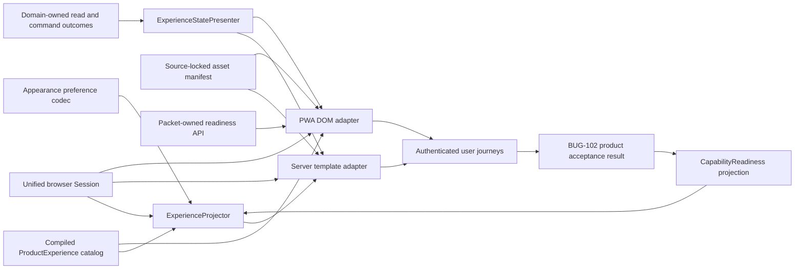
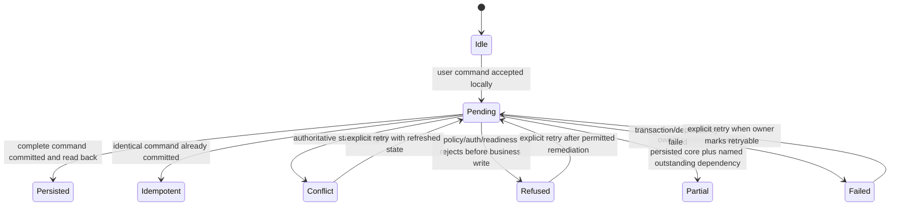

# Design: 106 Coherent Product Experience

## Design Brief

### Current State

Smackerel has three active browser presentation systems. `internal/web/templates.go`, `web/pwa/style.css` plus `web/pwa/lib/appnav.js`, and `internal/web/cardrewards_templates.go` each own different navigation, tokens, theme behavior, state styles, and layout. Their inventories already disagree; Wiki is absent from shared navigation, and PWA navigation suppresses construction failures.

The runtime defects belong to ten repair packets across specs 002, 004, 032, 039, 070, 073, 080, 083, and 102. Spec 105 owns the bounded connected graph explorer. Spec 106 integrates those contracts and must not duplicate their session, data, provider, readiness, Graph, Card, or deployment logic.

### Target State

One required `ProductExperience` foundation projects a source-locked surface catalog, canonical readiness, the unified browser session, and domain-owned outcomes into equivalent server and PWA chrome. Renderers share surface IDs, hierarchy, labels, route bindings, availability, appearance, tokens, and state semantics; only template versus DOM assembly differs.

No business datastore, provider registry, auth mechanism, or business API is added. Existing routes remain valid. A surface without a registered browser route and owner-proven journey is not shown as ready. Visual consistency never promotes capability state.

### Patterns To Follow

- Replace `internal/web/appshell.go` static links with a typed projection instead of adding another inventory.
- Consume BUG-032 readiness and BUG-070 session truth; never derive either in presentation code.
- Reuse BUG-002-006 same-origin HTMX and native-form baseline.
- Preserve `internal/api/router.go` routes, PWA paths, Card deep links, and spec-105 Graph ownership.
- Preserve BUG-083 Card density and behavior while applying shared shell, tokens, states, and accessibility.
- Reuse `web/pwa/playwright.config.ts` and BUG-102 production-read-only acceptance architecture.

### Patterns To Avoid

- Do not retain server extras and `appnav.js::ITEMS` as independent authorities.
- Do not copy Card CSS product-wide or leave Cards as a separate app.
- Do not invent `/today`, `/work`, `/sources`, or data endpoints; route-free groups are controls.
- Do not persist auth, business data, readiness, navigation truth, or transcripts in client storage/caches.
- Do not turn auth, store, provider, decode, or route failure into empty content.
- Do not ship inline handlers, runtime CDNs, copied tokens, nested cards, or card-styled page sections.
- Do not restore an optimistic static nav when readiness fails.

### Resolved Decisions

- Keep the multi-renderer architecture; no ground-up rewrite.
- Use a required compiled experience catalog plus canonical readiness.
- Server renders in-process; PWA joins generated catalog data to the packet-owned readiness API; spec 106 adds no product-data endpoint.
- Serve shared CSS/JS/fonts/icons as versioned same-origin bytes with a generated digest manifest.
- Persist only benign `system|light|dark` and `comfortable|compact` preference-cookie state.
- Keep capability, content, and mutation states independent.
- Reserve entity cards for visual wallet/photo items; use flat rows/bands elsewhere; never nest cards.
- Keep spec 105 and BUG-102 as sole owners of Graph behavior and deploy-eligible evidence.

### Open Questions

No architecture question blocks planning. Dependency ordering, absent browser-route ownership, explicit SST durations, and test partitioning are routed to `bubbles.plan`.

## Purpose And Change Boundary

This design owns the technical integration contract for:

- one product surface catalog and hierarchy;
- one readiness-driven navigation projection across server and PWA renderers;
- one source-locked token, typography, icon, appearance, and shell asset set;
- one content-state and mutation-feedback vocabulary;
- session-loss, access-denial, privacy-clearing, and safe-return presentation;
- cross-surface composition of Search, Today/Digest, Assistant, Knowledge,
  Graph, Cards, Recommendations, Sources, Activity, Settings, and Admin;
- responsive, keyboard, screen-reader, zoom, reduced-motion, forced-colors,
  light, dark, and system behavior;
- route/deep-link compatibility, service-worker migration, and rollback; and
- comprehensive real-stack Playwright and product-acceptance test seams.

This design does not own domain persistence, data APIs, provider adapters,
session issuance, Graph algorithms, Card business logic, product acceptance
execution, deployment adapter code, scopes, tests, source changes, docs claims,
or certification. It does not modify CCManager; `CCManager` is a
read-only benchmark only.

## Grounded Architecture Findings

| Surface | Current evidence | Design consequence |
|---|---|---|
| Server shell | `internal/web/appshell.go` contains six static anchors; `internal/web/templates.go` appends Digest, Topics, Status, and a localStorage theme toggle | Replace all static shell assembly with one typed projection and shared assets. |
| PWA shell | `web/pwa/lib/appnav.js` contains eight different items, determines active state from pathname, and catches all errors | Generate catalog data once; render an explicit projection-unavailable state instead of suppressing failure. |
| Server visual system | `internal/web/templates.go` embeds CSS, a remote HTMX script, inline theme code, broad `.card` usage, and 800px body layout | Move shell/tokens/components into same-origin assets; BUG-002-006 owns HTMX bytes and baseline Search behavior. |
| PWA visual system | `web/pwa/style.css` is dark-only, uses system fonts, 12px cards, and a 640px wrapped top nav | Replace token ownership and shell layout while retaining domain modules and static-page delivery. |
| Card visual system | `internal/web/cardrewards_templates.go` has the richest controls/tables but 16px radii, its own head, ten local links, horizontal mobile overflow, and widespread card sections | Reuse behavior and density, not the separate chrome or card-heavy composition. |
| Routes | `internal/api/router.go` registers current Search, Digest, Knowledge, Card, recommendation, notification, connector, photo, model, list, and meal APIs; several families are conditional | A route/handler/flag alone never makes a destination available. No unregistered API may appear in this design. |
| Wiki | `web/pwa/wiki*.html/js` exists, but shared nav omits it and BUG-080 proves Graph families can disappear through fail-soft wiring | Knowledge remains usable when Graph is unavailable; Graph appears only after BUG-080 and spec 105 evidence. |
| Session | Current legacy and modern middleware have different trust models, as confirmed by BUG-070-001 | Shell work cannot certify authenticated coherence before the unified session canary passes. |
| Test harness | `web/pwa/playwright.config.ts` discovers 28 feature-specific specs in a disposable lane; existing `unified_journey.spec.ts` checks only a subset of shell behavior | Extend feature-specific tests and add cross-surface contracts; route mounting and static text are insufficient. |
| Service worker | `web/pwa/sw.js` uses a manually versioned cache, precaches `style.css`/`appnav.js`, and excludes `/api/*` and non-GET requests | Generate the static asset inventory/digest, advance cache identity atomically, and retain network-only authenticated APIs. |
| CCManager benchmark | `web/app.py` and 23 templates expose complete wallet, offer, selection, bonus, monthly, report, calendar, scheduling, and history behavior | Preserve those outcomes through BUG-083; reject its file store, Basic Auth, query-secret cron, inline handlers, auto-dismiss errors, raw JSON report, and nested/card-heavy UI. |

### Honest Integration Constraints

Three UX destinations are not current browser capabilities. Lists have JSON API
routes, meal planning has a registered API family, and Expenses is represented
in product requirements, but the current route inventory does not prove a
complete browser destination for those Work children. `Work` and `Sources` also
have no current parent route. This design therefore models them as route-free
navigation groups and capability leaves without active hrefs until their owning
implementation supplies a registered route and real journey proof. It does not
name substitute endpoints.

The packet-owned `GET /api/capability-readiness` and operator readiness API are
design contracts, not current implementation evidence. Dynamic navigation
cutover depends on that packet. Likewise, `/knowledge/graph` is owned by spec
105 and remains unavailable until its activation and browser contract exist.

## Architecture Overview



The catalog owns presentation identity and route binding. The readiness
resolver owns whether a capability may be promised. The session owner supplies
principal, scopes, and carrier truth. Domain owners supply read or command
outcomes. `ExperienceProjector` and `ExperienceStatePresenter` compose those
facts; they never query domain tables or infer health.

## Capability Foundation

### Foundation Contracts

| Contract | Responsibility | Consumers |
|---|---|---|
| `ProductExperienceCatalog` | Stable surface IDs, hierarchy, labels, exact current route bindings, audience, ordering, renderer support, capability ID, and local-view membership | Config validation, server shell, generated PWA catalog, consumer trace |
| `ExperienceRouteValidator` | Prove every active leaf route exists in the owning browser manifest and every alias/current-path entry maps to one surface | Startup/build validation and release lint |
| `ExperienceAssetManifest` | Version, source, license, path, SHA-256, media type, CSP class, service-worker policy, and immutable cache identity for every shared CSS/JS/font/icon asset | Server/PWA heads, CSP tests, service worker, deployment bundle check |
| `AppearancePreferenceCodec` | Parse/serialize the closed theme and density preference without auth/business data | Pre-paint script, server head, Settings control |
| `ExperienceProjector` | Combine catalog, session audience, and canonical readiness into an immutable navigation/workspace projection | Server adapter and golden PWA fixtures |
| `ExperienceStatePresenter` | Map domain-owned typed outcomes to common loading/content/recovery semantics without changing domain truth | Search, Today, Assistant, Knowledge, Cards, Sources, Activity, Settings |
| `AuthenticatedRequestAdapter` | Apply one 401/403/privacy-clearing/safe-return behavior around existing domain transports | HTMX lifecycle adapter and PWA request helpers |
| `MutationFeedbackPresenter` | Present pending, persisted, idempotent, conflict, refused, failed, and partial outcomes from owning command contracts | Server forms and PWA mutations |
| `ExperienceSettledContract` | Stable DOM attributes and timing marks proving shell, readiness, content, appearance, and operation state have settled | Playwright, accessibility, bundle freshness, product acceptance |

### Extension Points

- A surface adapter provides an existing browser route and renderer component;
  it cannot declare its own readiness or session policy.
- A domain state adapter maps an owner-defined typed outcome to a shared
  presentation state. Unknown, malformed, or contradictory owner outcomes fail
  closed as `error`; they do not become empty or available.
- A renderer implements server template or PWA DOM assembly over the same
  projection. It cannot reorder, rename, hide, or promote a catalog entry.
- A component overlay may add domain-specific density and fields, but it must
  consume shared tokens, focus, state, and responsive primitives.
- A new destination requires an exact route binding, readiness capability ID,
  audience, consumer sweep, and real-stack journey before it can be active.

### Foundation-Owned Behavior

- one surface identity and parent/child relationship across every renderer;
- no ready navigation without current readiness evidence;
- no empty presentation without a successful authorized read;
- one appearance preference and one pre-paint decision across renderers;
- one content/state semantic vocabulary with domain-specific safe details;
- one privacy clear on session loss before protected content repaints;
- one mutation pending/terminal lifecycle and duplicate-submit protection;
- stable focus, active-parent, safe-return, and settled markers;
- source-locked assets, strict CSP, and service-worker cache coherence; and
- fail-loud catalog, route, token, asset, and renderer-projection validation.

## Concrete Implementations

### Server-Rendered Adapter

The server adapter replaces the static `appShellNav` string and the extra links
in `templates.go` with `ExperienceProjection`. Every page model carries
`SurfaceID`, `ParentSurfaceID`, `Navigation`, `Appearance`, and the page's typed
`ViewState`. `html/template` remains the escaping boundary. The shared head
contains only same-origin versioned assets; page templates no longer own token
values or inline theme/event code.

### PWA Adapter

The PWA adapter replaces the handwritten `ITEMS` array with generated catalog
data and joins it to the authenticated packet-owned readiness projection. It
constructs DOM nodes without `innerHTML`, keeps protected API responses
network-only, and publishes a visible shell error when readiness cannot be
resolved. It does not attach a bearer token or invent a static-ready fallback.

### Card Rewards Overlay

Card Rewards stops defining a second `head` and consumes the shared shell and
assets. Domain aliases map existing Card token names to shared semantic tokens
during migration, then templates move to shared component classes. Wallet card
images may use `entity-card`; offers, selections, bonuses, optimization,
sources, audit, import/export, and settings use flat rows, tables, bands, and
inspectors. BUG-083 remains the owner of every Card API, table, lifecycle,
command, audit, and portability contract.

### Knowledge And Graph Overlay

`/knowledge` and existing Wiki pages compose under one Knowledge workspace.
Browse remains usable if Graph is unavailable. Spec 105's Graph, Outline,
Table, Path, inspector, and saved-view components consume the shell but retain
their own bounded state, deterministic Canvas, semantic parity, and privacy
clear. The shell never renders a sample graph or interprets Graph errors.

### Work, Sources, Activity, Settings, And Admin Overlays

`Work` and `Sources` are route-free groups until a real parent route is owned.
Their menus expose only authorized child destinations with exact current
routes. Activity composes the existing notification routes under the user label
`Activity`; Settings consumes the readiness projection; Admin appears only for
an authorized operator and links only to registered tools. Group controls do
not use a guessed first-child route.

### Variation Axes

| Axis | Options | Foundation ownership |
|---|---|---|
| Renderer | server `html/template`, PWA DOM, Canvas/semantic Graph overlay | Catalog, tokens, states, and settled semantics shared; markup implementation differs |
| Destination kind | linked leaf, route-free group, authorized utility, contextual local view | Catalog schema and route validation |
| Audience | authenticated user, Card owner, operator | Session/readiness projection; renderer cannot elevate |
| Availability | available, needs setup, degraded, unavailable | Canonical readiness owner; shell only presents |
| Content state | loading, ready, empty, filtered empty, stale, degraded, unauthorized, access denied, not found, error | Shared presenter with domain-owned cause |
| Interaction | native navigation/form, HTMX enhancement, PWA fetch, Canvas interaction | Same session/state/focus/feedback contract |
| Viewport/input | desktop, tablet, mobile, narrow zoom, keyboard, screen reader, coarse pointer | Shared responsive and accessibility primitives |
| Theme/density | system/light/dark; comfortable/compact | Appearance codec and token asset |

## Dependency And Ownership Map

| Dependency | Sole owner contract consumed by spec 106 | Spec 106 integration boundary | Readiness gate before dependent UI can claim Available |
|---|---|---|---|
| `specs/002-phase1-foundation/bugs/BUG-002-006-search-htmx-sri-blocks-submit` | Semantic Search form, exactly-one submission, same-origin source-locked HTMX, strict CSP, typed Search states | Shared assets and state presenter wrap the repaired Search page; no second submit implementation | Search baseline and enhanced real-browser scenarios pass |
| `specs/002-phase1-foundation/bugs/BUG-002-007-digest-date-scan-false-empty` | Canonical typed Digest reader, DATE semantics, empty/error exclusivity, freshness contract | Today labels and composes its `DigestPageModel`; no duplicate SQL or date conversion | Current, quiet, stale, empty, and error browser cases pass |
| `specs/004-phase3-intelligence/bugs/BUG-004-004-synthesis-persistence-and-health-truth` | Durable run/output/citation persistence, read-back, health, retry, source completeness | Today and Settings render the owner read model; no synthesis persistence here | Durable output/health scenarios are current |
| `specs/032-documentation-freshness/bugs/BUG-004-production-readiness-claims-runtime-drift` | Capability catalog, append-only evidence, resolver, four-state projection, docs/release claim truth | Navigation, Settings, badges, and permitted actions consume the projection without recalculation | Resolver APIs and cross-consumer projection canaries pass |
| `specs/039-recommendations-engine/bugs/BUG-039-005-enabled-with-zero-providers-false-ready` | Provider descriptors/adapters, category/operation availability, request/watch gating, provider evidence | Work/Recommendations presents availability/outcomes; no provider registry or watch logic here | At least one real adapter is ready or truthful unavailable state is proven |
| `specs/070-web-username-password-login/bugs/BUG-070-001-production-credential-session-paseto-split` | Credential-principal grants, browser PASETO, one authenticator, purpose, logout/revocation | All renderers use one cookie/session; no token bridge in shell code | Production-mode login reuse and middleware-parity canary pass |
| `specs/073-web-mobile-assistant-frontend/bugs/BUG-073-006-auth-rejection-blank-assistant-response` | Per-turn model, transport normalizer, paired pending/terminal outcomes, retry identity | Assistant/Today composition supplies shell/layout only; no second turn reducer | Every real turn has one nonblank terminal or pending state |
| `specs/080-knowledge-graph-public-api/bugs/BUG-080-001-graph-api-fail-soft-runtime-disable` | Atomic Graph activation, route manifest, typed read outcomes, read synthetic | Knowledge presents Browse/Graph availability and privacy state | Complete authenticated family read is current |
| `specs/083-card-rewards-companion/bugs/BUG-083-002-ccmanager-parity-runtime-drift` | Claim ownership, commands, lifecycle, versions, operations, audit, portability, all Card APIs and 16 parity rows | Shared shell/theme/state, seven-view IA, no nested cards, deep-link preservation | Every parity row and representative cross-surface loop passes |
| `specs/102-target-deploy-hardening/bugs/BUG-102-001-product-journey-acceptance-gap` | Product manifest/runner/evidence, production-read-only policy, verdict, adapter boundary | Stable surface/state hooks and cross-surface scenarios become manifest inputs | Release-matched production-read-only result is accepted |
| `specs/105-connected-knowledge-graph-explorer` | Graph query/path contracts, deterministic Canvas, semantic projections, saved views, scale/privacy | Shared Knowledge shell, local nav, themes, layout tracks, availability | Spec-105 API/UI/canvas/accessibility contract is implemented and current |

### Existing Foundation Dependencies

- Spec 100 remains the historical shell/navigation foundation, but its static
  arrays and body-neutral scope are superseded by this projection design.
- Spec 077 remains the disposable Playwright harness and discovery convention.
- Spec 104 Scope 8 remains the Assistant self-knowledge contract; the browser
  surface consumes only evidence accepted by its owning packet and BUG-102.

No owner row above may be reimplemented inside a spec-106 scope. A missing
owner contract blocks only the dependent destination or foundation cutover; it
does not authorize a shell-side approximation.

## Product Experience Catalog

### Required SST Shape

The catalog is a required `product_experience` block in
`config/smackerel.yaml`, compiled through the existing config pipeline. It is
not a second readiness catalog. It references readiness capability IDs owned by
the readiness packet.

```yaml
product_experience:
  schema_version: smackerel-product-experience/v1
  appearance:
    cookie_name: smackerel_appearance
    cookie_max_age_seconds: ${PRODUCT_EXPERIENCE_APPEARANCE_COOKIE_MAX_AGE_SECONDS}
    initial_theme: system
    initial_density: comfortable
  asset_manifest: web/pwa/assets/experience-assets.v1.json
  surfaces: []
```

The empty `surfaces` value above demonstrates the required type only. An active
runtime requires the complete product inventory; an empty inventory is invalid.
Every surface entry requires:

```text
id
label
kind = linked_leaf | route_group | utility | local_view
parent_id (explicit null for a root)
order
capability_id
audiences[]
href (required for a linked leaf; explicit null for a route group)
current_paths[]
renderer_support[]
local_view_id (explicit null when not a local view)
readiness_discoverability_policy
```

No field has an application fallback. Duplicate IDs/order, unknown parents or
capability IDs, cycles, active leaf without an exact route, route group with an
href, unregistered current path, unsupported audience, or catalog/readiness
digest mismatch fails configuration or build validation.

### Active Route Binding Rules

| Product surface | Current route binding | Integration rule |
|---|---|---|
| Today | `/digest` | The user label changes; the current route and bookmarks remain. No `/today` alias is introduced. |
| Assistant | `/assistant`, redirecting to `/pwa/assistant.html` | Existing memorable route remains the product entry. |
| Capture | `/pwa/` | Existing static shell remains; capture outcomes retain their owner. |
| Search | `/` with `POST /search` | Existing route and repaired semantic form remain. |
| Knowledge | `/knowledge` plus current Wiki paths | Parent is active for every Wiki/Graph child. Existing Wiki paths remain valid. |
| Graph | `/knowledge/graph` | Bound only when spec 105 registers it; until then no active href is generated. |
| Work | explicit null | Route-free group control. It opens its child menu, not a guessed route. |
| Cards | `/cards` and existing Card children | Existing ten deep links remain; seven local-view labels compose them. |
| Recommendations | `/recommendations` | Existing route remains; action eligibility comes from BUG-039. |
| Lists / Meals / Expenses | no proven browser binding | Catalog entries remain unavailable without href until owning browser routes and journeys exist. Existing APIs are not renamed or exposed as pages by inference. |
| Sources | explicit null | Route-free group control. |
| Connectors | `/pwa/connectors.html` | Existing route remains. |
| Photos | `/pwa/photo-health.html` plus existing photo children | Existing routes remain; local views preserve direct links. |
| Models | `/pwa/model-connections.html` for authorized operator inventory | Non-operators do not discover Admin controls. |
| Activity | `/notifications` and existing notification children | User label changes; routes remain. |
| Settings | `/settings` | Existing route remains and becomes readiness/appearance home. |
| Admin | explicit null | Authorized group for current `/admin/*` and operator PWA tools; no generic invented page. |

### Navigation Projection

`ExperienceProjector` returns immutable rows:

```text
surface_id
parent_id
label
kind
href
current
parent_current
availability = available | needs_setup | degraded | unavailable
limitation_code
action_code
children[]
projection_digest
```

Rules:

1. The session determines audience and authorization before projection.
2. The readiness resolver supplies availability and permitted action.
3. Unauthorized Admin entries are omitted, not labeled unavailable.
4. `Available` leaves are ordinary links.
5. `Degraded` leaves remain links only when readiness proves useful behavior;
   limitation text is adjacent in the destination and available in menus.
6. `Needs setup` entries appear only to an actor permitted to configure them
   and lead only to the packet-owned setup/detail action.
7. `Unavailable` entries are omitted from primary daily promises or rendered
   as non-ready menu rows where discoverability is required. They never point
   to a missing route.
8. A route group opens a menu/sheet. If an explicit last-child preference
   exists and remains authorized/available, a separate `Resume` command may
   open it; absence never selects a hidden first-child fallback.
9. Direct deep links activate both child and parent without redirecting.
10. Resolver failure produces `projection_unavailable`: no capability is shown
    as ready, the current safe route remains visible, and Settings/Sign out are
    offered as foundation recovery. Static arrays are not used.

Server and PWA adapters expose only the content-free `projection_digest` for
cross-renderer comparison. They do not expose scopes, evidence IDs, or secret
configuration.

## Theme, Tokens, Components, And Asset Integrity

### Shared Asset Package

One source directory produces versioned same-origin assets:

- semantic token and component CSS;
- appearance pre-paint and appearance-control JavaScript;
- shell/navigation DOM adapter JavaScript;
- self-hosted IBM Plex Sans, Source Serif 4, and IBM Plex Mono font files;
- source-locked icon assets; and
- `experience-assets.v1.json` containing path, media type, source package,
  license reference, SHA-256, size, CSP class, and service-worker policy.

Server heads and PWA pages reference the same URLs. Templates contain no copied
token values. The build compares every served byte to the manifest and fails on
missing, extra, mismatched, mutable, or unknown-origin assets. Fonts and icons
are fetched only from the product origin. A browser font safety family may keep
content readable after an asset failure, but asset integrity still fails the
release; readability containment is not evidence that delivery succeeded.

### HTMX And CSP

BUG-002-006 remains the sole HTMX asset owner. The experience asset manifest
references its exact same-origin version and digest; it does not embed another
copy. Native links/forms remain complete without HTMX. Search keeps the packet-
owned semantic form and exactly-one submit behavior. Card forms remain native
Post/Redirect/Get unless enhanced by that same shared asset.

Final primary surfaces use no runtime CDN, inline event handler, `unsafe-eval`,
or page-owned theme script. CSP remains same-origin. Static asset responses use
the exact media type, `nosniff`, immutable cache identity, and content-derived
ETag. Service-worker generation includes only manifest-approved static assets;
`/api/*`, `/v1/*`, authenticated HTML, and non-GET requests remain network-only.

### Appearance Preference

The non-sensitive cookie payload is versioned and closed:

```text
version = 1
theme = system | light | dark
density = comfortable | compact
```

It contains no user ID, session reference, route history, graph view, prompt,
Card data, provider state, or readiness evidence. Cookie Path is `/`, SameSite
is `Lax`, and Secure is required in production. Its persistence duration is an
explicit positive SST value.

The server parses the cookie before rendering and emits the exact theme/density
attributes on `<html>`. Static PWA pages load a synchronous same-origin
pre-paint asset before the shared stylesheet and apply the same codec. Missing
preference is materialized as the UX-required initial `system/comfortable`
state; invalid version/value is reported as `preference_invalid` and replaced
with that explicit initial state. No `value || hiddenDefault` or localStorage
branch is permitted.

`system` uses `prefers-color-scheme` and follows operating-system changes.
Forced colors is never overridden. Density changes spacing/row composition but
not text below 13px, coarse-pointer targets, fields, actions, or content.

### Component Semantics

| Primitive | Structural contract |
|---|---|
| Product rail / mobile bar | One primary nav landmark, stable dimensions, text labels, parent/child state, 44px coarse-pointer targets |
| Workspace header | Breadcrumb, one h1, capability state, and commands in stable rows; no hero or feature-description card |
| Local view switcher | Native links/tabs when all items fit; named menu otherwise; no horizontally hidden mobile destinations |
| State band | Full-width unframed status row for loading, stale, degraded, unavailable, auth, error, or success |
| Entity row | Default repeated-record composition for Search, Knowledge, Sources, Activity, Cards operations, and audit |
| Entity card | Reserved for wallet cards, photos, or another genuinely visual repeated entity |
| Data table | Semantic headers/sort/filter and mobile labeled-row projection with no omitted required field |
| Inspector / sheet | Selection detail; focus returns to invoker; destructive action opens separate confirmation |
| Mutation footer | Save/cancel/destructive separation; pending prevents duplicate; status remains visible |
| Evidence row | Source, observed time, limitation/confidence, and safe open action in one semantic order |

Page sections are full-width bands or unframed constrained layouts. A panel is
not placed inside an entity card, and an entity card is never placed inside
another card. Repeated wallet cards may contain rows and controls, not child
cards. Template/DOM validation rejects nested `.entity-card`, legacy `.card`
inside `.card`, and page-section wrappers that use card styling as layout.

## Capability Availability, View State, And Mutation Feedback

### Two Independent State Axes

Capability availability is owned by the readiness resolver and rendered with
the UX labels:

| Resolver value | Visible label | Meaning |
|---|---|---|
| `available` | `Available` | Route, config, activation, health, user journey, and deployment evidence satisfy the current catalog policy. |
| `needs_setup` | `Needs setup` | Optional actor-remediable configuration is absent; it is not usable now. |
| `degraded` | `Degraded` | Current evidence proves useful behavior remains with a named limitation. |
| `unavailable` | `Unavailable` | Disabled, unsupported, broken, unverified, unauthorized-to-discover, or missing every usable dependency under the owner policy. |

Page content state is independent:

| View state | Required evidence | Content and recovery rule |
|---|---|---|
| `loading` | Authorized operation started | Stable skeleton/track, busy semantics, duplicate action disabled. |
| `ready` | Successful authorized populated read | Render authoritative data and observed time where relevant. |
| `first_use_empty` | Successful authorized zero-row read with no prior record | Explain what can create data; never sample data. |
| `filtered_empty` | Successful read has data outside current query/filter | Retain filters/query and offer clear/edit. |
| `stale` | Last verified result exists but exceeds owner freshness | Retain result, exact age, owner refresh/generation state; never label current. |
| `degraded` | Owner returns verified useful subset/previous result plus limitation | Retain only verified content and name omission. |
| `needs_setup` | Owner readiness says optional setup is allowed | Show only authorized setup action; no normal data controls. |
| `disabled` | Explicit owner policy disables capability | Render Unavailable support boundary; no impossible setup action. |
| `unauthorized` | Session missing, expired, revoked, or wrong purpose | Synchronously clear protected content; offer safe re-authentication. |
| `access_denied` | Valid session lacks scope/role | No login loop and no inaccessible existence detail. |
| `not_found` | Authorized lookup proves target absent | Stable parent navigation and no inaccessible metadata. |
| `error` | Read, decode, schema, route, store, or dependency failed before useful verified output | No empty copy; safe cause class and owner-approved Retry/Return. |

The state presenter accepts only typed owner outcomes. It never parses raw error
strings to choose empty/readiness/auth behavior. Unknown combinations are
`error` with a safe correlation reference.

### Mutation State Machine



Success is announced only from `persisted` or owner-defined complete
`idempotent`. Partial is never styled or announced as complete. Every state
retains the initiating control's context, clears stale incompatible status,
uses one live-region transition, and refreshes authoritative state after a
write. Domain owners continue to own idempotency, CSRF, versions, transactions,
and external outboxes.

### Stable DOM Contract

Every primary page exposes:

```text
html[data-theme][data-density]
body[data-experience-version]
nav[data-product-navigation][data-projection-digest]
main[data-surface-id][data-parent-surface-id]
[data-capability-availability]
[data-view-state]
[data-operation-state] when a command is active
[data-experience-settled=true] only after shell and content are terminal
```

Values are closed enums or content-free digests. User content, IDs, scopes,
tokens, evidence references, prompts, and queries never appear in test hooks.

## Session And Authenticated Transport Contract

Spec 106 has no authentication implementation. After BUG-070-001:

- username/password login issues one persisted browser-purpose PASETO in the
  existing HttpOnly `auth_token` cookie;
- legacy pages, PWA same-origin fetches, `/api`, and `/v1` authenticate through
  the same `RequestAuthenticator` and produce the same `auth.Session`;
- PWA code uses `credentials: "same-origin"` and never injects Authorization,
  reads a cookie, or stores a token;
- 401 means the browser session ended, clears protected DOM/state before paint,
  and offers `/login?next=<allowlisted-path>` without user input or fragments;
- 403 means access denied and never loops through login;
- a downstream store/provider failure remains a surface error and does not
  invalidate the session; and
- logout revokes the canonical token before success, clears protected content,
  and prevents Back/direct replay.

`AuthenticatedRequestAdapter` standardizes only those cross-surface outcomes.
Search, Assistant, Graph, Cards, recommendations, connectors, photos, models,
and notifications retain their own request/response decoders. HTMX 401/403
responses do not swap a login document into a content region. PWA helpers clear
their domain state before publishing the shared auth/access state.

## Cross-Surface Composition

### Search

The shell labels `/` as Search and consumes BUG-002-006's semantic form,
same-origin HTMX, exactly-one request, full-page/fragment model, and typed
states. No shell script calls `fetch`, `requestSubmit`, or HTMX request APIs for
Search. Search result/detail Back restores safe query/filter/focus context
through browser history, not a client business-data cache.

### Today, Digest, And Synthesis

`/digest` becomes the Today destination without a route rename. The base digest
comes only from BUG-002-007's canonical typed reader. Durable synthesis comes
only from BUG-004-004's persisted read model. Their independent availability,
freshness, quiet, stale, and failure states remain visible; one cannot fill in
for the other. Due actions link to owning workspaces and no unread/backlog count
is introduced.

### Assistant

The shell and responsive layout surround BUG-073-006's per-turn reducer. Every
user row retains exactly one paired pending/terminal Assistant row. The shell
does not map auth/provider/schema failure to capture, refusal, or success.
Today context has an independent state region so its failure cannot blank the
Assistant transcript.

### Knowledge, Wiki, And Graph

Knowledge Browse uses the repaired BUG-080 family contract. Existing PWA Wiki
routes remain direct deep links. Spec 105 owns Graph query/path/projections and
Canvas pixels. The local Graph view is enabled only when both Graph activation
and spec-105 readiness are current. Graph unavailable never converts Browse to
404 or empty, and Browse data never fabricates a graph.

### Recommendations And Providers

The Work/Recommendations surface consumes BUG-039's category/operation
`AvailabilitySnapshot`. Request/watch actions appear only when the exact
operation is eligible. Enabled with zero providers is Unavailable or Needs
setup according to canonical requiredness. Healthy no-match, policy-filtered
empty, all-provider failure, and partial-provider degradation remain distinct.

### Sources, Photos, Models, Activity, And Settings

Sources is a route-free group over current connector, photo, and model pages.
Each domain retains its own status API and mutation contract. Settings and
Activity use the shared state vocabulary but do not replace connector/photo/
notification/model logic. Operator-only actions are omitted for ordinary users
and values remain redacted. Capability status comes only from readiness.

### Deployment Capability Readiness

The Admin acceptance view, when its owner delivers it, reads BUG-102's immutable
safe result and BUG-032's readiness projection. It cannot run acceptance,
provide identity, change requiredness, deploy, keep, or roll back a release.
Container health, mounted routes, and screenshots alone never become Available.
Native-client availability consumes the current immutable artifact fact; no
artifact means Unavailable and no download action.

## Cards Parity-Or-Better Composition

Read-only CCManager inspection covered `web/app.py`, `base.html`, dashboard,
wallet, offers, selections, bonuses, monthly recommendations, report, and admin
history. It is not a runtime service, data source, package, or migration input
for this feature. BUG-083 supplies the complete domain repair.

| Parity area | Smackerel composition | Improvement over the benchmark |
|---:|---|---|
| 1 Wallet CRUD/metadata | Work / Cards / Wallet | Claim-bound PostgreSQL rows, optimistic versions, cascade preview/read-back, no PAN/CVV fields |
| 2 Multi-category/shared-limit offers | Cards / Benefits / Offers | One logical offer and typed limit pool; no duplicated shared cap |
| 3 Categories/selections lifecycle | Cards / Benefits / Selections and Categories | Persisted lifecycle/cause identity, keyboard alternatives, non-recurrence |
| 4 Bonuses/calendar | Cards / Bonuses | Stable binding/outbox, idempotent complete/delete/retry, truthful partial delivery |
| 5 Historical optimization | Cards / Optimize | Immutable versions, compare, preview, restore-as-new, preserved manual choices |
| 6 Source operations | Cards / Sources | Approved-source policy, citations/confidence/disagreement, typed partial failure |
| 7 Audit/history | Cards / Audit | Append-only PostgreSQL user/operation events including refusal/no-op/failure |
| 8 Safe config | Cards / Sources and Settings | Value-safe readiness; missing required config refuses instead of mounting inert controls |
| 9 Import/export | Cards / Import & Export | Versioned dry-run, conflict closure, transaction, idempotency, no secrets |
| 10 Pending selections | Cards / Today and Benefits | Cause, reason, due period, resolve/dismiss, no unread count |
| 11 Reports | Cards / Optimize / Report | Persisted version, provenance, freshness, alternatives, safe rendered export rather than raw JSON |
| 12 Schedules/manual triggers | Cards / Sources / Schedule | Durable operation key/lease/recovery and one effective run |
| 13 Coherent UX | Shared product shell plus seven Card local views | No separate app chrome; every old deep link remains active |
| 14 Explicit errors | Shared state band plus BUG-083 error taxonomy | No auto-dismiss, raw error, redirect-only success, or partial false success |
| 15 Mobile/a11y/theme | Shared responsive/theme/focus contracts | No horizontal local-nav trap; Move Up/Down peers; 320px/200% zoom/forced-colors proof |
| 16 Security | BUG-083 owner/session/CSRF/SSRF/export controls | Per-user authorization, immutable audit, redaction, no Basic Auth/query secret/file store |

### Seven-View Compatibility Mapping

| Local view | Existing routes preserved |
|---|---|
| Today | `/cards` |
| Wallet | `/cards/wallet` and current add/edit children |
| Benefits | `/cards/offers`, `/cards/selections`, `/cards/categories` |
| Bonuses | `/cards/bonuses` |
| Optimize | `/cards/recommendations`, `/cards/rotating`, `/cards/report` |
| Sources | `/cards/admin` plus BUG-083-owned operations |
| Audit | BUG-083-owned additive `/cards/audit` |

Import/Export remains a command workflow, not an eighth navigation silo. The
shared renderer keeps existing `data-*` hooks until replacement tests are
active. There is no request from Smackerel to CCManager during build, runtime,
test, import dry-run, or deployment.

## Data Model And Persistence

### No New Business Store

Spec 106 adds no PostgreSQL business table and copies no domain record. Domain
state stays in the stores owned by the ten packets and spec 105. Capability
readiness evidence stays in BUG-032's append-only tables. Card data stays in
BUG-083's owner-scoped tables. Graph saved views stay in spec 105.

### Product Experience Model

`ProductExperienceCatalog` is required compiled configuration, not mutable
runtime data. `ExperienceProjection` is an immutable per-request value. The PWA
holds it in memory and refetches readiness after authentication, appearance,
release, or explicit capability-state changes. It is never a durable client
data source.

The appearance cookie is the only new persisted browser value. It stores only
the closed theme/density tuple. No route history is required for group
navigation; an explicit last-view preference may be added to the same benign
versioned cookie only if planning names its closed surface-ID field and tests
authorization invalidation. It cannot contain a URL or record ID.

### Configuration Values

The implementation requires explicit positive values for appearance-cookie
retention and any shell timing used for progress/settle budgets. Token values,
asset versions, catalog entries, viewports, and state enums are committed
product contracts. Missing required values fail config/build validation. No
source-level `||`, `??`, `unwrap_or`, `os.getenv(..., value)`, shell
`${VAR:-value}`, or equivalent may mask absent runtime configuration.

## API And Contract Boundaries

### No Invented Endpoint Rule

Spec 106 introduces no product-data API endpoint. It uses:

- current browser routes from `internal/api/router.go`;
- current domain APIs called by those browser surfaces;
- packet-defined contracts such as `GET /api/capability-readiness`,
  recommendation availability, durable synthesis reads, and BUG-102 result
  validation only after their owners implement them; and
- spec-105 Graph query/path routes only after spec 105 implements them.

Lists, Meals, Expenses, route-free Work/Sources groups, and Admin grouping do
not receive guessed paths. A planned contract is marked dependency-owned and is
not evidence of a current route.

### In-Process Renderer Contract

Server handlers receive:

```text
ExperiencePageContext {
  projection
  appearance
  surface_id
  parent_surface_id
  capability_availability
  view_state
  mutation_state
}
```

The exact language type may vary, but all fields are explicit and validated.
PWA generated catalog data and readiness responses produce the same logical
shape. Golden contract fixtures assert byte-equivalent surface order, IDs,
labels, hrefs, parent state, and availability across adapters.

### Foundation Error Codes

| Code | Meaning | Behavior |
|---|---|---|
| `F106-CATALOG-MISSING` | Required experience catalog absent/empty | Build/startup refusal |
| `F106-CATALOG-INVALID` | Unknown enum, cycle, duplicate, invalid parent/audience | Build/startup refusal |
| `F106-ROUTE-DRIFT` | Active leaf/current path is not in owning browser manifest | Build/release refusal |
| `F106-READINESS-MISMATCH` | Unknown capability or catalog/readiness digest mismatch | No ready projection; validation failure |
| `F106-ASSET-MANIFEST-INVALID` | Missing/extra/mismatched asset bytes, media type, source, or license | Build/release refusal |
| `F106-APPEARANCE-INVALID` | Unsupported preference version/value | Explicit initial preference plus safe diagnostic; never auth failure |
| `F106-PROJECTION-INVALID` | Server/PWA projection violates order/parent/availability invariant | Surface unavailable and validation failure |
| `F106-STATE-CONTRADICTION` | Owner outcome requests incompatible view states | Error state; no empty/success rendering |

Messages contain no user content, route parameter, scope list, evidence ID,
secret, provider payload, or raw error.

## Authorization Matrix

| Surface | Authenticated user | Card owner | Operator | Public |
|---|---:|---:|---:|---:|
| Product shell and appearance | Own projection | Own projection | Expanded authorized projection | Login/static install shell only |
| Search, Today, Assistant | Required scopes/session | Same | Same | No protected data |
| Knowledge/Wiki/Graph | Only when Graph reader policy permits | Same | Permitted by owner policy | No |
| Cards | No other owner's rows | Own rows/actions by Card scope | Explicit support/source scope only | No |
| Recommendations | Own requests/watches when operation eligible | Same | Provider detail where authorized | No |
| Sources/Photos | Own safe status/config surface | Same | Setup/test/sync where authorized | No |
| Models/Admin/Acceptance | Omitted or 403 | Omitted or 403 | Safe operator projection/actions | No |
| Activity | Own authorized events/actions | Same | Expanded operational view where authorized | No |
| Settings/readiness | Daily-user redacted projection | Same | Eight-dimension safe evidence projection | No |

Navigation visibility never substitutes for route authorization. Direct links
recheck the session/scope/owner and disclose no inaccessible record existence.

## Security And Privacy

- The unified browser token remains HttpOnly, same-origin, purpose-bound,
  scoped, expiring, and revocable. Appearance code never reads or writes auth.
- Cookie-authenticated mutations keep `BUG-070-001`'s `MutationTrustGuard`
  (AUTH-011) as their owning same-origin + session-bound anti-CSRF guard; each
  domain (for example `BUG-083-002` Cards) binds to it. The shell does not add a
  generic token, a parallel guard, or a bypass.
- Static assets are same-origin, source-locked, byte-verified, content-typed,
  `nosniff`, and covered by CSP. Runtime CDNs and inline event handlers are
  forbidden.
- Navigation/readiness projections expose only discoverable surface IDs,
  labels, four-state availability, safe limitation/action code, and a digest.
  They omit scopes, evidence IDs, config keys, provider secrets, and target
  topology.
- On 401/revocation, each adapter aborts active reads, clears protected DOM,
  accessible names, graph pixels/geometry, Assistant pending content, and
  in-memory projection before rendering re-authentication.
- The service worker cannot cache authenticated HTML, `/api`, `/v1`, Graph,
  readiness, Assistant turns, Cards, or other business responses.
- Safe external links retain domain-owner scheme/host validation and explicit
  new-window purpose. The shell never accepts an arbitrary href from runtime
  evidence.
- Logs, metrics, traces, screenshots, accessibility snapshots, URLs, clipboard,
  and test artifacts exclude credentials, prompts, digest/synthesis prose,
  graph labels/IDs, card facts, provider payloads, photo metadata, and
  inaccessible records.
- The product deployment boundary remains generic; no target hostname, IP,
  operator path, tailnet identity, or secret value enters catalog or assets.

## Accessibility And Responsive Architecture

### Layout Tracks

| Viewport | Shell | Workspace behavior |
|---|---|---|
| `>=1200px` | 232px rail plus bottom-anchored Settings/user controls | Main track plus optional inspector/context track; no hamburger |
| `768px-1199px` | 64px icon rail with names/tooltips | Local tabs only when all fit; otherwise named Views menu |
| `<768px` | Bottom bar Today/Assistant/Capture/Search/More with safe-area padding | More is a full-height sheet; local child switcher below header |
| `320px` at 200% zoom | Same mobile order with wrapped labels and non-occluding controls | One content column; tables become complete labeled records |

Fixed shell dimensions are reserved before content loads so state changes do
not shift navigation, headers, graph bounds, or mutation controls. Long labels,
safe errors, user content, and translated strings wrap. No viewport-width font
scaling or negative letter spacing is used.

### Interaction And Semantics

- One primary navigation landmark and one main landmark per page.
- One h1; section headings follow hierarchy and remain compact inside dense
  surfaces.
- Icon-only controls use the source-locked icon asset, accessible name, and
  tooltip; consequential/destructive commands retain text.
- Every primary action is keyboard accessible. Drag has Move Up/Down peers.
- Dialogs/sheets trap focus, restore their invoker, and cannot cover required
  content or the virtual keyboard.
- Field errors link through `aria-describedby`; submit failure focuses the
  summary then the first invalid field.
- Loading and ordinary success use a concise status; blocking failure uses one
  alert. Re-rendering does not repeat announcements.
- State, availability, selection, graph edge type, error, and progress never
  rely on color, position, motion, or canvas pixels alone.
- All themes meet WCAG 2.2 AA. Forced colors preserves boundaries and focus.
  Reduced motion removes shimmer, pulses, graph interpolation, panel movement,
  and drag inertia without hiding state.
- Graph visual/semantic parity, resize, DPR, and nonblank pixel assertions stay
  exactly as designed by spec 105.

## Observability And Failure Handling

### Foundation Metrics

- `smackerel_experience_projection_total{renderer,outcome,code}`
- `smackerel_experience_projection_duration_seconds{renderer,outcome}`
- `smackerel_experience_surface_state_total{surface,state}` for the bounded
  catalog IDs and closed states
- `smackerel_experience_asset_integrity_total{asset_class,outcome}`
- `smackerel_experience_auth_recovery_total{renderer,outcome}`
- `smackerel_experience_renderer_mismatch_total{contract}`

There is no generic client beacon in this design. Server renderers may emit the
foundation metrics directly. PWA behavior is observed by product acceptance or
an existing explicitly owned telemetry seam; no fire-and-forget endpoint is
invented. Domain metrics remain authoritative for Search, Digest, Assistant,
Graph, Cards, recommendations, connectors, photos, notifications, synthesis,
and auth.

Labels contain no user, route parameter, query, prompt, record ID, provider
payload, target, or evidence ID. Catalog surface IDs and closed codes are the
only surface dimensions.

### Trace Topology

When planning declares an instrumented experience workflow and the project
trace contract is extended by its owner, the static topology is:

```text
product.experience.journey
|- session.authenticate          # carrier/purpose/outcome only
|- readiness.resolve             # catalog digest, audience class, outcome
|- experience.project            # renderer, projection outcome/digest
|- surface.operation             # surface ID, read|command, owner outcome
`- experience.present            # view state, settled outcome, duration
```

Domain spans remain children of `surface.operation`; spec 106 does not rename
them or add content attributes. Current project config declares only
`core.health`, so this topology is planning guidance, not a claim that a new
workflow is wired or validated.

### Failure Containment

| Failure | Containment |
|---|---|
| Catalog/route validation | Refuse build/startup; do not serve a guessed shell. |
| Asset digest/CSP/source failure | Refuse build/release; native HTML remains the behavioral baseline during development. |
| Readiness unavailable | No capability-dependent ready links; current safe page plus Settings/Sign out recovery. |
| Session loss | Clear protected state synchronously, abort requests, show re-authentication and safe return. |
| Access denied | Keep session; remove inaccessible details; no login loop. |
| Domain read failure before useful result | Error, never empty. |
| Domain partial/stale verified result | Retain only verified content with exact limitation/age. |
| Mutation conflict/failure | Preserve authoritative prior data and safe input; never announce success. |
| One renderer fails | Its surface reports unavailable; another renderer is not called a fallback or proof of success. |
| Canvas render failure | Spec-105 Outline/Table remain the owner-defined semantic projections over the same authorized state. |
| Service-worker stale cache | Asset-manifest/cache-version mismatch fails validation and old caches are removed on activation. |

## Migration And Compatibility Strategy

### Consumer Impact Sweep

The cutover must inventory and update together:

- `internal/web/appshell.go`;
- `internal/web/templates.go` heads, extras, theme code, and state classes;
- `internal/web/cardrewards_templates.go` head and local navigation;
- every PWA page head and `web/pwa/lib/appnav.js`;
- `web/pwa/style.css`, page-specific CSS, icon/font references;
- `web/pwa/sw.js` static asset inventory/cache identity;
- `web/pwa/manifest.json` shortcuts;
- route-active tests, stable `data-*` hooks, browser history, redirects;
- managed docs and release claims through `bubbles.docs`; and
- BUG-102 product journey manifest entries after behavior is implemented.

### Forward Sequence

1. Complete the readiness/session/Search/Digest/Assistant/Graph-activation
   foundations needed by the shell. Do not cut over to a projection that cannot
   resolve current truth.
2. Add and validate the experience catalog, route validator, asset manifest,
   shared tokens/fonts/icons, appearance codec, and golden projection fixtures
   without changing active navigation.
3. Render the shared server and PWA projection in shadow contract tests. Compare
   exact IDs/order/routes/parents/states/digest before user cutover.
4. Move server, Card, and PWA heads to shared versioned assets. Run independent
   login, native Search, HTMX read, HTMX mutation, Card PRG, PWA auth, and
   service-worker canaries before broad suites.
5. Switch both navigation renderers in one compatibility change and remove the
   old arrays/extras. Do not retain a hidden static fallback.
6. Migrate primary page bodies to state/component primitives one owner surface
   at a time, preserving routes and data hooks until replacement tests pass.
7. Compose BUG-083's seven Card views and spec 105's Knowledge/Graph local views
   only after their owner contracts are implemented.
8. Add cross-surface, responsive, accessibility, asset, and performance
   regression coverage. Then let BUG-102 consume the implemented stable hooks
   and current readiness result.
9. Reconcile UI/docs/release claims through readiness snapshots and
   `bubbles.docs`; never update claims from design completion.

### Backward Compatibility

- Current URLs and HTTP methods remain. Label changes do not rename paths.
- Existing Card ten-route deep links remain while seven local views become the
  navigation grouping.
- Existing Wiki PWA paths remain; Graph adds only its spec-105 route after that
  owner delivers it.
- Existing PWA manifest and service-worker clients receive an atomic cache
  revision containing the new complete asset set. Old cache entries are
  deleted after activation; APIs remain network-only.
- Existing `data-*` hooks remain until every first-party consumer is moved and
  a stale-reference scan is clean.
- Appearance localStorage is read once only by a bounded migration script if
  the exact old value is `light` or `dark`, then written to the preference
  cookie and removed. Unknown values are rejected and the explicit initial
  appearance is materialized. The migration never reads another storage key.

### Rollback

Assets and renderer code roll back as one immutable release pointer. The prior
routes and domain data remain unchanged. Readiness evidence, Card rows, Graph
rows, and appearance cookie are not rewritten. A rolled-back renderer that
cannot understand the new preference version ignores only that benign cookie
and renders its own explicit release contract; it cannot restore shared-token
auth, remote HTMX, optimistic readiness, false empty states, or a broken Graph
link.

If a shell regression requires rollback after dynamic readiness cutover, the
candidate release is rejected through BUG-102 and the adapter performs its
existing pointer swap. No source build, database down migration, or manual
target edit is part of UI rollback.

## Technical BDD Scenarios

```gherkin
Scenario: SCN-106-001 One production browser session crosses renderers
  Given BUG-070 has bound the invited user to explicit browser scopes
  When the user submits POST /v1/web/login and follows the safe redirect
  Then the browser-purpose HttpOnly cookie opens /digest, /cards, /pwa/connectors.html, and an allowed /api read
  And no bearer injection, second credential field, or client-stored token exists

Scenario: SCN-106-002 Expired session clears protected state before recovery
  Given protected content is visible on a server or PWA surface
  When the next real request returns the unified 401 session outcome
  Then protected DOM, accessible labels, in-memory business state, and Graph pixels are cleared before repaint
  And the page shows Your session ended with an allowlisted return path
  And no normal empty state appears

Scenario: SCN-106-003 Server and PWA navigation are one projection
  Given the same authenticated principal, release, catalog digest, and readiness evidence
  When a server page and a PWA page settle
  Then surface IDs, labels, order, hrefs, parents, availability, and projection digest are identical
  And Knowledge exposes current Wiki children and only exposes Graph when BUG-080 and spec 105 are current

Scenario: SCN-106-004 Theme and density remain coherent across first paint
  Given the appearance cookie contains a valid explicit dark and compact preference
  When the user traverses Search, Today, Assistant, Knowledge, Cards, Sources, Activity, and Settings
  Then every first paint has the same theme and density attributes without an opposite-theme frame
  And invalid/missing preference is materialized as the explicit system and comfortable product state
  And no appearance value is stored with credentials or business data

Scenario: SCN-106-005 Capability and content state remain independent
  Given an optional connector is unconfigured and Search has a successful zero-match read
  When both surfaces render
  Then the connector is Needs setup and Search is filtered or no-match empty
  And neither state is promoted to Available by route or flag presence
  And a read failure on either surface renders error rather than empty

Scenario: SCN-106-006 Search retains the repaired progressive baseline
  Given the source-locked HTMX asset is unavailable to the browser
  When the authenticated user submits the semantic Search form
  Then one native POST /search reaches the real handler and returns results, no matches, or typed error
  And no duplicate request, blank result, CSP weakening, or runtime CDN request occurs

Scenario: SCN-106-007 Today composes only persisted owner truth
  Given PostgreSQL contains a current digest and a durable synthesis state
  When the user opens /digest
  Then the typed digest date/content and independently typed synthesis state render
  And one failing or stale component cannot fabricate or erase the other
  And unread, missed-days, and backlog-guilt counters are absent

Scenario: SCN-106-008 Every Assistant turn has a paired outcome
  Given the authenticated user submits one message from /pwa/assistant.html
  When the real transport returns answer, refusal, auth, provider, timeout, network, or schema outcome
  Then one user row has one paired pending then terminal Assistant row
  And failure never becomes blank, saved-as-idea, capture, or success

Scenario: SCN-106-009 Knowledge remains usable when Graph is unavailable
  Given Wiki Browse reads are authorized and Graph activation or spec 105 is unavailable
  When the user opens Knowledge
  Then Browse renders its real data or true empty state
  And Graph is labeled Unavailable without a 404, empty graph, sample topology, or fabricated link

Scenario: SCN-106-010 Provider readiness gates recommendation actions
  Given recommendations are enabled with zero usable production providers
  When the user opens /recommendations
  Then availability is Unavailable or Needs setup from BUG-039 policy
  And request/watch actions cannot create inert rows
  When one provider succeeds and another fails
  Then verified results remain with Degraded provider evidence

Scenario: SCN-106-011 Card composition preserves all parity behavior
  Given BUG-083 owner, command, lifecycle, version, audit, and portability foundations are active
  When a Card owner traverses the seven local views through existing deep links
  Then all sixteen parity rows remain operable under one session, shell, theme, and state vocabulary
  And only wallet entities use cards while tables, history, settings, and sections remain flat

Scenario: SCN-106-012 Mutation success follows authoritative completion
  Given an authenticated user initiates a representative server form or PWA command
  When the owning command is pending, conflicted, partially delivered, persisted, or failed
  Then duplicate submission is blocked and the shared presenter shows the exact owner outcome
  And success appears only after complete commit and authoritative read-back

Scenario: SCN-106-013 Responsive and assistive journeys have outcome parity
  Given desktop, tablet, 390px mobile, and 320px at 200 percent zoom
  When keyboard, screen-reader, coarse-pointer, reduced-motion, and forced-colors users complete the primary loop
  Then every destination, field, status, action, table field, sheet, and error remains reachable and non-overlapping
  And no destination depends on horizontal tab scrolling or canvas pixels alone

Scenario: SCN-106-014 Deep links survive the shell migration
  Given every existing Search, Digest, Wiki, Card, recommendation, notification, connector, photo, model, Settings, and Admin bookmark
  When the coherent shell release is applied
  Then each bookmark reaches the same intended content or an explicitly owner-mapped redirect
  And the consumer scan finds no stale navigation, manifest, service-worker, docs, or test reference

Scenario: SCN-106-015 Product acceptance proves behavior, not mounted routes
  Given a release-matched BUG-102 production-read-only runner and acceptance identity
  When the real-browser manifest exercises the implemented primary journeys without interception or product writes
  Then every required row has visible DOM, schema, accessibility, privacy, freshness, and request evidence
  And any auth, false-empty, blank, route, readiness, overlap, or contract failure rejects the candidate
```

## Real-Stack Testing Architecture

### Test Layers

1. **Pure contracts:** catalog parser, parent-cycle/order validation, route
   binding, appearance codec, state presenter, projection reducer, asset
   manifest, no-nested-card DOM rules, and renderer golden fixtures.
2. **Real PostgreSQL/service integration:** readiness projection consumption,
   session parity, domain outcome adapters, command read-back, and privacy
   clearing. Internal stores/services are not mocked.
3. **Disposable Playwright:** `./smackerel.sh test e2e-ui` against the ephemeral
   stack, real login form/cookie, agent-owned data, real HTTP, and no internal
   request interception.
4. **Stress/performance:** `./smackerel.sh test stress` exercises catalog
   projection fan-out, authenticated page transitions, primary-content settle,
   dense Card tables, and spec-105 graph bounds against the NFR budgets.
5. **Production read-only acceptance:** BUG-102's signed runner consumes stable
   implemented hooks and emits deploy-eligible content-free evidence. It never
   substitutes for mutation/fault tests in the disposable lane.

### Dependency-Owned Regression Reuse

| Owner suite | Spec-106 assertion reused |
|---|---|
| BUG-070 auth suite | Real form login, cookie attributes, middleware parity, expiry, logout, no client token |
| BUG-002 Search/Digest suites | Exactly-one progressive Search and typed Digest states |
| BUG-073 Assistant suite | Paired pending/terminal outcomes and retry identity |
| BUG-080 + spec 105 suites | Graph activation, bounded reads, projection parity, pixels, auth privacy clear |
| BUG-039 recommendation suite | Zero-provider, degraded-provider, no-match, filtered-empty, watch gating |
| BUG-083 Card suites | Sixteen parity rows, security, migration, a11y, deep links |
| BUG-032 readiness suite | Six/eight evidence dimensions, cross-consumer claim parity, expiry/contradiction |
| BUG-102 acceptance suite | Read-only request guard, envelope privacy, release identity, adapter rejection |

Spec 106 adds cross-surface orchestration tests; it does not clone these domain
assertions into a generic mega-test.

### Planned Browser Test Partition

| Scenario family | Test location | Core visible assertion |
|---|---|---|
| Session + shell canary | extend `web/pwa/tests/auth_login.spec.ts` and `unified_journey.spec.ts` | One cookie, exact projection parity, no second auth |
| Appearance/assets | feature-specific coherent-experience Playwright file plus asset contract tests | No theme flash, token parity, byte integrity, CSP, service-worker cache identity |
| Search/Today/Assistant | dependency feature files plus cross-surface loop | Owner states remain distinct under shared shell |
| Knowledge/Graph | spec-105 feature file plus shell journey | Browse usable, Graph truthful, semantic/pixel parity |
| Work/Sources/Activity/Settings | feature-specific surface files | Route-free groups, exact child routes, readiness/actions, no invented link |
| Cards | existing `cardrewards*.spec.ts` plus `unified_journey.spec.ts` | Seven-view composition, old links, no nested cards, all 16 rows |
| Responsive/a11y | coherent-experience matrix | 1440x900, 820x1180, 390x844, 320x568 at 200%, keyboard, accessibility snapshots, motion/colors |
| Deployment acceptance | BUG-102 product runner | Content-free release-matched real-browser result |

`bubbles.plan` selects the exact new filename and test titles while preserving
the stable `SCN-106-*` and `UX-E2E-106-*` IDs from the spec.

### Browser Integrity Rules

- Login occurs through the real form; no `context.addCookies`, bearer header,
  or storage injection.
- `page.route`, `context.route`, `route.fulfill`, MSW, Nock, WireMock, and
  equivalent internal response replacement are forbidden.
- Network listeners may count and inspect safe method/path/status metadata but
  cannot modify traffic or persist bodies.
- Required locators assert directly and never early-return on login, missing
  control, unsupported state, empty data, or layout.
- Mutation fixtures are uniquely owner-scoped in ephemeral PostgreSQL. No test
  mutates the first shared row from a list.
- External provider boundaries may use protocol-compatible controlled servers;
  internal services, repositories, auth, and UI transports remain real.
- Fault scenarios use explicit validate-stack configuration, controllable
  external dependencies, real session expiry/revocation, or process/service
  state selected before the browser action. Browser interception is not a fault
  injector.
- Assertions verify values produced by the real system: typed state,
  transformed query result, persisted/read-back identity, relationship path,
  or command outcome. They do not merely echo fixture literals.
- Screenshots occur only after `data-experience-settled=true` and supplement,
  never replace, DOM/API/persistence/accessibility assertions.
- Console errors, asset failures, opposite-theme first paint, page overflow,
  clipped focus, nested cards, duplicate requests, and unhandled promise
  rejections fail the relevant scenario.

### Viewport And Mode Matrix

- Every primary screen: desktop and 390px mobile.
- Shell, Graph, tables, editors, dialogs/sheets: tablet and 320px narrow.
- Every representative journey: keyboard-only and 200% zoom.
- Every state primitive: screen-reader snapshot and announcement-count check.
- Every shared component: system, light, dark, reduced motion, and forced colors
  where Chromium supports it.
- Graph: both required DPR values and spec-105 nonblank/privacy pixel checks.

### Performance And Stress Proof

NFR-106-001 is measured from completion of the authenticated same-host read to
`data-experience-settled=true`. The server span and browser performance mark use
the same request correlation without user content. The stress suite covers
representative populated, empty, degraded, and error states; a fast empty or
route-mounted shell cannot satisfy the populated journey budget.

## Scenario-To-Test Mapping

| Scenario | Required test types | Primary assertion |
|---|---|---|
| SCN-106-001 | integration, e2e-ui, security | One browser cookie authorizes representative legacy/PWA/API surfaces |
| SCN-106-002 | integration, e2e-ui, security | Protected DOM/state/pixels clear before re-auth; no false empty |
| SCN-106-003 | unit/contract, integration, e2e-ui | Exact server/PWA projection parity and truthful Graph discovery |
| SCN-106-004 | unit, e2e-ui, visual/a11y | Pre-paint theme/density continuity across all renderer classes |
| SCN-106-005 | unit, integration, e2e-ui | Capability and content states cannot promote or collapse each other |
| SCN-106-006 | asset/security contract, e2e-ui with JavaScript disabled and enabled | Native Search works; one request; no CDN/CSP weakening |
| SCN-106-007 | real PostgreSQL integration, e2e-api/ui | Persisted Digest/Synthesis remain independently truthful |
| SCN-106-008 | reducer unit, integration, e2e-ui | Exactly one paired nonblank Assistant terminal/pending row |
| SCN-106-009 | Graph integration, e2e-api/ui | Browse remains usable while Graph is explicitly unavailable |
| SCN-106-010 | provider integration, e2e-api/ui | Zero/partial provider states and action gating are exact |
| SCN-106-011 | Card unit/integration/e2e/security | All sixteen rows under one shell; no nested-card composition |
| SCN-106-012 | command integration, e2e-ui | Pending then authoritative terminal state; no duplicate/false success |
| SCN-106-013 | e2e-ui accessibility matrix | Outcome parity at all viewports/input/theme modes |
| SCN-106-014 | consumer scan, route integration, e2e-ui | Every old deep link works and stale references are absent |
| SCN-106-015 | production-read-only e2e-ui, envelope/adapter integration | Real behavior and privacy-safe release evidence control acceptance |
| NFR-106-001/002 | stress, e2e-ui performance | Populated primary content settles within budget without shift/flash |
| NFR-106-003 | e2e-ui accessibility | WCAG 2.2 AA and equivalent complete journeys |
| NFR-106-004/005 | guard plus e2e-ui | Persistent scenario-specific tests, ephemeral state, zero interception |
| NFR-106-006/007/008 | asset/config/security/consumer guards | Source lock, no defaults, safe copy, and inventory mismatch fail closed |

No test/build/runtime result is claimed by this design.

## Alternatives And Tradeoffs

### Ground-Up SPA Rewrite

Rejected. Existing server templates, PWA modules, strict CSP, native forms,
Card pages, and feature-specific tests are useful. Replacing every renderer
would enlarge session, route, migration, and regression risk without being
required for shared contracts.

### Make Card Rewards The Product Design System

Rejected. Cards has the strongest control/table coverage, but its separate
head, large radii, broad card usage, horizontal local nav, and domain aliases
are not a coherent cross-product foundation. Its behavior and density are
retained through shared semantic primitives.

### Keep Mirrored Navigation Arrays With A Parity Test

Rejected. A parity test detects drift after two authorities already exist. A
compiled catalog plus generated PWA data removes the duplicate inventory.

### Add A New Navigation API

Rejected. The readiness packet already owns the authenticated capability
projection, and catalog data is source-locked product metadata. A second HTTP
projection would duplicate readiness and violate the no-invented-endpoint
constraint.

### Put Appearance And Last View In localStorage

Rejected. It is renderer-specific, flashes after first paint, is unavailable to
server templates, and invites mixed sensitive storage. The allowlisted benign
preference cookie is sufficient.

### Preserve Static Navigation As A Failure Fallback

Rejected. It would advertise capabilities precisely when readiness truth is
unavailable. Failure must be visible and fail closed.

### Wrap Every Section In A Card

Rejected. It obscures hierarchy, creates nested-card composition, wastes dense
operational space, and conflicts with the UX contract. Full-width bands, rows,
tables, and inspectors carry structure; entity cards remain exceptional.

## Complexity Tracking

| Added complexity | Simpler alternative | Why rejected |
|---|---|---|
| Compiled catalog plus two renderer adapters | Keep static server/PWA arrays | Static arrays already drift and cannot consume authorization/readiness truth consistently. |
| Canonical readiness joined to catalog | Treat route/flag/health as available | The live review proved each proxy can be green while the user journey is broken. |
| Versioned asset manifest and shared pre-paint | Copy CSS/theme scripts into each renderer | Copies drift, flash, weaken CSP/source locking, and cannot prove byte identity. |
| Separate capability/content/mutation state axes | One generic status/error component | Empty, unavailable, stale, degraded, auth, and command outcomes have different evidence and recovery semantics. |
| Route-free navigation groups | Invent `/work` and `/sources` landing routes | No registered owner implementation exists; a visual route would fabricate capability. |
| Cross-surface real-stack test architecture | One broad route-mounting Playwright test | Mounted routes cannot prove session reuse, data truth, mutations, accessibility, provider readiness, or error behavior. |
| Staged shell/body migration with canaries | Replace all templates/CSS in one change | Shared auth/head/shell changes have high fan-out and need independent rollback and canary isolation. |

No new datastore, frontend framework, external service, runtime CDN, provider,
business API, client business-data cache, or deployment target is introduced.

## Risks And Open Questions

| Risk / decision | Owner | Required resolution |
|---|---|---|
| Dynamic shell cutover before readiness/session packet completion would replace static drift with runtime failure | `bubbles.plan` | Put BUG-032 and BUG-070 evidence before shell cutover in the dependency DAG. |
| Lists, Meals, and Expenses lack proven complete browser route bindings | `bubbles.plan` with owning feature agents | Inventory exact current APIs and assign browser-route/UI ownership; keep leaves unavailable until route plus journey exists. Do not name a guessed API. |
| Source-locked font/icon bytes and licenses are not currently present | `bubbles.plan` / implementation owner | Plan one asset-foundation scope with explicit source allowlist, lockfile/digest, license, CSP, service-worker, and mutation adversarials. |
| Appearance cookie retention and any settle timeout need operator-approved explicit values | `bubbles.plan` / config owner | Record positive SST values; missing values fail validation. No code constant fills them. |
| Shared head/request/auth adapters are high-fan-out | `bubbles.plan` | Require independent legacy page, PWA, Search baseline, HTMX read/mutation, Card PRG, logout/replay, and service-worker canaries before broad tests. |
| Card token migration can accidentally preserve nested/card-heavy structure | `bubbles.plan` | Separate semantic token/component foundation from per-view body migration and include a mechanical nesting/legacy-token guard. |
| The 72 UX Playwright rows cannot be hidden inside one mega-scenario | `bubbles.plan` | Partition by owning feature, preserve every stable ID, and add cross-surface loops only for integration assertions. |
| Production read-only acceptance cannot exercise mutation/error fixtures | `bubbles.plan` and BUG-102 owner | Keep mutation/fault proof in disposable validate mode; production acceptance consumes read-only representative journeys only. |

## Routed Planning Decisions

| Finding ID | Required `bubbles.plan` action | Constraint |
|---|---|---|
| PLAN-106-001 | Build a dependency DAG with the experience foundation before renderer/body overlays and every packet-owned repair before its dependent destination | No scope may reimplement a packet owner or mark visual work Available. |
| PLAN-106-002 | Select per-scope-directory layout; this feature necessarily exceeds five coherent scopes | Preserve foundation-first P4 ordering and scope isolation. |
| PLAN-106-003 | Reconcile every `SCN-106-*`, `UX-E2E-106-*`, packet scenario, and NFR into concrete Test Plan/DoD rows | No mega-test, proxy assertion, optional locator, or silent return may absorb a stable scenario. |
| PLAN-106-004 | Create the complete route/consumer inventory for all existing deep links and the currently unbound Work children | Do not invent API endpoints or activate a leaf without a registered browser route. |
| PLAN-106-005 | Isolate shared catalog/assets/appearance/state/auth adapters as protected high-fan-out infrastructure with canary and rollback rows | Canary must run before broad E2E and must not validate only its own changed fixture. |
| PLAN-106-006 | Partition Card composition from BUG-083 domain delivery and preserve all sixteen parity rows | Spec 106 owns shell/composition only; BUG-083 owns domain/data/API behavior. |
| PLAN-106-007 | Partition spec-105 Graph integration from the Graph implementation scopes | Spec 106 supplies shell/theme/layout only; spec 105 owns query/render/path/privacy. |
| PLAN-106-008 | Include explicit stress rows for primary settle, projection fan-out, dense Cards, and Graph because the spec defines P95/scale requirements | Use the repo CLI and validate-plane telemetry only. |
| PLAN-106-009 | Route readiness/docs/release claim reconciliation to their owners after current journey evidence exists | Design or test-file presence cannot update a readiness claim. |

## Superseded Design Decisions

None. This is the first `design.md` for spec 106. The active UX section in
`spec.md` already supersedes conflicting navigation/theme/composition decisions
from specs 092 and 100; this design translates that active UX truth without
rewriting their historical artifacts.