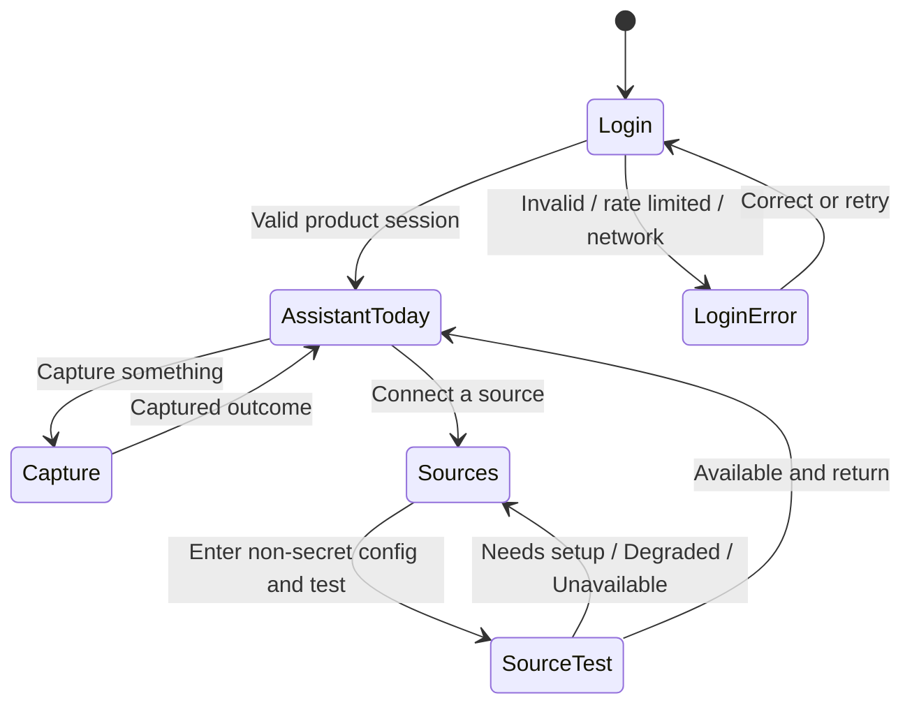
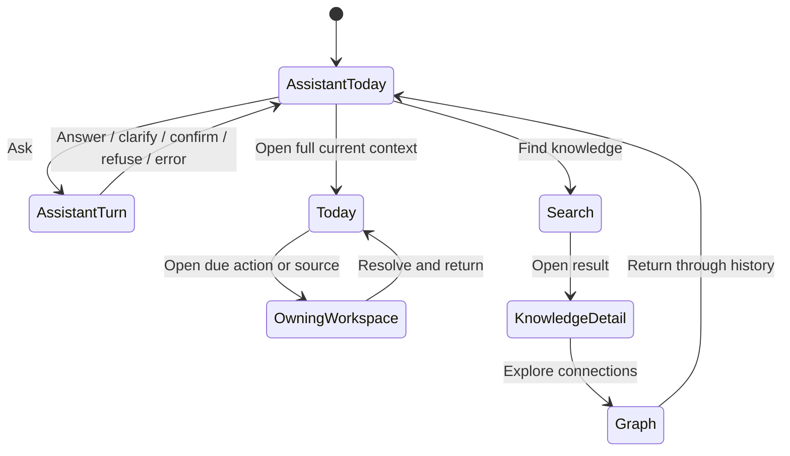
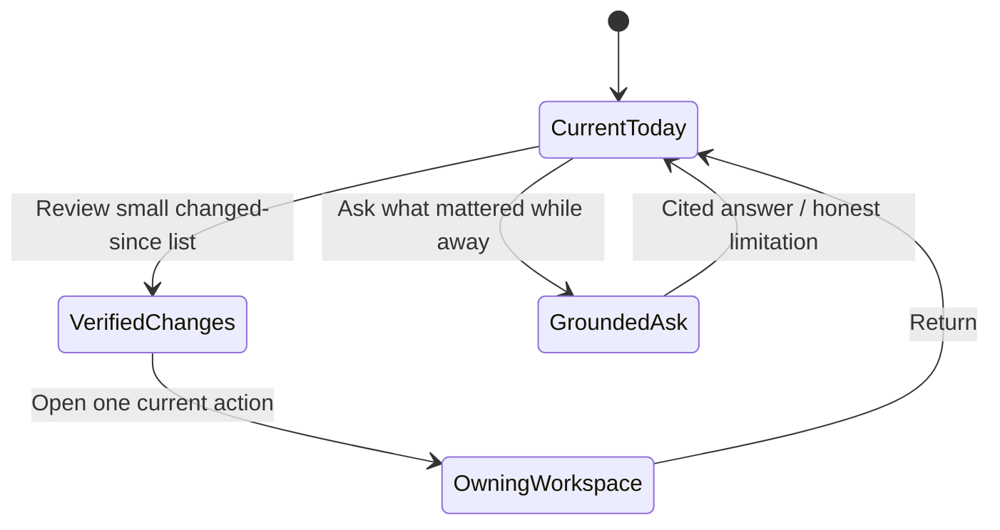
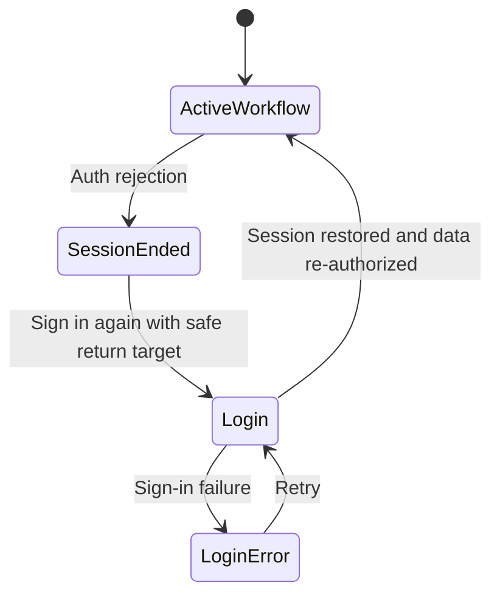
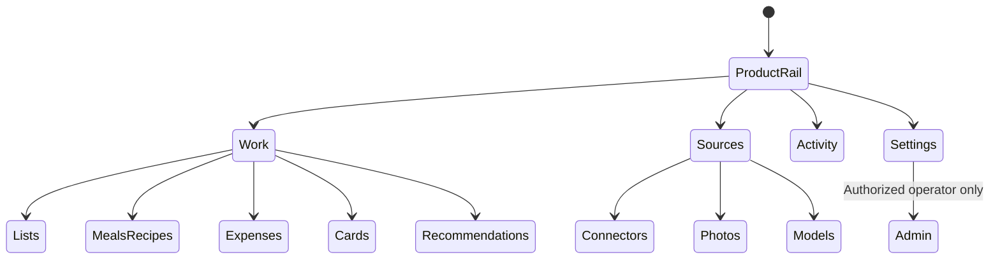
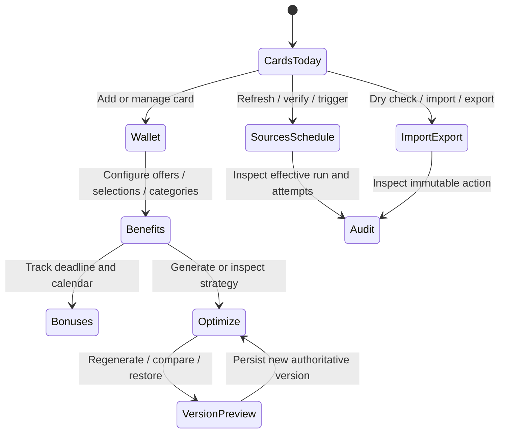

# Feature: 106 Coherent Product Experience

**Status:** Not Started - requirements, UX, design, and planning artifacts are authored; implementation, product testing, certification, and deployment have not run.
**Workflow Mode:** full-delivery
**Release Train:** mvp
**Depends On:**
- `specs/100-unified-journey-ui-transformation` as the existing shared-navigation foundation
- `specs/077-pwa-browser-test-harness` for real-browser verification
- `specs/104-universal-ask-self-knowledge` completed Scope 8 evidence for the final authenticated Assistant journey; the spec remains top-level `blocked` and SHALL NOT be called done
- `BUG-102-001-product-journey-acceptance-gap` as the immutable acceptance-evidence producer
- `BUG-004-production-readiness-claims-runtime-drift` as the readiness/claims consumer of BUG-102 evidence
- Runtime repair packets routed from the 2026-07-23 review, including auth,
  search, digest, Assistant error handling, Wiki activation, recommendations,
  card parity, and deployment acceptance

## Problem Statement

Smackerel currently behaves like several partially connected products rather
than one coherent application. The 2026-07-23 code and deployed-system review
found that successful login does not establish a session accepted by many
modern APIs; keyword search renders but does not submit; Digest can show a false
empty state despite a current stored digest; Assistant can leave a user message
with no useful response; Wiki exists but is absent from shared navigation and
its data APIs are not mounted; and optional or disabled capabilities are mixed
with advertised daily journeys.

The inconsistency is visible in the source:

- `internal/web/templates.go` owns a server-rendered theme, navigation extras,
  and an inline theme control.
- `internal/web/cardrewards_templates.go` owns a separate, more complete card
  design system and ten-screen sub-navigation.
- `web/pwa/style.css` and individual PWA pages own another visual language.
- `internal/web/appshell.go` and `web/pwa/lib/appnav.js` maintain separate
  navigation inventories. Their current items differ, and neither includes the
  Wiki.
- Spec 100 intentionally closed a cross-surface navigation gap but explicitly
  avoided a body-level redesign. It certified the shell, not consistent
  workflows, themes, states, or runtime behavior across the product.

The result is not merely cosmetic. A coherent shell that links to a broken,
unauthorized, unavailable, or incomplete journey makes the product less
trustworthy because navigation implies capability. Smackerel needs one
experience contract that covers visual language, wayfinding, readiness truth,
complete user workflows, and honest failure/degraded states across both
server-rendered and PWA surfaces.

## Current Capability Map

| Capability | Grounded Evidence | Current Status | Gap Owned Here |
|---|---|---|---|
| Cross-surface navigation foundation | `internal/web/appshell.go`, `web/pwa/lib/appnav.js`, spec 100 | Implemented but inventories drift and Wiki is absent | One product-level information architecture and truthful availability behavior |
| Server knowledge UI | `internal/web/templates.go`, `internal/web/handler.go` | Search, Digest, Topics, Status, Notifications, Settings exist | Inconsistent theme and false/broken states in deployed journeys |
| PWA | `web/pwa/*.html`, `web/pwa/*.js`, `web/pwa/style.css` | Capture, Assistant, connectors, photos, Wiki, models exist | Fragmented state handling and incomplete shared wayfinding |
| Card Rewards UI | `internal/web/cardrewards*.go`, specs 083/092 | Strongest visual subsystem; parity gaps remain | Must compose with product shell without becoming a separate app |
| Capability status | Settings/status and per-surface health pages | Multiple partial views | Optional, disabled, unconfigured, degraded, broken, and ready are not consistently distinguished |
| Authenticated browser journey | Specs 070/091/100; `internal/api/web_login.go` | Legacy pages accept credential session; modern APIs reject it in production | This feature requires one coherent session outcome but delegates root repair to BUG-070-001 |
| Real-stack browser harness | Spec 077 and `web/pwa/tests/` | Present | Coverage is incomplete and prior mounted-route checks did not prove user behavior |

## Outcome Contract

**Intent:** Smackerel feels and behaves like one application across every
supported server-rendered and PWA surface. A user signs in once, follows a
consistent navigation and theme, completes the primary daily journeys, receives
clear feedback for every action, and can tell whether a capability is ready,
optional but unconfigured, intentionally unavailable, degraded, or broken.

**Success Signal:** On desktop and mobile, a user signs in with username and
password and, without another credential step, can navigate through Assistant,
Search, Digest, Wiki/Graph, Lists, Meals/Recipes, Expenses, Cards, Connectors,
Photos, Recommendations, Notifications, Models/Admin, and Settings according to actual availability.
Light, dark, and system theme choices remain coherent across server and PWA
pages. Search returns results, Digest displays the stored digest, Assistant
returns an answer or useful error, mutations report success/failure, and every
primary journey has real-stack authenticated Playwright proof with visible
assertions and no network interception.

**Hard Constraints:**
- Navigation is a promise. A primary navigation item may be presented as ready
  only when its end-to-end journey is usable in the current deployment.
- Optional configuration is not a defect, but it must be labeled and explained.
  A broken mandatory daily journey is not allowed to masquerade as optional.
- Authentication success has one product-wide meaning. A session that works
  only on legacy pages is not a successful browser login.
- Smackerel uses one operator-owned global artifact/knowledge/graph/digest/
  synthesis corpus. Multiple authenticated identities receive explicit roles
  and grants; the coherent product SHALL NOT claim tenant/user row isolation.
- Every cookie-authenticated mutation across server forms, HTMX, PWA fetch,
  JSON APIs, Cards, and admin requires the product-wide CSRF/Origin contract.
  SameSite alone is not sufficient acceptance evidence.
- No read failure, auth failure, or service failure may be rendered as a normal
  empty state.
- Themes, spacing, typography, controls, focus, feedback, and state vocabulary
  form a shared product capability, not unrelated page-level styling.
- Every user-initiated mutation is awaited and ends in visible success or a
  useful error. Silent failure and blank response areas are forbidden.
- Existing URLs and bookmarks remain valid or receive explicit compatible
  redirects after a complete consumer inventory.
- Auth/session secrets never move into browser storage. Theme and benign UI
  preferences cannot be combined with credentials.
- Real-stack browser verification uses the deployed application and ephemeral
  test state. Request interception or canned internal responses cannot satisfy
  the acceptance contract.
- BUG-102 produces immutable product-journey evidence, BUG-032 derives
  readiness, and spec 106 renders/composes the result. Presentation cannot
  become an evidence producer or create a producer dependency loop.

**Failure Condition:** The feature fails even if every page shares colors and
navigation when login still splits trust models, any primary journey is broken,
disabled capabilities are advertised as ready, errors appear as empty content,
server and PWA navigation diverge, mobile controls overlap, keyboard or
screen-reader users cannot complete the workflow, or tests prove only route
mounting instead of visible behavior.

## Goals

1. Establish one product-level information architecture across all renderers.
2. Establish one coherent theme and component-state vocabulary across product
   surfaces while preserving domain-appropriate density.
3. Complete and truthfully verify the primary daily workflows.
4. Distinguish ready, optional-unconfigured, intentionally unavailable,
   degraded, broken, loading, empty, and stale states.
5. Make every user action provide clear progress, success, and error feedback.
6. Make desktop, mobile, keyboard, and screen-reader journeys equivalent.
7. Build comprehensive authenticated real-stack Playwright protection around
   user-visible outcomes.
8. Keep capability and release claims synchronized with runtime truth.
9. Deliver first-class browser routes and complete user journeys for Lists,
   Meals/Recipes, and Expenses over their existing domain APIs.

## Certified Presentation Amendment

Spec 106 is an additive successor amendment to certified
`specs/092-card-rewards-ui-elevation` and
`specs/100-unified-journey-ui-transformation` for presentation, navigation,
theme, shared visible-state language, and cross-product composition only. The
certified files remain sealed and are not edited by this packet.

**Superseded on conflict:**

- Spec 092's Cards-only navigation/theme/presentation decisions and its
  `prefers-color-scheme`-only theme limitation are superseded by spec 106's
  shared product shell and explicit System/Light/Dark preference contract.
- Spec 100's navigation-only scope, assistant-first fixed inventory, separate
  renderer presentation decisions, and SameSite-only CSRF justification are
  superseded by the coherent route catalog, readiness-driven navigation,
  shared theme/state system, and product-wide CSRF/Origin contract here.

**Still preserved:**

- Existing route compatibility, CSP protections, auth/privacy invariants,
  stable data hooks, Cards information density, domain APIs, and certified
  business behavior remain binding unless a named owner packet explicitly
  amends them.
- BUG-083-002 remains the Card Rewards domain/parity owner. Spec 106 composes
  its completed routes and outcomes into the shared shell and does not produce
  Card domain evidence.

State lifecycle metadata records both amendments, their bounded scope, and
validate-owned recertification routing. Spec 106 cannot be certified until the
successor behavior is proven and the partial-supersession relationship is
recorded without reopening or rewriting the certified predecessor files.

## Non-Goals

- Replacing domain business logic, graph storage, connector implementations,
  model providers, or Card Rewards optimization logic.
- Enabling every optional connector or provider. Optional capabilities may
  remain unconfigured when represented honestly and omitted from primary daily
  promises.
- Shipping an Android binary merely to make a navigation item appear ready. A
  client without a pinned release artifact is classified as unavailable until
  its existing release contract is satisfied.
- Creating a marketing or landing page. The first authenticated screen is the
  usable product.
- Choosing a frontend framework, component library, build tool, or rendering
  architecture in this requirements artifact.
- Rewriting certified specs 080, 091, 092, or 100. Spec 106 records explicit
  successor/amendment relationships, while runtime/domain defects remain owned
  by their bug packets and certified predecessor files remain sealed.
- Reimplementing Lists, Meals/Recipes, or Expenses domain contracts. Their
  existing APIs remain authoritative; this feature owns real browser routes,
  composition, honest states, and user journeys over those contracts.

## Actors & Personas

| Actor | Description | Key Goals | Permission Boundary |
|---|---|---|---|
| Daily User | Uses Smackerel to ask, search, read a digest, browse granted knowledge, and manage granted Work capabilities | Reach a goal quickly without learning which renderer owns a page | Explicit role/grants over the operator-owned global corpus and daily actions; operator routes remain forbidden |
| Returning User | Comes back after time away | See what matters now and resume a normal journey without backlog guilt | Same personal scope; no unread-count punishment |
| Card Rewards User | Manages cards, offers, selections, bonuses, and recommendations | Complete management tasks without entering a visually separate application | Card data under the same authenticated session |
| Operator | Owns the corpus, configures integrations, grants access, and observes health | Know what is ready, what needs setup, and what is actually failing | Full private-corpus read plus explicitly permitted operator/admin actions; secret values never rendered back |
| Mobile User | Uses narrow touch layouts | Navigate and complete primary workflows without hidden or overlapping controls | Same capability and authorization truth as desktop |
| Keyboard/Screen Reader User | Uses semantic navigation and non-pointer controls | Complete every primary journey with understandable state announcements | Same outcomes; no visual-only semantics |
| Automated Browser | Real-stack Playwright acting as a user | Prove behavior, feedback, accessibility basics, navigation, and state integrity | Ephemeral test identity/data only; no mocked internal application traffic |

## Domain Capability Model

### Capability

Coherent product experience: shared wayfinding, presentation, availability,
state, feedback, and journey contracts rendered consistently across multiple
technical surfaces.

### Domain Primitives

| Primitive | Purpose | Lifecycle |
|---|---|---|
| Product Surface | A user-facing destination such as Assistant, Search, Digest, Wiki, Cards, or Settings | registered -> available/unavailable -> retired/redirected |
| Journey | A user goal spanning one or more surfaces | ready -> in progress -> succeeded/failed/recoverable |
| Navigation Item | A discoverable route to a Product Surface | hidden-by-policy/visible -> active -> unavailable |
| Capability Availability | Truth about whether a surface can fulfill its promise | ready, optional-unconfigured, unavailable, degraded, broken |
| Theme Preference | User choice among system, light, and dark presentation | system -> light/dark -> changed/reset |
| Design Primitive | Shared typography, spacing, control, status, surface, and focus behavior | defined -> composed -> deprecated |
| View State | Loading, ready, empty, filtered-empty, stale, degraded, unauthorized, not-found, error | entered -> resolved/retried |
| Action Feedback | Progress and outcome for a user command | idle -> pending -> success/error |
| Session | Authenticated browser trust context | anonymous -> authenticated -> expired/revoked/signed-out |
| Readiness Claim | User/docs/release assertion that a Journey is usable | unproven -> proven -> invalidated/restored |
| Role And Grant Set | Claim-bound authority assigned to one authenticated identity | provisioned -> active -> changed/revoked |
| Global Corpus | The single operator-owned artifact, knowledge, graph, Digest, and Synthesis body | empty -> populated -> lifecycle-managed |
| Acceptance Result | Immutable BUG-102 product-journey evidence for one candidate/release identity | absent -> produced -> accepted/rejected/stale/superseded |

### Relationships

- A Product Surface may participate in several Journeys.
- A Navigation Item points to one Product Surface and reflects its Capability
  Availability.
- A Journey is ready only when its required Surfaces, Session behavior, and
  Action Feedback are ready.
- Theme Preference controls Design Primitives without changing business data.
- A Readiness Claim requires real user-visible journey proof and becomes
  invalid when runtime evidence contradicts it.
- A Role And Grant Set controls which projections and actions an identity may
  use; it does not partition Global Corpus rows or imply tenant ownership.
- An Acceptance Result is produced by BUG-102, consumed by BUG-032, and then
  rendered by spec 106. No consumer may regenerate or approve producer evidence.

### Business Policies

- One destination, one label, one availability meaning across renderers.
- A normal empty state is permitted only after a successful authorized read.
- Broken required workflows block readiness claims; optional-unconfigured
  capabilities remain honest, actionable setup states.
- Success and failure are visible at the point of action.
- Theme changes never change data, authorization, or control meaning.
- The product remains work-focused: dense information where useful, restrained
  decoration, and no marketing detours inside authenticated workflows.
- Private corpus content is operator-private by default. A non-operator may
  read only explicitly granted capabilities; denial reveals no private content
  or existence metadata.
- Each role signs in once. The same cookie yields 2xx on permitted route
  families and 403 on authenticated-but-ungranted routes without a second
  login; daily-user acceptance never requires operator-route success.
- Every domain vertical carries authorization, CSRF/Origin, typed error, and
  representative accessibility obligations from its first accepted slice.

## Use Cases

### UC-106-001: Sign In Once And Enter A Working Product

- **Actor:** Daily User
- **Preconditions:** The user has valid credentials.
- **Main Flow:**
  1. The user signs in.
  2. The product establishes one session accepted by every authorized browser
     surface and API used by the UI.
  3. The user lands on a meaningful, ready primary journey.
  4. Shared navigation reflects the same authenticated state.
    5. Permitted representative routes return 2xx across server, HTMX, PWA, JSON,
      Cards, and role-appropriate admin middleware without another login.
- **Alternative Flows:**
  - Invalid credentials: remain on login with a non-enumerating error.
  - Session expires during a workflow: preserve safe return context, request
    re-authentication, and never render an empty success state.
  - A daily user opens an operator-only route: return a truthful 403 without a
    login loop, operator content, or second credential request.
- **Postconditions:** No second token entry or surface-specific login is needed.

### UC-106-002: Navigate One Product

- **Actor:** Any authenticated user
- **Main Flow:**
  1. The user opens navigation on any surface.
  2. Labels, order, availability, current location, and destinations agree with
     navigation on every other surface.
  3. The user reaches Wiki and Graph through normal wayfinding.
- **Alternative Flows:**
  - Optional capability is unconfigured: show an honest setup state only to
    actors who can configure it; do not present it as a working daily journey.
  - Capability is intentionally unsupported: omit it from primary navigation
    and expose a truthful support status where relevant.
- **Postconditions:** The user never needs a typed URL to find a supported
  primary surface.

### UC-106-003: Use A Coherent Theme Across Renderers

- **Actor:** Daily User or Mobile User
- **Main Flow:**
  1. The user chooses system, light, or dark presentation.
  2. The choice applies across server-rendered and PWA surfaces.
  3. Controls, data states, charts/graphs, and focus remain legible.
  4. The preference persists without page flash or credential storage.
- **Postconditions:** Moving between renderers does not change visual language
  or theme unexpectedly.

### UC-106-004: Search And Open Knowledge

- **Actor:** Daily User
- **Main Flow:**
  1. The user enters a keyword or natural-language query.
  2. A visible pending state begins and one search request is made.
  3. Results, no matches, or an actionable error are rendered.
  4. Opening a result preserves a clear route back to results.
- **Alternative Flows:**
  - Client enhancement is unavailable: a complete accessible submit path still
    works.
  - Auth expires or search fails: show the matching state, not "no results".
- **Postconditions:** The query leads to a result or honest recoverable outcome.

### UC-106-005: Read The Current Digest

- **Actor:** Daily User or Returning User
- **Main Flow:**
  1. The user opens Digest.
  2. The product reads the latest stored digest and shows its date, content,
     quiet status, and relevant source links.
  3. A returning user receives a normal-length current digest rather than a
     historical backlog counter.
- **Alternative Flows:**
  - No digest has ever been generated: show a true first-use empty state.
  - Read/decoding fails: show an error and retry, never the first-use copy.
  - Digest is stale: label its age and current generation state.
- **Postconditions:** A stored digest is never hidden by type conversion or a
  swallowed read failure.

### UC-106-006: Ask And Receive A Useful Outcome

- **Actor:** Daily User
- **Main Flow:**
  1. The user submits one message.
  2. The message appears once and a pending Assistant response is visible.
  3. The Assistant returns an answer, clarification, confirmation, honest
     refusal, or typed error.
  4. Sources and action controls remain understandable and accessible.
- **Alternative Flows:**
  - Auth failure: request re-authentication and retain a safe retry context.
  - Network/service failure: show a useful error with retry; never leave a blank
    Assistant row.
- **Postconditions:** Every submitted message has a visible terminal or pending
  state.

### UC-106-007: Understand Capability Availability

- **Actor:** Operator or Daily User
- **Main Flow:**
  1. The user views Settings, Status, Connectors, Photos, Models, or another
     capability surface.
  2. Each capability is classified as ready, optional-unconfigured,
     intentionally unavailable, degraded, or broken.
  3. The page explains what the current state means and the permitted next
     action without exposing secret values.
- **Alternative Flows:**
  - A provider family is intentionally disabled: it is not counted as a product
    outage.
  - A feature is enabled but has no usable provider or route: it is broken or
    unavailable, not ready.
  - A native client has no immutable release artifact: it is unsupported for
    this release and is not advertised as downloadable.
- **Postconditions:** Product promises match actual deployed capability.

### UC-106-008: Complete A Mutation With Feedback

- **Actor:** Daily User, Card Rewards User, or Operator
- **Main Flow:**
  1. The user initiates a create, edit, delete, verify, enable, disable, refresh,
     sync, or selection action.
  2. The control enters a pending state and duplicate submission is prevented.
  3. The product reports specific success or failure and refreshes authoritative
     state.
- **Alternative Flows:**
  - Partial multi-step failure: show which business action failed and do not
    announce overall success.
- **Postconditions:** The user can tell whether the action persisted.

### UC-106-009: Resume On Mobile Or With Assistive Technology

- **Actor:** Mobile User or Keyboard/Screen Reader User
- **Main Flow:**
  1. The user opens any primary journey.
  2. Navigation, controls, content, feedback, and errors fit the viewport and
     semantic reading order.
  3. The user completes the workflow without pointer precision or hidden
     content.
- **Postconditions:** Outcome parity holds across supported input and viewport
  modes.

### UC-106-010: Manage Lists Meals And Expenses In The Browser

- **Actor:** Daily User
- **Preconditions:** The identity has the required capability grant and the
  corresponding existing domain API is available.
- **Main Flow:**
  1. The user opens a distinct real browser route for Lists, Meals/Recipes, or
     Expenses from Work navigation.
  2. Lists exposes list create/read/update/archive, item add/check/uncheck/
     remove, and list completion with authoritative reload.
  3. Meals/Recipes exposes plan create/read/update/delete/copy, slot add/update/
     remove, recipe selection, shopping-list generation, and calendar-sync
     outcome over the existing meal-plan/recipe contracts.
  4. Expenses exposes list/filter, detail, correction, classification,
     suggestion accept/dismiss, and safe export over the existing expense API.
  5. Each action reports pending, persisted/idempotent, refused, conflict, or
     failed state and reads back authoritative data.
- **Alternative Flows:**
  - Successful read with no records: show a domain-specific true-empty state
    and a permitted next action.
  - Filters exclude records: preserve filters and show filtered-empty, not
    first-use empty.
  - API/domain unavailable or read/mutation fails: show typed error and safe
    recovery; no blank page, fake row, optimistic success, or unavailable-only
    placeholder is permitted.
  - Missing grant: return access denial without record/existence leakage.
- **Postconditions:** Lists, Meals/Recipes, and Expenses are usable browser
  journeys, not API-only capabilities or permanently unavailable navigation.

## User Scenarios (BDD)

```gherkin
Scenario: SCN-106-001 Credential login works across the product
  Given a valid daily-user identity and a valid operator identity each enter username and password
  When each role logs in once
  Then the same cookie for that identity yields 2xx across every permitted legacy, HTMX, PWA, JSON, Cards, and role-appropriate admin route family
  And neither identity requires a second credential
  And the daily user receives 403, not a login loop or success requirement, on representative operator-only routes

Scenario: SCN-106-002 Expired session is not an empty state
  Given an authenticated user is viewing a data-backed surface
  When the session expires before the next read
  Then the surface presents re-authentication with a safe return path
  And it does not render no-results, no-digest, no-topics, or another normal empty state

Scenario: SCN-106-003 Navigation inventories agree
  Given the user opens any server-rendered or PWA surface
  When primary navigation renders
  Then labels, order, destinations, availability, and active state agree
  And Wiki and Graph are discoverable when ready
  And no supported primary journey requires a typed URL

Scenario: SCN-106-004 Optional capability is represented honestly
  Given a connector or provider is intentionally disabled or lacks optional configuration
  When the user views navigation, status, or settings
  Then the product labels it optional-unconfigured or intentionally unavailable
  And does not report the whole product broken
  And does not advertise that capability as a ready daily journey

Scenario: SCN-106-005 Enabled capability with no working provider is not ready
  Given a feature switch is enabled but its provider registry has no usable provider
  When capability status is evaluated
  Then the feature is classified unavailable or broken with a useful explanation
  And user-facing flows do not fabricate results or display a normal ready state

Scenario: SCN-106-006 Search submits and renders a terminal state
  Given an authenticated user enters a non-empty search query
  When the user submits or pauses according to the visible search behavior
  Then exactly one request is issued
  And the page shows loading followed by results, no matches, or a useful error
  And a blocked enhancement does not remove the accessible submit path

Scenario: SCN-106-007 Stored digest renders instead of false empty
  Given the store contains a current non-empty digest
  When the user opens Digest
  Then the digest content and date are shown
  And no-digest copy is absent
  And a read or decoding failure would produce an error rather than no-digest copy

Scenario: SCN-106-008 Assistant failure is visible and retryable
  Given a user submits an Assistant message
  When authentication or the service rejects the turn before an answer
  Then the user message remains paired with a visible useful error state
  And retry or re-authentication is offered as appropriate
  And no blank Assistant response is left in the transcript

Scenario: SCN-106-009 Theme follows the user across renderers
  Given the user chooses dark presentation
  When the user moves among Search, Digest, Wiki, Graph, Cards, Assistant, and Settings
  Then every surface uses coherent dark tokens without a light flash
  And focus, errors, badges, controls, graph encodings, and text meet contrast requirements
  When the user chooses system or light
  Then the same coherence holds

Scenario: SCN-106-010 Mutation reports authoritative outcome
  Given an authenticated user changes a setting or managed record
  When the save is pending
  Then duplicate submission is prevented and progress is visible
  When persistence succeeds
  Then success is visible and authoritative state is refreshed
  When persistence fails
  Then a useful error is visible and success is not announced

Scenario: SCN-106-011 Mobile layout keeps primary actions available
  Given the product is opened on a narrow viewport
  When the user navigates and completes each primary workflow
  Then text, controls, navigation, dialogs, tables, and panels do not overlap or require precision tapping
  And primary touch targets are at least 44 by 44 CSS pixels

Scenario: SCN-106-012 Keyboard and screen reader journey parity
  Given the user operates without a pointer
  When the user navigates, searches, reads a digest, asks a question, and completes a form
  Then every action and state is available in a logical semantic order
  And focus moves predictably after navigation, validation, success, and error

Scenario: SCN-106-013 Native client availability follows artifact truth
  Given no immutable Android artifact is pinned for the current release
  When the user views client availability
  Then Android is not advertised as downloadable or ready
  And the status explains that no supported artifact is available without exposing signing details

Scenario: SCN-106-014 Real-stack browser proof validates behavior
  Given an ephemeral live Smackerel stack and an authenticated test identity
  When the primary journey suite runs in a real browser
  Then it exercises login, navigation, search, digest, Assistant, Wiki/Graph, Lists, Meals/Recipes, Expenses, Cards, capability status, and representative mutations
  And every scenario asserts a visible user outcome
  And no internal application request is intercepted or replaced with canned data

Scenario: SCN-106-015 Deep links remain compatible
  Given a user has a bookmark to an existing supported surface
  When the coherent experience is deployed
  Then the bookmark still reaches the intended content or an explicit compatible redirect
  And navigation, docs, service-worker assets, and tests contain no stale destination

Scenario: SCN-106-016 Cookie mutations enforce CSRF and Origin
  Given a daily user or operator is authenticated through the unified cookie path
  When a server form, HTMX mutation, PWA fetch, JSON mutation, Cards action, or admin action has missing, stale, mismatched, or cross-origin CSRF evidence
  Then it returns 403 before state changes
  And a valid same-origin session-bound proof still remains subject to role/grant authorization

Scenario: SCN-106-017 Lists are a complete browser journey
  Given a daily user has the Lists grant
  When the user creates and edits a list, adds/checks/unchecks/removes items, completes or archives it, and reloads
  Then a real browser route shows each pending and authoritative outcome
  And true-empty, filtered-empty, conflict, access-denied, read-error, and mutation-error states remain distinct

Scenario: SCN-106-018 Meals and recipes are a complete browser journey
  Given a daily user has the Meals grant
  When the user creates or copies a plan, assigns and changes slots, chooses recipes, generates a shopping list, and requests calendar sync
  Then a real browser route shows the authoritative plan, slots, generated list, and calendar outcome
  And no-plan, empty-slot, missing-recipe, partial-ingredient, access-denied, and typed failure states remain distinct

Scenario: SCN-106-019 Expenses are a complete browser journey
  Given a daily user has the Expenses grant
  When the user lists and filters expenses, opens detail, corrects/classifies, accepts or dismisses a suggestion, and exports an authorized view
  Then a real browser route preserves provenance and shows authoritative outcomes
  And true-empty, filtered-empty, uncertain extraction, access-denied, read-error, correction-error, and export-error states remain distinct

Scenario: SCN-106-020 Acceptance readiness and presentation flow one way
  Given an off-traffic candidate has immutable BUG-102 acceptance evidence
  When readiness and final presentation are evaluated
  Then BUG-032 derives the freshness-bounded claim and spec 106 renders it
  And neither BUG-032 nor spec 106 produces BUG-102 evidence or becomes its producer dependency

Scenario: SCN-106-021 Blank search performs no domain work
  Given Search input is empty, control-only, whitespace-only, or a mixture of whitespace and controls
  When the native form or HTMX path submits it
  Then SearchEngine and downstream search-domain dependencies execute zero times
  And the HTTP layer may return accessible validation without representing a search result

Scenario: SCN-106-022 Global private content follows grants not row ownership
  Given private artifacts, Graph, Digest, and Synthesis exist in one operator-owned global corpus
  When an operator, a specifically granted daily user, and an ungranted daily user use the same product login
  Then each identity sees only explicitly granted projections and actions
  And the ungranted identity receives 403 without private content or existence metadata
  And no product or readiness claim asserts tenant or per-user row isolation
```

## Functional Requirements

| ID | Requirement |
|---|---|
| FR-106-001 | The product SHALL expose one coherent primary navigation contract across every supported renderer and viewport. |
| FR-106-002 | Primary navigation SHALL include every ready daily journey and SHALL NOT advertise optional-unconfigured, unsupported, or broken capabilities as ready. |
| FR-106-003 | Navigation labels, order, destinations, active state, and availability meaning SHALL agree across surfaces. |
| FR-106-004 | A successful browser login SHALL establish one session accepted by every browser surface and API required by the authenticated product. |
| FR-106-005 | Session expiry or revocation SHALL produce re-authentication, preserve only safe return context, and never appear as a normal empty state. |
| FR-106-006 | The product SHALL support system, light, and dark theme preferences coherently across server-rendered and PWA surfaces. |
| FR-106-007 | Theme choice SHALL persist without storing credentials, personal graph content, or payment-sensitive data in client storage. |
| FR-106-008 | Shared design primitives SHALL cover typography, spacing, surfaces, navigation, controls, forms, tables, status, loading, empty, degraded, error, success, focus, and motion behavior. |
| FR-106-009 | Search SHALL remain operable with an accessible explicit submit path and SHALL show loading followed by results, no matches, or a useful error. |
| FR-106-010 | Digest SHALL distinguish a true no-digest state from stale digest, read failure, decoding failure, unauthorized, and current digest states. |
| FR-106-011 | Assistant SHALL pair every submitted message with a visible pending and terminal outcome and SHALL never leave a blank response on failure. |
| FR-106-012 | Wiki and Graph SHALL be discoverable from shared navigation when their authenticated end-to-end journeys are ready. |
| FR-106-013 | Capability status SHALL use the closed states ready, optional-unconfigured, intentionally unavailable, degraded, and broken. |
| FR-106-014 | A feature enabled without a usable provider, route, or required dependency SHALL NOT be classified ready. |
| FR-106-015 | A native client SHALL NOT be advertised as available unless the current release has a valid immutable artifact and delivery path. |
| FR-106-016 | Every user-initiated mutation SHALL expose pending, success, and useful error states and SHALL prevent accidental duplicate submission. |
| FR-106-017 | Multi-step user actions SHALL announce success only when the complete business action succeeds. |
| FR-106-018 | Primary surfaces SHALL provide distinct loading, ready, first-use empty, filtered-empty, stale, optional-unconfigured, unavailable, degraded, unauthorized, not-found, and error states as applicable. |
| FR-106-019 | Existing supported deep links SHALL remain valid or receive explicit compatible redirects backed by a consumer inventory. |
| FR-106-020 | Every primary journey SHALL have persistent authenticated real-stack Playwright coverage with visible behavior assertions and no internal request interception. |
| FR-106-021 | Readiness claims in product UI, docs, and release materials SHALL be invalidated when deployed journey evidence contradicts them and restored only after real behavior proof. |
| FR-106-022 | The product SHALL provide safe recovery actions appropriate to each failed state, such as retry, re-authenticate, configure, or return to a stable surface. |
| FR-106-023 | Shared experience changes SHALL preserve domain-specific information density; operational and card-management screens must remain efficient for repeated work. |
| FR-106-024 | User-visible availability and errors SHALL not expose secret values, credential shape, internal stack traces, or personal data from inaccessible records. |
| FR-106-025 | Artifacts, knowledge, Graph, Digest, and Synthesis SHALL remain one operator-owned global corpus. Operators MAY read all private content; another identity MAY read only explicit granted projections. Ungranted identities receive no private content or existence metadata, and no requirement claims tenant/user row isolation. |
| FR-106-026 | Daily-user and operator identities SHALL each log in once and reuse the same cookie across every permitted server, HTMX, PWA, JSON, Cards, and role-appropriate admin middleware family. Representative permitted routes return 2xx; authenticated-but-ungranted routes return 403 without another login. Daily-user acceptance SHALL NOT require operator-route success. |
| FR-106-027 | Every cookie-authenticated mutation across login/registration/logout, server forms, HTMX, PWA fetch, JSON APIs, Cards, and admin SHALL require trusted same-origin context plus server-validated session-bound CSRF proof; adversarial requests return 403 before mutation. |
| FR-106-028 | Lists SHALL have a discoverable real browser route exposing existing list and item lifecycle operations with authoritative reload, honest empty/error/conflict/access states, and no API-only or permanently unavailable placeholder. |
| FR-106-029 | Meals/Recipes SHALL have a discoverable real browser route exposing existing plan, slot, recipe-selection, shopping-list, copy, and calendar-sync operations with authoritative reload and honest empty/partial/error/access states. |
| FR-106-030 | Expenses SHALL have a discoverable real browser route exposing existing list/filter/detail, correction/classification, suggestion decision, and safe export operations with provenance and honest empty/error/access states. |
| FR-106-031 | BUG-083-002 SHALL remain sole owner and evidence producer for all 16 Card Rewards domain parity areas. Spec 106 SHALL compose completed Card routes/outcomes in the shared shell and SHALL NOT absorb or weaken domain completion. |
| FR-106-032 | BUG-102 SHALL produce immutable product-journey evidence; BUG-032 SHALL consume it and derive readiness; spec 106 SHALL render/compose the derived snapshot. Neither consumer SHALL execute or approve BUG-102 evidence or become a producer dependency. |
| FR-106-033 | Candidate presentation changes SHALL be accepted off traffic before cutover. User-data changes SHALL remain readable by the previously accepted release through expand-contract compatibility, or deployment SHALL freeze writes automatically and prove backup/restore before cutover; pointer swap alone is insufficient. |
| FR-106-034 | Disposable validate/e2e stacks SHALL use a test-only machine-readable fault-profile registry declaring setup, teardown, parallelism, expected request/response, and no-first-party-interception proof. Production configuration, routes, requests, and UI SHALL expose no fault controls. |
| FR-106-035 | Spec 104 SHALL be represented by its on-disk top-level `blocked` status. Spec 106 MAY consume completed Scope 8 evidence for the bounded Assistant journey but SHALL NOT call spec 104 done or consume incomplete-scope evidence. |
| FR-106-036 | Spec 106 SHALL partially supersede certified specs 092 and 100 only for conflicting presentation, navigation, theme, shared-state, and CSRF decisions; predecessor domain/data/security behavior remains preserved and validate-owned recertification SHALL record the successor relationship. |
| FR-106-037 | Empty/control/whitespace-only Search input SHALL execute zero SearchEngine or downstream search-domain work on native and HTMX paths. The HTTP layer MAY return accessible validation; browser-level zero-request is not required. |
| FR-106-038 | Every domain vertical slice SHALL include role/grant denial, CSRF/Origin where it mutates, typed safe errors, and representative keyboard/screen-reader/narrow-view acceptance before dependent composition; final hardening broadens rather than introduces these obligations. |

## UI Surfaces And Required Workflows

| Surface | Primary User Goal | Required Complete Workflow | Required States |
|---|---|---|---|
| Login/Registration | Establish access | credential/invite -> authenticated destination -> logout/re-auth | loading, invalid, rate-limited, success, expired |
| Assistant | Ask or act | compose -> pending -> answer/clarify/confirm/refuse/error -> retry | empty transcript, pending, answered, unavailable, unauthorized, error |
| Search | Find captured knowledge | query -> loading -> results -> detail -> back | initial, loading, results, no match, error, unauthorized |
| Digest | See what matters | current digest -> source/detail navigation | current, quiet, stale, never generated, error, unauthorized |
| Wiki/Graph | Browse and explore connections | index/detail/graph -> cross-link/path -> detail | loading, ready, isolated, filtered-empty, partial, error |
| Lists | Manage actionable lists | list index -> create/open/edit -> item add/check/uncheck/remove -> complete/archive -> reload | loading, true-empty, populated, filtered-empty, pending, persisted, conflict, denied, error |
| Meals/Recipes | Plan meals and derive shopping/calendar outcomes | plan index -> create/copy -> assign/update/remove slots -> choose recipe -> generate shopping list -> calendar outcome | loading, no plan, empty slot, populated, partial ingredients, pending, persisted, degraded, denied, error |
| Expenses | Review and correct observed expenses | list/filter -> detail/provenance -> correct/classify -> suggestion decision -> safe export | loading, true-empty, filtered-empty, uncertain, pending, persisted, denied, read/correction/export error |
| Cards | Manage rewards | wallet/offers/selections/bonuses/recommendations/refresh/history | loading, populated, empty, pending action, mutation success/error |
| Recommendations/Watches | Request and monitor suggestions | configure/request -> provider evaluation -> result/provenance/feedback | ready, no provider, degraded provider, no match, error |
| Connectors/Photos | Understand and configure ingestion | inventory -> status -> setup/action -> refreshed state | ready, optional-unconfigured, unavailable, degraded, error |
| Models/Admin | Configure model capability | inventory -> add/test/enable/select -> truthful result | empty, testing, ready, rejected, unavailable, error |
| Notifications | Inspect actionable output | status -> source/event/incident/approval -> action | ready, empty, degraded, action pending/success/error |
| Settings/Status | Understand product readiness | capability inventory -> explanation -> permitted action | ready, optional-unconfigured, unavailable, degraded, broken |
| Client Availability | Obtain supported client | view release -> download/delivery when available | available, unsupported, not released, error |

## UI Scenario Matrix

| Scenario | Actor | Entry Point | Steps | Expected Outcome | Surface(s) |
|---|---|---|---|---|---|
| Sign in and ask | Daily User | Login | Sign in, open Assistant, submit | One session; visible answer or useful error | Login, Assistant |
| Search and inspect | Daily User | Shared nav | Search, open result, return | Search works with preserved context | Search, detail |
| Read current digest | Returning User | Shared nav | Open Digest, follow source | Stored digest is visible; no false empty | Digest, detail |
| Explore knowledge | Daily User | Shared nav | Wiki -> topic -> Graph -> artifact | Coherent navigation and theme | Wiki, Graph, detail |
| Manage a list | Daily User | Work / Lists | Create, edit, check items, complete/archive, reload | Authoritative list lifecycle and honest states | Lists |
| Plan meals | Daily User | Work / Meals | Create/copy plan, assign recipe slots, generate shopping list, sync calendar | Authoritative plan/list/calendar outcomes | Meals, Recipes |
| Review expenses | Daily User | Work / Expenses | Filter, open, correct/classify, decide suggestion, export | Provenance-preserving authoritative outcomes | Expenses |
| Manage card | Card Rewards User | Cards | Edit offer/selection, save | Pending then authoritative success/error | Cards |
| Configure optional capability | Operator | Settings | Open capability, inspect state, configure/test | Honest state and permitted next action | Settings, connector/model surface |
| Provider unavailable | Daily User | Recommendations | Request recommendation with no providers | Useful unavailable state; no fabricated result | Recommendations |
| Theme continuity | Any user | Any surface | Choose theme, cross renderers | No theme reset/flash; readable controls | All |
| Session expiry | Any user | Data-backed surface | Allow expiry, trigger read | Re-auth, safe return, no false empty | All authenticated surfaces |
| Mobile daily loop | Mobile User | Login | Login, Ask, Digest, Search, Cards | No overlap; touch-safe, coherent nav | Primary surfaces |
| Assistive daily loop | Keyboard/Screen Reader User | Login | Complete same primary loop | Semantic and focus parity | Primary surfaces |
| Real-stack verification | Automated Browser | Test entry | Execute all primary scenarios | Visible assertions against real stack | All |

## Failure, Empty, Loading, And Degraded State Contract

| State | Meaning | Required User Treatment | Forbidden Treatment |
|---|---|---|---|
| Loading | An authorized operation is in progress | Progress indication, busy semantics, bounded wait/cancel where appropriate | Blank content or enabled duplicate action |
| First-use empty | Authorized read succeeded and no record has ever existed | Explain what will appear and the safe creation/setup action | Sample business data presented as real |
| No match / filtered empty | Authorized read succeeded but current query/filter has no match | Preserve query/filter, offer clear/reset | Claim the entire feature has no data |
| Stale | Last valid result exists but is older than its freshness contract | Show age and refresh/generation state | Label as current/live |
| Optional-unconfigured | Capability is supported but requires optional operator setup | Explain setup and impact; avoid outage language | Advertise as ready or silently fabricate |
| Intentionally unavailable | Capability is not supported in this release/deployment | State support boundary clearly | Broken link, download, or setup promise |
| Degraded | Some providers/dependencies failed but useful verified output remains | Identify limitation and provenance of remaining output | Hide missing sources or report fully healthy |
| Broken/error | Required journey failed | Useful non-sensitive cause class, retry/re-auth/config action | Normal empty state or silent log-only failure |
| Unauthorized | Session missing/invalid or scope denied | Re-auth or access-denied state; remove inaccessible content | Leak record names or render no data |
| Not found | Authorized target no longer exists | Explain removal/missing target and offer stable navigation | Unauthorized details or generic server error |

## Accessibility And Responsive Behavior

- Every primary journey is complete with keyboard alone and has a logical
  heading, landmark, label, help/error association, and focus sequence.
- Dynamic pending, success, error, and availability changes use concise live
  announcements without stealing focus unexpectedly.
- Color, icon, motion, and spatial position are never the only indicators of
  availability, severity, selection, validation, or success.
- All themes meet WCAG 2.2 AA contrast for text, focus, controls, graphs/charts,
  tables, badges, links, and error states.
- Primary touch targets are at least 44 by 44 CSS pixels, respect browser safe
  areas, and do not overlap fixed navigation or dialogs.
- Long labels, error messages, table values, and translated or user-supplied
  content wrap or adapt without clipping or changing layout dimensions
  unpredictably.
- Dense operational tables remain scannable on desktop and provide a usable
  narrow-view alternative without hiding required fields or actions.
- Reduced-motion preference removes nonessential motion while preserving all
  state changes.
- Theme and navigation controls are reachable, named, and stable across pages.

## Security And Privacy

- The coherent experience preserves HttpOnly same-origin session handling;
  auth tokens, refresh tokens, passwords, provider secrets, card-sensitive
  values, and payment data never enter localStorage, sessionStorage, IndexedDB,
  or equivalent client persistence.
- Login, registration, and auth errors remain non-enumerating and value-safe.
- Every cookie-authenticated state-changing action uses a trusted same-origin
  context and a server-validated anti-CSRF proof bound to the current session.
  This applies to login, registration, logout, server forms, HTMX, PWA fetch,
  JSON mutations, Cards, and admin. Missing/cross-origin/stale/mismatched proof
  returns 403 before mutation; SameSite alone is not acceptance evidence.
- Role/grant checks run after session acceptance and before protected reads or
  writes. Daily users receive 403 on operator-only routes without a login loop;
  operators do not bypass CSRF/Origin checks.
- The global corpus is operator-private by default. Explicit grants authorize
  capability projections, not row ownership. Denial removes private content
  and reveals no labels, counts, source titles, or existence hints.
- External links and source URLs are scheme-validated and cannot execute in the
  product origin.
- Content-security protections remain effective across all renderers; no
  theme, component, or workflow may require unsafe inline event handlers.
- Capability status and telemetry expose names/classes and non-sensitive health,
  never secret values or inaccessible personal content.
- Sign-out and auth failure clear personal content from active views and prevent
  background refresh from repopulating it.

## Observability

Each primary Journey must emit or expose enough non-sensitive evidence to answer:

- Did the journey start, reach a user-visible success, reach a typed refusal,
  or fail before completion?
- Which Product Surface and Capability Availability state controlled the
  result?
- Was the session accepted, expired, denied, or malformed without recording the
  credential?
- Did a provider or dependency degrade the output, and was that limitation
  shown to the user?
- How long did login-to-usable, search, digest read, Assistant turn, Wiki/Graph
  load, card mutation, and capability test take?
- Did server and PWA navigation inventories disagree at build or runtime?

BUG-102 product acceptance reuses the same closed journey outcomes and is the
sole immutable evidence producer. BUG-032 consumes that result to derive
readiness; spec 106 renders the snapshot. Health and mounted routes are
supporting signals, never substitutes for authenticated user behavior or a
reason to invert that one-way evidence flow.

## Non-Functional Requirements

| ID | Requirement |
|---|---|
| NFR-106-001 | Primary content SHALL become usable at P95 within 2 seconds after an authenticated same-host read completes, excluding explicitly identified long-running model work. |
| NFR-106-002 | Navigation and theme transitions SHALL not produce an unreadable flash, layout overlap, or loss of user-entered unsent content. |
| NFR-106-003 | The product SHALL meet WCAG 2.2 AA across primary journeys on supported desktop and mobile viewports. |
| NFR-106-004 | Every primary journey SHALL have one persistent real-stack Playwright scenario plus adversarial auth/error coverage appropriate to the workflow. |
| NFR-106-005 | Real-stack browser tests SHALL use ephemeral mutable state and SHALL NOT intercept internal application requests. |
| NFR-106-006 | Shared experience behavior SHALL remain compatible with content-security, source-locking, no-defaults, and deployment-boundary policies. |
| NFR-106-007 | User-visible error copy SHALL be useful, non-sensitive, and consistent across renderers for the same failure class. |
| NFR-106-008 | A navigation or readiness inventory mismatch SHALL fail product validation before release. |
| NFR-106-009 | Required failure journeys SHALL be defined in a test-only machine-readable fault-profile registry with setup, teardown, parallelism, expected request/response, and no-interception proof; production fault-control surface area SHALL be zero. |
| NFR-106-010 | Off-traffic candidate acceptance SHALL complete before cutover, and any user-data migration SHALL satisfy previous-release readability or automated write-freeze plus proven restore. |
| NFR-106-011 | Each role's representative permitted/ungranted route matrix SHALL settle to deterministic 2xx/403 outcomes under one login and one cookie without operator-route success being required of a daily user. |

## Migration And Backward Compatibility

- Existing supported URLs, query parameters, form actions, deep links, and
  browser bookmarks remain valid unless a replacement is explicitly mapped.
- Any rename or retirement requires a complete consumer inventory across
  server templates, PWA navigation, service-worker assets, redirects, docs,
  API clients, tests, and release claims.
- Existing server and PWA feature code may be composed under the shared
  experience; this spec does not require a wholesale rewrite.
- Theme preference migration preserves current user choice where safe and
  resets invalid values to the explicit system preference, never to a hidden
  runtime default.
- Current card, graph, digest, connector, and recommendation business data is
  not migrated into a new store by this feature.
- Certified specs 080 and 091 remain historical truth amended only through
  their named repair packets. Certified specs 092 and 100 remain sealed
  historical records, while spec 106 explicitly supersedes their conflicting
  presentation/navigation/theme/shared-state/CSRF decisions and preserves
  their compatible domain, data-hook, route, CSP, and security contracts.
- State metadata records `amends` targets, bounded amendment scope, and the
  validate-owned recertification route; no predecessor certification field is
  edited directly.
- Shared-shell and user-data changes use off-traffic candidate acceptance.
  Expand-contract changes remain readable by the previously accepted release
  through acceptance. If that cannot be guaranteed, automated write freeze,
  restorable backup, and prior-release restore proof are mandatory before
  cutover; pointer swap alone cannot establish rollback safety.
- Spec 104 remains top-level blocked on disk even though Scope 8 is completed.
  Only completed Scope 8 evidence may support the bounded Assistant journey;
  no text here promotes the full spec to done.

## Product Principle Alignment

| Principle | Alignment |
|---|---|
| Principle 1 - Observe First, Ask Second | Primary journeys do not force setup or classification when Smackerel can infer or report capability state. |
| Principle 2 - Vague In, Precise Out | Assistant and Search remain easy front doors rather than exact-route or exact-metadata navigation exercises. |
| Principle 5 - One Graph, Many Views | Wiki and Graph become coherent views of the same knowledge rather than isolated applications. |
| Principle 6 - Invisible By Default, Felt Not Heard | Availability and errors are visible when actionable; the product does not add noisy status prompts or badges. |
| Principle 7 - Small, Frequent, Actionable Output | Digest and Assistant states remain concise and action-oriented. |
| Principle 8 - Trust Through Transparency | Capability readiness, provider degradation, mutation outcome, and sources are represented honestly. |
| Principle 9 - Design For Restart, Not Perfection | Returning users resume normal journeys and current digests instead of facing backlog guilt. |

Principle 10 remains unchanged: UI coherence cannot turn Smackerel into a
financial-action or advice surface.

## Release Train

- **Target:** `mvp`, the active self-hosted train in
  `config/release-trains.yaml`.
- **Reason:** This work repairs the current deployed user's primary experience
  rather than introducing a speculative later-train capability.
- **Flags introduced:** none (`flagsIntroduced: []`). Existing capability
  enablement remains authoritative; this feature adds no hidden fallback state.
- **Other trains:** A surface may appear only when that train's complete journey
  and dependencies are available. Visual code alone does not establish
  readiness.

## Acceptance Criteria

1. Server-rendered and PWA primary navigation agree and expose only truthful
   ready or explicitly explained capability states.
2. Username/password login establishes a working product-wide session after the
   auth bug dependency closes.
3. Search, Digest, Assistant, Wiki/Graph, Lists, Meals/Recipes, Expenses,
  Cards, capability status, and representative mutations complete with
  visible outcomes.
4. System, light, and dark themes are coherent across all primary surfaces.
5. Every applicable loading, empty, stale, optional, unavailable, degraded,
   unauthorized, not-found, success, and error state is distinct.
6. Desktop, mobile, keyboard, and screen-reader users can complete the same
   primary journeys.
7. Comprehensive authenticated real-stack Playwright covers all BDD scenarios
   with visible assertions and no internal request interception.
8. Existing supported deep links remain valid or have consumer-traced redirects.
9. UI, docs, release claims, and product-level deployment acceptance agree with
   observed journey readiness.
10. Daily-user and operator route matrices prove one login/cookie, permitted
  2xx, ungranted 403, no second login, and no requirement for daily-user
  operator-route success.
11. Cookie-authenticated mutations across every named middleware family reject
  invalid CSRF/Origin evidence with 403 before mutation.
12. Lists, Meals/Recipes, and Expenses each have a discoverable real browser
  route, complete existing-domain workflow, authoritative reload, and honest
  empty/error/access states; none remains API-only or unavailable by design.
13. BUG-083-002 retains all 16 Card domain areas and spec 106 composes them
  without becoming their evidence owner.
14. BUG-102 -> BUG-032 -> spec 106 is the one-way evidence/readiness/presentation
  flow; off-traffic candidate acceptance and migration rollback safety pass.
15. A test-only machine-readable fault registry exists with zero production
  fault-control exposure.
16. Spec 104 is reported blocked and only completed-scope evidence is consumed.
17. Validate-owned recertification records the bounded partial supersession of
  specs 092 and 100 without editing their certified artifacts.
18. No production source, tests, certification, commit, push, or deployment is
    claimed by this analyst packet.

## Open Questions Resolved From Repository Evidence

1. **Does spec 100 already own this work?** No. Its source and requirements
   explicitly delivered a navigation shell and avoided a body-level redesign;
   the current review found behavior and state gaps beyond navigation.
2. **Should disabled integrations all be enabled?** No. The product must
   distinguish optional-unconfigured from broken required journeys. Honest
   unavailability is a valid completed state for an optional capability.
3. **Is mounted-route acceptance enough?** No. The deployed review found mounted
   routes alongside auth, Wiki, search, and digest failures. Acceptance requires
   authenticated visible behavior.
4. **Should Android be shown despite no current artifact pin?** No. Existing
   client-release specs make immutable artifact truth the availability gate.
5. **Should Card Rewards become the product-wide design system unchanged?** It
   is useful evidence for quality and density, but design must derive a coherent
   cross-domain system rather than paste a card-specific visual language onto
   every workflow.
6. **Is a ground-up frontend rewrite required?** Not established. Requirements
   are renderer-neutral; design must choose the smallest architecture that
   produces one coherent, testable experience.
7. **Who owns Cards parity delivery?** BUG-083-002. It is feature-sized while
  retaining bug lineage; spec 106 owns only shell/theme/state composition.
8. **Who produces acceptance and readiness evidence?** BUG-102 produces the
  immutable product result, BUG-032 derives readiness, and spec 106 renders it.
9. **Is spec 104 done because Scope 8 is done?** No. The on-disk top-level status
  is blocked; only completed Scope 8 evidence is eligible for its bounded
  Assistant claim.

## Remaining Owner Routes

- `bubbles.ux`: reconcile screen inventory, user flows, responsive composition,
  theme behavior, and state-level wireframes inline in this spec.
- `bubbles.design`: define the shared navigation/theme/state/availability
  foundation and compatibility strategy.
- `bubbles.plan`: create dependency-ordered scopes and comprehensive real-stack
  Playwright scenario mapping after all bug dependencies are explicit.
- `bubbles.plan`: repair machine dependencies to match the one-way
  BUG-102 -> BUG-032 -> spec 106 evidence flow and the BUG-083 domain-owner
  boundary; do not encode reciprocal producer dependencies.
- `bubbles.bug`: create the complete runtime defect packets listed in the
  2026-07-23 finding ledger; partial bug folders are forbidden.
- `bubbles.docs`: reconcile readiness and release claims only after runtime
  journeys are re-proven.
- `bubbles.devops`: consume the BUG-102 product result for off-traffic candidate
  acceptance and safe cutover; target-specific adapter work remains outside
  this repository and outside this analyst invocation.

## UI Wireframes

### Active UX Truth And Supersession

This section is the active cross-product UX contract. It supersedes only the
navigation, theme-control, typography, page-composition, and state-language
decisions in specs 092 and 100 where they conflict with this coherent product
model. It does not invalidate their routes, data contracts, security controls,
deep links, or test-hook behavior. `bubbles.design` must inventory every
consumer before renaming or redirecting an existing destination.

There is no separate marketing or landing screen. Successful authentication
opens the actual Assistant workspace with Today context and persistent product
navigation. The visual direction is restrained operational density: stable
tracks, full-width bands, tables, lists, inspectors, and entity cards only when
the repeated item is genuinely card-shaped. Page sections do not float as
decorative cards, and cards are never nested.

### Product Information Architecture

| Destination | Navigation Class | Canonical Place | Product Promise And Availability Rule |
|---|---|---|---|
| Today / Digest | Primary | Root destination; Today context is also visible beside Assistant | Current or quiet digest, due actions, and capability exceptions only. No unread/backlog counter. Hidden history remains reachable from the date control. |
| Assistant | Primary and default | Root destination | Ask, clarify, confirm, refuse honestly, or surface a typed failure. Available only when the final spec 104 Scope 8 contract and current provider/session journey pass. |
| Capture | Primary command | Root destination and global command | Capture text, URL, photo, or supported share input with visible processing outcome. The command stays available when optional sources are not configured. |
| Search | Primary | Root destination | Keyword/natural-language search with accessible baseline submit, real loading, and typed outcomes. |
| Knowledge | Primary workspace | Root destination | Browse topics, artifacts, people, places, concepts, and time. `Graph` is a first-class local view inside Knowledge, not a separate product. |
| Graph | Contextual under Knowledge | Knowledge local navigation and item actions | Available only when authenticated graph reads pass; otherwise Knowledge remains usable and Graph is labeled `Unavailable`. |
| Work | Primary workspace | Root destination | Stable parent for user-managed operational domains; opens the last authorized Work view without hiding its local destination label. |
| Lists | Contextual under Work | Work local navigation | Actionable lists and item lifecycle. API existence alone does not make this browser destination Available. |
| Meals / Recipes | Contextual under Work | Work local navigation | Recipes, meal plans, slots, shopping-list generation, and calendar state. No recipe marketing gallery. |
| Expenses | Contextual under Work | Work local navigation | Dense expense ledger, evidence, category/source, and corrections. Smackerel does not become an accounting or financial-advice product. |
| Cards | Contextual under Work | Work local navigation | Card-product metadata, benefits, lifecycle, optimization, evidence, import/export, schedules, and audit. Never payment-card numbers, CVV, account credentials, execution, or financial advice. |
| Recommendations | Contextual under Work | Work local navigation | Requests, watches, provenance, limitations, and feedback. Actions require a healthy production provider. |
| Sources | Primary workspace | Root destination | One inventory for ingestion and model/data sources; it never displays secret values. |
| Connectors | Contextual under Sources | Sources local navigation | Source connection, status, sync, typed degradation, and audit. |
| Photos | Contextual under Sources | Sources local navigation | Libraries, search, document capture, health, duplicate/lifecycle review, and confirmed actions. |
| Notifications / Activity | Primary workspace | Root destination labeled `Activity` | Actionable incidents, approvals, and output state. Quiet status is not surfaced as a notification. No badge unless action is required now. |
| Settings | Primary utility | Bottom of desktop rail; More on mobile | Appearance, density, account/session, capability availability, and safe non-secret preferences. |
| Admin | Admin-only | Settings local navigation; omitted for non-admin users | Providers, models, invitations, tokens/devices, agent traces, scheduler/run history, readiness evidence, and production acceptance. Absence from a non-admin view is authorization, not unavailability. |

**No-orphan rule:** every supported user-facing route maps to one row above and
inherits its product shell, breadcrumb, theme, state vocabulary, and safe return
path. Deep links may enter a child directly but must render the parent workspace
as active. Routes with no complete browser journey appear only in the
appropriate availability inventory as `Needs setup` or `Unavailable`; they do
not become unlabeled primary links.

### Responsive Navigation Model

| Viewport | Persistent Navigation | Local Navigation | Overflow Behavior |
|---|---|---|---|
| Desktop, 1200px and wider | 232px left rail: Today, Assistant, Capture, Search, Knowledge, Work, Sources, Activity; Settings and user controls anchored at bottom | Horizontal compact tabs or a local side list inside the workspace; active item remains visible | No hamburger. Admin remains under Settings. Rail may collapse manually to icons with tooltips. |
| Tablet, 768px to 1199px | 64px icon rail with accessible names and tooltips; active destination has shape, text alternative, and focus treatment | Scroll-free compact tabs when they fit; otherwise a `Views` menu naming every child | Content tracks recompose; controls do not wrap over content. |
| Mobile, below 768px | Bottom bar: Today, Assistant, Capture, Search, More | Workspace child switcher below the page header; More opens a full-height navigation sheet | More contains Knowledge, Work children, Sources children, Activity, Settings, and authorized Admin. No destination is hidden behind horizontal tab scrolling. |

Familiar rail, zoom, filter, close, history, save, edit, archive, refresh, and
download controls may use Lucide or the repository's existing icon library when
implementation supports it. Every icon-only control has an accessible name and
hover/focus tooltip. Text remains on unfamiliar, destructive, or consequential
commands.

### Screen Inventory

| Screen | Actor(s) | Status | Scenarios Served |
|---|---|---|---|
| Login and re-authentication | Daily User, Operator | Existing - modify | SCN-106-001, SCN-106-002 |
| Assistant with Today context | Daily User, Returning User | Existing - redesign composition | SCN-106-001, SCN-106-008 through SCN-106-012 |
| Capture workspace | Daily User, Mobile User | Existing - modify | SCN-106-003, SCN-106-010 through SCN-106-012 |
| Search | Daily User | Existing - modify | SCN-106-002, SCN-106-006, SCN-106-009 through SCN-106-012 |
| Today / Digest | Daily User, Returning User | Existing - modify | SCN-106-002, SCN-106-007, SCN-106-009, SCN-106-011, SCN-106-012 |
| Knowledge workspace | Daily User | Existing - reconcile | SCN-106-003, SCN-106-009, SCN-106-011, SCN-106-012, SCN-106-015 |
| Connected Graph Explorer | Knowledge Explorer | New; detailed in spec 105 | SCN-106-003, SCN-106-009, SCN-106-011, SCN-106-012, SCN-106-014 |
| Work - Lists | Daily User | New browser composition over existing capability | SCN-106-003, SCN-106-010 through SCN-106-012 |
| Work - Meals / Recipes | Daily User | New browser composition over existing capability | SCN-106-003, SCN-106-010 through SCN-106-012 |
| Work - Expenses | Daily User | New browser composition over existing capability | SCN-106-003, SCN-106-010 through SCN-106-012 |
| Work - Recommendations | Daily User | Existing - modify | SCN-106-004, SCN-106-005, SCN-106-010 through SCN-106-012 |
| Sources - Connectors | Daily User, Operator | Existing - reconcile | SCN-106-001, SCN-106-004, SCN-106-010 through SCN-106-012 |
| Sources - Photos | Daily User, Operator | Existing - reconcile | SCN-106-001, SCN-106-004, SCN-106-010 through SCN-106-012 |
| Activity / Notifications | Daily User, Operator | Existing - redesign composition | SCN-106-003, SCN-106-010 through SCN-106-012 |
| Settings / Capability availability | Daily User, Operator | Existing - redesign | SCN-106-004, SCN-106-005, SCN-106-009 through SCN-106-013 |
| Admin / Production acceptance | Operator | Existing surfaces - compose | SCN-106-001, SCN-106-004, SCN-106-005, SCN-106-013, SCN-106-014 |
| Cards - Today and pending inbox | Card Rewards User | Existing - redesign | SCN-083-002-10 through SCN-083-002-15 |
| Cards - Wallet and card editor | Card Rewards User | Existing - augment | SCN-083-002-01, SCN-083-002-13 through SCN-083-002-16 |
| Cards - Benefits | Card Rewards User | Existing offers/selections/categories - consolidate IA | SCN-083-002-02, SCN-083-002-03, SCN-083-002-13 through SCN-083-002-16 |
| Cards - Bonuses and calendar | Card Rewards User | Existing - augment | SCN-083-002-04, SCN-083-002-12 through SCN-083-002-16 |
| Cards - Optimize and reports | Card Rewards User | Existing - augment | SCN-083-002-05, SCN-083-002-11 through SCN-083-002-16 |
| Cards - Sources and schedules | Operator | Existing admin - augment | SCN-083-002-06 through SCN-083-002-08, SCN-083-002-12 through SCN-083-002-16 |
| Cards - Import / export | Card Rewards User, Operator | New | SCN-083-002-09, SCN-083-002-13 through SCN-083-002-16 |
| Cards - Audit history | Card Rewards User, Operator | Existing run history - augment | SCN-083-002-07, SCN-083-002-12 through SCN-083-002-16 |

### UI Primitives

| Primitive | Used By Screens | Composition Rule | Accessibility And Responsive Contract |
|---|---|---|---|
| Product rail / mobile bar | Every authenticated screen | One ordered IA and availability resolver; current parent and child are both exposed. | One primary nav landmark; icon-only variants have names/tooltips; mobile safe-area padding and 44px targets. |
| Workspace header | Every destination | Breadcrumb, one h1, compact state, and page commands occupy stable rows. No hero copy or feature explanation. | Long titles wrap; commands move to a menu without changing semantic order. |
| Local view switcher | Knowledge, Work, Sources, Cards, Activity, Settings/Admin | Tabs only when all sibling views are present and short; otherwise a named view menu. | Correct tab semantics or normal links, never mixed. Active view is textually identified. |
| Availability badge | Nav menus, Settings, Sources, Recommendations, Admin | Closed visible vocabulary: `Available`, `Needs setup`, `Degraded`, `Unavailable`. No `ready`, green dot alone, or feature-enabled inference. | Text plus icon/shape; concise status announcement on change. |
| Operation state band | Search, Digest, Assistant, Graph, Cards, Sources, writes | Stable full-width row for loading, stale, partial, error, auth, or success. It does not push primary content unpredictably. | `status` for progress/success, `alert` for blocking failure; focus moves only when action is required. |
| Entity row / entity card | Search results, artifacts, wallet cards, source instances, photos | Rows are default for dense records; cards are reserved for genuinely visual repeated entities such as wallet cards or photos. No nested cards. | Entire card is not a hidden button; named actions and links remain separately focusable. |
| Data table | Expenses, card benefits, optimization, audit, readiness, notifications | Stable columns, explicit sort/filter, row detail action, pagination/virtualization as designed. | Header associations and sort state; mobile transforms to labeled flat rows without omitting fields. |
| Inspector | Graph, knowledge, cards, source details, audit details | Selection updates a persistent desktop side panel or mobile bottom sheet; destructive actions require a separate confirmation. | Focus stays on selected row unless dialog opens; sheet restores invoker. |
| Pending action row | Today, Cards, Activity, Sources | Shows why action is needed, due/effective period, and one primary action. No unread count or guilt language. | Ordered by consequence/time, not visual severity alone; dismiss/resolve has explicit meaning. |
| Form field | Login, capture, settings, cards, source setup | Visible label, optional/required marker, help only on demand, field-level error, pending state, and retained safe input. | Error linked by `aria-describedby`; first invalid field receives focus after submit. |
| Mutation footer | Editors, dialogs, sheets | Primary save, secondary cancel, destructive action separated; pending disables duplicate submission; success refreshes authoritative state. | Sticky only when it cannot cover content; safe-area aware; status announced. |
| Evidence / provenance row | Digest, Search, Graph, Recommendations, Cards, synthesis/readiness | Source, observed time, confidence/limitation, and open-source action share one semantic order. | Missing evidence is textually explicit; external link purpose is named. |
| Empty/degraded state | Every data surface | State copy names the verified condition and only the permitted next action. No sample business data. | Does not rely on illustration; heading and action remain in normal reading order. |

### Theme And Token System

The same named token contract applies to server-rendered HTMX and static PWA
pages. There is one same-origin, source-locked theme asset and one pre-paint
theme decision; renderer-specific copies are forbidden. Technical packaging is
owned by `bubbles.design`, but both renderers must consume the same token names,
theme preference, and component state semantics.

#### Typography

| Token | Typeface | Use |
|---|---|---|
| `font-ui` | Self-hosted IBM Plex Sans | Navigation, controls, tables, labels, forms, operational body text |
| `font-reading` | Self-hosted Source Serif 4 | Digest prose, artifact excerpts, synthesis text only |
| `font-mono` | Self-hosted IBM Plex Mono | IDs, timestamps, hashes, run codes, config references |

Fonts are served from the product origin under the existing CSP after design
confirms the asset and `font-src` contract. If a face cannot load, the UI must
remain operable and must not flash between divergent server/PWA typography;
design owns the explicit packaged fallback. Inter, Roboto, Arial, and generic
system stacks are not the intended product typography.

| Type Token | Size / Line Height | Weight | Use |
|---|---|---|---|
| `text-page` | 28/34 desktop, 24/30 mobile | 650 | One page h1; never used inside compact panels |
| `text-section` | 18/24 | 600 | Full-width band and panel headings |
| `text-body` | 15/22 | 400 | Operational body and forms |
| `text-dense` | 13/18 | 450 | Tables, metadata, secondary navigation |
| `text-label` | 12/16 | 600 | Status and field labels; letter spacing remains 0 |
| `text-reading` | 18/30 | 400 | Digest and synthesis prose |

#### Color Semantics

The palette is multi-hue and neutral-led. Teal is the interaction color, blue
marks knowledge, coral marks capture, green marks verified success, amber marks
attention, and red marks blocking/destructive states. Purple is limited to a
secondary entity type and never dominates. Beige, brown, slate/navy, gradients,
or decorative color orbs are not part of the system.

| Token | Light Reference | Dark Reference | Semantic Use |
|---|---|---|---|
| `canvas` | `#F5F8F6` | `#101512` | Page background |
| `surface` | `#FFFFFF` | `#171D19` | Panels, inputs, entity cards |
| `surface-subtle` | `#EAF0ED` | `#202923` | Selected rows, grouped controls |
| `text` | `#18211D` | `#EEF4F0` | Primary text |
| `text-muted` | `#56645E` | `#A9B8B0` | Secondary text |
| `border` | `#C6D1CB` | `#405047` | Dividers and control boundaries |
| `interactive` | `#0B7169` | `#54C7BC` | Primary action, active nav, link |
| `knowledge` | `#2D62B3` | `#7EA8F2` | Knowledge/graph context |
| `capture` | `#B94837` | `#FF8E7C` | Capture context, not error |
| `success` | `#247443` | `#68CF8A` | Verified completed outcome |
| `attention` | `#955600` | `#F0B45B` | Needs attention/setup |
| `danger` | `#B22632` | `#FF7D86` | Blocking error/destructive action |
| `entity-alt` | `#71508D` | `#C59BE1` | One graph/entity distinction only |
| `focus` | `#006C8A` | `#61D4FF` | Two-layer focus ring |

Reference colors are UX targets, not an assertion of measured compliance.
Implementation must mechanically verify WCAG 2.2 AA contrast for every text,
control, focus, graph, status, and theme pairing and adjust token values without
changing semantic roles.

#### Shape, Spacing, Density, And Motion

| Concern | Tokens / Behavior |
|---|---|
| Radius | `radius-1: 2px`, `radius-2: 4px`, `radius-3: 6px`, `radius-4: 8px`; 8px is the maximum. Pills are reserved for compact status/chips, not command buttons. |
| Spacing | 4px base scale: 4, 8, 12, 16, 24, 32, 48. Workspace tracks and toolbars use stable gaps; no arbitrary inline spacing. |
| Density | User setting: `Comfortable` or `Compact`. Compact reduces row height/padding, never text below 13px, touch targets on coarse pointers, or information content. |
| Borders/shadows | Dividers and borders establish hierarchy. Shadows are limited to modal/sheet elevation and focused drag state, never every section. |
| Motion | 120ms state feedback, 180ms panel movement, no decorative entrance cascade. Layout size is stable before/after loading. |
| Reduced motion | Panel and view changes are immediate; graph settling, animated scroll/zoom, shimmer, pulsing, and drag inertia are removed. State remains visible in text. |
| Focus | Two-layer ring visible against canvas and surfaces, 2px minimum, never clipped by overflow. Focus order follows visual order. |

#### Theme Controls

- Appearance uses a three-option segmented control: `System`, `Light`, `Dark`.
- The explicit preference is benign UI state and may persist in a same-site
  preference cookie or server-side user preference. It is never stored with
  credentials or business data.
- `System` responds to operating-system changes while active. Light and Dark
  remain explicit until changed.
- The theme is resolved before first paint on login, HTMX, PWA, error, and
  offline shells so navigation never flashes in a different theme.
- High-contrast/forced-colors belongs to the platform preference and is not
  overridden by a decorative custom palette.

### Honest Visible State Language

Capability availability uses exactly four user-visible labels:

| Label | Meaning | Allowed Actions | Forbidden Implication |
|---|---|---|---|
| `Available` | The required route, configuration, provider/dependency, authorization, and current journey proof exist for this user/deployment. | Open/use; inspect evidence where appropriate. | Route mounted or feature enabled by itself. |
| `Needs setup` | The capability is supported but optional user/operator configuration is absent or incomplete. | Configure, connect, or test when authorized. | Product outage, healthy, or usable now. |
| `Degraded` | Verified useful output remains, but a named provider/source/dependency or freshness condition limits it. | Continue with limitation; retry/review source. | Fully healthy or complete provenance. |
| `Unavailable` | The required journey is broken, unsupported, disabled for this deployment, unauthorized for this actor, or lacks every usable provider. | Retry, sign in, return, or inspect admin remediation according to cause. | Normal empty data, no match, or `Available`. |

Page-level states such as loading, current, quiet, first-use empty, no match,
filtered empty, stale, refused, unauthorized, not found, and error remain
specific content states beneath the capability label. User-facing UI never
uses vague `ready`, `up`, `green`, or `enabled` as a synonym for availability.

### Exact Visible Behavior Contract

| Condition | Exact Visible Outcome | Primary Action | Must Never Appear |
|---|---|---|---|
| Login accepted across all middleware | Redirect to Assistant/Today; user menu names authenticated account; no second credential prompt | Continue working | Token field, bearer instructions, partial-session success |
| Invalid login | Field-independent banner: `Sign-in details were not accepted`; password clears; username may remain | `Sign in` | Which credential was wrong, account existence |
| Session expired/revoked | Personal content is removed; blocking band: `Your session ended`; safe return destination retained | `Sign in again` | Normal empty state, stale personal labels |
| Search initial | Query field and explicit Search button; recent/suggested content only if real and authorized | Submit query | Feature-description prose |
| Search loading | Results track remains stable; `Searching` status; submit disabled for the active request | Cancel where supported | Blank results, duplicate request |
| Search results | Query, count, typed result rows, snippets, source/lifecycle, return context | Open result | Canned or unproven result |
| Search no results | `No matches for “[query]”` with query retained | Edit query; clear filters | `Unavailable`, empty knowledge claim |
| Search error/timeout/network | `Search is unavailable` plus typed safe cause and retained query | Retry | No-results copy |
| Digest current | Date, `Current`, digest prose, source links, generation time | Open source | No-digest copy |
| Digest quiet | Date, `Quiet`, concise `Nothing met the digest threshold for this period` and source/run metadata | View prior date | Never-generated copy, guilt prompt |
| Digest first-use empty | `No digest has been generated` after successful no-row read | Check source availability | Sample digest |
| Digest stale | Stored digest remains visible with `Degraded` and age; current generation state shown | Refresh status | `Current`, empty copy |
| Digest read/decode failure | No digest text rendered; `Digest is unavailable` with Retry | Retry | First-use empty copy |
| Assistant pending | One user turn plus one named Assistant pending row; composer protected from duplicate submit | Stop where supported | Blank row |
| Assistant answer/clarification/confirmation | Body, source/provenance as applicable, and explicit action controls | Contextual action | Generic success without content |
| Assistant honest refusal | `I can’t provide a grounded answer from the available sources` with refusal status and sources/limits when safe | Refine question | Saved-as-idea or error styling |
| Assistant auth failure | Inline `Your session ended`; transcript retains only safe visible context | Sign in again | Blank row, no-answer copy |
| Assistant network/provider/timeout | Typed inline error (`Connection lost`, `Provider unavailable`, `Response timed out`) with original turn retained | Retry once | Capture acknowledgement or success |
| Wiki/Graph API missing or disabled | Knowledge index remains; Graph local view is `Unavailable`; no prior graph labels render | Return to Browse; operator sees remediation owner | 404 page, empty graph, Available badge |
| Synthesis never run | `Unavailable` plus `No successful synthesis has been persisted` and last attempt if one exists | Operator: inspect sources/run | `Available`, `Current`, empty insight |
| Synthesis stale | Last verified synthesis remains visible with age and `Degraded` | Inspect latest run | Current label |
| Synthesis failed | No partial unpublished text; last verified synthesis may remain separately labeled stale; latest failure class shown | Retry/run according to permission | Healthy/up, partial success |
| Synthesis current/quiet | `Available`; persisted timestamp, source count, citations; quiet is a valid current outcome | Open sources | Never-run or failed |
| Recommendation provider healthy | `Available`; request/watch actions enabled; results name provider provenance | Request / create watch | Generic ready label |
| Enabled with zero providers | `Unavailable`; request/watch actions disabled; operator remediation link only | View provider status | No-match, empty results, Available |
| Some providers failed | `Degraded`; verified result and participating/missing provider classes shown | Continue; retry failed source | Fully complete claim |
| Connector supported but unconfigured | `Needs setup`; no sync controls until configuration validates | Connect source | Error/outage label |
| Connector disabled/unsupported | `Unavailable`; omitted from daily primary promises but visible in Sources inventory | Return | Setup fields that cannot work |
| Connector sync degraded | `Degraded`; last successful sync, stale age, typed limitation, verified retained items | Retry / inspect run | Current/complete claim |
| Production acceptance all required journeys current | `Available`; observed time, schema version, required journey count | View evidence | Ready based on containers alone |
| Production acceptance missing identity/config | `Needs setup`; value-safe missing prerequisite and owner | Configure through owned secret boundary | Credential value/input in result view |
| Production acceptance one required journey fails | `Unavailable`; failed journey ID/code first, other rows retain their own state | View remediation owner | Overall success, green/ready |
| Production acceptance optional limitation | `Degraded` only when manifest permits useful operation | View limitation | Required failure softened to optional |

### Screen: Login And Re-authentication

**Actor:** Daily User, Operator | **Route:** `/login` | **Status:** Modify

```text
┌──────────────────────────────────────────────────────────┐
│ Smackerel                                                │
├──────────────────────────────────────────────────────────┤
│ Sign in                                                  │
│ Username                                                 │
│ [......................................................] │
│ Password                                                 │
│ [......................................................] │
│ [Sign in]                                                │
│ [Sign-in details were not accepted]                      │
│                                                          │
│ [Use invitation]                                         │
└──────────────────────────────────────────────────────────┘
```

**Interactions:** Submit enters pending once; invalid credentials return focus
to the error summary then the first invalid/empty field; success redirects to
the safe return target or Assistant/Today. Re-authentication uses the same form
with a concise `Your session ended` state.

**States:** Idle, pending, invalid, rate-limited with retry time, network error,
expired-session return, and success redirect. No auth secret appears in DOM,
URL, storage, console, or visible diagnostics.

**Responsive:** A stable one-column form, maximum readable width, no split hero
or illustration panel. Mobile fields and button are full-width and safe-area
aware.

**Accessibility:** One h1, labeled fields, linked summary and field errors,
password manager compatibility, Enter submit, visible focus, and non-enumerating
announcements.

### Screen: Assistant With Today Context - Desktop

**Actor:** Daily User, Returning User | **Route:** `/assistant` | **Status:** Redesign composition

```text
┌──────────────┬──────────────────────────────────────────────────┬───────────────────────────┐
│ TODAY        │ ASSISTANT                                        │ TODAY CONTEXT             │
│ Assistant  ● │ [Conversation title / date]        [New] [More] │ [Current | Quiet | State]│
│ Capture      ├──────────────────────────────────────────────────┤ [digest date]             │
│ Search       │ [User turn....................................] │                           │
│ Knowledge    │ [Assistant pending / answer / refusal / error]  │ [digest excerpt]          │
│ Work         │   Sources [n]  [Open source] [Why this answer] │                           │
│ Sources      │                                                  │ DUE NOW                   │
│ Activity     │ [User turn....................................] │ [action row] [Resolve]    │
│              │ [Assistant terminal outcome...................] │                           │
│              │                                                  │ CAPABILITY EXCEPTIONS     │
│              ├──────────────────────────────────────────────────┤ [Degraded source] [Open] │
│              │ [Ask Smackerel........................] [Send]  │                           │
│ Settings     │ [Attach] [Capture instead]                       │ [Open full Today]         │
└──────────────┴──────────────────────────────────────────────────┴───────────────────────────┘
```

**Interactions:** Assistant is the main track; Today context contains only the
current digest, actions that are due now, and actionable capability exceptions.
`Capture instead` is an explicit user command, never an error fallback disguised
as success. New conversation does not erase persisted history without an
explicit clear action.

**States:** Empty conversation, pending, answered, clarification, confirmation,
refusal, capture acknowledgement, auth failure, network, provider, timeout,
schema error, and retry. Today context independently renders current, quiet,
empty, stale, degraded, or unavailable.

**Responsive:** At compact desktop the Today context can collapse to a named
drawer; the composer and latest turn remain visible. The left rail width is
stable.

**Accessibility:** Conversation is a labeled log with each turn grouped by
speaker and status. Pending and terminal changes announce once. Retry returns
focus to the retried outcome; citations are ordinary links with source names.

### Screen: Assistant With Today Context - Mobile

**Actor:** Mobile User, Returning User | **Route:** `/assistant` | **Status:** Responsive composition

```text
┌─────────────────────────────────────────┐
│ Assistant                    [Today] [⋮]│
├─────────────────────────────────────────┤
│ [Today state strip · digest date]       │
│ [User turn............................] │
│ [Assistant answer / refusal / error]    │
│ [Sources] [Retry / Sign in again]       │
│                                         │
│ [Ask Smackerel..................][Send] │
│ [Attach] [Capture instead]              │
├─────────────────────────────────────────┤
│ [Today] [Assistant] [Capture] [Search] [More] │
└─────────────────────────────────────────┘
```

**Interactions:** Today opens a full-height sheet and restores focus when
closed. Composer remains above the bottom bar and virtual keyboard. Send is
disabled only for empty or active duplicate submission.

**States:** Same terminal outcomes as desktop; no horizontal transcript scroll
or overlapping fixed controls.

**Accessibility:** Bottom destinations have text labels; composer and latest
status remain reachable at 200% zoom; sheet traps/restores focus correctly.

### Screen: Capture Workspace

**Actor:** Daily User, Mobile User | **Route:** `/pwa/` or mapped coherent route | **Status:** Modify

```text
┌──────────────────────────────────────────────────────────────────┐
│ Capture                                                          │
├──────────────────────────────────────────────────────────────────┤
│ [Text | Link | Photo | File]                                     │
│                                                                  │
│ Content                                                          │
│ [..............................................................] │
│ [..............................................................] │
│ Source [detected / explicit control]   Sensitivity [control]     │
│ [Save capture]                                                   │
├──────────────────────────────────────────────────────────────────┤
│ PROCESSING                                                       │
│ [Pending] -> [Captured] -> [Processed / Degraded / Failed]       │
│ [Open artifact] [Retry processing when permitted]                │
└──────────────────────────────────────────────────────────────────┘
```

**Interactions:** Input type changes the relevant fields without losing safe
entered content. Save is awaited; one captured record is shown with authoritative
identity. Offline queueing is labeled `Pending on this device`, never captured,
and exposes Retry/Remove without storing auth material.

**States:** Initial, field error, pending upload, offline pending, captured,
processing, processed, degraded extraction, failed. No forced tagging or
classification at capture time.

**Responsive/Accessibility:** Mobile camera/share controls use native inputs;
progress and outcome are textually named; focus moves to the error summary or
success heading.

### Screen: Search

**Actor:** Daily User | **Route:** `/` | **Status:** Modify

```text
┌────────────────────────────────────────────────────────────────────────────┐
│ Search                                                                    │
│ [Search your knowledge........................................] [Search]  │
│ Type [All v]  Source [All v]  Time [Any v]  Lifecycle [Any v] [Clear]     │
├────────────────────────────────────────────────────────────────────────────┤
│ [Searching / 18 results / No matches / Search unavailable]                │
├────────────────────────────────────────────────────────────────────────────┤
│ [Artifact] [Result title]                                  [Active]        │
│ [matching excerpt] · [source] · [captured date]             [Open]         │
│ ------------------------------------------------------------------------- │
│ [Concept] [Result title]                                   [Cooling]       │
│ [matching excerpt] · [3 citations]                          [Explore]       │
└────────────────────────────────────────────────────────────────────────────┘
```

**Interactions:** Semantic form submission is always present; enhancement may
submit after an explicitly visible search behavior but cannot issue a duplicate.
Opening a result stores safe result context in history; Back restores query,
filters, scroll, and focus.

**States:** Initial, field validation, loading, results, no match, filtered
empty, stale/degraded partial results, unauthorized, timeout/network/server
error. Query remains editable after every failure.

**Responsive/Accessibility:** Filters collapse into a named sheet on mobile;
results remain flat rows. Status uses a live region; matched text is not conveyed
by color alone.

### Screen: Today / Digest

**Actor:** Daily User, Returning User | **Route:** `/digest` with coherent Today label | **Status:** Modify

```text
┌────────────────────────────────────────────────────────────────────────────┐
│ Today                                        [Previous date] [Date] [Next] │
│ [Current | Quiet | Degraded | Unavailable]  [digest date] [generated time]│
├────────────────────────────────────────────────────────────────────────────┤
│ WHAT MATTERS                                                              │
│ [Digest prose in reading typeface.......................................] │
│ [......................................................................] │
│ Sources [n] [Open source list]                                             │
├────────────────────────────────────────────────────────────────────────────┤
│ DUE NOW                                                                    │
│ [action reason] [effective period]                         [Resolve/Open]   │
├────────────────────────────────────────────────────────────────────────────┤
│ CHANGED SINCE LAST VISIT                                                    │
│ [small verified change list, no unread count and no catch-up requirement]   │
└────────────────────────────────────────────────────────────────────────────┘
```

**Interactions:** Date controls browse retained digests. Source list is an
unframed disclosure. Due actions link to their owning workspace. Returning
after absence shows the current digest plus a small verified change list, never
an accumulated backlog.

**States:** Current, quiet, first-use empty, stale/generating, read failure,
decode failure, unauthorized. Error and empty are mutually exclusive.

**Responsive/Accessibility:** Reading measure is constrained while page bands
remain full width. Date controls become a menu on mobile. Digest prose uses
semantic headings and source links.

### Screen: Knowledge Workspace

**Actor:** Daily User | **Route:** `/knowledge` and current Wiki routes | **Status:** Reconcile

```text
┌────────────────────────────────────────────────────────────────────────────┐
│ Knowledge                    [Browse | Graph | Timeline] [Search knowledge]│
├────────────────────────────────────────────────────────────────────────────┤
│ Topics [312]  Artifacts [28k]  People [300]  Places [n]  Concepts [772]   │
├────────────────────────────────────────────────────────────────────────────┤
│ Lifecycle [All v]  Source [All v]  Time [Any v]  Sort [Recently active v] │
│ [Topic] [name]        [Active] [capture count] [last changed] [Open]       │
│ [Concept] [name]      [Cooling] [citations]     [last changed] [Explore]  │
│ [Person] [name]       [relationships]           [last changed] [Open]      │
└────────────────────────────────────────────────────────────────────────────┘
```

**Interactions:** Browse filters real projections of one graph. `Explore`
opens spec 105 with the item as seed. Timeline retains the same authorized
objects in temporal order.

**States:** Loading, Available, true empty, filtered empty, isolated, Degraded,
Unavailable Graph view, unauthorized, not found. A missing Graph API never
turns Browse into a 404 or empty graph.

**Responsive/Accessibility:** Summary counts become a horizontally wrapping
definition list, not cards. Rows become labeled flat records on mobile.

### Screen: Work - Lists

**Actor:** Daily User | **Route:** design-owned mapping over `/api/lists` | **Status:** New browser composition

```text
┌────────────────────────────────────────────────────────────────────────────┐
│ Work / Lists                         [Active | Completed | Archived] [New] │
├────────────────────────────────────────────────────────────────────────────┤
│ [List title]              4 of 9 complete      [due/context] [Open]        │
│ [List title]              0 of 3 complete      [source]      [Open]        │
├────────────────────────────────────────────────────────────────────────────┤
│ SELECTED LIST                                                              │
│ [ ] [item text........................................] [source] [Remove] │
│ [x] [item text........................................] [source] [Restore]│
│ [Add item........................................................] [Add]   │
│ [Complete list] [Archive]                                                   │
└────────────────────────────────────────────────────────────────────────────┘
```

**Interactions:** Create/edit/check/remove/complete/archive each round-trip and
refresh authoritative state. No celebratory animation or guilt counter.

**States:** Needs setup when browser journey is not implemented, true empty,
active, completed, archived, pending mutation, conflict, error, unauthorized.

**Responsive/Accessibility:** Desktop master/detail becomes list then detail on
mobile with Back preserving selection. Check controls have full text labels.

### Screen: Work - Meals / Recipes

**Actor:** Daily User | **Route:** design-owned mapping over recipe and meal-plan capabilities | **Status:** New browser composition

```text
┌────────────────────────────────────────────────────────────────────────────┐
│ Work / Meals                       Week of [date] [Prev] [Today] [Next]    │
│ [Plan | Recipes | Shopping list]                              [New plan]   │
├──────────────┬───────────────────────────────────────────────┬─────────────┤
│ Mon [date]   │ Dinner  [Recipe title] [4 servings] [Open]  │ [Add meal]  │
│ Tue [date]   │ Lunch   [Empty]                              │ [Assign]    │
│ Wed [date]   │ Dinner  [Recipe title] [2 servings] [Open]  │ [Change]    │
├──────────────┴───────────────────────────────────────────────┴─────────────┤
│ [Generate shopping list] [Calendar state] [Plan status: Draft/Active]      │
└────────────────────────────────────────────────────────────────────────────┘
```

**Interactions:** Recipe search assigns a real recipe to a slot; servings and
batch state are explicit. Shopping-list generation previews included/skipped
recipes and merge reasons before persistence. Calendar state is visible and
recoverable.

**States:** Needs setup while no complete browser journey exists, no plan, empty
slot, missing recipe, partial ingredients, pending generation, generated,
calendar Degraded, error.

**Responsive/Accessibility:** Week grid becomes day sections on mobile; no drag
is required for assignment or reordering. Meal type/date are always text.

### Screen: Work - Expenses

**Actor:** Daily User | **Route:** design-owned mapping over expense capability | **Status:** New browser composition

```text
┌────────────────────────────────────────────────────────────────────────────┐
│ Work / Expenses             Period [month v] [Filters] [Export safe view] │
├────────────────────────────────────────────────────────────────────────────┤
│ Date       Vendor         Category       Amount      Source      Status     │
│ [date]     [vendor]       [category]     [amount]    [artifact]  [Verified]│
│ [date]     [vendor]       [category]     [amount]    [artifact]  [Review]  │
├────────────────────────────────────────────────────────────────────────────┤
│ Selected: [expense details, receipt/source, correction history] [Correct] │
└────────────────────────────────────────────────────────────────────────────┘
```

**Interactions:** Filters and corrections preserve source provenance. Export
excludes secrets and respects authorization. Smackerel presents observed
expense knowledge, not tax/accounting conclusions or financial advice.

**States:** Needs setup while no complete UI journey exists, true empty, results,
uncertain extraction, correction pending/success/error, unauthorized.

**Responsive/Accessibility:** Table becomes labeled rows without omitting
amount/source/status. Currency is locale-readable and not color-coded alone.

### Screen: Work - Recommendations

**Actor:** Daily User | **Route:** `/recommendations` | **Status:** Modify

```text
┌────────────────────────────────────────────────────────────────────────────┐
│ Work / Recommendations          [Available | Needs setup | Degraded | Unavailable]│
│ [Requests | Watches | Preferences]                         [New request]  │
├────────────────────────────────────────────────────────────────────────────┤
│ Request [........................................................] [Run]  │
│ Provider coverage: [participating] [missing/degraded]                     │
├────────────────────────────────────────────────────────────────────────────┤
│ [Recommendation title] [provider/source] [confidence/limitation] [Open]   │
│ Why: [reason and evidence]                                                 │
│ Feedback [Useful] [Not useful]                                             │
└────────────────────────────────────────────────────────────────────────────┘
```

**Interactions:** Request and watch controls are absent/disabled with a visible
reason when no healthy provider exists. A healthy no-match is a terminal result
with provider provenance. Watch mutations round-trip and cannot create inert
records.

**States:** Available, Needs setup, Degraded partial-provider, Unavailable
zero-provider, pending, result, no match, provider timeout/quota/auth/error,
session unauthorized.

**Responsive/Accessibility:** Provider coverage is text, not a colored dot.
Watches use labeled rows and menu actions on mobile.

### Screen: Sources - Connectors And Photos

**Actor:** Daily User, Operator | **Route:** existing `/pwa/connectors.html` and photo routes under coherent shell | **Status:** Reconcile

```text
┌────────────────────────────────────────────────────────────────────────────┐
│ Sources                              [Connectors | Photos | Models] [Add]  │
├────────────────────────────────────────────────────────────────────────────┤
│ Source            State          Last success       Scope       Action     │
│ Google Drive      Available      [time]             [folders]   [Open]     │
│ Photo library     Needs setup    Never              [none]      [Connect]  │
│ [provider]        Degraded       [time/age]         [scope]     [Review]   │
│ [provider]        Unavailable    [reason class]     [scope]     [Details]  │
├────────────────────────────────────────────────────────────────────────────┤
│ Selected source: [health, non-secret config, recent runs, skipped/blocked] │
│ [Test connection] [Sync now] [Disable/Remove with confirmation]            │
└────────────────────────────────────────────────────────────────────────────┘
```

**Interactions:** Add selects a supported provider then collects non-secret
configuration; secret values are injected through the owned secret boundary and
are never read back. Test/Sync show pending and authoritative result. Photo
subviews retain libraries, search, document capture, health, duplicates,
lifecycle, quality, and confirmed removal.

**States:** Available, Needs setup, Degraded with retained verified data,
Unavailable disabled/unsupported, pending, success, auth, provider, schema,
rate-limit, and network errors.

**Responsive/Accessibility:** Table becomes flat source rows; state and last
success remain visible. Add/test dialogs have linked field errors and focus
return.

### Screen: Activity / Notifications

**Actor:** Daily User, Operator | **Route:** `/notifications` | **Status:** Redesign composition

```text
┌────────────────────────────────────────────────────────────────────────────┐
│ Activity                     [Action required | Incidents | Sources | History]│
├────────────────────────────────────────────────────────────────────────────┤
│ [severity text] [incident/action title] [source] [observed] [Open/Decide] │
│ [status text]   [output/source event]    [source] [observed] [Inspect]     │
├────────────────────────────────────────────────────────────────────────────┤
│ Quiet: No action required                                                   │
└────────────────────────────────────────────────────────────────────────────┘
```

**Interactions:** Only actionable items create a navigation badge. Approval,
snooze, replay, and other mutations use pending/success/error and preserve audit
history. Quiet windows and suppressed events remain inspectable without noise.

**States:** Quiet, action required, Degraded source, Unavailable, pending
decision, success, conflict/expired action, error, unauthorized.

**Responsive/Accessibility:** Severity, state, and action are textual. Mobile
shows one flat record per event; no dense nested cards.

### Screen: Settings, Capability Availability, And Admin

**Actor:** Daily User, Operator | **Route:** `/settings` and authorized admin routes | **Status:** Redesign composition

```text
┌────────────────────────────────────────────────────────────────────────────┐
│ Settings                  [Appearance | Account | Capabilities | Admin*]  │
├────────────────────────────────────────────────────────────────────────────┤
│ APPEARANCE                                                                 │
│ Theme   [System | Light | Dark]    Density [Comfortable | Compact]         │
├────────────────────────────────────────────────────────────────────────────┤
│ CAPABILITIES                                                               │
│ Assistant        Available       [evidence age]               [Details]    │
│ Graph            Unavailable     [route read failed]          [Details]    │
│ Recommendations  Needs setup     [no provider configured]     [Configure]  │
│ Connector X      Degraded        [last success / limitation]  [Review]     │
├────────────────────────────────────────────────────────────────────────────┤
│ ADMIN (*authorized only)                                                   │
│ [Providers] [Models] [Invites] [Tokens/Devices] [Runs] [Acceptance]       │
└────────────────────────────────────────────────────────────────────────────┘
```

**Interactions:** Appearance applies before navigation. Capability details show
implemented/configured/activated/live-verified evidence dimensions to operators,
while daily users see only the four visible labels and permitted action. Admin
is omitted entirely for unauthorized actors.

**States:** Appearance pending/saved/error; capability Available/Needs setup/
Degraded/Unavailable; evidence current/stale/missing; admin auth denied;
production acceptance state per the exact visible behavior table.

**Responsive/Accessibility:** Capability table becomes labeled rows; evidence
timestamps and actions remain visible at 320px and 200% zoom. State is text plus
icon/shape.

### Card Management IA And CCManager Parity Placement

CCManager was inspected read-only through `web/app.py` and its templates. Its
useful behaviors include catalog/custom card creation, notes/tags/benefit
overrides, activation, multi-category offers, regular/tiered selections,
bonuses, monthly edit/reorder/star/remove/confirm, scrape/calendar triggers,
and run history. Smackerel does not copy CCManager's Inter-based visual style,
nested card composition, emoji controls, inline handlers, raw-JSON report,
file-backed state, fail-soft cron authorization, or embedded setup instructions.

| Parity Row | Coherent Smackerel Screen | UX Outcome |
|---|---|---|
| 1 Wallet CRUD/metadata | Cards / Wallet and editor | Catalog or custom create; nickname, type, annual fee, notes, tags, source metadata, benefit overrides, active/archive/delete; cascade preview and authoritative reload. |
| 2 Multi-category/shared-limit offers | Cards / Benefits / Offers | One offer editor with category multi-select and one named shared-cap group; cap displays once in list, detail, and explanation. |
| 3 Categories/selections lifecycle | Cards / Benefits / Selections and Categories | Canonical/equivalent/starred/priority plus tiered/non-tiered periods, lock/enrollment, expire/re-enroll, resolve/dismiss. |
| 4 Bonuses/calendar | Cards / Bonuses | Progress, met/deadline, create/edit/archive/remove; calendar event state, update/delete/recovery, stable identity shown. |
| 5 Historical optimization | Cards / Optimize | Period selector, generated versus manual comparison, edit/override/reorder/star/remove, regenerate preview, restore prior version, reasons. |
| 6 Source operations | Cards / Sources | Source inventory, health, refresh, citations/confidence/disagreement, manual verify, typed partial failure. |
| 7 Audit/history | Cards / Audit | Immutable filterable user and run history with trigger, actor class, outcome, duration, counts, safe error class, and detail. |
| 8 Safe config | Cards / Sources and Settings / Capabilities | Non-secret configuration references and four-state availability; missing required config is Unavailable and no trigger mounts. |
| 9 Versioned import/export | Cards / Import & Export | Version, scope, dry-run, conflict table, transactional import, idempotency result, export history, no secrets. |
| 10 Pending selections | Cards / Today inbox and Benefits / Selections | Reason, due/effective period, resolve/dismiss semantics, no unread counter, resolved item remains absent until a new cause. |
| 11 Reports | Cards / Optimize / Report | Current/historical recommendation, alternatives, rate/source/reason/limits/freshness, export-safe view; no-data/stale/provider failure distinct. |
| 12 Schedules/manual triggers | Cards / Sources / Schedule | Next/last run, state, manual trigger, pending/outcome, concurrency/dedupe explanation, linked audit. |
| 13 Coherent UX | All Card screens | Shared product shell/theme/state language; six local views replace the visually separate ten-pill mini-app without removing deep links. |
| 14 Explicit errors | Every Card read/write | Field errors, pending, authoritative success, typed failure/retry; no flash-only or partial false success. |
| 15 Mobile/a11y/theme | Every Card screen | Mobile labeled rows/sheets, keyboard reorder alternative, screen-reader semantics, 200% zoom, reduced motion, all themes. |
| 16 Security | Every Card screen | Per-user authorization, CSRF, CSP, safe URLs, redaction, rate limits, audit, no sensitive export/storage, no PAN/CVV fields. |

### Screen: Cards - Today And Pending Inbox

**Actor:** Card Rewards User | **Route:** `/cards` | **Status:** Redesign

```text
┌────────────────────────────────────────────────────────────────────────────┐
│ Work / Cards   [Today | Wallet | Benefits | Bonuses | Optimize | Sources | Audit]│
│ Period [current v]                                      [Import / Export] │
├────────────────────────────────────────────────────────────────────────────┤
│ ACTIONS DUE                                                                 │
│ [Selection] [card] [reason] [effective period]            [Resolve]       │
│ [Bonus]     [card] [progress / deadline]                  [Update]        │
│ [Source]    [name] [verification needed]                  [Review]        │
├────────────────────────────────────────────────────────────────────────────┤
│ CURRENT STRATEGY                                                            │
│ Category       Best card       Rate       Source       Limit       Why      │
│ [category]     [card]          [rate]     [source]     [shared]    [Open]   │
├────────────────────────────────────────────────────────────────────────────┤
│ SCHEDULE  [Available/Degraded/Unavailable]  Next [time]  Last [outcome]    │
└────────────────────────────────────────────────────────────────────────────┘
```

**Interactions:** Resolve routes to the owning editor and returns to the same
period/row. No action count is displayed in global navigation; Today shows only
currently actionable rows. Import/export is a named command, not a hidden admin
route.

**States:** No wallet, no current recommendations, current, stale, provider
Degraded, source verification needed, pending selection, no due actions, error.

**Responsive/Accessibility:** Tables become labeled rows; local views become a
Views menu on mobile. Due reason and period precede the action in reading order.

### Screen: Cards - Wallet And Card Editor

**Actor:** Card Rewards User | **Route:** existing wallet routes | **Status:** Augment

```text
┌────────────────────────────────────────────────────────────────────────────┐
│ Cards / Wallet                    [Active | Archived | All] [Add card]     │
├────────────────────────────────────────────────────────────────────────────┤
│ ┌──────────────────────┐ ┌──────────────────────┐                         │
│ │ [Card product image] │ │ [Card product image] │  repeated entity cards │
│ │ [nickname]            │ │ [nickname]            │  only                 │
│ │ [issuer / type]       │ │ [issuer / type]       │                       │
│ │ [Active] [source]     │ │ [Archived] [source]   │                       │
│ │ [tags]                │ │ [tags]                │                       │
│ │ [Open] [More]         │ │ [Open] [More]         │                       │
│ └──────────────────────┘ └──────────────────────┘                         │
├────────────────────────────────────────────────────────────────────────────┤
│ EDIT CARD                                                                  │
│ Product [catalog search / Custom]   Nickname [........]  Type [....]      │
│ Annual fee [amount]  Notes [...........................]  Tags [........]  │
│ Source metadata [read-only evidence]                                       │
│ Benefit overrides [category/rate/source rows]                              │
│ [Save] [Archive/Activate] [Delete card...]                                 │
└────────────────────────────────────────────────────────────────────────────┘
```

**Interactions:** Ambiguous catalog search requires explicit candidate choice;
custom never pretends to be catalog-verified. Archive is reversible. Delete
confirmation lists dependent record counts and declared cascade effects, then
requires a clear destructive command. No full account number, CVV, login, or
payment credential field exists.

**States:** Empty wallet, candidate search, ambiguous/no catalog match, custom,
active, archived, field error, stale edit conflict, pending/success/error,
delete blocked/cascade confirmation.

**Responsive/Accessibility:** Entity cards are one column on mobile. Editor is
a full page, not a card inside a dialog. Destructive confirmation names the
card and affected record types.

### Screen: Cards - Benefits

**Actor:** Card Rewards User | **Route:** existing offers/selections/categories routes | **Status:** Consolidated IA, deep links retained

```text
┌────────────────────────────────────────────────────────────────────────────┐
│ Cards / Benefits                  [Offers | Selections | Categories] [Add]│
├────────────────────────────────────────────────────────────────────────────┤
│ FILTERS [Active v] [Card v] [Period v] [Needs action]                     │
│ Benefit       Card       Categories        Rate   Shared cap  Period  State│
│ [offer]       [card]     [cat][cat]        [rate] [group/limit] [date] [Active]│
│ [selection]   [card]     [tier/category]   [rate] [limit]       [date] [Locked]│
├────────────────────────────────────────────────────────────────────────────┤
│ EDIT OFFER / SELECTION                                                     │
│ Card [v]  Categories [multi-select]  Rate/type [fields]                   │
│ Shared cap [group] [amount] [period]   Activation [state/url-safe]         │
│ Lifecycle [start] [end] [lock] [enrollment]  Notes [.................]    │
│ [Save] [Activate/Resolve] [Archive/Delete...]                              │
└────────────────────────────────────────────────────────────────────────────┘
```

**Interactions:** Removing one category previews its effect on the shared pool;
the cap remains one business object. Tier rows edit independently. Re-enrollment
resolution records period/reason and cannot recur without a new cause.

**States:** Active, upcoming, locked, expired, pending re-enrollment, resolved,
archived, shared-limit conflict, field error, pending/success/error.

**Responsive/Accessibility:** Multi-select is a labeled listbox/checkbox group,
not tiny chips as the only control. Keyboard move-up/down actions duplicate any
drag reorder behavior.

### Screen: Cards - Bonuses And Calendar

**Actor:** Card Rewards User | **Route:** `/cards/bonuses` | **Status:** Augment

```text
┌────────────────────────────────────────────────────────────────────────────┐
│ Cards / Bonuses                               [Active | Met | Archived] [Add]│
├────────────────────────────────────────────────────────────────────────────┤
│ Card       Bonus             Progress             Deadline    Calendar     │
│ [card]     [description]     [amount]/[target]    [date]      [Synced]     │
│ [text progress] [progress bar] [Update] [Mark met] [Open event]            │
├────────────────────────────────────────────────────────────────────────────┤
│ CALENDAR DELIVERY                                                           │
│ State [Available/Degraded/Unavailable]  Stable event ID [safe suffix]       │
│ Last update [time/outcome]   [Update event] [Remove event...] [Retry]      │
└────────────────────────────────────────────────────────────────────────────┘
```

**Interactions:** Progress crossing target proposes Met once; repeated submit
is idempotent. Edit/archive/remove updates or removes the stable calendar event
and shows both business and delivery outcomes before success.

**States:** In progress, near deadline, met, expired, archived, calendar pending,
synced, Degraded, remove pending/success/error.

**Responsive/Accessibility:** Progress is visible text plus progressbar; calendar
state is not color alone; mobile actions use a non-occluding sheet.

### Screen: Cards - Optimize And Reports

**Actor:** Card Rewards User | **Route:** recommendations/report plus compatible mapped history routes | **Status:** Augment

```text
┌────────────────────────────────────────────────────────────────────────────┐
│ Cards / Optimize       Period [month v] [Compare v] [Regenerate preview]  │
│ [Recommendations | Report | Versions]                        [Export view]│
├────────────────────────────────────────────────────────────────────────────┤
│ [move] [star] Category   Recommended card  Rate  Source  Limit  Override  Why│
│ [↑↓]   [★]    [cat]      [card]            [x]   [src]   [cap]  [Manual] [Open]│
│ [↑↓]   [ ]    [cat]      [card]            [x]   [src]   [cap]  [Generated][Open]│
├────────────────────────────────────────────────────────────────────────────┤
│ VERSION COMPARISON                                                         │
│ Current [version/time] vs [prior version/time]                             │
│ [changed recommendation with old/new reason]                [Restore...]   │
└────────────────────────────────────────────────────────────────────────────┘
```

**Interactions:** Edit/override/reorder/star/remove are direct named actions and
round-trip. Regenerate opens a comparison preview and explicitly preserves
manual/starred rows unless the user changes them. Restore creates a new version;
it never rewrites audit history.

**States:** No wallet, no match from healthy provider, current, stale, Degraded
provider/source, generation pending, comparison, conflict, failed, restored.

**Responsive/Accessibility:** Move Up/Down controls are keyboard/touch peers to
drag. Mobile rows show all source, limit, override, and reason fields. Report
export is a safe rendered document, not raw runtime JSON.

### Screen: Cards - Sources, Schedule, And Manual Runs

**Actor:** Operator | **Route:** compatible extension of `/cards/admin` | **Status:** Augment

```text
┌────────────────────────────────────────────────────────────────────────────┐
│ Cards / Sources                         [Sources | Schedule | Recent runs] │
├────────────────────────────────────────────────────────────────────────────┤
│ Source        State        Last success  Confidence/Citations   Action     │
│ [source]      Available    [time]        [summary]              [Open]     │
│ [source]      Degraded     [time]        [partial reason]       [Review]   │
├────────────────────────────────────────────────────────────────────────────┤
│ SCHEDULE                                                                    │
│ Refresh [expression/description]  Next [time]  Last [outcome]  [Run now]  │
│ Optimize [expression/description] Next [time]  Last [outcome]  [Run now]  │
│ Calendar [expression/description] Next [time]  Last [outcome]  [Run now]  │
├────────────────────────────────────────────────────────────────────────────┤
│ [Run pending: type / trigger / started] [View audit]                       │
└────────────────────────────────────────────────────────────────────────────┘
```

**Interactions:** Source configuration contains only non-secret values and
secret reference presence. Verify/refresh shows citations, disagreement, and
manual override. Manual trigger disables duplicate activation and links the
single effective run plus every refused/no-op attempt to audit.

**States:** Available, Needs setup, Degraded, Unavailable; scheduled, running,
success, failure, no-op, deduplicated, disabled trigger.

**Responsive/Accessibility:** Schedule descriptions are human-readable but do
not replace exact operator values. Run state announces once and never uses a
spinner alone.

### Screen: Cards - Versioned Import And Export

**Actor:** Card Rewards User, Operator | **Route:** design-owned under Cards | **Status:** New

```text
┌────────────────────────────────────────────────────────────────────────────┐
│ Cards / Import & Export                         [Import | Exports | Schema]│
├────────────────────────────────────────────────────────────────────────────┤
│ IMPORT                                                                     │
│ File [Choose file]  Detected schema [version]  Scope [records summary]    │
│ [Run dry check]                                                             │
├────────────────────────────────────────────────────────────────────────────┤
│ DRY CHECK RESULT                                                            │
│ Valid [n]  Unchanged [n]  Conflicts [n]  Invalid [n]  Secrets found [0]  │
│ Record/type       Proposed action      Conflict/reason       Resolution     │
│ [id/type]         [Create/Update/Skip] [reason]              [control]      │
│ [Import valid transaction]                                                   │
├────────────────────────────────────────────────────────────────────────────┤
│ EXPORT                                                                     │
│ Version [current]  Include [wallet/benefits/history controls] [Create]     │
│ [time] [scope] [record counts] [hash] [Download]                           │
└────────────────────────────────────────────────────────────────────────────┘
```

**Interactions:** Import cannot run before a successful dry check. Newer/unknown
schema, secret-bearing payload, invalid record, replay, and downgrade are
explicit. Import is transactional and reports idempotent replay. Export names
scope/version and excludes secrets, credentials, raw audit internals, and any
payment-sensitive data.

**States:** Idle, validating, invalid schema, conflicts requiring decisions,
dry check clean, import pending/success/rolled back/error, export pending/ready/
expired/error.

**Responsive/Accessibility:** Conflict table becomes labeled records; file and
download controls have names/status; focus moves to validation summary.

### Screen: Cards - Filterable Audit History

**Actor:** Card Rewards User, Operator | **Route:** compatible extension of run history | **Status:** Augment

```text
┌────────────────────────────────────────────────────────────────────────────┐
│ Cards / Audit                                                              │
│ Type [All v] Trigger [All v] Actor [Mine/All*] Outcome [All v] Date [range]│
├────────────────────────────────────────────────────────────────────────────┤
│ Time       Action       Trigger    Actor class  Outcome  Duration  Counts  │
│ [time]     [optimize]   [manual]   [user]       Success  [time]    [n] [Open]│
│ [time]     [calendar]   [schedule] [system]     Failed   [time]    [n] [Open]│
│ [time]     [import]     [user]     [user]       No-op    [time]    [n] [Open]│
├────────────────────────────────────────────────────────────────────────────┤
│ DETAIL: run ID, safe error class, source counts, linked version/event     │
└────────────────────────────────────────────────────────────────────────────┘
```

**Interactions:** Filters update immutable history. Detail never exposes secret
values, card-sensitive data, raw provider payloads, or another user's records.
Failed and no-op attempts remain visible; no edit/delete action exists.

**States:** Results, true empty, filtered empty, loading, unavailable, auth
denied, safe detail error.

**Responsive/Accessibility:** Mobile detail opens below the selected labeled
row. Table headers, filters, result count, and selected row are announced.

### First-Run, Daily, Weekly, And Return Contract

#### First Run

1. Login establishes the one product session and opens Assistant with Today
   context. There is no welcome landing page, product tour, or blocking wizard.
2. The empty Today context reports the actual capability states. Capture remains
   usable without a connected external source. Assistant appears `Available`,
   `Needs setup`, `Degraded`, or `Unavailable` from the shared contract.
3. A compact first-run action row offers `Capture something` and, for authorized
   users, `Connect a source`. Neither is described as mandatory.
4. Source activation opens the Sources workspace, asks for a provider, collects
   non-secret configuration, invokes the owned secret setup boundary when
   necessary, tests the connection, and shows an authoritative state.
5. The user returns to Assistant/Today with the new source state. No sample
   artifact, fake conversation, or fabricated digest is inserted.

The explicit initial UI preferences are `System` theme and `Comfortable`
density. No external source, notification, model/provider, card import, calendar
delivery, or scheduled trigger is silently activated.

#### Returning Daily Use

- Open Assistant/Today and show the current or quiet digest, due-now actions,
  and actionable capability exceptions.
- Ask, search, capture, or open the owning workspace directly from context.
- Resolve a due action at its source, then return to the same Today location.
- Do not show total unread artifacts, missed days, or accumulated work.

#### Weekly Review

- Open Today and choose the retained period/date control.
- Review current knowledge changes, Work outcomes, source limitations, and Card
  strategy only when those capabilities are Available or Degraded.
- Open evidence and history from the owning workspace; Today does not duplicate
  full audit or management screens.

#### Recovery After Absence

- The current digest leads. A small `Changed since [last active date]` list
  contains only verified high-value changes and current actions.
- `Ask what mattered while I was away` opens a grounded Assistant turn using
  current authorized sources; it is not an automatic system prompt.
- No catch-up requirement, unread count, streak, overdue shame copy, or bulk
  dismissal is presented.
- If current processing is Degraded, the limitation is shown beside affected
  output; historical processing debt remains an operator concern under spec 079
  and is not turned into a user backlog.

### Read-Only CCManager UX Insights

| Observed Pattern | Source | Smackerel Decision | Improvement |
|---|---|---|---|
| Dashboard prioritizes activation, re-enrollment, bonuses, and monthly strategy | `CCManager/web/templates/dashboard.html` | Preserve action-first ordering inside Cards/Today | Remove guilt counts, nested cards, and duplicated global navigation; name reason/period and owning action. |
| Wallet supports catalog/custom cards, notes, tags, overrides, activation, and cascade cleanup | `cards.html`, `web/app.py` wallet routes | Preserve complete metadata lifecycle in Wallet/editor | Use explicit archive/delete states, cascade preview, PostgreSQL round-trip, and no payment credentials. |
| Offers support category arrays, shared limits, activation, and lifecycle | `offers.html`, offer routes | Use one multi-category editor and one shared-cap object | Show shared cap once and carry it into optimizer explanations. |
| Selections support regular/tiered choices, locks, enrollment, and categories | `selections.html`, tiered routes | Compose under Benefits with complete lifecycle | Add keyboard reorder alternatives, pending resolution semantics, and canonical/equivalent categories. |
| Monthly strategy supports edit, reorder, star, remove, confirm, regenerate, and change review | `monthly_recommendations.html`, `/monthly/*` routes | Preserve as Optimize period/version workflow | Preview regeneration, preserve manual overrides, append versions, expose reasons/evidence. |
| Bonuses and calendar sync have visible action states | `bonuses.html`, calendar action routes | Preserve in Bonuses/Calendar | Add stable event identity, update/delete recovery, idempotent progress, and typed delivery state. |
| Settings combines run history, sync actions, and scheduling instructions | `admin_history.html` | Separate Sources/Schedule from immutable Audit | Remove embedded setup tutorial and secret-shaped URLs; show non-secret config and actual schedule state. |
| Report exposes best cards and raw JSON | `report.html` | Preserve recommendations and provenance | Replace raw JSON affordance with accessible export-safe report and versioned export workflow. |
| File-backed JSON/GitHub sync enables portability | `web/app.py`, `PROJECT-SETTINGS.md` | Provide schema-versioned import/export only | Dry-run, conflict decisions, transaction, idempotency, no secrets; PostgreSQL stays authoritative. |
| Inter, large radii, emoji controls, gradients, nested cards, and inline event handlers dominate presentation | `base.html` and page templates | Do not copy visual style | Use Smackerel tokens, purposeful self-hosted type, max 8px radius, semantic icons, flat operational bands, strict CSP. |

### Playwright Execution Contract

Every scenario below is a persistent real-stack contract for later planning and
implementation owners. This UX phase does not claim the tests exist or pass.

- Run against the ephemeral Smackerel validation stack and disposable user-owned
  PostgreSQL state. Never point a write scenario at production, the persistent
  dev store, prod telemetry, backup paths, or deploy manifests.
- Authenticate through the real login form and browser cookie jar. Do not inject
  bearer tokens, cookies, business responses, or internal application data.
- `page.route`, `context.route`, `route.fulfill`, MSW, Nock, WireMock, and any
  equivalent internal request interception are forbidden. Network assertions
  observe real requests/responses without replacing them.
- Required behavior uses direct assertions. Tests may not return early on login,
  missing controls, optional layout, empty data, unsupported browser state, or
  any other failure condition. `fixme`, skip, and conditional false-pass paths
  cannot satisfy a row.
- Every mutation asserts one request, pending UI, terminal response, visible
  outcome, authoritative read-back after reload, and unchanged/rolled-back state
  for adversarial failures. Test isolation comes from disposable storage, not
  cleanup against shared state.
- Baseline viewports are desktop `1440x900`, tablet `820x1180`, mobile
  `390x844`, and adversarial narrow mobile `320x568`. Each screen row runs at
  desktop and mobile; tablet runs for shell, graph, table, editor, and sheet
  compositions.
- Visual evidence uses stable screenshots after a named settled marker. It
  checks clipping, overlap, safe areas, theme continuity, and text fit. A
  screenshot alone never proves persistence or accessibility.
- Keyboard/a11y coverage includes logical tab order, visible focus, dialog/sheet
  focus trap and restoration, linked field errors, status/live-region behavior,
  accessibility snapshots, 200% zoom/reflow, reduced motion, and forced colors
  where the selected browser supports it.
- Theme coverage explicitly selects System, Light, and Dark and traverses both
  HTMX and PWA routes to catch divergent assets or first-paint flashes.
- Graph scenarios additionally satisfy spec 105's semantic-parity, settled
  screenshot, resize/device-pixel-ratio, and nonblank canvas/SVG pixel contract.

### Comprehensive Playwright Scenario Matrix

| Stable ID | Traceability | Screen / Viewports | Scenario And User-Visible Assertion | Network / Persistence / Evidence |
|---|---|---|---|---|
| UX-E2E-106-001 | SCN-106-001, SCN-070-001-01 | Login -> Assistant; desktop/mobile | Valid invited user reaches Assistant/Today; authenticated user menu visible; no second credential prompt across representative HTMX/PWA routes | Real login POST and cookie jar; representative API reads; screenshots |
| UX-E2E-106-002 | SCN-070-001-02 | Login; desktop/mobile | Invalid username and invalid password produce the same non-enumerating error; password clears; no authenticated content | No accepted cookie; accessibility snapshot and screenshot |
| UX-E2E-106-003 | SCN-070-001-03 | Any data screen; desktop/mobile | Malformed, expired, revoked, and wrong-purpose sessions show `Your session ended`; no normal empty or prior personal data | Real middleware rejection; DOM/text and safe-return round trip |
| UX-E2E-106-004 | SCN-070-001-05 | Product shell | Logout closes legacy and modern routes and returns to login | Real logout POST; subsequent reads rejected; screenshot |
| UX-E2E-106-005 | SCN-106-003 | All roots; desktop | Rail order, labels, parent/child active state, destinations, and four-state availability agree across HTMX/PWA | Traverse every root; no typed URL; screenshot per workspace |
| UX-E2E-106-006 | SCN-106-011 | All roots; tablet | Icon rail tooltips/names, local view menus, content tracks, and focus remain stable without overlap | Bounding-box assertions; tablet screenshots |
| UX-E2E-106-007 | SCN-106-011 | All roots; mobile/narrow | Bottom bar exposes Today/Assistant/Capture/Search/More; More reaches every authorized child/admin state; no horizontal page overflow | Tap every destination; mobile screenshots at 390 and 320 |
| UX-E2E-106-008 | SCN-106-015 | Legacy deep links | Existing Search, Digest, Wiki, Cards, connector/photo, recommendation, notification, settings, and admin bookmarks reach intended content or explicit compatible redirect | Assert final route and visible h1; consumer inventory proof |
| UX-E2E-106-009 | SCN-106-009 | HTMX + PWA; all viewports | System/Light/Dark persists across every workspace with no opposite-theme first paint; graph/status/focus readable | Preference write/read and reload; per-theme screenshots and contrast scan |
| UX-E2E-106-010 | FR-106-008 | Tables/forms/cards; desktop/mobile | Comfortable/Compact changes density only; content, touch targets on coarse pointer, and focus remain complete | Preference round trip; screenshots and target-size assertions |
| UX-E2E-106-011 | SCN-106-012 | Primary loop; keyboard only | Login, Today, Assistant, Search, Knowledge, Work, Sources, Activity, Settings complete without pointer or trap | Focus-sequence assertions; accessibility snapshots |
| UX-E2E-106-012 | NFR-106-003 | All roots; reduced motion/forced colors | No nonessential animation; state, focus, selection, errors, and graphs remain distinguishable without authored color | Media emulation; screenshots; computed-motion assertions |
| UX-E2E-106-013 | First-run contract | Assistant/Today; desktop/mobile | New user sees true states plus Capture/Connect actions; no landing, tour, fake conversation, sample artifact, or forced setup | Real zero-data identity; screenshots and text absence assertions |
| UX-E2E-106-014 | First-run source activation | Sources -> Assistant | Configure non-secret source fields, test, connect, return; state changes Needs setup -> Available; secrets never render | Real disposable source adapter boundary; response + reload round trip |
| UX-E2E-106-015 | Principle 9 | Today; desktop/mobile | Returning user sees current digest and due-now actions without unread/missed/backlog/streak copy | Seed current/older activity; screenshot and forbidden-copy scan |
| UX-E2E-106-016 | Recovery contract | Today -> Assistant | `Ask what mattered` creates a user-initiated grounded turn; no automatic prompt; limitations visible | Real Assistant request and sources; screenshot |
| UX-E2E-106-017 | Weekly review | Today/Work/Sources/Cards | Date/period review opens owner workspaces and Back restores exact context | Real reads; browser history and focus assertions |
| UX-E2E-106-018 | SCN-073-006-01 | Assistant; desktop/mobile | One message, one pending row, one supported terminal answer/clarification/confirmation; sources operable | Exactly one real turn POST; screenshot and log semantics |
| UX-E2E-106-019 | SCN-073-006-06 | Assistant; desktop/mobile | Grounding refusal is visibly a refusal; no saved-as-idea or success styling | Real refusal-producing input; text/status exclusivity |
| UX-E2E-106-020 | SCN-073-006-02 | Assistant | Pre-facade auth rejection resolves pending row to re-auth error; transcript has no blank row | Real rejected POST; screenshot and DOM cardinality |
| UX-E2E-106-021 | SCN-073-006-03, -04 | Assistant | Network, provider, timeout, 5xx, and malformed envelope each show typed safe copy and retained turn | Real stack fault modes configured outside request interception; screenshots |
| UX-E2E-106-022 | SCN-073-006-05 | Assistant | Repeated Retry activation while pending creates at most one request and one terminal retry outcome | Request count; transcript cardinality; reload persistence where applicable |
| UX-E2E-106-023 | Capture contract | Capture; desktop/mobile | Text, link, photo, and file inputs save once and show captured then processed/typed degraded state | Real write/read-back in disposable DB; screenshots |
| UX-E2E-106-024 | Capture offline state | Capture; mobile | Network loss before save shows `Pending on this device`, Retry/Remove, and never `Captured`; no auth in durable queue | Browser offline mode without response interception; storage inspection and screenshot |
| UX-E2E-106-025 | SCN-002-006-01 | Search; desktop/mobile | Enter submits one non-empty query; loading then real typed results; open/back preserves query/filter/focus | Exactly one real search request; screenshots |
| UX-E2E-106-026 | SCN-002-006-02, -03 | Search | Baseline semantic submit works with enhancement unavailable; wrong SRI bytes fail validation without weakening CSP | Browser journey plus static security gate evidence |
| UX-E2E-106-027 | SCN-002-006-04 | Search | Whitespace submit shows linked field error and sends no request | Request count zero; focus and screenshot |
| UX-E2E-106-028 | SCN-002-006-05, -06 | Search | No match, auth expiry, timeout/network/server error are mutually exclusive; query retained; correct recovery action | Real outcomes; screenshots and network status assertions |
| UX-E2E-106-029 | SCN-002-006-07 | Search | Verified partial results remain with `Degraded`, missing source class, and provenance | Real degraded dependency fixture; screenshot |
| UX-E2E-106-030 | SCN-002-007-01, -02 | Today/Digest; desktop/mobile | Current 380-word digest and timezone-boundary date render; no empty copy | Real PostgreSQL row/read; screenshot and content/date assertion |
| UX-E2E-106-031 | SCN-002-007-05 | Today/Digest | Quiet persisted digest shows Quiet/date/run metadata and no never-generated copy | Real quiet row; screenshot |
| UX-E2E-106-032 | SCN-002-007-04 | Today/Digest | Successful no-row read shows first-use empty and no sample digest | Real authorized empty DB state; screenshot |
| UX-E2E-106-033 | SCN-002-007-03, -06, -07 | Today/Digest | Stale content remains labeled Degraded; query/scan/decode failure and unauthorized render no digest content or empty copy | Real typed DB/fault/auth paths; state screenshots |
| UX-E2E-106-034 | Knowledge contract | Knowledge; desktop/mobile | Browse topics/artifacts/people/places/concepts/time with filters and lifecycle; Explore launches graph seed | Real authorized reads; screenshot and back-context assertion |
| UX-E2E-106-035 | SCN-080-001-04 through -06 | Knowledge/Graph | Missing/disabled Graph API labels Graph Unavailable while Browse remains usable; true empty/auth/store failure are distinct | Real route/capability states; screenshots; no 404/false empty |
| UX-E2E-106-036 | SCN-105-001 through -013 | Graph; all required modes | Full graph interaction, projection parity, mobile, keyboard, state restoration, scale, and renderer-failure contract | Execute spec 105 UX-E2E-105-001 through -025 including pixel checks |
| UX-E2E-106-037 | Lists contract | Work/Lists; desktop/mobile | Create list, add/check/remove item, complete/archive; pending and errors visible; no guilt count | Real API/DB write and reload round trips; screenshots |
| UX-E2E-106-038 | Meals contract | Work/Meals; desktop/mobile | Create plan, assign/change recipe/servings, generate shopping list with skipped/merge reasons, inspect calendar state | Real API/DB round trips; screenshots; keyboard alternatives |
| UX-E2E-106-039 | Expenses contract | Work/Expenses; desktop/mobile | Filter ledger, inspect source, correct field, reload; uncertain extraction and auth error distinct | Real DB write/read; safe export assertion; screenshots |
| UX-E2E-106-040 | SCN-039-005-01 | Recommendations | Healthy production provider yields Available actions and sourced result | Real provider adapter in validate plane; screenshot |
| UX-E2E-106-041 | SCN-039-005-02, -04 | Recommendations | Enabled zero-provider and production fixture registration show Unavailable; no request/watch actions or fake result | Real registry state; forbidden-action assertions |
| UX-E2E-106-042 | SCN-039-005-03, -05, -08 | Recommendations | No match, all-provider failure, and partial-provider Degraded are distinct with provenance | Real configured outcomes; screenshots |
| UX-E2E-106-043 | SCN-039-005-06 | Recommendation watches | Create/refresh blocked without provider; with provider create/pause/resume/silence/trigger/delete round-trip | Real DB state and reload; no inert watch |
| UX-E2E-106-044 | Sources setup | Connectors; desktop/mobile | Needs setup -> field validation -> test -> Available; secret value absent from DOM/logs | Real disposable connector state; screenshot and reload |
| UX-E2E-106-045 | Connector state contract | Connectors | Explicit disabled/unsupported shows Unavailable and no impossible setup/sync control | Real compiled capability state; screenshot |
| UX-E2E-106-046 | Connector state contract | Connectors | Degraded sync retains last success/verified items, names stale age/limitation, and Retry outcome | Real connector fault in validate plane; screenshot |
| UX-E2E-106-047 | Photos workflow | Sources/Photos; desktop/mobile | Library connect/test, search, document capture, duplicate/lifecycle review, confirmed action all use coherent states | Real photo API and disposable state; screenshots and write round trips |
| UX-E2E-106-048 | Activity contract | Activity; desktop/mobile | Quiet has no nav badge; actionable incident/approval has one; decision pending/success/conflict round-trips | Real notification records; screenshots and reload |
| UX-E2E-106-049 | SCN-106-004, -005 | Settings/Capabilities | Four labels derive consistently; enabled-without-route/provider is Unavailable; optional missing config is Needs setup | Real availability contract; screenshot and vocabulary scan |
| UX-E2E-106-050 | SCN-004-004-05 through -10 | Settings/Synthesis | Never-run, current, quiet, stale, partial, and failed are distinct; source evidence and permitted action visible | Real persisted synthesis/run health; screenshots |
| UX-E2E-106-051 | SCN-032-004-01 through -09 | Admin/Readiness | Six evidence dimensions derive one visible label; stale/contradictory evidence demotes claim; no `ready` overclaim | Real ledger evidence; screenshot and claim-lint correlation |
| UX-E2E-106-052 | Admin auth | Settings/Admin; desktop/mobile | Admin controls omitted for normal user; authorized operator reaches all tools; access denial leaks no names/details | Real role sessions; screenshots and API status |
| UX-E2E-106-053 | SCN-083-002-01 | Cards/Wallet; desktop/mobile | Catalog/custom create, metadata/notes/tags/override edit, activate/archive/delete cascade preview and round trip | Real PostgreSQL writes/reload; adversarial ambiguous/stale/cascade cases |
| UX-E2E-106-054 | SCN-083-002-02 | Cards/Benefits | Multi-category offer under one shared cap edits and optimizes once; category removal preserves pool | Real DB/optimizer round trip; explanation and screenshot |
| UX-E2E-106-055 | SCN-083-002-03 | Cards/Benefits | Canonical/equivalent/tiered/non-tiered selection expires, becomes pending, resolves, and does not recur | Real lifecycle transitions/reload; keyboard reorder screenshot |
| UX-E2E-106-056 | SCN-083-002-04 | Cards/Bonuses | Create/update/met/archive/remove plus calendar create/update/delete/retry are idempotent and visibly paired | Real DB/CalDAV validate stack; reload and screenshots |
| UX-E2E-106-057 | SCN-083-002-05 | Cards/Optimize | Historical/future period edit/reorder/star/remove, regenerate preview, preserve override, restore version | Real DB versions/reload; before/after screenshots |
| UX-E2E-106-058 | SCN-083-002-06 | Cards/Sources | Refresh, citations/confidence/disagreement, manual verify, source timeout/schema drift yield truthful partial state | Real validate providers; screenshots |
| UX-E2E-106-059 | SCN-083-002-07 | Cards/Audit | Success/failure/no-op, manual/scheduled/user runs filter and show immutable detail | Real append-only audit rows; no edit endpoint/control; screenshot |
| UX-E2E-106-060 | SCN-083-002-08 | Cards/Sources/Capabilities | Missing required non-secret/config reference yields Unavailable before serving; no secret value rendered | Real config validation evidence; screenshot/value-safe scan |
| UX-E2E-106-061 | SCN-083-002-09 | Cards/Import & Export | Versioned export -> dry check -> conflicts -> transactional import twice -> equivalent export; newer/invalid/secret payload refused | Real DB transaction/reload; downloaded schema/hash inspection; screenshots |
| UX-E2E-106-062 | SCN-083-002-10 | Cards/Today | Pending selection persists until resolve, shows reason/period, then remains absent until new cause; no unread count | Real DB/reconciliation; reload and forbidden-copy scan |
| UX-E2E-106-063 | SCN-083-002-11 | Cards/Report | Current/historical, no wallet, healthy no-match, stale, and provider failure are distinct with sources/reasons/limits | Real report reads; safe export; screenshots |
| UX-E2E-106-064 | SCN-083-002-12 | Cards/Schedule | Scheduled/manual overlap produces one effective run/event and auditable attempts; double click deduplicates | Real scheduler/DB; request/effective-run count; screenshot |
| UX-E2E-106-065 | SCN-083-002-13 | Cards/all | Enter via rail/deep link, traverse six local views, return to Assistant; one session/theme/state language | Real navigation; desktop/mobile screenshots |
| UX-E2E-106-066 | SCN-083-002-14 | Cards/editors | DB, CalDAV, provider, schema, and auth failures show typed field/page errors, retain safe input, and never announce success | Real validate-plane faults; unchanged DB assertions; screenshots |
| UX-E2E-106-067 | SCN-083-002-15 | Cards/all | 320px, 200% zoom, keyboard, screen-reader semantics, reduced motion, forced colors, and all themes complete representative workflows | Screenshots, accessibility snapshots, target/overlap assertions |
| UX-E2E-106-068 | SCN-083-002-16 | Cards/all | Cross-user ID, forged CSRF, unsafe URL, token/log/export leak attempts fail closed and preserve state | Real security requests; DB unchanged; value-safe output scan |
| UX-E2E-106-069 | SCN-106-010 | Representative mutations | Every save/trigger shows pending once, success only after complete action, error on partial failure, authoritative refresh | Response + reload round trip; no duplicate request |
| UX-E2E-106-070 | SCN-106-013 | Settings/Client availability | No immutable Android artifact produces Unavailable and no download/setup promise | Real release manifest state; screenshot |
| UX-E2E-106-071 | SCN-102-001-01 through -09 | Admin/Acceptance; desktop/mobile | Required journey result shows Available only when all pass; health-only success, missing identity, failed journey, timeout, schema mismatch, optional limitation are exact visible states | Consume real product journey result; no prod writes/interception; screenshots |
| UX-E2E-106-072 | SCN-106-014 | Full suite | Every row emits visible behavior evidence; route mounting alone cannot pass; no intercepted internal request | Runner scan plus real network/DOM assertions |

## User Flows

### User Flow: First Run Without A Blocking Wizard



### User Flow: Daily Work



### User Flow: Return After Time Away



### User Flow: Session Recovery



### User Flow: Work And Sources Wayfinding



### User Flow: Card Lifecycle And Optimization



### Routed Design Questions

| ID | Question For `bubbles.design` | UX Constraint That Must Survive |
|---|---|---|
| UX-DES-106-001 | What canonical route and redirect map composes current HTMX/PWA URLs into Today, Knowledge, Work, Sources, Activity, Cards local views, and Graph? | Existing bookmarks remain valid; parent/child active state is coherent; no duplicate destination or orphan route. |
| UX-DES-106-002 | What shared shell/theme delivery architecture lets server templates and PWA consume one source-locked asset and pre-paint preference without a ground-up rewrite? | Same token names and first paint across renderers; strict CSP; no divergent copies. |
| UX-DES-106-003 | How are self-hosted IBM Plex Sans, Source Serif 4, and IBM Plex Mono packaged and permitted by CSP? | Product-origin assets only; no font CDN; no unreadable flash; contrast and performance validated. |
| UX-DES-106-004 | What authoritative availability resolver combines config, route registration, providers, session scope, and current journey evidence? | Exactly Available / Needs setup / Degraded / Unavailable; no route/flag-only readiness. |
| UX-DES-106-005 | Where do benign theme/density and graph saved-view preferences persist? | No credentials/business payload in client storage; same values across HTMX/PWA; auth-scoped saved views. |
| UX-DES-106-006 | What rendering/state architecture satisfies spec 105 for bounded graph, three projections, keyboard semantics, stable layout, and 622k-edge safeguards? | Implementation technology remains open; no decorative/fabricated graph; pixel and semantic parity tests. |
| UX-DES-106-007 | How are Lists, Meals/Recipes, and Expenses browser surfaces added over existing APIs without inventing parallel stores or contracts? | Their nav state remains Needs setup/Unavailable until the complete journey is implemented and proven. |
| UX-DES-106-008 | How do six Card local views preserve all existing deep links, form actions, security, and test hooks while consolidating ten-page navigation? | All 16 parity rows remain complete; no visually separate mini-app; no behavior or hook loss. |
| UX-DES-106-009 | What domain/version model supports historical optimization edit/restore and versioned import/export? | Regeneration preserves manual/starred choices; restore appends; import dry-run/transaction/idempotency/no secrets. |
| UX-DES-106-010 | How are source/provider test faults and production acceptance results represented without exposing secrets or target details? | Visible safe cause, evidence time, and owner; product repo stays target-agnostic; required failure cannot be softened. |
| UX-DES-106-011 | Which tables require server pagination, virtualization, or alternate mobile records? | Stable dimensions, complete fields, semantic headers, no hidden columns, and no client cache as source of truth. |
| UX-DES-106-012 | How does the final Assistant product surface consume spec 104 Scope 8 and BUG-073 failure envelopes? | Every turn has one pending and terminal outcome; refusal/capture/error remain structurally distinct. |
