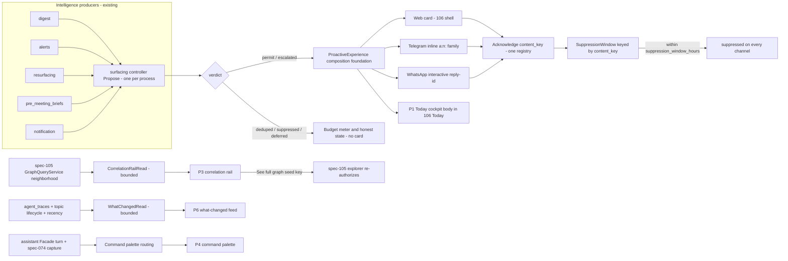

# Design: 107 Proactive & Correlated Experience

## Design Brief

### Current State

Smackerel already runs the proactive backbone this feature presents. The single
cross-channel decision point is `internal/intelligence/surfacing/controller.go`:
its `Propose(ctx, SurfacingCandidate)` runs one pipeline — dedupe → suppress →
budget → escalate — and returns one of five terminal verdicts
(`internal/intelligence/surfacing/types.go`: `permit`, `deduped`, `suppressed`,
`deferred-budget-exhausted`, `escalated`). One controller is constructed per
process and shared across every producer, so the budget
(`budget.go`), the content-key dedupe (`dedupe.go`), and the post-ack
suppression (`suppression.go`) are unified. The tunables are one SST block
(`config/smackerel.yaml` surfacing, L457–482) and the metrics are the existing
`smackerel_surfacing_*` families (`internal/metrics/surfacing.go`), including the
`smackerel_surfacing_budget_remaining` gauge.

The pieces the experience composes over are all real and shipped: suppression is
keyed **purely** by `content_key` (`suppression.go` `AckLookup.LastAcknowledged`),
so it is already channel-agnostic; the Telegram assistant adapter already routes
inline-button callbacks under an `a:` namespace with two bounded families,
`a:c:` (confirm) and `a:d:` (disambiguation), inside Telegram's 64-byte
`callback_data` bound (`internal/telegram/assistant_adapter/callbacks.go`); the
assistant `Facade` (`internal/assistant/facade.go`) already returns
`CaptureRoute`, `StatusSavedAsIdea`, and `StatusUnavailable` and only runs its
capture/provenance gate on `agent.OutcomeOK`; the knowledge graph read is the
authorized `GraphQueryService` neighborhood contract that spec 105 layers on the
spec-080 activation foundation (`internal/api/graphapi/`,
`auth.RequireScope("knowledge-graph:read")`); the "what the system did" record is
`agent_traces` (`internal/agent/store.go`, `internal/db/migrations/020_agent_traces.sql`,
listed by `internal/web/agent_admin.go`) plus topic lifecycle transitions
(`internal/topics/lifecycle.go`); and the WhatsApp transport
(`specs/072-whatsapp-business-transport`) already reserves `Transport = "whatsapp"`
and renders interactive reply-button messages.

What does not exist is the **composition layer**: nothing renders a controller
verdict as a first-class actionable card with provenance and honest budget state,
nothing brings a bounded correlation rail to an ordinary item, nothing offers one
global ask-or-capture surface, and nothing makes the audit trail legible as a
"what changed" feed.

### Target State

One required `ProactiveExperience` composition foundation projects the controller's
already-permitted verdicts, the spec-105 authorized neighborhood read, the
`agent_traces`/topic-lifecycle activity read, and the spec-074/061 assistant turn
into six surfaces — the P1 Today cockpit, the P2 proactive card (web + Telegram +
WhatsApp renderings), the P3 correlation rail, the P4 command palette, the P5
cross-frontend parity contract, and the P6 what-changed feed — all inside the
spec-106 shell. Every card originates from exactly one `controller.Propose(...)`
verdict; there is no parallel surfacing path, no second budget, no second graph
read, and no new business store. Form changes per channel; the budget, dedupe,
and suppression truth is the controller's, identical across web, Telegram, and
WhatsApp, because acting on any channel routes one `content_key` acknowledgement
back to the one process-wide ack registry.

### Patterns To Follow

- Consume `internal/intelligence/surfacing/controller.go` `Propose`/verdict and
  the `content_key`-keyed `AckLookup.Acknowledge`; never fork the pipeline, the
  budget, the dedupe, or the suppression.
- Extend the Telegram callback family additively — add an `a:n:` nudge subprefix
  parallel to the existing `a:c:`/`a:d:` in
  `internal/telegram/assistant_adapter/callbacks.go`, decoded by extending
  `decodeCallbackData`, keeping the payload well inside the 64-byte bound.
- Reuse the spec-105 `GraphQueryService` neighborhood read
  (`internal/api/graphapi/`, `auth.RequireScope("knowledge-graph:read")` plus the
  `knowledge_graph_api.reader_user_ids` allowlist) and its `<kind>:<id>` seed-key
  deep-link shape; the rail is a tighter-bounded call of the same contract.
- Consume the assistant `Facade.Handle` turn (spec 061/073) and its `CaptureRoute`
  hook for capture-as-fallback (spec 074) unchanged; respect the
  `OutcomeOK`-only capture/provenance gate in `internal/assistant/facade.go`.
- Read `agent_traces` (`internal/agent/store.go`) and `internal/topics/lifecycle.go`
  transitions for the what-changed feed; reuse the existing
  `smackerel_surfacing_*` metric vocabulary for the budget meter.
- Compose over spec-106's shell, tokens, stable `data-*` DOM contract, four
  availability labels, `AuthenticatedRequestAdapter`, and `MutationFeedbackPresenter`;
  add no new nav destination.

### Patterns To Avoid

- Do not introduce a parallel surfacing path, a second budget, a second dedupe,
  or any nudge that reaches a channel without a `permit`/`escalated` verdict.
- Do not place a raw `content_key`, node label, query text, or personal content
  on any transport wire, in any `data-*` hook, or in telemetry.
- Do not create a second activity store, a second graph store, a standalone
  snooze store, a cross-channel identity store, or any client cache
  (localStorage/sessionStorage/IndexedDB/CacheStorage/service-worker) of graph,
  card, provenance, or activity data.
- Do not re-implement the spec-105 explorer, its bounds, its layout, or its
  reason text in the rail; deep-link into it.
- Do not fork the spec-074 capture path or render a failed/refused ask as "saved
  as an idea"; that acknowledgement is band-low capture only.
- Do not edit `specs/105-*`, `specs/106-*`, `specs/072-*`, `specs/078-*`, or the
  in-tree `internal/intelligence/surfacing/` contract owner; emit coordination
  notes instead.
- Do not claim migration numbers; reserve them at implementation pickup (matching
  the spec-105 convention).

### Resolved Decisions

- **One controller, all channels.** Web, Telegram, and WhatsApp all consume the
  single `controller.Propose(...)` verdict; the ack path for every channel is one
  `Acknowledge(content_key)` on the one process-wide registry.
- **WhatsApp is a new bounded `Channel` enum value.** `whatsapp` is added to the
  `Channel` enum via its documented bounded-cardinality extension path (the exact
  precedent `ProducerNotification` set in `types.go`), routed as a coordination
  note to the surfacing (spec 078) and transport (spec 072) owners; the design
  reserves the value and its Prometheus-cardinality justification but does not
  edit `types.go` this phase.
- **Nudge callbacks are a new additive `a:n:` family** with an opaque server-side
  ref; WhatsApp reply-ids carry the same logical `a:n:<ref>:<a|s|d>` shape.
- **Snooze is suppression, not a store.** Act/Snooze/Dismiss all call
  `Acknowledge(content_key)`; the difference is label, intent, and window, never a
  second store.
- **Cross-channel suppression is already global** because it is keyed by
  `content_key`; the only join needed is `(transport, transport_user) → auth.Session
  principal`, reusing each transport's existing auth mapping.
- **The rail is a tighter-bounded spec-105 neighborhood read**, not a second graph
  path; the feed is a bounded read over `agent_traces` + topic lifecycle + a
  recently-touched recency read, not a second activity store.
- **The cockpit is the body of the spec-106 `Today` destination**; 106 owns the
  route registration, 107 owns the composition inside it (coordination note 3).
- **No new business store; no client cache of sensitive data.** Only ephemeral,
  process-local routing state (the nudge-ref registry) is added, carrying opaque
  refs and no durable business data.

### Open Questions

No architecture question blocks planning. The five UX-routed design questions
(OQ2 callback encoding, OQ4 what-changed read, OQ5 correlation read, OQ6 snooze,
OQ7 identity join) plus the web action transport and the command-palette routing
contract are resolved below as typed contracts. Residual decisions genuinely
deferred to `bubbles.plan`/implementation (scope decomposition, migration
numbers, exact SST value for the rail bound and any distinct snooze window, and
the multi-user identity-mapping generalization) are in `## Routed Questions`.

## Purpose And Change Boundary

This design owns the technical contract for **one thing**: the proactive and
correlated **composition and interaction layer** that renders already-produced
controller verdicts, already-stored graph edges, already-logged activity, and the
existing assistant turn as six honest surfaces inside the spec-106 shell. It
covers:

- the composition of the P1 Today cockpit body, the P2 proactive card and its
  three channel renderings, the P3 correlation rail, the P4 command palette, the
  P5 cross-frontend parity contract, and the P6 what-changed feed;
- the nudge action encoding and its cross-channel resolution (OQ2, OQ7);
- the bounded, authorized, provenance-bearing read contracts for the what-changed
  feed (OQ4) and the correlation rail (OQ5);
- the snooze-as-suppression mapping (OQ6) and the web action transport;
- the command-palette ask/capture/refuse routing contract; and
- the honest-state, observe-first, invisible-by-default, and authorization
  invariants across every surface and channel.

This design **does not own**, and consumes only via existing contracts:

- the spec-078 surfacing controller internals (budget, dedupe, suppression,
  escalation logic, and the `Channel`/`Producer`/`DecisionKind` enum owner);
- the spec-106 shell, information architecture, tokens, typography, session
  issuance, `AuthenticatedRequestAdapter`, `MutationFeedbackPresenter`, or
  landing-route registration;
- the spec-105 graph algorithms, `GraphQueryService`, `GraphReasonResolver`,
  Canvas renderer, saved views, or store;
- the spec-072 WhatsApp transport internals, webhook verification, or
  `AssistantResponse → WhatsApp` mapping table;
- the spec-074 capture logic and the spec-061/073 assistant `Facade`/turn
  contract; and
- any domain persistence — `agent_traces`, `topics`, `edges`, captures,
  artifacts, and the ack/dedupe registries all remain owned by their packets.

No file under `specs/105-*`, `specs/106-*`, `specs/072-*`, `specs/078-*`, or the
`internal/intelligence/surfacing/` contract is modified by this feature. Every
needed change to those owners is emitted as a coordination note. Planning-only:
no source, no executed tests, no migrations, no browser runs, no deployment;
status stays `not_started`.

## Grounded Architecture Findings

| Surface | Current evidence | Design consequence |
|---|---|---|
| Surfacing decision point | `internal/intelligence/surfacing/controller.go` `Propose(ctx, SurfacingCandidate) (SurfacingDecision, error)` runs dedupe → suppress → budget → escalate; one controller per process | Every P1–P6 card consumes exactly one verdict; the composition layer never re-runs or bypasses the pipeline. |
| Verdict + channel/producer contract | `internal/intelligence/surfacing/types.go`: `DecisionKind` (5 verdicts), `Channel` (`telegram`, `web_push`, `ntfy`, `email_out`, `digest`), `Producer` (8), with the doc "new channels MUST extend this enum" and the `ProducerNotification` additive precedent | `whatsapp` is reserved as an additive `Channel` value with a cardinality justification, routed to the enum owner (078); only `permit`/`escalated` produce a card. |
| Suppression identity | `internal/intelligence/surfacing/suppression.go`: `AckLookup.LastAcknowledged(contentKey)`, `InMemoryAck.Acknowledge(contentKey)`, `SuppressionWindow.IsSuppressed(contentKey)` keyed solely by `content_key` | Cross-channel suppression is already global (channel-agnostic); act/snooze/dismiss all call `Acknowledge(content_key)`; snooze needs no store. |
| Budget + metrics | `budget.go` (`TryConsume`/`Remaining`/`RecordOverride`), `internal/metrics/surfacing.go` `smackerel_surfacing_budget_remaining` gauge + `SetBudgetRemaining` | The budget meter reads the existing gauge/verdict vocabulary; no new metric family. |
| Telegram callbacks | `internal/telegram/assistant_adapter/callbacks.go`: `a:` namespace, `a:c:`/`a:d:` families, ULID refs, explicit 64-byte `callback_data` note, `decodeCallbackData` switch | Add an `a:n:` nudge subprefix additively (new `callbackKindNudge`), never colliding with `a:c:`/`a:d:` or the spec-028 list family. |
| WhatsApp transport | `specs/072-whatsapp-business-transport` reserves `Transport = "whatsapp"`; interactive reply-buttons ≤3, reply payloads round-trip a ref + index; list/text fallback; exhaustive-mapping golden test | Nudge reply-ids carry the same logical `a:n:<ref>:<a|s|d>`; three reply buttons Act/Snooze/Dismiss; list/text fallback preserves the three actions. |
| Graph read | `internal/api/graphapi/` with `auth.RequireScope("knowledge-graph:read")` (`errors.go`); spec-105 `GraphQueryService` neighborhood (`seed` + `depth` required), `GraphNodeV1`/`GraphEdgeV1`/`GraphReasonResolver`, `reader_user_ids` allowlist, `/knowledge/graph?...&seed=<kind>:<id>&focus=...` deep-link | The rail is a `RAIL_MAX`-bounded neighborhood call of the same contract; `See full graph` reuses the exact 105 seed deep-link; no second graph path. |
| Activity read | `internal/agent/store.go` + `020_agent_traces.sql` (system "did/decided"), `internal/web/agent_admin.go` (list surface), `internal/topics/lifecycle.go` `State` (emerging→active→hot→cooling→dormant→archived) | The feed's left column is a bounded read over `agent_traces` + surfacing verdicts + lifecycle transitions; the right column is a bounded recency read; no second store, no unread watermark. |
| Assistant honesty | `internal/assistant/facade.go`: `CaptureRoute`, `StatusSavedAsIdea`, `StatusUnavailable`, `translateOutcomeToStatus`, capture/provenance gate only on `agent.OutcomeOK` | Palette answered → grounded answer; capture-eligible band-low → spec-074 Idea + `StatusSavedAsIdea`; failed/refused ask → `StatusUnavailable`/honest refusal, never the capture ack. |
| Capture payload | `internal/assistant/capturefallback/payload.go` (no inferred tags/topics/lifecycle) | The palette forks nothing; it invokes the existing capture path and renders the shared ack. |
| Web session + mutation | `internal/api/router.go` (CORS default same-origin-only), `internal/api/pwa.go` (HttpOnly `auth_token` cookie, `credentials: "same-origin"`), `auth.RequireScope`, CSP `script-src 'self'` | The web nudge action is an authenticated same-origin mutation composed over spec-106's `AuthenticatedRequestAdapter`; no bearer in JS, no new bypass, no new surfacing path. |

### Honest Composition Constraints

Three surfaces have a hard "consume, never re-own" boundary the design must
respect. The correlation rail is a **tighter-bounded** call of the spec-105
neighborhood contract, not a distinct read with different bounds; if it becomes a
second graph read it violates FR-107-014 and coordination note 2. The what-changed
feed is a **projection** of `agent_traces` + lifecycle + recency, never a durable
"unread" store; persisting a per-user seen-watermark would forbidly re-introduce a
second store and a backlog counter (FR-107-021). The `whatsapp` channel value is an
**enum extension owned by spec 078**, reserved here and routed as a note; the
design does not edit `types.go`.

## Architecture Overview



The surfacing controller owns every verdict, budget, dedupe, and suppression fact.
Spec 105 owns graph truth and re-authorization on deep-link entry. The assistant
`Facade` owns the turn and the capture/refusal decision. Spec 106 owns the shell,
session, and mutation transport. The `ProactiveExperience` foundation only
**composes** those facts into surfaces and routes each action back to the one
controller ack path; it queries no domain table it does not already read through
an owner contract, and it infers no verdict, edge, activity event, or answer.

## Capability Foundation

The proactive experience is a reusable composition capability with multiple
concrete surfaces (six) and multiple channel renderings (three), so it is designed
foundation-first: one contract set, several concrete presentations.

### Foundation Contracts

| Contract | Responsibility | Consumers |
|---|---|---|
| `ProactiveCardModel` | Immutable per-card projection of one `permit`/`escalated` verdict: title, `Producer`-derived provenance line, honest-state token, opaque `NudgeRef`, and the three-action set. Exists only for `permit`/`escalated`. | Web card, Telegram renderer, WhatsApp renderer, cockpit, feed cross-links |
| `NudgeRef` registry | Ephemeral, process-local, expiring map `ref → {content_key, producer, channel, principal, issued_at}`, TTL ≥ suppression window; mints opaque ULID-shaped refs; resolves a wire ref back to `(content_key, principal, action)`; the sole anti-leak boundary so no `content_key` reaches any wire. | Callback encode/decode (all channels), web action endpoint, ack path |
| `NudgeAck` path | One `Acknowledge(content_key)` call on the process-wide `AckLookup` for act/snooze/dismiss from any channel; returns the resolved honest render (`acted`/`snoozed`/`suppressed`/`already-handled`/`expired`). | Web endpoint, Telegram callback handler, WhatsApp inbound handler |
| `CorrelationRailRead` | A `RAIL_MAX`-bounded, authorized `GraphQueryService.Neighborhood(seed, depth=1)` projection returning `GraphNodeV1` rows + `GraphReasonResolver` reasons + the stable seed key for the deep-link; honest `correlated`/`no-related-items`/`unavailable`/`unauthorized`. | P3 rail (desktop/mobile/nonvisual) |
| `WhatChangedRead` | A bounded, cursor-paged, authorized read composing `agent_traces` (did/decided), surfacing verdicts (decided), topic-lifecycle transitions (left column) and a recency read of canonical items (right column); honest `populated`/`quiet`/`partial`/`unavailable`/`unauthorized`; no unread watermark. | P6 feed, returning-user summary |
| `PaletteTurnRouter` | Routes one input through the assistant `Facade.Handle` (transport web) to answered / captured-as-idea (spec-074) / honest-refusal / error, honoring the `OutcomeOK`-only capture gate; never forks capture, never maps a failed ask to the capture ack. | P4 palette |
| `HonestStatePresenter` | Maps a proactive condition (quiet, budget-exhausted, suppressed, deduped, no-correlation, degraded, error, unauthorized) onto a spec-106 `data-view-state`/`data-operation-state` token + availability label; never a normal card. | Every surface, every channel |
| `BudgetMeterRead` | Reads `smackerel_surfacing_budget_remaining` + `daily_nudge_budget` (SST) into an honest "N of M used today" render; exhaustion is an explicit content state. | Cockpit header, card region, feed |

### Extension Points

- A **channel renderer** (web card, Telegram inline, WhatsApp interactive) maps a
  `ProactiveCardModel` to channel-appropriate markup and the three-action set. It
  cannot invent a verdict, add a budget, or place a `content_key` on the wire — it
  encodes only a `NudgeRef`.
- A **read adapter** (`CorrelationRailRead`, `WhatChangedRead`) maps an owner
  contract (spec-105 neighborhood, `agent_traces`, lifecycle, recency) to a bounded
  authorized projection. An unknown, malformed, or unauthorized owner outcome fails
  closed as `unavailable`/`unauthorized`; it never becomes an empty
  `no-related-items` or a fabricated row.
- A **honest-state adapter** maps a proactive condition to a spec-106 state token;
  unknown conditions fail closed to `error`, never to a normal card.
- A **new surface** must compose inside the spec-106 shell (or as a global overlay
  over it), expose the stable `data-*` contract, and route every action to the one
  ack path; it cannot register a new nav destination or a new surfacing path.

### Foundation-Owned Behavior

- one card only for a `permit`/`escalated` verdict; every other verdict informs the
  budget meter / honest state, never a card;
- one ack path (`Acknowledge(content_key)`) for act/snooze/dismiss on every channel,
  so acting once suppresses everywhere within `suppression_window_hours`;
- one opaque `NudgeRef` boundary so no `content_key`, node label, query, or personal
  content reaches any transport wire, `data-*` hook, or telemetry;
- one closed honest-state vocabulary mapped onto spec-106 tokens; quiet, exhausted,
  suppressed, deduped, no-correlation, degraded, and failed are distinct and visible;
- bounded, authorized, provenance-bearing reads only; no second store, no client
  cache of graph/card/activity/provenance data;
- observe-first ordering (produced intelligence before the ask/capture input) and
  invisible-by-default volume (the controller's budget and the ≤3 prompts/week
  contract, never inflated);
- fail-closed authorization: every card, provenance line, correlation, and activity
  row re-authorized against the principal's grants before render.

## Concrete Implementations

### P1 Today Cockpit (spec-106 `Today` body)

The cockpit is the body of the spec-106 `Today` root destination (coordination note
3). It composes, top to bottom (observe-first reading order): the current digest
summary (read-only lede; `Open digest` navigates to the 106 Digest surface), the
`FOR YOU NOW` region of `ProactiveCardModel` cards (permit/escalated only), the
what-changed strip (a `WhatChangedRead` summary), and — secondary, not the hero —
the ask-or-capture bar that opens the P4 palette. The budget meter
(`BudgetMeterRead`) sits in the header. The left rail and chrome are spec-106-owned;
only the body is 107-owned. Honest states (`quiet-day`, `budget-exhausted`,
`partial`, `unauthorized`) render through `HonestStatePresenter`, never as a
fabricated card.

### P2 Proactive Card And Its Three Channel Renderings

One `ProactiveCardModel` renders three ways with identical logical content and
identical controller truth (P5 parity):

- **Web** (spec-106 Pending-action-row): title + provenance line + `Available`/
  `Degraded` badge + `[Act][Snooze][Dismiss]` (≥44×44px) + `[Why ▾]`. The action is
  a same-origin authenticated mutation (see Web Action Transport) carrying only
  `{nudgeRef, action}`. On success the card flips to the `Acted`/`Snoozed` terminal
  form in place with one `status` announcement.
- **Telegram** (inline keyboard): message body = title + `Why:` line; one inline row
  `Act`/`Snooze`/`Dismiss` encoded `a:n:<ref>:<a|s|d>` (see OQ2). Tapping edits the
  message in place and removes the buttons once terminal.
- **WhatsApp** (spec-072 interactive): body = title + `Why:` line; three reply
  buttons `Act`/`Snooze`/`Dismiss` whose `reply.id` carries the same
  `a:n:<ref>:<a|s|d>`; list-message fallback and numbered plain-text fallback
  preserve the same three actions.

An `escalated` card carries the `▲ Urgent` marker and `URGENT ESCALATION` provenance
on every channel; a `deduped`/`suppressed`/`deferred-budget-exhausted` verdict draws
no card on any channel.

### P3 Correlation Rail

A spec-106 Inspector attached to any item view, populated by `CorrelationRailRead`
(see OQ5). Each row is one real `GraphEdgeV1` with a typed related `GraphNodeV1` and
a `GraphReasonResolver` reason; `See full graph` deep-links into the spec-105
explorer seeded on the current item's node key. Honest `no-related-items`
(105 `isolated-only`) is distinct from `unavailable` (read failure). Desktop side
rail, mobile bottom sheet, and a nonvisual outline are three projections of the same
bounded read.

### P4 Command Palette

A global overlay routed by `PaletteTurnRouter` (see Command-Palette Routing). One
input → the assistant `Facade` turn → answered / captured-as-idea (spec-074) /
honest-refusal / error. The refusal and the capture ack are structurally distinct
`data-view-state` tokens; a failed ask is never "saved as an idea".

### P5 Cross-Frontend Parity

Not a surface but the invariant binding the three P2 renderings: every card on
every channel is one controller verdict, and every action routes one `content_key`
back to the one ack path (see Single-Controller Routing + OQ7). Form varies; budget,
dedupe, suppression, and escalation truth does not.

### P6 What-Changed Feed

A spec-106 `Activity` workspace view populated by `WhatChangedRead` (see OQ4): left
column = system did/decided (agent traces + surfacing verdicts + lifecycle moves),
right column = recently touched. Restart-safe: a returning-user summary is a bounded
digest of real events, never an unread counter.

### Variation Axes

| Axis | Options | Foundation ownership |
|---|---|---|
| Channel / transport | web card, Telegram inline, WhatsApp interactive (+ list/text fallback) | One `ProactiveCardModel`, one verdict, one ack path; only markup + encoding differ |
| Surface | cockpit, card, rail, palette, parity, feed | Shared honest-state vocabulary + `data-*` contract; concrete composition differs |
| Read source | controller verdict, spec-105 neighborhood, agent_traces + lifecycle + recency, assistant turn | Bounded, authorized, provenance-bearing read adapters; owner contract unchanged |
| Honest state | permitted, escalated, acted, snoozed, suppressed, deduped, budget-exhausted, quiet, no-correlation, degraded, error, unauthorized | `HonestStatePresenter` maps each onto a spec-106 token; never a normal card |
| Action | act, snooze, dismiss (nudge); ask, capture (palette); open, see-in-graph (rail) | One encoded intent set per surface; every nudge action reaches the one controller |
| Input / viewport | pointer, touch, keyboard, screen reader; desktop, tablet, 390px, 320px/200% | Shared spec-106 responsive + accessibility primitives; parity outcomes |

## Resolved Design Contracts

### OQ2 — Nudge Callback Encoding (Telegram + WhatsApp)

**Problem.** Act/Snooze/Dismiss is a new nudge action family. It must encode on
Telegram within the 64-byte `callback_data` bound and on WhatsApp as an interactive
reply-id, both mapping to the same logical action set, without colliding with the
existing `a:c:`/`a:d:`/spec-028 families and without leaking `content_key`.

**Contract.**

- **Telegram wire form:** `a:n:<ref>:<action>` where
  - `a:n:` is a new subprefix ("assistant nudge") parallel to the existing
    `callbackConfirmPrefix = "a:c:"` / `callbackDisambigPrefix = "a:d:"` in
    `internal/telegram/assistant_adapter/callbacks.go`. It is decoded by extending
    `decodeCallbackData`'s switch with `case strings.HasPrefix(data, callbackNudgePrefix)`
    → a new `decodeNudge` producing a new `callbackKindNudge`. The existing
    `IsAssistantCallback` prefix (`"a:"`) already routes it to the assistant adapter;
    no other family changes.
  - `<ref>` is an opaque ULID-shaped `NudgeRef` (26 chars) minted server-side, never
    the raw `content_key`.
  - `<action>` is a single byte: `a` = act, `s` = snooze, `d` = dismiss.
  - **Byte budget:** `a:n:` (4) + ULID (26) + `:` (1) + action (1) = **32 bytes**,
    well inside Telegram's documented 64-byte `callback_data` bound (the same headroom
    the existing ULID-ref families already rely on).

  ```text
  callbackNudgePrefix = "a:n:"                    // new, additive
  encodeNudgeCallback(ref string, act NudgeAction) string
      // → "a:n:<ref>:a" | ":s" | ":d"            (<= 32 bytes)
  decodeNudge(payload string) (decodedCallback{kind: callbackKindNudge, ref, action})
  ```

- **WhatsApp mapping (spec-072 interactive):** the three reply buttons carry
  `reply.id = "a:n:<ref>:<a|s|d>"` — the identical logical shape (WhatsApp reply-id
  length permits it comfortably). The inbound `interactive.button_reply.id` (or, in
  the list fallback, `interactive.list_reply.id`; or, in the numbered plain-text
  fallback, `1|2|3` mapped server-side to `a|s|d`) resolves through the **same**
  `NudgeRef` registry to the same `(content_key, action, principal)` and the same
  `NudgeAck` path. The three button titles are exactly `Act`/`Snooze`/`Dismiss`.

- **Shared resolution (`NudgeRef` registry):** an ephemeral, process-local, expiring
  map `ref → {content_key, producer, channel, principal, issued_at}` with TTL ≥
  `suppression_window_hours`, minted when a card is dispatched. It is the single
  anti-leak boundary — the `content_key` never appears in `callback_data`, a
  `reply.id`, a `data-*` hook, or telemetry. A stale/expired ref resolves to an
  honest `expired`/`already-handled` render, never a silent success. This is **not** a
  new business store: it is process-local routing state (like `DedupeIndex`/
  `InMemoryAck`), carrying opaque refs and no durable business data.

### OQ4 — What-Changed Read Contract

**Problem.** The P6 feed needs a real, bounded, authorized read over the audit trail,
agent traces, topic lifecycle, and recency, with honest empty/partial/unavailable
outcomes, no second store, and restart-safety (no unread counter).

**Contract — `WhatChangedRead`.**

- **Sources (all existing; no new store):**
  - Left column (system did/decided): a bounded read of `agent_traces`
    (`internal/agent/store.go`, `020_agent_traces.sql`) for ingested/connected/decided
    events; **plus** the surfacing controller's terminal verdicts made legible
    (deferred/escalated rendered from the existing `smackerel_surfacing_*` verdict
    vocabulary); **plus** topic-lifecycle transitions from `internal/topics/lifecycle.go`
    (`emerging`/`active`/`hot`/`cooling`/`dormant`/`archived`).
  - Right column (recently touched): a bounded recency read of canonical item tables
    (topics, captures, artifacts, people, photos) ordered by `updated_at`/last-interaction
    — the same tables the rest of the product already reads.
- **Bounds + pagination:** a range selector (`Last 24h` / `Last 7d`) and an opaque,
  principal-bound cursor over `created_at DESC` with a capped page size per column
  (planning reserves the exact cap as an SST value); no unbounded scan; the cursor
  follows the spec-105 HMAC-cursor pattern and does not reuse a raw offset.
- **Honest outcomes:** `populated`, `quiet` (successful empty read in range — not an
  error), `partial` (one source failed; the others still render), `unavailable` (all
  sources failed), `unauthorized`. Empty is never rendered as failure and failure is
  never rendered as empty.
- **Restart-safe (no second store):** the feed is a **stateless projection** of real
  events; there is no persisted per-user "seen"/"unread" watermark and no counter. A
  returning user's "while you were away (N days)" summary is a bounded aggregate of
  the same real events (counts of digests/ingests/lifecycle moves in the away window),
  never a backlog. Persisting an unread watermark would forbidly add a second store and
  a guilt counter (FR-107-021).
- **Authorization + telemetry:** every row is re-authorized against the principal's
  grants using the underlying store's existing authorization (agent-trace admin
  gating, topic read, graph-reader allowlist for connected-events); telemetry carries
  only the bounded producer/channel/verdict/timing/count vocabulary.

  ```text
  WhatChangedRead(principal, range, cursor) →
      { systemDid[]:  ActivityEvent{ kind: ingested|connected|decided|lifecycle|digest,
                                      atMicros, subjectRef (opaque), sourceHref },
        recentlyTouched[]: TouchedItem{ nodeKey <kind>:<id>, label(authz'd), atMicros },
        outcome: populated|quiet|partial|unavailable|unauthorized,
        nextCursor (opaque, principal-bound) }
  ```

### OQ5 — Correlation-Rail Read Contract

**Problem.** The always-on rail must show a few real edges for the current item with a
`See full graph` deep-link, reconciled with the spec-105/080 authorized graph read —
not a second graph path, not a client cache, honest no-related vs unavailable.

**Contract — `CorrelationRailRead`.**

- **It is a tighter-bounded call of the spec-105 neighborhood contract**, not a new
  read. Input: the current item's stable node key `<kind>:<canonical-id>`
  (topic/person/place/capture/artifact — the exact 105 key shape). Call:
  `GraphQueryService.Neighborhood(seed=<key>, depth=1, limit=RAIL_MAX)` where
  `RAIL_MAX` is a small SST bound (planning reserves the value, e.g. 5–8), through the
  **same** `GraphReaderAuthorizer` (`auth.RequireScope("knowledge-graph:read")` + the
  `knowledge_graph_api.reader_user_ids` allowlist) and the **same** `GraphNodeV1` /
  `GraphEdgeV1` / `GraphReasonResolver` outputs. The rail's bound is tighter than the
  explorer's workspace; the contract is identical.
- **Per row:** a typed related `GraphNodeV1`, its `GraphReasonResolver` reason
  (`mentions`/`related to`/`about`/`supports`/`located`), and a focusable open action.
  Every row is a real stored edge; no decorative, inferred-without-provenance, or
  fabricated correlation (105 forbids fallback topology).
- **Stable seed identifier + deep-link:** the read returns the current item's node key
  as the seed. `See full graph ▸` → `/knowledge/graph?view=graph&layout=neighborhood&seed=<current-key>&focus=<current-key>`
  (the exact spec-105 deep-link shape). A single row's open action →
  `...&seed=<current-key>&focus=<related-key>`. The rail passes **only** the authorized
  seed identifier; the explorer re-authorizes on entry (105 FR-105-016). This reuses
  the explorer's existing "Explore connections" launch (105 UC-105-002).
- **Honest outcomes:** `correlated` (1..N real edges), `no-related-items`
  (105 `isolated-only` for the seed — a successful read with zero stored edges),
  `unavailable` (read failed — distinct from empty), `unauthorized` (principal not in
  the reader allowlist → the rail shows unavailable/absent, never fabricates). A
  no-correlation item and a failed read are never the same state (FR-107-016).
- **No parallel store, no client cache:** the bounded result lives in memory for the
  current item view only; it is never persisted to localStorage/sessionStorage/
  IndexedDB/CacheStorage/service-worker (105 forbids graph caching). Each item view
  re-queries and re-authorizes. NFR-107-003: the rail never renders the full edge store.
- **Reconciliation (coordination note 2 → spec 105):** if the 105 neighborhood
  contract or the `<kind>:<id>` seed-key shape changes, the rail follows; the design
  requests only that the launch/seed contract be confirmed stable, not any 105 edit.

### OQ6 — Snooze Semantics (No Standalone Store)

**Problem.** Snooze must be expressed through the controller's suppression model, with
a defined window and a defined difference from post-ack (dismiss) suppression, and no
snooze store.

**Contract.**

- Act, Snooze, and Dismiss **all** route to the same `NudgeAck` path, which calls
  `Acknowledge(content_key)` on the process-wide `AckLookup`
  (`internal/intelligence/surfacing/suppression.go`). That single call makes
  `SuppressionWindow.IsSuppressed(content_key)` true for `suppression_window_hours`
  (SST default 4) on **every** channel — there is no snooze-specific storage.
- **The distinction is intent + label + window, not a second store:**
  - **Dismiss** = "acknowledge, don't show again" → suppressed for the window; the user
    does not expect it back. Rendered "suppressed 4h".
  - **Snooze** = "not now, later" → suppressed for a **snooze window**, after which the
    controller naturally re-permits (because `IsSuppressed` returns false once the
    window elapses and a producer re-proposes the same `content_key`). Rendered
    "Snoozed · until <time>".
  - For MVP the snooze window **is** `suppression_window_hours` (one SST value, reused);
    if a distinct snooze duration is wanted it is a bounded additive SST key
    (`snooze_window_hours`) resolved through the **same** `Acknowledge` mechanism, never
    a new store. Choosing whether MVP ships a distinct snooze window is routed to
    `bubbles.plan`.
- The controller's re-propose-after-window behavior is what makes snooze "come back"
  while dismiss (same suppression truth, different user intent) simply lapses. No snooze
  row, timer store, or scheduler entry is introduced.

### OQ7 — Cross-Channel Identity Join

**Problem.** One `content_key` acknowledgement on one transport must suppress the same
nudge on web + Telegram + WhatsApp, i.e. all transports must resolve to one suppression
subject.

**Contract.**

- **Suppression is already cross-channel** because `AckLookup`/`SuppressionWindow` is
  keyed **purely by `content_key`** (channel-agnostic) and there is **one** controller
  and one ack registry per process (`controller.go`: "Construct exactly one per
  process; share across all producers"). So the join is not about the suppression key —
  it is about resolving a transport-specific inbound action to the one principal and the
  one `content_key`.
- **The join reuses each transport's existing per-user auth mapping — no new identity
  store:**
  - Web: the same-origin HttpOnly `auth_token` cookie → `auth.Session` principal
    (`internal/api/pwa.go`, `auth.RequireScope`).
  - Telegram: the per-user Telegram identity → Smackerel user
    (`internal/telegram/per_user_token.go`, specs 044/060).
  - WhatsApp: the verified phone-number → Smackerel user mapping (spec 072 §2).
- Every nudge action carries the opaque `NudgeRef`, which the registry resolves to
  `{content_key, principal}`. The transport independently resolves its user to a
  principal; the `NudgeAck` path calls `Acknowledge(content_key)` on the one registry.
  For the single-operator MVP all transports resolve to the one operator principal, so
  the join is trivially satisfied and cross-channel suppression is immediate.
- **`SuppressionSubject = principal`** (the resolved `auth.Session` user);
  `content_key` remains the cross-channel dedupe/suppression identity. A future
  multi-user product would require each transport's `(transport, transport_user_id) →
  principal` mapping to be authoritative before per-user cross-channel suppression can
  be claimed (routed to `## Routed Questions`).

### Web Action Transport (Act/Snooze/Dismiss On Web)

**Contract.** The web nudge action is an **authenticated same-origin mutation composed
over spec-106**, not a new bypass and not a new surfacing path:

- It rides the existing HttpOnly `auth_token` cookie with `credentials: "same-origin"`
  (`internal/api/pwa.go`), is gated by `auth.RequireScope`, and is protected by the
  product's existing strict CORS default (same-origin-only, `internal/api/router.go`)
  and CSP `script-src 'self'` plus the Origin/Referer discipline the product's
  state-mutating requests already use. No bearer token is placed in JavaScript; no
  token is read or stored client-side.
- The request body carries only `{ nudgeRef, action }` (`action ∈ act|snooze|dismiss`);
  the server resolves the `NudgeRef` → `(content_key, principal, action)` and calls the
  one `NudgeAck` path. The `content_key` is never sent by the client.
- The card renders the mutation through spec-106's `AuthenticatedRequestAdapter` +
  `MutationFeedbackPresenter` (pending → success/`already-handled`/error). The 107 ack
  handler is a thin composition endpoint that acknowledges through the existing
  controller/ack registry; it introduces no second budget, dedupe, or suppression.

### Command-Palette Routing Contract (P4)

**Contract — `PaletteTurnRouter`.** One input routes through the existing assistant
`Facade.Handle` (spec 061, transport web per spec 073); the palette forks nothing and
respects the smackerel assistant-honesty contract:

| Facade result | Render (`data-view-state`) | Rule |
|---|---|---|
| `agent.OutcomeOK` **with** grounded Sources | answer body + sources (`current`) | Grounded ask (FR-107-019); the capture/provenance gate ran on `OutcomeOK`. |
| `CaptureRoute == true` (band-low / unresolvable, capture-eligible) | one spec-074 Idea + shared "saved as an idea" ack (`captured-as-idea`) | The spec-074 capture path unchanged (`internal/assistant/capturefallback/payload.go`); dedup window collapses a duplicate; "that was just chat" uses the existing correction path. |
| `OutcomeOK` **without** grounded sources → `StatusUnavailable` + `ErrNoGroundedAnswer`, **or** any non-`OutcomeOK` outcome | honest refusal / error (`refused` / `error`) | The capture/provenance gate does **not** run on a non-`OutcomeOK` outcome (`internal/assistant/facade.go`); a failed/refused ask is **never** rendered as "saved as an idea". |

The refusal token (`refused`) and the capture-ack token (`captured-as-idea`) are
structurally distinct; "saved as an idea" is band-low capture only. The palette is a
consumer of the `Facade`; it does not re-implement capture, grounding, or refusal.

## Single-Controller Routing (Every Card, One Decision Point)

Every proactive card on every surface and channel originates from exactly one
`controller.Propose(...)` verdict; the composition layer never re-runs the pipeline,
adds a budget, or dispatches a nudge that skipped the controller.

```text
producer → controller.Propose(candidate) → verdict
   permit | escalated   → ProactiveCardModel → { web card | Telegram a:n: | WhatsApp reply-id }
   deduped              → no card (dedupe window); budget/telemetry only
   suppressed           → no card; already-handled render if a stale ref is tapped
   deferred-budget-…    → no card on any channel; honest budget-exhausted state
act/snooze/dismiss (any channel) → NudgeRef → NudgeAck → Acknowledge(content_key)
   → SuppressionWindow keyed by content_key → suppressed on EVERY channel within
     suppression_window_hours (act once, quiet everywhere)
```

This is the FR-107-003/006/007/008/009 invariant expressed as one routing rule:
form varies per channel; budget, dedupe, suppression, and escalation truth is the
controller's, identical everywhere.

## Dependency And Ownership Map

| Dependency | Sole owner contract consumed by 107 | 107 integration boundary | Do-not |
|---|---|---|---|
| `specs/078-cross-surface-surfacing-prioritizer` + `internal/intelligence/surfacing/` | `Propose`/verdict, `content_key`-keyed `Acknowledge`, budget/dedupe/suppression/escalation, `Channel`/`Producer`/`DecisionKind` enums, `smackerel_surfacing_*` metrics | Consume every verdict; route every action to the one ack path; reserve `whatsapp` as an additive `Channel` value via coordination note | Fork the pipeline, add a second budget, bypass `Propose`, or edit `types.go` |
| `specs/072-whatsapp-business-transport` | `Transport = "whatsapp"`, interactive reply-button/list/text rendering, webhook verification, exhaustive `AssistantResponse → WhatsApp` mapping | Map nudge reply-ids to the same `a:n:<ref>:<a|s|d>`; use the transport's interactive send/receive | Re-own the transport, its webhook verification, or its mapping table |
| `specs/105-connected-knowledge-graph-explorer` | `GraphQueryService.Neighborhood`, `GraphNodeV1`/`GraphEdgeV1`/`GraphReasonResolver`, `GraphReaderAuthorizer`, `<kind>:<id>` seed-key + `/knowledge/graph?...` deep-link, `isolated-only` | Rail is a `RAIL_MAX`-bounded call of the same contract; `See full graph` reuses the exact deep-link | Re-implement the explorer, its bounds, its layout, its reasons, or edit 105 |
| `specs/106-coherent-product-experience` | Shell/IA, tokens, typography, four availability labels, stable `data-*` contract, `AuthenticatedRequestAdapter`, `MutationFeedbackPresenter`, `Today` destination | Cockpit is the `Today` body; palette is a global overlay; rail is an Inspector; feed is an `Activity` view; web action is a 106 mutation | Add a nav destination, re-own the shell/session, or edit 106 |
| `specs/074-capture-as-fallback-policy` | Capture-as-fallback provenance + "saved as an idea" ack (`internal/assistant/capturefallback/payload.go`) | The palette invokes it via the `Facade` `CaptureRoute` hook, unchanged | Fork a capture path or reuse the ack for a non-capture turn |
| `specs/061-conversational-assistant` + `specs/073-web-mobile-assistant-frontend` | `Facade.Handle` turn, `AssistantResponse`, `CaptureRoute`/`StatusSavedAsIdea`/`StatusUnavailable` honesty | The palette and the channel renderings consume the turn/response | Re-implement the turn, grounding, or refusal |
| `specs/054-notification-intelligence-handler` + `specs/055-notification-source-ntfy-adapter` | `ProducerNotification` candidates through the shared controller | Render notification-origin cards like any other producer | Fork notification logic |

No owner row above is reimplemented inside a 107 scope. A missing owner contract
blocks only the dependent 107 surface; it never authorizes a composition-side
approximation, a fabricated card/correlation/activity row, or a second store.

## Data Model And Persistence

### No New Business Store

This feature adds **no** PostgreSQL business table and copies **no** domain record.
Every read is a bounded, authorized projection over an existing owner store:
`agent_traces` (spec-054 tracer), topic lifecycle (`internal/topics/lifecycle.go`),
canonical item tables (recency), and the spec-105 `edges`/node repositories (via the
`GraphQueryService` neighborhood). The suppression/dedupe/ack state stays in the
existing surfacing registries (`InMemoryAck`, `DedupeIndex`, `BudgetTracker`).

The only new persisted-adjacent state is the **`NudgeRef` registry** — an ephemeral,
process-local, expiring `ref → {content_key, producer, channel, principal, issued_at}`
map (TTL ≥ `suppression_window_hours`). It carries opaque refs and no durable business
data, mirroring the existing `DedupeIndex`/`InMemoryAck` process-local pattern. It is
not a durable client or business data source; a restart drops it and stale refs resolve
to honest `expired`/`already-handled`.

### No Client Cache Of Sensitive Data

No card, provenance line, correlation, activity row, `content_key`, node label, or
query is persisted to localStorage, sessionStorage, IndexedDB, CacheStorage, or the
service worker. Transient in-memory view state for the current cockpit/rail/palette/
feed is allowed and is re-queried + re-authorized on each entry (matching the 105/106
no-cache rule). The only new browser-persisted value remains spec-106's benign
appearance cookie — 107 adds none.

### Configuration Values (SST)

The composition reuses the existing surfacing SST block (`config/smackerel.yaml`
surfacing, L457–482: `daily_nudge_budget`, `suppression_window_hours`,
`dedupe_window_hours`, `urgent_escalation_enabled`) and adds only bounded, explicit,
no-default values reserved for planning: `RAIL_MAX` (rail neighborhood bound), the
what-changed page cap, the `NudgeRef` TTL, and — only if a distinct snooze duration
ships — `snooze_window_hours`. Missing required values fail config/build validation;
no `${VAR:-default}`, `os.getenv(..., default)`, or `unwrap_or` may mask an absent
runtime value (repo NO-DEFAULTS policy).

## API And Contract Boundaries

### No New Surfacing Path; Thin Composition Endpoints Only

This feature introduces **no** new intelligence producer, **no** new budget/dedupe/
suppression path, and **no** new graph or activity store. It adds only thin,
authorized composition endpoints that read existing owner contracts and route actions
to the one controller ack path:

- a bounded `WhatChangedRead` endpoint (agent_traces + verdicts + lifecycle + recency);
- a bounded `CorrelationRailRead` endpoint (a `RAIL_MAX` neighborhood call of the
  spec-105 `GraphQueryService`);
- a `NudgeAck` endpoint (web) resolving `{nudgeRef, action}` → `Acknowledge(content_key)`;
- the Telegram `a:n:` callback handler and the WhatsApp nudge reply-id handler, both
  resolving through the shared `NudgeRef` registry to the same `NudgeAck` path.

Each endpoint is gated by the existing `auth.RequireScope` + same-origin session and
carries only the bounded non-sensitive vocabulary on the wire. The palette calls the
existing assistant `Facade` transport; it registers no new turn endpoint.

## Security And Privacy

- Every card, provenance line, correlation, and activity row is re-authorized against
  the principal's explicit grants over the operator-owned global corpus before render;
  unauthorized content and existence metadata are never revealed (FR-107-027).
- The `NudgeRef` registry is the single anti-leak boundary: no `content_key`, node
  label, query text, or personal content ever reaches a `callback_data`, a WhatsApp
  `reply.id`, a web request body, a `data-*` hook, or telemetry (FR-107-028). Wire
  payloads carry only opaque refs, the bounded action set, and the closed
  producer/channel/verdict/timing/count vocabulary.
- The web action rides the existing HttpOnly same-origin cookie + `auth.RequireScope`
  + strict CORS/CSP + Origin/Referer discipline; no bearer in JS, no client-stored
  token, no new bypass.
- The rail read is bound to the spec-105 reader authorization (`knowledge-graph:read`
  scope + `reader_user_ids` allowlist); a principal outside it sees `unavailable`/
  absent, never a fabricated correlation.
- Cross-channel acknowledgement carries only the `content_key` (server-side, resolved
  from a ref) and the action — never card content — so suppression works without
  leaking payload across transports.

## Observability

- The budget meter and the feed's "decided" entries read the **existing**
  `smackerel_surfacing_*` families (`internal/metrics/surfacing.go`, incl.
  `smackerel_surfacing_budget_remaining`); this feature adds **no** parallel surfacing
  metric surface (FR observability).
- Per-channel rendering, acknowledgement, and cross-channel suppression outcomes are
  observable through the existing bounded producer/channel/verdict vocabulary; the
  `whatsapp` channel value (once the enum owner adopts it) extends that vocabulary
  additively so Prometheus cardinality stays finite (the `Channel` enum's stated
  bounded-cardinality contract).
- User-visible honest states and operator telemetry share the same closed vocabulary,
  so a quiet day, an exhausted budget, and a producer failure cannot be confused in
  either the UI or the metrics.
- New composition endpoints emit only bounded, content-free labels (surface, channel,
  verdict, outcome, timing, counts); no secret value, node label, or query text is a
  label value.

## Complexity Tracking

| Deviation from the simplest approach | Simpler alternative considered | Why rejected |
|---|---|---|
| A `NudgeRef` indirection registry between the wire and `content_key` | Put `content_key` directly in `callback_data` / `reply.id` / the web body | The `content_key` is often an `artifact_id`/`insight_id` (personal-content-bearing); placing it on any wire or `data-*` hook violates FR-107-028 and the telemetry-privacy rule. An opaque ref is the minimal privacy boundary and doubles as the stale-ref/expiry signal. |
| A capability-foundation split (contracts + adapters) rather than six bespoke surfaces | Hand-build each surface and channel independently | Six surfaces × three channel renderings with one shared verdict/ack/honest-state truth is exactly the "second-variant" trigger; a foundation prevents a parallel surfacing path, a divergent honest-state vocabulary, and duplicated ack logic (the failure conditions in the spec). |
| A new `a:n:` callback family instead of reusing `a:c:`/`a:d:` | Overload the confirm/disambig families for nudges | Act/Snooze/Dismiss is a distinct action set with distinct semantics; overloading would collide decode logic and blur the 64-byte budget accounting. An additive subprefix is the smallest non-colliding extension. |
| Otherwise: no new store, no second graph/activity path, no client cache, no new budget | — | These are the simplest viable approach and are used unchanged. |

Everything else in this design is the simplest viable composition over existing
contracts: one controller, one ack path, one bounded neighborhood read, one bounded
activity read, one assistant turn, one shell.

## Routed Questions

- **`bubbles.plan` — scope decomposition + migrations.** Decompose P1–P6 into scopes
  with real-stack Playwright coverage honoring the sequential dependency on 105/106 and
  the single-controller consumption boundary; reserve any migration number only at
  implementation pickup from the then-current inventory (this design reserves none,
  matching the 105 convention). No new business migration is expected; the `NudgeRef`
  registry is in-memory.
- **`bubbles.plan` — SST values.** Fix the explicit no-default values reserved here:
  `RAIL_MAX`, the what-changed page cap, the `NudgeRef` TTL, and whether MVP ships a
  distinct `snooze_window_hours` or reuses `suppression_window_hours`.
- **`bubbles.design`/owners — `whatsapp` `Channel` enum adoption (coordination → 078).**
  This design reserves `ChannelWhatsApp Channel = "whatsapp"` as the additive
  bounded-cardinality extension (the `ProducerNotification` precedent) and routes the
  actual `types.go` edit + Prometheus-cardinality confirmation to the surfacing-enum
  owner (spec 078); it is not edited this phase.
- **owners — 105/106 launch + landing confirmation (coordination notes 2, 3).** Confirm
  the spec-105 `<kind>:<id>` seed-key + `Explore connections` deep-link is stable for the
  rail, and confirm which artifact registers the `Today` landing route that hosts the
  cockpit body (106 owns the route; 107 owns the body).
- **future multi-user identity.** The single-operator MVP resolves every transport to the
  one operator principal; a multi-user product must make each transport's
  `(transport, transport_user_id) → principal` mapping authoritative before per-user
  cross-channel suppression can be claimed. Deferred until multi-user corpus ownership
  exists (mirrors the 105 global-graph-ownership limitation).
