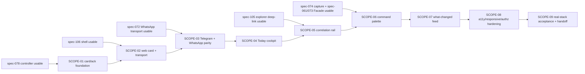

# Proactive & Correlated Experience - Scope Index

## Execution Outline

### Phase Order

1. **SCOPE-01 - Single-controller card projection & nudge-ack foundation (`foundation:true`)**: the one composition contract every surface consumes — `ProactiveCardModel` (a card exists only for a `permit`/`escalated` verdict), the ephemeral process-local `NudgeRef` registry (opaque `ref → {content_key, producer, channel, principal, issued_at}`, the sole anti-leak boundary), the single `NudgeAck` path (`Acknowledge(content_key)` for act/snooze/dismiss on every channel), `HonestStatePresenter`, `BudgetMeterRead`, and the `a:n:<ref>:<a|s|d>` encode/decode shared by Telegram callbacks and WhatsApp reply-ids. Reserves the `nudge_ref_ttl_hours` SST value and the MVP snooze decision.
2. **SCOPE-02 - Web proactive card & authenticated action transport**: render one `ProactiveCardModel` as a spec-106 Pending-action-row (title + provenance line + availability badge + act/snooze/dismiss + Why), and route the web action as an authenticated same-origin `{nudgeRef, action}` mutation (HttpOnly cookie, strict CORS/CSP/Origin) through the foundation `NudgeAck` path.
3. **SCOPE-03 - Telegram & WhatsApp nudge renderings + cross-channel parity**: the Telegram inline `a:n:` family (new `callbackKindNudge`, never colliding with `a:c:`/`a:d:`/spec-028) and the WhatsApp interactive reply-id (spec-072 transport; 3 reply buttons + list/text fallback), both resolving through the shared `NudgeRef` registry to the one ack path so acting once suppresses everywhere within `suppression_window_hours`.
4. **SCOPE-04 - Today cockpit composition (spec-106 `Today` body)**: compose, observe-first, the current digest lede, the `FOR YOU NOW` permitted-card region, the what-changed strip, and the secondary ask-or-capture bar, with the budget meter in the header and honest quiet/partial/degraded regions rendered through `HonestStatePresenter` — never a fabricated card. Reserves the landing-budget NFR.
5. **SCOPE-05 - Correlation rail (bounded spec-105 neighborhood + deep-link)**: an always-on spec-106 Inspector populated by `CorrelationRailRead`, a `RAIL_MAX`-bounded `GraphQueryService.Neighborhood(seed, depth=1)` call of the same spec-105 contract under the same authorizer, deep-linking `See full graph` into the explorer on the current `<kind>:<id>` seed. Reserves the `RAIL_MAX` SST value.
6. **SCOPE-06 - Ask-or-capture command palette (P4)**: one Cmd/Ctrl-K global overlay routed by `PaletteTurnRouter` through the existing assistant `Facade.Handle` to answered / captured-as-idea (spec-074 unchanged) / honest-refusal / error, honoring the `OutcomeOK`-only capture gate — a failed ask is never "saved as an idea".
7. **SCOPE-07 - What-changed feed (P6)**: a spec-106 `Activity` view populated by `WhatChangedRead`, a bounded, cursor-paged, authorized projection of `agent_traces` + surfacing verdicts + topic lifecycle (left) and a recency read (right); restart-safe with no unread watermark and no second store. Reserves the `what_changed_page_cap` SST value.
8. **SCOPE-08 - Cross-surface accessibility, responsive & authorization hardening**: keyboard/screen-reader parity, 320px/200%-zoom/44×44/no-overlap mobile behavior, and per-surface re-authorization + content-free telemetry across the cockpit, card, rail, palette, and feed.
9. **SCOPE-09 - Real-stack acceptance & implementation handoff**: the complete no-interception Playwright web matrix, Telegram/WhatsApp adapter-level parity coverage, the honest-state matrix (budget-exhausted, deduped, suppressed, no-related, unavailable), and the acceptance rerun of SCN-107-001..020, with a value-safe planning handoff that makes no implementation or deployment claim.

### New Types And Signatures

- `ProactiveCardModel` — immutable per-card projection of one `permit`/`escalated` verdict (title, `Producer`-derived provenance line, honest-state token, opaque `NudgeRef`, three-action set); exists for no other verdict.
- `NudgeRef` registry — `Mint(content_key, producer, channel, principal) -> ref` and `Resolve(ref) -> {content_key, principal, action}`; ephemeral, process-local, TTL ≥ `max(suppression_window_hours, dedupe_window_hours)`.
- `NudgeAck.Handle(ref, action) -> render{acted|snoozed|suppressed|already-handled|expired}` → one `Acknowledge(content_key)` on the process-wide `AckLookup`.
- `encodeNudgeCallback(ref, action) -> "a:n:<ref>:<a|s|d>"` / `decodeNudge(payload) -> callbackKindNudge` (Telegram); the same logical shape as the WhatsApp `reply.id`.
- `CorrelationRailRead(principal, seed=<kind>:<id>) -> {rows[]GraphNodeV1+reason, seedKey, outcome: correlated|no-related-items|unavailable|unauthorized}`.
- `WhatChangedRead(principal, range, cursor) -> {systemDid[], recentlyTouched[], outcome: populated|quiet|partial|unavailable|unauthorized, nextCursor}`.
- `PaletteTurnRouter(input) -> {answer | captured-as-idea | refused | error}` over the existing assistant `Facade.Handle`.
- `HonestStatePresenter(condition) -> spec-106 data-view-state/data-operation-state token`; `BudgetMeterRead() -> "N of M used today"`.
- SST keys reserved for implementation (no defaults): `RAIL_MAX`, `what_changed_page_cap`, `nudge_ref_ttl_hours` (and, only if a distinct snooze duration ships, `snooze_window_hours`).
- No migration is reserved: the `NudgeRef` registry is in-memory; no new PostgreSQL business table is added (migration numbers are allocated at pickup only if implementation proves one is needed).

### Validation Checkpoints

- **After SCOPE-01:** the verdict→card projection, the `NudgeRef` anti-leak boundary (no `content_key` on any wire), the single `Acknowledge(content_key)` ack path, budget-exhausted/escalated honest-state mapping, and the controller hot-path NFR must pass at unit + integration before any surface renders.
- **After SCOPE-02:** the authenticated same-origin web action (no bearer in JS, no new bypass, no second budget) and the web card provenance/one-tap contract must pass on the real disposable stack before the messaging renderings.
- **After SCOPE-03:** act-once-suppressed-everywhere, identical budget-defer, identical urgent-escalation, and `a:n:` non-collision with `a:c:`/`a:d:`/spec-028 must pass at adapter level and via the web cross-channel assertion before cockpit composition.
- **After every surface scope (04-07):** scenario-specific real-stack Playwright runs must use no interception and must retain direct user-visible assertions; each surface must render its honest quiet/partial/degraded/unavailable states, never a fabricated card or decorative correlation.
- **After SCOPE-08:** keyboard, screen-reader, 320px/200%-zoom, 44×44 no-overlap, WCAG 2.2 AA contrast, per-surface re-authorization, and content-free telemetry must pass across every surface before acceptance.
- **At SCOPE-09:** the complete API/UI/messaging/accessibility/mobile/authorization/honest-state matrix and the SCN-107-001..020 acceptance rerun must pass without making any implementation, migration, browser-executed, or deployment claim in this planning packet.

## Dependency Provenance

- Compose-over dependencies (do not modify): `specs/106-coherent-product-experience` (shell/IA/theme/tokens/`data-*` contract/`AuthenticatedRequestAdapter`/`MutationFeedbackPresenter`/`Today` destination) and `specs/105-connected-knowledge-graph-explorer` (deep-link target + `GraphQueryService.Neighborhood` + `<kind>:<id>` seed).
- Consume-only dependencies: `specs/078-cross-surface-surfacing-prioritizer` + `internal/intelligence/surfacing/` (the one controller, verdict, budget, dedupe, suppression, `content_key`-keyed `Acknowledge`, `Channel`/`Producer` enums, `smackerel_surfacing_*` metrics), `specs/072-whatsapp-business-transport` (interactive send/receive), `specs/074-capture-as-fallback-policy` (capture path unchanged), `specs/061-conversational-assistant` + `specs/073-web-mobile-assistant-frontend` (`Facade.Handle` turn), `specs/054-notification-intelligence-handler` + `specs/055-notification-source-ntfy-adapter` (notification candidates).
- Every dependency spec is an **entry gate**, not delegated work: a missing owner contract blocks only the dependent 107 surface; it never authorizes a composition-side approximation, a fabricated card/correlation/activity row, a second store, or an edit to the owner.
- `whatsapp` as a new bounded `Channel` enum value is reserved by design as a coordination note to the spec-078 enum owner; `internal/intelligence/surfacing/types.go` is NOT edited by this feature.

## Dependency Graph

Execution is strictly sequential and scope-gated: no scope may start until every predecessor is Done. The external entry gates (D078/D106/D072/D105/D074) must be usable before their dependent scope is picked up; they are not remediated here.

## Scope Inventory

| # | Scope | Depends On | External Gate | Surfaces | Primary Scenarios | Status |
|---|---|---|---|---|---|---|
| 01 | [Single-controller card projection & nudge-ack foundation](01-single-controller-card-projection-foundation/scope.md) `foundation:true` | — | spec-078 controller | surfacing verdict, NudgeRef registry, ack path, honest-state, budget meter | SCN-107-004, 008, 009 | Not Started |
| 02 | [Web proactive card & authenticated action transport](02-web-proactive-card-action-transport/scope.md) | SCOPE-01 | spec-106 shell | web card, same-origin mutation | SCN-107-003 | Not Started |
| 03 | [Telegram & WhatsApp nudge renderings + cross-channel parity](03-telegram-whatsapp-nudge-parity/scope.md) | SCOPE-02 | spec-072 transport | Telegram `a:n:`, WhatsApp interactive, parity | SCN-107-005, 006, 007 | Not Started |
| 04 | [Today cockpit composition](04-today-cockpit-composition/scope.md) | SCOPE-03 | spec-106 `Today` | cockpit body, budget header, what-changed strip | SCN-107-001, 002, 017 | Not Started |
| 05 | [Correlation rail (bounded spec-105 neighborhood + deep-link)](05-correlation-rail/scope.md) | SCOPE-04 | spec-105 explorer | rail Inspector, deep-link | SCN-107-010, 011 | Not Started |
| 06 | [Ask-or-capture command palette](06-ask-or-capture-command-palette/scope.md) | SCOPE-05 | spec-074/061/073 | Cmd/Ctrl-K overlay | SCN-107-012, 013 | Not Started |
| 07 | [What-changed feed](07-what-changed-feed/scope.md) | SCOPE-06 | spec-054 traces | two-column Activity view | SCN-107-014, 015 | Not Started |
| 08 | [Cross-surface accessibility, responsive & authorization hardening](08-cross-surface-accessibility-responsive-authorization/scope.md) | SCOPE-07 | — | all proactive surfaces | SCN-107-018, 019, 020 | Not Started |
| 09 | [Real-stack acceptance & implementation handoff](09-real-stack-acceptance-handoff/scope.md) | SCOPE-08 | — | full stack, Playwright, messaging adapters | SCN-107-016; acceptance rerun SCN-107-001..020 | Not Started |

## SST No-Default Decisions (Reserved For Implementation)

These are the explicit no-default values `bubbles.design` routed to `bubbles.plan`.
They become SST keys under `config/smackerel.yaml` at implementation (NOT edited
in this planning phase). Each is fail-loud per the repo NO-DEFAULTS policy — no
`${VAR:-default}`, no `os.getenv(k, default)`, no `unwrap_or`; config-compile
validates presence, type, and bounds and aborts the build if a value is absent.

| SST key | Decision (MVP) | Bound / validation intent | Owning scope | Design cross-ref |
|---|---|---|---|---|
| `nudge_ref_ttl_hours` | `6` | integer ≥ `max(suppression_window_hours=4, dedupe_window_hours=6)` so a late tap on any channel resolves to an honest `expired`/`already-handled` render rather than a silent miss; validated ≥ both windows at config-compile | SCOPE-01 | design.md `## Resolved Design Contracts` OQ2 (`NudgeRef` registry), `## Data Model And Persistence` |
| snooze window | reuse `suppression_window_hours` (MVP ships **no** distinct `snooze_window_hours`) | act/snooze/dismiss all call `Acknowledge(content_key)`; snooze differs by intent/label/window only. A distinct `snooze_window_hours` is a bounded additive future SST key resolved through the same mechanism (no new store); its addition is deferred, not implemented | SCOPE-01, SCOPE-03 | design.md OQ6 (snooze semantics) |
| `RAIL_MAX` | `6` | integer 1..N neighborhood bound for `GraphQueryService.Neighborhood(seed, depth=1, limit=RAIL_MAX)`; the rail never renders the full edge store (NFR-107-003); tighter than the explorer workspace bound | SCOPE-05 | design.md OQ5 (`CorrelationRailRead`), NFR-107-003 |
| `what_changed_page_cap` | `25` (per column, per page) | integer 1..N capped page size over `created_at DESC` with an opaque principal-bound cursor (spec-105 HMAC-cursor pattern); no unbounded scan | SCOPE-07 | design.md OQ4 (`WhatChangedRead`) |

## Scenario And Test Contract

Each of the 20 specification scenarios has one concrete `unit`, `integration`,
`e2e-api`, and `e2e-ui` row in its owning scope and in `test-plan.json`. That
produces **80 scenario rows and exactly 80 matching unchecked DoD test-evidence
items** before supplemental canary, stress, anti-leak, non-collision, restart,
contrast, telemetry, and acceptance-matrix rows are counted. All tests are
PLANNED / not-yet-authored (0 linked) in `scenario-manifest.json`, matching the
spec-105 planning-only convention.

| Scenario | Owning Scope | Unit | Integration | E2E API | E2E UI |
|---|---|---|---|---|---|
| SCN-107-001 | SCOPE-04 | T107-001-U | T107-001-I | T107-001-A | T107-001-W |
| SCN-107-002 | SCOPE-04 | T107-002-U | T107-002-I | T107-002-A | T107-002-W |
| SCN-107-003 | SCOPE-02 | T107-003-U | T107-003-I | T107-003-A | T107-003-W |
| SCN-107-004 | SCOPE-01 | T107-004-U | T107-004-I | T107-004-A | T107-004-W |
| SCN-107-005 | SCOPE-03 | T107-005-U | T107-005-I | T107-005-A | T107-005-W |
| SCN-107-006 | SCOPE-03 | T107-006-U | T107-006-I | T107-006-A | T107-006-W |
| SCN-107-007 | SCOPE-03 | T107-007-U | T107-007-I | T107-007-A | T107-007-W |
| SCN-107-008 | SCOPE-01 | T107-008-U | T107-008-I | T107-008-A | T107-008-W |
| SCN-107-009 | SCOPE-01 | T107-009-U | T107-009-I | T107-009-A | T107-009-W |
| SCN-107-010 | SCOPE-05 | T107-010-U | T107-010-I | T107-010-A | T107-010-W |
| SCN-107-011 | SCOPE-05 | T107-011-U | T107-011-I | T107-011-A | T107-011-W |
| SCN-107-012 | SCOPE-06 | T107-012-U | T107-012-I | T107-012-A | T107-012-W |
| SCN-107-013 | SCOPE-06 | T107-013-U | T107-013-I | T107-013-A | T107-013-W |
| SCN-107-014 | SCOPE-07 | T107-014-U | T107-014-I | T107-014-A | T107-014-W |
| SCN-107-015 | SCOPE-07 | T107-015-U | T107-015-I | T107-015-A | T107-015-W |
| SCN-107-016 | SCOPE-09 | T107-016-U | T107-016-I | T107-016-A | T107-016-W |
| SCN-107-017 | SCOPE-04 | T107-017-U | T107-017-I | T107-017-A | T107-017-W |
| SCN-107-018 | SCOPE-08 | T107-018-U | T107-018-I | T107-018-A | T107-018-W |
| SCN-107-019 | SCOPE-08 | T107-019-U | T107-019-I | T107-019-A | T107-019-W |
| SCN-107-020 | SCOPE-08 | T107-020-U | T107-020-I | T107-020-A | T107-020-W |

## Global Live-Test Rules

- `integration`, `e2e-api`, and `e2e-ui` use the real disposable Compose stack, seeded PostgreSQL, real authentication, the real single surfacing controller, and real product routes — never a mocked internal service, repository, or controller.
- Playwright must not call `page.route`, `context.route`, `route.fulfill`, MSW, Nock, or any response interception; a mocked spec is `ui-unit`, not a live category, and cannot satisfy a live DoD item.
- Every proactive-card assertion combines the controller verdict, the real producer-derived provenance line, and the honest-state token; element existence alone cannot pass.
- Cross-channel parity is proven by a real act on one transport (Telegram/WhatsApp adapter or web) followed by a real re-render on the others reflecting `content_key` suppression within `suppression_window_hours`; no channel is stubbed.
- Honest-state coverage (quiet, budget-exhausted, deduped, suppressed, no-related-items, degraded, unavailable, unauthorized) proves each state renders distinctly and never as a normal card or a decorative correlation.
- Every mutation test uses disposable, ephemeral state (no cleanup-based isolation) and verifies the acknowledgement round-trip; the `NudgeRef` registry is process-local and dropped on restart.
- Validate-plane telemetry uses `env=test*`; operate-plane telemetry and personal corpus content remain read-only and content-free; no `content_key`, node label, or query text is a wire payload, a `data-*` hook, or a telemetry label.

## Impact And Observability Planning

- `.github/bubbles-project.yaml` defines no `testImpact` map applicable to this feature, so no G079 path-derived reduction is claimed; the full applicable matrix is planned.
- This feature adds NO parallel surfacing metric surface: the budget meter and the feed's "decided" entries read the existing `smackerel_surfacing_*` families (`internal/metrics/surfacing.go`, incl. `smackerel_surfacing_budget_remaining`). New composition endpoints emit only bounded, content-free labels (surface, channel, verdict, outcome, timing, counts).
- If implementation adds a project-owned proactive observability workflow/SLO contract, that config change belongs to the implementation/observability owner, not this planning packet; no row here is tagged with an `observabilityWorkflow` it has not earned.

## Shared Infrastructure Impact Sweep

- **Protected contracts (consume, never re-own):** the single spec-078 `controller.Propose`/verdict/budget/dedupe/suppression/`Acknowledge`; the spec-106 shell/session/`AuthenticatedRequestAdapter`/`MutationFeedbackPresenter`/`data-*` DOM contract/`Today` route; the spec-105 `GraphQueryService.Neighborhood`/`GraphReaderAuthorizer`/`<kind>:<id>` seed deep-link; the spec-072 WhatsApp transport + webhook verification; the spec-074 capture path + spec-061/073 `Facade` turn; the Telegram `a:` callback namespace (`a:c:`/`a:d:`/spec-028); `agent_traces`, topic lifecycle, and canonical item stores.
- **Independent canaries:** the existing surfacing budget/dedupe/suppression behavior stays green; the existing Telegram `a:c:`/`a:d:` and spec-028 list callbacks still decode; the existing assistant capture (`saved as an idea` band-low only) still works; existing item/detail views and the spec-105 explorer deep-link still open; the authenticated web shell/session and non-proactive navigation stay green.
- **Rollback:** every 107 surface is additive and composes over an owner contract; disabling a proactive surface is an explicit, honest state (never a fabricated card); the `NudgeRef` registry is in-memory (a restart drops it, resolving stale refs to `expired`); no owner store, budget, or enum is mutated, so rollback is a source/config pointer swap that leaves the controller, shell, explorer, transports, `agent_traces`, and topic lifecycle untouched.

## Planning Uncertainty Declaration

All scope DoD items remain unchecked because implementation, authored tests,
migration, browser verification, and deployment acceptance were not executed by
the planning owner. Every scope is `runtime-behavior` and starts `Not Started`.
Every card originates from the single spec-078 controller; the rail is a
tighter-bounded call of the spec-105 neighborhood; the palette is a consumer of
the spec-074/061 capture/turn; no second store, no second budget, no client
cache, and no owner edit is introduced. The `whatsapp` `Channel` enum value is
reserved as a coordination note to the spec-078 owner and is not edited here. No
local approximation of a missing dependency is permitted — the dependency specs
are entry gates, not delegated work.
