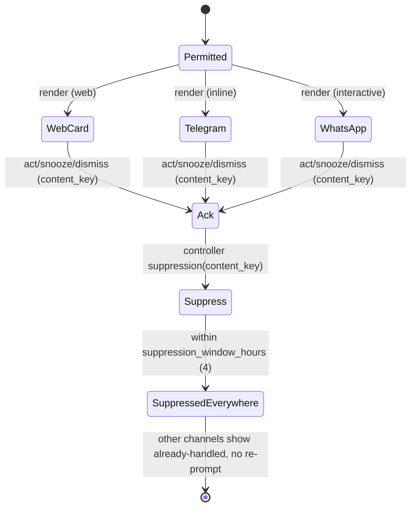
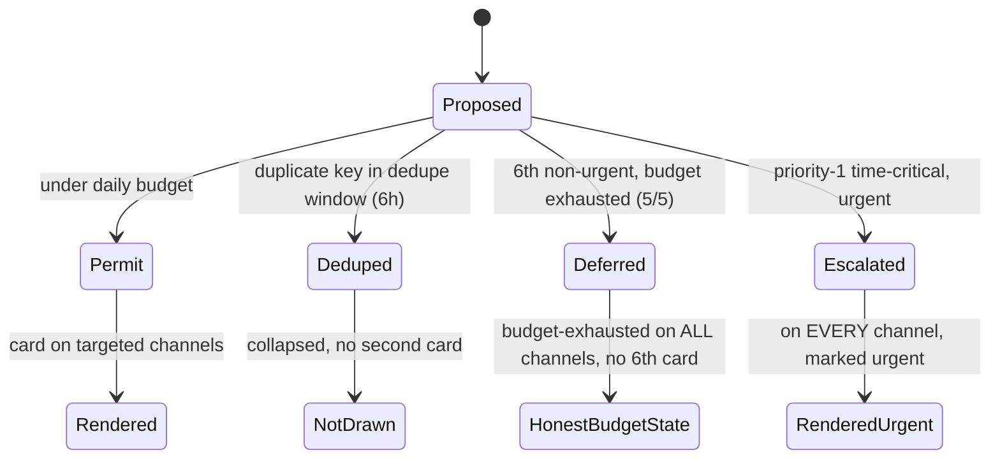
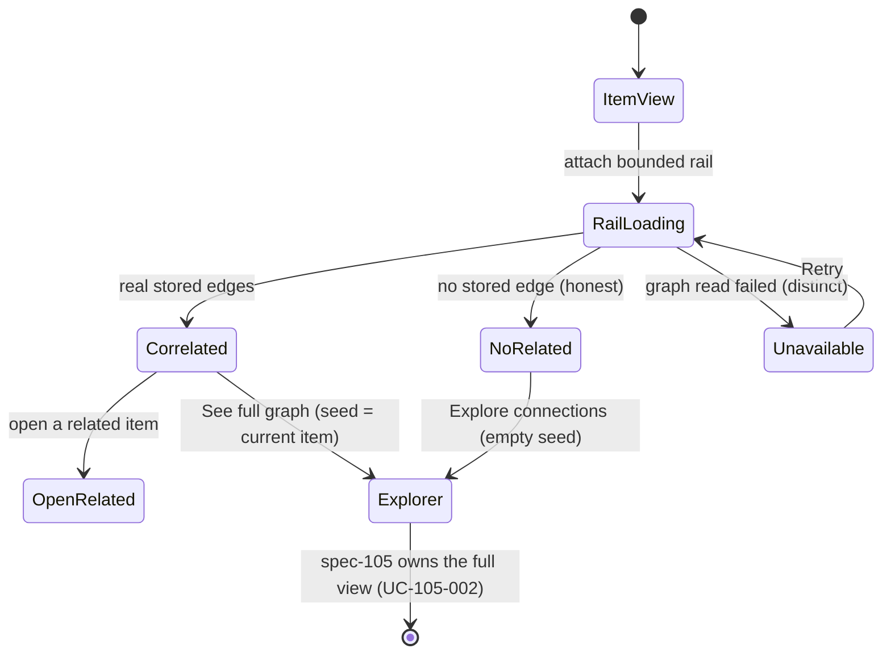
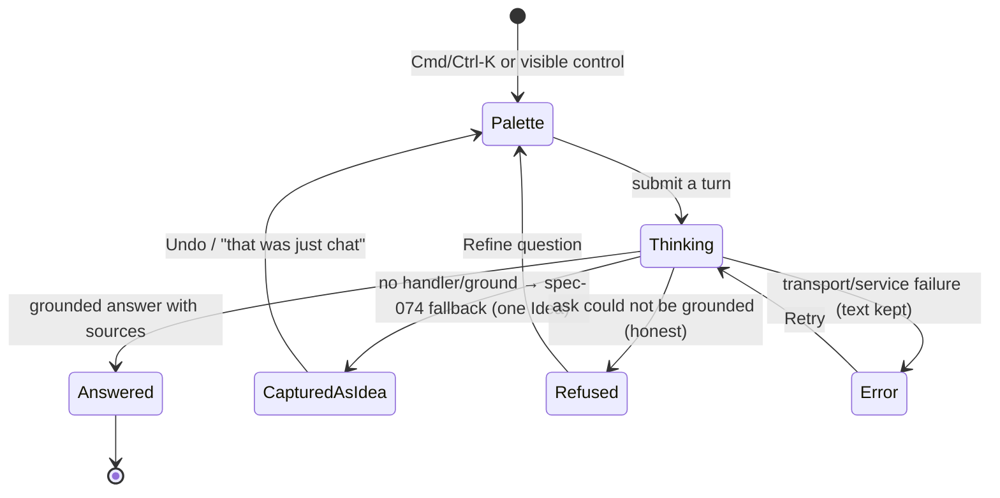
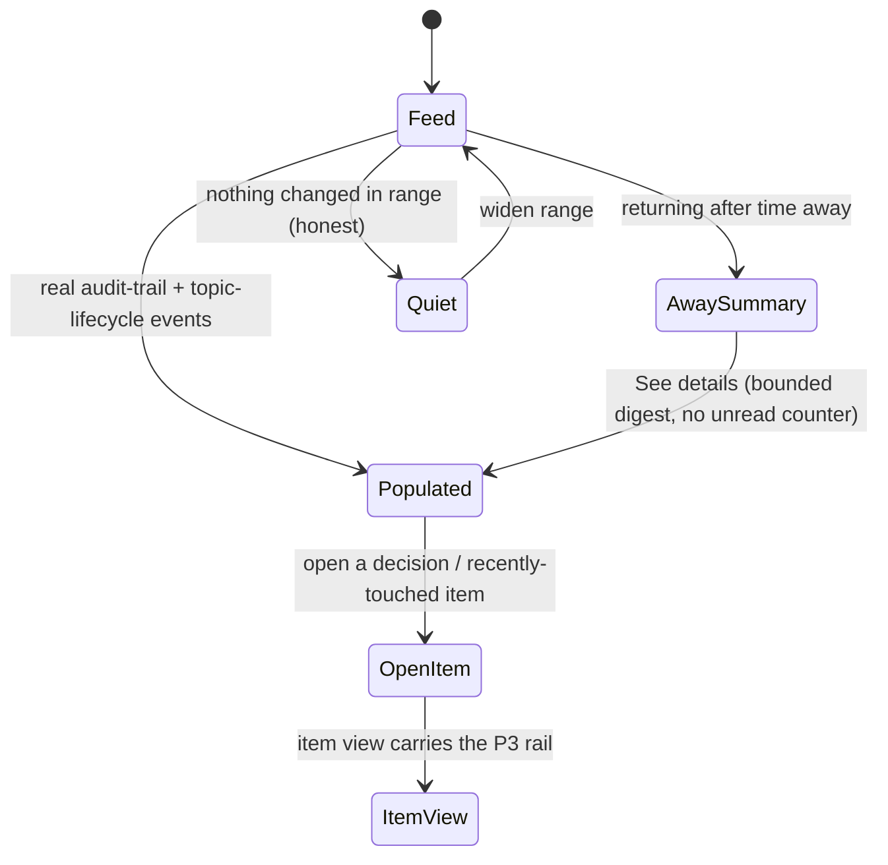
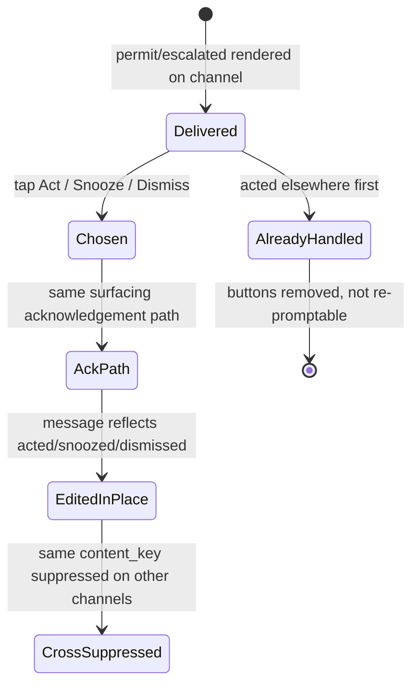

# Feature: 107 Proactive & Correlated Experience

**Status:** Not Started — requirements (bubbles.analyst) and UX/interaction
design (bubbles.ux) artifacts are authored; design and planning phases are
pending; implementation, product testing, certification, and deployment have not
run.
**Workflow Mode:** full-delivery
**Release Train:** mvp
**Depends On:**
- `specs/078-cross-surface-surfacing-prioritizer` and the in-tree controller `internal/intelligence/surfacing/` as the single cross-channel budget/dedupe/suppression decision point (P2, P5)
- `specs/054-notification-intelligence-handler` and `specs/055-notification-source-ntfy-adapter` for source-neutral notification events that become proactive candidates
- `specs/074-capture-as-fallback-policy` for the observe-first capture path behind the command palette (P4)
- `specs/061-conversational-assistant` and `specs/073-web-mobile-assistant-frontend` for the `Facade`/`TransportAdapter` contract and the existing web + mobile assistant surfaces (P4, P5)
- `specs/072-whatsapp-business-transport` for the WhatsApp interactive-message transport required by cross-frontend parity (P5) — analyst-identified addition; see `## Dependencies`
- `specs/105-connected-knowledge-graph-explorer` as the deep-link target for the correlation rail (P3) — dependency only, not modified here
- `specs/106-coherent-product-experience` as the shared shell/information-architecture/theme/state-vocabulary this feature composes over (P1, P4, P6) — dependency only, not modified here

## Problem Statement

Smackerel already has a substantial proactive backbone, but the product does not
yet *lead* with it. The intelligence the system produces on its own — the Daily
Smackerel digest, contextual alerts, pre-meeting briefs, weekly synthesis,
resurfacing, and the connections in a 622,000-edge knowledge graph — is real,
budget-governed, and deduped across channels by the in-tree surfacing
controller. Yet the user-facing surfaces present these outputs as scattered,
passive destinations rather than as one coherent, decision-first experience that
says "here is what I already found and connected for you."

The backbone is visible in the source:

- `internal/intelligence/surfacing/controller.go` is the single decision point
  between seven-plus intelligence **producers** and the user-visible
  **channels**. It enforces a per-day nudge **budget**
  (`internal/intelligence/surfacing/budget.go`), cross-channel content-key
  **dedupe** (`dedupe.go`), and post-acknowledgement **suppression**
  (`suppression.go`), and emits the `smackerel_surfacing_*` metric families
  (`internal/metrics/surfacing.go`). Its tunables live in one SST block
  (`config/smackerel.yaml` lines 457–482: `daily_nudge_budget: 5`,
  `suppression_window_hours: 4`, `dedupe_window_hours: 6`,
  `urgent_escalation_enabled: true`).
- The `Channel`/`Producer`/`DecisionKind` contract in
  `internal/intelligence/surfacing/types.go` already models `telegram`,
  `web_push`, `ntfy`, `email_out`, and `digest` channels and the five terminal
  verdicts `permit`, `deduped`, `suppressed`, `deferred-budget-exhausted`, and
  `escalated`.
- `docs/smackerel.md` §12 (Surfacing & Proactive Intelligence) specifies the
  Daily Smackerel, weekly synthesis, contextual alerts, pre-meeting briefs, and
  the "maximum 3 system-initiated prompts per week" rule.

What is missing is the *experience layer*. Today:

- There is no single decision-first landing surface that fuses the digest, the
  day's permitted surfacing candidates, recent activity, and one input that
  either asks or captures. The proactive outputs are delivered per channel, not
  composed into one cockpit.
- Surfacing candidates that reach a channel are not rendered as first-class,
  one-tap-actionable cards with a "why am I seeing this" provenance line and
  honest budget/dedupe/suppression state.
- The knowledge graph's connectedness is reachable only inside the (in-planning)
  graph explorer (spec 105). No always-on correlation rail brings "related /
  heads-up" context to an ordinary knowledge item.
- There is no global ask-or-capture command surface; capture-as-fallback
  (spec 074) exists as a policy but has no single, everywhere-available input.
- The same correlated insight and proactive action are not rendered
  channel-appropriately across every frontend, so budget/dedupe/suppression can
  only be trusted per channel rather than *across* channels in the user's lived
  experience.
- The system's decisions ("what I ingested, connected, and decided") are logged
  (`docs/smackerel.md` §17.1 "Visible decisions") but never surfaced as a
  human-readable "what changed" feed.

This is not cosmetic. Smackerel's core differentiator versus capture-first tools
— the observe-first stance in `docs/Product-Principles.md` Principle 1, where the
system exhausts its own inference before asking the user anything — is only
felt if the product *leads* with what it already produced. Presenting a blank
canvas or a passive list forfeits that differentiator. This feature elevates the
existing proactive backbone into a first-class, correlated, honest experience,
delivered simply and consistently across every frontend (web PWA, Telegram, and
WhatsApp), without re-owning the backbone, the shell (spec 106), or the graph
explorer (spec 105).

## Current Capability Map

| Capability | Grounded Evidence | Current Status | Gap Owned Here |
|---|---|---|---|
| Cross-channel surfacing decision point | `internal/intelligence/surfacing/controller.go`, `budget.go`, `dedupe.go`, `suppression.go`; spec 078 | Implemented and wired; enforces budget/dedupe/suppression/escalation | The experience never renders decisions as first-class actionable cards with provenance and honest state |
| Surfacing contract and metrics | `internal/intelligence/surfacing/types.go`; `internal/metrics/surfacing.go`; `config/smackerel.yaml` L457–482 | `Channel`/`Producer`/`DecisionKind` enums + 8 `smackerel_surfacing_*` families | No `whatsapp` channel value yet; no UI reads the decision + budget state for the user |
| Intelligence producers | Digest, alerts, resurfacing, weekly synthesis, monthly report, pre-meeting briefs, frequent lookups, notification (spec 054); `docs/smackerel.md` §12 | Producers emit candidates through `controller.Propose(...)` | Their outputs are delivered per channel, not fused into one Today cockpit or a "what changed" feed |
| Notification intelligence | `specs/054-notification-intelligence-handler`, `specs/055-notification-source-ntfy-adapter`; `ProducerNotification` in `types.go` | Source-neutral events route through the shared controller as a subordinate producer | Notification decisions are not elevated into actionable nudge cards with provenance |
| Capture-as-fallback | `specs/074-capture-as-fallback-policy`; provenance `capture-as-fallback`; "saved-as-idea" ack | Policy defined; explicit + fallback capture provenance-distinct | No single global ask-or-capture input everywhere; capture is not one keystroke away |
| Assistant transports | `specs/061-conversational-assistant`, `specs/073-web-mobile-assistant-frontend`; `internal/telegram/assistant_adapter/` (`adapter.go`, `callbacks.go`) | `Facade`/`TransportAdapter` proven across web, mobile, Telegram; inline-button callback pattern exists (`a:` namespace, confirm/disambig only) | No act/snooze/dismiss nudge callback family; WhatsApp interactive nudge rendering not yet defined |
| Knowledge graph + edges | `specs/105-connected-knowledge-graph-explorer`; 2026-07-23 live review: 28k artifacts, 312 topics, 622k edges | Edge store exists; explorer in planning | No always-on lightweight correlation rail on ordinary knowledge items that deep-links into the explorer |
| Shared product shell | `specs/106-coherent-product-experience`; `internal/web/appshell.go`, `web/pwa/lib/appnav.js` | Shell/IA/theme/state-vocabulary in planning | This feature composes an additive proactive interaction layer over the shell; it does not re-own it |
| Visible decisions | `docs/smackerel.md` §17.1; agent traces (`internal/db/migrations/020_agent_traces.sql` per spec 054); topic lifecycle (Principle 3) | Decisions logged; topic lifecycle tracked | No human-readable "what changed" activity feed |

## Outcome Contract

**Intent:** Every frontend leads with what Smackerel already found, connected,
and decided. A user opens the product (or receives a message) and first sees a
small set of real, budget-governed proactive cards and the day's digest, each
with a plain-language "why am I seeing this" line and one-tap act/snooze/dismiss;
sees an always-on "related / heads-up" rail of real correlations on any knowledge
item that deep-links into the graph explorer; can ask-or-capture from one input
anywhere; and can see a two-column "what changed" feed of what the system did and
what was recently touched. The same correlated insight and proactive action
appear channel-appropriately on web, Telegram, and WhatsApp, and the identical
budget, dedupe, and suppression truth holds across all of them because every card
originates from the one surfacing controller.

**Success Signal:** On the web PWA, an authenticated user lands on a Today
cockpit that fuses the current Daily Smackerel digest, the day's permitted
surfacing cards, a "what changed" activity summary, and an ask-or-capture bar.
Each card shows its producer-derived provenance line and offers act, snooze, and
dismiss; acting on a card acknowledges its `content_key` through the surfacing
controller so the same item is suppressed on Telegram and WhatsApp within the
suppression window. Opening any topic, person, place, capture, or artifact shows
a correlation rail of real stored edges that deep-links into the spec-105
explorer for the full view. Pressing Cmd/Ctrl-K anywhere opens one input that
either returns a grounded answer or captures the thought as an Idea with the
`capture-as-fallback` provenance and a "saved-as-idea" acknowledgement. The same
nudge that renders as a web card renders as Telegram inline buttons and as a
WhatsApp interactive message, and a sixth non-urgent nudge in a day is deferred
identically across all three channels while a priority-1 time-critical item
escalates identically across all three. Every proactive surface distinguishes a
real quiet day, budget exhaustion, suppression, a no-correlation item, and a
producer failure from one another, and never renders any of them as a normal
card.

**Hard Constraints:**
- Every proactive card and every surfaced nudge SHALL originate from a
  `permit` or `escalated` verdict returned by the spec-078 surfacing controller
  (`internal/intelligence/surfacing/controller.go`). No experience surface may
  introduce a parallel surfacing path, a second budget, or a nudge that bypasses
  `controller.Propose(...)`.
- Cross-channel budget, dedupe, and suppression SHALL be the controller's,
  unmodified. Acting on, snoozing, or dismissing a card on any channel SHALL
  flow back to the controller's suppression/acknowledgement path keyed by
  `content_key`, so the truth holds across web, Telegram, and WhatsApp.
- Every visible correlation SHALL be a real stored edge or relationship from the
  existing knowledge/edge store read under authorization. Decorative,
  fabricated, inferred-without-provenance, or randomly connected correlations are
  forbidden. Every proactive card SHALL carry a provenance line derived from its
  real producer and cause.
- The experience is observe-first, not capture-first. Primary surfaces SHALL
  lead with what the system already produced and SHALL NOT present a blank canvas
  as the default state. This is Smackerel's differentiator versus capture-first
  tools and SHALL remain explicit.
- Honesty is non-negotiable. A quiet day, an exhausted budget, a suppressed
  item, a no-correlation item, a degraded producer, and a failed read are
  distinct, truthful states. None may be rendered as a normal nudge, and the
  budget/dedupe/suppression state SHALL be visible to the user, not hidden.
- The "maximum 3 system-initiated prompts per week" and "invisible by default"
  contracts (`docs/smackerel.md` §12.4; `docs/Product-Principles.md`
  Principle 6) SHALL be honored; the experience surfaces what the controller
  already permitted and never inflates volume to fill a cockpit.
- This feature SHALL NOT mutate `specs/105-*` or `specs/106-*`. It composes over
  the spec-106 shell/IA/theme/state-vocabulary as an additive interaction layer
  and deep-links into the spec-105 explorer; it does not re-own either. Any
  needed change to 105 or 106 is emitted as a coordination note, not a file edit.
- The command palette's capture path SHALL be the spec-074 capture-as-fallback
  policy unchanged (same provenance label, dedup contract, and "saved-as-idea"
  acknowledgement); it SHALL NOT fork a new capture path.
- All authorization, grant, and privacy boundaries of the underlying corpus
  SHALL hold. Provenance lines, correlations, and activity events SHALL never
  expose content the identity may not read, and nudge/correlation telemetry SHALL
  carry no secret values, node labels, or personal content.
- Planning-only for this workflow: no source, no authored tests executed, no
  migrations, no browser runs, no deployment, and no commit or push are claimed.

**Failure Condition:** The feature fails even if every frontend looks polished
when a card is shown that never passed the surfacing controller, a correlation
is drawn that has no stored edge, acting on Telegram fails to suppress the same
item on web or WhatsApp, a sixth nudge appears on one channel after being
deferred on another, the cockpit fabricates a card to avoid looking empty, a
producer failure or a quiet day is rendered as a normal nudge, the palette forks
a capture path other than spec 074, the correlation rail re-implements the graph
explorer instead of deep-linking into spec 105, provenance leaks unauthorized
content, or keyboard, screen-reader, or mobile users cannot act on the proactive
surface.

## Goals

1. Make the default landing a decision-first Today cockpit that fuses the digest,
   the day's permitted surfacing cards, a "what changed" summary, and one
   ask-or-capture input.
2. Turn every surfacing-producer output into a first-class actionable card with
   one-tap act/snooze/dismiss, a real provenance line, and honest budget/dedupe/
   suppression state.
3. Bring real correlations to any knowledge item through an always-on "related /
   heads-up" rail that deep-links into the graph explorer.
4. Provide one global ask-or-capture command surface (Cmd/Ctrl-K) that leans on
   the observe-first capture-as-fallback policy.
5. Render the same correlated insight and proactive action channel-appropriately
   across web, Telegram, and WhatsApp, with budget/dedupe/suppression holding
   across all channels through the single controller.
6. Surface the system's decisions as a two-column "what changed" activity feed
   that delivers visible decisions and trust through transparency.
7. Keep every proactive surface honest: quiet, exhausted, suppressed,
   no-correlation, degraded, and failed states remain distinct and never
   masquerade as a normal card.
8. Provide equivalent keyboard, screen-reader, and mobile journeys for the entire
   proactive surface.

## Non-Goals

- Re-owning, replacing, or editing the spec-106 shell, information architecture,
  theme, or shared visible-state vocabulary. This feature composes an additive
  proactive interaction layer over it.
- Re-owning, replacing, or editing the spec-105 graph explorer, its query bounds,
  layout, or store. The correlation rail is a lightweight projection that
  deep-links into the explorer for the full view.
- Modifying the spec-078 surfacing controller's budget, dedupe, suppression, or
  escalation logic, or introducing a second surfacing path, a second budget, or a
  new producer. This feature is a consumer and presenter of the existing
  controller decisions. Additive channel-enum extension (e.g., a `whatsapp`
  channel value) is a design/plan question, not a re-own.
- Forking a new capture path. The palette uses the spec-074 capture-as-fallback
  policy unchanged.
- Building new intelligence producers, new synthesis, new digest content, or new
  graph algorithms. The experience surfaces what already exists.
- Choosing a frontend framework, component library, rendering engine, callback
  encoding, transport payload shape, or storage/read contract in this
  requirements artifact. Those are `bubbles.ux` and `bubbles.design` decisions.
- Introducing any QF financial-action behavior; the `docs/Product-Principles.md`
  Principle 10 QF Companion Boundary is unchanged.
- Inflating nudge volume or adding notifications to fill a cockpit. Invisible by
  default and the ≤3 system-initiated prompts/week contract remain binding.

## Actors & Personas

| Actor | Description | Key Goals | Permission Boundary |
|---|---|---|---|
| Daily User | Uses Smackerel across web and messaging to see what matters and act on it | Land on what the system already found; act in one tap; ask or capture instantly | Explicit grants over the operator-owned global corpus; sees only permitted projections |
| Returning User | Comes back after time away | See what changed while away without backlog guilt or an unread counter | Same personal scope; design-for-restart applies |
| Web PWA User | Uses the browser Today cockpit, correlation rail, command palette, and activity feed | Complete the proactive loop in the shared shell | Same authenticated session and grants as any web surface |
| Telegram User | Receives nudges as inline-button messages | Act/snooze/dismiss without leaving the chat | Per-user Telegram identity bound to the same corpus grants |
| WhatsApp User | Receives nudges as interactive messages | Act/snooze/dismiss from WhatsApp | Per-user WhatsApp identity bound to the same corpus grants |
| Mobile User | Uses narrow touch layouts on web or messaging | Act on cards, open the rail, ask/capture without overlap | Same capability and authorization truth as desktop |
| Keyboard / Screen Reader User | Uses semantic navigation and non-pointer controls | Reach, understand, and act on every proactive element | Same outcomes; no visual-only semantics |
| Operator | Owns the corpus and tunes surfacing; observes health | Tune `surfacing:` SST keys; read `smackerel_surfacing_*` metrics; trust the budget | Full private-corpus read plus permitted operator actions; secret values never rendered |
| Intelligence Producer (system) | One of the in-process producers proposing a candidate | Have its output rendered as an honest, actionable card | Calls `controller.Propose(...)`; never dispatches directly to a surface |
| Surfacing Controller (system) | The single decision point for budget/dedupe/suppression/escalation | Return one terminal verdict per candidate; own cross-channel truth | Authoritative for every user-visible surfacing decision |
| Automated Browser | Real-stack Playwright acting as a user | Prove proactive behavior, provenance, honest state, and cross-channel parity | Ephemeral test identity/data only; no interception of internal traffic |

## Domain Capability Model

### Capability

Proactive correlated experience: a channel-uniform presentation and interaction
layer that leads with what the surfacing controller already permitted and with
real correlations from the existing edge store, delivered consistently across web,
Telegram, and WhatsApp, without owning the backbone, the shell, or the explorer.

### Domain Primitives

| Primitive | Purpose | Lifecycle |
|---|---|---|
| Proactive Card | A single surfacing-controller-permitted output rendered as a first-class actionable unit | proposed -> permitted/escalated -> rendered -> acted/snoozed/dismissed/expired |
| Surfacing Verdict | The controller's terminal decision for a candidate (`permit`, `deduped`, `suppressed`, `deferred-budget-exhausted`, `escalated`) | computed -> consumed by the experience |
| Provenance Line | The plain-language "why am I seeing this" derived from the card's real producer and cause | derived -> shown -> inspectable |
| Nudge Action | A user response to a card (act, snooze, dismiss) that routes back through the controller | offered -> chosen -> acknowledged/suppressed |
| Correlation | A real stored edge/relationship between the current item and a related topic, person, capture, or artifact | loaded -> shown/filtered -> followed into the explorer |
| Correlation Rail | The always-on lightweight projection of an item's correlations with a deep link to spec 105 | attached -> populated/empty -> deep-linked |
| Today Cockpit | The decision-first landing surface fusing digest, cards, activity summary, and ask-or-capture | opened -> composed -> refreshed |
| Command Turn | One ask-or-capture invocation from the global palette | invoked -> answered/captured-as-fallback |
| Activity Event | One "what the system did" or "what was recently touched" entry from the audit trail / topic lifecycle | recorded -> projected into the feed |
| Channel Rendering | The channel-appropriate form of one card/insight (web card, Telegram inline buttons, WhatsApp interactive) | selected -> rendered -> reconciled with controller state |
| Budget State | The user-visible remaining daily nudge budget and its exhaustion truth | current -> exhausted -> reset |
| Suppression State | The per-`content_key` post-acknowledgement suppression window truth | none -> suppressed -> expired |

### Relationships

- A Proactive Card exists only for a Surfacing Verdict of `permit` or
  `escalated`; `deduped`, `suppressed`, and `deferred-budget-exhausted` verdicts
  never produce a card and instead inform honest state.
- A Nudge Action on any Channel Rendering flows back to the controller and
  updates Suppression State for that `content_key` across every channel.
- A Correlation is always a real stored edge; the Correlation Rail shows a bounded
  subset and defers the full view to the spec-105 explorer.
- The Today Cockpit composes Proactive Cards, the current digest, an Activity
  Event summary, and the Command Turn input; it does not generate content.
- A Command Turn either returns a grounded answer or produces exactly one Idea
  via the spec-074 capture-as-fallback path.
- Channel Rendering changes form, never truth: the same card's budget, dedupe,
  and suppression are the controller's, identical across channels.
- Provenance Line, Correlation, and Activity Event are re-authorized against the
  identity's grants before any label or content is shown.

### Business Policies

- One decision point: every card comes from the controller; no bypass, no second
  budget.
- Real before rendered: no card, correlation, or activity event without a real
  underlying decision, edge, or logged action.
- Observe-first: lead with produced intelligence; never a blank canvas by default.
- Honest state: quiet, exhausted, suppressed, no-correlation, degraded, and
  failed are distinct and visible.
- Invisible by default: the experience never inflates volume; ≤3 system-initiated
  prompts/week and the daily budget hold.
- Cross-channel truth: acting once is honored everywhere within the windows.
- Compose, don't re-own: additive over the shell; deep-link into the explorer;
  consume the controller.
- Transparency: provenance and "what changed" make decisions legible without
  leaking unauthorized content.

## Use Cases

### UC-107-001: Land On The Today Cockpit (P1)

- **Actor:** Daily User or Returning User
- **Preconditions:** The user is authenticated; the surfacing controller and
  digest producer are available.
- **Main Flow:**
  1. The user opens Smackerel on the web PWA.
  2. The default landing is a Today cockpit that fuses the current Daily
     Smackerel digest, the day's controller-permitted proactive cards, a "what
     changed" activity summary, and an ask-or-capture bar.
  3. The cockpit leads with real produced intelligence; the user can act
     directly from this surface.
- **Alternative Flows:**
  - Quiet day: the controller permitted nothing notable — the cockpit shows an
    honest quiet state (consistent with "skip the digest if nothing notable
    happened") and never fabricates a card.
  - Digest read fails: the cockpit shows a distinct error for the digest region
    and keeps the rest of the surface usable; it does not show a first-use empty.
- **Postconditions:** The user starts from what the system already found, not a
  blank canvas.

### UC-107-002: Act On A Proactive Card With Provenance (P2)

- **Actor:** Daily User (web)
- **Preconditions:** At least one card was permitted by the controller.
- **Main Flow:**
  1. The user sees a card whose content came from a real producer
     (digest, alert, resurfacing, pre-meeting brief, notification, etc.).
  2. The card shows a "why am I seeing this" provenance line derived from the
     producer and cause, and offers one-tap act, snooze, and dismiss.
  3. The user acts; the card acknowledges its `content_key` through the
     controller and the surface reflects the outcome.
- **Alternative Flows:**
  - Snooze: the card is deferred per policy and its budget/suppression state is
    shown honestly, not hidden.
  - Dismiss: the item is acknowledged and suppressed for the suppression window.
  - Budget exhausted for further nudges: the surface states remaining budget
    honestly rather than silently withholding.
- **Postconditions:** The user's action is recorded through the one controller
  path and is visible.

### UC-107-003: Act On A Nudge From Telegram (P2, P5)

- **Actor:** Telegram User
- **Preconditions:** The same candidate was permitted for the Telegram channel.
- **Main Flow:**
  1. The user receives the nudge as a Telegram message with inline act/snooze/
     dismiss buttons and a provenance line.
  2. The user taps an action; the adapter routes the callback to the assistant/
     surfacing path and the controller acknowledges the `content_key`.
  3. The message reflects the acted/snoozed/dismissed outcome.
- **Alternative Flows:**
  - The item was already acted on elsewhere: the buttons reflect the current
    suppressed state rather than re-prompting.
- **Postconditions:** The Telegram action is the same acknowledgement the web
  card would produce.

### UC-107-004: Act On A Nudge From WhatsApp (P2, P5)

- **Actor:** WhatsApp User
- **Preconditions:** The same candidate was permitted for the WhatsApp channel.
- **Main Flow:**
  1. The user receives the nudge as a WhatsApp interactive message (button/list)
     with act/snooze/dismiss and a provenance line.
  2. The user chooses an action; the WhatsApp transport routes it to the same
     surfacing acknowledgement path.
  3. The controller acknowledges the `content_key` and the outcome is reflected.
- **Alternative Flows:**
  - WhatsApp interactive constraints require a text fallback: the same three
    actions remain available without losing provenance or the controller path.
- **Postconditions:** WhatsApp parity holds — the action equals the web and
  Telegram action.

### UC-107-005: See Correlations And Enter The Explorer (P3)

- **Actor:** Daily User
- **Preconditions:** The user is viewing a topic, person, place, capture, or
  artifact.
- **Main Flow:**
  1. An always-on "related / heads-up" rail shows a bounded set of real stored
     correlations (topics, people, captures, edges) for the current item.
  2. Each correlation is labeled with its relationship and is authorized.
  3. The user follows a correlation or opens "explore connections," deep-linking
     into the spec-105 graph explorer for the full view.
- **Alternative Flows:**
  - No stored edge connects the item: the rail shows an honest "no related items"
    state and offers safe next actions; it draws no decorative correlations.
  - The graph read is unavailable: the rail shows a distinct unavailable state,
    not an empty "no related items."
- **Postconditions:** The item's real connectedness is visible without
  re-implementing the explorer.

### UC-107-006: Ask Or Capture From The Command Palette (P4)

- **Actor:** Daily User (web)
- **Preconditions:** The user is anywhere in the web product.
- **Main Flow:**
  1. The user presses Cmd/Ctrl-K; one input opens that either asks or captures.
  2. If the turn is answerable, a grounded answer with sources is returned.
  3. If nothing else handles the turn, it is captured through the spec-074
     capture-as-fallback path, producing exactly one Idea with the
     `capture-as-fallback` provenance and a "saved-as-idea" acknowledgement.
- **Alternative Flows:**
  - Duplicate within the dedup window: no second Idea is produced.
  - The user later says "that was just chat": the existing correction path
    applies; the palette does not re-implement capture.
- **Postconditions:** Vague in, precise out — or a safe capture; never a lost
  thought and never a forked capture path.

### UC-107-007: Cross-Channel Budget, Dedupe, And Suppression (P5)

- **Actor:** Daily User and Surfacing Controller
- **Preconditions:** The same or related candidates target multiple channels.
- **Main Flow:**
  1. A candidate is permitted and rendered on web, Telegram, and WhatsApp
     channel-appropriately.
  2. The user acts on one channel; the controller acknowledges the `content_key`
     and suppresses follow-ups for that key on the other channels within the
     suppression window.
  3. A duplicate `content_key` on a second channel within the dedupe window is
     collapsed, not re-delivered.
- **Alternative Flows:**
  - Budget exhausted: the sixth non-urgent nudge in a day is deferred identically
    across all channels.
  - Urgent escalation: a priority-1, time-critical item escalates past the
    exhausted budget identically across all channels.
- **Postconditions:** The user experiences one honest budget across every
  frontend, enforced by the one controller.

### UC-107-008: See What Changed (P6)

- **Actor:** Daily User or Returning User
- **Preconditions:** The user is authenticated; audit/activity data is available.
- **Main Flow:**
  1. The user opens a two-column "what changed" feed.
  2. The left column shows what the system did (ingested, connected, decided)
     from the real audit trail and topic-lifecycle changes; the right column
     shows recently touched items.
  3. Each entry is legible and links to the underlying item or decision.
- **Alternative Flows:**
  - Returning after time away: the feed answers "what did I miss?" without a
    backlog counter or guilt.
  - No activity in the window: an honest quiet state, not a fabricated entry.
- **Postconditions:** Decisions are visible and trustworthy.

### UC-107-009: Honest Proactive State

- **Actor:** Any user
- **Main Flow:**
  1. On any proactive surface, the system distinguishes a real quiet day, budget
     exhaustion, a suppressed item, a no-correlation item, a degraded producer,
     and a failed read.
  2. Each state is rendered truthfully with the appropriate recovery.
- **Alternative Flows:**
  - A producer degrades or fails: its region shows a distinct error, never a
    normal card and never a fabricated one.
- **Postconditions:** No error, empty, or degraded condition is rendered as a
  normal nudge, and budget/suppression state is visible.

### UC-107-010: Proactive Surface With Keyboard, Screen Reader, Or Mobile

- **Actor:** Keyboard / Screen Reader User or Mobile User
- **Main Flow:**
  1. The user reaches the cockpit, cards, correlation rail, command palette, and
     activity feed by keyboard or on a narrow touch viewport.
  2. Every card action, provenance line, correlation, and state change is
     available in a logical semantic order and with touch-safe targets.
- **Postconditions:** Outcome parity holds across input and viewport modes.

### UC-107-011: Operator Tunes And Trusts The Backbone

- **Actor:** Operator
- **Main Flow:**
  1. The operator tunes the `surfacing:` SST keys and reads the
     `smackerel_surfacing_*` metrics.
  2. The experience surfaces exactly what the controller permitted at the tuned
     budget; no surface inflates volume or bypasses the controller.
- **Postconditions:** The operator can trust that the visible experience equals
  the controller's decisions, with secret values never rendered.

## User Scenarios (BDD)

```gherkin
Scenario: SCN-107-001 Today cockpit leads with produced intelligence
  Given an authenticated web user with a current digest and controller-permitted cards for today
  When the user opens Smackerel
  Then the default landing fuses the current digest, the day's permitted proactive cards, a what-changed summary, and one ask-or-capture bar
  And the surface leads with real produced intelligence rather than a blank canvas

Scenario: SCN-107-002 Quiet day is honest, not fabricated
  Given the surfacing controller permitted nothing notable today
  When the user opens the Today cockpit
  Then the cockpit shows an honest quiet state
  And it does not fabricate a proactive card to fill the surface

Scenario: SCN-107-003 Nudge card carries provenance and one-tap actions
  Given a controller-permitted card produced by a real intelligence producer
  When the card renders on the web cockpit
  Then it shows a why-am-I-seeing-this provenance line derived from its producer and cause
  And it offers one-tap act, snooze, and dismiss

Scenario: SCN-107-004 Acting on a card acknowledges through the controller
  Given a proactive card with content_key "artifact-42"
  When the user taps act
  Then the action acknowledges content_key "artifact-42" through the surfacing controller
  And the visible budget and suppression state update honestly

Scenario: SCN-107-005 Telegram renders the nudge as inline actions
  Given the same candidate is permitted for the telegram channel
  When the nudge is delivered to the user on Telegram
  Then it renders as a message with inline act, snooze, and dismiss buttons and a provenance line
  And tapping an action routes to the same surfacing acknowledgement path

Scenario: SCN-107-006 WhatsApp renders the nudge as an interactive message
  Given the same candidate is permitted for the whatsapp channel
  When the nudge is delivered to the user on WhatsApp
  Then it renders as an interactive message offering act, snooze, and dismiss with a provenance line
  And choosing an action routes to the same surfacing acknowledgement path

Scenario: SCN-107-007 Acting on one channel suppresses the item on the others
  Given content_key "insight-7" was permitted on web, telegram, and whatsapp
  And the suppression_window_hours is 4
  When the user acts on the item from Telegram
  Then within 4 hours the same content_key is suppressed on web and whatsapp
  And no duplicate action prompt for "insight-7" is shown on any channel

Scenario: SCN-107-008 Budget exhaustion defers identically across channels
  Given the daily_nudge_budget is 5 and 5 non-urgent nudges were already permitted today
  When a sixth non-urgent candidate is proposed
  Then the controller returns deferred-budget-exhausted
  And no sixth nudge appears on web, telegram, or whatsapp
  And the visible budget state shows the day's nudge budget is exhausted

Scenario: SCN-107-009 Urgent escalation surfaces identically across channels
  Given the daily budget is exhausted and urgent_escalation_enabled is true
  When a priority-1, time-critical candidate is proposed
  Then the controller returns escalated
  And the urgent nudge surfaces on web, telegram, and whatsapp
  And its provenance line marks it as an urgent escalation

Scenario: SCN-107-010 Correlation rail shows real edges and deep-links into the explorer
  Given the user opens a topic that has stored edges to people, captures, and artifacts
  When the item view renders
  Then an always-on related/heads-up rail shows a bounded set of those real correlations
  And each correlation deep-links into the spec-105 graph explorer for the full view

Scenario: SCN-107-011 No-correlation item is honest, not decorative
  Given the user opens an item that has no stored edge to any other authorized item
  When the item view renders
  Then the correlation rail shows an honest no-related-items state
  And it draws no decorative or fabricated correlations

Scenario: SCN-107-012 Command palette answers a grounded turn
  Given the user presses Cmd/Ctrl-K anywhere in the web product
  When the user enters an answerable question
  Then one input returns a grounded answer with sources

Scenario: SCN-107-013 Command palette captures as fallback
  Given the user presses Cmd/Ctrl-K and enters a turn that no scenario handles and the agent cannot ground
  When the turn is submitted
  Then it is captured through the spec-074 capture-as-fallback path as exactly one Idea with provenance "capture-as-fallback"
  And the user sees the shared saved-as-idea acknowledgement

Scenario: SCN-107-014 What-changed feed shows real system decisions
  Given the user opens the what-changed feed
  When the feed renders
  Then the left column shows real ingested, connected, and decided events from the audit trail and topic lifecycle
  And the right column shows recently touched items
  And no entry is fabricated

Scenario: SCN-107-015 Returning user sees what changed without backlog guilt
  Given a user returns after a week away
  When the user opens the Today cockpit and the what-changed feed
  Then the surface answers what changed while away
  And it does not present an unread backlog counter or guilt-inducing state

Scenario: SCN-107-016 Every card originates from the controller
  Given any proactive card rendered on any channel
  When its origin is inspected
  Then it corresponds to a permit or escalated verdict from the surfacing controller
  And no card was produced by a path that bypasses controller.Propose

Scenario: SCN-107-017 Producer failure is not a normal card
  Given a producer degrades or fails while composing the cockpit
  When the surface renders
  Then the affected region shows a distinct error or degraded state
  And it is not rendered as a normal proactive card and is not fabricated

Scenario: SCN-107-018 Keyboard and screen-reader parity for the proactive surface
  Given the user operates without a pointer
  When the user reaches the cockpit, a card, the correlation rail, the palette, and the activity feed
  Then every action, provenance line, correlation, and state change is available in logical semantic order
  And focus moves predictably after acting, snoozing, dismissing, asking, or capturing

Scenario: SCN-107-019 Mobile proactive surface does not overlap
  Given the product is opened on a narrow touch viewport
  When the user acts on cards, opens the correlation rail, uses the palette, and reads the feed
  Then controls do not overlap or require precision tapping
  And primary touch targets are at least 44 by 44 CSS pixels

Scenario: SCN-107-020 Provenance and correlations respect authorization
  Given an identity may read only a granted projection of the global corpus
  When cards, provenance lines, correlations, and activity events render
  Then only authorized content is shown
  And nudge and correlation telemetry contains no secret values, node labels, or personal content
```

## Functional Requirements

| ID | Requirement |
|---|---|
| FR-107-001 | The web product SHALL provide a decision-first Today cockpit as the default authenticated landing, fusing the current digest, the day's controller-permitted proactive cards, a what-changed summary, and one ask-or-capture input. |
| FR-107-002 | The cockpit SHALL lead with produced intelligence and SHALL NOT present a blank canvas as its default state. |
| FR-107-003 | Every proactive card SHALL correspond to a `permit` or `escalated` verdict from the spec-078 surfacing controller; no experience surface SHALL render a card produced by a path that bypasses `controller.Propose(...)`. |
| FR-107-004 | Every proactive card SHALL show a plain-language provenance line derived from its real producer and cause. |
| FR-107-005 | Every proactive card SHALL offer act, snooze, and dismiss, and each action SHALL route back through the controller's acknowledgement/suppression path keyed by `content_key`. |
| FR-107-006 | The experience SHALL NOT introduce a parallel surfacing path, a second nudge budget, or any nudge that bypasses the controller. |
| FR-107-007 | Cross-channel budget, dedupe, and suppression SHALL be the controller's unmodified behavior; acting on any channel SHALL suppress the same `content_key` on the other channels within the suppression window. |
| FR-107-008 | A candidate deferred by `deferred-budget-exhausted` SHALL NOT surface on any channel; an `escalated` candidate SHALL surface on every targeted channel. |
| FR-107-009 | The same permitted candidate SHALL render channel-appropriately as a web card, Telegram inline-button message, and WhatsApp interactive message without changing its budget/dedupe/suppression truth. |
| FR-107-010 | The Telegram act/snooze/dismiss nudge controls SHALL extend the existing assistant-adapter callback pattern without colliding with the confirm/disambiguation or spec-028 list callback families. |
| FR-107-011 | WhatsApp nudge rendering SHALL use the spec-072 interactive-message transport and SHALL preserve act/snooze/dismiss and provenance, with a text fallback where interactive constraints require it. |
| FR-107-012 | Whether WhatsApp is added as a new `Channel` enum value or mapped onto an existing channel SHALL be resolved by design/plan; if added, it SHALL follow the enum's bounded-cardinality extension contract in `types.go`. |
| FR-107-013 | Every knowledge item view (topic, person, place, capture, artifact) SHALL show an always-on related/heads-up correlation rail of real stored edges, bounded and authorized. |
| FR-107-014 | The correlation rail SHALL deep-link into the spec-105 graph explorer for the full view and SHALL NOT re-implement the explorer, its query bounds, or its store. |
| FR-107-015 | An item with no stored edge to any authorized item SHALL show an honest no-related-items state; the rail SHALL NOT draw decorative, fabricated, or inferred-without-provenance correlations. |
| FR-107-016 | A failed or unavailable correlation read SHALL be a distinct unavailable state, never an empty no-related-items state. |
| FR-107-017 | The product SHALL provide one global ask-or-capture command surface (Cmd/Ctrl-K) reachable from anywhere in the web product. |
| FR-107-018 | The palette's capture behavior SHALL be the spec-074 capture-as-fallback policy unchanged, producing exactly one Idea with provenance `capture-as-fallback` and the shared saved-as-idea acknowledgement; it SHALL NOT fork a new capture path. |
| FR-107-019 | The palette's ask behavior SHALL use the existing assistant `Facade` turn contract and SHALL return grounded answers with sources when answerable. |
| FR-107-020 | The product SHALL provide a two-column what-changed activity feed: a system-actions column from the real audit trail and topic-lifecycle changes, and a recently-touched column. |
| FR-107-021 | The what-changed feed SHALL answer a returning user's what-did-I-miss without an unread backlog counter or guilt-inducing state, and SHALL fabricate no entry. |
| FR-107-022 | Every proactive surface SHALL distinguish quiet, budget-exhausted, suppressed, no-correlation, degraded, and failed states, and SHALL render none of them as a normal card. |
| FR-107-023 | The user-visible budget and suppression state SHALL be shown honestly, not hidden. |
| FR-107-024 | The experience SHALL honor invisible-by-default and the ≤3 system-initiated prompts/week contract, and SHALL NOT inflate nudge volume to fill any surface. |
| FR-107-025 | The entire proactive surface SHALL be operable by keyboard and screen reader with equivalent outcomes and predictable focus after each action. |
| FR-107-026 | The entire proactive surface SHALL be usable on narrow touch viewports without overlap, with primary touch targets at least 44 by 44 CSS pixels. |
| FR-107-027 | Provenance lines, correlations, and activity events SHALL be re-authorized against the identity's grants; unauthorized content SHALL never be shown, and no requirement claims tenant/user row isolation of the operator-owned global corpus. |
| FR-107-028 | Nudge, correlation, and activity telemetry SHALL carry only a bounded non-sensitive vocabulary (producer, channel, verdict, timing, counts) and SHALL contain no secret values, node labels, query text, or personal content. |
| FR-107-029 | This feature SHALL compose additively over the spec-106 shell/IA/theme/state-vocabulary and SHALL NOT modify `specs/106-*`; any needed change SHALL be emitted as a coordination note. |
| FR-107-030 | This feature SHALL depend on and deep-link into `specs/105-*` and SHALL NOT modify it; any needed change SHALL be emitted as a coordination note. |

## UI Surfaces And Required States

| Surface | Primary User Goal | Required Complete Behavior | Required States |
|---|---|---|---|
| Today cockpit | See and act on what matters now | Fuse digest + permitted cards + what-changed summary + ask-or-capture | loading, populated, quiet-day, partial (region error), unauthorized |
| Proactive card | Act on one produced insight | Provenance line + one-tap act/snooze/dismiss routed through controller | permitted, acted, snoozed, dismissed, suppressed, budget-exhausted, degraded, error |
| Correlation rail | See real related items | Bounded real edges + deep link into explorer | loading, correlated, no-related-items, unavailable, unauthorized |
| Command palette | Ask or capture instantly | Grounded answer or capture-as-fallback Idea | idle, thinking, answered, captured-as-idea, error |
| What-changed feed | Understand system decisions | System-actions column + recently-touched column | loading, populated, quiet, partial, unauthorized |
| Telegram nudge | Act from chat | Inline act/snooze/dismiss + provenance | delivered, acted, snoozed, dismissed, already-suppressed |
| WhatsApp nudge | Act from chat | Interactive act/snooze/dismiss + provenance | delivered, acted, snoozed, dismissed, already-suppressed |

The requirements deliberately do not prescribe cockpit layout, card component
structure, rail placement, palette framework, callback encoding, or WhatsApp
payload shape. `bubbles.ux` owns interaction and wireframes; `bubbles.design`
owns the technical composition over the controller, the shell, and the explorer.

## UI Scenario Matrix

| Scenario | Actor | Entry Point | Steps | Expected Outcome | Surface(s) |
|---|---|---|---|---|---|
| Land and act | Daily User | Web landing | Open cockpit, act on a card | Real card acted through controller; honest budget shown | Today cockpit, card |
| Quiet day | Daily User | Web landing | Open cockpit on a quiet day | Honest quiet state; no fabricated card | Today cockpit |
| Telegram nudge | Telegram User | Telegram | Receive nudge, tap snooze | Same acknowledgement as web | Telegram nudge |
| WhatsApp nudge | WhatsApp User | WhatsApp | Receive nudge, choose dismiss | Same acknowledgement as web | WhatsApp nudge |
| Cross-channel suppression | Daily User | Any channel | Act once, check other channels | Item suppressed everywhere in window | Card, Telegram, WhatsApp |
| Explore correlations | Daily User | Item view | Open rail, follow a correlation | Real edges; deep link into explorer | Correlation rail, spec-105 explorer |
| No correlations | Daily User | Item view | Open an isolated item | Honest no-related-items rail | Correlation rail |
| Ask or capture | Daily User | Anywhere (Cmd/Ctrl-K) | Ask; then capture a stray thought | Grounded answer; then one saved-as-idea | Command palette |
| What changed | Returning User | What-changed feed | Open after a week away | Two-column real activity; no backlog guilt | What-changed feed |
| Assistive loop | Keyboard/Screen Reader User | Web landing | Complete cockpit + card + rail + palette + feed | Semantic and focus parity | All proactive surfaces |
| Mobile loop | Mobile User | Web landing | Act on cards, open rail, use palette | No overlap; touch-safe | All proactive surfaces |
| Real-stack verification | Automated Browser | Test entry | Exercise P1–P6 + honesty + parity | Visible assertions against the real stack; no interception | All proactive surfaces |

## Accessibility And Responsive Behavior

- The cockpit, cards, correlation rail, command palette, and what-changed feed
  are each completable by keyboard alone with logical heading, landmark, label,
  and focus order.
- Act, snooze, dismiss, ask, capture, budget, suppression, and correlation state
  changes use concise live announcements without stealing focus unexpectedly.
- Provenance and honest-state meaning are never carried by color, icon, or motion
  alone.
- All themes meet WCAG 2.2 AA contrast for card text, provenance, badges, focus,
  and state indicators, consistent with the spec-106 shared theme.
- Primary touch targets are at least 44 by 44 CSS pixels, respect browser safe
  areas, and do not overlap fixed navigation, the rail, or the palette.
- The command palette is reachable by an accessible shortcut and by an equivalent
  visible control for pointer and touch users.
- Reduced-motion preference removes nonessential motion while preserving every
  state change.

## Security And Privacy

- Every card, provenance line, correlation, and activity event is re-authorized
  against the identity's explicit grants over the operator-owned global corpus;
  unauthorized content and existence metadata are never revealed.
- The command palette and capture path preserve the existing HttpOnly
  same-origin session handling; no auth token, credential, or personal content
  enters client durable storage.
- Nudge, correlation, and activity telemetry contains only a bounded non-sensitive
  vocabulary (producer, channel, verdict, timing, counts) — never secret values,
  node labels, query text, or personal content.
- Cross-channel acknowledgement carries only the `content_key` and action, never
  card content, so suppression works without leaking payload across transports.

## Observability

The operator must be able to see that the visible experience equals the
controller's decisions, without reading personal content.

- The experience reuses the existing `smackerel_surfacing_*` metric families
  (`internal/metrics/surfacing.go`), including the `smackerel_surfacing_budget_remaining`
  gauge, rather than introducing a parallel surfacing metric surface.
- Per-channel rendering, acknowledgement, and cross-channel suppression outcomes
  are observable by the existing bounded producer/channel/verdict vocabulary.
- User-visible honest states and operator telemetry share the same closed
  vocabulary so a quiet day, an exhausted budget, and a producer failure cannot
  be confused.

## Non-Functional Requirements

| ID | Requirement |
|---|---|
| NFR-107-001 | Rendering a permitted card, its provenance line, and its actions SHALL NOT add I/O to the controller hot path; the controller's `<5ms` p99 `Propose` budget (spec 078) SHALL remain intact. |
| NFR-107-002 | The Today cockpit SHALL become interactive at P95 within the spec-106 shared-shell landing budget on the supported self-hosted target under the declared default scope. |
| NFR-107-003 | The correlation rail SHALL present a bounded neighborhood only and SHALL never attempt to render the full edge store; the spec-105 explorer owns unbounded exploration. |
| NFR-107-004 | Cross-channel acknowledgement SHALL propagate suppression within the configured `suppression_window_hours` consistently across web, Telegram, and WhatsApp. |
| NFR-107-005 | The proactive surface SHALL meet WCAG 2.2 AA for applicable controls, content, focus, contrast, and semantics. |
| NFR-107-006 | The experience SHALL preserve the existing product CSP, session, and navigation contracts and SHALL introduce no new nudge path outside the controller. |

## Product Principle Alignment

Numbering follows the ratified `docs/Product-Principles.md` (Principles 1–10,
BLOCKING per `.github/instructions/product-principles.instructions.md`).

| Principle | Alignment |
|---|---|
| Principle 1 — Observe First, Ask Second | The whole feature leads with what the system already produced and connected; the palette asks only after inference, and capture-as-fallback preserves the thought without demanding organization. |
| Principle 5 — One Graph, Many Views | The correlation rail and the cockpit are additional projections of the one edge/knowledge store; the rail deep-links into the spec-105 explorer rather than creating a parallel store. |
| Principle 6 — Invisible By Default, Felt Not Heard | Every card comes from the controller that enforces the daily budget and the ≤3 system-initiated prompts/week rule; the experience never inflates volume and shows honest budget/suppression state. |
| Principle 7 — Small, Frequent, Actionable Output | Cards are one-tap-actionable with a one-line provenance; the cockpit is phone-screen-fit; the palette returns concise answers or a short saved-as-idea ack. |
| Principle 8 — Trust Through Transparency | Provenance ("why am I seeing this") and the two-column what-changed feed make ingest, connection, and decision legible and source-linked. |
| Principle 9 — Design For Restart, Not Perfection | Returning users see what changed while away without backlog guilt; suppression means acted items never re-pester. |

The `docs/smackerel.md` §2 Design Principles table additionally frames
cross-frontend parity as "Platform, not product" (§2 #10 — any channel: Telegram,
Discord, web), realized here by rendering the same controller decision across web,
Telegram, and WhatsApp. No QF financial-action behavior is introduced;
`docs/Product-Principles.md` Principle 10 (QF Companion Boundary) is unchanged.

## Release Train

- **Target:** `mvp`, the active self-hosted train declared in
  `config/release-trains.yaml`.
- **Reason:** The proactive backbone, capture-as-fallback, and the assistant
  transports are already in the mvp train; this feature is the first-class
  experience over them and is required for the coherent self-hosted product.
- **Flags introduced:** none (`flagsIntroduced: []`). This feature is additive
  over existing infrastructure; rollout/recovery policy is design-owned, but
  missing rollout config may not silently expose a card outside the controller.
- **Other trains:** No train may advertise the proactive experience unless its
  surfacing controller, shell, explorer, and transport dependencies are available.

## Dependencies

| Dependency | Role Here | Boundary |
|---|---|---|
| `specs/078-cross-surface-surfacing-prioritizer` + `internal/intelligence/surfacing/` | The single decision point; source of every card and of budget/dedupe/suppression/escalation (P2, P5) | Consume only; never fork, never add a second budget or bypass path |
| `specs/054-notification-intelligence-handler` | Notification events become candidates via `ProducerNotification` (P2) | Consume; the handler owns notification logic |
| `specs/055-notification-source-ntfy-adapter` | ntfy source feeding notification candidates | Consume |
| `specs/074-capture-as-fallback-policy` | The palette's capture behavior (P4) | Use unchanged; do not fork a capture path |
| `specs/061-conversational-assistant` | `Facade`/`TransportAdapter` turn contract for ask and for channel rendering (P4, P5) | Consume the contract |
| `specs/073-web-mobile-assistant-frontend` | Existing web + mobile assistant surfaces the palette and cards compose with (P4, P5) | Compose over |
| `specs/072-whatsapp-business-transport` | WhatsApp interactive-message transport required by cross-frontend parity (P5) | Consume; **analyst-identified addition** — not in the brief's `specDependsOn` list; see Open Questions |
| `specs/105-connected-knowledge-graph-explorer` | Deep-link target for the correlation rail (P3) | Depend on and link into; **do not modify** |
| `specs/106-coherent-product-experience` | Shared shell/IA/theme/state-vocabulary the cockpit, palette, and feed compose over (P1, P4, P6) | Compose over; **do not modify** |

Supporting non-spec assets grounded above: `internal/intelligence/surfacing/{types,controller,budget,dedupe,suppression}.go`, `internal/metrics/surfacing.go`, `config/smackerel.yaml` (`surfacing:` block, L457–482), `internal/telegram/assistant_adapter/{adapter,callbacks}.go`, `docs/smackerel.md` §12 and §17.1, and `docs/Product-Principles.md`.

## Coordination With Specs 105 and 106

Specs 105 and 106 are another active session's uncommitted planning work. This
spec references them as dependencies only and **must not edit their files**. The
following coordination items are recorded here for the orchestrator and for the
105/106 owners to reconcile in their own artifacts — they are notes, not edits:

1. **Correlation-rail deep-link contract (→ spec 105).** The P3 rail needs a
   stable, authorized deep-link entry point into the graph explorer, seeded by
   the current item (topic/person/place/capture/artifact). Spec 105 already
   models "Start From Existing Context" (UC-105-002) and Wiki/Search launch
   points; this feature would consume that entry contract. If the explorer's
   seed/deep-link identifier shape changes, this rail must be updated. No change
   to 105 is requested here beyond confirming that launch contract is stable.
2. **Bounded correlation read vs. explorer bounds (→ spec 105).** The always-on
   rail is a lightweight, bounded projection (a few real edges), distinct from
   the explorer's full bounded workspace. This must not become a second graph
   read path with different bounds; design should reconcile the rail's read with
   the spec-105/spec-080 authorized graph-read contract.
3. **Cockpit/palette/feed placement in the shell (→ spec 106).** P1 (Today
   cockpit), P4 (command palette), and P6 (what-changed feed) compose over the
   spec-106 shell, information architecture, theme, and shared visible-state
   vocabulary. This feature adds an interaction layer and honest-state rendering;
   it does not add a navigation destination that conflicts with 106's catalog. If
   106's Today/landing surface and this cockpit overlap, 106 owns the shell and
   this feature owns the proactive composition inside it — the two owners should
   confirm which artifact declares the landing route.
4. **State-vocabulary reuse (→ spec 106).** The honest states here (quiet,
   budget-exhausted, suppressed, no-correlation, degraded, error, unauthorized)
   should reuse spec-106's shared visible-state vocabulary rather than introduce a
   parallel one. Design should map this feature's states onto 106's contract.
5. **No evidence-producer coupling.** This feature consumes 105/106 as
   dependencies and does not produce or approve their evidence, mirroring the
   one-directional composition both specs already require.

## Open Questions For UX, Design, And Planning

1. **WhatsApp channel modeling (design/plan).** Should WhatsApp be added as a new
   `Channel` enum value in `internal/intelligence/surfacing/types.go` (the enum's
   documented bounded-cardinality extension path) or mapped onto an existing
   channel for surfacing decisions? P5 parity depends on the answer. This also
   determines whether `specs/072-whatsapp-business-transport` should be promoted
   into `state.json.specDependsOn` (the brief's list omitted it; this analyst
   added it in `## Dependencies` and flags it here).
2. **Nudge callback family (design).** The Telegram adapter's callback scheme is
   currently `a:c:` (confirm) and `a:d:` (disambiguation) only, alongside the
   spec-028 list family. Act/snooze/dismiss is a **new** callback family. Design
   should define its encoding within the 64-byte Telegram bound and its WhatsApp
   equivalent without colliding with existing families.
3. **Today cockpit vs. spec-106 landing (ux/design).** Does spec 106 already
   declare a landing/Today surface that this cockpit fills, or does this feature
   introduce the landing composition? The two owners must confirm which artifact
   declares the route (see Coordination note 3).
4. **What-changed feed read contract (design).** The P6 feed needs a real read
   over the audit trail (`docs/smackerel.md` §17.1), agent traces, and
   topic-lifecycle changes. Design must define an authorized, bounded read
   without creating a second activity store.
5. **Correlation rail read contract (design).** The rail's bounded edge read must
   reconcile with the spec-105/spec-080 authorized graph-read contract rather than
   query the edge store independently.
6. **Snooze semantics (ux/plan).** Snooze must be expressed through the existing
   controller's suppression/budget model (there is no standalone snooze store);
   ux/plan should define the snooze window and its mapping onto suppression.
7. **Cross-channel identity join (design).** Cross-channel suppression assumes one
   user identity across web, Telegram, and WhatsApp; design must confirm the
   identity-join that lets a `content_key` acknowledgement on one transport
   suppress the same key on the others.

## UI Wireframes

### Active UX Truth And Composition Boundary

This section is the active interaction-design contract for feature 107. It is
authored by `bubbles.ux` and is **additive**: it composes over the spec-106
shell, theme, typography, shared component-state vocabulary, and stable DOM
contract, and it **deep-links into** the spec-105 explorer. It does not re-own,
restyle, or edit either. `bubbles.design` owns the technical composition (read
contracts, callback encoding, WhatsApp channel decision, identity join); this
section owns layout, interaction, honest-state rendering, and the equivalent
keyboard/screen-reader/mobile journeys.

It builds on the analyst-owned requirements already in this spec — `## UI
Surfaces And Required States`, `## UI Scenario Matrix`, and `## Accessibility And
Responsive Behavior` — and does not restate or re-own them. Every wireframe here
traces to those surfaces, to the Gherkin `SCN-107-0xx`, and to `FR-107-0xx`.

There is no new marketing or landing screen and no parallel design system. The
proactive experience renders **inside** the spec-106 product shell: the cockpit
is the body of the spec-106 `Today` root destination, the correlation rail is a
right-hand inspector attached to any spec-106 item view, the command palette is a
global overlay above the shell, and the what-changed feed is a spec-106
workspace. Every card originates from the spec-078 surfacing controller
(`internal/intelligence/surfacing/controller.go`); no surface introduces a
parallel surfacing path (FR-107-003, FR-107-006, SCN-107-016).

### Composition Over Spec 106 (Consumed Contracts)

This feature **consumes**, and never forks, the following spec-106 contracts.
Where a proactive state has no spec-106 equivalent, it is rendered through a
spec-106 primitive with a bounded proactive content token and flagged as a
coordination item (see `## Coordination With Specs 105 and 106` note 4).

| Spec-106 contract consumed | Where 107 uses it | 107 obligation |
|---|---|---|
| Product rail / mobile bar (IA + availability resolver) | Cockpit, feed, and rail render inside the shell; the palette floats above it | Add no new primary nav destination; `Today` and item views already exist in 106's IA |
| Workspace header (breadcrumb, one h1, compact state, page commands) | Cockpit header, feed header | Reuse; no hero copy |
| Stable DOM contract `html[data-theme][data-density]`, `main[data-surface-id][data-parent-surface-id]`, `[data-capability-availability]`, `[data-view-state]`, `[data-operation-state]`, `[data-experience-settled]` | Every 107 surface exposes these; proactive regions add bounded `data-view-state` tokens | Values stay closed enums / content-free; no node label, `content_key`, query, or provenance text in a test hook (FR-107-028) |
| Four availability labels `Available` / `Needs setup` / `Degraded` / `Unavailable` | Cockpit region badges, rail availability, palette capability | Never invent `ready`/green-dot; map degraded producer → `Degraded`, failed read → `Unavailable` |
| Operation state band (`status` for progress/success, `alert` for blocking) | Card acknowledgement, palette turn, cross-channel suppression echo, feed load | One live-region transition per action; focus moves only when action is required |
| Pending action row (why + due period + one primary action; no unread count) | Each proactive card is a Pending-action-row specialization with provenance + act/snooze/dismiss | No badge/backlog counter; ordered by consequence/time (Principle 6, 9) |
| Availability badge (closed vocabulary, text+shape) | Budget state, suppression state, degraded producer | Text + icon/shape, never color alone |
| Evidence / provenance row (source, observed time, limitation, open action) | The "why am I seeing this" provenance line; the rail's per-edge reason; feed entry source link | Missing evidence is textually explicit (FR-107-004, FR-107-015) |
| Entity row / entity card (rows default; cards only for genuinely card-shaped) | Rail rows are entity rows; cockpit cards are genuine cards; no nested cards | Whole card is not one hidden button; named actions separately focusable |
| Inspector (persistent desktop side panel / mobile bottom sheet) | The correlation rail IS an inspector composition | Focus stays on the item unless a dialog opens; sheet restores invoker |
| Empty / degraded state (names the verified condition + the one permitted next action; no sample data) | Quiet day, budget-exhausted, no-correlation, degraded, failed | No fabricated card or decorative correlation (FR-107-002, FR-107-015, FR-107-022) |
| Theme tokens (`canvas`, `surface`, `surface-subtle`, `text`, `text-muted`, `border`, `interactive` teal, `knowledge` blue, `capture` coral, `success` green, `attention` amber, `danger` red, `entity-alt` purple, `focus`) | All proactive surfaces | `attention` marks budget/needs-setup; `capture` marks the capture path (never error); `knowledge` marks correlation/graph context; `danger` reserved for blocking/destructive |
| Typography (`font-ui` IBM Plex Sans, `font-reading` Source Serif 4, `font-mono` IBM Plex Mono; `text-page/section/body/dense/label/reading`) | Cockpit uses `text-reading` for digest prose, `font-ui` for controls, `font-mono` for run/timestamps | No new faces |
| Motion (120ms feedback, 180ms panel) + reduced-motion (immediate, no shimmer/pulse) | Card act/snooze/dismiss transitions, rail expand, palette open | Every state remains legible in text under reduced-motion |
| 3-option theme control `System` / `Light` / `Dark`, pre-paint resolve | Inherited; 107 renders no theme control of its own | No credential-coupled storage |
| Touch/target/zoom rules (44×44 CSS px, 320px safe, 200% zoom, safe areas) | All mobile surfaces | No overlap with fixed nav, rail, or palette (FR-107-026) |

### Landing Route Coordination (Open Question 3 → spec 106)

Spec 106's IA already declares **Today / Digest** as a Primary root destination
and shows a `Today context` beside Assistant with an explicit **[Open full
Today]** affordance. This feature designs the P1 cockpit as the **body of that
`Today` root destination** — the target of `[Open full Today]` — composing the
digest + permitted cards + what-changed strip + ask-or-capture bar inside 106's
shell. It does **not** add a new nav destination and does **not** decide whether
`/` resolves to Assistant or Today.

- **Spec 106 owns:** the `Today` route registration, its place in the rail/mobile
  bar, and whether the default post-login landing is Assistant or Today.
- **Spec 107 owns:** the composition **inside** the `Today` body and the honest
  proactive states rendered there.
- **Coordination:** the two owners confirm the route in their own artifacts
  (this spec's `## Coordination With Specs 105 and 106` note 3). Wireframes below
  use `/today` as the placeholder route for the cockpit body; if 106 registers a
  different path, only the label changes, not the composition.

### Screen Inventory

| Screen | Surface / Viewport | Actor(s) | Status | Scenarios Served |
|---|---|---|---|---|
| P1 Today cockpit — Desktop | Web ≥1200px | Daily/Returning User | New composition in 106 `Today` body | SCN-107-001, 002, 014, 015, 016 |
| P1 Today cockpit — Tablet | Web 768–1199px | Daily User, Keyboard User | New responsive composition | SCN-107-001, 002, 018 |
| P1 Today cockpit — Mobile 390px | Web <768px | Mobile User | New responsive composition | SCN-107-001, 002, 019 |
| P1 Today cockpit — 320px / 200% zoom | Web narrow / zoom | Mobile User, Low-vision User | New responsive composition | SCN-107-019 |
| P2 Proactive nudge card — Web | Web card states | Daily User | New | SCN-107-003, 004, 008, 016, 017, 020 |
| P2 Nudge — Telegram inline keyboard | Telegram | Telegram User | New callback family | SCN-107-005, 007, 009 |
| P2 Nudge — WhatsApp interactive | WhatsApp | WhatsApp User | New (spec 072 transport) | SCN-107-006, 007, 009 |
| P3 Correlation rail — Desktop side rail | Web ≥1200px | Daily User | New | SCN-107-010, 011, 020 |
| P3 Correlation rail — Mobile sheet | Web <768px | Mobile User | New responsive composition | SCN-107-010, 011, 019 |
| P3 Correlation rail — Nonvisual outline | Keyboard / screen reader | Keyboard/SR User | New equivalent projection | SCN-107-010, 011, 018 |
| P4 Ask-or-Capture command palette | Web overlay (+ mobile entry) | Daily User | New | SCN-107-012, 013, 018 |
| P5 Cross-frontend parity | Web ↔ Telegram ↔ WhatsApp | All channel users | New parity contract | SCN-107-005..009, 016 |
| P6 What-changed feed — Desktop | Web ≥1200px | Daily/Returning User | New | SCN-107-014, 015, 020 |
| P6 What-changed feed — Mobile | Web <768px | Mobile/Returning User | New responsive composition | SCN-107-014, 015, 019 |

**No-orphan rule (inherited from 106):** every surface above renders inside the
106 shell (or as a global overlay over it) and inherits its breadcrumb, theme,
state vocabulary, and safe return path. The rail and palette are attachments/
overlays, not new nav destinations.

### UI Primitives (107-Owned, Composed Over 106)

These primitives are shared across two or more surfaces and are defined once here
(UX9). Each is a specialization of a spec-106 primitive named in the table above.

| Primitive | Used By | Composition Rule | Accessibility & Responsive Contract |
|---|---|---|---|
| Proactive card | Cockpit, Telegram, WhatsApp, feed cross-links | A spec-106 Pending-action-row bearing: title, provenance line, honest-state badge, and the Nudge action set. Exists only for a `permit`/`escalated` verdict. Never nested; never a single hidden button. | Card is a group with an accessible name; provenance and each action are separately focusable; act/snooze/dismiss announce once via the Operation state band. |
| Provenance line ("why am I seeing this") | Every proactive card, every rail row | A spec-106 evidence/provenance row rendered from the card's real producer + cause (`digest`, `alert`, `resurfacing`, `pre-meeting brief`, `notification`, …) and, when `escalated`, an explicit "Urgent escalation" marker. Never fabricated; missing cause is textually explicit. | Text-first; meaning never carried by color/icon alone; expandable "Why" discloses source links inline without stealing focus. |
| Nudge action set (Act / Snooze / Dismiss) | Web card, Telegram, WhatsApp | Exactly three logical actions rendered channel-appropriately. Every action routes back to the controller keyed by `content_key`; none opens a parallel store. | Web: three buttons ≥44×44px; Telegram: three inline-keyboard buttons; WhatsApp: three interactive reply buttons. Labels short and identical in meaning across channels. |
| Budget meter | Cockpit header, card region, feed | Visible, honest render of remaining daily nudge budget (`daily_nudge_budget`, SST L457–482) as "N of 5 used today"; exhaustion is an explicit content state, never hidden withholding. Reflects the invisible-by-default ≤3 system-initiated prompts/week posture. | Text + shape (meter), not color alone; announced only on change; never a guilt counter. |
| Honest proactive state band | Cockpit, card, rail, palette, feed | One closed vocabulary for quiet / budget-exhausted / suppressed / deduped / no-correlation / degraded / error / unauthorized. None may be rendered as a normal card (FR-107-022). Maps onto 106 `data-*` (table below). | `status` for informational, `alert` for blocking; focus moves only for blocking auth/error. |
| Correlation rail row | Desktop rail, mobile sheet, nonvisual outline | A spec-106 entity row for one real stored edge: related item (typed), relationship reason, and a focusable open action; the rail is bounded (a few edges) and defers the full view to the spec-105 explorer. | Type by icon **and** text label; each row separately focusable; nonvisual outline is a semantically equivalent nested list. |
| Command palette | Global overlay (desktop shortcut + mobile control) | One input that routes to ask (grounded answer) or capture (spec-074 fallback). Never forks capture; a failed ask is an honest refusal, never "saved as an idea". | Focus trapped while open; Escape closes and restores the invoker; reachable by shortcut **and** a visible control. |
| What-changed entry row | Feed (system-actions + recently-touched), returning-user summary | A spec-106 evidence/provenance row for one real audit-trail / topic-lifecycle event or one recently-touched item; links to the underlying item/decision; no fabricated entry, no unread counter. | Ordered by time; screen-reader reads action → object → time → source; restart-safe, no guilt language. |

### Honest Proactive State → Spec-106 Vocabulary Mapping

Every 107 state reuses the spec-106 stable DOM contract. Where 106 already has a
token, 107 uses it unchanged; where a proactive state has no 106 equivalent, 107
renders it through a 106 primitive with a bounded proactive `data-view-state`
token and emits a coordination note so 106 can reconcile its shared vocabulary
(coordination note 4). No proactive state is ever rendered as a normal card.

| 107 proactive state | Rendered via 106 primitive | `data-capability-availability` | `data-view-state` / `data-operation-state` | Coordination |
|---|---|---|---|---|
| Cockpit loading | Operation state band | (unchanged) | `data-view-state="loading"` | reuse |
| Card permitted | Proactive card (Pending action row) | `Available` | `data-view-state="current"` | reuse |
| Card acted | Operation state band (`status`) | `Available` | `data-operation-state="success"` | reuse |
| Card snoozed | Operation state band (`status`) | `Available` | `data-operation-state="success"` + `data-view-state="suppressed"` | new token `suppressed` → 106 note 4 |
| Card dismissed / suppressed | Empty/degraded state | `Available` | `data-view-state="suppressed"` | new token `suppressed` → 106 note 4 |
| Deduped (collapsed, never shown twice) | (not rendered as a card) | — | `data-view-state="quiet"` for the region | reuse `quiet`; telemetry only |
| Budget exhausted | Empty/degraded state + Budget meter | `Available` | `data-view-state="budget-exhausted"` | new token → 106 note 4 |
| Quiet day (nothing permitted) | Empty/degraded state | `Available` | `data-view-state="quiet"` | reuse `quiet` (106 has it) |
| No-correlation item | Empty/degraded state (rail) | `Available` | `data-view-state="no-related"` (rail-scoped; cf. 105 `isolated`) | rail-owned; aligns with 105 isolated-node |
| Degraded producer | Operation state band (`alert` or `status`) | `Degraded` | `data-operation-state="error"` region-scoped | reuse `Degraded` |
| Read/producer failure | Operation state band (`alert`) | `Unavailable` | `data-view-state="error"` | reuse `error`/`Unavailable` |
| Unauthorized projection | Empty/degraded state | `Unavailable` | `data-view-state="unauthorized"` | reuse |
| Palette thinking | Operation state band (`status`) | (unchanged) | `data-operation-state="loading"` | reuse |
| Palette answered | (answer body) | (unchanged) | `data-view-state="current"` | reuse |
| Palette captured-as-idea | Operation state band (`status`) | (unchanged) | `data-view-state="captured-as-idea"` | 074-owned ack copy |
| Palette honest refusal | Operation state band (`alert`) | (unchanged) | `data-view-state="refused"` | reuse 106 refusal; **never** the capture ack |

`[data-experience-settled=true]` is set only after the shell **and** every
proactive region reach a terminal state, exactly as 106 requires. No proactive
`data-*` value carries a `content_key`, node label, query text, or personal
content (FR-107-028).

### Exact Visible Behavior Contract

Mirrors the spec-106 "Exact Visible Behavior Contract" style for the proactive
surfaces this feature owns. Each row is a hard render rule for `bubbles.design`
and the real-stack Playwright suite.

| Condition | Exact Visible Outcome | Primary Action | Must Never Appear |
|---|---|---|---|
| Cockpit, cards permitted today | Digest summary + the day's `permit`/`escalated` cards + what-changed strip + ask/capture bar; leads with produced intelligence | Act on a card | Blank canvas as default; a fabricated card |
| Cockpit, quiet day | `Quiet` state: "Nothing met the surfacing threshold today"; digest quiet/current still shown; ask/capture bar present | Ask or open what-changed | A fabricated card; a first-use empty |
| Cockpit, one region failed | Only the failed region shows a distinct error; the rest stays usable | Retry the failed region | Whole-cockpit empty; a normal card in the failed region |
| Card provenance | One "why am I seeing this" line naming the real producer/cause; `Why` discloses source links | Open source | A card with no provenance line |
| Act on a card | Card resolves to an acted state; controller acknowledges its `content_key`; budget/suppression update honestly | Continue | Silent success; a second prompt for the same key |
| Snooze a card | Card enters an honest snoozed/suppressed state with the window shown | Undo where offered | Hidden withholding; a standalone snooze store |
| Dismiss a card | Card is acknowledged and suppressed for `suppression_window_hours` (4) | — | Re-prompt within the window |
| Budget exhausted (6th non-urgent) | `budget-exhausted` state: "Today's nudge budget is used (5 of 5)"; no 6th card on any channel | View what-changed | A 6th nudge on web/Telegram/WhatsApp |
| Urgent escalation past exhausted budget | The urgent card surfaces on every targeted channel; provenance marks "Urgent escalation" | Act now | Escalation on one channel only; unmarked urgency |
| Correlation rail, edges exist | Bounded real edges, each with a relationship reason and a `See full graph` deep link | Follow an edge / See full graph | A decorative or inferred-without-provenance edge |
| Correlation rail, no edges | Honest `no-related-items` state + safe next action | Explore connections (empty seed) | A drawn correlation; an unavailable label |
| Correlation rail, graph read down | Distinct `Unavailable` state | Retry | `no-related-items` masquerading as down |
| Palette, answerable | Grounded answer with sources | Open source | "Saved as an idea" for an answered turn |
| Palette, capture fallback | Exactly one Idea, provenance `capture-as-fallback`, shared "saved as an idea" ack | Undo / "that was just chat" | A forked capture path; a second Idea for a dup |
| Palette, failed ask | Honest refusal ("I can't provide a grounded answer …") with refusal styling | Refine question | "Saved as an idea" for a **failed** ask |
| What-changed feed | Left = real ingested/connected/decided from audit trail + topic lifecycle; right = recently touched | Open item/decision | A fabricated entry; an unread backlog counter |
| Returning after time away | Feed answers "what changed while away" without guilt | Resume a journey | An unread count; a catch-up wall |
| Any provenance/correlation/activity render | Only authorized content; telemetry bounded (producer/channel/verdict/timing/counts) | — | A label the identity may not read; a secret/node-label in telemetry |

### Screen: P1 Today Cockpit — Desktop

**Actor:** Daily User, Returning User | **Route:** `/today` (spec-106 `Today` root
destination body — see Landing Route Coordination) | **Status:** New composition
inside the spec-106 shell

The left rail and top-level chrome are **spec-106-owned** (`[106 shell]`); the
cockpit body is **spec-107-owned** (`[107]`). The cockpit leads with produced
intelligence: the digest summary and the day's permitted cards occupy the top of
the reading order; the ask-or-capture bar is present but **secondary**, anchored
below the produced content, not the hero (observe-first, FR-107-002).

```text
┌──────────────┬───────────────────────────────────────────────────────────────────────────┐
│ [106 shell]  │ [107 cockpit body]                                                          │
│ Today      ● │ Today                                    Budget: ▓▓▓░░ 3 of 5 used   [More] │  <- 106 header + 107 budget meter
│ Assistant    ├───────────────────────────────────────────────────────────────────────────┤
│ Capture      │ DAILY SMACKEREL · [Current | Quiet]  [date]                    [Open digest] │  <- digest summary (font-reading)
│ Search       │ [2–3 line digest lede in text-reading prose …………………………………………………………]      │
│ Knowledge    ├───────────────────────────────────────────────────────────────────────────┤
│ Work         │ FOR YOU NOW                                        [permit/escalated only]  │
│ Sources      │ ┌───────────────────────────────────────────────────────────────────────┐ │
│ Activity     │ │ ● Pre-meeting brief: "Q3 planning" in 40 min          [Available]     │ │  <- proactive card (P2)
│              │ │   Why: pre-meeting brief · agenda + 3 linked artifacts                │ │     provenance line
│              │ │   [Act]   [Snooze]   [Dismiss]                        [Why ▾]          │ │     nudge action set
│              │ ├───────────────────────────────────────────────────────────────────────┤ │
│              │ │ ● Resurfaced: note "vendor SLA" you saved 6 weeks ago  [Available]    │ │
│              │ │   Why: resurfacing · related to today's "Q3 planning" topic           │ │
│              │ │   [Act]   [Snooze]   [Dismiss]                        [Why ▾]          │ │
│              │ └───────────────────────────────────────────────────────────────────────┘ │
│              │ ┌───────────────────────────────────────────────────────────────────────┐ │
│              │ │ Urgent · time-critical: connector "gmail" auth expired  [Degraded]    │ │  <- escalated card
│              │ │   Why: notification · URGENT ESCALATION (past today's budget)         │ │     amber/attention marker
│              │ │   [Act]   [Snooze]   [Dismiss]                        [Why ▾]          │ │
│              │ └───────────────────────────────────────────────────────────────────────┘ │
│              ├───────────────────────────────────────────────────────────────────────────┤
│              │ WHAT CHANGED (last 24h)                                    [Open activity ▸]│  <- P6 strip (summary)
│              │  · Ingested 12 items · Connected 4 topics · 1 digest run                    │
│              │  · Recently touched: "Q3 planning", "vendor SLA", Photos/receipts           │
│              ├───────────────────────────────────────────────────────────────────────────┤
│ Settings     │ [Ask or capture…………………………………………………………………………]  [Ask]  [⌘K]           │  <- P4 bar (secondary, not hero)
└──────────────┴───────────────────────────────────────────────────────────────────────────┘
```

**Interactions:**
- Cards render **only** for a `permit` or `escalated` controller verdict
  (FR-107-003, SCN-107-016). `deduped`, `suppressed`, and
  `deferred-budget-exhausted` verdicts never draw a card; they inform the budget
  meter and honest-state region instead.
- `Act`/`Snooze`/`Dismiss` route back through the controller keyed by
  `content_key` (FR-107-005). On success the card resolves in place with a single
  live-region announcement; focus lands on the next card, or on the region
  heading if it was the last card.
- `Why ▾` expands the provenance detail (source links, observed time) inline via
  the 106 evidence/provenance row; it does not steal focus.
- The digest summary is a read-only lede; `Open digest` navigates to the 106
  Digest surface (owned by 106, not re-rendered here).
- `Ask or capture` and `⌘K` both open the P4 palette; the bar submits an ask by
  default and falls back to capture per spec 074 (never a forked path).
- The budget meter reflects `daily_nudge_budget` (SST L457–482); it is honest,
  not hidden (FR-107-023), and never a guilt counter.

**States** (each maps to the vocabulary table above):
- `loading` — stable tracks, bounded skeleton rows; never sample cards.
- `populated` — digest summary + 1..N permitted cards + what-changed strip.
- `quiet-day` — "Nothing met the surfacing threshold today"; digest still shows
  its own current/quiet state; the ask/capture bar remains (SCN-107-002).
- `budget-exhausted` — the card region shows "Today's nudge budget is used (5 of
  5)"; only `escalated` urgent cards may still appear (SCN-107-008/009).
- `partial` — a producer/region error is isolated to its band; the rest stays
  usable (SCN-107-017); never a whole-cockpit empty.
- `unauthorized` — protected content removed; 106 re-auth band with a safe
  return (inherited from 106 session contract).

**Responsive:** At compact desktop (<1400px) the what-changed strip collapses to
a one-line summary with `Open activity ▸`; cards and the ask/capture bar stay
full-width. The 106 rail width is stable.

**Accessibility:** One `h1` ("Today"); regions are labeled landmarks in reading
order digest → cards → what-changed → ask/capture (produced intelligence before
the input, per observe-first). Each card is a group; provenance and the three
actions are separately focusable. Budget, act, snooze, dismiss changes announce
once via `status`; a blocking region error uses `alert`. Meaning is never carried
by the `●`/color alone — the availability badge and provenance carry text.

### Screen: P1 Today Cockpit — Tablet

**Actor:** Daily User, Keyboard User | **Route:** `/today` | **Status:** New responsive composition

```text
┌───────────────────────────────────────────────────────────────┐
│ [64px icon rail] Today                Budget ▓▓▓░░ 3/5   [More]│
├───────────────────────────────────────────────────────────────┤
│ DAILY SMACKEREL · Current · [date]                [Open digest]│
│ [digest lede ………………………………………………………………………]              │
├───────────────────────────────────────────────────────────────┤
│ FOR YOU NOW                                                    │
│ ┌───────────────────────────────────────────────────────────┐ │
│ │ ● Pre-meeting brief: "Q3 planning" in 40 min  [Available] │ │
│ │   Why: pre-meeting brief · agenda + 3 artifacts           │ │
│ │   [Act]      [Snooze]      [Dismiss]           [Why ▾]     │ │
│ └───────────────────────────────────────────────────────────┘ │
│ ┌───────────────────────────────────────────────────────────┐ │
│ │ ● Resurfaced: "vendor SLA"                    [Available]  │ │
│ │   Why: resurfacing · related to "Q3 planning"             │ │
│ │   [Act]      [Snooze]      [Dismiss]           [Why ▾]     │ │
│ └───────────────────────────────────────────────────────────┘ │
├───────────────────────────────────────────────────────────────┤
│ WHAT CHANGED · 12 ingested · 4 connected        [Open activity]│
├───────────────────────────────────────────────────────────────┤
│ [Ask or capture……………………………………………]  [Ask]  [⌘K]         │
└───────────────────────────────────────────────────────────────┘
```

**Interactions:** Identical action semantics to desktop; the 64px icon rail
carries accessible names + tooltips (106 contract). Action buttons remain a
single row until width forces a wrap; on wrap they stack without overlap.

**States:** Same closed set as desktop.

**Responsive:** The what-changed strip is a single summary line by default.
Controls never wrap over card content.

**Accessibility:** Focus order and live-region behavior are identical to desktop;
the icon rail active item has shape + text alternative + focus treatment.

### Screen: P1 Today Cockpit — Mobile 390px

**Actor:** Mobile User | **Route:** `/today` | **Status:** New responsive composition

```text
┌─────────────────────────────────────────┐
│ Today                    Budget ▓▓▓░░ 3/5│
├─────────────────────────────────────────┤
│ DAILY SMACKEREL · Current · [date]      │
│ [digest lede ……………………………………………]     │
├─────────────────────────────────────────┤
│ FOR YOU NOW                             │
│ ┌─────────────────────────────────────┐ │
│ │ ● Pre-meeting brief: "Q3 planning"  │ │
│ │   in 40 min            [Available]  │ │
│ │   Why: pre-meeting brief · agenda   │ │
│ │   ┌───────┐ ┌────────┐ ┌─────────┐  │ │  <- 3 stacked full-width targets
│ │   │  Act  │ │ Snooze │ │ Dismiss │  │ │     each ≥44×44 CSS px
│ │   └───────┘ └────────┘ └─────────┘  │ │
│ │   [Why ▾]                           │ │
│ └─────────────────────────────────────┘ │
│ ┌─────────────────────────────────────┐ │
│ │ ● Resurfaced: "vendor SLA"          │ │
│ │   … [Act] [Snooze] [Dismiss] [Why▾] │ │
│ └─────────────────────────────────────┘ │
├─────────────────────────────────────────┤
│ WHAT CHANGED · 12 ingested [Open ▸]     │
├─────────────────────────────────────────┤
│ [Ask or capture……………………]  [⌘K/Ask]   │
├─────────────────────────────────────────┤
│ [Today] [Assistant] [Capture] [Search] …│  <- 106 bottom bar
└─────────────────────────────────────────┘
```

**Interactions:** Actions are full-width, ≥44×44px, and never overlap the 106
bottom bar (safe-area padding applied). The ask/capture field opens the palette;
the `⌘K` chip is replaced by an equivalent visible control on touch.

**States:** Same closed set; quiet-day and budget-exhausted render as a single
honest band above the ask/capture bar.

**Responsive:** Cards are one per row; action buttons are a 3-up row at 390px and
wrap to stacked full-width at 320px (next screen). No horizontal scrolling.

**Accessibility:** Reading order digest → cards → what-changed → ask/capture →
106 bottom bar. Live-region announcements are identical to desktop.

### Screen: P1 Today Cockpit — 320px / 200% Zoom

**Actor:** Mobile User, Low-vision User | **Route:** `/today` | **Status:** New responsive composition

```text
┌───────────────────────────────┐
│ Today          Budget 3/5     │
├───────────────────────────────┤
│ DAILY SMACKEREL · Current     │
│ [digest lede ……………………]      │
├───────────────────────────────┤
│ FOR YOU NOW                   │
│ ┌───────────────────────────┐ │
│ │ ● Pre-meeting brief:      │ │
│ │   "Q3 planning" 40 min    │ │
│ │   [Available]             │ │
│ │   Why: pre-meeting brief  │ │
│ │   ┌───────────────────┐   │ │  <- actions stack full-width
│ │   │       Act         │   │ │     at 320px / 200% zoom
│ │   ├───────────────────┤   │ │
│ │   │      Snooze        │   │ │
│ │   ├───────────────────┤   │ │
│ │   │      Dismiss       │   │ │
│ │   └───────────────────┘   │ │
│ │   [Why ▾]                 │ │
│ └───────────────────────────┘ │
├───────────────────────────────┤
│ WHAT CHANGED       [Open ▸]   │
├───────────────────────────────┤
│ [Ask or capture……]  [Ask]    │
└───────────────────────────────┘
```

**Interactions:** Action buttons stack full-width so no target is clipped or
overlapped at 320px or 200% zoom. All controls remain reachable without
horizontal scroll.

**States:** Same closed set; honest bands wrap without truncating counts.

**Responsive:** Verified at 320 CSS px and 200% browser zoom; the budget meter
degrades to the text "Budget 3/5" when the meter glyph cannot fit.

**Accessibility:** No content is hidden behind horizontal overflow; touch targets
remain ≥44×44px; text never drops below the 106 `text-dense` 13px floor.

### Screen: P2 Proactive Nudge Card — Web (All States)

**Actor:** Daily User | **Surface:** Web card component (used in cockpit, and
cross-linked from the feed) | **Status:** New

The card is one spec-106 Pending-action-row specialization. It has a fixed
anatomy across every state so that an honest state can never be mistaken for a
normal nudge (FR-107-022). Only `permit`/`escalated` verdicts produce the
**permitted** or **escalated** forms; the remaining forms are honest states, not
cards drawn to fill space.

```text
Anatomy (permitted)                         Escalated (urgent past budget)
┌─────────────────────────────────────────┐ ┌─────────────────────────────────────────┐
│ ● [Title — one line]        [Available] │ │ ▲ Urgent · [Title]           [Degraded] │
│   Why: <producer> · <plain cause>       │ │   Why: notification · URGENT ESCALATION │
│   [Act]  [Snooze]  [Dismiss]   [Why ▾]  │ │   [Act]  [Snooze]  [Dismiss]   [Why ▾]  │
└─────────────────────────────────────────┘ └─────────────────────────────────────────┘

Acted (terminal, in place)                  Snoozed (honest, window shown)
┌─────────────────────────────────────────┐ ┌─────────────────────────────────────────┐
│ ✓ [Title]                     Acted     │ │ ⏱ [Title]           Snoozed · until 3pm │
│   Acknowledged · suppressed 4h          │ │   Suppressed for the snooze window      │
│                              [Undo?]    │ │                              [Undo]     │
└─────────────────────────────────────────┘ └─────────────────────────────────────────┘

Already-acted elsewhere (suppressed echo)   Budget-exhausted (region, not a card)
┌─────────────────────────────────────────┐ ┌─────────────────────────────────────────┐
│ ✓ [Title]        Handled on another …   │ │ Today's nudge budget is used (5 of 5).  │
│   Suppressed across channels (4h window)│ │ Non-urgent nudges resume tomorrow.      │
│                                         │ │ Urgent, time-critical items still show. │
└─────────────────────────────────────────┘ └─────────────────────────────────────────┘

Deduped (never a second card)               No cards today (quiet)
   (no card is drawn; the duplicate         ┌─────────────────────────────────────────┐
    content_key is collapsed by the         │ Nothing met the surfacing threshold     │
    controller within the dedupe window;    │ today. You're all caught up.            │
    only the budget/telemetry reflect it)   │                       [Ask]  [Open feed]│
                                            └─────────────────────────────────────────┘

Degraded producer (region error)            Read failure (distinct from empty)
┌─────────────────────────────────────────┐ ┌─────────────────────────────────────────┐
│ Recommendations are limited right now.  │ │ Proactive cards are unavailable.        │
│ [Degraded] · showing verified items only│ │ [Unavailable]                 [Retry]   │
│                            [Retry source]│ │                                         │
└─────────────────────────────────────────┘ └─────────────────────────────────────────┘
```

**Interactions:**
- `Act` acknowledges the `content_key` through the controller and flips the card
  to the **Acted** terminal form in place; `Snooze` maps onto the controller's
  suppression window (there is **no** standalone snooze store — Open Question 6);
  `Dismiss` acknowledges + suppresses for `suppression_window_hours` (4).
- An `escalated` card carries the `▲ Urgent` marker and the "URGENT ESCALATION"
  provenance clause; it may appear even when the budget is exhausted
  (SCN-107-009).
- The **budget-exhausted** and **quiet** forms are region-level honest states,
  not cards; the **deduped** case draws nothing at all.

**States:** permitted, escalated, acted, snoozed, already-acted/suppressed,
budget-exhausted, quiet, deduped (not-drawn), degraded, error — each with a
distinct label and shape (never color alone).

**Responsive:** Actions are a 3-up row on wide viewports and stack full-width on
narrow viewports (see P1 mobile). The card never nests inside another card.

**Accessibility:** The card is a labeled group; provenance and each action are
separately focusable; the acted/snoozed transition announces once via `status`;
`Undo` (when offered) returns focus to the resolved card.

### Screen: P2 Nudge — Telegram Inline Keyboard

**Actor:** Telegram User | **Surface:** Telegram message + inline keyboard |
**Status:** New callback family (extends `internal/telegram/assistant_adapter`)

Telegram renders the same logical card as a text message plus an inline-keyboard
row. The message body carries the title + provenance; the inline row carries the
Nudge action set. This is a **new callback family** beyond today's `a:c:`
(confirm) and `a:d:` (disambiguation) families documented in
`internal/telegram/assistant_adapter/callbacks.go`.

```text
Telegram message (chat bubble)
┌───────────────────────────────────────────────┐
│ Smackerel                                     │
│ Pre-meeting brief: "Q3 planning" in 40 min    │   <- title (text-body)
│ Why: pre-meeting brief · agenda + 3 artifacts │   <- provenance line (plain text)
│                                               │
│  [ Act ]   [ Snooze ]   [ Dismiss ]           │   <- inline keyboard (one row)
└───────────────────────────────────────────────┘

After tapping (message edited in place)
┌───────────────────────────────────────────────┐
│ Smackerel                                     │
│ ✓ Acted — "Q3 planning" brief opened          │
│ Handled here; suppressed on web & WhatsApp 4h │   <- cross-channel truth stated
└───────────────────────────────────────────────┘

Already suppressed (opened elsewhere first)
┌───────────────────────────────────────────────┐
│ Smackerel                                     │
│ ✓ Already handled on another channel.         │   <- buttons removed, not re-promptable
└───────────────────────────────────────────────┘
```

**Interactions:**
- Button labels are the exact three-action set: `Act`, `Snooze`, `Dismiss`.
- Tapping answers the Telegram callback, routes to the same surfacing
  acknowledgement path as the web card, and **edits the message in place** to the
  resolved state (SCN-107-005). Buttons are removed once terminal so the same key
  cannot be re-prompted (SCN-107-007).
- **Callback-family recommendation (UX-level; exact encoding is design's — Open
  Question 2):** add an `a:n:` ("assistant nudge") subprefix parallel to `a:c:`/
  `a:d:`, e.g. `a:n:<contentKeyRef>:<a|s|d>` where `<a|s|d>` = act/snooze/dismiss.
  A ULID-shaped ref keeps the whole payload ≈32 bytes, well inside Telegram's
  documented **64-byte `callback_data`** bound and colliding with neither the
  `a:c:`/`a:d:` families nor the spec-028 list family (FR-107-010). The
  `content_key` itself is never placed raw in `callback_data`; a server-side ref
  resolves it (no personal content on the wire).
- The message body respects the configured `max_message_chars` (`4000`, Telegram
  API limit `4096`); long provenance is truncated with an "… (open on web)"
  affordance rather than split.

**States:** delivered, acted, snoozed, dismissed, already-suppressed. Each is a
distinct edited-message form; a failed acknowledgement shows a plain "Couldn't
record that — try again" text, never a silent success.

**Accessibility:** Telegram's native inline-keyboard buttons are screen-reader
operable by the client; labels are full words (`Act`/`Snooze`/`Dismiss`), never
glyph-only, so meaning survives without color.

### Screen: P2 Nudge — WhatsApp Interactive

**Actor:** WhatsApp User | **Surface:** WhatsApp interactive message (spec-072
transport) | **Status:** New

WhatsApp renders the same logical card as an **interactive reply-button**
message. Act/Snooze/Dismiss map onto exactly three reply buttons — the WhatsApp
reply-button maximum — so the full action set fits without a list. Where the
provenance or an expanded action set would exceed interactive limits, an
interactive **list message** is the fallback, and a plain-text fallback preserves
the same three actions if interactive rendering is unavailable (FR-107-011).

```text
WhatsApp interactive (reply buttons)          Fallback: list message (limits exceeded)
┌─────────────────────────────────────────┐  ┌─────────────────────────────────────────┐
│ Smackerel                               │  │ Smackerel                               │
│ *Pre-meeting brief: "Q3 planning"*      │  │ Pre-meeting brief: "Q3 planning" 40 min │
│ in 40 min                               │  │ Why: pre-meeting brief · agenda         │
│ Why: pre-meeting brief · agenda + 3     │  │                                         │
│                                         │  │  [ Choose an action        ▾ ]          │
│  ┌────────┐ ┌────────┐ ┌─────────┐      │  │    • Act on this                        │
│  │  Act   │ │ Snooze │ │ Dismiss │      │  │    • Snooze                              │
│  └────────┘ └────────┘ └─────────┘      │  │    • Dismiss                            │
└─────────────────────────────────────────┘  └─────────────────────────────────────────┘

After choosing (new message reflects state)   Plain-text fallback (interactive unavailable)
┌─────────────────────────────────────────┐  ┌─────────────────────────────────────────┐
│ ✓ Acted — "Q3 planning" brief opened.   │  │ Pre-meeting brief: "Q3 planning" 40 min │
│ Suppressed on web & Telegram (4h).      │  │ Reply: 1 = Act · 2 = Snooze · 3 = Dismiss│
└─────────────────────────────────────────┘  └─────────────────────────────────────────┘
```

**Interactions:**
- Reply-button titles are the same three-action set (`Act`, `Snooze`, `Dismiss`),
  kept within WhatsApp's short button-title bound. Choosing one routes to the
  same surfacing acknowledgement path (SCN-107-006) and the transport sends a
  follow-up message reflecting the resolved, cross-channel-suppressed state
  (SCN-107-007).
- The list-message fallback preserves the identical three actions; the plain-text
  numbered fallback (`1/2/3`) preserves them again when interactive rendering is
  unavailable — provenance and the controller path are never lost.
- **Channel modeling is a design decision (Open Question 1):** whether `whatsapp`
  becomes a new `Channel` enum value in `internal/intelligence/surfacing/types.go`
  (its documented bounded-cardinality extension) or maps onto an existing channel
  is deferred to `bubbles.design`; the UX contract only requires that the same
  three actions render and route identically (FR-107-012).

**States:** delivered, acted, snoozed, dismissed, already-suppressed — each a
distinct follow-up message; a failed acknowledgement is an explicit "Couldn't
record that — reply to retry", never a silent success.

**Accessibility:** Reply-button and list titles are full words; the numbered
plain-text fallback is fully operable without interactive UI, preserving parity
for constrained clients.

### Screen: P3 Correlation Rail — Desktop Side Rail

**Actor:** Daily User | **Attaches to:** any spec-106 item view (topic, person,
place, capture, artifact) at `/knowledge/...` | **Status:** New (composed as a
spec-106 Inspector)

The rail is an always-on, **bounded** projection of the current item's real
stored edges — a lightweight spec-106 Inspector on the right of the item view. It
is **not** the explorer: it shows a few real correlations, each with a
relationship reason, and defers the full view to the spec-105 explorer via that
explorer's existing "Explore connections" seed contract (UC-105-002,
SCN-105-002). It never re-implements the explorer, its store, or its bounds
(FR-107-014; coordination note 2).

```text
┌──────────────────────────────────────────────┬───────────────────────────────┐
│ [106 item view — topic "Q3 planning"]         │ RELATED / HEADS-UP            │  <- 107 rail (Inspector)
│                                                │ 5 stored connections          │  <- bounded scope line
│ [artifact excerpt / topic body ……………………]      ├───────────────────────────────┤
│                                                │ ● [Person] A. Rivera          │  <- correlation row (entity)
│                                                │   mentions · in 3 artifacts   │     relationship reason
│                                                │ ● [Topic] Vendor SLA          │
│                                                │   related to · shared source  │
│                                                │ ● [Capture] "renewal date?"   │
│                                                │   about · saved 6 weeks ago   │
│                                                │ ● [Artifact] Q3 deck v4       │
│                                                │   supports · 2 edges          │
│                                                │ ● [Place] HQ / Room 4         │
│                                                │   located · 1 edge            │
│                                                ├───────────────────────────────┤
│                                                │ [See full graph ▸]            │  <- deep-link into spec 105
│                                                │ [Available]                   │  <- rail availability
└──────────────────────────────────────────────┴───────────────────────────────┘

No-related-items (honest, not decorative)       Graph read unavailable (distinct)
┌───────────────────────────────┐               ┌───────────────────────────────┐
│ RELATED / HEADS-UP            │               │ RELATED / HEADS-UP            │
│ No stored connections yet.    │               │ Connections are unavailable.  │
│ This item stands alone in the │               │ [Unavailable]      [Retry]    │
│ graph so far.                 │               │                               │
│ [Explore connections ▸]       │               │ (never shown as "no related") │
└───────────────────────────────┘               └───────────────────────────────┘
```

**Interactions:**
- Each row shows the related item (typed, with icon **and** text label), the
  relationship reason (`mentions`, `related to`, `about`, `supports`, `located`),
  and is a focusable open action. Every row is a **real stored edge** — no
  decorative, inferred-without-provenance, or randomly connected correlation
  (FR-107-015, SCN-107-011).
- `See full graph ▸` deep-links to the spec-105 explorer at `/knowledge/graph`
  seeded and focused on the current item — the same launch the explorer's
  "Explore connections" already models (UC-105-002). A single row's open action
  may deep-link the explorer seeded on the current item **and** focused on that
  related node. The rail passes only the authorized seed identifier; the explorer
  re-authorizes on entry (FR-105-016).
- The rail read is **bounded** (a few edges) and reconciles with the
  spec-105/spec-080 authorized graph-read contract rather than querying the edge
  store independently (Open Question 5; coordination note 2). NFR-107-003: the
  rail never attempts to render the full edge store.

**States:** `loading` (bounded skeleton rows), `correlated` (1..N real edges),
`no-related-items` (honest, offers an empty-seed explore), `unavailable`
(distinct read-failure), `unauthorized` (labels removed, safe return). A
no-correlation item and a failed read are never the same state (FR-107-016).

**Responsive:** At compact desktop the rail collapses to a labeled `Related (5)`
button that opens the Inspector; the item body stays primary.

**Accessibility:** The rail is a labeled complementary region; rows are a list;
each row's type is text (not color/icon alone). Opening a row keeps focus on the
item unless the user explicitly navigates; `See full graph` is an ordinary named
link. See the nonvisual outline below for full keyboard/SR traversal.

### Screen: P3 Correlation Rail — Mobile Sheet (Collapsed / Expandable)

**Actor:** Mobile User | **Attaches to:** any item view <768px | **Status:** New responsive composition

```text
Collapsed (peek)                          Expanded (bottom sheet)
┌─────────────────────────────────────────┐  ┌─────────────────────────────────────────┐
│ [106 item view — "Q3 planning"]         │  │ [106 item view — dimmed]                │
│ [item body ………………………………………]          │  │─────────────────────────────────────────│
│                                         │  │ [drag handle]                           │
│─────────────────────────────────────────│  │ RELATED / HEADS-UP · 5 connections      │
│ Related / heads-up · 5      [Expand ▲]  │  │ ● [Person] A. Rivera                    │
└─────────────────────────────────────────┘  │   mentions · in 3 artifacts             │
                                              │ ● [Topic] Vendor SLA                    │
                                              │   related to · shared source            │
                                              │ ● [Capture] "renewal date?"             │
                                              │   about · saved 6 weeks ago             │
                                              │ … (2 more)                              │
                                              │ [See full graph ▸]        [Available]   │
                                              └─────────────────────────────────────────┘
```

**Interactions:** The collapsed peek always states the connection count; `Expand`
opens a snap-point bottom sheet with the same rows and the same `See full graph`
deep-link. Tapping a row opens the related item or (via `See full graph`) the
explorer seeded on the current item. The sheet never covers the item's own
primary actions (safe-area aware).

**States:** Same closed set as desktop; the collapsed peek shows `No connections`
or `Unavailable` honestly rather than hiding the control.

**Responsive:** At 320px the peek label shortens to `Related (5) ▲`; the sheet
rows wrap without truncating the relationship reason.

**Accessibility:** The sheet traps focus while open, has a visible close, and
restores focus to the peek control. Touch targets ≥44×44px.

### Screen: P3 Correlation Rail — Nonvisual Outline (Keyboard / Screen Reader)

**Actor:** Keyboard User, Screen Reader User | **Equivalent projection of:** the
correlation rail | **Status:** New equivalent projection

A semantically equivalent, non-spatial outline of the same bounded correlations —
mirroring the spec-105 relationship-outline pattern so the rail is fully operable
without a pointer (FR-107-025, SCN-107-018). No correlation meaning is carried by
position, line, or color.

```text
Related / heads-up for [Topic] "Q3 planning" · 5 stored connections · [Available]

▸ [Person] A. Rivera — mentions — in 3 artifacts            [Open] [See in graph]
▸ [Topic]  Vendor SLA — related to — shared source          [Open] [See in graph]
▸ [Capture] "renewal date?" — about — saved 6 weeks ago      [Open] [See in graph]
▸ [Artifact] Q3 deck v4 — supports — 2 edges                 [Open] [See in graph]
▸ [Place]  HQ / Room 4 — located — 1 edge                    [Open] [See in graph]

[See full graph ▸]   (opens the spec-105 explorer seeded on "Q3 planning")

No-related-items: "No stored connections yet. [Explore connections]"
Unavailable:      "Connections are unavailable. [Retry]"  (never "no related")
```

**Interactions:** Each row is a list item with the typed related item, the
relationship reason as text, and two named actions (`Open` the item, `See in
graph` deep-links the explorer focused on that node). `Tab`/arrow traversal moves
row to row in a logical order; `Enter` opens; the group action `See full graph`
seeds the explorer on the current item.

**States:** The same closed vocabulary; loading inserts a labeled pending row; a
failed read is announced via `alert`; `no-related-items` is distinct from a
filtered/empty read.

**Accessibility:** Uses a nested list with buttons (preferred over an incomplete
ARIA tree). Each relationship reason is independent text. Announcements are
concise and do not steal focus except for a blocking read failure. Screen-reader
order per row: type → item name → relationship → cause → actions.

### Screen: P4 Ask-or-Capture Command Palette — Desktop Overlay (+ Mobile Entry)

**Actor:** Daily User | **Entry:** `Cmd/Ctrl-K` anywhere in the web product, plus
a visible control (the cockpit ask/capture bar and a header action) | **Status:** New

One global overlay above the spec-106 shell with a single input. The turn routes
to **ask** (a grounded answer via the existing assistant `Facade` turn contract,
FR-107-019) or, when nothing else handles it, **capture** via the spec-074
capture-as-fallback policy **unchanged** — one Idea, provenance
`capture-as-fallback`, the shared "saved as an idea" acknowledgement (FR-107-018).
It never forks a capture path. A **failed ask** is an honest refusal and is
**never** rendered as "saved as an idea" (smackerel assistant-honesty contract).

```text
Idle (just opened)                              Thinking
┌───────────────────────────────────────────┐   ┌───────────────────────────────────────────┐
│ ⌘K  [Ask a question or capture a thought…]│   │ ⌘K  [How did Q3 planning start?         ] │
│─────────────────────────────────────────── │   │─────────────────────────────────────────── │
│ RECENT / SUGGESTED                         │   │ Thinking…                                 │
│  ↳ Ask: "what changed this week?"          │   │ (status: working; input stays editable)   │
│  ↳ Open: Today                             │   │                                           │
│  ↳ Open: Graph explorer                    │   │                                           │
│  ↳ Capture: a new idea                     │   │                                           │
│ [Esc to close]                             │   │ [Esc to cancel]                           │
└───────────────────────────────────────────┘   └───────────────────────────────────────────┘

Answered (grounded, with sources)               Captured as idea (spec-074 fallback)
┌───────────────────────────────────────────┐   ┌───────────────────────────────────────────┐
│ ⌘K  [How did Q3 planning start?         ] │   │ ⌘K  [call the vendor about the SLA renewal]│
│─────────────────────────────────────────── │   │─────────────────────────────────────────── │
│ It began from the vendor SLA review on …  │   │ ✓ Saved as an idea.                        │
│ [answer body ……………………………………………]         │   │   You can find it in Captures.            │
│ Sources [3]  [Open source] [Why this]     │   │   [Undo]  [That was just chat]            │
└───────────────────────────────────────────┘   └───────────────────────────────────────────┘

Honest refusal (ask could not be grounded)      Error (transport/service)
┌───────────────────────────────────────────┐   ┌───────────────────────────────────────────┐
│ ⌘K  [what's the CEO's home address?      ]│   │ ⌘K  [ …turn… ]                            │
│─────────────────────────────────────────── │   │─────────────────────────────────────────── │
│ I can't provide a grounded answer from the│   │ Something went wrong. Your text is kept.   │
│ available sources.               [refused]│   │ [Retry]                        [error]    │
│ [Refine question]                         │   │ (never "saved as an idea")                │
│ (NEVER "saved as an idea" for a failed ask)│   └───────────────────────────────────────────┘
└───────────────────────────────────────────┘
```

**Interactions:**
- One input; `Enter` submits an ask by default. When the assistant cannot handle
  or ground the turn and it is capture-eligible, it falls through to the spec-074
  capture path (SCN-107-013); when it is not, it is an honest refusal
  (SCN-107-012 answered / refusal distinction).
- Recent/suggested rows are keyboard-navigable (`↑`/`↓`, `Enter`); they surface
  real recent asks/opens and a `Capture` affordance — no fabricated suggestions.
- Duplicate within the spec-074 dedup window produces **no** second Idea; the
  ack states it was already captured. "That was just chat" invokes the existing
  correction path — the palette does not re-implement capture.
- The capture ack copy is exactly the shared spec-074 "saved as an idea" text;
  it is used **only** for a real capture, never for an answered or failed ask.

**States:** `idle`, `thinking`, `answered`, `captured-as-idea`, `refused`,
`error` (mapping table above). The refusal and the capture ack are structurally
distinct (`data-view-state="refused"` vs `"captured-as-idea"`), never the same
string.

**Responsive / Mobile entry:** On touch there is no `⌘K`; the palette opens from
the cockpit ask/capture bar and a header search/ask control. The overlay is a
full-height sheet; the input and result region are safe-area aware; the keyboard
does not cover the result.

**Accessibility:** Opening moves focus into the input and traps focus in the
overlay; `Esc` closes/cancels and restores the invoker. Results are announced
once via `status`; a refusal/error uses `alert`. The shortcut has an equivalent
visible control (FR-107-017). Suggested-action list uses listbox/option
semantics with a clear active option.

### Screen: P6 What-Changed Activity Feed — Desktop

**Actor:** Daily User, Returning User | **Route:** spec-106 `Activity` workspace
(what-changed view) | **Status:** New composition

A two-column feed: **left = what the system did** (ingested, connected, decided)
from the **real** audit trail (`docs/smackerel.md` §17.1), agent traces, and
topic-lifecycle changes; **right = recently touched**. It informs without backlog
guilt — no unread counter, no catch-up wall — realizing design-for-restart
(Principle 9) and trust-through-transparency (Principle 8). No entry is fabricated
(FR-107-020, FR-107-021, SCN-107-014).

```text
┌──────────────────────────────────────────────────────────────────────────────────────────┐
│ Activity / What changed                                     Range [Last 24h ▾]   [User]    │
├───────────────────────────────────────────────────┬────────────────────────────────────────┤
│ WHAT THE SYSTEM DID                               │ RECENTLY TOUCHED                       │
│                                                   │                                        │
│ 09:12  Ingested 12 items from Gmail   [Open run]  │ [Topic]   Q3 planning        · 20m ago │
│ 09:14  Connected "Q3 planning" ↔ 4 topics [Why]   │ [Capture] "renewal date?"    · 1h ago  │
│ 09:15  Topic "Vendor SLA" → Active (lifecycle)    │ [Artifact] Q3 deck v4        · 2h ago  │
│ 09:30  Digest run · Current            [Open]     │ [Photo]   receipts/2026-07   · 3h ago  │
│ 11:02  Decided: deferred 1 nudge (budget)  [Why]  │ [Person]  A. Rivera          · 5h ago  │
│ 11:40  Escalated: connector auth (urgent)  [Open] │                                        │
│  · · · quiet after 11:40 · · ·                    │ [Open all recently touched ▸]          │
├───────────────────────────────────────────────────┴────────────────────────────────────────┤
│ [Available]  ·  Showing real audit-trail + topic-lifecycle events; nothing fabricated       │
└──────────────────────────────────────────────────────────────────────────────────────────┘

Returning-after-a-week (restart-safe)              Quiet window (honest)
┌───────────────────────────────────────────┐      ┌───────────────────────────────────────────┐
│ While you were away (7 days):             │      │ Nothing changed in this range.            │
│  · 3 digests · 46 items ingested          │      │ [Widen range]                             │
│  · 9 topics connected · 2 lifecycle moves │      │ (no counter, no guilt)                    │
│ [See details]   (no unread counter)       │      └───────────────────────────────────────────┘
└───────────────────────────────────────────┘
```

**Interactions:**
- Left-column entries are real system decisions/events; each links to the
  underlying run/item/decision (`Open`, `Why`). The "decided/deferred/escalated"
  entries are the same controller verdicts the cockpit renders, made legible.
- Right-column entries are recently touched items linking to their item view
  (which itself carries the P3 correlation rail).
- The returning-user summary answers "what changed while away" as a **bounded
  digest of real events**, never an unread backlog (SCN-107-015).

**States:** `loading`, `populated`, `quiet` (honest "nothing changed in this
range"), `partial` (a source failed; the rest stays usable), `unauthorized`.

**Responsive:** At compact desktop the two columns become stacked sections
(system-did above recently-touched) with the same content.

**Accessibility:** Two labeled regions in reading order system-did →
recently-touched; each entry reads action → object → time → source; range control
is a labeled menu; no time-based auto-refresh steals focus.

### Screen: P6 What-Changed Activity Feed — Mobile

**Actor:** Mobile User, Returning User | **Route:** `Activity` / what-changed |
**Status:** New responsive composition

```text
┌─────────────────────────────────────────┐
│ What changed              [Last 24h ▾]  │
├─────────────────────────────────────────┤
│ [ System did ]  [ Recently touched ]    │  <- 106 local view switcher (tabs)
├─────────────────────────────────────────┤
│ 09:12 Ingested 12 items · Gmail  [Open] │
│ 09:14 Connected Q3 planning ↔ 4  [Why]  │
│ 09:15 Vendor SLA → Active               │
│ 09:30 Digest · Current           [Open] │
│ 11:02 Deferred 1 nudge (budget)  [Why]  │
│  · · · quiet after 11:40 · · ·          │
├─────────────────────────────────────────┤
│ [Today] [Assistant] [Capture] [Search] …│  <- 106 bottom bar
└─────────────────────────────────────────┘
```

**Interactions:** The two columns become a spec-106 local view switcher (`System
did` / `Recently touched`); default is `System did`. Entries link to their
run/item. The returning-user summary appears as the first card on `System did`.

**States:** Same closed set; quiet renders as an honest one-line band, never a
counter.

**Responsive:** Single column; the switcher never scrolls off; safe-area padding
above the 106 bottom bar.

**Accessibility:** Correct tab semantics for the switcher; the active view is
named in text; entry reading order matches desktop.

### P5 Cross-Frontend Parity Model

Parity means the **same logical action set and the same controller truth**
rendered channel-appropriately — not identical pixels. Every card on every
channel originates from one `permit`/`escalated` verdict from the single
spec-078 controller (`controller.Propose(...)`); there is **no parallel surfacing
path** (FR-107-006, SCN-107-016). Form changes per channel; budget, dedupe, and
suppression truth does not (FR-107-009).

#### Parity Matrix — Same Card, Three Renderings

| Concern | Web (106 component set) | Telegram | WhatsApp (spec 072) |
|---|---|---|---|
| Card body | Pending-action-row card | Message text (title + provenance), ≤`4000` chars | Interactive message body (title + provenance) |
| Provenance line | 106 evidence/provenance row + `Why ▾` | Plain "Why:" line in the body | "Why:" line in the body / list description |
| Action set | `[Act] [Snooze] [Dismiss]` buttons ≥44px | Inline keyboard `Act`/`Snooze`/`Dismiss` | 3 reply buttons `Act`/`Snooze`/`Dismiss` (list/text fallback) |
| Action encoding | in-page → controller ack path | `a:n:<ref>:<a\|s\|d>` (≤64B; Open Q2) | interactive reply id → same ack path (Open Q1) |
| Verdict source | spec-078 controller | spec-078 controller | spec-078 controller |
| Terminal render | card flips to Acted/Snoozed in place | message edited in place | follow-up message reflects state |
| Honest states | quiet / budget-exhausted / suppressed / degraded / error | same, as message text | same, as message text |

#### Shared Behavior — One Controller, All Channels

```text
                       ┌───────────────────────────────────────────────┐
   digest ─┐           │      spec-078 surfacing controller            │
   alert  ─┤           │  Propose() → budget · dedupe · suppression ·  │
   resurf ─┼─ producers│           escalation  (SST L457–482)          │
   brief  ─┤           │  verdict ∈ {permit, deduped, suppressed,      │
   notif  ─┘           │            deferred-budget-exhausted,escalated}│
                       └───────────────┬──────────────┬───────────────┘
                             permit/escalated only     │ (deduped/suppressed/
                                       │               │  budget-exhausted → no card)
                     ┌─────────────────┼───────────────┼─────────────────┐
                     ▼                 ▼               ▼                 ▼
                 [ Web card ]    [ Telegram ]    [ WhatsApp ]      [ budget meter /
                     │                 │               │            honest state ]
                     └──────── act / snooze / dismiss (keyed by content_key) ───────┐
                                       │                                            │
                                       ▼                                            │
                       ack path → controller.suppression(content_key) ─────────────┘
                                       │
              within suppression_window_hours (4): the same content_key is
              suppressed on EVERY other channel — act once, quiet everywhere.
```

**Shared behavior rules (each a hard render contract):**
- **Act once → suppressed everywhere.** Acting/snoozing/dismissing on any channel
  routes the `content_key` back to the controller; within
  `suppression_window_hours` (4) the same key is suppressed on the other channels
  and shows the already-handled form, never a re-prompt (SCN-107-007).
- **Budgeted 6th nudge deferred identically.** With `daily_nudge_budget` (5)
  exhausted, a 6th non-urgent candidate returns `deferred-budget-exhausted` and
  appears on **no** channel; each channel shows the same honest budget-exhausted
  state (SCN-107-008).
- **Urgent escalates identically.** A priority-1 time-critical candidate returns
  `escalated` and surfaces on **every** targeted channel with the same "Urgent
  escalation" provenance, even past the exhausted budget (SCN-107-009).
- **Dedupe collapses, never re-delivers.** A duplicate `content_key` within
  `dedupe_window_hours` (6) is `deduped` — drawn on no channel a second time.
- **Cross-channel identity join** (Open Question 7) is a design concern; the UX
  contract only requires that one user's action on one transport reaches the one
  controller for the same `content_key`.

#### Screen: P5 Parity — Side-by-Side (illustrative)

```text
WEB (cockpit card)              TELEGRAM (inline)              WHATSAPP (interactive)
┌───────────────────────────┐   ┌───────────────────────────┐  ┌───────────────────────────┐
│ ● Q3 planning in 40 min   │   │ Q3 planning in 40 min     │  │ *Q3 planning* in 40 min   │
│   Why: pre-meeting brief  │   │ Why: pre-meeting brief    │  │ Why: pre-meeting brief    │
│   [Act][Snooze][Dismiss]  │   │ [Act][Snooze][Dismiss]    │  │ [Act][Snooze][Dismiss]    │
└───────────────────────────┘   └───────────────────────────┘  └───────────────────────────┘
        │ user taps Act on Telegram                                      │
        ▼                                                                ▼
┌───────────────────────────┐   ┌───────────────────────────┐  ┌───────────────────────────┐
│ ✓ Handled on another …    │   │ ✓ Acted — suppressed on   │  │ ✓ Handled on another …    │
│   (suppressed 4h)         │   │   web & WhatsApp (4h)     │  │   (suppressed 4h)         │
└───────────────────────────┘   └───────────────────────────┘  └───────────────────────────┘
```

**Interactions / States / Accessibility:** Per-channel details are in the P2
screens above; this model only fixes the invariant that all three consume the one
controller verdict and route every action back to the one suppression path.

### Accessibility And Interaction Addendum (Wireframe-Level)

Extends the analyst-owned `## Accessibility And Responsive Behavior` with the
interaction-level detail for each surface (does not restate it).

- **Keyboard maps.** Cockpit: `Tab` cycles digest → cards → what-changed →
  ask/capture; within a card `Tab` reaches provenance, `Act`, `Snooze`,
  `Dismiss`, `Why`. Palette: `⌘K`/visible control opens; `↑`/`↓` move suggestions;
  `Enter` submits; `Esc` closes and restores the invoker. Rail: list traversal
  with `Enter` to open and a `See full graph` group action. Feed: region/tab
  traversal.
- **Focus after action.** After Act/Snooze/Dismiss focus lands on the next card
  (or the region heading if last); after Ask focus lands on the answer/refusal;
  after Capture focus lands on the ack with `Undo`; after opening the explorer
  focus is owned by spec 105.
- **Live regions.** One announcement per action via `status`; blocking auth/read
  failures via `alert`; budget/suppression changes announced once, never on every
  render.
- **Forced-colors / high-contrast.** Availability and honest states carry text +
  shape, never color alone, so forced-colors mode preserves meaning; the two-layer
  focus ring remains visible.
- **Reduced-motion.** Card flip, rail expand, and palette open are immediate; no
  shimmer/pulse/settling; every state stays legible in text.
- **Narrow / zoom.** All surfaces verified at 320 CSS px and 200% zoom with no
  overlap and ≥44×44px targets (FR-107-026, SCN-107-019).
- **Non-visual parity.** The correlation rail's nonvisual outline and the numbered
  Telegram/WhatsApp fallbacks guarantee every visual action has an equivalent
  nonvisual path (FR-107-025, SCN-107-018).

## User Flows

### User Flow: Land And Act (P1 → P2)

```mermaid
stateDiagram-v2
  [*] --> Today
  Today --> Populated: controller permitted cards
  Today --> QuietDay: nothing permitted (honest)
  Today --> Partial: a region/producer failed
  Populated --> ActingCard: Act / Snooze / Dismiss
  ActingCard --> Acknowledged: controller acks content_key
  Acknowledged --> Populated: card resolves in place; focus next
  QuietDay --> Palette: Ask instead
  Partial --> RetryRegion: retry failed region
  RetryRegion --> Populated: region recovers
```



### User Flow: Act Once, Suppressed Everywhere (P5)



### User Flow: Budget And Urgent Escalation (P5)



### User Flow: Correlation Rail To Explorer (P3 → spec 105)



### User Flow: Ask Or Capture (P4)



Note: `Refused` and `Error` never render the "saved as an idea" acknowledgement;
that acknowledgement belongs only to `CapturedAsIdea` (spec-074).

### User Flow: What Changed, Restart-Safe (P6)



### User Flow: Nonvisual Proactive Loop (Accessibility)

```mermaid
stateDiagram-v2
  [*] --> CockpitKbd: Tab into Today
  CockpitKbd --> CardGroup: reach a card group
  CardGroup --> ActionKbd: Tab to Act/Snooze/Dismiss
  ActionKbd --> AnnouncedAck: status announcement; focus next card
  CockpitKbd --> RailOutline: open an item's correlation outline
  RailOutline --> OpenOrGraph: Open item or See in graph
  CockpitKbd --> PaletteKbd: open palette (visible control)
  PaletteKbd --> Result: answer / capture-ack / honest refusal
  Result --> CockpitKbd: Esc restores invoker focus
```



### User Flow: Messaging Nudge Action Loop (Telegram / WhatsApp)



## Remaining Owner Routes

- `bubbles.ux`: author the Today cockpit, proactive card, correlation rail,
  command palette, and what-changed feed interaction design and wireframes,
  including keyboard/screen-reader and mobile equivalents, inline in this spec.
- `bubbles.design`: define the technical composition over the surfacing
  controller, the spec-106 shell, and the spec-105 explorer — including the
  WhatsApp channel decision, the nudge callback family, the activity/correlation
  read contracts, and cross-channel identity — without forking any backbone.
- `bubbles.plan`: decompose scenario-specific implementation and real-stack
  Playwright coverage after UX and design are reconciled, honoring the sequential
  dependency on 105/106 and the surfacing-controller consumption boundary.
