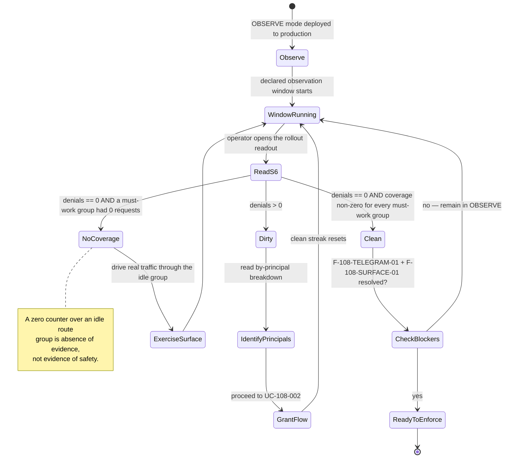
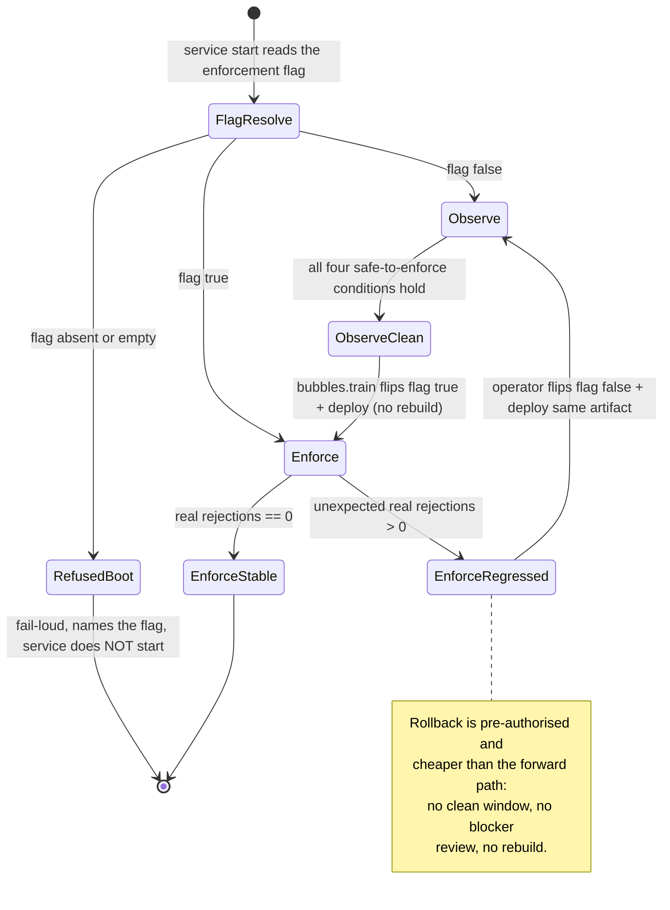
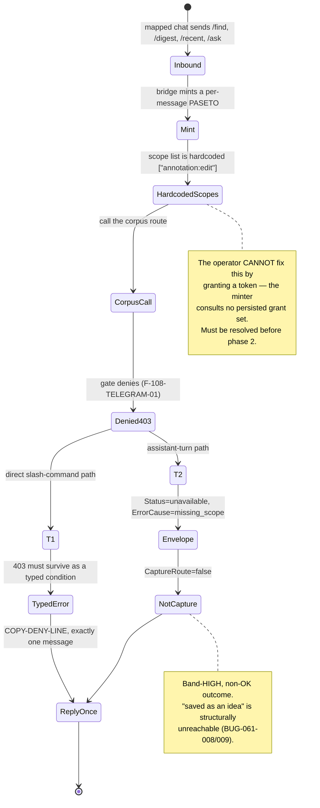

# Feature: 108 Corpus Grant Enforcement

**Status:** in_progress (delivery; ceiling = `done`)
**Workflow Mode:** `full-delivery`
**Release Train:** `next` (security-posture change; MUST NOT ship on `mvp`)
**Planning Only:** false — superseded 2026-08-11. This packet was authored under `product-to-planning` (ceiling `specs_hardened`, Gate G073 source-edit lockout ACTIVE) and reached that ceiling with zero source edits. It has since entered delivery under `full-delivery`, so source code IS now edited by this spec beginning with Scope 01 (`internal/auth`). The authoring chain `bubbles.analyst` → `bubbles.ux` → `bubbles.design` → `bubbles.plan` completed before the transition.

**Owner Directive (2026-07-28):**
> Enforce the grant AS DESIGNED. Do NOT widen the daily default set. Roll out observe-then-enforce.

**Depends On (read-only):**
- spec `060-scoped-token-enrollment` — `auth.RequireScope`, `auth.RegisteredScopeSurfaces`, the `<surface>:<capability>` scope vocabulary, the `smackerel auth enroll|rotate --scope` CLI
- spec `044-per-user-bearer-auth` — per-user PASETO, the four caller surfaces, the `smackerel_auth_*` metric family
- `BUG-070-001` — the role/grant model, `GateGlobalCorpusRead`, the one-global-corpus decision

**Unblocks:** nothing. In particular spec **109 (MCP knowledge server) is NOT blocked by this spec** — see §12.

---

## 1. Problem Statement

The grant `corpus:read` (`auth.GrantGlobalCorpusRead`) is **defined but never enforced in production**. It is a designed authority boundary that does not exist at runtime.

Verified evidence (re-confirmed 2026-07-28 against the working tree):

| Claim | Evidence |
|---|---|
| The grant is defined | `internal/auth/browser_session_policy.go:40` — `GrantGlobalCorpusRead = "corpus:read"` |
| The gate function exists | `internal/auth/browser_session_policy.go:136` — `func GateGlobalCorpusRead(sess Session) CorpusDecision` |
| The gate has **zero production call sites** | Repo-wide `grep -rn 'GateGlobalCorpusRead' --include=*.go .` returns only the definition + doc comments (`browser_session_policy.go:84,131,136`) and the contract test (`internal/api/auth_surface_contract_test.go:85,88,91,94,101`). No production caller. |
| Corpus routes are bearer-only | `internal/api/router.go:87` mounts `deps.bearerAuthMiddleware`; the corpus routes at `:89, :101, :102, :103, :104, :105, :109, :229-235` carry **no** `auth.RequireScope` |
| The enforcement pattern exists and works | `internal/api/router.go:124` — `auth.RequireScope("annotation:edit")`; `internal/api/router.go:178` — `auth.RequireScope("knowledge-graph:read")` |
| The daily default set deliberately excludes it | `internal/auth/browser_session_policy.go:54` — `dailyUserGrants = []string{GrantAssistantTurn, GrantKnowledgeGraphRead}`; the comment at `:37-40` states corpus:read is "NOT part of the daily default set" |
| The operator holds it | `internal/auth/browser_session_policy.go:59-66` — `operatorGrants` includes `GrantGlobalCorpusRead` |
| There is no row-level fallback | `internal/auth/browser_session_policy.go:127-135` — "There is no tenant or per-user isolation parameter — the corpus is one global store and access is grant-gated, not row-partitioned." |

**Consequence.** Any principal holding *any* valid bearer credential reads the entire global corpus — search, digest, recent, artifact detail, domain data, export, the knowledge layer, and the GuestHost guest-context enrichment (`/api/context-for`, which returns guest email / spend / sentiment). Because the corpus is one global store with no row partitioning, "read access" is all-or-nothing: a holder sees **everything**. The `corpus:read` grant is the *only* designed control, and it is inert.

This is not a data-loss bug and not an exploit report. It is an **authority-hygiene defect**: a ratified authority boundary that the code declares but does not apply.

---

## 2. Outcome Contract

**Intent:** The `corpus:read` grant becomes a real, enforced authority boundary on every route that reads the single global corpus. Principals that legitimately need corpus access hold the grant explicitly; principals that do not, do not read the corpus. The transition happens without an unplanned outage of any caller surface, because a telemetry-only observe phase measures the real denial set *before* denial is switched on.

**Success Signal:** In production with the enforcement flag ON, a per-user principal whose token scope claim omits `corpus:read` receives `403` from every corpus route, a principal holding `corpus:read` succeeds on every corpus route, and the observe-phase counter for would-be denials has been at zero for the operator-declared observation window on every caller surface that must keep working.

**Hard Constraints:**
- `dailyUserGrants` MUST NOT be widened. `corpus:read` MUST NOT be added to the daily default set.
- The one-global-corpus model MUST NOT change. This spec adds no tenancy, no row partitioning, no per-user filtering.
- No new grant identifier is introduced. `corpus:read` already exists.
- Observe phase MUST NOT deny. Enforce phase MUST deny. The switch MUST be a declared feature flag read with **no fallback default** (fail-loud), per `.github/instructions/smackerel-no-defaults.instructions.md`.
- A denial MUST leak no corpus content, count, label, or existence hint.
- A wildcard `*` scope MUST NEVER open the gate (`AuthorizeGrant` already returns `wildcard_grant_forbidden` at `browser_session_policy.go:115`; `GateGlobalCorpusRead` already short-circuits at `:137-139`). Enforcement MUST NOT introduce a path that bypasses this.
- Observe-phase telemetry MUST extend the existing `smackerel_auth_*` family (`internal/metrics/auth.go`), not create a parallel family.

**Failure Condition:** Enforcement ships and a legitimate caller surface silently breaks in production — most acutely the Telegram bridge (§4, F-108-TELEGRAM-01) — or the observe phase is skipped/short-circuited and the operator discovers the denial set from broken user-facing behavior instead of from telemetry. Equally a failure: the boundary is "enforced" on paper while the daily default set is quietly widened to make the 403s go away, permanently defeating least privilege.

---

## 3. Decision Of Record

**Decision (operator, 2026-07-28): enforce the grant as designed; do NOT widen the daily default set; roll out observe-then-enforce.**

| Option | Verdict | Reasoning |
|---|---|---|
| **A. Enforce as designed, observe-then-enforce** | **ADOPTED** | Preserves least privilege permanently. `RoleOperator` already holds `corpus:read`, so on a single-operator self-hosted deployment the real migration cost is near zero. The observe phase removes the "we broke the operator's PWA" risk by making the denial set measurable before it is enforceable. |
| B. Add `corpus:read` to `dailyUserGrants` | REJECTED | Permanently defeats least privilege and directly contradicts the ratified spec-060 / BUG-070-001 intent recorded in the code comment at `browser_session_policy.go:37-40`. Once granted to every daily principal it is very hard to walk back — revoking a previously-granted capability is a user-visible regression, whereas granting one is not. |
| C. Delete the grant and the gate as dead code | REJECTED | Would discard a correct, ratified design and leave the corpus permanently ungated. The defect is missing wiring, not a wrong design. |
| D. Enforce immediately without an observe phase | REJECTED | The denial set is not fully knowable by inspection alone across all deployments; and §4 already proves at least one surface would break. Observe-first converts an outage into a measurement. |

**Two-phase rollout.**

- **Phase 1 — observe.** The gate is mounted on every corpus route and evaluates the grant, but a denial does **not** deny: the request proceeds and a counter increments. The operator reads the counter to learn exactly which principals and which route groups would be refused.
- **Phase 2 — enforce.** Once the operator has granted `corpus:read` to the principals that legitimately need it and the observe counter is at zero for the declared window, the flag flips and denials become real `403`s.

The phase is selected by one feature flag. There is no third mode and no per-route override.

---

## 4. Blast-Radius Analysis

This is the core business risk of the change: what a `403` does to each caller surface.

### 4.1 Which principals are actually affected

Enforcement only bites where a session carries scopes. `auth.RequireScope` (`internal/auth/scope_middleware.go:70-79`) **bypasses** `SessionSourceSharedToken` and `SessionSourceBootstrap` with a bypass-counter increment. Per `bearerAuthMiddleware` (`internal/api/router.go:885-1010`):

| Condition | Session source | Under enforcement |
|---|---|---|
| `Environment == "production" && AuthConfig.Enabled`, valid PASETO (`router.go:891, :967`) | `per_user_token` (carries `Scopes`) | **ENFORCED** |
| Production shared-token fallback opt-in (`router.go:983`) | `shared_token` | bypassed |
| Dev/test shared-token compare (`router.go:1009`) | `shared_token` | bypassed |
| Dev empty-token bypass (`router.go:911`) | `shared_token` | bypassed |

**The real blast radius is production + `auth.enabled` + per-user PASETO principals only.** Two consequences the plan must honor:

1. Dev and test are structurally unaffected — which also means **observe-phase telemetry will be silent in dev/test**. The observation window MUST be measured on production, not inferred from a local run.
2. The production shared-token fallback (`auth.production_shared_token_fallback_enabled`, default `false` per FR-AUTH-017) is a bypass of this boundary too. Enforcement is only as strong as that flag staying `false`.

### 4.2 Route groups and caller surfaces

Callers were derived by grep over `web/pwa/`, `extensions/`, and `internal/telegram/`; "none in-repo" means no first-party client in this repository calls the route.

The gated surface is **sixteen** route groups in two tiers. **Tier A** (groups 1–8) is raw
corpus retrieval — the operator's original list. **Tier B** (groups 9–16) is corpus-*derived*
intelligence, brought in scope by §18 decision 5 (F-108-ADJ-01). Both tiers compute over the
same global corpus, so both carry `corpus:read`; the tier split is documentation, not a
difference in authority.

#### Tier A — raw corpus retrieval (groups 1–8)

| # | Route group | router.go | Caller surfaces today | Effect of a 403 |
|---|---|---|---|---|
| 1 | `POST /api/search` | `:89` | PWA (`web/pwa/drive-search.js:193`), Telegram (`internal/telegram/bot.go:174`, `recipe_commands.go:476`) | Drive-search page returns nothing; Telegram `/search` and recipe lookup break |
| 2 | `GET /api/digest` | `:101` | Telegram (`internal/telegram/bot.go:175`) | Telegram digest command breaks |
| 3 | `GET /api/recent` | `:102` | Telegram (`internal/telegram/bot.go:176`, `recipe_commands.go:177`) | Telegram recent + recipe listing break |
| 4 | `GET /api/artifact/{id}` | `:103` | PWA (`web/pwa/drive-artifact-detail.js:318`) | Artifact detail view breaks |
| 5 | `GET /api/artifacts/{id}/domain` | `:104` | none in-repo | No first-party surface breaks; external/manual callers only |
| 6 | `GET /api/export` | `:105` | none in-repo | Operator/external export path only |
| 7 | `POST /api/context-for` | `:109` | none in-repo — **external GuestHost connector** | **Cross-product**: GuestHost guest-context enrichment (guest email / spend / sentiment) breaks. Highest-severity external dependency. Per §18 decision 4 the connector credential does **NOT** receive `corpus:read`; the correct destination is the spec-109 MCP `hospitality-read` path, itself blocked on BUG-019-003. |
| 8 | `GET /api/knowledge/*` (6 routes: `/concepts`, `/concepts/{id}`, `/entities`, `/entities/{id}`, `/lint`, `/stats`) | `:229-235` | Telegram (`internal/telegram/bot.go:178`) | Telegram knowledge command breaks |

#### Tier B — corpus-derived Phase-5 intelligence (groups 9–16, §18 decision 5)

All eight are registered in one block at `internal/api/router.go:238-250`, **conditionally**
behind `if deps.IntelligenceEngine != nil` (`:239`). That conditional registration is an
assertion hazard for the route-manifest set-equality test, not merely an implementation
detail — see §18 decision 5 and SCN-108-G05.

| # | Route group | router.go | `route_group` label | Caller surfaces today | Effect of a 403 |
|---|---|---|---|---|---|
| 9 | `GET /api/expertise` | `:240` | `expertise` | none in-repo | Corpus-derived expertise signal withheld |
| 10 | `GET /api/learning-paths` | `:241` | `learning_paths` | none in-repo | Derived learning-path signal withheld |
| 11 | `GET /api/subscriptions` | `:242` | `subscriptions` | none in-repo | Derived subscription signal withheld |
| 12 | `GET /api/serendipity` | `:243` | `serendipity` | none in-repo | Derived serendipity signal withheld |
| 13 | `GET /api/content-fuel` | `:244` | `content_fuel` | none in-repo | Derived content signal withheld |
| 14 | `GET /api/quick-references` | `:245` | `quick_references` | none in-repo | Derived quick-reference signal withheld |
| 15 | `GET /api/monthly-report` | `:246` | `monthly_report` | none in-repo | Derived periodic report withheld |
| 16 | `GET /api/seasonal-patterns` | `:247` | `seasonal_patterns` | none in-repo | Derived seasonal signal withheld |

**Why Tier B carries no first-party in-repo caller, and why that is not reassuring.** No PWA,
extension, or Telegram call site reaches these eight today. That means the *caller-break* blast
radius of gating them is near zero — but it also means the **observation window will be silent
for all eight groups**, which is precisely the falsely-clean signal §18 decision 1 and
F-108-COVERAGE-LABEL-01 exist to prevent. Tier B must be closed by explicit per-cell
attestation, not by reading a zero counter as safety.

### 4.3 F-108-TELEGRAM-01 — the Telegram bridge is provably broken by enforcement (BLOCKING)

The Telegram bridge is the heaviest corpus consumer (Tier A groups 1, 2, 3, 8 — four of the sixteen) and it mints its **own** per-user PASETO on every inbound message with a **hardcoded** scope list:

`internal/telegram/per_user_token.go:201` — `Scopes: []string{"annotation:edit"}`

There is no operator-configurable scope surface for Telegram tokens. Therefore, under phase-2 enforcement in production, **every Telegram corpus command returns 403**, and the operator **cannot fix it by granting a token**, because the minter does not consult any persisted grant set.

This is determinable statically — it does not need the observe window to discover.

**RATIFIED direction (§18 decision 3, 2026-07-29): option (b).** The two candidates were:

- **(a) Extend the minter's scope list** to include `corpus:read`, mirroring the existing precedent — the comment at `per_user_token.go:195-200` explains that `annotation:edit` was added to that very list for exactly this reason when spec 027 gated the annotation routes. **REJECTED.**
- **(b) Derive Telegram token scopes from the mapped principal's persisted grant set** instead of hardcoding. More correct and it makes the Telegram surface obey the same authority source as every other surface, but materially larger. **RATIFIED.**

Option (a) was rejected on two grounds. First, it grants corpus access to *every* mapped Telegram chat unconditionally, which re-creates a smaller version of the problem this spec exists to fix and contradicts §18 decision 2. Second — and decisively — the hardcoded list is **already a latent defect**: it locates authority at the **minter** rather than at the **principal**, contradicting spec 044 Scope 02 ("actor identity from the verified bearer-token session only") and the `browser_session_policy.go` doctrine that authority comes only from the session's persisted grant snapshot. Extending it would entrench a second, divergent authority source that must eventually be unwound at higher cost.

Option (b) **depends on** F-108-UX-ROSTER-01: deriving from persisted grants presumes those grants are readable server-side, which they are not today. That dependency is recorded, not assumed away.

### 4.4 The PWA and extension surfaces are operator-fixable

`POST /v1/web/login` does **not** mint a token; it accepts an already-minted PASETO wire token and stores it in the `auth_token` cookie (`internal/api/web_login.go:43-53`, cookie attrs `HttpOnly + SameSite=Lax + Secure`-in-production). The browser extension forwards an operator-enrolled per-user PASETO as `Authorization: Bearer`. Both therefore carry whatever scopes the **operator-enrolled** token carries, so both are fixable with `smackerel auth enroll|rotate --scope corpus:read` — subject to F-108-SURFACE-01 below.

### 4.5 F-108-SURFACE-01 — the operator cannot grant `corpus:read` today (BLOCKING)

`internal/auth/scopes.go:39` — `RegisteredScopeSurfaces = []string{"extension", "annotation", "knowledge-graph"}`.

`corpus` is **not** a registered surface. `cmd/core/cmd_auth.go:566-573` rejects an unregistered surface with exit `2` and `unknown scope surface: corpus (use --allow-unknown-surface to override)`.

So today `./smackerel.sh auth enroll --scope corpus:read <user-id>` fails, and the only way through is the `--allow-unknown-surface` escape hatch — whose own WARN text (`cmd_auth.go:577`) instructs the caller to "register surface in auth.RegisteredScopeSurfaces in the same change set". Registering `corpus` is therefore a **hard prerequisite** of the operator runbook and of phase 2; the comment at `scopes.go:30-32` states additions "MUST land in the same change set as the spec that introduces the new surface."

### 4.6 F-108-GRANT-MECHANISM-01 — granting is a token rotation, not a flag flip

Authority is carried in the minted token's `scope` claim (`internal/auth/issue.go:108-109`) and read back into the session at `internal/api/router.go:973` (`Scopes: parsed.Scopes`). Granting `corpus:read` to an existing principal therefore requires **re-minting and redistributing that principal's token**, not toggling a database row. The migration cost is per-principal client re-provisioning, and the operator runbook must say so.

The rotation semantics are also a trap: `resolveRotationScopes` (`cmd/core/cmd_auth.go:583-...`) distinguishes preserve / explicit-replace / demote. A rotation issued with `--scope corpus:read` alone **replaces** the scope set and silently drops previously-held scopes (e.g. `annotation:edit`). The runbook MUST specify the full intended scope list on every rotation.

---

## 5. Domain Capability Model

The authority capability this feature consumes **already exists**; this spec adds a third consumer to it and MUST NOT fork it.

**Primitives**

| Primitive | Meaning | Authoritative source |
|---|---|---|
| **Principal** | The authenticated identity behind a request | `auth.Session{UserID, TokenID, Source, Scopes}` |
| **Session source** | How the credential arrived; determines whether grants are even consulted | `auth.SessionSource` ∈ {`per_user_token`, `shared_token`, `bootstrap`} |
| **Grant** | A `<surface>:<capability>` authority token held by a principal | `auth.ScopeNameRegex`, `auth.RegisteredScopeSurfaces` |
| **Grant snapshot** | The explicit, persisted set of grants a principal holds | `Session.Scopes`, minted into the PASETO `scope` claim |
| **Role** | A named default grant snapshot; confers nothing by itself | `auth.RoleDailyUser`, `auth.RoleOperator` |
| **Gate** | A route-level predicate over the grant snapshot | `auth.RequireScope` |
| **Decision** | The allow/deny outcome, with a bounded non-sensitive reason | `auth.GrantDecision`, `auth.CorpusDecision` |
| **Corpus** | The single operator-owned global artifact store — **no** tenant, **no** row partitioning | `CorpusDecision` doc, `browser_session_policy.go:127-135` |

**Lifecycle:** grant declared in the registry → minted into a principal's token at enroll/rotate → verified per request → evaluated by a gate → decision rendered.

**Business policies every implementation must obey**

1. Authority comes only from the persisted grant snapshot. A valid credential alone confers nothing.
2. A wildcard is never a grant.
3. There is no implicit default grant.
4. A denial carries no corpus content, count, label, or existence hint.
5. Access is grant-gated, never row-partitioned.

### Single-Capability Justification

The trigger words *gate*, *surface*, and *provider* appear throughout, so the capability-foundation doctrine is checked explicitly. **No new foundation is introduced and none is needed.** `auth.RequireScope` plus the `RegisteredScopeSurfaces` registry is already the capability foundation, already has two production consumers (`annotation:edit` at `router.go:124`, `knowledge-graph:read` at `router.go:178`), and this spec makes `corpus:read` the third. The correct move is to **consume the existing foundation**, not build a parallel corpus-specific gate.

Concretely, this constrains design: a bespoke corpus middleware that re-implements grant evaluation would be a fork of the foundation and is out of bounds. The one genuinely new shared element is the **observe-vs-enforce mode**, which — if it is to be reusable by a future fourth consumer — belongs *in* the foundation rather than beside it. Whether to generalize it now or keep it corpus-local is a design decision, recorded here as **F-108-FOUNDATION-01** for `bubbles.design`.

---

## 6. Actors & Personas

| Actor | Description | Key goals | Grants held today |
|---|---|---|---|
| **Operator** (`RoleOperator`) | The single self-hosted owner. Enrolls principals, rotates tokens, reads telemetry, flips the flag. | Keep least privilege real; never break their own daily surfaces | `assistant:turn`, `knowledge-graph:read`, `corpus:read`, `operator:admin`, `operator:model-picker` (`browser_session_policy.go:59-66`) |
| **Daily user** (`RoleDailyUser`) | An ordinary product user. | Use assistant + knowledge graph; understand honestly when something is not theirs to read | `assistant:turn`, `knowledge-graph:read` — **not** `corpus:read` (`:54`) |
| **Granted daily user** | A daily user the operator has specifically granted corpus access. | Same as daily user, plus corpus reads | daily set + `corpus:read` (via `SessionWithRole(..., extraGrants...)`, `:88-96`) |

### Caller surfaces (spec 044 Scope 03, `docs/smackerel.md` §17.2)

| Surface | Credential carrier | Scope source | Fixable by operator? |
|---|---|---|---|
| **PWA / web** | `auth_token` cookie set by `POST /v1/web/login` (`web_login.go:43-53`) | Operator-enrolled token's `scope` claim | Yes — enroll/rotate |
| **Browser extension** | `Authorization: Bearer` from `chrome.storage.local.authToken` | Operator-enrolled token's `scope` claim | Yes — enroll/rotate |
| **Telegram bridge** | Per-message PASETO from `PerUserTokenMinter` | **Hardcoded** `["annotation:edit"]` (`per_user_token.go:203`) | **No — code change required (F-108-TELEGRAM-01)** |
| **Machine clients (present + future)** | `Authorization: Bearer`; today the external GuestHost connector on `/api/context-for` | Operator-enrolled token's `scope` claim | Yes — enroll/rotate, but requires coordination with the external product |

---

## 7. Use Cases

### UC-108-001 — Operator observes the real denial set
- **Actor:** Operator
- **Preconditions:** Phase 1 shipped to production; `auth.enabled` true; enforcement flag OFF.
- **Main flow:** 1) Operator lets normal traffic run for the declared observation window. 2) Operator scrapes the observe counter. 3) Operator reads the per-route-group and per-principal breakdown. 4) Operator decides which principals legitimately need `corpus:read`.
- **Alternative flow:** Counter is already zero → no principal is affected → operator may proceed directly to phase 2.
- **Postconditions:** The denial set is known from measurement, not from guesswork. No user-visible behavior changed.

### UC-108-002 — Operator grants `corpus:read` to a principal
- **Actor:** Operator
- **Preconditions:** `corpus` is a registered scope surface (F-108-SURFACE-01 resolved).
- **Main flow:** 1) Operator runs the enroll-or-rotate command with the principal's **full** intended scope list including `corpus:read`. 2) Operator redistributes the new wire token to that principal's client. 3) Operator confirms the observe counter for that principal drops to zero.
- **Alternative flow:** Operator omits an existing scope on rotation → that scope is silently dropped (F-108-GRANT-MECHANISM-01) → runbook requires the full list.
- **Postconditions:** The principal's token carries `corpus:read`; it will pass under phase 2.

### UC-108-003 — Operator enables enforcement
- **Actor:** Operator
- **Preconditions:** Observe counter at zero across every must-keep-working surface for the declared window; F-108-TELEGRAM-01 and F-108-SURFACE-01 resolved.
- **Main flow:** 1) `bubbles.train` flips the flag ON in the owning train. 2) Deploy. 3) Operator verifies a granted principal succeeds and an ungranted principal receives 403.
- **Alternative flow:** An unexpected 403 appears → operator flips the flag back OFF (returning to observe) → no rebuild required.
- **Postconditions:** `corpus:read` is a real boundary.

### UC-108-004 — Ungranted daily user attempts a corpus read
- **Actor:** Daily user (no `corpus:read`)
- **Preconditions:** Phase 2 active.
- **Main flow:** 1) User triggers a corpus-backed view. 2) The gate denies. 3) The client renders an honest not-authorized state that reveals nothing about corpus contents or size.
- **Postconditions:** No corpus data reaches the client; no existence or count information is inferable from the response.

---

## 8. Business Scenarios (Gherkin)

Scenario IDs follow the repo convention `SCN-<spec>-<letter><nn>`.

### Authority matrix

**SCN-108-A01 — Operator passes**
```gherkin
Given a production deployment with per-user bearer auth enabled
  And enforcement is ON
  And a principal whose token scope claim includes "corpus:read"
When the principal requests any of the sixteen corpus route groups
Then the request is authorized
  And the corpus content is returned
```

**SCN-108-A02 — Daily user without corpus:read is denied**
```gherkin
Given a production deployment with per-user bearer auth enabled
  And enforcement is ON
  And a daily-user principal whose token scope claim omits "corpus:read"
When the principal requests any of the sixteen corpus route groups
Then the request is refused with 403
  And no corpus content is returned
```

**SCN-108-A03 — Specifically-granted daily user passes**
```gherkin
Given a daily-user principal the operator has specifically granted "corpus:read"
  And enforcement is ON
When the principal requests any of the sixteen corpus route groups
Then the request is authorized
  And the daily default grant set has NOT been widened
```

**SCN-108-A04 — Wildcard is never honored**
```gherkin
Given a principal whose token scope claim contains the wildcard "*"
  And enforcement is ON
When the principal requests any corpus route group
Then the request is refused
  And the refusal reason is "wildcard_grant_forbidden"
  And the wildcard confers no authority on any other grant either
```

**SCN-108-A05 — A bare valid credential confers nothing**
```gherkin
Given a per-user principal whose token carries no scope claim at all
  And enforcement is ON
When the principal requests any corpus route group
Then the request is refused with 403
```

### Session sources

**SCN-108-B01 — Shared-token source bypasses (documented, not a regression)**
```gherkin
Given a session whose source is the shared token
  And enforcement is ON
When the session requests any corpus route group
Then the request passes through the gate
  And the scope-check-bypassed counter increments with source "shared_token"
```

**SCN-108-B02 — Bootstrap source bypasses (documented, not a regression)**
```gherkin
Given a session whose source is bootstrap enrollment
  And enforcement is ON
When the session requests any corpus route group
Then the request passes through the gate
  And the scope-check-bypassed counter increments with source "bootstrap"
```

**SCN-108-B03 — The production shared-token fallback is a boundary bypass**
```gherkin
Given a production deployment with the shared-token fallback enabled
  And enforcement is ON
When a caller authenticates via the shared-token fallback
Then the corpus gate does not refuse the request
  And this is surfaced to the operator as a boundary-weakening configuration
```

### Rollout modes

**SCN-108-C01 — Observe mode counts without denying**
```gherkin
Given enforcement is OFF (observe mode)
  And a per-user principal whose token scope claim omits "corpus:read"
When the principal requests a corpus route group
Then the request SUCCEEDS and corpus content is returned
  And a would-be-denial counter increments for that route group
  And no 403 is emitted
```

**SCN-108-C02 — Enforce mode denies**
```gherkin
Given enforcement is ON
  And a per-user principal whose token scope claim omits "corpus:read"
When the principal requests a corpus route group
Then the request is refused with 403
```

**SCN-108-C03 — The mode switch has no fallback default**
```gherkin
Given the enforcement flag is absent from the resolved runtime configuration
When the service starts
Then startup FAILS LOUDLY naming the missing flag
  And the service does NOT silently choose observe or enforce
```

**SCN-108-C04 — Reverting to observe requires no rebuild**
```gherkin
Given enforcement is ON and an unexpected denial is observed in production
When the operator flips the flag OFF and redeploys the same artifact
Then denials stop and counting resumes
  And no image rebuild was required
```

### Denial semantics

**SCN-108-D01 — A denial leaks nothing**
```gherkin
Given enforcement is ON
  And a principal without "corpus:read"
When the principal requests a corpus route group
Then the response body contains no corpus content
  And no artifact count, corpus size, tenant, label, identifier, or existence hint
  And the response is indistinguishable for an empty corpus and a populated corpus
```

**SCN-108-D02 — Denial is identical whether or not the requested resource exists**
```gherkin
Given enforcement is ON
  And a principal without "corpus:read"
When the principal requests an artifact id that exists
  And the principal requests an artifact id that does not exist
Then both responses are byte-identical
```

### Cross-surface

**SCN-108-E01 — Telegram corpus commands keep working**
```gherkin
Given enforcement is ON in production
  And a mapped Telegram chat belonging to a principal entitled to corpus access
When the user issues a search, digest, recent, or knowledge command
Then the command succeeds
  And the Telegram-minted token carried the authority required by the gate
```

**SCN-108-E02 — The external guest-context consumer is not silently broken**
```gherkin
Given enforcement is ON in production
  And the external GuestHost connector calls the guest-context enrichment route
When the connector's credential lacks "corpus:read"
Then the observe phase surfaced this before enforcement was enabled
  And the operator granted the credential before flipping the flag
```

**SCN-108-F01 — Operator cannot be blocked from granting the grant**
```gherkin
Given the operator wants to grant "corpus:read" to a principal
When the operator runs the enrollment or rotation command with that scope
Then the command succeeds without requiring an unknown-surface escape hatch
```

**SCN-108-F02 — Rotation does not silently drop existing grants**
```gherkin
Given a principal currently holding "annotation:edit"
When the operator rotates that principal's token to add "corpus:read"
Then the resulting token carries BOTH grants
  And no previously-held grant is silently dropped
```

---

## 9. Denial Semantics

`CorpusDecision` (`browser_session_policy.go:127-135`) is deliberately content-free: *"a denied decision deliberately carries NO content, count, label, or existence hint — the caller renders a bare 403."* The existing contract test already asserts the denied body contains none of `count`, the user id, `jti`, `tenant`, `corpus_size`, `artifacts` (`auth_surface_contract_test.go:96-108`).

**F-108-DENIAL-SHAPE-01 — an unresolved tension the design must settle.** The existing `RequireScope` denial body is `{"error":"scope_required","required":["<scope>"]}` (`scope_middleware.go:95`, `writeScopeError` `:103-116`). That body **names the missing capability**. Reusing the foundation therefore produces a denial that is *not* the "bare 403" the `CorpusDecision` doctrine describes.

These are reconcilable — `corpus:read` is authorization vocabulary, not corpus content, and naming it leaks nothing about what the corpus contains — but the spec MUST pin the decision rather than leave `bubbles.design` and `bubbles.ux` to guess. Requirements:

- **R-108-D1:** The denial body MUST NOT contain corpus content, artifact counts, corpus size, artifact identifiers, tenant identifiers, or any signal that distinguishes a populated corpus from an empty one.
- **R-108-D2:** The denial MUST be identical for an existing and a non-existing resource id (no existence oracle).
- **R-108-D3:** The spec adopts the foundation's `scope_required` shape, including the `required` field, and records that naming the required capability is **not** a leak. Any deviation from the foundation's shape must be justified in `design.md`.
- **R-108-D4:** Denial status is `403`, never `404` and never `200`-with-empty-results. A `404` would itself be an existence-shaped answer, and an empty `200` would be a silent lie about corpus contents.

### Design surface for `bubbles.ux` (explicit handoff)

Denial UX and status language is a **UX design surface**, not an implementation detail, and is handed to `bubbles.ux`:

- **R-108-D5:** Each affected first-party surface (PWA drive-search, PWA artifact detail, Telegram command replies) MUST have a defined not-authorized state. A blank panel, a spinner that never resolves, or a raw JSON error is not acceptable.
- **R-108-D6:** The user-facing copy MUST be honest and non-leaking: it says the principal is not authorized to read the corpus; it does **not** say or imply how much is there, that something exists, or that the corpus is empty.
- **R-108-D7:** The copy MUST tell the user what to do next (ask the operator for corpus access) without exposing the grant-issuance mechanics.
- **R-108-D8:** Product Principle 6 (Invisible By Default, Felt Not Heard) applies: a denial MUST NOT produce a notification, a badge, or a nag. It is an in-context state.

### Single-Screen Justification

This feature introduces **no UI primitive and no new screen**. It is a server-side
authorization gate mounted on an existing router group; every artifact it produces is a
middleware mount, three Prometheus counters, one structured log line, and configuration.
Requirements R-108-D5 through R-108-D8 name three *pre-existing* surfaces (PWA drive-search,
PWA artifact detail, Telegram command replies) that must each render an already-defined
not-authorized state. That is the reason the multi-surface wording appears above — it is an
enumeration of existing consumers of one denial outcome, not a plan to build a reusable UI
component library.

Consequently there is no shared UI primitive to extract and no composition rule to define:
the denial state is a single non-authorized rendering of one response shape (bare `403`, no
count, no id, no title, no domain label — §9), and each surface renders it with the error/empty
affordance it already owns. Introducing a cross-feature UI primitive here would be
speculative abstraction over exactly one state with one payload. If a future feature adds a
second distinct authorization-denial payload, or denial UX diverges per surface beyond copy,
that is the point at which a `### UI Primitives` section becomes warranted — and it would be
owned by `bubbles.ux` under the explicit handoff recorded immediately above, not by this
packet.

---

## 10. Observability

**R-108-O1:** Observe-phase telemetry MUST extend the existing `smackerel_auth_*` family in `internal/metrics/auth.go` — the family declared by `auth.telemetry_metric_prefix` and documented in `docs/Operations.md` "Authentication Metrics" (`docs/Operations.md:2790`). A parallel metric family is forbidden.

Current family members (verified): `smackerel_auth_issuance_total`, `_rotation_total`, `_revocation_total`, `_validation_latency_seconds`, `_validation_outcome_total`, `_legacy_fallback_used_total`, `_failure_total`, `_scope_rejected_total`, `_scope_check_bypassed_total`.

**R-108-O2:** The observe counter MUST distinguish a *would-be* denial (observe mode, request allowed) from a *real* rejection (enforce mode, request refused). Reusing `smackerel_auth_scope_rejected_total` for both would make the two indistinguishable and destroy the observation signal.

**R-108-O3:** The observe counter MUST carry a **closed-set** route-group label with the sixteen values from §4.2 (Tier A + Tier B, per §18 decision 5) — never the raw request path, which is unbounded (`/api/artifact/{id}` alone would be per-artifact).

**R-108-O4:** Label cardinality discipline. The existing `smackerel_auth_scope_rejected_total` already carries a `user_id` label (`internal/metrics/auth.go:162`), bounded by the operator-controlled principal count. The observe counter MAY follow that precedent — the per-principal breakdown is exactly what UC-108-001 needs — but MUST NOT introduce any further unbounded label.

**R-108-O5:** The metric MUST be documented in `docs/Operations.md` under the existing "Authentication Metrics" heading with its closed label sets, alongside a runbook for reading it during the observation window.

**R-108-O6:** Observe-mode telemetry MUST be emitted only from the deployment being observed. Test-emitted telemetry MUST carry `env=test*` and target the ephemeral test stack, per `.github/instructions/bubbles-env-pollution-isolation.instructions.md` (G115).

---

## 11. Feature Flag Contract

**R-108-FL1:** The observe→enforce switch is a declared feature flag. Proposed name `corpusGrantEnforcement`; the final name is owned by `bubbles.train`. (Existing bundles mix conventions — `card_rewards` snake_case, `clientReleaseLaneB` camelCase — this proposal follows the more recent camelCase.)

**R-108-FL2:** The flag MUST be declared in **both** bundles: `config/feature-flags.next.yaml` and `config/feature-flags.mvp.yaml`.

**R-108-FL3:** The flag ships **default-OFF (`false`) in every train**, mirroring the `clientReleaseLaneB` precedent (`config/feature-flags.mvp.yaml`, `config/feature-flags.next.yaml`) for a two-phase operator-activated flag. `bubbles.train` flips it ON in the owning train (`next`) only after the observation window is clean. Gate G111 forbids default-ON on a *non-owning* train; it does not require ON anywhere, so an all-OFF dormant flag is conformant (`.github/bubbles/scripts/release-train-guard.sh:119,138`).

**R-108-FL4:** `config/feature-flags.mvp.yaml` metadata MUST record `owning_spec: specs/108-corpus-grant-enforcement/`, `introduced_in_train: next`, and `introduced_at`, following the existing metadata block shape.

**R-108-FL5:** The flag MUST be read from its environment variable with **no fallback default**. A missing value is a fail-loud startup error, never a silent observe-or-enforce choice (SCN-108-C03). Per `.github/instructions/smackerel-no-defaults.instructions.md`, `${VAR:-default}`, `os.Getenv` with a default, and `unwrap_or` shapes are forbidden; the fail-loud `${VAR:?...}` / explicit-empty-check form is required.

**R-108-FL6:** The flag chooses deny-vs-count **only**. The gate is mounted on every corpus route in both modes — otherwise observe mode emits nothing. There is no per-route override and no third mode.

**R-108-FL7:** Flag lifecycle per `.github/instructions/bubbles-release-trains.instructions.md` and the flag-lifecycle skill: the flag dies with its train + one cycle. Once enforcement is permanent, the flag and its observe branch are retired.

**R-108-FL8:** `state.json` MUST carry `releaseTrain: "next"` and list the flag in `flagsIntroduced`.

---

## 12. Non-Goals

Explicitly **out of scope**:

1. **Changing the one-global-corpus model.** No tenancy, no per-user row partitioning, no row-level filtering. The corpus stays one global store; access stays grant-gated (`browser_session_policy.go:127-135`).
2. **Widening `dailyUserGrants`.** Rejected as Option B in §3.
3. **New grants.** `corpus:read` already exists. No new grant identifier is introduced. (Registering the `corpus` *surface* in `RegisteredScopeSurfaces` is not a new grant — it is making the existing grant issuable; see F-108-SURFACE-01.)
4. **Any MCP work.** That is spec 109 — see §12.1.
5. **Removing the shared-token / bootstrap bypass**, or changing the production shared-token fallback default. SCN-108-B03 *surfaces* the fallback as a boundary weakener; changing it is a separate decision.
6. **Re-gating adjacent non-corpus routes.** The `annotation:edit` group, the `knowledge-graph:read` group, and every write path stay as they are. **Note (§18 decision 5, 2026-07-29):** the corpus-*derived* Phase-5 intelligence endpoints were previously listed here as out of scope; they are now **IN scope** as Tier B of §4.2. What remains a non-goal is re-gating routes that are not corpus reads at all. See F-108-ADJ-01.

### 12.1 Downstream dependency note — spec 109 is NOT blocked

Spec **109 (MCP knowledge server)** defines its **own** audience-bound credential and its **own** authorizer. It does not consume `auth.RequireScope` on these sixteen routes and does not depend on `corpus:read` being enforced. **108 and 109 may proceed in parallel; nobody should serialize them.** Recorded here explicitly so the dependency is not invented later. Neither spec directory exists yet (`ls -d specs/108* specs/109*` → both absent before this spec was authored).

**One-way dependency added by §18 decision 4 (2026-07-29).** The GuestHost connector's guest-context reads are ratified to move to spec 109's `hospitality-read` toolset under its own audience-bound credential (spec 109 **D3**), rather than receiving `corpus:read` here. That is a *destination*, not a coupling: 108 does not wait on 109, and 109 does not wait on 108. It does mean `POST /api/context-for` (Tier A group 7) is gated with **no granted external reader** until `hospitality-read` ships, which is itself blocked on **BUG-019-003**. Coordination owner: `bubbles.design` on spec 109.

---

## 13. Non-Functional Requirements

| ID | Requirement |
|---|---|
| **NFR-108-1** | Gate evaluation is an in-memory slice membership test over `Session.Scopes` (`slices.Contains`) with no DB round trip and no network call, preserving the spec-044 hot-path budget (`NFR-AUTH-001`, ≤5ms p99 for the whole auth hot path). |
| **NFR-108-2** | Observe mode MUST add no user-visible latency or behavior change beyond a counter increment. |
| **NFR-108-3** | The mode switch MUST be reversible by flag + redeploy of the **same** artifact, with no rebuild (SCN-108-C04). |
| **NFR-108-4** | Denials MUST NOT be logged with corpus content. The existing `scope_rejected` WARN log (`scope_middleware.go:86-92`) carries `required_scope`, `user_id`, `token_scopes`, `endpoint` — all authorization vocabulary, no corpus data. That boundary MUST hold. |
| **NFR-108-5** | Enforcement MUST be verified in an environment where sessions actually carry scopes. Because dev/test resolve to `shared_token` and bypass (§4.1), tests MUST construct `per_user_token` sessions explicitly or the assertions are vacuous. |

---

## 14. Documentation, Release, And Configuration Requirements

These are **spec requirements**, not prose. Each was verified against the working tree.

### 14.1 Managed docs (`.github/bubbles/docs-registry.yaml`)

| ID | File | Registry status | Required change |
|---|---|---|---|
| **R-108-DOC1** | `docs/API.md` | **Managed** (`api`, owner `bubbles.docs`, `required: true`, section `Authentication And Authorization`) | The `## Authentication And Authorization` section (`docs/API.md:11`) currently describes only `bearerAuthMiddleware`. It MUST document the `corpus:read` requirement on the sixteen corpus route groups, the 403 shape, and the observe-vs-enforce mode. |
| **R-108-DOC2** | `docs/Operations.md` | **Managed** (`operations`, owner `bubbles.docs`, `required: true`) | Two edits: (a) under "Per-User Bearer Authentication (Spec 044)" (`:2207`) / "Scoped Token Enrollment (Spec 060)" (`:2390`), add the operator runbook for granting `corpus:read` — including the full-scope-list rotation rule (F-108-GRANT-MECHANISM-01); (b) under "Authentication Metrics (Scope 04)" (`:2790`), document the observe counter and its closed label sets (R-108-O5). |

`docs-registry.yaml` itself needs **no edit** — both files are already registered. It is listed here only to record that the check was performed.

### 14.2 Unmanaged docs

| ID | File | Required change |
|---|---|---|
| **R-108-DOC3** | `docs/smackerel.md` §17.2 Security Model (`:2497-2545`) | The §17.2 narrative documents spec 044 Scopes 02/03/04 but does **not** mention the corpus grant. It MUST record that `corpus:read` is enforced on the sixteen corpus route groups, the observe-then-enforce rollout, and the decision not to widen the daily default set. **Note:** `docs/smackerel.md` is **not** in `docs-registry.yaml`, and the registry sets `unmanagedDocsRequireExplicitTarget: true` — this requirement is that explicit target. |

### 14.3 Release packet — what was actually found

`find docs/releases -type f` returns exactly two packets, each with the same eight files:

```
docs/releases/mvp/{actions,business-plan,deployment,features,marketing,monetization,ops-scalability,vision}.md
docs/releases/v1/{actions,business-plan,deployment,features,marketing,monetization,ops-scalability,vision}.md
```

**There is no `docs/releases/next/` packet.** `next` is a *train id* in `config/release-trains.yaml`, not a release-packet phase; `mvp` is the only name appearing in both vocabularies, and it means different things in each.

Precedent from the repo itself, not invented: `docs/releases/mvp/features.md` (Capability evidence trace) states — *"Spec 081 (Python NATS parity) is `done` on the `next` train and is intentionally out of this MVP packet — recorded here only as next-train lineage."* So a `next`-train spec has previously been deliberately **excluded** from the MVP packet rather than force-fitted into it.

| ID | Requirement |
|---|---|
| **R-108-REL1** | **No release packet is created or invented by this spec.** `docs/releases/next/` does not exist and MUST NOT be fabricated. |
| **R-108-REL2** | The packet-ownership decision — register 108 in `docs/releases/v1/features.md`, record it as next-train lineage in `docs/releases/mvp/features.md` following the spec-081 precedent, or defer until a `next`-owning packet exists — is **owned by `bubbles.releases`** and is routed, not decided here (**F-108-RELEASE-01**). |
| **R-108-REL3** | Whichever packet takes it, the entry MUST bind to this spec folder and MUST be `planned`, never `delivered`, until certification. No fabricated delivery claim. |
| **R-108-REL4** | If registered in `docs/releases/v1/features.md`, the entry MUST bind to `specs/108-corpus-grant-enforcement/` — a **real, already-authored** slot — and MUST NOT reuse the stale proposed slot numbers (`specs/077`–`specs/090`) that the packet's own non-blocking finding already flags as colliding with existing unrelated specs. |

### 14.4 Configuration

| ID | File | Required change |
|---|---|---|
| **R-108-CFG1** | `config/feature-flags.next.yaml` | Add the flag, `false`, with an owning-spec comment (per R-108-FL1..FL4). |
| **R-108-CFG2** | `config/feature-flags.mvp.yaml` | Add the flag, `false`, plus the `metadata:` block. |
| **R-108-CFG3** | `config/smackerel.yaml` (SST) | If the flag is surfaced through the SST config pipeline, it MUST be declared there with no default value, fail-loud on absence (R-108-FL5, `smackerel-no-defaults`). Whether it flows via SST or purely via the train bundle is a `bubbles.design` decision. |

### 14.5 Code prerequisites (recorded for `bubbles.plan`; NOT edited here)

| ID | Requirement |
|---|---|
| **R-108-PRE1** | Register `corpus` in `auth.RegisteredScopeSurfaces` (`internal/auth/scopes.go:39`) **in the same change set**, per the comment at `:30-32`. Without it the operator runbook cannot be executed (F-108-SURFACE-01). |
| **R-108-PRE2** | Resolve the Telegram token scope problem before phase 2 (F-108-TELEGRAM-01). |

---

## 15. Product Principle Alignment

Bound by `.github/instructions/product-principles.instructions.md` (ratified 2026-06-03; BLOCKING).

| Principle | Alignment | Evidence |
|---|---|---|
| **6 — Invisible By Default, Felt Not Heard** | Observe mode is entirely invisible: it changes no user-visible behavior and emits no notification, only a counter. Under enforcement, a denial is an in-context state, never a notification, badge, or nag. | R-108-D8, SCN-108-C01, NFR-108-2 |
| **8 — Trust Through Transparency** | The denial is honest: the user is told they are not authorized, and is not shown a silently-empty result set that misrepresents the corpus as empty. Denial is `403`, never `200`-with-empty-results. | R-108-D4, R-108-D6 |
| **9 — Design For Restart, Not Perfection** | A returning user who lacks the grant sees an honest state with a next step, not a punishing error wall or an unresolved spinner. | R-108-D5, R-108-D7 |
| **10 — QF Companion Boundary (NON-NEGOTIABLE)** | `/api/context-for` is the cross-product guest-context surface. This spec does not initiate any financial action and does not alter cross-product packet metadata; it only gates read authority. The cross-product breakage risk is surfaced explicitly rather than discovered in production. | §4.2 row 7, SCN-108-E02 |
| **4 — Source-Qualified Processing** | No source metadata is stripped or altered. Authorization is orthogonal to the artifact's source qualification. | Non-goal 1 |
| **5 — One Graph, Many Views** | Reinforced: access is grant-gated on the single graph, never forked into a second partitioned store. | Non-goal 1, §5 policy 5 |

**Deviations:** none.

---

## 16. Open Findings (routed, not resolved here)

**Direction status (2026-07-29).** §18 ratified the *direction* of **F-108-TELEGRAM-01** (decision
3) and **F-108-ADJ-01** (decision 5). Both remain **findings with owners and unfinished work** —
ratification settled *which way*, not *that it is done*. Their rows below record the decided
direction; the work itself is planned in `scopes.md`.

| ID | Severity | Finding | Owner |
|---|---|---|---|
| **F-108-TELEGRAM-01** | **BLOCKING** — **DIRECTION DECIDED (§18 decision 3)** | Telegram mints tokens with a hardcoded `["annotation:edit"]` scope list (`internal/telegram/per_user_token.go:201`) and consumes 4 of the 16 corpus route groups. Enforcement provably breaks every Telegram corpus command, and the operator cannot fix it by granting a token. **RATIFIED direction: option (b) — derive the minted scope claim from the mapped principal's persisted grant set.** Option (a) (extend the minter's hardcoded list) is REJECTED: it defines authority at the minter rather than the principal, contradicting spec 044 Scope 02 and the `browser_session_policy.go` persisted-grant doctrine, and it would grant corpus access to every mapped chat unconditionally. Remaining work: implement derivation (larger change), and resolve the server-side grant-readability dependency in F-108-UX-ROSTER-01. Planned in `scopes.md` Scope 04 (SCN-108-E01, SCN-108-E04). | `bubbles.design` (derivation mechanism) → `bubbles.plan` |
| **F-108-SURFACE-01** | **BLOCKING** | `corpus` is absent from `auth.RegisteredScopeSurfaces` (`internal/auth/scopes.go:39`); `smackerel auth enroll --scope corpus:read` exits 2 today (`cmd/core/cmd_auth.go:566-573`). Hard prerequisite for the runbook and for phase 2. | `bubbles.plan` (R-108-PRE1) |
| **F-108-DENIAL-SHAPE-01** | HIGH | The foundation's `{"error":"scope_required","required":[...]}` body names the missing capability, which is in tension with the `CorpusDecision` "bare 403" doctrine. §9 R-108-D3 proposes adopting the foundation shape; design must confirm or justify a deviation. | `bubbles.design` + `bubbles.ux` |
| **F-108-GRANT-MECHANISM-01** | HIGH | Grants live in the minted token, so granting is a **rotation + client re-provisioning**, not a flag flip; and `resolveRotationScopes` (`cmd/core/cmd_auth.go:583+`) will silently drop existing scopes if the rotation does not name the full list. Runbook must be explicit (SCN-108-F02). | `bubbles.design` → `docs/Operations.md` |
| **F-108-RELEASE-01** | MEDIUM | `docs/releases/` contains only `mvp/` and `v1/`; there is no `next/` packet, and no packet naturally owns a `next`-train security-posture change. The spec-081 precedent is to record next-train work as lineage in the MVP packet rather than force-fit it. Packet ownership is `bubbles.releases`' call. | `bubbles.releases` |
| **F-108-ADJ-01** | MEDIUM — **SCOPE CALL DECIDED (§18 decision 5): IN SCOPE** | Adjacent corpus-**derived** reads were bearer-only: the Phase-5 intelligence endpoints `/api/expertise`, `/learning-paths`, `/subscriptions`, `/serendipity`, `/content-fuel`, `/quick-references`, `/monthly-report`, `/seasonal-patterns` (`internal/api/router.go:238-250`). They compute over the same global corpus, so gating only the original eight would have left a **partial boundary** — a principal denied at `/api/search` could reconstruct much of the same signal from `/api/expertise` plus `/monthly-report`. **RATIFIED: gate them in THIS spec, not a follow-up.** The gated surface goes from 8 to **16** route groups (§4.2 Tier B) and the `route_group` label set closes at sixteen values. Remaining work: extend the gate mount and the T8 route-manifest set-equality to Tier B, including the `deps.IntelligenceEngine != nil` conditional-registration hazard. Planned in `scopes.md` Scope 03 (SCN-108-G04, SCN-108-G05). | `bubbles.plan` (planned) → `bubbles.design` (design.md §2 reconciliation) |
| **F-108-COVERAGE-LABEL-01** | **RESOLVED 2026-08-13 (was BLOCKING, new 2026-07-29)** | §18 decision 1(b) ratifies a **per-principal × per-route-group coverage** bar for `OBSERVE-CLEAN`. The metric set planned in `design.md` §4 **cannot express it**: `smackerel_auth_corpus_grant_would_deny_total{route_group,user_id,session_source}` is a *denial* counter, so a **granted** principal's traffic is invisible to it; and `smackerel_auth_corpus_grant_allowed_total{route_group,session_source}` carries **no `user_id`**, so per-principal coverage cannot be reconstructed. Ratified coverage is therefore **not computable from the currently-planned metrics** — recorded rather than assumed. Extends F-108-UX-COVERAGE-01 (which asks for a per-route-group *request* counter) with the additional requirement that the coverage signal carry `user_id`. Cardinality stays bounded: `route_group` is a closed 16-value set and `user_id` follows the existing precedent at `internal/metrics/auth.go:162`. **RESOLUTION 2026-08-13:** `user_id` was added to `smackerel_auth_corpus_grant_allowed_total` (`internal/metrics/auth.go`; call site `internal/api/corpus_grant_gate.go:115`), which is exactly the fix this finding prescribed. A `(user_id, route_group)` coverage cell is now closable by observed traffic of either outcome via the union query recorded in `design.md` §4, so criterion 1(b) no longer depends on per-cell operator attestation for principals that generate traffic. Pinned by `TestCorpusGrantMetrics_CoverageCellIsClosableByEitherOutcome` and by `TestCorpusGrantMetrics_BothCountersCarryUserIDSoCoverageIsComputable`, which replaced the earlier test that asserted the label's ABSENCE. Cardinality is unchanged in kind, as this finding anticipated. What remains operator-owned is unchanged: the ≥14-day window itself, and an `idle-by-design` attestation for cells that genuinely receive no traffic. | `bubbles.design` → `bubbles.plan` |
| **F-108-FOUNDATION-01** | LOW | The observe-vs-enforce mode is the one genuinely new shared element. If a future fourth `RequireScope` consumer wants it, it belongs *in* the foundation rather than beside it. Generalize now or keep corpus-local? | `bubbles.design` |
| **F-108-BYPASS-01** | LOW (informational) | Enforcement is structurally inert for `shared_token` / `bootstrap` sources, i.e. in all of dev/test and under the production shared-token fallback (§4.1). This bounds the blast radius favorably **and** bounds the guarantee: tests must construct `per_user_token` sessions or the assertions are vacuous (NFR-108-5). | `bubbles.plan` / `bubbles.test` |

---

## 17. Release Train

Targets the **`next`** train (`config/release-trains.yaml` — `id: next`, `phase: active`, `target_slot: staging`, `flags_bundle: config/feature-flags.next.yaml`).

This is a security-posture change, not an MVP ingest fix, so it does not belong on the `mvp` train. Behavior on `mvp` is unchanged: the flag ships `false` in `config/feature-flags.mvp.yaml`, so the `mvp` train observes-and-counts and never denies. `bubbles.train` flips the flag ON in the owning `next` train only after the observation window is clean.

`flagsIntroduced: ["corpusGrantEnforcement"]` (final name owned by `bubbles.train`).

---

## 18. Operator Decision Record — RATIFIED (review gate CLOSED)

**Status: RATIFIED by operator delegation on 2026-07-29.** The operator delegated all six
decisions below under the standing instruction *"pick the best option for long term, no
shortcuts."* Each item records the **decision**, its **rationale**, and whether it is
**permanent** or **trigger-conditioned**. Item numbering 1–6 is preserved verbatim so every
existing cross-reference in `design.md`, `scopes.md`, `report.md`, `uservalidation.md`, and
`state.json` stays valid.

**Ratification boundary — what this gate did and did not settle.** It ratifies exactly the six
decisions below. It does **not** ratify the eight UX findings routed onward in *UX Findings
Routed Onward*, nor items 7–10 of *Operator Ratification Additions* (those were ratified
separately on 2026-07-29 and are recorded in `uservalidation.md`). Recording any of them as
settled here would be overclaiming.

**Status effect.** Ratification closes the review gate. It does **not** change this packet's
status: the workflow mode remains `product-to-planning` with ceiling `specs_hardened`, no
implementation is claimed, and no test result is asserted.

**Two decisions ENLARGE this packet.** Decision 3 (Telegram grant derivation) and decision 5
(gate the Phase-5 intelligence endpoints) are both the larger of the options offered. That is
recorded openly here, and reflected in §4.2, §16, and `scopes.md`, rather than absorbed into
the existing counts.

---

### 1. Observation window and the "clean" bar — **RATIFIED: coverage-based, not time-only** (trigger-conditioned)

**RATIFIED 2026-07-29 by operator delegation.**

**Decision.** `OBSERVE-CLEAN` — the bar that authorizes the phase-1 → phase-2 flip — requires
**all** of the following, conjunctively:

- **(a) Duration.** ≥ **14 consecutive days** in OBSERVE, with the stage resolved from SST at
  process start (§11 R-108-FL5). A restart that re-resolves the same stage does not reset the
  clock; a stage change does.
- **(b) Coverage.** Every enrolled `per_user_token` principal has been **observed at least
  once across every gated corpus route group** — coverage, not merely aggregate traffic.
- **(c) Denial set.** **Zero** would-deny events attributable to a principal the operator
  intends to keep. A would-deny attributable to a principal the operator intends to *stop*
  granting is not a blocker, but the intent MUST be recorded before the flip, not after.
- **(d) Reset triggers.** The window **RESETS to day zero** on any new principal enrollment or
  any new client surface. Both events change the denominator, so the previously-accumulated
  window no longer describes the population being flipped.

**Rationale.** The risk this window exists to retire is *"an unknown legitimate principal gets
locked out."* A pure elapsed-time window does not retire that risk: it can expire while a
monthly-cadence principal never touched a corpus route, and the operator would then read a
zero counter as safety when it is only silence. **Coverage retires the risk; time alone does
not.** This is the same defect F-108-UX-COVERAGE-01 already identified — a numerator with no
denominator — promoted here from a finding into the ratified go/no-go criterion.

**Composition with decision 5 (stated, not silent).** Decision 5 takes the gated surface from
eight to sixteen route groups. The coverage bar in (b) therefore applies to **all sixteen**
gated groups, not to the original eight. Applying it to only half the gated surface would
reproduce exactly the partial-boundary defect decision 5 exists to close. The denominator
doubles; that cost is accepted deliberately.

**Composition with already-ratified item 7 (stated, not silent).** Item 7 (`uservalidation.md`)
ratified a **per-group** coverage bar satisfiable by real traffic **or** an explicit
`idle-by-design` operator attestation. Decision 1(b) is strictly **stronger**: it is a
**per-principal × per-route-group matrix**. The two compose as follows — each matrix cell is
satisfied by observed traffic **or** by an explicit operator attestation naming a reason and
the principal. Cells that can never be exercised (the GuestHost connector will never call
`/api/search`) are closed by attestation, never by inference. Attestation remains a recorded
operator decision; a silently-empty cell never counts as clean.

**Metric-cardinality prerequisite — recorded as a finding, NOT assumed.** Criterion (b) is
computable only if the observe telemetry carries a **per-principal × per-route-group** label
set. The metrics planned in `design.md` §4 **cannot express it today**:
`smackerel_auth_corpus_grant_would_deny_total` carries `{route_group, user_id, session_source}`
but is a *denial* counter, so a **granted** principal's traffic on a group is invisible to it;
and `smackerel_auth_corpus_grant_allowed_total` carries `{route_group, session_source}` with
**no `user_id`**, so per-principal coverage cannot be reconstructed from it either. Coverage as
ratified is therefore **not computable from the currently-planned metric set**. This is
recorded as **F-108-COVERAGE-LABEL-01** in §16 and routed to `bubbles.design`; it is not
assumed away, and until it lands criterion (b) is satisfiable only by per-cell attestation.

**Permanence.** Trigger-conditioned. The bar governs the phase-1 → phase-2 flip and each
subsequent re-entry into OBSERVE; it expires with the observe branch at flag retirement
(decision 6).

### 2. Which principals need `corpus:read` — **RATIFIED: grant by role, never widen the daily default** (permanent)

**RATIFIED 2026-07-29 by operator delegation.**

**Decision.**

- `RoleOperator` already carries `corpus:read` in `operatorGrants`
  (`internal/auth/browser_session_policy.go:59-65`). No change.
- `dailyUserGrants` stays exactly `[assistant:turn, knowledge-graph:read]`
  (`browser_session_policy.go:54`) and is **NEVER** widened — not for this feature, not for a
  caller break, not for a failing test.
- Any daily principal that genuinely needs corpus access receives an **explicit per-principal
  extra grant** through the existing seam
  `auth.SessionWithRole(userID, tokenID string, role Role, extraGrants ...string)`
  (`browser_session_policy.go:85`).

**Concretely, the principals that get `corpus:read`:**

| Principal | Gets `corpus:read`? | Mechanism |
|---|---|---|
| The operator's own token | YES | Already carried by `operatorGrants` — no change |
| The Telegram bridge principal | YES, per decision 3 | Derived from the mapped principal's persisted grants, never from a minter-side list |
| The external GuestHost connector credential | **NO**, per decision 4 | Reads move to the spec-109 MCP `hospitality-read` path under its own credential |
| Every other daily-user principal | Only by explicit per-principal `extraGrants` | Operator-issued token rotation (F-108-GRANT-MECHANISM-01) |

**Rationale.** Widening the role default would make least privilege a *policy note* — a
sentence someone can later disagree with. Granting per principal through `extraGrants` makes it
a **structural property**: the default set is narrow by construction, and every widening is an
individually attributable operator act. This is also the posture already ratified in spec 109,
so the two security packets do not diverge on how authority is issued.

**Permanence.** Permanent. **No future spec may widen `dailyUserGrants` to include
`corpus:read` without explicitly superseding this decision.**

### 3. F-108-TELEGRAM-01 direction — **RATIFIED: derive Telegram scopes from the mapped principal's persisted grants** (permanent)

**RATIFIED 2026-07-29 by operator delegation.**

**Decision.** Option **(b)**. The Telegram bridge's minted per-user PASETO derives its scope
claim from the **mapped principal's persisted grant set**. Option (a) — extending the minter's
hardcoded list to include `corpus:read` — is **REJECTED**.

**Rationale (this is the "no shortcuts" call).** The hardcoded
`Scopes: []string{"annotation:edit"}` at `internal/telegram/per_user_token.go:201` is **already
a latent defect**, independent of this feature: it defines the bridge's authority **at the
minter** rather than **at the principal**. That directly contradicts two already-ratified
invariants:

1. **Spec 044 Scope 02** — actor identity comes from the verified bearer-token session only.
2. **`internal/auth/browser_session_policy.go`** — authority comes **ONLY** from the session's
   persisted grant snapshot (`Session.Scopes`).

Extending the hardcoded list would entrench a **second, divergent authority source**. Two
authority sources drift — not as a risk, but as a certainty, because nothing structurally keeps
them equal — and the divergence must eventually be unwound at strictly higher cost than
unwinding it now, while the list has exactly one entry. Option (a) also grants corpus access to
**every** mapped Telegram chat unconditionally, re-creating a smaller copy of the very problem
this spec exists to fix, which makes it inconsistent with decision 2.

**Honest cost — this enlarges the packet.** Option (b) is the materially larger change. It
touches the bridge's token-minting path, requires the mapped principal's grants to be readable
at mint time, and its correctness case is a *negative* one (a principal **without**
`corpus:read` must **not** obtain corpus access through Telegram) which the hardcoded-list
approach would silently pass. Scope 04 grows accordingly: SCN-108-E01 is restated and
SCN-108-E04 is added as the adversarial negative case.

**Interaction with F-108-UX-ROSTER-01 (stated, not silent).** Deriving from persisted grants
presumes the grant set is **readable server-side**. F-108-UX-ROSTER-01 records that it is not
today (`auth_tokens` has no scopes column). Decision 3 therefore **depends on** that finding
being resolved; it does not close it. Scope 04 carries that dependency explicitly.

**Permanence.** Permanent. **No future change may reintroduce a minter-side scope list as the
authority source for a bridged principal without explicitly superseding this decision.**

### 4. GuestHost connector credential and `corpus:read` — **RATIFIED: NO** (permanent)

**RATIFIED 2026-07-29 by operator delegation.**

**Decision.** The external GuestHost connector credential does **not** receive `corpus:read`.

**Rationale.** The connector is an **inbound writer** — it ingests activity events. It is not a
corpus reader. The read it *appears* to need (guest / property / booking context) is a read of
Smackerel's **replicated hospitality intelligence**, which spec 109 governs through the
`hospitality-read` toolset, and spec 109 **D3** already ratified that MCP carries its **own
audience-bound credential** rather than reusing a legacy bearer. Granting `corpus:read` to a
write-path credential would permanently widen it to read the **entire global corpus** — the
exact authority creep this spec exists to stop, and a strictly worse outcome than the caller
break it would avoid.

**Correct long-term shape.** GuestHost context reads move to the MCP `hospitality-read` path
under its own audience-bound credential.

**Honest dependency.** `hospitality-read` is **itself gated behind BUG-019-003** (spec 109
`spec.md:191`, `:265`, SCN-109-012 — `artifacts.source_ref` is never persisted, so the toolset
is specified but not served). This decision therefore names the destination, not an available
path. Until BUG-019-003 resolves, `POST /api/context-for` remains gated with **no granted
external reader**, and that is the accepted state, recorded rather than papered over.

**Coordination owner:** `bubbles.design` on spec 109. This packet does not edit spec 109.

**Permanence.** Permanent for the credential-widening question. The migration timing is
trigger-conditioned on BUG-019-003.

### 5. F-108-ADJ-01 scope call — **RATIFIED: gate the Phase-5 intelligence endpoints IN THIS SPEC** (permanent)

**RATIFIED 2026-07-29 by operator delegation.**

**Decision.** The eight Phase-5 intelligence endpoints — `/api/expertise`,
`/api/learning-paths`, `/api/subscriptions`, `/api/serendipity`, `/api/content-fuel`,
`/api/quick-references`, `/api/monthly-report`, `/api/seasonal-patterns`
(`internal/api/router.go:238-250`) — are brought **into scope now**. They are **not** deferred
to a follow-up. The gated surface goes from **8 to 16 route groups**.

**Rationale.** These eight endpoints compute over the **same global corpus**. Leaving them
bearer-only creates a **partial boundary**: a principal denied at `/api/search` could
reconstruct much of the same corpus signal from `/api/expertise` plus `/api/monthly-report`. A
security boundary with a documented hole is **not a boundary — it is a false claim**, and
shipping the control while advertising a guarantee it does not provide is worse than shipping
nothing, because it converts an known gap into a believed-closed one.

**This is a real scope increase and is recorded as one.** §4.2 now carries a sixteen-group
inventory in two tiers; `scopes.md` Scope 03 grows by two scenarios (SCN-108-G04, SCN-108-G05),
two Test Plan rows, and matching DoD items; the `route_group` label set closes at **sixteen**
values, not eight. It is **not** absorbed into the existing counts.

**Implementation hazard discovered while ratifying (recorded, not assumed).** The Phase-5 block
is registered **conditionally** — `if deps.IntelligenceEngine != nil` (`router.go:239`). A
route-manifest set-equality assertion (design T8) that enumerates sixteen groups against a
router built with a **nil** engine would compare against a router where the eight Tier-B routes
were never registered, and could pass vacuously while a production router with a non-nil engine
registers them **ungated**. SCN-108-G05 exists specifically to close that hole.

**Non-goal boundary preserved.** What remains out of scope is re-gating **non-corpus** routes:
the `annotation:edit` group, the `knowledge-graph:read` group, and the write paths. §12 item 6
is updated accordingly.

**Permanence.** Permanent. **A future corpus-derived read endpoint is gated by construction or
it is a defect**; the set-equality assertion in SCN-108-G03/G05 is what makes that mechanical
rather than aspirational.

### 6. Flag name and retirement — **RATIFIED** (trigger-conditioned)

**RATIFIED 2026-07-29 by operator delegation.**

**Decision.**

- **Name:** `corpusGrantEnforcement`. Confirmed as-is; no rename.
- **Retirement:** per the flag-lifecycle policy
  (`.github/instructions/bubbles-release-trains.instructions.md`, `bubbles-flag-lifecycle`),
  **the flag dies with its train + one cycle** — retire after `next` promotes and one full
  cycle passes with enforcement stable and no rollback.
- **At retirement, BOTH the flag AND the observe-mode branch are deleted**, and enforcement
  becomes **unconditional**. The would-deny counters retire with them.

**Rationale.** A permanently-flagged security control is a **permanent bypass surface**: as
long as the observe branch exists, a config change can disable the boundary without a code
review, and the "temporary" rollback path becomes an indefinite one. Retiring the branch — not
just flipping the flag — is what converts the control from *enabled* to *structural*.

**Owner.** `bubbles.train` owns both the ON flip and the retirement. Neither is this packet's
to perform.

**Permanence.** Trigger-conditioned: retirement fires on `next` promotion + one stable cycle.
The *requirement* to retire is permanent.

---

## UI Wireframes

> **Authored by `bubbles.ux`** in response to the explicit handoff in §9 ("Design surface for `bubbles.ux`", R-108-D5..D8). This section adds the interaction layer; it does not modify any analyst-owned section above.
>
> This is non-UI operator/security work, so "UX" here means what gate G091 requires it to mean for this class of change: **workflow behavior, status language, denial envelopes, operator affordances, and exception handling.** Six of the eight surfaces below are text, wire, or operator surfaces rather than pixel surfaces; they are specified with the same rigor.
>
> Every code reference below was read in the working tree during authoring. No path, line number, identifier, or vocabulary token in this section is inferred.

### Screen Inventory

| # | Surface | Actor(s) | Status | Scenarios served |
|---|---|---|---|---|
| S1 | PWA Drive Search — not-authorized state | Daily user | **Modify** (`web/pwa/drive-search.js:200-211`, `drive-search.html:42-52`) | UC-108-004, SCN-108-D01, SCN-108-D02 |
| S2 | PWA Artifact Detail — not-authorized state | Daily user | **Modify** (`web/pwa/drive-artifact-detail.js:62-70, :317-333`) | UC-108-004, SCN-108-D02 |
| S3 | Browser extension — not-authorized state | Daily user | **Modify** | UC-108-004, SCN-108-D01 |
| S4 | API bearer client — denial envelope | Machine client, external GuestHost connector | **Modify** (`internal/auth/scope_middleware.go:95, :103-116`) | SCN-108-D01, SCN-108-D02, SCN-108-E02 |
| S5 | Telegram bridge — not-authorized reply | Daily user via Telegram | **Modify** (`internal/telegram/bot.go:852`; `recipe_commands.go:531-533`) | SCN-108-E01, F-108-TELEGRAM-01 |
| S6 | Operator — Corpus Grant Rollout readout | Operator | **New** | UC-108-001, SCN-108-C01 |
| S7 | Operator — Admin token surface with grants | Operator | **Modify** (`internal/api/admin_ui_static/tokens.html`) | UC-108-002, SCN-108-F01, SCN-108-F02 |
| S8 | Operator — rollout mode switch and rollback | Operator | **New** | UC-108-003, SCN-108-C03, SCN-108-C04 |

### UI Primitives (UX9)

Five surfaces (S1, S2, S3, S4, S5) render the same denial, and two operator surfaces (S6, S8) render the same mode state. Per the capability-foundation doctrine this is a shared-primitive problem, not five independent screens. Implementation MUST compose these primitives, not re-author the denial per surface.

| Primitive | Consumed by | Contract |
|---|---|---|
| **P1 — Not-Authorized Panel** | S1, S2, S3 | A dedicated DOM node, never the empty-results node. Contains `COPY-DENY-HEAD` + `COPY-DENY-NEXT`. Carries `role="status"`, announced by the surface's existing `aria-live="polite"` region. Never `role="alert"`. |
| **P2 — Denial Envelope** | S4, and the transport under S1, S2, S3, S5 | The foundation's `scope_required` body, HTTP 403, byte-identical for every corpus route group and for existing vs non-existing resource ids. |
| **P3 — Denial Copy Register** | S1, S2, S3, S5 | The closed human-copy vocabulary below. Exactly two atoms plus one derived composite. No per-surface variants. |
| **P4 — Grant Chip** | S7 | A per-principal grant indicator that renders a **text label**, never colour alone, and has an explicit `unknown` value for the case where the grant set is not server-readable (see F-108-UX-ROSTER-01). |
| **P5 — Rollout Mode Banner** | S6, S8 | Renders exactly one of the two modes plus the derived readiness signal. Never a synonym, never an inferred mode. |

**Composition rule.** A surface MUST NOT render a corpus denial without P1 (visual surfaces) or P3 (text surfaces). A surface MUST NOT reuse its "no results", "empty", "not found", or "load failed" slot for a denial — see the Emptiness Conflation rule below.

### Status Language — Closed Vocabulary (NON-NEGOTIABLE)

The denial is expressed in **four registers**. Registers 1 and 2 already exist and are reused verbatim; this spec introduces **no new machine token**. Register 3 is new and is exactly two atoms. Register 4 is new and is exactly two modes.

#### Register 1 — Wire (machine callers)

Reused verbatim from the foundation (`internal/auth/scope_middleware.go:95`, `writeScopeError` `:103-116`). Confirms R-108-D3.

| Element | Value |
|---|---|
| HTTP status | `403` — never `404`, never `200` (R-108-D4) |
| Body | `{"error":"scope_required","required":["corpus:read"]}` |

#### Register 2 — Turn envelope (assistant turns)

Reused verbatim from the ratified assistant contract. **No new `StatusToken` and no new `ErrorCause` is introduced.**

| Element | Value | Source |
|---|---|---|
| `Status` | `"unavailable"` | `contracts.StatusUnavailable` (`internal/assistant/contracts/response.go:144`) |
| `ErrorCause` | `"missing_scope"` | `contracts.ErrMissingScope` (`response.go:176`) — documented as *"the active PASETO token is missing the required scope for the requested skill"*, which is precisely this condition |
| `Body` | `COPY-DENY-LINE` | Register 3 |

This is the composition point with the ratified failure-honesty invariant, not a conflict with it: `StatusUnavailable` is a non-OK outcome, so it structurally cannot render as `StatusSavedAsIdea`. See the Failure-Honesty Compliance subsection under S5.

#### Register 3 — Human copy (NEW; closed set)

Exactly two atoms and one derived composite. There are no other strings, no per-surface rewording, and no localisation variants within this spec.

| ID | Canonical string |
|---|---|
| `COPY-DENY-HEAD` | `You don't have access to the corpus.` |
| `COPY-DENY-NEXT` | `Ask your operator for corpus access.` |
| `COPY-DENY-LINE` | `COPY-DENY-HEAD` + `" "` + `COPY-DENY-NEXT` — **derived**, not a third stored string. Used by single-line surfaces (S5). |

**Why this copy satisfies §9.** It is honest (the user genuinely lacks authority), it names no content, count, label, size, or existence fact (R-108-D1, R-108-D6), it gives the one actionable next step (R-108-D7), and it exposes no grant-issuance mechanics — the words `corpus:read`, `scope`, `grant claim`, `token`, and `rotate` do not appear.

**The register boundary is the resolution of F-108-DENIAL-SHAPE-01 at the UX layer:** Register 1 **names the required capability** (`corpus:read`), because a capability name is authorization vocabulary and leaks nothing about corpus contents. Register 3 **never names it**, because a human does not act on a scope string — they act on "ask your operator". Both requirements in R-108-D3 and R-108-D7 are therefore satisfied simultaneously, without a deviation from the foundation body shape.

#### Register 4 — Operator rollout mode (NEW; closed set)

See the Rollout State Machine subsection. Modes: `OBSERVE`, `ENFORCE`. Boot refusal: `REFUSED-BOOT`. Derived readiness signals: `OBSERVE-DIRTY`, `OBSERVE-CLEAN`, `ENFORCE-STABLE`, `ENFORCE-REGRESSED`.

#### Banned synonyms (BLOCKING)

No corpus-denial surface may emit any of the following. Each is banned for a stated reason, not by taste.

| Banned string or class | Why it is banned |
|---|---|
| `Search failed`, `Failed to load`, `Try again`, `in a moment`, `temporarily`, `right now` | Frames a **permanent** authorization state as a **transient** one. This is the current Telegram (`bot.go:852`) and PWA artifact-detail (`drive-artifact-detail.js:66`) behavior and it is dishonest under enforcement. |
| `No results`, `Nothing found`, `No drive files … matched`, `empty`, `0 results` | Asserts a **corpus-emptiness fact** the caller is not authorized to learn. Violates R-108-D1 and SCN-108-D01, and is the client-side reproduction of the `200`-with-empty-results lie that R-108-D4 forbids server-side. |
| `Not found`, `does not exist`, any 404 framing | Creates an existence oracle. Violates R-108-D2 / SCN-108-D02. |
| `HTTP 403`, `403`, `Forbidden`, `scope_required`, `corpus:read`, `missing_scope` in **human** copy | Raw wire vocabulary in a human surface. Violates R-108-D5. (These values remain **required** in Registers 1 and 2.) |
| `Permission denied`, `Unauthorized`, `Access denied`, `Not authorised`, `You are not allowed` | Synonyms of `COPY-DENY-HEAD`. A closed vocabulary permits exactly one phrasing. |
| `saved as an idea`, `saved as idea` | Band-LOW capture acknowledgement. Rendering it for a denial violates the ratified failure-honesty invariant (BUG-061-008 / BUG-061-009) and the `refusal_test.go:47` assertion. |
| Any notification, badge, toast, or unread marker for a denial | Product Principle 6 / R-108-D8. A denial is an in-context state. |

#### The Emptiness Conflation rule (BLOCKING)

**A corpus denial MUST NOT be rendered in a surface's empty-results slot.** This is a distinct rule from the copy ban, because it is a *structural* leak rather than a wording leak: reusing the empty slot makes a denial and an empty corpus visually identical, which is the inverse of the indistinguishability SCN-108-D01 requires. SCN-108-D01 demands that a *denial* be identical across corpus states; it does **not** permit a denial to impersonate a *result* state.

Verified current violation: `web/pwa/drive-search.js:207-210` calls `show(emptyEl)` and overwrites `#drive-search-empty` — whose default copy is `No drive files or QF packets matched that search.` (`drive-search.html:52`) — with `"Search failed: " + err.message`. Under enforcement that renders a 403 in the emptiness slot.

**Required:** a denial renders in the dedicated P1 node. The empty-results node is never shown for a denial, and the denial node is never shown for an empty result.

---

### Screen: S1 — PWA Drive Search, Not-Authorized State

**Actor:** Daily user without `corpus:read` | **Route:** `/pwa/drive-search.html` → `POST /api/search` | **Status:** Modify

```
┌──────────────────────────────────────────────────────────────┐
│  Smackerel · Drive search                                    │
├──────────────────────────────────────────────────────────────┤
│                                                              │
│  Search drive                                                │
│  ┌────────────────────────────────┐  ┌──────────────────┐    │
│  │ [query text                  ] │  │  Search drive    │    │
│  └────────────────────────────────┘  └──────────────────┘    │
│                                                              │
│  ┌── section#drive-search-results ────────────────────────┐  │
│  │  aria-live="polite"   aria-busy="false"                │  │
│  │                                                        │  │
│  │  Results                                               │  │
│  │                                                        │  │
│  │  ┌── p#drive-search-denied  (P1, NEW node) ─────────┐  │  │
│  │  │  role="status"   class="status status-info"      │  │  │
│  │  │                                                  │  │  │
│  │  │  You don't have access to the corpus.            │  │  │
│  │  │  Ask your operator for corpus access.            │  │  │
│  │  └──────────────────────────────────────────────────┘  │  │
│  │                                                        │  │
│  │  p#drive-search-empty   →  hidden  (NOT reused)        │  │
│  │  ul#drive-search-list   →  empty, not rendered         │  │
│  └────────────────────────────────────────────────────────┘  │
└──────────────────────────────────────────────────────────────┘
```

**Interactions:**
- Submit query → `POST /api/search` → `403` + P2 envelope → render P1, hide `#drive-search-empty`, clear `#drive-search-list`, set `aria-busy="false"`.
- Re-submit a different query → identical P1 state. The denial is **not** query-dependent and MUST NOT appear to be (a query-dependent denial would be an existence oracle).
- The search input stays enabled and populated. The user is not trapped and the page is not disabled — Product Principle 9 (Design For Restart).
- No retry affordance is offered. Retrying cannot succeed, so a retry button would be dishonest.

**States (mutually exclusive; exactly one visible):**

| State | Visible node | Copy |
|---|---|---|
| Loading | none | `aria-busy="true"` |
| Results | `#drive-search-list` | result rows |
| Empty | `#drive-search-empty` | `No drive files or QF packets matched that search.` (existing, unchanged) |
| **Not authorized** | `#drive-search-denied` (**new**) | `COPY-DENY-HEAD` / `COPY-DENY-NEXT` |
| Transport error | `#drive-search-error` or existing error path | existing transient copy — **must not** be reached on 403 |

The Not-authorized and Empty states are separate nodes and never co-visible. The Not-authorized and Transport-error states are separate: a 403 MUST NOT fall through to the generic `catch` that produces `"Search failed: " + err.message` (`drive-search.js:206-210`).

**Responsive:**
- Mobile (≤600px): P1 is full-width inside the results card; the two copy atoms stack as two lines. No horizontal scroll, no truncation, no ellipsis — the denial copy is never abbreviated.
- Tablet/desktop: P1 renders inline at the top of the results card at the same position the empty state would occupy, so the user's eye lands in one place regardless of outcome.

**Accessibility:**
- P1 is inside the existing `aria-live="polite"` region on `#drive-search-results` (`drive-search.html:46`), so the denial is announced on arrival without a focus steal.
- `role="status"` (polite), never `role="alert"` — R-108-D8 forbids nagging.
- `aria-busy` MUST return to `"false"` on the denial path. The existing `finally` block in `performSearch` (`drive-search.js:210-212`) already guarantees this; the change MUST NOT bypass it.
- Focus is **not** moved. The user's focus stays in the query field.
- The copy carries meaning in text alone: no icon-only, colour-only, or emoji-only signal.
- Contrast: P1 reuses the existing `.status .status-info` token pair rather than introducing a new colour, so no new contrast obligation is created.

---

### Screen: S2 — PWA Artifact Detail, Not-Authorized State

**Actor:** Daily user without `corpus:read` | **Route:** `/pwa/drive-artifact-detail.html?id=…` → `GET /api/artifact/{id}` | **Status:** Modify

```
┌──────────────────────────────────────────────────────────────┐
│  Drive file                                                  │
│  Provider, folder, sharing, sensitivity, and version chain   │
├──────────────────────────────────────────────────────────────┤
│  ┌── section#drive-artifact-detail ───────────────────────┐  │
│  │  aria-busy="false"                                     │  │
│  │                                                        │  │
│  │  ┌── p#drive-artifact-status ───────────────────────┐  │  │
│  │  │  role="status"  aria-live="polite"               │  │  │
│  │  │  You don't have access to the corpus.            │  │  │
│  │  └──────────────────────────────────────────────────┘  │  │
│  │                                                        │  │
│  │  ┌── #drive-artifact-denied  (P1, NEW node) ────────┐  │  │
│  │  │  Ask your operator for corpus access.            │  │  │
│  │  └──────────────────────────────────────────────────┘  │  │
│  │                                                        │  │
│  │  div#drive-artifact-body      →  hidden                │  │
│  │  section#qf-packet-panel      →  hidden                │  │
│  │  #drive-artifact-error        →  hidden (NOT reused)   │  │
│  └────────────────────────────────────────────────────────┘  │
└──────────────────────────────────────────────────────────────┘
```

**Interactions:**
- Deep link with **any** artifact id → `403` → identical P1 state.
- Deep link with an id that **does not exist** → identical P1 state, byte-identical response (P2), pixel-identical render. This is the SCN-108-D02 no-existence-oracle requirement expressed at the UI layer: an ungranted user MUST NOT be able to probe id validity by comparing two screens.
- No "request access" button that performs an action. `COPY-DENY-NEXT` is instructional text, not a control, because there is no in-product grant-request channel (§4.5, §4.6) and rendering a button that does nothing would be dishonest.

**States:**

| State | Behavior |
|---|---|
| Loading | `aria-busy="true"`, `#drive-artifact-status` = existing loading copy |
| Loaded | body + panels shown |
| **Not authorized** | P1 shown; body and QF panel hidden; `aria-busy="false"` |
| Not found (granted user) | existing `Drive artifact not found: <id>` path — **unreachable for an ungranted user** |
| Transport error | existing `showError` path — **must not** be reached on 403 |

**Verified current violation to correct:** `showError` (`drive-artifact-detail.js:62-70`) sets `statusEl.textContent = "Failed to load drive artifact."` and applies `status-error`, and `loadQFDetail` (`:331`) passes `"Failed to load QF packet: HTTP 403"`. Both the transient framing and the raw `HTTP 403` string are banned by Register 3. The 403 path MUST branch before `showError`, exactly as the existing `resp.status === 404` branch (`:318`) already branches before it.

**Responsive:** identical to S1 — P1 full width on mobile, two stacked lines, never truncated.

**Accessibility:**
- `#drive-artifact-status` already carries `role="status"` and `aria-live="polite"` (`drive-artifact-detail.html:36-37`); the headline atom is placed there so it is announced.
- `showError` already resets `aria-busy` to `"false"` (`:69`); the new denial branch MUST do the same.
- The denial MUST NOT apply the `status-error` class, because the error styling is the transient-failure affordance and reusing it re-creates the transient framing in a non-textual channel.

---

### Screen: S3 — Browser Extension, Not-Authorized State

**Actor:** Daily user without `corpus:read` | **Route:** extension popup / content surface → corpus route with `Authorization: Bearer` | **Status:** Modify

```
┌────────────────────────────────────┐
│  Smackerel                         │
├────────────────────────────────────┤
│                                    │
│   ┌── P1 ──────────────────────┐   │
│   │  You don't have access     │   │
│   │  to the corpus.            │   │
│   │                            │   │
│   │  Ask your operator for     │   │
│   │  corpus access.            │   │
│   └────────────────────────────┘   │
│                                    │
│   [ Capture ]   ← still enabled    │
└────────────────────────────────────┘
```

**Interactions:**
- A corpus-backed panel receiving 403 renders P1 in place of that panel only.
- **Non-corpus extension capability is not disabled.** Capture (`POST /api/capture`) is *not* one of the sixteen corpus route groups (§4.2), so it keeps working. A denial on a read surface MUST NOT present as a whole-extension logout, re-auth prompt, or token-invalid state — the token is valid, it simply lacks one grant. Presenting it as an auth failure would push the user into a pointless re-login loop.
- No badge, no notification (R-108-D8).

**States:** Loading / Content / **Not authorized** / Transport error. Same separation rule as S1.

**Responsive:** the popup is fixed-width; P1 wraps to as many lines as needed and is never truncated.

**Accessibility:** P1 carries `role="status"`; announced politely; text-only signal; focus not stolen from the capture control.

---

### Screen: S4 — API Bearer Client, Denial Envelope

**Actor:** Machine client; today the external GuestHost connector on `POST /api/context-for` | **Route:** all sixteen corpus route groups | **Status:** Modify

```
Request
────────────────────────────────────────────────────────────
POST /api/context-for
Authorization: Bearer <per-user PASETO without corpus:read>
Content-Type: application/json

Response  (identical for all 8 route groups; identical for
           existing and non-existing resource ids)
────────────────────────────────────────────────────────────
HTTP/1.1 403 Forbidden
Content-Type: application/json

{
  "error": "scope_required",
  "required": ["corpus:read"]
}
────────────────────────────────────────────────────────────
Response body byte length is constant.
No header varies by corpus state.
No Retry-After. No WWW-Authenticate. No Link.
```

**Interactions:**
- Any corpus route, any method, any id → the same envelope.
- `GET /api/artifact/{existing-id}` and `GET /api/artifact/{absent-id}` → byte-identical (SCN-108-D02). The gate runs in middleware **before** the handler, so the handler never executes and cannot vary the response — this is a structural guarantee, not a handler-discipline convention.
- **No `Retry-After` header.** A denial is not rate limiting; advertising a retry window would be the wire-level form of the banned "try again" framing.

**States:** the envelope has exactly one denial state. There is no partial-content state, no `206`, no empty-`200`, no `404`.

**Consumer contract (routed to `bubbles.design` for the client-side work):**
- The GuestHost connector MUST treat `403` + `scope_required` as **permanent and non-retryable** for that credential. A backoff-and-retry loop against a permanent denial is a self-inflicted outage and would mask the condition from the operator.
- Per §4.2 row 7 and SCN-108-E02, this is the highest-severity external dependency and MUST be granted before the `OBSERVE → ENFORCE` transition.

**Shape duality note (informational, routed):** the repo already contains a **second** 403 denial shape — `graphapi.ErrMissingScope` (`internal/api/graphapi/errors.go:82`, message `"bearer token does not carry the knowledge-graph:read scope"`, rendered through `WriteAPIError` as a nested `{"error":{"code":…,"message":…}}` envelope). The sixteen corpus route groups do **not** use `graphapi`: Tier A route group 8 is the knowledge *layer* (`/api/knowledge/*`, `router.go:228-235`, plain handlers), which is distinct from the spec-080 graph families (`/topics`, `/people`, `/places`, `/time`, `/graph/edges`, `router.go:180-181`); and the Tier B Phase-5 groups are served by plain handlers in `internal/api/intelligence.go`, which does not import `graphapi` either. So there is no collision inside this spec's blast radius, and R-108-D3's adoption of the flat `scope_required` shape stands. Recorded so a future reader does not "harmonise" the two shapes without noticing they belong to different route sets.

**Accessibility:** not applicable — machine surface. The human-readable consequence is covered by S1, S2, S3, S5.

---

### Screen: S5 — Telegram Bridge, Not-Authorized Reply

**Actor:** Daily user via a mapped Telegram chat | **Route:** `/find`, `/digest`, `/recent`, knowledge commands, and the recipe paths | **Status:** Modify

The Telegram bridge has **two distinct corpus-touching code paths**, verified in the working tree. They need the same user-visible outcome via different plumbing, and conflating them is how a fix ships half-done.

| Path | Commands | Dispatch | Current 403 rendering |
|---|---|---|---|
| **T1 — direct slash command** | `/find` (`bot.go:580`), `/digest` (`:594`), `/recent` (`:598`), knowledge | `bot.go` → `callSearch`/`callDigest`/`callRecent` → raw HTTP | `handleFind` renders **any** error as `? Search failed. Try again in a moment.` (`bot.go:852`) |
| **T2 — assistant turn** | `/ask`, `/recipe`, `/cook` (`bot.go:620`) | assistant facade → `contracts.AssistantResponse` | `doAPIRequest` collapses non-200 to `API %s %s returned %d` (`recipe_commands.go:531-533`); no typed 403 discriminator survives |

```
T1 — direct slash command
┌──────────────────────────────────────────────────────┐
│  You                                    12:04        │
│  /find quarterly planning notes                      │
├──────────────────────────────────────────────────────┤
│  Smackerel                              12:04        │
│                                                      │
│  You don't have access to the corpus. Ask your       │
│  operator for corpus access.                         │
│                                                      │
│  ← COPY-DENY-LINE, single message, plain text        │
│  ← no retry prompt, no inline keyboard, no emoji     │
│  ← no follow-up message                              │
└──────────────────────────────────────────────────────┘

T2 — assistant turn
┌──────────────────────────────────────────────────────┐
│  You                                    12:07        │
│  /ask what did I save about quarterly planning       │
├──────────────────────────────────────────────────────┤
│  Smackerel                              12:07        │
│                                                      │
│  You don't have access to the corpus. Ask your       │
│  operator for corpus access.                         │
│                                                      │
│  envelope: Status      = "unavailable"               │
│            ErrorCause  = "missing_scope"             │
│            Body        = COPY-DENY-LINE              │
│            CaptureRoute= false                       │
└──────────────────────────────────────────────────────┘
```

**Interactions:**
- The bot replies **once**. No retry prompt, no inline keyboard, no "want me to try again?" follow-up.
- The reply is identical whether the query would have matched artifacts or not.
- Non-corpus commands (`/capture`, expenses, `/model`, weather) continue to work unchanged — the denial is per-capability, not per-session, and MUST NOT be presented as the bot being broken or unlinked.

**Failure-Honesty Compliance (BUG-061-008 / BUG-061-009) — BLOCKING**

Smackerel's ratified invariant is that a non-OK outcome MUST NOT render as success, and that `saved as an idea` is band-LOW only. This design composes with that invariant rather than testing its edges:

1. **T2 uses the existing non-OK envelope.** `StatusUnavailable` + `ErrMissingScope` are already in the ratified closed vocabulary (`response.go:144`, `:176`) and are already emitted in production (`facade.go:923`, `:1141`). Because `Status != OutcomeOK`, the provenance / capture-fallback gate does not run and `canonicalizeSuccessfulCaptureResponse` cannot apply the band-LOW capture acknowledgement. **No new `StatusToken` and no new `ErrorCause` is introduced**, so `AllStatusTokens` / `AllErrorCauses` and `response_test.go` are untouched.
2. **`saved as an idea` is structurally unreachable.** `/find`, `/digest`, `/recent`, `/ask`, `/recipe` are explicit, matched, executed commands — band-HIGH by construction. `refusal_test.go:47` already fails any refusal body containing that phrase; `COPY-DENY-LINE` does not contain it.
3. **The transient lie is the real defect to fix.** `? Search failed. Try again in a moment.` (`bot.go:852`) is currently emitted for **every** `callSearch` error. Under enforcement it would tell a permanently-ungranted user to retry forever. That is a success-shaped rendering of a permanent refusal and is exactly the class of dishonesty BUG-061-008/009 ratified against. It MUST be replaced on the 403 branch.
4. **A denial is not a capture.** `CaptureRoute` MUST be `false`. The user asked a question; nothing was saved; claiming otherwise would be the precise violation the invariant names.

**States:**

| Condition | Reply |
|---|---|
| Authorized, results found | existing result rendering |
| Authorized, zero results | existing zero-result copy (unchanged) |
| **Not authorized (403)** | `COPY-DENY-LINE`, exactly once |
| Transport failure / 5xx | existing transient copy — legitimately transient, retained |

The last two rows MUST be distinguishable in code. Today they are not: `callSearch` returns `fmt.Errorf("search API error %d", resp.StatusCode)` (`bot.go:1208-1210`) and `doAPIRequest` returns `fmt.Errorf("API %s %s returned %d", …)` (`recipe_commands.go:532`) — both collapse 403 into an untyped string. **Routed to `bubbles.design`:** the 403 must survive as a typed condition to the reply site. Without that, T1 and T2 cannot honour this contract at all.

**Responsive:** Telegram reflows text natively; `COPY-DENY-LINE` is short enough to avoid truncation on the narrowest client. No Markdown, no formatting entities, no emoji — nothing that can fail to parse and degrade the message.

**Accessibility:** Telegram clients expose message text to platform screen readers directly. Plain text with no emoji prefix means the announcement is the sentence itself. Note the existing corpus of bot copy uses a leading `?` glyph (e.g. `bot.go:852`, `:1121`); the denial copy deliberately omits it so no non-semantic character is announced.

---

### Screen: S6 — Operator, Corpus Grant Rollout Readout

**Actor:** Operator | **Route:** Grafana dashboard + `/metrics` fallback | **Status:** New | **Serves:** UC-108-001

This is the **primary operator affordance of the entire spec**. It answers "who would be denied, and is it safe to enforce?"

**Grounding (verified):** `/metrics` is served at `internal/api/router.go:73`; a `prometheus` service exists in `docker-compose.yml`; Grafana dashboards live at `deploy/observability/grafana/dashboards/` and today contain exactly `assistant.json`, `assistant_intents.json`, `legacy_retirement.json`. **There is no auth dashboard** — `grep -rln 'smackerel_auth' deploy/observability/` returns nothing. So the `smackerel_auth_*` family currently has no visual surface at all, and this spec's counter would land invisible unless a dashboard is added. `legacy_retirement.json` (spec 075) is the in-repo precedent for a rollout-scoped dashboard.

```
┌─────────────────────────────────────────────────────────────────────────┐
│  Corpus Grant Rollout                             [ 24h ▾ ] [ ⟳ ]       │
├─────────────────────────────────────────────────────────────────────────┤
│  ┌── P5 Rollout Mode Banner ───────────────────────────────────────┐    │
│  │  MODE: OBSERVE          READINESS: OBSERVE-DIRTY                │    │
│  │  Declared observation window: 7d                                │    │
│  │  Clean streak: 0d 04h 12m   ·   Required: 7d 00h 00m            │    │
│  └─────────────────────────────────────────────────────────────────┘    │
│                                                                         │
│  Would-be denials by route group          Corpus requests by route group│
│  ┌───────────────────────────────────┐   ┌────────────────────────────┐ │
│  │ search            ████████    142 │   │ search                1,904│ │
│  │ digest            ███          38 │   │ digest                  412│ │
│  │ recent            ███          31 │   │ recent                  377│ │
│  │ knowledge         ██           17 │   │ knowledge               201│ │
│  │ artifact_detail   ·             0 │   │ artifact_detail         863│ │
│  │ artifact_domain   ·             0 │   │ artifact_domain           0 │ │  ← no traffic
│  │ export            ·             0 │   │ export                    0 │ │  ← no traffic
│  │ context_for       ·             0 │   │ context_for               0 │ │  ← no traffic
│  └───────────────────────────────────┘   └────────────────────────────┘ │
│                     ▲ numerator                        ▲ denominator    │
│                                                                         │
│  ┌── COVERAGE WARNING ─────────────────────────────────────────────┐    │
│  │  3 of 8 route groups saw ZERO requests in this window:          │    │
│  │  artifact_domain, export, context_for                           │    │
│  │  A zero denial count for these groups is NOT evidence of         │    │
│  │  safety — it is absence of evidence. See "safe to enforce".      │    │
│  └─────────────────────────────────────────────────────────────────┘    │
│                                                                         │
│  Would-be denials by principal                                          │
│  ┌─────────────────────────────────────────────────────────────────┐    │
│  │ PRINCIPAL          GROUPS AFFECTED              COUNT   LAST     │    │
│  │ tg:chat-4821       search,digest,recent,knowl.    228   2m ago   │    │
│  │ alice              search                           0   —        │    │
│  │ guesthost-conn     (no traffic observed)            0   —        │    │
│  └─────────────────────────────────────────────────────────────────┘    │
│                                                                         │
│  ┌── Bypass visibility (SCN-108-B01/B02/B03) ──────────────────────┐    │
│  │  scope_check_bypassed  shared_token: 0    bootstrap: 12         │    │
│  │  production_shared_token_fallback_enabled: false                │    │
│  │  Bypassed sessions are NOT counted above and are NOT protected  │    │
│  │  by enforcement.                                                 │    │
│  └─────────────────────────────────────────────────────────────────┘    │
└─────────────────────────────────────────────────────────────────────────┘
```

**Fields the operator reads (and why each is required by UC-108-001):**

| Field | Source | Why |
|---|---|---|
| Mode | the enforcement flag | Step 0 of every decision; must never be inferred |
| Would-be denials by route group | new observe counter, closed 8-value `route_group` label (R-108-O3) | "which surfaces break" |
| Would-be denials by principal | `user_id` label, precedent `smackerel_auth_scope_rejected_total` (`internal/metrics/auth.go:162`, R-108-O4) | "who to grant to" — **and today this is the only grant-visibility surface that exists at all** (see F-108-UX-ROSTER-01) |
| **Corpus requests by route group** | **new — see F-108-UX-COVERAGE-01** | the denominator: distinguishes "nobody was denied" from "nobody called" |
| Clean streak vs declared window | derived | the phase-1 → phase-2 authorisation signal |
| Last-denial timestamp per principal | derived | confirms a grant took effect (UC-108-002 step 3) |
| Bypass counters | existing `smackerel_auth_scope_check_bypassed_total` (`:179`, labels `{source}`) | makes SCN-108-B01/B02 visible so the operator does not mistake a bypass for a pass |
| Shared-token fallback flag | existing config | SCN-108-B03 requires this be *surfaced*, and a dashboard is where an operator would actually see it |

**What "safe to enforce" looks like as a signal (UX definition):**

`OBSERVE-CLEAN` is asserted only when **all four** hold. A green numerator alone is explicitly **not** the bar.

1. Would-be denials `== 0` for **every** one of the sixteen route groups, continuously, for the full operator-declared window (§18 item 1 — note that §18 decision 1 makes zero-denials **necessary but not sufficient**; the per-principal × per-route-group coverage bar must also be met).
2. **Coverage is non-zero for every route group that must keep working** — i.e. each such group shows real requests in the window. A group with zero requests **and** zero denials is `NO-COVERAGE`, not clean.
3. F-108-TELEGRAM-01 and F-108-SURFACE-01 are resolved. Both are statically known and neither is discoverable from telemetry.
4. The bypass panel is understood: `shared_token` / `bootstrap` traffic never counted and will never be protected, so a deployment whose corpus traffic is mostly bypassed has produced a *vacuous* clean window (F-108-BYPASS-01, NFR-108-5).

**Interactions:**
- Change window → all panels and the clean streak recompute.
- A principal row is read-only. There is deliberately **no "grant" button** on this dashboard: granting is a token rotation plus out-of-band redistribution (F-108-GRANT-MECHANISM-01), so a one-click grant control would misrepresent the operation as a flag flip.
- The coverage warning is always rendered when any group has zero requests, even at zero denials — that is precisely the state in which it matters.

**States:** `OBSERVE-DIRTY` · `OBSERVE-CLEAN` · `NO-COVERAGE` · `ENFORCE-STABLE` · `ENFORCE-REGRESSED` · `NO DATA` (scrape failing — must render as "no data", never as zero, since a broken scrape is indistinguishable from clean if it renders as zero).

**Responsive:** panels stack single-column below 900px; the by-principal table scrolls horizontally with a sticky principal column; the mode banner and coverage warning are never collapsed behind an accordion.

**Accessibility:**
- Every panel has a text data table equivalent (Grafana table panel), so the readout does not depend on reading a bar chart.
- The mode banner states the mode **in words** (`OBSERVE` / `ENFORCE`); colour is decoration only. Same for the readiness signal.
- The coverage warning is text, not an icon.
- `NO DATA` is rendered as the literal words `NO DATA`, never as `0` and never as an empty panel.

**Raw fallback (no dashboard required).** The operator MUST be able to answer UC-108-001 from `/metrics` alone, because a dashboard is an availability dependency and the observation window is a security decision:

```
sum by (route_group) (increase(<observe_counter>[7d]))     # numerator
sum by (user_id)     (increase(<observe_counter>[7d]))     # who
sum by (route_group) (increase(<request_counter>[7d]))     # denominator (F-108-UX-COVERAGE-01)
sum by (source)      (increase(smackerel_auth_scope_check_bypassed_total[7d]))
```

Final metric names are owned by `bubbles.design` under R-108-O1/O2; the **shape** — numerator + denominator + principal breakdown, all with closed label sets — is the UX requirement.

---

### Screen: S7 — Operator, Admin Token Surface With Grants

**Actor:** Operator | **Route:** `/admin/auth/tokens` (`internal/api/router.go:507`) | **Status:** Modify | **Serves:** UC-108-002, SCN-108-F01, SCN-108-F02

**Verified current state — the surface cannot perform UC-108-002 at all:**

| Fact | Evidence |
|---|---|
| The admin UI has **no scope/grant field**, for mint or rotate | `grep -n -i 'scope' internal/api/admin_ui_static/tokens.html` matches only the prose "Spec 044 Scope 02/03", never the auth scope vocabulary |
| The admin REST endpoints have **no scope parameter** | `internal/api/auth_handlers.go` — every `scope` match is the phrase "admin scope"; no request field |
| Grants are **not persisted server-side** | `auth_tokens` (`internal/db/migrations/033_auth_per_user_bearer.sql:37-53`) has no scopes column |
| `list-users` **cannot show grants** | `cmd/core/cmd_auth.go:418` header is `USER_ID  ENROLLED_AT  ENROLLED_BY  STATUS  NOTES` |
| The wire token is shown **once** | `tokens.html:63-64` — "shown **once**; capture it immediately — it is never displayed again" |
| The only grant read path requires the wire token | `smackerel auth inspect <wire-token>` (`cmd_auth.go:637`, emits `scopes`) |

Consequence: the operator cannot see who holds `corpus:read`, cannot set it from the admin UI, and — because rotation **replaces** rather than adds (below) — cannot safely construct the full scope list for a rotation. This is **F-108-UX-ROSTER-01**, BLOCKING.

> **Update 2026-08-11 — the read half is DECIDED, not the editor.** `design.md` §10 resolves the readability half of this finding: the issued scope set is recorded on `auth_tokens`, `list-users` gains a `GRANTS` column, and `rotate` preserves from the record rather than from a wire token the operator no longer holds. The verified current state above is unchanged until that work ships. **F-108-UX-ADMINUI-01 remains open** — §10 supplies the read the P4 grant chip needs and the exact `unknown` semantics required below, but it does not build the grant editor.

```
┌────────────────────────────────────────────────────────────────────────┐
│  Smackerel — Per-User Bearer Tokens                                    │
├────────────────────────────────────────────────────────────────────────┤
│                                                                        │
│  ┌── Grant issuance notice (MINIMUM honest affordance) ─────────────┐  │
│  │  Grants are carried inside the minted token. Changing a          │  │
│  │  principal's grants requires issuing a new token and             │  │
│  │  redistributing it — it is not a setting on this page.           │  │
│  │  Use: smackerel auth rotate …                                    │  │
│  └──────────────────────────────────────────────────────────────────┘  │
│                                                                        │
│  Mint a New User                                                       │
│  User ID: [__________]  Notes: [__________]                            │
│  Grants:  [x] assistant:turn   [x] knowledge-graph:read                │
│           [ ] corpus:read      [ ] annotation:edit                     │  ← TARGET
│  [ Enroll User ]                                                       │
│                                                                        │
│  Enrolled Users                                              [Reload]  │
│  ┌──────────────────────────────────────────────────────────────────┐  │
│  │ USER_ID   STATUS    GRANTS (P4)                 ENROLLED  ACTIONS│  │
│  │ alice     active    assistant:turn,                              │  │
│  │                     knowledge-graph:read         2026-07-01 [Rot]│  │
│  │ bob       active    ── unknown ──                2026-06-14 [Rot]│  │
│  │                     ↳ grants are not recorded for tokens minted  │  │
│  │                       before grant persistence; rotate to set    │  │
│  │ tg:*      n/a       minted per-message by the bridge; not        │  │
│  │                     operator-settable (F-108-TELEGRAM-01)        │  │
│  └──────────────────────────────────────────────────────────────────┘  │
└────────────────────────────────────────────────────────────────────────┘
```

**The `unknown` grant value is mandatory, not cosmetic.** Because grants were never persisted, any token minted before this spec has an unknowable grant set. P4 MUST render `unknown` for those rows. Rendering a **guess**, a **default**, or an **empty set** would be fabricated authority state on a security surface — the UI equivalent of the no-defaults violation the repo already forbids.

**Interactions:**
- Enroll with grants → mint → wire token shown once (existing one-shot behavior preserved).
- Rotate → grant editor **pre-populated from the principal's recorded current grants**, so the operator adds `corpus:read` to an accurate list rather than retyping from memory. This is what makes SCN-108-F02 achievable.
- If grants are not server-readable for that principal, the rotate control MUST say so and MUST NOT pre-populate an assumed list.
- Grant changes take effect only for the **newly issued** token. The UI MUST state that the old token keeps its old grants until it is revoked or expires — that is the truth of F-108-GRANT-MECHANISM-01 and hiding it would let the operator believe a grant landed when it has not.

**Minimum acceptable outcome if the full grant editor is deferred by `bubbles.design`:** the page MUST still render the **grant issuance notice** above. An admin surface that silently omits the only mechanism for the change this spec requires is a dishonest affordance. Silence is the one option that is not acceptable.

**Accessibility:**
- P4 grant chips render the grant **name as text**. The existing status cells combine a status word with a colour class (`statusClass`, `tokens.html:147-152`); P4 MUST follow that text-plus-colour pattern and MUST NOT become colour-only.
- `── unknown ──` is literal text, not a greyed-out empty cell — an empty cell reads as "no grants", which is a different and false claim.
- The grant checkbox group is a `fieldset` with a `legend`, so each checkbox is announced with its group.
- The issuance notice is static page content, not a dismissible toast, so it is present for every visit and for every assistive-technology user.

---

### Screen: S8 — Operator, Rollout Mode Switch And Rollback

**Actor:** Operator (with `bubbles.train` for the flag flip) | **Status:** New | **Serves:** UC-108-003, SCN-108-C03, SCN-108-C04

```
Flag bundle (config/feature-flags.<train>.yaml)
        │
        │  value absent / empty
        ├──────────────────────────►  REFUSED-BOOT
        │                             service does NOT start
        │                             names the missing flag
        │                             (SCN-108-C03, R-108-FL5)
        │
        │  false                      true
        ▼                             ▼
   ┌─────────┐   flag true + deploy  ┌─────────┐
   │ OBSERVE │ ────────────────────► │ ENFORCE │
   │         │ ◄──────────────────── │         │
   └─────────┘   flag false + deploy └─────────┘
     counts,       (same artifact,     denies
     never denies   NO rebuild —        403 + P2
                    SCN-108-C04)
```

**Named states — closed vocabulary (Register 4):**

| State | Kind | Meaning |
|---|---|---|
| `OBSERVE` | **mode** | Gate mounted on all sixteen groups; evaluates the grant; **never denies**; increments the would-be-denial counter. |
| `ENFORCE` | **mode** | Gate mounted on all sixteen groups; denies with P2. |
| `REFUSED-BOOT` | **boot refusal, not a mode** | Flag absent from resolved config → fail-loud startup abort naming the flag. Deliberately *not* a third mode, preserving R-108-FL6's two-mode rule. |
| `OBSERVE-DIRTY` | derived signal | In `OBSERVE`; would-be denials `> 0` within the window. |
| `OBSERVE-CLEAN` | derived signal | In `OBSERVE`; all four "safe to enforce" conditions from S6 hold. |
| `NO-COVERAGE` | derived signal | In `OBSERVE`; zero denials **and** zero requests for ≥1 must-keep-working group. Explicitly **not** `OBSERVE-CLEAN`. |
| `ENFORCE-STABLE` | derived signal | In `ENFORCE`; real rejections `== 0`. |
| `ENFORCE-REGRESSED` | derived signal | In `ENFORCE`; real rejections `> 0` — the rollback trigger. |

Banned mode synonyms: `dry-run`, `monitor`, `audit`, `warn`, `permissive`, `soft`, `soft-fail`, `disabled`, `on`, `off`, `passive`, `active`, `shadow`, `log-only`, and any lowercase variant of the state names above.

**Transitions:**

| From | Trigger | To | Preconditions | Rebuild? |
|---|---|---|---|---|
| *(start)* | flag resolves `false` | `OBSERVE` | flag declared in both bundles (R-108-FL2) | — |
| *(start)* | flag absent/empty | `REFUSED-BOOT` | — | — |
| `OBSERVE` | `bubbles.train` flips flag `true` + deploy | `ENFORCE` | `OBSERVE-CLEAN` **and** F-108-TELEGRAM-01 + F-108-SURFACE-01 resolved | **No** |
| `ENFORCE` | operator flips flag `false` + deploy | `OBSERVE` | `ENFORCE-REGRESSED`, or any operator judgement | **No** (SCN-108-C04, NFR-108-3) |

**The reverse path is a first-class, pre-authorised operation.** It is deliberately cheaper than the forward path: the forward transition requires a clean window plus two resolved blocking findings; the reverse requires only the operator's decision. Making rollback expensive or ceremonial is how operators are pushed into leaving a broken enforcement live.

**Interactions:**
- The mode is read from the deployed flag bundle. There is **no runtime toggle**, no admin-UI switch, and no API to change the mode — the flag is train-owned (R-108-FL1) and a UI toggle would create a second source of truth.
- The operator observes the resulting mode on S6's P5 banner. The banner reflects the **process's resolved value**, not the file's value, so a deploy that did not actually pick up the flag is visible rather than assumed.
- `REFUSED-BOOT` surfaces in startup logs and in the deploy's health failure. It MUST name the flag. A generic "config error" would send the operator hunting.

**States and their operator-visible evidence:**

| State | Where the operator sees it |
|---|---|
| `REFUSED-BOOT` | startup log line naming the flag; container fails health |
| `OBSERVE` / `ENFORCE` | S6 mode banner (resolved runtime value) |
| readiness signals | S6 mode banner, second line |

**Accessibility:** S8 has no bespoke UI; its operator-visible surfaces are the S6 banner (covered above) and log output. The startup refusal MUST be a plain single-line message naming the flag, with no box drawing or colour required to be legible.

---

### UX Findings Routed Onward

Recorded here rather than edited into §16, which is analyst-owned. Each was verified in the working tree during this pass.

| ID | Severity | Finding | Owner |
|---|---|---|---|
| **F-108-UX-COVERAGE-01** | **BLOCKING** | The observe counter is a **numerator with no denominator**. It cannot distinguish "nobody was denied" from "nobody called". **Eleven of the sixteen** route groups have **no first-party in-repo caller** — Tier A `artifact_domain`, `export`, `context_for` (§4.2 Tier A rows 5, 6, 7) plus **all eight** Tier B Phase-5 groups added by §18 decision 5 — so a window in which the external GuestHost connector simply did not call `/api/context-for` yields a **falsely clean** counter and UC-108-001 authorises a flip that then breaks the highest-severity external dependency (SCN-108-E02). Requires a per-route-group **request** counter alongside the denial counter, with the same closed `route_group` label. Does not conflict with R-108-O2 (which governs numerator disambiguation only); it is additive. **Extended by F-108-COVERAGE-LABEL-01 (§16):** §18 decision 1(b) additionally requires that signal carry `user_id`, because coverage is ratified per-principal, not merely per-group. | `bubbles.design` → `bubbles.plan` |
| **F-108-UX-ROSTER-01** | **DECIDED 2026-08-11** (was BLOCKING) | **There is no server-side way to read a principal's current grants.** `auth_tokens` has no scopes column (`033_auth_per_user_bearer.sql:37-53`); `list-users` omits them (`cmd_auth.go:418`); the admin UI and its REST endpoints have no scope field. The only read path is `smackerel auth inspect <wire-token>` (`cmd_auth.go:637`), which requires possessing a wire token that `tokens.html:63-64` states is shown **once and never again**. Combined with the rotation semantics below, SCN-108-F02 ("rotation does not silently drop existing grants") is **operationally unachievable today**: the operator cannot construct the full scope list because they cannot read the current one. UX requirement: the operator MUST be able to read a principal's current grants **without possessing the wire token**. Mechanism is design's call. **RESOLVED BY DESIGN — see `design.md` §10.** Chosen mechanism: record the issued scope set on `auth_tokens` (`granted_scopes text[]`, nullable, no default), written inside `IssueAndPersistToken` from the same value that becomes the PASETO claim, and read back as "the recorded grant set of the principal's current standing token". Persisting a `role` on `auth_users` and deriving through `GrantsForRole` was evaluated and **rejected**: `GrantsForRole` has zero production callers, and no role's grant set contains `annotation:edit`. `list-users` gains a `GRANTS` column and `rotate` preserves from the record instead of requiring `--prior-token`, which is what makes SCN-108-F02 achievable. **DECIDED is not SHIPPED** — the mechanism needs its own scope, ordered before Scope 04 by the record-before-derive constraint in `design.md` §10.5; `SCN-108-F02` stays `blockedBy` this finding in `scenario-manifest.json` until that work lands. | `bubbles.design` **(decided)** → `bubbles.plan` (scoping + ordering) |
| **F-108-UX-ROTATE-ADD-01** | HIGH | `resolveRotationScopes` (`cmd_auth.go:583-617`) offers **preserve** (`--prior-token`, no `--scope`), **explicit replace** (`--scope …`), and **demote** (`--scope ""`). There is **no additive form**: supplying `--prior-token` *and* `--scope corpus:read` takes the `len(scopes) != 0` branch and **replaces**, silently discarding `annotation:edit`. The single most common operation this spec creates — "add one grant, keep the rest" — has no safe primitive. A documentation-only mitigation (R-108-DOC2 "full list" rule) does not close it while F-108-UX-ROSTER-01 stands, because the operator cannot obtain the full list to type. | `bubbles.design` → `docs/Operations.md` |
| **F-108-UX-ADMINUI-01** | HIGH | `/admin/auth/tokens` (spec 044 Scope 03) can neither **set** nor **display** grants, and neither can its REST endpoints. UC-108-002 is therefore CLI-only while the admin surface presents itself as the token-management surface. Either the grant editor lands, or the page MUST carry the explicit grant-issuance notice from S7. Silent omission is not an acceptable option on a security surface. | `bubbles.design` |
| **F-108-UX-TELEGRAM-COPY-01** | HIGH | `handleFind` renders **every** `callSearch` error — including a 403 — as `? Search failed. Try again in a moment.` (`bot.go:852`), and `doAPIRequest` collapses non-200 into an untyped string (`recipe_commands.go:531-533`). Under enforcement this tells a permanently-ungranted user to retry forever: a transient framing of a permanent refusal, which is the dishonesty class BUG-061-008/009 ratified against. **The 403 must survive as a typed condition to the reply site** on both the T1 slash-command and T2 assistant-turn paths, or S5 cannot be implemented. | `bubbles.design` |
| **F-108-UX-EMPTINESS-01** | HIGH | `drive-search.js:207-210` renders a failed search into `#drive-search-empty`, whose default copy is `No drive files or QF packets matched that search.` (`drive-search.html:52`). Under enforcement a denial renders in the **emptiness slot**, asserting client-side the very corpus-emptiness fact R-108-D1 / SCN-108-D01 forbid — the client-side twin of the empty-`200` lie R-108-D4 already bans server-side. Requires a dedicated denial node (P1). | `bubbles.design` |
| **F-108-UX-NODASH-01** | MEDIUM | The `smackerel_auth_*` family has **no dashboard**: `deploy/observability/grafana/dashboards/` holds only `assistant.json`, `assistant_intents.json`, `legacy_retirement.json`, and `grep -rln 'smackerel_auth' deploy/observability/` returns nothing. The observe counter would ship invisible. R-108-O5 requires documentation, which is necessary but not an operator *surface*. `legacy_retirement.json` (spec 075) is the in-repo precedent for a rollout dashboard. The raw-PromQL fallback in S6 is the minimum that MUST exist either way. | `bubbles.design` → `bubbles.plan` |
| **F-108-UX-COPY-SST-01** | LOW | Register 3 is consumed by four surfaces in three languages (Go for Telegram, JavaScript for PWA and extension). Nothing structurally prevents drift into the banned synonyms. Whether the copy register is a single source of truth or three parallel literals is a design call; if it stays duplicated, a mechanical check is the compensating control. | `bubbles.design` |

### Operator Ratification Additions

These extend §18 (which this section does not edit) and belong in `uservalidation.md`:

7. The **coverage bar**: which of the sixteen route groups must show real traffic before `OBSERVE-CLEAN` may be asserted, and what the operator does about groups that are legitimately idle (F-108-UX-COVERAGE-01). **Ratified 2026-07-29; strengthened by §18 decision 1(b)**, which makes the bar a per-principal × per-route-group matrix rather than a per-group check.
8. Whether the admin token surface gains a **grant editor** or ships the **grant-issuance notice** only (F-108-UX-ADMINUI-01).
9. Whether pre-existing tokens with unknowable grants are **rotated proactively** before the flip, or left to surface as `unknown` in S7 (F-108-UX-ROSTER-01).
10. Sign-off on Register 3 copy exactly as written — this is user-visible product language and it is a closed set.

---

## User Flows

### User Flow: Ungranted user hits a corpus surface (enforce mode)

```mermaid
stateDiagram-v2
    [*] --> CorpusSurface: user opens search / detail / Telegram command
    CorpusSurface --> GateEval: request carries per_user_token
    GateEval --> Allowed: token holds corpus:read
    GateEval --> Denied: token lacks corpus:read
    GateEval --> Bypassed: source is shared_token or bootstrap

    Allowed --> Content: corpus content rendered
    Content --> [*]

    Bypassed --> Content: passes through; bypass counter increments

    Denied --> Envelope403: 403 + scope_required (P2)
    Envelope403 --> RenderDenial: surface selects P1 or P3
    RenderDenial --> NoRetryOffered: no retry, no notification, no badge
    NoRetryOffered --> AskOperator: user reads COPY-DENY-NEXT
    AskOperator --> [*]

    note right of Denied
        Identical for existing and
        non-existing resource ids.
        Never routed to the empty-results
        or transport-error state.
    end note
```



### User Flow: Operator reads the denial set and decides (UC-108-001)



### User Flow: Operator grants corpus:read (UC-108-002)

```mermaid
stateDiagram-v2
    [*] --> Identify: principal identified from S6 by-principal panel
    Identify --> ReadCurrent: read the principal's CURRENT grants

    ReadCurrent --> Blocked: no server-side grant roster today
    ReadCurrent --> HaveList: grants readable

    Blocked --> InspectWire: only path — smackerel auth inspect <wire-token>
    InspectWire --> WireLost: wire token was shown once and not retained
    InspectWire --> HaveList: operator still holds the wire token
    WireLost --> RotateBlind: cannot construct the full list

    RotateBlind --> DropsGrants: explicit --scope REPLACES; annotation:edit lost
    DropsGrants --> SCN108F02Violated: violates SCN-108-F02

    HaveList --> Rotate: smackerel auth rotate --prior-token-id <id> \
        --scope <every existing grant> --scope corpus:read <user-id>
    Rotate --> Redistribute: deliver the new wire token to the client
    Redistribute --> Verify: smackerel auth inspect <new-wire> shows corpus:read
    Verify --> ConfirmTelemetry: principal's would-be-denial count goes to zero
    ConfirmTelemetry --> [*]

    note right of SCN108F02Violated
        F-108-UX-ROSTER-01 (BLOCKING)
        + F-108-UX-ROTATE-ADD-01.
        This branch must be closed
        before phase 2.
    end note
```

**Update 2026-08-11 — the `Blocked → InspectWire → WireLost → RotateBlind` branch is designed out.**
`design.md` §10 makes `ReadCurrent → HaveList` the only path once the mechanism ships: the recorded
grant set is read from `auth_tokens`, so the operator never needs the wire token, and `rotate`
preserves from the record. The diagram above still depicts today's behaviour and stays accurate
until that work lands. `F-108-UX-ROTATE-ADD-01` is **not** closed by this — §10.9 removes its
documented blocker (the full list becomes readable), but whether an additive `--add-scope`
primitive lands remains that finding's call.

### User Flow: Rollout and rollback (UC-108-003)



### User Flow: Telegram corpus command under enforcement (SCN-108-E01)


