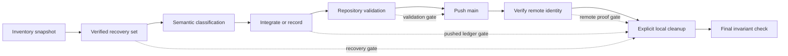

# OPS-006 Design: No-Loss Local Git Reconciliation

**Claim Source:** interpreted

**Interpretation:** This design derives from `objective.md`, `runbook.md`, and
the named Smackerel contracts. It records no reconciliation execution claim.

## Design Brief

### Current State

`objective.md` supplies an inventory baseline for local Git objects, ignored
work, generated output, runtime residue, and tracked open work. `runbook.md`
defines a safe procedural sequence, but execution has not classified any item.

Smackerel already separates generic product contracts from target-specific
deployment configuration. That boundary is encoded in `deploy/contract.yaml`,
`deploy/compose.deploy.yml`, and `scripts/commands/deploy_target.sh`.

### Target State

The reconciliation uses a monotonic, phase-gated workflow. Every item becomes
recoverable before semantic review, and every disposition reaches pushed
`main` before local cleanup starts.

The workflow ends only after explicit cleanup and a fresh invariant check.
Unreachable Git objects may expire naturally after the workflow ends.

### Patterns To Follow

- Use the final invariants and disposition vocabulary from `objective.md` and
  `runbook.md`.
- Use one verified Git bundle for refs and one verified archive for ignored
  filesystem items.
- Use `deploy/contract.yaml` as the generic build and deploy contract.
- Use fail-loud interpolation from `deploy/compose.deploy.yml`.
- Keep target resolution delegated through
  `scripts/commands/deploy_target.sh`.
- Validate runtime changes only through `./smackerel.sh`.

### Patterns To Avoid

- Do not infer value from a filename, tag name, timestamp, or commit subject.
- Do not publish archive tags as a substitute for integration.
- Do not copy target-specific configuration into the product repository.
- Do not commit generated `dist` output when tracked sources can reproduce it.
- Do not treat tracked nonterminal work as disposable residue.
- Do not use broad cleanup, object pruning, force pushes, or history rewrites.

### Resolved Decisions

- Recovery precedes content review and every destructive operation.
- Semantic classification is separate from cleanup eligibility.
- The pushed `runbook.md` is the durable disposition ledger.
- Integration occurs on a temporary branch based on current `origin/main`.
- Cleanup names each tag, ref, branch, and ignored path explicitly.
- Smackerel retains generic seams only. Concrete target data remains knb-owned.
- Recovery archives stay outside Git and use restrictive access controls.

### Open Questions

- The operator must choose an explicit recovery retention owner and period
  before execution. This design supplies no retention default.

## Purpose And Scope

This design defines the architecture for one bounded reconciliation operation.
It covers Git refs, unreachable commits, ignored files, generated output,
runtime residue, and tracked open work.

The design does not authorize changes during document authoring. A later
execution requires a fresh repository binding and the owner named by the
runbook.

The operation may integrate valid Smackerel work. It may record a durable
disposition for work that should not enter `main`. It may remove reviewed local
residue only after the remote disposition record exists.

The operation must not change foreign certification state. It must not edit
knb-owned configuration. It must not change remote tags or rewrite remote
history.

## Architecture Overview

The design uses two independent safety planes.

1. The recovery plane protects Git objects and ignored filesystem content.
2. The disposition plane explains what each item means and what happens next.

Neither plane can substitute for the other. A backup without a disposition
leaves unexplained work. A disposition without a verified backup risks loss.



The workflow is fail-closed. A failed gate preserves the recovery material and
stops all later mutations.

## Phase Architecture

| Phase | Required input | Durable output | Exit gate |
|---|---|---|---|
| Inventory | Fresh remote observation and supplied baseline | Complete `InventorySnapshot` | Every branch, worktree, stash, tag, unreachable commit, and ignored path has an item identifier |
| Recovery | Complete inventory | Verified Git bundle, verified ignored-item archive, and recovery metadata | Every inventoried item maps to a verified recovery artifact |
| Semantic classification | Verified recovery set | One disposition class per item with evidence | No item remains unclassified, and dependency relationships are recorded |
| Integrate or record | Classified items | Coherent integration commits or durable non-integration rows in `runbook.md` | Every item has an integration target or a complete recorded reason |
| Validation | Integrated branch and completed ledger | Current-session validation record | All affected checks and the full runbook validation chain succeed |
| Push | Validated branch based on current remote | Pushed `main` and remote identity receipt | Local, remote-tracking, and remote `main` identities match |
| Explicit cleanup | Verified push and verified recovery set | Per-item cleanup record | Only reviewed names and paths were removed |
| Final invariants | Cleanup record | Final invariant report | Every invariant in `objective.md` holds |

Remote movement invalidates the validation gate. The workflow must reconcile
against the new base and repeat validation before push.

## Reconciliation State Model

Each item has a lifecycle state and one semantic disposition. These concepts
must remain separate.

### Lifecycle States

```text
DISCOVERED
  -> RECOVERED
  -> REVIEWED
  -> CLASSIFIED
  -> INTEGRATED_OR_RECORDED
  -> VALIDATED
  -> PUSHED
  -> CLEANUP_APPROVED
  -> CLEANED
  -> INVARIANT_CONFIRMED
```

An item cannot skip `RECOVERED`. An item cannot enter `CLEANUP_APPROVED` until
its disposition exists on verified remote `main`.

A failed review returns the whole workflow to a non-destructive stopped state.
It does not erase the recovery material or previous evidence.

### Semantic Dispositions

The workflow uses the closed vocabulary from `runbook.md`.

| Disposition | Meaning | Required durable record |
|---|---|---|
| `INTEGRATED` | Unique work remains valid | Source provenance, integrating commit, affected paths, and validation record |
| `REPRESENTED` | Current `main` already carries the same intent | Concrete equivalence evidence and the representing path or commit |
| `SUPERSEDED` | A newer tracked decision or implementation replaces the item | Superseding path or commit and semantic reason |
| `ARCHIVED` | The item has historical value without a current runtime role | Recovery artifact identity, digest, access owner, and retention decision |
| `DISCARDED` | The item is generated, stale, invalid, or safely reproducible | Semantic reason, recovery artifact identity, and cleanup approval |
| `ROUTE_REQUIRED` | Valid work belongs to another owner | Preserved source, next owner, and one exact action |

No filename pattern selects a disposition automatically. Classification must
use content, current contracts, ownership, tests, and provenance.

## Reconciliation Ledger

No new database or sidecar state file is required. The execution owner expands
the existing review tables and closeout record in `runbook.md`.

Each item row must contain these fields.

| Field | Contract |
|---|---|
| `itemId` | Exact tag name, Git object identity, or repository-relative ignored path |
| `kind` | `tag`, `dangling_commit`, `tagged_content`, `ignored_config`, `provider_migration`, `dist_output`, `session_state`, `runtime_state`, or `open_work` |
| `inventorySource` | The snapshot that discovered the item |
| `recoveryArtifact` | Git bundle or ignored-item archive identity |
| `recoveryDigest` | Observed digest for the recovery artifact |
| `dependencyIds` | Parent commits or related items that constrain review order |
| `ownershipClass` | `SMACKEREL_GENERIC`, `KNB_CONCRETE`, `FOREIGN_ARTIFACT`, `GENERATED`, or `RUNTIME_LOCAL` |
| `sensitivityClass` | Redacted finding class only, never sensitive content |
| `semanticEvidence` | Commit graph, path comparison, contract reference, or reproducibility evidence |
| `disposition` | Exactly one closed-vocabulary disposition |
| `retainedLocation` | Integrating path or protected recovery locator, when applicable |
| `integratingCommit` | Resulting `main` commit only for integrated work |
| `nextOwner` | Required for routed or open work |
| `nextAction` | One bounded action with no vague continuation language |
| `cleanupState` | `BLOCKED`, `APPROVED`, or `REMOVED` |

The ledger must never copy secret values, private content, or concrete target
configuration. It records redacted finding classes and protected locators.

## Recovery Plane

### Git Object Recovery

Create temporary recovery refs for every supplied unreachable commit before
building the bundle. This step makes bundle coverage independent of object
reachability timing.

The bundle must include all current local refs, local tags, and temporary
recovery refs. Verification must prove that every inventoried Git item appears
in the bundle's listed heads or reachable object graph.

Annotated tags need both the tag object and the peeled target. Lightweight tags
need the target identity. The recovery record must preserve this distinction.

The bundle remains external to the repository. Its digest, access owner, and
retention decision enter the ledger without exposing its contents.

### Ignored Filesystem Recovery

Build the ignored-item archive from an explicit reviewed path manifest. Do not
archive the repository root, use globs, or infer paths from directory names.

The archive must cover ignored config, provider migration scripts, generated
outputs, session residue, and runtime residue found by the inventory. Archive
verification lists names only and does not print file bodies.

The ignored-item archive remains external to Git. Its digest and coverage map
must exist before any ignored item is removed.

### Recovery Completeness Gate

Recovery is complete only when both conditions hold.

1. Every Git item resolves through the verified bundle.
2. Every ignored path resolves through the verified filesystem archive.

An item with no recovery mapping blocks semantic classification and cleanup.

## Semantic Classification

Classification asks whether the current system still needs the item's intent.
It does not ask whether the bytes differ.

Review Git commits in parent-before-child order. Group commits only when their
dependency graph proves they form one coherent series.

For each candidate, compare these dimensions.

- Intended behavior and affected ownership boundary
- Current tracked implementation and specification
- Contract and schema compatibility
- Test coverage and current validation requirements
- Secret, PII, and target-specific content risk
- Whether current `main` represents or supersedes the intent
- Whether generated content can be reproduced from tracked sources

Patch similarity can support a decision. It cannot prove semantic equivalence
by itself.

## Item-Specific Handling

### Archive Tags And Tagged-Only Content

Review every local tag before cleanup. Record its exact name, object type,
target, unique reachable commits, and purpose.

Do not publish local archive tags. The pushed disposition ledger and external
bundle preserve provenance without adding remote refs.

Tagged-only handoff content requires a current-ownership review. If its action
remains valid, transfer the action and provenance into the next-session handoff
table. Integrate the file only when its location and ownership remain current.

If current tracked artifacts supersede the handoff, record those artifacts and
the semantic reason. The bundle remains the historical source.

### Dangling Commits

Protect each commit with a temporary recovery ref before bundle creation.
Inspect metadata, changed paths, parent graph, semantic diff, and current-main
overlap without exposing sensitive content.

Integrate a valid series in dependency order. Preserve original commit
provenance in each integration commit.

Use `REPRESENTED` only when current paths or commits prove equivalent behavior.
Use `SUPERSEDED` only when a named current artifact replaces the old intent.

Delete temporary recovery refs only after the pushed ledger and remote identity
checks both succeed.

### Ignored Configuration

Classify ignored configuration by ownership before reviewing values.

A generic Smackerel contract may define required keys, types, validation, and
fail-loud placeholders. It must not contain a real target value.

Concrete target configuration belongs to knb. Preserve it in the protected
archive and route it to the knb owner with redacted metadata.

If recovered target configuration reveals a missing generic seam, split the
work into two records. Route the concrete value to knb. Integrate the generic
schema or validation change only when an existing Smackerel plan authorizes it.

Local overrides remain untracked. A reusable example may expose required field
names only. It must not provide a hidden default or real local value.

### Provider Migration Scripts

Review every temporary provider migration script separately. Determine whether
it changes provider data, provider configuration, schemas, or only generated
artifacts.

Provider-to-provider data movement conflicts with the active non-goals in
`specs/038-cloud-drives-integration/spec.md` and
`specs/040-cloud-photo-libraries/spec.md`. Such a script cannot enter `main`
through OPS-006. Preserve it and route the capability decision to the planning
owner.

A provider schema or contract migration may integrate only when a tracked spec
already authorizes the behavior. Move valid logic into the existing owning
package and add tests there. Do not retain a temporary script as a parallel
production path.

A Python script that accesses product datastores, queues, or provider
credentials violates the compute-only Python boundary. Preserve its intent,
then route implementation to the owning Go surface.

A script that contains target endpoints, account identifiers, credentials, or
host paths is knb-owned or operator-local. Archive it with restrictive access
and record a redacted `ROUTE_REQUIRED` disposition.

Classification must not execute a migration against a live provider. Later
validation uses owned fixtures and the repository's declared test surfaces.

### Ignored `dist` Outputs

Identify the tracked source and repository command for each output. Rebuild
through `./smackerel.sh` before claiming reproducibility.

Compare deterministic outputs by digest. Compare nondeterministic packages by
manifest, file inventory, and behavior. A byte difference alone does not prove
unique source work.

Integrate missing source, build configuration, or tests rather than generated
output. Keep generated output ignored.

If no tracked source can reproduce a valuable output, classify it as
`ARCHIVED` or `ROUTE_REQUIRED`. Do not promote generated bytes into source by
default.

### Session And Runtime State

Identify the owning process and lifecycle command for every state file. Confirm
that no active process uses the item before cleanup approval.

Framework-managed session state must use its owning lifecycle tool. The
reconciliation must not edit that state by hand.

Runtime state never becomes Git source. Preserve business-critical or
non-reconstructable state through its owning export mechanism. Discard only
reconstructable stale residue with explicit evidence and archive coverage.

Use an owning cleanup action when one exists. Otherwise remove only the exact
reviewed path after push verification.

### Tracked Open Work

Tracked nonterminal specs and bugs remain on `main`. They are product planning
state, not local reconciliation residue.

Resolve terminal status through the committed mode-aware helper. Do not infer
terminality from a literal status string.

Record each nonterminal path, current status, workflow mode, next owner, and
exact next action in the pushed handoff table. Do not change execution or
certification fields.

Unknown ownership produces `ROUTE_REQUIRED`. It does not grant edit authority.

## Smackerel And knb Ownership Boundary

The reconciliation must preserve the product deployment boundary.

| Surface | Smackerel owns | knb owns |
|---|---|---|
| Product configuration | Required generic keys, types, policy, and fail-loud validation in `config/smackerel.yaml` | Concrete target values and operator selections |
| Config generation | Generic generation and placeholder contracts in `scripts/commands/config.sh` | Substitution from the target's protected secret source |
| Deployment contract | Artifact, bundle, signing, and rollout capabilities in `deploy/contract.yaml` | Per-target manifest pointers and parameter choices |
| Deploy Compose | Generic services and required interpolation in `deploy/compose.deploy.yml` | Host binding, resource envelope, paths, and enabled target profiles |
| Dispatch | Strict delegation in `scripts/commands/deploy_target.sh` | Target action scripts and concrete status checks |
| Host integration | Generic extension points and documentation | Host identity, reverse proxy, firewall, service manager, and storage topology |
| Provider access | Provider-neutral contracts and required secret placeholders | Concrete credentials, account bindings, and target endpoints |

OPS-006 may modify only Smackerel-owned surfaces during later execution. A
knb-owned candidate remains in protected recovery and receives a routed record.

The ledger may name the knb ownership class and destination artifact type. It
must not copy concrete knb values into Smackerel.

## Integrate And Record

Create the temporary integration branch from current `origin/main`. Do not use
the supplied inventory commit as a base when the remote has moved.

Integrate one coherent unit at a time. Preserve commit provenance for recovered
Git work. Preserve source archive identity for recovered ignored work.

Each integration unit must update its item rows in `runbook.md`. The ledger
commit must not lag behind the code it describes.

Non-integrated work still requires a pushed ledger row. The row must include
the classification, evidence, recovery locator, and owner action when needed.

The change boundary excludes unrelated cleanup, foreign planning edits,
certification changes, knb files, generated outputs, and remote tags.

## Validation Strategy

The design introduces no runtime service. Validation proves the reconciliation
contract and any recovered behavior that enters `main`.

Run the narrowest affected Smackerel CLI check after each integration unit.
Run the complete validation chain declared in `runbook.md` before push.

| Scenario | Validation type | Required assertion |
|---|---|---|
| Inventory changes after recovery starts | Adversarial operational check | The new item enters the ledger and cleanup remains blocked |
| Git object recovery | Recovery integration check | Every protected ref and tag resolves from the verified bundle |
| Ignored-item recovery | Recovery integration check | Every explicit archived path appears in the verified archive |
| Secret or PII is detected | Security negative check | Integration stops, values remain undisclosed, and cleanup remains blocked |
| Similar patch has different intent | Semantic adversarial review | The item is not marked `REPRESENTED` without current behavioral evidence |
| Provider migration exceeds active specs | Ownership and scope check | The item becomes `ROUTE_REQUIRED` and remains recoverable |
| Generated output is reproducible | Build integration check | Tracked sources reproduce the declared output contract through `./smackerel.sh` |
| Runtime residue is active | Lifecycle negative check | Cleanup stops until the owning process releases the state |
| Remote moves before push | Concurrency check | Integration rebases onto current remote and repeats full validation |
| Push is rejected | Remote safety check | The workflow fetches and reconciles without force |
| Cleanup starts before remote proof | Ordering adversarial check | Cleanup refuses because the pushed disposition gate is absent |
| Final state | End-to-end operational check | Every objective invariant and ledger completeness rule holds together |

Validation output becomes evidence only when a later execution captures current
session results. This design does not predeclare any result.

## Push Contract

Push only the reconciled `main` branch. Do not push tags or temporary recovery
refs.

Advance local `main` by fast-forward only. A remote movement requires another
fetch, semantic conflict review, and full validation pass.

After push, compare local `main`, remote-tracking `main`, and the remote branch
identity. Any mismatch blocks cleanup.

The push receipt records identities and command outcomes in `runbook.md`. It
contains no credentials or local environment details.

## Explicit Cleanup Contract

Cleanup is a separate phase, not a side effect of classification.

The cleanup plan lists every approved local tag, temporary recovery ref,
temporary branch, and ignored path. Wildcards are forbidden.

Cleanup may start only when these gates hold.

1. Both recovery artifacts still verify.
2. Every item has a pushed disposition row.
3. All integrated work exists on verified remote `main`.
4. No active process owns an ignored runtime item.
5. The cleanup plan contains exact names and paths.

Do not prune unreachable objects. Do not expire reflogs. Let Git apply its
normal retention policy after local references are removed.

Keep the external recovery artifacts under the explicit retention decision.
Their later disposal is not part of repository cleanup.

## Final Invariant Contract

The final check must prove all conditions together.

- `main` is the only local branch.
- Exactly one worktree exists.
- No stash exists.
- No local tag exists.
- The tracked worktree is clean.
- Local and remote `main` identities match.
- Every supplied unreachable commit has a pushed disposition.
- Every inventoried ignored item has a pushed disposition.
- Every retained change exists on remote `main`.
- Every nonterminal spec and bug has an actionable pushed handoff.
- Every cleanup action names an item from the pushed ledger.
- Both recovery artifacts remain verifiable.
- No secret, PII, concrete target value, or local identity entered the repository.

Empty output is interpreted only with the corresponding command exit status.
No invariant may rely on silence alone.

## Security And Compliance

Review candidate names before candidate bodies. Inspect only the smallest
content slice needed for classification.

Do not emit file bodies from suspected config, credential, session, or provider
files. Record only redacted finding classes.

A secret finding stops integration. The operator must rotate or revoke the
credential before that item can leave the blocked state.

A PII or concrete target finding cannot enter generic Smackerel history.
Preserve it only in the protected recovery set and route it to its owner.

Recovery artifacts require restrictive permissions and an access owner. They
must remain outside repositories and synchronization services.

## Observability And Failure Handling

The operation emits phase events for operator visibility. Events contain safe
metadata only.

| Event field | Meaning |
|---|---|
| `phase` | Current closed-vocabulary phase |
| `itemId` | Safe item identifier or redacted path token |
| `stateBefore` | Previous lifecycle state |
| `stateAfter` | New lifecycle state |
| `disposition` | Semantic class when assigned |
| `outcome` | `OK`, `BLOCKED`, or `REFUSED` |
| `reasonCode` | Closed failure code |

The operation must not emit file content, environment values, credentials,
concrete target values, or archive contents.

| Failure code | Condition | Required response |
|---|---|---|
| `R001_INVENTORY_DRIFT` | Current inventory differs from the ledger | Add items and restart recovery coverage |
| `R002_RECOVERY_UNVERIFIED` | A bundle or archive check fails | Stop before review or mutation |
| `R003_SENSITIVE_CONTENT` | Secret, PII, or private target data appears | Stop, protect, notify, and route |
| `R004_UNCLASSIFIED_ITEM` | An item has no semantic disposition | Block integration and cleanup |
| `R005_OWNERSHIP_ROUTE` | Valid work belongs elsewhere | Preserve and route to the named owner |
| `R006_VALIDATION_FAILED` | An affected check fails | Repair the integration unit and repeat validation |
| `R007_REMOTE_MOVED` | Remote `main` changes | Reconcile onto the new base and revalidate |
| `R008_PUSH_UNVERIFIED` | Remote identity cannot be proven | Keep all local refs and residue |
| `R009_CLEANUP_BLOCKED` | A cleanup prerequisite is absent | Stop cleanup without partial broad deletion |
| `R010_FINAL_INVARIANT_FAILED` | Final state violates any invariant | Preserve recovery material and report the exact gap |

## Rollback And Recovery

Before local `main` advances, abandon the temporary integration branch when
needed. Keep both recovery artifacts.

After local `main` advances but before push, preserve the rejected work through
the temporary branch or bundle. Do not move `main` backward without explicit
operator approval.

After push, use new revert commits for faulty integration. Never rewrite remote
history.

Restore a deleted ignored item only from the verified archive. Restore a tag or
commit only from the verified bundle. Restoration does not publish the item.

## Configuration, Migrations, And Rollout

This design introduces no runtime configuration key, database migration, or
service rollout.

A recovered migration is an item for semantic classification. It cannot run or
enter `main` merely because its file name contains `migration`.

The reconciliation rolls out through a temporary branch, full validation,
fast-forward local integration, normal push, verified remote identity, and
explicit cleanup.

### Single-Implementation Justification

OPS-006 is one bounded repository reconciliation operation. Its item handlers
share one ledger and one safety state machine. A provider or plugin framework
would add permanent code without a second runtime implementation.

## Alternatives And Tradeoffs

| Alternative | Decision | Reason |
|---|---|---|
| Delete ignored files and local refs after a quick inspection | Rejected | Inspection alone does not provide recoverability or a pushed disposition |
| Publish archive tags to preserve commits | Rejected | It exposes private local history and adds remote refs without semantic integration |
| Copy all unique bytes into `main` | Rejected | Byte uniqueness does not prove current validity, ownership, or testability |
| Store recovery archives inside the repository | Rejected | Archives may contain ignored private data and do not belong in Git history |
| Use one archive for Git objects and files | Rejected | Git bundles and filesystem archives have different integrity and restore contracts |
| Automate this as a general plugin system | Rejected | A one-run ops packet does not justify a permanent extension framework |

## Complexity Tracking

| Decision | Simpler alternative considered | Why rejected |
|---|---|---|
| Two recovery artifacts | One combined filesystem archive | A generic archive cannot preserve Git refs and object graph semantics safely |
| Temporary refs for unreachable commits | Bundle currently reachable refs only | Unreachable commits could be omitted before semantic review |
| Pushed per-item ledger before cleanup | Keep a local review note | A local note disappears with the state it explains and cannot support audit |
| Full revalidation after remote movement | Push the previously validated branch | Validation against an old base does not prove the final integrated state |

## Risks And Open Questions

| Risk | Control |
|---|---|
| Semantic false equivalence loses valid intent | Require named current behavior and tests before `REPRESENTED` |
| Sensitive ignored content leaks during review | Review names first, restrict output, and stop on secret or PII findings |
| A child commit is integrated without its parent | Record dependency IDs and review parent before child |
| Generated output hides missing source | Rebuild through the repository CLI and integrate source rather than output |
| Active runtime state is removed | Require process ownership and lifecycle checks before cleanup approval |
| Concrete deployment data enters Smackerel | Enforce the Smackerel and knb ownership table before staging |
| Remote movement invalidates evidence | Reconcile onto current remote and repeat the full validation chain |
| Recovery material persists without an owner | Require an explicit access owner and retention period before execution |

The exact item classifications remain execution-time facts. They are not open
architecture decisions and must not be guessed during design authoring.

## References

- `specs/_ops/OPS-006-local-git-reconciliation/objective.md`
- `specs/_ops/OPS-006-local-git-reconciliation/runbook.md`
- `deploy/README.md`
- `deploy/contract.yaml`
- `deploy/compose.deploy.yml`
- `scripts/commands/deploy_target.sh`
- `docs/Deployment.md`
- `specs/038-cloud-drives-integration/spec.md`
- `specs/040-cloud-photo-libraries/spec.md`